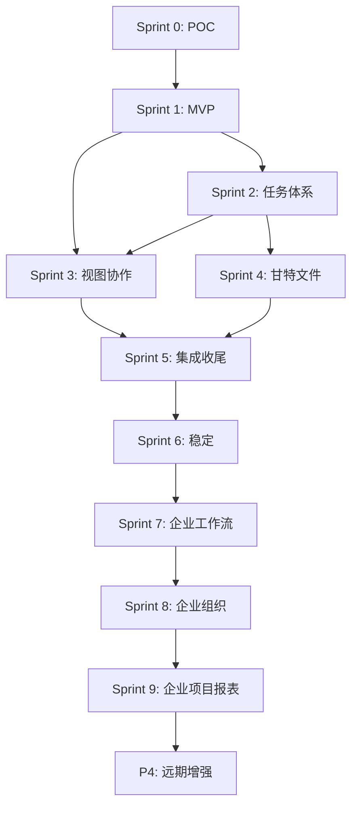
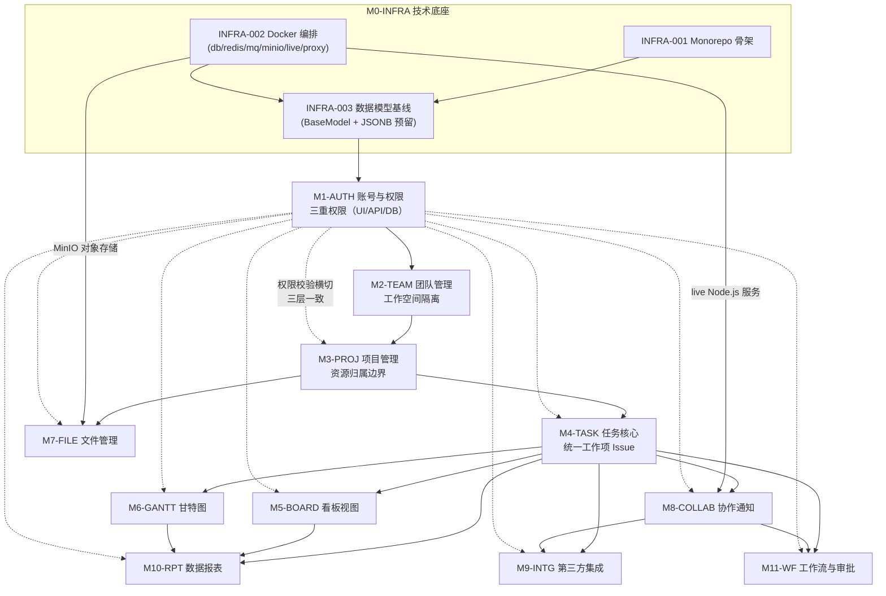
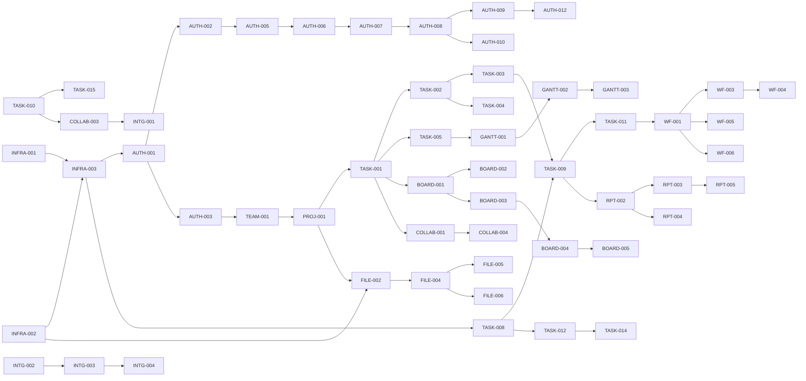
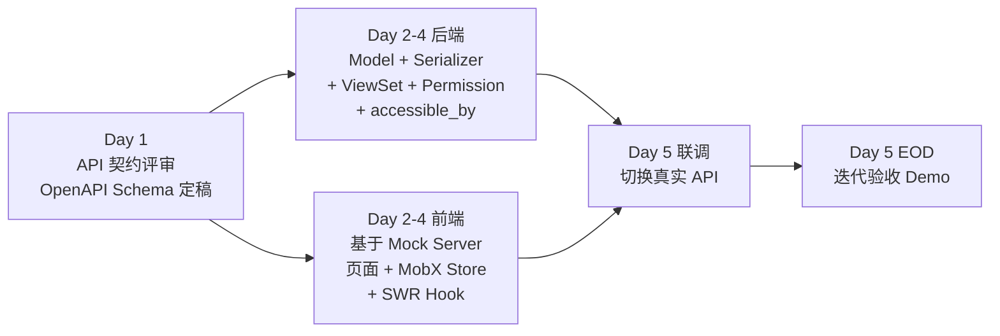

# 模块依赖关系图

> 适用范围：本文档定义全系统 9 大核心模块（+ 5 个横切 / 扩展模块）的依赖拓扑、82 份设计文档（7 份架构文档 + 75 份功能文档）之间的功能级依赖、迭代间依赖顺序与并行开发策略。是排期编排与「上游未稳定不开发下游」纪律的执行依据。
>
> 配套文档：[三重权限模型设计](./rbac-permission-model.md)

---

## 1. 九大核心模块概览

### 1.1 核心模块

| 模块代码 | 模块名称 | 职责概述 | 标准版文档数 | 企业 / 远期文档数 |
| --- | --- | --- | :-: | :-: |
| M1-AUTH | 账号与权限 | 全站身份认证、RBAC、数据隔离 | 6 | 6 |
| M2-TEAM | 团队管理 | 多团队隔离、成员管理、配置 | 3 | 0 |
| M3-PROJ | 项目管理 | 项目全生命周期 | 3 | 1 |
| M4-TASK | 任务核心 | 统一工作项、工作流、审批 | 11 | 4 |
| M5-BOARD | 看板视图 | 可视化拖拽任务流 | 4 | 1 |
| M6-GANTT | 甘特图 | 进度可视化、依赖管控 | 2 | 1 |
| M7-FILE | 文件管理 | 项目文件库、版本管理 | 4 | 2 |
| M8-COLLAB | 协作通知 | 实时协作、消息、评论 | 4 | 0 |
| M9-INTG | 第三方集成 | GitHub/Slack/Zoom/API | 2 | 2 |

### 1.2 横切支撑模块

九大核心模块之外，另有 5 个横切 / 扩展模块承载技术底座、数据消费、企业工作流、AI 与质量保障，同样产出功能文档：

| 模块代码 | 模块名称 | 职责概述 | 标准版文档数 | 企业 / 远期文档数 |
| --- | --- | --- | :-: | :-: |
| M0-INFRA | 技术底座与部署运维 | Monorepo 骨架、Docker 编排、数据模型基线、API 规范、部署与限流 | 5 | 1 |
| M10-RPT | 数据报表 | 个人/项目统计、敏捷报表、数据大屏 | 2 | 3 |
| M11-WF | 企业工作流与审批 | 工作流、审批与自动化规则 | 0 | 6 |
| M12-AI | AI 辅助能力 | 摘要、预警与内容生成 | 0 | 1 |
| M13-QA | 质量保障 | 稳定性、性能与权限加固 | 1 | 0 |

### 1.3 文档台账（共 82 份）

以 [`docs/README.md`](../README.md) §4 索引为唯一口径：共 7 份架构文档与 75 份功能文档。功能文档 ID 一经分配不可复用、不可重排。

#### 架构文档（7）

| 文档 | 标题 | 迭代 |
| --- | --- | :-: |
| `architecture/tech-stack.md` | 技术栈确认与版本锁定 | 前置 |
| `architecture/monorepo-structure.md` | Monorepo 仓库结构规范 | 前置 |
| `architecture/api-conventions.md` | REST API 统一规范 | 前置 |
| `architecture/unified-issue-model.md` | 统一工作项模型设计 | 前置 |
| `architecture/dynamic-fields-design.md` | 动态自定义字段技术方案 | 前置 |
| `architecture/rbac-permission-model.md` | 三重权限模型设计 | 前置 |
| `architecture/dependency-graph.md` | 模块依赖关系图 | 前置 |

#### 功能文档 ID 统计（75）

| 前缀 | 模块 | 编号区间 | 份数 |
| --- | --- | --- | :-: |
| `INFRA-` | M0-INFRA | 001 ~ 006 | 6 |
| `AUTH-` | M1-AUTH | 001 ~ 012 | 12 |
| `TEAM-` | M2-TEAM | 001 ~ 003 | 3 |
| `PROJ-` | M3-PROJ | 001 ~ 004 | 4 |
| `TASK-` | M4-TASK | 001 ~ 015 | 15 |
| `WF-` | M11-WF | 001 ~ 006 | 6 |
| `BOARD-` | M5-BOARD | 001 ~ 005 | 5 |
| `GANTT-` | M6-GANTT | 001 ~ 003 | 3 |
| `FILE-` | M7-FILE | 001 ~ 006 | 6 |
| `COLLAB-` | M8-COLLAB | 001 ~ 004 | 4 |
| `INTG-` | M9-INTG | 001 ~ 004 | 4 |
| `RPT-` | M10-RPT | 001 ~ 005 | 5 |
| `AI-` | M12-AI | 001 | 1 |
| `QA-` | M13-QA | 001 | 1 |
| **功能文档合计** | | | **75** |
| **含架构文档合计** | | | **82** |

#### M0-INFRA｜技术底座与部署运维（6）

| 文档 ID | 文档名称 | 优先级 | 迭代 |
| --- | --- | :-: | :-: |
| `INFRA-001` | Monorepo 工程骨架搭建 | P0 | Sprint 0 |
| `INFRA-002` | Docker Compose 全套服务编排 | P0 | Sprint 0 |
| `INFRA-003` | Django ORM 初始数据模型 | P0 | Sprint 0 |
| `INFRA-004` | 统一返回格式 / 全局错误 / 环境配置 | P1 | Sprint 1 |
| `INFRA-005` | 接口限流 / 数据备份 / 生产部署 | P2 | Sprint 6 |
| `INFRA-006` | 高可用集群与私有化部署 | P4 | 远期 |

#### M1-AUTH｜账号与权限（12）

| 文档 ID | 文档名称 | 优先级 | 迭代 |
| --- | --- | :-: | :-: |
| `AUTH-001` | 邮箱注册 / 登录 / 退出 | P0 | Sprint 0 |
| `AUTH-002` | 前端路由拦截 + 后端鉴权 | P0 | Sprint 0 |
| `AUTH-003` | 最小权限隔离 | P0 | Sprint 0 |
| `AUTH-004` | 个人信息修改与密码重置 | P1 | Sprint 1 |
| `AUTH-005` | 按钮级权限 + 接口二次鉴权 | P1 | Sprint 1 |
| `AUTH-006` | 数据库行级隔离与成员权限分配 | P2 | Sprint 5 |
| `AUTH-007` | 部门层级组织架构 | P3 | Sprint 8 |
| `AUTH-008` | 自定义角色组与细粒度资源权限 | P3 | Sprint 8 |
| `AUTH-009` | 全量操作审计日志 | P3 | Sprint 8 |
| `AUTH-010` | SSO 单点登录 | P3 | Sprint 8 |
| `AUTH-011` | LDAP / SCIM 账号同步 | P4 | 远期 |
| `AUTH-012` | 多租户隔离与风控告警溯源 | P4 | 远期 |

#### M2-TEAM｜团队管理（3）

| 文档 ID | 文档名称 | 优先级 | 迭代 |
| --- | --- | :-: | :-: |
| `TEAM-001` | 团队创建 / 查询 / 默认初始化 | P0 | Sprint 0 |
| `TEAM-002` | 团队成员邀请 / 移除 / 角色分配 | P1 | Sprint 1 |
| `TEAM-003` | 团队归档与全局模板配置 | P2 | Sprint 5 |

#### M3-PROJ｜项目管理（4）

| 文档 ID | 文档名称 | 优先级 | 迭代 |
| --- | --- | :-: | :-: |
| `PROJ-001` | 项目 CRUD | P0 | Sprint 0 |
| `PROJ-002` | 项目成员管理与搜索收藏 | P1 | Sprint 1 |
| `PROJ-003` | 项目生命周期与动态时间线 | P2 | Sprint 5 |
| `PROJ-004` | 项目集 / 项目组合与跨项目依赖 | P3 | Sprint 9 |

#### M4-TASK｜任务核心（15）

| 文档 ID | 文档名称 | 优先级 | 迭代 |
| --- | --- | :-: | :-: |
| `TASK-001` | 任务 CRUD（5 固定字段） | P0 | Sprint 0 |
| `TASK-002` | 任务扩展属性与一级子任务 | P1 | Sprint 1 |
| `TASK-003` | 任务列表筛选 / 搜索 / 排序 | P1 | Sprint 1 |
| `TASK-004` | 多层级子任务与进度联动 | P2 | Sprint 2 |
| `TASK-005` | 任务前置 / 后置依赖关系 | P2 | Sprint 2 |
| `TASK-006` | 工时估算与工时填报 | P2 | Sprint 2 |
| `TASK-007` | 多执行人 / 任务转交 / 认领 | P2 | Sprint 2 |
| `TASK-008` | 基础自定义字段动态增删 | P2 | Sprint 2 |
| `TASK-009` | 全字段组合筛选器与视图保存 | P2 | Sprint 2 |
| `TASK-010` | 任务复制 / 归档 / 全量操作日志 | P2 | Sprint 2 |
| `TASK-011` | 任务类型字段模板与需求池 | P2 | Sprint 3 |
| `TASK-012` | 高级自定义字段与字段权限 | P3 | Sprint 7 |
| `TASK-013` | 团队工时统计与工时管控 | P3 | Sprint 7 |
| `TASK-014` | 公式 / 级联 / 跨项目关联字段 | P4 | 远期 |
| `TASK-015` | 任务基线与版本对比 | P4 | 远期 |

#### M11-WF｜企业工作流与审批（6）

| 文档 ID | 文档名称 | 优先级 | 迭代 |
| --- | --- | :-: | :-: |
| `WF-001` | 工作流引擎数据模型与状态机 | P3 | Sprint 7 |
| `WF-002` | 可视化工作流画布编辑器 | P3 | Sprint 7 |
| `WF-003` | 流转条件校验与字段锁定 | P3 | Sprint 7 |
| `WF-004` | 审批流（会签 / 或签 / 逐级 / 驳回） | P3 | Sprint 7 |
| `WF-005` | 自动化规则引擎 | P3 | Sprint 7 |
| `WF-006` | 工作流模板库与全局下发 | P3 | Sprint 7 |

#### M5-BOARD｜看板视图（5）

| 文档 ID | 文档名称 | 优先级 | 迭代 |
| --- | --- | :-: | :-: |
| `BOARD-001` | 固定三列看板 + 拖拽 | P0 | Sprint 0 |
| `BOARD-002` | 看板筛选与卡片悬浮预览 | P1 | Sprint 1 |
| `BOARD-003` | 多个独立看板与列自定义 | P2 | Sprint 3 |
| `BOARD-004` | 视图配置保存与任务批量操作 | P2 | Sprint 3 |
| `BOARD-005` | 视图共享 / 锁定 / 多维度分组 | P3 | Sprint 8 |

#### M6-GANTT｜甘特图进度（3）

| 文档 ID | 文档名称 | 优先级 | 迭代 |
| --- | --- | :-: | :-: |
| `GANTT-001` | 甘特图渲染与日 / 周 / 月粒度 | P2 | Sprint 4 |
| `GANTT-002` | 任务条拖拽 / 依赖连线 / 导出 | P2 | Sprint 4 |
| `GANTT-003` | 关键路径计算与延期预警 | P3 | Sprint 9 |

#### M7-FILE｜文件资源管理（6）

| 文档 ID | 文档名称 | 优先级 | 迭代 |
| --- | --- | :-: | :-: |
| `FILE-001` | 任务级附件上传下载 | P1 | Sprint 1 |
| `FILE-002` | 项目文件库与多层级目录 | P2 | Sprint 4 |
| `FILE-003` | 大文件分片续传与在线预览 | P2 | Sprint 4 |
| `FILE-004` | 文件多版本 / 分享链接 / 权限 | P2 | Sprint 4 |
| `FILE-005` | 项目 Wiki 与全局知识检索 | P3 | Sprint 9 |
| `FILE-006` | 文件水印 / 脱敏 / 合规留存 | P4 | 远期 |

#### M8-COLLAB｜实时协作与通知（4）

| 文档 ID | 文档名称 | 优先级 | 迭代 |
| --- | --- | :-: | :-: |
| `COLLAB-001` | 任务评论 / @提醒 / 通知中心 | P1 | Sprint 1 |
| `COLLAB-002` | 楼中楼回复 / 表情 / 图片评论 | P2 | Sprint 3 |
| `COLLAB-003` | 项目动态流与任务时间线 | P2 | Sprint 3 |
| `COLLAB-004` | WebSocket 实时推送与多人同步 | P2 | Sprint 3 |

#### M9-INTG｜第三方工具集成（4）

| 文档 ID | 文档名称 | 优先级 | 迭代 |
| --- | --- | :-: | :-: |
| `INTG-001` | GitHub 基础集成 | P2 | Sprint 5 |
| `INTG-002` | 基础 Webhook 出站通知 | P2 | Sprint 5 |
| `INTG-003` | 完整 OpenAPI 与应用接入市场 | P4 | 远期 |
| `INTG-004` | Slack / Zoom 全量集成 | P4 | 远期 |

#### M10-RPT｜数据报表（5）

| 文档 ID | 文档名称 | 优先级 | 迭代 |
| --- | --- | :-: | :-: |
| `RPT-001` | 个人待办与已完成统计 | P1 | Sprint 1 |
| `RPT-002` | 项目进度与成员任务量统计 | P2 | Sprint 5 |
| `RPT-003` | 燃尽图 / 迭代速率 / 累积流图 | P3 | Sprint 9 |
| `RPT-004` | 团队负载 / 项目健康度 / 报表导出 | P3 | Sprint 9 |
| `RPT-005` | 企业数据大屏与自定义报表 | P4 | 远期 |

#### M12-AI｜AI 辅助能力（1）

| 文档 ID | 文档名称 | 优先级 | 迭代 |
| --- | --- | :-: | :-: |
| `AI-001` | AI 辅助能力（摘要 / 预警 / 生成） | P4 | 远期 |

#### M13-QA｜质量保障（1）

| 文档 ID | 文档名称 | 优先级 | 迭代 |
| --- | --- | :-: | :-: |
| `QA-001` | 缺陷修复 / 性能优化 / 权限加固 | — | Sprint 6 |

---

## 2. 迭代间依赖关系图



### 2.1 迭代-文档归属矩阵

| 迭代 | 周期 | 覆盖文档 ID | 份数 | 阻塞前置迭代 |
| --- | --- | --- | :-: | --- |
| Sprint 0：POC 技术验证 | 第 1-2 周 | `INFRA-001` `INFRA-002` `INFRA-003` `AUTH-001` `AUTH-002` `AUTH-003` `TEAM-001` `PROJ-001` `TASK-001` `BOARD-001` | 10 | —— |
| Sprint 1：MVP 能力补齐 | 第 3 周 | `AUTH-004` `AUTH-005` `TEAM-002` `PROJ-002` `TASK-002` `TASK-003` `BOARD-002` `FILE-001` `COLLAB-001` `RPT-001` `INFRA-004` | 11 | Sprint 0 |
| Sprint 2：任务体系完善 | 第 4 周 | `TASK-004` `TASK-005` `TASK-006` `TASK-007` `TASK-008` `TASK-009` `TASK-010` | 7 | Sprint 1 |
| Sprint 3：高级视图 + 实时协作 | 第 5 周 | `BOARD-003` `BOARD-004` `COLLAB-002` `COLLAB-003` `COLLAB-004` `TASK-011` | 6 | Sprint 1、Sprint 2 |
| Sprint 4：甘特图 + 文件管理 | 第 6 周 | `GANTT-001` `GANTT-002` `FILE-002` `FILE-003` `FILE-004` | 5 | Sprint 2 |
| Sprint 5：集成 + 标准版收尾 | 第 7 周 | `INTG-001` `INTG-002` `RPT-002` `PROJ-003` `AUTH-006` `TEAM-003` | 6 | Sprint 3、Sprint 4 |
| Sprint 6：稳定性缓冲 | 第 8 周 | `INFRA-005` `QA-001` | 2 | Sprint 5 |
| Sprint 7：企业工作流核心 | 第 9-10 周 | `WF-001` `WF-002` `WF-003` `WF-004` `WF-005` `WF-006` `TASK-012` `TASK-013` | 8 | Sprint 6 |
| Sprint 8：企业组织权限治理 | 第 11 周 | `AUTH-007` `AUTH-008` `AUTH-009` `AUTH-010` `BOARD-005` | 5 | Sprint 7 |
| Sprint 9：企业项目 + 报表 + Wiki | 第 12 周 | `PROJ-004` `RPT-003` `RPT-004` `FILE-005` `GANTT-003` | 5 | Sprint 8 |
| P4：远期增强 | 第 13 周起 | `AUTH-011` `AUTH-012` `TASK-014` `TASK-015` `INTG-003` `INTG-004` `FILE-006` `AI-001` `RPT-005` `INFRA-006` | 10 | Sprint 9 |
| **功能文档合计** | | | **75** | |

> 7 份架构文档统一归属「前置」，不重复计入迭代功能文档份数；含架构文档共 82 份。

### 2.2 迭代依赖的强制性说明

| 依赖边 | 性质 | 不可颠倒的原因 |
| --- | --- | --- |
| S0 → S1 | 硬阻塞 | S1 全部功能建立在 S0 的数据模型、认证会话、项目任务基础表之上 |
| S1 → S2 | 硬阻塞 | S2 的行级过滤依赖 S1 的角色分配；任务高级属性依赖 S1 的基础属性模型 |
| S1 → S3 | 硬阻塞 | 看板筛选与列自定义（S1）是多看板与视图保存（S3）的前提；评论（S1）是楼中楼（S3）的前提 |
| S2 → S3 | 硬阻塞 | 看板批量操作依赖 S2 的批量接口；实时同步的数据载荷需覆盖 S2 的完整任务字段 |
| S2 → S4 | 硬阻塞 | 甘特图依赖 S2 的任务依赖关系与工期字段；文件库依赖 S2 的项目生命周期 |
| S3 → S5 | 软依赖 | GitHub 集成的状态变更需要走通实时推送链路，否则前端不刷新 |
| S4 → S5 | 软依赖 | 标准版功能冻结需要甘特与文件全部落地才能整体压测 |
| S5 → S6 | 硬阻塞 | 稳定性迭代的对象是 S5 冻结后的完整标准版 |
| S6 → S7 | 硬阻塞 | 工作流替换固定状态模型是破坏性变更，必须在标准版稳定后进行 |
| S7 → S8 | 硬阻塞 | 自定义角色组需要工作流的节点权限模型先落地，否则权限维度不完整 |
| S8 → S9 | 硬阻塞 | 项目集 / 私密项目依赖 S8 的组织架构与细粒度权限 |
| S9 → P4 | 软依赖 | P4 全部为增值能力，按商业化节奏排期 |

---

## 3. 模块间依赖关系图



### 3.1 依赖边说明

| 依赖边 | 类型 | 说明 |
| --- | --- | --- |
| INFRA-001 → INFRA-003 | 强依赖 | 数据模型必须在 Monorepo 的 `apps/api` 结构内落地 |
| INFRA-002 → INFRA-003 | 强依赖 | migrations 需要 PostgreSQL 容器就绪才能执行 |
| INFRA-003 → AUTH | 强依赖 | `BaseModel`、`User`、UUID 主键、审计字段是权限模型的载体 |
| **AUTH → 所有模块** | 横切强依赖 | AUTH 是所有模块的基础依赖；任何模块的 ViewSet 都必须挂 Permission 类与 `accessible_by` 过滤 |
| AUTH → TEAM | 强依赖 | `WorkspaceMember` 承载团队成员与角色，团队功能无法脱离权限模型 |
| TEAM → PROJ | 强依赖 | 项目必须归属工作空间（`Project.workspace_id` 非空），项目角色判定要读工作空间角色 |
| PROJ → TASK | 强依赖 | 任务必须归属项目（`Issue.project_id` 非空），任务可见性委托项目可见性 |
| TASK → BOARD | 强依赖 | 看板列映射任务状态，卡片即 Issue，拖拽即改 Issue 状态与排序 |
| TASK → GANTT | 强依赖 | 甘特条即 Issue 的起止时间，依赖连线即 `IssueRelation` |
| PROJ → FILE | 强依赖 | 文件库归属项目，文件权限继承项目成员关系 |
| INFRA-002(MinIO) → FILE | 强依赖 | 预签名直传依赖 MinIO / S3 兼容存储服务 |
| TASK → COLLAB | 强依赖 | 评论、@提醒、动态时间线的宿主实体是 Issue |
| INFRA-002(live) → COLLAB | 强依赖 | WebSocket 推送与 Yjs 协同依赖独立 Node.js live 服务 |
| TASK → INTG | 强依赖 | GitHub Issue 同步的目标是 Issue，PR 关联挂在 Issue 上 |
| COLLAB → INTG | 强依赖 | 集成事件（PR 合并 / Slack 消息）需要通过通知与动态流触达用户 |
| TASK → WF | 强依赖 | 工作流替换 Issue 的固定状态流转，审批挂载在 Issue 上 |
| COLLAB → WF | 强依赖 | 审批待办、超时提醒、自动化通知全部走 COLLAB 的通知通道 |
| TASK/BOARD/GANTT → RPT | 强依赖 | 报表数据源为统一工作项模型及其视图聚合 |

### 3.2 模块耦合度与稳定性

| 模块 | 出度（被依赖） | 入度（依赖他人） | 稳定性要求 |
| --- | :-: | :-: | --- |
| M0-INFRA | 11 | 0 | **最高**。Sprint 0 定型后禁止破坏性变更；`BaseModel` 字段增删需全量回归 |
| M1-AUTH | 10 | 1 | **最高**。权限矩阵变更需同步 UI/API/DB 三层与 CI 一致性测试 |
| M2-TEAM | 8 | 1 | 高。工作空间是多租户边界，`workspace_id` 语义不可变更 |
| M3-PROJ | 7 | 1 | 高。项目是资源归属边界 |
| M4-TASK | 6 | 1 | **最高**。统一工作项模型是全系统数据中枢，Sprint 2 后进入变更冻结 |
| M8-COLLAB | 2 | 2 | 中。通知通道需保持接口稳定供 WF / INTG 调用 |
| M5-BOARD | 1 | 1 | 中 |
| M6-GANTT | 1 | 1 | 中 |
| M7-FILE | 0 | 2 | 低。叶子模块，内部实现可自由重构 |
| M9-INTG | 0 | 2 | 低。叶子模块 |
| M10-RPT | 0 | 3 | 低。纯消费方，只读上游数据 |

**结论**：M0-INFRA / M1-AUTH / M4-TASK 三者是全系统的架构支点，任何变更成本最高，必须在 Sprint 0 / Sprint 1 / Sprint 2 分别做足设计评审与扩展位预留（见 §6）。M7-FILE / M9-INTG / M10-RPT 是叶子模块，可在人力充裕时随时并行插入。


---

## 4. 功能级关键依赖表（全 75 份功能文档）

**读法**：「上游依赖」列出该文档开工前必须已验收通过的文档 ID。`——` 表示无前置（可作为起点并行开工）。同一迭代内的依赖用 *(同迭代)* 标注，表示需在迭代内部排序而非跨迭代阻塞。7 份架构文档是全局前置约束，完整清单见 §1.3。

### 4.1 M0-INFRA｜技术底座（6）

| 下游功能 | 上游依赖 | 依赖说明 |
| --- | --- | --- |
| `INFRA-001`（Monorepo 工程骨架搭建） | —— | 全系统起点，定义目录结构与构建流水线 |
| `INFRA-002`（Docker Compose 全套服务编排） | —— | 与 `INFRA-001` 可并行，只共享环境变量约定 |
| `INFRA-003`（Django ORM 初始数据模型） | `INFRA-001` `INFRA-002` | 模型代码需落在 Monorepo；migrations 需 PostgreSQL 就绪 |
| `INFRA-004`（统一返回格式 / 全局错误 / 环境配置） | `INFRA-003` | 全局异常处理器接管 ORM 与 DRF 异常 |
| `INFRA-005`（接口限流 / 数据备份 / 生产部署） | `INFRA-004` `QA-001` *(同迭代)* | 生产部署基于统一配置，并消费稳定性验证结果 |
| `INFRA-006`（高可用集群与私有化部署） | `INFRA-005` `AUTH-009` | 高可用基于生产部署配置，审计数据纳入私有化留存策略 |

### 4.2 M1-AUTH｜账号与权限（12）

| 下游功能 | 上游依赖 | 依赖说明 |
| --- | --- | --- |
| `AUTH-001`（邮箱注册 / 登录 / 退出） | `INFRA-003` | 需 `User` 模型与 migrations 落地 |
| `AUTH-002`（前端路由拦截 + 后端鉴权） | `AUTH-001` | 前后端鉴权均依赖稳定登录态 |
| `AUTH-003`（最小权限隔离） | `AUTH-001` `INFRA-003` | 最小隔离依赖成员关系与 `created_by` 审计字段 |
| `AUTH-004`（个人信息修改与密码重置） | `AUTH-001` | 复用用户模型、认证与邮件通道 |
| `AUTH-005`（按钮级权限 + 接口二次鉴权） | `AUTH-002` `AUTH-003` `INFRA-004` | 权限矩阵需同时作用于 UI 与 API，并复用统一错误格式 |
| `AUTH-006`（数据库行级隔离与成员权限分配） | `AUTH-005` `TEAM-002` `PROJ-002` | `accessible_by` 依赖完整成员关系与角色分配 |
| `AUTH-007`（部门层级组织架构） | `AUTH-006` | 部门授权建立在行级隔离基线上 |
| `AUTH-008`（自定义角色组与细粒度资源权限） | `AUTH-007` `WF-003` | 自定义角色需完整权限 Key 集合与组织结构 |
| `AUTH-009`（全量操作审计日志） | `AUTH-008` | 审计覆盖细粒度权限与角色变更事件 |
| `AUTH-010`（SSO 单点登录） | `AUTH-008` | SSO 用户落入既有组织与角色体系 |
| `AUTH-011`（LDAP / SCIM 账号同步） | `AUTH-007` `AUTH-010` | 目录同步目标为组织架构，并与企业认证体系衔接 |
| `AUTH-012`（多租户隔离与风控告警溯源） | `AUTH-006` `AUTH-009` | 多租户隔离复用行级过滤，告警溯源消费审计日志 |

### 4.3 M2-TEAM｜团队管理（3）

| 下游功能 | 上游依赖 | 依赖说明 |
| --- | --- | --- |
| `TEAM-001`（团队创建 / 查询 / 默认初始化） | `AUTH-001` `AUTH-003` | 注册后初始化个人团队与成员关系 |
| `TEAM-002`（团队成员邀请 / 移除 / 角色分配） | `TEAM-001` `AUTH-004` `AUTH-005` | 邀请复用邮件通道，角色变更受接口鉴权保护 |
| `TEAM-003`（团队归档与全局模板配置） | `TEAM-002` `TASK-002` | 归档受成员角色约束，模板由任务扩展属性消费 |

### 4.4 M3-PROJ｜项目管理（4）

| 下游功能 | 上游依赖 | 依赖说明 |
| --- | --- | --- |
| `PROJ-001`（项目 CRUD） | `TEAM-001` `AUTH-003` | 项目必须归属工作空间，列表按最小权限隔离 |
| `PROJ-002`（项目成员管理与搜索收藏） | `PROJ-001` `TEAM-002` `AUTH-005` | 项目成员候选范围来自团队成员，管理动作需二次鉴权 |
| `PROJ-003`（项目生命周期与动态时间线） | `PROJ-002` `AUTH-006` `TASK-010` | 动态时间线消费操作日志，生命周期操作受行级隔离保护 |
| `PROJ-004`（项目集 / 项目组合与跨项目依赖） | `PROJ-003` `TASK-005` `AUTH-008` | 跨项目依赖建立在任务依赖与细粒度权限上 |

### 4.5 M4-TASK｜任务核心（15）

| 下游功能 | 上游依赖 | 依赖说明 |
| --- | --- | --- |
| `TASK-001`（任务 CRUD（5 固定字段）） | `PROJ-001` `INFRA-003` | `Issue.project_id` 非空，P0 固定字段与状态模型由初始模型提供 |
| `TASK-002`（任务扩展属性与一级子任务） | `TASK-001` | 扩展基础属性并启用一级父子关系 |
| `TASK-003`（任务列表筛选 / 搜索 / 排序） | `TASK-001` `TASK-002` | 列表查询消费基础字段与扩展属性 |
| `TASK-004`（多层级子任务与进度联动） | `TASK-002` | 在一级子任务基础上增加递归层级与进度聚合 |
| `TASK-005`（任务前置 / 后置依赖关系） | `TASK-001` | 依赖关系以工作项主键建模并执行环检测 |
| `TASK-006`（工时估算与工时填报） | `TASK-001` `TASK-004` | 工时按多层子任务聚合 |
| `TASK-007`（多执行人 / 任务转交 / 认领） | `TASK-001` `PROJ-002` | 候选执行人范围来自项目成员 |
| `TASK-008`（基础自定义字段动态增删） | `INFRA-003` `TASK-001` | 使用初始模型预留的 `custom_fields` JSONB 与 GIN 索引 |
| `TASK-009`（全字段组合筛选器与视图保存） | `TASK-003` `TASK-008` | 筛选器读取内置与动态字段元数据，并持久化视图 DSL |
| `TASK-010`（任务复制 / 归档 / 全量操作日志） | `TASK-004` `TASK-008` `INFRA-004` | 复制覆盖子任务树和动态字段，日志复用统一序列化 |
| `TASK-011`（任务类型字段模板与需求池） | `TASK-008` `TASK-009` | 类型模板建立在动态字段上，需求池复用已保存筛选视图 |
| `TASK-012`（高级自定义字段与字段权限） | `TASK-008` `AUTH-008` | 高级字段扩展基础字段类型，字段权限依赖自定义角色 |
| `TASK-013`（团队工时统计与工时管控） | `TASK-006` `RPT-002` | 复用工时数据与报表聚合口径 |
| `TASK-014`（公式 / 级联 / 跨项目关联字段） | `TASK-012` `PROJ-004` | 公式与级联扩展高级字段，跨项目关联依赖项目集能力 |
| `TASK-015`（任务基线与版本对比） | `TASK-010` `WF-001` | 基线快照消费完整变更日志与工作流版本 |

### 4.6 M11-WF｜企业工作流与审批（6）

| 下游功能 | 上游依赖 | 依赖说明 |
| --- | --- | --- |
| `WF-001`（工作流引擎数据模型与状态机） | `TASK-001` `TASK-011` | 工作流替换固定状态流转，并按任务类型挂载 |
| `WF-002`（可视化工作流画布编辑器） | `WF-001` | 画布编辑工作流引擎定义 |
| `WF-003`（流转条件校验与字段锁定） | `WF-001` `TASK-005` `TASK-006` `AUTH-005` | 条件校验消费依赖、工时与权限体系 |
| `WF-004`（审批流（会签 / 或签 / 逐级 / 驳回）） | `WF-001` `WF-003` `COLLAB-001` | 审批节点复用流转规则，待办与提醒走通知通道 |
| `WF-005`（自动化规则引擎） | `WF-001` `TASK-010` `COLLAB-001` `TASK-007` | 触发器订阅操作日志，动作复用指派与通知能力 |
| `WF-006`（工作流模板库与全局下发） | `WF-001` `TEAM-003` | 模板下发依赖工作流引擎与团队全局模板配置 |

### 4.7 M5-BOARD｜看板视图（5）

| 下游功能 | 上游依赖 | 依赖说明 |
| --- | --- | --- |
| `BOARD-001`（固定三列看板 + 拖拽） | `TASK-001` | 看板列映射任务状态，拖拽更新状态与顺序 |
| `BOARD-002`（看板筛选与卡片悬浮预览） | `BOARD-001` `TASK-002` | 筛选与预览消费任务扩展属性 |
| `BOARD-003`（多个独立看板与列自定义） | `BOARD-001` `TEAM-003` | 自定义列消费团队状态模板 |
| `BOARD-004`（视图配置保存与任务批量操作） | `BOARD-003` `TASK-009` `TASK-010` | 视图保存复用筛选 DSL，批量操作复用任务接口 |
| `BOARD-005`（视图共享 / 锁定 / 多维度分组） | `BOARD-004` `AUTH-008` | 视图锁定与共享依赖细粒度权限 |

### 4.8 M6-GANTT｜甘特图进度（3）

| 下游功能 | 上游依赖 | 依赖说明 |
| --- | --- | --- |
| `GANTT-001`（甘特图渲染与日 / 周 / 月粒度） | `TASK-001` `TASK-005` `TASK-006` | 任务条消费起止时间、依赖与工期数据 |
| `GANTT-002`（任务条拖拽 / 依赖连线 / 导出） | `GANTT-001` `TASK-004` | 拖拽层级与导出依赖完整甘特渲染和子任务树 |
| `GANTT-003`（关键路径计算与延期预警） | `GANTT-002` `PROJ-004` `WF-005` | 关键路径基于依赖图，跨项目汇总依赖项目集，预警走自动化规则 |

### 4.9 M7-FILE｜文件资源管理（6）

| 下游功能 | 上游依赖 | 依赖说明 |
| --- | --- | --- |
| `FILE-001`（任务级附件上传下载） | `TASK-001` `INFRA-004` | 附件挂在 Issue 上，MVP 阶段使用可替换存储抽象 |
| `FILE-002`（项目文件库与多层级目录） | `INFRA-002` `PROJ-001` `FILE-001` | 文件库归属项目，复用附件上传抽象与对象存储 |
| `FILE-003`（大文件分片续传与在线预览） | `FILE-002` | 分片续传与预览依赖稳定对象访问 URL |
| `FILE-004`（文件多版本 / 分享链接 / 权限） | `FILE-002` `AUTH-006` `PROJ-002` | 文件可见范围与项目成员权限取交集 |
| `FILE-005`（项目 Wiki 与全局知识检索） | `FILE-004` `AUTH-008` `COLLAB-004` | Wiki 权限委托项目权限，协同编辑依赖实时服务 |
| `FILE-006`（文件水印 / 脱敏 / 合规留存） | `FILE-004` `AUTH-009` | 合规留存与敏感文件访问纳入审计 |

### 4.10 M8-COLLAB｜实时协作与通知（4）

| 下游功能 | 上游依赖 | 依赖说明 |
| --- | --- | --- |
| `COLLAB-001`（任务评论 / @提醒 / 通知中心） | `TASK-001` `PROJ-002` `AUTH-001` | 评论宿主是 Issue，候选人来自项目成员，通知按接收人隔离 |
| `COLLAB-002`（楼中楼回复 / 表情 / 图片评论） | `COLLAB-001` `FILE-001` | 楼中楼依赖评论自关联，图片复用附件能力 |
| `COLLAB-003`（项目动态流与任务时间线） | `TASK-010` `PROJ-003` | 动态流消费操作日志与项目生命周期事件 |
| `COLLAB-004`（WebSocket 实时推送与多人同步） | `INFRA-002` `AUTH-005` `COLLAB-001` | 房间鉴权复用后端权限校验，推送内容为通知实体 |

### 4.11 M9-INTG｜第三方工具集成（4）

| 下游功能 | 上游依赖 | 依赖说明 |
| --- | --- | --- |
| `INTG-001`（GitHub 基础集成） | `TASK-001` `TASK-002` `COLLAB-003` `AUTH-005` | Issue 同步映射任务属性，PR / Commit 事件进入动态流 |
| `INTG-002`（基础 Webhook 出站通知） | `INFRA-004` `AUTH-005` `TEAM-002` | Webhook 凭证与配置按工作空间权限管理 |
| `INTG-003`（完整 OpenAPI 与应用接入市场） | `INTG-002` `AUTH-006` `INFRA-005` | 开放 API 必须经过行级过滤与限流保护 |
| `INTG-004`（Slack / Zoom 全量集成） | `INTG-003` `COLLAB-004` `FILE-005` | 消息同步走实时通道，会议内容可落到 Wiki |

### 4.12 M10-RPT｜数据报表（5）

| 下游功能 | 上游依赖 | 依赖说明 |
| --- | --- | --- |
| `RPT-001`（个人待办与已完成统计） | `TASK-001` `AUTH-003` | 按当前用户执行最小权限过滤 |
| `RPT-002`（项目进度与成员任务量统计） | `TASK-009` `AUTH-006` `PROJ-003` | 聚合查询复用筛选器并叠加行级过滤 |
| `RPT-003`（燃尽图 / 迭代速率 / 累积流图） | `RPT-002` `TASK-010` | 敏捷图表依赖状态变更历史 |
| `RPT-004`（团队负载 / 项目健康度 / 报表导出） | `RPT-002` `TASK-013` `GANTT-002` | 团队负载消费工时、进度与甘特数据 |
| `RPT-005`（企业数据大屏与自定义报表） | `RPT-003` `RPT-004` `AUTH-012` | 企业大屏汇总报表并遵守多租户隔离 |

### 4.13 M12-AI / M13-QA｜AI 与质量保障（2）

| 下游功能 | 上游依赖 | 依赖说明 |
| --- | --- | --- |
| `AI-001`（AI 辅助能力（摘要 / 预警 / 生成）） | `TASK-010` `FILE-005` `RPT-004` | AI 读取任务历史、Wiki 与报表数据，并继承原资源权限 |
| `QA-001`（缺陷修复 / 性能优化 / 权限加固） | Sprint 0 ~ Sprint 5 全部功能文档 | 以标准版冻结版本为对象执行稳定性与安全加固 |

### 4.14 索引一致性说明

§1.3 与 §2.1 的文档 ID、标题、优先级、迭代和份数均逐条以 [`docs/README.md`](../README.md) §4 为准；本章仅补充依赖边，不另行定义或重排文档编号。

### 4.15 全量依赖拓扑图（关键路径视图）



> 图中省略了 §3 已表达的横切依赖边（AUTH → 所有模块）与部分叶子文档，完整边集见 §4.1 ~ §4.13 表格。

---

## 5. 核心依赖链（不可颠倒）

```
账号权限(M1) → 团队管理(M2) → 项目管理(M3) → 任务核心(M4) → 看板(M5)
                                                    ↓
                                              甘特图(M6) / 文件(M7)
                                                    ↓
                                              协作通知(M8)
                                                    ↓
                                              第三方集成(M9)
                                                    ↓
                                              企业工作流(M11-WF)
```

### 5.1 链上每一环的「稳定」判定标准

「上游稳定」不是「代码写完」，而是下表条件全部满足。**未达标不得开工下游**：

| 环节 | 稳定判定标准 |
| --- | --- |
| 账号权限(M1) | 注册登录全流程可走通；`WorkspaceMember` / `ProjectMember` / `SystemAdmin` 三表 migrations 已合并；角色整数等级枚举冻结；权限矩阵常量文件已落库 |
| 团队管理(M2) | 工作空间 CRUD + 成员角色分配可用；`workspace_id` 语义冻结；层级保护规则单测通过 |
| 项目管理(M3) | 项目 CRUD + 项目成员可用；`Project.workspace_id` 非空约束生效；项目可见性 `accessible_by` 已实现 |
| 任务核心(M4) | `Issue` 表结构冻结（含 `custom_fields` JSONB、`sort_order`、`parent_id`、状态外键预留）；任务 CRUD 全量 API 契约冻结；操作日志事件表就绪 |
| 看板(M5) | 拖拽改状态与排序在并发下顺序一致；刷新后状态与顺序保持 |
| 甘特图(M6) / 文件(M7) | 甘特：起止时间与依赖数据读写闭环。文件：MinIO 预签名直传闭环、权限与项目成员取交集生效 |
| 协作通知(M8) | 通知实体与推送通道对外接口冻结（供 WF / INTG 调用）；WebSocket 房间鉴权与项目隔离通过越权测试 |
| 第三方集成(M9) | OAuth 凭证加密存储、Webhook 签名校验、重试与幂等机制可用 |
| 企业工作流(M11-WF) | —— 链尾 |

### 5.2 链上关键风险点

| 风险 | 影响 | 缓解措施 |
| --- | --- | --- |
| `Issue` 表在 Sprint 2 后仍频繁改结构 | M5/M6/M8/M9/M10 全部返工 | Sprint 2 末对 `Issue` 做结构冻结评审；后续新增属性一律进 `custom_fields` JSONB，不加物理列 |
| 固定三态状态在 P0 写死为枚举 | `WF-001` 需破坏性迁移 | P0 即建 `IssueState` 表（三条预置数据）+ `Issue.state_id` 外键，而非 `CharField(choices)`；`WF-001` 只需扩表不需改表 |
| 权限矩阵在 Sprint 2 后新增权限 Key | 前后端两处矩阵不一致 | 矩阵单一数据源 + CI 一致性测试（见权限文档 §5.5） |
| MinIO 直到 Sprint 4 才被真正使用 | Docker 编排中的 MinIO 配置长期未验证 | `INFRA-002` 交付时即在 CI 中跑一次 MinIO 连通性与预签名冒烟测试 |
| live 服务直到 Sprint 3 才被使用 | 同上 | `INFRA-002` 交付时即提供 live 服务 echo 健康检查端点并纳入启动冒烟 |
| M8-COLLAB 通知接口被 WF / INTG 反复改动 | 三个模块互相阻塞 | Sprint 3 末冻结通知发送的内部接口签名（事件类型 + 载荷 + 接收人解析），后续只加事件类型不改签名 |

---

## 6. 关键架构决策对跨模块影响

| 决策 | 影响模块 | 说明 |
| --- | --- | --- |
| 统一工作项模型（Issue 单表） | TASK / BOARD / GANTT / RPT 全系列 | 所有视图共用 Issue 表，需求 / 缺陷 / 任务 / 测试 / 文档通过 `type` 字段区分；不建独立需求模块 |
| JSONB 动态字段 | `TASK-008` `TASK-012` `TASK-014`、`TASK-009`（筛选器） | P0 须预留 JSONB 列（`custom_fields`），P2 建 GIN 索引；新增字段不执行 DDL |
| 三重权限（UI / API / DB） | AUTH 全系列、所有带权限的功能 | 前端 / API / DB 三层一致；新增资源必须同时补三层（见权限文档附录 B 七步清单） |
| WebSocket 房间隔离 | `COLLAB-004`、`BOARD-001`（拖拽同步）、`FILE-005`（Yjs 协同） | 按项目 / 实体隔离房间，加入房间时复用后端权限校验，禁止仅按 ID 订阅 |
| 任务状态预留扩展 | `TASK-001`、`WF-001`、`BOARD-003` | P0 固定三态但数据模型预留工作流扩展：建 `IssueState` 表 + 外键，而非枚举字段 |
| 角色等级整数化（5 的步长） | AUTH 全系列、`TEAM-002`、`PROJ-002`、`AUTH-008` | 等级留空隙使 P3 自定义角色可插入中间等级，避免重排既有数据 |
| MinIO 预签名直传（不经服务端中转） | `FILE-001` ~ `FILE-006`、`COLLAB-002`（图片评论） | 上传链路不占用 Django 进程；`FILE-001` 的本地临时存储需在 `FILE-002` 迁移到 MinIO，上传抽象层需一开始就可替换 |
| 操作日志作为统一事件源 | `TASK-010`、`PROJ-003`、`COLLAB-003`、`WF-005`、`RPT-003`、`AUTH-009` | 动态流、自动化触发器、燃尽图、审计日志全部消费同一份变更事件表，事件结构一次定型多处复用 |
| Celery + RabbitMQ 异步化 | `FILE-003`（分片合并）、`COLLAB-001`（通知扇出）、`INTG-002`（Webhook 重试）、`RPT-003`（报表预计算）、`GANTT-003`（关键路径） | 耗时操作一律异步；`INFRA-002` 须在 Sprint 0 就把 worker / beat 编排就位 |
| 视图筛选 DSL 单一实现 | `TASK-003` `TASK-009` `BOARD-004` `GANTT-001` `RPT-002` | 列表 / 看板 / 甘特 / 表格四大视图共用同一套筛选与排序构造器，禁止各视图自建查询逻辑 |
| 统一权限模型（Wiki 复用项目权限） | `FILE-005`、`AUTH-008` | Wiki 不建独立成员表与权限体系，`accessible_by` 委托项目可见性 |
| 前端 MobX + SWR 乐观更新 | `BOARD-001` `COLLAB-004` `GANTT-002` | 拖拽类交互先本地更新再回滚，需要版本号冲突解决；`Issue` 需带 `updated_at` 作乐观锁 |

---

## 7. 并行开发策略

前提：2 人全栈小团队（1 人偏后端 / 1 人偏前端），单人全栈场景按 §7.5 调整。

### 7.1 迭代内可并行的文档分组

同一分组内的文档互不依赖，可同时开工；分组之间需按序。

| 迭代 | 并行组 A | 并行组 B | 需串行的收口项 |
| --- | --- | --- | --- |
| Sprint 0 | `INFRA-001`（Monorepo 骨架） | `INFRA-002`（Docker 编排） | `INFRA-003` → `AUTH-001` → `AUTH-002`/`AUTH-003` → `TEAM-001` → `PROJ-001` → `TASK-001` → `BOARD-001` |
| Sprint 1 | `AUTH-004` `TASK-002` `TASK-003` `FILE-001` `RPT-001` | `TEAM-002` `PROJ-002` `COLLAB-001` | `AUTH-005` 需在 `AUTH-002`/`AUTH-003` 后；`BOARD-002` 需等 `TASK-002` |
| Sprint 2 | `TASK-005` `TASK-006` `TASK-007` `TASK-008` | `TASK-004` `TASK-010` | `TASK-009` 需等 `TASK-003`+`TASK-008` |
| Sprint 3 | `COLLAB-002` `COLLAB-004` | `BOARD-003` `TASK-011` | `COLLAB-003` 需等 `TASK-010`；`BOARD-004` 需等 `BOARD-003`+`TASK-009` |
| Sprint 4 | `GANTT-001` → `GANTT-002` | `FILE-002` → `FILE-003` / `FILE-004` | 两大组之间完全独立，是全排期中并行度最高的一周 |
| Sprint 5 | `INTG-001` `INTG-002` | `RPT-002` `PROJ-003` `AUTH-006` `TEAM-003` | `AUTH-006` 需等成员管理稳定；`PROJ-003` 需等 `TASK-010` |
| Sprint 6 | `QA-001` | `INFRA-005` | 质量验证结果作为生产部署收口依据 |
| Sprint 7 | `WF-001` → `WF-002` / `WF-003`（并行） | `TASK-012` `TASK-013` | `WF-004` 等 `WF-003`；`WF-005` 等 `WF-001`；`WF-006` 等 `TEAM-003` |
| Sprint 8 | `AUTH-007` `AUTH-009` | `AUTH-010` `BOARD-005` | `AUTH-008` 需等 `AUTH-007` + `WF-003`，是细粒度权限收口项 |
| Sprint 9 | `RPT-003` `RPT-004` `FILE-005` | `PROJ-004` `GANTT-003` | `GANTT-003` 需等 `PROJ-004` 的项目集 |

### 7.2 前后端并行策略（API 契约先行）



执行要点：

1. **契约先定，代码后写**。每个 Sprint 第 1 天产出该迭代全部接口的 OpenAPI Schema（路径、请求体、响应体、错误码、权限要求），双方签字后进入并行开发；契约变更须双方同步确认，不允许后端单方面改字段名。
2. **Mock Server 由契约自动生成**。用 `drf-spectacular` 导出 Schema，前端以 Prism / MSW 起 Mock，保证前端第 2 天即可全速开发，不等后端。
3. **权限要求写进契约**。每个接口在 Schema 中标注所需权限 Key（如 `issue.delete`），前端据此写 `<PermissionGate>`，后端据此挂 Permission 类——这是三重权限前后端一致的机制保障。
4. **类型同源**。后端 Schema 生成 TypeScript 类型（`openapi-typescript`）落到 `packages/types`，前端直接引用，避免手写类型漂移。
5. **数据库迁移单向门**。migrations 只允许后端提交，前端不碰；每个 Sprint 的 migration 在迭代第 2 天前合并完毕，避免联调日撞库。
6. **联调日固定**。每个 Sprint 最后 1 天为集中联调 + 验收 Demo，不安排新功能开发（对应排期中的 20% 缓冲）。

### 7.3 测试并行策略

| 测试类型 | 谁写 | 何时写 | 并行方式 |
| --- | --- | --- | --- |
| 后端单元测试（Model / Manager / 业务函数） | 后端 | 与实现同步（TDD 优先用于权限判定与依赖循环检测） | 随功能提交，不单独排期 |
| **越权测试（三重权限专项）** | 后端 | 功能开发的同一 PR 内 | 每个受权限管控的接口必须覆盖：非成员、低权限成员、跨工作空间三种身份，分别断言 403 或 404。缺失则 PR 不合并 |
| API 集成测试 | 后端 | 契约定稿后即可写（先写测试，实现后转绿） | 与前端开发并行，测试代码即契约的可执行版本 |
| 前端组件测试 | 前端 | 与实现同步 | 基于 Mock 数据，不依赖后端 |
| E2E 测试（Playwright） | 双方 | 契约定稿后写脚本骨架，联调日跑通 | 脚本编写与功能开发并行；POC 的 5 分钟演示路径固化为第一条 E2E 用例，每次提交必跑 |
| 性能 / 压测 | 双方 | Sprint 5 冻结后、Sprint 6 集中执行 | 重点压测行级过滤后的大列表查询、看板拖拽并发、WebSocket 房间广播 |
| 迁移回归 | 后端 | 每次 migration 合并时 | CI 中跑「空库全量迁移」+「旧数据快照迁移」双路径 |

**测试提前介入的关键点**：`TASK-009` 组合筛选器、`AUTH-006` 行级过滤、`TASK-004` 递归子任务、`TASK-005` 依赖循环检测四处是缺陷高发区，要求在实现前先写测试用例清单并评审。

### 7.4 并行开发的硬约束

以下四条不因人力充裕而放宽：

1. **不得跨迭代提前开发**。上一迭代未验收通过，下一迭代不开工（需求文档 §9.2 第 1 条）。人力空档期用于补测试、补文档、还技术债，不用于提前做下游功能。
2. **不得跳过上游稳定判定**。§5.1 的稳定判定标准是硬门禁，「后端接口写完了但没通过越权测试」不算稳定。
3. **不得并行修改同一核心表结构**。`Issue` / `WorkspaceMember` / `ProjectMember` 三张表的 migration 在同一迭代内只允许一个负责人提交，避免迁移冲突。
4. **P4 功能一律不提前排期**。标准版 V1.0 正式发布前，P4 需求统一录入需求池（`TASK-011`），不接受临时加塞。

### 7.5 单人全栈场景的调整

单人开发时并行策略退化为「垂直切片串行」，但仍保留两项并行手段：

- **契约先行仍然保留**：先定契约再实现，因为它同时是前端的开发依据与测试的断言依据，一次投入两处受益。
- **纵向切片而非横向分层**：按「一个功能点从 Model 到 UI 全部打通」推进，而不是「先做完所有 Model 再做所有 UI」，保证任意时刻都有可演示版本（需求文档 §9.3 要求每个迭代必须输出可操作演示的完整版本）。
- 排期按 1.5 倍计：POC 约 3 周，后续每 Sprint 约 1.5 周，标准版约 11 周、企业版约 17 周。
