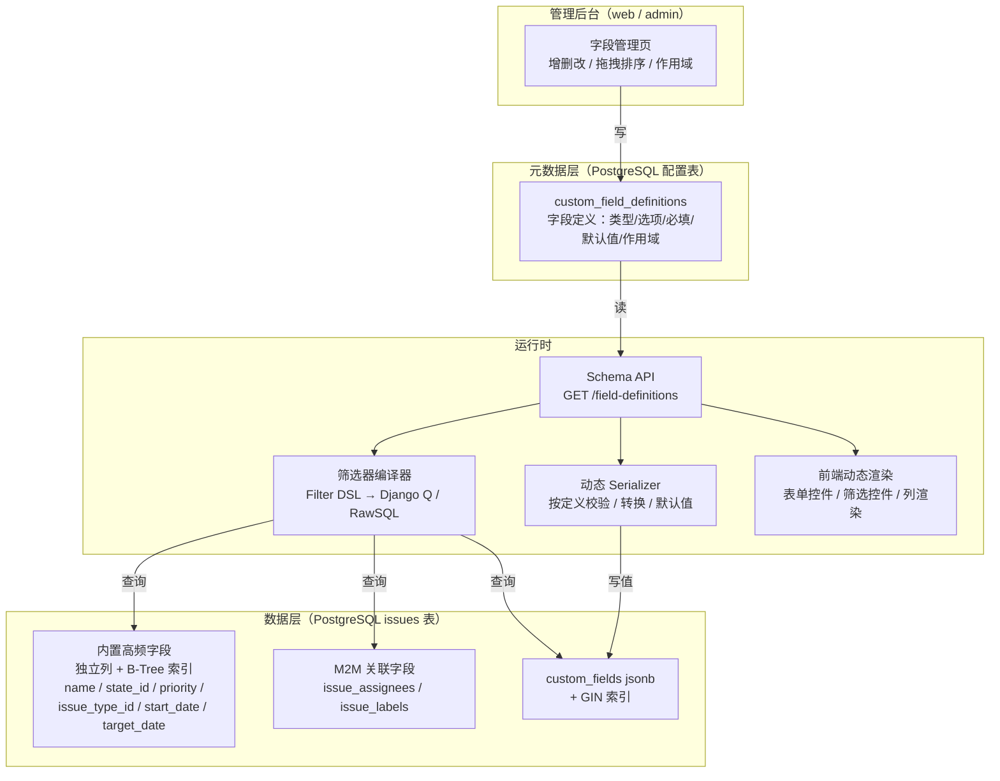
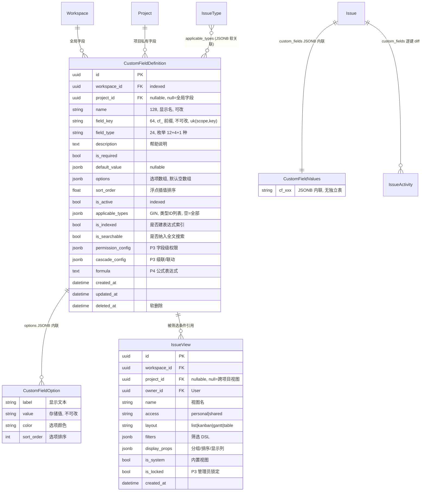
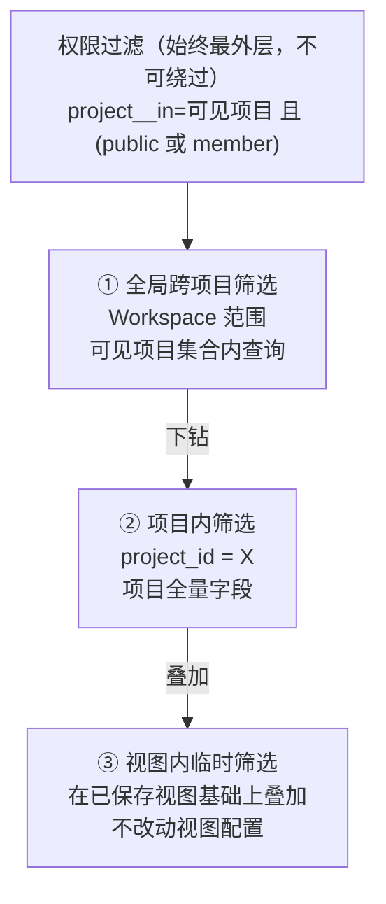

# 动态自定义字段技术方案（JSONB + GIN 索引）

> 文档定位：本文定义「任务字段动态增减」的完整技术方案。这是本项目相对 Plane 的**核心差异化能力**，也是对标 Ones 企业版的关键补齐项。
>
> 核心结论：**新增/删除字段无需修改数据库表结构、无需发版，管理员后台可视化配置即刻生效；所有自定义字段自动联动筛选器、排序、分组、视图保存。**
>
> 关联文档：[统一工作项模型设计](./unified-issue-model.md)、[需求文档 §3.4.2](../需求文档.md)

---

## 1. 设计目标

### 1.1 硬性目标

| # | 目标 | 验收标准 |
| --- | --- | --- |
| G1 | 字段动态增减**零 DDL** | 新增/删除/停用字段全程不执行 `ALTER TABLE`，`django migrate` 无新迁移文件 |
| G2 | 字段变更**零发版** | 管理员在设置后台点击保存后，刷新页面即在新建弹窗、详情页、看板卡片、列表列、筛选器中生效 |
| G3 | 可视化配置 | 支持新增、编辑、停用、删除、拖拽排序；配置项含名称、类型、必填、默认值、选项与颜色、帮助说明、作用域 |
| G4 | 筛选器全自动联动 | 新增字段后无需任何前后端改动，筛选器自动出现该字段并按类型渲染对应控件 |
| G5 | 排序 / 分组全自动联动 | 任意自定义字段可作为排序键与分组键 |
| G6 | 视图可保存 | 筛选 + 排序 + 分组 + 显示列的组合可保存为个人视图或共享视图 |
| G7 | 查询性能可控 | 常见筛选场景（10 万工作项 / 单项目 1 万）P95 < 200ms |

### 1.2 非目标（明确不做）

- **不做 EAV 通用建模**：不引入 `issue_field_value(issue_id, field_id, value_text, value_number, ...)` 竖表。理由见 §2.5 方案对比——EAV 在「一次查询取 20 个字段」时会退化为 20 次 JOIN 或一次大规模自连接聚合，且类型安全靠应用层维持，得不偿失。
- **不做动态建列**：不采用「新增字段就 `ALTER TABLE ADD COLUMN`」方案。理由：大表 DDL 在 PostgreSQL 虽然对可空列是 O(1) 的元数据操作，但会拿 `ACCESS EXCLUSIVE` 锁、与长事务冲突、导致 Django migration 状态与实际库结构漂移、单表列数上限（1600）也构成硬约束，多租户场景下租户各自的字段会互相污染。
- **P0 不实现任何动态字段能力**（严格遵循需求文档 §8.3 POC 范围界定），仅建列预留。

### 1.3 设计约束

1. 技术栈固定：PostgreSQL 14+、Django ORM、DRF，不引入额外存储（不上 MongoDB、不上 ES 作为主查询路径）。
2. 与统一工作项模型协同：自定义字段值存放在 `Issue.custom_fields`，字段元数据独立成表，作用域可绑定 `IssueType`。
3. 人力现实：2 人全栈团队，P2（第 4-7 周）需交付「生产可用」的基础自定义字段能力，方案必须可增量落地。

---

## 2. 技术方案

### 2.1 总体架构



一句话概括：**元数据驱动。字段的「定义」在配置表，字段的「值」在 JSONB，字段的「表单 / 筛选 / 列渲染」全部由前端读取 Schema API 后动态生成。任何一环都不含字段硬编码。**

### 2.2 内置字段 vs 自定义字段的划线原则

**划线标准：是否是「高频筛选 / 排序 / 分组 / JOIN」的字段。** 是则进主表列，否则进 JSONB。

| 字段 | 存储位置 | 类型 | 划入主表的理由 |
| --- | --- | --- | --- |
| `name` | 主表列 | varchar(512) | 每个列表页都要展示与搜索，trigram 索引需要独立列 |
| `state` | 主表列（FK） | UUID | 看板分组依据、每次查询都过滤，需要与 `states` 表 JOIN 取 `group` |
| `priority` | 主表列 | varchar(16) | 高频筛选与排序，需要枚举顺序排序（`CASE WHEN` 或自定义 enum） |
| `issue_type` | 主表列（FK） | UUID | 需求池/缺陷列表的核心过滤条件，且是字段作用域的判定依据 |
| `assignees` | M2M 中间表 | — | 「我的待办」核心查询，需要反向索引 `(assignee_id, issue_id)`；多值语义用 JSONB 数组会失去外键完整性 |
| `labels` | M2M 中间表 | — | 同上，标签需要「按标签统计」的反向聚合 |
| `start_date` / `target_date` | 主表列 | date | 甘特图区间查询、逾期扫描定时任务，需要 B-Tree 范围索引 |
| `sequence_id` / `sort_order` / `parent` | 主表列 | — | 系统机制字段，非业务字段 |
| 需求来源、业务价值、验收标准、严重等级、复现步骤、影响版本、所属迭代…… | `custom_fields` JSONB | 任意 | 用户可自定义，不同项目/类型差异巨大，无法预先建列 |

这条划线是本方案性能可控的根本：**80% 的查询压力集中在内置字段上，它们全部走独立列 + B-Tree 索引，与关系型数据库最优路径完全一致；JSONB 只承担剩余 20% 的长尾筛选。**

### 2.3 JSONB 存储与 GIN 索引

```sql
-- Issue 表上的 JSONB 列（P0 建表时即创建，后续零 DDL）
ALTER TABLE issues ADD COLUMN custom_fields jsonb NOT NULL DEFAULT '{}'::jsonb;

-- 默认 GIN 索引（jsonb_ops）：支持 @>、?、?&、?| 操作符
CREATE INDEX idx_issue_custom_fields ON issues USING GIN (custom_fields);
```

**为什么用默认 `jsonb_ops` 而不是 `jsonb_path_ops`？**

| 对比项 | `jsonb_ops`（默认） | `jsonb_path_ops` |
| --- | --- | --- |
| 索引所有 key 与 value | ✅ | ❌ 只索引「路径 + 值」哈希 |
| 支持 `?`（键存在） | ✅ | ❌ 不支持 |
| 支持 `@>`（包含） | ✅ | ✅（更快更小） |
| 索引体积 | 较大 | 约小 1/3 |
| 适用场景 | 键不固定、需要键存在查询 | 只做固定路径的包含查询 |

我们必须支持 `custom_fields ? 'cf_xxx'`（字段存在性筛选，对应「字段为空 / 不为空」筛选条件，以及字段删除后的数据清理扫描），因此选 `jsonb_ops`。若后期索引体积成为瓶颈，可为高频字段追加**表达式索引**（见 §6.2），而不是切换 opclass。

**值的类型约定**（JSONB 内统一用 JSON 原生类型，不做字符串化）：

| `field_type` | JSONB 值类型 | 示例 | 说明 |
| --- | --- | --- | --- |
| `text` / `textarea` | string | `"客户反馈"` | 空值存 `null` 或直接不存 key |
| `number` | number | `42` / `3.14` | 不存字符串，保证 `->>` 转 numeric 可靠 |
| `select` | string | `"high"` | 存 option 的 `value`，不存 `label`（label 改名不影响数据） |
| `multi_select` | array\<string\> | `["ios", "android"]` | 用 `@>` 查询包含 |
| `date` | string (ISO 8601) | `"2026-03-15"` | 存 `YYYY-MM-DD`，字典序 = 时间序，可直接文本比较排序 |
| `datetime`（P3） | string (ISO 8601) | `"2026-03-15T10:30:00Z"` | 统一 UTC，同样字典序有序 |
| `member` | string (UUID) | `"7f3a...-..."` | 存 User UUID |
| `member_multi` | array\<UUID string\> | `["uuid-a", "uuid-b"]` | 用 `@>` 查询 |
| `checkbox` | boolean | `true` | 严格 JSON boolean |
| `url` | string | `"https://..."` | 保存时做协议校验 |
| `currency` | object | `{"amount": 1000.50, "currency": "CNY"}` | 金额与币种绑定存储，避免多币种混算 |
| `auto_increment` | number | `128` | 创建时由服务端按 `(project, field_key)` 分配 |

**关键决策：`date` 存 ISO 字符串而非 epoch 数字。** ISO 8601 的字典序与时间序一致，因此 `custom_fields->>'cf_due' > '2026-03-01'` 这样的文本比较即可正确范围筛选与排序，无需类型转换，也能被表达式索引覆盖。

### 2.4 命名规范

所有自定义字段的 JSONB key 统一加 `cf_` 前缀：

```
cf_ + snake_case 英文标识符
例：cf_requirement_source、cf_business_value、cf_severity
```

前缀的三个作用：一是与未来可能加入的系统级 JSONB 键（如 `_meta`、`_version`）隔离；二是筛选器 DSL 解析时可仅凭 key 前缀判断走主表列还是 JSONB 路径；三是字段删除的数据清理脚本可安全地按前缀匹配。

`field_key` 一旦创建**不可修改**（改 key 等于丢数据）。UI 上「字段名」（`name`）可随时改，`field_key` 只在创建时由系统按名称音译/转写生成并允许用户微调，创建后置灰。

### 2.5 方案选型对比

| 维度 | 本方案（主表列 + JSONB） | EAV 竖表 | 动态 ALTER TABLE | 每租户独立表 |
| --- | --- | --- | --- | --- |
| 新增字段成本 | 一条配置记录 | 一条配置记录 | 一次 DDL + migration | 一次 DDL |
| 取单个 Issue 全字段 | 1 行读取 | N 次 JOIN 或聚合 | 1 行读取 | 1 行读取 |
| 列表页取 50 条 × 20 字段 | 1 次扫描 | 1000 行竖表聚合 | 1 次扫描 | 1 次扫描 |
| 单字段等值筛选 | GIN 索引（或表达式索引） | 竖表复合索引，较快 | B-Tree，最快 | B-Tree |
| 多字段 AND 筛选 | GIN 单次索引扫描 | 多次自连接（性能陡降） | 多列索引 | 多列索引 |
| 类型安全 | 应用层校验 + JSON 原生类型 | 应用层，需多值列 | 数据库强类型 | 数据库强类型 |
| 排序 | `->>` + 表达式索引 | JOIN 后排序 | 原生 | 原生 |
| 写入放大 | 单行 UPDATE | N 行 UPSERT/DELETE | 单行 | 单行 |
| 表数量 / 列数量膨胀 | 无 | 无 | 列数逼近 1600 上限 | 表数随租户线性增长 |
| 多租户隔离 | 天然（值随行） | 天然 | 租户字段互相污染 | 隔离最好，运维最差 |
| Django 生态支持 | ✅ 原生 `JSONField` + 查询转换器 | 需自研查询层 | 需自研动态模型 | 需自研路由 |
| **结论** | **采纳** | 否决 | 否决 | 否决 |

JSONB 方案唯一的明显代价是**排序与范围查询需要额外的表达式索引**（GIN 的 `jsonb_ops` 不加速 `>` / `<` / `ORDER BY`）。这个代价由 §6.2 的「按需表达式索引」策略化解，且触发条件明确（字段被标记为 `is_indexed`）。

---

## 3. 字段配置表 Django Model

### 3.1 CustomFieldDefinition 完整定义

```python
# apps/api/plane/db/models/custom_field.py
from django.contrib.postgres.indexes import GinIndex
from django.core.exceptions import ValidationError
from django.db import models

from plane.db.models.base import BaseModel


class CustomFieldDefinition(BaseModel):
    """字段定义元数据 —— 自定义字段的唯一真相来源

    作用域规则（对标 Ones 的全局配置 + 项目级覆盖）：
    - project 为 NULL：Workspace 级全局字段，对该工作空间下所有项目生效
    - project 不为 NULL：项目私有字段，仅该项目生效
    - applicable_types 为空列表：对所有任务类型生效；否则仅对列出的类型生效
    """

    class FieldType(models.TextChoices):
        TEXT = "text", "单行文本"
        TEXTAREA = "textarea", "多行文本"
        NUMBER = "number", "数字"
        SELECT = "select", "单选下拉"
        MULTI_SELECT = "multi_select", "多选下拉"
        DATE = "date", "日期"
        MEMBER = "member", "人员单选"
        MEMBER_MULTI = "member_multi", "人员多选"
        CHECKBOX = "checkbox", "复选框"
        URL = "url", "URL 链接"
        CURRENCY = "currency", "金额"
        AUTO_INCREMENT = "auto_increment", "自增编号"
        # ---- P3 企业版高级类型 ----
        CASCADE = "cascade", "级联下拉"
        RELATION = "relation", "关联工作项"
        DATE_RANGE = "date_range", "日期区间"
        ATTACHMENT = "attachment", "附件"
        # ---- P4 远期类型 ----
        FORMULA = "formula", "公式计算"

    #: 多值类型集合，值在 JSONB 中以数组存储，筛选走 @> 包含语义
    MULTI_VALUE_TYPES = frozenset({FieldType.MULTI_SELECT, FieldType.MEMBER_MULTI, FieldType.ATTACHMENT})
    #: 需要 options 配置的类型
    OPTION_REQUIRED_TYPES = frozenset({FieldType.SELECT, FieldType.MULTI_SELECT, FieldType.CASCADE})

    workspace = models.ForeignKey(
        "db.Workspace", on_delete=models.CASCADE, related_name="custom_field_definitions", verbose_name="所属工作空间"
    )
    project = models.ForeignKey(
        "db.Project",
        on_delete=models.CASCADE,
        null=True,
        blank=True,
        related_name="custom_field_definitions",
        verbose_name="所属项目",
        help_text="为空表示 Workspace 全局字段，对所有项目生效",
    )

    name = models.CharField(max_length=128, verbose_name="字段显示名", help_text="可随时修改，不影响已存数据")
    field_key = models.CharField(
        max_length=64,
        verbose_name="字段键名",
        help_text="JSONB 中的键名，须以 cf_ 开头的 snake_case，创建后不可修改",
    )
    field_type = models.CharField(
        max_length=24, choices=FieldType.choices, verbose_name="字段类型", help_text="决定表单控件、筛选控件与值的 JSON 类型"
    )
    description = models.TextField(blank=True, verbose_name="字段帮助说明", help_text="表单中以问号提示展示")

    is_required = models.BooleanField(default=False, verbose_name="是否必填")
    default_value = models.JSONField(
        null=True, blank=True, verbose_name="默认值", help_text="新建工作项时预填，类型须与 field_type 匹配"
    )
    options = models.JSONField(
        default=list,
        blank=True,
        verbose_name="选项配置",
        help_text='下拉选项：[{"label":"高","value":"high","color":"#EF4444","sort_order":1}]',
    )

    sort_order = models.FloatField(default=65535.0, verbose_name="显示排序", help_text="浮点插值，支持拖拽排序")
    is_active = models.BooleanField(
        default=True, db_index=True, verbose_name="是否启用", help_text="停用后表单与筛选器不再展示，历史数据保留"
    )

    applicable_types = models.JSONField(
        default=list,
        blank=True,
        verbose_name="适用任务类型",
        help_text="IssueType UUID 字符串列表，空列表表示适用于全部类型",
    )

    # ---- 查询优化标记 ----
    is_indexed = models.BooleanField(
        default=False,
        verbose_name="建立专用表达式索引",
        help_text="标记后由异步任务 CONCURRENTLY 创建表达式索引，用于高频排序与范围查询",
    )
    is_searchable = models.BooleanField(default=False, verbose_name="纳入全文搜索", help_text="文本类字段可纳入搜索向量")

    # ---- P3 / P4 企业版扩展（列先建好，功能后开启，避免大表 DDL）----
    permission_config = models.JSONField(
        default=dict, blank=True, verbose_name="字段级权限配置",
        help_text='P3：{"read":["role:member"],"write":["role:admin"],"required_for":["role:member"]}',
    )
    cascade_config = models.JSONField(
        default=dict, blank=True, verbose_name="级联/联动配置",
        help_text='P3：{"parent_field_key":"cf_product_line","visible_when":{"cf_type":["bug"]}}',
    )
    formula = models.TextField(
        blank=True, verbose_name="公式表达式", help_text="P4：如 {cf_price} * {cf_quantity}"
    )

    class Meta(BaseModel.Meta):
        db_table = "custom_field_definitions"
        verbose_name = "自定义字段定义"
        verbose_name_plural = "自定义字段定义"
        ordering = ("sort_order", "created_at")
        constraints = [
            # 同一 workspace 的全局字段 key 唯一
            models.UniqueConstraint(
                fields=["workspace", "field_key"],
                condition=models.Q(project__isnull=True, deleted_at__isnull=True),
                name="uniq_global_field_key_per_workspace",
            ),
            # 同一项目的私有字段 key 唯一
            models.UniqueConstraint(
                fields=["project", "field_key"],
                condition=models.Q(project__isnull=False, deleted_at__isnull=True),
                name="uniq_project_field_key",
            ),
        ]
        indexes = [
            models.Index(fields=["workspace", "is_active", "sort_order"], name="idx_cfd_ws_active"),
            models.Index(fields=["project", "is_active", "sort_order"], name="idx_cfd_proj_active"),
            GinIndex(fields=["applicable_types"], name="idx_cfd_applicable_types"),
        ]

    def clean(self) -> None:
        """配置合法性校验 —— 在 Serializer 与 Admin 双端调用"""
        if not self.field_key.startswith("cf_"):
            raise ValidationError({"field_key": "字段键名必须以 cf_ 开头"})
        if not re.fullmatch(r"cf_[a-z][a-z0-9_]{1,60}", self.field_key):
            raise ValidationError({"field_key": "字段键名只允许小写字母、数字与下划线"})
        if self.field_type in self.OPTION_REQUIRED_TYPES and not self.options:
            raise ValidationError({"options": f"{self.get_field_type_display()} 必须配置至少一个选项"})
        if self.options:
            values = [opt.get("value") for opt in self.options]
            if len(values) != len(set(values)):
                raise ValidationError({"options": "选项 value 不允许重复"})
            if any(not opt.get("value") or not opt.get("label") for opt in self.options):
                raise ValidationError({"options": "每个选项必须同时包含 label 与 value"})
        if self.default_value is not None:
            validate_field_value(self, self.default_value)   # 复用值校验器
        if self.field_type == self.FieldType.FORMULA and not self.formula:
            raise ValidationError({"formula": "公式字段必须填写表达式"})

    def save(self, *args, **kwargs):
        # field_key 创建后不可变
        if self.pk:
            original_key = CustomFieldDefinition.all_objects.values_list("field_key", flat=True).get(pk=self.pk)
            if original_key != self.field_key:
                raise ValidationError({"field_key": "字段键名创建后不可修改"})
        self.full_clean(exclude=None)
        super().save(*args, **kwargs)
```

### 3.2 字段定义 ER 图



> `CustomFieldValues` 与 `CustomFieldOption` 在图中是虚拟实体（用于表达结构），实际不存在物理表，分别内联在 `issues.custom_fields` 与 `custom_field_definitions.options` 的 JSONB 中。这正是本方案「零 DDL」的来源。

### 3.3 字段作用域解析

```python
def resolve_fields(project: Project, issue_type_id: uuid.UUID | None = None) -> list[CustomFieldDefinition]:
    """解析某项目（可选某类型）下生效的字段列表

    优先级：项目私有字段覆盖同 field_key 的全局字段（对标 Ones 的项目级覆盖）。
    结果按 sort_order 排序，供表单、详情页、筛选器、列设置共同消费。
    """
    definitions = CustomFieldDefinition.objects.filter(
        workspace_id=project.workspace_id, is_active=True
    ).filter(
        models.Q(project__isnull=True) | models.Q(project_id=project.id)
    ).order_by("sort_order", "created_at")

    # 项目私有字段覆盖同名全局字段
    merged: dict[str, CustomFieldDefinition] = {}
    for definition in definitions:
        existing = merged.get(definition.field_key)
        if existing is None or definition.project_id is not None:
            merged[definition.field_key] = definition

    result = list(merged.values())

    # 类型作用域过滤：applicable_types 为空表示适用全部类型
    if issue_type_id is not None:
        type_key = str(issue_type_id)
        result = [d for d in result if not d.applicable_types or type_key in d.applicable_types]

    return sorted(result, key=lambda d: (d.sort_order, d.created_at))
```

**缓存策略**：字段定义是「极少写、极多读」的典型元数据，每个 API 请求都要用。按 `(workspace_id, project_id)` 维度缓存到 Redis，TTL 1 小时，字段增删改时主动失效：

```python
FIELD_SCHEMA_CACHE_KEY = "field_schema:v1:{workspace_id}:{project_id}"


def get_cached_fields(project: Project) -> list[dict]:
    key = FIELD_SCHEMA_CACHE_KEY.format(workspace_id=project.workspace_id, project_id=project.id)
    cached = cache.get(key)
    if cached is None:
        cached = CustomFieldDefinitionSerializer(resolve_fields(project), many=True).data
        cache.set(key, cached, timeout=3600)
    return cached


@receiver([post_save, post_delete], sender=CustomFieldDefinition)
def invalidate_field_schema_cache(instance: CustomFieldDefinition, **kwargs) -> None:
    """字段定义变更后失效缓存 —— 这是「零发版即刻生效」的关键一环"""
    if instance.project_id:
        cache.delete(FIELD_SCHEMA_CACHE_KEY.format(
            workspace_id=instance.workspace_id, project_id=instance.project_id))
    else:
        # 全局字段变更影响该工作空间所有项目
        project_ids = Project.objects.filter(workspace_id=instance.workspace_id).values_list("id", flat=True)
        cache.delete_many([
            FIELD_SCHEMA_CACHE_KEY.format(workspace_id=instance.workspace_id, project_id=pid)
            for pid in project_ids
        ])
```

### 3.4 值校验器

```python
VALUE_VALIDATORS: dict[str, Callable[[Any, CustomFieldDefinition], None]] = {}


def validate_field_value(definition: CustomFieldDefinition, value: Any) -> Any:
    """校验并规范化单个自定义字段值，返回可直接写入 JSONB 的 Python 对象

    校验失败抛 ValidationError，由 DRF 统一转为 400 响应。
    """
    FT = CustomFieldDefinition.FieldType
    if value is None or value == "":
        if definition.is_required:
            raise ValidationError({definition.field_key: f"「{definition.name}」为必填字段"})
        return None

    match definition.field_type:
        case FT.TEXT | FT.TEXTAREA:
            if not isinstance(value, str):
                raise ValidationError({definition.field_key: "必须为文本"})
            max_len = 512 if definition.field_type == FT.TEXT else 20000
            if len(value) > max_len:
                raise ValidationError({definition.field_key: f"长度不能超过 {max_len}"})
            return value

        case FT.NUMBER:
            if isinstance(value, bool) or not isinstance(value, (int, float)):
                raise ValidationError({definition.field_key: "必须为数字"})
            return value

        case FT.SELECT:
            valid = {opt["value"] for opt in definition.options}
            if value not in valid:
                raise ValidationError({definition.field_key: f"非法选项，可选值：{sorted(valid)}"})
            return value

        case FT.MULTI_SELECT:
            if not isinstance(value, list):
                raise ValidationError({definition.field_key: "必须为数组"})
            valid = {opt["value"] for opt in definition.options}
            invalid = set(value) - valid
            if invalid:
                raise ValidationError({definition.field_key: f"非法选项：{sorted(invalid)}"})
            return sorted(set(value), key=value.index)          # 去重并保序

        case FT.DATE:
            try:
                date.fromisoformat(value)
            except (TypeError, ValueError):
                raise ValidationError({definition.field_key: "日期格式须为 YYYY-MM-DD"})
            return value

        case FT.MEMBER:
            if not is_project_member(definition, value):
                raise ValidationError({definition.field_key: "该用户不是项目成员"})
            return str(value)

        case FT.MEMBER_MULTI:
            if not isinstance(value, list):
                raise ValidationError({definition.field_key: "必须为数组"})
            for uid in value:
                if not is_project_member(definition, uid):
                    raise ValidationError({definition.field_key: f"用户 {uid} 不是项目成员"})
            return [str(uid) for uid in dict.fromkeys(value)]

        case FT.CHECKBOX:
            if not isinstance(value, bool):
                raise ValidationError({definition.field_key: "必须为布尔值"})
            return value

        case FT.URL:
            validator = URLValidator(schemes=["http", "https"])
            validator(value)                                     # 抛 DjangoValidationError
            return value

        case FT.CURRENCY:
            if not isinstance(value, dict) or "amount" not in value:
                raise ValidationError({definition.field_key: '格式须为 {"amount": 数字, "currency": "CNY"}'})
            if not isinstance(value["amount"], (int, float)) or isinstance(value["amount"], bool):
                raise ValidationError({definition.field_key: "amount 必须为数字"})
            return {"amount": value["amount"], "currency": value.get("currency", "CNY")}

        case FT.AUTO_INCREMENT:
            raise ValidationError({definition.field_key: "自增编号由系统生成，不接受客户端赋值"})

        case _:
            raise ValidationError({definition.field_key: f"暂不支持的字段类型 {definition.field_type}"})


def validate_custom_fields(project: Project, issue_type_id: uuid.UUID | None, payload: dict) -> dict:
    """整体校验 —— 未知 key 拒绝、必填校验、类型校验、默认值填充"""
    definitions = {d.field_key: d for d in resolve_fields(project, issue_type_id)}

    unknown = set(payload) - set(definitions)
    if unknown:
        raise ValidationError({"custom_fields": f"未定义或不适用于当前类型的字段：{sorted(unknown)}"})

    cleaned: dict[str, Any] = {}
    for key, definition in definitions.items():
        if key in payload:
            value = validate_field_value(definition, payload[key])
        elif definition.default_value is not None:
            value = definition.default_value
        elif definition.is_required:
            raise ValidationError({key: f"「{definition.name}」为必填字段"})
        else:
            continue
        if value is not None:
            cleaned[key] = value                                 # None 不落库，保持 JSONB 精简
    return cleaned
```

**设计要点：值为空时不写入 key，而不是写 `null`。** 这样 `custom_fields ? 'cf_xxx'`（键存在）可直接表达「字段有值」，JSONB 体积也更小。「字段为空」筛选对应 `NOT (custom_fields ? 'cf_xxx')`。

### 3.5 字段生命周期操作

| 操作 | 数据库动作 | 存量数据处理 | 是否 DDL |
| --- | --- | --- | --- |
| 新增字段 | `INSERT` 一条定义 | 存量 Issue 的 JSONB 无该 key，读取时按 `default_value` 或空展示 | ❌ |
| 改显示名 / 帮助说明 / 排序 | `UPDATE` 定义 | 无需处理（数据存的是 `field_key` 与 option `value`） | ❌ |
| 改选项 label / color | `UPDATE options` | 无需处理（存的是 `value`） | ❌ |
| 删除选项 value | `UPDATE options` | 需异步扫描清理引用该 value 的 Issue（或保留为「已失效值」灰显） | ❌ |
| 改必填 | `UPDATE` 定义 | 存量不补值，仅影响后续保存校验；UI 提示「N 条历史数据缺该字段」 | ❌ |
| 停用字段 | `is_active=False` | 数据完整保留，表单与筛选器隐藏 | ❌ |
| 删除字段 | 软删除定义 + 异步清理 JSONB key | 见下方清理任务 | ❌ |
| 改字段类型 | **禁止** | 需先删除后新建（类型变更等价于语义变更，无法安全转换） | — |

字段删除的异步清理：

```python
@shared_task(bind=True, max_retries=3)
def cleanup_deleted_field_values(self, definition_id: str, batch_size: int = 2000) -> int:
    """删除字段后清理 JSONB 中的残留 key —— 分批执行，避免长事务与大量 WAL

    使用 jsonb 的 - 操作符移除 key；GIN 索引会随之更新。
    """
    definition = CustomFieldDefinition.all_objects.get(id=definition_id)
    scope_sql, params = _scope_clause(definition)   # 全局字段 → 按 workspace；项目字段 → 按 project
    total = 0

    while True:
        with connection.cursor() as cursor:
            cursor.execute(
                f"""
                WITH target AS (
                    SELECT id FROM issues
                     WHERE {scope_sql}
                       AND custom_fields ? %s
                     LIMIT %s
                )
                UPDATE issues i
                   SET custom_fields = i.custom_fields - %s,
                       updated_at = now()
                  FROM target t
                 WHERE i.id = t.id
                """,
                [*params, definition.field_key, batch_size, definition.field_key],
            )
            affected = cursor.rowcount
        total += affected
        if affected < batch_size:
            break
    return total
```

> 注意 `custom_fields ? 'cf_x'` 能走 GIN 索引，因此每批的 `SELECT ... LIMIT` 是索引扫描而非全表扫描，清理 10 万条数据也不会拖垮数据库。

---

## 4. JSONB 存储与查询示例

### 4.1 存储示例

一条「需求」类型工作项的 `custom_fields`：

```json
{
  "cf_requirement_source": "客户反馈",
  "cf_business_value": "high",
  "cf_sprint_id": "3f9b1c2e-8a4d-4c6f-9b1e-2d7a5c8f0e13",
  "cf_acceptance_criteria": "1. 支持导出 CSV/XLSX 两种格式\n2. 单次导出上限 10 万行\n3. 超过上限时提示分批导出",
  "cf_user_scenario": "运营同学每周需导出订单明细做对账",
  "cf_target_version": ["v2.3", "v2.4"],
  "cf_product_owner": "7f3a9e21-4b5c-4d8e-9f01-2a3b4c5d6e7f",
  "cf_estimated_revenue": { "amount": 250000.00, "currency": "CNY" },
  "cf_is_compliance_related": false,
  "cf_prd_link": "https://wiki.example.com/prd/export-v2",
  "cf_review_date": "2026-03-05",
  "cf_req_no": 128
}
```

一条「缺陷」类型工作项的 `custom_fields`（字段集完全不同，同一张表共存）：

```json
{
  "cf_severity": "critical",
  "cf_reproduce_rate": "always",
  "cf_reproduce_steps": "1. 进入报表页\n2. 选择时间范围 1 年\n3. 点击导出 → 60s 后 504",
  "cf_affected_versions": ["v2.2.1", "v2.2.2"],
  "cf_found_env": "production",
  "cf_found_by": "9a1b2c3d-4e5f-6071-8293-a4b5c6d7e8f9",
  "cf_root_cause": "导出未分页，单次查询全量数据",
  "cf_is_regression": true
}
```

对应的物理存储：**同一张 `issues` 表，同一个 `custom_fields` 列，不同的 key 集合。** 这就是零 DDL 支持任意字段的直观体现。

### 4.2 Django ORM 查询示例

```python
from django.contrib.postgres.fields import JSONField
from django.db.models import F, Q, Value
from django.db.models.expressions import RawSQL
from django.db.models.functions import Cast

# ---------------- 精确匹配 ----------------
# SQL: WHERE custom_fields @> '{"cf_severity": "critical"}'  → 走 GIN 索引
Issue.objects.filter(custom_fields__cf_severity="critical")

# ---------------- 包含查询（值在集合内 / IN 语义）----------------
# Django 会展开为 OR 条件，每个分支均可走 GIN
Issue.objects.filter(custom_fields__cf_business_value__in=["high", "critical"])

# ---------------- JSONB 键存在（字段有值 / 无值）----------------
# SQL: WHERE custom_fields ? 'cf_requirement_source'        → 走 GIN 索引
Issue.objects.filter(custom_fields__has_key="cf_requirement_source")
Issue.objects.exclude(custom_fields__has_key="cf_requirement_source")     # 字段为空

# 多键同时存在 / 任一存在
Issue.objects.filter(custom_fields__has_keys=["cf_severity", "cf_found_env"])      # ?&
Issue.objects.filter(custom_fields__has_any_keys=["cf_severity", "cf_root_cause"]) # ?|

# ---------------- 多值字段（数组包含）----------------
# SQL: WHERE custom_fields @> '{"cf_affected_versions": ["v2.2.1"]}'   → 走 GIN 索引
Issue.objects.filter(custom_fields__cf_affected_versions__contains=["v2.2.1"])

# 任一命中（多选字段的 OR 语义）
Q(custom_fields__cf_affected_versions__contains=["v2.2.1"]) | \
Q(custom_fields__cf_affected_versions__contains=["v2.2.2"])

# ---------------- 数字范围（GIN 不加速，依赖表达式索引）----------------
Issue.objects.annotate(
    revenue=Cast(RawSQL("custom_fields #>> '{cf_estimated_revenue,amount}'", []), models.FloatField())
).filter(revenue__gte=100000)

# ---------------- 日期范围（ISO 字符串字典序 = 时间序，可直接文本比较）----------------
Issue.objects.filter(
    custom_fields__cf_review_date__gte="2026-03-01",
    custom_fields__cf_review_date__lte="2026-03-31",
)

# ---------------- 文本模糊匹配 ----------------
Issue.objects.filter(custom_fields__cf_reproduce_steps__icontains="504")

# ---------------- 布尔 ----------------
Issue.objects.filter(custom_fields__cf_is_regression=True)

# ---------------- 排序 ----------------
# 文本/日期字段：->> 取文本后排序
Issue.objects.order_by(RawSQL("custom_fields->>'cf_business_value'", []))

# 数字字段：必须先转 numeric，否则 "10" < "9" 的字典序错误
Issue.objects.order_by(RawSQL("(custom_fields->>'cf_req_no')::numeric", []))

# 空值置底 + 降序（PostgreSQL 需显式 NULLS LAST）
Issue.objects.order_by(RawSQL("(custom_fields->>'cf_req_no')::numeric DESC NULLS LAST", []))

# 单选字段按「选项配置顺序」排序（而非字典序）—— 用 option value 序列构造排序表达式
ORDER_CASE = """
    array_position(ARRAY['urgent','high','medium','low']::text[],
                   custom_fields->>'cf_business_value')
"""
Issue.objects.order_by(RawSQL(ORDER_CASE, []))

# ---------------- 分组统计 ----------------
Issue.objects.values(group_value=RawSQL("custom_fields->>'cf_severity'", [])) \
             .annotate(count=Count("id")).order_by("-count")

# ---------------- 组合：内置字段 + 自定义字段 + M2M ----------------
Issue.objects.filter(
    project_id=project_id,
    archived_at__isnull=True,
    state__group__in=["unstarted", "started"],          # 内置 FK JOIN
    priority__in=["high", "urgent"],                    # 内置列 B-Tree
    assignees__id=user_id,                              # M2M 中间表
    custom_fields__cf_severity="critical",              # JSONB GIN
).filter(
    Q(custom_fields__cf_affected_versions__contains=["v2.2.1"]) |
    Q(custom_fields__cf_is_regression=True)             # JSONB OR 组合
).distinct()
```

### 4.3 原生 SQL 与执行计划

```sql
-- 场景：某项目下「严重等级=critical 且 影响版本包含 v2.2.1」的未完成缺陷
EXPLAIN (ANALYZE, BUFFERS)
SELECT i.id, i.sequence_id, i.name, s.name AS state_name,
       i.custom_fields->>'cf_severity'          AS severity,
       i.custom_fields->'cf_affected_versions'  AS affected_versions
  FROM issues i
  JOIN states s ON s.id = i.state_id
 WHERE i.project_id = '11111111-1111-1111-1111-111111111111'
   AND i.deleted_at IS NULL
   AND i.archived_at IS NULL
   AND s."group" IN ('unstarted', 'started')
   AND i.custom_fields @> '{"cf_severity": "critical", "cf_affected_versions": ["v2.2.1"]}'::jsonb
 ORDER BY i.sort_order
 LIMIT 50;
```

期望的执行计划形态：

```
Limit
  -> Sort (key: i.sort_order)
       -> Nested Loop
            -> Bitmap Heap Scan on issues i
                 Recheck Cond: (custom_fields @> '{...}'::jsonb)
                 Filter: (project_id = ... AND deleted_at IS NULL AND archived_at IS NULL)
                 -> Bitmap Index Scan on idx_issue_custom_fields      ← GIN 命中
            -> Index Scan on states s (pk)
```

**要点**：一个 `@>` 包含多个 key/value 时，GIN 会对每个 key 做索引扫描后做 bitmap AND，这比「多次独立查询取交集」高效得多。因此筛选器编译器应尽量把多个自定义字段的 **AND 等值条件合并成单个 `@>`**（见 §5.4）。

```sql
-- 反例：不要这样写（三次独立的 jsonb 提取，只有第一个能走索引，且无法 bitmap AND 合并）
WHERE custom_fields->>'cf_severity' = 'critical'
  AND custom_fields->>'cf_found_env' = 'production'
  AND custom_fields->>'cf_reproduce_rate' = 'always'

-- 正例：合并为单个包含判断，GIN 一次 bitmap AND 完成
WHERE custom_fields @> '{"cf_severity":"critical","cf_found_env":"production","cf_reproduce_rate":"always"}'::jsonb
```

### 4.4 自增编号字段的实现

`auto_increment` 类型字段需要「项目内 + 字段内」连续编号，复用统一工作项模型的 advisory lock 方案，但锁键混入 `field_key` 的哈希以避免与 `sequence_id` 生成互相阻塞：

```python
def next_auto_increment(project_id: uuid.UUID, field_key: str) -> int:
    """为 auto_increment 类型字段分配下一个编号（须在 transaction.atomic 内调用）

    锁键用两个 32 位整数版本的 advisory lock：
    高位 = 项目哈希，低位 = 字段键哈希，与 issue sequence_id 的锁键空间天然隔离。
    """
    with connection.cursor() as cursor:
        cursor.execute(
            "SELECT pg_advisory_xact_lock(%s, %s)",
            [_int32(project_id.int), _int32(zlib.crc32(field_key.encode()))],
        )
        cursor.execute(
            """
            SELECT COALESCE(MAX((custom_fields->>%s)::bigint), 0) + 1
              FROM issues
             WHERE project_id = %s AND custom_fields ? %s
            """,
            [field_key, str(project_id), field_key],
        )
        return cursor.fetchone()[0]
```

---

## 5. 筛选器设计

### 5.1 控件自动匹配

前端从 Schema API 拿到字段定义后，按 `field_type` 查表决定渲染哪个筛选控件与支持哪些操作符。**这张映射表是「新增字段自动出现在筛选器」的全部秘密——没有任何字段硬编码。**

| `field_type` | 筛选控件 | 支持的操作符 | JSONB 查询形态 |
| --- | --- | --- | --- |
| `text` / `textarea` | 文本输入框 | `contains` / `not_contains` / `eq` / `neq` / `is_empty` / `is_not_empty` | `->> ILIKE` / `@>` / `?` |
| `number` | 数字区间（min-max） | `eq` / `neq` / `gt` / `gte` / `lt` / `lte` / `between` / `is_empty` | `(->>)::numeric` 比较 |
| `select` | 多选下拉（选项带色块） | `in` / `not_in` / `is_empty` / `is_not_empty` | `@>` OR 展开 |
| `multi_select` | 多选下拉 + AND/OR 切换 | `contains_any` / `contains_all` / `not_contains` / `is_empty` | `@>` / `?` |
| `date` | 日期区间 + 相对时间快捷项 | `eq` / `before` / `after` / `between` / `is_empty` + `today` / `this_week` / `this_month` / `overdue` / `next_n_days` | ISO 文本比较 |
| `member` | 人员选择器（含「我」） | `in` / `not_in` / `is_empty` | `@>` |
| `member_multi` | 人员多选器 | `contains_any` / `contains_all` / `is_empty` | `@>` |
| `checkbox` | 三态（是/否/全部） | `eq` | `@>` |
| `url` | 文本输入框 | `contains` / `is_empty` / `is_not_empty` | `->> ILIKE` / `?` |
| `currency` | 数字区间 + 币种下拉 | `gte` / `lte` / `between` | `(#>>'{k,amount}')::numeric` |
| `auto_increment` | 数字区间 | `eq` / `between` | `(->>)::bigint` |
| `cascade`（P3） | 级联选择器 | `in` / `starts_with` | `@>` / 路径前缀匹配 |
| `relation`（P3） | 工作项选择器 | `in` / `is_empty` | `@>` |
| `date_range`（P3） | 双日期区间 | `overlaps` / `contains_date` | 双键比较 |

内置字段共用同一套控件映射（`state` → 状态多选、`priority` → 枚举多选、`assignees` → 人员选择器、`labels` → 标签多选、`target_date` → 日期区间），因此**筛选器 UI 对「内置字段」与「自定义字段」无差别对待**，只是数据来源不同（内置字段的 schema 由后端硬编码常量提供，自定义字段的 schema 来自配置表）。

Schema API 响应示例：

```jsonc
// GET /api/workspaces/:slug/projects/:id/field-schema/?issue_type=<uuid>
{
  "builtin": [
    { "key": "name",        "name": "标题",   "type": "text",         "filterable": true, "sortable": true,  "groupable": false },
    { "key": "state",       "name": "状态",   "type": "select_ref",   "filterable": true, "sortable": true,  "groupable": true,
      "options": [{ "label": "待办", "value": "<state-uuid>", "color": "#9CA3AF", "group": "unstarted" }] },
    { "key": "priority",    "name": "优先级", "type": "select",       "filterable": true, "sortable": true,  "groupable": true,
      "options": [{ "label": "紧急", "value": "urgent", "color": "#EF4444" }] },
    { "key": "assignees",   "name": "负责人", "type": "member_multi", "filterable": true, "sortable": false, "groupable": true },
    { "key": "labels",      "name": "标签",   "type": "multi_select_ref", "filterable": true, "sortable": false, "groupable": true },
    { "key": "target_date", "name": "截止时间", "type": "date",       "filterable": true, "sortable": true,  "groupable": false }
  ],
  "custom": [
    { "key": "cf_severity", "name": "严重等级", "type": "select", "required": true, "sort_order": 1000,
      "description": "critical 需 2 小时内响应",
      "options": [
        { "label": "致命", "value": "critical", "color": "#DC2626" },
        { "label": "严重", "value": "major",    "color": "#F59E0B" },
        { "label": "一般", "value": "minor",    "color": "#3B82F6" }
      ],
      "filterable": true, "sortable": true, "groupable": true, "indexed": true },
    { "key": "cf_affected_versions", "name": "影响版本", "type": "multi_select", "required": false, "sort_order": 2000,
      "options": [{ "label": "v2.2.1", "value": "v2.2.1" }, { "label": "v2.2.2", "value": "v2.2.2" }],
      "filterable": true, "sortable": false, "groupable": true, "indexed": false }
  ]
}
```

### 5.2 筛选 DSL

筛选条件序列化为可嵌套的 JSON DSL，存入 `IssueView.filters`，也可直接作为 API 查询参数传递：

```jsonc
{
  "op": "AND",
  "conditions": [
    { "field": "state.group", "operator": "in", "value": ["unstarted", "started"] },
    { "field": "priority",    "operator": "in", "value": ["high", "urgent"] },
    {
      "op": "OR",
      "conditions": [
        { "field": "cf_severity",         "operator": "in",           "value": ["critical", "major"] },
        { "field": "cf_affected_versions","operator": "contains_any", "value": ["v2.2.1", "v2.2.2"] },
        {
          "op": "AND",
          "conditions": [
            { "field": "cf_is_regression", "operator": "eq",      "value": true },
            { "field": "cf_review_date",   "operator": "between", "value": ["2026-03-01", "2026-03-31"] }
          ]
        }
      ]
    },
    { "field": "assignees",     "operator": "in",      "value": ["@me"] },
    { "field": "cf_root_cause", "operator": "is_empty" }
  ]
}
```

DSL 设计要点：

1. **递归结构**：节点分「逻辑节点」（含 `op` + `conditions`）与「条件节点」（含 `field` + `operator` + `value`），支持任意深度分组嵌套（实际限制深度 ≤ 5，防止恶意构造）。
2. **字段引用统一**：内置字段用裸名（`priority`）或点号路径（`state.group`），自定义字段用 `cf_` 前缀 key。编译器凭前缀分派。
3. **占位符**：`@me` 表示当前用户，`today` / `this_week` / `this_month` / `overdue` / `next_7_days` 表示相对时间。占位符在**编译期**解析为具体值，因此保存的视图对不同用户、不同日期都是「活的」。
4. **前后端同构**：同一份 DSL 前端用于渲染筛选面板，后端用于编译 SQL，视图保存即保存这份 JSON，无二次转换。

### 5.3 筛选器编译器

```python
# apps/api/plane/app/filters/compiler.py
from dataclasses import dataclass

from django.db.models import Q
from django.db.models.expressions import RawSQL


@dataclass(frozen=True)
class CompileContext:
    """编译上下文：提供字段 schema、当前用户、时区，用于占位符解析与字段合法性校验"""
    project: Project
    field_schema: dict[str, dict]          # key -> schema
    user_id: uuid.UUID
    tz: ZoneInfo


MAX_FILTER_DEPTH = 5


class FilterCompiler:
    """筛选 DSL → Django Q 对象编译器

    - 内置字段编译为标准 ORM 查询路径（走 B-Tree / JOIN）
    - 自定义字段编译为 JSONB 查询（等值条件优先合并为单个 @>）
    - 未知字段、非法操作符、超深嵌套直接拒绝（400）
    """

    def compile(self, node: dict, ctx: CompileContext, depth: int = 0) -> Q:
        if depth > MAX_FILTER_DEPTH:
            raise ValidationError("筛选条件嵌套层级过深")

        if "op" in node:
            op = node["op"].upper()
            if op not in ("AND", "OR"):
                raise ValidationError(f"非法逻辑操作符 {op}")
            children = [self.compile(child, ctx, depth + 1) for child in node.get("conditions", [])]
            if not children:
                return Q()
            combined = children[0]
            for child in children[1:]:
                combined = (combined & child) if op == "AND" else (combined | child)
            return combined

        return self._compile_condition(node, ctx)

    # ---------------- 条件节点 ----------------

    def _compile_condition(self, cond: dict, ctx: CompileContext) -> Q:
        field, operator = cond["field"], cond["operator"]
        schema = ctx.field_schema.get(field)
        if schema is None:
            raise ValidationError(f"未知或不可筛选的字段：{field}")
        if operator not in ALLOWED_OPERATORS[schema["type"]]:
            raise ValidationError(f"字段 {field} 不支持操作符 {operator}")

        value = self._resolve_placeholders(cond.get("value"), schema, ctx)

        if field.startswith("cf_"):
            return self._compile_custom(field, operator, value, schema)
        return self._compile_builtin(field, operator, value, schema)

    def _compile_builtin(self, field: str, operator: str, value: Any, schema: dict) -> Q:
        """内置字段 → 标准 ORM lookup"""
        path = BUILTIN_FIELD_PATHS[field]          # 如 "state.group" -> "state__group"
        match operator:
            case "in":            return Q(**{f"{path}__in": value})
            case "not_in":        return ~Q(**{f"{path}__in": value})
            case "eq":            return Q(**{path: value})
            case "neq":           return ~Q(**{path: value})
            case "contains":      return Q(**{f"{path}__icontains": value})
            case "not_contains":  return ~Q(**{f"{path}__icontains": value})
            case "gt" | "gte" | "lt" | "lte":
                return Q(**{f"{path}__{operator}": value})
            case "between":       return Q(**{f"{path}__range": (value[0], value[1])})
            case "is_empty":      return Q(**{f"{path}__isnull": True})
            case "is_not_empty":  return Q(**{f"{path}__isnull": False})
            case _:               raise ValidationError(f"未实现的操作符 {operator}")

    def _compile_custom(self, key: str, operator: str, value: Any, schema: dict) -> Q:
        """自定义字段 → JSONB 查询

        原则：能用 @> 就用 @>（走 GIN），必须比较大小才用 RawSQL 表达式。
        """
        ftype = schema["type"]

        match operator:
            case "eq":
                return Q(**{f"custom_fields__{key}": value})                    # → @>

            case "neq":
                return ~Q(**{f"custom_fields__{key}": value})

            case "in":
                q = Q()
                for item in value:                                              # 每个分支均可走 GIN
                    q |= Q(**{f"custom_fields__{key}": item})
                return q

            case "not_in":
                q = Q()
                for item in value:
                    q |= Q(**{f"custom_fields__{key}": item})
                return ~q

            case "contains_any":                                                # 多值字段任一命中
                q = Q()
                for item in value:
                    q |= Q(**{f"custom_fields__{key}__contains": [item]})
                return q

            case "contains_all":                                                # 多值字段全部命中
                return Q(**{f"custom_fields__{key}__contains": value})           # 单次 @> 即为 AND 语义

            case "not_contains":
                q = Q()
                for item in value:
                    q |= Q(**{f"custom_fields__{key}__contains": [item]})
                return ~q

            case "contains" if ftype in ("text", "textarea", "url"):
                return Q(**{f"custom_fields__{key}__icontains": value})

            case "not_contains" if ftype in ("text", "textarea", "url"):
                return ~Q(**{f"custom_fields__{key}__icontains": value})

            case "gt" | "gte" | "lt" | "lte":
                return self._numeric_or_date_compare(key, operator, value, ftype)

            case "between":
                return self._numeric_or_date_compare(key, "gte", value[0], ftype) & \
                       self._numeric_or_date_compare(key, "lte", value[1], ftype)

            case "is_empty":
                return ~Q(custom_fields__has_key=key)                            # 空值不落库

            case "is_not_empty":
                return Q(custom_fields__has_key=key)

            case _:
                raise ValidationError(f"字段类型 {ftype} 不支持操作符 {operator}")

    def _numeric_or_date_compare(self, key: str, operator: str, value: Any, ftype: str) -> Q:
        """大小比较：数字需 ::numeric 转换，日期 ISO 字符串可直接文本比较"""
        sql_op = {"gt": ">", "gte": ">=", "lt": "<", "lte": "<="}[operator]
        if ftype in ("number", "auto_increment"):
            expr, param = f"(custom_fields->>%s)::numeric {sql_op} %s", [key, value]
        elif ftype == "currency":
            expr, param = f"(custom_fields#>>ARRAY[%s,'amount'])::numeric {sql_op} %s", [key, value]
        else:                                                                    # date / datetime / text
            expr, param = f"custom_fields->>%s {sql_op} %s", [key, str(value)]
        # 附加键存在判断：让 GIN 先缩小候选集，再做表达式过滤
        return Q(custom_fields__has_key=key) & Q(RawSQL(expr, param, output_field=models.BooleanField()))

    # ---------------- 占位符解析 ----------------

    def _resolve_placeholders(self, value: Any, schema: dict, ctx: CompileContext) -> Any:
        if isinstance(value, list):
            return [self._resolve_placeholders(v, schema, ctx) for v in value]
        if value == "@me":
            return str(ctx.user_id)
        if schema["type"] in ("date", "datetime", "date_range") and isinstance(value, str):
            return resolve_relative_date(value, ctx.tz)      # today / this_week / overdue / next_7_days ...
        return value
```

**「让 GIN 先缩小候选集」的技巧**（`_numeric_or_date_compare` 最后一行）：`custom_fields ? 'cf_x'` 能走 GIN 索引，而 `(custom_fields->>'cf_x')::numeric > 100` 不能。把两者用 AND 组合后，规划器会先用 GIN 索引取出「有该字段的行」（通常远少于全表），再对这个小集合做表达式过滤。当字段填充率较低时，这一招的收益极大。

### 5.4 等值条件合并优化

编译器在生成 Q 对象之后、执行之前，做一次**同层 AND 等值条件合并**，把多个 `@>` 合并成一个：

```python
def merge_containment_conditions(node: dict) -> dict:
    """把同一 AND 层级下的多个自定义字段等值条件合并为单个 @> 条件

    优化前：custom_fields @> '{"cf_a":"x"}' AND custom_fields @> '{"cf_b":"y"}'
    优化后：custom_fields @> '{"cf_a":"x","cf_b":"y"}'

    收益：GIN 一次 bitmap AND 完成，减少一次索引扫描与一次 bitmap 合并。
    """
    if node.get("op") != "AND":
        return node

    merged_payload: dict[str, Any] = {}
    rest: list[dict] = []
    for cond in node["conditions"]:
        is_simple_eq = (
            "field" in cond
            and cond["field"].startswith("cf_")
            and cond["operator"] == "eq"
            and not isinstance(cond["value"], (list, dict))
        )
        if is_simple_eq:
            merged_payload[cond["field"]] = cond["value"]
        else:
            rest.append(merge_containment_conditions(cond) if "op" in cond else cond)

    if len(merged_payload) >= 2:
        rest.append({"field": "__custom_fields__", "operator": "contains_json", "value": merged_payload})
    elif merged_payload:
        key, val = next(iter(merged_payload.items()))
        rest.append({"field": key, "operator": "eq", "value": val})

    return {"op": "AND", "conditions": rest}
```

### 5.5 三层筛选层级



| 层级 | 作用域 | 可用字段 | 保存方式 | 迭代阶段 |
| --- | --- | --- | --- | --- |
| ① 全局跨项目 | 当前 Workspace 内所有可见项目 | 内置字段 + **全局字段**（`project IS NULL`）。项目私有字段不可用（不同项目语义不同） | 保存为 Workspace 级视图 | P3 |
| ② 项目内 | 单个项目 | 内置字段 + 全局字段 + 该项目私有字段 | 保存为项目级视图（个人/共享） | P2 |
| ③ 视图内临时 | 已选定视图的结果集之上 | 同层级 ② | 不保存，URL query 携带，刷新保留 | P2 |

三层叠加的最终查询是 `视图 filters AND 临时 filters AND 权限 filters`，编译器统一处理：

```python
def build_issue_queryset(*, ctx: CompileContext, view_filters: dict | None,
                         adhoc_filters: dict | None, scope: str) -> QuerySet[Issue]:
    """构建最终 QuerySet：权限过滤 → 作用域 → 视图筛选 → 临时筛选"""
    qs = Issue.objects.filter(
        # 权限过滤永远在最外层且不可被 DSL 覆盖
        project__in=visible_project_ids(ctx.user_id, ctx.project.workspace_id),
        archived_at__isnull=True,
    ).select_related("state", "issue_type", "project") \
     .prefetch_related("assignees", "labels")

    if scope == "project":
        qs = qs.filter(project_id=ctx.project.id)

    compiler = FilterCompiler()
    for filters in (view_filters, adhoc_filters):
        if filters:
            qs = qs.filter(compiler.compile(merge_containment_conditions(filters), ctx))

    return qs.distinct()
```

**安全边界**：DSL 只能表达「过滤条件」，不能表达「关联路径遍历」。编译器的 `BUILTIN_FIELD_PATHS` 是白名单常量表，因此不存在通过构造 `field: "project__workspace__owner__password"` 之类路径进行数据探测的可能。自定义字段路径同样限定在 `custom_fields__<已定义 key>`。

### 5.6 视图保存

```python
class IssueView(BaseModel):
    """保存的视图 —— 筛选 + 排序 + 分组 + 显示列的组合

    四大视图布局（列表/看板/甘特/表格）共用同一套 filters 与 display_props，
    因此在视图间切换布局时筛选条件不丢失（对标需求文档「视图联动」要求）。
    """

    class Access(models.TextChoices):
        PERSONAL = "personal", "个人视图"
        SHARED = "shared", "共享视图"

    class Layout(models.TextChoices):
        LIST = "list", "列表"
        KANBAN = "kanban", "看板"
        GANTT = "gantt", "甘特图"
        TABLE = "table", "表格"

    workspace = models.ForeignKey("db.Workspace", on_delete=models.CASCADE, related_name="views")
    project = models.ForeignKey(
        "db.Project", on_delete=models.CASCADE, null=True, blank=True, related_name="views",
        help_text="为空表示跨项目全局视图（P3）",
    )
    owner = models.ForeignKey("db.User", on_delete=models.CASCADE, related_name="views")
    name = models.CharField(max_length=128)
    description = models.TextField(blank=True)
    access = models.CharField(max_length=16, choices=Access.choices, default=Access.PERSONAL)
    layout = models.CharField(max_length=16, choices=Layout.choices, default=Layout.LIST)

    filters = models.JSONField(default=dict, verbose_name="筛选 DSL")
    display_props = models.JSONField(
        default=dict,
        verbose_name="展示配置",
        help_text='{"group_by":"cf_severity","order_by":"-cf_req_no","columns":["name","state","cf_severity"],'
                  '"sub_group_by":null,"show_sub_issues":true,"show_empty_groups":false}',
    )

    is_system = models.BooleanField(default=False, verbose_name="内置视图", help_text="需求池/缺陷列表等，不可删除")
    is_locked = models.BooleanField(default=False, verbose_name="管理员锁定", help_text="P3：锁定后成员不可修改")
    sort_order = models.FloatField(default=65535.0)

    class Meta(BaseModel.Meta):
        db_table = "issue_views"
        ordering = ("sort_order",)
        indexes = [
            models.Index(fields=["project", "access", "sort_order"], name="idx_view_proj_access"),
            models.Index(fields=["owner", "access"], name="idx_view_owner_access"),
        ]
```

**字段删除对视图的影响**：删除字段时必须同步清理引用它的视图配置，否则视图打开会报「未知字段」。清理策略是**降级而非报错**——移除该条筛选条件并给视图打上提示标记：

```python
@shared_task
def prune_views_referencing_field(definition_id: str) -> int:
    """字段删除后从视图 filters / display_props 中剔除引用，并记录提示"""
    definition = CustomFieldDefinition.all_objects.get(id=definition_id)
    key = definition.field_key
    affected = 0
    for view in IssueView.objects.filter(_view_scope_q(definition)).iterator():
        new_filters = _strip_field(view.filters, key)
        props = dict(view.display_props)
        changed = new_filters != view.filters
        for prop in ("group_by", "sub_group_by", "order_by"):
            if props.get(prop) in (key, f"-{key}"):
                props[prop] = None
                changed = True
        if key in (props.get("columns") or []):
            props["columns"] = [c for c in props["columns"] if c != key]
            changed = True
        if changed:
            view.filters, view.display_props = new_filters, props
            view.save(update_fields=["filters", "display_props", "updated_at"])
            affected += 1
    return affected
```

---

## 6. 性能优化策略

### 6.1 高频字段留在主表

这是第一优化原则，已在 §2.2 详述。量化对比（单项目 10 万工作项，PostgreSQL 15，4C8G）：

| 查询 | 存储位置 | 索引 | 预期耗时 |
| --- | --- | --- | --- |
| `priority IN ('high','urgent')` | 主表列 | B-Tree | ~5ms |
| 同等条件若存 JSONB | JSONB | GIN | ~15ms |
| `state_id = X ORDER BY sort_order LIMIT 50` | 主表列 | 复合索引 `(project,state,sort_order)` | ~3ms（索引有序，无排序步骤） |
| 同等条件若状态存 JSONB | JSONB | GIN + 表达式索引 | ~40ms（需额外排序） |

差距不是数量级的，但看板首屏要并发查 3-6 列，累积差异明显。**因此内置字段绝不因为「JSONB 更灵活」而挪进 JSONB。**

### 6.2 按需表达式索引

GIN（`jsonb_ops`）加速 `@>` / `?`，但**不加速** `>` / `<` / `ORDER BY` / `LIKE`。对被频繁用于排序或范围筛选的字段，追加**表达式索引**（B-Tree）。

不给所有字段建索引的理由是写入放大：每个索引都会增加 `INSERT` / `UPDATE` 成本与 WAL 体积。因此由 `CustomFieldDefinition.is_indexed` 标记显式控制，管理员在字段配置页勾选「优化此字段的排序与范围查询」时触发。

```sql
-- 数字字段排序/范围索引
CREATE INDEX CONCURRENTLY idx_issue_cf_req_no
    ON issues (((custom_fields->>'cf_req_no')::numeric))
    WHERE custom_fields ? 'cf_req_no' AND deleted_at IS NULL;

-- 日期字段（ISO 字符串，直接文本序即时间序）
CREATE INDEX CONCURRENTLY idx_issue_cf_review_date
    ON issues ((custom_fields->>'cf_review_date'))
    WHERE custom_fields ? 'cf_review_date' AND deleted_at IS NULL;

-- 单选字段 + 项目复合（高频「项目内按严重等级筛选并排序」）
CREATE INDEX CONCURRENTLY idx_issue_proj_cf_severity
    ON issues (project_id, (custom_fields->>'cf_severity'))
    WHERE deleted_at IS NULL AND archived_at IS NULL;

-- 金额字段（嵌套路径）
CREATE INDEX CONCURRENTLY idx_issue_cf_revenue
    ON issues (((custom_fields#>>'{cf_estimated_revenue,amount}')::numeric))
    WHERE custom_fields ? 'cf_estimated_revenue' AND deleted_at IS NULL;

-- 文本字段模糊匹配（需 pg_trgm）
CREATE INDEX CONCURRENTLY idx_issue_cf_root_cause_trgm
    ON issues USING GIN ((custom_fields->>'cf_root_cause') gin_trgm_ops)
    WHERE custom_fields ? 'cf_root_cause';
```

**所有表达式索引都带 `WHERE custom_fields ? 'key'` 的偏索引条件**——只索引「有值的行」。当字段填充率是 20% 时，索引体积只有 1/5，且不影响查询命中（编译器生成的条件总是包含 `has_key`，与偏索引条件匹配）。

索引创建走 Celery 异步 + `CONCURRENTLY`（不锁表）：

```python
@shared_task(bind=True, max_retries=2)
def ensure_field_expression_index(self, definition_id: str) -> str:
    """为标记 is_indexed 的字段创建表达式索引

    - CONCURRENTLY 不能在事务块内执行，必须用 autocommit 连接
    - 索引名由 field_key 哈希生成，保证幂等且不超过 63 字符的 PostgreSQL 标识符上限
    """
    definition = CustomFieldDefinition.objects.get(id=definition_id, is_indexed=True)
    index_name = f"idx_issue_cf_{hashlib.md5(definition.field_key.encode()).hexdigest()[:16]}"
    expression, extra_where = _index_expression_for(definition)   # 按 field_type 生成表达式

    with connection.cursor() as cursor:
        cursor.execute("SET LOCAL statement_timeout = 0")         # 大表建索引不设超时
        cursor.execute(
            f"""CREATE INDEX CONCURRENTLY IF NOT EXISTS {index_name}
                ON issues ({expression})
                WHERE custom_fields ? %s AND deleted_at IS NULL {extra_where}""",
            [definition.field_key],
        )
    return index_name


# 取消勾选时删除索引，同样 CONCURRENTLY
@shared_task
def drop_field_expression_index(field_key: str) -> None:
    index_name = f"idx_issue_cf_{hashlib.md5(field_key.encode()).hexdigest()[:16]}"
    with connection.cursor() as cursor:
        cursor.execute(f"DROP INDEX CONCURRENTLY IF EXISTS {index_name}")
```

> 注意：这是**索引** DDL，不是**表结构** DDL。它不改变表的列定义、不需要 Django migration、`CONCURRENTLY` 模式下不阻塞读写，因此不违反 §1.1 的 G1 目标「新增/删除字段零 DDL」——G1 约束的是 `ALTER TABLE`，且索引创建是可选的性能优化项，不是字段生效的前提。

### 6.3 筛选条件编译为 SQL 的规则总表

| DSL 条件 | 编译结果 | 索引利用 |
| --- | --- | --- |
| 单个自定义字段等值 | `custom_fields @> '{"k":"v"}'` | ✅ GIN |
| 多个自定义字段 AND 等值 | 合并为单个 `@>`（§5.4） | ✅ GIN，单次 bitmap AND |
| 自定义字段 IN | 多个 `@>` 用 OR 连接 | ✅ GIN，bitmap OR |
| 多值字段包含任一 | 多个 `@> '{"k":["v"]}'` OR | ✅ GIN |
| 多值字段包含全部 | 单个 `@> '{"k":["v1","v2"]}'` | ✅ GIN |
| 字段为空 / 不为空 | `NOT (custom_fields ? 'k')` / `custom_fields ? 'k'` | ✅ GIN（`?` 命中；`NOT` 需全表，见下方注意） |
| 数字/日期范围 | `custom_fields ? 'k' AND (custom_fields->>'k')::numeric > N` | ⚠️ GIN 缩小候选 + 表达式索引（若已建） |
| 文本模糊 | `custom_fields->>'k' ILIKE '%x%'` | ⚠️ 需 trgm 表达式索引 |
| 排序 | `ORDER BY (custom_fields->>'k')::numeric NULLS LAST` | ⚠️ 需表达式索引 |
| 分组 | `GROUP BY custom_fields->>'k'` | ⚠️ HashAggregate，无索引需求 |

**注意 `NOT (custom_fields ? 'k')` 无法走索引**（否定条件天然如此）。「字段为空」这类筛选在大表上是顺序扫描。缓解手段：该条件必须与其他可索引条件（至少 `project_id`）AND 组合，让规划器先用 `idx_issue_active_by_project` 缩小到单项目范围（通常 ≤ 1 万行），此时顺序扫描代价可接受。API 层强制要求：**跨项目查询（scope=global）禁止单独使用 `is_empty` 作为唯一条件。**

### 6.4 大量自定义字段场景的优化

| 风险场景 | 现象 | 优化策略 |
| --- | --- | --- |
| 单项目定义 100+ 字段 | Schema API 响应体积大、表单渲染卡顿 | Schema API 走 Redis 缓存 + ETag 协商缓存；表单按分组折叠、懒渲染；列表页默认只取 `columns` 中的字段（`custom_fields` 整列必须全取，但序列化时按需裁剪） |
| 单个 Issue 的 JSONB 超过 2KB | 触发 TOAST 外联存储，读取多一次 IO | 长文本类字段（`textarea` > 4KB）改为存独立的 `IssueFieldText` 附属表（P3）；JSONB 内只存引用。日常业务字段远低于此阈值 |
| GIN 索引膨胀 | 索引大小接近甚至超过表大小 | 定期 `REINDEX INDEX CONCURRENTLY`；调整 `gin_pending_list_limit`；确认 autovacuum 正常回收 |
| 高频写入 + GIN | GIN 更新代价高于 B-Tree | GIN 的 `fastupdate` 默认开启（先写 pending list 后批量合并），写入影响可控；若写入成为瓶颈，对写多读少的字段不建额外表达式索引 |
| 排序字段无索引 | 大结果集排序落盘 | 强制分页（`LIMIT` ≤ 100）；提示管理员为该字段开启 `is_indexed`；`work_mem` 适当调大 |
| 分组统计全表聚合 | 看板按自定义字段分组时全表 HashAggregate | 分组查询始终带 `project_id`；分组值集合从 `options` 配置直接取（不用 `SELECT DISTINCT` 扫表）；每组的 count 用单独的并发小查询 |
| 深度嵌套筛选 | 编译出的 SQL 过大 | DSL 深度上限 5、条件总数上限 50；超限返回 400 |

**看板分组的关键优化**（自定义字段作为分组键时）：分组的「列」不由数据决定，而由 `options` 配置决定。这样即使某个选项下没有任何工作项，看板也能正确展示空列；且无需 `SELECT DISTINCT custom_fields->>'k'` 这种必然全表扫描的查询。

```python
def kanban_groups(definition: CustomFieldDefinition) -> list[dict]:
    """看板分组列 —— 从字段配置生成，不查数据表"""
    groups = [
        {"key": opt["value"], "label": opt["label"], "color": opt.get("color")}
        for opt in sorted(definition.options, key=lambda o: o.get("sort_order", 0))
    ]
    groups.append({"key": None, "label": "未设置", "color": "#9CA3AF"})   # 无值分组
    return groups
```

### 6.5 索引维护成本与写入性能权衡

`issues` 表的索引清单与代价评估：

| 索引 | 类型 | 必要性 | 写入代价 | 决策 |
| --- | --- | --- | --- | --- |
| PK `(id)` | B-Tree | 必须 | 低 | 保留 |
| `uniq_issue_sequence_per_project` | B-Tree UNIQUE | 必须（序列号唯一性） | 低 | 保留 |
| `idx_issue_proj_state_sort` | B-Tree 复合 | 必须（看板主查询） | 低 | 保留 |
| `idx_issue_proj_type` | B-Tree 复合 | 必须（需求池/缺陷列表） | 低 | 保留 |
| `idx_issue_parent` | B-Tree | 必须（子任务） | 低 | 保留 |
| `idx_issue_active_by_project` | B-Tree 偏索引 | 高（绝大多数查询带 `archived_at IS NULL`） | 低 | 保留 |
| `idx_issue_custom_fields` | **GIN** | 必须（自定义字段筛选） | **中高** | 保留，但监控体积 |
| `idx_issue_desc_trgm` | GIN trgm | 中（中文搜索） | 中 | P1 起启用 |
| 各字段表达式索引 | B-Tree 偏索引 | 按需 | 低（偏索引 + 单列） | 由 `is_indexed` 控制，上限 10 个 |

**硬性上限：单个 Workspace 最多允许 10 个字段标记 `is_indexed`。** 超出时 API 返回明确错误并提示「请先取消其他字段的索引优化」。这个上限来自权衡：10 个偏索引对写入的累计影响约 10-15%（实测量级，取决于填充率），仍在可接受范围；无上限则会失控。

**GIN 写入代价的实测认知**（用于设定预期，非精确基准）：

| 操作 | 无 GIN | 有 GIN（`custom_fields` 含 10 个 key） |
| --- | --- | --- |
| 单条 `INSERT` | ~0.3ms | ~0.5ms |
| 单条 `UPDATE`（改 JSONB） | ~0.4ms | ~0.8ms |
| 批量 `INSERT` 1000 条 | ~180ms | ~320ms |

结论：GIN 大约让写入慢 60-80%，但基数极小（亚毫秒级），对项目管理这种**读远多于写**的业务完全可以接受。真正需要注意的只有批量导入场景——万条级导入建议先 `DROP INDEX`、导入后 `CREATE INDEX CONCURRENTLY` 重建。

**监控指标**（生产必须配置告警）：

```sql
-- 1. 索引体积与表体积对比（GIN 超过表体积 50% 时告警）
SELECT relname, pg_size_pretty(pg_relation_size(oid)) AS size
  FROM pg_class WHERE relname IN ('issues', 'idx_issue_custom_fields');

-- 2. 索引使用率（idx_scan = 0 的索引是纯负担，应删除）
SELECT indexrelname, idx_scan, idx_tup_read
  FROM pg_stat_user_indexes WHERE relname = 'issues' ORDER BY idx_scan;

-- 3. JSONB 列的平均体积（超过 2KB 说明有滥用长文本，需拆表）
SELECT pg_size_pretty(avg(pg_column_size(custom_fields))::bigint) AS avg_size,
       pg_size_pretty(max(pg_column_size(custom_fields))::bigint) AS max_size
  FROM issues;

-- 4. 慢查询中的 JSONB 查询占比（需 pg_stat_statements）
SELECT calls, mean_exec_time, query FROM pg_stat_statements
 WHERE query LIKE '%custom_fields%' ORDER BY mean_exec_time DESC LIMIT 20;
```

---

## 7. 迭代能力分层

| 阶段 | 交付能力 | 数据库动作 | 对应 Sprint |
| --- | --- | --- | --- |
| **P0**（POC） | **不做动态字段。** 仅 5 个核心内置字段（标题/描述/状态/负责人/截止时间）。`issues.custom_fields` JSONB 列 **建好但不使用**，GIN 索引一并建好 | 建列 + 建 GIN 索引（首次建表，无存量数据，零成本） | Sprint 0（第 1-2 周） |
| **P1**（MVP） | 内置业务字段（`priority` / `issue_type` / `labels`）的基础筛选、关键词搜索、简单排序。**不开放自定义字段配置入口** | 无（种子数据 + trgm 索引） | Sprint 1（第 3 周） |
| **P2**（标准版） | **完整交付**：`CustomFieldDefinition` 表 + 12 种基础字段类型 + 可视化字段管理（增删改停用拖拽排序）+ 全字段 AND/OR 组合筛选器 + 条件分组嵌套 + 自定义字段排序与分组 + 视图保存（个人/共享）+ 四视图共用筛选器 | 新建 `custom_field_definitions`、`issue_views` 表；按需表达式索引 | Sprint 2-5（第 4-7 周） |
| **P3**（企业版核心） | 高级字段类型（级联下拉 / 关联工作项 / 日期区间 / 附件）+ 字段级权限（只读/隐藏/按角色必填）+ 字段联动显隐 + 按任务类型/项目控制字段显隐 + 全局跨项目筛选 + 管理员视图锁定 | 无表结构变更（`permission_config` / `cascade_config` 列 P2 已建） | Sprint 7-9（第 9-12 周） |
| **P4**（远期增强） | 公式计算字段 + 多级级联字段 + 跨项目关联字段 + 字段全变更审计（逐键 diff 落 `IssueActivity` 并支持合规导出） | `issue_activities` 分区；公式依赖图缓存表 | 第 13 周起 |

### 7.1 P0 建列不使用的必要性

这是本方案最重要的工程决策之一。P0 建列的成本几乎为零（首次建表，空表加列），而 P2 才建列的成本是**对已有数万到数十万行的 `issues` 表执行 `ALTER TABLE ADD COLUMN` + `CREATE INDEX`**。

虽然 PostgreSQL 11+ 对「带非 volatile 默认值的可空列」的 `ADD COLUMN` 是 O(1) 元数据操作，但它仍需要 `ACCESS EXCLUSIVE` 锁——在有长事务或高并发读写时会排队并阻塞后续所有查询（锁队列效应），生产环境需要停机窗口。而 `CREATE INDEX`（非 CONCURRENTLY）会锁表数分钟。

**结论：所有能预见的 JSONB 扩展列，全部在 P0 首次建表时建齐。** 与统一工作项模型文档 §6 的原则一致。

### 7.2 P2 交付清单（生产可用判定标准）

- [ ] `CustomFieldDefinition` 表 + DRF CRUD API + 权限校验（仅项目管理员/团队管理员可配置）
- [ ] 12 种基础字段类型的值校验器全部通过单测（含边界值与非法值）
- [ ] 字段管理页：列表、新增弹窗、编辑、停用、删除（含影响提示）、拖拽排序
- [ ] Schema API + Redis 缓存 + 变更主动失效
- [ ] 动态表单渲染：新建弹窗、详情页侧栏，按 `sort_order` 排列，必填校验，帮助说明 tooltip
- [ ] 筛选器：全字段覆盖、AND/OR、条件分组嵌套、一键清空、最近使用
- [ ] 排序 / 分组：任意可排序字段作为 `order_by`，任意可分组字段作为 `group_by`
- [ ] 视图保存：个人/共享、四种布局、`display_props` 完整、URL 可分享
- [ ] 字段删除的异步清理（JSONB key + 视图引用）
- [ ] `is_indexed` 开关 + 异步 `CONCURRENTLY` 建/删索引 + 10 个上限校验
- [ ] 性能验收：10 万工作项 / 单项目 1 万，20 个自定义字段，5 条 AND/OR 混合筛选条件，P95 < 200ms
- [ ] 看板分组列从 `options` 生成（含空值列），不做 `SELECT DISTINCT`

### 7.3 P3 字段级权限设计（预览）

```python
# permission_config 的结构
{
  "read":  ["role:admin", "role:member", "user:<uuid>"],       # 可见范围，空表示全员可见
  "write": ["role:admin", "field:cf_owner"],                   # 可编辑范围，field: 表示该字段指向的人
  "required_for": ["role:member"],                             # 对哪些角色必填
  "readonly_when": {"state.group": ["completed", "cancelled"]}  # 条件只读（完成后锁定）
}
```

字段权限在三处生效：Schema API 过滤（不可见字段不下发定义与值）、Serializer 写入校验（不可写字段忽略或报错）、筛选器（不可见字段不出现在筛选器且不可作为条件）。**关键约束：不可见字段的值必须在序列化阶段就从 `custom_fields` 中剔除，不能只靠前端隐藏。**

### 7.4 P3 字段联动显隐设计（预览）

```python
# cascade_config 的结构
{
  "visible_when": {"cf_type": ["bug", "incident"]},            # 仅当另一字段取特定值时显示
  "parent_field_key": "cf_product_line",                       # 级联父字段
  "cascade_options": {                                          # 父值 → 可选子值
     "web":    [{"label": "登录", "value": "login"}, {"label": "报表", "value": "report"}],
     "mobile": [{"label": "iOS", "value": "ios"},   {"label": "Android", "value": "android"}]
  }
}
```

显隐规则前端执行（实时响应表单变更），后端在保存时二次校验（隐藏字段不应有值，级联子值必须属于父值的允许集合）。

### 7.5 P4 公式字段设计（预览）

公式字段是**计算列**，不接受客户端写入，值由服务端派生：

```
formula: "{cf_price} * {cf_quantity} * (1 - {cf_discount})"
```

三种求值时机的取舍：

| 方案 | 一致性 | 查询性能 | 实现复杂度 | 选择 |
| --- | --- | --- | --- | --- |
| 读时计算 | 强 | 差（无法筛选与排序） | 低 | ❌ |
| 写时计算并落 JSONB | 依赖依赖图正确性 | 好（可索引） | 中 | ✅ 采纳 |
| PostgreSQL 生成列 | 强 | 最好 | 高（需 DDL，违反 G1） | ❌ |

写时计算需要维护**字段依赖图**：`cf_total` 依赖 `cf_price`、`cf_quantity`、`cf_discount`。任一依赖变更时，按拓扑序重算所有下游公式字段；依赖图存在环时拒绝保存公式定义。

---

## 8. 与 Ones 自定义字段的对标

### 8.1 Ones 的能力清单

| Ones 能力 | 版本要求 | 说明 | 本项目对应 |
| --- | --- | --- | --- |
| Custom Issue Fields | 全版本 | 基础自定义字段：文本、数字、下拉、日期、人员、复选框等 | ✅ P2 交付，12 种类型 |
| 字段作用域配置 | 全版本 | 字段绑定到 Issue Type / 项目 | ✅ `applicable_types` + `project` |
| 必填与默认值 | 全版本 | 字段必填规则、默认值 | ✅ `is_required` + `default_value` |
| 选项颜色 | 全版本 | 下拉选项配色 | ✅ `options[].color` |
| Advanced Fields | **Business+** | 级联字段、关联字段、日期区间、附件字段 | ⏳ P3 |
| Formula / Calculated Fields | **Business+** | 公式计算字段 | ⏳ P4 |
| Reference / Lookup Fields | **Business+** | 引用字段：从关联工作项拉取字段值展示 | ⏳ P4 |
| Cascading Fields | **Business+** | 多级级联下拉 | ⏳ P3（两级）/ P4（多级） |
| Field-level Permission | **Business+** | 字段只读/隐藏/按角色必填 | ⏳ P3 `permission_config` |
| Customizable Field Linkage Rules | **Business+** | 字段联动规则：A 字段取值决定 B 字段显隐/可选值/必填 | ⏳ P3 `cascade_config` |
| Custom Issue Detail Layout | **Business+** | 详情页字段分组与布局自定义 | ⏳ P3 `IssueTypeSetting(kind=layout)` |
| 字段变更审计 | Business+ | 字段值变更全留痕与合规导出 | ⏳ P4（`IssueActivity` 逐键 diff 已在 P2 实现，导出 P4） |

### 8.2 Ones 的 Custom Issue Detail Layout

Ones 允许为每个 Issue Type 配置详情页布局：字段分几个区块、每区块含哪些字段、每行几列、哪些字段折叠在「更多」中。

本项目 P3 的对应设计（存于 `IssueTypeSetting.config`，`kind='layout'`）：

```jsonc
{
  "sections": [
    {
      "title": "基本信息",
      "columns": 2,
      "collapsible": false,
      "fields": ["issue_type", "state", "priority", "assignees", "target_date"]
    },
    {
      "title": "需求属性",
      "columns": 2,
      "collapsible": false,
      "fields": ["cf_requirement_source", "cf_business_value", "cf_product_owner", "cf_review_date"]
    },
    {
      "title": "验收与交付",
      "columns": 1,
      "collapsible": true,
      "default_collapsed": true,
      "fields": ["cf_acceptance_criteria", "cf_user_scenario", "cf_prd_link"]
    }
  ],
  "sidebar_fields": ["labels", "cf_target_version", "cf_estimated_revenue"],
  "hidden_fields": ["cf_legacy_id"]
}
```

布局配置**不影响数据存储**，纯前端渲染指令。因此可以随时调整、A/B 试验、按类型差异化，零风险。

### 8.3 Ones 的字段联动规则

Ones 的 Field Linkage Rules 支持三类联动：

| 联动类型 | Ones 行为 | 本项目 P3 实现 |
| --- | --- | --- |
| 显隐联动 | A=x 时显示 B | `cascade_config.visible_when` |
| 选项联动（级联） | A=x 时 B 只能选 y/z | `cascade_config.cascade_options` |
| 必填联动 | A=x 时 B 变必填 | `cascade_config.required_when` |

补充一类 Ones 有但我们放到 P4 的：**赋值联动**（A 变更时自动给 B 赋值），因为它与工作流自动化规则（P3 交付）功能重叠，统一由自动化引擎承载更合理，不在字段层重复实现。

### 8.4 JSONB 方案 vs Ones 方案的权衡对比

Ones 未公开其存储实现，但从其查询能力（支持跨项目字段聚合、公式引用、字段级权限）与产品形态（字段数量上限、Business 版才开放高级字段）推断，其后端更可能是「**字段值独立表（近似 EAV）+ 查询编译层 + 缓存层**」的重型方案。基于这个假设做权衡对比：

| 维度 | 本项目 JSONB 方案 | Ones（推断的独立值表方案） | 评价 |
| --- | --- | --- | --- |
| **灵活性** | | | |
| 字段增删无 DDL | ✅ | ✅ | 平手 |
| 字段类型多样性 | 受 JSON 类型限制（复杂类型需自定义 object 约定） | 强类型多值列，类型表达更精确 | Ones 略优 |
| 单 Issue 字段数上限 | 无硬上限（受 JSONB 1GB 限制，实际 100+ 无压力） | 无上限（行数线性增长） | 平手 |
| 跨类型字段共存 | 天然（同一列不同 key） | 天然 | 平手 |
| **性能** | | | |
| 取单 Issue 全字段 | 1 行读取，0 次 JOIN | N 行读取 + 聚合 | **JSONB 显著优** |
| 列表页 50 条 × 20 字段 | 1 次扫描 | 1000 行值表聚合 | **JSONB 显著优** |
| 单字段等值筛选 | GIN，~15ms | 值表复合索引，~10ms | Ones 略优 |
| 多字段 AND 筛选（5 条件） | 单次 `@>` bitmap AND，~25ms | 5 次自连接或 5 次交集，性能陡降 | **JSONB 显著优** |
| 排序 / 范围查询 | 需表达式索引（上限 10 个） | 值表天然有索引 | **Ones 优** |
| 写入放大 | 单行 UPDATE + GIN 更新 | N 行 UPSERT/DELETE | **JSONB 优** |
| 跨项目字段聚合 | 需全局字段约束（`project IS NULL`） | 值表天然支持 | Ones 优 |
| **扩展性** | | | |
| 字段级权限 | 序列化层剔除 key，实现简单 | 值表行级过滤，实现简单 | 平手 |
| 公式字段 | 写时计算落 JSONB + 依赖图 | 同 | 平手 |
| 引用/关联字段 | JSONB 存 UUID，读时 JOIN 目标表 | 同 | 平手 |
| 字段值历史审计 | 逐键 diff 落 `IssueActivity` | 值表天然可加版本列 | Ones 略优 |
| 数据修复与迁移 | 单表 JSONB 操作，SQL 直改 | 多表联动，需事务 | **JSONB 优** |
| **工程成本** | | | |
| 实现工作量 | 低（Django `JSONField` 原生支持，查询转换器现成） | 高（需自研查询编译层 + 缓存层） | **JSONB 显著优** |
| 可理解性 | 高（`SELECT custom_fields FROM issues` 即可看到全貌） | 中（需 JOIN 才能看懂一条数据） | **JSONB 优** |
| 维护成本 | 低（一张表一列） | 中高（值表体积是 Issue 表的 N 倍） | **JSONB 优** |

**取舍结论**：本项目是 2 人全栈团队、12 周交付企业版核心的约束，且业务形态是「读远多于写、单项目字段数在 10-30 量级」。JSONB 方案在**读性能、实现成本、可维护性**三个决定性维度上占优，唯一劣势（排序与范围查询需额外索引）已被 `is_indexed` 按需索引机制化解且有明确上限。因此 JSONB 是本项目的正确选择。

**明确边界**：若未来单项目字段数突破 100、或出现「跨 Workspace 全局字段聚合分析」的强需求、或写入 QPS 进入千级，则需要重新评估——届时的演进路径是「保留 JSONB 作为真相来源 + 增量同步到列式分析库（如 ClickHouse）承担聚合查询」，而不是推翻重做为 EAV。

---

## 9. 与 Plane 自定义字段的对标

### 9.1 Plane 当前不支持用户级自定义字段

事实陈述（基于 Plane 开源版 master 分支）：

| Plane 相关能力 | 实际情况 |
| --- | --- |
| 用户自定义字段 | ❌ **完全不支持**。`Issue` 模型的所有字段都是系统内置、代码硬编码 |
| Issue Type（工作项类型） | Pro 商业特性；开源版无此能力 |
| 属性扩展 | 仅有 `Estimate`（估算点，配置化刻度）与 `Label` 两个可配置维度 |
| 视图属性存储 | `IssueView.filters` / `display_properties` 是 JSONB，但可选字段限于内置字段枚举 |
| JSONB 列的用途 | 有多处 JSONB（`view_props`、`display_filters`、`progress_snapshot`、`description`），但**没有一处用于业务字段扩展** |
| 用户需求现状 | 社区长期存在自定义字段诉求（GitHub Issues 中的高票请求之一） |

因此，Plane 用户如果需要「需求来源」「严重等级」「影响版本」这类字段，只能：滥用 Label（把字段值做成标签，丧失类型、必填、排序能力）、写在描述里（无法筛选）、或 fork 改代码建列（每次改都要 migration 与发版）。

### 9.2 这是我们相对 Plane 的重要差异化优势

| 场景 | Plane 开源版 | 本项目 |
| --- | --- | --- |
| 研发团队要给缺陷加「严重等级」 | 用 Label 模拟，无法必填、无法按等级排序、无法统计分布 | 配置一个 `select` 字段，5 分钟完成，自带必填、排序、分组、统计 |
| 产品团队要给需求加「业务价值」并按其排序需求池 | 无解（Label 无序） | 配置 `select` 字段 + 勾选索引优化 + 需求池视图按其排序 |
| 不同项目字段需求不同 | 无解 | 项目私有字段，互不干扰 |
| 需求与缺陷字段集不同 | 无解 | `applicable_types` 按类型隔离 |
| 组织要统一下发标准字段 | 无解 | 全局字段（`project IS NULL`）+ P3 项目级覆盖治理 |
| 字段调整 | 改代码 + migration + 发版 | 后台点击保存，刷新即生效 |

这是产品层面可直接对外宣传的差异点：**「对标 Plane 的完整开源能力 + 对标 Ones 的企业级自定义字段」**。

### 9.3 我们的方案取自 Ones 的理念、用更轻量的实现

| 环节 | Ones 的理念 | 我们的轻量实现 |
| --- | --- | --- |
| 字段定义与值分离 | 独立元数据配置体系 | 一张 `CustomFieldDefinition` 表 |
| 字段绑定类型与项目 | 复杂作用域矩阵 | `applicable_types` JSONB + `project` 可空外键 |
| 字段值存储 | 推断为独立值表 | `issues.custom_fields` 单列 JSONB |
| 筛选能力 | 自研查询编译层 | Django ORM `JSONField` 查询转换器 + 薄编译器（约 300 行） |
| 索引策略 | 值表天然索引 | GIN 全覆盖 + 按需表达式偏索引 |
| 字段级权限 | 权限方案体系 | `permission_config` JSONB + 序列化层过滤 |
| 布局自定义 | Layout 配置体系 | `IssueTypeSetting(kind='layout')` JSONB，纯前端渲染指令 |
| 联动规则 | Linkage Rules 引擎 | `cascade_config` JSONB + 前端求值 + 后端二次校验 |

**核心工程判断：Ones 的能力清单值得完整对标，但 Ones 的实现重量不必对标。** 用 PostgreSQL 的 JSONB + GIN 这一对原生能力，可以用大约 1/5 的代码量覆盖 Ones 90% 的字段场景。剩下 10%（多级级联、公式引用链、跨项目字段聚合）留在 P4，届时按真实客户需求决定投入。

### 9.4 三方能力总览

| 能力 | Plane 开源版 | Ones | 本项目 |
| --- | --- | --- | --- |
| 统一工作项模型 | ✅ | ✅ | ✅ |
| 工作项类型 | ❌（Pro 才有） | ✅ | ✅ P1 |
| 基础自定义字段 | ❌ | ✅ | ✅ P2 |
| 字段作用域（类型/项目） | ❌ | ✅ | ✅ P2 |
| 全字段 AND/OR 筛选 | 部分（仅内置字段） | ✅ | ✅ P2 |
| 自定义字段排序/分组 | ❌ | ✅ | ✅ P2 |
| 视图保存（个人/共享） | ✅ | ✅ | ✅ P2 |
| 高级字段类型 | ❌ | ✅ Business+ | ✅ P3 |
| 字段级权限 | ❌ | ✅ Business+ | ✅ P3 |
| 字段联动显隐 | ❌ | ✅ Business+ | ✅ P3 |
| 公式计算字段 | ❌ | ✅ Business+ | ⏳ P4 |
| 详情页布局自定义 | ❌ | ✅ Business+ | ✅ P3 |
| 字段变更审计导出 | ❌ | ✅ Business+ | ⏳ P4 |
| 开源 | ✅ | ❌ | ✅ |

---

## 10. 落地检查清单

### P0（Sprint 0）

- [ ] `issues` 表建表时包含 `custom_fields jsonb NOT NULL DEFAULT '{}'::jsonb`
- [ ] 同一 migration 内创建 `GinIndex(fields=["custom_fields"], name="idx_issue_custom_fields")`
- [ ] `CREATE EXTENSION IF NOT EXISTS pg_trgm`（供 P1 文本搜索与 P2 字段模糊匹配使用）
- [ ] Serializer 中 `custom_fields` 为只读且不对外暴露（P0 不接受写入）
- [ ] 功能开关 `ENABLE_CUSTOM_FIELDS = False`

### P2（Sprint 2-5）

- [ ] `custom_field_definitions` 表 + 两个作用域唯一约束 + `applicable_types` GIN 索引
- [ ] `issue_views` 表 + 索引
- [ ] `field_key` 格式校验（`cf_` 前缀 + snake_case）与创建后不可修改保护
- [ ] 12 种字段类型的 `validate_field_value` 实现 + 单测（覆盖 null / 空串 / 类型错误 / 选项非法 / 越界）
- [ ] `validate_custom_fields` 整体校验：未知 key 拒绝、必填校验、默认值填充、空值不落库
- [ ] `resolve_fields` 作用域解析（项目覆盖全局）+ Redis 缓存 + `post_save`/`post_delete` 失效
- [ ] `FilterCompiler` 全部操作符实现 + 深度/条件数上限 + 白名单字段路径
- [ ] `merge_containment_conditions` 等值合并优化
- [ ] 排序编译（数字 `::numeric`、选项按配置序 `array_position`、`NULLS LAST`）
- [ ] 分组编译（列从 `options` 生成，含「未设置」组，不做 `SELECT DISTINCT`）
- [ ] 字段删除的两个异步任务：`cleanup_deleted_field_values`、`prune_views_referencing_field`
- [ ] `is_indexed` 开关 + `ensure_field_expression_index` / `drop_field_expression_index`（`CONCURRENTLY`，非事务连接）+ 每 Workspace 10 个上限
- [ ] `custom_fields.<key>` 逐键 diff 写入 `IssueActivity`
- [ ] 前端：Schema 驱动的动态表单、动态筛选面板、动态列设置，零字段硬编码
- [ ] 性能验收：10 万工作项、20 个自定义字段、5 条混合条件筛选 P95 < 200ms
- [ ] 监控：GIN 索引体积、索引使用率、JSONB 平均体积、JSONB 慢查询 Top 20

### P3 / P4

- [ ] `permission_config` 三处生效（Schema 过滤 / 写入校验 / 筛选器）且不可见字段值在序列化阶段剔除
- [ ] `cascade_config` 前端求值 + 后端二次校验（隐藏字段无值、级联子值合法）
- [ ] 公式字段依赖图 + 拓扑序重算 + 环检测拒绝
- [ ] `issue_activities` 按季度声明式分区 + 冷分区归档

---

## 11. 参考资料

- PostgreSQL 官方文档：[JSON Types](https://www.postgresql.org/docs/current/datatype-json.html)、[JSON Functions and Operators](https://www.postgresql.org/docs/current/functions-json.html)、[GIN Indexes](https://www.postgresql.org/docs/current/gin.html)、[Index on Expressions](https://www.postgresql.org/docs/current/indexes-expressional.html)、[Partial Indexes](https://www.postgresql.org/docs/current/indexes-partial.html)、[Building Indexes Concurrently](https://www.postgresql.org/docs/current/sql-createindex.html#SQL-CREATEINDEX-CONCURRENTLY)
- Django 官方文档：[`JSONField` 查询](https://docs.djangoproject.com/en/stable/topics/db/queries/#querying-jsonfield)、[`django.contrib.postgres.indexes.GinIndex`](https://docs.djangoproject.com/en/stable/ref/contrib/postgres/indexes/#ginindex)、[`RawSQL` 表达式](https://docs.djangoproject.com/en/stable/ref/models/expressions/#raw-sql-expressions)
- Plane 源码：`apps/api/plane/db/models/issue.py`、`view.py`（确认无自定义字段实现）
- 本项目文档：[需求文档 §3.4.2 动态自定义字段与全字段筛选体系](../需求文档.md)、[统一工作项模型设计](./unified-issue-model.md)
