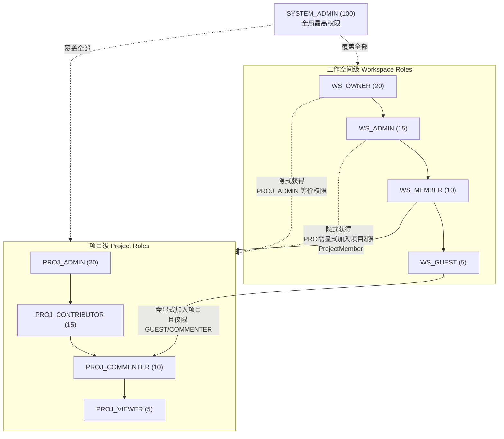
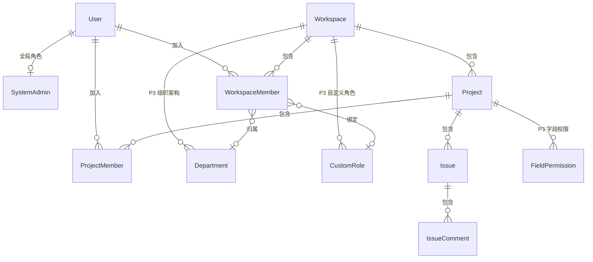
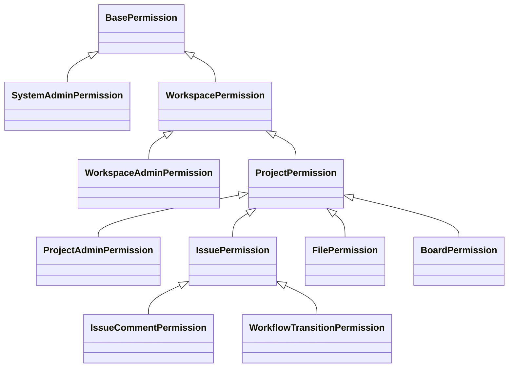
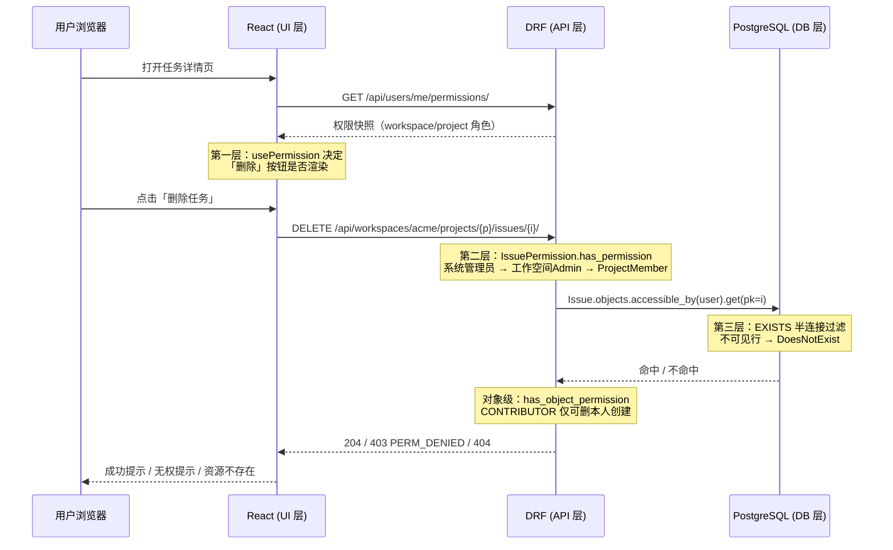

# 三重权限模型设计（UI / API / DB 行级）

> 适用范围：本文档定义全系统的权限模型，是 `AUTH-001 ~ AUTH-009` 全系列功能文档的架构基线，同时约束所有涉及数据可见性的模块（TEAM / PROJ / TASK / WF / BOARD / GANTT / FILE / COLLAB / INTG / RPT）。
>
> 技术栈基线：Django + Django REST Framework + PostgreSQL 14+ / React Router v7 + MobX + SWR。
>
> 关联文档：[`api-conventions.md`](./api-conventions.md)（响应信封与错误码）、[`unified-issue-model.md`](./unified-issue-model.md)（统一工作项模型）、[`dependency-graph.md`](./dependency-graph.md)（模块与文档依赖）。

---

## 1. 设计目标

### 1.1 三重防护

权限校验在三个物理层各自独立执行，任一层被绕过，其余两层仍然生效：

| 层级 | 位置 | 职责 | 失败表现 |
| --- | --- | --- | --- |
| 第一层｜UI 层 | React（`usePermission` / `<PermissionGate>`） | 按钮、菜单、路由、字段的显示 / 隐藏 / 禁用 | 用户看不到入口（体验层，非安全边界） |
| 第二层｜API 层 | DRF `BasePermission` + Mixin | 接口维度的动作鉴权（能否执行这个操作） | HTTP 403，错误码 `PERM_DENIED` |
| 第三层｜DB 层 | Django `Manager.accessible_by()` + `get_queryset()` | 行级数据可见性（能看到哪些行） | HTTP 404（资源在该用户视角下不存在） |

**关键设计约定**：第二层回答「能不能做」，第三层回答「对哪些数据能做」。二者不可互相替代。
第三层返回 404 而非 403 是刻意选择——避免通过 403/404 的差异探测出「资源存在但无权访问」，防止资源 ID 枚举。

### 1.2 杜绝越权

- **水平越权防护**：用户 A 构造 `PUT /api/issues/{B的任务ID}/` 时，第三层过滤后 QuerySet 中不含该行，`get_object()` 直接 404。
- **垂直越权防护**：`WS_MEMBER` 调用工作空间设置接口时，第二层 `WorkspacePermission` 校验 `role >= WS_ADMIN` 失败，返回 403。
- **前端不可信原则**：前端权限数据由后端 `/api/users/me/permissions/` 下发，仅用于渲染决策；后端**绝不**信任任何前端传入的角色、权限、workspace_id 声明，全部从会话用户 + 服务端查询重新推导。
- **不存在「只靠前端隐藏」的功能点**：任何 `<PermissionGate>` 保护的操作，必须存在对应的 DRF Permission 类，二者在代码评审中成对检查（见 §5.5 一致性校验）。

### 1.3 对标策略

| 参考对象 | 吸收的设计 | 落地阶段 |
| --- | --- | --- |
| Plane | 双层 RBAC（Workspace Roles + Project Roles）、角色等级整数化、Owner/Admin 绕过项目成员检查、层级保护规则 | P0 ~ P2 |
| Ones | 自定义角色组、字段级权限、Issue Type 级权限、Project 与 Wiki 统一权限模型、IP 白名单 | P3 ~ P4 |
| 本系统增量 | **第三层 DB 行级过滤**（Plane 的 queryset 过滤散落在各 ViewSet，本系统统一收口到 Manager）、UI/API/DB 三层权限矩阵单一数据源 | P1 ~ P2 |

---

## 2. 角色体系设计

角色分三个正交层级：**系统级**（全局）、**工作空间级**（对标 Plane Workspace）、**项目级**（对标 Plane Project）。
需求文档中的「系统管理员 / 团队管理员 / 普通成员」三级角色，在本模型中的映射关系为：系统管理员 = `SYSTEM_ADMIN`，团队管理员 = `WS_OWNER` / `WS_ADMIN`，普通成员 = `WS_MEMBER` + 项目级角色。

### 2.1 系统级角色（全局）

| 角色 | 代码标识 | 等级值 | 权限范围 |
| --- | --- | --- | --- |
| 系统管理员 | `SYSTEM_ADMIN` | 100 | 全局最高权限，管理全站用户 / 系统配置 / 存储策略 / 集成全局配置；可查看全站所有工作空间、项目、数据；对应 admin 应用（God Mode） |
| 普通用户 | `USER` | 0 | 基础用户身份，本身不携带任何资源权限，实际权限完全由其工作空间角色与项目角色决定 |

> 系统级角色不存储在 `WorkspaceMember` 上，独立建表（见 §3.3），避免「全局角色」与「资源内角色」语义混淆。

### 2.2 工作空间级角色（对标 Plane 的 Workspace Roles）

| 角色 | 代码标识 | 等级值 | 权限范围 |
| --- | --- | --- | --- |
| 所有者 | `WS_OWNER` | 20 | 完全控制，含删除工作空间、转让所有权（`WS_ADMIN` 不具备这两项） |
| 管理员 | `WS_ADMIN` | 15 | 完全管理（设置 / 成员 / 计费 / 项目创建与删除），**可访问工作空间下所有项目**（绕过项目成员检查） |
| 成员 | `WS_MEMBER` | 10 | 标准贡献者，可浏览工作空间项目列表 / Wiki / 全局视图；只能进入自己是成员的项目 |
| 访客 | `WS_GUEST` | 5 | 最受限，**看不到项目列表**，只能看到被明确添加为项目成员的项目；无工作空间级浏览权 |

### 2.3 项目级角色（对标 Plane 的 Project Roles）

| 角色 | 代码标识 | 等级值 | 权限范围 |
| --- | --- | --- | --- |
| 项目管理员 | `PROJ_ADMIN` | 20 | 项目完全控制（设置 / 成员 / 任务 / 周期 / 模块 / 状态与工作流 / 删除项目） |
| 协作者 | `PROJ_CONTRIBUTOR` | 15 | 创建 / 编辑任务、上传文件、参与协作；**只能删除自己创建的**任务与评论 |
| 评论者 | `PROJ_COMMENTER` | 10 | 只读 + 评论；不可创建 / 编辑任务 |
| 查看者 | `PROJ_VIEWER` | 5 | 仅可查看，不可评论、不可写任何数据 |

### 2.4 角色层级关系图



**核心语义**：
1. 工作空间角色与项目角色**独立存储、独立判定**，不自动继承（`WS_MEMBER` 不等于任何项目的成员）。
2. 唯一例外：`WS_OWNER` / `WS_ADMIN` 在权限判定时**隐式视为所有项目的 `PROJ_ADMIN`**（Plane 同款设计，见 §7.4）。
3. 项目角色的等级值刻意与工作空间角色采用同一数值区间，便于统一的 `role >= X` 比较语义与统一的 `RoleLevel` 枚举复用。

---

## 3. Django Model 设计

### 3.1 角色枚举与基类

```python
# apps/api/plane/db/models/base.py
import uuid
from django.db import models


class BaseModel(models.Model):
    """全站模型基类：UUID 主键 + 审计字段 + 软删除位。"""

    id = models.UUIDField(default=uuid.uuid4, unique=True, editable=False,
                          db_index=True, primary_key=True)
    created_at = models.DateTimeField(auto_now_add=True, verbose_name="Created At")
    updated_at = models.DateTimeField(auto_now=True, verbose_name="Last Modified At")
    created_by = models.ForeignKey("db.User", on_delete=models.SET_NULL, null=True,
                                   related_name="%(class)s_created_by")
    updated_by = models.ForeignKey("db.User", on_delete=models.SET_NULL, null=True,
                                   related_name="%(class)s_updated_by")
    deleted_at = models.DateTimeField(null=True, blank=True, db_index=True)

    class Meta:
        abstract = True
        ordering = ("-created_at",)
```

```python
# apps/api/plane/db/models/roles.py
from django.db import models


class WorkspaceRole(models.IntegerChoices):
    """工作空间角色等级（数字化，便于 role >= X 比较）。"""

    OWNER = 20, "Owner"
    ADMIN = 15, "Admin"
    MEMBER = 10, "Member"
    GUEST = 5, "Guest"


class ProjectRole(models.IntegerChoices):
    """项目角色等级（数字化，与 WorkspaceRole 同区间以便统一比较）。"""

    ADMIN = 20, "Admin"
    CONTRIBUTOR = 15, "Contributor"
    COMMENTER = 10, "Commenter"
    VIEWER = 5, "Viewer"
```

> **为什么用整数而不是字符串**：Plane 的核心设计取舍。整数使「等级比较」成为一次索引扫描（`role__gte=15`），无需在 Python 侧维护映射表；同时天然支持 §7.1 的层级保护规则（`operator.role > target.role`）。代价是可读性下降，通过 `IntegerChoices` 的 `label` 与 API 序列化层的双向转换补偿。

### 3.2 成员关系模型

```python
# apps/api/plane/db/models/workspace.py
class WorkspaceMember(BaseModel):
    """工作空间成员：用户在某工作空间内的角色归属。"""

    workspace = models.ForeignKey("db.Workspace", on_delete=models.CASCADE,
                                  related_name="workspace_member")
    member = models.ForeignKey("db.User", on_delete=models.CASCADE,
                               related_name="member_workspace")
    role = models.IntegerField(choices=WorkspaceRole.choices,
                               default=WorkspaceRole.MEMBER)
    is_active = models.BooleanField(default=True)          # 停用而不删除，保留历史归属
    company_role = models.TextField(null=True, blank=True)  # 展示用职位，非权限字段
    # P3 企业版扩展位：P0 不创建 department / custom_role 外键列。
    # 待 P3 引入 Department / CustomRole 表后，再通过独立 migration 添加字段。

    class Meta:
        unique_together = ("workspace", "member")
        indexes = [
            models.Index(fields=["member", "workspace", "role"]),  # 权限判定主索引
            models.Index(fields=["workspace", "role"]),            # 成员列表按角色筛选
        ]
```

```python
# apps/api/plane/db/models/project.py
class ProjectMember(BaseModel):
    """项目成员：用户在某项目内的角色归属，与工作空间角色完全独立。"""

    project = models.ForeignKey("db.Project", on_delete=models.CASCADE,
                                related_name="project_projectmember")
    workspace = models.ForeignKey("db.Workspace", on_delete=models.CASCADE,
                                   related_name="project_member")  # 反范式冗余，避免 JOIN
    member = models.ForeignKey("db.User", on_delete=models.CASCADE,
                               related_name="member_project")
    role = models.IntegerField(choices=ProjectRole.choices,
                               default=ProjectRole.CONTRIBUTOR)
    is_active = models.BooleanField(default=True)
    view_props = models.JSONField(default=dict)  # 个人视图偏好，非权限字段

    class Meta:
        unique_together = ("project", "member")
        indexes = [
            models.Index(fields=["member", "project", "role"]),   # 权限判定主索引
            models.Index(fields=["member", "workspace"]),         # 行级过滤子查询索引
        ]
```

> **`workspace` 冗余字段说明**：`ProjectMember` 上冗余 `workspace_id`，使「查询用户在某工作空间下所有可见项目」退化为单表扫描，无需 `JOIN project`。这是行级过滤（§6）的核心性能保障。冗余字段在 `save()` 中由 `project.workspace_id` 自动填充，禁止手工赋值。

### 3.3 系统管理员模型

```python
# apps/api/plane/db/models/system.py
class SystemAdmin(BaseModel):
    """系统管理员单独表：全局角色与资源内角色语义分离。"""

    user = models.OneToOneField("db.User", on_delete=models.CASCADE,
                                related_name="system_admin")
    is_active = models.BooleanField(default=True)
    granted_by = models.ForeignKey("db.User", on_delete=models.SET_NULL, null=True,
                                    related_name="granted_system_admins")
    # P3：IP 白名单（对标 Ones），为空表示不限制
    allowed_ip_cidrs = models.JSONField(default=list, blank=True)

    class Meta:
        indexes = [models.Index(fields=["user", "is_active"])]
```

**为什么单独建表而不在 `User` 上加 `is_system_admin` 布尔位**：
1. 系统管理员的授予需要审计（谁授予、何时授予），布尔位承载不了。
2. 单独表使「系统管理员集合」可被独立缓存（体量极小，常驻 Redis），避免每次鉴权都触碰 `User` 表。
3. P3 阶段的 IP 白名单、敏感操作二次确认等策略挂载在此表，不污染 `User`。

### 3.4 P3 企业版扩展模型（预留）

```python
class Department(BaseModel):
    """部门层级（P3，对标 Ones 组织架构）。"""
    workspace = models.ForeignKey("db.Workspace", on_delete=models.CASCADE)
    parent = models.ForeignKey("self", on_delete=models.CASCADE, null=True,
                               blank=True, related_name="children")
    name = models.CharField(max_length=255)
    path = models.TextField(db_index=True)  # 物化路径 /root/a/b，便于子树查询


class CustomRole(BaseModel):
    """自定义角色组（P3，对标 Ones Custom Roles）。"""
    workspace = models.ForeignKey("db.Workspace", on_delete=models.CASCADE)
    name = models.CharField(max_length=255)
    base_role = models.IntegerField(choices=ProjectRole.choices)  # 继承的基线角色
    permissions = models.JSONField(default=dict)  # {"issue.delete": true, ...} 差异覆盖


class FieldPermission(BaseModel):
    """字段级权限（P3，对标 Ones Field-Level Permissions）。"""
    project = models.ForeignKey("db.Project", on_delete=models.CASCADE)
    issue_type = models.ForeignKey("db.IssueType", on_delete=models.CASCADE, null=True)
    field_key = models.CharField(max_length=255)  # 内置字段名或自定义字段 ID
    role = models.IntegerField(choices=ProjectRole.choices)
    access = models.CharField(max_length=16, choices=[
        ("hidden", "Hidden"), ("readonly", "Read Only"),
        ("editable", "Editable"), ("required", "Required"),
    ])
```

### 3.5 模型关系图



---

## 4. 第一层：前端按钮级权限控制

### 4.1 权限数据下发与缓存

后端在会话建立后提供一次性权限快照接口，前端存入 MobX Store：

```
GET /api/users/me/permissions/
{
  "is_system_admin": false,
  "workspaces": {
    "<workspace_id>": { "slug": "acme", "role": 15 }
  },
  "projects": {
    "<project_id>": { "workspace_id": "...", "role": 20, "inherited": false }
  }
}
```

`inherited: true` 表示该项目角色由 `WS_OWNER` / `WS_ADMIN` 隐式推导而来（用户并非显式 `ProjectMember`），前端据此在成员列表中标注「继承自工作空间管理员」。

```typescript
// apps/web/core/store/user/permission.store.ts
import { makeObservable, observable, computed, action, runInAction } from "mobx";

export class UserPermissionStore {
  isSystemAdmin = false;
  workspaceRoleMap: Record<string, number> = {};   // workspaceId -> role level
  projectRoleMap: Record<string, number> = {};     // projectId  -> role level

  constructor(private root: RootStore) {
    makeObservable(this, {
      isSystemAdmin: observable,
      workspaceRoleMap: observable,
      projectRoleMap: observable,
      currentWorkspaceRole: computed,
      currentProjectRole: computed,
      fetchPermissions: action,
    });
  }

  get currentWorkspaceRole(): number | undefined {
    const id = this.root.router.workspaceId;
    return id ? this.workspaceRoleMap[id] : undefined;
  }

  get currentProjectRole(): number | undefined {
    const id = this.root.router.projectId;
    if (!id) return undefined;
    // 系统管理员 / 工作空间 Owner|Admin 隐式获得 PROJ_ADMIN
    if (this.isSystemAdmin) return ProjectRole.ADMIN;
    if ((this.currentWorkspaceRole ?? 0) >= WorkspaceRole.ADMIN) return ProjectRole.ADMIN;
    return this.projectRoleMap[id];
  }

  fetchPermissions = async () => {
    const data = await userService.getPermissions();
    runInAction(() => {
      this.isSystemAdmin = data.is_system_admin;
      this.workspaceRoleMap = mapRoles(data.workspaces);
      this.projectRoleMap = mapRoles(data.projects);
    });
  };
}
```

**缓存失效策略**：`WorkspaceMember` / `ProjectMember` 的角色变更通过 WebSocket（`COLLAB-004`）推送 `permission.changed` 事件，前端收到后重新拉取权限快照并让相关 SWR key 失效。降级方案：权限快照 TTL 5 分钟，SWR `revalidateOnFocus` 兜底。

### 4.2 权限矩阵单一数据源

前后端共享同一份权限矩阵定义（`packages/constants/src/permission.ts` 生成 Python 常量，或由后端 `/api/meta/permission-matrix/` 下发），确保两层判定结果一致：

```typescript
// packages/constants/src/permission.ts
export type PermissionKey =
  | "workspace.read" | "workspace.update" | "workspace.delete" | "workspace.member.manage"
  | "project.create" | "project.read"  | "project.update" | "project.delete"
  | "project.member.manage" | "project.setting.manage"
  | "issue.create" | "issue.read" | "issue.update" | "issue.delete" | "issue.delete.own"
  | "issue.assign" | "issue.state.transition" | "issue.field.manage"
  | "comment.create" | "comment.update.own" | "comment.delete" | "comment.delete.own"
  | "file.upload" | "file.read" | "file.delete" | "file.share" | "file.permission.manage"
  | "board.read" | "board.update" | "board.manage" | "gantt.read" | "gantt.update"
  | "workflow.manage" | "approval.act" | "report.read" | "report.export"
  | "integration.manage" | "audit.read";

/** 项目级：角色最低等级要求。undefined 表示该角色完全不具备此权限。 */
export const PROJECT_PERMISSION_MATRIX: Record<PermissionKey, number | undefined> = {
  "issue.create":  ProjectRole.CONTRIBUTOR,
  "issue.update":  ProjectRole.CONTRIBUTOR,
  "issue.delete":  ProjectRole.ADMIN,
  "issue.delete.own": ProjectRole.CONTRIBUTOR,
  "issue.read":    ProjectRole.VIEWER,
  "comment.create": ProjectRole.COMMENTER,
  // ... 完整定义见 §8 权限矩阵
};
```

### 4.3 权限 Hook

```typescript
// apps/web/core/hooks/use-permission.ts
export const usePermission = (
  permission: PermissionKey,
  scope: PermissionScope = "project",
  resourceId?: string,
): boolean => {
  const { permission: store } = useUserStore();

  return computedFn(() => {
    if (store.isSystemAdmin) return true;

    const required = scope === "workspace"
      ? WORKSPACE_PERMISSION_MATRIX[permission]
      : PROJECT_PERMISSION_MATRIX[permission];
    if (required === undefined) return false;

    const actual = scope === "workspace"
      ? (resourceId ? store.workspaceRoleMap[resourceId] : store.currentWorkspaceRole)
      : (resourceId ? store.resolveProjectRole(resourceId) : store.currentProjectRole);

    return (actual ?? 0) >= required;
  })();
};
```

**「仅限本人」类权限的处理**：`issue.delete` 与 `issue.delete.own` 是两个独立 key。UI 判定用 `useCanDelete(issue)` 组合：

```typescript
export const useCanDeleteIssue = (issue: TIssue): boolean => {
  const canDeleteAny = usePermission("issue.delete");
  const canDeleteOwn = usePermission("issue.delete.own");
  const { data: me } = useCurrentUser();
  return canDeleteAny || (canDeleteOwn && issue.created_by === me?.id);
};
```

### 4.4 权限指令组件

```tsx
// apps/web/core/components/permission/permission-gate.tsx
type Props = {
  permission: PermissionKey;
  scope?: PermissionScope;
  resourceId?: string;
  /** hide：不渲染（默认）；disable：渲染但禁用；fallback：渲染 fallback 节点 */
  mode?: "hide" | "disable" | "fallback";
  fallback?: React.ReactNode;
  children: React.ReactNode;
};

export const PermissionGate: React.FC<Props> = observer((props) => {
  const { permission, scope = "project", resourceId, mode = "hide", fallback, children } = props;
  const allowed = usePermission(permission, scope, resourceId);

  if (allowed) return <>{children}</>;
  if (mode === "hide") return null;
  if (mode === "fallback") return <>{fallback}</>;

  // disable：注入 disabled 并附带原因提示，比直接隐藏更利于用户理解
  return (
    <Tooltip content="当前角色无权执行此操作">
      <div className="pointer-events-none opacity-50" aria-disabled="true">
        {children}
      </div>
    </Tooltip>
  );
});
```

使用示例：

> 命名约定：需求文档中口语化的 `issue.edit` 在权限矩阵中的正式 Key 为 `issue.update`（全站统一采用 REST 动词 `create / read / update / delete / manage`，不引入 `edit` 别名，避免同义双名导致前后端矩阵对不齐）。

```tsx
<PermissionGate permission="issue.update">
  <Button onClick={openEditModal}>编辑任务</Button>
</PermissionGate>

<PermissionGate permission="project.delete" mode="disable">
  <DangerButton onClick={confirmDelete}>删除项目</DangerButton>
</PermissionGate>

<PermissionGate permission="workspace.member.manage" scope="workspace" mode="fallback"
                fallback={<ReadOnlyMemberList />}>
  <EditableMemberList />
</PermissionGate>
```

### 4.5 UI 层落地清单

| UI 元素类型 | 处理方式 | 示例 |
| --- | --- | --- |
| 主操作按钮 | `mode="hide"`，无权即不出现 | 新建任务、上传文件 |
| 危险操作按钮 | `mode="disable"` + Tooltip 说明原因 | 删除项目、解散团队 |
| 侧边栏 / 设置菜单项 | `mode="hide"`，同时在路由层守卫 | 工作空间设置、计费 |
| 路由 | `PermissionRouteGuard` 高阶组件，无权重定向到 403 页 | `/:ws/settings/members` |
| 表格行内操作 | 逐行调用 `useCanDeleteIssue(row)`，支持「仅本人」语义 | 任务列表删除图标 |
| 拖拽交互 | 无 `issue.state.transition` 权限时 `isDragDisabled` | 看板卡片跨列拖拽（`BOARD-001`） |
| 字段（P3） | `FieldPermission` 驱动 `hidden` / `readonly` / `required` | 任务详情字段区 |

---

## 5. 第二层：后端接口二次鉴权

### 5.1 Permission 类层级



### 5.2 基类实现

```python
# apps/api/plane/app/permissions/base.py
from rest_framework.permissions import BasePermission, SAFE_METHODS

from plane.db.models import ProjectMember, ProjectRole, SystemAdmin, WorkspaceMember, WorkspaceRole


class PermissionDeniedWithCode(PermissionDenied):
    """统一 403 + 错误码 PERM_DENIED。"""
    default_code = "PERM_DENIED"


def is_system_admin(user) -> bool:
    return SystemAdmin.objects.filter(user=user, is_active=True).exists()


class WorkspacePermission(BasePermission):
    """工作空间级权限基类。

    子类通过 required_role / required_role_map 声明所需最低角色等级。
    """

    message = "当前角色无权执行此操作"
    code = "PERM_DENIED"

    #: 读操作与写操作分别要求的最低等级
    read_role: int = WorkspaceRole.GUEST
    write_role: int = WorkspaceRole.ADMIN

    def get_workspace_slug(self, view) -> str | None:
        return view.kwargs.get("slug") or view.kwargs.get("workspace_slug")

    def get_workspace_role(self, request, view) -> int | None:
        slug = self.get_workspace_slug(view)
        if not slug:
            return None
        # 单请求内缓存，避免同一请求多次查询
        cache_key = f"_ws_role_{slug}"
        if not hasattr(request, cache_key):
            role = (WorkspaceMember.objects
                    .filter(workspace__slug=slug, member=request.user, is_active=True)
                    .values_list("role", flat=True).first())
            setattr(request, cache_key, role)
        return getattr(request, cache_key)

    def has_permission(self, request, view) -> bool:
        if not request.user or not request.user.is_authenticated:
            return False
        if is_system_admin(request.user):
            return True

        role = self.get_workspace_role(request, view)
        if role is None:
            return False
        required = self.read_role if request.method in SAFE_METHODS else self.write_role
        return role >= required


class WorkspaceAdminPermission(WorkspacePermission):
    """仅工作空间 Admin 及以上（设置、成员、计费）。"""
    read_role = WorkspaceRole.ADMIN
    write_role = WorkspaceRole.ADMIN


class WorkspaceOwnerPermission(WorkspacePermission):
    """仅 Owner（删除工作空间、转让所有权）。"""
    read_role = WorkspaceRole.OWNER
    write_role = WorkspaceRole.OWNER
```

```python
# apps/api/plane/app/permissions/project.py
class ProjectPermission(WorkspacePermission):
    """项目级权限基类。

    判定顺序（短路）：
      1. 系统管理员            -> 允许
      2. 工作空间 Owner/Admin  -> 允许（绕过项目成员检查，Plane 同款）
      3. 显式 ProjectMember 且 role >= 所需等级 -> 允许
      4. 其余                  -> 拒绝
    """

    read_role = ProjectRole.VIEWER
    write_role = ProjectRole.CONTRIBUTOR

    def get_project_id(self, view):
        return view.kwargs.get("project_id") or view.kwargs.get("pk")

    def get_effective_project_role(self, request, view) -> int | None:
        if is_system_admin(request.user):
            return ProjectRole.ADMIN

        ws_role = self.get_workspace_role(request, view)
        if ws_role is not None and ws_role >= WorkspaceRole.ADMIN:
            return ProjectRole.ADMIN          # 隐式项目管理员

        project_id = self.get_project_id(view)
        if not project_id:
            return None
        cache_key = f"_proj_role_{project_id}"
        if not hasattr(request, cache_key):
            role = (ProjectMember.objects
                    .filter(project_id=project_id, member=request.user, is_active=True)
                    .values_list("role", flat=True).first())
            setattr(request, cache_key, role)
        return getattr(request, cache_key)

    def has_permission(self, request, view) -> bool:
        if not request.user or not request.user.is_authenticated:
            return False
        role = self.get_effective_project_role(request, view)
        if role is None:
            return False
        required = self.read_role if request.method in SAFE_METHODS else self.write_role
        return role >= required


class ProjectAdminPermission(ProjectPermission):
    read_role = ProjectRole.ADMIN
    write_role = ProjectRole.ADMIN
```

### 5.3 对象级权限与「仅本人」语义

```python
# apps/api/plane/app/permissions/issue.py
class IssuePermission(ProjectPermission):
    """任务级权限，继承项目权限。

    额外承担两件事：
      1. COMMENTER 可读不可写（write_role 提升到 CONTRIBUTOR）
      2. CONTRIBUTOR 的 destroy 仅限本人创建的任务（对象级判定）
    """

    read_role = ProjectRole.VIEWER
    write_role = ProjectRole.CONTRIBUTOR

    def has_object_permission(self, request, view, obj) -> bool:
        role = self.get_effective_project_role(request, view)
        if role is None:
            return False
        if request.method in SAFE_METHODS:
            return role >= ProjectRole.VIEWER
        if role >= ProjectRole.ADMIN:
            return True
        if view.action == "destroy":
            # CONTRIBUTOR 只能删除自己创建的
            return role >= ProjectRole.CONTRIBUTOR and obj.created_by_id == request.user.id
        return role >= ProjectRole.CONTRIBUTOR


class IssueCommentPermission(IssuePermission):
    """评论：COMMENTER 即可创建；编辑/删除仅限本人或项目管理员。"""

    write_role = ProjectRole.COMMENTER

    def has_object_permission(self, request, view, obj) -> bool:
        role = self.get_effective_project_role(request, view)
        if role is None:
            return False
        if request.method in SAFE_METHODS:
            return role >= ProjectRole.VIEWER
        if role >= ProjectRole.ADMIN:
            return True
        return obj.actor_id == request.user.id
```

### 5.4 装饰器 / Mixin 模式

三种用法并存，按场景选择：

**（a）ViewSet 声明式（首选）**

```python
class IssueViewSet(BaseViewSet):
    model = Issue
    serializer_class = IssueSerializer
    permission_classes = [IssuePermission]

    def get_queryset(self):
        return Issue.objects.accessible_by(self.request.user).filter(
            project_id=self.kwargs["project_id"]
        )
```

**（b）Mixin：为非 ViewSet 的 APIView 提供统一能力**

```python
class ProjectScopedMixin:
    """为 APIView 注入 self.project / self.project_role，并强制项目权限校验。"""

    permission_classes = [ProjectPermission]

    def initial(self, request, *args, **kwargs):
        super().initial(request, *args, **kwargs)
        self.project = get_object_or_404(
            Project.objects.accessible_by(request.user), pk=kwargs["project_id"]
        )
        self.project_role = ProjectPermission().get_effective_project_role(request, self)
```

**（c）装饰器：细粒度动作级校验（同一 ViewSet 内不同 action 要求不同等级）**

```python
# apps/api/plane/app/permissions/decorators.py
def require_permission(permission_key: str, scope: str = "project"):
    """按权限矩阵 key 校验，矩阵与前端 packages/constants 同源。"""

    def decorator(func):
        @wraps(func)
        def wrapper(self, request, *args, **kwargs):
            required = PERMISSION_MATRIX[scope][permission_key]
            actual = resolve_effective_role(request, self, scope)
            if actual is None or actual < required:
                raise PermissionDeniedWithCode(
                    detail=f"缺少权限：{permission_key}"
                )
            return func(self, request, *args, **kwargs)
        return wrapper
    return decorator


class ProjectViewSet(BaseViewSet):
    @action(detail=True, methods=["post"])
    @require_permission("project.member.manage")
    def add_member(self, request, slug, pk):
        ...
```

### 5.5 统一 403 响应与一致性校验

响应信封遵循 [`api-conventions.md`](./api-conventions.md) §4.2 的统一错误结构，权限类错误使用 `PERM_*` 码族：

```python
# apps/api/plane/utils/exception_handler.py
def custom_exception_handler(exc, context):
    response = exception_handler(exc, context)
    if isinstance(exc, (PermissionDenied, PermissionDeniedWithCode)):
        return Response(
            {
                "status": "error",
                "error": {
                    "code": getattr(exc, "code", "PERM_DENIED"),
                    "message": str(exc.detail) or "当前角色无权执行此操作",
                    "details": [],
                    "request_id": get_request_id(context["request"]),
                },
            },
            status=status.HTTP_403_FORBIDDEN,
        )
    return response
```

**错误码分工**（与 `api-conventions.md` §5 错误码表对齐）：

| 场景 | HTTP | 错误码 |
| --- | :-: | --- |
| 能看见但不能操作（第二层拦截） | 403 | `PERM_DENIED` |
| 层级保护触发（§7.1） | 403 | `PERM_ROLE_HIERARCHY` |
| 末位 Owner/Admin 保护（§7.2） | 403 | `PERM_LAST_OWNER` |
| Guest 角色上限（§7.3） | 403 | `PERM_GUEST_LIMIT` |
| 无权知晓其存在（第三层过滤） | 404 | `RESOURCE_NOT_FOUND` |
| IP 白名单拦截（§11.5） | 403 | `IP_NOT_ALLOWED` |

**一致性校验（CI 关卡）**：新增单元测试遍历权限矩阵，断言每个 `PermissionKey` 都同时存在
（1）前端矩阵条目、（2）后端矩阵条目、（3）至少一个引用它的 DRF Permission 类或 `@require_permission` 装饰器。
缺任一项则 CI 失败，从机制上阻止「只有前端隐藏、后端没拦」的漏洞。

---

## 6. 第三层：数据库行级过滤

### 6.1 设计原则

- 每个受权限管控的模型提供 `objects.accessible_by(user)`，返回该用户可见的 QuerySet。
- **所有** ViewSet 的 `get_queryset()` 必须以 `accessible_by(self.request.user)` 为起点，禁止直接使用 `Model.objects.all()`。
- `list` / `retrieve` / `update` / `partial_update` / `destroy` 全部经由同一个 `get_queryset()`，因此 `get_object()` 天然只能命中可见行，越权访问表现为 404。

### 6.2 Manager 实现

```python
# apps/api/plane/db/models/managers.py
from django.db import models
from django.db.models import Q, Exists, OuterRef


class AccessibleQuerySetMixin:
    """提供 accessible_by 的公共骨架。"""

    def accessible_by(self, user):
        if user is None or user.is_anonymous:
            return self.none()
        if SystemAdmin.objects.filter(user=user, is_active=True).exists():
            return self.all()                      # 系统管理员：全部可见
        return self._scoped_for(user)

    def _scoped_for(self, user):
        raise NotImplementedError


class ProjectQuerySet(AccessibleQuerySetMixin, models.QuerySet):
    def _scoped_for(self, user):
        # 工作空间 Owner/Admin：该 workspace 下全部项目可见
        ws_admin = WorkspaceMember.objects.filter(
            member=user, is_active=True,
            role__gte=WorkspaceRole.ADMIN,
            workspace_id=OuterRef("workspace_id"),
        )
        # 普通成员/访客：仅显式加入的项目
        is_member = ProjectMember.objects.filter(
            member=user, is_active=True, project_id=OuterRef("pk"),
        )
        return self.annotate(
            _ws_admin=Exists(ws_admin), _is_member=Exists(is_member),
        ).filter(Q(_ws_admin=True) | Q(_is_member=True))


class IssueQuerySet(AccessibleQuerySetMixin, models.QuerySet):
    def _scoped_for(self, user):
        ws_admin = WorkspaceMember.objects.filter(
            member=user, is_active=True,
            role__gte=WorkspaceRole.ADMIN,
            workspace_id=OuterRef("workspace_id"),
        )
        is_member = ProjectMember.objects.filter(
            member=user, is_active=True, project_id=OuterRef("project_id"),
        )
        return self.annotate(
            _ws_admin=Exists(ws_admin), _is_member=Exists(is_member),
        ).filter(
            Q(_ws_admin=True) | Q(_is_member=True)
        ).exclude(
            # 私密项目（P3）：即使是工作空间 Admin 也需在白名单内
            Q(project__is_confidential=True) & ~Q(_is_member=True)
        )


class IssueManager(models.Manager.from_queryset(IssueQuerySet)):
    """Issue 默认 Manager。

    accessible_by(user) 语义：
      - 系统管理员：全部可见
      - 工作空间 Owner/Admin：该 workspace 下全部 Issue 可见（私密项目除外）
      - 项目成员（任意项目角色）：仅所属项目内 Issue 可见
      - 非成员：不可见
    """

    def get_queryset(self):
        return super().get_queryset().filter(deleted_at__isnull=True)
```

各模块 Manager 的收口方式（全部委托给上游资源的可见性，避免逻辑重复）：

| 模型 | `accessible_by` 实现要点 |
| --- | --- |
| `Workspace` | `WorkspaceMember` 存在性过滤 |
| `Project` | 见 `ProjectQuerySet`（工作空间 Admin ∪ 项目成员） |
| `Issue` | 见 `IssueQuerySet` |
| `IssueComment` | `filter(issue__in=Issue.objects.accessible_by(user))` |
| `IssueAttachment` / `ProjectFile` | 委托 `Project`，再叠加 `FILE-006` 的文件可见范围（全员 / 仅管理员 / 指定成员） |
| `Board` / `View` | 委托 `Project`，再叠加视图 `access`（个人 / 项目共享） |
| `Notification` | `filter(receiver=user)`（天然行级隔离） |
| `Workflow` / `Approval` | 委托 `Project` |
| `AuditLog` | 仅 `SystemAdmin` 与 `WS_OWNER`/`WS_ADMIN`（限本 workspace） |

### 6.3 ViewSet 强制注入

```python
# apps/api/plane/app/views/base.py
class BaseViewSet(ModelViewSet):
    """全站 ViewSet 基类：强制行级过滤。"""

    model = None

    def get_queryset(self):
        if self.model is None:
            raise ImproperlyConfigured("BaseViewSet 子类必须声明 model")
        manager = self.model.objects
        if not hasattr(manager, "accessible_by"):
            raise ImproperlyConfigured(
                f"{self.model.__name__} 缺少 accessible_by，无法完成第三层行级过滤"
            )
        return manager.accessible_by(self.request.user)
```

**兜底护栏**：`BaseViewSet` 在 `model` 未声明或 Manager 未实现 `accessible_by` 时直接抛 `ImproperlyConfigured`，让「忘记加行级过滤」在开发期即崩溃，而不是上线后变成数据泄漏。
另有 CI 静态检查：扫描 `plane/app/views/` 下所有 `get_queryset` 定义，若出现 `objects.all()` / `objects.filter(` 且未出现 `accessible_by`，则报错。

### 6.4 性能保障

| 措施 | 说明 |
| --- | --- |
| 索引 | `ProjectMember(member, workspace)`、`ProjectMember(member, project, role)`、`WorkspaceMember(member, workspace, role)` |
| `Exists()` 而非 `IN (子查询)` | PostgreSQL 对 `EXISTS` 可做半连接短路，数据量大时显著优于 `IN` 展开 |
| 反范式 `workspace_id` | `ProjectMember` / `Issue` 冗余 `workspace_id`，行级过滤无需 JOIN `project` |
| 请求级缓存 | 角色查询结果挂在 `request` 对象上，单请求内最多查一次 |
| `SystemAdmin` 缓存 | 集合极小，Redis 常驻，TTL 60s，变更时主动失效 |
| 大列表分页 | 看板 / 列表视图强制分页（默认 100），避免过滤后全表扫描 |

---

## 7. 层级权限保护规则

### 7.1 只能操作低于自己等级的成员（参考 Plane）

```python
def assert_can_manage_member(operator_role: int, target_role: int, new_role: int | None = None):
    """成员管理的层级保护。"""
    if target_role >= operator_role:
        raise PermissionDeniedWithCode("不能修改权限等级高于或等于自己的成员")
    if new_role is not None and new_role >= operator_role:
        raise PermissionDeniedWithCode("不能将成员提升到高于或等于自己的等级")
```

- `WS_ADMIN` 不能修改 / 移除 `WS_OWNER`，也不能将他人提升为 `WS_OWNER`。
- `WS_ADMIN` 之间不能互相降级（等级相等）；只有 `WS_OWNER` 能管理 `WS_ADMIN`。
- 同规则套用于 `ProjectMember`：`PROJ_ADMIN` 之间不可互相降级。

### 7.2 最后一个 Owner / Admin 保护

```python
def assert_not_last_owner(workspace_id, member_id):
    remaining = WorkspaceMember.objects.filter(
        workspace_id=workspace_id, role=WorkspaceRole.OWNER, is_active=True,
    ).exclude(member_id=member_id).exists()
    if not remaining:
        raise PermissionDeniedWithCode(
            "工作空间必须保留至少一名所有者，请先转让所有权"
        )
```

覆盖场景：**离开工作空间**、**被移除**、**角色降级**、**账号禁用**（`AUTH-007`）四条路径都必须调用该校验。
项目侧同理：项目必须保留至少一名 `PROJ_ADMIN`；若项目 Admin 全部离开，自动回退为「由工作空间 Admin 隐式管理」并在项目动态中记录一条系统事件。

### 7.3 Guest 提升限制

```python
# 工作空间访客在项目中的可选角色上限：VIEWER(5) / COMMENTER(10)
ALLOWED_PROJECT_ROLES_FOR_GUEST = {ProjectRole.VIEWER, ProjectRole.COMMENTER}


def assert_valid_project_role_for_guest(workspace_role: int, project_role: int):
    if workspace_role == WorkspaceRole.GUEST and project_role > ProjectRole.COMMENTER:
        raise PermissionDeniedWithCode(
            "工作空间访客在项目中最高只能被分配为评论者"
        )
```

- `WS_GUEST` 在项目中只能是 `PROJ_VIEWER` 或 `PROJ_COMMENTER`，不能是 `PROJ_CONTRIBUTOR` / `PROJ_ADMIN`。
- 若要给某访客更高的项目权限，必须先将其工作空间角色提升为 `WS_MEMBER`。
- `WS_GUEST` 看不到工作空间项目列表接口的完整结果，只返回其显式加入的项目。
- 降级保护：将 `WS_MEMBER` 降级为 `WS_GUEST` 时，若其在任何项目中持有 `PROJ_CONTRIBUTOR` 及以上角色，需在同一事务内一并降级为 `PROJ_COMMENTER`，并向该用户推送通知。

### 7.4 工作空间 Owner / Admin 绕过项目成员检查

```python
# ProjectPermission.get_effective_project_role 中的核心分支
ws_role = self.get_workspace_role(request, view)
if ws_role is not None and ws_role >= WorkspaceRole.ADMIN:
    return ProjectRole.ADMIN
```

- `WS_OWNER` / `WS_ADMIN` 无需成为 `ProjectMember` 即可访问工作空间下任意项目，等价 `PROJ_ADMIN`。
- 该绕过在第二层与第三层**同步生效**（`ProjectQuerySet._scoped_for` 中的 `_ws_admin` 分支），否则会出现「有权限但查不到数据」的不一致。
- **唯一例外**：P3 的私密 / 涉密项目（`Project.is_confidential=True`，`PROJ-006`），要求即使工作空间 Admin 也必须在项目成员白名单内。该例外在 `IssueQuerySet` 的 `exclude()` 中实现。
- 成员列表 UI 中，隐式管理员标注为「继承自工作空间管理员」，不出现在 `ProjectMember` 计数里。

### 7.5 其他保护规则

| 规则 | 说明 | 落地位置 |
| --- | --- | --- |
| 所有权转让 | 仅 `WS_OWNER` 可转让；转让后原 Owner 自动降为 `WS_ADMIN`；需二次确认 | `TEAM-004` |
| 自我提权禁止 | 任何角色不可修改自己的 `role` 字段（序列化层剔除） | `AUTH-007` |
| 系统管理员授予 | 仅现任 `SYSTEM_ADMIN` 可授予 / 撤销；不能撤销自己（避免无管理员） | `AUTH-001` |
| 跨工作空间数据引用 | `Issue.project.workspace_id` 与请求 `slug` 不一致时直接 404，防止跨租户 ID 拼接 | `BaseViewSet` |
| 状态流转权限（P3） | `WF-003` 的流转权限独立于 `issue.update`，节点可绑定角色 | `WF-003` |
| 敏感操作审计 | 角色变更、权限授予、项目删除全部写 `AuditLog`，不可关闭 | `AUTH-009` |

---

## 8. 权限矩阵（完整）

等级值参照：`WS_OWNER=20 / WS_ADMIN=15 / WS_MEMBER=10 / WS_GUEST=5`；`PROJ_ADMIN=20 / PROJ_CONTRIBUTOR=15 / PROJ_COMMENTER=10 / PROJ_VIEWER=5`。
图例：✅ 允许　⚠️ 受限（见备注）　❌ 拒绝　—— 不适用。`SYSTEM_ADMIN` 对下表所有条目均为 ✅（全站超级权限），故不单列。

### 8.1 工作空间级资源

| 资源 | 操作 | 权限 Key | WS_OWNER | WS_ADMIN | WS_MEMBER | WS_GUEST |
| --- | --- | --- | :-: | :-: | :-: | :-: |
| Workspace | read | `workspace.read` | ✅ | ✅ | ✅ | ⚠️ 仅基础信息 |
| Workspace | update（名称/描述/头像） | `workspace.update` | ✅ | ✅ | ❌ | ❌ |
| Workspace | delete（解散） | `workspace.delete` | ✅ | ❌ | ❌ | ❌ |
| Workspace | archive（归档） | `workspace.archive` | ✅ | ✅ | ❌ | ❌ |
| Workspace | transfer_ownership | `workspace.transfer` | ✅ | ❌ | ❌ | ❌ |
| Workspace Setting | manage（标签/状态/字段模板） | `workspace.setting.manage` | ✅ | ✅ | ❌ | ❌ |
| Workspace Member | read（成员列表） | `workspace.member.read` | ✅ | ✅ | ✅ | ❌ |
| Workspace Member | create（邀请） | `workspace.member.invite` | ✅ | ✅ | ❌ | ❌ |
| Workspace Member | update（改角色） | `workspace.member.manage` | ✅ | ⚠️ 不可管 Owner | ❌ | ❌ |
| Workspace Member | delete（移除） | `workspace.member.remove` | ✅ | ⚠️ 不可移 Owner | ❌ | ❌ |
| Workspace Member | leave（自己退出） | `workspace.member.leave` | ⚠️ 非末位 Owner | ✅ | ✅ | ✅ |
| Project | create | `project.create` | ✅ | ✅ | ⚠️ 可配置开关 | ❌ |
| Project | list（工作空间项目列表） | `project.list` | ✅ 全部 | ✅ 全部 | ✅ 全部（可见元信息） | ⚠️ 仅已加入 |
| Department（P3） | manage | `department.manage` | ✅ | ✅ | ❌ | ❌ |
| CustomRole（P3） | manage | `role.manage` | ✅ | ✅ | ❌ | ❌ |
| AuditLog（P3） | read | `audit.read` | ✅ | ✅ | ❌ | ❌ |
| Integration | manage（OAuth 绑定） | `integration.manage` | ✅ | ✅ | ❌ | ❌ |
| Billing | manage | `billing.manage` | ✅ | ✅ | ❌ | ❌ |
| Wiki（P3，与 Project 统一权限） | read | `wiki.read` | ✅ | ✅ | ✅ | ⚠️ 仅授权空间 |
| Wiki（P3） | update | `wiki.update` | ✅ | ✅ | ✅ | ❌ |
| Wiki（P3） | manage（权限/模板） | `wiki.manage` | ✅ | ✅ | ❌ | ❌ |
| Report | read（跨项目统计） | `report.read` | ✅ | ✅ | ⚠️ 仅本人参与项目 | ❌ |
| Report | export | `report.export` | ✅ | ✅ | ❌ | ❌ |

### 8.2 项目级资源

> 下表为**显式项目成员**的权限。`SYSTEM_ADMIN` 与 `WS_OWNER` / `WS_ADMIN` 一律按 `PROJ_ADMIN` 处理（私密项目除外，见 §7.4）。

| 资源 | 操作 | 权限 Key | PROJ_ADMIN | PROJ_CONTRIBUTOR | PROJ_COMMENTER | PROJ_VIEWER |
| --- | --- | --- | :-: | :-: | :-: | :-: |
| Project | read | `project.read` | ✅ | ✅ | ✅ | ✅ |
| Project | update（基础信息） | `project.update` | ✅ | ❌ | ❌ | ❌ |
| Project | delete | `project.delete` | ✅ | ❌ | ❌ | ❌ |
| Project | archive | `project.archive` | ✅ | ❌ | ❌ | ❌ |
| Project | favorite（收藏，个人态） | `project.favorite` | ✅ | ✅ | ✅ | ✅ |
| Project Setting | manage（状态/标签/字段/工作流） | `project.setting.manage` | ✅ | ❌ | ❌ | ❌ |
| Project Member | read | `project.member.read` | ✅ | ✅ | ✅ | ✅ |
| Project Member | create / update / delete | `project.member.manage` | ✅ ⚠️ 层级保护 | ❌ | ❌ | ❌ |
| Issue | create | `issue.create` | ✅ | ✅ | ❌ | ❌ |
| Issue | read | `issue.read` | ✅ | ✅ | ✅ | ✅ |
| Issue | update（全字段） | `issue.update` | ✅ | ✅ | ❌ | ❌ |
| Issue | delete（任意） | `issue.delete` | ✅ | ❌ | ❌ | ❌ |
| Issue | delete（本人创建） | `issue.delete.own` | ✅ | ✅ | ❌ | ❌ |
| Issue | assign（指派他人） | `issue.assign` | ✅ | ✅ | ❌ | ❌ |
| Issue | state_transition（改状态/拖拽） | `issue.state.transition` | ✅ | ✅ | ❌ | ❌ |
| Issue | archive / duplicate | `issue.archive` | ✅ | ✅ | ❌ | ❌ |
| Issue | bulk_update（批量） | `issue.bulk.update` | ✅ | ⚠️ P3 可关闭 | ❌ | ❌ |
| Issue | manage_type（任务类型配置） | `issue.type.manage` | ✅ | ❌ | ❌ | ❌ |
| Issue Field | manage（自定义字段配置） | `issue.field.manage` | ✅ | ❌ | ❌ | ❌ |
| Issue Field（P3） | write（字段级权限） | `issue.field.write` | ✅ | ⚠️ 按 `FieldPermission` | ❌ | ❌ |
| Issue Relation | manage（依赖/子任务） | `issue.relation.manage` | ✅ | ✅ | ❌ | ❌ |
| Worklog | create（填报工时） | `worklog.create` | ✅ | ✅ | ❌ | ❌ |
| Worklog | read（他人工时） | `worklog.read` | ✅ | ⚠️ 仅本人 | ❌ | ❌ |
| Worklog（P4） | approve（工时审批） | `worklog.approve` | ✅ | ❌ | ❌ | ❌ |
| Comment | create | `comment.create` | ✅ | ✅ | ✅ | ❌ |
| Comment | read | `comment.read` | ✅ | ✅ | ✅ | ✅ |
| Comment | update（本人） | `comment.update.own` | ✅ | ✅ | ✅ | ❌ |
| Comment | delete（任意） | `comment.delete` | ✅ | ❌ | ❌ | ❌ |
| Comment | delete（本人） | `comment.delete.own` | ✅ | ✅ | ✅ | ❌ |
| Attachment / File | read / download | `file.read` | ✅ | ✅ | ✅ | ⚠️ 受文件可见范围约束 |
| Attachment / File | upload | `file.upload` | ✅ | ✅ | ❌ | ❌ |
| File | update（重命名/移动） | `file.update` | ✅ | ⚠️ 仅本人上传 | ❌ | ❌ |
| File | delete | `file.delete` | ✅ | ⚠️ 仅本人上传 | ❌ | ❌ |
| File | version_manage（版本回溯） | `file.version.manage` | ✅ | ✅ | ❌ | ❌ |
| File | share（生成分享链接） | `file.share` | ✅ | ⚠️ 可配置开关 | ❌ | ❌ |
| File | permission_manage（可见范围） | `file.permission.manage` | ✅ | ❌ | ❌ | ❌ |
| Folder | create / update / delete | `folder.manage` | ✅ | ✅ | ❌ | ❌ |
| Board | read | `board.read` | ✅ | ✅ | ✅ | ✅ |
| Board | update（拖拽卡片） | `board.update` | ✅ | ✅ | ❌ | ❌ |
| Board | manage（列增删改、多看板） | `board.manage` | ✅ | ⚠️ P3 可锁定 | ❌ | ❌ |
| Board（P3） | lock（视图锁定） | `board.lock` | ✅ | ❌ | ❌ | ❌ |
| View | create（个人视图） | `view.create.own` | ✅ | ✅ | ✅ | ✅ |
| View | create（项目共享视图） | `view.create.shared` | ✅ | ✅ | ❌ | ❌ |
| View | update / delete（他人共享视图） | `view.manage` | ✅ | ❌ | ❌ | ❌ |
| Gantt | read | `gantt.read` | ✅ | ✅ | ✅ | ✅ |
| Gantt | update（拖拽工期/进度） | `gantt.update` | ✅ | ✅ | ❌ | ❌ |
| Gantt | baseline_manage（P4 基线） | `gantt.baseline.manage` | ✅ | ❌ | ❌ | ❌ |
| Cycle / Module | manage | `cycle.manage` | ✅ | ⚠️ 可配置开关 | ❌ | ❌ |
| Workflow（P3） | manage（画布/流转规则） | `workflow.manage` | ✅ | ❌ | ❌ | ❌ |
| Approval（P3） | act（审批/驳回） | `approval.act` | ⚠️ 需为审批节点指定人 | ⚠️ 需为审批节点指定人 | ❌ | ❌ |
| Approval（P3） | withdraw（撤回） | `approval.withdraw` | ✅ | ⚠️ 仅本人提交 | ❌ | ❌ |
| Automation（P3） | manage（自动化规则） | `automation.manage` | ✅ | ❌ | ❌ | ❌ |
| Notification | read（本人通知） | `notification.read` | ✅ | ✅ | ✅ | ✅ |
| Notification（P3） | setting_manage（项目通知策略） | `notification.setting.manage` | ✅ | ❌ | ❌ | ❌ |
| Activity | read（动态时间线） | `activity.read` | ✅ | ✅ | ✅ | ✅ |
| Integration | link（关联仓库/PR） | `integration.link` | ✅ | ✅ | ❌ | ❌ |
| Integration | config（项目级集成配置） | `integration.config` | ✅ | ❌ | ❌ | ❌ |
| Report | read（项目报表） | `report.read` | ✅ | ✅ | ✅ | ✅ |
| Report | export | `report.export` | ✅ | ⚠️ 可配置开关 | ❌ | ❌ |

### 8.3 系统级资源（仅 `SYSTEM_ADMIN`）

| 资源 | 操作 | 权限 Key | SYSTEM_ADMIN | 其他所有角色 |
| --- | --- | --- | :-: | :-: |
| User（全站） | list / create / update / disable / reset_password | `system.user.manage` | ✅ | ❌ |
| SystemAdmin | grant / revoke | `system.admin.manage` | ⚠️ 不可撤销自己 | ❌ |
| Instance Config | manage（全局参数/存储策略） | `system.config.manage` | ✅ | ❌ |
| Integration Whitelist | manage | `system.integration.manage` | ✅ | ❌ |
| AuditLog（全站） | read / export | `system.audit.read` | ✅ | ❌ |
| Workspace（全站） | list / force_delete | `system.workspace.manage` | ✅ | ❌ |
| Backup（P3） | create / restore | `system.backup.manage` | ✅ | ❌ |
| Feature Flag（P3） | manage（功能开关/租户配置） | `system.flag.manage` | ✅ | ❌ |
| IP Whitelist（P3） | manage | `system.ip.manage` | ✅ | ❌ |

### 8.4 受限项（⚠️）判定说明

| 编号 | 场景 | 判定逻辑 |
| --- | --- | --- |
| R1 | 仅本人创建 | `obj.created_by_id == request.user.id` |
| R2 | 层级保护 | `target.role < operator.role`（§7.1） |
| R3 | 末位 Owner/Admin 保护 | 剩余同级成员存在性检查（§7.2） |
| R4 | Guest 项目角色上限 | `project_role <= PROJ_COMMENTER`（§7.3） |
| R5 | 可配置开关 | 工作空间/项目设置项，默认值见各功能文档；例如「成员可否创建项目」 |
| R6 | 文件可见范围 | `FILE-006` 的 全员 / 仅管理员 / 指定成员 三档，与角色权限取交集 |
| R7 | 字段级权限（P3） | `FieldPermission` 查表，结果为 hidden / readonly / editable / required |
| R8 | 审批节点绑定 | 当前用户是否在该审批节点的指定审批人集合内 |
| R9 | 私密项目 | `Project.is_confidential=True` 时，工作空间 Admin 的绕过失效 |
| R10 | 视图锁定（P3） | `Board.is_locked=True` 时，非 `PROJ_ADMIN` 的 `board.manage` 失效 |

---

## 9. 迭代能力分层

| 阶段 | 交付内容 | 对应文档 | 迭代 |
| --- | --- | --- | --- |
| **P0** | 基础三级角色（系统管理员 / 团队管理员 / 普通用户）；登录态拦截；最小数据隔离（用户仅可见自己创建或参与的团队/项目/任务） | `AUTH-001` `AUTH-002` `AUTH-003` `INFRA-003` | Sprint 0 |
| **P1** | 按钮级权限控制（`usePermission` / `PermissionGate` / MobX 权限 Store）；后端接口二次鉴权（DRF Permission 体系 + 统一 403 `PERM_DENIED`）；工作空间 4 角色与项目 4 角色落地 | `AUTH-004` `AUTH-005` `AUTH-006` `TEAM-004` `PROJ-003` | Sprint 1 |
| **P2** | 数据库行级隔离（`accessible_by` 全模型收口 + `BaseViewSet` 强制注入 + CI 静态检查）；项目成员权限分配；账号禁用/启用；层级保护规则全量落地 | `AUTH-007` `TEAM-005` `PROJ-005` | Sprint 2 |
| **P3** | 自定义角色组；细粒度资源权限；字段级权限；部门组织架构；SSO 单点登录；私密项目隔离；Issue Type 级权限；Project 与 Wiki 统一权限模型 | `AUTH-008` `TEAM-007` `PROJ-006` `WF-003` `WF-006` `FILE-007` | Sprint 8 |
| **P4** | LDAP / SCIM 账号同步；全量操作审计日志；敏感操作告警；权限变更溯源；IP 白名单；接口风控限流；多租户隔离 | `AUTH-009` `INFRA-006` | 第 13 周起 |

**P0 必须确定的扩展策略**（否则后续迭代需要破坏性迁移）：

1. `WorkspaceMember.role` / `ProjectMember.role` 从第一天起就用 `IntegerField(choices=...)`，即使 P0 只用到其中三档。
2. `BaseModel` 从第一天起带 `created_by` / `updated_by`（「仅本人可删」与审计的前提）。
3. `SystemAdmin` 独立表从第一天建好（后续加 IP 白名单等策略无需改结构）。
4. `Project.is_confidential` 是不依赖未来新表的布尔列，P0 建表时预留；`WorkspaceMember.department_id` / `custom_role_id` 依赖 P3 才引入的 `Department` / `CustomRole` 表，P0 **不建外键列**，仅在模型注释中预留，待 P3 通过独立 migration 添加。
5. `ProjectMember.workspace_id` 冗余字段 P0 即写入，P2 的行级过滤直接受益。

---

## 10. 与 Plane 权限模型的对标

### 10.1 Plane 双层 RBAC 分析

Plane 的权限模型只有两层资源边界，与本系统的前两层完全对应：

| 层级 | Plane 角色 | 关键行为 |
| --- | --- | --- |
| Workspace | Owner / Admin / Member / Guest | Owner 独占删除工作空间与转让所有权；Admin 拥有设置、成员、计费全权；Member 是标准贡献者，可浏览工作空间级资源；Guest 最受限，只能看到被显式添加的项目，工作空间级列表对其不可见 |
| Project | Admin / Member（Contributor） / Commenter / Viewer | Admin 控制项目设置、成员、周期、模块；Member 创建编辑工作项；Commenter 只读加评论；Viewer 纯只读 |

两层**独立授予**：一个用户可以是工作空间 `Member` 但在某项目里是 `Admin`，也可以是工作空间 `Admin` 而完全不是任何项目的成员。

### 10.2 角色等级整数化

Plane 用整数表示角色等级：`Owner=20, Admin=15, Member=10, Guest=5`。

**本系统沿用**，并额外做了两件事：

1. 项目角色也纳入同一数值区间（`ADMIN=20 / CONTRIBUTOR=15 / COMMENTER=10 / VIEWER=5`），使工作空间侧与项目侧共享同一套 `role >= X` 比较工具函数与同一套层级保护函数。
2. 数值之间刻意留空隙（5 的步长），P3 的自定义角色组可插入中间等级（例如 12、17）而不需要重排既有数据。这是 Plane 未处理但本系统必须面对的问题——`CustomRole.base_role` 需要一个可插入的等级空间。

### 10.3 Owner / Admin 绕过项目成员检查

Plane 的判定链是：工作空间 Admin 直接获得项目内的完全访问权，无需 `ProjectMember` 记录。
**本系统沿用**（§7.4），但补了两处 Plane 的薄弱点：

1. **一致性**：Plane 的绕过逻辑同时存在于 Permission 类和各 ViewSet 的 queryset 里，容易出现「Permission 放行但 queryset 过滤掉」的不一致。本系统把绕过分支同时收口进 `ProjectPermission.get_effective_project_role()` 与 `ProjectQuerySet._scoped_for()`，两处共用同一个 `WorkspaceRole.ADMIN` 阈值常量。
2. **可关闭**：新增 `Project.is_confidential`（P3），为涉密项目提供绕过豁免。Plane 无此能力。

### 10.4 层级保护规则

Plane 的成员管理规则：用户只能修改权限等级低于自己的成员；最后一个 Owner/Admin 不能离开或降级；Guest 提升有严格限制。
**本系统沿用全部三条**（§7.1 ~ §7.3），并扩展了两点：降级 `WS_MEMBER → WS_GUEST` 时的项目角色级联降级；账号禁用路径也纳入末位 Owner 检查。

### 10.5 本系统的增量：第三层 DB 行级过滤

| 维度 | Plane | 本系统 |
| --- | --- | --- |
| 行级过滤位置 | 分散在各 ViewSet 的 `get_queryset()` 中手写 `filter(project__project_projectmember__member=...)` | 统一收口到 Manager 的 `accessible_by(user)`，ViewSet 只调用不实现 |
| 遗漏防护 | 无强制机制，新增 ViewSet 忘记过滤即数据泄漏 | `BaseViewSet` 运行时抛 `ImproperlyConfigured` + CI 静态检查 `objects.all()` |
| 越权响应 | 部分接口 403、部分 404，不统一 | 第二层统一 403 `PERM_DENIED`，第三层统一 404，语义明确且不泄漏资源存在性 |
| 前后端矩阵一致性 | 前端权限判断与后端 Permission 类各自维护 | 权限矩阵单一数据源（`packages/constants`）+ CI 一致性测试 |

---

## 11. 与 Ones 权限模型的对标

Ones 的强项在「细粒度」与「配置化」，这正是本系统 P3 阶段的主要吸收方向。

### 11.1 自定义角色（Custom Roles）

**Ones 做法**：管理员可创建任意命名的角色，逐条勾选权限项（而非从固定 4 档中选择），角色可在多个项目间复用。

**本系统 P3 吸收**：`CustomRole` 模型（§3.4）采用「基线角色 + 差异覆盖」而非「从零勾选」：

```python
CustomRole(name="测试负责人", base_role=ProjectRole.CONTRIBUTOR,
           permissions={"issue.delete": True, "project.setting.manage": False})
```

判定时先取 `base_role` 的矩阵结果，再用 `permissions` 覆盖。这样做的取舍：牺牲了 Ones 的完全自由度，换来（a）与既有整数等级体系兼容，层级保护规则依然可用；（b）新增权限 Key 时自定义角色自动继承基线默认值，无需逐个角色补配。

### 11.2 字段级权限（Field-Level Permissions）

**Ones 做法**：每个字段可按角色配置可见 / 只读 / 可编辑 / 必填，支持按工单类型区分。

**本系统 P3 吸收**：`FieldPermission` 模型（§3.4），四档 `hidden / readonly / editable / required`，作用域为 `(project, issue_type, field_key, role)`。

三层落地方式：

| 层 | 实现 |
| --- | --- |
| UI | 任务详情字段区读取 `/api/projects/{id}/field-permissions/`，`hidden` 不渲染、`readonly` 禁用输入、`required` 加校验 |
| API | Serializer 的 `to_internal_value` 中剔除无写权限的字段（静默丢弃而非报错，避免前端旧缓存导致操作失败）；`required` 字段缺失时返回 400 |
| DB | 字段值存 `Issue.custom_fields` JSONB（`TASK-008`），`hidden` 字段在 Serializer 的 `to_representation` 中移除，不下发到前端 |

### 11.3 Issue Type 级权限

**Ones 做法**：每种工单类型拥有独立的权限配置，例如「缺陷」类型允许测试角色创建，「需求」类型只允许产品角色创建。

**本系统 P3 吸收**：`IssueTypePermission(project, issue_type, role, actions)`，与 `IssuePermission` 叠加取交集：

```python
class IssuePermission(ProjectPermission):
    def has_permission(self, request, view):
        if not super().has_permission(request, view):
            return False
        issue_type_id = request.data.get("type_id") or getattr(view, "issue_type_id", None)
        if issue_type_id:                                  # P3 才有值
            return check_issue_type_permission(
                request.user, view.kwargs["project_id"], issue_type_id, view.action
            )
        return True
```

与统一工作项模型（`TASK-013`）天然契合：类型既是业务分类，也是权限维度。

### 11.4 统一权限模型（Project 与 Wiki 共享）

**Ones 做法**：Project 与 Wiki 使用同一套角色与权限模型，用户在项目中的角色自动决定其在关联 Wiki 空间中的权限，无需重复配置。

**本系统 P3 吸收**：`FILE-007` 的 Wiki 知识库不建独立权限体系，`WikiPage.accessible_by(user)` 直接委托上游：

```python
class WikiPageQuerySet(AccessibleQuerySetMixin, models.QuerySet):
    def _scoped_for(self, user):
        # 项目 Wiki 委托项目可见性；工作空间 Wiki 委托工作空间成员身份
        return self.filter(
            Q(project__in=Project.objects.accessible_by(user))
            | Q(project__isnull=True, workspace__in=Workspace.objects.accessible_by(user))
        )
```

权限 Key 映射：`wiki.read ← project.read`、`wiki.update ← issue.update`（同等写入门槛）、`wiki.manage ← project.setting.manage`。这样 Wiki 无需自己的成员表，也不会出现「有项目权限但看不到项目 Wiki」的割裂。

### 11.5 IP 白名单

**Ones 做法**：企业可配置允许访问的 IP 段，超出范围的请求即使凭证正确也被拒绝。

**本系统 P3/P4 吸收**：两个粒度。

```python
# apps/api/plane/middleware/ip_whitelist.py
class IPWhitelistMiddleware:
    """P3：工作空间级 IP 白名单；对 SYSTEM_ADMIN 额外强制校验 SystemAdmin.allowed_ip_cidrs。"""

    def __call__(self, request):
        cidrs = resolve_allowed_cidrs(request)   # 工作空间配置 ∪ 系统管理员配置
        if cidrs and not ip_in_cidrs(client_ip(request), cidrs):
            return JsonResponse(
                {"status": "error",
                 "error": {"code": "IP_NOT_ALLOWED",
                           "message": "当前网络环境不允许访问",
                           "details": [], "request_id": get_request_id(request)}},
                status=403,
            )
        return self.get_response(request)
```

刻意与 `PERM_DENIED` 区分错误码（`IP_NOT_ALLOWED`），便于前端给出「请连接公司网络」而非「无权限」的提示。

### 11.6 吸收范围与不吸收的部分

| Ones 能力 | 是否吸收 | 阶段 | 说明 |
| --- | --- | --- | --- |
| 自定义角色组 | ✅ 吸收（改良为「基线 + 覆盖」） | P3 | `CustomRole` |
| 字段级权限 | ✅ 吸收 | P3 | `FieldPermission`，三层同步落地 |
| Issue Type 级权限 | ✅ 吸收 | P3 | `IssueTypePermission`，与 `TASK-013` 契合 |
| Project / Wiki 统一权限 | ✅ 吸收 | P3 | Wiki 委托项目可见性，不建独立体系 |
| IP 白名单 | ✅ 吸收 | P3 | 独立错误码 `IP_NOT_ALLOWED` |
| 权限继承与部门授权 | ✅ 吸收 | P3 | `Department` 物化路径 + 部门批量授权 |
| 完全自由的权限项勾选 | ❌ 不吸收 | —— | 与整数等级体系冲突，会使层级保护规则失效；改用基线 + 覆盖 |
| 独立的 Wiki 权限体系 | ❌ 不吸收 | —— | 违背统一权限模型，维护成本高于收益 |

---

## 附录 A：三层判定完整流程



## 附录 B：新增受权限管控资源的落地清单

新增任何带权限的资源时，以下 7 步缺一不可（作为 Code Review Checklist）：

1. 在 `packages/constants/src/permission.ts` 定义权限 Key 并补入权限矩阵（§8）。
2. 模型继承 `BaseModel`，Manager 实现 `accessible_by(user)`（可委托上游资源）。
3. ViewSet 继承 `BaseViewSet` 并声明 `model`，不自行覆写 `get_queryset()` 绕过过滤。
4. 声明 `permission_classes`，选择或派生合适的 Permission 基类；「仅本人」语义走 `has_object_permission`。
5. 前端所有入口用 `<PermissionGate>` 或 `usePermission` 包裹。
6. 补 CI 一致性测试用例：权限 Key 在前端矩阵、后端矩阵、Permission 引用三处齐备。
7. 补越权测试：非成员 / 低权限成员 / 跨工作空间三种身份分别断言 403 或 404。
