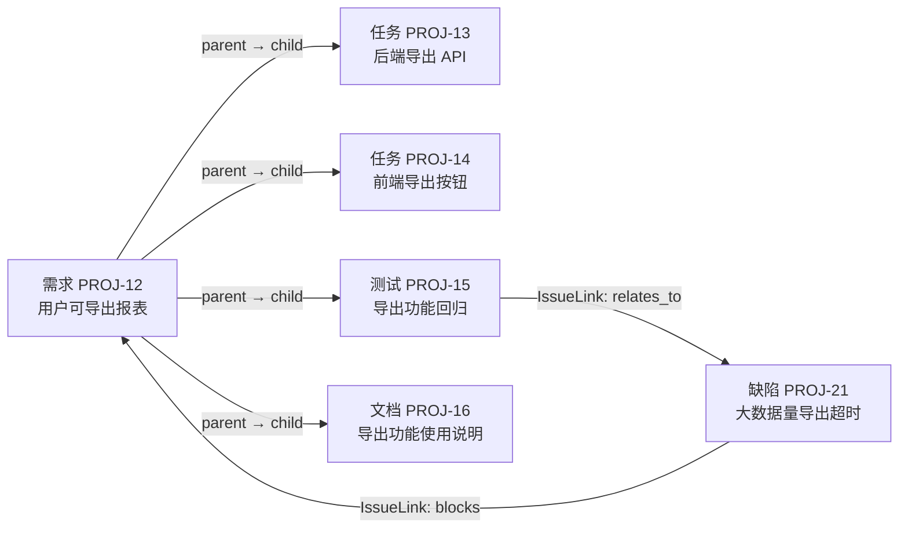
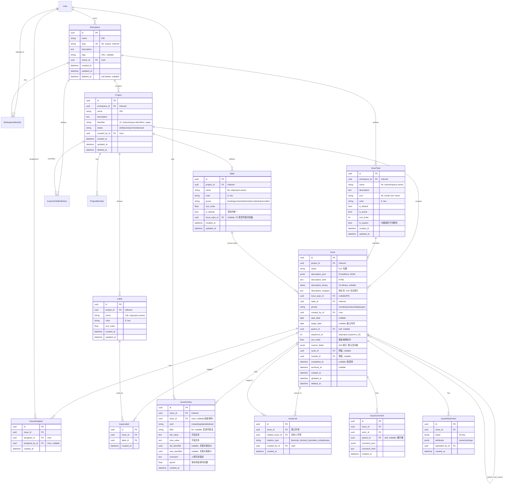
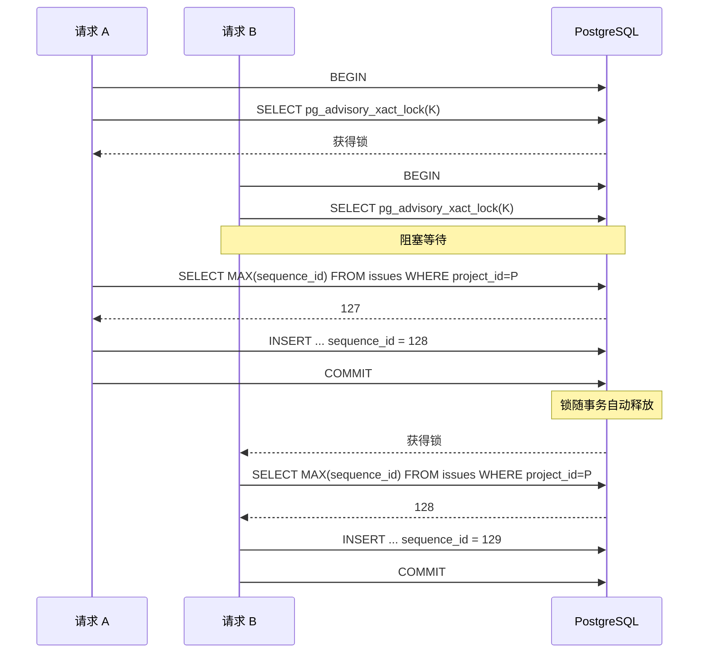
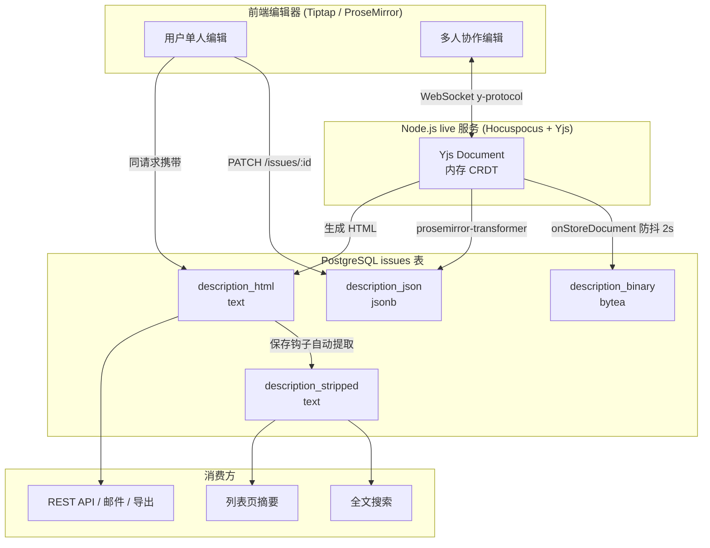
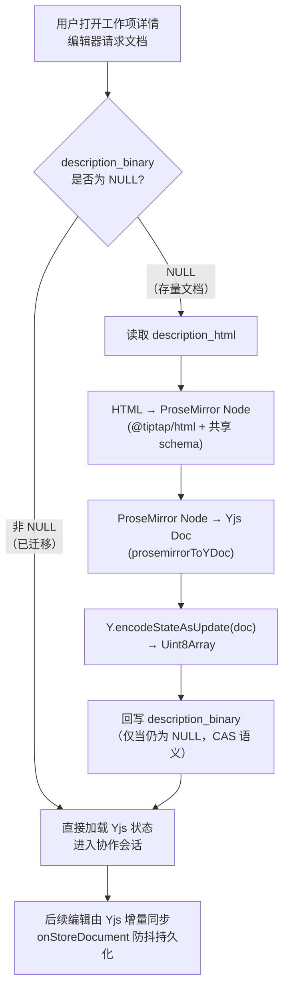
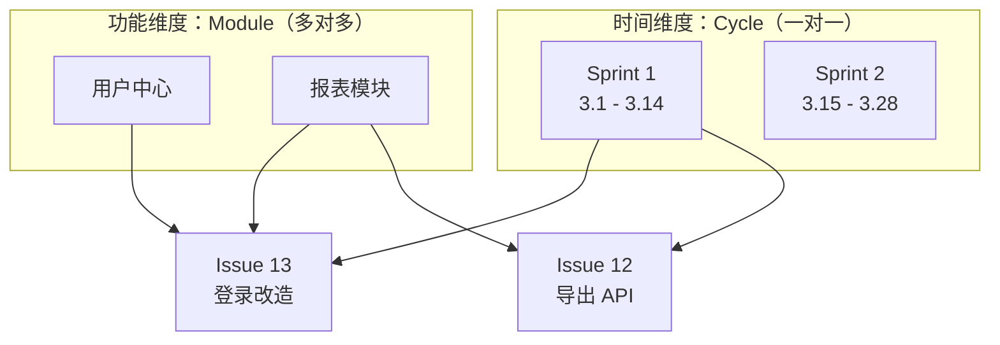
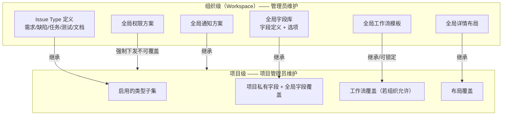

# 统一工作项模型设计

> 文档定位：本文是整个系统最核心的数据架构决策文档，定义「统一工作项（Issue）」模型的全部字段、关联、索引、序列号生成机制与描述存储方案。任务核心、看板、甘特图、筛选器、工作流、报表、权限等全部下游能力均建立在本模型之上。
>
> 对标对象：[Plane](https://github.com/makeplane/plane)（开源版，技术栈完全一致）与 Ones（商业版，产品能力对标）。
>
> 关联文档：[动态自定义字段技术方案](./dynamic-fields-design.md)、[需求文档 §3.4.1](../需求文档.md)

---

## 1. 设计决策与理由

### 1.1 核心决策

**系统不单独建设「需求模块」「缺陷模块」「测试模块」。所有需求、缺陷、开发任务、测试项、文档工作，全部通过唯一的 `Issue` 模型承载，通过 `issue_type` 外键字段区分类型。**

用一句话表达数据层的结论：

```
需求 = Issue(issue_type='需求')
缺陷 = Issue(issue_type='缺陷')
任务 = Issue(issue_type='任务')
测试 = Issue(issue_type='测试')
文档 = Issue(issue_type='文档')
```

「需求池」不是一张独立的表，而是 `Issue` 表上 `issue_type = 需求` 的一个内置预设视图（saved view）。同理，「缺陷列表」是 `issue_type = 缺陷` 的预设视图。

### 1.2 三大理由

#### 理由 1：避免重复数据模型

若需求、缺陷、任务各建一套表，则以下能力必须实现 3 遍甚至 5 遍：

| 能力 | 独立模型方案的成本 | 统一模型方案的成本 |
| --- | --- | --- |
| CRUD API | 5 套 ViewSet + Serializer | 1 套 |
| 评论 | 5 张评论表或 1 张带 `content_type` 的泛型表 | 1 张 `IssueComment` |
| 附件 | 5 张关联表 | 1 张 `IssueAttachment` |
| 操作日志 | 5 套 diff 逻辑 | 1 套 `IssueActivity` |
| 状态流转 | 5 套状态机 | 1 套 `State` + 工作流引擎 |
| 权限校验 | 5 套行级过滤 | 1 套 `project_id` 过滤 |
| 全文搜索 | 5 个索引源 | 1 个 `description_stripped` |

统一模型把「N × 能力数」的开发量压缩成「1 × 能力数」，这是本项目 2 人小团队能在 12 周内交付企业版核心能力的前提。

#### 理由 2：全链路自动打通

需求 → 拆解开发任务 → 提测 → 缺陷 → 修复 → 验收交付，是同一张表内的父子关系（`parent` 自引用）与关联关系（`IssueLink`），不需要任何跨模块数据同步：



如果拆成独立模块，上图每一条连线都需要一次「跨表 ID 冗余 + 异步同步 + 一致性补偿」，是典型的架构自伤。

#### 理由 3：视图 / 工作流 / 报表统一复用

- **视图**：列表、看板、甘特图、表格四大视图只需实现一次，任何 `issue_type` 组合都能渲染。
- **筛选器**：一套筛选器 DSL（见动态字段文档）作用于同一张表，跨类型混合筛选天然成立（例如「本迭代内所有需求 + 阻塞它们的缺陷」）。
- **工作流**：状态机绑定在 `(IssueType, Project)` 维度上，引擎只有一套。
- **报表**：燃尽图、迭代速率、累积流图统一从 `IssueActivity` 的状态变更事件计算，无需按类型分别取数。

### 1.3 参考 Plane 的设计

Plane 的 `apps/api/plane/db/models/issue.py` 中，`Issue` 是单一模型，关键设计点：

| Plane 设计点 | 具体做法 | 本项目是否采纳 |
| --- | --- | --- |
| 单一 Issue 模型 | 所有工作项一张表，无子类型表 | ✅ 完全采纳 |
| State 独立模型 | 状态是项目级可配置记录，通过 `group` 归入 5 个语义组 | ✅ 完全采纳 |
| Label 独立模型 + M2M | 项目级标签，`IssueLabel` 中间表 | ✅ 完全采纳 |
| Priority 枚举字段 | 直接存 `CharField(choices=...)`，不建表 | ✅ 完全采纳 |
| 自引用外键实现子任务 | `parent = ForeignKey('self', null=True, related_name='sub_issues')` | ✅ 完全采纳 |
| Assignee 用 M2M 中间表 | `IssueAssignee` 显式中间表，便于记录分配时间/分配人 | ✅ 完全采纳 |
| `sequence_id` 项目内序列 | PostgreSQL advisory lock 生成，展示为 `PROJ-123` | ✅ 完全采纳 |
| `sort_order` 浮点排序 | 看板拖拽用浮点数插值，避免整表重排 | ✅ 完全采纳 |
| 描述多格式冗余存储 | `description`(JSON) / `description_html` / `description_binary`(Yjs) / `description_stripped` | ✅ 完全采纳 |
| Cycle / Module 关联 | 迭代与模块通过中间表关联 Issue | ⚠️ 模型预留，P2 之后实现 |
| 自定义字段 | **不支持**，字段全部系统内置 | ❌ 我们额外提供 `custom_fields` JSONB |
| 软删除 | `SoftDeleteModel` + `deleted_at` | ✅ 采纳（BaseModel 内置） |

Plane 的核心可借鉴点是「**结构由配置表承载，语义由枚举组承载**」：状态数量任意可配（配置表 `State`），但报表只认 5 个 `group`（枚举），因此新增状态不会破坏任何报表逻辑。这个设计我们原样继承。

### 1.4 参考 Ones 的设计

Ones 的核心抽象是 **Issue Type 系统**，比 Plane 更强的地方在于「类型即配置容器」：

| Ones 设计点 | 具体做法 | 本项目对应设计 |
| --- | --- | --- |
| Issue Type 可自定义 | 内置类型 + 用户新增类型，含图标 / 颜色 | `IssueType` 表，workspace 级 |
| 每类型独立字段集 | 类型绑定字段模板，需求与缺陷字段互不干扰 | `CustomFieldDefinition.applicable_types` |
| 每类型独立详情布局 | Custom Issue Detail Layout | `IssueTypeLayout`（P3 预留） |
| 每类型独立工作流 | 类型绑定状态机与流转规则 | `IssueTypeWorkflow`（P3 预留） |
| 每类型独立权限方案 | 类型级字段权限 / 操作权限 | `permission_config` JSONB（P3/P4） |
| 每类型独立通知方案 | 类型级通知规则 | `notification_scheme`（P3 预留） |
| 全局配置 + 项目级覆盖 | 组织统一下发模板，项目可局部覆盖 | `IssueTypeSetting(scope=global/project)` |
| Issue Hierarchy | Business 版支持多级层次（Epic→Story→Task） | `parent` 自引用 + `hierarchy_level`（P2） |
| Custom Link Types | 自定义关联类型 | `IssueLink.relation_type` 枚举 → P3 升级为配置表 |

Ones 最值得抄的是 **「全局配置 + 项目级覆盖」的两级配置机制**：组织管理员在 workspace 层定义标准类型与标准字段集，项目管理员只能在授权范围内覆盖，既保证企业规范统一，又保留团队灵活性。这一点 Plane 做得很弱（Plane 的配置基本都是项目级、彼此割裂），是我们相对 Plane 的差异化点之一。

### 1.5 取长补短总结

| 维度 | Plane | Ones | 本项目 |
| --- | --- | --- | --- |
| 数据模型 | 单一 Issue 模型，轻量 | 单一 Issue + 类型配置体系 | 采用 Plane 的表结构 |
| 类型配置能力 | 无（类型都不存在） | 强（字段/布局/流程/权限/通知） | 采用 Ones 的配置理念，分 P1~P3 落地 |
| 自定义字段 | 无 | 强（含公式/级联/引用） | JSONB 轻量方案，见动态字段文档 |
| 配置治理 | 项目级为主 | 全局 + 项目覆盖 | 采用 Ones 的两级治理 |
| 实现复杂度 | 低 | 高 | 分层落地，P0 极简、P3 补齐 |

---

## 2. 核心数据模型（Django ORM）

### 2.1 完整 ER 图



### 2.2 BaseModel 基类

所有模型继承统一基类，提供 UUID 主键、审计时间戳与软删除。

```python
# apps/api/plane/db/models/base.py
import uuid

from django.db import models
from django.utils import timezone


class SoftDeleteQuerySet(models.QuerySet):
    """默认过滤已软删除记录的 QuerySet"""

    def delete(self, soft: bool = True) -> tuple[int, dict[str, int]]:
        if soft:
            return self.update(deleted_at=timezone.now()), {}
        return super().delete()


class SoftDeleteManager(models.Manager):
    def get_queryset(self) -> SoftDeleteQuerySet:
        return SoftDeleteQuerySet(self.model, using=self._db).filter(deleted_at__isnull=True)


class BaseModel(models.Model):
    """全局模型基类

    - UUID 主键：避免自增 ID 暴露业务量级，便于多租户分库与前端乐观创建
    - created_at / updated_at：审计基线
    - created_by / updated_by：操作主体审计，所有子模型统一继承
    - deleted_at：软删除，归档与回收站依赖
    """

    id = models.UUIDField(
        default=uuid.uuid4, unique=True, editable=False, db_index=True, primary_key=True
    )
    created_at = models.DateTimeField(auto_now_add=True, verbose_name="创建时间", db_index=True)
    updated_at = models.DateTimeField(auto_now=True, verbose_name="更新时间")
    created_by = models.ForeignKey(
        "db.User", on_delete=models.SET_NULL, null=True, blank=True,
        related_name="%(class)s_created_by", verbose_name="创建人",
    )
    updated_by = models.ForeignKey(
        "db.User", on_delete=models.SET_NULL, null=True, blank=True,
        related_name="%(class)s_updated_by", verbose_name="最后修改人",
    )
    deleted_at = models.DateTimeField(null=True, blank=True, db_index=True, verbose_name="删除时间")

    objects = SoftDeleteManager()
    all_objects = models.Manager()  # 含软删除记录，管理后台与数据修复使用

    class Meta:
        abstract = True
        ordering = ("-created_at",)
```

> `created_by` / `updated_by` 统一由 `BaseModel` 提供，子模型不得重复声明同名字段，否则 Django 会抛出 `FieldError`。`related_name` 使用 `%(class)s_created_by` / `%(class)s_updated_by` 模板，因此 `Issue.created_by` 的反向查询名为 `issue_created_by`，与 `INFRA-003` §4.7 的落地口径一致。

### 2.3 Workspace — 工作空间

```python
class Workspace(BaseModel):
    """工作空间 —— 系统最顶层组织单元

    一个 Workspace 对应产品语义上的「团队 / 企业组织」，是多租户隔离边界：
    所有 Project、IssueType、CustomFieldDefinition、成员均归属唯一 Workspace。
    """

    name = models.CharField(max_length=255, verbose_name="工作空间名称")
    slug = models.SlugField(
        max_length=48,
        unique=True,
        db_index=True,
        verbose_name="URL 标识",
        help_text="全局唯一，用于 /:workspaceSlug/ 路由，小写字母数字与短横线",
    )
    description = models.TextField(blank=True, verbose_name="描述")
    logo = models.URLField(max_length=800, blank=True, null=True, verbose_name="Logo 地址")
    owner = models.ForeignKey(
        "db.User",
        on_delete=models.CASCADE,
        related_name="owner_workspaces",
        verbose_name="所有者",
    )

    class Meta(BaseModel.Meta):
        db_table = "workspaces"
        verbose_name = "工作空间"
        ordering = ("-created_at",)
        constraints = [
            models.UniqueConstraint(
                fields=["slug"],
                condition=models.Q(deleted_at__isnull=True),
                name="uniq_workspace_slug_alive",
            )
        ]

    def __str__(self) -> str:
        return f"{self.name} <{self.slug}>"
```

| 字段 | 类型 | 约束 / 索引 | 说明 |
| --- | --- | --- | --- |
| `id` | UUID | PK | 继承 BaseModel |
| `name` | varchar(255) | NOT NULL | 展示名 |
| `slug` | varchar(48) | UNIQUE + B-Tree 索引 | 路由标识，全局唯一 |
| `description` | text | 可空 | 富文本不需要，纯文本即可 |
| `logo` | varchar(800) | 可空 | S3 / MinIO 预签名后的持久地址 |
| `owner` | UUID FK | 索引 | 删除用户时级联，实际生产建议改为 `PROTECT` + 转移所有权流程 |

### 2.4 Project — 项目

```python
class Project(BaseModel):
    """项目 —— 归属 Workspace，是权限与数据隔离的主要边界

    所有 Issue、State、Label、文件、看板均归属唯一 Project。
    identifier 是项目缩写（如 RBT），与 Issue.sequence_id 拼接成人类可读编号 RBT-128。
    """

    class Status(models.TextChoices):
        DRAFT = "draft", "草稿"
        ACTIVE = "active", "进行中"
        ARCHIVED = "archived", "已归档"
        CLOSED = "closed", "已关闭"

    workspace = models.ForeignKey(
        Workspace, on_delete=models.CASCADE, related_name="projects", verbose_name="所属工作空间"
    )
    name = models.CharField(max_length=255, verbose_name="项目名称")
    description = models.TextField(blank=True, verbose_name="项目描述")
    identifier = models.CharField(
        max_length=12,
        verbose_name="项目缩写",
        help_text="大写字母数字，Workspace 内唯一，用于生成 RBT-128 形式的工作项编号",
    )
    status = models.CharField(
        max_length=16, choices=Status.choices, default=Status.ACTIVE, db_index=True, verbose_name="项目状态"
    )

    class Meta(BaseModel.Meta):
        db_table = "projects"
        verbose_name = "项目"
        ordering = ("-created_at",)
        constraints = [
            models.UniqueConstraint(
                fields=["workspace", "identifier"],
                condition=models.Q(deleted_at__isnull=True),
                name="uniq_project_identifier_per_workspace",
            ),
        ]
        indexes = [
            models.Index(fields=["workspace", "status"], name="idx_project_ws_status"),
        ]

    def save(self, *args, **kwargs):
        self.identifier = self.identifier.strip().upper()
        super().save(*args, **kwargs)
```

**关键约束说明**：`identifier` 的唯一性是 **Workspace 内唯一**（不是全局唯一），且使用 `UniqueConstraint` 带 `condition` 的偏索引，使软删除的项目不占用缩写名。项目创建后 `identifier` 原则上不允许修改（已生成的 `RBT-128` 编号会被外部系统、Git commit message 引用），如需修改必须走管理员确认 + 全量历史编号重写的迁移任务。

### 2.5 IssueType — 任务类型定义

```python
class IssueType(BaseModel):
    """任务类型定义 —— 对标 Ones 的 Issue Type

    Workspace 级定义（而非 Project 级），保证组织内类型语义统一；
    项目通过 ProjectIssueType 启用/停用类型子集（P2 引入）。
    """

    workspace = models.ForeignKey(
        Workspace, on_delete=models.CASCADE, related_name="issue_types", verbose_name="所属工作空间"
    )
    name = models.CharField(max_length=64, verbose_name="类型名称")
    description = models.TextField(blank=True, verbose_name="类型说明")
    icon = models.CharField(
        max_length=64, default="circle-dot", verbose_name="图标", help_text="lucide-react 图标名"
    )
    color = models.CharField(max_length=9, default="#6B7280", verbose_name="主题色", help_text="#RRGGBB 或 #RRGGBBAA")

    is_default = models.BooleanField(default=False, verbose_name="是否默认类型", help_text="新建工作项时的默认选中项，Workspace 内唯一")
    is_active = models.BooleanField(default=True, db_index=True, verbose_name="是否启用", help_text="停用后不出现在新建入口，历史数据仍可查看")
    is_system = models.BooleanField(default=False, verbose_name="是否内置", help_text="内置 5 种类型可改名/改色，不可删除")
    sort_order = models.PositiveIntegerField(default=1000, verbose_name="显示排序")

    # ---- P3 预留：Ones 式类型级配置 ----
    # layout_config = models.JSONField(default=dict)        # 详情页字段布局
    # workflow_config = models.JSONField(default=dict)      # 类型专属工作流
    # permission_config = models.JSONField(default=dict)    # 类型级字段/操作权限
    # notification_scheme = models.JSONField(default=dict)  # 类型级通知方案

    class Meta(BaseModel.Meta):
        db_table = "issue_types"
        verbose_name = "任务类型"
        ordering = ("sort_order", "created_at")
        constraints = [
            models.UniqueConstraint(
                fields=["workspace", "name"],
                condition=models.Q(deleted_at__isnull=True),
                name="uniq_issue_type_name_per_workspace",
            ),
            models.UniqueConstraint(
                fields=["workspace"],
                condition=models.Q(is_default=True, deleted_at__isnull=True),
                name="uniq_default_issue_type_per_workspace",
            ),
        ]
```

**为什么类型定义在 Workspace 级而不是 Project 级？**

Plane 没有类型概念，无参照；Ones 的类型是组织级。我们选择 Workspace 级的理由：跨项目报表（例如「本季度全组织缺陷密度」）需要类型语义在组织内可比。若类型是项目级，则 A 项目的「缺陷」与 B 项目的「缺陷」是两条不同记录，跨项目聚合必须按 name 字符串匹配，脆弱且低效。

项目级的灵活性通过 P2 引入的 `ProjectIssueType(project, issue_type, is_enabled, sort_order)` 关联表满足：项目可以只启用「任务」，也可以启用全部 5 种。

### 2.6 State — 任务状态

```python
class State(BaseModel):
    """任务状态 —— 项目级自定义，对标 Plane 的 State 模型

    状态数量与名称任意可配，但必须归入 5 个固定语义组（group）。
    所有报表、进度计算、看板默认分组只认 group，不认具体状态名，
    因此新增/改名状态不会破坏任何下游逻辑。
    """

    class Group(models.TextChoices):
        BACKLOG = "backlog", "待规划"
        UNSTARTED = "unstarted", "未开始"
        STARTED = "started", "进行中"
        COMPLETED = "completed", "已完成"
        CANCELLED = "cancelled", "已取消"

    project = models.ForeignKey(
        Project, on_delete=models.CASCADE, related_name="states", verbose_name="所属项目"
    )
    name = models.CharField(max_length=64, verbose_name="状态名称")
    color = models.CharField(max_length=9, default="#6B7280", verbose_name="状态颜色")
    group = models.CharField(
        max_length=16, choices=Group.choices, default=Group.BACKLOG, db_index=True, verbose_name="语义分组"
    )
    sort_order = models.FloatField(default=65535.0, verbose_name="排序值", help_text="看板列顺序，浮点插值")
    is_default = models.BooleanField(default=False, verbose_name="是否默认状态", help_text="新建工作项落入的状态，项目内唯一")

    # P3 预留：类型专属状态集。为 null 时该状态对项目内所有类型生效
    issue_type = models.ForeignKey(
        IssueType, on_delete=models.CASCADE, null=True, blank=True, related_name="states", verbose_name="专属任务类型"
    )

    class Meta(BaseModel.Meta):
        db_table = "states"
        verbose_name = "任务状态"
        ordering = ("sort_order",)
        constraints = [
            models.UniqueConstraint(
                fields=["project", "name", "issue_type"],
                condition=models.Q(deleted_at__isnull=True),
                name="uniq_state_name_per_project_type",
            ),
            models.UniqueConstraint(
                fields=["project", "issue_type"],
                condition=models.Q(is_default=True, deleted_at__isnull=True),
                name="uniq_default_state_per_project_type",
            ),
        ]
```

**`group` 枚举的价值**：

| group | 燃尽图 | 看板默认列 | 进度百分比 | 甘特图 |
| --- | --- | --- | --- | --- |
| `backlog` | 不计入 Sprint 范围 | 折叠展示 | 0% | 灰色 |
| `unstarted` | 计入剩余 | 待办列 | 0% | 未开始 |
| `started` | 计入剩余 | 进行中列 | 50%（或按子任务计算） | 进行中 |
| `completed` | 计入已完成 | 已完成列 | 100% | 完成 |
| `cancelled` | 移出范围（scope change） | 折叠展示 | 不计入 | 划线 |

### 2.7 Label — 标签

```python
class Label(BaseModel):
    """标签 —— 项目级，Issue 通过 M2M 关联，一个 Issue 可打多个标签"""

    project = models.ForeignKey(
        Project, on_delete=models.CASCADE, related_name="labels", verbose_name="所属项目"
    )
    name = models.CharField(max_length=128, verbose_name="标签名称")
    color = models.CharField(max_length=9, default="#6B7280", verbose_name="标签颜色")
    sort_order = models.FloatField(default=65535.0, verbose_name="排序值")

    class Meta(BaseModel.Meta):
        db_table = "labels"
        verbose_name = "标签"
        ordering = ("sort_order",)
        constraints = [
            models.UniqueConstraint(
                fields=["project", "name"],
                condition=models.Q(deleted_at__isnull=True),
                name="uniq_label_name_per_project",
            )
        ]
```

标签保持项目级（与 Plane 一致）。Workspace 级全局标签在 P3 通过 `Label.workspace` 可空外键 + `project` 可空的方式支持组织统一标签下发。

### 2.8 Issue — 统一工作项（系统核心模型）

```python
from django.contrib.postgres.fields import ArrayField
from django.contrib.postgres.indexes import GinIndex
from django.contrib.postgres.search import SearchVectorField


class Issue(BaseModel):
    """统一工作项 —— 系统核心模型

    需求 / 缺陷 / 任务 / 测试 / 文档均为本模型记录，通过 issue_type 区分。
    """

    class Priority(models.TextChoices):
        NONE = "none", "无"
        LOW = "low", "低"
        MEDIUM = "medium", "中"
        HIGH = "high", "高"
        URGENT = "urgent", "紧急"

    # ---------------- 基础字段 ----------------
    project = models.ForeignKey(
        Project, on_delete=models.CASCADE, related_name="issues", verbose_name="所属项目"
    )
    name = models.CharField(max_length=512, verbose_name="标题")

    description_json = models.JSONField(
        default=dict, blank=True, verbose_name="描述-ProseMirror JSON", help_text="前端 Tiptap 编辑器原生格式"
    )
    description_html = models.TextField(
        default="<p></p>", blank=True, verbose_name="描述-HTML", help_text="API 对外返回、邮件通知、导出使用"
    )
    description_binary = models.BinaryField(
        null=True, blank=True, verbose_name="描述-Yjs Binary", help_text="Hocuspocus 实时协作 CRDT 状态"
    )
    description_stripped = models.TextField(
        null=True, blank=True, verbose_name="描述-纯文本", help_text="全文搜索用，保存时自动从 HTML 提取"
    )

    # ---------------- 分类与状态 ----------------
    issue_type = models.ForeignKey(
        IssueType,
        on_delete=models.SET_NULL,
        null=True,
        blank=True,
        related_name="issues",
        verbose_name="任务类型",
        help_text="P0 阶段为空，P1 起必填",
    )
    state = models.ForeignKey(
        State, on_delete=models.SET_NULL, null=True, related_name="issues", verbose_name="当前状态"
    )
    priority = models.CharField(
        max_length=16, choices=Priority.choices, default=Priority.NONE, db_index=True, verbose_name="优先级"
    )

    # ---------------- 人员 ----------------
    # created_by / updated_by 由 BaseModel 提供；Issue 的反向查询名为 issue_created_by。
    assignees = models.ManyToManyField(
        "db.User",
        through="IssueAssignee",
        through_fields=("issue", "assignee"),
        related_name="assigned_issues",
        blank=True,
        verbose_name="负责人",
    )

    # ---------------- 时间 ----------------
    start_date = models.DateField(null=True, blank=True, verbose_name="开始时间")
    target_date = models.DateField(null=True, blank=True, db_index=True, verbose_name="截止时间")
    completed_at = models.DateTimeField(
        null=True, blank=True, verbose_name="完成时间", help_text="state.group 首次进入 completed 时写入，报表周期统计用"
    )

    # ---------------- 层级 ----------------
    parent = models.ForeignKey(
        "self", on_delete=models.CASCADE, null=True, blank=True, related_name="sub_issues", verbose_name="父工作项"
    )

    # ---------------- 序列 ----------------
    sequence_id = models.IntegerField(
        default=1, verbose_name="项目内序列号", help_text="PostgreSQL advisory lock 生成，展示为 RBT-128"
    )

    # ---------------- 排序 ----------------
    sort_order = models.FloatField(default=65535.0, verbose_name="排序值", help_text="看板/列表拖拽排序，浮点插值避免整表重排")

    # ---------------- 标签 ----------------
    labels = models.ManyToManyField(
        Label, through="IssueLabel", through_fields=("issue", "label"), related_name="issues", blank=True, verbose_name="标签"
    )

    # ---------------- 预留扩展 ----------------
    custom_fields = models.JSONField(
        default=dict, blank=True, verbose_name="自定义字段值", help_text="动态字段值集合，GIN 索引，详见 dynamic-fields-design.md"
    )

    # ---------------- 预留关联（Plane Cycle / Module 对标，P2 之后启用）----------------
    # cycle = models.ForeignKey("db.Cycle", on_delete=models.SET_NULL, null=True, blank=True, related_name="issues")
    # module = models.ForeignKey("db.Module", on_delete=models.SET_NULL, null=True, blank=True, related_name="issues")

    # ---------------- 归档 ----------------
    archived_at = models.DateTimeField(null=True, blank=True, verbose_name="归档时间")

    # ---------------- 全文搜索（P2）----------------
    # search_vector = SearchVectorField(null=True, editable=False)

    class Meta(BaseModel.Meta):
        db_table = "issues"
        verbose_name = "工作项"
        ordering = ("-created_at",)
        constraints = [
            models.UniqueConstraint(
                fields=["project", "sequence_id"],
                condition=models.Q(deleted_at__isnull=True),
                name="uniq_issue_sequence_per_project",
            ),
            models.CheckConstraint(
                check=models.Q(start_date__isnull=True)
                | models.Q(target_date__isnull=True)
                | models.Q(start_date__lte=models.F("target_date")),
                name="chk_issue_start_before_target",
            ),
        ]
        indexes = [
            # 看板/列表主查询：项目 + 状态 + 排序
            models.Index(fields=["project", "state", "sort_order"], name="idx_issue_proj_state_sort"),
            # 类型筛选（P1 需求池 / 缺陷列表核心查询）
            models.Index(fields=["project", "issue_type"], name="idx_issue_proj_type"),
            # 子任务查询
            models.Index(fields=["parent"], name="idx_issue_parent"),
            # 归档过滤：绝大多数查询带 archived_at IS NULL
            models.Index(
                fields=["project", "created_at"],
                condition=models.Q(archived_at__isnull=True, deleted_at__isnull=True),
                name="idx_issue_active_by_project",
            ),
            # 自定义字段 JSONB 查询
            GinIndex(fields=["custom_fields"], name="idx_issue_custom_fields"),
            # 全文搜索（P2 开启 search_vector 后替换为 GinIndex(fields=["search_vector"])）
            GinIndex(
                name="idx_issue_desc_trgm",
                fields=["description_stripped"],
                opclasses=["gin_trgm_ops"],
            ),
        ]

    def __str__(self) -> str:
        return f"{self.project.identifier}-{self.sequence_id} {self.name}"
```

#### Issue 字段完整说明表

| 分组 | 字段 | 类型 | 约束 / 默认 | 索引 | 迭代阶段 |
| --- | --- | --- | --- | --- | --- |
| 基础 | `project` | UUID FK | NOT NULL, CASCADE | ✅ 复合索引首列 | P0 |
| 基础 | `name` | varchar(512) | NOT NULL | trigram（P2 搜索） | P0 |
| 基础 | `description_json` | jsonb | default `{}` | — | P0 |
| 基础 | `description_html` | text | default `<p></p>` | — | P0 |
| 基础 | `description_binary` | bytea | nullable | — | P2（实时协作） |
| 基础 | `description_stripped` | text | nullable | GIN trigram | P1（搜索） |
| 分类 | `issue_type` | UUID FK | nullable(P0) → 必填(P1) | ✅ | P0 预留 / P1 启用 |
| 分类 | `state` | UUID FK | nullable, SET_NULL | ✅ | P0 |
| 分类 | `priority` | varchar(16) | enum, default `none` | ✅ B-Tree | P1 |
| 人员 | `created_by` | UUID FK | nullable, SET_NULL | ✅ | P0 |
| 人员 | `assignees` | M2M | 通过 `IssueAssignee` | 中间表复合唯一 | P0 单人 / P2 多人 |
| 时间 | `start_date` | date | nullable | — | P1 |
| 时间 | `target_date` | date | nullable | ✅（逾期提醒扫描） | P0 |
| 时间 | `completed_at` | timestamptz | nullable | —（报表按 project 聚合时加） | P2 |
| 层级 | `parent` | UUID FK self | nullable, CASCADE | ✅ | P1 一级 / P2 多级 |
| 序列 | `sequence_id` | integer | UNIQUE(project, seq) | ✅ 唯一约束附带 | P0 |
| 排序 | `sort_order` | double | default 65535.0 | ✅ 复合索引末列 | P0 |
| 标签 | `labels` | M2M | 通过 `IssueLabel` | 中间表复合唯一 | P1 |
| 扩展 | `custom_fields` | jsonb | default `{}` | ✅ GIN | P0 建列 / P2 启用 |
| 归档 | `archived_at` | timestamptz | nullable | ✅ 偏索引条件 | P2 |

#### 为什么 `parent` 用 `CASCADE` 而不是 `SET_NULL`？

删除父需求时，其子任务在业务语义上应一并进入回收站（配合软删除，可整体恢复）。若用 `SET_NULL`，子任务会变成孤儿顶层任务，散落在列表里污染视图。API 层在删除前必须提示「将同时删除 N 个子工作项」。

#### `sort_order` 浮点插值算法

```python
def calculate_sort_order(prev_order: float | None, next_order: float | None) -> float:
    """看板拖拽落位时计算新的 sort_order

    仅更新被拖拽的单条记录，不触碰同列其他记录，避免 O(n) 整表 UPDATE。
    """
    DEFAULT_GAP = 65535.0
    if prev_order is None and next_order is None:
        return DEFAULT_GAP
    if prev_order is None:                      # 拖到列首
        return next_order / 2
    if next_order is None:                      # 拖到列尾
        return prev_order + DEFAULT_GAP
    return (prev_order + next_order) / 2        # 插到中间


# 精度耗尽兜底：当相邻间隔小于阈值时，异步任务重排该列 sort_order
REBALANCE_THRESHOLD = 1e-6
```

浮点数在约 50 次连续对半插入后精度耗尽（双精度约 52 位尾数）。生产做法：拖拽 API 检测到 `abs(next - prev) < REBALANCE_THRESHOLD` 时，投递一个 Celery 任务把该状态列的 `sort_order` 按 65535 步长重排。Plane 同样采用该策略。

### 2.9 IssueAssignee / IssueLabel — 显式中间表

```python
class IssueAssignee(BaseModel):
    """负责人关联表 —— 显式中间表以记录「谁在何时指派了谁」"""

    issue = models.ForeignKey(Issue, on_delete=models.CASCADE, related_name="issue_assignees")
    assignee = models.ForeignKey("db.User", on_delete=models.CASCADE, related_name="issue_assignees")
    assigned_by = models.ForeignKey(
        "db.User", on_delete=models.SET_NULL, null=True, related_name="assigned_issue_records", verbose_name="指派人"
    )

    class Meta(BaseModel.Meta):
        db_table = "issue_assignees"
        constraints = [
            models.UniqueConstraint(fields=["issue", "assignee"], name="uniq_issue_assignee"),
        ]
        indexes = [
            # 「我的待办」核心查询
            models.Index(fields=["assignee", "issue"], name="idx_assignee_issue"),
        ]


class IssueLabel(BaseModel):
    """标签关联表"""

    issue = models.ForeignKey(Issue, on_delete=models.CASCADE, related_name="issue_labels")
    label = models.ForeignKey(Label, on_delete=models.CASCADE, related_name="issue_labels")

    class Meta(BaseModel.Meta):
        db_table = "issue_labels"
        constraints = [
            models.UniqueConstraint(fields=["issue", "label"], name="uniq_issue_label"),
        ]
```

用显式中间表（而非 Django 自动生成的隐式表）的三个理由：一是可挂载额外字段（`assigned_by`）；二是中间表继承 `BaseModel`，拥有 `created_at`，「任务何时被分配给我」可直接查询；三是操作日志需要对 M2M 变更做 diff，显式模型便于挂 `m2m_changed` 或在 Service 层显式记录。

### 2.10 IssueActivity — 操作日志（Event Sourcing lite）

```python
class IssueActivity(BaseModel):
    """操作日志 —— 对标 Plane 的 Event Sourcing lite 设计

    不是完整 Event Sourcing（不用事件重建状态），而是「状态表 + 逐字段 diff 日志」：
    Issue 表保存当前状态，IssueActivity 逐字段记录每次变更，
    既保证读性能，又满足审计溯源与活动流展示。
    """

    class Verb(models.TextChoices):
        CREATED = "created", "创建"
        UPDATED = "updated", "更新"
        DELETED = "deleted", "删除"

    issue = models.ForeignKey(
        Issue, on_delete=models.CASCADE, null=True, related_name="issue_activities", verbose_name="工作项"
    )
    actor = models.ForeignKey(
        "db.User", on_delete=models.SET_NULL, null=True, related_name="issue_activities", verbose_name="操作人"
    )
    verb = models.CharField(max_length=16, choices=Verb.choices, default=Verb.CREATED, verbose_name="动作")

    field = models.CharField(max_length=64, null=True, blank=True, verbose_name="变更字段名")
    old_value = models.TextField(null=True, blank=True, verbose_name="变更前值（可读文本）")
    new_value = models.TextField(null=True, blank=True, verbose_name="变更后值（可读文本）")
    old_identifier = models.UUIDField(null=True, blank=True, verbose_name="变更前关联对象 ID")
    new_identifier = models.UUIDField(null=True, blank=True, verbose_name="变更后关联对象 ID")

    comment = models.TextField(blank=True, verbose_name="人类可读描述", help_text="如「将状态从 待办 改为 进行中」")
    epoch = models.FloatField(null=True, verbose_name="毫秒时间戳", help_text="同一次批量更新的多条日志按 epoch 分组聚合展示")

    class Meta(BaseModel.Meta):
        db_table = "issue_activities"
        verbose_name = "工作项操作日志"
        ordering = ("created_at",)
        indexes = [
            models.Index(fields=["issue", "created_at"], name="idx_activity_issue_time"),
            models.Index(fields=["actor", "created_at"], name="idx_activity_actor_time"),
            models.Index(fields=["field"], name="idx_activity_field"),
        ]
```

#### 逐字段 diff 的生成逻辑

```python
TRACKED_SCALAR_FIELDS = ("name", "priority", "start_date", "target_date", "description_html")
TRACKED_FK_FIELDS = ("state", "issue_type", "parent")
TRACKED_M2M_FIELDS = ("assignees", "labels")


def build_activities(issue: Issue, before: dict, after: dict, actor_id: uuid.UUID) -> list[IssueActivity]:
    """比对更新前后快照，逐字段生成日志记录

    - 标量字段：直接比较值
    - 外键字段：记录 old_identifier / new_identifier + 可读名称
    - M2M 字段：拆成 added / removed 两类记录，每个成员一条
    """
    epoch = int(timezone.now().timestamp() * 1000)
    activities: list[IssueActivity] = []

    for field in TRACKED_SCALAR_FIELDS:
        if before.get(field) != after.get(field):
            activities.append(
                IssueActivity(
                    issue_id=issue.id,
                    actor_id=actor_id,
                    verb=IssueActivity.Verb.UPDATED,
                    field=field,
                    old_value=str(before.get(field) or ""),
                    new_value=str(after.get(field) or ""),
                    comment=f"更新了 {FIELD_LABELS[field]}",
                    epoch=epoch,
                )
            )

    for field in TRACKED_FK_FIELDS:
        old_obj, new_obj = before.get(field), after.get(field)
        if (old_obj and old_obj.id) != (new_obj and new_obj.id):
            activities.append(
                IssueActivity(
                    issue_id=issue.id,
                    actor_id=actor_id,
                    verb=IssueActivity.Verb.UPDATED,
                    field=field,
                    old_value=getattr(old_obj, "name", None),
                    new_value=getattr(new_obj, "name", None),
                    old_identifier=getattr(old_obj, "id", None),
                    new_identifier=getattr(new_obj, "id", None),
                    comment=f"将 {FIELD_LABELS[field]} 从 {getattr(old_obj, 'name', '空')} 改为 {getattr(new_obj, 'name', '空')}",
                    epoch=epoch,
                )
            )

    # 自定义字段：逐 key diff（详见 dynamic-fields-design.md §7 P4 字段变更审计）
    for key in set(before.get("custom_fields", {})) | set(after.get("custom_fields", {})):
        if before.get("custom_fields", {}).get(key) != after.get("custom_fields", {}).get(key):
            activities.append(
                IssueActivity(
                    issue_id=issue.id, actor_id=actor_id, verb=IssueActivity.Verb.UPDATED,
                    field=f"custom_fields.{key}",
                    old_value=json.dumps(before.get("custom_fields", {}).get(key), ensure_ascii=False),
                    new_value=json.dumps(after.get("custom_fields", {}).get(key), ensure_ascii=False),
                    epoch=epoch,
                )
            )

    return activities
```

**写入路径**：日志生成走 Celery 异步任务（`issue_activity.delay(...)`），不阻塞主请求。Plane 的做法是在 View 层收集前后快照后 `.delay()` 投递，我们完全一致。批量操作（如看板批量改状态 50 条）会产生 50 条日志，共享同一 `epoch`，前端活动流按 `epoch` 聚合为「XX 批量更新了 50 个工作项的状态」。

**表体积控制**：`issue_activities` 是全库增长最快的表。P2 起按季度做 PostgreSQL 声明式分区（`PARTITION BY RANGE (created_at)`），P4 企业版审计留存策略配合冷分区归档到对象存储。

### 2.11 IssueLink — 工作项关联

```python
class IssueLink(BaseModel):
    """工作项关联 —— 依赖 / 阻塞 / 相关 / 重复

    成对存储：创建 A blocks B 时，同事务写入 B is_blocked_by A，
    使任一侧详情页只需单向查询即可拿到全部关联，避免 OR 双向查询。
    """

    class RelationType(models.TextChoices):
        BLOCKS = "blocks", "阻塞"
        IS_BLOCKED_BY = "is_blocked_by", "被阻塞于"
        RELATES_TO = "relates_to", "关联"
        DUPLICATES = "duplicates", "重复于"

    INVERSE_MAP = {
        "blocks": "is_blocked_by",
        "is_blocked_by": "blocks",
        "relates_to": "relates_to",
        "duplicates": "duplicates",
    }

    issue = models.ForeignKey(Issue, on_delete=models.CASCADE, related_name="issue_links", verbose_name="源工作项")
    related_issue = models.ForeignKey(
        Issue, on_delete=models.CASCADE, related_name="related_issue_links", verbose_name="目标工作项"
    )
    relation_type = models.CharField(
        max_length=24, choices=RelationType.choices, default=RelationType.RELATES_TO, verbose_name="关联类型"
    )

    class Meta(BaseModel.Meta):
        db_table = "issue_links"
        verbose_name = "工作项关联"
        constraints = [
            models.UniqueConstraint(
                fields=["issue", "related_issue", "relation_type"],
                condition=models.Q(deleted_at__isnull=True),
                name="uniq_issue_relation",
            ),
            models.CheckConstraint(
                check=~models.Q(issue=models.F("related_issue")),
                name="chk_issue_link_no_self",
            ),
        ]
        indexes = [
            models.Index(fields=["issue", "relation_type"], name="idx_link_issue_type"),
            models.Index(fields=["related_issue", "relation_type"], name="idx_link_related_type"),
        ]
```

**依赖环检测**：甘特图前置/后置依赖与「前置任务未完成禁止流转」规则都要求 `blocks` 关系无环。在创建关联时执行一次有向图可达性检查：

```sql
-- 检查新增 A blocks B 是否会形成环：即 B 是否已经（间接）blocks A
WITH RECURSIVE reachable(id) AS (
    SELECT related_issue_id FROM issue_links
     WHERE issue_id = %(target_id)s AND relation_type = 'blocks' AND deleted_at IS NULL
    UNION
    SELECT l.related_issue_id FROM issue_links l
      JOIN reachable r ON l.issue_id = r.id
     WHERE l.relation_type = 'blocks' AND l.deleted_at IS NULL
)
SELECT EXISTS (SELECT 1 FROM reachable WHERE id = %(source_id)s) AS has_cycle;
```

递归 CTE 深度需设上限（生产设为 100 层），超限直接拒绝并提示依赖链过深。

**P3 升级路径**：Ones 支持 Custom Link Types（自定义关联类型，如「验证」「衍生于」）。届时把 `relation_type` 从枚举升级为 `IssueLinkType` 配置表外键（含 `name` / `inverse_name` / `is_directional` / `is_blocking`），枚举值作为 `is_system=True` 的内置记录迁移，API 契约保持兼容。

---

## 3. 序列号生成机制（PostgreSQL Advisory Lock）

### 3.1 问题定义

每个 Issue 需要一个**项目内连续、无空洞、人类可读**的序列号，拼接项目缩写后形成 `RBT-128` 这样的业务编号，用于口头沟通、Git commit message 引用、外部系统集成。

难点在于并发：两个用户同时在同一项目创建工作项，若各自执行 `MAX(sequence_id) + 1`，会拿到相同的值。仅靠唯一约束会导致其中一个请求 500 失败。

三种常见方案对比：

| 方案 | 无空洞 | 并发安全 | 额外表 | 实现复杂度 | 说明 |
| --- | --- | --- | --- | --- | --- |
| PostgreSQL SEQUENCE（每项目一个） | ✅ | ✅ | 无表但有 N 个序列对象 | 高 | 每建项目要 DDL 创建序列，项目多了 catalog 膨胀，且序列在事务回滚时产生空洞 |
| 计数器表 + `SELECT FOR UPDATE` | ✅ | ✅ | 需要 `ProjectCounter` 表 | 中 | 需维护额外表，项目创建时必须初始化，数据修复麻烦 |
| **Advisory Lock + `MAX()+1`** | ✅ | ✅ | 无 | 低 | Plane 生产方案，本项目采纳 |

### 3.2 Advisory Lock 方案原理

PostgreSQL 的 **advisory lock（咨询锁）** 是应用层自定义语义的锁，锁键是应用自己指定的 64 位整数（或两个 32 位整数），数据库只负责互斥，不关心锁保护的是什么。

我们使用 **事务级** 咨询锁 `pg_advisory_xact_lock(key)`：

- 同一 key 的锁请求串行化，后来者阻塞等待；
- 锁在**事务提交或回滚时自动释放**，无需显式 unlock，也不会因应用崩溃而泄漏锁（连接断开即释放）；
- 锁不占用任何行锁/表锁，不与业务 DML 冲突。

锁键取自项目 UUID：

```python
def project_lock_key(project_id: uuid.UUID) -> int:
    """将项目 UUID 映射为 advisory lock 的 64 位有符号整数键

    取 UUID 的高 63 位保证落在 bigint 正数范围内。
    不同项目的键几乎不可能碰撞（生日问题下 2^31 量级项目才有 50% 碰撞概率）；
    即便极小概率碰撞，后果也仅是两个项目的创建互相等待一次，不影响正确性。
    """
    return project_id.int >> 65  # 128 位右移 65 位 → 63 位无符号，安全落在 bigint
```

### 3.3 完整实现

```python
# apps/api/plane/db/services/issue_sequence.py
import uuid

from django.db import connection, transaction
from django.db.models import Max

from plane.db.models import Issue


def acquire_project_lock(project_id: uuid.UUID) -> None:
    """获取项目级事务咨询锁，必须在 transaction.atomic() 内调用"""
    with connection.cursor() as cursor:
        cursor.execute("SELECT pg_advisory_xact_lock(%s)", [project_lock_key(project_id)])


def next_sequence_id(project_id: uuid.UUID) -> int:
    """计算项目下一个序列号，调用前必须已持有项目锁"""
    current_max = (
        Issue.all_objects.filter(project_id=project_id)          # 含软删除，避免号码复用
        .aggregate(max_seq=Max("sequence_id"))["max_seq"]
    )
    return (current_max or 0) + 1


@transaction.atomic
def create_issue(*, project_id: uuid.UUID, actor_id: uuid.UUID, payload: dict) -> Issue:
    """创建工作项 —— 序列号生成与插入在同一事务内串行化

    执行顺序至关重要：
    1. 先取锁（同项目其他创建请求在此阻塞）
    2. 再算 MAX(sequence_id) + 1（此时不可能有并发写入）
    3. 插入记录
    4. 事务提交 → 锁自动释放 → 下一个请求被唤醒
    """
    acquire_project_lock(project_id)

    issue = Issue.objects.create(
        project_id=project_id,
        created_by_id=actor_id,
        sequence_id=next_sequence_id(project_id),
        sort_order=calculate_sort_order(prev_order=None, next_order=payload.get("next_sort_order")),
        **payload,
    )

    # M2M 与日志在同一事务内落库，保证一致性
    sync_assignees(issue, payload.get("assignee_ids", []), actor_id)
    sync_labels(issue, payload.get("label_ids", []))
    transaction.on_commit(lambda: dispatch_issue_created_events(issue.id, actor_id))
    return issue
```

对应的实际 SQL 时序（两个并发请求）：



### 3.4 方案优势分析

1. **无需单独计数器表**：不引入 `ProjectCounter` 表，也就不存在「项目创建时忘记初始化计数器」「计数器与实际数据漂移」「数据导入后需修正计数器」这三类运维问题。序列号的唯一真相来源就是 `issues` 表本身。
2. **锁随事务自动释放**：使用 `pg_advisory_xact_lock` 而非 `pg_advisory_lock`，无需 `try/finally` 解锁。应用进程被 kill、Celery worker OOM、网络断连等异常场景下，连接关闭即释放锁，不存在死锁残留。这一点显著优于 Redis 分布式锁（需要 TTL + 续期 + 误删防护）。
3. **无空洞**：`MAX()+1` 基于已提交数据计算，事务回滚时序列号不会被消耗（对比 PostgreSQL 原生 SEQUENCE：`nextval` 在回滚后不回退，必然产生空洞）。业务上「RBT-1 到 RBT-128 一个不缺」对审计与沟通很重要。
4. **不与业务锁冲突**：咨询锁不锁任何行或表，因此并发的「更新工作项」「拖拽排序」「查询列表」完全不受影响，只有「创建」这一个动作被串行化。
5. **零 DDL**：新建项目不需要执行任何 DDL，符合多租户 SaaS 的运维要求。

### 3.5 性能考量

**串行化范围**：锁的粒度是「单个项目的创建操作」。

| 场景 | 是否受影响 |
| --- | --- |
| 同项目并发创建工作项 | 串行执行 |
| 不同项目并发创建 | 完全并行（不同锁键） |
| 同项目的更新 / 删除 / 查询 | 完全不受影响 |
| 批量导入同项目 1000 条 | 建议单事务内取锁一次，循环分配 `sequence_id`，见下方优化 |

**量化评估**：单次「取锁 + `MAX()` + `INSERT`」在 `(project_id, sequence_id)` 唯一索引支持下约 1~3ms。即便按 3ms 悲观估算，单项目创建吞吐仍有约 330 QPS。真实项目管理场景下，单个项目每秒创建 3 个工作项已属极端（人类手动创建通常低于 1/s），因此串行化完全可接受。**Plane 已用该方案支撑生产环境（含 Plane Cloud），是经过验证的选择。**

**批量导入优化**：CSV/Jira 导入这类批量场景，不要循环调用 `create_issue`（会取锁 N 次、算 `MAX()` N 次），而是：

```python
@transaction.atomic
def bulk_create_issues(*, project_id: uuid.UUID, rows: list[dict]) -> list[Issue]:
    """批量导入 —— 取锁一次，一次性分配连续序列号段"""
    acquire_project_lock(project_id)
    start = next_sequence_id(project_id)
    issues = [
        Issue(project_id=project_id, sequence_id=start + offset, **row)
        for offset, row in enumerate(rows)
    ]
    return Issue.objects.bulk_create(issues, batch_size=500)
```

**长事务风险与规避**：咨询锁持有到事务提交，因此**创建事务内绝对不能包含慢操作**——不得调用外部 HTTP（Webhook、Slack 通知）、不得做文件上传、不得同步生成缩略图。所有副作用统一走 `transaction.on_commit()` 投递 Celery 任务。这条约束必须写入代码规范并由 Code Review 把关。

**监控指标**：`pg_locks` 视图可观测咨询锁等待。生产上对以下指标告警：

```sql
-- 当前正在等待咨询锁的会话数（持续 > 5 说明某项目创建事务过慢）
SELECT count(*) FROM pg_locks WHERE locktype = 'advisory' AND NOT granted;
```

---

## 4. 三格式描述存储

### 4.1 为什么一份描述要存四列

工作项描述是富文本，同时服务四类消费者，各自要求的格式不同，而运行时互相转换代价过高：

| 列 | 格式 | 消费者 | 为什么不能现算 |
| --- | --- | --- | --- |
| `description_json` | ProseMirror JSON | 前端 Tiptap 编辑器加载 | 从 HTML 解析回 JSON 会丢失自定义节点属性（如提及、嵌入卡片的元数据） |
| `description_html` | HTML 字符串 | 对外 REST API、邮件通知、导出 PDF、`space` 公开页 SSR | 每次请求跑一次 ProseMirror schema 序列化，需在 Python 侧维护 schema，成本高 |
| `description_binary` | Yjs Binary (bytea) | Hocuspocus 实时协作服务 | Yjs CRDT 状态含操作历史与 client 时钟，**无法**从 JSON/HTML 无损重建（会丢失协作因果关系） |
| `description_stripped` | 纯文本 | 全文搜索（`to_tsvector` / trigram）、列表页摘要、AI 摘要输入 | 每次查询剥离 HTML 标签无法走索引，搜索必须预计算 |

这是一次典型的**空间换时间 + 空间换正确性**的冗余设计，与 Plane 完全一致。

### 4.2 数据流



### 4.3 `description_stripped` 的生成

在模型 `save()` 中统一生成，保证任何写入路径（API、Celery、Django shell、数据修复脚本）都不会漏：

```python
from django.utils.html import strip_tags


class Issue(BaseModel):
    ...

    def save(self, *args, **kwargs):
        # 纯文本始终由 HTML 派生，保证单一真相来源
        if self.description_html:
            self.description_stripped = (
                None if self.description_html == "<p></p>" else strip_tags(self.description_html)
            )
        # 首次进入 completed 组时记录完成时间，用于周期报表
        if self.state and self.state.group == State.Group.COMPLETED and self.completed_at is None:
            self.completed_at = timezone.now()
        super().save(*args, **kwargs)
```

搜索侧（P2）升级为 PostgreSQL 原生全文检索：

```sql
-- 1. 新增 tsvector 列（generated column，DB 侧自动维护，无需应用代码）
ALTER TABLE issues ADD COLUMN search_vector tsvector
  GENERATED ALWAYS AS (
    setweight(to_tsvector('simple', coalesce(name, '')), 'A') ||
    setweight(to_tsvector('simple', coalesce(description_stripped, '')), 'B')
  ) STORED;

-- 2. GIN 索引
CREATE INDEX idx_issue_search_vector ON issues USING GIN (search_vector);

-- 3. 查询（标题命中权重高于正文）
SELECT id, project_id, sequence_id, name,
       ts_rank(search_vector, plainto_tsquery('simple', '导出 超时')) AS rank
  FROM issues
 WHERE project_id = $1
   AND deleted_at IS NULL
   AND search_vector @@ plainto_tsquery('simple', '导出 超时')
 ORDER BY rank DESC
 LIMIT 50;
```

> 中文分词：`simple` 配置对中文只能按空格切分，效果有限。P2 生产环境安装 `pg_trgm`（已在 §2.8 建立 trigram GIN 索引）覆盖中文模糊匹配；P3 视数据量决定是否引入 `zhparser` 扩展或外置 Elasticsearch/Meilisearch。

### 4.4 零停机文档格式迁移（参考 Plane）

**问题**：`description_binary`（Yjs）是 P2 才引入的能力。P0/P1 期间创建的存量工作项只有 `description_html` 和 `description_json`，没有 Yjs binary。如果 P2 上线时执行全量数据迁移（把所有 Issue 的 HTML 转成 Yjs binary），存在三个问题：数据量大时迁移耗时长、迁移期间写入冲突、转换失败需回滚。

**Plane 的解法：惰性迁移（lazy migration on first access）**——不做全量迁移，在文档**首次被协作编辑器打开**时按需转换。我们完整照抄这一设计：



live 服务侧实现要点：

```typescript
// apps/live/src/core/extensions/database.ts
import * as Y from "yjs";
import { prosemirrorToYDoc } from "y-prosemirror";
import { generateJSON } from "@tiptap/html";
import { editorExtensions } from "@plane/editor"; // 与前端共用同一份 schema，保证转换一致

export const documentDatabase = {
  /** Hocuspocus 加载文档：优先 Yjs binary，缺失时从 HTML 惰性转换 */
  async fetch({ documentName }: { documentName: string }): Promise<Uint8Array | null> {
    const issue = await api.fetchIssueDescription(documentName);

    if (issue.description_binary) {
      return new Uint8Array(issue.description_binary);
    }

    // 存量文档：HTML → ProseMirror JSON → Yjs Doc → binary
    const pmJson = generateJSON(issue.description_html ?? "<p></p>", editorExtensions);
    const yDoc = prosemirrorToYDoc(schema.nodeFromJSON(pmJson), "default");
    const state = Y.encodeStateAsUpdate(yDoc);

    // 条件回写：仅当 DB 侧仍为 NULL 才写入，避免并发首访互相覆盖
    await api.initIssueDescriptionBinary(documentName, state);
    return state;
  },

  /** 防抖持久化：Yjs → binary + JSON + HTML 三格式一致落库 */
  async store({ documentName, state, document }: StoreArgs): Promise<void> {
    const pmNode = yDocToProsemirrorJSON(document, "default");
    await api.updateIssueDescription(documentName, {
      description_binary: state,
      description_json: pmNode,
      description_html: generateHTML(pmNode, editorExtensions),
    });
  },
};
```

服务端「条件回写」必须是原子的，防止两个用户同时首访同一文档导致两份不同的 Yjs 初始状态互相覆盖（会造成协作会话分裂）：

```python
@transaction.atomic
def init_description_binary(issue_id: uuid.UUID, binary: bytes) -> bytes:
    """惰性迁移的条件回写：只有当前仍为 NULL 才写入，否则返回已有值

    使用 SELECT FOR UPDATE 而非咨询锁：这里保护的是单行，行锁语义更直接。
    """
    issue = Issue.objects.select_for_update().only("id", "description_binary").get(id=issue_id)
    if issue.description_binary:
        return bytes(issue.description_binary)   # 已被其他会话迁移，直接复用
    issue.description_binary = binary
    issue.save(update_fields=["description_binary", "updated_at"])
    return binary
```

**惰性迁移的收益**：

- 上线即生效，无停机窗口、无迁移脚本；
- 冷数据（永不再打开的历史工作项）永远不消耗转换算力与 `bytea` 存储；
- 转换逻辑与编辑器 schema 同源（都在 `@plane/editor` 包内），schema 演进时不存在「迁移脚本用旧 schema、编辑器用新 schema」的错配；
- 可灰度：live 服务按 workspace 开关控制是否启用协作模式，未启用的 workspace 继续走 HTML 单人编辑路径。

**一致性约定**（必须遵守，否则四列会漂移）：

1. 单人编辑路径（P0/P1）：前端 `PATCH` 同时提交 `description_json` + `description_html`，服务端派生 `description_stripped`，不动 `description_binary`。
2. 协作编辑路径（P2+）：**唯一写入方是 live 服务**，一次性写入 `binary` + `json` + `html`，服务端派生 `stripped`。此时 REST API 的描述字段对普通客户端转为只读（防止绕过 CRDT 直接改 HTML 导致协作状态与持久状态分裂）。
3. 任何数据修复脚本改动 `description_html` 后，必须同时置 `description_binary = NULL`，强制下次打开时重新惰性转换。

---

## 5. 内置任务类型配置

### 5.1 内置 5 种类型

系统初始化 Workspace 时自动创建以下 5 种类型（`is_system=True`，可改名/改色/停用，不可删除）：

| 类型 | 图标（lucide） | 颜色 | 默认状态集 | 迭代阶段 |
| --- | --- | --- | --- | --- |
| **需求** | `sparkles` | `#8B5CF6`（紫） | 草稿 → 评审 → 排期 → 开发中 → 验收 → 完成 | P1+ |
| **缺陷** | `bug` | `#EF4444`（红） | 待确认 → 已确认 → 修复中 → 待验证 → 已关闭 | P1+ |
| **任务** | `circle-check` | `#3B82F6`（蓝） | 待办 → 进行中 → 已完成 | **P0+** |
| **测试** | `flask-conical` | `#10B981`（绿） | 待执行 → 执行中 → 通过 / 失败 | P2+ |
| **文档** | `file-text` | `#F59E0B`（橙） | 草稿 → 审阅 → 已发布 | P2+ |

> 「任务」是 `is_default=True` 的默认类型，也是 P0 阶段唯一存在的类型（P0 只建这一条记录，`issue_type` 字段可空）。

### 5.2 状态集到 `group` 的映射

状态名任意，但每个状态必须归入 5 个语义组之一，这是报表与进度计算的唯一依据：

| 类型 | 状态名 | `group` | `sort_order` | 说明 |
| --- | --- | --- | --- | --- |
| 需求 | 草稿 | `backlog` | 1000 | 需求池中未评审 |
| 需求 | 评审 | `unstarted` | 2000 | 评审中 |
| 需求 | 排期 | `unstarted` | 3000 | 已通过评审待排期 |
| 需求 | 开发中 | `started` | 4000 | 已拆解子任务 |
| 需求 | 验收 | `started` | 5000 | 开发完成待业务验收 |
| 需求 | 完成 | `completed` | 6000 | 已交付 |
| 需求 | 已废弃 | `cancelled` | 7000 | 需求取消（隐含状态，默认创建） |
| 缺陷 | 待确认 | `backlog` | 1000 | 新提缺陷 |
| 缺陷 | 已确认 | `unstarted` | 2000 | 确认为有效缺陷 |
| 缺陷 | 修复中 | `started` | 3000 | 开发修复 |
| 缺陷 | 待验证 | `started` | 4000 | 已修复待测试回归 |
| 缺陷 | 已关闭 | `completed` | 5000 | 验证通过 |
| 缺陷 | 不予修复 | `cancelled` | 6000 | 设计如此 / 无法复现 / 重复 |
| 任务 | 待办 | `unstarted` | 1000 | **P0 三列看板第一列** |
| 任务 | 进行中 | `started` | 2000 | **P0 三列看板第二列** |
| 任务 | 已完成 | `completed` | 3000 | **P0 三列看板第三列** |
| 任务 | 已取消 | `cancelled` | 4000 | P1 起提供 |
| 测试 | 待执行 | `unstarted` | 1000 | 测试用例待执行 |
| 测试 | 执行中 | `started` | 2000 | 执行中 |
| 测试 | 通过 | `completed` | 3000 | 用例通过 |
| 测试 | 失败 | `cancelled` | 4000 | 用例失败，通常联动创建缺陷 |
| 文档 | 草稿 | `backlog` | 1000 | 撰写中 |
| 文档 | 审阅 | `started` | 2000 | 评审中 |
| 文档 | 已发布 | `completed` | 3000 | 已发布 |

> 「测试-失败」归入 `cancelled` 而非 `completed`，是为了让「测试通过率」报表可以直接用 `completed / (completed + cancelled)` 计算，无需特殊逻辑。

### 5.3 初始化种子数据

```python
# apps/api/plane/db/seeds/issue_types.py
BUILTIN_ISSUE_TYPES = [
    {
        "name": "需求", "icon": "sparkles", "color": "#8B5CF6", "sort_order": 1000,
        "is_default": False, "min_phase": "P1",
        "states": [
            ("草稿", "backlog", "#9CA3AF", 1000, True),
            ("评审", "unstarted", "#F59E0B", 2000, False),
            ("排期", "unstarted", "#6366F1", 3000, False),
            ("开发中", "started", "#3B82F6", 4000, False),
            ("验收", "started", "#8B5CF6", 5000, False),
            ("完成", "completed", "#10B981", 6000, False),
            ("已废弃", "cancelled", "#6B7280", 7000, False),
        ],
    },
    {
        "name": "缺陷", "icon": "bug", "color": "#EF4444", "sort_order": 2000,
        "is_default": False, "min_phase": "P1",
        "states": [
            ("待确认", "backlog", "#9CA3AF", 1000, True),
            ("已确认", "unstarted", "#F59E0B", 2000, False),
            ("修复中", "started", "#3B82F6", 3000, False),
            ("待验证", "started", "#8B5CF6", 4000, False),
            ("已关闭", "completed", "#10B981", 5000, False),
            ("不予修复", "cancelled", "#6B7280", 6000, False),
        ],
    },
    {
        "name": "任务", "icon": "circle-check", "color": "#3B82F6", "sort_order": 3000,
        "is_default": True, "min_phase": "P0",
        "states": [
            ("待办", "unstarted", "#9CA3AF", 1000, True),
            ("进行中", "started", "#3B82F6", 2000, False),
            ("已完成", "completed", "#10B981", 3000, False),
            ("已取消", "cancelled", "#6B7280", 4000, False),
        ],
    },
    {
        "name": "测试", "icon": "flask-conical", "color": "#10B981", "sort_order": 4000,
        "is_default": False, "min_phase": "P2",
        "states": [
            ("待执行", "unstarted", "#9CA3AF", 1000, True),
            ("执行中", "started", "#3B82F6", 2000, False),
            ("通过", "completed", "#10B981", 3000, False),
            ("失败", "cancelled", "#EF4444", 4000, False),
        ],
    },
    {
        "name": "文档", "icon": "file-text", "color": "#F59E0B", "sort_order": 5000,
        "is_default": False, "min_phase": "P2",
        "states": [
            ("草稿", "backlog", "#9CA3AF", 1000, True),
            ("审阅", "started", "#F59E0B", 2000, False),
            ("已发布", "completed", "#10B981", 3000, False),
        ],
    },
]


@transaction.atomic
def seed_workspace_issue_types(workspace: Workspace) -> None:
    """Workspace 创建后初始化内置任务类型（P0 仅创建「任务」）"""
    enabled_phases = settings.ENABLED_ISSUE_TYPE_PHASES  # P0 时为 {"P0"}
    for spec in BUILTIN_ISSUE_TYPES:
        if spec["min_phase"] not in enabled_phases:
            continue
        IssueType.objects.get_or_create(
            workspace=workspace,
            name=spec["name"],
            defaults={
                "icon": spec["icon"], "color": spec["color"],
                "sort_order": spec["sort_order"], "is_default": spec["is_default"],
                "is_system": True, "is_active": True,
            },
        )


@transaction.atomic
def seed_project_states(project: Project) -> None:
    """项目创建后按启用的类型初始化状态集

    P0/P1/P2：状态与类型解耦（State.issue_type = NULL），项目共用一套并集状态；
    P3：开启类型专属状态集，State.issue_type 指向具体类型。
    """
    specs = [s for s in BUILTIN_ISSUE_TYPES if s["min_phase"] in settings.ENABLED_ISSUE_TYPE_PHASES]
    if not settings.ENABLE_PER_TYPE_STATES:                      # P0~P2
        specs = [s for s in specs if s["name"] == "任务"]         # 仅用「任务」的三态作为项目通用状态
    for spec in specs:
        issue_type = None if not settings.ENABLE_PER_TYPE_STATES else IssueType.objects.get(
            workspace=project.workspace, name=spec["name"]
        )
        for name, group, color, sort_order, is_default in spec["states"]:
            State.objects.get_or_create(
                project=project, name=name, issue_type=issue_type,
                defaults={"group": group, "color": color, "sort_order": sort_order, "is_default": is_default},
            )
```

### 5.4 需求池等内置视图

内置视图不是新表，而是 `IssueView` 表中 `is_system=True` 的预置筛选配置：

```python
BUILTIN_VIEWS = [
    {"name": "需求池", "icon": "sparkles", "filters": {"issue_type__name": ["需求"]}, "group_by": "state", "min_phase": "P1"},
    {"name": "缺陷列表", "icon": "bug", "filters": {"issue_type__name": ["缺陷"]}, "group_by": "priority", "min_phase": "P1"},
    {"name": "我的待办", "icon": "user", "filters": {"assignees": ["@me"], "state__group": ["unstarted", "started"]}, "min_phase": "P1"},
    {"name": "本周到期", "icon": "calendar", "filters": {"target_date": ["this_week"]}, "min_phase": "P1"},
    {"name": "测试执行", "icon": "flask-conical", "filters": {"issue_type__name": ["测试"]}, "min_phase": "P2"},
]
```

「需求一键转子任务」（P2）在同一模型内即可完成，无跨模块同步：

```python
@transaction.atomic
def split_requirement_into_subtasks(requirement: Issue, subtask_specs: list[dict], actor_id: uuid.UUID) -> list[Issue]:
    """需求一键拆解为多个开发子任务，自动建立父子关联

    同项目内批量创建：取锁一次，连续分配序列号。
    """
    acquire_project_lock(requirement.project_id)
    start_seq = next_sequence_id(requirement.project_id)
    task_type = IssueType.objects.get(workspace_id=requirement.project.workspace_id, name="任务")
    default_state = State.objects.get(project_id=requirement.project_id, is_default=True, issue_type__isnull=True)

    subtasks = [
        Issue(
            project_id=requirement.project_id,
            parent=requirement,                       # 关键：父子关联
            issue_type=task_type,
            state=default_state,
            name=spec["name"],
            priority=spec.get("priority", requirement.priority),   # 默认继承需求优先级
            target_date=spec.get("target_date", requirement.target_date),
            created_by_id=actor_id,
            sequence_id=start_seq + offset,
            sort_order=65535.0 * (offset + 1),
        )
        for offset, spec in enumerate(subtask_specs)
    ]
    return Issue.objects.bulk_create(subtasks)
```

---

## 6. 迭代能力分层

| 阶段 | Issue 模型能力 | 类型能力 | 状态能力 | 数据库变更 |
| --- | --- | --- | --- | --- |
| **P0**（POC，第 1-2 周） | 仅基础 CRUD，固定 5 字段：`name` / `description_*` / `state` / 单负责人 / `target_date`；`issue_type` 建列可空、不暴露；`custom_fields` 建列不使用 | 仅内置「任务」1 种，UI 不暴露类型选择 | 项目固定 3 状态（待办/进行中/已完成），不可自定义 | 全部列一次建齐，后续阶段零 DDL |
| **P1**（MVP，第 3 周） | 开放 `priority` / `start_date` / `labels` / 一级 `parent` 子任务；列表筛选、关键词搜索、排序 | 开放 `issue_type` 切换，内置 5 种类型全部可用，按类型筛选，需求池/缺陷列表内置视图 | 状态可增删改排序（项目级、类型无关） | 无 DDL（仅种子数据补充） |
| **P2**（标准版，第 4-7 周） | 多层 `parent`、`IssueLink` 依赖、多负责人、工时、`archived_at` 归档、`description_binary` 协作编辑、全文搜索 | 类型专属字段模板（`applicable_types`）、需求一键转子任务、自定义新增类型 | 状态仍为项目级共用；看板列 = 状态 | 新增 `search_vector` 生成列 + GIN 索引 |
| **P3**（企业版，第 9-11 周） | 字段级权限、工作流流转校验、审批节点、基线快照 | **按类型绑定独立工作流**（`IssueTypeWorkflow`）、类型级详情布局、类型级通知方案、全局配置 + 项目级覆盖 | 开启 `State.issue_type` 类型专属状态集 | 新增工作流相关表；`states.issue_type_id` 已预留 |
| **P4**（远期） | 公式字段、跨项目关联、全变更审计、`IssueActivity` 分区归档 | Custom Link Types 配置化、多级 Issue Hierarchy | 状态流转矩阵可视化编排 | `issue_activities` 声明式分区 |

**分层设计的核心原则：P0 一次性把所有列建齐（含 `issue_type` / `custom_fields` / `sort_order` / `sequence_id` / 四格式描述列），后续阶段只做「功能开关 + 种子数据 + 索引」，避免对已有百万行 `issues` 表执行 `ALTER TABLE ADD COLUMN`。** 这与需求文档 §9.2 第 4 条「POC 阶段仅需在任务状态字段预留扩展位」的约束一致。

阶段开关统一由 Django settings 控制，便于灰度：

```python
# apps/api/plane/settings/features.py
ENABLED_ISSUE_TYPE_PHASES: set[str] = {"P0"}      # P1 起改为 {"P0", "P1"}
EXPOSE_ISSUE_TYPE_SELECTOR: bool = False          # P1 起 True
ENABLE_CUSTOM_FIELDS: bool = False                # P2 起 True
ENABLE_PER_TYPE_STATES: bool = False              # P3 起 True
ENABLE_TYPE_WORKFLOW: bool = False                # P3 起 True
```

---

## 7. 与 Plane 的详细对标

### 7.1 Issue 模型字段对比表

| Plane 字段 | Plane 类型 | 本项目字段 | 差异与说明 |
| --- | --- | --- | --- |
| `id` | UUID PK | `id` | 一致 |
| `workspace` | FK | —（通过 `project.workspace` 间接） | Plane 在 Issue 上冗余 `workspace_id` 以加速跨项目查询；我们 P0-P2 不冗余（少一列、少一致性风险），P3 跨项目报表需要时再加冗余列 + 触发器维护 |
| `project` | FK | `project` | 一致 |
| `name` | CharField(255) | `name` CharField(512) | 放宽到 512，中文标题与从 Jira 导入的长标题更友好 |
| `description` | JSONField | `description_json` | 改名以与其他三列形成命名族，语义更清晰 |
| `description_html` | TextField | `description_html` | 一致 |
| `description_binary` | BinaryField | `description_binary` | 一致 |
| `description_stripped` | TextField | `description_stripped` | 一致 |
| `priority` | CharField(choices) | `priority` | 一致（`none/low/medium/high/urgent` 五档完全相同） |
| `state` | FK State | `state` | 一致 |
| `parent` | FK self | `parent` | 一致 |
| `assignees` | M2M via IssueAssignee | `assignees` | 一致，我们额外加 `assigned_by` |
| `labels` | M2M via IssueLabel | `labels` | 一致 |
| `start_date` | DateField | `start_date` | 一致 |
| `target_date` | DateField | `target_date` | 一致 |
| `completed_at` | DateTimeField | `completed_at` | 一致 |
| `sequence_id` | IntegerField | `sequence_id` | 一致（含 advisory lock 生成机制） |
| `sort_order` | FloatField | `sort_order` | 一致（含浮点插值算法） |
| `estimate_point` | FK EstimatePoint | —（P2 引入 `estimate_point`） | Plane 的估算点是配置化的（Estimate 系统，支持 Fibonacci/T-Shirt/Linear 三种刻度）；我们 P2 先用简单 `DecimalField` 工时，P3 视需要升级为配置化估算 |
| `archived_at` | DateField | `archived_at` DateTimeField | 精度提升为 datetime |
| `is_draft` | BooleanField | —（P2 引入） | Plane 用于「快速创建的草稿工作项」；我们 P2 通过 `state.group=backlog` + 内置视图覆盖，暂不加列 |
| `external_id` / `external_source` | CharField | —（P2 引入） | 第三方集成（GitHub Issue 同步）幂等键，随 P2 GitHub 集成一起加 |
| `type`（Issue Types，Pro 特性） | FK IssueType | `issue_type` | **Plane 的 Issue Type 是 Pro 商业特性且不含自定义字段；我们开源实现且叠加 `custom_fields`** |
| — | — | `custom_fields` JSONB | **Plane 完全没有，我们的核心差异化能力** |

### 7.2 Plane 的 Cycle（迭代/冲刺）设计

Plane 的 `Cycle` 是时间盒（time-boxed）迭代容器：

```python
# Plane 的设计（供参考，本项目 P2 之后实现）
class Cycle(BaseModel):
    workspace = models.ForeignKey("db.Workspace", ...)
    project = models.ForeignKey("db.Project", related_name="cycles")
    name = models.CharField(max_length=255)
    description = models.TextField(blank=True)
    start_date = models.DateTimeField(null=True)
    end_date = models.DateTimeField(null=True)
    owned_by = models.ForeignKey(settings.AUTH_USER_MODEL, ...)
    view_props = models.JSONField(default=dict)
    progress_snapshot = models.JSONField(default=dict)   # 迭代结束时快照，燃尽图基线


class CycleIssue(BaseModel):
    """中间表：Issue 与 Cycle 多对一（一个 Issue 同时只能属于一个 Cycle）"""
    issue = models.OneToOneField("db.Issue", related_name="issue_cycle")   # 注意是 OneToOne
    cycle = models.ForeignKey("db.Cycle", related_name="issue_cycle")
```

关键设计点：

1. **`CycleIssue.issue` 是 `OneToOneField`**，强制「一个工作项同时只属于一个迭代」，这是敏捷方法论要求（避免同一任务在多个 Sprint 里重复计入速率）。
2. **`progress_snapshot`**：迭代结束时把「计划范围 / 完成数 / 每日剩余」快照进 JSONB。这样即使后续修改历史工作项，已结束迭代的燃尽图与速率数据也不会被篡改。这是报表可信度的关键，我们必须照抄。
3. **迭代切换记录**：Plane 在 `IssueActivity` 里记录 `field='cycles'` 的变更，用于计算 scope change（迭代中途加入/移出的工作项），累积流图依赖此数据。

### 7.3 Plane 的 Module（模块）设计

```python
class Module(BaseModel):
    """功能模块/子项目 —— 与 Cycle 正交：Cycle 是时间维度，Module 是功能维度"""
    project = models.ForeignKey("db.Project", related_name="modules")
    name = models.CharField(max_length=255)
    status = models.CharField(choices=[("backlog",...), ("planned",...), ("in-progress",...),
                                       ("paused",...), ("completed",...), ("cancelled",...)])
    lead = models.ForeignKey(settings.AUTH_USER_MODEL, ...)     # 模块负责人
    members = models.ManyToManyField(settings.AUTH_USER_MODEL, through="ModuleMember")
    target_date = models.DateField(null=True)


class ModuleIssue(BaseModel):
    """中间表：Issue 与 Module 多对多（一个工作项可属于多个模块）"""
    issue = models.ForeignKey("db.Issue", related_name="issue_module")
    module = models.ForeignKey("db.Module", related_name="issue_module")
```

Cycle 与 Module 的正交关系：



### 7.4 本项目对 Cycle / Module 的处置

**结论：P0-P1 不实现 Cycle / Module，但在 Issue 模型上预留关联位。**

理由：需求文档 §8.2 中甘特图与敏捷报表（燃尽图、迭代速率）分别落在 P2 / P3，Cycle 是它们的前置依赖；P0 阶段引入迭代概念会显著扩大 POC 范围，违反「只做最小闭环」的界定。

预留方式（两条可空外键 + 注释，P0 建表时即写入 migration，避免后续大表 DDL）：

```python
class Issue(BaseModel):
    ...
    # ---- 预留关联位：P2 起启用，P0 建表时即创建列，避免后期大表 ALTER ----
    cycle = models.ForeignKey(
        "db.Cycle", on_delete=models.SET_NULL, null=True, blank=True,
        related_name="issues", verbose_name="所属迭代",
        help_text="一个工作项同时只属于一个迭代（对标 Plane CycleIssue 的 OneToOne 语义）",
    )
    module = models.ForeignKey(
        "db.Module", on_delete=models.SET_NULL, null=True, blank=True,
        related_name="issues", verbose_name="主要模块",
        help_text="P2 若需要多模块归属，升级为 ModuleIssue 中间表，本列作为主模块保留",
    )
```

与 Plane 的取舍差异：Plane 用中间表 `CycleIssue`（OneToOne）+ `ModuleIssue`（M2M）。我们 P2 落地时的选择是——**Cycle 直接用 Issue 上的外键列**（因为语义本就是一对一，中间表纯属多余的 JOIN 成本），**Module 用中间表**（确实是多对多）。这是对 Plane 设计的一处主动简化。

配套预留：`custom_fields` 中亦允许存放 `cf_sprint_id`（见动态字段文档存储示例），供 P1 阶段用「自定义字段模拟迭代」的过渡方案，P2 正式 Cycle 上线时通过数据迁移把 `cf_sprint_id` 回填到 `cycle_id`。

---

## 8. 与 Ones 的详细对标

### 8.1 Ones 的 Issue Type 全局配置 + 项目级覆盖机制

Ones 的配置治理是两级的：



核心机制：

1. **模板下发**：组织管理员定义标准配置，新建项目自动继承。
2. **选择性锁定**：组织可标记某些配置「不允许项目覆盖」（对应需求文档 §3.2「禁止团队私自乱改核心规范」）。
3. **就地覆盖**：项目覆盖时不修改全局定义，而是创建一条项目级覆盖记录，全局定义变更仍可影响未覆盖的项目。

**本项目的对应实现**（P3 落地）：

```python
class IssueTypeSetting(BaseModel):
    """类型配置的两级治理 —— 对标 Ones 的全局配置 + 项目级覆盖

    scope=global (project=NULL)  ：Workspace 级标准配置，可标记 is_locked 禁止覆盖
    scope=project(project=具体项目)：项目级覆盖，仅当全局未锁定时允许创建
    读取时按 (project 覆盖 → 全局默认) 的顺序 fallback。
    """

    class Scope(models.TextChoices):
        GLOBAL = "global", "组织级"
        PROJECT = "project", "项目级"

    class ConfigKind(models.TextChoices):
        FIELD_SET = "field_set", "字段集"
        LAYOUT = "layout", "详情布局"
        WORKFLOW = "workflow", "工作流"
        PERMISSION = "permission", "权限方案"
        NOTIFICATION = "notification", "通知方案"

    workspace = models.ForeignKey(Workspace, on_delete=models.CASCADE, related_name="issue_type_settings")
    project = models.ForeignKey(Project, on_delete=models.CASCADE, null=True, blank=True, related_name="issue_type_settings")
    issue_type = models.ForeignKey(IssueType, on_delete=models.CASCADE, related_name="settings")
    scope = models.CharField(max_length=16, choices=Scope.choices, default=Scope.GLOBAL)
    kind = models.CharField(max_length=24, choices=ConfigKind.choices)
    config = models.JSONField(default=dict, verbose_name="配置内容")
    is_locked = models.BooleanField(default=False, verbose_name="禁止项目级覆盖", help_text="仅 scope=global 有效")

    class Meta(BaseModel.Meta):
        db_table = "issue_type_settings"
        constraints = [
            models.UniqueConstraint(
                fields=["workspace", "project", "issue_type", "kind"],
                condition=models.Q(deleted_at__isnull=True),
                name="uniq_issue_type_setting_scope",
            )
        ]


def resolve_type_setting(project: Project, issue_type: IssueType, kind: str) -> dict:
    """配置解析：项目级覆盖优先，回落到组织级默认；组织级锁定时忽略项目覆盖"""
    global_setting = IssueTypeSetting.objects.filter(
        workspace_id=project.workspace_id, project__isnull=True, issue_type=issue_type, kind=kind
    ).first()
    if global_setting and global_setting.is_locked:
        return global_setting.config

    project_setting = IssueTypeSetting.objects.filter(
        project=project, issue_type=issue_type, kind=kind
    ).first()
    if project_setting:
        return project_setting.config
    return global_setting.config if global_setting else {}
```

### 8.2 Ones 的 Custom Link Types

Ones 允许管理员自定义关联类型，每种类型可配置正反向名称与是否阻塞：

| Ones 能力 | 示例 | 本项目 P0-P2 | 本项目 P3 |
| --- | --- | --- | --- |
| 内置关联类型 | blocks / relates to / duplicates | `IssueLink.relation_type` 枚举 4 种 | 迁移为 `is_system=True` 的配置记录 |
| 自定义关联类型 | 「验证」/「被验证」、「衍生于」 | ❌ 不支持 | ✅ `IssueLinkType` 配置表 |
| 正反向名称独立配置 | blocks ↔ is blocked by | 硬编码 `INVERSE_MAP` | `name` / `inverse_name` 字段 |
| 关联是否参与流转拦截 | blocks 拦截，relates_to 不拦截 | 硬编码判断 | `is_blocking` 布尔字段 |

P3 升级方案（保持 API 兼容）：

```python
class IssueLinkType(BaseModel):
    """自定义关联类型 —— 对标 Ones Custom Link Types，P3 引入"""
    workspace = models.ForeignKey(Workspace, on_delete=models.CASCADE, related_name="link_types")
    key = models.CharField(max_length=32, verbose_name="标识", help_text="与现有枚举值兼容，如 blocks")
    name = models.CharField(max_length=64, verbose_name="正向名称", help_text="如「阻塞」")
    inverse_name = models.CharField(max_length=64, verbose_name="反向名称", help_text="如「被阻塞于」")
    is_directional = models.BooleanField(default=True, verbose_name="是否有方向")
    is_blocking = models.BooleanField(default=False, verbose_name="是否参与流转拦截与依赖环检测")
    is_system = models.BooleanField(default=False, verbose_name="是否内置")
```

迁移策略：`IssueLink.relation_type`（varchar）保留不变，新增可空 `link_type` 外键；`key` 字段与旧枚举值一一对应，读取时优先用 `link_type`，回落到 `relation_type`。这样 P3 上线无需重写历史数据，API 响应中 `relation_type` 字段语义不变。

### 8.3 Ones 的 Issue Hierarchy（Business+ 多级层次）

Ones 商业版支持定义类型层级（如 Epic → Feature → Story → Task），并强制「父子类型必须符合层级定义」：

| 维度 | Ones | Plane | 本项目 |
| --- | --- | --- | --- |
| 层级实现 | 类型上标注 `hierarchy_level`，父子创建时校验 | 纯 `parent` 自引用，**不校验类型**，任意类型可互为父子 | P1-P2 同 Plane（不校验）；P3 引入可选校验 |
| 层级深度 | 按配置层级数限制 | 无限制（实践中 UI 限制显示深度） | P1 仅一级子任务；P2 放开多级，深度上限 5 |
| 进度上卷 | 父项进度按子项加权自动计算 | 显示子任务完成比例，不改父项状态 | P2 显示比例；P3 支持按配置自动上卷 |

本项目 P3 的可选校验设计：

```python
class IssueType(BaseModel):
    ...
    # P3：层级校验。数值越大层级越高（Epic=3 > Story=2 > Task=1）
    hierarchy_level = models.PositiveSmallIntegerField(default=1, verbose_name="层级")
    enforce_hierarchy = models.BooleanField(default=False, verbose_name="强制层级校验",
                                            help_text="开启后子项类型层级必须严格低于父项")


def validate_parent(child: Issue, parent: Issue) -> None:
    """父子关系校验：环检测 + 深度上限 + 类型层级（P3）"""
    if parent.id == child.id:
        raise ValidationError("工作项不能作为自己的父项")
    if parent.project_id != child.project_id:
        raise ValidationError("父子工作项必须属于同一项目")
    if _is_descendant(candidate=parent, of=child):
        raise ValidationError("检测到循环父子关系")
    if _depth_of(parent) + 1 > settings.MAX_ISSUE_DEPTH:
        raise ValidationError(f"层级深度超过上限 {settings.MAX_ISSUE_DEPTH}")
    if settings.ENABLE_TYPE_HIERARCHY and parent.issue_type and child.issue_type:
        if parent.issue_type.enforce_hierarchy and \
           child.issue_type.hierarchy_level >= parent.issue_type.hierarchy_level:
            raise ValidationError(
                f"「{child.issue_type.name}」不能作为「{parent.issue_type.name}」的子项"
            )
```

子树查询统一用递归 CTE（避免 N+1）：

```sql
-- 查询某需求的完整子树（含各级子任务），并带出层级深度
WITH RECURSIVE subtree AS (
    SELECT id, parent_id, name, state_id, issue_type_id, 0 AS depth
      FROM issues WHERE id = %(root_id)s AND deleted_at IS NULL
    UNION ALL
    SELECT i.id, i.parent_id, i.name, i.state_id, i.issue_type_id, s.depth + 1
      FROM issues i JOIN subtree s ON i.parent_id = s.id
     WHERE i.deleted_at IS NULL AND s.depth < 5
)
SELECT st.*, states.group AS state_group
  FROM subtree st LEFT JOIN states ON states.id = st.state_id
 ORDER BY st.depth, st.id;
```

### 8.4 取长补短总览

| 能力项 | Plane 做法 | Ones 做法 | 本项目取舍 | 取舍理由 |
| --- | --- | --- | --- | --- |
| 工作项统一模型 | 单表 | 单表 | **抄 Plane 的表结构** | Plane 结构精简且开源可验证，技术栈一致可直接迁移代码 |
| 类型体系 | Pro 特性，能力弱 | 强，配置容器 | **抄 Ones 的理念，用 Plane 的表结构承载** | 类型只是一张配置表 + 若干 JSONB 配置，成本低收益高 |
| 状态语义分组 | `group` 5 组 | 类似（待办/进行中/完成三组） | **抄 Plane 的 5 组** | 5 组比 3 组表达力强（区分 backlog 与 unstarted 对需求池必要） |
| 自定义字段 | 无 | 强但重（独立字段值表 + 复杂查询层） | **JSONB 轻量方案** | 见动态字段文档：无 DDL、单表查询、GIN 索引，适配 2 人团队 |
| 配置治理 | 项目级割裂 | 全局 + 项目覆盖 | **抄 Ones** | 企业版核心卖点「组织级模板统一下发」的必要基础 |
| 关联类型 | 固定枚举 | 可自定义 | **P0-P2 枚举，P3 配置化** | 枚举先跑通，升级路径已设计好且 API 兼容 |
| 层级校验 | 不校验 | 强校验（Business+） | **P1-P2 不校验，P3 可选开启** | POC 阶段校验只会制造摩擦；企业规范化场景再开 |
| 序列号 | advisory lock | 未公开 | **抄 Plane** | 生产验证、无额外表、锁自动释放 |
| 描述存储 | 四格式冗余 + 惰性迁移 | 未公开 | **抄 Plane** | 实时协作（Yjs）与全文搜索的必要前提 |
| 操作日志 | 逐字段 diff | 全量审计 + 合规导出 | **抄 Plane 的 diff，P4 补 Ones 的合规导出** | diff 模型已能支撑活动流与溯源，合规导出是企业版增值项 |
| 迭代 / 模块 | Cycle + Module 双维度 | Sprint + 模块 | **P0 预留列，P2 落地（Cycle 简化为外键）** | 一对一语义无需中间表，减少 JOIN |

---

## 9. 落地检查清单

P0 建表 migration 必须一次性满足以下条目，后续阶段方可零 DDL 演进：

- [ ] `BaseModel` 提供 UUID 主键、`created_at` / `updated_at` / `deleted_at` 与软删除 Manager
- [ ] `issues` 表建齐全部列：含 `issue_type_id`（可空）、`custom_fields`（jsonb default `{}`）、`cycle_id` / `module_id`（可空）、四格式描述列、`sequence_id`、`sort_order`、`archived_at`、`completed_at`
- [ ] 唯一约束 `uniq_issue_sequence_per_project`（带 `deleted_at IS NULL` 偏条件）
- [ ] 检查约束 `chk_issue_start_before_target`、`chk_issue_link_no_self`
- [ ] 索引：`idx_issue_proj_state_sort`、`idx_issue_proj_type`、`idx_issue_parent`、`idx_issue_active_by_project`（偏索引）
- [ ] GIN 索引：`idx_issue_custom_fields`（jsonb）、`idx_issue_desc_trgm`（需 `CREATE EXTENSION pg_trgm`）
- [ ] `create_issue` 服务函数：`transaction.atomic` + `pg_advisory_xact_lock` + `MAX(sequence_id)+1`，且事务内无任何外部 IO
- [ ] 所有副作用（通知、Webhook、日志、搜索索引）统一走 `transaction.on_commit()` + Celery
- [ ] Workspace 创建后自动 `seed_workspace_issue_types`，Project 创建后自动 `seed_project_states`
- [ ] `Issue.save()` 内派生 `description_stripped` 与 `completed_at`
- [ ] 功能开关集中在 `settings/features.py`，P0 全部关闭除 `P0` 类型阶段

---

## 10. 参考资料

- Plane 源码：`apps/api/plane/db/models/issue.py`、`cycle.py`、`module.py`、`state.py`（https://github.com/makeplane/plane）
- Plane live 服务：`apps/live/src/core/extensions/database.ts`（Hocuspocus + Yjs 持久化与惰性迁移）
- PostgreSQL 文档：[Advisory Locks](https://www.postgresql.org/docs/current/explicit-locking.html#ADVISORY-LOCKS)、[JSON Functions](https://www.postgresql.org/docs/current/functions-json.html)、[GIN Indexes](https://www.postgresql.org/docs/current/gin.html)
- Yjs / y-prosemirror：`prosemirrorToYDoc`、`yDocToProsemirrorJSON` 转换 API
- 本项目文档：[需求文档 §3.4.1 统一工作项模型](../需求文档.md)、[动态自定义字段技术方案](./dynamic-fields-design.md)
