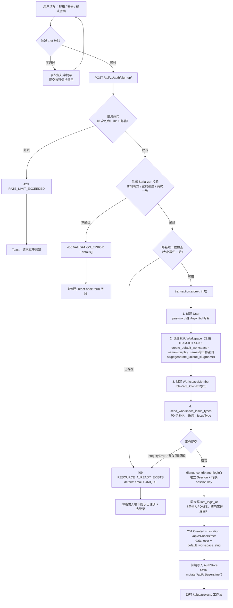
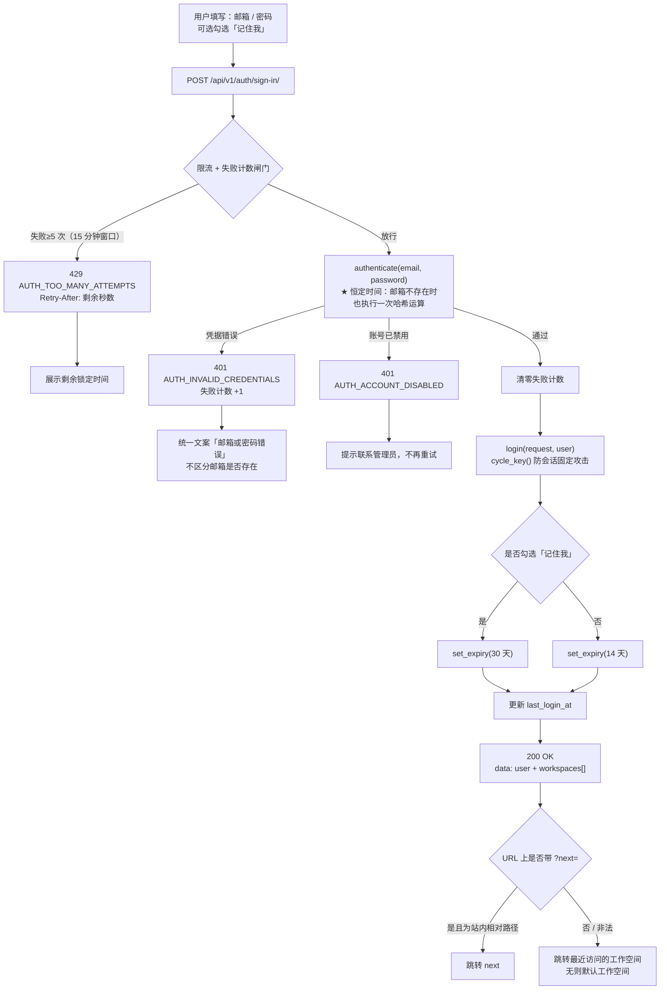
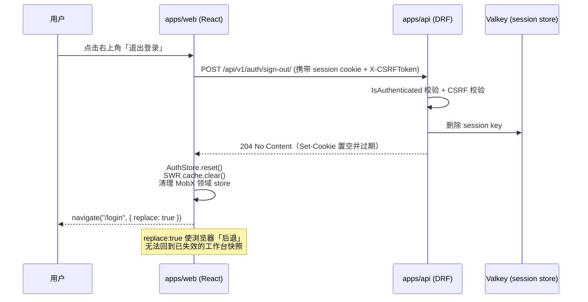
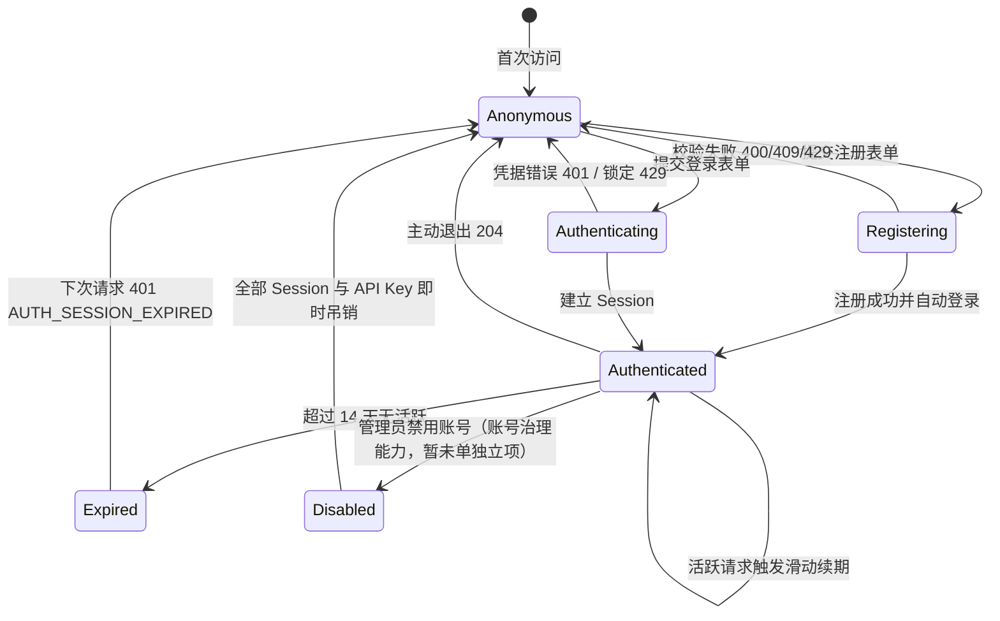

# 邮箱注册 / 登录 / 退出

| 元信息项 | 内容 |
| --- | --- |
| 文档编号 | AUTH-001 |
| 所属迭代 | Sprint 0：POC 技术验证（第 1-2 周） |
| 优先级 | P0（POC 阻塞级） |
| 所属模块 | M1-AUTH 账号与权限 |
| 文档状态 | 待评审（Draft） |
| 最后更新日期 | 2026-09-01 |
| 上游依据 | `docs/需求文档.md` §3.1 账号与权限、§四 权限体系 |
| 前置依赖 | `INFRA-001`（Monorepo 骨架）、`INFRA-002`（Docker Compose：PostgreSQL / Valkey）、`INFRA-003`（`BaseModel` 与 `User` 模型基线） |
| 下游依赖 | `AUTH-002`（路由拦截与接口鉴权）、`AUTH-003`（最小权限隔离）、`TEAM-001`（团队 CRUD 与默认团队）、以及全部需要登录态的模块 |
| 架构基线 | [`api-conventions.md`](../architecture/api-conventions.md) §2.5 / §4 / §7.2 / §8.2 / §9.2、[`rbac-permission-model.md`](../architecture/rbac-permission-model.md) §2 / §3 / §9、[`tech-stack.md`](../architecture/tech-stack.md) §3.1 |
| 竞品参考 | Plane 开源版（Django 自研认证：Session + Token + OAuth，不使用 NextAuth）、Ones（SAML 2.0 SSO + LDAP/AD 私有化部署） |
| 工作量估算 | 后端 2 人日 / 前端 2 人日 / 联调与测试 1 人日，合计 **5 人日** |

> **范围声明**：本文档只交付「邮箱 + 密码」的认证最小闭环。Magic Link、OAuth 第三方登录、SSO、LDAP、MFA、密码重置**均不在 P0 范围**，但认证链路的可扩展点在 §4.5 显式预留。

---

## 1. 概述

### 1.1 功能定位

AUTH-001 是整个系统的**唯一入口**。在它交付之前，所有模块（TEAM / PROJ / TASK / BOARD）都没有可用的 `request.user`，行级过滤（`AUTH-003`）与路由守卫（`AUTH-002`）都没有判定主体。因此它是依赖图上唯一的「零入度横切节点」——`dependency-graph.md` 中 `INFRA-003 → AUTH → 所有模块` 这条强依赖边的起点。

本文档交付四件事，构成一个可独立演示的闭环：

| 交付项 | 说明 |
| --- | --- |
| 邮箱注册 | 邮箱 + 密码创建账号，**并在同一事务内自动初始化其个人默认工作空间** |
| 邮箱登录 | 凭据校验 + 建立服务端 Session（HttpOnly Cookie 承载） |
| 退出登录 | 销毁服务端 Session + 清理浏览器端凭据与本地用户态 |
| 会话保持 | 刷新页面 / 关闭浏览器重开后仍为登录态；14 天滑动过期；过期后统一 401 引导重登 |

### 1.2 目标用户

| 用户 | 场景 | 关注点 |
| --- | --- | --- |
| 全部终端用户 | 首次使用系统、日常每天首次打开系统 | 一分钟内完成注册并进入可用的工作台，不需要「先建团队才能干活」 |
| POC 演示者 | 向评审方演示「登录 → 建团队 → 建项目 → 建任务 → 拖看板」闭环 | 注册后立即有默认工作空间，演示无需人工预置数据 |
| 系统管理员 | 私有化部署后的首个账号 | 首个注册用户可通过管理命令提升为 `SYSTEM_ADMIN`（见 §4.6） |

### 1.3 前置依赖说明

| 依赖文档 | 依赖内容 | 缺失后果 |
| --- | --- | --- |
| `INFRA-001` | `apps/api`（Django + DRF）与 `apps/web`（React Router v7 + Vite）工程骨架、axios 实例与拦截器位点 | 无处落代码 |
| `INFRA-002` | PostgreSQL 15.7 与 Valkey 7.2 容器（Session 后端复用 api 的 Valkey DB 0，见 §4.3.3 说明） | Session 无法持久化，刷新即掉登录 |
| `INFRA-003` | `BaseModel`（UUID 主键 + 审计字段 + 软删除位）、`User` 模型基线、`WorkspaceMember` 与 `SystemAdmin` 建表 | 注册无法落库；`WorkspaceMember.role` 若不是 `IntegerField` 则 P1 需要破坏性迁移（见 `rbac-permission-model.md` §9） |

### 1.4 竞品参考结论（详见第 6 章）

- **Plane**：Django 自研认证，Session + Token + OAuth 三条链路并存，明确不使用 NextAuth；密码走 Django 内置哈希器体系；额外提供 Magic Link 与 Google/GitHub OAuth。
- **Ones**：企业侧能力更厚——SAML 2.0 SSO、LDAP/AD（On-Premises）、MFA（Business 及以上）、密码安全规则可配置、会话管理与超时策略。
- **本系统 P0**：只做邮箱 + 密码最小闭环，与 Plane 的基础认证链路一致；SSO / LDAP / MFA 对标 Ones，排在 `AUTH-009`（P3，SSO 单点登录）与 `AUTH-011`（P4，LDAP / SCIM）。

---

## 2. 业务逻辑

### 2.1 注册流程



**关键设计点**

1. **默认工作空间在注册事务内创建**，不是注册成功后再发一个请求。理由：两步式会产生「用户已存在但没有任何工作空间」的中间态，前端必须为此写兜底分支，而这个中间态永远无法自愈（用户下次登录仍然没有工作空间）。放进同一个 `transaction.atomic()` 后，要么全部成功，要么全部回滚。默认工作空间的创建**复用 `TEAM-001` §4.3.1 的 `create_default_workspace()`**——同事务完成 Workspace + WorkspaceMember + `seed_workspace_issue_types`（P0 仅种入「任务」IssueType）三步，命名与 slug 生成规则以 `TEAM-001` §2.2 为**唯一权威口径**，本文档不维护第二套规则。
2. **自动登录复用登录路径的同一函数**，不另写一遍 `login()` 调用，避免两条路径的 Session 配置（有效期、key 轮换）出现漂移。
3. **响应体不含任何 token**（`api-conventions.md` §9.2 硬性约定），凭据只在 HttpOnly Cookie 中。
4. **`last_login_at` 在响应前同步写入，不进 `on_commit`**：注册（§4.2.1）与登录（§4.2.2）响应体都要返回该值，若置 `on_commit`（视图返回后才执行）则序列化时必为 `null`；且它只是一条单列 `UPDATE`（成本相对 Argon2id 哈希的约 50ms 可忽略），并非 `api-conventions.md` §10.5 针对的「通知 / Webhook / 索引」类外部副作用。注册首登录与普通登录（§2.2 步骤 H）统一此口径，写入位置在 `establish_session()`（§4.3.2）。
5. **欢迎邮件 `on_commit` 副作用的显式登记（对齐 TEAM-001，矛盾显式化）**：被本文引为注册契约权威的 `TEAM-001` §4.3.1 `perform_sign_up`（及其 §2.2 注册初始化流程）明确包含 `transaction.on_commit(send_welcome_email.delay(...))`——这是 P0 认证链路**唯一**的 `on_commit` 落点（副作用投递策略见其 §2.1）。本文据此登记消解口径：**P0 不配置 SMTP**，`send_welcome_email` 为**落日志降级任务**（P0 不发真实邮件，仅写一条日志，非用户可见副作用），注册流程本身写一封「日志邮件」是 P0 可接受的降级。该任务在事务提交后异步执行，响应**无需等待**它完成，与本文「注册事务内禁止外部调用」及 `last_login_at` 同步写（设计点 4）的口径均不冲突。

### 2.2 登录流程



**关于「防用户枚举」的三处一致处理**（缺一即可被枚举）：

| 位置 | 处理 |
| --- | --- |
| 错误码 | 邮箱不存在与密码错误**同码同文案**：`AUTH_INVALID_CREDENTIALS` / 「邮箱或密码错误」 |
| 响应时间 | 邮箱不存在时对一个固定的 dummy hash 执行一次 `check_password`，抹平时序差异 |
| 限流维度 | 按 IP + 邮箱双维度计数，不因「邮箱不存在」而跳过计数（否则可用计数差异反推账号存在性） |

### 2.3 退出流程



**幂等约定**：未登录状态下调用退出接口返回 `204`（不是 401）。理由：退出的语义是「确保当前无会话」，重复调用与并发调用都应成功，避免前端为「退出失败」写补偿逻辑。

### 2.4 会话保持机制

P0 采用 **Session 为主 + API Key 为辅** 的双凭据模式，与 `api-conventions.md` §9.1 的三种认证方式表严格对齐：

| 凭据 | 消费方 | 载体 | 有效期 | P0 是否交付 |
| --- | --- | --- | --- | --- |
| Session | `apps/web` / `apps/admin` 浏览器登录态 | `HttpOnly` + `Secure` + `SameSite=Lax` 的 `rp_sessionid` Cookie | 默认 14 天滑动；勾选「记住我」30 天**滑动窗口**（与默认 14 天滑动的差别仅在窗口长度，见 §4.3.3） | ✅ 本文档 |
| API Key（`APIToken`） | 脚本 / CI / 自建集成 | `X-API-Key: rp_live_xxxx` 请求头 | 默认 1 年 | ⭕ 模型与认证类在 P0 建好（供 E2E 与冒烟脚本使用）；管理端点与 UI 暂未立项（README §4 索引暂无承接文档，端点见 `api-conventions.md` §2.5）。P0 阶段令牌经 Django shell / 测试工厂（`APIToken.objects.create`）签发（UT-19 / IT-19） |
| OAuth 2.0 Bearer | 第三方应用 | `Authorization: Bearer` | access 1h / refresh 30d | ❌ P4 远期增强（暂未立项，README §4 索引中无承接文档） |

**滑动过期的实现**：`SESSION_SAVE_EVERY_REQUEST = True`，每次已认证请求都重写 session 的过期时间戳。代价是每请求一次 Valkey 写入（Session 后端为 cache backend，写入成本约 0.1ms，可接受）；收益是活跃用户永不被动掉线。

**「Token 过期刷新」在本方案下的落点**：Session 模式没有客户端可见的 token，因此**不存在前端刷新 token 的逻辑**。前端只需处理一种情况：任意接口返回 `401 AUTH_SESSION_EXPIRED` 时清理本地态并跳登录（带 `?next=`）。这条统一分派规则写在 axios 响应拦截器里（`api-conventions.md` §8.9），业务代码零感知。OAuth 的 `refresh_token` 轮换机制属于 P4 范围，与本文档无关。

### 2.5 认证状态机



> `Disabled` 状态的转入动作（管理员禁用账号）暂无承接的功能文档（编号待排期）：`rbac-permission-model.md` §9 P2 行与 `INFRA-003` §4 表注均把「账号禁用/启用」指向 `AUTH-007`，而 README §4 现行索引中 `AUTH-007` 为「部门层级组织架构」（Sprint 8，P3），编号不一致（架构文档待回改）；按 README 现行索引该能力暂无承接文档。但**转出行为（401 `AUTH_ACCOUNT_DISABLED`）在 P0 即实现**，否则后续上线禁用功能时前端要临时补分支。

### 2.6 业务规则表

| 编号 | 规则 | 判定位置 | 违反后果 |
| --- | --- | --- | --- |
| BR-01 | 邮箱必须符合 RFC 5322 基本格式，长度 ≤ 254 字符 | 前端 Zod + 后端 `EmailValidator` | 400 `VALIDATION_ERROR` / `INVALID_EMAIL` |
| BR-02 | 邮箱全局唯一；比较前统一转小写并去首尾空格（`user@x.com` 与 `User@X.com` 视为同一账号） | 后端 `normalize_email` + DB 唯一约束 | 409 `RESOURCE_ALREADY_EXISTS` |
| BR-03 | 密码长度 8 ~ 128 字符，必须同时包含大写字母、小写字母、数字 | 前端 Zod + 后端 `AUTH_PASSWORD_VALIDATORS` | 400 `VALIDATION_ERROR` / `TOO_SHORT`、`INVALID` |
| BR-04 | 密码不得与邮箱本地部分相同、不得为常见弱密码（Django `CommonPasswordValidator` 内置约 2 万词表） | 后端校验器 | 400 `VALIDATION_ERROR` / `INVALID` |
| BR-05 | 两次输入的密码必须一致 | 前端 + 后端 `validate()` | 400 `VALIDATION_ERROR` / `INVALID`（`details.field = password_confirm`） |
| BR-06 | 密码只存哈希，算法为 **Argon2id**；数据库、日志、响应体、异常堆栈中都不得出现明文或哈希 | `make_password` + 日志脱敏中间件 | 视为安全缺陷，阻断合并 |
| BR-07 | 注册成功必须在同一事务内创建默认 Workspace（含 `seed_workspace_issue_types` 种入「任务」IssueType）且注册者为 `WS_OWNER(20)` | `AuthService.register()`（复用 `TEAM-001` `create_default_workspace()`） | 事务回滚，注册整体失败 |
| BR-08 | 默认工作空间名为 `{display_name}的工作空间`；slug 复用 `TEAM-001` §4.1.3 的 `generate_unique_slug(name)` 生成（英文 slugify、中文经 pypinyin 转拼音兜底；基名截断至 40 字符、最终 ≤ 48 以适配 `SlugField(max_length=48)`），命中保留词或冲突时追加 `-1`、`-2`…，最多重试 100 次，超限改用 6 位随机短码 | `TEAM-001` `generate_unique_slug()` | ——（随机短码兜底，概率上必然成功，不再返回 500） |
| BR-09 | `display_name` 缺省取邮箱本地部分（`zhangsan@x.com` → `zhangsan`），长度 ≤ 150 | Serializer `default` | —— |
| BR-10 | 登录成功必须轮换 session key（`cycle_key()`） | `AuthService.login()` | 会话固定攻击（Session Fixation）风险 |
| BR-11 | 登录 / 注册端点限流 10 请求/分钟（IP + 邮箱双维度）；登录连续失败 5 次锁定该邮箱 15 分钟 | DRF Throttle + Valkey 计数器 | 429 `RATE_LIMIT_EXCEEDED` / `AUTH_TOO_MANY_ATTEMPTS` |
| BR-12 | 所有非安全方法（POST/PATCH/DELETE）必须通过 CSRF 双提交校验；注册与登录端点同样校验 | Django CSRF 中间件 | 403 `AUTH_CSRF_FAILED` |
| BR-13 | 退出接口幂等：无论当前有无有效 Session 均返回 204 | `SignOutView` | —— |
| BR-14 | `is_active=False` 的账号不得登录，且其既有 Session 与 API Key 即时失效 | 认证后端 + 账号治理吊销逻辑（暂未单独立项） | 401 `AUTH_ACCOUNT_DISABLED` |

### 2.7 异常处理表

响应结构严格遵循 `api-conventions.md` §4.2，错误码取自其 §8 全表（**不新增未登记的错误码**）。

| 场景 | HTTP | `error.code` | `details[]` | 前端行为 |
| --- | --- | --- | --- | --- |
| 邮箱已注册 | 409 | `RESOURCE_ALREADY_EXISTS` | `{field: "email", code: "UNIQUE"}` | 邮箱输入框下红字 + 「直接登录」链接 |
| 两次密码不一致 | 400 | `VALIDATION_ERROR` | `{field: "password_confirm", code: "INVALID"}` | 字段级提示 |
| 密码强度不足 | 400 | `VALIDATION_ERROR` | `{field: "password", code: "TOO_SHORT"/"INVALID"}` | 字段级提示 + 强度条标红 |
| 邮箱格式非法 | 400 | `VALIDATION_ERROR` | `{field: "email", code: "INVALID_EMAIL"}` | 字段级提示 |
| 请求体非法 JSON | 400 | `VALIDATION_INVALID_JSON` | —— | 全局 toast（通常是客户端 bug） |
| 凭据错误 | 401 | `AUTH_INVALID_CREDENTIALS` | —— | 表单顶部统一提示，密码框清空、邮箱保留 |
| 账号被禁用 | 401 | `AUTH_ACCOUNT_DISABLED` | —— | 提示联系管理员，禁止自动重试 |
| 未登录访问 `/users/me/` | 401 | `AUTH_REQUIRED` | —— | 跳转登录页并带 `?next=` |
| Session 过期 | 401 | `AUTH_SESSION_EXPIRED` | —— | 静默跳登录 + toast「登录已过期」 |
| CSRF 校验失败 | 403 | `AUTH_CSRF_FAILED` | —— | 重新拉取 CSRF token 后**自动重试一次** |
| 注册/登录过于频繁 | 429 | `RATE_LIMIT_EXCEEDED` | `{field: "retry_after", code: "RETRY_AFTER"}` | 按 `Retry-After` 倒计时禁用提交按钮 |
| 登录连续失败超限 | 429 | `AUTH_TOO_MANY_ATTEMPTS` | `{field: "retry_after", code: "RETRY_AFTER"}` | 展示剩余锁定时间 |
| 事务失败 / DB 异常 | 500 | `SERVER_DATABASE_ERROR` | —— | 通用错误 + 展示 `request_id` |

### 2.8 边界条件

| 编号 | 边界 | 期望行为 |
| --- | --- | --- |
| EC-01 | 密码恰好 8 位 / 恰好 128 位 | 均通过；129 位返回 400 `TOO_LONG`（不静默截断——截断会导致用户下次输入完整密码却登录失败） |
| EC-02 | 邮箱恰好 254 字符 / 255 字符 | 254 通过；255 返回 400 `TOO_LONG` |
| EC-03 | `display_name` 150 字符 / 151 字符 | 150 通过；151 返回 400 `TOO_LONG` |
| EC-04 | 邮箱含大写与首尾空格 `  Zhang@X.com ` | 归一为 `zhang@x.com` 后落库；用任意大小写形式都能登录 |
| EC-05 | 邮箱含 Unicode 域名（IDN） | P0 不支持，返回 400 `INVALID_EMAIL`（避免同形异义字钓鱼） |
| EC-06 | **并发注册同一邮箱**（两个请求同时通过唯一性检查） | 依赖 DB 唯一约束兜底：先提交者成功，后者捕获 `IntegrityError` 转 409 `RESOURCE_ALREADY_EXISTS`。**不允许仅靠应用层 `exists()` 判重** |
| EC-07 | 并发注册导致默认工作空间 slug 冲突 | `generate_unique_slug()` 检测冲突追加 `-1`、`-2`…（最多 100 次，BR-08）；并发穿透唯一约束时由创建服务捕获 `IntegrityError` 重试（`TEAM-001` §4.1.3） |
| EC-08 | 密码含空格 / emoji / 中文 | 允许（不做字符集限制，仅做长度与复杂度校验）；首尾空格**不 trim**（trim 会造成登录失败） |
| EC-09 | 同一账号多设备同时登录 | 允许，各设备独立 Session；「单会话模式」为 P3 实例配置项 |
| EC-10 | 用户禁用浏览器 Cookie | 登录接口成功但后续请求 401；前端在 `document.cookie` 不可写时展示「请启用 Cookie」提示 |
| EC-11 | Valkey 不可用 | Session 无法读写，返回 500 `SERVER_ERROR`；健康检查探针应先于用户发现（`INFRA-002`） |
| EC-12 | 已登录用户再次访问 `/login` | 前端 loader 直接 `redirect` 到工作台，不渲染登录表单 |

---

## 3. UI/UX 设计

### 3.1 视觉基线

| 项 | 约定 |
| --- | --- |
| 技术 | Headless UI 2.2（`Dialog` / `Field` / `Label` / `Input` / `Checkbox`）+ Tailwind CSS 4.1，图标 lucide-react |
| 布局 | 单栏居中卡片；PC 端卡片宽 **420px**，垂直居中偏上（`padding-top: 12vh`）；移动端卡片全宽（左右 16px 安全边距），无阴影无圆角上边 |
| 背景 | 浅灰底（`bg-neutral-50` / 暗色 `bg-neutral-950`），卡片白底 + `shadow-sm` + `rounded-xl` |
| 字体 | 继承 `@rp/ui` 的设计 token，标题 `text-2xl/semibold`，辅助文案 `text-sm/neutral-500` |
| 主色 | `@rp/ui` 主色 token；提交按钮为主色实心，禁用态 `opacity-50 + cursor-not-allowed` |

### 3.2 注册页（`/register`）

```
┌──────────────────────────────────────┐
│              [ Logo ]                │
│         创建你的账号                  │
│   已有账号？登录  ← 顶部次级入口       │
├──────────────────────────────────────┤
│  邮箱                                 │
│  ┌────────────────────────────────┐  │
│  │ you@company.com                │  │
│  └────────────────────────────────┘  │
│  该邮箱已注册，直接登录 →  ← 409 时出现 │
│                                      │
│  密码                            👁   │
│  ┌────────────────────────────────┐  │
│  │ ••••••••                       │  │
│  └────────────────────────────────┘  │
│  ▓▓▓▓▓▓░░░░  强度：中                 │
│  至少 8 位，需含大小写字母与数字        │
│                                      │
│  确认密码                        👁   │
│  ┌────────────────────────────────┐  │
│  │ ••••••••                       │  │
│  └────────────────────────────────┘  │
│                                      │
│  ┌────────────────────────────────┐  │
│  │        创建账号                 │  │
│  └────────────────────────────────┘  │
├──────────────────────────────────────┤
│  已有账号？ 登录                       │
└──────────────────────────────────────┘
```

字段清单：

| 字段 | 控件 | 校验时机 | 提示文案 |
| --- | --- | --- | --- |
| 邮箱 | `type="email"`，`autoComplete="email"` | 失焦校验格式；输入时仅清除既有错误 | 「请输入有效的邮箱地址」 |
| 密码 | `type="password"` + 明文切换按钮，`autoComplete="new-password"` | 输入时实时更新强度条；失焦校验规则 | 「至少 8 位，需含大小写字母与数字」 |
| 确认密码 | 同上 | 失焦 + 密码变更时联动校验 | 「两次输入的密码不一致」 |

### 3.3 登录页（`/login`）

```
┌──────────────────────────────────────┐
│              [ Logo ]                │
│           登录 RabbitProjects         │
├──────────────────────────────────────┤
│  ⚠ 邮箱或密码错误        ← 401 时出现   │
│                                      │
│  邮箱                                 │
│  ┌────────────────────────────────┐  │
│  │ you@company.com                │  │
│  └────────────────────────────────┘  │
│  密码                            👁   │
│  ┌────────────────────────────────┐  │
│  │ ••••••••                       │  │
│  └────────────────────────────────┘  │
│  ☐ 记住我（30 天）      忘记密码？(P1) │
│  ┌────────────────────────────────┐  │
│  │          登录                   │  │
│  └────────────────────────────────┘  │
├──────────────────────────────────────┤
│  没有账号？ 立即注册                   │
└──────────────────────────────────────┘
```

- 「忘记密码？」链接在 P0 渲染为**禁用态灰字 + Tooltip「即将上线」**，不做隐藏。理由：位置提前占位可避免 P1（`AUTH-004`）上线时布局重排，也让用户知道该能力存在。
- 「记住我」未勾选 = 14 天滑动过期；勾选 = **30 天滑动窗口**（与默认 14 天滑动的差别仅在窗口长度——`SESSION_SAVE_EVERY_REQUEST = True` 下每次已认证请求都重写过期时间戳，§4.3.3，不存在「固定过期」语义）。文案直接标注天数，不用「保持登录」这类无法自证的模糊表达。

### 3.4 密码强度指示器

纯前端计算，**不作为提交门槛**（门槛由 BR-03/BR-04 的硬规则决定），只做正向引导：

| 等级 | 判定 | 颜色 | 条宽 |
| --- | --- | --- | --- |
| 弱 | 长度 < 8 或仅单一字符类 | `bg-red-500` | 33% |
| 中 | 满足硬规则（≥8 且含大小写与数字） | `bg-amber-500` | 66% |
| 强 | 长度 ≥ 12 且额外含符号 | `bg-emerald-500` | 100% |

规则清单在强度条下方常驻展示（不是只在报错时出现），并对已满足项打勾。这一处的取舍：常驻文案多占 40px 高度，但把「试错—报错—修正」的循环压缩为一次输入完成。

### 3.5 交互细节

| 交互 | 行为 |
| --- | --- |
| 实时校验策略 | **失焦时校验，输入时只清错**（`react-hook-form` 的 `mode: "onTouched"`）。边输入边报红会让用户在打完第 3 个字符时就看到「邮箱格式错误」，体验负面 |
| 提交按钮禁用条件 | 表单存在已知错误、必填未填、请求进行中、限流倒计时中 |
| Loading 态 | 按钮内联 spinner + 文案切换为「创建中…」/「登录中…」；整个表单 `aria-busy="true"` 且输入框只读，防止重复提交 |
| 双击提交防护 | 前端按钮禁用 + 后端注册端点支持 `Idempotency-Key`（`api-conventions.md` §3.4；匿名端点无 `user_id`，键组成约定见 §4.2.1） |
| 字段级错误 | 后端 `details[]` 通过 `setError(field, ...)` 精确落到对应输入框，不弹 toast |
| 全局错误 | 401 渲染为表单顶部 Alert 条（**不用 toast**，因为登录失败时用户视线在表单内）；429 / 5xx 用 toast |
| 成功反馈 | 不弹「注册成功」toast，直接跳转工作台并在工作台顶部展示一次性欢迎条。少一次点击 |
| 密码明文切换 | 眼睛图标切换 `type`，`aria-pressed` 反映状态，切换不丢失光标位置 |
| 回车提交 | 任意输入框内回车触发提交（`<form onSubmit>` 原生行为，不手写 keydown） |
| 自动填充 | 正确设置 `autoComplete`（`email` / `new-password` / `current-password`），让密码管理器可用——这是安全实践而非便利功能 |
| 页面切换 | 登录 ↔ 注册切换时保留已输入的邮箱（同一 URL 查询参数传递），减少重复输入 |

### 3.6 响应式断点

| 断点 | 布局 |
| --- | --- |
| `< 640px` | 卡片全宽，无外边框；Logo 尺寸缩小；底部链接固定在内容流末尾（不做 fixed，避免与移动端键盘冲突） |
| `640px ~ 1024px` | 卡片 420px 居中 |
| `> 1024px` | 同上；卡片右侧可选展示产品插画（纯装饰，`aria-hidden="true"`，移动端不加载） |
| 暗色模式 | 跟随系统 `prefers-color-scheme`；Tailwind `dark:` 变体 |

### 3.7 无障碍要求（WCAG 2.1 AA）

| 项 | 实现 |
| --- | --- |
| 标签关联 | Headless UI `<Field>` + `<Label>` 自动建立 `for`/`id` 关联，禁止用 placeholder 代替 label |
| 键盘顺序 | DOM 顺序即 Tab 顺序（邮箱 → 密码 → 明文切换 → 确认密码 → 记住我 → 提交 → 底部链接），无 `tabindex > 0` |
| 回车提交 | 原生 form 提交，任意字段内生效 |
| 错误播报 | 字段错误容器 `role="alert"` + `aria-live="polite"`，输入框 `aria-invalid="true"` 且 `aria-describedby` 指向错误文本 |
| 提交状态播报 | 表单 `aria-busy`；结果消息区 `aria-live="assertive"` |
| 对比度 | 正文 ≥ 4.5:1，禁用态按钮文字 ≥ 3:1；错误红字不单独承载语义（同时有图标 + 文案） |
| 焦点可见 | 全局 `focus-visible:ring-2`，禁止 `outline: none` |
| 强度指示器 | 条形图 `role="meter"` + `aria-valuenow/min/max` + `aria-label="密码强度"`；等级文字同步输出，不只靠颜色 |

---

## 4. 技术架构

### 4.1 数据模型

`User` 的权威定义在 `INFRA-003`，本节只补充与认证直接相关的字段与约束（**若与 `INFRA-003` 出现分歧，以 `INFRA-003` 为准并回改本节**）。

```python
# apps/api/plane/db/models/user.py
import uuid

from django.contrib.auth.models import AbstractUser, BaseUserManager
from django.db import models


class UserManager(BaseUserManager):
    """以 email 为登录标识的 Manager（AbstractUser 默认以 username 为标识）。"""

    def create_user(self, email: str, password: str | None = None, **extra):
        if not email:
            raise ValueError("邮箱不能为空")
        email = self.normalize_email(email).strip().lower()   # BR-02 归一化
        user = self.model(email=email, **extra)
        user.set_password(password)                            # BR-06 Argon2id
        user.save(using=self._db)
        return user

    def create_superuser(self, email: str, password: str, **extra):
        extra.setdefault("is_staff", True)
        extra.setdefault("is_superuser", True)
        return self.create_user(email, password, **extra)


class User(AbstractUser):
    """系统用户 —— 认证主体，全局唯一实体（不归属任何 Workspace）。

    与 BaseModel 的关系：User 不继承 BaseModel（BaseModel 的 created_by/updated_by
    指向 User，继承会导致自引用外键的循环），但手工对齐其三项约定：
    UUID 主键、created_at/updated_at 审计时间、deleted_at 软删除位。
    """

    id = models.UUIDField(primary_key=True, default=uuid.uuid4, editable=False)

    # ── 认证字段 ─────────────────────────────────────────────
    email = models.EmailField(max_length=254, unique=True, db_index=True,
                              verbose_name="邮箱")            # BR-01 / BR-02
    username = None                                            # 弃用 username 登录路径
    # password 字段由 AbstractBaseUser 提供：varchar(128)，存 Argon2id 编码串

    # ── 展示字段 ─────────────────────────────────────────────
    display_name = models.CharField(max_length=150, verbose_name="显示名")  # BR-09
    avatar_url = models.URLField(max_length=800, blank=True, verbose_name="头像地址")

    # ── 状态与审计 ───────────────────────────────────────────
    is_active = models.BooleanField(default=True, db_index=True,
                                    verbose_name="是否启用")   # BR-14
    last_login_at = models.DateTimeField(null=True, blank=True, verbose_name="最近登录时间")
    last_workspace_id = models.UUIDField(null=True, blank=True,
                                         verbose_name="最近访问的工作空间")
    created_at = models.DateTimeField(auto_now_add=True)
    updated_at = models.DateTimeField(auto_now=True)
    deleted_at = models.DateTimeField(null=True, blank=True, db_index=True)

    USERNAME_FIELD = "email"
    REQUIRED_FIELDS = []
    objects = UserManager()

    class Meta:
        db_table = "users"
        verbose_name = "用户"
        indexes = [
            models.Index(fields=["email", "is_active"]),   # 登录主查询路径
        ]

    def __str__(self) -> str:
        return f"{self.display_name} <{self.email}>"
```

| 字段 | 类型 | 约束 / 索引 | 说明 |
| --- | --- | --- | --- |
| `id` | UUID | PK | 与全站 UUID 主键约定一致，不暴露自增序号 |
| `email` | varchar(254) | UNIQUE + B-Tree，归一化小写 | 登录标识（`USERNAME_FIELD`） |
| `password` | varchar(128) | NOT NULL | Argon2id 编码串（含算法标识与参数，便于后续无痛升级参数） |
| `display_name` | varchar(150) | NOT NULL | 缺省取邮箱本地部分 |
| `avatar_url` | varchar(800) | 可空 | P0 前端用姓名首字母生成占位头像，不落库 |
| `is_active` | bool | 默认 true，索引 | `false` 时禁止登录且吊销既有凭据 |
| `last_login_at` | timestamptz | 可空 | 登录成功后**同步写入**（单列 `UPDATE`，登录 / 注册响应体即返回该值，见 §2.1 设计点 4） |
| `last_workspace_id` | UUID | 可空，无外键约束 | 登录后回跳目标；**刻意不建外键**，工作空间被删时不需要级联清理 |
| `deleted_at` | timestamptz | 可空，索引 | 软删除；`unique(email)` 在 P0 不带 `deleted_at` 条件（P2 账号注销时再评估偏索引） |

**为什么 `username = None`**：保留 `username` 字段会产生「两个可登录标识」的歧义，且 `AbstractUser` 的 `username` 带 unique 约束，注册时必须填一个值——最终会退化成「用邮箱填 username」的冗余。直接置 `None` 并改 `USERNAME_FIELD`，是 Django 官方推荐做法。

**注册时同步创建的关联记录**（模型定义见 `rbac-permission-model.md` §3.2 与 `unified-issue-model.md` §2.3）：

```python
Workspace(name=f"{user.display_name}的工作空间", slug=<generate_unique_slug(name)>, owner=user)
WorkspaceMember(workspace=<上者>, member=user, role=WorkspaceRole.OWNER, is_active=True)
seed_workspace_issue_types(<上者>)   # P0 仅种入「任务」IssueType（TEAM-001 §2.1 步骤 J）
```

> 以上三步**不由本文档自行实现**，而是整体复用 `TEAM-001` §4.3.1 的 `create_default_workspace(user)`（幂等，事务内完成），避免两份文档维护两套创建逻辑产生漂移；此处列出仅为说明注册事务的完整写入面。

### 4.2 API 定义

端点路径**直接采用 `api-conventions.md` §2.5「认证与账户」清单中的既有定义**，不另起一套命名。语义映射如下（本表是本文档与需求措辞之间的唯一翻译层，实现与测试一律以「规范路径」列为准）：

| 需求措辞 | 规范路径（唯一事实来源） | 方法 | 认证 | 限流 |
| --- | --- | --- | --- | --- |
| 注册 | `/api/v1/auth/sign-up/` | POST | 无需认证（`AllowAny`） | 10/min（IP + 邮箱） |
| 登录 | `/api/v1/auth/sign-in/` | POST | 无需认证（`AllowAny`） | 10/min + 失败 5 次锁 15min |
| 退出 | `/api/v1/auth/sign-out/` | POST | 需认证（幂等，未登录亦 204） | 60/min |
| 获取当前用户 | `/api/v1/users/me/` | GET | 需认证 | 60/min |
| CSRF 令牌 | `/api/v1/auth/csrf-token/` | GET | 无需认证 | 60/min |

> **命名决策记录**：`register / login / logout / auth/me` 是更口语化的命名，但 `api-conventions.md` 已将 `sign-up / sign-in / sign-out` 与 `users/me` 登记为规范端点（前者对齐 Plane 端点命名，后者体现「当前用户是 `users` 集合的单例子资源，不属于 `auth` 命名空间」）。为避免同一能力出现两套路径，本文档不引入别名，也**不做 301 兼容跳转**（POST 重定向会丢请求体，见 `api-conventions.md` §2.3）。

#### 4.2.1 `POST /api/v1/auth/sign-up/` — 注册

请求头：`Content-Type: application/json`、`X-CSRFToken: <token>`、可选 `Idempotency-Key: <uuid>`

> **匿名端点的幂等键组成约定**：`api-conventions.md` §3.4 规定幂等唯一键为 `(user_id, endpoint, key)`，而注册是匿名端点，请求时不存在 `user_id`。本文约定：该匿名端点以 **客户端 IP + 归一化邮箱（小写、去首尾空格，规则同 BR-02）** 充当 `user_id` 维度，即唯一键为 `(client_ip, normalized_email, endpoint, key)`。同键重复提交（双击、网络重试）直接重放首次响应（IT-17、E2E-12）；并发同邮箱请求不携带同键时，仍由 DB 唯一约束兜底转 409（EC-06）。

```json
{
  "email": "zhangsan@example.com",
  "password": "Rabbit2026Pm",
  "password_confirm": "Rabbit2026Pm",
  "display_name": "张三"
}
```

| 字段 | 类型 | 必填 | 约束 |
| --- | --- | --- | --- |
| `email` | string | ✅ | ≤ 254，RFC 5322，唯一（归一化后比较） |
| `password` | string | ✅ | 8 ~ 128，含大小写与数字，非常见弱密码 |
| `password_confirm` | string | ✅ | 与 `password` 全等 |
| `display_name` | string | ⭕ | ≤ 150，缺省取邮箱本地部分 |

`201 Created`，响应头 `Location: /api/v1/users/me/`、`Set-Cookie: rp_sessionid=…; HttpOnly; Secure; SameSite=Lax`：

```json
{
  "status": "success",
  "data": {
    "user": {
      "id": "9f3c1b7e-4d2a-4c81-8e5f-1a2b3c4d5e6f",
      "email": "zhangsan@example.com",
      "display_name": "张三",
      "avatar_url": "",
      "is_active": true,
      "last_login_at": "2026-09-01T02:11:07.412Z",
      "created_at": "2026-09-01T02:11:07.318Z",
      "updated_at": "2026-09-01T02:11:07.412Z"
    },
    "default_workspace_slug": "zhang-san-workspace"
  }
}
```

> `default_workspace_slug` 为**字符串**而非对象：与 `TEAM-001` §4.3.1 `perform_sign_up` 的注册响应契约完全一致——前端读取后直接跳转 `/:slug/projects`，无需为落地工作台再发一次请求；工作台所需的完整对象（name / role 等）由 `TEAM-001` 的 `GET /api/v1/workspaces/` 提供。

错误响应（示例：邮箱已注册）`409 Conflict`：

```json
{
  "status": "error",
  "error": {
    "code": "RESOURCE_ALREADY_EXISTS",
    "message": "该邮箱已注册",
    "details": [
      { "field": "email", "code": "UNIQUE", "message": "该邮箱已被使用，请直接登录" }
    ],
    "request_id": "01JBX3K9Q7ZR4M8N2P5V6W7X8Y"
  }
}
```

错误响应（示例：密码不合规 + 两次不一致）`400 Bad Request`：

```json
{
  "status": "error",
  "error": {
    "code": "VALIDATION_ERROR",
    "message": "请求参数校验失败",
    "details": [
      { "field": "password", "code": "TOO_SHORT", "message": "密码至少 8 位" },
      { "field": "password_confirm", "code": "INVALID", "message": "两次输入的密码不一致" }
    ],
    "request_id": "01JBX3K9Q7ZR4M8N2P5V6W7X8Z"
  }
}
```

#### 4.2.2 `POST /api/v1/auth/sign-in/` — 登录

```json
{
  "email": "zhangsan@example.com",
  "password": "Rabbit2026Pm",
  "remember_me": false
}
```

`200 OK`，响应头 `Set-Cookie: rp_sessionid=…; HttpOnly; Secure; SameSite=Lax; Max-Age=1209600`：

```json
{
  "status": "success",
  "data": {
    "user": {
      "id": "9f3c1b7e-4d2a-4c81-8e5f-1a2b3c4d5e6f",
      "email": "zhangsan@example.com",
      "display_name": "张三",
      "avatar_url": "",
      "is_active": true,
      "last_login_at": "2026-09-01T06:40:22.005Z",
      "last_workspace_id": "2c7d9e11-88a4-4f30-9b6c-77e1d2f3a4b5"
    },
    "workspaces": [
      { "id": "2c7d9e11-88a4-4f30-9b6c-77e1d2f3a4b5", "name": "张三的工作空间", "slug": "zhang-san-workspace", "role": 20 }
    ]
  }
}
```

> `workspaces` 内联返回的取舍：多一次 JOIN（成本极低，成员表有 `(member, workspace, role)` 索引），换掉登录后必然发生的一次 `GET /workspaces/` 往返，让「登录 → 落地工作台」少一个串行 RTT。`role` 为整数等级值（`rbac-permission-model.md` §2.2 定义，本例 `20` 即 `WS_OWNER`），为 `api-conventions.md` §4.5「枚举用小写下划线字符串」的**登记例外**（与 `rbac-permission-model.md` §4.1 权限快照的整数风格一致，属架构文档间张力，架构文档待回改）；前端 P1 的 `PermissionGate` 直接可用。

错误响应 `401 Unauthorized`（邮箱不存在与密码错误**同码同文案**）：

```json
{
  "status": "error",
  "error": {
    "code": "AUTH_INVALID_CREDENTIALS",
    "message": "邮箱或密码错误",
    "details": [],
    "request_id": "01JBX3K9Q7ZR4M8N2P5V6W7X90"
  }
}
```

错误响应 `429 Too Many Requests`，响应头 `Retry-After: 873`：

```json
{
  "status": "error",
  "error": {
    "code": "AUTH_TOO_MANY_ATTEMPTS",
    "message": "登录失败次数过多，请在 15 分钟后重试",
    "details": [{ "field": "retry_after", "code": "RETRY_AFTER", "message": "873" }],
    "request_id": "01JBX3K9Q7ZR4M8N2P5V6W7X91"
  }
}
```

#### 4.2.3 `POST /api/v1/auth/sign-out/` — 退出

请求体：无（`Content-Length: 0`）。请求头需带 `X-CSRFToken`。

`204 No Content`，**响应体为空**（`api-conventions.md` §4.3：204 不得包装 envelope），响应头 `Set-Cookie: rp_sessionid=; Max-Age=0`。

#### 4.2.4 `GET /api/v1/users/me/` — 当前用户

`200 OK`：

```json
{
  "status": "success",
  "data": {
    "id": "9f3c1b7e-4d2a-4c81-8e5f-1a2b3c4d5e6f",
    "email": "zhangsan@example.com",
    "display_name": "张三",
    "avatar_url": "",
    "is_active": true,
    "last_login_at": "2026-09-01T06:40:22.005Z",
    "last_workspace_id": "2c7d9e11-88a4-4f30-9b6c-77e1d2f3a4b5",
    "created_at": "2026-09-01T02:11:07.318Z",
    "updated_at": "2026-09-01T06:40:22.005Z"
  }
}
```

`401 Unauthorized`（未登录 / Session 过期），响应头 `WWW-Authenticate: Session`：

```json
{
  "status": "error",
  "error": {
    "code": "AUTH_REQUIRED",
    "message": "请先登录",
    "details": [],
    "request_id": "01JBX3K9Q7ZR4M8N2P5V6W7X92"
  }
}
```

> **该端点是 `AUTH-002` 前端路由守卫的判定源**：`GET /users/me/` 返回 200 即视为已登录，401 即跳登录页。二者的契约必须完全一致。

#### 4.2.5 `GET /api/v1/auth/csrf-token/` — CSRF 令牌

`200 OK`，同时通过 `Set-Cookie` 下发 `csrftoken`：

```json
{ "status": "success", "data": { "csrf_token": "K7fQ…", "header_name": "X-CSRFToken" } }
```

### 4.3 核心逻辑实现

#### 4.3.1 密码哈希：Argon2id

```python
# apps/api/plane/settings/base.py
PASSWORD_HASHERS = [
    "django.contrib.auth.hashers.Argon2PasswordHasher",          # ★ 首选
    "django.contrib.auth.hashers.PBKDF2PasswordHasher",          # 兼容既有哈希，登录时自动升级
    "django.contrib.auth.hashers.PBKDF2SHA1PasswordHasher",
]

AUTH_PASSWORD_VALIDATORS = [
    {"NAME": "django.contrib.auth.password_validation.MinimumLengthValidator",
     "OPTIONS": {"min_length": 8}},                                       # BR-03
    {"NAME": "django.contrib.auth.password_validation.CommonPasswordValidator"},   # BR-04
    {"NAME": "django.contrib.auth.password_validation.UserAttributeSimilarityValidator"},
    {"NAME": "plane.authentication.validators.PasswordComplexityValidator"},  # 大小写 + 数字
    {"NAME": "plane.authentication.validators.MaxLengthValidator",
     "OPTIONS": {"max_length": 128}},                                     # EC-01
]
```

**为什么是 Argon2id 而不是 Django 默认的 PBKDF2**：`tech-stack.md` §3 已锁定 `argon2-cffi` 依赖并注明「Django 密码哈希器优先使用 Argon2id（优于默认 PBKDF2）」，`api-conventions.md` §9.2 的登录流程亦写明「校验凭证（Argon2id）」。Argon2id 是 RFC 9106 推荐的口令哈希算法，同时抗 GPU/ASIC 并行破解（内存硬）与侧信道攻击；PBKDF2 仅靠迭代次数提升成本，对 GPU 集群的抵抗力显著更弱。Plane 使用 Django 默认 PBKDF2，本系统在此处**刻意偏离 Plane**（见 §6.3 决策 D2）。

代码层面**仍然只调用 `set_password()` / `make_password()` / `check_password()`**，不直接引用任何哈希器类——算法选择完全由 `PASSWORD_HASHERS` 配置决定，未来调整参数或换算法时，用户登录时会由 Django 的哈希升级机制自动重算，无需数据迁移。

#### 4.3.2 注册服务：事务边界

```python
# apps/api/plane/authentication/services.py
from django.contrib.auth import login as django_login
from django.db import IntegrityError, transaction
from django.utils import timezone

from plane.db.models import User, Workspace
from plane.db.services.workspace import create_default_workspace   # TEAM-001 §4.3.1
from plane.utils.errors import ResourceAlreadyExistsError


class AuthService:
    """认证领域服务：把「注册 = 建用户 + 初始化默认工作空间」封装为原子操作。

    默认工作空间的创建（Workspace + WorkspaceMember + IssueType 种子，共三张表）
    整体委托 TEAM-001 §4.3.1 的 create_default_workspace()，本文不维护第二套
    命名 / slug / 种子逻辑。刻意不放在 Serializer.create() 中：注册的副作用
    跨越四张表，属于领域行为而非序列化职责（api-conventions.md §10.2
    「业务规则校验放领域服务层」）。
    """

    @staticmethod
    def register(*, email: str, password: str, display_name: str | None) -> tuple[User, Workspace]:
        email = User.objects.normalize_email(email).strip().lower()      # BR-02
        display_name = (display_name or email.split("@")[0])[:150]       # BR-09

        try:
            with transaction.atomic():                                   # BR-07
                user = User.objects.create_user(
                    email=email, password=password, display_name=display_name
                )
                workspace = create_default_workspace(user)              # BR-08：内部完成
                                                                       # Workspace（name=f"{display_name}的工作空间"，
                                                                       # slug=generate_unique_slug(name)）
                                                                       # + WorkspaceMember(role=OWNER=20)
                                                                       # + seed_workspace_issue_types
        except IntegrityError as exc:
            # EC-06：并发注册同邮箱时唯一约束兜底，绝不依赖应用层 exists() 判重
            if "users_email_key" in str(exc):
                raise ResourceAlreadyExistsError(
                    field="email", message="该邮箱已被使用，请直接登录"
                ) from exc
            raise

        if workspace is not None:                                        # 幂等分支见 TEAM-001 BE-34
            user.last_workspace_id = workspace.id
            user.save(update_fields=["last_workspace_id"])
        return user, workspace

    @staticmethod
    def establish_session(request, user: User, remember_me: bool = False) -> None:
        """注册自动登录与登录复用同一入口，杜绝两处 Session 策略漂移（BR-10）。"""
        django_login(request, user)          # 内部已调用 cycle_key() 防会话固定
        user.last_login_at = timezone.now()  # 同步写（§2.1 设计点 4 / §2.2 步骤 H）：
                                            # 响应体需返回该值，on_commit 时序上不可行
        user.save(update_fields=["last_login_at"])
        request.session.set_expiry(
            60 * 60 * 24 * 30 if remember_me else 60 * 60 * 24 * 14
        )
```

`ATOMIC_REQUESTS = True` 已在全局开启（`api-conventions.md` §10.5），此处仍显式写 `transaction.atomic()`：一是让事务边界在代码中自我说明，二是使该服务在 Celery 任务、管理命令等非请求上下文中同样安全。

#### 4.3.3 Session 配置

```python
# apps/api/plane/settings/base.py
SESSION_ENGINE = "django.contrib.sessions.backends.cache"
SESSION_CACHE_ALIAS = "default"                   # 复用 api 的 REDIS_URL（Valkey DB 0，说明见下）
SESSION_COOKIE_NAME = "rp_sessionid"
SESSION_COOKIE_HTTPONLY = True                    # 防 XSS 读取
SESSION_COOKIE_SECURE = not DEBUG                 # 生产强制 HTTPS
SESSION_COOKIE_SAMESITE = "Lax"                   # 阻断跨站 POST，允许顶层导航携带
SESSION_COOKIE_AGE = 60 * 60 * 24 * 14            # 14 天
SESSION_SAVE_EVERY_REQUEST = True                 # 滑动过期
SESSION_EXPIRE_AT_BROWSER_CLOSE = False

REST_FRAMEWORK = {
    "DEFAULT_AUTHENTICATION_CLASSES": [
        "plane.authentication.backends.SessionAuthenticationWithCSRF",
        "plane.authentication.backends.APIKeyAuthentication",
    ],
    "DEFAULT_PERMISSION_CLASSES": ["plane.app.permissions.IsAuthenticatedAndActive"],
    "EXCEPTION_HANDLER": "plane.utils.exception_handler.custom_exception_handler",
}
```

> `DEFAULT_PERMISSION_CLASSES` 的「默认拒绝」策略与公开端点的 `AllowAny` 豁免清单属于 `AUTH-002` 的交付内容，本文档只声明注册 / 登录 / CSRF 三个端点必须显式 `permission_classes = [AllowAny]`。

> **Session 的 Valkey DB 分配（对齐 `INFRA-002` §4.2 实际编排）**：`INFRA-002` 已将 Valkey **DB 0** 分配给 api 的 `REDIS_URL`（通用缓存）、**DB 1** 分配给 `CELERY_RESULT_BACKEND`、**DB 2** 分配给 `live` 服务。因此 Session 复用 **DB 0**（`SESSION_CACHE_ALIAS = "default"`），与业务缓存同库不同 key 前缀（Django session 键固定带 `django.contrib.sessions.` 前缀），**不占用 DB 1**。`api-conventions.md` §9.2 中「缓存指向 Valkey（DB 1）」的旧表述与 `INFRA-002` 编排冲突，以 `INFRA-002` 现文为准，架构文档待回改。

Session 数据只存 `_auth_user_id` / `_auth_user_backend` / `_auth_user_hash`，**不缓存任何业务数据或权限快照**。原因：Session 一旦承载权限，角色变更就需要额外的失效机制；权限数据统一走 `GET /api/v1/users/me/permissions/`（P1，`AUTH-005`）并由 WebSocket 事件失效。

#### 4.3.4 CSRF 保护策略

| 项 | 约定 |
| --- | --- |
| 模式 | Django 双提交 Cookie：`csrftoken` Cookie + `X-CSRFToken` 请求头，服务端比对 |
| 令牌获取 | 前端启动时 `GET /api/v1/auth/csrf-token/`（该端点 `@ensure_csrf_cookie`） |
| 自动附加 | axios 请求拦截器对所有非安全方法从 Cookie 读取并写入 `X-CSRFToken` 头 |
| 校验范围 | **包含注册与登录端点**。登录前的 CSRF 校验能阻断「攻击者用自己的凭据静默登录受害者浏览器」（login CSRF），后续受害者的操作会被记入攻击者账号 |
| 失败处理 | 403 `AUTH_CSRF_FAILED`；axios 拦截器重新拉取令牌后**自动重试一次**，仍失败则提示刷新页面 |
| 为何 SameSite=Lax 不够 | `SameSite=Lax` 对顶层导航型 POST（表单提交）仍会携带 Cookie，且不能覆盖旧版浏览器；双提交与 SameSite 是两道独立防线 |

#### 4.3.5 限流与失败锁定

```python
# apps/api/plane/authentication/throttles.py
class AuthEndpointThrottle(SimpleRateThrottle):
    """注册 / 登录：10 请求/分钟，按 IP + 请求体邮箱双维度计数（api-conventions.md §7.2）。"""
    rate = "10/min"

    def get_cache_key(self, request, view):
        email = (request.data.get("email") or "").strip().lower()
        return f"throttle_auth_{self.get_ident(request)}_{email}"


class LoginFailureLock:
    """登录失败锁定：同一邮箱 15 分钟内失败 5 次即锁定。

    键按邮箱而非 IP：攻击者可轮换 IP，但目标账号固定；
    同时对不存在的邮箱也计数，避免用「是否被锁」反推账号存在性（§2.2）。
    """
    WINDOW, MAX_FAILURES = 15 * 60, 5

    @classmethod
    def check(cls, email: str) -> None:
        if cache.get(f"login_fail_{email}", 0) >= cls.MAX_FAILURES:
            raise TooManyAttemptsError(retry_after=cache.ttl(f"login_fail_{email}"))

    @classmethod
    def record_failure(cls, email: str) -> None:
        key = f"login_fail_{email}"
        cache.get_or_set(key, 0, cls.WINDOW)
        cache.incr(key)

    @classmethod
    def clear(cls, email: str) -> None:
        cache.delete(f"login_fail_{email}")
```

锁定期内即使输入正确密码也返回 429，这是刻意的：否则攻击者可用「是否放行」作为密码正确性的判定信号，锁定形同虚设。

### 4.4 前端状态管理

#### 4.4.1 `AuthStore`（MobX）

```typescript
// apps/web/core/store/user/auth.store.ts
import { action, computed, makeObservable, observable, runInAction } from "mobx";

export class AuthStore {
  currentUser: TUser | null = null;
  workspaces: TWorkspaceLite[] = [];
  /** 首次 bootstrap 是否完成 —— 区分「未登录」与「还不知道是否登录」 */
  isBootstrapped = false;
  isLoading = false;
  error: TApiError | null = null;

  constructor(private root: RootStore) {
    makeObservable(this, {
      currentUser: observable,
      workspaces: observable,
      isBootstrapped: observable,
      isLoading: observable,
      error: observable,
      isAuthenticated: computed,
      register: action,
      login: action,
      logout: action,
      fetchCurrentUser: action,
      reset: action,
    });
  }

  get isAuthenticated(): boolean {
    return this.currentUser !== null;
  }

  register = async (payload: TRegisterPayload) => { /* POST sign-up → 写入 user，读 default_workspace_slug 跳转 */ };
  login = async (payload: TLoginPayload) => { /* POST sign-in → 写入 user + workspaces */ };

  logout = async () => {
    try {
      await authService.signOut();
    } finally {
      // ★ 无论接口成败都清理本地态：本地残留登录态比多一次失败请求危险得多
      this.reset();
      swrCache.clear();
      this.root.resetDomainStores();
    }
  };

  fetchCurrentUser = async () => { /* GET users/me → 200 写入；401 置 null */ };

  reset = () => {
    runInAction(() => {
      this.currentUser = null;
      this.workspaces = [];
      this.error = null;
    });
  };
}
```

**`isBootstrapped` 的必要性**：没有这个标记，应用启动瞬间 `isAuthenticated === false`，路由守卫会把已登录用户误判为未登录并闪跳到 `/login`。`AUTH-002` 的 `ProtectedRoute` 必须先等 `isBootstrapped === true`（期间渲染全屏 spinner）再做判定。

#### 4.4.2 SWR 与 MobX 的分工

严格遵循 `tech-stack.md` §2.1：

| 关注点 | 归属 |
| --- | --- |
| `GET /api/v1/users/me/` 的获取、缓存、焦点重验证 | **SWR**，key = `"/api/v1/users/me/"` |
| 当前用户实体的规范化存储与派生计算 | **`AuthStore`**（SWR `onSuccess` 写入，组件只读 store） |
| `sign-up` / `sign-in` / `sign-out` 三个写操作 | **`AuthStore` action**（非 GET 不进 SWR），成功后 `mutate("/api/v1/users/me/")` 兜底重验证 |
| 表单草稿、密码明文开关 | React `useState`（不进 store） |

登录成功后调用 `mutate("/api/v1/users/me/", data.user, { revalidate: false })`：用登录响应直接填充 SWR 缓存，省掉一次 `users/me` 往返，同时保持缓存与 store 一致。退出时 `swrCache.clear()` 清空全部缓存——若只清 `users/me`，切换账号后其他 key 的旧数据仍会命中缓存，造成跨账号数据串味（这正是 `AUTH-003` 隔离要求在前端侧的对应约束）。

#### 4.4.3 凭据存储策略决策：HttpOnly Cookie vs localStorage

| 维度 | HttpOnly Cookie（**采用**） | localStorage token（不采用） |
| --- | --- | --- |
| XSS 下的凭据泄露 | JS 无法读取，攻击者只能在受害者浏览器内发请求，无法把凭据带走长期利用 | 一行 `localStorage.getItem()` 即可窃取并在任意机器重放 |
| CSRF 风险 | 存在，需 `SameSite=Lax` + 双提交令牌两道防线（已实现，§4.3.4） | 天然免疫（不自动携带） |
| 服务端可控性 | 可即时吊销（删除 Valkey 中的 session），账号禁用立即生效 | 无状态 JWT 需额外维护黑名单才能吊销 |
| 与既有规范的一致性 | `api-conventions.md` §9.2 明确「登录响应体中不返回任何 token」 | 需推翻既有 API 规范 |
| 多标签页同步 | Cookie 天然跨标签共享 | 需监听 `storage` 事件手工同步 |

**结论**：Web 端只用 HttpOnly Session Cookie，前端代码中**不存在任何 token 变量**。取舍是必须承担 CSRF 防护的实现成本（约 30 行拦截器 + 一个端点），换取「XSS 不等于凭据泄露」这一根本性的安全边界。脚本 / CI 场景改用 `X-API-Key`（`APIToken` 模型），它不在浏览器中出现，无 XSS 面。

### 4.5 认证策略的扩展点（为 P1 ~ P4 预留）

采用**策略模式**隔离「凭据校验方式」与「会话建立方式」，使后续接入 OAuth / SSO / LDAP 时不改动 `sign-in` 视图：

```python
# apps/api/plane/authentication/strategies.py
class AuthStrategy(Protocol):
    """凭据校验策略。sign-in 视图只依赖此协议，不依赖任何具体实现。"""
    def authenticate(self, request, **credentials) -> User | None: ...


class PasswordStrategy(AuthStrategy):   # P0 —— 本文档
    """邮箱 + 密码。"""


class MagicLinkStrategy(AuthStrategy):  # 未排期（Plane 有，本系统暂不做）
    ...


class OAuthStrategy(AuthStrategy):      # P4 远期增强（暂未立项/未排期）：Google / GitHub
    ...


class SAMLStrategy(AuthStrategy):       # P3 AUTH-009：对标 Ones SSO
    ...


class LDAPStrategy(AuthStrategy):       # P4 AUTH-011：对标 Ones LDAP/AD
    ...
```

会话建立（`establish_session`）与用户初始化（默认工作空间创建）对所有策略复用——这意味着 SSO 首次登录的用户也会自动获得默认工作空间，无需为每种策略重写一遍初始化逻辑。

### 4.6 首个系统管理员的引导

私有化部署后需要一个 `SYSTEM_ADMIN`（`rbac-permission-model.md` §3.3）。P0 的做法：

```bash
# 注册完成后，由部署者在容器内执行
docker compose exec api python manage.py grant_system_admin zhangsan@example.com
```

管理命令写入 `SystemAdmin(user=…, is_active=True, granted_by=None)`。**不采用「首个注册用户自动成为系统管理员」**：私有化部署常先做冒烟测试再交付，冒烟账号自动获得全站最高权限是明确的安全缺陷。

---

## 5. 测试用例

覆盖率门禁：`plane/authentication/` 行覆盖 ≥ 90%（高于全局 80% 基线，认证是安全边界）。

### 5.1 单元测试（pytest + pytest-django）

| 编号 | 用例 | 断言 |
| --- | --- | --- |
| UT-01 | `set_password()` 后 `user.password` 以 `argon2$` 前缀开头 | 哈希算法确为 Argon2id，非 PBKDF2 |
| UT-02 | 同一明文两次哈希结果不同，且均能通过 `check_password` | 盐值随机、校验正确 |
| UT-03 | 数据库中 `password` 字段不含明文子串 | BR-06 |
| UT-04 | 邮箱 `  Zhang@X.com ` 归一化为 `zhang@x.com` | BR-02 / EC-04 |
| UT-05 | 邮箱格式非法（缺 `@`、多个 `@`、超 254 字符、含 Unicode 域名 IDN 如 `user@münchen.de` / `用户@例证.中国`）逐项参数化 | 400 + `INVALID_EMAIL` / `TOO_LONG`；其中 IDN 两例断言 `INVALID_EMAIL`（EC-05） |
| UT-06 | 密码 7 / 8 / 128 / 129 位边界参数化 | 7 与 129 拒绝，8 与 128 通过（EC-01） |
| UT-07 | 密码缺大写 / 缺小写 / 缺数字 / 纯数字逐项参数化 | 均返回 `VALIDATION_ERROR` |
| UT-08 | 密码为 `password123`（常见弱密码词表内） | 被 `CommonPasswordValidator` 拒绝（BR-04） |
| UT-09 | 密码与邮箱本地部分相同 | 被 `UserAttributeSimilarityValidator` 拒绝 |
| UT-10 | 密码含 emoji / 中文 / 首尾空格 | 通过，且首尾空格不被 trim（EC-08） |
| UT-11 | `display_name` 缺省时取邮箱本地部分并截断至 150 | BR-09 / EC-03 |
| UT-12 | `generate_unique_slug`（复用 TEAM-001 用例 BE-04/BE-05）在 slug 冲突时依次产出 `-1`、`-2` | BR-08 |
| UT-13 | `AuthService.register()` 成功后 User / Workspace / WorkspaceMember / IssueType 各增 1 条，且 member role == 20、IssueType 为「任务」 | BR-07 |
| UT-14 | mock `Workspace.objects.create` 抛异常后 User 表无残留记录 | 事务原子性 |
| UT-15 | `establish_session()` 前后 `session_key` 不同 | `cycle_key()` 生效（BR-10） |
| UT-16 | `remember_me=True` / `False` 时 session 过期时间为 30 / 14 天 | §2.4 |
| UT-17 | `LoginFailureLock` 第 5 次失败后 `check()` 抛 `TooManyAttemptsError` | BR-11 |
| UT-18 | 登录成功后失败计数被清零 | §4.3.5 |
| UT-19 | `APIToken` 生成的 key 形如 `rp_live_*`，库中仅存 SHA-256 与前 8 位前缀（令牌经测试工厂 `APIToken.objects.create` 签发——P0 仅交付模型与认证类，管理端点与 UI 暂未立项，见 §2.4） | `api-conventions.md` §9.3 |
| UT-20 | 日志脱敏中间件把 `password` / `X-API-Key` 字段替换为 `***` | `api-conventions.md` §13.5 |

### 5.2 集成测试（DRF `APIClient` + Django `TestCase`）

| 编号 | 用例 | 断言 |
| --- | --- | --- |
| IT-01 | 完整闭环：`sign-up` → `users/me` → `sign-out` → `users/me` | 201 → 200 → 204 → 401 `AUTH_REQUIRED` |
| IT-02 | 完整闭环：`sign-up` → `sign-out` → `sign-in` → `users/me` | 201 → 204 → 200 → 200，且两次 user.id 相同 |
| IT-03 | 注册响应结构 | 含 `Location` 头；body 为 `{status:"success", data:{user, default_workspace_slug}}`；`data` 中**不含任何 token 字段与 password 字段** |
| IT-04 | 注册后立即查询工作空间列表 | 返回 1 条，`role == 20`，创建者为当前用户 |
| IT-05 | 重复邮箱注册（大小写不同） | 409 `RESOURCE_ALREADY_EXISTS` + `details[0].field == "email"` |
| IT-06 | 空密码 / 缺字段注册 | 400 `VALIDATION_ERROR`，`details` 逐字段列出 |
| IT-07 | 错误密码登录 3 次 | 均 401 `AUTH_INVALID_CREDENTIALS`，响应体不泄露邮箱是否存在 |
| IT-08 | 不存在的邮箱登录 与 存在但密码错误 | 两者 `error.code` 与 `message` 完全相同；响应耗时差 < 50ms（时序攻击防护） |
| IT-09 | 错误密码登录 5 次后用**正确密码**登录 | 429 `AUTH_TOO_MANY_ATTEMPTS` + `Retry-After` 头 |
| IT-10 | `is_active=False` 的用户登录 | 401 `AUTH_ACCOUNT_DISABLED` |
| IT-11 | 缺 `X-CSRFToken` 的 POST 登录 | 403 `AUTH_CSRF_FAILED` |
| IT-12 | 未登录调用 `sign-out` | 204（幂等，BR-13） |
| IT-13 | `sign-out` 后用原 session cookie 请求 `users/me` | 401 |
| IT-14 | 退出响应体 | `Content-Length: 0`，**无 envelope**（§4.2.3） |
| IT-15 | 手工把 session 过期时间改为过去后请求 `users/me` | 401 `AUTH_SESSION_EXPIRED` |
| IT-16 | 连续 11 次调用 `sign-in`（**构造说明**：用同一格式非法邮箱连发，如 `bad@@example.com`——前 10 次均 400 `INVALID_EMAIL`，请求未到达 `authenticate()`，故**不计入 BR-11 失败锁定**、不触发 `AUTH_TOO_MANY_ATTEMPTS`；而 `AuthEndpointThrottle` 按 IP + 邮箱双维度计数、校验失败同样计数（§4.3.5），第 11 次即触达 10/min 上限，从而把两条 429 路径隔离） | 第 11 次 429 `RATE_LIMIT_EXCEEDED`；全部响应含 `X-RateLimit-*` 头 |
| IT-17 | 携带相同 `Idempotency-Key` 重复注册 | 第二次返回首次响应 + `Idempotency-Replayed: true`，DB 只有一个用户 |
| IT-18 | 所有响应（含错误） | 均含 `X-Request-Id`；错误体 `error.request_id` 与之同值 |
| IT-19 | 用 `X-API-Key` 访问 `users/me`（令牌经测试工厂 `APIToken.objects.create` 签发——P0 管理端点与 UI 暂未立项，见 §2.4） | 200，与 Session 路径返回同一结构 |
| IT-20 | 500 异常路径（mock DB 故障） | 响应为 `SERVER_DATABASE_ERROR`，body 中无堆栈、无 SQL、无文件路径 |
| IT-21 | `assertNumQueries` 守护 `sign-in` | 查询数 ≤ 6 且不随该用户工作空间数量增长（无 N+1） |
| IT-22 | 同一账号多设备会话独立：两个独立 `APIClient`（设备 A / B）先后 `sign-in`，再退出设备 A | 两次登录均 200 且 `session_key` 互不相同；设备 A 退出后，A 的 `users/me` 401 而 B 的 `users/me` 仍 200（各设备独立 Session，EC-09） |

### 5.3 E2E 测试（Playwright）

| 编号 | 场景 | 步骤与断言 |
| --- | --- | --- |
| E2E-01 | 注册直达工作台 | 打开 `/register` → 填三项 → 提交 → URL 变为 `/:slug/projects`，页面出现「张三的工作空间」 |
| E2E-02 | 刷新保持登录 | E2E-01 后按 F5 → 仍在工作台，未闪现登录页（断言 `/login` 从未出现在导航历史中） |
| E2E-03 | 关闭并重开浏览器 | 复用 storageState 新建 context → 直接进入工作台 |
| E2E-04 | 退出跳转登录页 | 点击头像 → 退出 → URL 为 `/login`；点击浏览器「后退」→ 仍在 `/login`（`replace: true` 生效） |
| E2E-05 | 退出后直接访问受保护 URL | 地址栏输入 `/:slug/projects` → 被拦截到 `/login?next=%2F%3Aslug%2Fprojects`（`:` 编码为 `%3A`，与 `AUTH-002` 共用此断言） |
| E2E-06 | 登录后回跳原目标 | 承接 E2E-05，登录成功 → 落在 `/:slug/projects` |
| E2E-07 | 重复邮箱注册的界面反馈 | 用已注册邮箱提交 → 邮箱框下出现红字与「直接登录」链接，点击后邮箱已预填 |
| E2E-08 | 密码强度指示器 | 依次输入 `abc` / `Abc12345` / `Abc12345!xyz` → 强度文案为 弱 / 中 / 强 |
| E2E-09 | 键盘完成注册 | 全程仅用 Tab + 输入 + Enter 完成注册；断言焦点顺序符合 §3.7 |
| E2E-10 | 无障碍扫描 | 对 `/login` 与 `/register` 跑 axe-core → 无 critical / serious 违规 |
| E2E-11 | 移动端视口 | 375×667 下卡片全宽、无横向滚动条、按钮可点区域 ≥ 44×44 |
| E2E-12 | 双击提交 | 快速点击「创建账号」两次 → 只创建一个账号（按钮禁用 + 幂等键双保险） |
| E2E-13 | 已登录访问 `/login` | 直接重定向工作台，不渲染表单（EC-12） |
| E2E-14 | 会话过期提示 | 后端删除 session 后触发任意操作 → toast「登录已过期」并跳登录页 |
| E2E-15 | 禁用 Cookie 前端提示 | 以禁用 Cookie 的浏览器上下文（或 mock `document.cookie` 写入失败）完成登录提交 → 登录接口本身返回 200，但后续 `users/me` 401；检测到 `document.cookie` 不可写时页面展示「请启用 Cookie」提示（EC-10） |

### 5.4 边界与安全测试

| 编号 | 用例 | 断言 |
| --- | --- | --- |
| ST-01 | **并发注册同一邮箱**：10 个线程同时 `sign-up` | 恰好 1 个 201，其余 9 个 409；DB 中该邮箱仅 1 行、Workspace 仅 1 行（EC-06） |
| ST-02 | 并发注册 10 个不同邮箱但 slug 同源（`a@x.com`、`a@y.com`…） | 全部成功，slug 分别为 `a`、`a-1`、`a-2` …（BR-08 / EC-07） |
| ST-03 | 超长输入：邮箱 255 / `display_name` 151 / 密码 129 | 均 400 `TOO_LONG`，无 500、无 DB 层报错泄露 |
| ST-04 | 请求体为畸形 JSON / 非 JSON `Content-Type` | 400 `VALIDATION_INVALID_JSON` / 415 `VALIDATION_UNSUPPORTED_MEDIA_TYPE` |
| ST-05 | 邮箱字段注入 SQL 与 XSS 载荷 | 被格式校验拒绝；即使入库也仅作为文本，响应中经转义（Django ORM 参数化 + React 默认转义） |
| ST-06 | 会话固定攻击：登录前记录 session id，登录后比对 | 两者不同（BR-10） |
| ST-07 | 篡改 `rp_sessionid` Cookie 值 | 401，不返回任何用户信息 |
| ST-08 | 用 A 账号 session 请求 `users/me` | 只返回 A 的信息（为 `AUTH-003` 隔离测试的前置断言） |
| ST-09 | Session 过期时间到达后请求 | 401 `AUTH_SESSION_EXPIRED`；Valkey 中该 key 已不存在 |
| ST-10 | Valkey 停机后登录 | 500 `SERVER_ERROR`，不出现「登录成功但立刻掉线」的不一致态（EC-11） |
| ST-11 | 响应头安全项 | `Set-Cookie` 含 `HttpOnly`、`SameSite=Lax`；生产环境含 `Secure` |
| ST-12 | 日志审查 | 注册 / 登录的访问日志中不含密码明文与完整 Cookie 值 |

---

## 6. 竞品对标

### 6.1 Plane 的认证实现

| 维度 | Plane 的做法 | 事实依据 |
| --- | --- | --- |
| 技术路线 | Django 自研认证，**不使用 NextAuth**；`plane/authentication/` 独立 app 承载全部认证逻辑 | 需求文档 §1.2 明确要求对齐；Plane 仓库结构 |
| 凭据形态 | Session（Web 三端）+ API Token（`X-API-Key`，脚本与集成）+ OAuth（第三方） | 与 `api-conventions.md` §9.1 三方式表同源 |
| 密码哈希 | Django 内置哈希器体系，默认 PBKDF2 | Django 默认配置未覆盖 |
| 用户标识 | 以 email 作为登录标识，`AbstractBaseUser` 派生自定义 User | —— |
| 额外登录方式 | **Magic Link**（邮件一次性链接）、**Google / GitHub OAuth**，均可在实例配置中开关 | Plane 实例配置项 |
| 注册后初始化 | 首次登录进入 onboarding 流程，引导创建 workspace、邀请成员、选择使用场景 | Plane onboarding |
| 会话管理 | Django session middleware，Redis 后端 | —— |
| 端点命名 | `sign-up` / `sign-in` / `sign-out` 风格 | 本系统端点命名的直接来源 |

**本系统的取舍**：

| Plane 能力 | 本系统 P0 | 说明 |
| --- | --- | --- |
| Django 自研认证 | ✅ 完全一致 | 不引入 `django-allauth` / `simplejwt`（`tech-stack.md` §3.1） |
| Session + API Key | ✅ 一致 | Session 承载 Web，API Key 供脚本与 E2E |
| 端点命名风格 | ✅ 一致 | `sign-up` / `sign-in` / `sign-out` |
| PBKDF2 密码哈希 | ⚠️ **偏离**：改用 Argon2id | 见 §6.3 决策 D2 |
| Magic Link | ❌ 不做（未排期） | 依赖 SMTP 可用性，私有化部署常无出网邮件通道；且它是「免密登录」而非「安全增强」，收益与 P0 目标无关 |
| Google / GitHub OAuth | ❌ P4 远期增强（暂未立项，README §4 索引中无承接文档） | 私有化部署场景下外网 OAuth 回调常不可达，价值远低于 SSO |
| 多步 onboarding 引导 | ❌ 简化为「注册即自动建默认工作空间」 | 见 §6.3 决策 D1 |
| 响应结构 | ⚠️ 改进：统一 `{status, data, meta}` envelope | Plane 各端点结构不统一（`api-conventions.md` §11.1） |
| 机器可读错误码 | ⚠️ 改进：`AUTH_*` 全表 | Plane 主要靠 HTTP 状态码 + 文案（同上） |

### 6.2 Ones 的认证实现

| 能力 | Ones 的做法 | 本系统落点 |
| --- | --- | --- |
| SAML 2.0 SSO | 支持与企业 IdP 对接，可强制 SSO 登录 | P3 `AUTH-009`；策略模式已预留 `SAMLStrategy`（§4.5） |
| LDAP / AD 同步 | On-Premises 版支持目录服务对接与账号同步 | P4 `AUTH-011`（`LDAPStrategy` + SCIM） |
| MFA | Business 及以上版本提供二次验证 | P3；错误码 `AUTH_MFA_REQUIRED` 已在 `api-conventions.md` §8.2 登记，P0 不触发 |
| 密码安全规则可配置 | 管理员可配置长度、复杂度、有效期、历史重复限制 | P0 规则**硬编码**（BR-03/BR-04）；配置化排在 P3（`Instance Config`） |
| 会话管理与超时策略 | 可配置会话超时、强制下线、查看活跃会话 | P0 固定 14 天滑动；`GET /users/me/sessions/` 与远端下线为 P1/P2（`api-conventions.md` §9.2 已定义端点） |
| IP 白名单 | 企业可限制访问来源网段 | P3；带前缀错误码 `PERM_IP_NOT_ALLOWED` 已登记于 `api-conventions.md` §8.3（`rbac-permission-model.md` §11.5 登记的为无前缀变体 `IP_NOT_ALLOWED`） |
| 单会话模式 | 合规场景可限制单设备登录 | P3 实例配置项（EC-09） |

**结论**：Ones 的认证优势集中在**企业身份治理**（SSO / LDAP / MFA / 策略配置），而非基础登录闭环。P0 阶段照搬这些能力没有验证价值——POC 要清零的技术风险是「Session 能否跨刷新保持」「事务能否保证注册与工作空间初始化的一致性」，而不是「能否对接 IdP」。因此 P0 与 Plane 的基础认证对齐，Ones 的企业能力整体后置到 P3/P4，并通过 §4.5 的策略模式保证后置不等于重写。

### 6.3 本系统的设计决策记录

| 编号 | 决策 | 理由 | 代价 |
| --- | --- | --- | --- |
| D1 | 注册时**自动创建默认个人工作空间**，不做多步 onboarding | ①满足验收标准「注册后自动进入个人默认团队」；②消除「有账号但无工作空间」的不可自愈中间态；③POC 演示无需预置数据 | 用户可能得到一个不想要的工作空间名，需在 `TEAM-001` 提供重命名入口 |
| D2 | 密码哈希用 **Argon2id** 而非 Plane 的 PBKDF2 | `tech-stack.md` 已锁定 `argon2-cffi`；Argon2id 是 RFC 9106 推荐算法，内存硬特性抗 GPU 集群破解，PBKDF2 仅靠迭代次数 | 单次哈希 CPU/内存开销更高（约 50ms / 64MB），登录端点需评估并发容量；已通过限流（10/min）压住风险 |
| D3 | Web 端**只用 HttpOnly Session Cookie**，前端无 token 变量 | XSS 时凭据无法被窃取外带；服务端可即时吊销；与 `api-conventions.md` §9.2 一致 | 必须实现 CSRF 双提交防护；跨域部署需正确配置 `credentials` 与精确 CORS 白名单 |
| D4 | 邮箱不存在与密码错误**同码同文案 + 恒定时间响应** | 防用户枚举，避免为撞库攻击提供有效账号清单 | 用户体验略降（无法直接提示「该邮箱未注册」），用注册页的「邮箱已注册」提示做部分补偿 |
| D5 | 登录失败锁定按**邮箱**维度而非 IP | 攻击者可轮换 IP，目标账号固定；对不存在的邮箱同样计数以防枚举 | 存在「恶意锁定他人账号」的骚扰面；缓解手段是锁定期仅 15 分钟且不发送告警邮件 |
| D6 | 注册与登录端点**同样校验 CSRF** | 阻断 login CSRF（攻击者用自己凭据静默登录受害者浏览器，窃取后续操作数据） | 前端必须先取 CSRF token 才能提交，启动多一个请求（可与其他 bootstrap 请求并发） |
| D7 | 端点沿用 `sign-up` / `sign-in` / `sign-out` + `users/me`，不引入 `register` / `login` 别名 | 与 `api-conventions.md` §2.5 已登记的端点清单严格一致；一个能力只有一条路径 | 与部分口语化需求措辞不字面对应，靠 §4.2 的映射表消解 |

### 6.4 设计模式应用

| 模式 | 应用位置 | 解决的问题 |
| --- | --- | --- |
| **策略模式（Strategy）** | `AuthStrategy` 协议 + `PasswordStrategy` / `OAuthStrategy` / `SAMLStrategy` / `LDAPStrategy`（§4.5） | 使新增认证方式**不修改** `sign-in` 视图与 Session 建立逻辑，满足开闭原则；P3 接 SSO 时只新增一个策略类与一条路由 |
| **门面模式（Facade）** | `AuthService`（§4.3.2）对上层暴露 `register` / `establish_session` 两个入口，内部编排用户建号与默认工作空间初始化（后者委托 `TEAM-001` §4.3.1 创建服务）的写入与事务 | 视图层不感知「注册 = 建用户 + 建工作空间 + 建成员关系 + 种默认类型」的复杂度；Celery 任务与管理命令可复用同一入口 |
| **模板方法（Template Method）** | `BaseAPIView` 统一响应包装与异常收敛（`api-conventions.md` §10.1） | 认证端点无需各自拼 envelope |
| **责任链（Chain of Responsibility）** | `AUTH_PASSWORD_VALIDATORS` 校验器链、Django 中间件链 | 密码规则可增删而不改调用方；新增规则只加一个配置项 |
| **空对象（Null Object）** | 邮箱不存在时对 dummy hash 执行校验（§2.2） | 消除「存在」与「不存在」两条路径的时序差异 |

---

## 7. 验收标准

### 7.1 功能验收

| 编号 | 验收项 | 验证方式 | 通过标准 |
| --- | --- | --- | --- |
| AC-01 | **新用户 1 分钟内完成注册登录，并自动进入个人默认团队** | 计时执行 E2E-01：打开注册页 → 填写 → 提交 → 落地工作台 | 全程 ≤ 60 秒（人工操作），且落地页展示其默认工作空间名称；自动化耗时 ≤ 5 秒 |
| AC-02 | **注册后自动创建个人 Workspace** | IT-04 + 数据库核对 | `workspaces` 表新增 1 行，`owner` 为该用户；`workspace_members` 新增 1 行且 `role = 20`；`issue_types` 新增 1 条「任务」（`is_default=True`，TEAM-001 AC-12）；四条记录（User / Workspace / Member / IssueType）的 `created_at` 在同一事务内 |
| AC-03 | 登录后刷新页面保持登录态 | E2E-02 | 刷新后仍在工作台，导航历史中未出现 `/login` |
| AC-04 | 关闭浏览器重开后仍为登录态 | E2E-03 | 14 天内直接进入工作台 |
| AC-05 | 退出后 Session 失效 | E2E-04 + IT-13 | 退出后原 Cookie 请求 `users/me` 返回 401；浏览器后退无法回到工作台 |
| AC-06 | 退出后直接输入受保护 URL 被拦截 | E2E-05 | 跳转 `/login?next=<原路径>`（与 `AUTH-002` 共同验收） |
| AC-07 | 重复邮箱注册被正确拒绝 | IT-05 + E2E-07 | 409 `RESOURCE_ALREADY_EXISTS`，界面在邮箱字段下给出提示与「直接登录」入口 |
| AC-08 | 密码规则生效 | UT-06 ~ UT-09 全绿 | 长度、复杂度、弱密码、与邮箱相似四类规则均拦截 |
| AC-09 | 登录凭据错误提示不泄露账号存在性 | IT-08 | 两种失败的 `code`、`message`、耗时（差 < 50ms）一致 |
| AC-10 | 登录失败锁定生效 | IT-09 | 第 6 次请求返回 429 `AUTH_TOO_MANY_ATTEMPTS` + `Retry-After` |

### 7.2 契约与规范验收

| 编号 | 验收项 | 通过标准 |
| --- | --- | --- |
| AC-11 | 端点路径与 `api-conventions.md` §2.5 完全一致 | 路由表中存在且仅存在 `auth/sign-up/`、`auth/sign-in/`、`auth/sign-out/`、`auth/csrf-token/`、`users/me/`；全部尾斜杠；无 `register` / `login` 等别名路由 |
| AC-12 | 响应格式合规 | 2xx 为 `{status, data, meta?}`；`204` 响应体为空；错误为 `{status, error:{code, message, details, request_id}}`；`201` 带 `Location` |
| AC-13 | 错误码全部出自 `api-conventions.md` §8 | 无自造错误码；前后端错误码枚举一致性脚本通过 |
| AC-14 | 所有响应携带 `X-Request-Id` 与 `X-RateLimit-*` | 抓包核对 |
| AC-15 | OpenAPI schema 完整 | `drf-spectacular` 生成无警告；五个端点（sign-up / sign-in / sign-out / users/me / csrf-token）均有 `summary` / 请求体 / 成功与错误响应示例 |
| AC-16 | 前端类型已生成并提交 | `pnpm gen:api-types` 后无 diff |

### 7.3 安全验收

| 编号 | 验收项 | 通过标准 |
| --- | --- | --- |
| AC-17 | 密码只存 Argon2id 哈希 | UT-01 ~ UT-03 通过；`select password from users` 结果均以 `argon2$` 开头 |
| AC-18 | 凭据不落 JS 可达存储 | 全站 `localStorage` / `sessionStorage` 中无任何 token；`Set-Cookie` 含 `HttpOnly` + `SameSite=Lax`（生产含 `Secure`） |
| AC-19 | CSRF 防护生效 | IT-11 通过；缺失或错误的 `X-CSRFToken` 一律 403 `AUTH_CSRF_FAILED` |
| AC-20 | 会话固定攻击防护 | ST-06 通过（登录前后 session key 不同） |
| AC-21 | 并发注册同邮箱不产生脏数据 | ST-01 通过（1 成功 9 冲突，无重复行、无孤儿 Workspace） |
| AC-22 | 日志与响应不泄露敏感信息 | ST-12 + IT-20 通过；无密码、无 Cookie 全值、无堆栈 |
| AC-23 | 限流生效 | IT-16 通过（第 11 次请求 429） |

### 7.4 质量门禁

| 编号 | 验收项 | 通过标准 |
| --- | --- | --- |
| AC-24 | 测试覆盖率 | `plane/authentication/` 行覆盖 ≥ 90%；第 5 章全部用例通过 |
| AC-25 | 静态检查 | `ruff` + `mypy`（`disallow_untyped_defs`）无告警；`oxlint` 无告警；前端零隐式 `any` |
| AC-26 | 性能基线 | `sign-in` P95 ≤ 400ms（含 Argon2id 哈希）；`users/me` P95 ≤ 80ms；`sign-in` 查询数 ≤ 6（IT-21） |
| AC-27 | 无障碍 | E2E-10 通过（axe-core 无 critical / serious 违规） |
| AC-28 | 一键启动可演示 | `docker compose up` 后可完整走通注册 → 工作台 → 退出 → 登录，无需任何手工数据预置 |

---

## 附录 A：与架构文档的一致性对照

| 架构约束 | 出处 | 本文档落点 |
| --- | --- | --- |
| 认证端点清单（`sign-up` / `sign-in` / `sign-out` / `csrf-token` / `users/me`） | `api-conventions.md` §2.5 | §4.2 端点表（含需求措辞映射） |
| 统一响应 envelope 与 204 特例 | §4.1 / §4.3 | §4.2 全部示例、AC-12 |
| `AUTH_*` 错误码全表 | §8.2 | §2.7 异常处理表、AC-13 |
| Session 认证细节（cache 后端、Cookie 属性、14 天滑动 / 30 天记住我、CSRF 双提交、响应体不返 token） | §9.2 | §2.4、§4.3.3、§4.3.4、§4.4.3 |
| Argon2id 校验凭证 | §9.2、`tech-stack.md` §3 | §4.3.1、决策 D2 |
| 登录失败 5 次锁 15 分钟、认证端点 10/min | §7.2 | §4.3.5、BR-11 |
| 恒定时间响应防枚举 | §9.6 | §2.2、决策 D4、IT-08 |
| 多资源写操作显式 `transaction.atomic` + 副作用置于 `on_commit` | §10.5 | §4.3.2、§2.1（P0 认证无**需等待的**通知类副作用：注册链路唯一的 `on_commit` 落点为欢迎邮件任务，P0 SMTP 不配置、该任务为日志降级、非用户可见副作用——显式登记见 §2.1 设计点 5；`last_login_at` 同步写的理由见设计点 4） |
| `WorkspaceMember.role` 用 `IntegerField(choices=...)`，注册者为 `WS_OWNER(20)` | `rbac-permission-model.md` §2.2 / §3.2 / §9 | §4.1、§4.3.2、AC-02 |
| `SystemAdmin` 独立表，不在 `User` 上加布尔位 | §3.3 | §4.6 |
| 权限快照走独立端点，不塞进 Session | §4.1 | §4.3.3 |
| SWR 负责 GET 缓存、MobX 负责领域存储 | `tech-stack.md` §2.1 | §4.4.2 |
| Headless UI + Tailwind 4 + react-hook-form + Zod | `tech-stack.md` §2 | §3.1、§3.5 |

## 附录 B：交付物清单

| 层 | 交付物 |
| --- | --- |
| 后端 | `plane/db/models/user.py`；`plane/authentication/`（`services.py` / `serializers.py` / `views.py` / `backends.py` / `strategies.py` / `throttles.py` / `validators.py` / `urls.py`）；`grant_system_admin` 管理命令；Session 与哈希器 settings；migrations |
| 前端 | `apps/web/app/routes/login.tsx`、`register.tsx`；`core/store/user/auth.store.ts`；`services/auth.service.ts`；`components/auth/`（表单、强度指示器、错误 Alert）；axios CSRF 与 401 拦截器 |
| 测试 | `tests/authentication/`（UT-01~20、IT-01~22、ST-01~12）；`e2e/auth.spec.ts`（E2E-01~15） |
| 文档 | OpenAPI schema 中的五个端点；`packages/types` 中生成的 `TUser` 等类型 |
