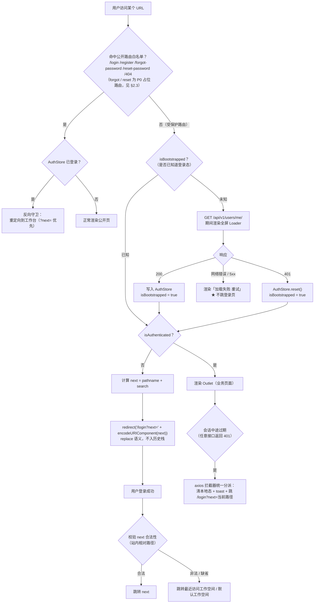
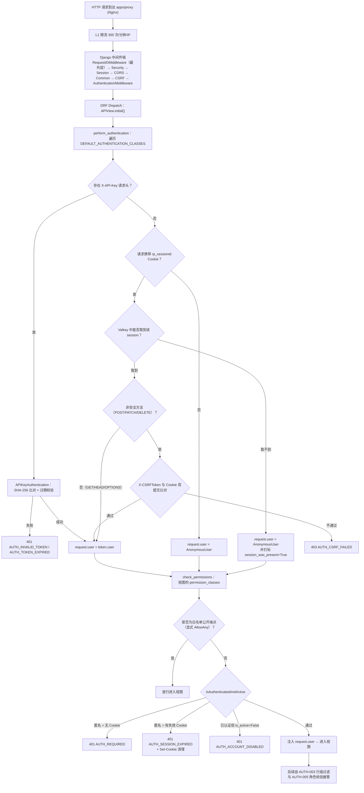
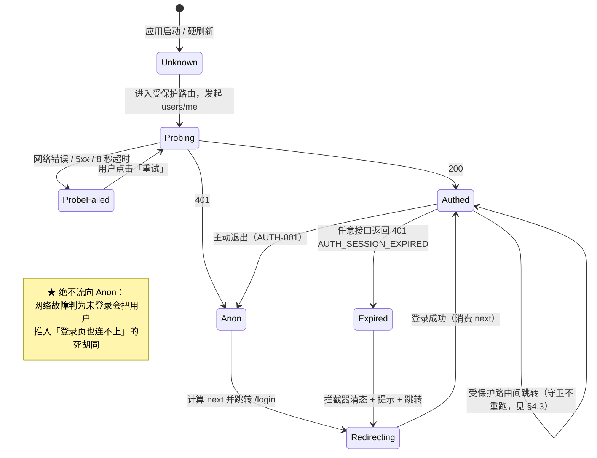

# 前端路由拦截 + 后端鉴权

| 元信息项 | 内容 |
| --- | --- |
| 文档编号 | AUTH-002 |
| 所属迭代 | Sprint 0：POC 技术验证（第 1-2 周） |
| 优先级 | P0（POC 阻塞级） |
| 所属模块 | M1-AUTH 账号与权限 |
| 文档状态 | 待评审（Draft） |
| 最后更新日期 | 2026-09-01 |
| 上游依据 | `docs/需求文档.md` §3.1 账号与权限、§四 权限体系 |
| 前置依赖 | `AUTH-001`（认证基础：Session、`AuthStore.isBootstrapped`、`users/me` 端点）、`INFRA-001`（`apps/web` 路由与 axios 实例位点） |
| 下游依赖 | `AUTH-003`（最小权限隔离）、`AUTH-005`（按钮级权限，P1）、以及全部需要登录态的页面与接口 |
| 架构基线 | [`api-conventions.md`](../architecture/api-conventions.md) §2.5 / §4.3 / §8.2 / §8.9 / §9.2 / §10.1 / §10.3、[`rbac-permission-model.md`](../architecture/rbac-permission-model.md) §1.1 / §1.2 / §5、[`tech-stack.md`](../architecture/tech-stack.md) §2 |
| 竞品参考 | Plane 开源版（前端布局级守卫 + DRF 全局 `IsAuthenticated`）、Ones（会话超时策略、强制下线、IP 白名单） |
| 工作量估算 | 后端 2 人日 / 前端 2 人日 / 联调与测试 1.5 人日，合计 **5.5 人日** |

> **范围声明**：本文档只解决「**有没有登录**」这一个判定（认证 / Authentication）。「**登录了能不能做**」（授权 / Authorization）中的按钮级权限属于 `AUTH-005`（P1），行级数据可见性属于 `AUTH-003`。三者是 `rbac-permission-model.md` §1.1 三重权限模型的第 0 层与第一、二、三层的分工，边界见 §1.4。
>
> **编号约定**：本文档内的 `BR-` / `EC-` / `UT-` / `IT-` / `E2E-` / `ST-` / `AC-` / `D` 编号自成体系，与 `AUTH-001` 的同名编号不构成同一序列，引用时须带文档号（如 `AUTH-002 IT-04`）。

---

## 1. 概述

### 1.1 功能定位

`AUTH-001` 交付了「如何获得登录态」，`AUTH-002` 交付「**没有登录态时会发生什么**」。它是一道横切所有页面与所有接口的闸门，本身不产出任何业务界面，但决定了系统的两个基本安全属性：

| 属性 | 含义 | 违反后果 |
| --- | --- | --- |
| **默认拒绝（Default Deny）** | 新增一个页面 / 新增一个接口，若不显式声明公开，则自动受保护 | 任何一次「忘记加守卫」的提交都会变成一个未授权访问入口 |
| **单一闸门（Single Choke Point）** | 前端只有一处判定登录态、后端只有一处配置默认权限类 | 判定逻辑分散在 N 个页面 / N 个视图里，N 处中任一处写错即漏洞，且无法审计 |

因此本文档的核心不是「写一个 `if (!user) redirect()`」，而是**把这个判定收敛成不可绕过的结构**：前端收敛到一个 layout route，后端收敛到 `DEFAULT_PERMISSION_CLASSES`，并各自配一条 CI 关卡防止回退（§4.7、§4.8）。

### 1.2 目标用户

| 用户 | 场景 | 关注点 |
| --- | --- | --- |
| 终端用户 | 会话过期后继续操作；从收藏夹 / 他人分享的链接直接打开深层页面 | 不出现白屏与「点了没反应」；重新登录后**回到原来想去的页面**，而不是被丢到首页 |
| 未登录访客 | 手工拼 URL 尝试访问工作台 | 被稳定拦截，且不从界面反馈中推断出「这个工作空间 / 项目是否存在」 |
| 开发者 | 新增页面与接口 | 无需记住「要加守卫」，默认即受保护；破坏默认时 CI 立即失败 |
| 安全评审方 | 私有化交付前的渗透测试 | 能拿到一份「全部公开端点」的完整清单，且该清单由机器生成而非人工维护 |

### 1.3 前置依赖说明

| 依赖文档 | 依赖内容 | 缺失后果 |
| --- | --- | --- |
| `AUTH-001` | `GET /api/v1/users/me/`（登录态探测端点）、Session Cookie 机制、`AuthStore.isBootstrapped` 标记、`/login` 与 `/register` 两个页面 | 无判定依据；缺 `isBootstrapped` 会导致已登录用户刷新时闪跳登录页（§2.5） |
| `INFRA-001` | `apps/web/app/routes.ts` 路由声明入口、`services/api.service.ts` 中的 axios 实例与拦截器位点、`apps/api` 的 `settings/common.py` | 无处落守卫代码 |
| `api-conventions.md` §8.9 | 前端错误码统一分派规则（`AUTH_*` → 清态跳登录） | 每个页面各写一遍 401 处理，行为不一致 |

### 1.4 与相邻文档的职责边界

这是本模块最容易被混淆的地方，明确列表如下（对应 `rbac-permission-model.md` §1.1 的分层）：

| 判定问题 | 归属 | 失败表现 | 交付迭代 |
| --- | --- | --- | --- |
| 请求有没有有效凭据 | **AUTH-002**（本文档，第 0 层） | `401` + `AUTH_REQUIRED` / `AUTH_SESSION_EXPIRED` | P0 |
| 这一行数据该用户能不能看见 | `AUTH-003`（第三层，DB 行级过滤） | `404` + `RESOURCE_NOT_FOUND` | P0 |
| 能看见但角色不够做这个操作 | `AUTH-005`（第二层，DRF Permission） | `403` + `PERM_DENIED` | P1 |
| 界面上要不要渲染这个按钮 | `AUTH-005`（第一层，`usePermission`） | 元素不渲染 | P1 |

**P0 的简化**：本迭代所有受保护端点的权限类就是默认的 `IsAuthenticatedAndActive`，不做角色等级判定（POC 阶段每个注册用户都是自己工作空间的 `WS_OWNER`，无角色差异可验证）。但 §4.5 的四层 Permission 继承链在 P0 就把基类建好，`AUTH-005` 只需往上叠子类，不改基础设施。

### 1.5 竞品参考结论（详见第 6 章）

- **Plane**：前端用布局级组件（`AuthenticationWrapper` / `UserAuthWrapper`）包裹全部工作台路由，未登录重定向登录页并携带 `next_path`；后端 DRF 全局默认 `IsAuthenticated`，公开端点显式放开。本系统与其结构一致。
- **Ones**：企业侧提供可配置会话超时、强制下线、活跃会话查看、IP 白名单等访问控制策略。
- **本系统 P0**：只做最小路由保护 + 接口鉴权；IP 白名单、会话超时配置化排 P3 实例配置（README §4 索引未为其单列编号文档）；强制下线 / 活跃会话查看为 P1/P2（`api-conventions.md` §9.2 已预留 `GET /api/v1/users/me/sessions/`，与 §6.2 口径一致）；错误码 `PERM_IP_NOT_ALLOWED` 已在 `api-conventions.md` §8.3 预登记。

---

## 2. 业务逻辑

### 2.1 前端路由拦截流程



**三个关键设计点**

1. **「未登录」与「还不知道是否登录」必须是两个状态**。Session 凭据在 HttpOnly Cookie 中，JS 读不到，所以前端启动时唯一的判定手段是发一次 `users/me`。在这次请求返回之前 `isAuthenticated` 为 `false`，若直接据此跳转，**已登录用户每次刷新都会闪一下登录页**。`isBootstrapped`（`AUTH-001` §4.4.1）就是为消除这个假阴性而存在。
2. **网络错误不等于未登录**。`users/me` 因断网 / 502 失败时若按未登录处理，用户会被无理由踢到登录页，且登录页同样连不上后端，形成死胡同。正确处理是渲染可重试的错误态，仅 `401` 才判定为未登录（BR-05）。
3. **中途过期不由路由守卫负责**。用户停留在工作台 20 分钟后 Session 过期，此时没有任何路由跳转，守卫不会重新执行；真正发现过期的是下一次 XHR 的 `401`。因此**路由守卫（进入时）与 axios 拦截器（停留时）是互补的两道机制**，缺任一道都存在空窗（§4.4）。

### 2.2 后端接口鉴权流程



**`AUTH_REQUIRED` 与 `AUTH_SESSION_EXPIRED` 的区分依据**：两者在 DRF 视角下都是 `AnonymousUser`，无法从 `request.user` 区分。判据是**请求是否携带了一个服务端已不认识的 Session Cookie**——携带即说明「曾经登录过、凭据已失效」，判为 `AUTH_SESSION_EXPIRED`；完全没有 Cookie 则判为 `AUTH_REQUIRED`（BR-08）。这个区分不是为了后端严谨，而是为了前端能给出不同文案：过期要提示「登录已过期，请重新登录」并保留回跳，从未登录则静默跳转即可（§3.3）。

### 2.3 公开路由与公开端点白名单

**唯一事实来源**：前端白名单由路由树结构表达（不在 `public.layout.tsx` 下的一律受保护），后端白名单由「显式声明 `AllowAny` 的视图」构成，并由 CI 脚本导出为清单（§4.7）。

| 类型 | 路径 | 说明 |
| --- | --- | --- |
| 前端公开页 | `/login` | 登录页（`AUTH-001`） |
| 前端公开页 | `/register` | 注册页（`AUTH-001`） |
| 前端公开页 | `/forgot-password`、`/reset-password` | P0 注册占位路由（挂入公开子树，仅重定向到 `/login`，见 §4.1），页面本体 P1 `AUTH-004` 交付 |
| 前端公开页 | `*`（404） | 兜底页（顶层 `*` 路由，G3 断言的顶层节点之一） |
| 非路由 | `/health` | 不进 `routes.ts`：容器与入口层健康探测归属 `INFRA-002` §2.3（`web` 探测 `/`、`proxy` 探测 `/healthz`、`api` 探测 `GET /api/v1/health/` §4.10），G3 断言不含此项 |
| 后端公开端点 | `POST /api/v1/auth/sign-up/` | 注册 |
| 后端公开端点 | `POST /api/v1/auth/sign-in/` | 登录 |
| 后端公开端点 | `POST /api/v1/auth/sign-out/` | 退出（**公开但幂等**，见下） |
| 后端公开端点 | `GET /api/v1/auth/csrf-token/` | 获取 CSRF token |
| 后端公开端点 | `GET /api/v1/health/`、`GET /api/v1/schema/`（仅非生产） | 探针与 OpenAPI schema（路径与 `INFRA-002` §2.3 健康检查表 / §4.10 端点设计 / 路由测试 RT-05、`INFRA-004` 维护模式白名单及 `api-conventions.md` §10.6 的登记一致） |
| **非公开** | `GET /api/v1/users/me/` | ★ 需认证。它是登录态探测端点，未登录时**必须**返回 401，不能返回 `{user: null}` |

> **端点路径口径**：全部沿用 `api-conventions.md` §2.5 已登记的 `sign-up` / `sign-in` / `sign-out` / `users/me` 命名，不存在 `register` / `login` / `logout` / `auth/me` 别名路由（`AUTH-001` 决策 D7）。需求措辞与规范路径的映射表见 `AUTH-001` §4.2。

**`sign-out` 为什么放在公开白名单**：`AUTH-001` §2.3 约定退出是幂等的——未登录时调用也返回 `204`。若它要求认证，则「Session 已过期的用户点退出」会收到 401，前端必须为「退出失败」写补偿分支。放开后语义变为「确保当前无会话」，永远成功。注意它**仍然校验 CSRF**，否则第三方站点可静默把用户登出（属于低危但真实的 CSRF 面）。

> **与 `AUTH-001` §2.3 时序图的口径差异**：该时序图把服务端一步标注为「IsAuthenticated 校验 + CSRF 校验」，是其**已登录主路径**的简写，与同节下方的幂等约定（未登录调用返回 204 而非 401）表述不一致。两文档统一以**幂等口径**为准：视图权限为 `AllowAny`、必须过 CSRF，认证结果只决定是否执行 session 删除动作，未登录亦返回 `204`（本文 §2.3 白名单、IT-04 即按此口径；`AUTH-001` 时序图该步注记待回改为「CSRF 校验 + 幂等 204」）。

**`/api/v1/instances/` 刻意不在白名单内**：`api-conventions.md` §2.5 把实例管理端点整组标注为「admin，需系统管理员」，因此它不能作为前端启动时的匿名 bootstrap 接口。P0 阶段注册功能恒定开放，前端无需在登录前读取实例配置；P3 引入「关闭注册 / 强制 SSO」等实例开关时，须**新增一个只返回开关位的公开端点**（如 `GET /api/v1/instances/public-config/`）并同步登记到 `api-conventions.md` §2.5，而不是把整个管理端点放开。

**`/api/v1/public/*` 分组不在本文档白名单内**：该分组（`api-conventions.md` §2）服务于 `apps/space` 对外公开视图，有自己的匿名访问规则与独立限流，P3 `BOARD-005`（Sprint 8，见 README §4 索引）交付时单独定义，P0 不注册任何路由。

### 2.4 登录回跳（next）规则

| 规则 | 内容 |
| --- | --- |
| 参数名 | `next`（与 `AUTH-001` §2.2 一致，不用 `redirect` / `next_path`） |
| 写入时机 | 守卫拦截时写入，值为 `pathname + search`（**不含 hash**，hash 不会发给服务端且可能含敏感锚点） |
| 编码 | `encodeURIComponent` 整体编码，避免嵌套 query 被截断 |
| 消费时机 | 登录 / 注册成功后读取一次即用即弃，不落 localStorage |
| **合法性校验** | 必须以单个 `/` 开头，且不以 `//` 或 `/\` 开头，且不含 `://`；否则整体丢弃走默认落地页 |
| 默认落地 | `AuthStore.lastWorkspaceSlug` → 用户第一个工作空间 → `/`（由 index 路由再分派） |

**为什么必须校验**：不校验的 `next` 是标准的**开放重定向（Open Redirect）**漏洞——攻击者投放 `https://本站/login?next=https://evil.com/login`，用户在真实域名下完成登录后被送到钓鱼页，且钓鱼页 referrer 来自本站，可信度极高。`//evil.com` 与 `/\evil.com` 会被浏览器当作协议相对 URL 解析，所以单纯判断「是否以 `/` 开头」不够（EC-05）。

### 2.5 守卫状态机



### 2.6 业务规则表

| 编号 | 规则 | 落地位置 | 违反表现 |
| --- | --- | --- | --- |
| BR-01 | 前端路由**默认受保护**；仅 `public.layout.tsx` 子树与 `*` 兜底路由公开 | `apps/web/app/routes.ts` 结构 | 新增页面遗漏守卫 |
| BR-02 | 后端接口**默认需认证**；公开端点必须在视图上显式声明 `AllowAny` | `DEFAULT_PERMISSION_CLASSES` | 新增接口裸奔 |
| BR-03 | 受保护路由判定前必须等 `isBootstrapped === true` | `auth.layout.tsx` | 已登录用户刷新时闪跳登录页 |
| BR-04 | 拦截跳转使用 `replace` 语义 | `<Navigate replace>` / `redirect()` | 浏览器「后退」在登录页与受保护页之间死循环 |
| BR-05 | 仅 `401` 判定为未登录；网络错误 / 5xx 渲染可重试错误态 | `fetchCurrentUser` 错误分支 | 断网时被踢出且无法自救 |
| BR-06 | `next` 必须通过站内相对路径校验（§2.4）才被采用 | `resolveNextPath()` 纯函数 | 开放重定向漏洞 |
| BR-07 | 已登录用户访问 `/login` / `/register` 反向重定向至工作台 | `public.layout.tsx` | 已登录用户可再次提交登录，产生重复 Session |
| BR-08 | 匿名请求区分 `AUTH_REQUIRED`（无 Cookie）与 `AUTH_SESSION_EXPIRED`（有失效 Cookie） | `IsAuthenticatedAndActive` | 前端无法给出差异化提示 |
| BR-09 | 未认证响应必须是 `401`，不得是 `403` | 自定义异常 + `WWW-Authenticate` 处理 | DRF 默认行为下 Session 认证的匿名请求返回 403（§4.5 陷阱） |
| BR-10 | `is_active=False` 的用户即使持有有效 Session 也一律拒绝 | `IsAuthenticatedAndActive` | 禁用账号仍可用旧会话操作 |
| BR-11 | 判定 `AUTH_SESSION_EXPIRED` 时响应必须携带清理失效 Cookie 的 `Set-Cookie` | 异常处理器 | 浏览器反复携带死 Cookie，每次都被判为过期而非未登录 |
| BR-12 | 401 响应体遵循统一错误 envelope，含 `code` / `message` / `request_id` | `custom_exception_handler` | 前端无法按 `code` 分派 |
| BR-13 | 前端拦截器对同一次会话过期只弹一次提示、只跳一次转 | 拦截器内单例 flag | 页面并发 5 个请求 → 5 个 toast + 5 次跳转 |
| BR-14 | WebSocket / SSE 连接（P2 `COLLAB-004`）复用同一 Session 校验，握手失败即断开 | live 服务鉴权中间件 | 页面已登出但实时通道仍在推数据 |

### 2.7 异常处理表

| 场景 | HTTP | 错误码 | 前端行为 | 用户可见文案 |
| --- | :-: | --- | --- | --- |
| 未登录访问受保护接口 | 401 | `AUTH_REQUIRED` | 清本地态 → 跳 `/login?next=` | 静默跳转，不弹 toast |
| Session 过期（曾登录） | 401 | `AUTH_SESSION_EXPIRED` | 清本地态 → toast → 跳 `/login?next=` | 「登录已过期，请重新登录」 |
| API Key 无效 / 过期 | 401 | `AUTH_INVALID_TOKEN` / `AUTH_TOKEN_EXPIRED` | 脚本场景，非浏览器 | —（返回给调用方） |
| 账号被禁用 | 401 | `AUTH_ACCOUNT_DISABLED` | 清本地态 → 跳登录页并展示阻断提示 | 「账号已被禁用，请联系管理员」 |
| CSRF token 缺失 / 不匹配 | 403 | `AUTH_CSRF_FAILED` | 重取 CSRF token 后**自动重试一次**；再失败才提示 | 首次静默；二次「操作已失效，请刷新页面」 |
| 已认证但角色不足 | 403 | `PERM_DENIED` | **不弹全局 toast**，由调用方渲染局部提示 | 「当前角色无权执行此操作」 |
| 资源在该用户视角不存在 | 404 | `RESOURCE_NOT_FOUND` | 渲染空态 / 404 页 | 「内容不存在或你没有访问权限」（`AUTH-003`） |
| 限流 | 429 | `RATE_LIMIT_EXCEEDED` | 读 `Retry-After` 退避 | 「请求过于频繁，请稍后再试」 |
| 探测接口网络失败 / 8 秒超时无响应 | — | — | 渲染可重试错误态 | 「加载失败，点击重试」 |

拦截器的分派规则严格照抄 `api-conventions.md` §8.9，不在业务代码里重复实现（BR-12、BR-13）。

### 2.8 边界条件

| 编号 | 边界 | 处理 |
| --- | --- | --- |
| EC-01 | 首屏并发多个受保护请求同时 401 | 拦截器用模块级 `isRedirecting` flag 去重，只跳一次；`next` 取 `window.location` 当前值 |
| EC-02 | 多标签页：A 标签退出，B 标签仍停留在工作台 | B 的下一次请求 401 → 自动跳登录；额外监听 `visibilitychange` 时 SWR 焦点重验证 `users/me` 加速发现 |
| EC-03 | 用户在登录页手动改 URL 加 `?next=/x`，但未登录成功即离开 | `next` 不持久化，离开即失效 |
| EC-04 | `next` 指向的页面在登录后仍无权访问（属他人工作空间） | 回跳成功但页面渲染 404 空态（`AUTH-003`），**不再二次跳转**，避免跳转链 |
| EC-05 | `next` 为 `//evil.com` / `/\evil.com` / `https://evil.com` / 超长（>2000 字符） | 一律丢弃，走默认落地页（BR-06） |
| EC-06 | `next` 为 `/login` 或 `/register` 自身 | 丢弃，避免登录成功后又回到登录页 |
| EC-07 | 浏览器禁用 Cookie | `users/me` 恒 401，登录后立即回到登录页；登录页检测到「刚提交成功却仍未认证」时提示「请允许浏览器存储 Cookie」 |
| EC-08 | 用户点击浏览器「后退」回到已失效的工作台快照 | 拦截跳转使用 `replace`（BR-04）；工作台数据由 SWR 重验证，401 后再次分派 |
| EC-09 | 深层 URL 直接打开（冷启动 + 未登录） | 全屏 Loader → 401 → 跳转，全程无内容闪现（受保护子树在判定完成前不渲染） |
| EC-10 | 时钟偏移导致 Cookie 过期判断不一致 | 有效期以服务端 Valkey 中的 session 记录为准，客户端不参与判定 |
| EC-11 | 静态资源与 API 混淆：`/api/v1/...` 返回 HTML 登录页 | 后端**绝不为 API 返回 302 到登录页**，一律返回 401 JSON（BR-09）；Nginx 的 SPA fallback 仅作用于非 `/api` 前缀 |
| EC-12 | OPTIONS 预检请求被鉴权拦截 | CORS 中间件位于鉴权之前，预检直接 200 返回，不进 DRF 权限链 |

---

## 3. UI/UX 设计

本文档不新增业务页面，只定义三种「过渡态」的呈现。它们出现频率极高（每次冷启动、每次会话过期），体验粗糙会被立刻感知。

### 3.1 首次登录态探测：全屏 Loader

| 项 | 规格 |
| --- | --- |
| 触发 | 进入受保护路由且 `isBootstrapped === false` |
| 布局 | 视口居中：Logo（32px，`opacity-90`）+ 下方 24px 处 `lucide-react` 的 `LoaderCircle`（`animate-spin`，`size=20`，`text-custom-primary-100`） |
| 背景 | `bg-custom-background-100`，与工作台同底色，避免白 → 深的闪烁 |
| 文案 | **默认无文案**；超过 800ms 才淡入「正在加载…」（`transition-opacity duration-200`） |
| 超时 | 超过 8 秒切换为错误态（§3.4）；实现为 layout 层 8 秒计时器，不中断在途请求（机制见 §4.2），由 E2E-15 覆盖 |
| 实现 | React Router v7 的 `HydrateFallback` + layout 级 `clientLoader`，保证子路由代码未执行前即可呈现 |

**为什么 800ms 后才显示文案**：局域网内探测通常 50~100ms 返回，立刻显示文字会造成一次「闪一下就消失」的视觉噪声，比没有文案更糟。骨架屏在此处也不适用——此时还不知道要渲染哪个页面，画一个假布局再被替换会产生二次跳动。

### 3.2 未登录拦截的重定向体验

| 场景 | 体验规格 |
| --- | --- |
| 从未登录（无 Cookie） | **静默跳转**，不弹任何提示。用户主动拼 URL 或点了过期书签，弹窗只是噪声 |
| 内容闪现 | 判定完成前受保护子树**完全不渲染**（守卫在 layout 层，子路由组件未挂载），杜绝「先看到工作台一帧再被踢走」的信息泄露与视觉跳动 |
| 登录页提示 | 若 URL 带合法 `next`，在登录表单标题下方以 12px 辅助文案提示「登录后将返回你原本访问的页面」，**不回显 next 的具体路径**（可能含项目名等信息，且在钓鱼场景下会被利用） |
| 历史栈 | `replace` 语义，用户按「后退」直接离开本站，不在 `/login` ↔ `/projects` 之间弹跳（BR-04） |

### 3.3 会话过期的友好提示与重登引导

```
┌──────────────────────────────────────────┐
│  ⓘ  登录已过期，请重新登录              │   ← toast，右上角，5s 自动消失
└──────────────────────────────────────────┘
                    ↓ 同时
             跳转 /login?next=<当前页>
             登录成功 → 回到原页面原位置
```

| 项 | 规格 |
| --- | --- |
| 提示形式 | Headless UI `Transition` + 自研 `Toast`，`role="status"`、`aria-live="polite"`；`info` 级（灰底信息色），不用 `error` 红色——会话过期是正常生命周期事件，不是用户犯错 |
| 去重 | 同一次过期只弹一次（BR-13） |
| 未保存内容 | P0 不做草稿保留；对已知的长表单（`TASK-001` 新建任务）在跳转前把表单值写入 `sessionStorage`，回跳后由页面自行恢复（P1 统一草稿机制，归属文档待登记——README §4 索引暂无对应编号文档，登记后回改此处引用） |
| 账号被禁用 | 分两个场景：**登录提交时被禁用**（`sign-in` 响应 401 `AUTH_ACCOUNT_DISABLED`）——不用 toast，登录页顶部渲染常驻 `Alert`（`error` 级，不可关闭）：「账号已被禁用，请联系管理员」，并禁用登录按钮直至用户修改邮箱输入；**会话中被禁用**（停留工作台时任意接口返回 401 `AUTH_ACCOUNT_DISABLED`）——由 §4.4 拦截器 `toast.error` 提示并跳登录页，落地后登录页同样渲染常驻 `Alert` 阻断再次提交（与 §4.4 拦截器实现对齐） |

### 3.4 探测失败与无权限的差异化空态

| 状态 | 图标 | 标题 | 说明 | 主操作 |
| --- | --- | --- | --- | --- |
| 探测失败（网络 / 5xx） | `WifiOff` | 加载失败 | 无法连接服务器，请检查网络后重试 | 「重试」按钮（重跑 `fetchCurrentUser`） |
| 404（无权或不存在） | `FileQuestion` | 内容不存在或你没有访问权限 | 请确认链接是否正确，或联系项目管理员邀请你加入 | 「返回工作台」 |
| 403（角色不足，P1） | `Lock` | 无权执行此操作 | 当前角色为「访客」，请联系管理员调整 | 「返回上一页」 |

三者文案必须不同：**把 404 写成「页面不存在」会误导真实存在但无权限的场景，把它写成「无权访问」又泄露了资源存在性**。因此统一采用「不存在**或**你没有访问权限」这一模糊表述——这与 `AUTH-003` 用 404 隐藏存在性的设计是同一决策的界面侧延续。

### 3.5 响应式与无障碍

| 项 | 规格 |
| --- | --- |
| 移动端 | 全屏 Loader 与空态均为单列居中，左右 24px 安全边距；toast 改为顶部贴边全宽（避免遮挡右下角操作区） |
| 焦点管理 | 跳转到 `/login` 后自动把焦点移到邮箱输入框（`autoFocus`），键盘用户无需重新 Tab 定位 |
| 屏幕阅读器 | 全屏 Loader 容器 `role="status"` + `aria-busy="true"` + `aria-label="正在验证登录状态"`；跳转后由登录页 `<h1>` 承接朗读 |
| `prefers-reduced-motion` | 关闭 spinner 旋转动画，改为静态文案「正在加载…」 |
| 键盘 | 空态的「重试」/「返回工作台」为原生 `<button>` / `<Link>`，可 Tab 聚焦、Enter 触发 |

---

## 4. 技术架构

### 4.1 路由分组：用结构表达权限

```ts
// apps/web/app/routes.ts —— React Router v7 Framework Mode（SPA：ssr: false）
import { type RouteConfig, index, layout, route } from "@react-router/dev/routes";

export default [
  // ── 公开子树：仅此处的路由允许匿名访问 ─────────────────────
  layout("layouts/public.layout.tsx", [
    route("login", "routes/login.tsx"),
    route("register", "routes/register.tsx"),
    // P0 占位路由（§2.3）：仅 redirect 到 /login，页面本体 P1 AUTH-004 交付
    route("forgot-password", "routes/auth-stub.tsx"),
    route("reset-password", "routes/auth-stub.tsx"),
  ]),

  // ── 受保护子树：新增页面放这里即自动受保护（BR-01）─────────
  layout("layouts/auth.layout.tsx", [
    index("routes/workspace-dispatch.tsx"),          // 分派到最近访问的工作空间
    route("profile", "routes/profile.tsx"),
    route(":workspaceSlug", "layouts/workspace.layout.tsx", [
      index("routes/workspace/home.tsx"),
      route("projects", "routes/workspace/projects.tsx"),
      route("projects/:projectId/issues", "routes/project/issues.tsx"),
      route("projects/:projectId/board", "routes/project/board.tsx"),
    ]),
  ]),

  route("*", "routes/not-found.tsx"),
] satisfies RouteConfig;
```

**为什么用 layout route 而不是 `<ProtectedRoute>` 包裹每个页面**：

| 方案 | 遗漏风险 | 判定次数 | 可审计性 |
| --- | --- | --- | --- |
| 每页包一层 HOC | 高——新增页面靠人记得包 | 每页各判一次 | 需逐页 review |
| **layout route（采用）** | 低——不放进受保护子树的页面根本进不了工作台导航 | 整棵子树判一次 | 读 `routes.ts` 一眼看清两个子树 |

配套 CI 关卡：脚本解析 `routes.ts` AST，断言除公开子树与 `*` 之外不存在顶层 `route()` 调用；违反即失败（§4.7）。

### 4.2 受保护布局：`auth.layout.tsx`

> **命名映射**：需求措辞中的 `ProtectedRoute` 组件在本方案中对应 `auth.layout.tsx` 这一个 layout route。不实现名为 `ProtectedRoute` 的独立包裹组件，因为 React Router v7 的 Framework Mode 已把「一组路由共享一个前置判定」建模为 layout route，再套一层同质组件只会多一个可被遗漏的环节（决策 D1）。

```tsx
// apps/web/app/layouts/auth.layout.tsx
import { Outlet, redirect, useRouteError } from "react-router";
import { observer } from "mobx-react-lite";
import type { Route } from "./+types/auth.layout";
import { getRootStore } from "~/core/store/root.store";
import { resolveNextPath } from "~/core/auth/next-path";
import { FullScreenLoader, ProbeFailedState } from "~/components/common";

/**
 * 守卫主入口：在受保护子树的任何组件渲染之前执行。
 * 采用 clientLoader 而非组件内 useEffect —— 后者要先挂载子组件、
 * 再在副作用里跳转，必然产生一帧受保护内容的闪现（EC-09）。
 */
export async function clientLoader({ request }: Route.ClientLoaderArgs) {
  const { auth } = getRootStore();

  if (!auth.isBootstrapped) {
    await auth.fetchCurrentUser();   // 200 写入 user；401 置 null；两种情况都置 isBootstrapped
  }

  if (!auth.isAuthenticated) {
    const url = new URL(request.url);
    const next = encodeURIComponent(url.pathname + url.search);   // 不含 hash
    throw redirect(`/login?next=${next}`);                        // throw redirect 天然 replace 语义
  }
  return null;
}

/** 探测期间的占位：由 React Router 在 loader resolve 前渲染 */
export function HydrateFallback() {
  return <FullScreenLoader label="正在验证登录状态" />;
}

/** 网络错误 / 5xx：渲染可重试错误态，绝不跳登录页（BR-05） */
export function ErrorBoundary() {
  return <ProbeFailedState error={useRouteError()} />;
}

/** 兜底守卫：应对 loader 未重跑的极端路径（见下方说明） */
export default observer(function AuthLayout() {
  const { auth } = getRootStore();
  if (!auth.isBootstrapped) return <FullScreenLoader label="正在验证登录状态" />;
  if (!auth.isAuthenticated) return null;   // 拦截器已在跳转中，此帧不渲染任何内容
  return <Outlet />;
});
```

**探测超时（8 秒）的实现位点（§3.1「超时」）**：超时不在 axios 层实现——实例级 `timeout` 会把 8 秒语义扩散到全部 API 请求；也不用 `Promise.race` 竞速——在途的 `fetchCurrentUser` 会悬挂为未决 Promise，与「重试」入口相互干扰。机制为 **layout 层计时器**：`auth.layout.tsx` 在探测发起时启动 8 秒 `setTimeout`（`HydrateFallback` 占位渲染期间持有，重试或导航离开时清除），到时若仍 `isBootstrapped === false` 则本层渲染 `ProbeFailedState`。计时器**不中断在途请求**：若 `users/me` 随后返回 200 / 401，store 置 `isBootstrapped = true`，守卫按正常流程继续、错误态自动让位；若最终网络错误，则与 `ErrorBoundary` 路径汇合、维持错误态。「重试」按钮清计时器并重跑 `fetchCurrentUser`。该路径由 E2E-15 覆盖。

**`clientLoader` + 组件双层守卫的必要性**：`clientLoader` 只在**导航进入**该 layout 时执行；在受保护子树内部页面间跳转（`/:slug/projects` → `/:slug/board`）时，layout 的 loader 不会重跑。因此「停留期间会话过期」这条路径不经过 loader，由 §4.4 的拦截器负责；而组件内的两个判断是最后一道兜底，保证任何时刻 `isAuthenticated === false` 都不会有业务内容被渲染出来。两层加起来才无空窗（§2.1 设计点 3）。

**公开布局的反向守卫**：

```tsx
// apps/web/app/layouts/public.layout.tsx
export async function clientLoader({ request }: Route.ClientLoaderArgs) {
  const { auth } = getRootStore();
  if (!auth.isBootstrapped) await auth.fetchCurrentUser();
  if (auth.isAuthenticated) {
    const next = resolveNextPath(new URL(request.url).searchParams.get("next"));
    throw redirect(next ?? auth.defaultLandingPath);   // BR-07
  }
  return null;
}
```

### 4.3 `next` 合法性校验（纯函数，可独立单测）

```ts
// apps/web/app/core/auth/next-path.ts
const FORBIDDEN_PREFIXES = ["//", "/\\", "/login", "/register"];

/** 返回可安全用于 navigate 的站内路径；不合法返回 null（BR-06 / EC-05 / EC-06）*/
export function resolveNextPath(raw: string | null): string | null {
  if (!raw) return null;
  let value: string;
  try {
    value = decodeURIComponent(raw);
  } catch {
    return null;                                    // 非法百分号编码
  }
  if (value.length > 2000) return null;
  if (!value.startsWith("/")) return null;          // 拒绝绝对 URL 与协议相对 URL
  if (value.includes("://") || /[\r\n]/.test(value)) return null;
  if (FORBIDDEN_PREFIXES.some((p) => value.startsWith(p))) return null;
  return value;
}
```

校验放在**消费侧**（登录成功时）而非写入侧：写入侧的值由本站代码生成天然可信，真正的攻击输入来自用户手工构造的 URL，只有消费侧能拦住。

### 4.4 axios 拦截器：停留期间的会话失效

```ts
// apps/web/app/services/api.service.ts
let isRedirecting = false;   // 模块级单例，实现 BR-13 去重

api.interceptors.response.use(
  (res) => res,
  async (error: AxiosError<TErrorEnvelope>) => {
    const status = error.response?.status;
    const code = error.response?.data?.error?.code;

    // CSRF 失效：重取 token 后自动重试一次（api-conventions.md §8.9）
    if (status === 403 && code === "AUTH_CSRF_FAILED" && !error.config?._retried) {
      await authService.fetchCsrfToken();
      return api.request({ ...error.config!, _retried: true });
    }

    if (status === 401) {
      const { auth } = getRootStore();
      if (!isRedirecting) {
        isRedirecting = true;
        auth.reset();                       // 清 AuthStore + SWR 全量缓存 + 领域 store
        if (code === "AUTH_SESSION_EXPIRED") toast.info("登录已过期，请重新登录");
        if (code === "AUTH_ACCOUNT_DISABLED") toast.error("账号已被禁用，请联系管理员");
        const here = window.location.pathname + window.location.search;
        router.navigate(`/login?next=${encodeURIComponent(here)}`, { replace: true });
      }
      return Promise.reject(error);          // 仍然 reject，让调用方停止后续逻辑
    }

    // PERM_* 不做全局提示，交由调用方渲染局部空态（api-conventions.md §8.9）
    return Promise.reject(error);
  },
);
```

`isRedirecting` 在跳转完成后由 `/login` 路由的 `clientLoader` 复位。这个 flag 是必要的：一个工作台页面首屏常并发 5~8 个请求，Session 过期时它们会几乎同时返回 401，无去重则产生 8 个 toast 与 8 次 `navigate`。

### 4.5 后端默认鉴权配置

```python
# apps/api/plane/settings/common.py
REST_FRAMEWORK = {
    "DEFAULT_AUTHENTICATION_CLASSES": [
        "plane.authentication.backends.SessionAuthenticationWithCSRF",   # 浏览器（AUTH-001 §4.3.3）
        "plane.authentication.backends.APIKeyAuthentication",            # 脚本 / CI（X-API-Key）
    ],
    # ★ 全站默认拒绝匿名（BR-02）。公开端点必须在视图上显式覆盖为 AllowAny。
    "DEFAULT_PERMISSION_CLASSES": [
        "plane.app.permissions.IsAuthenticatedAndActive",
    ],
    # 限流双闸（§5.2 IT-16 及其注）：匿名请求由 AnonRateThrottle 按 IP 计数，
    # 生效配额 100 次/分钟/IP（本文补充口径，api-conventions.md §7.2 待回补登记）。
    # ★ DRF initial() 默认顺序是 perform_authentication → check_permissions →
    # check_throttles：匿名请求被 IsAuthenticatedAndActive 以 401 拒绝时
    # check_throttles 不会执行，「匿名 401 计入 AnonRateThrottle 配额」在默认顺序下
    # 不成立，IT-16 无法通过。因此本项目的 BaseAPIView（api-conventions.md §10.1）
    # 覆写 initial() 调序：check_throttles 提前到 perform_authentication /
    # check_permissions 之前执行——限流判定先于权限判定，匿名打到内部端点被 401
    # 拒绝的响应同样计入该 IP 配额，IT-16「100 次触发 429」由此成立（超配额的
    # 请求先得到 429，匿名枚举在权限判定前即被截断）；已认证请求仅按
    # UserRateThrottle 的用户配额（§7.2：60 次/分钟）计数。两个 throttle 作用域
    # 互斥不叠加，匿名 401 不消耗已认证用户配额。
    "DEFAULT_THROTTLE_CLASSES": [
        "plane.utils.throttles.UserRateThrottle",
        "plane.utils.throttles.AnonRateThrottle",
    ],
    "EXCEPTION_HANDLER": "plane.utils.exception_handler.custom_exception_handler",
    "DEFAULT_PAGINATION_CLASS": "plane.utils.pagination.CursorPagination",
    "UNAUTHENTICATED_USER": "django.contrib.auth.models.AnonymousUser",
}
```

```python
# apps/api/plane/app/permissions/base.py
class IsAuthenticatedAndActive(BasePermission):
    """第 0 层：认证闸门。

    刻意 raise 而非 return False —— DRF 在权限失败时，仅当某个
    authenticator 提供了 authenticate_header() 才返回 401，否则返回 403。
    SessionAuthentication 不提供该头，因此默认行为下匿名请求会得到 403，
    与 api-conventions.md §4.3「401 仅用于未认证 / 403 仅用于已认证无权限」
    的约定相反，也会让前端拦截器无法按 401 分派。（BR-09）
    """

    def has_permission(self, request, view) -> bool:
        user = request.user
        if user is None or user.is_anonymous:
            # 携带了服务端已不认识的 session cookie ⇒ 判定为过期（BR-08）
            had_cookie = settings.SESSION_COOKIE_NAME in request.COOKIES
            raise NotAuthenticatedWithCode(
                code="AUTH_SESSION_EXPIRED" if had_cookie else "AUTH_REQUIRED",
                detail="登录已过期，请重新登录" if had_cookie else "请先登录",
                clear_session_cookie=had_cookie,          # BR-11
            )
        if not user.is_active or user.deleted_at is not None:
            raise NotAuthenticatedWithCode(
                code="AUTH_ACCOUNT_DISABLED", detail="账号已被禁用，请联系管理员",
            )
        return True
```

```python
# apps/api/plane/utils/exception_handler.py（片段，与 rbac-permission-model.md §5.5 同一处理器）
def custom_exception_handler(exc, context):
    if isinstance(exc, NotAuthenticatedWithCode):
        response = Response(
            {"status": "error", "error": {
                "code": exc.code, "message": exc.detail,
                "details": [], "request_id": get_request_id(context["request"]),
            }},
            status=status.HTTP_401_UNAUTHORIZED,
        )
        if exc.clear_session_cookie:
            response.delete_cookie(settings.SESSION_COOKIE_NAME)   # BR-11
        return response
    ...
```

```python
# apps/api/plane/urls.py（root URLconf）
# 未命任何 URLConf 条目的请求不经过 DRF（无视图、无 EXCEPTION_HANDLER），
# Django 默认返回 HTML 404 页。必须显式配置 handler404 把它收敛为统一
# JSON envelope（code = RESOURCE_NOT_FOUND），否则「API 永不返回 HTML」
# 的断言（EC-11 / IT-15 / ST-09 / AC-22）在未注册路径上不成立。
handler404 = "plane.utils.exception_handler.handler404"
```

**Permission 继承链（P0 只用第 0 层，其余在 P0 建好基类）**，类名与层级以 `api-conventions.md` §10.3 为准（`rbac-permission-model.md` §5.1/§5.2 另登记了 `WorkspacePermission` / `ProjectPermission` 一套类名，与 §10.3 并存不一致——本文不另起名，rbac 侧待回改统一到 §10.3 的三级类名）：

| 层 | 类 | 判定 | 失败 | 交付 |
| :-: | --- | --- | :-: | :-: |
| L0 | `IsAuthenticatedAndActive` | 有无有效凭据、账号是否可用 | 401 | **P0（本文档）** |
| L1 | `WorkspaceBasePermission` | 是否工作空间成员 + 角色等级 | 403 | P1 |
| L2 | `ProjectBasePermission` | 是否项目成员 + 角色等级 | 403 | P1 |
| L3 | `ProjectEntityPermission` | 对象级（是否本人创建等） | 403 | P1 |
| L4 | `FieldLevelPermission` | 字段级可写性 | 403 | P3 |

### 4.6 公开端点的声明方式

```python
# apps/api/plane/authentication/views.py
class SignInEndpoint(BaseAPIView):
    permission_classes = [AllowAny]        # ★ 显式放开，且必须出现在 §4.7 白名单清单中
    throttle_classes = [AuthEndpointThrottle]   # 放开认证不等于放开限流（10/min，AUTH-001 §4.3.5）
    ...


# 函数视图写法（仅用于 health / schema 这类无模型的简单端点）
# health 即 INFRA-002 §2.3 / §4.10 登记的 GET /api/v1/health/（真实实现内部检查
# DB 与 Redis 连接，此处示意省略）
@api_view(["GET"])
@permission_classes([AllowAny])
@authentication_classes([])                 # 明确不做认证，避免无谓的 session 查询
@throttle_classes([])                       # ★ 免限流（函数视图写法，等价于类视图的
                                            # throttle_classes: list = []），对齐 INFRA-002
                                            # §4.10「不限流」：DEFAULT_THROTTLE_CLASSES
                                            # 全局生效，不显式置空则匿名探测会被
                                            # AnonRateThrottle 计入 IP 配额
def health_check(request):
    return Response({"status": "success", "data": {"ok": True}})
```

**声明式白名单 + 显式常量双保险**：

```python
# apps/api/plane/app/permissions/public.py
PUBLIC_ENDPOINT_ALLOWLIST: frozenset[str] = frozenset({
    "auth-sign-up", "auth-sign-in", "auth-sign-out", "auth-csrf-token",
    "health-check",   # GET /api/v1/health/（与 INFRA-002 §2.3 / §4.10 / RT-05、INFRA-004 维护模式白名单同一路径）
    "api-schema",     # GET /api/v1/schema/（api-conventions.md §10.6 登记路径，仅非生产）
})
```

任何视图声明了 `AllowAny` 但其 URL name 不在该常量中，CI 即失败（§4.7）。这样「放开某个端点」变成一个**需要改动两个文件、且必然出现在 code review diff 中的动作**，而不是随手加一行装饰器。

### 4.7 CI 关卡（把「默认拒绝」变成不可回退的约束）

| 关卡 | 实现 | 拦截的问题 |
| --- | --- | --- |
| G1 后端端点鉴权全覆盖 | 测试遍历 `drf_spectacular` 生成的全部 operation，取其视图的 `permission_classes`：若含 `AllowAny` 而 URL name 不在 `PUBLIC_ENDPOINT_ALLOWLIST` 中 → 失败 | 新增接口误设 `AllowAny`、白名单与代码漂移 |
| G2 匿名冒烟 | 参数化测试：对全部非白名单端点发起匿名请求，断言状态码为 `401` 且 `code ∈ {AUTH_REQUIRED, AUTH_SESSION_EXPIRED}` | 视图私自覆盖 `permission_classes = []`；返回 403 而非 401 |
| G3 前端路由结构 | 脚本解析 `routes.ts` AST，断言顶层只存在 `public.layout` / `auth.layout` / `*` 三个节点；公开子树内仅允许 `login` / `register` 与 `AUTH-004` 的两个占位路由（§2.3） | 新页面挂到顶层绕过守卫；公开子树私增页面 |
| G4 拦截器唯一性 | ESLint 自定义规则：除 `api.service.ts` 外禁止出现 `status === 401` 字面量 | 各页面自行处理 401，行为不一致 |
| G5 开放重定向 | `resolveNextPath` 单测：恶意用例参数化取 ST-01 20 条 payload 的代表性子集（UT-06 / UT-07 / UT-08 共 9 条），20 条全集以 ST-01 为准 | `next` 校验被简化或删除 |

G1/G2 的价值在于**覆盖是自动枚举的**：即使某位开发者新增了一个从未被 review 到的端点，只要它注册进了 URLConf，就会被这两条关卡扫到。

### 4.8 中间件顺序（顺序错误即安全缺陷）

```python
MIDDLEWARE = [
    "plane.middleware.RequestIDMiddleware",                     # M1 最外层（即 §10.4 六件套的 ①，自外向内首个）
    "django.middleware.security.SecurityMiddleware",
    "whitenoise.middleware.WhiteNoiseMiddleware",
    "django.contrib.sessions.middleware.SessionMiddleware",      # M2 解析 session cookie
    "corsheaders.middleware.CorsMiddleware",                     # M3 必须在 Common 之前（EC-12）
    "django.middleware.common.CommonMiddleware",
    "django.middleware.csrf.CsrfViewMiddleware",                 # M4 依赖 M2
    "django.contrib.auth.middleware.AuthenticationMiddleware",   # M5 注入 request.user
    "plane.middleware.SensitiveLogFilterMiddleware",             # M6 日志脱敏（本文档 P0 自有）
]
```

| 约束 | 原因 |
| --- | --- |
| `RequestIDMiddleware` 必须是最外层（顺序 1，自外向内） | 对齐 `api-conventions.md` §10.4 配套中间件表；置于最外层使它包裹整条链路与异常处理，401 响应体也必须带 `request_id`（BR-12） |
| `SessionMiddleware` 必须在 `AuthenticationMiddleware` 之前 | 后者从 `request.session` 读 `_auth_user_id`，顺序颠倒则 `request.user` 恒为匿名 |
| `CorsMiddleware` 必须尽量靠前 | 否则 OPTIONS 预检会被 CSRF / 鉴权拦下，浏览器直接报 CORS 错误而非 401（EC-12） |

> **与 `api-conventions.md` §10.4 六件套的调和**：上文代码块的 M1~M6 是本文 MIDDLEWARE 链的本地标记；§10.4 登记的配套自定义中间件共六个，沿用 §10.4 原编号 ①~⑥（① `RequestIDMiddleware` → ② `StructuredLoggingMiddleware` → ③ `RateLimitHeaderMiddleware` → ④ `AuditContextMiddleware` → ⑤ `ResponseEnvelopeMiddleware` → ⑥ `MaintenanceModeMiddleware`，顺序敏感、自外向内）。P0 阶段本文档只落其中的 ① `RequestIDMiddleware`（即本地 M1，最外层，保证 `request_id` 覆盖包括 401 在内的全部响应）；其余五个由 `INFRA-004`（Sprint 1，P1）统一增补，届时连同 ① 收编为 `plane.base.middleware` 的六件套且 ① 仍居最外层。`SensitiveLogFilterMiddleware`（本地 M6）是本文档 P0 自有的日志脱敏件，不在 §10.4 清单内，收编时与 ② `StructuredLoggingMiddleware` 合并评估。

### 4.9 前端状态与数据获取的分工

| 关注点 | 归属 | 说明 |
| --- | --- | --- |
| `isBootstrapped` / `isAuthenticated` / `currentUser` | `AuthStore`（MobX） | `AUTH-001` §4.4.1 已定义，本文档只消费不扩展 |
| `GET /api/v1/users/me/` 的缓存与焦点重验证 | SWR，key `"/api/v1/users/me/"` | 多标签页场景下（EC-02）由焦点重验证加速发现失效 |
| 守卫判定 | React Router `clientLoader`（读 store，不自行请求） | 单一数据源，避免 loader 与 SWR 各发一次 `users/me` |
| `next` 解析 | 纯函数 `resolveNextPath`（无状态） | 便于单测覆盖恶意输入 |

**唯一新增到 `AuthStore` 的派生属性**：`defaultLandingPath`（`lastWorkspaceSlug` → 首个工作空间 → `/`），供反向守卫与 `next` 兜底共用，避免两处各写一遍落地页规则。

---

## 5. 测试用例

覆盖率门禁：`plane/app/permissions/`、`apps/web/app/core/auth/`、`apps/web/app/layouts/`（守卫 `clientLoader` 所在）与 `apps/web/app/services/api.service.ts`（401 拦截器所在）行覆盖 ≥ 90%。

### 5.1 单元测试

| 编号 | 用例 | 断言 |
| --- | --- | --- |
| UT-01 | `IsAuthenticatedAndActive` 对 `AnonymousUser` + 无 Cookie | 抛 `NotAuthenticatedWithCode`，`code == "AUTH_REQUIRED"` |
| UT-02 | 同上但请求携带 `rp_sessionid` Cookie | `code == "AUTH_SESSION_EXPIRED"`，`clear_session_cookie is True`（BR-08/BR-11） |
| UT-03 | `is_active=False` 的已认证用户 | `code == "AUTH_ACCOUNT_DISABLED"`（BR-10） |
| UT-04 | `deleted_at` 非空的已认证用户 | 同样拒绝（软删除用户不得复活会话） |
| UT-05 | `resolveNextPath("/projects?tab=all")` | 返回原值 |
| UT-06 | `resolveNextPath` 对 `//evil.com`、`/\evil.com`、`https://evil.com`、`javascript:alert(1)` 参数化 | 全部返回 `null`（EC-05） |
| UT-07 | `resolveNextPath("/login")` / `("/register")` | 返回 `null`（EC-06） |
| UT-08 | `resolveNextPath` 对 2001 字符长串、含 `\r\n` 的值、非法 `%E0%A4%A` 编码 | 全部返回 `null` |
| UT-09 | `resolveNextPath(null)` / `("")` | 返回 `null` |
| UT-10 | `AuthStore.defaultLandingPath` 在有 / 无 `lastWorkspaceSlug`、无任何工作空间三种情况 | 依次为 `/:last`、`/:first`、`/` |
| UT-11 | `fetchCurrentUser` 遇 401 | `currentUser = null`、`isBootstrapped = true`（BR-05） |
| UT-12 | `fetchCurrentUser` 遇 `ECONNABORTED` / 503 | `isBootstrapped` 保持 `false`，抛出供 `ErrorBoundary` 捕获 |
| UT-13 | `PUBLIC_ENDPOINT_ALLOWLIST` 中的每个 URL name 都能在 URLConf 中反解 | 白名单无死条目 |

### 5.2 集成测试（pytest + DRF `APIClient`）

| 编号 | 用例 | 断言 |
| --- | --- | --- |
| IT-01 | 匿名 `GET /api/v1/users/me/` | 401 + `AUTH_REQUIRED`；响应体为标准错误 envelope 且含 `request_id` |
| IT-02 | 匿名 `GET /api/v1/workspaces/` | 401 + `AUTH_REQUIRED`（不是 403，BR-09） |
| IT-03 | 匿名 `POST /api/v1/auth/sign-in/`（白名单） | 未被 `AUTH_REQUIRED` / `AUTH_SESSION_EXPIRED` 拦截，请求进入业务校验；凭据错误为 401 `AUTH_INVALID_CREDENTIALS` |
| IT-04 | 匿名 `POST /api/v1/auth/sign-out/` | 204（幂等，§2.3） |
| IT-05 | 匿名 `GET /api/v1/auth/csrf-token/` | 200 且 `Set-Cookie` 含 `csrftoken` |
| IT-06 | 登录后 `GET /api/v1/users/me/` | 200，`data.id` 与登录用户一致 |
| IT-07 | 手工删除 Valkey 中的 session 后带原 Cookie 请求 | 401 + `AUTH_SESSION_EXPIRED` + `Set-Cookie` 清理指令 |
| IT-08 | 登录后管理员置 `is_active=False`，再用原 Session 请求 | 401 + `AUTH_ACCOUNT_DISABLED`（无需等待过期） |
| IT-09 | 带正确 `X-API-Key` 的匿名请求（无 Cookie） | 200，`request.user` 为 token 所属用户 |
| IT-10 | 带过期 `X-API-Key` | 401 + `AUTH_TOKEN_EXPIRED` |
| IT-11 | 登录后 `POST` 但不带 `X-CSRFToken` | 403 + `AUTH_CSRF_FAILED` |
| IT-12 | `OPTIONS` 预检（跨域头齐备，无凭据） | 200，未进入权限链（EC-12） |
| IT-13 | **G1**：遍历全部 operation，校验 `AllowAny` ⊆ 白名单 | 无越界项 |
| IT-14 | **G2**：对全部非白名单端点参数化发起匿名请求 | 全部 401 且 `code ∈ {AUTH_REQUIRED, AUTH_SESSION_EXPIRED}` |
| IT-15 | 匿名请求 `/api/v1/anything/`（不存在的路由） | 404 JSON envelope，**不是** HTML，也不是 302（EC-11） |
| IT-16 | 匿名请求受保护端点 100 次 | 配额内为 401、超配额触发限流 429（限流判定先于权限判定，实现见 §4.5 注；匿名内部请求配额 100 次/分钟/IP，见下注），且全部响应不消耗已认证用户配额 |
| IT-17 | 401 响应头 | 含 `X-Request-Id`；不含 `WWW-Authenticate: Basic`（避免浏览器弹原生登录框） |
| IT-18 | 匿名 `POST /api/v1/auth/sign-up/`（白名单） | 未被 `AUTH_REQUIRED` / `AUTH_SESSION_EXPIRED` 拦截，请求进入业务校验：合法注册返回 201，重复邮箱返回 409（`AUTH-001` ST-01 同口径），均非 401 |
| IT-19 | 匿名 `GET /api/v1/health/` | 200 且为 success envelope（免认证且免限流，§4.6；不被 `DEFAULT_PERMISSION_CLASSES` / `DEFAULT_THROTTLE_CLASSES` 拦截） |
| IT-20 | 非生产 settings 下匿名 `GET /api/v1/schema/`（`api-schema` 白名单项，§2.3） | 200，未被认证闸门拦截（非 401）；另以静态断言校验生产 URLconf 不注册该路由，守住「仅非生产」口径（schema / 文档端点的其余行为归 `INFRA-004` 测试范围） |

> **匿名内部请求限流口径（IT-16）**：`api-conventions.md` §7.2 的 L2 配额表只定义了「已认证用户（内部 API）60 请求/分钟」与「匿名（public API）30 请求/分钟」，未覆盖**匿名打到内部端点**（含被 401 拒绝）的请求。本迭代按 §7.2 的 L2 应用限流分层补充采用：匿名内部请求按 IP 计数，配额 **100 请求/分钟/IP**（取值介于已认证内部 60/min 与 L1 边缘 300/min 之间），已由 §4.5 `DEFAULT_THROTTLE_CLASSES` 中的 `AnonRateThrottle` 实现，并依赖 §4.5 注所述的 `BaseAPIView.initial()` 调序（`check_throttles` 先于 `check_permissions`）——DRF 默认顺序下被 401 拒绝的匿名请求不会进到限流判定，调序后该配额才对「含被 401 拒绝」的匿名内部请求整体生效；该维度为本文声明值，§7.2 配额表待回补登记（架构文档待回改）。

### 5.3 E2E 测试（Playwright）

| 编号 | 用例 | 断言 |
| --- | --- | --- |
| E2E-01 | 未登录直接访问 `/:slug/projects` | 落地 `/login?next=%2F%3Aslug%2Fprojects`（`encodeURIComponent` 将 `:` 编码为 `%3A`）；期间无工作台内容出现（对首帧截图断言）。`AUTH-001` E2E-05 为同款断言，两文档断言一致（均为 `%2F%3Aslug%2Fprojects` 写法） |
| E2E-02 | 承接 E2E-01 完成登录 | 回到 `/:slug/projects`，项目列表可见 |
| E2E-03 | 未登录访问带查询串的深层 URL `/:slug/projects?tab=all` | `next` 完整保留查询串，回跳后 `tab=all` 生效 |
| E2E-04 | 手工访问 `/login?next=https://example.com` 并登录 | 落地本站工作台，**未离开本域**（BR-06） |
| E2E-05 | 已登录访问 `/login` | 自动重定向工作台（BR-07） |
| E2E-06 | 登录后退出，再访问 `/:slug/projects` | 跳转登录页；浏览器「后退」不回到工作台（BR-04 / EC-08） |
| E2E-07 | 登录后在 DevTools 中清除 Session Cookie，点击任意加载数据的操作 | 出现「登录已过期」toast（仅 1 个）并跳转登录页（BR-13） |
| E2E-08 | 已登录用户硬刷新工作台页 | 不出现 `/login` 的任何中间态（监听 `framenavigated` 断言）；Loader → 内容（BR-03） |
| E2E-09 | 拦截 `users/me` 返回 503 后访问工作台 | 渲染「加载失败·重试」，URL 仍为原路径；点「重试」放行后正常进入（BR-05） |
| E2E-10 | 两个标签页同时登录，在 A 退出后于 B 触发一次数据请求 | B 自动跳转登录页（EC-02） |
| E2E-11 | 无障碍：Loader 与两个空态跑 axe-core | 无 critical / serious 违规；Loader 有 `role="status"` |
| E2E-12 | 跳转登录页后焦点位置 | 焦点在邮箱输入框（§3.5） |
| E2E-13 | 禁用 Cookie 后登录 | 出现「请允许浏览器存储 Cookie」提示，不陷入无限跳转（EC-07） |
| E2E-14 | 慢网（`users/me` 延迟 1.2s） | 800ms 后出现「正在加载…」文案；无布局跳动（§3.1） |
| E2E-15 | 拦截 `users/me` 延迟 9s 不返回，访问工作台 | 8 秒计时器到时即渲染「加载失败·重试」错误态（§3.1 / §4.2），未跳登录页、URL 保持原路径；点「重试」并放行请求后正常进入工作台。与 E2E-09（503 立即失败）互补，覆盖超时无响应分支 |

### 5.4 安全与边界测试

| 编号 | 用例 | 断言 |
| --- | --- | --- |
| ST-01 | 开放重定向：`next` 取 20 条恶意 payload（含 `%2F%2Fevil.com`、`/\/\evil.com`、`\/evil.com`、双重编码） | 全部落地站内 |
| ST-02 | 伪造 Session Cookie（随机 32 字节 key） | 401 `AUTH_SESSION_EXPIRED`，不 500 |
| ST-03 | 篡改 Session Cookie 中的用户标识 | 无法冒充（session 数据在服务端，Cookie 仅含不可预测的 key） |
| ST-04 | 直接构造 `Authorization: Bearer <随便>` | 401，不被误认为已认证（P0 未启用 Bearer 认证类） |
| ST-05 | 首屏 8 个并发请求同时 401 | 仅 1 次跳转、1 个 toast（EC-01） |
| ST-06 | 401 响应体内容审查 | 无堆栈、无 SQL、无用户邮箱、无 session key |
| ST-07 | 匿名访问他人工作空间的深层 API（如 `/api/v1/workspaces/<真实 slug>/projects/`） | 401（认证优先于存在性判定，因此不构成 slug 枚举通道） |
| ST-08 | 越权与未认证的响应差异 | 未登录恒 401；已登录但无权恒 404（`AUTH-003`），二者不混用 |
| ST-09 | HTML 请求头（`Accept: text/html`）访问 `/api/v1/users/me/` | 仍返回 401 JSON，不返回登录页 HTML（EC-11） |
| ST-10 | 中间件顺序回归 | 移除 / 调换 `SessionMiddleware` 与 `AuthenticationMiddleware` 后 IT-06 失败（守卫测试自身可被验证） |

---

## 6. 竞品对标

### 6.1 Plane 的路由保护方案

| 维度 | Plane 的做法 | 本系统 | 差异说明 |
| --- | --- | --- | --- |
| 前端守卫位置 | 高阶包裹组件（`AuthenticationWrapper` / `UserAuthWrapper`）包住工作台布局 | layout route 的 `clientLoader` + 组件双层 | ✅ 结构一致（单一闸门）；⚠️ 改进：判定移到 loader，子组件在判定完成前不挂载，杜绝内容闪现（E2E-01） |
| 登录态探测 | 启动请求当前用户接口，未登录跳登录页 | `GET /api/v1/users/me/`，401 判未登录 | ✅ 一致 |
| 回跳参数 | `next_path` | `next` | ⚠️ 命名不同（与 `api-conventions.md` 的短参数风格一致），机制相同 |
| 回跳安全校验 | 以站内路径使用 | 显式 `resolveNextPath` 纯函数 + 20 条恶意用例 | ⚠️ 改进：把校验固化为可测单元并加 CI 关卡（G5） |
| 加载态 | 全屏 spinner | 同，且 800ms 后才出文案 + `prefers-reduced-motion` 降级 | ⚠️ 细化 |
| 后端默认权限 | DRF 全局 `IsAuthenticated`，公开端点显式放开 | `IsAuthenticatedAndActive`（额外校验 `is_active` / 软删除） | ✅ 一致；⚠️ 增强：禁用账号即时失效（IT-08） |
| 未认证响应 | 主要靠 HTTP 状态码 | 401 + `AUTH_REQUIRED` / `AUTH_SESSION_EXPIRED` 机器可读码 | ⚠️ 改进：前端可差异化处理（§3.3） |
| 白名单治理 | 分散在各视图的装饰器中 | 视图声明 + 集中常量 + CI 双向校验（G1/G2） | ⚠️ 改进：公开面可枚举、可审计 |

### 6.2 Ones 的会话管理与访问控制

| 能力 | Ones 的做法 | 本系统落点 |
| --- | --- | --- |
| 会话超时策略 | 管理员可配置超时时长、空闲登出 | P0 固定 14 天滑动（`AUTH-001` §2.4）；配置化排 P3 实例配置 |
| 强制下线 / 活跃会话查看 | 管理员可查看并终止会话 | P1/P2（`api-conventions.md` §9.2 已预留 `GET /users/me/sessions/`）；P0 已具备能力基础——session 存于服务端 Valkey，删除即生效 |
| 单设备登录 | 合规场景可限制并发会话 | P3 实例配置项 |
| IP 白名单 | 限制访问来源网段 | P3；错误码 `PERM_IP_NOT_ALLOWED`（403）已在 `api-conventions.md` §8.3 登记，实现时以中间件形式插在 L0 之前 |
| MFA / SSO 强制 | 可要求二次验证或强制走 IdP | P3 `AUTH-009`（README §4.10：SSO 单点登录）；`AUTH-001` §4.5 策略模式已预留 |
| 审计未授权访问 | 记录访问拒绝事件 | P3 `AUTH-010`（README §4.10：全站操作审计日志）；P0 仅结构化日志记录 401/403/404 的 `request_id` + 路径，不落库 |

**结论**：Ones 的能力集中在「会话策略的**可配置性**」与「访问来源的**网络层限制**」，二者都建立在「已有一道可靠闸门」之上。P0 的任务是把这道闸门做成不可绕过且可扩展的（`IsAuthenticatedAndActive` 是唯一入口，P3 的 IP 白名单只需在其前面插一层中间件，不改任何视图），而不是提前实现策略配置界面。

### 6.3 本系统的设计决策记录

| 编号 | 决策 | 理由 | 代价 |
| --- | --- | --- | --- |
| D1 | 守卫放在 **layout route 的 `clientLoader`**，而非每个页面的 HOC | ①默认拒绝：不进受保护子树的页面进不了工作台；②判定在渲染前完成，无内容闪现；③一处代码可审计 | 依赖 React Router v7 的 `clientLoader` 语义；子树内导航不重跑 loader，必须配 §4.4 拦截器补齐「停留期过期」 |
| D2 | 同时保留**组件内兜底判断** | loader 不覆盖「停留期失效」与命令式导航的极端路径；两层加起来才无空窗 | 逻辑出现在两处，需注释说明分工（已在 §4.2 标注） |
| D3 | 未认证一律 **401 而非 403**，且刻意 `raise` 而非 `return False` | DRF 默认行为在 Session 认证下会给出 403，与 `api-conventions.md` §4.3 冲突并使前端无法分派 | 需自定义异常类与异常处理器分支（约 30 行） |
| D4 | 区分 `AUTH_REQUIRED` 与 `AUTH_SESSION_EXPIRED`（依据是否携带失效 Cookie） | 让「静默跳转」与「提示后跳转」两种体验有可靠判据（§3.2 / §3.3） | 判据是启发式的：用户手工删除 Cookie 后会被判为 `AUTH_REQUIRED`，体验退化为静默跳转，可接受 |
| D5 | `sign-out` 放入公开白名单但仍校验 CSRF | 保证退出幂等（`AUTH-001` §2.3），同时阻断第三方站点静默登出 | 白名单多一项，需在 §2.3 说明理由以防被误判为疏漏 |
| D6 | 网络错误**绝不**判为未登录 | 避免把用户推入「登录页也连不上」的死胡同 | 需要一个额外的探测失败空态与重试入口（§3.4） |
| D7 | `next` 校验放在**消费侧**并固化为纯函数 + CI 关卡 | 攻击输入只来自 URL，只有消费侧能拦；纯函数便于用 20 条 payload 覆盖 | 需维护一份恶意用例集（ST-01） |
| D8 | 公开端点白名单**双写**（视图声明 + 集中常量），由 CI 双向校验 | 使「放开一个端点」成为必然出现在 diff 中、需评审的动作；同时得到一份机器生成的公开面清单 | 新增公开端点需改两个文件；靠 G1 保证二者不漂移 |
| D9 | P0 不实现按钮级 / 角色级权限，但**建好四层 Permission 基类** | POC 阶段无角色差异可验证；提前实现会写出无法验证的代码 | `AUTH-005` 需补齐 L1~L3 子类；基类若设计失当会造成 P1 返工，故已与 `api-conventions.md` §10.3 的类层级逐层对齐（`rbac-permission-model.md` §5 的判定语义一致，但其 §5.1/§5.2 登记的类名为 `WorkspacePermission` / `ProjectPermission`，与 §10.3 并存两套——本文以 §10.3 为准，rbac 待回改统一） |

### 6.4 设计模式应用

| 模式 | 应用位置 | 解决的问题 |
| --- | --- | --- |
| **拦截过滤器（Intercepting Filter）** | Django 中间件链 + DRF `initial()` 认证/权限钩子（§4.5、§4.8） | 横切关注点不侵入业务视图；顺序可声明式调整 |
| **责任链（Chain of Responsibility）** | `DEFAULT_AUTHENTICATION_CLASSES` 依次尝试 Session → API Key | 新增认证方式（P4 OAuth Bearer）只需往链上追加一个类 |
| **模板方法（Template Method）** | `BaseAPIView` / `BaseViewSet` 统一响应包装与权限入口（`api-conventions.md` §10.1） | 视图无需各自处理 envelope 与鉴权 |
| **策略模式（Strategy）** | `permission_classes` 按视图替换判定策略；四层 Permission 继承链 | 同一套框架承载 L0~L4 五种粒度 |
| **装饰器（Decorator）** | `@permission_classes([AllowAny])`、`@require_permission(...)` | 函数视图与动作级校验的轻量表达 |
| **空对象（Null Object）** | `AnonymousUser` 作为 `UNAUTHENTICATED_USER` | 视图与权限类无需到处判 `None` |
| **前端控制器（Front Controller）** | 单一 axios 实例 + 单一响应拦截器（§4.4，由 G4 强制） | 401 / 403 / 429 的处理只有一处实现 |

---

## 7. 验收标准

### 7.1 功能验收

| 编号 | 验收项 | 验证方式 | 通过标准 |
| --- | --- | --- | --- |
| AC-01 | **退出后直接输入项目 URL 被拦截跳转登录页** | E2E-06 | 地址栏输入 `/:slug/projects/:id/board` 后落地 `/login?next=...`；全程未出现任何项目数据；浏览器后退不回到工作台 |
| AC-02 | 未登录访问受保护路由携带回跳参数 | E2E-01 / E2E-03 | URL 为 `/login?next=<encodeURIComponent(pathname+search)>`，查询串完整保留 |
| AC-03 | 登录成功后回到原目标 | E2E-02 / E2E-03 | 落地页与拦截前的 URL 完全一致（含查询串） |
| AC-04 | 已登录用户刷新受保护页不闪跳登录页 | E2E-08 | 导航监听中不出现 `/login`；仅 Loader → 内容两帧 |
| AC-05 | 已登录访问 `/login` 被反向重定向 | E2E-05 | 落地工作台，`/login` 不出现在历史栈中 |
| AC-06 | 会话中途失效有提示且可续 | E2E-07 | 恰好 1 个「登录已过期」toast + 1 次跳转，重新登录后回到原页面 |
| AC-07 | 探测失败可自救 | E2E-09 / E2E-15 | 渲染「加载失败·重试」，URL 未变；恢复网络（或放行请求）后点重试可进入；503 与 8 秒超时两条失败分支均覆盖 |
| AC-08 | 未认证 API 请求返回 401 | IT-01 / IT-02 / IT-14 | 全部非白名单端点匿名请求均为 401，错误码为 `AUTH_REQUIRED` / `AUTH_SESSION_EXPIRED` |
| AC-09 | Session 过期的 API 请求返回 401 并清理 Cookie | IT-07 | `AUTH_SESSION_EXPIRED` + 响应含清理 `rp_sessionid` 的 `Set-Cookie` |
| AC-10 | 账号被禁用后旧会话立即失效 | IT-08 | 401 `AUTH_ACCOUNT_DISABLED`，无需等待过期 |
| AC-11 | 公开端点可匿名访问 | IT-03 ~ IT-05、IT-18 ~ IT-20 | 四个认证端点（`sign-in` / `sign-out` / `csrf-token` / `sign-up`，IT-18）与健康检查（IT-19）均未被认证闸门拦截（IT-03 口径：非 `AUTH_REQUIRED` / `AUTH_SESSION_EXPIRED`，凭据错误为 401 `AUTH_INVALID_CREDENTIALS`）；OpenAPI `schema` 在非生产 settings 下匿名 200（IT-20）；白名单外的端点（含 `/api/v1/instances/`）匿名访问一律 401 |

### 7.2 契约与规范验收

| 编号 | 验收项 | 通过标准 |
| --- | --- | --- |
| AC-12 | 未认证一律 401、无权限一律 403、不可见一律 404，三者不混用 | IT-02 + ST-08 通过；全站无「未认证返回 403」的响应（G2 覆盖全部端点） |
| AC-13 | 错误码全部出自 `api-conventions.md` §8.2 / §8.3 / §8.5 / §8.7 | 无自造码（§2.7 除 `AUTH_*` / `PERM_*` 外另用 §8.5 `RESOURCE_NOT_FOUND` 与 §8.7 `RATE_LIMIT_EXCEEDED`）；前后端错误码枚举一致性脚本通过 |
| AC-14 | 401 响应体为标准错误 envelope 且含 `request_id` | IT-01 抓取核对；响应头含 `X-Request-Id`，不含 `WWW-Authenticate: Basic`（IT-17） |
| AC-15 | 公开端点清单与代码一致 | G1（IT-13）通过；清单可由 `pnpm audit:public-endpoints` 一键导出并归档到评审记录 |
| AC-16 | API 路径与 `api-conventions.md` §2.5 一致 | 认证类端点仅 `sign-up` / `sign-in` / `sign-out` / `csrf-token` 四个，无 `login` / `logout` / `auth/me` 别名路由；`health-check` / `api-schema` 为非认证类公开端点（§2.3 / §4.6），不属本项口径 |
| AC-17 | `GET /api/v1/users/me/` 未登录时返回 401（而非 `{user:null}`） | IT-01 |

### 7.3 安全验收

| 编号 | 验收项 | 通过标准 |
| --- | --- | --- |
| AC-18 | 无开放重定向 | ST-01（20 条 payload）+ UT-06 ~ UT-08 全绿；E2E-04 未离开本域 |
| AC-19 | 判定完成前不渲染任何受保护内容 | E2E-01 首帧截图中无工作台元素；DOM 快照中无业务数据 |
| AC-20 | 伪造 / 篡改凭据无法通过 | ST-02 ~ ST-04 通过，且均不产生 5xx |
| AC-21 | 401/403 响应不泄露敏感信息 | ST-06 通过（无堆栈、无 SQL、无邮箱、无 session key） |
| AC-22 | API 请求不会被重定向到 HTML 登录页 | ST-09 + IT-15 通过 |
| AC-23 | 默认拒绝不可回退 | 人为把某端点的 `permission_classes` 置空 / 把新页面挂到顶层路由，G1~G4 中至少一条失败（在 CI 中以「预期失败」用例形式验证关卡自身有效） |

### 7.4 质量门禁

| 编号 | 验收项 | 通过标准 |
| --- | --- | --- |
| AC-24 | 测试覆盖率 | `plane/app/permissions/`、`apps/web/app/core/auth/`、`apps/web/app/layouts/` 与 `apps/web/app/services/api.service.ts` 行覆盖 ≥ 90%；第 5 章全部用例通过 |
| AC-25 | 静态检查 | `ruff` + `mypy`（`disallow_untyped_defs`）无告警；`oxlint` 无告警（含 G4 自定义规则）；前端零隐式 `any` |
| AC-26 | 性能 | 鉴权链额外开销 P95 ≤ 8ms（Session 命中 Valkey）；受保护路由首屏探测 P95 ≤ 150ms；整个受保护子树只发**一次** `users/me` |
| AC-27 | 无障碍 | E2E-11 通过（axe-core 无 critical / serious）；E2E-12 焦点落位正确 |
| AC-28 | 可演示 | `docker compose up` 后可完整演示：未登录访问深层 URL 被拦截 → 登录回跳 → 退出 → 再次被拦截，无需任何手工配置 |

---

## 附录 A：与架构文档的一致性对照

| 架构约束 | 出处 | 本文档落点 |
| --- | --- | --- |
| 三重权限模型分层与各层失败表现（401 / 403 / 404） | `rbac-permission-model.md` §1.1、`api-conventions.md` §4.3 | §1.4 边界表、§2.7、AC-12 |
| 前端权限判定不可信，服务端必须独立校验 | `rbac-permission-model.md` §1.2 | §4.5（后端不依赖任何前端传入的登录态）、G2 |
| Permission 四层继承链（L0~L4，类名以 §10.3 为准；`rbac` §5.1/§5.2 的 `WorkspacePermission` / `ProjectPermission` 旧名待回改统一） | `api-conventions.md` §10.3、`rbac-permission-model.md` §5 | §4.5 分层表（P0 只落 L0） |
| 认证端点清单与 `users/me` 路径 | `api-conventions.md` §2.5 | §2.3 白名单、AC-16 |
| `AUTH_*` 错误码全表 | `api-conventions.md` §8.2 | §2.7、AC-13 |
| `PERM_*` 与 `RESOURCE_NOT_FOUND` 的分工 | `api-conventions.md` §8.3 / §8.5 | §2.7、§3.4、ST-08 |
| axios 拦截器统一分派（`AUTH_*` 跳登录 / CSRF 重试一次 / `PERM_*` 不弹全局 toast） | `api-conventions.md` §8.9 | §4.4、BR-12、BR-13 |
| Session 认证细节（Cookie 名、CSRF 双提交、cache 后端） | `api-conventions.md` §9.2、`AUTH-001` §4.3.3 | §2.2、§4.5、IT-11 |
| API Key 认证（`X-API-Key`） | `api-conventions.md` §9.3 | §2.2 流程图、IT-09 / IT-10 |
| 统一异常处理器与错误 envelope | `rbac-permission-model.md` §5.5、`api-conventions.md` §4.2 | §4.5 处理器片段、AC-14 |
| 限流分层（L1 Nginx / L2 DRF / 认证端点 10/min / 匿名内部 100/min 为本文补充口径；另经 `BaseAPIView.initial()` 调序实现「限流判定先于权限判定」，使被 401 拒绝的匿名请求也计入 IP 配额，否则 DRF 默认顺序下 IT-16 不成立） | `api-conventions.md` §7.2 | §2.2 流程图、§4.5、§4.6、IT-16 及其注 |
| React Router v7 Framework Mode（SPA）+ MobX + SWR 分工 | `tech-stack.md` §2 / §2.1 | §4.1、§4.9 |
| `AuthStore.isBootstrapped` 与 `fetchCurrentUser` 语义 | `AUTH-001` §4.4.1 | §2.1、§4.2、BR-03 |

## 附录 B：交付物清单

| 层 | 交付物 |
| --- | --- |
| 后端 | `plane/app/permissions/base.py`（`IsAuthenticatedAndActive` + L1~L3 基类骨架）、`permissions/public.py`（`PUBLIC_ENDPOINT_ALLOWLIST`）、`plane/utils/exceptions.py`（`NotAuthenticatedWithCode`）、`plane/utils/exception_handler.py` 的 401 分支、root URLconf `plane/urls.py` 的 `handler404`（未注册路由返回 404 JSON envelope，IT-15）、`settings/common.py` 的 `REST_FRAMEWORK` 与 `MIDDLEWARE` |
| 前端 | `apps/web/app/routes.ts`（两个子树）、`layouts/auth.layout.tsx`、`layouts/public.layout.tsx`、`routes/auth-stub.tsx`（`AUTH-004` 占位路由重定向，§2.3）、`core/auth/next-path.ts`、`components/common/full-screen-loader.tsx`、`probe-failed-state.tsx`、`not-found-state.tsx`、`services/api.service.ts` 的 401/CSRF 拦截器 |
| 测试 | `tests/permissions/`（UT-01~13、IT-01~20、ST-01~10）、`e2e/route-guard.spec.ts`（E2E-01~15） |
| CI | `scripts/audit-public-endpoints.py`（G1 清单导出）、`scripts/check-route-tree.ts`（G3）、`eslint-rules/no-inline-401-handling.js`（G4） |
| 文档 | 公开端点清单（机器生成，随每次发布归档）；OpenAPI 中各端点的 401 响应示例 |
