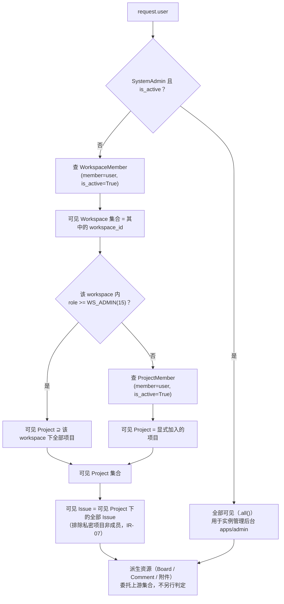
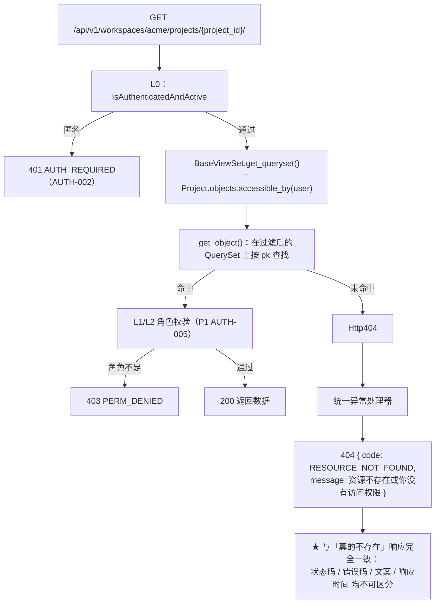

# 最小权限隔离

| 元信息项 | 内容 |
| --- | --- |
| 文档编号 | AUTH-003 |
| 所属迭代 | Sprint 0：POC 技术验证（第 1-2 周） |
| 优先级 | P0（POC 阻塞级） |
| 所属模块 | M1-AUTH 账号与权限 |
| 文档状态 | 待评审（Draft） |
| 最后更新日期 | 2026-09-01 |
| 上游依据 | `docs/需求文档.md` §3.1 账号与权限、§四 权限体系 |
| 前置依赖 | `AUTH-001`（认证基础，提供 `request.user`）、`AUTH-002`（接口鉴权，保证 `request.user` 非匿名）、`INFRA-003`（`BaseModel` / `Workspace` / `Project` / `Issue` / `WorkspaceMember` / `ProjectMember` / `SystemAdmin` 建表） |
| 下游依赖 | `TEAM-001`、`PROJ-001`、`TASK-001`、`BOARD-001`（四者的 ViewSet 必须继承本文档的 `BaseViewSet`）、`AUTH-005`（P1 角色级权限）、`AUTH-006`（P2 行级隔离完整版） |
| 架构基线 | [`rbac-permission-model.md`](../architecture/rbac-permission-model.md) §1.1 / §3 / §5.5 / §6 / §9 / §10.5 / 附录 B、[`api-conventions.md`](../architecture/api-conventions.md) §4.3 / §8.3 / §8.5 / §10.1 / §10.4、[`unified-issue-model.md`](../architecture/unified-issue-model.md) §2.3 / §2.4 |
| 竞品参考 | Plane 开源版（Workspace Member 仅见自身 workspace；Owner/Admin 绕过项目成员检查）、Ones（Project 与 Wiki 共享权限模型、字段级权限） |

> **范围声明**：本文档交付**第三层（DB 行级过滤）的最小版本**——「用户只能看到自己参与的工作空间 / 项目 / 任务」。它**不包含**：角色等级差异化的可见性（P1 `AUTH-005`）、私密项目与字段级可见性（P2 `AUTH-006` / P3 `TASK-012`）、部门维度的数据域（P3 `AUTH-007`）。但 §4 的 Manager 与 ViewSet 骨架**必须一次做对**，因为后续所有隔离规则都是在此骨架上加条件，而不是换一套实现（`rbac-permission-model.md` §9 的 P0 扩展位要求）。
>
> **编号约定**：本文档内的 `IR-` / `BR-` / `EC-` / `UT-` / `IT-` / `E2E-` / `ST-` / `AC-` / `D` 编号自成体系，引用时须带文档号（如 `AUTH-003 IT-05`）。

---

## 1. 概述

### 1.1 功能定位

`AUTH-002` 保证了「**匿名请求进不来**」，`AUTH-003` 保证「**进来的人只看到属于他的那些行**」。二者的区别是本模块最容易被低估的地方：

```
AUTH-002 缺失 → 陌生人能访问系统            （被立刻发现的显性缺陷）
AUTH-003 缺失 → 每个登录用户都能看到全库数据  （功能"正常"，直到某天被发现的数据泄漏）
```

多租户系统最典型的数据泄漏形态不是「被攻破」，而是**某个 ViewSet 的 `get_queryset()` 写了 `Model.objects.all()`**。它不会报错、不会告警、测试也照样通过（单账号测试永远发现不了跨账号泄漏）。因此本文档的核心交付不是几条过滤条件，而是一套**让「忘记过滤」在开发期就崩溃的机制**：

| 机制 | 落点 | 作用 |
| --- | --- | --- |
| 统一收口 | 每个受管模型只有一个 `objects.accessible_by(user)` | 过滤逻辑不散落在视图里，改规则只改一处 |
| 强制注入 | `BaseViewSet.get_queryset()` 默认即调用 `accessible_by` | 子类**什么都不写**就是安全的；越权访问天然表现为 404 |
| 开发期崩溃 | 缺 `model` 声明或 Manager 无 `accessible_by` 时抛 `ImproperlyConfigured` | 「忘了」变成启动即失败，而不是上线后泄漏 |
| CI 静态检查 | 扫描 `get_queryset` 中的 `objects.all()` / 裸 `objects.filter(` | 阻止绕过基类的写法进入主干 |
| 跨账号测试 | 每个受管资源必须有「用户 B 看不到用户 A 的数据」用例 | 把不可见性变成可回归的断言 |

### 1.2 目标用户

| 用户 | 场景 | 关注点 |
| --- | --- | --- |
| 终端用户 | 同一实例上有其他团队 / 其他个人用户 | 自己的项目与任务不被他人看到；自己的列表里不混入他人数据 |
| POC 演示者 | 用两个账号演示隔离效果 | 切换账号后数据面完全不同，可当场证明隔离生效 |
| 开发者 | 新增一个受权限管控的模型（P1 起会频繁发生） | 有一份 7 步落地清单可照做（`rbac-permission-model.md` 附录 B），不需要自行判断该怎么过滤 |
| 安全评审方 | 私有化交付前评审 | 能确认「不存在任何绕过行级过滤的查询入口」，且该结论由 CI 关卡而非人工 review 保证 |

### 1.3 前置依赖说明

| 依赖文档 | 依赖内容 | 缺失后果 |
| --- | --- | --- |
| `AUTH-001` | 已登录用户与 `request.user`；注册即创建 `WorkspaceMember(role=WS_OWNER)` | 无判定主体；无成员关系则任何人看不到任何数据 |
| `AUTH-002` | 接口鉴权保证进入视图的 `request.user` 一定非匿名 | 行级过滤对 `AnonymousUser` 返回 `none()`，虽安全但会把「未登录」表现为「空列表」，掩盖真实原因 |
| `INFRA-003` | `WorkspaceMember`（`unique_together (workspace, member)`、`role` 为 `IntegerField`、`is_active`）、`ProjectMember`（**含冗余 `workspace_id`**）、`SystemAdmin` 独立表、`Issue.workspace_id` 反范式字段、以及 `rbac-permission-model.md` §3.2 要求的三个复合索引 | 缺 `role` 整数字段 → P1 需破坏性迁移；缺反范式 `workspace_id` → 每次过滤多一次 JOIN；缺索引 → 列表接口全表扫描 |
| `unified-issue-model.md` §2.3/§2.4 | `Workspace.slug` 全局唯一、`Project.identifier` 工作空间内唯一、软删除 `deleted_at` 语义 | URL 定位与可见性判定的基础 |

### 1.4 与相邻文档的边界

| 判定 | 归属 | 失败表现 | 迭代 |
| --- | --- | --- | --- |
| 有没有登录 | `AUTH-002`（L0） | 401 | P0 |
| **这一行能不能被看见** | **AUTH-003（L3，本文档）** | **404 `RESOURCE_NOT_FOUND`** | **P0** |
| 看得见但角色不够改 | `AUTH-005`（L1/L2） | 403 `PERM_DENIED` | P1 |
| 私密项目 / 字段级可见性 | `AUTH-006`（P2）/ `TASK-012`（P3） | 404 / 字段被裁剪 | P2+ |
| 部门数据域、自定义角色组 | `AUTH-007` / `AUTH-008` | 404 / 403 | P3 |

### 1.5 竞品参考结论（详见第 6 章）

- **Plane**：Workspace Member 只能看到自己所属的 workspace；工作空间 Owner/Admin 可绕过项目成员检查看到全部项目；越权访问表现为资源不存在。本系统 P0 与之完全对齐。
- **Ones**：Project 与 Wiki 共享同一套权限模型（同一份成员与角色定义驱动两类资源的可见性），并提供字段级权限。
- **本系统 P0**：只做「成员可见」这一条规则的三级传递（Workspace → Project → Issue），把 Manager 与 ViewSet 骨架做实；私密项目、字段级、部门域后置到 P2/P3，届时只在 `_scoped_for()` 中追加条件。

---

## 2. 业务逻辑

### 2.1 隔离规则总表

`accessible_by(user)` 的语义按「资源类型 × 用户身份」定义。P0 只有三张受管资源表，规则如下（**IR = Isolation Rule**）：

| 编号 | 资源 | 可见条件 | 不可见时 | P0 是否实现 |
| --- | --- | --- | :-: | :-: |
| IR-01 | `Workspace` | 存在 `WorkspaceMember(workspace=W, member=user, is_active=True)` | 404 | ✅ |
| IR-02 | `Workspace` | `SystemAdmin(user=user, is_active=True)` → 全部可见 | — | ✅ |
| IR-03 | `Project` | 存在 `ProjectMember(project=P, member=user, is_active=True)` | 404 | ✅ |
| IR-04 | `Project` | 或 user 在 `P.workspace` 中 `role >= WS_ADMIN(15)`（**工作空间管理员绕过项目成员检查**，对标 Plane） | — | ✅ |
| IR-05 | `Project` | `SystemAdmin` → 全部可见 | — | ✅ |
| IR-06 | `Issue` | 所属 `Project` 对该用户可见（即 IR-03 ∪ IR-04 ∪ IR-05）→ **项目内全部任务可见**，不因执行人 / 创建人而缩小 | 404 | ✅ |
| IR-07 | `Issue` | 私密项目（`is_confidential=True`）即使工作空间管理员也需在项目成员白名单内 | 404 | ⭕ 条件已写入 `IssueQuerySet`，但 `is_confidential` 字段与管理界面属 P2 `AUTH-006` |
| IR-08 | 全部资源 | 软删除（`deleted_at IS NOT NULL`）的行一律不可见 | 404 | ✅（由 `SoftDeleteManager` 承担） |
| IR-09 | 派生资源（`IssueComment` / 附件 / `Board` / `View`） | **委托上游**：`filter(issue__in=Issue.objects.accessible_by(user))` 等，不重复实现判定 | 404 | ⭕ P0 仅 `Board` 需要（`BOARD-001`），实现方式为委托 `Project` |
| IR-10 | `Notification` | `filter(receiver=user)`（天然行级隔离） | — | ❌ P1 `COLLAB-001` |

**IR-06 的关键取舍**：项目成员可见**项目内全部任务**，而不是「仅与我相关的任务」。理由是项目管理工具的基本协作前提就是任务对项目成员透明——若默认只见自己的任务，看板将无法使用（`BOARD-001` 的三列看板需要展示项目全部任务）。「只看我的」是一个**筛选器默认值**（`TASK-003` 的 `assignee=me`），属于视图层，不是权限层。把二者混在一起会导致「筛选器一放开就越权」。

**IR-04 的关键取舍**：工作空间 `Owner`/`Admin` 不需要被逐个项目加为成员即可看到全部项目。这与 Plane 一致，且是管理必需（否则新建项目后管理员自己看不见，也无法接管离职成员的项目）。代价是「工作空间管理员」是一个非常强的角色，因此 `TEAM-002`（P1）的角色分配界面必须明确提示其数据可见范围。

### 2.2 可见性的三级传递



**「委托而非复制」是这里唯一重要的纪律**。若 `Board` 自己再写一遍「查 ProjectMember…」，那么 P2 给 `Project` 加私密项目条件时，`Board` 会被漏改，产生「项目看不见但看板看得见」的泄漏。统一委托后，上游规则变更自动传导到全部下游（`rbac-permission-model.md` §6.2 的 Manager 收口表就是这条纪律的清单化）。

### 2.3 越权访问的响应流程



**为什么用 404 而不是 403**（本文档最重要的单一决策，决策 D1）：

| 维度 | 403「无权访问」 | **404「不存在」（采用）** |
| --- | --- | --- |
| 泄露的信息 | 确认了该 UUID / slug 对应的资源**真实存在** | 无 |
| 可被利用的方式 | 枚举 workspace slug 可测出竞争对手是否在用本系统；枚举项目 ID 可测出组织规模；离职员工可确认原项目仍在运行 | 无 |
| 语义正确性 | 从该用户视角，这条数据在其数据域中不存在，403 反而是错误描述 | 与「视角内不存在」一致 |
| 与 Plane 的一致性 | — | 一致（越权表现为资源不存在） |
| 代价 | — | 用户误点无权链接时得到「不存在」，可能误以为是产品 bug；用 §3.2 的模糊文案「不存在**或**你没有访问权限」补偿 |

**403 仍然存在，但只用于「看得见却不能改」**（`AUTH-005`，L1/L2）。二者的判据是清晰的：**能否看见由第三层决定（404），能否操作由第二层决定（403）**。顺序不能颠倒——先判角色再判可见性会导致「无权用户收到 403」，等于确认了资源存在（`rbac-permission-model.md` §5.5 的错误码分工表）。

### 2.4 业务规则表

| 编号 | 规则 | 落地位置 | 违反表现 |
| --- | --- | --- | --- |
| BR-01 | 每个受权限管控的模型必须提供 `objects.accessible_by(user)` | `AccessibleQuerySetMixin` 子类 | `BaseViewSet` 启动即抛 `ImproperlyConfigured` |
| BR-02 | 所有 ViewSet 的 `get_queryset()` 必须以 `accessible_by(self.request.user)` 为起点 | `BaseViewSet` 默认实现 + CI 静态检查 | 跨账号数据泄漏 |
| BR-03 | `list` / `retrieve` / `partial_update` / `destroy` / 自定义 action **全部**经由同一个 `get_queryset()` | `BaseViewSet` | 写操作绕过过滤 → 可修改他人数据 |
| BR-04 | 匿名用户的 `accessible_by` 返回 `none()`，不抛异常 | `AccessibleQuerySetMixin.accessible_by` | 内部任务 / 系统调用传入匿名时崩溃 |
| BR-05 | `SystemAdmin(is_active=True)` 全量可见，其余身份一律走 `_scoped_for` | 同上 | 实例管理后台无法运维 |
| BR-06 | 成员关系判定必须带 `is_active=True` | 各 `_scoped_for` | 被移除的成员仍可见数据 |
| BR-07 | 不可见资源统一 404 `RESOURCE_NOT_FOUND`，文案与真实不存在完全一致 | 异常处理器 + `get_object_or_404` | 存在性泄露 |
| BR-08 | 嵌套路由中的父资源必须**先经过 `accessible_by` 校验**再用于过滤子资源 | `WorkspaceScopedMixin` / `ProjectScopedMixin` | 用他人 workspace slug + 自己的项目 ID 可探测父资源存在性 |
| BR-09 | 派生资源的可见性一律委托上游集合，禁止复制判定逻辑 | `IR-09` 对应的 Manager | 上游规则变更时下游漏改 |
| BR-10 | 软删除行不可见（`deleted_at IS NULL` 过滤） | `SoftDeleteManager.get_queryset()` | 已删除数据在列表 / 详情中复现 |
| BR-11 | 序列化输出中不得包含不可见资源的外键展开值 | Serializer 的 `expand` 走 `accessible_by` | 通过 `?expand=` 侧信道读到他人数据 |
| BR-12 | 全部列表端点强制分页（游标分页），无「返回全部」选项 | `DEFAULT_PAGINATION_CLASS` | 单请求触发全表扫描，过滤成本被放大 |
| BR-13 | 统计 / 聚合 / 搜索接口同样在 `accessible_by` 之上做聚合 | 各聚合视图 | 计数值泄露不可见数据的数量 |
| BR-14 | Celery 任务与管理命令中的查询必须显式传入 `user` 或显式声明使用 `all_objects` | 任务代码 review + 注释 | 异步任务成为无过滤后门 |

### 2.5 异常处理表

| 场景 | HTTP | 错误码 | 说明 |
| --- | :-: | --- | --- |
| 访问不可见的 workspace / project / issue | 404 | `RESOURCE_NOT_FOUND` | 与真实不存在同响应（BR-07） |
| 访问真实不存在的 UUID | 404 | `RESOURCE_NOT_FOUND` | 同上 |
| 访问软删除资源 | 404 | `RESOURCE_NOT_FOUND` | BR-10 |
| 嵌套路由父资源不可见 | 404 | `RESOURCE_NOT_FOUND` | BR-08；不透露父资源是否存在 |
| 未登录 | 401 | `AUTH_REQUIRED` | `AUTH-002` 已在 L0 拦下，不会走到本层 |
| 已登录、可见、但角色不足 | 403 | `PERM_DENIED` | P1 `AUTH-005` |
| 非工作空间成员（第二层显式判定） | 403 | `PERM_NOT_WORKSPACE_MEMBER` | P1；**P0 不使用**——P0 阶段该场景一律由第三层过滤成 404 |
| 非项目成员（第二层显式判定） | 403 | `PERM_NOT_PROJECT_MEMBER` | P1；同上 |
| Manager 未实现 `accessible_by` | 500 | `SERVER_MISCONFIGURED` | 开发期崩溃，生产不应出现（BR-01） |

> 表中两个 `PERM_NOT_*_MEMBER` 码在 `api-conventions.md` §8.3 已登记，但 **P0 刻意不使用**：P0 只有第三层过滤，非成员在第三层就已经「看不见」，若第二层再返回 403 就会泄露存在性。它们在 P1 引入第二层后用于「成员身份检查失败但资源本身可见」的场景（例如通过邀请链接访问）。

### 2.6 边界条件

| 编号 | 边界 | 处理 |
| --- | --- | --- |
| EC-01 | 用户没有任何工作空间（理论上不会出现，`AUTH-001` 注册即建） | 列表返回空数组 + 分页 meta，不报错；前端渲染「创建工作空间」引导 |
| EC-02 | 用户刚被移出工作空间，但仍持有有效 Session | 下一次请求即不可见（每请求实时查成员关系，不缓存跨请求）；已打开的页面数据由 SWR 重验证后变 404 空态 |
| EC-03 | 用户被移出项目但仍是工作空间 Admin | 仍可见（IR-04），符合预期 |
| EC-04 | 工作空间 Admin 被降级为 Member | 立即失去「全部项目可见」，只保留显式加入的项目 |
| EC-05 | `ProjectMember` 与 `WorkspaceMember` 不一致（有项目成员身份但已非工作空间成员） | `Project._scoped_for` 只看 `ProjectMember` 存在性 → 仍可见项目。**P0 接受此不一致**；`TEAM-002`（P1）移除工作空间成员时必须级联停用其全部 `ProjectMember`（在该文档中作为强制要求登记） |
| EC-06 | 同一用户在同一 workspace 有两条 `WorkspaceMember`（脏数据） | `unique_together (workspace, member)` 在库层阻止；`Exists` 子查询天然幂等，即使存在也不产生重复行 |
| EC-07 | 过滤条件与 `JOIN` 叠加导致列表出现重复行 | 全部使用 `Exists` 子查询而非 `filter(members__member=user)` 式 JOIN，从根上避免重复（§4.4） |
| EC-08 | 大量项目成员（单项目 5000 人）下的过滤性能 | `Exists` 子查询命中 `[member, project, role]` 复合索引，代价与成员总数无关（§4.4） |
| EC-09 | `SystemAdmin` 判定造成每请求一次额外查询 | 请求级缓存 + Valkey 常驻（TTL 60s），见 §4.5 |
| EC-10 | 排序 / 筛选参数引用了不可见资源（如 `?assignee=<他人 uuid>`） | 参数校验时把候选集限定在 `accessible_by` 内，非法值按「无匹配」处理返回空列表，**不报错**（报错会泄露该 UUID 是否存在） |
| EC-11 | `?expand=project` 展开一个不可见的外键 | Serializer 的 expand 走 `accessible_by`，不可见则该字段输出 `null`（BR-11） |
| EC-12 | 批量操作（P2 `BOARD-004`）中混入不可见 ID | 先用 `accessible_by` 过滤入参 ID 集合，差集**静默丢弃**并在响应 `meta` 中返回 `skipped_count`，不逐个报错 |
| EC-13 | 全文搜索（P1 `TASK-003`）跨项目命中 | 搜索基于 `Issue.objects.accessible_by(user)` 之上，不走独立索引查询路径 |
| EC-14 | 内部服务调用 / 定时任务需要跨用户查询 | 显式使用 `all_objects` 或 `accessible_by(system_user)`，并在代码中带 `# noqa: ACCESS` 注释说明理由，CI 白名单登记（BR-14） |

---

## 3. UI/UX 设计

本文档不新增页面，只定义「数据不可见」在界面上的表现。核心原则：**不可见的数据在前端完全不存在**——不是渲染后隐藏，也不是置灰，而是根本不进入渲染树。

### 3.1 列表空态

| 场景 | 图标 | 标题 | 说明 | 主操作 |
| --- | --- | --- | --- | --- |
| 无任何工作空间（EC-01） | `Building2` | 还没有工作空间 | 创建一个工作空间，开始管理你的项目 | 「创建工作空间」（主按钮） |
| 工作空间内无可见项目 | `FolderPlus` | 还没有项目 | 创建第一个项目，或联系管理员把你加入已有项目 | 「新建项目」 |
| 项目内无任务 | `ListTodo` | 还没有任务 | 创建第一个任务开始推进 | 「新建任务」 |
| 筛选后无结果（非权限原因） | `SearchX` | 没有匹配的任务 | 试试调整筛选条件 | 「清除筛选」 |

**「无可见项目」与「筛选无结果」必须是两种空态**：前者要引导创建 / 申请加入，后者要引导清除筛选。若共用一套文案，用户在筛选状态下会误以为项目被删了。

### 3.2 直接访问不可见资源

```
┌────────────────────────────────────────────────┐
│                    ⌕                           │
│        内容不存在或你没有访问权限                │
│                                                │
│   请确认链接是否正确，或联系项目管理员邀请你加入   │
│                                                │
│              [ 返回工作台 ]                     │
└────────────────────────────────────────────────┘
```

| 项 | 规格 |
| --- | --- |
| 触发 | 任意详情页 / 嵌套路由的接口返回 404 `RESOURCE_NOT_FOUND` |
| 文案 | **「内容不存在或你没有访问权限」**——刻意模糊，与 `AUTH-002` §3.4 的 404 空态共用同一组件 |
| 禁止行为 | ❌ 不显示资源名称 / ID（会泄露）；❌ 不显示「申请访问」按钮（该按钮的存在即确认资源存在，属 P2 能力）；❌ 不区分「不存在」与「无权限」两套文案 |
| 布局 | 保留全局导航与侧边栏（用户仍在自己的工作空间上下文中），仅内容区替换 |
| 主操作 | 「返回工作台」→ `AuthStore.defaultLandingPath` |
| 遥测 | 前端上报一条 `resource_not_accessible` 事件（含 `request_id`，不含资源 ID），用于观测误点率 |

### 3.3 会话中权限变化的界面反应

| 场景 | 表现 |
| --- | --- |
| 停留在项目页时被移出项目（EC-02） | SWR 焦点重验证 / 30s 轮询触发下一次请求 → 404 → 内容区切换为 §3.2 空态；**不弹阻断式弹窗**（用户可能正在阅读，强制打断更糟） |
| 侧边栏项目列表 | 同一次重验证后该项目从列表消失，与内容区切换同帧完成，避免「侧边栏还在但点进去 404」的错位 |
| 工作空间被移除 | 工作空间切换器中该项消失；若当前正处其中，重定向到 `defaultLandingPath` 并 toast「你已不在该工作空间」 |

### 3.4 无障碍与响应式

| 项 | 规格 |
| --- | --- |
| 空态语义 | 容器 `role="status"`；标题为 `<h2>`，与页面 `<h1>` 构成正确层级 |
| 焦点管理 | 内容区从数据切换为 404 空态时，把焦点移到空态标题（`tabIndex={-1}` + `focus()`），屏幕阅读器用户能感知变化 |
| 移动端 | 空态单列居中，插图缩至 96px，主操作按钮全宽 |
| 对比度 | 说明文字使用 `text-custom-text-300`，与背景对比度 ≥ 4.5:1（不使用更浅的 `-400` 级灰） |

---

## 4. 技术架构

### 4.1 数据模型依赖（引用 INFRA-003，此处只列过滤所需字段）

```python
# apps/api/plane/db/models/workspace.py（字段定义权威出处：INFRA-003 与 rbac-permission-model.md §3.2）
class WorkspaceMember(BaseModel):
    workspace = models.ForeignKey(Workspace, on_delete=models.CASCADE, related_name="members")
    member    = models.ForeignKey("db.User", on_delete=models.CASCADE, related_name="workspace_memberships")
    role      = models.IntegerField(choices=WorkspaceRole.choices, default=WorkspaceRole.MEMBER)
    is_active = models.BooleanField(default=True)

    class Meta(BaseModel.Meta):
        db_table = "workspace_members"
        unique_together = ("workspace", "member")
        indexes = [models.Index(fields=["member", "workspace", "role"], name="idx_wsm_member_ws_role")]


class ProjectMember(BaseModel):
    project   = models.ForeignKey(Project, on_delete=models.CASCADE, related_name="members")
    # ★ 反范式：冗余 workspace_id，使「工作空间维度的成员查询」无需 JOIN projects 表
    workspace = models.ForeignKey(Workspace, on_delete=models.CASCADE, related_name="project_memberships")
    member    = models.ForeignKey("db.User", on_delete=models.CASCADE, related_name="project_memberships")
    role      = models.IntegerField(choices=ProjectRole.choices, default=ProjectRole.CONTRIBUTOR)
    is_active = models.BooleanField(default=True)

    class Meta(BaseModel.Meta):
        db_table = "project_members"
        unique_together = ("project", "member")
        indexes = [
            models.Index(fields=["member", "project", "role"], name="idx_pm_member_proj_role"),
            models.Index(fields=["member", "workspace"], name="idx_pm_member_ws"),
        ]
```

| 过滤所需字段 | 用途 | 缺失后果 |
| --- | --- | --- |
| `WorkspaceMember.role`（**IntegerField**） | `role__gte=WS_ADMIN` 的等级比较（IR-04） | 用字符串枚举则无法做 `gte` 比较，P1 需破坏性迁移（`rbac-permission-model.md` §9 明确警告） |
| `is_active`（两张成员表） | 停用成员立即失去可见性（BR-06） | 只能靠删行，丢失历史与审计能力 |
| `ProjectMember.workspace_id`（反范式） | 工作空间维度聚合免 JOIN | 每次过滤多一次 JOIN，列表接口 P95 显著劣化 |
| `Issue.workspace_id`（反范式） | `IssueQuerySet` 的 `ws_admin` 子查询直接对齐 `OuterRef("workspace_id")` | 需 `project__workspace_id` 跨表关联，索引利用率下降 |
| 三个复合索引 | `Exists` 子查询走索引唯一扫描 | 成员表增长后过滤成为全表扫描 |

### 4.2 QuerySet 过滤器：`accessible_by`

```python
# apps/api/plane/db/models/managers.py
from django.db import models
from django.db.models import Exists, OuterRef, Q


class AccessibleQuerySetMixin:
    """提供 accessible_by 的公共骨架（rbac-permission-model.md §6.2）。"""

    def accessible_by(self, user):
        if user is None or user.is_anonymous:
            return self.none()                       # BR-04：匿名返回空集，不抛异常
        if is_system_admin(user):                    # 带请求级缓存，见 §4.5
            return self.all()                        # BR-05：系统管理员全量可见
        return self._scoped_for(user)

    def _scoped_for(self, user):
        raise NotImplementedError                    # 子类必须实现


class WorkspaceQuerySet(AccessibleQuerySetMixin, models.QuerySet):
    """IR-01：仅自己是有效成员的工作空间。"""

    def _scoped_for(self, user):
        membership = WorkspaceMember.objects.filter(
            member=user, is_active=True, workspace_id=OuterRef("pk"),
        )
        return self.filter(Exists(membership))


class ProjectQuerySet(AccessibleQuerySetMixin, models.QuerySet):
    """IR-03 ∪ IR-04：显式项目成员 ∪ 所属工作空间的 Owner/Admin。"""

    def _scoped_for(self, user):
        ws_admin = WorkspaceMember.objects.filter(
            member=user, is_active=True,
            role__gte=WorkspaceRole.ADMIN,
            workspace_id=OuterRef("workspace_id"),
        )
        is_member = ProjectMember.objects.filter(
            member=user, is_active=True, project_id=OuterRef("pk"),
        )
        return self.annotate(
            _ws_admin=Exists(ws_admin), _is_member=Exists(is_member),
        ).filter(Q(_ws_admin=True) | Q(_is_member=True))


class IssueQuerySet(AccessibleQuerySetMixin, models.QuerySet):
    """IR-06：所属项目可见即任务可见（IR-07 私密项目条件已就位，字段待 P2）。"""

    def _scoped_for(self, user):
        ws_admin = WorkspaceMember.objects.filter(
            member=user, is_active=True,
            role__gte=WorkspaceRole.ADMIN,
            workspace_id=OuterRef("workspace_id"),      # 依赖 Issue 的反范式 workspace_id
        )
        is_member = ProjectMember.objects.filter(
            member=user, is_active=True, project_id=OuterRef("project_id"),
        )
        return self.annotate(
            _ws_admin=Exists(ws_admin), _is_member=Exists(is_member),
        ).filter(
            Q(_ws_admin=True) | Q(_is_member=True)
        ).exclude(
            Q(project__is_confidential=True) & ~Q(_is_member=True)   # IR-07（P2 生效）
        )
```

各 Manager 由 `SoftDeleteManager` 与上述 QuerySet 组合，保证 `deleted_at IS NULL` 与行级过滤同时生效（BR-10）：

```python
class WorkspaceManager(SoftDeleteManager.from_queryset(WorkspaceQuerySet)):
    """accessible_by(user)：SystemAdmin 全部 / 其余仅自己是有效成员的工作空间。"""


class ProjectManager(SoftDeleteManager.from_queryset(ProjectQuerySet)):
    """accessible_by(user)：SystemAdmin 全部 / WS Owner-Admin 见所属 workspace 全部项目 / 其余仅显式加入的项目。"""


class IssueManager(SoftDeleteManager.from_queryset(IssueQuerySet)):
    """accessible_by(user)：所属项目可见即可见（项目内全部任务，不按执行人缩小）。"""
```

**Manager 上必须写清语义的 docstring**：这是唯一的可见性契约文档，`AUTH-006` 修改规则时须同步更新（附录 A 中作为一致性检查项）。

### 4.3 DRF ViewSet 基类：强制注入

```python
# apps/api/plane/app/views/base.py
class BaseViewSet(FieldSelectionMixin, ExpandMixin, ModelViewSet):
    """全站 ViewSet 基类（api-conventions.md §10.1 + rbac-permission-model.md §6.3）。

    子类只需声明 model，即自动获得行级过滤；不声明或 Manager 未实现
    accessible_by 时在开发期直接崩溃，而不是静默泄漏数据。
    """

    model = None
    permission_classes = [IsAuthenticatedAndActive]      # L0，AUTH-002

    def get_queryset(self):
        if self.model is None:
            raise ImproperlyConfigured("BaseViewSet 子类必须声明 model")
        manager = self.model.objects
        if not hasattr(manager, "accessible_by"):
            raise ImproperlyConfigured(
                f"{self.model.__name__} 缺少 accessible_by，无法完成第三层行级过滤"
            )
        return manager.accessible_by(self.request.user)   # BR-02
```

子类的正确写法——**在基类结果上继续 `filter`，绝不重新起点**：

```python
# apps/api/plane/app/views/issue.py
class IssueViewSet(BaseViewSet):
    model = Issue
    serializer_class = IssueSerializer

    def get_queryset(self):
        # ✅ 以 super() 为起点，作用域收窄；行级过滤不可绕过
        return super().get_queryset().filter(project_id=self.kwargs["project_id"])

    # ❌ 反例（CI 会拦下）：
    # return Issue.objects.filter(project_id=self.kwargs["project_id"])
```

**嵌套路由的父资源校验（BR-08）**：

```python
class ProjectScopedMixin:
    """为项目下的子资源视图注入已校验可见性的 self.project。"""

    def initial(self, request, *args, **kwargs):
        super().initial(request, *args, **kwargs)
        # ★ 从 accessible_by 的结果里取父资源：不可见的父资源 → 404，
        #   不会因为「子资源属于我」而泄露父资源的存在性
        self.project = get_object_or_404(
            Project.objects.accessible_by(request.user), pk=kwargs["project_id"],
        )
```

若父资源直接用 `Project.objects.get(pk=...)` 取，则攻击者可用他人项目 ID 拼接 URL，通过「404 vs 500 vs 403」的响应差异探测该项目是否存在——这是行级过滤最常见的绕过路径，因此父资源校验与子资源过滤**同等重要**。

**统一 404**（与 `rbac-permission-model.md` §5.5 同一处理器）：

```python
# plane/utils/exception_handler.py（片段）
if isinstance(exc, (Http404, ObjectDoesNotExist)):
    return Response(
        {"status": "error", "error": {
            "code": "RESOURCE_NOT_FOUND",
            "message": "资源不存在或你没有访问权限",     # BR-07：与真实不存在同文案
            "details": [],
            "request_id": get_request_id(context["request"]),
        }},
        status=status.HTTP_404_NOT_FOUND,
    )
```

### 4.4 性能保障

| 手段 | 做法 | 收益 |
| --- | --- | --- |
| `Exists` 而非 `IN` / `JOIN` | 全部子查询用 `Exists(...)` | ①命中即短路，代价与成员数量无关；②不产生笛卡尔积重复行（EC-07），无需 `.distinct()`（`distinct` 会强制排序去重，在大结果集上代价高昂） |
| 反范式 `workspace_id` | `ProjectMember` 与 `Issue` 各冗余一列 | 工作空间维度过滤免 JOIN（§4.1） |
| 三个复合索引 | `[member, workspace, role]`、`[member, project, role]`、`[member, workspace]` | 子查询走索引唯一扫描，`EXPLAIN` 中为 `Index Only Scan` |
| `SystemAdmin` 判定缓存 | 请求级 `request._is_system_admin` + Valkey 键 `sysadmin:{user_id}`（TTL 60s） | 消除每请求一次额外查询（EC-09）；授予 / 撤销时主动失效 |
| 强制分页 | 游标分页，`page_size` 上限 100（`api-conventions.md` §5） | 过滤成本被限定在单页范围（BR-12） |
| 查询数门禁 | 列表端点 `assertNumQueries` 上限：`Workspace` ≤ 4、`Project` ≤ 5、`Issue` ≤ 7 | 防止 N+1 与「每行再判一次权限」的退化写法 |

**`EXPLAIN` 基线**（10 万 Issue / 1 千 Project / 5 千成员关系的种子数据，见 IT-16）：`Issue` 列表查询必须为「`issues` 索引扫描 + 两个 `Index Only Scan` 子查询」，不得出现 `Seq Scan on project_members` 或 `Hash Join`。

### 4.5 `is_system_admin` 的实现

```python
# apps/api/plane/utils/access.py
def is_system_admin(user) -> bool:
    """带请求级 + Valkey 双层缓存的系统管理员判定。

    独立成函数而非 User 上的布尔字段：SystemAdmin 是独立表
    （rbac-permission-model.md §3.3），可携带 granted_by / granted_at
    审计信息，且不会因为一次误写 User 记录而全站提权。
    """
    request = get_current_request()
    if request is not None and hasattr(request, "_is_system_admin"):
        return request._is_system_admin
    key = f"sysadmin:{user.id}"
    cached = cache.get(key)
    if cached is None:
        cached = SystemAdmin.objects.filter(user=user, is_active=True).exists()
        cache.set(key, cached, timeout=60)
    if request is not None:
        request._is_system_admin = cached
    return cached
```

TTL 60s 是取舍：撤销系统管理员后最长 60 秒仍生效。因此 `grant_system_admin` / `revoke_system_admin` 管理命令必须主动 `cache.delete(key)`，使正常路径下即时生效，TTL 只作为兜底。

### 4.6 CI 关卡

| 关卡 | 实现 | 拦截的问题 |
| --- | --- | --- |
| G1 静态检查 | 扫描 `plane/app/views/` 下所有 `get_queryset` 定义体：若出现 `objects.all()` 或 `objects.filter(` 且同一函数体内无 `accessible_by` / `super().get_queryset()` → 失败（`rbac-permission-model.md` §6.3） | 绕过基类的裸查询 |
| G2 模型覆盖 | 遍历所有继承 `BaseModel` 且被任一 ViewSet 引用的模型，断言其默认 Manager 具备 `accessible_by` | 新增受管模型漏实现过滤 |
| G3 跨账号回归 | 参数化测试：对每个受管资源的列表 / 详情端点，用「用户 B 的凭据 + 用户 A 的资源 ID」请求，断言列表不含该 ID 且详情为 404 | 任何一处过滤被移除 |
| G4 ViewSet 基类 | 断言 `plane/app/views/` 下所有 `ModelViewSet` 子类均继承自 `BaseViewSet` | 直接继承 DRF 基类绕过强制注入 |
| G5 Manager 语义文档 | 断言每个 `accessible_by` 实现所在 Manager 类含非空 docstring | 可见性契约无处可查 |
| G6 查询数与执行计划 | `assertNumQueries` 上限 + 关键列表端点的 `EXPLAIN` 断言（无 `Seq Scan on *_members`） | 过滤逻辑退化为全表扫描 |

G3 是其中最有价值的一条：它把「隔离」从一个需要人工推理的属性，变成**每个资源都有对应断言、新增资源时因缺用例而失败**的机械约束。

---

## 5. 测试用例

覆盖率门禁：`plane/db/models/managers.py` 与 `plane/app/views/base.py` 行覆盖 = **100%**（代码量小且是安全边界，不接受未覆盖分支）。

**统一测试夹具**（factory-boy）：

```
用户 A：workspace WA（role=WS_OWNER）→ 项目 PA1、PA2；PA1 内 issue IA1、IA2
用户 B：workspace WB（role=WS_OWNER）→ 项目 PB1；PB1 内 issue IB1
用户 C：WA 的 WS_MEMBER，仅被加入 PA1（非 PA2 成员）
用户 D：WA 的 WS_ADMIN，未被加入任何项目
用户 E：SystemAdmin
用户 F：曾是 PA1 成员，现 ProjectMember.is_active=False
```

### 5.1 单元测试（QuerySet 层）

| 编号 | 用例 | 断言 |
| --- | --- | --- |
| UT-01 | `Workspace.objects.accessible_by(A)` | 仅含 `WA`（IR-01） |
| UT-02 | `Workspace.objects.accessible_by(B)` | 仅含 `WB`，不含 `WA` |
| UT-03 | `Workspace.objects.accessible_by(AnonymousUser())` | 空 QuerySet，无异常（BR-04） |
| UT-04 | `Workspace.objects.accessible_by(E)`（SystemAdmin） | 含 `WA` 与 `WB`（IR-02 / BR-05） |
| UT-05 | `Project.objects.accessible_by(C)`（WS_MEMBER，仅 PA1 成员） | 仅含 `PA1`，不含 `PA2`（IR-03） |
| UT-06 | `Project.objects.accessible_by(D)`（WS_ADMIN，非任何项目成员） | 含 `PA1` 与 `PA2`（IR-04 绕过项目成员检查） |
| UT-07 | 把 D 降级为 `WS_MEMBER` 后重查 | 结果为空（EC-04） |
| UT-08 | `Project.objects.accessible_by(B)` | 不含 `PA1` / `PA2` |
| UT-09 | `Issue.objects.accessible_by(C)` | 含 `IA1`、`IA2`（PA1 全部任务，不按执行人缩小，IR-06） |
| UT-10 | 把 `IA2` 的执行人改为 A（非 C） | C 仍可见 `IA2`（IR-06 再确认） |
| UT-11 | `Issue.objects.accessible_by(B)` | 仅含 `IB1` |
| UT-12 | `Issue.objects.accessible_by(F)`（`is_active=False` 的前成员） | 空（BR-06） |
| UT-13 | 软删除 `PA1` 后 `Project.objects.accessible_by(A)` | 不含 `PA1`；`Project.all_objects` 仍含（BR-10 / IR-08） |
| UT-14 | 软删除 `PA1` 后 `Issue.objects.accessible_by(C)` | 不含 `IA1` / `IA2`（可见性沿上游传导） |
| UT-15 | 为 C 追加 `PA1` 的第二条 `ProjectMember`（绕过唯一约束的脏数据构造） | 结果不出现重复行（EC-06 / EC-07） |
| UT-16 | 未实现 `_scoped_for` 的 Manager 调用 `accessible_by` | 抛 `NotImplementedError` |
| UT-17 | `is_system_admin` 命中请求级缓存 | 第二次调用不产生 DB 查询（`assertNumQueries(0)`） |
| UT-18 | `revoke_system_admin` 后立即判定 | 返回 `False`（缓存被主动失效，不等 TTL，§4.5） |
| UT-19 | `BaseViewSet` 子类未声明 `model` | `get_queryset()` 抛 `ImproperlyConfigured`（BR-01） |
| UT-20 | `BaseViewSet` 子类的 `model` 无 `accessible_by` | 抛 `ImproperlyConfigured`，异常消息含模型名 |
| UT-21 | 子类 `get_queryset()` 调 `super()` 后 `filter` | 生成 SQL 同时含成员子查询与子类条件 |
| UT-22 | 生成的 SQL 断言 | `Project._scoped_for` 的 SQL 含两个 `EXISTS`，不含 `DISTINCT`、不含 `INNER JOIN project_members` |

### 5.2 集成测试（API 层）

| 编号 | 用例 | 断言 |
| --- | --- | --- |
| IT-01 | B 请求 `GET /api/v1/workspaces/` | 仅返回 `WB`；`meta.total_count == 1` |
| IT-02 | B 请求 `GET /api/v1/workspaces/{WA.slug}/` | 404 `RESOURCE_NOT_FOUND`，文案为「资源不存在或你没有访问权限」 |
| IT-03 | B 请求一个不存在的 slug | 响应与 IT-02 **完全一致**（状态码 / `code` / `message` 逐字节比对，BR-07） |
| IT-04 | **用户 A 创建项目，用户 B 无法看到** | B 的 `GET /api/v1/workspaces/{WB.slug}/projects/` 不含 `PA1`；B 直接 `GET .../projects/{PA1.id}/` → 404 |
| IT-05 | B 用**自己的 workspace slug** + A 的项目 ID 拼接请求 | 404（作用域收窄生效，不因 slug 属己而放行） |
| IT-06 | B 用 **A 的 workspace slug** + 自己的项目 ID 拼接请求 | 404（BR-08：父资源先校验，不泄露 `WA` 是否存在） |
| IT-07 | **用户 A 的任务列表不包含用户 B 的项目任务** | A 请求跨项目任务列表，结果集与 `Issue.objects.accessible_by(A)` 完全一致，不含 `IB1` |
| IT-08 | **直接请求无权限资源的 API 返回 404** | B `GET /api/v1/.../issues/{IA1.id}/` → 404 `RESOURCE_NOT_FOUND` |
| IT-09 | B `PATCH` A 的 issue | 404（**不是 403**：写操作同样经 `get_queryset()`，BR-03） |
| IT-10 | B `DELETE` A 的 issue | 404，且 `IA1` 在库中未被软删除（无副作用） |
| IT-11 | B 在自己项目中创建 issue 时把 `project_id` 指向 `PA1` | 400 `VALIDATION_ERROR`（Serializer 的 `project` 候选集限定在 `accessible_by` 内），且 `PA1` 下无新增行 |
| IT-12 | B 请求 `?expand=project` 展开一个不可见项目的外键 | 该字段为 `null`，不泄露项目名（BR-11 / EC-11） |
| IT-13 | B 使用 `?assignee={A.id}` 筛选 | 返回空列表，**不报错**（EC-10） |
| IT-14 | C（WS_MEMBER，仅 PA1）请求项目列表 | 仅 `PA1`；D（WS_ADMIN）请求同一列表 → `PA1` + `PA2`（IR-04） |
| IT-15 | E（SystemAdmin）请求全部三类列表 | 可见 A 与 B 的全部数据（BR-05） |
| IT-16 | 种子 10 万 Issue / 5 千成员关系后压列表端点 | `assertNumQueries` 在门禁内；`EXPLAIN` 无 `Seq Scan on project_members`；P95 ≤ 300ms（§4.4） |
| IT-17 | 聚合端点（任务计数） | 计数值等于 `accessible_by` 结果集大小，不含不可见数据（BR-13） |
| IT-18 | **G3**：参数化遍历全部受管资源的「B 访问 A 的资源」组合 | 全部列表不含、全部详情 404 |
| IT-19 | **G4**：反射检查全部 `ModelViewSet` 子类 | 均继承 `BaseViewSet` |
| IT-20 | **G2**：遍历受管模型 | 全部具备 `accessible_by` 且 Manager 有 docstring（含 G5） |
| IT-21 | 移除某 ViewSet 的过滤（人为注入缺陷）后跑 IT-18 | 用例失败（验证关卡自身有效，即「测试的测试」） |
| IT-22 | 把 C 的 `ProjectMember.is_active` 置 `False` 后立即请求 | 立即 404，无需等待任何缓存过期（EC-02） |

### 5.3 E2E 测试（Playwright）

| 编号 | 用例 | 断言 |
| --- | --- | --- |
| E2E-01 | **切换第二个账号后看不到第一个账号的数据** | A 注册建 `PA1` + `IA1` → 退出 → B 注册 → B 的工作空间切换器只有 `WB`；项目列表为空态；任务列表为空态 |
| E2E-02 | B 把 A 的项目 URL 粘贴到地址栏 | 渲染「内容不存在或你没有访问权限」，页面 DOM 中无 `PA1` 名称（对 `page.content()` 做子串断言） |
| E2E-03 | 前端不渲染不可见数据 | 在 B 的会话中对全部页面截图 + DOM 快照，均不含 A 的任何标题 / ID |
| E2E-04 | 退出 B 重新登录 A | A 的数据完整可见（隔离不等于丢数据） |
| E2E-05 | 缓存串味检查：A 退出后 B 登录 | B 首屏无 A 的残留数据（`AUTH-001` §4.4.2 的 `swrCache.clear()` 在此处被验证） |
| E2E-06 | 空态引导可用 | B 的项目空态点「新建项目」可正常创建，创建后 A 侧不可见 |
| E2E-07 | 停留期权限变化 | C 停留在 `PA1` 页面时由 A 移除其成员身份 → 触发重验证后内容区切换为 404 空态，侧边栏该项目同帧消失（§3.3） |
| E2E-08 | 工作空间管理员视角 | D 登录后可见 `PA1` 与 `PA2`（IR-04 的界面验证） |
| E2E-09 | 无障碍 | 三类空态跑 axe-core 无 critical / serious；404 空态切换后焦点落在空态标题（§3.4） |
| E2E-10 | 响应式 | 375px 视口下空态单列居中、按钮全宽、无横向滚动 |

### 5.4 安全与边界测试

| 编号 | 用例 | 断言 |
| --- | --- | --- |
| ST-01 | 存在性不可区分 | 对「不可见资源」与「不存在 UUID」各请求 200 次，比较状态码 / `code` / `message` / 响应时间分布（KS 检验 p > 0.05，或均值差 < 20ms） |
| ST-02 | slug 枚举 | 遍历 200 个候选 workspace slug（含 1 个真实存在但不可见），响应无任何可区分特征 |
| ST-03 | ID 枚举 | 顺序 / 随机构造 500 个 UUID 请求详情端点，全部 404，无 500、无超时差异 |
| ST-04 | 侧信道：分页 `total_count` | 不可见数据不计入任何 `meta.total_count` |
| ST-05 | 侧信道：排序 | 按不可见字段排序不改变可见结果集，也不泄露不可见行的存在 |
| ST-06 | 侧信道：唯一约束冲突 | B 用与 A 项目相同的 `identifier` 在**自己**工作空间建项目 → 成功（`identifier` 为工作空间内唯一，不构成跨租户探测通道） |
| ST-07 | 侧信道：错误详情 | 404 响应体不含 SQL、模型名、字段名、堆栈（仅 `code` + 固定文案 + `request_id`） |
| ST-08 | 写操作越权 | `PATCH` / `DELETE` / 自定义 action（如任务状态流转）对他人资源全部 404 且无任何副作用（操作前后逐字段快照比对） |
| ST-09 | 嵌套路由拼接矩阵 | 「己方 / 他方」workspace slug × project id × issue id 共 8 种组合，仅全己方组合成功，其余全部 404（BR-08） |
| ST-10 | 批量入参投毒 | 批量接口混入他人 ID → 静默丢弃并返回 `skipped_count`，不修改他人数据（EC-12） |
| ST-11 | Serializer 反向泄露 | 构造 `?fields=` / `?expand=` 的各种组合，均无法读出不可见数据（BR-11） |
| ST-12 | 成员关系停用即时性 | 停用 `WorkspaceMember` 后的第一个请求即不可见（EC-02），验证无跨请求缓存 |
| ST-13 | 匿名调用 Manager | 在 shell 中以 `AnonymousUser` 调用三个 `accessible_by` → 均为空集，不抛异常（BR-04） |
| ST-14 | 异步任务后门 | 审计全部 Celery 任务中的查询，含 `all_objects` 的必须带 `# noqa: ACCESS` 注释与白名单登记（BR-14） |

---

## 6. 竞品对标

### 6.1 Plane 的数据隔离

| 维度 | Plane 的做法 | 本系统 | 差异说明 |
| --- | --- | --- | --- |
| 工作空间可见性 | Workspace Member 只能看到自己所属的 workspace | `WorkspaceQuerySet._scoped_for`（IR-01） | ✅ 一致 |
| 项目可见性 | 项目成员可见；**Owner/Admin 绕过项目成员检查**可见全部项目 | `ProjectQuerySet`（IR-03 ∪ IR-04，`role__gte=WS_ADMIN`） | ✅ 一致 |
| 任务可见性 | 项目成员可见项目内任务 | `IssueQuerySet`（IR-06） | ✅ 一致 |
| 越权响应 | 表现为资源不存在 | 统一 404 `RESOURCE_NOT_FOUND` | ✅ 一致；⚠️ 改进：文案与真实不存在逐字节一致，并有响应时间一致性测试（ST-01） |
| 过滤实现位置 | 主要在各 ViewSet 的 `get_queryset()` 中按需拼装 | **统一收口到 Manager**，`BaseViewSet` 强制注入 | ⚠️ 改进（`rbac-permission-model.md` §10.5 已登记为本系统增量）：过滤逻辑不散落，改一处即全站生效 |
| 遗漏防护 | 依赖开发规范与 code review | `ImproperlyConfigured` 开发期崩溃 + G1~G6 六条 CI 关卡 | ⚠️ 改进：把「不能忘」从约定变成机制 |
| 私密项目 | 提供项目私密性 | IR-07 条件已写入 QuerySet，字段与界面排 P2 | ⏸ 后置但不返工 |
| 派生资源 | 各自处理 | 统一「委托上游」纪律 + Manager 收口表（IR-09 / BR-09） | ⚠️ 改进：上游规则变更自动传导 |

### 6.2 Ones 的权限隔离

| 能力 | Ones 的做法 | 本系统落点 |
| --- | --- | --- |
| Project 与 Wiki 共享权限模型 | 同一份成员 / 角色定义同时驱动项目与知识库的可见性 | 本系统的「委托上游」纪律即此思路的实现：P3 `WIKI` 模块的 `accessible_by` 直接 `filter(project__in=Project.objects.accessible_by(user))`，不新建一套成员体系 |
| 字段级权限 | 可配置某字段对某角色只读 / 不可见 | P3 `TASK-012` + L4 `FieldLevelPermission`（`api-conventions.md` §10.3 已预留层位） |
| 自定义角色组 | 角色与权限点自由组合 | P3 `AUTH-008`；P0 的整数 `role` 等级设计保留了「等级 + 权限点覆盖」的演进空间（`rbac-permission-model.md` §9 扩展位） |
| 部门 / 组织架构数据域 | 按部门划定可见范围 | P3 `AUTH-007`；实现方式为在 `_scoped_for` 中追加一个部门维度的 `Exists`，不改 ViewSet |
| 数据权限审计 | 记录谁看过 / 改过什么 | P3 `AUTH-009`；P0 仅结构化日志记录 404 的 `request_id` 与路径 |

**结论**：Ones 的隔离能力更细（字段级、部门级），但其架构前提与本系统一致——**可见性由成员关系与角色统一推导，且被多种资源共享**。本系统 P0 通过「Manager 收口 + 委托上游」把这个前提固化下来，使 P2/P3 增加维度时只需在 `_scoped_for()` 中追加条件，不触碰任何 ViewSet 与 Serializer。这正是 P0 阶段必须把骨架做对的原因：隔离规则可以后补，**过滤的收口位置无法后补**（散落之后再收拢等于重写全部数据访问层）。

### 6.3 本系统的设计决策记录

| 编号 | 决策 | 理由 | 代价 |
| --- | --- | --- | --- |
| D1 | 不可见资源返回 **404** 而非 403 | ①不泄露资源存在性（阻断 slug / ID 枚举）；②「在该用户视角下不存在」在语义上就是 404；③与 Plane 一致 | 用户误点无权链接时会得到「不存在」，可能误判为 bug；用模糊文案「不存在或你没有访问权限」+ 遥测观测误点率来缓解 |
| D2 | 过滤逻辑**统一收口到 Manager 的 `accessible_by`**，而非写在各 ViewSet | ①一处改全站生效（P2 加私密项目条件不需改任何视图）；②可被单测直接覆盖（不必起 HTTP）；③是相对 Plane 的明确增量 | Manager 承担了业务语义，需靠 docstring + G5 关卡保证语义可查 |
| D3 | `BaseViewSet.get_queryset()` **默认即安全**，子类必须以 `super()` 为起点 | 「什么都不写」是安全的默认值，遗漏即崩溃而非泄漏 | 子类若坚持重写起点仍可绕过，故必须配 G1 静态检查 + G4 基类断言 |
| D4 | 缺 `model` / 缺 `accessible_by` 时抛 `ImproperlyConfigured` | 让配置错误在开发期第一次请求就崩溃，而不是在生产变成泄漏 | 引入一个只在开发期出现的 500 分支（生产不应出现，故 §2.5 标为 `SERVER_MISCONFIGURED`） |
| D5 | 工作空间 `Owner`/`Admin` **绕过项目成员检查** | 管理必需（新建项目、接管离职成员项目）；与 Plane 一致 | 该角色数据可见面很大，`TEAM-002` 的角色分配界面必须显式提示 |
| D6 | 项目成员可见**项目内全部任务**，不按执行人缩小 | 协作透明是项目管理工具的基本前提；看板需要全量任务 | 「只看我的」必须以筛选器实现，不能与权限混淆，否则放开筛选即越权 |
| D7 | 全部子查询用 `Exists` 而非 `IN` / `JOIN` + `distinct()` | ①避免重复行（EC-07）；②命中即短路，代价与成员规模无关；③`distinct()` 在大结果集上代价高 | SQL 可读性略降，靠 UT-22 的 SQL 断言锁定形态 |
| D8 | `SystemAdmin` 判定加请求级 + 60s 缓存，并在授予/撤销时主动失效 | 消除每请求一次额外查询 | 极端情况下撤销延迟最长 60s；主动失效使正常路径即时生效 |
| D9 | 派生资源一律**委托上游**，禁止复制判定 | 上游规则变更自动传导，消除「项目不可见但看板可见」类漏洞 | 委托链变长后调试需逐级追溯；用 Manager 收口表（`rbac-permission-model.md` §6.2）作为地图 |
| D10 | P0 **不使用** `PERM_NOT_WORKSPACE_MEMBER` / `PERM_NOT_PROJECT_MEMBER`（403） | P0 只有第三层，非成员应表现为不可见（404）；此时返回 403 会泄露存在性 | 两个已登记错误码在 P0 暂时闲置，需在 §2.5 注明以免被误认为遗漏 |
| D11 | 越权的**写操作**同样返回 404 而非 403 | 写操作与读操作共用 `get_queryset()`，行为一致；返回 403 会确认目标存在 | 与「403 表示不能改」的直觉相反，需在 API 文档与 IT-09 中明确 |

### 6.4 设计模式应用

| 模式 | 应用位置 | 解决的问题 |
| --- | --- | --- |
| **模板方法（Template Method）** | `AccessibleQuerySetMixin.accessible_by` 固定「匿名 → 系统管理员 → 作用域」三步骨架，`_scoped_for` 由子类实现 | 公共前置判定只写一次；子类无法遗漏匿名与系统管理员分支 |
| **模板方法（Template Method）** | `BaseViewSet.get_queryset()` 定义强制过滤流程 | 子类只能收窄不能放宽 |
| **仓储 / 规格（Repository + Specification）** | Manager 作为唯一数据访问入口，`accessible_by` 是可复合的可见性规格 | 可见性规则成为可组合、可单测的一等对象 |
| **委托（Delegation）** | 派生资源的 `accessible_by` 委托上游集合（IR-09） | 规则单一来源，变更自动传导 |
| **空对象（Null Object）** | 匿名用户返回 `none()` 而非抛异常 | 调用方无需到处判空 |
| **装饰器（Decorator）** | `SoftDeleteManager.from_queryset(...)` 叠加软删除与行级过滤 | 两个横切关注点独立演进、任意组合 |
| **守卫子句 + 快速失败（Fail Fast）** | `ImproperlyConfigured` | 配置错误在开发期暴露 |

---

## 7. 验收标准

### 7.1 功能验收

| 编号 | 验收项 | 验证方式 | 通过标准 |
| --- | --- | --- | --- |
| AC-01 | **切换第二个账号无法看到第一个账号的团队 / 项目 / 任务数据** | E2E-01 + E2E-03 | B 登录后：工作空间切换器仅含 `WB`；项目列表与任务列表均为空态；全站 DOM 快照与截图中不含 A 的任何名称或 ID |
| AC-02 | **用户 A 创建项目，用户 B 无法看到** | IT-04 | B 的项目列表不含 `PA1`；直接请求详情返回 404 |
| AC-03 | **用户 A 的任务列表不包含用户 B 的项目任务** | IT-07 | A 的跨项目任务列表结果集 == `Issue.objects.accessible_by(A)`，不含 `IB1` |
| AC-04 | **直接请求无权限资源的 API 返回 404** | IT-08 / IT-09 / IT-10 | 读与写操作均 404 `RESOURCE_NOT_FOUND`，且无任何副作用 |
| AC-05 | 工作空间成员关系正确驱动可见性 | UT-01 ~ UT-04、IT-01 ~ IT-03 | 仅有效成员可见；系统管理员全量可见 |
| AC-06 | 工作空间 Owner/Admin 可见其下全部项目 | UT-06 / IT-14 / E2E-08 | D（WS_ADMIN，非项目成员）可见 `PA1` + `PA2`；降级为 Member 后即不可见 |
| AC-07 | 项目成员可见项目内全部任务 | UT-09 / UT-10 | 与执行人无关 |
| AC-08 | 成员被停用后立即失去可见性 | UT-12 / IT-22 / ST-12 | 停用后第一个请求即 404，无需等待缓存 |
| AC-09 | 软删除数据不可见且沿链传导 | UT-13 / UT-14 | 项目软删除后其任务同时不可见 |
| AC-10 | 空态引导正确 | E2E-06 | 三类空态文案与主操作符合 §3.1；「无可见项目」与「筛选无结果」文案不同 |
| AC-11 | 停留期权限变化有合理反馈 | E2E-07 | 内容区切 404 空态 + 侧边栏同帧移除，无阻断式弹窗 |

### 7.2 契约与规范验收

| 编号 | 验收项 | 通过标准 |
| --- | --- | --- |
| AC-12 | 401 / 403 / 404 三者语义不混用 | 未登录 401（`AUTH-002`）；P0 阶段不可见一律 404；P0 不出现任何 `PERM_NOT_*_MEMBER` 的 403（D10） |
| AC-13 | 不可见与不存在的响应不可区分 | IT-03 逐字节比对通过；ST-01 响应时间分布无显著差异 |
| AC-14 | 错误码出自 `api-conventions.md` §8.5 | 仅使用 `RESOURCE_NOT_FOUND`，无自造码；响应含 `request_id` |
| AC-15 | 每个受管模型均有 `accessible_by` 且语义有文档 | IT-20（G2 + G5）通过；`rbac-permission-model.md` §6.2 的 Manager 收口表与代码一致 |
| AC-16 | 所有 ViewSet 继承 `BaseViewSet` 且不重置 QuerySet 起点 | IT-19（G4）+ G1 静态检查通过 |
| AC-17 | 全部列表端点强制分页且 `total_count` 不含不可见数据 | ST-04 通过 |

### 7.3 安全验收

| 编号 | 验收项 | 通过标准 |
| --- | --- | --- |
| AC-18 | 无存在性泄露通道 | ST-01 ~ ST-03（响应一致性、slug 枚举、ID 枚举）全部通过 |
| AC-19 | 无侧信道泄露 | ST-04 ~ ST-07、ST-11（计数 / 排序 / 唯一约束 / 错误详情 / Serializer）全部通过 |
| AC-20 | 嵌套路由无法绕过 | ST-09 的 8 种组合矩阵仅全己方成功；IT-05 / IT-06 通过（BR-08） |
| AC-21 | 写操作与批量操作无越权 | ST-08 / ST-10 通过，操作前后他人数据逐字段快照一致 |
| AC-22 | 跨账号回归测试覆盖全部受管资源 | IT-18（G3）参数化用例覆盖 `Workspace` / `Project` / `Issue` 全部列表与详情端点；新增受管资源若无对应用例则 CI 失败 |
| AC-23 | 隔离机制不可被静默移除 | IT-21 通过：人为移除任一处过滤后至少一条关卡失败（关卡自身有效性已验证） |
| AC-24 | 异步任务无无过滤后门 | ST-14 通过；`all_objects` 使用点全部登记在白名单并有理由注释 |

### 7.4 质量门禁

| 编号 | 验收项 | 通过标准 |
| --- | --- | --- |
| AC-25 | 测试覆盖率 | `managers.py` 与 `views/base.py` 行覆盖 = 100%；第 5 章全部用例通过 |
| AC-26 | 静态检查 | `ruff` + `mypy`（`disallow_untyped_defs`）无告警；G1 自定义检查无告警 |
| AC-27 | 查询效率 | IT-16 通过：查询数在门禁内（`Workspace` ≤ 4 / `Project` ≤ 5 / `Issue` ≤ 7）；`EXPLAIN` 无 `Seq Scan on *_members`；10 万 Issue 下列表 P95 ≤ 300ms |
| AC-28 | 无障碍与响应式 | E2E-09 / E2E-10 通过 |
| AC-29 | 可演示 | `docker compose up` 后用两个新注册账号即可当场演示完整隔离效果，无需任何手工数据预置或配置 |

---

## 附录 A：与架构文档的一致性对照

| 架构约束 | 出处 | 本文档落点 |
| --- | --- | --- |
| 三重权限模型第三层职责与失败表现（404） | `rbac-permission-model.md` §1.1 | §1.4、§2.3、决策 D1 |
| `AccessibleQuerySetMixin` / `ProjectQuerySet` / `IssueQuerySet` 实现 | §6.2 | §4.2（逐行对齐，仅补充 `WorkspaceQuerySet`） |
| Manager 收口表（派生资源委托上游） | §6.2 | IR-09、BR-09、决策 D9 |
| `BaseViewSet` 强制注入 + `ImproperlyConfigured` + CI 静态检查 `objects.all()` | §6.3 | §4.3、G1、决策 D3 / D4 |
| 性能保障（`Exists` 优于 `IN`、反范式 `workspace_id`、请求级缓存、`SystemAdmin` Valkey TTL 60s、强制分页） | §6.4 | §4.4、§4.5、决策 D7 / D8 |
| `WorkspaceMember` / `ProjectMember` 字段与三个复合索引、`role` 为 `IntegerField` | §3.2、§9 | §4.1 及其后的字段用途表 |
| `SystemAdmin` 独立表、不在 `User` 上加布尔位 | §3.3 | §4.5 |
| 错误码分工（403 `PERM_*` vs 404 `RESOURCE_NOT_FOUND`） | §5.5、`api-conventions.md` §8.3 / §8.5 | §2.5、决策 D1 / D10 / D11 |
| 统一异常处理器与错误 envelope | §5.5、`api-conventions.md` §4.2 | §4.3 处理器片段、AC-14 |
| P0 交付范围（`AUTH-001/002/003` + `INFRA-003`）与必须预留的扩展位 | §9 | §范围声明、IR-07、决策 D2 |
| 相对 Plane 的增量（行级过滤统一收口 Manager、越权响应统一） | §10.5 | §6.1 差异列 |
| Ones 对标（Project/Wiki 统一权限、字段级、自定义角色组、部门域） | §11 | §6.2 |
| 新增受权限管控资源的 7 步落地清单 | 附录 B | §4.3 子类写法 + G2/G5 关卡（机制化该清单） |
| `BaseAPIView` / `BaseViewSet` 模板方法与游标分页 | `api-conventions.md` §10.1 / §5 | §4.3、BR-12 |
| `Workspace.slug` 全局唯一、`Project.identifier` 工作空间内唯一、软删除语义 | `unified-issue-model.md` §2.2 / §2.3 / §2.4 | §1.3、IR-08、ST-06 |
| `AuthStore` 退出时清空 SWR 全量缓存（防跨账号串味） | `AUTH-001` §4.4.2 | E2E-05 |
| 未认证一律 401、由 L0 前置拦截 | `AUTH-002` §4.5 | §2.3 流程图、§2.5 |

## 附录 B：交付物清单

| 层 | 交付物 |
| --- | --- |
| 后端 | `plane/db/models/managers.py`（`AccessibleQuerySetMixin` / `WorkspaceQuerySet` / `ProjectQuerySet` / `IssueQuerySet` + 三个 Manager）、`plane/utils/access.py`（`is_system_admin`）、`plane/app/views/base.py`（`BaseViewSet` 强制注入）、`plane/app/mixins/scoped.py`（`WorkspaceScopedMixin` / `ProjectScopedMixin`）、`plane/utils/exception_handler.py` 的 404 分支、`INFRA-003` 三个复合索引的 migration 校验 |
| 前端 | `components/common/not-found-state.tsx`（与 `AUTH-002` 共用）、三类列表空态组件、侧边栏与内容区的 404 同步处理、`resource_not_accessible` 遥测埋点 |
| 测试 | `tests/isolation/`（UT-01~22、IT-01~22、ST-01~14）、`tests/factories.py` 中 A~F 六个夹具用户、`e2e/isolation.spec.ts`（E2E-01~10）、10 万行种子数据脚本 |
| CI | `scripts/check-queryset-filter.py`（G1）、`tests/test_access_coverage.py`（G2/G4/G5）、`tests/test_cross_account_matrix.py`（G3）、`tests/test_query_plan.py`（G6） |
| 文档 | Manager `accessible_by` 的语义 docstring（可见性契约唯一出处）；OpenAPI 中各端点的 404 响应示例；`all_objects` 使用点白名单 |
