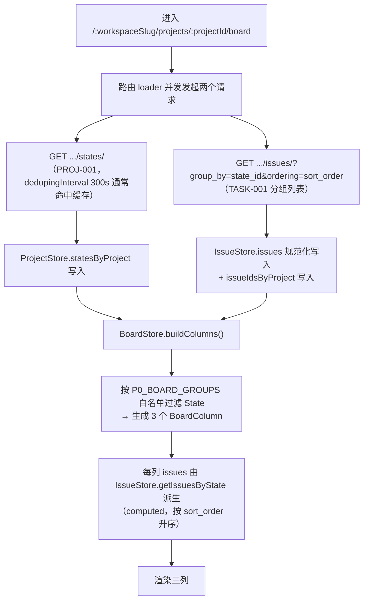
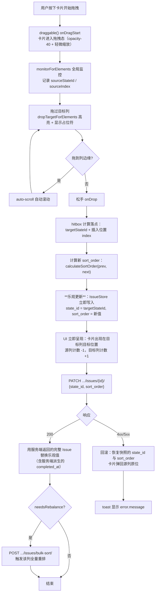
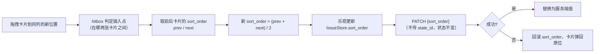
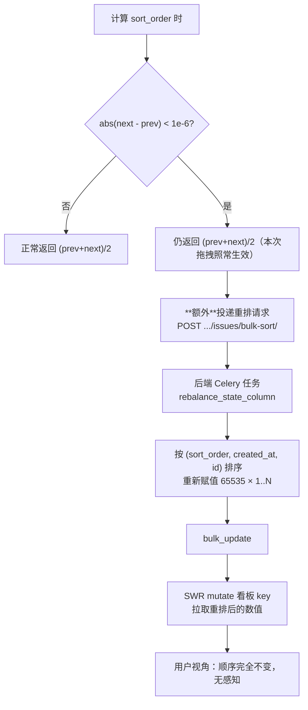
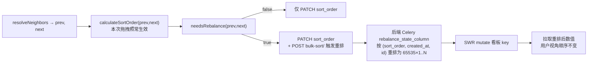

# 固定三列看板 + 拖拽

| 元信息项 | 内容 |
| --- | --- |
| 文档编号 | BOARD-001 |
| 所属迭代 | Sprint 0 — POC 技术验证（第 1-2 周） |
| 优先级 | P0（POC 阻塞级 · **POC 演示核心视图**） |
| 所属模块 | M5-BOARD｜看板视图 |
| 文档状态 | 已确认（Approved） |
| 最后更新日期 | 2026-09-01 |
| 上游依赖 | `TASK-001`（Issue + `sort_order` + PATCH 接口 + 分组列表 + 详情 Drawer）、`PROJ-001`（`State` 三态 + `GET .../states/`） |
| 下游消费 | `BOARD-002`（看板筛选与卡片悬浮预览，Sprint 1）、`BOARD-003`（多看板与列自定义，Sprint 3）、`BOARD-004`（任务批量操作，Sprint 3）、`COLLAB-004`（WebSocket 实时同步，Sprint 3） |
| 上游依据 | `docs/需求文档.md` §3.5 看板视图、§8.3 POC 范围界定、§8.4 POC 验收标准第 4 条 |
| 关联架构文档 | [`unified-issue-model.md`](../architecture/unified-issue-model.md) §2.6 §2.8（`sort_order` 插值）、[`api-conventions.md`](../architecture/api-conventions.md) §4.1（分组列表响应）§2.6（动作子资源）、[`rbac-permission-model.md`](../architecture/rbac-permission-model.md) §4.4（`PermissionGate`）、[`tech-stack.md`](../architecture/tech-stack.md) §2 |
| 对标基线 | Plane 看板（`@atlaskit/pragmatic-drag-and-drop`） · Ones 看板 |
| 工作量估算 | 后端 1 人日 / 前端 3.5 人日 / 联调与测试 1 人日，合计 **5.5 人日** |

---

## 1. 概述

### 1.1 功能定位

看板（Kanban）是 POC 阶段**最具说服力的演示视图**，也是需求文档 §8.4 验收标准中唯一涉及交互体验的一条：「拖拽任务从『待办』到『进行中』，刷新后状态和顺序保持一致」。

本功能交付：

1. **固定三列看板**：待办 / 进行中 / 已完成，P0 不支持自定义列；
2. **跨列拖拽**：拖动即改变任务状态（`state_id`）；
3. **同列拖拽排序**：拖动改变任务顺序（`sort_order`）；
4. **乐观更新 + 失败回滚**；
5. **全量持久化**：刷新后状态与顺序完全保持；
6. **卡片点击打开详情**：复用 `TASK-001` 的 `IssuePeekDrawer`。

> **同列拖拽排序的归属**：跨列与同列拖拽共用同一套 `sort_order` 算法（§4.3）、同一个 `PATCH` 接口（§4.4.1）与同一条落库链路（§4.2.3 的 `monitorForElements`），因此「同列拖拽排序与顺序持久化」（含并发拖拽顺序一致性、精度耗尽重排的压测）**作为本文档（`BOARD-001`）自身的 P0 交付**，由 §2.3 / §4.3 给出完整设计并用 §5 用例验收，不单拆为独立文档。需求文档 §8.4 的验收标准「**状态和顺序**保持一致」由本文档独立满足。

### 1.2 P0 的三列

三列**完全由 `State.group` 决定**，不做任何硬编码状态名判断：

| 列序 | 列名（来自 `State.name`） | `State.group` | `State.color` | 数据来源 |
| --- | --- | --- | --- | --- |
| 1 | 待办 | `unstarted` | `#9CA3AF` | `PROJ-001` §2.3.1 种子数据 |
| 2 | 进行中 | `started` | `#3B82F6` | 同上 |
| 3 | 已完成 | `completed` | `#10B981` | 同上 |

> ⚠️ **口径校正**：第一列「待办」的 `group` 是 **`unstarted`**，**不是 `backlog`**。
>
> [`unified-issue-model.md`](../architecture/unified-issue-model.md) §2.6 的映射表明确：`backlog` 语义为「待规划、看板中**折叠展示**、不计入 Sprint 范围」；`unstarted` 语义为「未开始、看板中作为**待办列**展示、计入剩余工作量」。任务类型的首状态「待办」归入 `unstarted`（§5.2）。
>
> 若误判为 `backlog`，第一列将按「折叠展示」规则被过滤掉，看板只剩两列。本文档、`PROJ-001` §2.3.1 与架构文档三者口径完全统一为 `unstarted`。

**列白名单**（前端唯一的硬编码）：

```typescript
/** P0 看板渲染的 group 白名单，顺序即列顺序 */
export const P0_BOARD_GROUPS = ["unstarted", "started", "completed"] as const;
```

「已取消」（`cancelled`）状态**在数据库中存在**（`PROJ-001` 创建了 4 条 State），但 P0 不渲染为列。P1 开放时只需向白名单追加 `"cancelled"`，无需数据迁移。

### 1.3 范围边界

| 能力 | P0（本文档） | 后续 |
| --- | --- | --- |
| 固定三列渲染 | ✅ | — |
| 跨列拖拽改状态 | ✅ | — |
| 同列拖拽改顺序 | ✅ | — |
| 乐观更新 + 回滚 | ✅ | — |
| 刷新后状态 / 顺序保持 | ✅ | — |
| `sort_order` 精度耗尽自动重排 | ✅ | — |
| 列头任务计数 | ✅ | — |
| 卡片点击打开详情 Drawer | ✅（复用 `TASK-001`） | — |
| 列内「加载更多」 | ✅（每列首屏 25 条） | — |
| 跨列拖拽自动滚动 | ✅ | — |
| 空列放置提示 | ✅ | — |
| 看板筛选（负责人 / 优先级 / 标签 / 时间） | ❌ | `BOARD-002`（Sprint 1） |
| 卡片悬浮预览 / 弹窗编辑 | ❌ | `BOARD-002`（Sprint 1） |
| 列自定义（增删改排序） | ❌ | `BOARD-003`（Sprint 3） |
| 多看板 / 视图保存 | ❌ | `BOARD-003`（Sprint 3） |
| 任务批量操作 | ❌ | `BOARD-004`（Sprint 3） |
| 多人实时拖拽同步（WebSocket） | ❌ | `COLLAB-004`（Sprint 3） |
| 虚拟滚动 | ❌（P0 任务量少，不必要） | P1 视需要 |
| 分组维度切换（按负责人 / 优先级分组） | ❌ | `BOARD-005`（多维度分组看板，Sprint 8） |
| WIP 限制（列内任务数上限） | ❌ | 未列入路线图（见 §6.2） |
| 列表视图的筛选 / 排序 / 分组 | ❌ | `TASK-011` |
| 日历 / 表格多视图 | ❌ | 未列入路线图（甘特图由 `GANTT-001` 独立模块承载） |

### 1.4 前置依赖

| 依赖 | 内容 | 阻塞原因 |
| --- | --- | --- |
| `PROJ-001` | `GET .../states/` 返回按 `sort_order` 升序、含 `group` / `color` / `name` 的状态集 | 列定义的唯一来源 |
| `TASK-001` | ① `GET .../issues/?group_by=state_id` 分组列表（每 State 都有键，含空列）；② `PATCH .../issues/{id}/` 支持同时更新 `state_id` + `sort_order`；③ `calculate_sort_order` 服务端实现；④ `IssuePeekDrawer` 组件；⑤ `IssueStore.updateIssue` 乐观更新 | 卡片数据、拖拽落库、详情面板全部依赖 |
| `INFRA-003` | 索引 `idx_issue_proj_state_sort`（`project, state, sort_order`） | 每列取数查询的性能保障 |
| `AUTH-003` | **仅提供 `Issue.objects.accessible_by()` 行级过滤**（`BaseAPIView` 强制注入，越权表现为 `404`） | 看板取数与拖拽落库的行级隔离（404 层）；L1~L3 权限类**不在其交付边界内**，见下注 |

> ⚠️ **拖拽 403 拦截的 P0 供给（不依赖 `AUTH-005`）**：`AUTH-003` §1.4 交付边界明确——P0 只交付第三层行级过滤（`accessible_by()`），`WorkspaceBasePermission`（L1）/ `ProjectBasePermission`（L2）/ `ProjectEntityPermission`（L3）权限类属 P1 `AUTH-005`。因此 P0 的拖拽 403 拦截（BE-13 / BE-14 / AC-31 / E2E-14）由本文与 `TASK-001` **自建最小判定**：复用 `TASK-001` 交付物 `app/permissions/issue.py` 的简化版——基于 `ProjectMember.role` 的角色等级判定（写操作要求 ≥ `PROJ_CONTRIBUTOR`(15)，不足返回 `403 PERM_ROLE_INSUFFICIENT`），本文 `bulk-sort/` 端点（§4.4.2）挂接同一判定；P1 `AUTH-005` 交付正式 `ProjectEntityPermission`（L3）后原位替换，接口行为不变。

### 1.5 竞品参考

| 竞品 | 参考点 | 处置 |
| --- | --- | --- |
| Plane | `@atlaskit/pragmatic-drag-and-drop` 1.7 + hitbox + auto-scroll；`sort_order` 浮点插值；分组列表接口 | **完全对标**（§6.1） |
| Ones | 看板 WIP 限制、多视图切换、卡片信息密度 | 卡片信息密度对标；WIP 与多视图延后（§6.2） |

---

## 2. 业务逻辑

### 2.1 看板数据加载



**关键设计：列的 issues 不复制存储**。`BoardColumn.issues` 是 MobX `computed`，从 `IssueStore` 的规范化实体派生。这保证：

- 在列表视图改了任务标题，切到看板立即正确（同一份数据源）；
- 拖拽时只需改 `IssueStore` 中的 `state_id` 与 `sort_order`，列的归属与顺序**自动重算**，无需手工在两个数组间搬移元素；
- 不存在「看板数据」与「列表数据」不一致的可能。

### 2.2 跨列拖拽（改状态）



**业务规则**：

| 规则 | 说明 |
| --- | --- |
| 拖拽即状态变更 | 目标列的 `state.id` 直接写入 `issue.state_id`，不需要额外的「确认状态变更」步骤 |
| 状态与顺序**一次 PATCH** | `{state_id, sort_order}` 合并为单个请求，避免两次往返导致中间态 |
| `completed_at` 由服务端派生 | 拖到「已完成」列时服务端 `Issue.save()` 写入 `completed_at`（`TASK-001` §4.3.5）。前端**不自行设置**，用响应值覆盖 |
| P0 无流转限制 | 任意列可拖到任意列，包括「已完成」直接拖回「待办」。工作流校验（前置任务未完成禁止流转）由 `WF-004`（流转守卫 `blocker_completed`）交付 |
| 权限 | 无 `PROJ_CONTRIBUTOR`(15)+ 权限时卡片 `isDragDisabled`（[`rbac-permission-model.md`](../architecture/rbac-permission-model.md) §4.5 明确列出此场景）；后端 PATCH 同时校验 |

### 2.3 同列拖拽排序（改顺序）



**与跨列拖拽的唯一差异**：PATCH 请求体不含 `state_id`（`state_id` 未变则不传，遵循 PATCH 的部分更新语义）。其余流程（乐观更新、hitbox 判定、sort_order 计算、精度检测、回滚）完全共用同一份代码。

**拖到原位的判定**：若计算出的目标位置与源位置相同（同列 + 同索引），**直接 return，不发请求**。这避免了「点一下卡片轻微移动」就产生一次无意义的 PATCH。

### 2.4 刷新后状态与顺序保持

这是 §8.4 验收标准的核心。保证机制：

| 环节 | 保证 |
| --- | --- |
| 状态持久化 | `issue.state_id` 是数据库列，PATCH 成功即落库 |
| 顺序持久化 | `issue.sort_order` 是数据库列（`FloatField`），PATCH 成功即落库 |
| 查询顺序确定 | `GET ?group_by=state_id&ordering=sort_order` 服务端按 `sort_order` 升序返回；索引 `idx_issue_proj_state_sort` 支撑 |
| 前端顺序确定 | `IssueStore.getIssuesByState` 的 `computed` 再次按 `sort_order` 升序排序（双重保险，且使乐观更新后无需等服务端即正确排序） |
| 无内存态依赖 | 看板不使用任何 `localStorage` / `sessionStorage` 顺序缓存。刷新即从数据库重建 |
| 相同 sort_order 的稳定性 | 极端情况（精度耗尽）下多条 `sort_order` 相同时，服务端 `ordering` 追加 `-created_at,-id`，前端 `computed` 排序为稳定排序（`Array.prototype.sort` 在 ES2019+ 保证稳定） |

### 2.5 sort_order 精度耗尽与全列重排

**问题**：连续在同一位置对半插入，浮点精度约 50 次后耗尽（双精度 52 位尾数），出现 `prev === next` 无法再插入。

**处置**：



**关键点**：重排是**兜底而非阻塞**。本次拖拽照常生效（即使精度已极限，`(prev+next)/2` 仍返回一个值），重排在后台异步进行。用户看到的顺序在重排前后完全一致，因为重排严格按当前顺序重新分配数值。

### 2.6 业务规则汇总

| 编号 | 规则 |
| --- | --- |
| BR-1 | 列由 `State.group ∈ {unstarted, started, completed}` 决定，按 `State.sort_order` 升序排列 |
| BR-2 | 列名与列颜色取自 `State.name` / `State.color`，不硬编码 |
| BR-3 | 列内卡片按 `Issue.sort_order` 升序 |
| BR-4 | 每列首屏加载 25 条（服务端分组分页），超出通过列内「加载更多」按需拉取 |
| BR-5 | 跨列拖拽写入 `state_id` + `sort_order`（单次 PATCH） |
| BR-6 | 同列拖拽仅写入 `sort_order` |
| BR-7 | 拖到原位不发请求 |
| BR-8 | 新建任务的 `sort_order` = 目标列最大值 + 65535（由 `TASK-001` 保证），因此新任务出现在列尾 |
| BR-9 | `sort_order` 计算：列首 `next/2`；列尾 `prev+65535`；中间 `(prev+next)/2`；空列 `65535` |
| BR-10 | 相邻间隔 < `1e-6` 时触发该列全量重排（异步，不阻塞） |
| BR-11 | 「已取消」状态不渲染为列；其任务在看板中不可见（可在列表视图查看） |
| BR-12 | P0 无状态流转限制，任意列互相可拖 |
| BR-13 | `PROJ_COMMENTER`(10) / `PROJ_VIEWER`(5) 卡片不可拖拽（`isDragDisabled`），但可查看与点击打开详情 |
| BR-14 | 拖拽失败必须回滚到精确原位（源列 + 源索引），不允许停留在中间态 |
| BR-15 | 归档（`archived_at` 非空）与软删除（`deleted_at` 非空）的任务不出现在看板 |

### 2.7 异常处理

| 场景 | 处置 |
| --- | --- |
| PATCH 返回 4xx/5xx | 回滚 `state_id` 与 `sort_order` 到快照值；toast `error.message`；卡片弹回原位（Framer Motion 弹回动画） |
| PATCH 超时（> 10s） | 同上，toast「网络超时，操作已撤销」 |
| 断网 | Axios 拦截器识别 `ERR_NETWORK` → 回滚 + toast「网络已断开，操作已撤销」 |
| 403（权限不足） | 回滚 + toast「你没有修改任务状态的权限」。同时说明 UI 层的 `isDragDisabled` 被绕过（如 DevTools 篡改），后端二次鉴权生效 |
| 404（任务已被他人删除） | 回滚后**移除该卡片** + toast「该任务已被删除」；`mutate()` 刷新看板 |
| 400（`state_id` 无效） | 回滚 + toast；同时 `mutate()` 刷新状态集（可能列被他人删除，P0 不可能但代码需健壮） |
| 快速连续拖拽 | 见 §4.6 并发控制 |
| 重排请求失败 | 静默失败（不打扰用户）；`sort_order` 仍可用（只是精度紧张），下次拖拽再次触发重排；Celery 自带 3 次重试 |
| 状态集为空（异常数据） | 渲染错误态「项目状态配置异常，请联系管理员」，不渲染空白页 |

---

## 3. UI/UX 设计

### 3.1 三列布局

```
┌─────────────────────────────────────────────────────────────────────────────────┐
│ 看板                                                    ┌──────────────────┐    │
│                                                          │ ＋ 创建任务       │    │
├─────────────────────────────────────────────────────────────────────────────────┤
│  ┌───────────────────────┐ ┌───────────────────────┐ ┌───────────────────────┐  │
│  │ ● 待办            3   │ │ ● 进行中          2   │ │ ● 已完成          1   │  │
│  │ ───────────────────── │ │ ───────────────────── │ │ ───────────────────── │  │
│  │ ┃                     │ │ ┃                     │ │ ┃                     │  │
│  │ ┃ 邮箱注册 / 登录     │ │ ┃ Docker Compose      │ │ ┃ 搭建 Monorepo       │  │
│  │ ┃                     │ │ ┃ 全套服务编排         │ │ ┃ 工程骨架            │  │
│  │ ┃ TZXM-4  👤  🔴8-30 │ │ ┃ TZXM-2  👤   9-08  │ │ ┃ TZXM-1  👤   9-05  │  │
│  │ ┗━━━━━━━━━━━━━━━━━━━ │ │ ┗━━━━━━━━━━━━━━━━━━━ │ │ ┗━━━━━━━━━━━━━━━━━━━ │  │
│  │ ┃                     │ │ ┃                     │ │                       │  │
│  │ ┃ 固定三列看板 + 拖拽 │ │ ┃ Django ORM 初始     │ │                       │  │
│  │ ┃                     │ │ ┃ 数据模型            │ │                       │  │
│  │ ┃ TZXM-5  👤     —   │ │ ┃ TZXM-3  👤   9-10  │ │                       │  │
│  │ ┗━━━━━━━━━━━━━━━━━━━ │ │ ┗━━━━━━━━━━━━━━━━━━━ │ │                       │  │
│  │ ┃                     │ │                       │ │                       │  │
│  │ ┃ 前端路由拦截        │ │                       │ │                       │  │
│  │ ┃ TZXM-6  —      —   │ │                       │ │                       │  │
│  │ ┗━━━━━━━━━━━━━━━━━━━ │ │                       │ │                       │  │
│  │                       │ │                       │ │                       │  │
│  │ ＋ 添加任务            │ │ ＋ 添加任务            │ │ ＋ 添加任务            │  │
│  └───────────────────────┘ └───────────────────────┘ └───────────────────────┘  │
└─────────────────────────────────────────────────────────────────────────────────┘
```

| 元素 | 规格 |
| --- | --- |
| 看板容器 | `flex gap-4 overflow-x-auto px-4 pb-4 h-[calc(100vh-var(--header-h))]`；横向可滚动 |
| 列 | 固定宽度 **280px**（`w-[280px] shrink-0`），`flex flex-col`，`rounded-lg bg-neutral-50` |
| 列头 | 高 44px，`sticky top-0 z-10 bg-neutral-50/95 backdrop-blur px-3`；左侧 8px 圆点（`state.color`）+ 状态名（`text-sm font-medium`）；右侧任务计数（`text-xs text-neutral-400 tabular-nums`） |
| 列体 | `flex-1 overflow-y-auto px-2 py-2 flex flex-col gap-2`；纵向独立滚动 |
| 列底 | 「＋ 添加任务」按钮，点击展开该列的内联快速创建输入框（回车创建，状态自动落该列） |
| 列滚动条 | `scrollbar-thin`，默认半透明，hover 时加深 |
| 列数超屏 | P0 三列在 ≥ 1024px 下无需横向滚动；容器仍设 `overflow-x-auto` 以适配窄屏 |

### 3.2 任务卡片

```
┌─────────────────────────────┐
│┃                            │  ← 左侧 3px 状态颜色条
│┃ Docker Compose 全套服务编排 │  ← 标题，最多 3 行
│┃                            │
│┃ TZXM-2      👤       9-08  │  ← 编号 / 负责人头像 / 截止时间
└─────────────────────────────┘
```

| 元素 | 规格 |
| --- | --- |
| 卡片 | `rounded-md border border-neutral-200 bg-white p-3 shadow-sm cursor-grab hover:shadow-md hover:border-neutral-300 transition-shadow` |
| 状态颜色条 | 左侧 3px 垂直条，`background: state.color`；使卡片在拖拽移动过程中仍能看出其原属状态 |
| 标题 | `text-sm text-neutral-800 line-clamp-3 leading-snug`，最多 3 行 |
| 底部行 | `mt-2 flex items-center justify-between text-xs` |
| 编号 | `font-mono text-neutral-400`，如 `TZXM-2` |
| 负责人 | 20px 圆形头像（`avatar_url` 或首字母占位）；无负责人时不渲染（不占位） |
| 截止时间 | `text-neutral-500`，格式 `M-d`（`date-fns` 4.1）；逾期且状态非 `completed` 时 `text-red-500` + 前置 `alert-circle` 10px 图标 |
| 光标 | 可拖时 `cursor-grab`，拖拽中 `cursor-grabbing`；`isDragDisabled` 时 `cursor-pointer` |
| 点击 | 打开 `IssuePeekDrawer`（`TASK-001` §3.3 组件，完整复用）；URL 追加 `?peekIssue={id}` |
| **拖拽与点击的区分** | `pragmatic-drag-and-drop` 原生处理：按下后移动 > 5px 判定为拖拽，否则为点击。无需手工实现阈值判定 |

### 3.3 拖拽交互与视觉反馈

技术栈（[`tech-stack.md`](../architecture/tech-stack.md)）：

| 包 | 版本 | 用途 |
| --- | --- | --- |
| `@atlaskit/pragmatic-drag-and-drop` | `1.7.x` | 核心拖拽（`draggable` / `dropTargetForElements` / `monitorForElements`） |
| `@atlaskit/pragmatic-drag-and-drop-hitbox` | `1.0.x` | 边缘碰撞检测（判定插入到目标卡片的上方还是下方） |
| `@atlaskit/pragmatic-drag-and-drop-auto-scroll` | `2.1.x` | 拖到容器边缘时自动滚动 |
| `motion`（Framer Motion） | `12.x` | 卡片回弹与列高亮动效 |

| 阶段 | 视觉反馈 |
| --- | --- |
| **拖拽开始** | 源卡片 `opacity-40` + `scale-[0.98]`；`document.body` 加 `cursor-grabbing`；跟随鼠标的原生拖拽预览（浏览器原生截图，非自定义 DOM，性能最佳） |
| **拖过目标列** | 目标列 `bg-primary-50 ring-2 ring-primary-200 ring-inset`；120ms 过渡 |
| **插入位置占位符** | 在插入点渲染高 2px、全宽、`bg-primary-500 rounded-full` 的横线；由 hitbox 的 `closestEdge`（`top` / `bottom`）决定画在目标卡片上方还是下方 |
| **空列悬停** | 列体中央显示虚线框（`border-2 border-dashed border-primary-300 rounded-md`）+ 文案「将任务拖拽到这里」 |
| **边缘自动滚动** | 拖到列体上下边缘 60px 内时该列纵向自动滚动；拖到看板容器左右边缘时横向自动滚动。速度随距边缘距离递增（auto-scroll 包默认曲线） |
| **松手成功** | 卡片以 Framer Motion `spring {stiffness: 400, damping: 30}` 落位；列头计数数字用 `tabular-nums` + 淡入淡出过渡 |
| **松手失败（回滚）** | 卡片以 `spring {stiffness: 300, damping: 25}` 弹回源位置；同时源列短暂 `ring-2 ring-red-200`（400ms）提示失败位置；toast 弹出 |
| **不可拖拽** | `PROJ_COMMENTER` / `PROJ_VIEWER` 的卡片无 `cursor-grab`，按下拖动无任何响应（`draggable` 的 `canDrag` 返回 `false`） |

**降级策略**：`prefers-reduced-motion: reduce` 时禁用所有 spring 动画，改为瞬时定位（`transition: none`），保留占位符与列高亮（这些是功能性反馈而非装饰）。

### 3.4 列内快速创建

点击列底「＋ 添加任务」展开内联输入框：

```
│ ┌─────────────────────────┐ │
│ │ 输入任务标题…             │ │
│ └─────────────────────────┘ │
│ 回车创建 · Esc 取消          │
```

| 行为 | 规格 |
| --- | --- |
| 提交 | `Enter` 创建，`state_id` 自动为该列的 State（无需用户选择） |
| 焦点保持 | 创建成功后清空并保持 focus，可连续创建（与 `TASK-001` §3.2.1 一致） |
| 乐观插入 | 立即在该列列尾插入临时卡片（`opacity-60`，编号位显示 `…`） |
| 取消 | `Esc` 或失焦且内容为空时收起 |
| 位置 | 新任务 `sort_order` = 该列最大值 + 65535，因此出现在**列尾** |
| 权限 | `PROJ_COMMENTER` / `PROJ_VIEWER` 不渲染该按钮 |

### 3.5 空状态

| 场景 | 处置 |
| --- | --- |
| **单列为空**（其他列有任务） | 列体渲染浅灰虚线框 + 居中文案「**将任务拖拽到这里**」（`text-xs text-neutral-400`）。拖拽悬停时虚线框变主色（§3.3） |
| **全部三列为空**（项目无任务） | 三列骨架仍完整渲染（列头 + 计数 0 + 空列提示），**同时**在看板上方显示引导条：「暂无任务，点击『＋ 创建任务』或在列内添加」。**不**用全屏空状态替换看板——保留三列结构可让用户直观理解看板形态 |
| 加载中 | 三列骨架，每列 3 张卡片骨架（`animate-pulse`，高度与真实卡片一致，CLS = 0） |
| 加载失败 | 看板区居中 `alert-circle` + `error.message` + 「重试」按钮（触发 SWR `mutate()`） |
| 状态集异常（0 条 State） | 「项目状态配置异常，请联系管理员」 |

### 3.6 响应式与无障碍

| 断点 | 布局 |
| --- | --- |
| ≥ 1024px（`lg`） | 三列并排，每列 280px，无横向滚动 |
| 768 ~ 1023px | 三列并排但容器横向滚动；列宽保持 280px |
| < 768px | 列宽改为 `calc(100vw - 48px)`，横向滑动切换列（`scroll-snap-type: x mandatory` + `scroll-snap-align: center`），一次显示一列；顶部加列指示点 |

**无障碍**：

| 要求 | 实现 |
| --- | --- |
| 键盘可达 | 卡片 `tabIndex={0}`，`Enter` / `Space` 打开详情 |
| **键盘拖拽** | P0 **不实现**（`pragmatic-drag-and-drop` 需额外接入 `@atlaskit/pragmatic-drag-and-drop/element/adapter` 的键盘适配器）。**替代路径**：通过详情 Drawer 的状态下拉改状态，功能完全等价。此替代路径必须在文档与帮助中说明，P1 补键盘拖拽 |
| 屏幕阅读器 | 列容器 `role="list"` + `aria-label="{状态名} 列，共 {N} 个任务"`；卡片 `role="listitem"` + `aria-label="{编号} {标题}，状态 {状态名}"` |
| 拖拽状态播报 | 拖拽开始/结束时通过 `aria-live="polite"` 区域播报「正在拖动 TZXM-2」/「已移动 TZXM-2 到 进行中」 |
| 色盲可达 | 状态不以颜色为唯一载体：列头有文字状态名，卡片有编号与标题 |
| 对比度 | 全部文本 ≥ 4.5:1；占位符线与列背景 ≥ 3:1 |

---

## 4. 技术架构

### 4.1 看板数据结构

```typescript
// packages/types/src/board.d.ts
import type { IIssue, IState, TStateGroup } from "./index";

/** 看板列 —— 由 State 派生，issues 为 MobX computed（不复制存储） */
export interface BoardColumn {
  /** State UUID，同时作为 dropTarget 的标识与分组列表响应的键 */
  id: string;
  /** 状态名，直接来自 State.name（不硬编码） */
  name: string;
  /** 状态颜色，来自 State.color */
  color: string;
  /** 语义分组，决定该 State 是否渲染为列 */
  group: TStateGroup;
  /** 列内任务，按 sort_order 升序 */
  issues: IIssue[];
  /** 服务端返回的该列任务总数（可能大于 issues.length，用于「加载更多」） */
  totalCount: number;
  /** 是否还有未加载的任务 */
  hasMore: boolean;
}

/** P0 看板渲染的 group 白名单，数组顺序即列顺序 */
export const P0_BOARD_GROUPS = ["unstarted", "started", "completed"] as const;

/** 拖拽载荷：卡片 draggable 携带的数据 */
export interface DragCardData {
  type: "issue-card";
  issueId: string;
  sourceStateId: string;
  sourceIndex: number;
}

/** 放置载荷：列 dropTarget 携带的数据 */
export interface DropColumnData {
  type: "board-column";
  stateId: string;
}

/** 放置载荷：卡片本身也是 dropTarget（用于精确插入位置） */
export interface DropCardData {
  type: "issue-card-drop";
  issueId: string;
  stateId: string;
  index: number;
}
```

### 4.2 拖拽实现（@atlaskit/pragmatic-drag-and-drop）

#### 4.2.1 卡片：draggable

```typescript
// apps/web/core/components/board/issue-card.tsx
import { useEffect, useRef, useState } from "react";
import { draggable, dropTargetForElements } from "@atlaskit/pragmatic-drag-and-drop/element/adapter";
import {
  attachClosestEdge, extractClosestEdge, type Edge,
} from "@atlaskit/pragmatic-drag-and-drop-hitbox/closest-edge";
import { observer } from "mobx-react-lite";

export const BoardIssueCard = observer(({ issue, stateId, index }: Props) => {
  const ref = useRef<HTMLDivElement>(null);
  const [isDragging, setIsDragging] = useState(false);
  const [closestEdge, setClosestEdge] = useState<Edge | null>(null);
  const { canDrag } = useIssuePermission(issue.project_id);

  useEffect(() => {
    const el = ref.current;
    if (!el) return;

    return combine(
      // 1) 卡片可拖拽
      draggable({
        element: el,
        canDrag: () => canDrag,                       // 权限不足则完全不可拖
        getInitialData: (): DragCardData => ({
          type: "issue-card",
          issueId: issue.id,
          sourceStateId: stateId,
          sourceIndex: index,
        }),
        onDragStart: () => setIsDragging(true),
        onDrop: () => setIsDragging(false),
      }),

      // 2) 卡片同时是放置目标 —— 用于判定「插到这张卡片的上方还是下方」
      dropTargetForElements({
        element: el,
        canDrop: ({ source }) => source.data.type === "issue-card",
        getData: ({ input, element }) => {
          const data: DropCardData = {
            type: "issue-card-drop", issueId: issue.id, stateId, index,
          };
          // hitbox：把「最近边缘」附加到 data 上
          return attachClosestEdge(data, { input, element, allowedEdges: ["top", "bottom"] });
        },
        onDrag: ({ self, source }) => {
          // 拖到自己身上不显示占位符
          if (source.data.issueId === issue.id) return setClosestEdge(null);
          setClosestEdge(extractClosestEdge(self.data));
        },
        onDragLeave: () => setClosestEdge(null),
        onDrop: () => setClosestEdge(null),
      })
    );
  }, [issue.id, stateId, index, canDrag]);

  return (
    <div className="relative">
      {closestEdge === "top" && <DropIndicator />}
      <div
        ref={ref}
        role="listitem"
        tabIndex={0}
        aria-label={`${issue.issue_key} ${issue.name}`}
        onClick={() => issueDetail.openPeek(issue.id)}
        className={cn(
          "relative rounded-md border border-neutral-200 bg-white p-3 shadow-sm transition-shadow",
          "hover:shadow-md hover:border-neutral-300",
          canDrag ? "cursor-grab active:cursor-grabbing" : "cursor-pointer",
          isDragging && "opacity-40 scale-[0.98]"
        )}
      >
        <span className="absolute left-0 top-2 bottom-2 w-[3px] rounded-full"
              style={{ backgroundColor: columnColor }} />
        <p className="pl-2 text-sm leading-snug text-neutral-800 line-clamp-3">{issue.name}</p>
        <div className="mt-2 flex items-center justify-between pl-2 text-xs">
          <span className="font-mono text-neutral-400">{issue.issue_key}</span>
          <div className="flex items-center gap-2">
            {assignee && <Avatar user={assignee} size={20} />}
            <TargetDate date={issue.target_date} isCompleted={isCompletedGroup} />
          </div>
        </div>
      </div>
      {closestEdge === "bottom" && <DropIndicator />}
    </div>
  );
});
```

#### 4.2.2 列：dropTargetForElements + auto-scroll

```typescript
// apps/web/core/components/board/column.tsx
import { dropTargetForElements } from "@atlaskit/pragmatic-drag-and-drop/element/adapter";
import { autoScrollForElements } from "@atlaskit/pragmatic-drag-and-drop-auto-scroll/element";

export const BoardColumnView = observer(({ column }: { column: BoardColumn }) => {
  const bodyRef = useRef<HTMLDivElement>(null);
  const [isOver, setIsOver] = useState(false);

  useEffect(() => {
    const el = bodyRef.current;
    if (!el) return;

    return combine(
      // 列为放置目标（承接「拖到空白区域」= 追加到列尾）
      dropTargetForElements({
        element: el,
        canDrop: ({ source }) => source.data.type === "issue-card",
        getData: (): DropColumnData => ({ type: "board-column", stateId: column.id }),
        onDragEnter: () => setIsOver(true),
        onDragLeave: () => setIsOver(false),
        onDrop: () => setIsOver(false),
      }),

      // 拖到列体上下边缘时自动纵向滚动
      autoScrollForElements({
        element: el,
        canScroll: ({ source }) => source.data.type === "issue-card",
      })
    );
  }, [column.id]);

  return (
    <div className="flex h-full w-[280px] shrink-0 flex-col rounded-lg bg-neutral-50">
      <ColumnHeader column={column} />
      <div
        ref={bodyRef}
        role="list"
        aria-label={`${column.name} 列，共 ${column.totalCount} 个任务`}
        className={cn(
          "flex flex-1 flex-col gap-2 overflow-y-auto px-2 py-2 transition-colors duration-150",
          isOver && "bg-primary-50 ring-2 ring-inset ring-primary-200"
        )}
      >
        {column.issues.map((issue, index) => (
          <BoardIssueCard key={issue.id} issue={issue} stateId={column.id} index={index} />
        ))}
        {column.issues.length === 0 && <EmptyColumnHint isOver={isOver} />}
        {column.hasMore && <LoadMoreButton column={column} />}
      </div>
      <ColumnFooter column={column} />
    </div>
  );
});
```

#### 4.2.3 看板：monitorForElements + 横向 auto-scroll

全局监控是**落库逻辑的唯一入口**。所有拖拽结果在此统一处理，卡片与列的 `onDrop` 只负责清理视觉状态。

```typescript
// apps/web/core/components/board/board-root.tsx
import { monitorForElements } from "@atlaskit/pragmatic-drag-and-drop/element/adapter";
import { autoScrollForElements } from "@atlaskit/pragmatic-drag-and-drop-auto-scroll/element";
import { extractClosestEdge } from "@atlaskit/pragmatic-drag-and-drop-hitbox/closest-edge";

export const BoardRoot = observer(({ workspaceSlug, projectId }: Props) => {
  const { board } = useStore();
  const scrollRef = useRef<HTMLDivElement>(null);

  useEffect(() => {
    return combine(
      // 全局拖拽监控：唯一的落库入口
      monitorForElements({
        canMonitor: ({ source }) => source.data.type === "issue-card",
        onDrop: ({ source, location }) => {
          const target = location.current.dropTargets[0];       // 最内层 dropTarget 优先
          if (!target) return;                                  // 拖到看板外，视为取消

          const drag = source.data as unknown as DragCardData;
          const resolved = resolveDropPosition(drag, target, board);
          if (!resolved) return;                                // 拖到原位，不发请求

          void board.moveIssue({
            workspaceSlug, projectId,
            issueId: drag.issueId,
            sourceStateId: drag.sourceStateId,
            targetStateId: resolved.targetStateId,
            targetIndex: resolved.targetIndex,
          });
        },
      }),

      // 看板容器横向自动滚动
      scrollRef.current
        ? autoScrollForElements({
            element: scrollRef.current,
            canScroll: ({ source }) => source.data.type === "issue-card",
          })
        : () => {}
    );
  }, [workspaceSlug, projectId, board]);

  return (
    <div ref={scrollRef} className="flex h-full gap-4 overflow-x-auto px-4 pb-4">
      {board.columns.map((c) => <BoardColumnView key={c.id} column={c} />)}
    </div>
  );
});
```

#### 4.2.4 落点解析（`resolveDropPosition`）

```typescript
// apps/web/core/components/board/utils.ts
/**
 * 把 pragmatic-dnd 的 dropTarget 解析为「目标列 + 目标插入索引」
 *
 * 两种目标：
 *  - issue-card-drop：落在某张卡片的上/下边缘 → 精确插入位置
 *  - board-column   ：落在列的空白区域     → 追加到列尾
 *
 * 返回 null 表示「落在原位」，调用方应直接 return 不发请求。
 */
export const resolveDropPosition = (
  drag: DragCardData,
  target: DropTargetRecord,
  board: BoardStore
): { targetStateId: string; targetIndex: number } | null => {
  const data = target.data;

  if (data.type === "issue-card-drop") {
    const drop = data as unknown as DropCardData;
    const edge = extractClosestEdge(data);
    let index = edge === "bottom" ? drop.index + 1 : drop.index;

    // 同列内向下移动时，源卡片先被移除会使后续索引左移 1
    if (drag.sourceStateId === drop.stateId && drag.sourceIndex < index) index -= 1;

    if (drag.sourceStateId === drop.stateId && drag.sourceIndex === index) return null;  // 原位
    return { targetStateId: drop.stateId, targetIndex: index };
  }

  if (data.type === "board-column") {
    const drop = data as unknown as DropColumnData;
    const column = board.getColumn(drop.stateId);
    if (!column) return null;
    const lastIndex =
      drag.sourceStateId === drop.stateId ? column.issues.length - 1 : column.issues.length;
    if (drag.sourceStateId === drop.stateId && drag.sourceIndex === lastIndex) return null;
    return { targetStateId: drop.stateId, targetIndex: lastIndex };
  }

  return null;
};
```

> **同列向下移动的索引修正**是这段逻辑最容易出错的地方。例如列中有 `[A, B, C]`，把 A（index 0）拖到 C 下方（`drop.index=2, edge=bottom` → `index=3`）。若不修正，插入位置 3 越界；修正后为 2，得到 `[B, C, A]`，正确。此处必须有专项单元测试（§5.1 DROP-06 ~ DROP-09）。

### 4.3 sort_order 算法（前端）

前端算法与服务端 `calculate_sort_order`（[`unified-issue-model.md`](../architecture/unified-issue-model.md) §2.8、`TASK-001` §4.3.2）**必须逐分支一致**，否则乐观更新的位置与服务端落库结果不符，刷新后顺序跳变。

```typescript
// packages/utils/src/sort-order.ts
export const DEFAULT_GAP = 65535;
export const REBALANCE_THRESHOLD = 1e-6;

/**
 * 计算拖拽落位后的 sort_order —— 与后端 calculate_sort_order 逐分支一致
 *
 * 仅更新被拖拽的单条记录，不触碰同列其他记录，避免 O(n) 整列 UPDATE。
 */
export const calculateSortOrder = (
  prevOrder: number | null,
  nextOrder: number | null
): number => {
  if (prevOrder === null && nextOrder === null) return DEFAULT_GAP;      // 空列
  if (prevOrder === null) return nextOrder! / 2;                          // 列首
  if (nextOrder === null) return prevOrder + DEFAULT_GAP;                 // 列尾
  return (prevOrder + nextOrder) / 2;                                     // 中间
};

/** 精度耗尽检测：相邻间隔过小时需触发该列全量重排 */
export const needsRebalance = (
  prevOrder: number | null,
  nextOrder: number | null
): boolean => {
  if (prevOrder === null || nextOrder === null) return false;
  return Math.abs(nextOrder - prevOrder) < REBALANCE_THRESHOLD;
};

/**
 * 由「目标列的现有任务 + 插入索引」推导出 prev / next 的 sort_order
 * 注意：调用前必须已把源卡片从目标列数组中排除（同列移动场景）
 */
export const resolveNeighbors = (
  columnIssues: { id: string; sort_order: number }[],
  targetIndex: number,
  movingIssueId: string
): { prev: number | null; next: number | null } => {
  const others = columnIssues.filter((i) => i.id !== movingIssueId);
  const prev = targetIndex > 0 ? others[targetIndex - 1]?.sort_order ?? null : null;
  const next = targetIndex < others.length ? others[targetIndex]?.sort_order ?? null : null;
  return { prev, next };
};
```

**五个分支的完整对照表**：

| 场景 | `prev` | `next` | 计算式 | 示例 |
| --- | --- | --- | --- | --- |
| 空列 | `null` | `null` | `65535` | 拖入空的「进行中」列 → `65535` |
| 列首插入 | `null` | 有值 | `next / 2` | `next=65535` → `32767.5` |
| 列尾插入 | 有值 | `null` | `prev + 65535` | `prev=131070` → `196605` |
| 中间插入 | 有值 | 有值 | `(prev + next) / 2` | `65535, 131070` → `98302.5` |
| 新建任务 | 列最大值 | `null` | `prev + 65535` | 由 `TASK-001` 服务端处理 |

**精度耗尽的完整链路**：



### 4.4 API

#### 4.4.1 复用 TASK-001 的接口（无新增读写接口）

| 用途 | 方法 | 路径 | 来源 |
| --- | --- | --- | --- |
| 列定义 | `GET` | `/api/v1/workspaces/{slug}/projects/{project_id}/states/` | `PROJ-001` §4.2.6 |
| 卡片数据 | `GET` | `/api/v1/workspaces/{slug}/projects/{project_id}/issues/?group_by=state_id&ordering=sort_order` | `TASK-001` §4.2.3 |
| 列内加载更多 | `GET` | `.../issues/?group_by=state_id&group_id={state_id}&cursor={cursor}` | `TASK-001` §4.2.2 |
| **跨列拖拽** | `PATCH` | `.../issues/{issue_id}/` 体 `{state_id, sort_order}` | `TASK-001` §4.2.5 |
| **同列拖拽** | `PATCH` | `.../issues/{issue_id}/` 体 `{sort_order}` | 同上 |
| 列内快速创建 | `POST` | `.../issues/` 体 `{name, state_id}` | `TASK-001` §4.2.1 |
| 卡片点击详情 | `GET` | `.../issues/{issue_id}/` | `TASK-001` §4.2.4 |

**跨列拖拽请求示例**

```http
PATCH /api/v1/workspaces/rabbitprojects/projects/7b3e9c1a-.../issues/1a2b3c4d-.../ HTTP/1.1
Content-Type: application/json
X-CSRFToken: ...
```

```json
{
  "state_id": "e3f4a5b6-7c8d-4e9f-8a1b-2c3d4e5f6a7b",
  "sort_order": 98302.5
}
```

**响应 `200`**（完整 Issue，注意服务端派生的 `completed_at`）

```json
{
  "status": "success",
  "data": {
    "id": "1a2b3c4d-5e6f-4a7b-8c9d-0e1f2a3b4c5d",
    "project_id": "7b3e9c1a-4d5f-4a8b-9c2e-1f0a3b4c5d6e",
    "project_identifier": "TZXM",
    "sequence_id": 2,
    "issue_key": "TZXM-2",
    "name": "Docker Compose 全套服务编排",
    "state_id": "e3f4a5b6-7c8d-4e9f-8a1b-2c3d4e5f6a7b",
    "assignee_ids": ["6c7d1a2b-3e4f-4a5b-9c8d-7e6f5a4b3c2d"],
    "target_date": "2026-09-08",
    "completed_at": "2026-09-01T07:15:44.902Z",
    "sort_order": 98302.5,
    "created_at": "2026-09-01T03:42:11.507Z",
    "updated_at": "2026-09-01T07:15:44.902Z"
  }
}
```

> **必须用响应值覆盖乐观值**：拖到「已完成」列时服务端写入 `completed_at`。若前端保留乐观值，该字段将缺失直到下次刷新。这是 `TASK-001` §4.3.4 已确立的规则，看板严格遵守。

**同列拖拽请求示例**

```json
{ "sort_order": 32767.5 }
```

不含 `state_id` —— PATCH 的部分更新语义下「不传即不改」（`TASK-001` BR/§4.2.5）。

> **并发语义与架构文档待回改登记（[`api-conventions.md`](../architecture/api-conventions.md) §10.5「看板拖拽」行）**：本文拖拽落库采用**客户端计算 `sort_order` + 不带 `If-Match` 的后写胜出**语义——并发 PATCH 均 `200`（BE-17），等值由三级排序键与异步重排消解（BE-18 / BR-10）。这与 §10.5 现行的「`select_for_update()` 锁定相邻记录、服务端重算 `sort_order`、冲突重试 3 次后返回 `409 RESOURCE_CONFLICT`」相悖，**在此登记为架构文档待回改**：§10.5 看板拖拽行待回改为「客户端计算 + 版本号（`If-Match` 可选）」语义。理由：① 拖拽是高频连续交互，409 触发的回滚与重试会打断乐观更新体验；`TASK-001` §4.3.6 的 P0 策略已明确「`sort_order` 不发送 `If-Match`、后写胜出可接受、`BOARD-001` 的快速连续拖拽不应被 409 打断」，本文与其保持两文一致；② `sort_order` 是离散排序值，单条插值算法天然容忍并发（不同区间互不冲突），等值场景由 `(sort_order, created_at, id)` 三级键 + `needsRebalance` 异步重排闭环，无完整性风险。

#### 4.4.2 新增端点：批量重排

按 [`api-conventions.md`](../architecture/api-conventions.md) §2.6「动作子资源」模式建模。

| 方法 | 路径 | 描述 | 权限 | 成功码 |
| --- | --- | --- | --- | --- |
| `POST` | `/api/v1/workspaces/{slug}/projects/{project_id}/issues/bulk-sort/` | 重排指定状态列的 `sort_order` | `PROJ_CONTRIBUTOR`(15)+ | `202` |

**与 `.../issues/bulk/` 的关系与分工**

| 端点 | 语义 | 请求体 | 幂等 | 同步性 |
| --- | --- | --- | --- | --- |
| `PATCH .../issues/bulk/` | **客户端指定**目标记录与更新值，批量更新（Sprint 3 `BOARD-004` 交付） | `{issue_ids, patch, comment?}` | 否 | 同步 `200` |
| `POST .../issues/bulk-sort/` | **服务端计算**整列 `sort_order` 的均匀重排，客户端不指定具体值 | `{state_id}` | **是**（重复调用结果相同） | 异步 `202` |

二者语义正交，不重叠：前者是「批量写入客户端已知的值」，后者是「请服务端重新规整一列的排序值」。刻意分为两个端点而不是复用 `bulk/`，理由是幂等性与同步性不同——`bulk-sort` 是幂等的异步动作，适合 `202` 模式（[`api-conventions.md`](../architecture/api-conventions.md) §13.1）。

**请求**

```http
POST /api/v1/workspaces/rabbitprojects/projects/7b3e9c1a-.../issues/bulk-sort/ HTTP/1.1
Content-Type: application/json
X-CSRFToken: ...
Idempotency-Key: 01JBX6P4T0UC7Q1R5S8Y9Z0A1B
```

```json
{ "state_id": "e3f4a5b6-7c8d-4e9f-8a1b-2c3d4e5f6a7b" }
```

**成功响应 `202 Accepted`**

```json
{
  "status": "success",
  "data": {
    "task_id": "8f7e6d5c-4b3a-4291-8072-1a2b3c4d5e6f",
    "state": "queued",
    "status_url": "/api/v1/tasks/8f7e6d5c-4b3a-4291-8072-1a2b3c4d5e6f/"
  }
}
```

> `state` 与 `status_url` 遵循 [`api-conventions.md`](../architecture/api-conventions.md) §13.1 的 202 模式：`state` 枚举为 `queued` / `processing` / `succeeded` / `failed` / `cancelled`；任务状态查询端点为**全局统一**的 `GET /api/v1/tasks/{task_id}/`（不带工作空间前缀），前端轮询该端点获取重排进度。

**失败响应 `400`（`state_id` 不属于本项目）**

```json
{
  "status": "error",
  "error": {
    "code": "VALIDATION_ERROR",
    "message": "请求参数校验失败",
    "details": [
      { "field": "state_id", "code": "DOES_NOT_EXIST", "message": "所选状态无效" }
    ],
    "request_id": "01JBX6P4T0UC7Q1R5S8Y9Z0A1C"
  }
}
```

**后端实现**

```python
# apps/api/plane/app/views/issue.py
class IssueBulkSortAPIView(ProjectScopedAPIView):
    """POST .../issues/bulk-sort/ —— 重排某状态列的 sort_order（幂等 · 异步）"""

    # P0 鉴权（§1.4 注）：L3 ProjectEntityPermission 属 P1 AUTH-005，AUTH-003 仅交付
    # accessible_by() 行级过滤（404 层）。此处挂接 TASK-001 app/permissions/issue.py
    # 的最小判定简化版（ProjectMember.role >= PROJ_CONTRIBUTOR(15)，不足 → 403），
    # AUTH-005 落地后原位替换为正式 ProjectEntityPermission（L3），接口行为不变。
    permission_classes = [IsAuthenticatedAndActive, IssueWritePermission]

    def post(self, request, slug, project_id):
        state_id = request.data.get("state_id")
        if not State.objects.filter(id=state_id, project_id=project_id).exists():
            # DRF 签名为 ValidationError(detail=...)（参数名是 detail，不是 details）
            raise ValidationError(detail=[
                {"field": "state_id", "code": "DOES_NOT_EXIST", "message": "所选状态无效"}
            ])
        task = rebalance_state_column.delay(str(project_id), str(state_id))
        return accepted_response(task_id=task.id)      # 202 + task_id + status_url
```

> **`{field, code, message}` 明细到 `error.details` 的映射**：上述自定义字典列表作为 `detail` 传入 `ValidationError`；全局异常处理器（[`api-conventions.md`](../architecture/api-conventions.md) §10.4 `custom_exception_handler`）捕获后将其平铺为 `error.details` 数组（`400 VALIDATION_ERROR` + `details[]`），即为本节「失败响应 `400`」示例中的响应形态，视图内无需手工组装错误体。

Celery 任务 `rebalance_state_column` 的实现见 `TASK-001` §4.3.2（同一份代码，本端点只是其同步触发入口）。

**限流**：该端点适用 [`api-conventions.md`](../architecture/api-conventions.md) §7.2 L2 配额表中「已认证用户（内部 API）60 请求/分钟」的应用限流（该表并无「L2 写操作配额」类目）；在此之上按 §7.1 L3 端点限流模式（ViewSet 级 `throttle_classes`）设置本文自定义的专项限流 **每项目每分钟 6 次**（重排是低频兜底操作，高频调用必是异常）。超限返回 `429` + `RATE_LIMIT_EXCEEDED` + `Retry-After`。

### 4.5 BoardStore

```typescript
// apps/web/core/store/board/index.ts
import { action, computed, makeObservable, observable, runInAction } from "mobx";
import type { BoardColumn, IIssue } from "@plane/types";
import { P0_BOARD_GROUPS } from "@plane/types";
import { calculateSortOrder, needsRebalance, resolveNeighbors } from "@plane/utils";

export class BoardStore {
  /** 每列的服务端总数与分页游标：stateId → { totalCount, nextCursor } */
  columnMeta: Record<string, { totalCount: number; nextCursor: string | null }> = {};
  /** 正在拖拽落库中的 issueId 集合（用于并发控制与 UI 禁用） */
  movingIssueIds = new Set<string>();

  constructor(private rootStore: RootStore) {
    makeObservable(this, {
      columnMeta: observable,
      movingIssueIds: observable,
      columns: computed,
      fetchBoard: action,
      moveIssue: action,
      loadMore: action,
    });
  }

  // ---------- computed ----------
  /**
   * 看板列 —— 从 ProjectStore 的 State 与 IssueStore 的 Issue 派生
   *
   * 关键：issues 不复制存储，而是 computed 派生。
   * 拖拽时只需改 IssueStore 中的 state_id 与 sort_order，列归属与顺序自动重算。
   */
  get columns(): BoardColumn[] {
    const projectId = this.rootStore.project.currentProjectId;
    if (!projectId) return [];

    const states = this.rootStore.project.getStates(projectId);
    // 按 P0 白名单过滤并保持白名单定义的顺序
    return P0_BOARD_GROUPS.flatMap((group) => {
      const matched = states
        .filter((s) => s.group === group)
        .sort((a, b) => a.sort_order - b.sort_order);
      return matched.map((state): BoardColumn => {
        const issues = this.rootStore.issue.getIssuesByState(projectId, state.id);
        const meta = this.columnMeta[state.id];
        return {
          id: state.id,
          name: state.name,
          color: state.color,
          group: state.group,
          issues,
          totalCount: meta?.totalCount ?? issues.length,
          hasMore: Boolean(meta?.nextCursor),
        };
      });
    });
  }

  getColumn = (stateId: string): BoardColumn | undefined =>
    this.columns.find((c) => c.id === stateId);

  // ---------- actions ----------
  fetchBoard = async (workspaceSlug: string, projectId: string) => {
    const grouped = await this.rootStore.issue.fetchGroupedIssues(workspaceSlug, projectId);
    runInAction(() => {
      Object.entries(grouped).forEach(([stateId, group]) => {
        this.columnMeta[stateId] = {
          totalCount: group.total_results,
          nextCursor: group.next_cursor ?? null,
        };
      });
    });
  };

  /** 拖拽落库 —— 跨列与同列共用同一实现 */
  moveIssue = async ({
    workspaceSlug, projectId, issueId, sourceStateId, targetStateId, targetIndex,
  }: MoveIssueParams) => {
    const issue = this.rootStore.issue.getIssue(issueId);
    if (!issue) return;
    if (this.movingIssueIds.has(issueId)) return;              // 同一卡片的拖拽串行化

    const targetColumn = this.getColumn(targetStateId);
    if (!targetColumn) return;

    const { prev, next } = resolveNeighbors(targetColumn.issues, targetIndex, issueId);
    const newSortOrder = calculateSortOrder(prev, next);
    const shouldRebalance = needsRebalance(prev, next);

    const patch: IssueUpdatePayload =
      sourceStateId === targetStateId
        ? { sort_order: newSortOrder }                          // 同列：只改顺序
        : { state_id: targetStateId, sort_order: newSortOrder }; // 跨列：改状态 + 顺序

    runInAction(() => { this.movingIssueIds.add(issueId); });
    try {
      // IssueStore.updateIssue 内部已实现「乐观更新 → 请求 → 响应替换 / 失败回滚」
      await this.rootStore.issue.updateIssue(workspaceSlug, projectId, issueId, patch);

      runInAction(() => {                                       // 维护列计数
        if (sourceStateId !== targetStateId) {
          const src = this.columnMeta[sourceStateId];
          const dst = this.columnMeta[targetStateId];
          if (src) src.totalCount = Math.max(0, src.totalCount - 1);
          if (dst) dst.totalCount += 1;
        }
      });

      if (shouldRebalance) {
        void this.rootStore.issue
          .requestBulkSort(workspaceSlug, projectId, targetStateId)
          .then(() => mutate(BOARD_ISSUES_KEY(workspaceSlug, projectId)));
      }
    } catch (e) {
      // updateIssue 已回滚 Store；此处只做兜底刷新与提示
      toast.error(resolveErrorMessage(e));
      if (isNotFoundError(e)) {
        void mutate(BOARD_ISSUES_KEY(workspaceSlug, projectId));   // 任务被他人删除
      }
    } finally {
      runInAction(() => { this.movingIssueIds.delete(issueId); });
    }
  };

  loadMore = async (workspaceSlug: string, projectId: string, stateId: string) => {
    const cursor = this.columnMeta[stateId]?.nextCursor;
    if (!cursor) return;
    const page = await this.rootStore.issue.fetchGroupPage(
      workspaceSlug, projectId, stateId, cursor
    );
    runInAction(() => {
      this.columnMeta[stateId] = {
        totalCount: page.total_results,
        nextCursor: page.next_cursor ?? null,
      };
    });
  };
}
```

> **组级 `next_cursor` 的来源与构造（上游待回改项）**：`TASK-001` §4.2.3 的分组响应每组现仅含 `results` 与 `total_results`，未定义组级游标。本文档约定：分组响应（含带 `group_id` + `cursor` 的「加载更多」响应）**每组补充 `next_cursor` 字段**——取该组 `results` 末条的组内游标（`value:offset:is_prev` 格式，同 [`api-conventions.md`](../architecture/api-conventions.md) §6.2），组内已无更多时为 `null`；`fetchBoard` / `loadMore` 中的 `group.next_cursor` 读取即以此为来源，`hasMore` 与「加载更多」起始游标均由它驱动。该字段需 `TASK-001` §4.2.3 契约③ 回改补充，**在此登记为上游待回改项**；回改落地前，`hasMore` 可临时以 `total_results > 该组已加载数` 推算兜底。

### 4.6 SWR 缓存与 MobX 同步策略

严格遵循 [`tech-stack.md`](../architecture/tech-stack.md) §2.1 的职责边界：

| 关注点 | 归属 | 看板落地 |
| --- | --- | --- |
| GET 请求与缓存 | **SWR** | `useSWR(BOARD_ISSUES_KEY(slug, projectId), () => board.fetchBoard(...))` |
| 实体规范化存储 | **MobX** | `IssueStore.issues`（`Map<id, Issue>`） |
| 列的派生视图 | **MobX computed** | `BoardStore.columns` |
| 乐观更新发起 | **MobX** | `BoardStore.moveIssue` → `IssueStore.updateIssue` |
| 失败兜底对齐 | **SWR `mutate()`** | 404 或重排后强制 revalidate |
| 拖拽中的临时视觉状态 | **useState** | `isDragging` / `closestEdge` / `isOver` |

**SWR 配置**

```typescript
export const useBoard = (workspaceSlug?: string, projectId?: string) => {
  const { board } = useStore();
  const key = workspaceSlug && projectId ? BOARD_ISSUES_KEY(workspaceSlug, projectId) : null;
  const { isLoading, error, mutate } = useSWR(
    key,
    key ? () => board.fetchBoard(workspaceSlug!, projectId!) : null,
    {
      revalidateOnFocus: true,
      revalidateIfStale: true,
      // 关键：拖拽落库中禁止 revalidate，否则服务端旧数据会覆盖乐观值造成卡片闪回
      isPaused: () => board.movingIssueIds.size > 0,
    }
  );
  return { columns: board.columns, isLoading, error, mutate };
};
```

> **`isPaused` 是必需的**。若拖拽落库期间窗口 focus 事件触发 revalidate，SWR 会拉到服务端**尚未更新**的数据并写入 `IssueStore`，卡片瞬间闪回原列，随后 PATCH 成功又跳回去——表现为「卡片抖动」。这是乐观更新 + SWR 组合最典型的坑。

**并发控制**（对应验收项「快速连续拖拽不出现错乱」）：

| 层级 | 机制 |
| --- | --- |
| 同一卡片 | `movingIssueIds` 集合去重：该卡片落库未完成时忽略新的拖拽结果（`moveIssue` 开头 `return`） |
| 不同卡片 | **允许并发**。各自 PATCH 独立，`sort_order` 由前端基于当前 Store 状态计算，插值算法天然容忍并发（两次插入不同区间不冲突） |
| 极端并发导致顺序相同 | 服务端 `ordering` 追加 `-created_at,-id`；且下次拖拽会触发 `needsRebalance` 重排消解 |
| SWR revalidate | `isPaused` 期间暂停 |
| 请求响应乱序 | `IssueStore.updateIssue` 用响应值覆盖，最后返回的响应胜出。因同一卡片已串行化，不会出现同字段乱序 |

### 4.7 权限集成

```typescript
// apps/web/core/hooks/use-issue-permission.ts
export const useIssuePermission = (projectId: string) => {
  const { userPermission } = useStore();
  const role = userPermission.getProjectRole(projectId);
  return {
    /** 拖拽需 PROJ_CONTRIBUTOR(15)+ —— rbac-permission-model.md §4.5 明确列出此场景 */
    canDrag: (role ?? 0) >= ProjectRole.CONTRIBUTOR,
    canCreate: (role ?? 0) >= ProjectRole.CONTRIBUTOR,
  };
};
```

三层权限在看板上的完整落地：

| 层 | 位置 | 表现 |
| --- | --- | --- |
| UI 层 | `draggable({ canDrag })` + 列底「＋ 添加任务」由 `<PermissionGate>` 包裹 | 卡片无 `cursor-grab`，按下无响应；无创建按钮 |
| API 层 | P0：`TASK-001` `app/permissions/issue.py` 最小判定简化版（`ProjectMember.role ≥ PROJ_CONTRIBUTOR`(15)，§1.4 注，403 拦截自建、不依赖 P1 `AUTH-005`）；P1 起由 `AUTH-005` 的 `ProjectEntityPermission`（L3）原位替换 | 绕过 UI 直接调 PATCH → `403 PERM_ROLE_INSUFFICIENT` |
| DB 层 | `Issue.objects.accessible_by(user)`（`AUTH-003` 交付的行级过滤） | 非项目成员的任务 ID → `404` |

### 4.8 组件清单

| 组件 | 路径 | 职责 |
| --- | --- | --- |
| `BoardRoot` | `core/components/board/board-root.tsx` | §4.2.3 容器 + `monitorForElements` + 横向 auto-scroll |
| `BoardColumnView` | `core/components/board/column.tsx` | §4.2.2 列 + `dropTargetForElements` + 纵向 auto-scroll |
| `ColumnHeader` | `core/components/board/column-header.tsx` | 圆点 + 状态名 + 计数 |
| `ColumnFooter` | `core/components/board/column-footer.tsx` | 「＋ 添加任务」+ 内联快速创建 |
| `BoardIssueCard` | `core/components/board/issue-card.tsx` | §4.2.1 卡片 + `draggable` + 卡片级 dropTarget |
| `DropIndicator` | `core/components/board/drop-indicator.tsx` | 2px 主色插入占位线 |
| `EmptyColumnHint` | `core/components/board/empty-column-hint.tsx` | 「将任务拖拽到这里」 |
| `LoadMoreButton` | `core/components/board/load-more.tsx` | 列内加载更多 |
| `BoardSkeleton` | `core/components/board/skeleton.tsx` | 三列骨架 |
| `IssuePeekDrawer` | `core/components/issue/peek-drawer.tsx` | **复用 `TASK-001` §3.3**，不重新实现 |
| `calculateSortOrder` / `needsRebalance` / `resolveNeighbors` | `packages/utils/src/sort-order.ts` | §4.3 算法 |
| `resolveDropPosition` | `core/components/board/utils.ts` | §4.2.4 落点解析 |

---

## 5. 测试用例

看板的技术风险高度集中在**落点计算**与**并发/持久化**两处，因此测试重心不在「能不能拖」，而在「拖完刷新是否一致」。

### 5.1 落点解析（`resolveDropPosition` + `resolveNeighbors`）—— 纯函数，最高优先级

这一组是全文档最容易出错、也最容易被忽略的逻辑（同列向下移动的索引修正）。全部为纯函数单测，无需渲染。

| 编号 | 场景 | 输入 | 期望 |
| --- | --- | --- | --- |
| DROP-1 | 拖到空列（放在列容器上） | 目标列 `issues=[]` | `targetIndex=0`，`prev=null`, `next=null` |
| DROP-2 | 跨列拖到列尾（放在列容器空白区） | 目标列 3 条 | `targetIndex=3`，`prev=第3条`, `next=null` |
| DROP-3 | 跨列拖到某卡片上边缘 | 目标列 3 条，落在第 2 条 `closestEdge="top"` | `targetIndex=1` |
| DROP-4 | 跨列拖到某卡片下边缘 | 同上，`closestEdge="bottom"` | `targetIndex=2` |
| DROP-5 | 跨列拖到首卡片上边缘 | `closestEdge="top"` on index 0 | `targetIndex=0`，`prev=null` |
| DROP-6 | **同列向下移动**：第 1 条拖到第 3 条下边缘 | `sourceIndex=0`，`rawIndex=3` | `targetIndex=3-1=2`（**必须减 1**，因源卡片已从数组排除） |
| DROP-7 | **同列向上移动**：第 3 条拖到第 1 条上边缘 | `sourceIndex=2`，`rawIndex=0` | `targetIndex=0`（**不减 1**） |
| DROP-8 | 同列拖到自身上边缘 | `sourceIndex=1`，`rawIndex=1` | 判定为「原位」→ 返回 `null`，不发请求（BR-7） |
| DROP-9 | 同列拖到自身下边缘 | `sourceIndex=1`，`rawIndex=2` → 修正为 1 | 同上，返回 `null` |
| DROP-10 | 跨列拖到源列（列容器） | `sourceStateId===targetStateId` 且末位 | 若源卡片本就在末位 → `null` |
| DROP-11 | `resolveNeighbors` 排除源卡片 | 同列 `[A,B,C]`，移动 `B` 到 index 2 | `others=[A,C]`，`prev=C.sort_order`, `next=null` |
| DROP-12 | 拖拽数据类型不匹配（非卡片元素） | `DragCardData` 缺 `type` | `canMonitor` 返回 `false`，不进入落库逻辑 |

### 5.2 `sort_order` 前端算法（`calculateSortOrder` / `needsRebalance`）

| 编号 | 场景 | 输入 `(prev, next)` | 期望 |
| --- | --- | --- | --- |
| SORT-1 | 空列 | `(null, null)` | `65535` |
| SORT-2 | 列首插入 | `(null, 65535)` | `32767.5` |
| SORT-3 | 列尾插入 | `(131070, null)` | `196605` |
| SORT-4 | 中间插入 | `(65535, 131070)` | `98302.5` |
| SORT-5 | 相邻两次列首插入 | `(null, 32767.5)` | `16383.75` |
| SORT-6 | `needsRebalance` 正常间隔 | `(65535, 131070)` | `false` |
| SORT-7 | `needsRebalance` 间隔大于阈值（false 侧） | `(1, 1 + 2e-6)` | `false`（实际间隔 ≈ 2×10⁻⁶ > 1e-6，严格小于才触发。不使用 `(1, 1 + 1e-6)`：IEEE754 表示误差使 `Math.abs((1 + 1e-6) - 1) ≈ 9.999999999177e-7 < 1e-6`，按原文输入会实际返回 `true` 而非 `false`） |
| SORT-8 | `needsRebalance` 间隔小于阈值 | `(1, 1 + 1e-7)` | `true` |
| SORT-9 | `needsRebalance` 边界为 `null` | `(null, 65535)` | `false`（列首/列尾永不耗尽） |
| SORT-10 | **与服务端逐分支一致性** | 同一组 `(prev,next)` 五分支输入 | 前端 `calculateSortOrder` 与后端 `calculate_sort_order` 输出**逐位相等**（该用例同时存在于 Vitest 与 pytest，用同一份 JSON fixture 驱动） |
| SORT-11 | 连续 60 次对半插入 | 循环 `(0, gap)` | 第 ~36 次起 `needsRebalance` 转 `true`（1e-6 阈值点：`65535/2³⁶ ≈ 9.5×10⁻⁷ < 1e-6`；「~50 次」是双精度 52 位尾数的精度耗尽点，晚于且不同于阈值触发点，两者不可混用），且 `calculateSortOrder` 始终返回有限数（不返回 `NaN`/`Infinity`） |

> SORT-10 是**跨端一致性契约测试**：`packages/utils/src/__fixtures__/sort-order-cases.json` 为唯一数据源，前端 Vitest 与后端 pytest 各自读取并断言。任何一端改算法而未同步，CI 立即红。

### 5.3 后端 — 拖拽落库（`PATCH .../issues/{id}/`）

| 编号 | 场景 | 期望 |
| --- | --- | --- |
| BE-1 | 跨列 PATCH `{state_id, sort_order}` | `200`；DB 中 `state_id` 与 `sort_order` 均已更新 |
| BE-2 | 同列 PATCH `{sort_order}` | `200`；`state_id` 不变 |
| BE-3 | 拖到 `group=completed` 的状态 | 响应含 `completed_at` 非空；DB 同步写入（`Issue.save()` 派生） |
| BE-4 | 从 `completed` 拖回 `started` | `completed_at` **保留不清空**（首次完成时间语义，`TASK-001` §2.4 BR-11；[`unified-issue-model.md`](../architecture/unified-issue-model.md) §4.3 的 `save()` 仅在为 `None` 时写入、从不清空） |
| BE-5 | 已在 `completed` 内同列排序 | `completed_at` **不被刷新**（保持首次完成时间） |
| BE-6 | `state_id` 属于其他项目 | `400 VALIDATION_ERROR`，`details[0].field="state_id"` |
| BE-7 | `state_id` 为不存在的 UUID | `400 VALIDATION_ERROR` |
| BE-8 | `sort_order` 传字符串 | `400 VALIDATION_ERROR` |
| BE-9 | `sort_order` 传负数 | `200`（允许；列首连续插入必然趋近 0，负数是合法状态） |
| BE-10 | `sort_order` 传 `NaN` / `Infinity` | `400 VALIDATION_ERROR`（Serializer 显式拒绝非有限浮点） |
| BE-11 | 跨列 PATCH 触发 IssueActivity | 异步产出 `field="state"` 一条记录，`old_value`/`new_value` 为状态名（`TASK-001` §4.3.3） |
| BE-12 | 同列 PATCH（仅 `sort_order`） | **不产出** IssueActivity（`sort_order` 不在 `TRACKED_SCALAR_FIELDS` 中，避免噪声） |
| BE-13 | `PROJ_COMMENTER`(10) 发起 PATCH | `403 PERM_ROLE_INSUFFICIENT`（角色等级不足，[`api-conventions.md`](../architecture/api-conventions.md) §8.3；由 §1.4 注登记的 P0 自建最小判定拦截——`TASK-001` `app/permissions/issue.py` 简化版，**不依赖 P1 `AUTH-005`**，Sprint 0 可落地；BR-13 的服务端兜底） |
| BE-14 | `PROJ_VIEWER`(5) 发起 PATCH | `403 PERM_ROLE_INSUFFICIENT`（同 BE-13，P0 自建最小判定拦截） |
| BE-15 | 非项目成员发起 PATCH | `404 RESOURCE_NOT_FOUND`（防 ID 枚举） |
| BE-16 | 目标任务已软删除 | `404 RESOURCE_NOT_FOUND` |
| BE-17 | 并发两请求 PATCH 同一 Issue 的 `sort_order` | 均 `200`，最后写入者生效；无死锁、无 500（并发语义依 §4.4.1 登记的架构文档待回改项：客户端计算 + 后写胜出，与 `TASK-001` §4.3.6 一致，不走 §10.5 的锁重算 + 409 路径） |
| BE-18 | 并发 PATCH 两个不同 Issue 到同一列同一位置 | 均 `200`；二者 `sort_order` 可能相等，列表按 `(sort_order, created_at, id)` 三级排序仍**稳定确定**（无抖动） |
| BE-19 | 带 `If-Match` 的过期 ETag | `409 CONFLICT`（[`api-conventions.md`](../architecture/api-conventions.md) §3.3 乐观并发控制、§8.5 `RESOURCE_CONFLICT`）；看板 P0 拖拽不发 `If-Match`（`TASK-001` §4.3.6：仅标题与描述发送），本用例验证接口能力不被破坏 |

### 5.4 后端 — 分组取数（看板首屏）

| 编号 | 场景 | 期望 |
| --- | --- | --- |
| BE-20 | `GET ?group_by=state_id` | `data` 的键覆盖项目**全部** `State`（含 0 条任务的空列，BR-4 契约①） |
| BE-21 | 组内排序 | 每组 `results` 按 `sort_order` 升序（契约②） |
| BE-22 | 组内分页 | 某列 30 条任务 → `results` 长度 25，`total_results=30`，组级 `next_cursor` 非空（契约③ + §4.5 组级游标约定；该字段为登记的 `TASK-001` 上游待回改项） |
| BE-23 | 隔离性 | 响应不含其他项目的 `State` 键，也不含其他项目的 Issue（契约④） |
| BE-24 | `meta.grouped_by` | 等于 `"state_id"` |
| BE-25 | 软删除任务 | 不出现在任何分组（BR-15） |
| BE-26 | 归档任务（`archived_at` 非空） | 不出现在任何分组（BR-15） |
| BE-27 | `group=cancelled` 的状态 | **仍出现在响应中**（服务端不做 P0 白名单过滤），由前端 `P0_BOARD_GROUPS` 过滤（BR-11） |
| BE-28 | 列内加载更多 | `?group_by=state_id&group_id={id}&cursor={c}` 返回后续 25 条，与首屏无重复、无遗漏 |
| BE-29 | 空项目 | 4 个 State 键全部存在，`results` 均为 `[]`，`total_results` 均为 `0` |

### 5.5 后端 — 批量重排（`POST .../issues/bulk-sort/`）

| 编号 | 场景 | 期望 |
| --- | --- | --- |
| BE-30 | 正常请求 | `202 Accepted`，响应含 `task_id`、`state="queued"` 与 `status_url`（`/api/v1/tasks/{task_id}/`） |
| BE-31 | 重排执行结果 | 该列任务 `sort_order` 重新赋值为 `65535 × 1..N`；**相对顺序与重排前完全一致** |
| BE-32 | 排序键确定性 | 存在两条 `sort_order` 相等的记录时，按 `(sort_order, created_at, id)` 三级键排序，重复执行结果稳定 |
| BE-33 | 幂等性 | 对已重排完毕的列再次触发，结果不变（数值已是 `65535×N`） |
| BE-34 | 只影响目标列 | 其他列的 `sort_order` 一位不变 |
| BE-35 | 不产出 IssueActivity | 系统性重排不是用户行为，不写活动记录 |
| BE-36 | `state_id` 不属于本项目 | `400 VALIDATION_ERROR` |
| BE-37 | 权限 | `PROJ_COMMENTER` 请求 → `403 PERM_ROLE_INSUFFICIENT`（同 BE-13 的 P0 自建最小判定，§4.4.2 挂接） |
| BE-38 | 限流 | 同一项目 1 分钟内第 7 次请求 → `429 RATE_LIMIT_EXCEEDED`，含 `Retry-After` 头 |
| BE-39 | 重排期间有新任务创建 | 新任务 `sort_order = max + 65535`，落在列尾；重排任务用 `select_for_update` 或整列 `bulk_update`，不产生丢失更新 |
| BE-40 | Celery 任务失败 | 自动重试 3 次；最终失败不影响业务数据（`sort_order` 仍为可用状态） |
| BE-41 | 与 `PATCH .../issues/bulk/` 语义区分 | `bulk/` 接受客户端指定值、同步 `200`、非幂等；`bulk-sort/` 服务端计算、异步 `202`、幂等（§4.4.2） |

### 5.6 前端单元测试（Vitest + React Testing Library）

| 编号 | 场景 | 期望 |
| --- | --- | --- |
| FE-1 | `BoardStore.columns` 派生 | 给定 4 个 State（含 `cancelled`）→ 只产出 3 列，顺序为 `unstarted → started → completed` |
| FE-2 | 列顺序取自 `State.sort_order` | 同 group 下多个 State 时按 `sort_order` 升序（P1 前瞻） |
| FE-3 | `columns[].issues` 为派生而非拷贝 | 直接修改 `IssueStore` 中某 Issue 的 `state_id` → 对应列的 `issues` 自动变化，无需调用任何 board action |
| FE-4 | 列计数 | `totalCount` 优先取 `columnMeta`，缺失时回退 `issues.length` |
| FE-5 | `moveIssue` 跨列 payload | 断言请求体为 `{state_id, sort_order}` 两个键 |
| FE-6 | `moveIssue` 同列 payload | 断言请求体**仅** `{sort_order}`，不含 `state_id` |
| FE-7 | 乐观更新时序 | 调用 `moveIssue` 后、Promise resolve 前，`columns` 已呈现新归属 |
| FE-8 | 失败回滚 | mock PATCH 返回 `500` → `state_id` 与 `sort_order` 均回到快照值，卡片回到源列源索引（BR-14） |
| FE-9 | 404 回滚 + 移除 | mock 返回 `404` → 卡片从看板消失，且触发 `mutate` |
| FE-10 | 同一卡片拖拽串行化 | `movingIssueIds` 已含该 id 时，二次 `moveIssue` 直接返回，不发第二个请求 |
| FE-11 | 不同卡片可并行 | 两张卡片同时拖拽 → 发出 2 个请求，互不阻塞 |
| FE-12 | `movingIssueIds` 清理 | 成功与失败路径的 `finally` 均移除 id（用 `expect(store.movingIssueIds.size).toBe(0)` 断言） |
| FE-13 | 跨列计数维护 | 源列 `totalCount` 减 1、目标列加 1；同列拖拽计数不变 |
| FE-14 | 触发重排 | `needsRebalance` 为 `true` 时额外调用 `requestBulkSort`，且**不阻塞** `moveIssue` 的 resolve |
| FE-15 | 不触发重排 | 正常间隔时不调用 `requestBulkSort` |
| FE-16 | **SWR 暂停** | `movingIssueIds.size > 0` 时 `isPaused()` 返回 `true`；落库完成后返回 `false` |
| FE-17 | 响应值覆盖乐观值 | mock 响应含 `completed_at` → Store 中该字段被写入（而非保留乐观的 `undefined`） |
| FE-18 | 权限禁用拖拽 | `PROJ_COMMENTER` 身份渲染 → 卡片 `draggable` 的 `canDrag` 返回 `false`，`cursor` 不为 `grab` |
| FE-19 | `PROJ_CONTRIBUTOR` 可拖 | `canDrag` 返回 `true` |
| FE-20 | 空列渲染 | 0 条任务的列渲染 `EmptyColumnHint`「将任务拖拽到这里」 |
| FE-21 | 三列全空 | **仍渲染完整三列结构**（列头 + 空提示），不降级为全屏空状态（§3.5） |
| FE-22 | 状态集为空（异常数据） | 渲染错误态文案，不白屏 |
| FE-23 | 卡片内容 | 渲染 `issue_key`（`TZXM-1`）、标题、负责人头像、截止时间、左侧状态色条 |
| FE-24 | 逾期截止时间 | `target_date < today` 时日期呈红色（`date-fns` 判定） |
| FE-25 | 卡片点击 | 打开 `IssuePeekDrawer`，URL 追加 `?peekIssue={id}`（复用 `TASK-001` §3.3） |
| FE-26 | 拖拽中不触发点击 | 拖拽结束后的 `click` 事件被抑制（`pdnd` 的 `dragging` 标记） |
| FE-27 | 列内快速创建 | 输入标题回车 → `POST` 携带该列的 `state_id`；新卡片出现在**该列列尾** |
| FE-28 | 列内快速创建焦点保持 | 创建成功后输入框仍聚焦且已清空（连续创建） |
| FE-29 | `prefers-reduced-motion` | 该媒体查询为 `reduce` 时，Framer Motion 动画降级为瞬时切换 |
| FE-30 | 加载更多 | 点击后追加 25 条，`hasMore` 转 `false` 时按钮消失 |

### 5.7 E2E 测试（Playwright）

拖拽用 `page.dragAndDrop()` 不足以驱动 `pragmatic-drag-and-drop`（其依赖原生 HTML5 DnD 事件序列），必须用 `mouse.down() → mouse.move() ×N → mouse.up()` 分步模拟，且中间 `move` 至少 3 次以触发 `dragover`。

| 编号 | 场景 | 断言 |
| --- | --- | --- |
| E2E-1 | **跨列拖拽 + 刷新保持**（验收核心） | 将「待办」首卡片拖到「进行中」→ 卡片出现在「进行中」→ `page.reload()` → 卡片仍在「进行中」且位置一致 |
| E2E-2 | **同列拖拽 + 刷新保持**（验收核心） | 「待办」列 3 张卡，把第 3 张拖到第 1 位 → 顺序 `C,A,B` → 刷新 → 顺序仍为 `C,A,B` |
| E2E-3 | 连续拖拽多张卡片 | 依次将 3 张卡从「待办」拖到「进行中」→ 全部成功，「待办」计数 0、「进行中」计数 3；刷新后一致 |
| E2E-4 | 快速连续拖拽不错乱 | 300ms 间隔连拖 5 次 → 无卡片丢失、无重复、无卡片停留在错误列；刷新后与拖拽结束时的视觉顺序完全一致 |
| E2E-5 | 拖到空列 | 「已完成」列为空 → 拖入 1 张 → 空提示消失、计数为 1；刷新保持 |
| E2E-6 | 拖到原位 | 拖起后放回原位 → 通过 `page.waitForRequest` 超时断言**无 PATCH 发出** |
| E2E-7 | 列头计数实时更新 | 跨列拖拽后源列计数 -1、目标列 +1（无需刷新） |
| E2E-8 | 拖到「已完成」写入完成时间 | 拖入后打开详情 Drawer，`completed_at` 已有值 |
| E2E-9 | 失败回滚 | 用 `page.route()` 拦截 PATCH 返回 `500` → 卡片弹回源列源位置 + toast 出现；刷新后仍在源列 |
| E2E-10 | 断网回滚 | `context.setOffline(true)` → 拖拽 → 回滚 + toast |
| E2E-11 | 卡片点击打开详情 | 点击卡片 → Drawer 滑出，URL 含 `?peekIssue=` |
| E2E-12 | Drawer 内改状态同步看板 | 在 Drawer 中把状态改为「已完成」→ 关闭 Drawer → 卡片已移动到「已完成」列 |
| E2E-13 | 列内快速创建 | 点击「进行中」列底「＋ 添加任务」展开输入框，输入标题回车 → 新卡片出现在该列列尾，编号递增；刷新保持 |
| E2E-14 | 权限：`PROJ_COMMENTER` | 以该角色登录 → 卡片不可拖动（拖拽后位置不变）、可点击打开详情 |
| E2E-15 | 「已取消」不成列 | 项目有 4 个 State → 页面只有 3 个列头 |
| E2E-16 | 窄屏横向滚动 | 视口 `375×667` → 三列横向可滚动且带 `scroll-snap`；卡片可正常打开详情 |
| E2E-17 | 精度耗尽后自动重排 | 通过 API 预置 36 次对半插入使间隔 < `1e-6`（`65535/2³⁶ ≈ 9.5×10⁻⁷ < 1e-6`；30 次仅达 `65535/2³⁰ ≈ 6.1×10⁻⁵`，不足以越过阈值）→ 触发一次拖拽 → 等待 `bulk-sort` 完成 → 刷新后顺序与拖拽结束时**完全一致**，且各卡片 `sort_order` 已恢复为 `65535` 的整数倍 |
| E2E-18 | 完整闭环（验收脚本） | 登录 → 进入项目 Board → 创建 3 个任务 → 拖拽分布到三列 → 刷新 → 状态与顺序全部保持 |

### 5.8 覆盖率门禁

| 范围 | 门禁 | 说明 |
| --- | --- | --- |
| `packages/utils/src/sort-order.ts` | **行 100% / 分支 100%** | 纯函数、五分支有限，无理由不达标 |
| `core/components/board/utils.ts`（`resolveDropPosition`） | **行 100% / 分支 100%** | 同列索引修正是最高风险点 |
| `core/store/board/index.ts` | 行 ≥ 90% | 含网络分支 |
| `board/` 组件目录 | 行 ≥ 75% | 拖拽 DOM 交互部分由 E2E 覆盖 |
| 后端 `issue` PATCH / 分组视图 / `rebalance_state_column` | 行 ≥ 90% | `pytest --cov` |
| CI | `pnpm test`、`pnpm lint`、`pytest`、`pnpm test:e2e` 全绿方可合并 | GitHub Actions（`INFRA-001` §5） |

---

## 6. 竞品对标

### 6.1 Plane 看板实现 —— 完全对标

Plane 的 Kanban（`web/core/components/issues/issue-layouts/kanban/`）是本功能的直接技术基线。

#### 6.1.1 拖拽库选型：`@atlaskit/pragmatic-drag-and-drop`

| 维度 | Plane 的做法 | 本系统 P0 | 说明 |
| --- | --- | --- | --- |
| 拖拽库 | `@atlaskit/pragmatic-drag-and-drop` `1.7.x` | **完全一致** | 版本已在 [`tech-stack.md`](../architecture/tech-stack.md) §2.2 锁定 |
| 碰撞检测 | `-hitbox` 的 `attachClosestEdge` / `extractClosestEdge` | **完全一致** | 用于判定落在卡片的上/下边缘 |
| 自动滚动 | `-auto-scroll` 的 `autoScrollForElements` | **完全一致** | 列内纵向 + 看板横向双向注册（§4.2.2 / §4.2.3） |
| 迁移历史 | 早期用 `react-beautiful-dnd`，后迁移至 pdnd | 直接从 pdnd 起步 | 省去一次迁移成本 |
| 落库入口 | `monitorForElements` 统一处理 `onDrop` | **完全一致**（§4.2.3） | 单一入口避免卡片级与列级重复触发 |

**为什么这是正确选择而非跟随**：

1. `react-beautiful-dnd` 已由 Atlassian 官方停止维护，并明确指引迁移到 pdnd；`react-dnd` 长期低活跃度；`dnd-kit` 在跨容器 + 虚拟滚动组合场景下需要大量自定义 sensor。
2. pdnd 基于**原生 HTML5 Drag and Drop**，不接管布局、不注入 wrapper DOM，与 Tailwind + Headless UI 的样式体系零冲突。
3. 无框架绑定（不是 React 组件库而是一组函数），`draggable()` / `dropTargetForElements()` / `monitorForElements()` 全部返回 cleanup 函数，天然契合 `useEffect`。
4. 性能：只在拖拽开始时注册监听，静止状态零开销。这对 P1 引入虚拟滚动后仍能保持是关键。

#### 6.1.2 `sort_order` 浮点插值 —— 复用

| 维度 | Plane | 本系统 P0 |
| --- | --- | --- |
| 字段类型 | `FloatField`（`sort_order`） | **一致** |
| 默认间隔 | `65535` | **一致** |
| 插入算法 | `(prev + next) / 2` | **一致**（五分支见 §4.3） |
| 单条更新 | 只 UPDATE 被拖拽的一条 | **一致**（避免整列 O(n) 写） |
| 精度耗尽处置 | 阈值检测（相邻间隔 < `1e-6`）+ Celery 异步重排该列（按 65535 步长） | **与 Plane 对齐**（[`unified-issue-model.md`](../architecture/unified-issue-model.md) §2.8 明载「Plane 同样采用该策略」）；P0 即同步落地 `needsRebalance` 检测 + `bulk-sort/` 端点 + `rebalance_state_column` 服务函数 |
| 排序稳定性 | 未核实（架构文档未记载 Plane 的等值破除策略） | 三级键 `(sort_order, created_at, id)`，消除等值抖动（本系统设计，BE-18 / BE-32 验收） |

> 外部事实以架构文档为唯一来源：[`unified-issue-model.md`](../architecture/unified-issue-model.md) §2.8 明确「Plane 同样采用该策略」——检测到相邻间隔小于 `REBALANCE_THRESHOLD` 时投递 Celery 任务将该状态列的 `sort_order` 按 65535 步长重排。本系统与其**对齐**，并在 P0 同步落地插值与重算的服务函数与端点（§4.3 `needsRebalance`、§4.4.2 `bulk-sort/` 与 `rebalance_state_column`，对应 BE-31 ~ BE-34、SORT-11、E2E-17）。三级排序键 `(sort_order, created_at, id)` 是本系统自身的确定性兜底设计；Plane 侧的等值破除策略架构文档未记载，此处不作「领先 / 补强」对比定性。

#### 6.1.3 多视图与虚拟滚动

| 能力 | Plane | 本系统 P0 | 后续 |
| --- | --- | --- | --- |
| List 视图 | ✅ | ❌（`TASK-001` §3.1 的表格列表已覆盖基本需求） | 筛选 / 排序 / 分组由 `TASK-011` 补齐 |
| **Kanban 视图** | ✅ | ✅ **本文档** | — |
| Calendar 视图 | ✅ | ❌ | 未列入本系统路线图（需求文档未要求） |
| Spreadsheet 视图 | ✅ | ❌ | 未列入路线图（`@tanstack/react-table` 已锁版本，可随 `TASK-011` 增量实现） |
| Gantt 视图 | ✅ | ❌ | `GANTT-001`（独立模块） |
| 虚拟滚动 | `@tanstack/react-virtual` | ❌ **P0 不启用** | P1 单列 > 200 条时启用 |
| 分组维度 | state / priority / assignee / label / created_by / cycle / module | **仅 `state`** | P3 `BOARD-005` 多维度分组看板（Sprint 8） |
| 子分组（二维看板） | ✅ | ❌ | P3 `BOARD-005` |

**P0 不做虚拟滚动的理由**：每列服务端分页 25 条（BR-4），DOM 节点上限约 75 张卡片，远低于触发性能问题的阈值。而虚拟滚动与 pdnd 的自动滚动 + `attachClosestEdge` 组合需要额外处理「滚动过程中 DOM 复用导致 dropTarget 失效」，是明确的复杂度来源。依赖已在 `tech-stack.md` 中锁定版本，P1 启用时零选型成本。

#### 6.1.4 其他细节对比

| 细节 | Plane | 本系统 P0 |
| --- | --- | --- |
| 列头折叠 | ✅ 支持列折叠为竖条 | ❌ `BOARD-003` |
| 空列显示 | 可配置「隐藏空组」 | 空列**始终显示**（P0 固定三列，隐藏会破坏「三列」心智） |
| `backlog` 组处置 | 默认折叠展示 | P0 无 `backlog` 组状态（§1.2 口径校正） |
| 卡片字段可配 | ✅ Display Properties 面板 | ❌ 固定 5 项（§3.2） |
| WIP 限制 | ❌ | ❌（P2，见 §6.2） |
| 快速创建 | 列底部「+ New Issue」 | 列底「＋ 添加任务」展开内联输入框（§3.1 布局图 / §3.4 / §4.8 `ColumnFooter`，与 UI 稿一致；focus 保持连续创建的行为与 `TASK-001` §3.2.1 一致） |
| 卡片点击 | Peek Overview（模态/侧滑可切换） | 侧滑 Drawer（`IssuePeekDrawer`，复用 `TASK-001` §3.3） |
| URL 状态 | `?peekIssue={id}` | **一致** |

### 6.2 Ones 看板对比

| 能力 | Ones | 本系统 P0 | 处置 |
| --- | --- | --- | --- |
| 看板列 = 工作流状态 | ✅ | ✅ | 一致 |
| **WIP 限制**（列内任务数上限，超限告警） | ✅ | ❌ | 未列入现有路线图。该能力需先有工作流引擎（`WF-001`）承载「限制」语义，否则仅是前端软提示；建议作为 `BOARD-003` 列自定义的增量项 |
| 列自定义（增删列、列映射多状态） | ✅ | ❌ | P2 `BOARD-003`（本系统的列 = `State`，一列一状态；Ones 支持一列聚合多状态） |
| 多看板（同项目多套看板配置） | ✅ | ❌ | P2 `BOARD-003` |
| 泳道（按负责人/优先级横向分组） | ✅ | ❌ | P3 `BOARD-005` 多维度分组看板（Sprint 8） |
| 视图切换（列表/看板/甘特/日历） | ✅ | ❌ 仅看板 | 同 §6.1.3 |
| 拖拽跨项目 | ✅（部分场景） | ❌ | 不在路线图（跨项目移动需重算 `sequence_id`，代价高、收益低） |
| 卡片自定义字段展示 | ✅ | ❌ | P2（依赖 `TASK-008` 自定义字段） |

**关键差异说明**：Ones 的「列可映射多个状态」是其看板灵活性的核心，但代价是「拖拽落列后具体落到哪个状态」需要额外规则（通常取列内首个状态）。本系统 P0 采用 Plane 的「一列一状态」模型，语义无歧义 —— 拖到哪列就是哪个状态，这与 `IssueActivity` 的 `field="state"` 记录也天然对齐。

### 6.3 三方能力矩阵

| 能力 | Plane | Ones | 本系统 P0 | 本系统规划 |
| --- | --- | --- | --- | --- |
| Kanban 拖拽跨列改状态 | ✅ | ✅ | ✅ | — |
| 同列拖拽排序持久化 | ✅ | ✅ | ✅ | — |
| 乐观更新 + 失败回滚 | ✅ | ✅ | ✅ | — |
| 拖拽库为 pdnd | ✅ | 自研 | ✅ | — |
| `sort_order` 浮点插值 | ✅ | 未公开 | ✅ | — |
| 精度耗尽自动重排 | ✅（Celery 异步重排，unified-issue-model §2.8） | 未公开 | ✅（与 Plane 对齐，P0 同步落地） | — |
| 排序三级确定性键 | 未核实（架构文档未记载） | 未公开 | ✅ | — |
| 列内服务端分组分页 | ✅ | ✅ | ✅ | — |
| 空列始终渲染 | 可配置 | ✅ | ✅ | — |
| 虚拟滚动 | ✅ | ✅ | ❌ | P1 |
| 列自定义 | ✅ | ✅ | ❌ | P2 `BOARD-003` |
| 多分组维度 | ✅ | ✅ | ❌ | P3 `BOARD-005` |
| 键盘可访问拖拽 | 部分 | ❌ | ❌（提供 Drawer 状态下拉替代路径） | P2 |
| WIP 限制 | ❌ | ✅ | ❌ | 未列入路线图 |
| 多看板 / 泳道 | 子分组 | ✅ | ❌ | P2 `BOARD-003` / P3 `BOARD-005` |
| 实时协同（他人拖拽即时可见） | ✅（`live` 服务） | ✅ | ❌（依赖 SWR 聚焦重验证） | P2 `COLLAB-004` |

### 6.4 演进路线

编号与迭代归属以 [`docs/README.md`](../README.md) §4 索引为准（BOARD 模块共 5 份文档，`BOARD-001` ~ `BOARD-005`；看板实时同步由 `COLLAB-004` 承载）：

```
Sprint 0 / P0
  BOARD-001  固定三列看板 + 卡片核心信息 + 跨列拖拽自动改状态
             （含同列拖拽排序与顺序持久化、精度耗尽重排）   ← 本文档
   ↓
Sprint 1 / P1
  BOARD-002  看板基础筛选（负责人 / 优先级 / 标签 / 时间）+ 卡片悬浮预览
  （同期：单列 > 200 条时启用 @tanstack/react-virtual 虚拟滚动）
   ↓
Sprint 3 / P2
  BOARD-003  多个独立看板、视图配置保存、看板列自定义（新增 / 删除 / 改名 / 排序）+ 列头折叠
  BOARD-004  任务批量操作
  COLLAB-004 WebSocket 实时推送 / 多人数据同步（看板多人实时拖拽同步随其交付）
   ↓
Sprint 8 / P3
  BOARD-005  视图团队共享、管理员视图锁定、多维度分组看板（泳道）
```

> 本文档不引入 [`docs/README.md`](../README.md) §4 索引之外的新文档编号。本章提到的 Calendar 视图、WIP 限制、键盘可访问拖拽三项均**未列入现有路线图**，仅作为竞品差异记录；如后续确需，应作为对应文档的增量需求提出，而不是新开编号。

---

## 7. 验收标准

### 7.1 功能验收

需求文档 §8.4 对本功能的原文要求是：「**拖拽任务从「待办」到「进行中」，刷新后状态和顺序保持一致**」。以下 AC 以该条为核心逐项展开。

| 编号 | 验收标准 | 验证方式 |
| --- | --- | --- |
| AC-1 | 进入项目 Board 视图，看到**恰好 3 列**：待办 / 进行中 / 已完成，横向排列 | 手工 + E2E-15 |
| AC-2 | 列名与列颜色取自 `State.name` / `State.color`（`#9CA3AF` / `#3B82F6` / `#10B981`），未硬编码 | 代码评审 + FE-1 |
| AC-3 | 列顺序稳定为 `unstarted → started → completed`，刷新不变 | E2E |
| AC-4 | 「已取消」状态不渲染为列 | E2E-15 |
| AC-5 | 列头显示状态名 + 该列任务总数 + 颜色标识 | 手工 + FE-4 |
| AC-6 | 卡片显示：标题、编号（`TZXM-1`）、负责人头像、截止时间、左侧状态色条 | 手工 + FE-23 |
| AC-7 | 列内卡片按 `sort_order` 升序 | BE-21 + E2E-2 |
| AC-8 | **跨列拖拽**：将卡片从「待办」拖到「进行中」，卡片立即出现在目标列（乐观更新，无等待感） | E2E-1 |
| AC-9 | **刷新后状态保持**：`F5` 后该卡片仍在「进行中」 | E2E-1（**需求原文核心**） |
| AC-10 | **刷新后顺序保持**：卡片在目标列中的位置与拖拽结束时一致 | E2E-1 / E2E-2（**需求原文核心**） |
| AC-11 | **同列拖拽排序**：将第 3 张卡拖到第 1 位，顺序立即变为 `C,A,B`；刷新后仍为 `C,A,B` | E2E-2 |
| AC-12 | **连续拖拽多个卡片，所有状态正确**：依次拖动 3 张卡到不同列，全部生效；刷新后三列分布与操作结果完全一致 | E2E-3（**需求原文核心**） |
| AC-13 | 快速连续拖拽（300ms 间隔 × 5 次）不出现卡片丢失、重复、错列 | E2E-4 |
| AC-14 | 拖拽到原位不发起任何网络请求 | E2E-6 |
| AC-15 | 拖到空列成功，空提示消失，计数变为 1 | E2E-5 |
| AC-16 | 空列显示「将任务拖拽到这里」提示 | FE-20 |
| AC-17 | 三列全空时仍渲染完整三列结构（不降级为全屏空状态） | FE-21 |
| AC-18 | 跨列拖拽后源列计数 -1、目标列计数 +1，无需刷新 | E2E-7 |
| AC-19 | 拖到「已完成」列后，任务的 `completed_at` 被写入 | BE-3 + E2E-8 |
| AC-20 | 从「已完成」拖回「进行中」后，`completed_at` 保留首次完成时间（**不清空**，与 BE-5 再次完成不覆盖一致） | BE-4 |
| AC-21 | 跨列拖拽产生一条 `field="state"` 的 IssueActivity；同列拖拽**不产生**活动记录 | BE-11 / BE-12 |
| AC-22 | 拖拽过程有明确视觉反馈：源卡片半透明、目标位置显示 2px 插入指示线、目标列高亮 | 手工（§3.3 八阶段表） |
| AC-23 | 拖到看板边缘时自动横向滚动；拖到列顶/底时列内自动纵向滚动 | 手工 |
| AC-24 | 拖拽失败（`500` / 断网 / 超时）时卡片精确弹回源列源位置，并 toast 显示错误信息 | E2E-9 / E2E-10 + FE-8 |
| AC-25 | 任务被他人删除时（`404`），回滚后该卡片从看板移除并提示 | FE-9 |
| AC-26 | 点击卡片打开右侧详情 Drawer（复用 `TASK-001` 的 `IssuePeekDrawer`），URL 追加 `?peekIssue={id}` | E2E-11 |
| AC-27 | 在 Drawer 中修改状态后，关闭 Drawer 时卡片已移动到对应列 | E2E-12 |
| AC-28 | 拖拽结束后的 click 不会误触发详情打开 | FE-26 |
| AC-29 | 列内快速创建：点击某列列底「＋ 添加任务」展开输入框，输入标题回车，新卡片出现在**该列列尾**，输入框保持聚焦 | E2E-13 + FE-27 / FE-28 |
| AC-30 | `PROJ_COMMENTER` / `PROJ_VIEWER` 卡片不可拖拽，但可点击查看详情 | E2E-14 + FE-18 |
| AC-31 | 绕过 UI 直接调用 PATCH（低权限角色）返回 `403 PERM_ROLE_INSUFFICIENT` | BE-13 / BE-14 |
| AC-32 | 非项目成员访问看板接口返回 `404`（不泄露存在性） | BE-15 |
| AC-33 | `sort_order` 精度耗尽后自动触发全列重排；重排前后用户看到的顺序完全一致 | E2E-17 + BE-31 |
| AC-34 | 重排后各卡片 `sort_order` 恢复为 `65535` 的整数倍 | BE-31 |
| AC-35 | 重排请求失败不影响业务（静默失败，下次拖拽再触发） | BE-40 |
| AC-36 | 窄屏（`375px`）下三列横向可滚动并带 `scroll-snap`；卡片可正常打开详情 | E2E-16 |
| AC-37 | `prefers-reduced-motion: reduce` 时动画降级为瞬时切换 | FE-29 |
| AC-38 | 单列 `total_results` 超出首屏已加载数（组级 `next_cursor` 非空，§4.5）时显示「加载更多」，点击以组级游标追加 25 条 | BE-28 + FE-30 |
| AC-39 | 归档与软删除的任务不出现在看板 | BE-25 / BE-26 |
| AC-40 | 状态集异常（为空）时渲染错误态文案，不白屏 | FE-22 |

### 7.2 非功能验收

| 指标 | 目标 | 测量方式 |
| --- | --- | --- |
| 看板首屏渲染（3 列 × 25 卡） | P95 < 1.5s（本地 Docker 环境） | Playwright `page.evaluate` 读取 `performance` |
| 分组取数接口 | P95 < 300ms | `pytest-benchmark` / 手工 |
| 拖拽视觉响应延迟（松手 → 卡片就位） | < 16ms（乐观更新，1 帧内） | 手工 + React DevTools Profiler |
| 拖拽落库 PATCH | P95 < 200ms | 接口压测 |
| 拖拽过程帧率 | ≥ 55 FPS（75 张卡片场景） | Chrome DevTools Performance 面板 |
| 单次拖拽 UPDATE 行数 | **恰好 1 行**（不允许整列批量写） | SQL 日志断言（`django-debug-toolbar` / `assertNumQueries`） |
| 单次拖拽 SQL 查询数 | ≤ 5（含权限校验与 before 快照） | `assertNumQueries` |
| 全列重排（100 条） | < 2s（异步，不阻塞用户） | Celery 任务耗时日志 |
| 无内存泄漏 | 反复进出看板 20 次，`draggable` / `dropTarget` 监听全部被 cleanup 释放 | 手工 + `useEffect` cleanup 代码评审 |
| 无 console error / warning | 0 条 | E2E `page.on("console")` 断言 |

### 7.3 代码质量门禁

| 项 | 要求 |
| --- | --- |
| TypeScript | `pnpm typecheck` 零错误；`BoardColumn` / `DragCardData` / `DropColumnData` / `DropCardData` 无 `any` |
| Lint | `oxlint` + `oxfmt` 零告警 |
| 后端 | `ruff` + `mypy` 零错误 |
| 覆盖率 | 满足 §5.8 全部门禁（`sort-order.ts` 与 `resolveDropPosition` 必须 100% 分支覆盖） |
| 跨端算法一致性 | SORT-10 契约测试通过（同一 fixture 驱动前后端） |
| 依赖版本 | pdnd 系列锁定为 `tech-stack.md` §2.2 声明的版本，`pnpm-lock.yaml` 已提交 |
| 无重复实现 | 详情 Drawer、`calculate_sort_order`、PATCH 接口均**复用** `TASK-001`，代码评审确认无二次实现 |

### 7.4 交付物清单

| 类别 | 交付物 |
| --- | --- |
| 前端组件 | §4.8 组件清单全部 12 项 |
| 前端 Store | `core/store/board/index.ts`（`BoardStore`） |
| 前端工具 | `packages/utils/src/sort-order.ts`、`core/components/board/utils.ts` |
| 前端类型 | `packages/types/src/board.d.ts`（`BoardColumn` 等 + `P0_BOARD_GROUPS`） |
| 后端 | `IssueBulkSortAPIView`、Celery 任务 `rebalance_state_column`、`bulk-sort/` 路由注册 |
| 后端复用 | 分组列表视图与 `PATCH` 由 `TASK-001` 交付，本文档仅补 `bulk-sort/` |
| 路由 | `/:workspaceSlug/projects/:projectId/board`（项目详情页默认 tab） |
| 测试 | §5 全部用例的实现代码 + `sort-order-cases.json` fixture |
| 文档 | 本文档 + OpenAPI（`bulk-sort/` 由 `drf-spectacular` 自动产出） |

### 7.5 Definition of Done

- [ ] §7.1 的 40 条 AC 全部通过（AC-9 / AC-10 / AC-12 为需求文档原文要求，必须由 E2E 自动化守护）
- [ ] §7.2 非功能指标全部达标，特别是「单次拖拽恰好 UPDATE 1 行」与「拖拽视觉响应 < 16ms」
- [ ] §7.3 质量门禁全绿，`sort-order.ts` 与 `resolveDropPosition` 达到 100% 分支覆盖
- [ ] §5 中 12 条落点解析 + 11 条 sort_order + 41 条后端 + 30 条前端 + 18 条 E2E 用例全部通过
- [ ] **上游确认（`PROJ-001`）**：项目创建后存在 4 条 `State`，其中 `group` 分别为 `unstarted` / `started` / `completed` / `cancelled`，色值为 `#9CA3AF` / `#3B82F6` / `#10B981` / `#6B7280`，`GET .../states/` 的四条契约（`sort_order` 升序、恰一条 `is_default`、`group` 为五枚举之一、含 `color` 与 `id`）成立
- [ ] **上游确认（`TASK-001`）**：① `?group_by=state_id` 分组响应四条契约满足看板取数，且已按本文 §4.5 登记的上游待回改项补充组级 `next_cursor`；② `PATCH .../issues/{id}/` 支持同时更新 `state_id` + `sort_order` 并在响应中返回派生的 `completed_at`；③ 服务端 `calculate_sort_order` 与前端 `calculateSortOrder` 五分支逐位一致；④ `IssuePeekDrawer` 可直接复用
- [ ] **口径确认**：全体开发者已知悉「待办」列的 `group` 是 `unstarted` 而非 `backlog`（§1.2 口径校正）
- [ ] `docker compose up` 后可从零完成「注册 → 默认团队 → 建项目 → 建 3 条任务 → 进入 Board → 拖拽分布到三列 → 刷新验证状态与顺序保持」完整链路
- [ ] Sprint 0 技术风险清零确认：pdnd 跨列/同列拖拽、乐观更新与回滚、`sort_order` 浮点插值持久化、精度耗尽异步重排四项机制均已在真实环境验证通过
