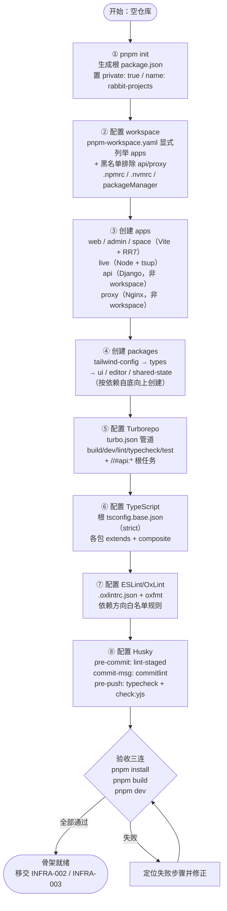
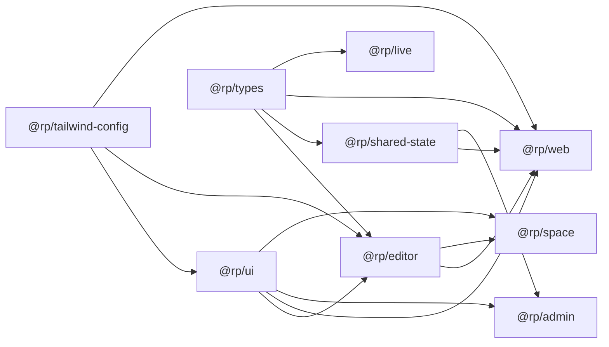

# Monorepo 工程骨架搭建

| 元信息项 | 内容 |
| --- | --- |
| 文档编号 | INFRA-001 |
| 所属模块 | INFRA（基础设施与部署运维） |
| 所属迭代 | Sprint 0 — POC 技术验证（第 1-2 周） |
| 优先级 | **P0**（POC 阻塞级） |
| 编写顺序 | Sprint 0 第 1 篇（全系统第一份可执行文档） |
| 复杂度 | 中 |
| 文档状态 | 已确认（Approved） |
| 最后更新日期 | 2026-09-01 |
| 前置依赖 | [`architecture/tech-stack.md`](../architecture/tech-stack.md)、[`architecture/monorepo-structure.md`](../architecture/monorepo-structure.md) |
| 阻塞下游 | `INFRA-002`（Dockerfile 需依赖 workspace 布局）、`INFRA-003`（Django 代码需落在 `apps/api` 结构内）、进而阻塞 Sprint 0 全部文档 |

---

## 1. 概述

### 1.1 功能定位

搭建 **pnpm workspace + Turborepo** 双层 Monorepo 工程骨架，建立 `apps/`（应用层）与 `packages/`（共享层）二分结构，交付一个"克隆即可构建、一条命令启动全部开发服务器"的仓库底座。

本文档交付的是**工程骨架**而非业务功能，具体包含四类产物：

| 产物类别 | 内容 |
| --- | --- |
| 目录结构 | `apps/{web,admin,space,api,live,proxy}` + `packages/{ui,editor,types,shared-state,tailwind-config}` + `deploy/` + `scripts/` + `.github/` |
| 包管理配置 | `pnpm-workspace.yaml`、`.npmrc`、`.nvmrc`、根 `package.json`、各包 `package.json` |
| 构建编排配置 | `turbo.json`（build / dev / lint / typecheck / test / storybook / clean + `//#api:*` 根任务） |
| 质量与规范配置 | `tsconfig.base.json` 及各包 `extends`、`.oxlintrc.json`、`commitlint.config.js`、`.husky/{pre-commit,commit-msg,pre-push}`、`.env.example` |

**它是全系统的第一块砖**：`INFRA-003` 的 Django 模型代码必须落在 `apps/api/plane/db/models/` 内，`INFRA-002` 的 Dockerfile 必须依赖本文档确立的 workspace 布局才能正确 `pnpm deploy --filter`。因此本文档是 Sprint 0 的第 1 篇，Day 1 完成。

### 1.2 目标用户

| 用户 | 使用场景 | 关注点 |
| --- | --- | --- |
| 全栈开发者（主要） | 每日开发：`pnpm dev` 起服务、改代码、跑 lint 与测试 | 启动速度、热更新可靠性、类型跳转是否直达源码 |
| 新入职成员 | 首次上手：`git clone` → `pnpm install` → `pnpm dev` | 零配置可跑通，无需口头传授隐式步骤 |
| CI 流水线 | 每次 PR：`pnpm ci:affected` 仅校验受影响包 | 缓存命中率、增量粒度 |
| 后续迭代的所有功能文档 | 所有代码都写在本骨架内 | 目录归属明确、依赖方向有强约束 |

**注意**：本文档**不面向终端用户**（产品使用者）。它没有用户界面（详见 §3）。

### 1.3 前置依赖

| 依赖文档 | 本文档消费的具体决策 |
| --- | --- |
| [`architecture/tech-stack.md`](../architecture/tech-stack.md) | §8 运行时环境矩阵（Node 22.14.x / pnpm 11.x / Python 3.12.x 的精确锁定）；`engines` + `engine-strict` + `.nvmrc` + `packageManager` 四重约束；§4.1 Yjs 跨包同版本红线；§9 依赖治理（许可证白名单、`pnpm audit`） |
| [`architecture/monorepo-structure.md`](../architecture/monorepo-structure.md) | §2 完整目录树；§3 命名规范（`@rp/<name>` scope、kebab-case 目录、`workspace:*` 引用）；§5 `pnpm-workspace.yaml` 全文与 Python/Nginx 排除理由；§5.3 `.npmrc`；§6 `turbo.json` 全文与依赖拓扑；§6.2 根 `package.json` 脚本；§7.1 依赖方向 6 条硬规则；§9 环境变量层级 |

**依赖强度**：两份文档均为**强依赖**。任何与之不一致的配置写法都视为缺陷；若实施中发现架构文档有误，走 ADR 流程回改架构文档，不在本文档中私自偏离。

### 1.4 竞品参考

#### Plane（开源，可完整对标）

Plane 的仓库结构是本骨架的直接蓝本：

| 维度 | Plane 现状 |
| --- | --- |
| 应用层 | `apps/web`（主工作台）、`apps/admin`（God Mode 实例管理）、`apps/space`（对外公开空间）、`apps/api`（Django + DRF，**排除在 pnpm workspace 外**）、`apps/live`（Node + Hocuspocus 实时协作）、`apps/proxy`（反向代理，**排除在 pnpm workspace 外**） |
| 共享层 | `packages/ui`（组件库）、`packages/editor`（TipTap 封装）、`packages/types`（TS 类型）、`packages/shared-state`（MobX stores）、`packages/tailwind-config`、`packages/eslint-config` / `typescript-config`（编译与 lint 预设） |
| 包管理 | pnpm workspace（11.3 级别），内部包一律 `workspace:*` |
| 构建编排 | Turborepo，`build` 任务 `dependsOn: ["^build"]` 自底向上 |
| 运行时 | Node ≥ 22.22，Python 侧独立由 pip / uv 管理 |

本系统**在应用层与共享层的划分上与 Plane 一比一对齐**（6 apps + 5 packages，第 6 个 `@rp/config` 在 P1 引入），这不是模仿，而是因为「三前端应用 + Django API + Node 实时服务 + 反向代理」这一拓扑是该类产品经过验证的最小完备集，重新设计只会引入未经验证的风险。

#### Ones（闭源，仅部分可参考）

Ones 未公开仓库结构，无 Monorepo 组织方式的公开信息可供对标。可获取的公开信息仅限于其应用模型层面：前端为 Vite + React 技术栈，后端服务采用 NestJS 体系（与本系统的 Django 路线不同）。

**结论**：Ones 在本文档的工程结构维度上**不适用**，无可借鉴项。它的价值集中在业务能力设计（统一 Issue Type 系统、自定义角色组、字段级权限），体现在 `unified-issue-model.md`、`rbac-permission-model.md` 与 P3 阶段文档中，与本文档无关。

---

## 2. 业务逻辑

### 2.1 初始化流程



**步骤顺序不可调换的三处**：

1. **② 必须在 ③ 之前**：`pnpm-workspace.yaml` 未就位时创建的 app 不会被 pnpm 识别为 workspace 包，`workspace:*` 引用会解析失败并回退到 npm registry 查找（报 404）。
2. **④ 内部按依赖自底向上**：`tailwind-config` → `types` → `ui` / `editor` / `shared-state`。反序创建会导致中途 `pnpm install` 因下游包引用尚不存在的上游包而失败。
3. **⑧ 最后配置**：Husky 钩子一旦生效，后续每次 commit 都要过 lint 与 commitlint。在骨架尚不完整（lint 必然报错）时启用会阻塞自身的搭建过程。

### 2.2 业务规则

#### 规则 1：包版本一致性

| 子规则 | 内容 | 违反后果 | 检查手段 |
| --- | --- | --- | --- |
| 1.1 内部包版本统一 | 全部 `packages/*` 与 `apps/*` 的 `version` 固定为 `0.1.0`，且 `private: true` | 内部包被误发布到公共 registry | CI 校验所有 workspace 包 `private === true` |
| 1.2 跨包同一依赖同一版本 | React、React Router、TypeScript、Tailwind 等在所有包中必须完全同版本 | 打包出双份 React → Hooks 报 "Invalid hook call" | `pnpm dedupe --check` 在 CI 中执行 |
| 1.3 **Yjs 家族严格同版本（红线）** | `yjs` / `y-prosemirror` / `y-protocols` 在 `apps/web`、`packages/editor`、`apps/live` 三处必须完全一致 | 协同编辑静默数据错乱，P3 阶段才暴露，排查成本极高 | 根 `pnpm.overrides` 锁定 + `scripts/check-yjs-version.mjs` 在 `pre-push` 与 CI 中双重守卫 |
| 1.4 包管理器版本锁定 | 根 `packageManager: "pnpm@11.0.0"` 精确版本（非 `^`），配合 Corepack | 不同成员用不同 pnpm 版本，产出不同 lockfile 结构导致冲突 | `packageManager` 字段 + `engine-strict=true` |
| 1.5 许可证白名单 | 仅允许 MIT / Apache-2.0 / BSD / ISC；禁止 GPL / AGPL / RSAL / SSPL | 商业化合规风险 | CI 许可证扫描（`tech-stack.md` §9） |

#### 规则 2：workspace 协议引用

| 子规则 | 内容 |
| --- | --- |
| 2.1 内部包**只能**用 `workspace:*` | 正确：`"@rp/ui": "workspace:*"`；错误：`"@rp/ui": "0.1.0"`、`"@rp/ui": "file:../ui"`。写死版本号会在发布场景被替换为 registry 查找；`file:` 协议绕过 pnpm 的软链管理，破坏 Turbo 的包图发现 |
| 2.2 依赖方向严格自底向上 | `apps/*` → `packages/*`；`packages` 内部：`tailwind-config` ← `ui` ← `editor`，`types` ← `editor` / `shared-state`。**禁止任何反向或循环依赖** |
| 2.3 `apps/*` 之间**禁止**互相依赖 | `web` 需要 `admin` 的组件 → 把组件上移至 `@rp/ui`，而非跨 app 引用 |
| 2.4 `packages/*` **禁止**依赖 `apps/*` | 共享层不得知晓应用层存在 |
| 2.5 `@rp/ui` **禁止**依赖 `@rp/shared-state` | 组件库必须与状态方案解耦，只接受 props |
| 2.6 `@rp/types` **零运行时依赖** | `dependencies` 必须为空，只输出 `.d.ts` |

上述 2.2 ~ 2.6 即 `monorepo-structure.md` §7.1 的六条硬规则，由 CI 脚本扫描各 `package.json` 的依赖名实现自动化拦截，不依赖人工 Code Review。

#### 规则 3：Python 项目排除规则

`apps/api`（Django）与 `apps/proxy`（Nginx 配置）**必须排除在 pnpm workspace 之外**，采用「白名单显式列举 + 黑名单二次排除」双保险：

```yaml
packages:
  - "apps/web"        # 白名单：逐个列举，不用 apps/*
  - "apps/admin"
  - "apps/space"
  - "apps/live"
  - "packages/*"
  - "!apps/api"       # 黑名单：即使写法被误改回 apps/* 也仍被排除
  - "!apps/api/**"
  - "!apps/proxy"
  - "!apps/proxy/**"
```

**为什么不能写 `apps/*`**（`monorepo-structure.md` §5.1 的三条后果）：

1. `apps/api` 无 `package.json`，pnpm 静默跳过，但 Turbo 的包发现依赖 pnpm workspace 输出，导致"为 api 定义根任务"时行为不一致。
2. 若为了让 Turbo 能跑 Python 命令而在 `apps/api` 放一个空 `package.json`，则 `pnpm -r install` / `pnpm -r update` / `pnpm audit` 会把它计入统计，且 IDE 会误在其中创建 `node_modules`，污染 Python 项目结构。
3. Renovate 等依赖机器人会为其生成无意义的升级 PR。

**Python 与 JS 两套体系的协同**（仅三个层面，不共享任何解析逻辑）：

| 协同层面 | 实现方式 |
| --- | --- |
| 本地一键启动 | `docker compose up` 统一编排（见 `INFRA-002`）；或根脚本 `api:*` 调用 `uv run --project apps/api ...` |
| CI 流水线 | `.github/workflows/ci.yml`（JS）与 `api-ci.yml`（Python）两条独立 workflow，各自 `paths` 过滤触发；`e2e.yml` 依赖两者产物 |
| 类型契约 | api 生成 OpenAPI schema → `scripts/gen-api-types.mjs` → `packages/types/src/generated` |

Turbo 通过根任务 `//#api:lint` / `//#api:typecheck` / `//#api:test` / `//#api:migrate` 把 Python 命令**纳入统一编排入口，但不进入 JS 依赖图**——这是"统一入口"与"体系隔离"之间的平衡点。

### 2.3 边界条件

| 环境项 | 硬性下限 | 本项目锁定值 | 校验位置 | 违反表现 |
| --- | --- | --- | --- | --- |
| Node.js | **≥ 22** | `22.14.x`（`>=22.14 <23`） | `engines.node` + `engine-strict=true` + `.nvmrc` = `22.14.0` | `pnpm install` 直接失败并打印期望版本 |
| pnpm | **≥ 11** | `11.x`（`>=11 <12`），`packageManager: pnpm@11.0.0` | `engines.pnpm` + Corepack | 同上 |
| Python | **≥ 3.12** | `3.12.x`（`>=3.12,<3.13`） | `apps/api/.python-version` + `pyproject.toml` `requires-python` | `uv sync` 失败 |
| Docker | ≥ 27 | 27+ | `INFRA-002` 中的 compose 语法版本 | `docker compose` 子命令不可用（v1 的 `docker-compose` 不支持） |
| 磁盘 | — | ≥ 5 GB 可用（`node_modules` 约 1.5 GB + Docker 镜像约 3 GB） | 无自动校验，README 中提示 | 安装中途 ENOSPC |

**注意 Node 与 Python 的下限被刻意抬高**：需求文档给出的下限是 Node 20+ / Python 3.8+，`tech-stack.md` §8 将其抬升至 22 / 3.12。原因是 React Router 7 与 Vite 6 的官方支持基线、以及 Django 5.1 与 `psycopg 3.2` 的最佳兼容区间。**以 `tech-stack.md` 为准**。

#### 其他边界条件

| 条件 | 处理方式 |
| --- | --- |
| 无网络环境首次安装 | 不支持。`pnpm install` 需访问 registry；离线场景需预置 pnpm store（P2 气隙部署议题，见 `INFRA-002` §6） |
| Windows 开发机 | 不作为一等公民支持。`.husky` 钩子与 `bin/*.sh` 依赖 POSIX shell；Windows 用户走 WSL2 |
| 大小写不敏感文件系统（macOS 默认） | 目录名统一 kebab-case 全小写，规避 `Ui` / `ui` 在 Linux CI 上解析失败 |
| `node_modules` 幽灵依赖 | `shamefully-hoist=false` 严格布局；任何未在自身 `package.json` 声明的 import 在构建期即失败 |

---

## 3. UI/UX 设计

> **本章说明：本文档为基础设施文档，无 UI 层。**
>
> INFRA-001 不交付任何用户界面、页面、组件或视觉元素。它没有终端用户，没有交互流程，没有响应式布局需求，也没有可访问性（a11y）要求。本章不提供线框图、状态图或视觉规范。
>
> 本文档的"界面"是**命令行**，其"用户体验"是**开发者体验（Developer Experience, DX）**。以下以 DX 目标替代常规 UI/UX 章节内容。

### 3.1 开发者体验设计目标

| 目标 | 具体要求 | 达标判定 |
| --- | --- | --- |
| **零配置上手** | 新成员从 `git clone` 到看到运行中的应用，只需 3 条命令，无任何口头传授的隐式步骤 | 见 §3.2 |
| **一键启动** | `pnpm dev` 启动全部所需开发服务器，无需逐个开终端 | 见 §3.3 |
| **一键构建** | `pnpm build` 按依赖拓扑自动排序构建全部包 | 见 §3.4 |
| **快速反馈** | lint 全仓库 < 2s；typecheck 增量 < 10s；HMR < 300ms | 本地实测 |
| **失败信息可行动** | 任何失败都指出「哪个包、哪条规则、怎么修」，不留下需要猜的错误 | `engine-strict` 打印期望版本；依赖方向违规打印具体包名与建议动作 |

### 3.2 首次上手路径（3 条命令）

```bash
git clone <repo> && cd RabbitProjects
cp .env.example .env          # 唯一需要手工做的一步：环境变量模板落地
pnpm install                  # 自动触发 prepare → husky 安装钩子
pnpm dev                      # 启动前端 + live 开发服务器
```

若需要完整后端（数据库 / API / 队列 / 对象存储），追加一条：

```bash
pnpm compose:up               # 见 INFRA-002
```

**设计约定**：`cp .env.example .env` 是**唯一**允许存在的手工步骤，且必须在 README 与 `pnpm install` 的 postinstall 提示中双重提醒。除此之外任何"还需要先手动改一下 xxx"都视为骨架缺陷。

### 3.3 `pnpm dev` 一键启动全部开发服务器

```bash
pnpm dev        # = turbo run dev --filter=@rp/web... --filter=@rp/live...
```

行为拆解：

| 阶段 | Turbo 行为 | 开发者感知 |
| --- | --- | --- |
| 1 | 解析 `--filter=@rp/web...`（`...` 后缀 = 该包及其全部依赖） | — |
| 2 | 因 `dev` 任务 `dependsOn: ["^build"]`，先按拓扑构建 `tailwind-config` → `types` → `ui` / `editor` / `shared-state`，产出 `.d.ts` | 首次约 20-40s，二次因缓存命中 < 2s |
| 3 | 并行启动 persistent 任务：`web` 的 Vite dev server、`live` 的 tsup watch | TUI 分栏显示各服务日志 |
| 4 | 各 package 以 `dev:watch` 增量重建，下游 Vite 自动 HMR | 改 `@rp/ui` 组件，浏览器即时刷新 |

服务与端口（与 `INFRA-002` §4 的容器端口保持一致，避免本地与容器两套心智模型）：

| 命令 | 启动的服务 | 端口 |
| --- | --- | --- |
| `pnpm dev` | `@rp/web` + `@rp/live`（及其依赖包 watch） | web `3001` / live `3000` |
| `pnpm dev:admin` | `@rp/admin` | `3002` |
| `pnpm dev:space` | `@rp/space` | `3003` |
| `pnpm dev:all` | 全部四个应用 | 3000-3003 |

**为什么 `pnpm dev` 默认只起 web + live 而非全部**：POC 与日常开发 95% 的时间只动主工作台。默认启动四个 Vite 实例会额外占用约 1.2 GB 内存与大量 CPU，拖慢 HMR。需要 admin / space 时显式使用 `dev:admin` / `dev:space`。

### 3.4 `pnpm build` 一键构建

```bash
pnpm build      # = turbo run build
```

| 特性 | 说明 |
| --- | --- |
| 拓扑自动排序 | 无需手写构建顺序，Turbo 按包图分层，每层内最大并行 |
| 缓存复用 | 输入未变的包直接命中本地缓存（`FULL TURBO`），二次构建通常 < 3s |
| 产物目录 | `dist/**`、`build/**`、`.react-router/**`（Turbo 据此判定缓存有效性） |
| 环境变量参与哈希 | `env: ["VITE_*"]`，`VITE_API_BASE_URL` 变更会正确触发重建，不会错误复用旧缓存 |

CI 中使用增量命令，仅校验受本次改动影响的包：

```bash
pnpm ci:affected   # = turbo run lint typecheck test build --filter=...[origin/main]
```

### 3.5 命令行输出规范

| 场景 | 输出要求 |
| --- | --- |
| Turbo 交互输出 | `turbo.json` 中 `"ui": "tui"`，多服务日志分栏显示，避免交错 |
| 版本不符 | 打印期望版本与当前版本，并提示 `nvm use` / `corepack enable` |
| 依赖方向违规 | 打印「`apps/web` 不得依赖 `apps/admin`；请将复用组件上移至 `@rp/ui`」 |
| Yjs 版本漂移 | 打印三处的实际版本对照表与统一建议版本 |
| commit message 不合规 | commitlint 打印 Conventional Commits 格式示例 |

---

## 4. 技术架构

### 4.1 目录结构（P0 落地范围）

```
RabbitProjects/
├── apps/
│   ├── web/                    # @rp/web    主工作台（Vite + React Router 7，SPA）
│   ├── admin/                  # @rp/admin  God Mode 实例管理后台
│   ├── space/                  # @rp/space  对外公开空间
│   ├── live/                   # @rp/live   实时协作服务（Node + Express + Hocuspocus）
│   ├── api/                    # ★ 非 pnpm workspace：Django + DRF（uv 管理）
│   │   ├── plane/
│   │   │   ├── settings/{common,local,production,test}.py
│   │   │   ├── db/{models,migrations,mixins}/
│   │   │   ├── app/{views,serializers,permissions,urls}/    # 内部 API
│   │   │   ├── api/                                        # Open API
│   │   │   ├── space/                                      # 公开 API
│   │   │   ├── authentication/  bgtasks/  middleware/  utils/
│   │   │   ├── celery.py  asgi.py  wsgi.py  urls.py
│   │   ├── tests/{conftest.py,factories/,unit/,integration/}
│   │   ├── bin/docker-entrypoint-{api,worker,beat,migrator}.sh
│   │   ├── manage.py  pyproject.toml  uv.lock  .python-version  Dockerfile
│   └── proxy/                  # ★ 非 pnpm workspace：Nginx
│       ├── nginx.conf.template
│       ├── conf.d/{upstreams,websocket,security,ratelimit}.conf
│       ├── docker-entrypoint.sh  Dockerfile
├── packages/
│   ├── ui/                     # @rp/ui              自研组件库 + Storybook
│   ├── editor/                 # @rp/editor          TipTap 封装
│   ├── types/                  # @rp/types           TS 共享类型（含 src/generated）
│   ├── shared-state/           # @rp/shared-state    MobX stores
│   └── tailwind-config/        # @rp/tailwind-config 设计 token（CSS-first）
│   # packages/config/          # @rp/config          P1 引入，P0 用根 tsconfig.base.json
├── deploy/
│   ├── compose/docker-compose{,.prod,.ci}.yml        # 见 INFRA-002
│   ├── k8s/                                          # P2+
│   └── scripts/{backup-db.sh,restore-db.sh}
├── scripts/
│   ├── check-yjs-version.mjs   # Yjs 跨包版本守卫
│   ├── gen-api-types.mjs       # OpenAPI → @rp/types
│   └── setup.sh
├── .github/workflows/{ci.yml,api-ci.yml,e2e.yml}
├── .husky/{pre-commit,commit-msg,pre-push}
├── pnpm-workspace.yaml
├── turbo.json
├── package.json
├── tsconfig.base.json
├── .npmrc  .nvmrc  .oxlintrc.json  commitlint.config.js  .env.example  .gitignore
```

> 完整目录树（含各 app / package 内部 `src/` 细分）见 [`monorepo-structure.md`](../architecture/monorepo-structure.md) §2，本文档不重复展开。

### 4.2 pnpm-workspace.yaml（完整）

```yaml
# pnpm-workspace.yaml
packages:
  # ── 白名单：显式列举 JS/TS 应用（不用 apps/*，理由见 §2.2 规则 3）──
  - "apps/web"
  - "apps/admin"
  - "apps/space"
  - "apps/live"
  # ── 共享包统一纳入 ──
  - "packages/*"
  # ── 黑名单二次排除：非 JS 项目 ──
  - "!apps/api"
  - "!apps/api/**"
  - "!apps/proxy"
  - "!apps/proxy/**"
  # ── 黑名单：构建产物目录 ──
  - "!**/dist/**"
  - "!**/build/**"
  - "!**/storybook-static/**"
  - "!**/node_modules/**"

# ── 强制统一版本：Yjs 家族跨包同版本红线（tech-stack.md §4.1）──
overrides:
  yjs: "13.6.x"
  y-protocols: "1.0.x"

# ── 允许执行构建脚本的包白名单（pnpm 10+ 默认阻止 postinstall）──
onlyBuiltDependencies:
  - esbuild
  - "@tailwindcss/oxide"
  - sharp
```

`onlyBuiltDependencies` 说明：pnpm 10 起默认阻止依赖的 `postinstall` 脚本执行（供应链安全默认值）。`esbuild`（Vite 依赖）、`@tailwindcss/oxide`（Tailwind v4 的 Rust 引擎）、`sharp`（图像处理）需下载平台原生二进制，必须显式放行。新增需放行的包必须在 PR 中说明理由。

### 4.3 .npmrc

```ini
# .npmrc
engine-strict=true              # Node/pnpm 版本不符直接失败（而非仅告警）
shamefully-hoist=false          # 严格 node_modules 布局，杜绝幽灵依赖
strict-peer-dependencies=false  # React 生态 peer 声明滞后，放宽但需人工复核
resolution-mode=highest
dedupe-peer-dependents=true
auto-install-peers=true
```

配套 `.nvmrc`：

```
22.14.0
```

### 4.4 turbo.json（完整管道）

```jsonc
// turbo.json
{
  "$schema": "https://turbo.build/schema.json",
  "ui": "tui",

  // 全局输入：变更即令所有任务缓存失效
  "globalDependencies": [
    "pnpm-lock.yaml",
    "tsconfig.base.json",
    ".oxlintrc.json"
  ],
  "globalEnv": ["NODE_ENV", "CI"],
  // 仅参与哈希、不注入进程（避免密钥进缓存 key 之外的泄露路径）
  "globalPassThroughEnv": ["VITE_API_BASE_URL", "VITE_LIVE_BASE_URL"],

  "tasks": {
    // ── 构建：先构建所有上游依赖包，再构建自身 ─────────────
    "build": {
      "dependsOn": ["^build"],
      "outputs": ["dist/**", "build/**", ".react-router/**"],
      "env": ["VITE_*"]
    },

    // ── 类型检查：依赖上游 build（需要上游 .d.ts 产物） ────
    "typecheck": {
      "dependsOn": ["^build"],
      "outputs": ["*.tsbuildinfo"]
    },

    // ── Lint：无跨包依赖，可完全并行 ─────────────────────
    "lint": {
      "dependsOn": [],
      "outputs": []
    },

    "format:check": {
      "dependsOn": [],
      "outputs": []
    },

    // ── 单元测试：依赖上游 build，产出覆盖率 ──────────────
    "test": {
      "dependsOn": ["^build"],
      "outputs": ["coverage/**"],
      "inputs": ["src/**", "tests/**", "vitest.config.*"]
    },

    // ── 开发：长驻任务，不缓存、不持久化输出 ─────────────
    "dev": {
      "dependsOn": ["^build"],
      "cache": false,
      "persistent": true
    },

    // ── 包的 watch 构建（供 dev 期间上游包热更新） ────────
    "dev:watch": {
      "cache": false,
      "persistent": true
    },

    // ── Storybook ──────────────────────────────────────
    "storybook": { "cache": false, "persistent": true },
    "build-storybook": {
      "dependsOn": ["^build"],
      "outputs": ["storybook-static/**"]
    },

    // ── 清理 ───────────────────────────────────────────
    "clean": { "cache": false },

    // ── 根级任务：包裹 Python 后端（不属于任何 workspace 包） ──
    "//#api:lint":     { "cache": false },
    "//#api:typecheck":{ "cache": false },
    "//#api:test":     { "cache": false },
    "//#api:migrate":  { "cache": false }
  }
}
```

#### 4.4.1 dependsOn 拓扑说明

`^` 前缀表示「**依赖包**（upstream dependencies）的同名任务」，无前缀表示「**本包**的其他任务」。

| 任务 | 拓扑 | 设计理由 |
| --- | --- | --- |
| `build` | `^build` → self | 严格自底向上：`tailwind-config` → `types` → `ui` / `editor` / `shared-state` → `web` / `admin` / `space`。Turbo 自动分层并在每层内最大并行 |
| `typecheck` | `^build` → self | 类型检查需上游已产出 `.d.ts`；**刻意不依赖上游 `typecheck`**——上游类型错误会在其自身 `typecheck` 任务中暴露，无需串行等待，可提升并行度 |
| `lint` | 无依赖，全并行 | OxLint 基于源码而非产物，全仓库通常 < 2s |
| `test` | `^build` → self | 单元测试 import 上游包的编译产物 |
| `dev` | `^build` → self（persistent） | 首次启动先把 packages 构建一遍产出 `.d.ts` 供 IDE 与 Vite 解析；之后各包以 `dev:watch` 增量重建 |
| `//#api:*` | 根任务，与 JS 任务无依赖关系 | 通过 `//#` 前缀定义在根包上，实现「Python 任务纳入统一编排入口，但不进入 JS 依赖图」 |

构建拓扑可视化：



### 4.5 根 package.json

```jsonc
// package.json（根）
{
  "name": "rabbit-projects",
  "private": true,
  "packageManager": "pnpm@11.0.0",
  "engines": { "node": ">=22.14 <23", "pnpm": ">=11 <12" },
  "scripts": {
    "dev":            "turbo run dev --filter=@rp/web... --filter=@rp/live...",
    "dev:all":        "turbo run dev",
    "dev:admin":      "turbo run dev --filter=@rp/admin...",
    "dev:space":      "turbo run dev --filter=@rp/space...",
    "build":          "turbo run build",
    "lint":           "turbo run lint",
    "format":         "oxfmt .",
    "typecheck":      "turbo run typecheck",
    "test":           "turbo run test",
    "test:e2e":       "playwright test",

    // 仅构建/校验受本次改动影响的包（CI 主力命令）
    "ci:affected":    "turbo run lint typecheck test build --filter=...[origin/main]",

    // Python 侧（根任务，需本地安装 uv）
    "api:lint":       "uv run --project apps/api ruff check .",
    "api:typecheck":  "uv run --project apps/api mypy plane",
    "api:test":       "uv run --project apps/api pytest",
    "api:migrate":    "uv run --project apps/api python manage.py migrate",

    // 契约同步
    "gen:api-types":  "node scripts/gen-api-types.mjs",
    "check:yjs":      "node scripts/check-yjs-version.mjs",

    "compose:up":     "docker compose -f deploy/compose/docker-compose.yml up -d",
    "compose:down":   "docker compose -f deploy/compose/docker-compose.yml down",
    "compose:logs":   "docker compose -f deploy/compose/docker-compose.yml logs -f",

    "prepare":        "husky"
  },
  "devDependencies": {
    "turbo": "2.5.x",
    "typescript": "5.8.x",
    "oxlint": "1.x",
    "oxfmt": "latest",
    "husky": "9.1.x",
    "lint-staged": "15.x",
    "@commitlint/cli": "19.x",
    "@commitlint/config-conventional": "19.x",
    "@playwright/test": "1.5x",
    "vitest": "3.x"
  }
}
```

**根 `dependencies` 必须为空**：根包不承载任何运行时依赖，所有运行时依赖归属具体的 app / package。CI 中校验 `dependencies` 字段不存在或为空对象。

### 4.6 各 app 的 package.json 关键配置

#### apps/web（`@rp/web`）— 主工作台

```jsonc
{
  "name": "@rp/web",
  "version": "0.1.0",
  "private": true,
  "type": "module",
  "scripts": {
    "dev":       "react-router dev --port 3001",
    "build":     "react-router build",
    "start":     "react-router-serve ./build/server/index.js",
    "lint":      "oxlint app",
    "typecheck": "react-router typegen && tsc --noEmit",
    "test":      "vitest run"
  },
  "dependencies": {
    "@rp/ui": "workspace:*",
    "@rp/editor": "workspace:*",
    "@rp/types": "workspace:*",
    "@rp/shared-state": "workspace:*",
    "@rp/tailwind-config": "workspace:*",
    "react": "19.1.x",
    "react-dom": "19.1.x",
    "react-router": "7.x",
    "@react-router/node": "7.x",
    "mobx": "6.13.x",
    "mobx-react-lite": "4.1.x",
    "swr": "2.3.x",
    "axios": "1.8.x",
    "@atlaskit/pragmatic-drag-and-drop": "1.7.x",
    "lucide-react": "latest",
    "zod": "3.25.x"
  },
  "devDependencies": {
    "@react-router/dev": "7.x",
    "@tailwindcss/vite": "4.1.x",
    "tailwindcss": "4.1.x",
    "vite": "6.3.x",
    "typescript": "5.8.x",
    "oxlint": "1.x",
    "vitest": "3.x"
  }
}
```

关键点：

- `typecheck` 前置 `react-router typegen`：React Router 7 Framework Mode 的路由类型是生成产物，不生成会导致 `tsc` 报路由类型缺失。
- `react-router.config.ts` 中设 `ssr: false`（SPA 模式，`tech-stack.md` 决策），配合 Nginx 的 `try_files` fallback。
- 全部 5 个内部包一律 `workspace:*`。

#### apps/admin（`@rp/admin`）— God Mode

与 `web` 同构，差异：

| 项 | 值 |
| --- | --- |
| 端口 | `3002` |
| 内部包依赖 | `@rp/ui`、`@rp/shared-state`、`@rp/types`、`@rp/tailwind-config`（**不依赖 `@rp/editor`**，无富文本场景） |
| 路由 basename | `/god-mode`（与 Nginx 路由前缀一致，见 `INFRA-002` §4） |
| 拖拽依赖 | 无 |

#### apps/space（`@rp/space`）— 公开空间

| 项 | 值 |
| --- | --- |
| 端口 | `3003` |
| 内部包依赖 | `@rp/ui`、`@rp/editor`（只读模式渲染公开文档）、`@rp/types`、`@rp/tailwind-config`（**不依赖 `@rp/shared-state`**，匿名访客无用户态 store） |
| 路由 basename | `/spaces` |
| API 分组 | 只调用 `/api/v1/public/` |

#### apps/live（`@rp/live`）— 实时协作服务

```jsonc
{
  "name": "@rp/live",
  "version": "0.1.0",
  "private": true,
  "type": "module",
  "main": "dist/index.js",
  "scripts": {
    "dev":       "tsup --watch --onSuccess \"node dist/index.js\"",
    "build":     "tsup",
    "lint":      "oxlint src",
    "typecheck": "tsc --noEmit",
    "test":      "vitest run"
  },
  "dependencies": {
    "@rp/types": "workspace:*",
    "@hocuspocus/server": "2.15.x",
    "express": "4.21.x",
    "yjs": "13.6.x",
    "y-prosemirror": "1.3.x",
    "y-protocols": "1.0.x",
    "zod": "3.25.x"
  },
  "devDependencies": { "tsup": "8.x", "typescript": "5.8.x", "oxlint": "1.x", "vitest": "3.x" }
}
```

关键点：

- 端口 `3000`；环境变量以 zod 做 **fail-fast** 校验（缺失即启动失败，不静默取默认值）。
- Yjs 家族三个包的版本必须与 `apps/web`、`packages/editor` 完全一致，由 `pnpm.overrides` + `scripts/check-yjs-version.mjs` 守卫。
- **P0 阶段仅要求容器可启动、健康检查可通过、Nginx WebSocket upgrade 路由可达**，不承载业务功能（协同编辑在 P3）。

#### apps/api（Django）与 apps/proxy（Nginx）

**二者无 `package.json`**，不属于 pnpm workspace。

| 项目 | 依赖管理 | 关键文件 | 纳入 Turbo 的方式 |
| --- | --- | --- | --- |
| `apps/api` | `uv`（`pyproject.toml` + `uv.lock`），`requires-python = ">=3.12,<3.13"` | `manage.py`、`.python-version` = `3.12`、`Dockerfile` | 根任务 `//#api:lint` / `//#api:typecheck` / `//#api:test` / `//#api:migrate` |
| `apps/proxy` | 无（纯配置） | `nginx.conf.template`、`conf.d/*.conf`、`docker-entrypoint.sh`、`Dockerfile` | 不纳入 Turbo，仅由 `docker compose build` 消费 |

### 4.7 各 package 的 package.json 关键配置

五个共享包共同遵守的约定：

```jsonc
{
  "name": "@rp/<name>",
  "version": "0.1.0",       // 全部内部包统一 0.1.0
  "private": true,          // 严禁发布
  "type": "module",
  "exports": {              // 用 exports 而非 main，支持子路径导出与条件导出
    ".": { "types": "./dist/index.d.ts", "import": "./dist/index.js" }
  },
  "files": ["dist"],
  "scripts": {
    "build":     "tsup",
    "dev:watch": "tsup --watch",
    "lint":      "oxlint src",
    "typecheck": "tsc --noEmit",
    "clean":     "rm -rf dist .turbo *.tsbuildinfo"
  }
}
```

各包的差异化配置：

| 包 | `dependencies` | `peerDependencies` | 附加脚本 | 特殊约束 |
| --- | --- | --- | --- | --- |
| `@rp/tailwind-config` | 无 | `tailwindcss: 4.1.x` | 无 `build`（纯 CSS 产物，`exports` 直接指向 `./theme.css` / `./preset.css` / `./dark.css`） | Tailwind v4 CSS-first，**不导出 JS config** |
| `@rp/types` | **必须为空** | 无 | 无 | 只输出 `.d.ts`；含 `src/generated/`（由 `gen:api-types` 写入，`.gitignore` 之外——需入库以便离线构建） |
| `@rp/ui` | `@rp/tailwind-config: workspace:*`、`@headlessui/react` 2.2.x、`lucide-react`、`clsx`、`tailwind-merge` | `react` 19.1.x、`react-dom` 19.1.x | `storybook`、`build-storybook` | **禁止**依赖 `@rp/types`（业务实体类型）与 `@rp/shared-state`；**禁止**发起网络请求；新组件无 story 不予合并 |
| `@rp/editor` | `@rp/ui`、`@rp/types`、`@rp/tailwind-config`（均 `workspace:*`）、`@tiptap/*` 2.14.x、`yjs` 13.6.x、`y-prosemirror` 1.3.x | `react`、`react-dom` | 无 | ProseMirror schema 必须全仓库唯一（`apps/live` 复用其 schema 做服务端安全校验） |
| `@rp/shared-state` | `@rp/types: workspace:*`、`mobx` 6.13.x、`swr` 2.3.x、`axios` 1.8.x | `react`、`mobx-react-lite` | 无 | **禁止**依赖 `@rp/ui`（状态层不知晓 UI）；业务组件不得直连 axios，统一经本包的 service 层 |

**`peerDependencies` 而非 `dependencies` 放置 React 的原因**：避免 pnpm 严格布局下每个包各自装一份 React，导致运行时出现多份 React 实例、Hooks 抛 "Invalid hook call"。React 由 app 层唯一提供。

### 4.8 TypeScript 配置层级

采用**单一根基线 + 各包 extends** 的两级结构。P0 阶段基线放在根 `tsconfig.base.json`；包数量超过 6 个时抽出 `@rp/config`（P1）。

```
tsconfig.base.json                 ← 唯一编译行为基线（strict 全开）
├── packages/ui/tsconfig.json      extends ../../tsconfig.base.json
├── packages/editor/tsconfig.json  extends ../../tsconfig.base.json
├── packages/types/tsconfig.json   extends ../../tsconfig.base.json
├── packages/shared-state/…        extends ../../tsconfig.base.json
├── apps/web/tsconfig.json         extends ../../tsconfig.base.json + RR7 生成类型
├── apps/admin/tsconfig.json       extends ../../tsconfig.base.json
├── apps/space/tsconfig.json       extends ../../tsconfig.base.json
└── apps/live/tsconfig.json        extends ../../tsconfig.base.json（Node 环境 lib）
```

```jsonc
// tsconfig.base.json（根）
{
  "compilerOptions": {
    "target": "ES2022",
    "lib": ["ES2023", "DOM", "DOM.Iterable"],
    "module": "ESNext",
    "moduleResolution": "bundler",
    "jsx": "react-jsx",

    // ── strict 全开，逐项显式声明（不依赖 strict 的隐式集合，便于审计）──
    "strict": true,
    "noUncheckedIndexedAccess": true,
    "noImplicitOverride": true,
    "noFallthroughCasesInSwitch": true,
    "exactOptionalPropertyTypes": true,
    "verbatimModuleSyntax": true,

    "isolatedModules": true,
    "esModuleInterop": true,
    "skipLibCheck": true,
    "resolveJsonModule": true,
    "declaration": true,
    "declarationMap": true,
    "sourceMap": true,
    "noEmit": false,
    "incremental": true
  },
  "exclude": ["node_modules", "dist", "build", "storybook-static"]
}
```

```jsonc
// packages/ui/tsconfig.json（各包示例）
{
  "extends": "../../tsconfig.base.json",
  "compilerOptions": {
    "outDir": "dist",
    "rootDir": "src",
    "tsBuildInfoFile": "ui.tsbuildinfo"
  },
  "include": ["src"]
}
```

```jsonc
// apps/live/tsconfig.json（Node 环境差异）
{
  "extends": "../../tsconfig.base.json",
  "compilerOptions": {
    "lib": ["ES2023"],          // 无 DOM
    "types": ["node"],
    "outDir": "dist",
    "rootDir": "src"
  },
  "include": ["src"]
}
```

**关键约定**：

| 约定 | 理由 |
| --- | --- |
| `tsconfig.base.json` 列入 `turbo.json` 的 `globalDependencies` | 改动编译基线必须令全仓库缓存失效，否则会用旧编译行为的缓存产物 |
| `strict` 相关选项**逐项显式列出** | `strict: true` 的隐含集合随 TS 版本变化，显式列出可在升级 TS 时明确感知行为变更 |
| `skipLibCheck: true` | 第三方 `.d.ts` 的类型错误不应阻塞本项目构建 |
| 包间类型跳转指向源码 | 各包 `exports.types` 指向 `dist/*.d.ts`（有 `declarationMap`），IDE 可经 sourcemap 跳回 `src` |
| 禁止使用 `paths` 做包间别名 | 一律走 `workspace:*` + `exports`，与运行时解析行为一致，避免"IDE 能跳但构建报错" |

### 4.9 Tailwind 共享配置

Tailwind v4 采用 **CSS-first** 配置（`@theme` 块替代 `tailwind.config.js`），因此 `@rp/tailwind-config` **不导出 JS config**，而是导出可被 `@import` 的 CSS 文件：

```
packages/tailwind-config/
├── theme.css      # @theme 块：语义色板、字号阶梯、间距、圆角、阴影、动画时长
├── preset.css     # 基础层规范：滚动条、focus-visible、选中态
├── dark.css       # 暗色主题变量覆盖
└── package.json
```

```jsonc
// packages/tailwind-config/package.json
{
  "name": "@rp/tailwind-config",
  "version": "0.1.0",
  "private": true,
  "exports": {
    "./theme.css":  "./theme.css",
    "./preset.css": "./preset.css",
    "./dark.css":   "./dark.css"
  },
  "peerDependencies": { "tailwindcss": "4.1.x" }
}
```

```css
/* packages/tailwind-config/theme.css（片段） */
@theme {
  /* 语义色板 —— 业务代码只允许引用语义名，不得写任意色值 */
  --color-brand-50:  #eef4ff;
  --color-brand-500: #3f76ff;
  --color-brand-600: #2f5fe0;

  /* 工作项状态色（与 unified-issue-model.md §5 的种子状态色一致）*/
  --color-state-backlog:   #9ca3af;
  --color-state-started:   #3b82f6;
  --color-state-completed: #10b981;
  --color-state-cancelled: #6b7280;

  /* 优先级色 */
  --color-priority-urgent: #ef4444;
  --color-priority-high:   #f59e0b;

  --radius-card: 0.5rem;
  --duration-fast: 120ms;
}
```

各 app 的接入方式（三个 app 与 Storybook 完全一致）：

```css
/* apps/web/app/styles/app.css */
@import "tailwindcss";
@import "@rp/tailwind-config/theme.css";
@import "@rp/tailwind-config/preset.css";
```

```ts
// apps/web/vite.config.ts
import { reactRouter } from "@react-router/dev/vite";
import tailwindcss from "@tailwindcss/vite";
import { defineConfig } from "vite";

export default defineConfig({
  plugins: [tailwindcss(), reactRouter()],
  server: { port: 3001 },
});
```

**硬性约束**：新增颜色 / 字号必须改 `@rp/tailwind-config`，禁止在业务代码中写任意值。`bg-[#3f76ff]` 形式在 CI lint 中告警（`monorepo-structure.md` §4 packages/tailwind-config 条目）。这保证设计 token 全局唯一来源。

### 4.10 环境变量 .env 层级设计

#### 文件层级

| 文件 | 是否入库 | 作用 |
| --- | --- | --- |
| `/.env.example` | ✅ 入库 | **唯一模板**，含全部变量的键、示例值与注释。新增变量必须同步此文件 |
| `/.env` | ❌ gitignore | 本地实际值。`docker compose` 自动读取，`Vite` 经 `envDir` 读取 |
| `/apps/<app>/.env.example` | ✅ 入库 | 仅当该 app 有独占变量时存在（P0 阶段仅 `apps/live` 需要） |
| `/apps/<app>/.env.local` | ❌ gitignore | 单 app 覆盖，优先级最高 |

#### 加载优先级（四套独立机制）

| 消费方 | 加载机制 | 优先级 |
| --- | --- | --- |
| Vite（web/admin/space） | `envDir` 指向仓库根，只暴露 `VITE_` 前缀变量到浏览器 | `.env.local` > `.env.<mode>` > `.env` |
| Django（api） | `django-environ` 读取 `os.environ`；容器内由 compose 注入 | 进程环境变量 > `.env` 文件 |
| live（Node） | 启动时 zod schema **fail-fast** 校验，缺失即退出 | 进程环境变量 |
| Docker Compose | 根 `.env` 做 `${VAR}` 插值 + `environment:` 显式注入 | shell 环境 > `.env` |

#### 变量分类与命名前缀

| 前缀 | 归属 | 是否暴露浏览器 | 示例 |
| --- | --- | --- | --- |
| `VITE_*` | 前端三应用 | ✅ **是** | `VITE_API_BASE_URL=/api/v1`、`VITE_LIVE_BASE_URL=/live` |
| 无前缀 | Django | ❌ | `SECRET_KEY`、`DEBUG`、`DATABASE_URL`、`CELERY_BROKER_URL`、`REDIS_URL` |
| `AWS_*` / `MINIO_*` | 对象存储 | ❌ | `AWS_ACCESS_KEY_ID`、`AWS_S3_BUCKET_NAME`、`MINIO_ROOT_USER` |
| `LIVE_*` / `API_INTERNAL_*` | live 服务 | ❌ | `LIVE_PORT=3000`、`API_INTERNAL_URL=http://api:8000` |
| `NGINX_*` / `*_UPSTREAM` | proxy | ❌ | `NGINX_PORT=80`、`WEB_UPSTREAM=web:3001` |
| `POSTGRES_*` / `RABBITMQ_*` | 基础设施容器 | ❌ | `POSTGRES_USER=rp`、`RABBITMQ_DEFAULT_USER=rp` |

#### .env.example（P0 关键片段）

```ini
# ─────────────── 全局 ───────────────
APP_BASE_URL=http://localhost
NODE_ENV=development
DEBUG=1

# ─────────────── 前端（暴露浏览器，严禁放密钥）───────────────
VITE_API_BASE_URL=/api/v1
VITE_LIVE_BASE_URL=/live

# ─────────────── Django ───────────────
SECRET_KEY=change-me-in-production
DATABASE_URL=postgresql://rp:rp@db:5432/rabbit_projects
REDIS_URL=redis://redis:6379/0
CELERY_BROKER_URL=amqp://rp:rp@mq:5672//
CELERY_RESULT_BACKEND=redis://redis:6379/1

# ─────────────── 基础设施 ───────────────
POSTGRES_USER=rp
POSTGRES_PASSWORD=rp
POSTGRES_DB=rabbit_projects
RABBITMQ_DEFAULT_USER=rp
RABBITMQ_DEFAULT_PASS=rp
MINIO_ROOT_USER=minioadmin
MINIO_ROOT_PASSWORD=minioadmin
AWS_S3_ENDPOINT_URL=http://minio:9000
AWS_S3_BUCKET_NAME=rp-uploads

# ─────────────── live ───────────────
LIVE_PORT=3000
API_INTERNAL_URL=http://api:8000

# ─────────────── proxy ───────────────
NGINX_PORT=80
```

#### 红线：`VITE_` 前缀绝不放密钥

`VITE_` 前缀变量在构建期被**内联进浏览器 bundle**，等同于公开。

**防护**：CI 中扫描 `.env.example` 与代码中的 `VITE_` 变量名，若匹配 `SECRET|KEY|TOKEN|PASSWORD|CREDENTIAL` 则**直接阻断流水线**（`monorepo-structure.md` §9）。

### 4.11 代码质量工具链配置

#### OxLint + oxfmt

```jsonc
// .oxlintrc.json
{
  "plugins": ["react", "typescript", "import"],
  "categories": { "correctness": "error", "suspicious": "warn", "pedantic": "off" },
  "rules": {
    "no-console": "error",              // 生产代码禁止 console，日志走统一封装
    "typescript/no-explicit-any": "error",
    "import/no-cycle": "error",         // 循环依赖直接失败
    "react/jsx-key": "error"
  },
  "ignorePatterns": ["dist", "build", "storybook-static", "**/generated/**"]
}
```

选用 OxLint（Rust 实现）而非 ESLint 的理由见 `tech-stack.md`：全仓库 lint 从数十秒降至 2s 内，使其可放入 `pre-commit` 钩子而不损害提交体验。

#### Husky + lint-staged + commitlint

```bash
# .husky/pre-commit
pnpm lint-staged
```

```bash
# .husky/commit-msg
pnpm commitlint --edit "$1"
```

```bash
# .husky/pre-push
pnpm typecheck && pnpm check:yjs
```

```jsonc
// package.json 片段
{
  "lint-staged": {
    "*.{ts,tsx,js,mjs}": ["oxlint --fix", "oxfmt"],
    "*.{json,md,css}": ["oxfmt"],
    "apps/api/**/*.py": ["uv run --project apps/api ruff check --fix", "uv run --project apps/api ruff format"]
  }
}
```

```js
// commitlint.config.js
export default {
  extends: ["@commitlint/config-conventional"],
  rules: {
    "scope-enum": [2, "always", [
      "web", "admin", "space", "live", "api", "proxy",
      "ui", "editor", "types", "shared-state", "tailwind-config",
      "deps", "ci", "docs", "compose",
    ]],
  },
};
```

**钩子职责划分原则**：`pre-commit` 只做**快**的事（lint + format，秒级）；`pre-push` 才做**慢**的事（typecheck + Yjs 版本校验，十秒级）。把 typecheck 放进 `pre-commit` 会让每次提交等待过久，开发者会开始滥用 `--no-verify`，反而使钩子形同虚设。

#### scripts/check-yjs-version.mjs（职责说明）

读取 `apps/web`、`packages/editor`、`apps/live` 三处 `package.json` 中 `yjs` / `y-prosemirror` / `y-protocols` 的声明版本，以及 `pnpm-lock.yaml` 中的实际解析版本，任一不一致则打印对照表并以非零码退出。在 `pre-push` 与 CI 中双重执行。

---

## 5. 测试用例

> 本文档的"测试"对象是**工程骨架本身**，测试手段是命令行断言而非业务断言。全部用例在 CI（`.github/workflows/ci.yml`）中自动执行。

### 5.1 单元测试

| ID | 用例 | 步骤 | 预期结果 |
| --- | --- | --- | --- |
| UT-01 | **`pnpm install` 无幽灵依赖** | ① 全新环境（`rm -rf node_modules **/node_modules`）；② `pnpm install --frozen-lockfile`；③ `pnpm build` | 安装成功；构建过程中**无任何** "Cannot find module" —— 证明 `shamefully-hoist=false` 下每个包的 import 都有显式声明。若某包依赖了未声明的传递依赖，构建期必然失败 |
| UT-02 | 幽灵依赖负向验证 | 在 `packages/ui/src` 中临时 `import dayjs from "dayjs"`（未在其 `package.json` 声明，但存在于其他包） | `pnpm build --filter=@rp/ui` **失败**并提示模块无法解析。验证完毕后回滚 |
| UT-03 | lockfile 一致性 | `pnpm install --frozen-lockfile` | 零错误。若 `package.json` 与 `pnpm-lock.yaml` 不同步则失败（防止漏提交 lockfile） |
| UT-04 | 内部包 `private` 校验 | 脚本遍历全部 workspace 包的 `package.json` | 每个包 `private === true` 且 `version === "0.1.0"` |
| UT-05 | 依赖方向硬规则 | 脚本检查各 `package.json` 的 `dependencies` 键名 | ① 无 `apps/*` 互相依赖；② `packages/*` 不含任何 `@rp/web\|admin\|space\|live`；③ `@rp/ui` 不含 `@rp/shared-state` 与 `@rp/types`；④ `@rp/types` 的 `dependencies` 为空 |
| UT-06 | 无循环依赖 | `oxlint` 的 `import/no-cycle` + Turbo 包图构建 | Turbo 不报 "cyclic dependency"；lint 零 error |
| UT-07 | **Yjs 版本一致性** | `pnpm check:yjs` | 三处的 `yjs` / `y-prosemirror` / `y-protocols` 声明版本与 lockfile 解析版本完全一致，退出码 0 |
| UT-08 | Node/pnpm 版本门禁 | 用 Node 20 执行 `pnpm install` | 因 `engine-strict=true` **立即失败**并打印期望版本 `>=22.14 <23` |
| UT-09 | `VITE_` 密钥泄露扫描 | 扫描 `.env.example` 与源码中的 `VITE_` 变量名 | 无匹配 `SECRET\|KEY\|TOKEN\|PASSWORD\|CREDENTIAL` 者；否则失败 |
| UT-10 | 许可证白名单 | 依赖树许可证扫描 | 无 GPL / AGPL / RSAL / SSPL |

### 5.2 集成测试

| ID | 用例 | 命令 | 预期结果 |
| --- | --- | --- | --- |
| IT-01 | **`pnpm build` 所有包构建成功** | `pnpm build` | 退出码 0；`packages/{ui,editor,types,shared-state}/dist/` 与 `apps/{web,admin,space}/build/`、`apps/live/dist/` 全部产出；构建顺序符合 §4.4.1 拓扑（`tailwind-config`/`types` 早于 `ui`/`editor`，早于 `web`） |
| IT-02 | **`turbo run typecheck` 通过** | `turbo run typecheck` | 全部包退出码 0。TS strict 全开下零 error；`apps/web` 的路由类型已由 `react-router typegen` 生成 |
| IT-03 | `pnpm lint` 通过 | `pnpm lint` | 零 error；全仓库耗时 < 5s |
| IT-04 | Turbo 缓存有效性 | ① `pnpm build`；② 不改任何文件再 `pnpm build` | 第二次输出 `FULL TURBO`，耗时 < 3s，全部任务 cache hit |
| IT-05 | Turbo 缓存正确失效 | ① `pnpm build`；② 修改 `packages/ui/src/button.tsx`；③ `pnpm build` | `@rp/ui` 及其**全部下游**（`editor`/`web`/`admin`/`space`）重建；`@rp/types`、`@rp/shared-state` 仍 cache hit |
| IT-06 | 全局依赖变更令全量失效 | 修改 `tsconfig.base.json` 后 `pnpm build` | **全部包**缓存失效并重建（验证 `globalDependencies` 生效） |
| IT-07 | 环境变量参与缓存哈希 | ① `VITE_API_BASE_URL=/api/v1 pnpm build`；② 改为 `/api/v2` 再 build | 第二次不命中缓存，`apps/*` 重建 |
| IT-08 | 增量 CI 命令 | 在仅改动 `packages/shared-state` 的分支上执行 `pnpm ci:affected` | 仅 `@rp/shared-state` 及其下游（`web`/`admin`）参与，`@rp/ui`/`@rp/editor` 被跳过 |
| IT-09 | Python 根任务可用 | `pnpm api:lint`、`pnpm api:typecheck` | ruff 与 mypy 均退出码 0（依赖 `INFRA-003` 的代码就位；骨架阶段空项目亦应通过） |
| IT-10 | Husky 钩子生效 | ① `pnpm install`；② 提交一条不合规 message（如 `update`） | `.husky/` 钩子已安装；commitlint 拒绝该提交并打印 Conventional Commits 示例 |
| IT-11 | Tailwind token 单一来源 | 在 `apps/web` 中写 `className="bg-[#3f76ff]"` 后 `pnpm lint` | 触发告警（任意色值检查） |
| IT-12 | 类型契约生成链路 | `pnpm gen:api-types` | `packages/types/src/generated/` 产出 TS 类型；`pnpm build --filter=@rp/types` 通过 |

### 5.3 E2E 测试

| ID | 用例 | 步骤 | 预期结果 |
| --- | --- | --- | --- |
| E2E-01 | **`pnpm dev` 全部服务可访问** | ① `pnpm dev:all`；② 等待各服务就绪；③ 逐个 `curl -sf` | `http://localhost:3001`（web）、`:3002`（admin）、`:3003`（space）返回 200 且含 HTML；`:3000/health`（live）返回 200 |
| E2E-02 | 新成员三命令上手 | 全新容器内：`git clone` → `cp .env.example .env` → `pnpm install` → `pnpm dev` | 全程无需任何未写在 README 中的额外操作；浏览器可打开 web |
| E2E-03 | HMR 生效 | ① `pnpm dev`；② 打开 `:3001`；③ 修改 `apps/web/app/root.tsx` 中的文本 | 浏览器 < 1s 内自动更新，无整页刷新 |
| E2E-04 | 跨包 HMR 生效 | ① `pnpm dev`；② 修改 `packages/ui/src/button.tsx` 的样式 | `@rp/ui` 经 `dev:watch` 增量重建，web 页面自动反映变更 |
| E2E-05 | Storybook 可启动 | `pnpm --filter=@rp/ui storybook` | 可访问 Storybook 首页，`@rp/ui` 组件 story 正常渲染 |
| E2E-06 | 端口冲突可诊断 | 先占用 3001，再 `pnpm dev` | 明确报错指出端口被占用与所属服务，而非静默失败或无限等待 |
| E2E-07 | 全新克隆构建（**验收主用例**） | 全新目录：`git clone && pnpm install && pnpm build` | 全程零错误 |

### 5.4 边界与异常测试

| ID | 场景 | 预期表现 |
| --- | --- | --- |
| BT-01 | Node 版本过低（20.x） | `pnpm install` 立即失败，打印期望版本 |
| BT-02 | pnpm 版本过低（10.x） | 同上（`engines.pnpm` + Corepack 校验） |
| BT-03 | `apps/api` 被误纳入 workspace | 若有人把 `pnpm-workspace.yaml` 改回 `apps/*`，黑名单 `!apps/api` 仍生效；CI 中额外断言 `pnpm ls -r --depth=-1` 输出不含 `api` / `proxy` |
| BT-04 | 内部包引用写成固定版本号 | `pnpm install` 尝试从 registry 拉取 `@rp/ui@0.1.0` 并失败（404）；CI 断言所有 `@rp/*` 依赖值以 `workspace:` 开头 |
| BT-05 | `.env` 缺失 | Vite 使用 `.env.example` 中的默认值仍可启动前端；`apps/live` 因 zod fail-fast **拒绝启动**并打印缺失的变量名（这是预期行为，不是缺陷） |
| BT-06 | 磁盘空间不足 | `pnpm install` 报 ENOSPC；README 中标注 ≥ 5 GB 要求 |
| BT-07 | 循环依赖被引入 | 有人让 `@rp/types` 依赖 `@rp/ui` → Turbo 构建报 cyclic dependency；`import/no-cycle` 报 error |

---

## 6. 竞品对标

### 6.1 Plane Monorepo 结构分析

| 维度 | Plane | 说明 |
| --- | --- | --- |
| 应用数 | **6 个 app** | `web`、`admin`、`space`、`api`（Python）、`live`（Node）、`proxy`（反向代理） |
| 共享包数 | **6 个 package** | `ui`、`editor`、`types`、`shared-state`、`tailwind-config`、`eslint-config` / `typescript-config`（编译与 lint 预设） |
| 包管理器 | pnpm **11.3** 级别 | 内部包一律 `workspace:*` |
| 构建编排 | Turborepo | `build` 任务 `dependsOn: ["^build"]` |
| Node 版本 | **≥ 22.22** | `engines` 约束 |
| Python 管理 | 独立（pip / uv），**不在 pnpm workspace 内** | 见 §6.3 |
| 反向代理 | Caddy | 见 `INFRA-002` §6 |

### 6.2 Plane 的包间依赖关系

| 包 | 职责 | 被谁依赖 | 关键设计 |
| --- | --- | --- | --- |
| `@plane/ui` | 无业务语义的基础组件库（Button / Input / Dialog / Dropdown / Avatar / Tooltip …） | `web`、`admin`、`space`、`editor` | 只接受 props，不发网络请求，不依赖状态层。这一约束使其可被三端与 Storybook 无差别复用 |
| `@plane/editor` | TipTap / ProseMirror 封装，含 schema、扩展、协同绑定 | `web`、`space`（只读模式） | ProseMirror schema 全仓库唯一——这是必须成包的核心原因：schema 不一致会导致文档内容在不同应用中解析出不同结构 |
| `@plane/types` | TypeScript 类型定义，前后端契约的前端落点 | 几乎所有包 | 零运行时依赖，只输出 `.d.ts` |
| `@plane/shared-state` | 跨应用共享的状态逻辑 | `web`、`admin` | Plane 的 MobX store **主体仍在 `apps/web` 内**，该包只承载少量共享部分 |

### 6.3 Plane 将 Python 排除在 pnpm workspace 外的设计

Plane 的 `apps/api` 是 Django 项目，**不含 `package.json`**，不被 `pnpm-workspace.yaml` 纳入。两套依赖体系（pnpm 与 pip/uv）完全并行，各自有独立 lockfile、独立 CI workflow、独立 Dockerfile。

**这是合理设计，本系统完整继承**（`tech-stack.md` §6.1 明确标注为"✅ 一致"）。理由：

| 若强行纳入 | 后果 |
| --- | --- |
| 为 Python 项目放一个空 `package.json` | `pnpm -r install` / `update` / `audit` 把它计入统计；IDE 在其中创建 `node_modules` 污染 Python 项目结构；Renovate 生成无意义 PR |
| 用 Turbo 的 `dependsOn` 表达 Python 与 JS 的构建依赖 | 二者实际上**没有构建期依赖**（只有运行期 HTTP 与契约生成两层松耦合）。强行建模会引入虚假依赖，损害并行度 |

本系统在此之上做了一处**改进**：通过 Turbo 的 `//#api:*` 根任务把 Python 命令纳入统一编排入口（`pnpm api:lint` / `api:test` / `api:migrate`），使开发者有单一命令入口，但这些任务**不进入 JS 依赖图**、不参与缓存（`cache: false`）。做到"入口统一、体系隔离"。

### 6.4 本系统与 Plane 的一致性

| 设计点 | Plane | 本系统 | 状态 |
| --- | --- | --- | --- |
| Monorepo 工具 | pnpm workspace + Turborepo | 同 | ✅ 一致 |
| 前端三应用拆分 | `web` / `admin` / `space` | 同 | ✅ 一致 |
| 独立 live 服务承载协同 | Node + Hocuspocus + Yjs | 同 | ✅ 一致 |
| 反向代理独立成 app | `apps/proxy` | 同 | ✅ 一致 |
| Python 排除在 workspace 外 | ✅ | ✅ | ✅ 一致 |
| 自研组件库成包 | `@plane/ui` | `@rp/ui` | ✅ 一致 |
| 编辑器成包 | `@plane/editor` | `@rp/editor` | ✅ 一致 |
| 类型成包 | `@plane/types` | `@rp/types` | ✅ 一致 |
| 内部包引用协议 | `workspace:*` | 同 | ✅ 一致 |
| `build` 拓扑 | `dependsOn: ["^build"]` | 同 | ✅ 一致 |
| Node 下限 | ≥ 22.22 | ≥ 22.14（`<23`，并锁 `.nvmrc` 22.14.0） | ⚠️ 略低但同大版本，且上限更严 |

### 6.5 本系统的改进点

| # | 改进点 | Plane 现状 | 本系统 | 收益 |
| --- | --- | --- | --- | --- |
| 1 | **部署编排收敛** | compose 文件散落仓库根与多处 | 统一收敛至 `deploy/compose/`（`docker-compose{,.prod,.ci}.yml`） | 部署配置单一入口，环境差异一目了然 |
| 2 | **MobX store 独立成包** | store 主体位于 `apps/web` 内 | 抽出 `@rp/shared-state`，三端共享 | `admin`/`space` 可复用用户与权限 store；看板分组、筛选求值等高价值逻辑可脱离 UI 单测 |
| 3 | **类型自动生成** | 类型主要手写维护 | `scripts/gen-api-types.mjs` 从 drf-spectacular 的 OpenAPI schema 生成 `@rp/types/src/generated` | 消除手写类型与后端契约的漂移 |
| 4 | **Tailwind v4 CSS-first** | JS preset（v3 时代） | `@rp/tailwind-config` 导出 CSS token（`@theme`） | 设计 token 单一来源，Storybook 与三端零配置对齐 |
| 5 | **共享编译配置成包** | 各包自带 tsconfig，存在行为漂移 | P0 单一根 `tsconfig.base.json`（列入 `globalDependencies`），P1 抽 `@rp/config` | 消除包间编译行为差异 |
| 6 | **Yjs 版本守卫** | 依靠人工注意 | `pnpm.overrides` 锁定 + `check-yjs-version.mjs` 在 `pre-push` 与 CI 双重执行 | 阻断"P3 才暴露、排查成本极高"的静默数据错乱风险 |
| 7 | **`//#api:*` 根任务** | 无统一入口，Python 命令需手工 cd | 统一入口 `pnpm api:*` | 单一命令入口，且不污染 JS 依赖图 |
| 8 | **Storybook 作为强制交付物** | 有但覆盖有限 | `@rp/ui` 新组件无 story 不予合并 | 组件库可评审、可视觉回归 |
| 9 | **lint 工具替换** | ESLint | OxLint + oxfmt（Rust） | 全仓库 lint 从数十秒降至 2s 内，使其可进 `pre-commit` |
| 10 | **依赖方向 CI 强校验** | 依赖 Code Review | 脚本扫描 `package.json` 依赖名，违规即失败 | 六条依赖硬规则自动化拦截，不靠人工 |

### 6.6 Ones 对标结论

Ones 为闭源商业产品，**无 Monorepo 结构的公开信息**。可获取的仅为应用模型层面的技术栈线索（前端 Vite + React，后端 NestJS 体系）。

| 维度 | 可对标性 | 说明 |
| --- | --- | --- |
| 仓库组织方式 | ❌ 不适用 | 无公开信息 |
| 构建编排 | ❌ 不适用 | 无公开信息 |
| 包划分策略 | ❌ 不适用 | 无公开信息 |
| 后端技术选型 | ⚠️ 路线不同 | Ones 为 NestJS（Node），本系统为 Django（Python，需求文档明确指定），无迁移借鉴价值 |
| 前端技术选型 | ✅ 部分印证 | Vite + React 与本系统一致，可作为该选型在企业级项目管理场景可行性的侧面印证 |

**结论**：本文档的工程结构维度**以 Plane 为唯一对标基线**。Ones 的价值集中在业务能力设计（统一 Issue Type 系统、自定义角色组、字段级权限、四种部署模式），分别体现在 `unified-issue-model.md`、`rbac-permission-model.md`、`INFRA-002` §6 中，与本文档无关。

---

## 7. 里程碑与验收

### 7.1 交付物清单

| # | 交付物 | 路径 | 完成判定 |
| --- | --- | --- | --- |
| 1 | pnpm workspace 配置 | `pnpm-workspace.yaml`、`.npmrc`、`.nvmrc` | 与 §4.2 / §4.3 完全一致；`pnpm ls -r --depth=-1` 输出 9 个包（4 apps + 5 packages），不含 `api` / `proxy` |
| 2 | 根 package.json | `package.json` | 与 §4.5 一致；`dependencies` 为空 |
| 3 | Turborepo 管道 | `turbo.json` | 与 §4.4 一致；含 4 个 `//#api:*` 根任务 |
| 4 | 四个 JS/TS 应用骨架 | `apps/{web,admin,space,live}/` | 各含 `package.json`、`tsconfig.json`、可启动的最小入口；端口分别为 3001/3002/3003/3000 |
| 5 | Django 项目骨架 | `apps/api/`（`pyproject.toml`、`uv.lock`、`.python-version`、`manage.py`、`plane/` 目录树、`bin/*.sh`） | `pnpm api:lint` 通过；目录结构与 §4.1 一致（具体 Model 代码由 `INFRA-003` 交付） |
| 6 | Nginx 配置骨架 | `apps/proxy/`（`nginx.conf.template`、`conf.d/*.conf`、`docker-entrypoint.sh`） | 文件就位（路由内容由 `INFRA-002` 交付） |
| 7 | 五个共享包 | `packages/{ui,editor,types,shared-state,tailwind-config}/` | 各含 `package.json`（`private: true`、`version: 0.1.0`、`exports`）；依赖方向符合 §2.2 规则 2 |
| 8 | TypeScript 配置层级 | `tsconfig.base.json` + 9 处 `extends` | strict 全开；`turbo run typecheck` 通过 |
| 9 | Tailwind 共享配置 | `packages/tailwind-config/{theme,preset,dark}.css` | 三个 app + Storybook 均 `@import`；无重复 token 定义 |
| 10 | 代码质量工具链 | `.oxlintrc.json`、`commitlint.config.js`、`.husky/{pre-commit,commit-msg,pre-push}`、`lint-staged` 配置 | 钩子实际生效（IT-10） |
| 11 | 环境变量模板 | `.env.example`（根）+ `apps/live/.env.example` | 覆盖 §4.10 全部变量；`VITE_` 无密钥（UT-09） |
| 12 | 守卫与工具脚本 | `scripts/{check-yjs-version.mjs,gen-api-types.mjs,setup.sh}` | `pnpm check:yjs` 与 `pnpm gen:api-types` 均可执行 |
| 13 | CI 工作流 | `.github/workflows/{ci.yml,api-ci.yml,e2e.yml}` | 三条 workflow 就位，`paths` 过滤正确，主力命令为 `pnpm ci:affected` |
| 14 | 部署编排目录 | `deploy/{compose,k8s,scripts}/` | 目录与占位文件就位（内容由 `INFRA-002` 交付） |
| 15 | 上手文档 | 仓库根 `README.md` 的 Getting Started 段 | 三命令上手路径 + 环境要求 + 常用命令表 |

### 7.2 验收标准

以下 3 条为**主验收标准**，在**全新环境**（干净容器或新机器，无任何缓存）逐条执行，全部通过方视为 `INFRA-001` 完成。

| # | 验收标准 | 执行命令 | 通过判定 |
| --- | --- | --- | --- |
| **1** | **`git clone && pnpm install` 成功** | ```git clone <repo> && cd RabbitProjects && cp .env.example .env && pnpm install``` | ① 退出码 0；② 无 peer 依赖 **error**（warn 可接受但需人工复核记录）；③ `.husky/` 钩子已由 `prepare` 自动安装；④ `pnpm ls -r --depth=-1` 恰好 9 个 workspace 包且不含 `api` / `proxy`；⑤ `pnpm install --frozen-lockfile` 亦通过（lockfile 已同步提交） |
| **2** | **`pnpm build` 通过** | `pnpm build` | ① 退出码 0；② 构建顺序符合 §4.4.1 拓扑；③ 全部 dist/build 产物存在；④ 无 "Cannot find module"（无幽灵依赖）；⑤ 紧接着 `turbo run typecheck` 与 `pnpm lint` 亦零 error；⑥ 二次执行 `pnpm build` 输出 `FULL TURBO` |
| **3** | **`pnpm dev` 所有服务启动** | `pnpm dev:all` | ① 四个服务全部就绪且日志无 error；② `curl -sf localhost:3001`、`:3002`、`:3003` 均返回 200 且响应体含 HTML；③ `curl -sf localhost:3000/health` 返回 200；④ 修改 `apps/web` 源码触发 HMR（< 1s，无整页刷新）；⑤ 修改 `packages/ui` 源码亦触发下游 HMR |

#### 附加质量门槛（同为验收前置）

| # | 门槛 | 判定 |
| --- | --- | --- |
| 4 | 依赖方向硬规则 | UT-05 六条规则全部通过 |
| 5 | Yjs 版本一致性 | `pnpm check:yjs` 退出码 0 |
| 6 | 版本门禁生效 | Node 20 下 `pnpm install` 失败（BT-01） |
| 7 | 密钥泄露扫描 | UT-09 通过 |
| 8 | Python 侧可用 | `pnpm api:lint` 退出码 0 |
| 9 | Husky 钩子生效 | 不合规 commit message 被拒（IT-10） |
| 10 | CI 全绿 | `.github/workflows/ci.yml` 与 `api-ci.yml` 在本文档对应 PR 上全部通过 |

### 7.3 里程碑

| 里程碑 | 时点 | 内容 | 移交对象 |
| --- | --- | --- | --- |
| M1 | Day 1 上午 | workspace 配置 + 根 package.json + turbo.json 就位，`pnpm install` 通过 | — |
| M2 | Day 1 下午 | 四个 JS app + 五个 package 骨架创建完毕，`pnpm build` 通过 | — |
| M3 | Day 1 EOD | `apps/api` Django 骨架 + `apps/proxy` 目录就位；工具链与钩子配置完成；**§7.2 三条验收标准全部通过** | **`INFRA-002`**（消费目录布局做 Dockerfile）、**`INFRA-003`**（在 `apps/api/plane/db/models/` 内写 Model） |

**里程碑约束**：M3 必须在 Day 1 结束前达成。它是 Sprint 0 全部后续工作的物理前提——`INFRA-003` 的 Model 代码无处可写，`INFRA-002` 的 Dockerfile 无从构建。若 Day 1 未达成 M3，Sprint 0 排期立即预警。

### 7.4 变更控制

本骨架在 Sprint 0 定型后进入**冻结状态**（`dependency-graph.md` §5：M0-INFRA 变更成本"最高"）。后续变更规则：

| 变更类型 | 流程 |
| --- | --- |
| 新增 workspace 包 | PR 中说明它为何"在两个以上 app 中出现且不含业务语义"；同步更新 §4.1 目录树与依赖图 |
| 调整 `turbo.json` 管道 | 必须附带缓存命中率前后对比数据 |
| 升级 Node / pnpm / TS 大版本 | 走 ADR；同步更新 `tech-stack.md` §8 环境矩阵、`.nvmrc`、`engines`、CI 矩阵 |
| 放宽依赖方向硬规则 | **默认不允许**。需求场景应通过"上移共享包"解决，而非放宽规则 |
| 新增 `onlyBuiltDependencies` 白名单项 | PR 中说明该包为何需要 postinstall（供应链安全审查） |

---

## 8. 相关文档

- 迭代概览：[`sprint-overview.md`](./sprint-overview.md)
- 架构依据：[`architecture/tech-stack.md`](../architecture/tech-stack.md)、[`architecture/monorepo-structure.md`](../architecture/monorepo-structure.md)
- 直接下游：[`INFRA-002-docker-compose.md`](./INFRA-002-docker-compose.md)、[`INFRA-003-django-models-init.md`](./INFRA-003-django-models-init.md)
- 依赖全图：[`architecture/dependency-graph.md`](../architecture/dependency-graph.md)
