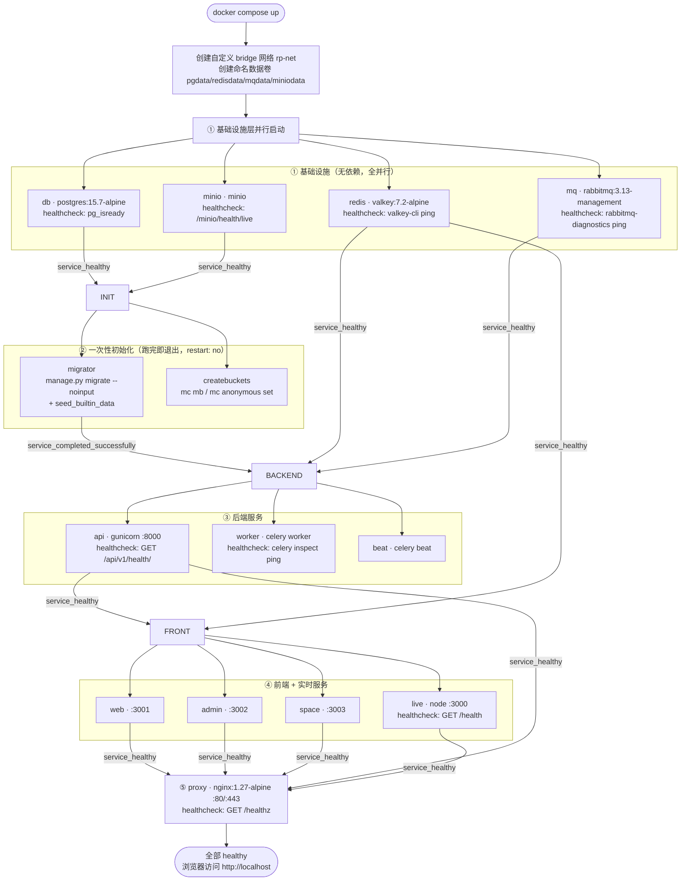
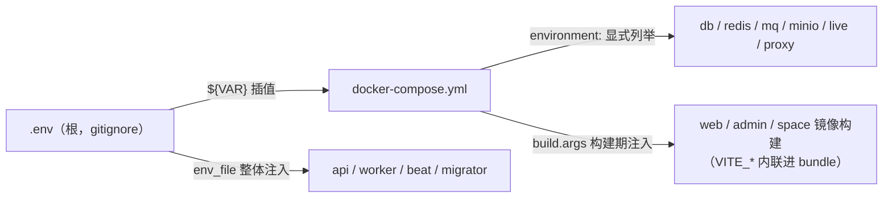
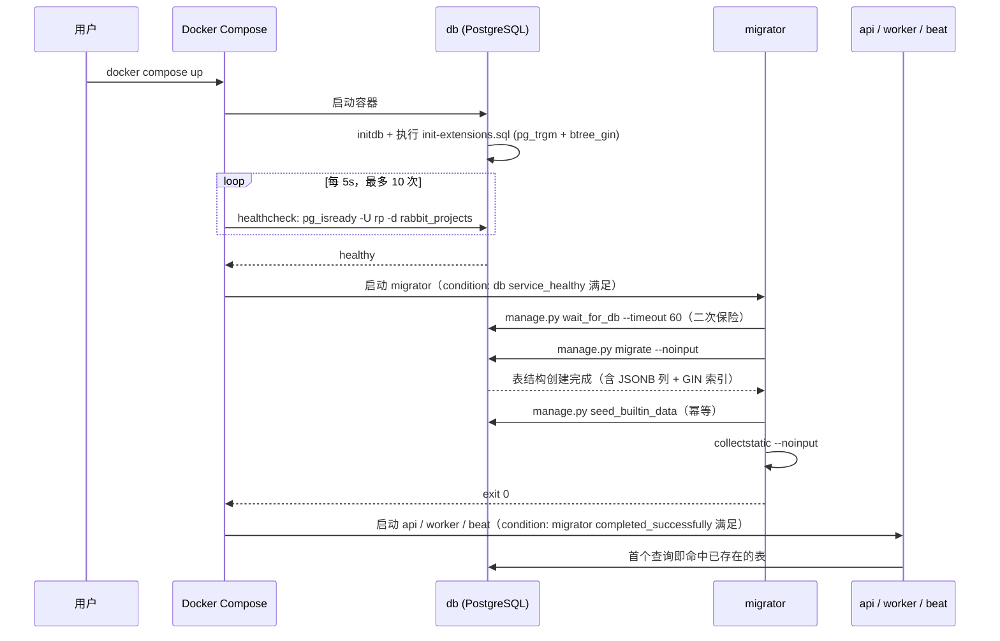

# Docker Compose 全套服务编排

| 元信息项 | 内容 |
| --- | --- |
| 文档编号 | INFRA-002 |
| 所属模块 | INFRA（基础设施与部署运维） |
| 所属迭代 | Sprint 0 — POC 技术验证（第 1-2 周） |
| 优先级 | **P0**（POC 阻塞级，直接对应需求文档 §8.4 第 6 条验收标准） |
| 编写顺序 | Sprint 0 第 2 篇 |
| 复杂度 | **高**（本迭代最高风险项，见 `sprint-overview.md` §9 风险 3） |
| 文档状态 | 已确认（Approved） |
| 最后更新日期 | 2026-09-01 |
| 前置依赖 | [`INFRA-001`](./INFRA-001-monorepo-scaffold.md)（目录布局与 workspace 结构）、[`architecture/tech-stack.md`](../architecture/tech-stack.md)（镜像与版本锁定）、[`architecture/monorepo-structure.md`](../architecture/monorepo-structure.md)（`deploy/compose/` 收敛与环境变量层级） |
| 阻塞下游 | `INFRA-003`（`manage.py migrate` 需 PostgreSQL 容器就绪）、Sprint 0 全部联调工作 |

---

## 1. 概述

### 1.1 功能定位

使用 **Docker Compose** 编排全套服务，实现**一键启动**本地开发环境与生产环境，交付需求文档 §8.4 第 6 条验收标准所要求的能力：

> 全新环境执行 `docker compose up` 可一键启动全部服务（前端三应用 + Django API + worker/beat + live + PostgreSQL/Redis/RabbitMQ/MinIO），**自动完成表结构迁移，无需手动初始化**。

"一键"与"无需手动初始化"是两个独立且同等重要的要求：

| 要求 | 含义 | 反例（视为未达标） |
| --- | --- | --- |
| 一键启动 | 除 `cp .env.example .env` 外，`docker compose up` 是**唯一**需要执行的命令 | "先跑 db，等 10 秒，再跑 api" |
| 无需手动初始化 | 数据库表结构、MinIO bucket、种子数据全部自动完成 | "启动后请手动执行 `manage.py migrate`" / "请到 MinIO 控制台建一个 bucket" |

编排范围为 **12 个常驻服务 + 2 个一次性初始化服务**：

| 类别 | 服务 |
| --- | --- |
| 基础设施（4） | `db`（PostgreSQL）、`redis`（Valkey）、`mq`（RabbitMQ）、`minio`（对象存储） |
| 一次性初始化（2） | `migrator`（Django migrations + 种子数据）、`createbuckets`（MinIO bucket 初始化） |
| 后端（3） | `api`（Django + gunicorn）、`worker`（Celery Worker）、`beat`（Celery Beat） |
| 实时（1） | `live`（Express + Hocuspocus） |
| 前端（3） | `web`、`admin`、`space` |
| 入口（1） | `proxy`（Nginx 反向代理） |

> **服务计数口径说明**：[`tech-stack.md`](../architecture/tech-stack.md) §5（工程工具链）的 Compose 行表述为「编排 web/admin/space/api/worker/beat/live/db/redis/mq/minio/proxy 共 11 个服务」，其枚举的服务名实为 **12 个**（文字计数少 1，枚举清单才是权威）；[`monorepo-structure.md`](../architecture/monorepo-structure.md) §1.1 目标 1「起全套 11 个服务」与 §2 目录树注释「本地开发全套编排（11 服务）」两处计数同样少 1。上述三处均以本文的 **12 个常驻服务编排为准**（架构文档待回改：回改时同步把计数修正为 12）。本文档额外引入 2 个一次性初始化服务（`migrator` / `createbuckets`）以满足"无需手动初始化"要求——这 2 个服务是本系统相对 Plane 的改进项，见 §6.3。

### 1.2 目标用户

| 用户 | 场景 | 关注点 |
| --- | --- | --- |
| 开发者 | 本地起后端依赖，前端用 `pnpm dev` 热更新 | 只起需要的服务、启动速度、日志可读 |
| 新成员 | 首次上手 | 零配置，一条命令 |
| 演示者（POC 验收） | 全新机器上现场演示"一键启动" | 无隐藏步骤、无等待不确定性 |
| 运维 / 私有化交付 | 客户内网部署 | 镜像版本确定、数据卷可备份、无外网依赖 |
| CI | E2E 测试环境 | 可复现、可并发、启动即可用 |

### 1.3 前置依赖

| 依赖 | 消费的具体决策 |
| --- | --- |
| [`INFRA-001`](./INFRA-001-monorepo-scaffold.md) | `apps/*` 目录布局（Dockerfile 的 build context）；`deploy/compose/` 位置；`pnpm-workspace.yaml` 结构（前端镜像需 `pnpm deploy --filter`）；`.env.example` 变量清单；`apps/api/bin/docker-entrypoint-*.sh` 与 `apps/proxy/nginx.conf.template` 的文件位置 |
| [`architecture/tech-stack.md`](../architecture/tech-stack.md) | §8 生产镜像矩阵（`postgres:15.7-alpine` / `valkey/valkey:7.2-alpine` / `rabbitmq:3.13-management-alpine` / `nginx:1.27-alpine` / `node:22-alpine` / `python:3.12-slim`）；§5 `profiles` + `healthcheck` + `depends_on: condition` 编排要求；§6.2 差异 1（Nginx 替代 Caddy 及其代价）；§6.2 差异 3（RabbitMQ 为唯一 Celery broker，Redis 仅作 result backend） |
| [`architecture/monorepo-structure.md`](../architecture/monorepo-structure.md) | §9 环境变量层级与命名前缀；§10.3 本地全栈启动路径；根 `package.json` 的 `compose:*` 脚本 |
| [`architecture/dependency-graph.md`](../architecture/dependency-graph.md) | §6 全局技术决策：`INFRA-002` 须在 Sprint 0 就把 worker / beat 编排就位（即使 P0 无异步任务） |

### 1.4 竞品参考

#### Plane

Plane 使用 Docker Compose 编排全套服务，是本文档的直接蓝本：

| 维度 | Plane |
| --- | --- |
| 服务清单 | `web`、`admin`、`space`、`api`、`worker`、`beat`、`live`、`db`、`redis`、`mq`、`minio`、`proxy` |
| 反向代理 | **Caddy**（自动 HTTPS） |
| migrations | 由 api 服务的启动脚本执行 |
| 编排文件 | 提供单机版 compose 与生产版 compose |
| 部署形态 | 单机 Docker Compose 为主推路径，另有 Kubernetes Helm chart |

本系统的服务清单**与 Plane 一比一对齐**，这是刻意选择：该服务拓扑已在 Plane 的生产环境中验证，重新设计只会引入未经验证的风险。差异集中在反向代理（Nginx 替代 Caddy）与初始化方式（独立 `migrator` 服务），见 §6。

#### Ones

Ones 支持 **4 种部署模式**，其部署形态的丰富度是本系统 P2+ 阶段的对标目标：

| 部署模式 | 说明 | 本系统对应阶段 |
| --- | --- | --- |
| **Cloud（SaaS）** | 官方托管多租户 | P4（`AUTH-012` 多租户隔离） |
| **私有云部署** | 客户自有云账号内部署，通常 K8s | P2（`deploy/k8s/`，`INFRA-005`） |
| **本地部署（On-Premise）** | 客户机房单机 / 小集群 | **P0 本文档即覆盖**（Docker Compose） |
| **气隙部署（Air-Gapped）** | 完全无外网环境，离线镜像包交付 | P3/P4（`INFRA-006`） |

**本文档的定位**：交付 4 种模式中的「本地部署」，同时在设计上为「气隙部署」预留可行性（全部镜像版本精确锁定、无构建期外网强依赖之外的运行期外网调用）。详见 §6.4。

---

## 2. 业务逻辑

### 2.1 启动流程



### 2.2 服务依赖顺序

分五层，层内并行、层间用 `depends_on` 的 **condition** 严格串行。**禁止使用 `sleep` 硬等待**——它既慢又不可靠。

| 层 | 服务 | 依赖声明 | 为什么必须等 |
| --- | --- | --- | --- |
| ① | `db` `redis` `mq` `minio` | 无 | — |
| ② | `migrator` | `db: service_healthy` | PostgreSQL 未接受连接时 `migrate` 直接报 `could not connect to server` |
| ② | `createbuckets` | `minio: service_healthy` | MinIO 未就绪时 `mc mb` 失败 |
| ③ | `api` | `db: service_healthy`、`redis: service_healthy`、`mq: service_healthy`、`migrator: service_completed_successfully` | 表结构不存在时首个请求即 `relation "users" does not exist` |
| ③ | `worker` `beat` | 同 `api` | Celery 启动时即连接 broker 并可能触发 ORM 查询 |
| ④ | `live` | `redis: service_healthy`、`api: service_healthy` | live 通过内部 HTTP 调用 api 做协同票据鉴权 |
| ④ | `web` `admin` `space` | `api: service_healthy` | 容器本身可先起，但等 api 可保证首屏不出现 502 |
| ⑤ | `proxy` | `web` `admin` `space` `api` `live` 全部 `service_healthy` | Nginx 启动时会解析 `proxy_pass` 中的上游主机名；上游 DNS 不可解析会导致 **Nginx 启动直接失败**（这是 Nginx 与 Caddy 的重要行为差异，见 §4.7） |

#### `migrator` 独立成服务的关键设计决策

**决策**：migrations **不塞进 api 的启动脚本**，而由独立的一次性服务 `migrator` 执行。

| 若塞进 api entrypoint | 后果 |
| --- | --- |
| `api` 多副本部署（生产 `deploy.replicas > 1` 或 K8s 多 Pod） | 多个副本**并发执行 `migrate`**，Django 的 migration 锁粒度不足以完全避免竞态，可能出现 `DuplicateTable` 或 migration 记录表写坏 |
| `worker` / `beat` 也需要表结构 | 三个服务各自等 api 迁移完，依赖关系变成隐式的时间耦合 |
| 迁移失败 | api 反复重启，日志被启动噪音淹没，失败原因难定位 |

采用独立 `migrator` 后：

- `restart: "no"` —— 跑完即退出，退出码 0 表示成功。
- 下游用 `depends_on: {migrator: {condition: service_completed_successfully}}` 精确等待。
- 迁移失败时 `migrator` 以非零码退出，Compose 报告该服务失败，**下游服务根本不会启动**，失败点一目了然。
- 与 K8s 的 `initContainer` / `Job` 模型天然对应，P2 迁移到 K8s 时可直接映射。

### 2.3 健康检查

每个有状态服务必须定义 `healthcheck`。设计原则：**探测真实可用性，而非仅探测进程存活**。

| 服务 | 探测命令 | interval | timeout | retries | start_period | 设计说明 |
| --- | --- | --- | --- | --- | --- | --- |
| `db` | `pg_isready -U $POSTGRES_USER -d $POSTGRES_DB` | 5s | 5s | 10 | 10s | 带 `-d` 指定库名——不指定时 `pg_isready` 在初始化脚本尚未建库时就会返回成功，造成假就绪 |
| `redis` | `valkey-cli ping` | 5s | 3s | 10 | 5s | 期望输出 `PONG` |
| `mq` | `rabbitmq-diagnostics -q ping` | 10s | 10s | 10 | **40s** | RabbitMQ 启动慢（Erlang VM + 磁盘节点恢复），`start_period` 必须给足，否则会在启动期被误判为 unhealthy 并重启，陷入循环 |
| `minio` | `curl -f http://localhost:9000/minio/health/live` | 10s | 5s | 5 | 10s | 官方 liveness 端点 |
| `api` | `curl -f http://localhost:8000/api/v1/health/` | 10s | 5s | 10 | 20s | **必须是真实端点**，其内部检查 DB 连接与 Redis 连接（端点设计见 §4.10） |
| `worker` | `celery -A plane inspect ping -d celery@$HOSTNAME` | 30s | 10s | 5 | 30s | 探测 worker 是否真正注册到 broker，而非仅进程存活 |
| `beat` | 无 healthcheck | — | — | — | — | Beat 无对外端口与查询接口；用 `restart: unless-stopped` 兜底。P2 可改为检查 pid 文件时间戳 |
| `live` | `curl -f http://localhost:3000/health` | 10s | 5s | 5 | 10s | 端点内检查到 api 的内部连通性 |
| `web` / `admin` / `space` | `curl -f http://localhost:<port>/` | 10s | 5s | 5 | 10s | 静态资源服务，返回 200 即可 |
| `proxy` | `curl -f http://localhost/healthz` | 10s | 5s | 5 | 5s | Nginx 内置 `location = /healthz { return 200 'ok'; }` |

**共同约定**：

- 所有 `healthcheck` 探测 **localhost**（容器内自身），不跨容器探测——跨容器探测会把网络故障误报为服务故障。
- `start_period` 内的失败**不计入** `retries`，这是避免"启动慢的服务被反复重启"的关键。
- 探测命令使用镜像内已有的工具（`curl` 需确认基础镜像包含；`alpine` 基镜像需在 Dockerfile 中 `apk add --no-cache curl`）。

### 2.4 重启策略

| 服务类别 | 策略 | 理由 |
| --- | --- | --- |
| `db` `redis` `mq` `minio` | `unless-stopped` | 有状态基础设施，异常退出必须自愈；但开发者手动 `docker compose stop db` 后不应被自动拉起 |
| `api` `worker` `beat` `live` `web` `admin` `space` `proxy` | `unless-stopped` | 同上 |
| `migrator` `createbuckets` | **`"no"`** | 一次性任务。若设为 `unless-stopped`，正常退出（code 0）也会被反复重启，导致 `migrate` 无限循环执行 |

生产环境（`docker-compose.prod.yml`）统一改为 `always`，忽略"手动停止"语义，保证宿主机重启后全部服务自动恢复。

### 2.5 环境变量注入策略

分三条通道，职责不重叠：



| 通道 | 用法 | 适用服务 | 理由 |
| --- | --- | --- | --- |
| **① `env_file`** | `env_file: [../../.env]` 整体注入 | `api` `worker` `beat` `migrator` | Django 变量多达数十个（`django-environ` 读取），逐个列举维护成本高且易漏 |
| **② `environment:` 显式列举** | `POSTGRES_USER: ${POSTGRES_USER}` | 基础设施 + `live` + `proxy` | 显式声明使"该服务需要哪些变量"在 compose 文件中一目了然，也避免把 Django 密钥注入到基础设施容器（最小权限） |
| **③ `build.args`** | `args: { VITE_API_BASE_URL: ${VITE_API_BASE_URL} }` | `web` `admin` `space` | `VITE_*` 在**构建期**被内联进 bundle，运行期注入无效。这是前端容器与后端容器的本质差异 |

#### 强制约定

| 约定 | 说明 |
| --- | --- |
| `.env.example` 是唯一模板 | 新增任何变量必须同步 `.env.example`；CI 校验代码读取的变量集合 ⊆ `.env.example` 的键集合 |
| compose 中**禁止硬编码密钥** | 一律 `${VAR}` 插值；无默认值的必填变量写成 `${VAR:?VAR is required}`，缺失时 Compose 直接报错而非静默用空值启动 |
| 容器间通信用**服务名**，不用 localhost | `DATABASE_URL=postgresql://rp:rp@db:5432/...`（`db` 是服务名，由 Compose 内置 DNS 解析）。写 `localhost` 会指向容器自身 |
| `VITE_*` 严禁放密钥 | 构建期内联等同公开，CI 扫描阻断（`INFRA-001` §4.10 红线） |
| 生产必须覆盖的变量 | `SECRET_KEY`、`POSTGRES_PASSWORD`、`RABBITMQ_DEFAULT_PASS`、`MINIO_ROOT_PASSWORD`、`DEBUG=0`、`DJANGO_SETTINGS_MODULE=plane.settings.production`；`docker-compose.prod.yml` 中对这些变量一律使用 `${VAR:?...}` 强制形式 |

---

## 3. UI/UX 设计

> **本章说明：本文档为基础设施文档，无 UI 层。**
>
> INFRA-002 不交付任何用户界面。它的"界面"是 `docker compose` 命令行与容器日志输出，其"用户体验"是**开发者体验（DX）**。本章以 DX 规范替代常规 UI/UX 内容。

### 3.1 核心命令

| 命令 | 作用 | 预期体验 |
| --- | --- | --- |
| `docker compose up` | **一键启动全部服务**（前台，日志聚合输出） | 首次约 3-6 分钟（含镜像构建）；二次约 40-60s。全程无需人工干预 |
| `docker compose up -d` | 后台启动 | 返回后用 `ps` 观察健康状态 |
| `docker compose ps` | 查看全部容器状态与健康 | 12 个常驻服务 `running (healthy)`；2 个初始化服务 `exited (0)` |
| `docker compose logs -f api` | 跟踪单服务日志 | — |
| `docker compose down` | 停止并删除容器与网络，**保留数据卷** | 数据不丢，下次 `up` 继续 |
| **`docker compose down -v`** | 停止并删除容器、网络、**数据卷（彻底清理）** | 下次 `up` 等价全新环境：重新 migrate、重新建 bucket |
| `docker compose restart api` | 重启单服务 | — |
| `docker compose build --no-cache web` | 强制重建单个镜像 | — |
| `docker compose exec api python manage.py shell` | 进入 Django shell | 调试用 |
| `docker compose run --rm migrator` | 手动重跑迁移 | 追加迁移时使用，无需重启全栈 |

仓库根 `package.json` 提供快捷脚本（`INFRA-001` §4.5）：

```bash
pnpm compose:up      # docker compose --env-file .env -f deploy/compose/docker-compose.yml up -d
pnpm compose:dev     # docker compose --env-file .env -f deploy/compose/docker-compose.yml -f deploy/compose/docker-compose.override.yml up
pnpm compose:down    # ... down
pnpm compose:logs    # ... logs -f
```

> **为什么 `-f` 形式必须显式带 `--env-file .env`**：Compose v2 从**首个 `-f` 文件所在目录**（即 `deploy/compose/`）查找 `.env` 做变量插值，而非当前工作目录——不带 `--env-file` 时仓库根的 `.env` 不生效，`${POSTGRES_USER:?}` 等必填变量会在启动时直接报错。`monorepo-structure.md` §2 给出的替代方案是在仓库根放置指向 `deploy/compose/docker-compose.yml` 的软链 `docker-compose.yml`，从根目录直接 `docker compose up`；本文的命令与脚本统一采用显式 `--env-file .env`（等价达成同一效果，且不改变 compose 文件内 `../..` 相对路径以 `deploy/compose/` 为锚的解析——注意 `--project-directory .` 会把该锚点移到仓库根，导致 `context: ../..` 指到仓库之外，故**不可用**）。`INFRA-001` §4.5 与 `monorepo-structure.md` §6.2 的脚本定义需同步补上该参数（待回改）。
>
> **为什么开发覆盖必须追加第二个 `-f`**：Compose v2 显式传 `-f` 时**跳过默认文件查找**，`docker-compose.override.yml` 的默认自动合并随之失效——上述基线命令（单 `-f`）永远不会加载 override。因此开发姿势统一经 `compose:dev` 显式追加第二个 `-f`（加载效果与用法见 §4.7）；该新增脚本同样需在 `INFRA-001` §4.5 与 `monorepo-structure.md` §6.2 回改登记（待回改）。

### 3.2 两种典型开发姿势

| 姿势 | 命令 | 适用场景 |
| --- | --- | --- |
| **全容器**（演示 / 验收 / 新成员上手） | `docker compose up` → 浏览器访问 `http://localhost` | 验证"一键启动"；前端改动需重建镜像，不适合日常开发 |
| **混合模式**（日常开发，推荐） | `pnpm compose:dev` 起后端全套（加载 override：api 换 `runserver` 热重载、worker 换 `watchfiles`，前端与 proxy 不启动）→ `pnpm dev` 本地起前端 | 前端享受 Vite HMR（< 300ms），后端在容器内且改 Python 代码即热重载。前端通过 Vite proxy 把 `/api` 转发到 `http://localhost:8000` |

混合模式下前端只需起必要的后端服务：

```bash
# Compose 只自动启动「所列服务依赖链」上的服务：
#   api depends_on migrator → migrator（及其依赖 db）自动带上；
#   createbuckets 无任何服务 depends_on 它、不在依赖链上 → 必须显式列出，否则 bucket 不会被创建
docker compose up -d db redis mq minio api createbuckets
pnpm dev
```

### 3.3 一键清理

```bash
docker compose down -v          # 删除容器 + 网络 + 数据卷
docker compose up               # 等价全新环境重来
```

`down -v` 是**验收标准第 6 条的自测手段**：任何"全新环境一键启动"的声明，都必须用 `down -v` 后重新 `up` 来验证，而非依赖一台恰好已初始化过的机器。

### 3.4 日志与输出规范

| 要求 | 实现 |
| --- | --- |
| 日志有服务名前缀 | Compose 默认行为 |
| 结构化日志 | Django 侧用 `structlog` 输出 JSON（`tech-stack.md`），便于 P2 接入日志系统 |
| 启动噪音最小化 | `migrator` 只输出 migration 结果摘要，不打印全部 SQL（`--verbosity 1`） |
| 失败可定位 | `migrator` 失败时下游不启动，`docker compose ps` 中该服务显示 `exited (1)`，`logs migrator` 即为根因 |
| 日志轮转 | 生产配置 `logging: {driver: json-file, options: {max-size: "50m", max-file: "3"}}`，防止磁盘写满 |

---

## 4. 技术架构

### 4.1 服务矩阵总表

| 服务名 | 镜像 / 构建 | 对外端口 | 内部端口 | 依赖 | 重启策略 | 说明 |
| --- | --- | --- | --- | --- | --- | --- |
| `db` | `postgres:15.7-alpine` | 5432 | 5432 | — | unless-stopped | PostgreSQL 主库；`pgdata` 卷；开机执行 `init-extensions.sql` 建 `pg_trgm` + `btree_gin` 扩展 |
| `redis` | `valkey/valkey:7.2-alpine` | 6379 | 6379 | — | unless-stopped | 缓存 / Session / 限流计数 / Celery **result backend**（**非 broker**） |
| `mq` | `rabbitmq:3.13-management-alpine` | 5672 / 15672 | 5672 / 15672 | — | unless-stopped | Celery **唯一 broker**；15672 为管理界面（生产仅内网） |
| `minio` | `minio/minio:RELEASE.2025-xx-xx` | 9000 / 9001 | 9000 / 9001 | — | unless-stopped | S3 兼容对象存储；9000 API / 9001 控制台；RELEASE tag 以 `tech-stack.md` §3 登记为准，生产按 digest 锁定 |
| `migrator` | 构建 `apps/api`（同 api 镜像） | — | — | `db`(healthy) | **no** | 一次性：`migrate --noinput` + 种子数据；退出码 0 即成功 |
| `createbuckets` | `minio/mc:RELEASE.2025-xx-xx` | — | — | `minio`(healthy) | **no** | 一次性：创建 `rp-uploads` bucket 并设访问策略；mc 与 MinIO 服务端同期锁定 RELEASE tag（见下方版本对齐说明） |
| `api` | 构建 `apps/api` | 8000 | 8000 | `db` `redis` `mq`(healthy)、`migrator`(completed) | unless-stopped | Django + DRF，gunicorn 23 + gthread |
| `worker` | 构建 `apps/api`（同镜像，换 command） | — | — | 同 `api` | unless-stopped | Celery Worker；队列 `notifications,webhooks,reports,imports` |
| `beat` | 构建 `apps/api`（同镜像，换 command） | — | — | 同 `api` | unless-stopped | Celery Beat 定时调度；DatabaseScheduler |
| `live` | 构建 `apps/live` | 3000 | 3000 | `redis`(healthy)、`api`(healthy) | unless-stopped | Express + Hocuspocus 实时协作（**P0 仅编排就位，不承载业务**） |
| `web` | 构建 `apps/web` | 3001 | 3001 | `api`(healthy) | unless-stopped | 主工作台（SPA 静态产物 + nginx-alpine 托底） |
| `admin` | 构建 `apps/admin` | 3002 | 3002 | `api`(healthy) | unless-stopped | God Mode 管理后台 |
| `space` | 构建 `apps/space` | 3003 | 3003 | `api`(healthy) | unless-stopped | 对外公开空间 |
| `proxy` | 构建 `apps/proxy`（基于 `nginx:1.27-alpine`） | **80 / 443** | 80 / 443 | `web` `admin` `space` `api` `live` 全部 healthy | unless-stopped | 唯一对外入口；五路由分发 |

> **与任务给定服务表的版本对齐说明**：任务描述中给出的镜像为 `postgres:15.7` / `valkey:7` / `rabbitmq:3-management` / `minio/minio`（大版本粒度）。本文档按 [`tech-stack.md`](../architecture/tech-stack.md) §8「生产镜像」行**收紧为精确的 patch 级 tag**（`postgres:15.7-alpine` / `valkey/valkey:7.2-alpine` / `rabbitmq:3.13-management-alpine`）；MinIO 的 RELEASE tag 以 [`tech-stack.md`](../architecture/tech-stack.md) §3 版本表登记为**唯一口径**（`RELEASE.2025-xx-xx`），本文与其保持同一 tag、不另行指定版本，生产再按 digest 锁定（`tech-stack.md` §1.1 / §9.3），具体 RELEASE 日期由 `tech-stack.md` §3 登记后在两处同步替换。理由：浮动 tag 会导致"同一份 compose 在不同时间拉到不同版本"，直接破坏可复现性与气隙部署的镜像清单确定性。这是收紧而非偏离，两者语义兼容。一次性工具容器 `minio/mc` 同样按此口径锁定为 `RELEASE.2025-xx-xx`——**不再使用 `latest`**（浮动 tag 同样会破坏气隙镜像清单确定性，见 §6.4），具体 RELEASE 日期与 `minio/minio` 服务端同期配套（选取依据：`mc` 为 MinIO 官方客户端，按官方同期发布线选取以保证与服务端兼容），同样以 [`tech-stack.md`](../architecture/tech-stack.md) §3 登记为唯一口径。架构文档待回改：`tech-stack.md` §3 需补登记 `minio/mc` 的 RELEASE tag 行（与 MinIO 行同期），登记后在本文 §4.1 / §4.2 同步替换。

### 4.2 docker-compose.yml（完整设计）

> 位置：`deploy/compose/docker-compose.yml`（`monorepo-structure.md` §2 规定的收敛位置）。
> `build.context` 一律为仓库根 `../..`，以便 Dockerfile 能访问 `pnpm-workspace.yaml` 与 `packages/`。

```yaml
# deploy/compose/docker-compose.yml
name: rabbit-projects

x-api-env: &api-env
  env_file:
    - ../../.env
  environment:
    DJANGO_SETTINGS_MODULE: ${DJANGO_SETTINGS_MODULE:-plane.settings.local}
    DATABASE_URL: postgresql://${POSTGRES_USER}:${POSTGRES_PASSWORD}@db:5432/${POSTGRES_DB}
    REDIS_URL: redis://redis:6379/0
    CELERY_BROKER_URL: amqp://${RABBITMQ_DEFAULT_USER}:${RABBITMQ_DEFAULT_PASS}@mq:5672//
    CELERY_RESULT_BACKEND: redis://redis:6379/1
    AWS_S3_ENDPOINT_URL: http://minio:9000
    AWS_ACCESS_KEY_ID: ${MINIO_ROOT_USER}
    AWS_SECRET_ACCESS_KEY: ${MINIO_ROOT_PASSWORD}
    AWS_S3_BUCKET_NAME: ${AWS_S3_BUCKET_NAME:-rp-uploads}

x-api-build: &api-build
  build:
    context: ../..
    dockerfile: apps/api/Dockerfile

x-logging: &default-logging
  logging:
    driver: json-file
    options: { max-size: "50m", max-file: "3" }

# ─────────────────────────────────────────────────────────────
services:

  # ══════════════ ① 基础设施层 ══════════════
  db:
    image: postgres:15.7-alpine
    restart: unless-stopped
    environment:
      POSTGRES_USER: ${POSTGRES_USER:?POSTGRES_USER is required}
      POSTGRES_PASSWORD: ${POSTGRES_PASSWORD:?POSTGRES_PASSWORD is required}
      POSTGRES_DB: ${POSTGRES_DB:-rabbit_projects}
      PGDATA: /var/lib/postgresql/data/pgdata
    volumes:
      - pgdata:/var/lib/postgresql/data
      - ./init/init-extensions.sql:/docker-entrypoint-initdb.d/10-extensions.sql:ro
    ports: ["${POSTGRES_PORT:-5432}:5432"]
    healthcheck:
      test: ["CMD-SHELL", "pg_isready -U $${POSTGRES_USER} -d $${POSTGRES_DB}"]
      interval: 5s
      timeout: 5s
      retries: 10
      start_period: 10s
    networks: [rp-net]
    <<: *default-logging

  redis:
    image: valkey/valkey:7.2-alpine
    restart: unless-stopped
    command: ["valkey-server", "--appendonly", "yes", "--save", "60", "1"]
    volumes: [redisdata:/data]
    ports: ["${REDIS_PORT:-6379}:6379"]
    healthcheck:
      test: ["CMD", "valkey-cli", "ping"]
      interval: 5s
      timeout: 3s
      retries: 10
      start_period: 5s
    networks: [rp-net]
    <<: *default-logging

  mq:
    image: rabbitmq:3.13-management-alpine
    restart: unless-stopped
    environment:
      RABBITMQ_DEFAULT_USER: ${RABBITMQ_DEFAULT_USER:?required}
      RABBITMQ_DEFAULT_PASS: ${RABBITMQ_DEFAULT_PASS:?required}
      RABBITMQ_DEFAULT_VHOST: "/"
    volumes: [mqdata:/var/lib/rabbitmq]
    ports:
      - "${RABBITMQ_PORT:-5672}:5672"
      - "${RABBITMQ_MGMT_PORT:-15672}:15672"
    healthcheck:
      test: ["CMD", "rabbitmq-diagnostics", "-q", "ping"]
      interval: 10s
      timeout: 10s
      retries: 10
      start_period: 40s          # Erlang VM 启动慢，必须给足
    networks: [rp-net]
    <<: *default-logging

  minio:
    image: minio/minio:RELEASE.2025-xx-xx   # tag 以 tech-stack.md §3 登记为准；生产按 digest 锁定（见 §4.1 版本对齐说明）
    restart: unless-stopped
    command: ["server", "/data", "--console-address", ":9001"]
    environment:
      MINIO_ROOT_USER: ${MINIO_ROOT_USER:?required}
      MINIO_ROOT_PASSWORD: ${MINIO_ROOT_PASSWORD:?required}
    volumes: [miniodata:/data]
    ports:
      - "${MINIO_PORT:-9000}:9000"
      - "${MINIO_CONSOLE_PORT:-9001}:9001"
    healthcheck:
      test: ["CMD", "curl", "-f", "http://localhost:9000/minio/health/live"]
      interval: 10s
      timeout: 5s
      retries: 5
      start_period: 10s
    networks: [rp-net]
    <<: *default-logging

  # ══════════════ ② 一次性初始化 ══════════════
  migrator:
    <<: [*api-build, *api-env]
    restart: "no"                       # 关键：一次性任务不可自动重启
    command: ["/app/bin/docker-entrypoint-migrator.sh"]
    depends_on:
      db: { condition: service_healthy }
    networks: [rp-net]
    <<: *default-logging

  createbuckets:
    image: minio/mc:RELEASE.2025-xx-xx   # 与 minio/minio 同期 RELEASE；tag 以 tech-stack.md §3 登记为准，生产按 digest 锁定（见 §4.1 版本对齐说明）
    restart: "no"
    depends_on:
      minio: { condition: service_healthy }
    environment:
      MINIO_ROOT_USER: ${MINIO_ROOT_USER}
      MINIO_ROOT_PASSWORD: ${MINIO_ROOT_PASSWORD}
      AWS_S3_BUCKET_NAME: ${AWS_S3_BUCKET_NAME:-rp-uploads}
    entrypoint: >
      /bin/sh -c "
      mc alias set rp http://minio:9000 $${MINIO_ROOT_USER} $${MINIO_ROOT_PASSWORD} &&
      mc mb --ignore-existing rp/$${AWS_S3_BUCKET_NAME} &&
      mc anonymous set download rp/$${AWS_S3_BUCKET_NAME}/public &&
      echo 'bucket ready'
      "
    networks: [rp-net]

  # ══════════════ ③ 后端服务 ══════════════
  api:
    <<: [*api-build, *api-env]
    restart: unless-stopped
    command: ["/app/bin/docker-entrypoint-api.sh"]
    ports: ["${API_PORT:-8000}:8000"]
    depends_on:
      db:       { condition: service_healthy }
      redis:    { condition: service_healthy }
      mq:       { condition: service_healthy }
      migrator: { condition: service_completed_successfully }
    healthcheck:
      test: ["CMD", "curl", "-f", "http://localhost:8000/api/v1/health/"]
      interval: 10s
      timeout: 5s
      retries: 10
      start_period: 20s
    networks: [rp-net]
    <<: *default-logging

  worker:
    <<: [*api-build, *api-env]
    restart: unless-stopped
    command: ["/app/bin/docker-entrypoint-worker.sh"]
    depends_on:
      db:       { condition: service_healthy }
      redis:    { condition: service_healthy }
      mq:       { condition: service_healthy }
      migrator: { condition: service_completed_successfully }
    healthcheck:
      test: ["CMD-SHELL", "celery -A plane inspect ping -d celery@$$HOSTNAME | grep -q pong"]
      interval: 30s
      timeout: 10s
      retries: 5
      start_period: 30s
    networks: [rp-net]
    <<: *default-logging

  beat:
    <<: [*api-build, *api-env]
    restart: unless-stopped
    command: ["/app/bin/docker-entrypoint-beat.sh"]
    depends_on:
      db:       { condition: service_healthy }
      redis:    { condition: service_healthy }
      mq:       { condition: service_healthy }
      migrator: { condition: service_completed_successfully }
    networks: [rp-net]
    <<: *default-logging

  # ══════════════ ④ 实时 + 前端 ══════════════
  live:
    build:
      context: ../..
      dockerfile: apps/live/Dockerfile
    restart: unless-stopped
    environment:
      LIVE_PORT: 3000
      REDIS_URL: redis://redis:6379/2
      API_INTERNAL_URL: http://api:8000
      APP_BASE_URL: ${APP_BASE_URL:-http://localhost}
    ports: ["${LIVE_PORT:-3000}:3000"]
    depends_on:
      redis: { condition: service_healthy }
      api:   { condition: service_healthy }
    healthcheck:
      test: ["CMD", "curl", "-f", "http://localhost:3000/health"]
      interval: 10s
      timeout: 5s
      retries: 5
      start_period: 10s
    networks: [rp-net]
    <<: *default-logging

  web:
    build:
      context: ../..
      dockerfile: apps/web/Dockerfile
      args:
        VITE_API_BASE_URL: ${VITE_API_BASE_URL:-/api/v1}
        VITE_LIVE_BASE_URL: ${VITE_LIVE_BASE_URL:-/live}
    restart: unless-stopped
    ports: ["${WEB_PORT:-3001}:3001"]
    depends_on:
      api: { condition: service_healthy }
    healthcheck:
      test: ["CMD", "curl", "-f", "http://localhost:3001/"]
      interval: 10s
      timeout: 5s
      retries: 5
      start_period: 10s
    networks: [rp-net]
    <<: *default-logging

  admin:
    build:
      context: ../..
      dockerfile: apps/admin/Dockerfile
      args:
        VITE_API_BASE_URL: ${VITE_API_BASE_URL:-/api/v1}
    restart: unless-stopped
    ports: ["${ADMIN_PORT:-3002}:3002"]
    depends_on:
      api: { condition: service_healthy }
    healthcheck:
      test: ["CMD", "curl", "-f", "http://localhost:3002/"]
      interval: 10s
      timeout: 5s
      retries: 5
      start_period: 10s
    networks: [rp-net]
    <<: *default-logging

  space:
    build:
      context: ../..
      dockerfile: apps/space/Dockerfile
      args:
        VITE_API_BASE_URL: ${VITE_API_BASE_URL:-/api/v1}
        VITE_LIVE_BASE_URL: ${VITE_LIVE_BASE_URL:-/live}
    restart: unless-stopped
    ports: ["${SPACE_PORT:-3003}:3003"]
    depends_on:
      api: { condition: service_healthy }
    healthcheck:
      test: ["CMD", "curl", "-f", "http://localhost:3003/"]
      interval: 10s
      timeout: 5s
      retries: 5
      start_period: 10s
    networks: [rp-net]
    <<: *default-logging

  # ══════════════ ⑤ 反向代理（唯一对外入口）══════════════
  proxy:
    build:
      context: ../..
      dockerfile: apps/proxy/Dockerfile
    restart: unless-stopped
    environment:
      NGINX_PORT: ${NGINX_PORT:-80}
      SERVER_NAME: ${SERVER_NAME:-localhost}
      WEB_UPSTREAM: web:3001
      ADMIN_UPSTREAM: admin:3002
      SPACE_UPSTREAM: space:3003
      API_UPSTREAM: api:8000
      LIVE_UPSTREAM: live:3000
      CLIENT_MAX_BODY_SIZE: ${CLIENT_MAX_BODY_SIZE:-100M}
    ports:
      - "${NGINX_PORT:-80}:80"
      - "${NGINX_TLS_PORT:-443}:443"
    depends_on:
      web:   { condition: service_healthy }
      admin: { condition: service_healthy }
      space: { condition: service_healthy }
      api:   { condition: service_healthy }
      live:  { condition: service_healthy }
    healthcheck:
      test: ["CMD", "curl", "-f", "http://localhost/healthz"]
      interval: 10s
      timeout: 5s
      retries: 5
      start_period: 5s
    networks: [rp-net]
    <<: *default-logging

# ─────────────────────────────────────────────────────────────
volumes:
  pgdata:    { name: rp-pgdata }
  redisdata: { name: rp-redisdata }
  mqdata:    { name: rp-mqdata }
  miniodata: { name: rp-miniodata }

networks:
  rp-net:
    name: rp-net
    driver: bridge
```

配套的 `deploy/compose/init/init-extensions.sql`（PostgreSQL 首次初始化时自动执行）：

```sql
-- 供 unified-issue-model.md §2.8 的 idx_issue_desc_trgm 使用
CREATE EXTENSION IF NOT EXISTS pg_trgm;
-- 供 UUID 生成与 btree_gin 组合索引备用
CREATE EXTENSION IF NOT EXISTS btree_gin;
```

> **注意**：`docker-entrypoint-initdb.d` 仅在**数据目录为空**时执行。若 `pgdata` 卷已存在，新增扩展需通过 Django migration 的 `TrigramExtension` 操作完成（`INFRA-003` §4 已在首个 migration 中包含 `pg_trgm` 扩展的 `CreateExtension`，形成双保险）。

### 4.3 各服务 Dockerfile 设计要点

#### apps/api/Dockerfile（Django，多阶段）

```dockerfile
# ───── stage 1: builder（安装依赖）─────
FROM python:3.12-slim AS builder
ENV PYTHONDONTWRITEBYTECODE=1 PYTHONUNBUFFERED=1 UV_COMPILE_BYTECODE=1
RUN apt-get update && apt-get install -y --no-install-recommends build-essential libpq-dev \
    && rm -rf /var/lib/apt/lists/*
# 构建工具镜像同样精确锁定，禁止 latest（与 §4.9 镜像基线一致；升级走 tech-stack.md §9.2 流程）
COPY --from=ghcr.io/astral-sh/uv:0.12.8 /uv /usr/local/bin/uv
WORKDIR /app
# 仅拷 lock 文件 → 依赖层可缓存
COPY apps/api/pyproject.toml apps/api/uv.lock apps/api/.python-version ./
RUN uv sync --frozen --no-dev --no-install-project

# ───── stage 2: runtime ─────
FROM python:3.12-slim AS runtime
ENV PYTHONDONTWRITEBYTECODE=1 PYTHONUNBUFFERED=1 \
    PATH="/app/.venv/bin:$PATH" \
    DJANGO_SETTINGS_MODULE=plane.settings.production
RUN apt-get update && apt-get install -y --no-install-recommends libpq5 curl \
    && rm -rf /var/lib/apt/lists/* \
    && groupadd -r rp && useradd -r -g rp -u 10001 rp
WORKDIR /app
COPY --from=builder /app/.venv /app/.venv
COPY apps/api/ /app/
RUN chmod +x /app/bin/*.sh && chown -R rp:rp /app
USER rp
EXPOSE 8000
CMD ["/app/bin/docker-entrypoint-api.sh"]
```

| 设计要点 | 说明 |
| --- | --- |
| 多阶段构建 | `build-essential` 与 `libpq-dev` 仅在 builder 阶段，runtime 只保留 `libpq5`，镜像体积减小约 400 MB |
| 依赖层缓存 | 先只拷 `pyproject.toml` + `uv.lock` 再 `uv sync`，代码变更不触发依赖重装 |
| `uv sync --frozen` | 严格按 lockfile 安装，产出可复现 |
| **非 root 运行** | `USER rp`（uid 10001），最小权限原则 |
| 安装 `curl` | healthcheck 需要（`python:*-slim` 默认不含） |
| **一份镜像四种用途** | `api` / `worker` / `beat` / `migrator` **共用同一镜像**，仅 `command` 不同。避免四份镜像的重复构建与版本漂移 |
| 生产 settings 默认值 | `ENV DJANGO_SETTINGS_MODULE=plane.settings.production`，本地由 compose 覆盖为 `local`——默认安全 |

四个 entrypoint 脚本（位于 `apps/api/bin/`）：

```bash
#!/usr/bin/env sh
# docker-entrypoint-migrator.sh —— 一次性初始化，失败即非零退出
set -e
echo "[migrator] waiting for database ..."
python manage.py wait_for_db --timeout 60        # 自定义 management command，二次保险
echo "[migrator] applying migrations ..."
python manage.py migrate --noinput --verbosity 1
echo "[migrator] seeding builtin data (idempotent) ..."
python manage.py seed_builtin_data               # 内置 IssueType 等，幂等
echo "[migrator] collecting static files ..."
python manage.py collectstatic --noinput --clear
echo "[migrator] done."
```

```bash
#!/usr/bin/env sh
# docker-entrypoint-api.sh —— 只启服务，不做任何迁移
set -e
exec gunicorn plane.wsgi:application \
  --bind 0.0.0.0:8000 \
  --workers "${GUNICORN_WORKERS:-3}" \
  --worker-class gthread \
  --threads "${GUNICORN_THREADS:-4}" \
  --timeout 120 \
  --graceful-timeout 30 \
  --max-requests 2000 --max-requests-jitter 200 \
  --access-logfile - --error-logfile -
```

```bash
#!/usr/bin/env sh
# docker-entrypoint-worker.sh
set -e
exec celery -A plane worker \
  --loglevel="${CELERY_LOG_LEVEL:-INFO}" \
  --concurrency="${CELERY_CONCURRENCY:-4}" \
  -Q notifications,webhooks,reports,imports
```

```bash
#!/usr/bin/env sh
# docker-entrypoint-beat.sh
set -e
rm -f /tmp/celerybeat.pid                      # 清理非正常退出残留的 pid，否则 beat 拒绝启动
exec celery -A plane beat \
  --loglevel="${CELERY_LOG_LEVEL:-INFO}" \
  --scheduler django_celery_beat.schedulers:DatabaseScheduler \
  --pidfile=/tmp/celerybeat.pid
```

> **`api` entrypoint 中刻意不含 `migrate`**：见 §2.2 的独立 `migrator` 设计决策；`collectstatic` 同样由 `migrator` 执行（见上方脚本），`api` entrypoint 只负责启动 gunicorn。**口径冲突说明**：`monorepo-structure.md` §2 目录树将 `docker-entrypoint-api.sh` 注释为「migrate + collectstatic + gunicorn」，与本文 §2.2 / §4.3 / §7.4 的决策冲突——以本文为准（架构文档待回改）：monorepo-structure §2 该注释待回改为「collectstatic + gunicorn（migrate 由 migrator 执行）」；按本文最终脚本划分，`collectstatic` 实际亦由 migrator 执行，回改为「gunicorn（migrate / collectstatic 由 migrator 执行）」更为准确。
> **队列按业务拆分**（`notifications` / `webhooks` / `reports` / `imports`）与每队列配 DLX，是 `tech-stack.md` §6.2 差异 3 的落地要求；P0 阶段队列为空但必须编排就位。

#### apps/web|admin|space/Dockerfile（前端，多阶段）

```dockerfile
# ───── stage 1: builder ─────
FROM node:22-alpine AS builder
RUN corepack enable && corepack prepare pnpm@11.0.0 --activate
WORKDIR /repo
# 仅拷 manifest → 依赖层可缓存
COPY pnpm-workspace.yaml pnpm-lock.yaml package.json .npmrc turbo.json tsconfig.base.json ./
COPY packages/ packages/
COPY apps/web/package.json apps/web/
RUN pnpm install --frozen-lockfile --filter=@rp/web...
# 再拷源码
COPY apps/web/ apps/web/
ARG VITE_API_BASE_URL=/api/v1
ARG VITE_LIVE_BASE_URL=/live
ENV VITE_API_BASE_URL=$VITE_API_BASE_URL VITE_LIVE_BASE_URL=$VITE_LIVE_BASE_URL
RUN pnpm turbo run build --filter=@rp/web

# ───── stage 2: runtime（静态托底）─────
FROM nginx:1.27-alpine AS runtime
RUN apk add --no-cache curl
COPY apps/web/docker/nginx-spa.conf /etc/nginx/conf.d/default.conf
COPY --from=builder /repo/apps/web/build/client /usr/share/nginx/html
EXPOSE 3001
```

| 设计要点 | 说明 |
| --- | --- |
| **`VITE_*` 必须走 `build.args`** | 构建期内联进 bundle，运行期注入无效。这是前端容器与后端容器的本质差异 |
| `--filter=@rp/web...` | `...` 后缀带上全部依赖包，只安装/构建必要子集，不装 admin/space 的依赖 |
| runtime 用 `nginx:1.27-alpine` | SPA 静态托底，非 Node 运行时。镜像约 50 MB |
| **SPA fallback 必需** | React Router 7 在 `ssr: false` 下为 SPA，深链接（`/workspaces/x/projects/y`）刷新时需 `try_files $uri /index.html`，否则 404 |
| 三个前端 Dockerfile 同构 | 仅 `--filter` 目标、`EXPOSE` 端口与 `nginx-spa.conf` 中的 `listen` 不同 |

```nginx
# apps/web/docker/nginx-spa.conf
server {
  listen 3001;
  root /usr/share/nginx/html;
  index index.html;
  # 带 hash 的静态资源长缓存
  location /assets/ { expires 1y; add_header Cache-Control "public, immutable"; }
  # index.html 绝不缓存，保证发版即生效
  location = /index.html { add_header Cache-Control "no-store, must-revalidate"; }
  location / { try_files $uri $uri/ /index.html; }
}
```

#### apps/live/Dockerfile（Node 服务）

```dockerfile
FROM node:22-alpine AS builder
RUN corepack enable && corepack prepare pnpm@11.0.0 --activate
WORKDIR /repo
COPY pnpm-workspace.yaml pnpm-lock.yaml package.json .npmrc turbo.json tsconfig.base.json ./
COPY packages/ packages/
COPY apps/live/package.json apps/live/
RUN pnpm install --frozen-lockfile --filter=@rp/live...
COPY apps/live/ apps/live/
RUN pnpm turbo run build --filter=@rp/live
# 产出仅含生产依赖的自包含目录
RUN pnpm deploy --filter=@rp/live --prod /out

FROM node:22-alpine AS runtime
RUN apk add --no-cache curl && addgroup -S rp && adduser -S -u 10001 -G rp rp
WORKDIR /app
COPY --from=builder /out /app
USER rp
EXPOSE 3000
CMD ["node", "dist/index.js"]
```

关键点：`pnpm deploy --prod` 把 workspace 软链依赖**实体化**为自包含的 `node_modules`，这是 pnpm workspace 场景下打生产镜像的标准做法——直接拷贝原目录会因软链指向 `/repo/packages/*` 而在 runtime 阶段断链。

#### apps/proxy/Dockerfile（Nginx）

```dockerfile
FROM nginx:1.27-alpine
RUN apk add --no-cache curl gettext        # gettext 提供 envsubst
# 模板放自管目录 /etc/nginx/template/，严禁放进官方 /etc/nginx/templates/：
# 官方 20-envsubst 机制只把 *.template 渲染进 conf.d（http 片段挂载点），
# 完整主配置（worker_processes/events/http 顶层结构）会被误当片段 include，nginx -t 直接失败
COPY apps/proxy/nginx.conf.template /etc/nginx/template/nginx.conf.template
COPY apps/proxy/conf.d/ /etc/nginx/template/conf.d/
COPY apps/proxy/docker-entrypoint.sh /usr/local/bin/proxy-entrypoint.sh
RUN chmod +x /usr/local/bin/proxy-entrypoint.sh
ENTRYPOINT ["/usr/local/bin/proxy-entrypoint.sh"]
EXPOSE 80 443
```

```sh
#!/bin/sh
# apps/proxy/docker-entrypoint.sh —— 自定义 entrypoint：渲染主配置与片段，校验后启动 nginx
set -e
# 只替换环境中已定义的大写占位符（与官方 20-envsubst 脚本同策略），
# 避免误吞 nginx 自身运行时变量（$host、$remote_addr、$http_upgrade 等小写变量）
SUBST="$(printf '${%s} ' $(env | cut -d= -f1 | grep -E '^[A-Z_][A-Z0-9_]*$'))"
# ① 主配置：完整模板渲染到 /etc/nginx/nginx.conf（而非 conf.d）
envsubst "$SUBST" < /etc/nginx/template/nginx.conf.template > /etc/nginx/nginx.conf
# ② 片段：upstreams.conf 中的 ${WEB_UPSTREAM} 等占位符纳入同一渲染范围，输出到 snippets/
mkdir -p /etc/nginx/snippets
for t in /etc/nginx/template/conf.d/*.conf; do
  envsubst "$SUBST" < "$t" > "/etc/nginx/snippets/$(basename "$t")"
done
# ③ 渲染产物先过语法校验，失败即拒绝启动（残缺配置不进运行态）
nginx -t
exec "$@"        # 透传 CMD：nginx -g 'daemon off;'
```

**为什么不用官方 `20-envsubst-on-templates.sh` 机制**：该机制只适用于 **http 片段**——它把 `/etc/nginx/templates/*.template` 渲染到 `/etc/nginx/conf.d/`（由主配置 `include /etc/nginx/conf.d/*.conf` 加载），而本项目的主配置是含 `worker_processes` / `events` / `http` 顶层结构的**完整配置**，放进该机制会残留嵌套的 `http { }` 结构导致 `nginx -t` 失败；同时 `upstreams.conf` 若只 `COPY` 不渲染，其中的 `${WEB_UPSTREAM}` 等占位符会以字面量残留，Nginx 解析 `server ${WEB_UPSTREAM}` 时同样启动失败。因此改由自定义 entrypoint 将主模板渲染至 `/etc/nginx/nginx.conf`、把 upstreams 片段纳入同一渲染范围输出到 `/etc/nginx/snippets/`，并在启动前 `nginx -t` 兜底（条件性配置如是否启用 TLS server 段也在此 entrypoint 中处理）。这正是 `tech-stack.md` §6.2 差异 1 中「由 `apps/proxy` 内的模板 + entrypoint 变量替换解决」的具体落地。

### 4.4 Nginx 反向代理路由配置

`proxy` 是**唯一对外入口**，五条路由：

| 路由前缀 | 上游 | 说明 |
| --- | --- | --- |
| `/` | `web:3001` | 主工作台（兜底路由，必须放最后） |
| `/god-mode` | `admin:3002` | 管理后台（God Mode） |
| `/spaces` | `space:3003` | 公开空间 |
| `/api` | `api:8000` | Django REST API（含 `/api/v1/`、`/api/v1/external/`、`/api/v1/public/` 三分组） |
| `/live` | `live:3000` | 实时协作 WebSocket（需 upgrade 处理） |

```nginx
# apps/proxy/nginx.conf.template（由 docker-entrypoint.sh 渲染到 /etc/nginx/nginx.conf）
worker_processes auto;
events { worker_connections 4096; }

http {
    include       /etc/nginx/mime.types;
    default_type  application/octet-stream;
    sendfile on;
    tcp_nopush on;
    keepalive_timeout 65;
    server_tokens off;

    # ── 与 MinIO 预签名直传上限对齐（tech-stack.md §6.2 差异 1）──
    client_max_body_size ${CLIENT_MAX_BODY_SIZE};

    gzip on;
    gzip_types text/plain text/css application/json application/javascript
               application/x-javascript text/xml application/xml image/svg+xml;
    gzip_min_length 1024;

    # ── 边缘粗粒度限流，与 DRF 应用层限流形成两层防护 ──
    limit_req_zone $binary_remote_addr zone=api_zone:10m rate=30r/s;
    limit_req_zone $binary_remote_addr zone=auth_zone:10m rate=5r/s;

    include /etc/nginx/snippets/upstreams.conf;

    # ── WebSocket upgrade 映射 ──
    map $http_upgrade $connection_upgrade {
        default upgrade;
        ''      close;
    }

    log_format json_combined escape=json '{"time":"$time_iso8601",'
        '"remote_addr":"$remote_addr","request":"$request","status":$status,'
        '"body_bytes":$body_bytes_sent,"rt":$request_time,'
        '"upstream":"$upstream_addr","ua":"$http_user_agent"}';
    access_log /var/log/nginx/access.log json_combined;

    server {
        listen 80;
        server_name ${SERVER_NAME};

        include /etc/nginx/snippets/security.conf;

        # ── 代理自身健康检查（不转发上游）──
        location = /healthz {
            access_log off;
            add_header Content-Type text/plain;
            return 200 'ok';
        }

        # ── ① API（认证端点单独更严限流）──
        location ^~ /api/v1/auth/ {
            limit_req zone=auth_zone burst=10 nodelay;
            proxy_pass http://api_upstream;
            include /etc/nginx/snippets/proxy-common.conf;
        }

        location ^~ /api/ {
            limit_req zone=api_zone burst=60 nodelay;
            proxy_pass http://api_upstream;
            include /etc/nginx/snippets/proxy-common.conf;
        }

        # Django admin 与静态资源（whitenoise 托管）
        location ^~ /django-admin/ { proxy_pass http://api_upstream; include /etc/nginx/snippets/proxy-common.conf; }
        location ^~ /static/       { proxy_pass http://api_upstream; include /etc/nginx/snippets/proxy-common.conf; }

        # ── ② 实时协作 WebSocket ──
        location ^~ /live/ {
            proxy_pass http://live_upstream;
            proxy_http_version 1.1;
            proxy_set_header Upgrade    $http_upgrade;
            proxy_set_header Connection $connection_upgrade;
            proxy_set_header Host       $host;
            proxy_set_header X-Real-IP  $remote_addr;
            proxy_read_timeout  3600s;      # 长连接：默认 60s 会导致 WS 每分钟断开
            proxy_send_timeout  3600s;
            proxy_buffering off;            # 实时消息不缓冲
        }

        # ── ③ 管理后台 ──
        location ^~ /god-mode {
            proxy_pass http://admin_upstream;
            include /etc/nginx/snippets/proxy-common.conf;
        }

        # ── ④ 公开空间 ──
        location ^~ /spaces {
            proxy_pass http://space_upstream;
            include /etc/nginx/snippets/proxy-common.conf;
        }

        # ── ⑤ 主工作台（兜底，必须放最后）──
        location / {
            proxy_pass http://web_upstream;
            include /etc/nginx/snippets/proxy-common.conf;
        }
    }
}
```

```nginx
# apps/proxy/conf.d/upstreams.conf（由 docker-entrypoint.sh 渲染到 /etc/nginx/snippets/upstreams.conf，
# ${*_UPSTREAM} 占位符在该阶段替换——直接 COPY 不渲染会残留字面量导致启动失败，见 §4.3）
upstream web_upstream   { server ${WEB_UPSTREAM}   max_fails=3 fail_timeout=15s; keepalive 32; }
upstream admin_upstream { server ${ADMIN_UPSTREAM} max_fails=3 fail_timeout=15s; keepalive 16; }
upstream space_upstream { server ${SPACE_UPSTREAM} max_fails=3 fail_timeout=15s; keepalive 16; }
upstream api_upstream   { server ${API_UPSTREAM}   max_fails=3 fail_timeout=15s; keepalive 64; }
upstream live_upstream  { server ${LIVE_UPSTREAM}  max_fails=3 fail_timeout=15s; }
```

```nginx
# apps/proxy/conf.d/proxy-common.conf
proxy_http_version 1.1;
# upstream keepalive 双必要条件之二：清空逐请求 Connection 头（另一条件为上面的 HTTP/1.1）。
# 缺失时 Nginx 默认向上游发送 "Connection: close"，upstreams.conf 中声明的 keepalive 池无法复用长连接；
# /live/ WebSocket 段不 include 本文件，其 Connection 仍为 $connection_upgrade，升级不受影响
proxy_set_header Connection "";
proxy_set_header Host              $host;
proxy_set_header X-Real-IP         $remote_addr;
proxy_set_header X-Forwarded-For   $proxy_add_x_forwarded_for;
proxy_set_header X-Forwarded-Proto $scheme;
proxy_set_header X-Forwarded-Host  $host;
proxy_connect_timeout 5s;
proxy_read_timeout    60s;
proxy_redirect off;
```

```nginx
# apps/proxy/conf.d/security.conf
add_header X-Content-Type-Options nosniff always;
add_header X-Frame-Options SAMEORIGIN always;
add_header Referrer-Policy strict-origin-when-cross-origin always;
# 隐藏 Nginx 版本、禁止访问隐藏文件
location ~ /\.(?!well-known) { deny all; }
```

#### 四个必须注意的 Nginx 细节

| # | 细节 | 若忽略的后果 |
| --- | --- | --- |
| 1 | **location 优先级**：`^~` 前缀匹配优先于正则；`location /` 兜底必须放最后 | `/api/...` 被 `location /` 抢走转发到 web，全部 API 404 |
| 2 | **`X-Forwarded-Proto` 必传** | Django 的 `SECURE_PROXY_SSL_HEADER` 依赖它判断原始协议；缺失会导致 HTTPS 下生成 http 的绝对 URL、CSRF `Referer` 校验失败 |
| 3 | **WebSocket 的 `proxy_read_timeout`** | 默认 60s，会导致协同编辑连接每分钟断开重连 |
| 4 | **上游 DNS 解析时机** | Nginx 启动时解析 `proxy_pass` 中的主机名，上游未启动时**启动直接失败**。因此 `proxy` 必须 `depends_on` 全部上游 `service_healthy`。这是 Nginx 与 Caddy 的重要行为差异（Caddy 支持运行时动态解析），见 §6.2 |

### 4.5 数据卷持久化策略

| 卷名 | 挂载点 | 内容 | 丢失后果 | 备份方式 |
| --- | --- | --- | --- | --- |
| `rp-pgdata` | `db:/var/lib/postgresql/data` | 全部业务数据 | **灾难性** | `deploy/scripts/backup-db.sh`（`pg_dump -Fc`），P2 由 `INFRA-005` 接管定时备份 |
| `rp-redisdata` | `redis:/data` | 缓存 + Session + Celery result | 用户被登出、缓存冷启动，**无业务数据损失** | 不备份（可重建） |
| `rp-mqdata` | `mq:/var/lib/rabbitmq` | 未消费的任务消息 | 待执行异步任务丢失 | 不备份；靠**任务幂等**设计兜底（`tech-stack.md` §6.2 差异 3 明确要求任务必须幂等） |
| `rp-miniodata` | `minio:/data` | 用户上传的文件 | **严重**（附件全丢） | P1 起 `mc mirror` 到外部存储 |

**策略要点**：

- 一律使用**命名卷**（named volume），不用宿主机 bind mount。原因：命名卷跨平台行为一致（macOS/Windows 的 bind mount 有权限与性能问题），且 `docker compose down -v` 可干净清理。
- `PGDATA: /var/lib/postgresql/data/pgdata` 指向卷内子目录——PostgreSQL 官方镜像的推荐做法，避免卷根目录中的 `lost+found` 等文件干扰初始化判定。
- Redis 配 `--appendonly yes`：Session 存 Redis，重启不应导致全体用户登出。
- **卷名显式指定**（`name: rp-pgdata`）：不带项目名前缀，便于备份脚本与运维文档中稳定引用。

### 4.6 网络设计

```yaml
networks:
  rp-net:
    name: rp-net
    driver: bridge
```

| 设计点 | 说明 |
| --- | --- |
| 单一自定义 bridge 网络 | 不用 default 网络。自定义网络提供**内置 DNS**：容器可用服务名互访（`db`、`redis`、`api`），无需 `links` 或 IP |
| 服务间通信用服务名 | `DATABASE_URL=postgresql://rp:rp@db:5432/...`；`API_INTERNAL_URL=http://api:8000` |
| 端口暴露原则 | **开发**：全部服务暴露端口到宿主机，便于用 psql / redis-cli / 浏览器直连调试。**生产**：仅 `proxy` 的 80/443 对外发布，其余全部移除 `ports`；例外：`mq` 15672 管理界面**按需发布且由外层防火墙限制**（见 §4.7 / §4.9） |
| P2 网络分段 | 可拆为 `rp-edge`（proxy + 前端）与 `rp-internal`（db/redis/mq/minio + 后端），使基础设施不可从边缘网络直达。P0 单网络够用，不提前复杂化 |

### 4.7 生产 vs 开发配置差异

采用三份文件：**基线 + 覆盖**，而非维护两套完整配置。

| 文件 | 用途 | 加载方式 |
| --- | --- | --- |
| `deploy/compose/docker-compose.yml` | **基线**（可独立运行的本地开发配置） | §3.1 基线命令（单 `-f`）：`docker compose --env-file .env -f deploy/compose/docker-compose.yml up`；或仓库根软链就位后裸 `docker compose up`（见 §7.1 第 17 项） |
| `deploy/compose/docker-compose.override.yml` | **本地开发覆盖**（模板以 `.example` 入库，使用时复制为同名文件，复制件不入库） | **不自动加载**——Compose v2 显式传 `-f` 时跳过默认文件查找，须显式追加第二个 `-f`：`docker compose --env-file .env -f deploy/compose/docker-compose.yml -f deploy/compose/docker-compose.override.yml up`（快捷脚本 `pnpm compose:dev`，见 §3.1） |
| `deploy/compose/docker-compose.prod.yml` | **生产覆盖** | 在 `deploy/compose/` 内执行 `docker compose --env-file ../../.env -f docker-compose.yml -f docker-compose.prod.yml up -d`（`--env-file` 的理由见 §3.1） |
| `deploy/compose/docker-compose.ci.yml` | **CI 覆盖**（最小依赖集，定义见下） | `docker compose --env-file ../../.env -f docker-compose.yml -f docker-compose.ci.yml up -d db redis mq minio` |

#### docker-compose.override.yml（开发覆盖）

```yaml
# deploy/compose/docker-compose.override.yml
# 不会被自动加载：基线命令显式传 -f 时，Compose v2 跳过默认文件查找（含 override 的默认自动合并），
# 须作为第二个 -f 显式追加——开发姿势统一走 pnpm compose:dev（见 §3.1 / §4.7 表格）。
services:
  api:
    # 源码挂载 + runserver 热重载，改 Python 代码无需重建镜像
    volumes:
      - ../../apps/api:/app
      - /app/.venv          # 匿名卷：防止源码挂载遮蔽镜像内依赖（理由见下方说明）
    command: ["python", "manage.py", "runserver", "0.0.0.0:8000"]
    environment:
      DJANGO_SETTINGS_MODULE: plane.settings.local
      DEBUG: "1"

  worker:
    volumes:
      - ../../apps/api:/app
      - /app/.venv          # 同上
    command: ["watchfiles", "--filter", "python",
              "celery -A plane worker --loglevel=DEBUG --concurrency=2 -Q notifications,webhooks,reports,imports"]

  # 开发时前端不进容器（用 pnpm dev 享受 HMR），置为 profile 按需启动
  web:   { profiles: ["full"] }
  admin: { profiles: ["full"] }
  space: { profiles: ["full"] }
  proxy: { profiles: ["full"] }
```

> `profiles: ["full"]` 使这四个服务在 override 生效的开发姿势（`pnpm compose:dev`）下默认**不启动**，仅在 `compose:dev` 命令追加 `--profile full` 时启动。这契合 §3.2 的混合开发模式，也是 `tech-stack.md` §5 中「`profiles` 区分本地/生产」的落地。
>
> **`/app/.venv` 匿名卷的理由（防源码挂载遮蔽镜像依赖）**：`api` / `worker` 镜像的依赖装在镜像内 `/app/.venv`（§4.3 Dockerfile 中 `uv sync --frozen` 的产物，镜像 `PATH` 亦指向 `/app/.venv/bin`）。源码 bind mount `../../apps/api:/app` 会**整体遮蔽**容器内的 `/app`——若不加处理，`/app/.venv` 处只剩宿主机目录内容，镜像依赖不可见，`runserver` / `celery` 启动即 `ImportError`。两种解法中选定**匿名卷**（`- /app/.venv`：内层挂载优先于外层 bind mount，首次创建时从镜像内容初始化，从而保留镜像内依赖）：① 容器自包含，宿主机无需安装 uv / Python 3.12，也无需先在宿主 `uv sync` 生成 venv 的前置步骤；② 「宿主 venv」方案不可行——宿主 venv 中的 psycopg 等二进制包按宿主平台（如 macOS arm64）编译，挂入 Linux 容器即不可用。注意：镜像重建后若依赖变更，匿名卷仍持有旧依赖，需 `docker compose down -v`（该命令会一并删除匿名卷）后重起以重建。
>
> **重要**：override 仅在显式追加第二个 `-f`（`pnpm compose:dev`）时生效——§3.1 的基线命令（单 `-f`）与仓库根软链后的裸 `docker compose up` 均**不会**加载它（override 收敛于 `deploy/compose/` 且以 `.example` 入库，仓库根无同名文件）。因此 `INFRA-002` 的验收（"一键启动全部服务"）按 §7.2 用基线命令执行即可，天然不受 override 影响，无需依赖"环境未放置 override"；若要在开发覆盖姿势下验证 12 个服务全起，须在 `compose:dev` 命令上追加 `--profile full`。CI 与验收环境中不放置 `override.yml`。

#### docker-compose.prod.yml（生产覆盖）

```yaml
# deploy/compose/docker-compose.prod.yml
services:
  db:
    ports: []                                 # 不对外暴露
    restart: always
    command: ["postgres", "-c", "max_connections=200", "-c", "shared_buffers=1GB"]
    deploy: { resources: { limits: { cpus: "2", memory: 4G } } }

  redis: { ports: [], restart: always }
  mq:    { ports: ["15672:15672"], restart: always }   # 管理界面按需发布（无需外部访问时注释掉本 ports），且由外层防火墙限制
  minio: { ports: [], restart: always }

  api:
    ports: []
    restart: always
    environment:
      DJANGO_SETTINGS_MODULE: plane.settings.production
      DEBUG: "0"
      SECRET_KEY: ${SECRET_KEY:?SECRET_KEY is required in production}
      ALLOWED_HOSTS: ${ALLOWED_HOSTS:?required}
      GUNICORN_WORKERS: ${GUNICORN_WORKERS:-5}
    deploy: { replicas: 2, resources: { limits: { cpus: "2", memory: 2G } } }

  worker:
    restart: always
    environment: { CELERY_CONCURRENCY: 8 }
    deploy: { replicas: 2 }

  beat:
    restart: always
    deploy: { replicas: 1 }                   # 必须恰好 1 个，多副本会重复触发定时任务

  live:  { ports: [], restart: always }
  web:   { ports: [], restart: always }
  admin: { ports: [], restart: always }
  space: { ports: [], restart: always }

  proxy:
    restart: always
    ports: ["80:80", "443:443"]               # 唯一对外入口
    volumes:
      - ${TLS_CERT_DIR:?required}:/etc/nginx/certs:ro
    environment:
      ENABLE_TLS: "1"
      SERVER_NAME: ${SERVER_NAME:?required}
```

#### docker-compose.ci.yml（CI 覆盖：最小依赖集）

与 `monorepo-structure.md` §2 对 `docker-compose.ci.yml` 的定位（「CI 用最小依赖（db/redis/mq/minio）」）分工对齐：本文件只为**后端 CI**（`api-ci.yml` 的 ruff / mypy / pytest）提供四件套依赖，被测对象（pytest）跑在 Job 进程内、经端口映射连接，因此**不起** `api` / `worker` / `beat` / `live` / 前端 / `proxy`；**E2E（`e2e.yml`）不使用本文件**——§5.1 / §5.2 的被测对象是全栈编排本身，直接用基线 compose 加 `--profile full` 起全套。

```yaml
# deploy/compose/docker-compose.ci.yml
services:
  db:
    ports: ["5432"]                      # 仅声明容器端口 → 宿主机随机分配端口，并行 Job 互不冲突
    tmpfs: [/var/lib/postgresql/data]    # 内存盘：更快且用后即弃，无需清理数据卷
  redis: { ports: ["6379"] }
  mq:    { ports: ["5672"] }
  minio: { ports: ["9000"] }
  # 不挂载源码、不构建应用镜像；CI 通过 docker compose port <svc> <port> 读取随机端口并注入
  # pytest 的连接环境变量（DATABASE_URL / REDIS_URL / CELERY_BROKER_URL / AWS_S3_ENDPOINT_URL）
```

#### 差异总表

| 维度 | 开发 | 生产 |
| --- | --- | --- |
| Django settings | `plane.settings.local`，`DEBUG=1` | `plane.settings.production`，`DEBUG=0` |
| api 运行方式 | `manage.py runserver`（自动重载） | `gunicorn`（3-5 worker × 4 thread） |
| 源码挂载 | ✅ bind mount，改码即生效（`/app/.venv` 用匿名卷保留镜像内依赖，见 §4.7 override 说明） | ❌ 全部打进镜像，不可变 |
| 端口暴露 | 全部服务暴露，便于调试 | **仅 proxy 的 80/443 对外发布**；例外：`mq` 15672 管理界面按需发布且由外层防火墙限制（§4.9） |
| 副本数 | 各 1 | api ×2、worker ×2、**beat 恰好 ×1** |
| TLS | 无（http://localhost） | Nginx 443 + 证书卷挂载 |
| 重启策略 | `unless-stopped` | `always` |
| 资源限制 | 无 | `deploy.resources.limits` |
| 前端 | 不进容器（`pnpm dev`）或 `--profile full` | 全部容器化 |
| 密钥 | `.env` 明文（仅本地） | 外部密钥管理注入，`${VAR:?}` 强制存在 |
| 日志 | 控制台 | json-file 轮转（50m × 3），P2 接入集中式日志 |

> **`beat` 必须恰好 1 副本**：Celery Beat 是定时任务调度器，多副本会导致同一定时任务被重复触发（如报表预计算跑两次）。这是分布式定时调度的经典陷阱，在 compose 与 K8s（`replicas: 1` + `strategy: Recreate`）中都必须显式约束。

### 4.8 Django migrations 自动执行

这是需求文档 §8.4 第 6 条「**自动完成表结构迁移，无需手动初始化**」的直接实现。

#### 执行链路



#### 关键实现要点

| 要点 | 实现 | 若不做的后果 |
| --- | --- | --- |
| **独立服务而非塞进 api** | `migrator` 服务 + `restart: "no"` | api 多副本并发 migrate 导致竞态（见 §2.2） |
| **下游精确等待** | `condition: service_completed_successfully` | api 在建表完成前启动，首个请求 `relation does not exist` |
| **`--noinput`** | 禁止交互提示 | 容器内无 TTY，交互提示导致挂起 |
| **`wait_for_db` 二次保险** | 自定义 management command，轮询 `connections['default'].ensure_connection()` | `pg_isready` 通过后仍可能有极短的连接拒绝窗口 |
| **幂等种子数据** | `seed_builtin_data` 用 `get_or_create` / `update_or_create`（`unified-issue-model.md` §5.3） | 二次 `up` 时重复插入内置 `IssueType` 触发唯一约束 |
| **失败即中止全栈** | 非零退出码使 Compose 报告失败，下游不启动 | 表结构不完整的"半成功"状态更难排查 |
| **追加迁移不需重启全栈** | `docker compose run --rm migrator` | — |
| **零错误要求** | `INFRA-003` §7 验收标准第 1 条 | — |

#### `wait_for_db` management command（要点）

```python
# apps/api/plane/db/management/commands/wait_for_db.py
class Command(BaseCommand):
    """轮询数据库连接直至可用或超时。用于容器编排的启动屏障。"""

    def add_arguments(self, parser):
        parser.add_argument("--timeout", type=int, default=60)

    def handle(self, *args, **options):
        deadline = time.monotonic() + options["timeout"]
        while True:
            try:
                connections["default"].ensure_connection()
                self.stdout.write(self.style.SUCCESS("database is ready"))
                return
            except OperationalError as exc:
                if time.monotonic() >= deadline:
                    raise CommandError(f"database unavailable after {options['timeout']}s: {exc}")
                time.sleep(1)
```

#### 生产环境的额外约束

| 约束 | 说明 |
| --- | --- |
| 迁移前必须备份 | 生产升级流程：`backup-db.sh` → `docker compose run --rm migrator` → 滚动重启 api |
| 破坏性迁移需人工确认 | 删列 / 改类型的 migration 不允许自动执行；CI 检测 `RemoveField` / `AlterField` 时要求 PR 标签 `db-breaking` |
| 长事务迁移需 `atomic = False` | 大表加索引使用 `AddIndexConcurrently`（Django 的 PostgreSQL 专用操作），避免长时间锁表 |

### 4.9 安全基线（P0 最小集）

| 项 | P0 措施 | 后续加强 |
| --- | --- | --- |
| 容器用户 | api / live 以非 root（uid 10001）运行 | P2 全服务只读根文件系统 |
| 密钥 | 全部 `${VAR}` 注入，compose 中零硬编码；生产必填变量用 `${VAR:?}` | P3 接入密钥管理服务 |
| 端口 | 生产仅 proxy 的 80/443 对外发布；`mq` 15672 管理界面按需发布且由外层防火墙限制 | P2 网络分段（`rp-edge` / `rp-internal`） |
| 限流 | Nginx `limit_req_zone`（api 30r/s、auth 5r/s） | P2 `INFRA-005` DRF 应用层限流 |
| 上传体积 | `client_max_body_size 100M`，与 MinIO 直传上限对齐 | P2 分片续传（`FILE-003`） |
| 响应头 | `security.conf`：nosniff / SAMEORIGIN / Referrer-Policy；`server_tokens off` | P2 CSP |
| 镜像 | 全部精确 tag，无 `latest`——覆盖 compose 的 `image:` **与 Dockerfile 的 `COPY --from`**，一次性工具容器 `minio/mc` 亦锁定 RELEASE tag（§4.1 版本对齐说明），**无任何例外** | P2 Trivy 扫描门禁（`tech-stack.md` §9） |
| RabbitMQ 管理界面 | 开发暴露 15672；生产按需发布且由外层防火墙限制 | P2 移除或加认证代理 |

### 4.10 `GET /api/v1/health/` 健康检查端点

`api` 的 healthcheck（§2.3）、`live` / `web` 的启动条件（§2.2 层 ④）、路由测试 RT-05 与验收标准 3-④ 均依赖该端点。它不是业务功能，无对应功能文档，**随本文交付**，归属 `apps/api`。实现要点：

| 要点 | 设计 |
| --- | --- |
| 路由与视图 | `GET /api/v1/health/`（全局端点，不进 `/api/v1/workspaces/{slug}/` 层级）。DRF `APIView` 简单视图，无 Serializer、无 ORM 查询；实现位于 `apps/api/plane/app/views/health.py`，在 `plane/urls.py` 根路由的 `/api/v1/` 前缀下挂载 |
| 访问控制 | 免认证 + `permission_classes = [AllowAny]` + 不限流（健康探测不得被 `auth_zone` 限流误杀，也不得消耗会话）；生产亦开放——它只回显依赖连通性，不泄露配置 |
| DB 连通检查 | `connections["default"].cursor()` 执行 `SELECT 1`，捕获异常记为 `checks.database = "error"`，超时 2s |
| Redis 连通检查 | 经 django-redis 原生客户端 `cache.set("health:ping", ts, timeout=1)` 后读回；超时 2s。两项检查**互不短路**，单点失败仍返回完整 checks，便于定位是哪个依赖挂了 |
| 返回结构（成功） | `200`，统一信封（`api-conventions.md` §4.1）：`{"status":"success","data":{"status":"ok","checks":{"database":"ok","redis":"ok"}}}` |
| 返回结构（失败） | 任一检查失败：`503`，`{"status":"error","error":{"code":"SERVER_DATABASE_ERROR"|"SERVER_ERROR","message":"服务依赖不可用","request_id":"…"}}`——错误码**复用** `api-conventions.md` §8.6 已注册项（DB 失败用 `SERVER_DATABASE_ERROR`，其余用兜底 `SERVER_ERROR`），不新增注册码；`request_id` 由请求中间件注入。探测方（healthcheck / proxy）只按 HTTP 200/503 分支；**503 系健康端点例外映射**（偏离登记见下方注） |
| 开销约束 | 纯只读探测，不写业务表；P95 < 50ms（§5.5 性能基线） |

> **健康端点 503 例外（已登记偏离）**：`api-conventions.md` §8.6 将 `SERVER_DATABASE_ERROR` 与 `SERVER_ERROR` 均注册为 **500**，本端点在依赖不可用时将二者映射为 **503**（Service Unavailable）。理由：① 健康探测语义要求以 503 表达「依赖未就绪、稍后重试」，与 500 的「代码缺陷」区分——既避免健康探测流量污染 5xx 告警，也为 K8s / 负载均衡等外部探测方提供正确的重试信号；② §8.6 已有的 503 码（`SERVER_LIVE_SERVICE_UNAVAILABLE` 为 live 协作专用、`SERVER_MAINTENANCE` 为维护模式）语义均不匹配「依赖不可用」，故不改用、也不新增注册码。该例外**仅限本端点**（错误码沿用 §8.6 注册项，仅状态码例外），业务端点仍严格按 §8.6 的 500 映射。架构文档待回改：`api-conventions.md` §8.6 需在 `SERVER_DATABASE_ERROR` / `SERVER_ERROR` 两行补注「健康探测端点 `GET /api/v1/health/`（`INFRA-002` §4.10）例外映射为 503」，登记此健康探测专用的 503 映射例外。

> 该端点是 compose 启动链路的组成部分：`api` 容器 healthcheck 命中它 → `service_healthy` → `live` / `web` / `admin` / `space` 才启动 → `proxy` 最终就绪。**若该端点缺失，§2.2 的依赖链条全部悬空**，故列入 §7.1 交付物第 16 项。

---

## 5. 测试用例

> 全部用例在**全新环境**执行：先 `docker compose down -v` 清空数据卷，再 `docker compose up`。在 CI 中由 `.github/workflows/e2e.yml` 自动执行。

### 5.1 集成测试：一键启动

| ID | 用例 | 步骤 | 预期结果 |
| --- | --- | --- | --- |
| IT-01 | **`docker compose up` 全部服务健康** | ① `docker compose down -v`；② `cp .env.example .env`；③ `docker compose up -d --build`；④ 轮询等待（上限 10 分钟） | 12 个常驻服务全部达到 `healthy`（`beat` 无 healthcheck，判定为 `running`）；退出码 0；日志中无 `Traceback` / `FATAL` / `emerg` |
| IT-02 | **`docker compose ps` 所有容器 running** | `docker compose ps --format json` | `db` `redis` `mq` `minio` `api` `worker` `live` `web` `admin` `space` `proxy` 状态为 `running (healthy)`；`beat` 为 `running`；`migrator` `createbuckets` 为 `exited (0)` |
| IT-03 | 启动顺序正确 | 检查各容器 `State.StartedAt` 时间戳排序 | `db`/`redis`/`mq`/`minio` < `migrator` < `api`/`worker`/`beat` < `live`/`web`/`admin`/`space` < `proxy` |
| IT-04 | **Django migrations 自动完成** | ① 全新 `up`；② `docker compose logs migrator`；③ `docker compose exec db psql -U rp -d rabbit_projects -c "\dt"` | `migrator` 日志含 `Applying ...OK` 且末尾 `[migrator] done.`，退出码 0；表清单**完整包含 14 张业务表**（`db_table` 权威定义见 [`INFRA-003`](./INFRA-003-django-models-init.md) §4.3~4.9）：`users` `workspaces` `workspace_members` `projects` `project_members` `system_admins` `issue_types` `states` `labels` `issues` `issue_assignees` `issue_labels` `issue_activities` `issue_links`；`django_migrations` 表有记录 |
| IT-05 | JSONB 列与 GIN 索引存在（跨文档一致性校验） | `psql -c "\d+ issues"` 与 `psql -c "\di issues*"` | `custom_fields` 列类型为 `jsonb` 且 `NOT NULL DEFAULT '{}'::jsonb`；索引含 `idx_issue_custom_fields`（GIN）、`idx_issue_desc_trgm`（GIN + `gin_trgm_ops`）、`uniq_issue_sequence_per_project` |
| IT-06 | 种子数据写入 | ① 全新 `up`；② `psql -c "SELECT count(*) FROM issue_types"`；③ 经 `/api/v1/auth/register/` 注册首个用户（触发默认 Workspace 创建）；④ `psql -c "SELECT name, is_default, is_system FROM issue_types"` | 步骤 ② 返回 **0**（`migrator` 中 `seed_builtin_data` 在空库上写入 0 行，属**合法 no-op**：`IssueType` 归属 Workspace，全新库无 Workspace 可补种）；步骤 ④ 返回**恰好 1 条**「任务」记录，`is_default=true` / `is_system=true`。其余 4 种类型（需求 / 缺陷 / 测试 / 文档）受 `ENABLED_ISSUE_TYPE_PHASES` 门控，**P1 起才出现**，P0 断言 5 条即为错误口径（依据 [`unified-issue-model.md`](../architecture/unified-issue-model.md) §5.3 与 [`INFRA-003`](./INFRA-003-django-models-init.md) §4.13） |
| IT-07 | **种子数据幂等** | ① IT-06 步骤 ③ 完成后；② `docker compose run --rm migrator`；③ 再查 `issue_types` 与 `states` | 第二次执行退出码 0，无唯一约束报错，`issue_types` 仍为 1 行、`states` 行数不变（`seed_*` 全部走 `get_or_create` 语义） |
| IT-08 | **MinIO bucket 自动创建** | ① 全新 `up`；② `docker compose logs createbuckets`；③ `docker compose run --rm --entrypoint sh createbuckets -c "mc alias set rp http://minio:9000 $MINIO_ROOT_USER $MINIO_ROOT_PASSWORD && mc ls rp"` | `createbuckets` 输出 `bucket ready` 且退出码 0；`mc ls` 列出 `rp-uploads` |
| IT-09 | pg_trgm 扩展已启用 | `psql -c "SELECT extname FROM pg_extension"` | 含 `pg_trgm` |
| IT-10 | 幂等重启 | `docker compose up -d` 连续执行两次 | 第二次不重建容器（输出 `up-to-date`）；`migrator` 不重复运行（已 `exited(0)` 且 `restart: no`） |
| IT-11 | `down -v` 彻底清理 | ① `docker compose down -v`；② `docker volume ls` | 无 `rp-pgdata` / `rp-redisdata` / `rp-mqdata` / `rp-miniodata`；无 `rp-net` 网络 |
| IT-12 | 清理后可重新一键启动 | `down -v` 后再 `up` | 重新 migrate、重新建 bucket，全部服务再次 healthy（**这是验收标准第 6 条的自测手段**） |

### 5.2 集成测试：Nginx 路由转发

| ID | 用例 | 命令 | 预期结果 |
| --- | --- | --- | --- |
| RT-01 | 代理自身健康 | `curl -i http://localhost/healthz` | 200，body `ok` |
| RT-02 | `/` → web | `curl -si http://localhost/` | 200，`Content-Type: text/html`，body 含 web 的 root div（`-sI` 为 HEAD 请求、响应无 body，无法断言 body；`-si` 为 GET 并连同状态行 / 响应头输出，三项断言均可验） |
| RT-03 | `/god-mode` → admin | `curl -sI http://localhost/god-mode` | 200，HTML |
| RT-04 | `/spaces` → space | `curl -sI http://localhost/spaces` | 200，HTML |
| RT-05 | `/api` → api | `curl -s http://localhost/api/v1/health/` | 200，JSON，且符合统一信封 `{"status":"success","data":{...}}`（`api-conventions.md` §4.1） |
| RT-06 | **`/live` WebSocket upgrade** | `curl -i -N -H "Connection: Upgrade" -H "Upgrade: websocket" -H "Sec-WebSocket-Version: 13" -H "Sec-WebSocket-Key: dGhlIHNhbXBsZSBub25jZQ==" http://localhost/live/` | `101 Switching Protocols`（证明 upgrade 映射生效）。若返回 200/400 说明 `map $http_upgrade` 配置未生效 |
| RT-07 | **SPA 深链接 fallback** | `curl -sI http://localhost/workspaces/my-team/projects/abc` | **200**（返回 `index.html`），**不是 404**。这是 React Router 7 SPA 模式的必要条件 |
| RT-08 | location 优先级正确 | `curl -s http://localhost/api/v1/workspaces/` | 返回 JSON（401/403 均可，证明到达 Django），**不得**返回 web 的 HTML |
| RT-09 | 上传体积限制 | `curl -X POST -F "file=@<150MB 文件>" http://localhost/api/v1/...` | `413 Request Entity Too Large`（`client_max_body_size 100M` 生效） |
| RT-10 | 认证端点限流 | 1 秒内向 `/api/v1/auth/sign-in/` 发 30 次请求 | 部分返回 `503`（Nginx 限流默认码），证明 `auth_zone` 5r/s + burst 10 生效 |
| RT-11 | `X-Forwarded-*` 透传 | 在 Django 侧记录请求头 | 收到 `X-Forwarded-For`、`X-Forwarded-Proto`、`X-Real-IP`、`Host` |
| RT-12 | 静态资源缓存头 | `curl -sI http://localhost/assets/<hashed>.js` | `Cache-Control: public, immutable`，`Expires` 一年后 |
| RT-13 | index.html 不缓存 | `curl -sI http://localhost/index.html` | `Cache-Control: no-store, must-revalidate` |
| RT-14 | 安全响应头 | `curl -sI http://localhost/` | 含 `X-Content-Type-Options: nosniff`、`X-Frame-Options: SAMEORIGIN`、`Referrer-Policy`；**不含** `Server: nginx/1.27.x` 的版本号 |

### 5.3 集成测试：服务连通性与依赖

| ID | 用例 | 验证方式 | 预期结果 |
| --- | --- | --- | --- |
| CT-01 | api → db | `docker compose exec api python manage.py check --database default` | 无错误 |
| CT-02 | api → redis | `docker compose exec api python -c "from django.core.cache import cache; cache.set('k','v'); assert cache.get('k')=='v'"` | 通过 |
| CT-03 | **worker → mq（RabbitMQ 为唯一 broker）** | `docker compose exec worker celery -A plane inspect ping` | 返回 `pong`；且 `celery -A plane inspect conf \| grep broker_url` 显示 `amqp://...@mq:5672//`（**不是** redis://） |
| CT-04 | result backend 为 Redis | 同上查 `result_backend` | `redis://redis:6379/1` |
| CT-05 | 四个业务队列已声明 | RabbitMQ 管理 API 查队列列表 | 含 `notifications` `webhooks` `reports` `imports` |
| CT-06 | beat 正常调度 | `docker compose logs beat` | 含 `beat: Starting...`，无异常重启；`/tmp/celerybeat.pid` 存在 |
| CT-07 | api → minio | `docker compose exec api python -c "<boto3 head_bucket>"` | bucket 可访问 |
| CT-08 | live → api 内部连通 | `curl -s http://localhost:3000/health` | 200，且 body 中 api 连通性字段为 true |
| CT-09 | 服务名 DNS 解析 | `docker compose exec api getent hosts db redis mq minio` | 全部解析到 `rp-net` 内的容器 IP |
| CT-10 | api 与 worker 共用同一镜像 | `docker compose images api worker beat migrator` | 四者 IMAGE ID 完全相同 |

### 5.4 边界与故障注入测试

| ID | 场景 | 操作 | 预期表现 |
| --- | --- | --- | --- |
| BT-01 | **必填环境变量缺失** | 从 `.env` 删除 `POSTGRES_PASSWORD` 后 `up` | Compose **立即报错**并指出变量名（`${VAR:?}` 生效），而非用空密码启动 |
| BT-02 | `.env` 完全缺失 | `rm .env && docker compose up` | 明确报错提示先 `cp .env.example .env`，不出现难以理解的空值错误 |
| BT-03 | migrations 失败 | 临时引入语法错误的 migration | `migrator` 以非零码退出；**`api` / `worker` / `beat` 根本不启动**；`compose ps` 中 `migrator` 为 `exited (1)`；`logs migrator` 直接显示根因 |
| BT-04 | db 短暂宕机 | `docker compose stop db`（30s）后 `start db` | api 期间返回 5xx 并打印连接错误；db 恢复后 api **自动恢复**（不需手动重启），因连接池会重建连接 |
| BT-05 | mq 宕机 | `docker compose stop mq` | worker 持续重试连接并打日志；api 的**同步接口不受影响**（P0 无异步任务，即使有也应异步降级） |
| BT-06 | **上游未就绪时 proxy 启动** | 单独 `docker compose up proxy`（不带依赖） | Compose 因 `depends_on` 自动先拉起全部上游；若强制 `--no-deps`，Nginx 因上游 DNS 不可解析而启动失败——这是**预期行为**（见 §4.4 细节 4） |
| BT-07 | 端口被占用 | 宿主机先占用 80，再 `up` | Compose 报端口冲突并指出服务名；提示可用 `NGINX_PORT` 变量改端口 |
| BT-08 | 磁盘写满 | 模拟 pgdata 卷满 | db 报错并进入 unhealthy，下游因 healthcheck 失败不接收流量 |
| BT-09 | 数据持久化（`down` 不带 `-v`） | ① 创建数据；② `down`；③ `up` | 数据**仍存在**；`migrator` 二次执行显示 `No migrations to apply` |
| BT-10 | Redis 数据持久化 | ① 登录取得 Session；② `restart redis`；③ 刷新页面 | 仍处登录态（`--appendonly yes` 生效） |
| BT-11 | RabbitMQ 启动慢不被误杀 | 观察 `mq` 前 40s 的健康状态 | `start_period: 40s` 内的失败不计入 retries，`mq` 不被反复重启 |
| BT-12 | `beat` 单副本约束 | 生产配置下检查 `beat` 副本数 | 恰好 1；若配置为 >1，CI 校验脚本报错 |
| BT-13 | 镜像 tag 无 `latest` | 扫描 compose 中的 `image:` 字段（含一次性工具容器 `minio/mc`） | 无任何 `latest` tag，全部为精确 RELEASE / patch tag |

### 5.5 性能与资源基线（观测项，非门禁）

| 指标 | 目标 | 测量 |
| --- | --- | --- |
| 首次冷启动（含镜像构建） | < 8 分钟 | `time docker compose up -d --build` |
| 二次启动（镜像已存在） | < 90s 全部 healthy | `time docker compose up -d` |
| 全栈内存占用（空载） | < 4 GB | `docker stats --no-stream` |
| api 镜像体积 | < 500 MB | `docker images` |
| 前端镜像体积 | < 80 MB（nginx-alpine + 静态产物） | 同上 |
| `/api/v1/health/` P95 | < 50 ms | 经 proxy 压测 |

---

## 6. 竞品对标

### 6.1 Plane Docker Compose 编排方式分析

| 维度 | Plane | 本系统 | 评价 |
| --- | --- | --- | --- |
| 服务清单 | `web` `admin` `space` `api` `worker` `beat` `live` `db` `redis` `mq` `minio` `proxy` | **完全相同的 12 个** | ✅ 一致（服务拓扑一比一对齐） |
| 编排文件位置 | 仓库根 + 多份变体 | 统一收敛 `deploy/compose/` | ⬆️ 改进（`monorepo-structure.md` §8.2 改进点 1） |
| 后端镜像复用 | api / worker / beat 共用一份镜像，换 `command` | 同，且 `migrator` 也复用 | ✅ 一致 + 扩展 |
| migrations 执行 | 由 **api 服务的启动脚本**执行 | **独立 `migrator` 服务** + `service_completed_successfully` | ⬆️ 改进（见 §6.3） |
| 反向代理 | **Caddy** | **Nginx 1.27-alpine** | ⚠️ 差异（见 §6.2） |
| MinIO 初始化 | 由 api 启动时用 boto3 尝试建桶 | 独立 `createbuckets`（`minio/mc`） | ⬆️ 改进（职责分离，失败点明确） |
| Celery broker | Redis 与 RabbitMQ 均支持 | **RabbitMQ 唯一 broker**，Redis 仅 result backend | ⚠️ 差异（`tech-stack.md` §6.2 差异 3，需求文档明确要求 RabbitMQ） |
| 数据卷 | 命名卷 | 命名卷 + 显式 `name:` | ✅ 一致 + 小改进 |
| 部署形态 | Compose 单机为主 + K8s Helm | Compose（P0）+ `deploy/k8s/`（P2） | ✅ 一致 |

### 6.2 Caddy vs Nginx

需求文档明确要求 Nginx，与 Plane 的 Caddy 不同。这一替换的完整权衡记录在 `tech-stack.md` §6.2 差异 1，本节说明其对 compose 编排的具体影响。

| 维度 | Caddy（Plane） | Nginx（本系统） | 对编排的影响 |
| --- | --- | --- | --- |
| HTTPS 证书 | **自动 ACME 申请与续期**，零配置 | 手工配置证书，需外部 ACME 流程或既有网关 | 生产需挂载 `${TLS_CERT_DIR}:/etc/nginx/certs:ro` 并在模板中条件性渲染 443 server 段 |
| 配置形态 | Caddyfile（简洁，约为 Nginx 的 1/3 行数） | `nginx.conf` + `conf.d/` 片段（冗长但范式成熟） | 需维护 `nginx.conf.template` + `envsubst` + `docker-entrypoint.sh` |
| **上游解析时机** | **运行时动态解析**，上游未启动不影响 Caddy 启动 | **启动时解析**，上游 DNS 不可解析则**启动直接失败** | ⚠️ **本系统的 `proxy` 必须 `depends_on` 全部 5 个上游 `service_healthy`**。这是两者最关键的编排差异，也是 §4.4 细节 4 的由来 |
| WebSocket | 默认自动处理 upgrade | 需显式 `map $http_upgrade` + `proxy_set_header Upgrade/Connection` + 调大 `proxy_read_timeout` | 增加约 10 行配置（已在 §4.4 落地） |
| 上传体积 | 默认无限制 | `client_max_body_size` 默认 **1M**，必须显式调大 | 若忘记设置，MinIO 直传前的元数据请求正常但直传失败；本系统设为 100M 与 MinIO 上限对齐 |
| 限流 | 需插件 | 内置 `limit_req_zone` | ⬆️ Nginx 优势：无需插件即可做边缘限流，与 DRF 应用层限流形成两层防护 |
| 运维熟悉度 | 较低 | **极高** | ⬆️ **企业私有化交付的决定性因素**：客户运维团队的既有配置资产、监控、日志方案几乎都围绕 Nginx |
| 灰度 / 分流 | 需插件 | `upstream` 权重、`split_clients` 内置 | ⬆️ Nginx 优势（P2+ 灰度发布需要） |

**结论**：Nginx 在**企业私有化场景**（运维熟悉度、限流、灰度、既有资产复用）明确占优，代价是**配置量增加与证书管理需自建**。由于本系统的核心交付形态是企业私有化部署，且证书在企业内网多由既有网关 / ACME 流程统一处理（Caddy 的自动 HTTPS 优势无法发挥），这一替换是正确取舍。代价通过 `apps/proxy` 内的模板 + entrypoint 变量替换机制系统性地消化。

### 6.3 本系统相对 Plane 的三处编排改进

| # | 改进 | Plane 现状 | 本系统 | 收益 |
| --- | --- | --- | --- | --- |
| **1** | **完备的健康检查** | 部分服务有 healthcheck，`depends_on` 未全面使用 condition | **每个有状态服务**都有 healthcheck，且探测**真实可用性**（`pg_isready -d` 带库名、`celery inspect ping` 探 broker 注册、api 的 `/health/` 检查 DB+Redis 连接）；`start_period` 按服务启动特性差异化（mq 给 40s） | 消除"容器 running 但服务不可用"的假就绪；消除 `sleep` 硬等待；启动失败点明确 |
| **2** | **自动 migration 的正确姿势** | migrations 由 api 启动脚本执行 | **独立 `migrator` 服务** + `restart: "no"` + 下游 `service_completed_successfully`；配 `wait_for_db` 二次保险与幂等 `seed_builtin_data` | ① 消除 api 多副本并发 migrate 竞态；② 迁移失败时下游不启动，失败点一目了然；③ 与 K8s `initContainer`/`Job` 模型天然对应，P2 迁移零改造；④ 追加迁移可 `run --rm migrator` 而不重启全栈 |
| **3** | **环境变量模板化** | `.env` 示例存在但变量校验较弱 | `.env.example` 为**唯一模板**；compose 中必填变量一律 `${VAR:?...}`；CI 校验代码读取的变量集合 ⊆ 模板键集合；`VITE_*` 密钥泄露扫描阻断流水线；三通道注入策略（`env_file` / `environment` / `build.args`）职责不重叠 | 配置错误在**启动前**暴露而非运行时；新成员不会遇到"某个变量没配导致诡异行为" |

补充的第 4 项改进：**MinIO bucket 初始化独立成服务**（`createbuckets`），而非塞进 api 启动逻辑。收益同 migrator——职责分离、失败点明确、幂等（`mc mb --ignore-existing`）。

### 6.4 Ones 四种部署模式对比

| 部署模式 | Ones | 本系统 | 落地阶段 |
| --- | --- | --- | --- |
| **Cloud（SaaS）** | 官方托管多租户，按席位订阅 | 需 `AUTH-012` 多租户隔离 + 计费体系 | P4 |
| **私有云部署** | 客户自有云账号内部署，通常 K8s + 托管数据库 | `deploy/k8s/`（Helm chart），托管 RDS / ElastiCache / S3 | P2（`INFRA-005`）~ P4（`INFRA-006` 高可用集群） |
| **本地部署（On-Premise）** | 客户自有机房，单机或小集群 | **本文档即完整覆盖**（Docker Compose + `docker-compose.prod.yml`） | **P0 ✅** |
| **气隙部署（Air-Gapped）** | 完全无外网，离线镜像包 + 离线许可证激活 | P3/P4（`INFRA-006`） | P3/P4 |

#### 气隙部署的独特价值

气隙（Air-Gapped）部署指目标环境**完全无外网连接**，是 Ones 面向特定客户群的差异化能力，也是本系统在企业市场的重要竞争点：

| 客户类型 | 为何必须气隙 |
| --- | --- |
| 军工、国防 | 涉密网络物理隔离，法规强制 |
| 金融核心系统 | 监管要求生产网与互联网隔离 |
| 政府涉密单位 | 等级保护要求 |
| 大型制造业研发内网 | 知识产权保护 |

**这类客户通常付费意愿最强、合同金额最大，且是 SaaS 竞品无法触及的市场。**

气隙部署的技术要求，以及本文档为其预留的设计：

| 气隙要求 | 本文档已满足的部分 | 待 `INFRA-006` 补齐 |
| --- | --- | --- |
| 全部镜像可离线导入 | ✅ **所有镜像精确 tag，无 `latest`**（§4.1 的版本收紧决策），可生成确定性镜像清单并 `docker save` 打包 | 离线镜像包构建脚本 + 校验和清单 |
| 运行期无外网调用 | ✅ 全部服务间通信在 `rp-net` 内；MinIO 自托管；无 CDN 依赖（前端静态资源全部本地打包） | 审计所有第三方 SDK 的遥测调用并提供关闭开关 |
| 无外网 DNS 依赖 | ✅ 容器内一律用服务名，Compose 内置 DNS | — |
| 前端零 CDN | ✅ 字体、图标（lucide-react）、JS 全部打进 bundle | CI 中扫描并阻断任何外部 URL 引用 |
| 证书 | ✅ Nginx 支持挂载客户自签证书（`${TLS_CERT_DIR}`）——**这里 Nginx 优于 Caddy**：Caddy 的自动 ACME 在气隙环境**完全不可用**，必须改配置 | 自签 CA 的部署文档 |
| 许可证激活 | — | 离线许可证文件 + 公钥验签（`plane/license/`，`monorepo-structure.md` §2 已预留该包） |
| 数据库初始化无外网 | ✅ `migrator` 全部逻辑在容器内完成 | — |

**值得注意的一点**：Nginx 替代 Caddy 的决策（§6.2）在气隙场景下从"权衡取舍"变为"必要条件"——Caddy 的自动 HTTPS 依赖对外访问 ACME 服务器，在气隙环境中根本无法工作。这为该决策提供了额外的、独立于运维熟悉度的支持理由。

### 6.5 对标结论

| 结论 | 依据 |
| --- | --- |
| **服务拓扑完整继承 Plane** | 12 服务清单一比一对齐；后端镜像复用；命名卷持久化。该拓扑已在 Plane 生产环境验证，不重新设计 |
| **反向代理与 broker 按需求文档偏离** | Nginx 替代 Caddy、RabbitMQ 唯一 broker，两处偏离均有明确的需求依据与代价消化方案（`tech-stack.md` §6.2） |
| **编排工程化程度超越 Plane** | 四处改进（完备健康检查、独立 migrator、独立 createbuckets、环境变量模板化 + CI 校验），共同服务于"一键启动、无需手动初始化"这一硬验收标准 |
| **部署形态覆盖 Ones 四模式中的第 3 种** | 本地部署 P0 完整交付；私有云 P2；气隙与 Cloud P3/P4，且本文档的镜像精确 tag 与零外网运行期依赖已为气隙铺路 |

---

## 7. 里程碑与验收

### 7.1 交付物清单

| # | 交付物 | 路径 | 完成判定 |
| --- | --- | --- | --- |
| 1 | 主编排文件 | `deploy/compose/docker-compose.yml` | 与 §4.2 一致；12 常驻 + 2 一次性服务；全部 healthcheck 与 `depends_on: condition` 就位 |
| 2 | 开发覆盖 | `deploy/compose/docker-compose.override.yml`（`.example` 入库） | 源码挂载 + `runserver`，`/app/.venv` 以匿名卷保留镜像内依赖；前端与 proxy 置于 `full` profile；经第二个 `-f` 显式加载（`pnpm compose:dev`，§3.1 / §4.7） |
| 3 | 生产覆盖 | `deploy/compose/docker-compose.prod.yml` | 与 §4.7 一致；仅 proxy 暴露端口；`beat` 单副本；必填变量 `${VAR:?}` |
| 4 | CI 覆盖 | `deploy/compose/docker-compose.ci.yml` | 与 §4.7 一致：仅 `db`/`redis`/`mq`/`minio` 最小依赖集（对齐 `monorepo-structure.md` §2「CI 用最小依赖」）；端口随机分配无冲突；无源码挂载；E2E 不用本文件（直接用基线 compose `--profile full`） |
| 5 | PostgreSQL 初始化脚本 | `deploy/compose/init/init-extensions.sql` | `pg_trgm` + `btree_gin` |
| 6 | Django Dockerfile | `apps/api/Dockerfile` | 多阶段；非 root（uid 10001）；含 `curl`；`uv sync --frozen` |
| 7 | 四个 entrypoint 脚本 | `apps/api/bin/docker-entrypoint-{api,worker,beat,migrator}.sh` | 可执行位已设；`api` 脚本中**不含 migrate**；`beat` 脚本清理残留 pid |
| 8 | `wait_for_db` 命令 | `apps/api/plane/db/management/commands/wait_for_db.py` | 支持 `--timeout`，超时以非零码退出 |
| 9 | 前端三 Dockerfile + SPA 配置 | `apps/{web,admin,space}/Dockerfile` + `docker/nginx-spa.conf` | `VITE_*` 经 `build.args`；`try_files ... /index.html` fallback；静态资源缓存头 |
| 10 | live Dockerfile | `apps/live/Dockerfile` | `pnpm deploy --prod` 实体化依赖；非 root |
| 11 | proxy 镜像与配置 | `apps/proxy/Dockerfile`、`nginx.conf.template`、`conf.d/{upstreams,proxy-common,security}.conf`、`docker-entrypoint.sh` | 五路由；WebSocket upgrade；`client_max_body_size 100M`；`limit_req_zone`；`/healthz`；entrypoint 将主配置渲染至 `/etc/nginx/nginx.conf`、upstreams 片段渲染至 `snippets/`（§4.3），渲染后 `nginx -t` 通过 |
| 12 | 环境变量模板 | 根 `.env.example` | 覆盖全部服务变量；含注释与示例值；`VITE_*` 无密钥 |
| 13 | 备份脚本 | `deploy/scripts/{backup-db.sh,restore-db.sh}` | `pg_dump -Fc` / `pg_restore` 可执行（定时化由 `INFRA-005` 接管） |
| 14 | E2E 工作流 | `.github/workflows/e2e.yml` | 在 CI 中执行 §5.1 与 §5.2 全部用例 |
| 15 | 运维文档 | 仓库根 `README.md` 的 Deployment 段 | 一键启动、混合开发、清理、常见故障排查表 |
| 16 | `/api/v1/health/` 端点 | `apps/api/plane/app/views/health.py` + `plane/urls.py` 挂载 | 与 §4.10 一致：免认证、不限流；DB `SELECT 1` + Redis 读写探测，两项互不短路；成功 `200` success 信封 / 失败 `503` error 信封（复用已注册错误码；503 为健康端点例外映射，§4.10 已登记偏离、`api-conventions.md` §8.6 待回改） |
| 17 | 仓库根 compose 软链 | `./docker-compose.yml` → `deploy/compose/docker-compose.yml`（方案出处 `monorepo-structure.md` §2，随 `INFRA-001` 脚手架创建） | 软链入 git，`git clone` 后从仓库根裸 `docker compose up` 可直接执行——§3.2 / §3.3 / §5.1 / §5.4 中的裸命令形式（IT-01 / BT-01 / BT-02 等）均以此为前置；与显式 `-f` 形式的等价性说明见 §3.1，且该形式同样不会自动加载 override |

### 7.2 验收标准

**执行前提**：**全新环境**——干净机器，或执行过 `docker compose down -v && docker system prune -af --volumes` 的机器。禁止在已初始化过的环境上验收。

| # | 验收标准 | 执行 | 通过判定 |
| --- | --- | --- | --- |
| **1** | **全新环境 `docker compose up` 一键启动成功，无需手动初始化** | ```git clone <repo> && cd RabbitProjects && cp .env.example .env && docker compose --env-file .env -f deploy/compose/docker-compose.yml up -d --build``` | ① 命令退出码 0；② 10 分钟内 12 个常驻服务全部 healthy（`beat` 为 running）、`migrator` 与 `createbuckets` 为 `exited (0)`；③ **全程零人工干预**——除 `cp .env.example .env` 外无任何手工命令；④ 特别地，**未执行过任何 `manage.py migrate`、`createsuperuser`、MinIO 建桶操作**，而表结构、种子数据、bucket 全部就绪（IT-04 / IT-06 / IT-08） |
| **2** | **所有服务健康运行** | `docker compose ps` + §5.3 全部连通性用例 | ① `ps` 输出符合 IT-02；② 日志无 `Traceback` / `FATAL` / `emerg`；③ api→db / api→redis / worker→**mq** / api→minio / live→api 连通性全部通过；④ `celery inspect conf` 确认 broker 为 `amqp://...@mq:5672//`、result backend 为 `redis://redis:6379/1`（验证"RabbitMQ 唯一 broker"决策真实落地）；⑤ 四个业务队列已声明 |
| **3** | **前端三应用可访问** | 浏览器依次打开 | ① `http://localhost/` → web 主工作台正常渲染；② `http://localhost/god-mode` → admin 正常渲染；③ `http://localhost/spaces` → space 正常渲染；④ `http://localhost/api/v1/health/` 返回符合统一信封的 JSON；⑤ **深链接刷新不 404**（RT-07）；⑥ WebSocket upgrade 返回 101（RT-06） |

> **验收命令的 `.env` 生效说明**：Compose v2 从首个 `-f` 文件所在目录（`deploy/compose/`）查找 `.env` 做插值，因此 `-f` 形式必须显式 `--env-file .env` 才能读到仓库根的 `.env`（理由详见 §3.1 的说明）；等价替代是 `monorepo-structure.md` §2 的根软链方案——从仓库根直接 `docker compose up -d --build`。两种形式任选其一验收，均视为满足「一键启动」。

#### 附加质量门槛（同为验收前置）

| # | 门槛 | 判定 |
| --- | --- | --- |
| 4 | **清理后可重新一键启动** | `docker compose down -v` → `up` 再次全绿（IT-11 / IT-12）。这是验收标准 1 的可重复性证明 |
| 5 | 数据库结构与架构文档一致 | IT-05：`custom_fields` JSONB 列 + `idx_issue_custom_fields` GIN 索引 + `uniq_issue_sequence_per_project` 唯一约束均存在 |
| 6 | 种子数据幂等 | IT-07：重复执行 `migrator` 不报错、不重复插入 |
| 7 | Nginx 五路由全部正确 | §5.2 RT-01 ~ RT-08 全部通过 |
| 8 | 必填变量缺失时快速失败 | BT-01 / BT-02：Compose 启动前报错并指出变量名 |
| 9 | 迁移失败时下游不启动 | BT-03 |
| 10 | 无 `latest` tag | BT-13（气隙部署可行性的前提） |
| 11 | 容器非 root 运行 | `docker compose exec api id` 返回 uid 10001 |
| 12 | CI E2E 全绿 | `.github/workflows/e2e.yml` 在本文档对应 PR 上通过 |

### 7.3 里程碑

| 里程碑 | 时点 | 内容 | 阻塞对象 |
| --- | --- | --- | --- |
| **M1** | **Day 1** | 基础设施四件套（`db` `redis` `mq` `minio`）+ 网络 + 卷 + healthcheck 就位；`docker compose up db redis mq minio` 全 healthy；`init-extensions.sql` 生效 | **`INFRA-003`**（Day 2 需要 PostgreSQL 容器执行 `migrate`） |
| M2 | Day 2 | `apps/api/Dockerfile` + 四个 entrypoint + `wait_for_db` + `migrator` 服务；migrations 自动执行链路打通（配合 `INFRA-003` 的 Model 就位） | `AUTH-001`（Day 3 需要 api 容器） |
| M3 | Day 3 | `api` `worker` `beat` 三服务健康运行；Celery 连通 RabbitMQ；`createbuckets` 就位 | — |
| M4 | Day 5 | `live` `web` `admin` `space` `proxy` 全部编排完成；**§7.2 三条验收标准全部通过** | 验收标准第 6 条**提前达成**（`sprint-overview.md` §8.1 第 1 周末交付门槛） |
| M5 | Day 10 | `docker-compose.prod.yml` 与备份脚本就位；运维文档完成 | `INFRA-005`（P2 生产部署） |

**M1 的时点约束**：必须在 Day 1 与 `INFRA-001` 的 M3 同日达成。`INFRA-003` 在 Day 2 就要跑 `manage.py migrate`，没有 PostgreSQL 容器则无从开始。

### 7.4 变更控制

本编排在 Sprint 0 定型后进入冻结（`dependency-graph.md` §3.2：M0-INFRA 变更成本"最高"）。

| 变更类型 | 流程 |
| --- | --- |
| 新增服务 | PR 说明依赖层级、healthcheck 设计、`depends_on` condition；同步更新 §4.1 服务矩阵与 §2.1 启动流程图 |
| 升级基础设施镜像大版本 | 走 ADR；同步更新 `tech-stack.md` §8 环境矩阵；必须给出数据迁移方案（如 PostgreSQL 15→16 需 `pg_upgrade`） |
| 修改 Nginx 路由 | 必须补充对应的 §5.2 路由测试用例 |
| 引入浮动 tag（`latest`） | **默认不允许**（破坏可复现性与气隙部署镜像清单确定性）。例外需在 PR 中说明并限定为一次性工具容器 |
| 把 migrate 移回 api entrypoint | **不允许**。理由见 §2.2 与 §6.3 |
| 放宽 healthcheck 为进程存活探测 | **不允许**。理由见 §2.3 设计原则 |

---

## 8. 相关文档

- 迭代概览：[`sprint-overview.md`](./sprint-overview.md)
- 上游：[`INFRA-001-monorepo-scaffold.md`](./INFRA-001-monorepo-scaffold.md)、[`architecture/tech-stack.md`](../architecture/tech-stack.md)、[`architecture/monorepo-structure.md`](../architecture/monorepo-structure.md)
- 下游：[`INFRA-003-django-models-init.md`](./INFRA-003-django-models-init.md)
- P2 延续：`sprint-6-stabilize/INFRA-005-rate-limit-backup.md`（限流 / 备份 / 生产部署）
- P4 延续：`sprint-future-p4/INFRA-006-ha-deploy.md`（高可用集群 / 气隙部署）
- 原始需求：[`docs/需求文档.md`](../需求文档.md) §8.3 第 1 条、§8.4 第 6 条
