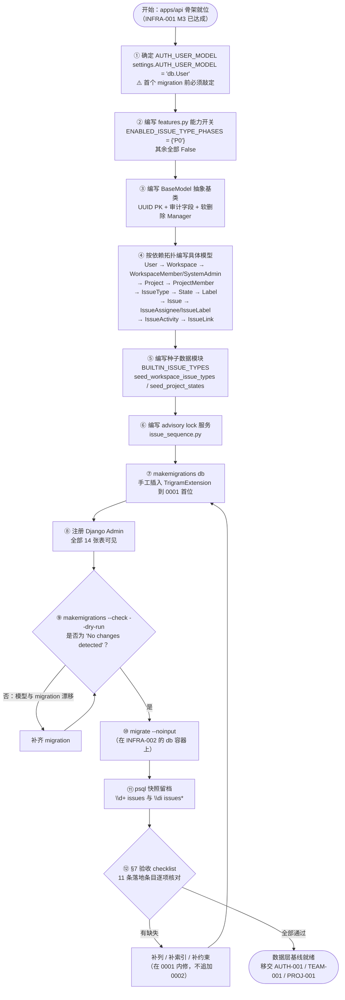
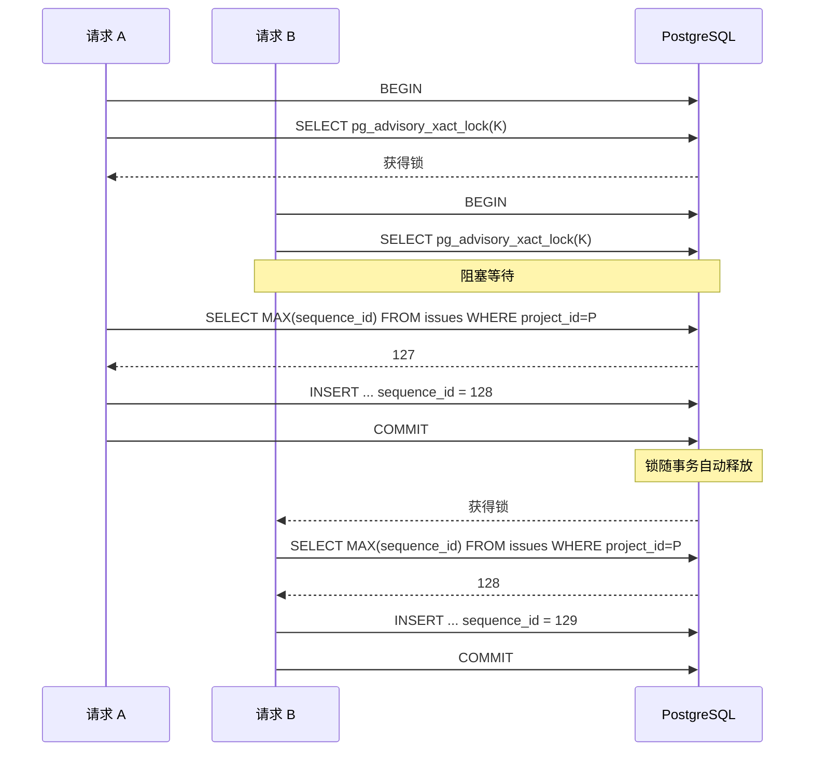

# Django ORM 初始数据模型

| 元信息项 | 内容 |
| --- | --- |
| 文档编号 | INFRA-003 |
| 所属模块 | INFRA（基础设施与部署运维） |
| 所属迭代 | Sprint 0 — POC 技术验证（第 1-2 周，Day 2） |
| 优先级 | **P0**（全系统总闸，阻塞级中的阻塞级） |
| 编写顺序 | Sprint 0 第 3 篇 |
| 复杂度 | **高** |
| 文档状态 | 已确认（Approved） |
| 最后更新日期 | 2026-09-01 |
| 前置依赖 | [`architecture/unified-issue-model.md`](../architecture/unified-issue-model.md)、[`architecture/dynamic-fields-design.md`](../architecture/dynamic-fields-design.md)、[`architecture/rbac-permission-model.md`](../architecture/rbac-permission-model.md)、[`INFRA-001`](./INFRA-001-monorepo-scaffold.md)（`apps/api` 目录骨架）、[`INFRA-002`](./INFRA-002-docker-compose.md)（PostgreSQL 容器 + `migrator` 服务） |
| 阻塞下游 | `AUTH-001` `AUTH-002` `AUTH-003` `TEAM-001` `PROJ-001` `TASK-001` `BOARD-001`（Sprint 0 全部业务文档）→ 进而阻塞 Sprint 1-9 |
| 工作量估算 | 后端 3 人日（模型 + migration + 种子 + advisory lock 服务）/ 联调与测试（含 BT-01 并发压测与 Django Admin 验证）1.5 人日，合计 **4.5 人日**（数据层文档，无前端界面工作量） |

---

## 1. 概述

### 1.1 功能定位

定义 **POC 阶段全部 Django 数据模型**并自动生成 migrations，交付一个「`manage.py migrate` 零错误、表结构一次性建齐、种子数据可幂等重放」的数据层基线。

本文档是全系统数据模型的基石。[`docs/README.md`](../README.md) §7.3 第 1 条把它列为**全系统总闸**：

> `INFRA-003`（Django 初始数据模型）是全系统总闸：`unified-issue-model.md` 与 `dynamic-fields-design.md` 未定稿前，不得开始任何业务表建模，避免后期返工改表。

因此本文档的唯一设计原则来自 [`unified-issue-model.md`](../architecture/unified-issue-model.md) §6：

> **P0 一次性把所有列建齐（含 `issue_type` / `custom_fields` / `sort_order` / `sequence_id` / 四格式描述列），后续阶段只做「功能开关 + 种子数据 + 索引」，避免对已有百万行 `issues` 表执行 `ALTER TABLE ADD COLUMN`。**

它的直接推论是本文档**必须超出 P0 的功能范围建表**：`custom_fields` JSONB 列、`idx_issue_custom_fields` GIN 索引、`Issue.parent` 自引用外键、`State.issue_type` 外键、`IssueLink` 整张表在 P0 都不被任何接口使用，但都必须在 Day 2 的首个 migration 中建出。**P0 建列不等于 P0 启用**——这条区分贯穿全文，见 §2.4 规则 1。

交付四类产物：

| 产物类别 | 内容 |
| --- | --- |
| 模型代码 | `apps/api/plane/db/models/` 下 15 个模型（`BaseModel` 抽象基类 + 14 个具体表） |
| Migration | `plane/db/migrations/0001_initial.py`（含 `pg_trgm` 扩展）+ `0002_seed_*`（如需数据迁移） |
| 种子数据 | `plane/db/seeds/issue_types.py`（`BUILTIN_ISSUE_TYPES` + 两个 seed 函数）+ `seed_builtin_data` management command |
| 配套设施 | `plane/settings/features.py`（能力开关）、`plane/settings/common.py` 数据库配置、`plane/db/services/issue_sequence.py`（advisory lock）、`plane/db/admin.py`（Django Admin 注册）、`wait_for_db` command |

### 1.2 目标用户

| 用户 | 场景 | 关注点 |
| --- | --- | --- |
| 后端开发者（主要） | 写 Serializer / ViewSet / Service 时消费模型 | 字段语义明确、约束在数据库层而非仅在应用层、`related_name` 可预测 |
| 数据库 / 运维 | 生产迁移、备份、慢查询排查 | migration 是否可逆、索引是否覆盖主查询路径、是否存在锁表风险 |
| 下游功能文档作者 | `TEAM-001` / `PROJ-001` / `TASK-001` 等直接引用本文档的模型 | 本文档是模型定义的**唯一权威**；下游文档若与本文档分歧，以本文档为准并回改下游 |
| 前端开发者（间接） | 通过 OpenAPI schema 消费类型 | 枚举取值、可空性 |

**本文档不面向终端用户**，无用户界面（详见 §3）。

### 1.3 前置依赖

| 依赖文档 | 本文档消费的具体决策 | 缺失后果 |
| --- | --- | --- |
| [`architecture/unified-issue-model.md`](../architecture/unified-issue-model.md) | §2.2 `BaseModel` + 软删除 Manager；§2.3~2.11 全部模型字段 / 约束 / 索引定义；§3 `sequence_id` advisory lock 完整实现；§4 四格式描述存储与 `save()` 派生；§5 内置 5 种 `IssueType` 与状态集种子数据；§6 迭代能力分层与 `features.py`；§9 落地检查清单 | 模型定义无来源，返工改表 |
| [`architecture/dynamic-fields-design.md`](../architecture/dynamic-fields-design.md) | `custom_fields jsonb NOT NULL DEFAULT '{}'::jsonb` 建列 SQL；GIN 索引 opclass 选定 `jsonb_ops`（**非** `jsonb_path_ops`）；`cf_` 前缀键命名规范 | P2 需对生产 `issues` 表 `ALTER TABLE` + `CREATE INDEX`，长时间锁表 |
| [`architecture/rbac-permission-model.md`](../architecture/rbac-permission-model.md) | §3.1 `BaseModel` 审计字段（`created_by` / `updated_by`）；§2.2/§2.3 `WorkspaceRole` / `ProjectRole` 整数等级枚举；§3.2 `WorkspaceMember` / `ProjectMember` / `SystemAdmin` 模型；`Manager.accessible_by()` 的行级过滤索引前提 | 权限模型无物理载体；`role` 若建成字符串，P1 需破坏性迁移 |
| [`INFRA-001`](./INFRA-001-monorepo-scaffold.md) | `apps/api/plane/{db,settings,app}/` 目录骨架；`pyproject.toml` 与 `uv.lock`；`pnpm api:migrate` 根脚本 | 代码无处可写 |
| [`INFRA-002`](./INFRA-002-docker-compose.md) | `db` 服务（`postgres:15.7-alpine`）+ `init-extensions.sql`；`migrator` 一次性服务与 `docker-entrypoint-migrator.sh` 的调用契约（`wait_for_db` → `migrate` → `seed_builtin_data` → `collectstatic`） | 无数据库可迁移 |

**依赖强度**：前三份架构文档均为**强依赖**。本文档不引入任何架构文档未定义的字段；若实施中发现架构文档遗漏，走 ADR 流程回改架构文档，再同步本文档。本文档相对架构文档的**唯一补充类改动**是补齐 `WorkspaceMember` / `ProjectMember` / `SystemAdmin` 三张表的 `db_table`（架构文档未指定，见 §4.5 说明块），属于填补空白而非偏离。

### 1.4 竞品参考

#### Plane（开源，可完整对标）

Plane 的 `apps/api/plane/db/models/` 是本文档的直接蓝本，四项设计被**完整复用**：

| 复用项 | Plane 实现 | 本系统 |
| --- | --- | --- |
| App 划分 | 单一 `db` app 承载全部业务表，业务逻辑分散在 `app` / `api` / `space` 等 app | 完全一致（见 §2.2） |
| 序列号生成 | `pg_advisory_xact_lock` + `MAX(sequence_id)+1` | 完整复用，含锁键算法（见 §4.11） |
| 描述多格式存储 | `description`(JSON) / `description_html` / `description_binary` / `description_stripped` 四列冗余 | 完整参考，仅把 `description` 改名为 `description_json`（见 §6.3） |
| 排序 | `sort_order` FloatField 浮点插值 | 完整复用（见 §4.12） |

差异集中在 `IssueType`（Plane 是 Pro 商业特性且不含自定义字段，我们开源实现）与 `custom_fields`（Plane 完全没有），见 §6.1。

#### Ones（闭源，业务能力可参考）

Ones 的**统一 Issue Type 系统**（组织级类型定义 + 项目级启用子集 + 类型级工作流/布局/权限）是 `IssueType` 模型的设计来源。本文档在 P0 落地其数据结构骨架（Workspace 级 `IssueType` 表 + `is_system` / `is_default` / `sort_order`），并按 [`unified-issue-model.md`](../architecture/unified-issue-model.md) §2.5 以注释形式预留 P3 的四个配置列（`layout_config` / `workflow_config` / `permission_config` / `notification_scheme`）。见 §6.4。

---

## 2. 业务逻辑

### 2.1 数据模型初始化流程



**步骤顺序不可调换的四处**：

| 约束 | 原因 |
| --- | --- |
| **① 必须最先** | Django 要求 `AUTH_USER_MODEL` 在**首个 migration 生成之前**确定。一旦 `0001_initial` 已应用再更换用户模型，官方唯一可行路径是删库重建（`sprint-overview.md` §9 风险 4）。 |
| **② 必须在 ⑤ 之前** | `seed_workspace_issue_types` 读取 `settings.ENABLED_ISSUE_TYPE_PHASES` 过滤类型。开关未定义时 seed 函数 `AttributeError`。 |
| **④ 内部严格按拓扑序** | `Issue.state` 指向 `State`，`State.project` 指向 `Project`，`Project.workspace` 指向 `Workspace`。虽然 Django 支持字符串惰性引用（`"db.User"`）可绕过导入顺序，但**模型文件的物理定义顺序仍应与依赖方向一致**，便于阅读与排查。 |
| **⑫ 失败时回到 ⑦ 而非追加 0002** | P0 尚无生产数据。发现漏列时应**删除 `0001_initial` 重新生成**，保持首个 migration 的整洁性；一旦 Sprint 0 验收通过并对外演示，此后任何变更必须走追加式 migration。 |

### 2.2 Django App 划分策略

对标 Plane 的 `plane/db/models/` 结构：**全部业务表集中在单一 `db` app**，业务逻辑按职能分散到其他 app。

```
apps/api/plane/
├── db/                          # ← 唯一持有 models 的 app（app_label = "db"）
│   ├── models/
│   │   ├── __init__.py          # 汇总导出，供 `from plane.db.models import X` 使用
│   │   ├── base.py              # BaseModel / SoftDeleteManager / SoftDeleteQuerySet
│   │   ├── roles.py             # WorkspaceRole / ProjectRole（整数角色枚举）
│   │   ├── user.py              # User / UserManager
│   │   ├── workspace.py         # Workspace / WorkspaceMember
│   │   ├── project.py           # Project / ProjectMember
│   │   ├── system.py            # SystemAdmin
│   │   ├── issue_type.py        # IssueType
│   │   ├── state.py             # State
│   │   ├── label.py             # Label
│   │   └── issue.py             # Issue / IssueAssignee / IssueLabel / IssueActivity / IssueLink
│   ├── migrations/
│   │   └── 0001_initial.py      # P0 唯一 migration
│   ├── seeds/
│   │   ├── __init__.py
│   │   └── issue_types.py       # BUILTIN_ISSUE_TYPES + seed_* 函数
│   ├── services/
│   │   ├── issue_sequence.py    # advisory lock + next_sequence_id + create_issue
│   │   └── sort_order.py        # calculate_sort_order 浮点插值
│   ├── management/commands/
│   │   ├── wait_for_db.py       # INFRA-002 §4.8 契约
│   │   └── seed_builtin_data.py # migrator 调用，幂等
│   ├── mixins/                  # 预留：P2 的 AuditMixin 等
│   └── admin.py                 # Django Admin 注册（开发调试用）
├── app/                         # DRF 视图 / 序列化器 / 权限（无 models）
├── api/                         # 外部 API（/api/v1/external/，无 models）
├── space/                       # 公开空间（/api/v1/public/，无 models）
├── authentication/              # 认证后端与视图（无 models，AUTH-001 交付）
├── bgtasks/                     # Celery 任务（无 models）
└── settings/
    ├── common.py                # 数据库、缓存、AUTH_USER_MODEL
    ├── features.py              # 能力开关
    ├── local.py / production.py / test.py
```

**为什么用单一 `db` app 而不是按领域拆成 `workspaces` / `projects` / `issues` 多个 app？**

| 理由 | 说明 |
| --- | --- |
| 1. 跨 app migration 依赖是主要复杂度来源 | 多 app 时 `issues.0001` 需 `dependencies = [("projects", "0001")]`，任一 app 重排 migration 都可能触发 `InconsistentMigrationHistory`。单 app 下依赖全在文件内，由 Django 自动排序。 |
| 2. 本系统的表之间是强耦合的单一聚合根图 | `Workspace → Project → Issue` 是一条主干链，不存在可独立演进的边界。强行拆 app 只会产出大量跨 app 外键，得不到任何解耦收益。 |
| 3. 与 Plane 一致，便于对标其源码 | 排查问题、对比字段、复用其迁移经验时无需做心智映射。 |
| 4. `app_label` 稳定 | 全部外键写作 `"db.User"` / `"db.Workspace"`，字符串短且永不因目录重构而失效。 |

**代价与规避**：`plane/db/models/` 会随迭代膨胀。规避手段是**按文件拆分而非按 app 拆分**——每个业务概念一个模块文件，`__init__.py` 统一导出。P4 若单文件超过 800 行再进一步按子目录拆分，仍不改 `app_label`。

**`db` app 只放 models，不放视图**：DRF 视图、序列化器、权限类一律落在 `app/`。这是 Plane 的既有约定，好处是 `db` app 无 HTTP 依赖，可被 Celery 任务、management command、数据修复脚本安全导入。

### 2.3 Migration 执行顺序

P0 只有一个 migration，但**其内部操作顺序有硬性要求**：

```mermaid
flowchart LR
    A["0001_initial"] --> A1["① TrigramExtension()<br/>CREATE EXTENSION pg_trgm"]
    A1 --> A2["② CreateModel: User<br/>（AUTH_USER_MODEL，必须最先建表）"]
    A2 --> A3["③ CreateModel: Workspace<br/>→ WorkspaceMember / SystemAdmin"]
    A3 --> A4["④ CreateModel: Project<br/>→ ProjectMember"]
    A4 --> A5["⑤ CreateModel: IssueType / State / Label"]
    A5 --> A6["⑥ CreateModel: Issue<br/>→ IssueAssignee / IssueLabel<br/>→ IssueActivity / IssueLink"]
    A6 --> A7["⑦ AddIndex ×N<br/>含 GinIndex idx_issue_custom_fields<br/>与 idx_issue_desc_trgm"]
    A7 --> A8["⑧ AddConstraint ×N<br/>唯一约束（带偏条件）+ 检查约束"]
```



| 顺序约束 | 原因 |
| --- | --- |
| **① `TrigramExtension` 必须在全部 `AddIndex` 之前** | `idx_issue_desc_trgm` 使用 `gin_trgm_ops` opclass。扩展未安装时 `CREATE INDEX` 直接报 `operator class "gin_trgm_ops" does not exist`。Django 的 `makemigrations` **不会自动插入扩展操作**，必须手工把 `TrigramExtension()` 放到 `operations` 列表首位。 |
| **① 与 `init-extensions.sql` 构成双保险** | [`INFRA-002`](./INFRA-002-docker-compose.md) §4.2 的 `deploy/compose/init/init-extensions.sql` 只在 PostgreSQL **数据目录为空**时执行。已有 `pgdata` 卷的环境（如从旧版本升级）不会跑该脚本，此时只有 migration 内的 `TrigramExtension` 能保证扩展存在。**两条路径都必须保留。** |
| **② `User` 必须最先** | 几乎所有表的 `created_by` / `updated_by` 都指向 `db.User`。Django 会自动排序，但显式确认这一点可避免因手工编辑 migration 导致的循环依赖。 |
| **⑦⑧ 索引与约束在建表之后** | Django 默认行为。P0 空表下顺序无性能影响；生产环境的后续 migration 见 §4.17 的 `AddIndexConcurrently` 规范。 |

**执行入口**（三条，行为完全一致）：

| 场景 | 命令 |
| --- | --- |
| Docker 一键启动 | `docker compose up` → `migrator` 服务自动执行（[`INFRA-002`](./INFRA-002-docker-compose.md) §4.8） |
| 本地开发（宿主机） | `pnpm api:migrate`（= `uv run --project apps/api python manage.py migrate`） |
| 容器内手工 | `docker compose exec api python manage.py migrate` |

### 2.4 业务规则

#### 规则 1：P0 建列 ≠ P0 启用（本文档的核心规则）

| 数据库对象 | P0 建列 | P0 启用 | 启用迭代 | 由谁控制 |
| --- | --- | --- | --- | --- |
| `issues.issue_type_id` | ✅ | ❌ 不暴露给前端 | P1 | `EXPOSE_ISSUE_TYPE_SELECTOR` |
| `issues.custom_fields` + GIN | ✅ | ❌ 不读不写 | P2 | `ENABLE_CUSTOM_FIELDS` |
| `issues.parent_id` | ✅ | ❌ | P1（一级子任务） | 无接口暴露 |
| `issues.archived_at` | ✅ | ❌ | P2 | 无接口暴露 |
| `issues.completed_at` | ✅ | ✅ 由 `save()` 自动派生 | P0 | — |
| `issues.description_binary` | ✅ | ❌ | P3（协同编辑） | 无接口暴露 |
| `issues.priority` / `start_date` / `labels` | ✅ | ❌（保留默认值 / 空集） | P1 | 序列化器字段白名单 |
| `states.issue_type_id` | ✅ | ❌ 恒为 NULL | P3 | `ENABLE_PER_TYPE_STATES` |
| `issue_types` 全表 | ✅ | ⚠️ 仅种子「任务」1 条 | P1 起 5 条 | `ENABLED_ISSUE_TYPE_PHASES` |
| `issue_links` 全表 | ✅ | ❌ 无接口 | P2 | 无接口暴露 |
| `issue_activities` 全表 | ✅ | ⚠️ **写入但不提供查询接口** | P2 展示 | 无 GET 端点 |
| `workspace_members.department_id` / `custom_role_id` | ❌ **不建** | ❌ | P3 | 见下方说明 |
| `issues.cycle_id` / `module_id` | ❌ **不建** | ❌ | P2+ | 见下方说明 |

> **启用阶段分歧登记（架构文档待回改）**：`description_binary` 的启用阶段，[`unified-issue-model.md`](../architecture/unified-issue-model.md) §2.8 字段表与 §6 迭代分层标为 **P2**，本文标为 **P3**（协同编辑）。**P3 为正确口径**：该列由 `apps/live` 的 Hocuspocus/Yjs 协同编辑服务写入（见 §6.3），而协同编辑按 [`sprint-overview.md`](./sprint-overview.md) §2 与 §9 风险 6 的规划落在 P3。**架构文档待回改**（§2.8 字段表与 §6 分层表改 P2 → P3），本文按 P3 口径执行。

**为什么 `department` / `custom_role` / `cycle` / `module` 例外，不在 P0 建列？**

这四个字段是**指向尚不存在的表的外键**（`Department` / `CustomRole` / `Cycle` / `Module` 均为 P2/P3 表）。外键无法在被引用表缺失时创建，因此它们必然是 P2/P3 的 `AddField` 操作。[`unified-issue-model.md`](../architecture/unified-issue-model.md) §2.8 与 [`rbac-permission-model.md`](../architecture/rbac-permission-model.md) §3.2 也正是以**注释形式**预留，而非真实字段。（**架构文档落地清单待回改**：`unified-issue-model.md` §7.4 与 §9 检查清单条目 2 却要求 `cycle_id` / `module_id`「P0 建表时即创建列」，与其 §2.8 的注释预留自相矛盾，且外键指向尚不存在的表在物理上无法创建。该清单需按本文口径回改，登记见 §7.3 条目 2。）

「一次性建齐」原则的**准确边界**是：**不依赖未来新表的列，P0 全部建齐**。加一个可空外键列本身是 PostgreSQL 的 `ALTER TABLE ADD COLUMN ... NULL`，在 PG 11+ 是常数时间操作（不重写表），真正昂贵的是 `NOT NULL DEFAULT <非常量>` 与 `CREATE INDEX`。这两类昂贵操作在 P0 已全部完成（`custom_fields` 的 `NOT NULL DEFAULT '{}'` 与全部 GIN 索引）。

#### 规则 2：软删除是默认语义

| 子规则 | 内容 |
| --- | --- |
| 2.1 | 所有继承 `BaseModel` 的模型，`Model.objects` 返回的 QuerySet **自动过滤 `deleted_at IS NULL`**。 |
| 2.2 | `Model.objects.filter(...).delete()` 默认执行**软删除**（`UPDATE ... SET deleted_at = now()`）。物理删除必须显式写 `.delete(soft=False)`。 |
| 2.3 | `Model.all_objects` 是不过滤的原始 Manager，仅用于三类场景：序列号计算（`next_sequence_id`，见规则 3.3）、数据修复脚本、Django Admin 的软删除记录审查。业务代码使用 `all_objects` 需在 Code Review 中说明理由。 |
| 2.4 | 全部唯一约束必须带 `condition=Q(deleted_at__isnull=True)` **偏条件**。否则删除一个 slug 为 `acme` 的 Workspace 后无法再创建同名 Workspace。例外：`IssueAssignee` / `IssueLabel` 的唯一约束不带偏条件（见 §4.8 说明）。 |
| 2.5 | 外键 `on_delete` 的语义只在**物理删除**时生效。软删除下父行仍存在，级联需在 Service 层显式处理（如软删除 Project 时同步软删除其 Issue，`PROJ-001` 负责）。 |

#### 规则 3：序列号唯一且无空洞

| 子规则 | 内容 |
| --- | --- |
| 3.1 | `Issue.sequence_id` 在 `(project, sequence_id)` 维度唯一，展示为 `{project.identifier}-{sequence_id}`（如 `RBT-128`）。 |
| 3.2 | 生成必须走 `plane.db.services.issue_sequence.create_issue()`，**禁止**在 Serializer / ViewSet 内直连 `Issue.objects.create()` 并自行赋值 `sequence_id`。 |
| 3.3 | `next_sequence_id` 使用 `Issue.all_objects`（**含软删除记录**）计算 `MAX+1`，避免号码复用——已删除的 `RBT-5` 不应被新任务重新占用，否则历史链接与沟通记录指向错误对象。 |
| 3.4 | 序列号无空洞：`MAX()+1` 基于已提交数据，事务回滚不消耗号码。 |
| 3.5 | **持锁事务内绝对禁止任何外部 IO**：不得调用外部 HTTP（Webhook / 通知）、不得上传文件、不得同步生成缩略图。全部副作用走 `transaction.on_commit()` 投递 Celery。 |
| 3.6 | 数据库层的 `uniq_issue_sequence_per_project` 唯一约束是最终防线。即使应用层逻辑出错，也只会得到一个 `IntegrityError`（可转 409），而非用户可见的编号错乱。 |

#### 规则 4：种子数据幂等

| 子规则 | 内容 |
| --- | --- |
| 4.1 | `seed_workspace_issue_types` / `seed_project_states` 全部使用 `get_or_create`，重复调用不产生重复行、不报唯一约束错误。 |
| 4.2 | 种子函数由业务事件触发，**不由 migration 触发**：`Workspace` 创建后调用前者（`TEAM-001` §4.3.1），`Project` 创建后调用后者（`PROJ-001` §4.3）。 |
| 4.3 | `seed_builtin_data` management command 是**存量补种工具**，遍历现有 Workspace / Project 补齐种子。在全新数据库上（无任何 Workspace）它是合法的 no-op，退出码 0。 |
| 4.4 | 内置类型 / 状态的 `is_system=True`（`IssueType`）标记其不可删除。改名、改色、停用（`is_active=False`）允许。 |
| 4.5 | P0 时 `ENABLED_ISSUE_TYPE_PHASES = {"P0"}`，`seed_workspace_issue_types` 只创建「任务」1 条 `IssueType`（`is_default=True`）；`seed_project_states` 创建「任务」类型的 **4 条** State（待办 / 进行中 / 已完成 / 已取消），其中「已取消」建而不作为 P0 看板列渲染（`BOARD-001`）。 |

#### 规则 5：角色必须是整数

`WorkspaceMember.role` / `ProjectMember.role` 必须是 `IntegerField(choices=...IntegerChoices)`，不得是 `CharField`。理由（[`rbac-permission-model.md`](../architecture/rbac-permission-model.md) §2.2）：

1. 权限判定可直接写 `role__gte=15` 走索引范围扫描，无需在应用层维护「角色名 → 等级」映射表。
2. 支持层级保护：`operator.role > target.role` 一行表达「不能操作同级或更高级成员」。
3. 预留插值空间：`OWNER=20 / ADMIN=15 / MEMBER=10 / GUEST=5` 之间有间隔，P3 插入自定义角色无需改动既有值。

**这是 P0 必须做对的决策**：若建成 `CharField`，P1 引入多成员后需要一次带数据转换的破坏性迁移。

### 2.5 边界条件

| 边界 | 取值 / 行为 | 处置 |
| --- | --- | --- |
| PostgreSQL 版本 | ≥ 15.7（[`tech-stack.md`](../architecture/tech-stack.md) §8） | `jsonb` / 偏索引 / `GENERATED ALWAYS AS ... STORED`（P2 用）均需 PG 12+，15.7 满足 |
| 必需扩展 | `pg_trgm`（`gin_trgm_ops`）、`btree_gin` | 双保险：`init-extensions.sql` + migration 内 `TrigramExtension` |
| Python / Django | Python 3.12.x + Django 5.1 + psycopg 3.2 | `DATABASES.ENGINE` 用 `django.db.backends.postgresql`（psycopg3 由同一 backend 自动识别） |
| `Issue.name` 长度 | 512 字符（放宽自 Plane 的 255） | 超长在 Serializer 层 400，不依赖数据库截断 |
| `Workspace.slug` 长度 | 48 字符 | `SlugField(max_length=48)` |
| `Project.identifier` | `varchar(12)` 建列，业务层限 `^[A-Z]{2,5}$` | 列宽留余量供 P2 放宽规则时零 DDL |
| `color` 字段 | `varchar(9)`，支持 `#RRGGBB` 与 `#RRGGBBAA` | — |
| advisory lock 锁键 | `project_id.int >> 65` → 63 位无符号，落在 `bigint` 正数范围 | 碰撞概率极低且碰撞后果仅为一次多余等待，不影响正确性 |
| `sort_order` 精度耗尽 | 反复在同一间隙插入使间隔 < `1e-6` | 触发列内重排（`REBALANCE_THRESHOLD`），见 §4.12 |
| 空数据库上 `seed_builtin_data` | 无 Workspace / Project → 0 行写入 | 合法 no-op，退出码 0（规则 4.3） |
| 并发创建 Issue | 同项目串行（约 1~3ms / 次，≈330 QPS）；不同项目完全并行 | §5 BT-01 压测验证 |

---

## 3. UI/UX 设计

### 3.1 本文档无用户界面

> **数据层文档。** `INFRA-003` 交付 Django 模型定义与 migrations，不包含任何面向终端用户的界面、页面、组件或交互流程。本章不适用常规的信息架构 / 视觉规范 / 交互状态 / 响应式 / 无障碍等章节。

本文档定义的数据结构会经由下游文档间接呈现给用户，但界面设计责任归属下游：

| 数据结构 | 最终呈现位置 | 责任文档 |
| --- | --- | --- |
| `Workspace` / `WorkspaceMember` | 团队切换器、团队设置页 | `TEAM-001` |
| `Project` / `ProjectMember` | 项目列表、项目详情 | `PROJ-001` |
| `Issue` 5 个 P0 字段 | 任务卡片、任务详情抽屉 | `TASK-001` |
| `State.group` | 看板三列 | `BOARD-001` |
| `Issue.sequence_id` | 任务编号徽标 `RBT-128` | `TASK-001` |

### 3.2 Django Admin 基础配置（开发调试用）

Django Admin 是**唯一**与本文档直接绑定的界面，定位明确：

| 维度 | 约定 |
| --- | --- |
| 用途 | 仅供开发调试与 POC 验收演示（验收标准之一是「Django Admin 可查看所有模型」） |
| 访问路径 | `/django-admin/`（**非** `/admin/`——`/admin` 前缀在 Nginx 已被 `apps/admin` 的 `/god-mode` 之外的潜在冲突占用风险，显式区分） |
| 访问控制 | `is_staff=True` 的用户；生产环境通过 `settings.production` 的 `ENABLE_DJANGO_ADMIN=False` **整体摘除 URL** |
| 定位边界 | **不是产品的管理后台**。产品级管理后台是 `apps/admin`（God Mode），走正式 API 与权限体系 |
| 样式 | 使用 Django 默认样式，不做任何定制 |

```python
# apps/api/plane/db/admin.py
from django.contrib import admin

from plane.db.models import (
    Issue, IssueActivity, IssueAssignee, IssueLabel, IssueLink, IssueType,
    Label, Project, ProjectMember, State, SystemAdmin, User, Workspace,
    WorkspaceMember,
)


class SoftDeleteAdminMixin:
    """Admin 侧默认展示全部记录（含软删除），便于排查「数据去哪了」。"""

    def get_queryset(self, request):
        return self.model.all_objects.all() if hasattr(self.model, "all_objects") else super().get_queryset(request)


@admin.register(User)
class UserAdmin(SoftDeleteAdminMixin, admin.ModelAdmin):
    list_display = ("email", "display_name", "is_active", "is_staff", "created_at")
    search_fields = ("email", "display_name")
    list_filter = ("is_active", "is_staff")
    ordering = ("-created_at",)
    readonly_fields = ("id", "created_at", "updated_at", "last_login_at")


@admin.register(Workspace)
class WorkspaceAdmin(SoftDeleteAdminMixin, admin.ModelAdmin):
    list_display = ("name", "slug", "owner", "created_at", "deleted_at")
    search_fields = ("name", "slug")
    raw_id_fields = ("owner",)          # 避免 User 量大时渲染巨型下拉


@admin.register(WorkspaceMember)
class WorkspaceMemberAdmin(SoftDeleteAdminMixin, admin.ModelAdmin):
    list_display = ("workspace", "member", "role", "is_active")
    list_filter = ("role", "is_active")
    raw_id_fields = ("workspace", "member")


@admin.register(Project)
class ProjectAdmin(SoftDeleteAdminMixin, admin.ModelAdmin):
    list_display = ("name", "identifier", "workspace", "status", "created_at")
    search_fields = ("name", "identifier")
    list_filter = ("status",)
    raw_id_fields = ("workspace", "created_by")


@admin.register(Issue)
class IssueAdmin(SoftDeleteAdminMixin, admin.ModelAdmin):
    list_display = ("display_key", "name", "project", "state", "priority", "sort_order", "created_at")
    search_fields = ("name", "description_stripped")
    list_filter = ("priority", "project__workspace")
    raw_id_fields = ("project", "issue_type", "state", "parent", "created_by")
    readonly_fields = ("sequence_id", "description_stripped", "completed_at", "created_at", "updated_at")

    @admin.display(description="编号")
    def display_key(self, obj: Issue) -> str:
        return f"{obj.project.identifier}-{obj.sequence_id}"

    def get_queryset(self, request):
        # Admin 列表默认 N+1 严重，显式 select_related
        return super().get_queryset(request).select_related("project", "state", "issue_type")


@admin.register(IssueActivity)
class IssueActivityAdmin(admin.ModelAdmin):
    list_display = ("issue", "actor", "verb", "field", "old_value", "new_value", "created_at")
    list_filter = ("verb", "field")
    raw_id_fields = ("issue", "actor")


# 其余模型使用默认 ModelAdmin 即可满足「可查看」要求
for _model in (SystemAdmin, ProjectMember, IssueType, State, Label,
               IssueAssignee, IssueLabel, IssueLink):
    admin.site.register(_model)

admin.site.site_header = "RabbitProjects · 数据层调试台（开发专用）"
admin.site.index_title = "全部数据模型"
```

**三条 Admin 约定**：

1. `raw_id_fields` 必须覆盖全部外键。默认的 `<select>` 会把目标表全量加载进内存，在 `User` / `Issue` 上一旦数据量上来就直接把 Admin 页面拖垮。
2. 派生字段（`sequence_id` / `description_stripped` / `completed_at`）一律 `readonly_fields`。它们由 `save()` 与 advisory lock 服务生成，Admin 手工改写会破坏一致性。
3. `SoftDeleteAdminMixin` 让 Admin 看到软删除记录。这与业务侧默认过滤相反，是刻意的——Admin 的价值恰在于回答「记录去哪了」。

### 3.3 开发者体验设计

| 场景 | 命令 / 入口 | 期望体验 |
| --- | --- | --- |
| 首次建库 | `docker compose up`（`migrator` 自动执行） | 零人工步骤，日志显示 `Applying db.0001_initial... OK` |
| 本地改模型 | `pnpm api:makemigrations` → `pnpm api:migrate` | 两步完成 |
| 校验模型与 migration 是否漂移 | `python manage.py makemigrations --check --dry-run` | CI 中执行，输出 `No changes detected` 即通过（见 §5 IT-03） |
| 查看表结构 | `docker compose exec db psql -U rp -d rabbit_projects -c "\d+ issues"` | — |
| 数据浏览 | `http://localhost/django-admin/` | 14 张表全部可见可查 |
| 交互式调试 | `docker compose exec api python manage.py shell` | 可直接 `from plane.db.models import Issue` |
| 存量补种 | `docker compose exec api python manage.py seed_builtin_data` | 幂等，可任意次重放 |

---

## 4. 技术架构

### 4.1 模块文件布局

见 §2.2 的目录树。本章按依赖拓扑逐个给出模型定义。**全部代码与三份架构文档逐字段对齐**；凡本文档相对架构文档有补充或收敛之处，均以 `说明` 块显式标注。

### 4.2 `BaseModel` — 全站抽象基类

> **口径合并说明（已对齐）**
>
> 历史上两份架构文档各自给出了一版 `BaseModel`：[`unified-issue-model.md`](../architecture/unified-issue-model.md) §2.2 版本贡献**软删除语义的实现载体**（`SoftDeleteManager` / `all_objects`），[`rbac-permission-model.md`](../architecture/rbac-permission-model.md) §3.1 版本贡献**权限追溯所需的审计字段**（`created_by` / `updated_by`、`ordering`）。二者正交互补，本文档据此采用**并集版本**——审计字段是权限判定与操作溯源的必要条件（`rbac` §5 的「谁改了什么」需要 `updated_by`），软删除 Manager 是软删除语义的唯一实现路径，二者作用域不重叠，可无损合并。
>
> **现行架构文档已按该并集口径回改合并**：`unified-issue-model.md` §2.2 的 `BaseModel` 现与下方代码**逐字段一致**（含审计外键、`SoftDeleteManager`、`all_objects` 与 `ordering`，并注明子模型不得重复声明 `created_by` / `updated_by`）；`rbac-permission-model.md` §3.1 的版本为其子集（不含软删除 Manager）。三方（两份架构文档 + 本文档）**已对齐**，本项无待回改事项。

```python
# apps/api/plane/db/models/base.py
import uuid

from django.db import models
from django.utils import timezone


class SoftDeleteQuerySet(models.QuerySet):
    """delete() 默认改写为软删除；物理删除需显式 soft=False。"""

    def delete(self, soft: bool = True) -> tuple[int, dict[str, int]]:
        if soft:
            return self.update(deleted_at=timezone.now()), {}
        return super().delete()


class SoftDeleteManager(models.Manager):
    """默认 Manager：自动过滤已软删除的行。"""

    def get_queryset(self) -> SoftDeleteQuerySet:
        return SoftDeleteQuerySet(self.model, using=self._db).filter(deleted_at__isnull=True)


class BaseModel(models.Model):
    """全站模型基类：UUID 主键 + 审计字段 + 软删除位。

    字段口径与 unified-issue-model.md §2.2 逐字段一致（该文档已合并
    rbac-permission-model.md §3.1 的审计外键定义）。
    """

    id = models.UUIDField(
        default=uuid.uuid4, unique=True, editable=False, db_index=True, primary_key=True
    )
    created_at = models.DateTimeField(auto_now_add=True, db_index=True, verbose_name="创建时间")
    updated_at = models.DateTimeField(auto_now=True, verbose_name="更新时间")
    created_by = models.ForeignKey(
        "db.User", on_delete=models.SET_NULL, null=True, blank=True,
        related_name="%(class)s_created_by", verbose_name="创建人",
    )
    updated_by = models.ForeignKey(
        "db.User", on_delete=models.SET_NULL, null=True, blank=True,
        related_name="%(class)s_updated_by", verbose_name="最后修改人",
    )
    deleted_at = models.DateTimeField(null=True, blank=True, db_index=True, verbose_name="删除时间")

    objects = SoftDeleteManager()      # 默认：过滤软删除
    all_objects = models.Manager()     # 原始：含软删除，仅限序列号计算 / 数据修复 / Admin

    class Meta:
        abstract = True
        ordering = ("-created_at",)

    def soft_delete(self, *, actor_id: uuid.UUID | None = None) -> None:
        """单实例软删除。级联由 Service 层显式处理（规则 2.5）。"""
        self.deleted_at = timezone.now()
        if actor_id is not None:
            self.updated_by_id = actor_id
        self.save(update_fields=["deleted_at", "updated_by", "updated_at"])
```

| 字段 | 类型 | 约束 / 默认 | 索引 | 说明 |
| --- | --- | --- | --- | --- |
| `id` | `uuid` | PK, NOT NULL, `default uuid4` | PK（隐含 B-tree） | 应用侧生成，不用数据库序列。好处：可在事务提交前拿到 ID 用于构造关联对象与事件载荷；不泄漏数据量规模 |
| `created_at` | `timestamptz` | NOT NULL, `auto_now_add` | ✅ | 全站默认排序键，必须建索引 |
| `updated_at` | `timestamptz` | NOT NULL, `auto_now` | — | `auto_now` 在 `save(update_fields=...)` 时需显式带上 `updated_at`，否则不刷新 |
| `created_by` | `uuid` FK → `db.User` | NULL, `SET_NULL` | FK 自动建索引 | 用户注销后记录保留 |
| `updated_by` | `uuid` FK → `db.User` | NULL, `SET_NULL` | FK 自动建索引 | 操作溯源 |
| `deleted_at` | `timestamptz` | NULL | ✅ | 软删除位；全部唯一约束的偏条件依据 |

**为什么 `id` 同时声明 `primary_key=True` 与 `unique=True`、`db_index=True`？** 这三者在 PostgreSQL 上语义重叠（PK 已隐含唯一索引），Django 不会重复建索引。保留冗余声明的唯一理由是**与 `rbac-permission-model.md` §3.1 及 Plane 的既有写法逐字一致**，降低对标源码时的心智负担。这是刻意接受的冗余，不是缺陷。

**`BaseModel` 与 `User` 的循环依赖处置**：`created_by` 指向 `db.User`，若 `User` 继承 `BaseModel` 就形成自引用外键的定义循环。处置方式：**`User` 不继承 `BaseModel`**，而是手工对齐其三项约定（UUID 主键、`created_at` / `updated_at`、`deleted_at`）。见 §4.3。

### 4.3 `User` — 认证主体

> **权威性说明**：`User` 的权威定义在本文档。[`AUTH-001`](./AUTH-001-registration-login.md) §4.1 复述了同一份定义并明确「若与 `INFRA-003` 出现分歧，以 `INFRA-003` 为准」。以下代码与 `AUTH-001` §4.1 逐字段一致。

```python
# apps/api/plane/db/models/user.py
import uuid

from django.contrib.auth.models import AbstractUser, BaseUserManager
from django.db import models


class UserManager(BaseUserManager):
    """以 email 为登录标识的 Manager（AbstractUser 默认以 username 为标识）。"""

    def create_user(self, email: str, password: str | None = None, **extra):
        if not email:
            raise ValueError("邮箱不能为空")
        email = self.normalize_email(email).strip().lower()   # 归一化：大小写与首尾空格
        user = self.model(email=email, **extra)
        user.set_password(password)                            # Argon2id（settings.PASSWORD_HASHERS）
        user.save(using=self._db)
        return user

    def create_superuser(self, email: str, password: str, **extra):
        extra.setdefault("is_staff", True)
        extra.setdefault("is_superuser", True)
        return self.create_user(email, password, **extra)


class User(AbstractUser):
    """系统用户 —— 认证主体，全局唯一实体（不归属任何 Workspace）。

    与 BaseModel 的关系：User 不继承 BaseModel（BaseModel 的 created_by/updated_by
    指向 User，继承会导致自引用外键的循环），但手工对齐其三项约定：
    UUID 主键、created_at/updated_at 审计时间、deleted_at 软删除位。
    """

    id = models.UUIDField(primary_key=True, default=uuid.uuid4, editable=False)

    # ── 认证字段 ─────────────────────────────────────────────
    email = models.EmailField(max_length=254, unique=True, db_index=True, verbose_name="邮箱")
    username = None                                            # 弃用 username 登录路径
    # password 字段由 AbstractBaseUser 提供：varchar(128)，存 Argon2id 编码串

    # ── 展示字段 ─────────────────────────────────────────────
    display_name = models.CharField(max_length=150, verbose_name="显示名")
    avatar_url = models.URLField(max_length=800, blank=True, verbose_name="头像地址")

    # ── 状态与审计 ───────────────────────────────────────────
    is_active = models.BooleanField(default=True, db_index=True, verbose_name="是否启用")
    last_login_at = models.DateTimeField(null=True, blank=True, verbose_name="最近登录时间")
    last_workspace_id = models.UUIDField(null=True, blank=True, verbose_name="最近访问的工作空间")
    created_at = models.DateTimeField(auto_now_add=True)
    updated_at = models.DateTimeField(auto_now=True)
    deleted_at = models.DateTimeField(null=True, blank=True, db_index=True)

    USERNAME_FIELD = "email"
    REQUIRED_FIELDS = []
    objects = UserManager()

    class Meta:
        db_table = "users"
        verbose_name = "用户"
        indexes = [
            models.Index(fields=["email", "is_active"]),   # 登录主查询路径
        ]

    def __str__(self) -> str:
        return f"{self.display_name} <{self.email}>"
```

| 设计点 | 决策与理由 |
| --- | --- |
| `username = None` | 显式弃用 Django 的 username 登录路径。`USERNAME_FIELD = "email"` 使 `authenticate(username=<email>)` 走 email 查找。不置 `None` 会留下一个 `NOT NULL UNIQUE` 的 `username` 列，注册时必须编造值 |
| `last_workspace_id` 用 `UUIDField` 而非 FK | 避免 `User` → `Workspace` → `User(owner)` 的建表期循环外键。这是纯粹的「最近访问」缓存位，无引用完整性要求；指向已删除 Workspace 时前端回退到工作空间列表页 |
| `email` 归一化在 Manager 而非 Serializer | 保证 Django shell、Celery 任务、数据导入等全部写入路径统一归一化。若只在 Serializer 做，其他路径会写入 `Alice@X.COM` 与 `alice@x.com` 两条记录 |
| `is_active` 带 `db_index` | 登录查询 `WHERE email=? AND is_active=true` 与 `(email, is_active)` 复合索引配合；`AUTH-007` 的封禁功能也按此列筛选 |
| `deleted_at` 存在但 P0 不使用 | 用户注销（`AUTH-006`+）走软删除，P0 无注销入口 |
| **不继承 `BaseModel`** | 见 §4.2 末尾的循环依赖处置 |

**`AUTH_USER_MODEL` 设置**（必须在首个 migration 之前，见 §2.1 ①）：

```python
# apps/api/plane/settings/common.py
AUTH_USER_MODEL = "db.User"
PASSWORD_HASHERS = [
    "django.contrib.auth.hashers.Argon2PasswordHasher",       # 首选，argon2-cffi
    "django.contrib.auth.hashers.PBKDF2PasswordHasher",       # 兼容旧哈希的回退
]
```

### 4.4 `Workspace` / `WorkspaceMember` — 工作空间与成员

```python
# apps/api/plane/db/models/workspace.py
from django.db import models

from plane.db.models.base import BaseModel
from plane.db.models.roles import WorkspaceRole


class Workspace(BaseModel):
    """工作空间（产品术语「团队」）—— 一切业务数据的顶层归属容器。"""

    name = models.CharField(max_length=255, verbose_name="名称")
    slug = models.SlugField(max_length=48, db_index=True, verbose_name="URL 标识")
    description = models.TextField(blank=True, verbose_name="描述")
    logo = models.URLField(max_length=800, blank=True, null=True, verbose_name="Logo 地址")
    owner = models.ForeignKey(
        "db.User", on_delete=models.CASCADE, related_name="owner_workspaces", verbose_name="所有者"
    )

    class Meta(BaseModel.Meta):
        db_table = "workspaces"
        verbose_name = "工作空间"
        ordering = ("-created_at",)
        constraints = [
            models.UniqueConstraint(
                fields=["slug"],
                condition=models.Q(deleted_at__isnull=True),
                name="uniq_workspace_slug_alive",
            ),
        ]

    def __str__(self) -> str:
        return f"{self.name} ({self.slug})"


class WorkspaceMember(BaseModel):
    """工作空间成员：用户在某工作空间内的角色归属。"""

    workspace = models.ForeignKey(
        "db.Workspace", on_delete=models.CASCADE, related_name="workspace_member"
    )
    member = models.ForeignKey("db.User", on_delete=models.CASCADE, related_name="member_workspace")
    role = models.IntegerField(choices=WorkspaceRole.choices, default=WorkspaceRole.MEMBER)
    is_active = models.BooleanField(default=True)
    company_role = models.TextField(null=True, blank=True, verbose_name="公司内职务")

    # ---- P3 预留（指向尚不存在的表，故不在 P0 建列，见 §2.4 规则 1）----
    # department = models.ForeignKey("db.Department", on_delete=models.SET_NULL, null=True, blank=True, related_name="members")
    # custom_role = models.ForeignKey("db.CustomRole", on_delete=models.SET_NULL, null=True, blank=True, related_name="workspace_members")

    class Meta(BaseModel.Meta):
        db_table = "workspace_members"
        verbose_name = "工作空间成员"
        unique_together = ("workspace", "member")
        indexes = [
            models.Index(fields=["member", "workspace", "role"]),  # 权限判定主索引
            models.Index(fields=["workspace", "role"]),            # 成员列表按角色筛选
        ]
```

角色枚举（[`rbac-permission-model.md`](../architecture/rbac-permission-model.md) §2.2）：

```python
# apps/api/plane/db/models/roles.py
from django.db import models


class WorkspaceRole(models.IntegerChoices):
    OWNER = 20, "Owner"
    ADMIN = 15, "Admin"
    MEMBER = 10, "Member"
    GUEST = 5, "Guest"


class ProjectRole(models.IntegerChoices):
    ADMIN = 20, "Admin"
    CONTRIBUTOR = 15, "Contributor"
    COMMENTER = 10, "Commenter"
    VIEWER = 5, "Viewer"
```

| 设计点 | 说明 |
| --- | --- |
| `slug` 唯一约束带偏条件 | 删除 `acme` 团队后允许重建同名（规则 2.4） |
| `owner` 用 `CASCADE` 而非 `SET_NULL` | 与架构文档一致。注意：软删除下 `CASCADE` 不触发；用户物理删除（GDPR 数据清除）时其拥有的 Workspace 一并清除，这是刻意的 |
| `unique_together` 而非 `UniqueConstraint` | 与 `rbac-permission-model.md` §3.2 写法一致。语义上 `unique_together` 不带偏条件，意味着一个用户在同一 Workspace 内即使软删除过成员记录也无法重新加入——`TEAM-002` 引入成员移除时须改为「复活既有行」（`is_active=True` + `deleted_at=None`）而非插入新行。此约束刻意保留，因为「同一人在同一团队的成员关系」本质是单例 |
| P0 数据形态 | 每个 Workspace 恰好 1 条成员记录，`role=20`（OWNER）。**权限代码必须写成通用的 `role >= X` 比较**，禁止硬编码「创建者即所有者」的捷径 |

### 4.5 `Project` / `ProjectMember` / `SystemAdmin`

```python
# apps/api/plane/db/models/project.py
from django.db import models

from plane.db.models.base import BaseModel
from plane.db.models.roles import ProjectRole


class Project(BaseModel):
    """项目 —— Workspace 下的业务隔离单元，工作项的直接归属。"""

    class Status(models.TextChoices):
        DRAFT = "draft", "草稿"
        ACTIVE = "active", "进行中"
        ARCHIVED = "archived", "已归档"
        CLOSED = "closed", "已关闭"

    workspace = models.ForeignKey(
        "db.Workspace", on_delete=models.CASCADE, related_name="projects", verbose_name="所属工作空间"
    )
    name = models.CharField(max_length=255, verbose_name="项目名称")
    description = models.TextField(blank=True, verbose_name="项目描述")
    identifier = models.CharField(
        max_length=12, verbose_name="项目标识", help_text="工作项编号前缀，如 RBT-128 中的 RBT"
    )
    status = models.CharField(
        max_length=16, choices=Status.choices, default=Status.ACTIVE, db_index=True, verbose_name="项目状态"
    )

    class Meta(BaseModel.Meta):
        db_table = "projects"
        verbose_name = "项目"
        ordering = ("-created_at",)
        constraints = [
            models.UniqueConstraint(
                fields=["workspace", "identifier"],
                condition=models.Q(deleted_at__isnull=True),
                name="uniq_project_identifier_per_workspace",
            ),
        ]
        indexes = [
            models.Index(fields=["workspace", "status"], name="idx_project_ws_status"),
        ]

    def save(self, *args, **kwargs):
        # identifier 始终大写存储，避免 rbt / RBT 两份标识
        self.identifier = self.identifier.strip().upper()
        super().save(*args, **kwargs)

    def __str__(self) -> str:
        return f"[{self.identifier}] {self.name}"


class ProjectMember(BaseModel):
    """项目成员：用户在某项目内的角色归属，与工作空间角色完全独立。"""

    project = models.ForeignKey(
        "db.Project", on_delete=models.CASCADE, related_name="project_projectmember"
    )
    workspace = models.ForeignKey(
        "db.Workspace", on_delete=models.CASCADE, related_name="project_member"
    )  # 反范式冗余，避免 JOIN
    member = models.ForeignKey("db.User", on_delete=models.CASCADE, related_name="member_project")
    role = models.IntegerField(choices=ProjectRole.choices, default=ProjectRole.CONTRIBUTOR)
    is_active = models.BooleanField(default=True)
    view_props = models.JSONField(default=dict, blank=True)   # 个人视图偏好，非权限字段

    class Meta(BaseModel.Meta):
        db_table = "project_members"
        verbose_name = "项目成员"
        unique_together = ("project", "member")
        indexes = [
            models.Index(fields=["member", "project", "role"]),   # 权限判定主索引
            models.Index(fields=["member", "workspace"]),          # 行级过滤子查询索引
        ]
```

```python
# apps/api/plane/db/models/system.py
class SystemAdmin(BaseModel):
    """系统管理员 —— 独立于 Workspace 体系的实例级管理身份（God Mode）。"""

    user = models.OneToOneField("db.User", on_delete=models.CASCADE, related_name="system_admin")
    is_active = models.BooleanField(default=True)
    granted_by = models.ForeignKey(
        "db.User", on_delete=models.SET_NULL, null=True, related_name="granted_system_admins"
    )
    allowed_ip_cidrs = models.JSONField(default=list, blank=True)   # P3 IP 白名单（对标 Ones）

    class Meta(BaseModel.Meta):
        db_table = "system_admins"
        verbose_name = "系统管理员"
        indexes = [
            models.Index(fields=["user", "is_active"]),
        ]
```

> **`db_table` 补齐说明**
>
> [`rbac-permission-model.md`](../architecture/rbac-permission-model.md) §3.2 定义 `WorkspaceMember` / `ProjectMember` / `SystemAdmin` 时**未指定 `db_table`**。若沿用 Django 默认命名，表名会是 `db_workspacemember` / `db_projectmember` / `db_systemadmin`，与本系统其余全部表的 `snake_case` 复数命名（`users` / `workspaces` / `projects` / `issues` / `issue_types` / `states` / `labels` / `issue_activities` / `issue_links`）不一致。
>
> 本文档补齐为 `workspace_members` / `project_members` / `system_admins`。这是**填补架构文档未指定项**，不构成偏离：架构文档既未指定也未禁止，而同一文档内的兄弟模型（`Workspace` / `Project`）均显式使用 snake_case 复数。命名一致性对运维 SQL、备份脚本、`\dt` 排查有直接价值。[`INFRA-002`](./INFRA-002-docker-compose.md) §5 的 IT-04 表名断言清单已按此口径同步。

| 设计点 | 说明 |
| --- | --- |
| `ProjectMember.workspace` 反范式冗余 | 使「查询用户在某 Workspace 下所有可见项目」成为单表查询（命中 `(member, workspace)` 索引），无需 `JOIN projects`。这是 `Manager.accessible_by()` 行级过滤保持恒定成本的关键 |
| `Project.identifier` 用 `varchar(12)` 而业务限 `^[A-Z]{2,5}$` | 列宽留余量，P2 放宽规则时零 DDL |
| `Project.status` P0 仅 `active` | 其余取值由 `PROJ-004` 启用（规则 1） |
| `SystemAdmin` 独立建表而非 `User.is_system_admin` 布尔位 | 三条理由（`rbac` §3.3）：① 授予/撤销需审计（`granted_by` + `created_at`）；② 可独立缓存，不使 `User` 缓存失效；③ P3 的 IP 白名单等策略挂载在此表，不污染 `User` |
| `WS_OWNER` / `WS_ADMIN` 隐式视为所有项目的 `PROJ_ADMIN` | 权限判定逻辑，不体现为数据行——**不为 Workspace Admin 自动插入 `ProjectMember` 记录**，否则成员变动时需维护大量派生行 |

### 4.6 `IssueType` / `State` / `Label` — 分类维度

```python
# apps/api/plane/db/models/issue_type.py
class IssueType(BaseModel):
    """任务类型定义 —— 对标 Ones 的 Issue Type

    Workspace 级定义（而非 Project 级），保证组织内类型语义统一；
    项目通过 ProjectIssueType 启用/停用类型子集（P2 引入）。
    """

    workspace = models.ForeignKey(
        "db.Workspace", on_delete=models.CASCADE, related_name="issue_types", verbose_name="所属工作空间"
    )
    name = models.CharField(max_length=64, verbose_name="类型名称")
    description = models.TextField(blank=True, verbose_name="类型说明")
    icon = models.CharField(
        max_length=64, default="circle-dot", verbose_name="图标", help_text="lucide-react 图标名"
    )
    color = models.CharField(
        max_length=9, default="#6B7280", verbose_name="主题色", help_text="#RRGGBB 或 #RRGGBBAA"
    )

    is_default = models.BooleanField(
        default=False, verbose_name="是否默认类型", help_text="新建工作项时的默认选中项，Workspace 内唯一"
    )
    is_active = models.BooleanField(
        default=True, db_index=True, verbose_name="是否启用", help_text="停用后不出现在新建入口，历史数据仍可查看"
    )
    is_system = models.BooleanField(
        default=False, verbose_name="是否内置", help_text="内置 5 种类型可改名/改色，不可删除"
    )
    sort_order = models.PositiveIntegerField(default=1000, verbose_name="显示排序")

    # ---- P3 预留：Ones 式类型级配置 ----
    # layout_config = models.JSONField(default=dict)        # 详情页字段布局
    # workflow_config = models.JSONField(default=dict)      # 类型专属工作流
    # permission_config = models.JSONField(default=dict)    # 类型级字段/操作权限
    # notification_scheme = models.JSONField(default=dict)  # 类型级通知方案

    class Meta(BaseModel.Meta):
        db_table = "issue_types"
        verbose_name = "任务类型"
        ordering = ("sort_order", "created_at")
        constraints = [
            models.UniqueConstraint(
                fields=["workspace", "name"],
                condition=models.Q(deleted_at__isnull=True),
                name="uniq_issue_type_name_per_workspace",
            ),
            models.UniqueConstraint(
                fields=["workspace"],
                condition=models.Q(is_default=True, deleted_at__isnull=True),
                name="uniq_default_issue_type_per_workspace",
            ),
        ]
```

```python
# apps/api/plane/db/models/state.py
class State(BaseModel):
    """任务状态 —— 项目级自定义，对标 Plane 的 State 模型

    状态数量与名称任意可配，但必须归入 5 个固定语义组（group）。
    所有报表、进度计算、看板默认分组只认 group，不认具体状态名，
    因此新增/改名状态不会破坏任何下游逻辑。
    """

    class Group(models.TextChoices):
        BACKLOG = "backlog", "待规划"
        UNSTARTED = "unstarted", "未开始"
        STARTED = "started", "进行中"
        COMPLETED = "completed", "已完成"
        CANCELLED = "cancelled", "已取消"

    project = models.ForeignKey(
        "db.Project", on_delete=models.CASCADE, related_name="states", verbose_name="所属项目"
    )
    name = models.CharField(max_length=64, verbose_name="状态名称")
    color = models.CharField(max_length=9, default="#6B7280", verbose_name="状态颜色")
    group = models.CharField(
        max_length=16, choices=Group.choices, default=Group.BACKLOG, db_index=True, verbose_name="语义分组"
    )
    sort_order = models.FloatField(default=65535.0, verbose_name="排序值", help_text="看板列顺序，浮点插值")
    is_default = models.BooleanField(
        default=False, verbose_name="是否默认状态", help_text="新建工作项落入的状态，项目内唯一"
    )

    # P3 预留：类型专属状态集。为 null 时该状态对项目内所有类型生效
    issue_type = models.ForeignKey(
        "db.IssueType", on_delete=models.CASCADE, null=True, blank=True,
        related_name="states", verbose_name="专属任务类型",
    )

    class Meta(BaseModel.Meta):
        db_table = "states"
        verbose_name = "任务状态"
        ordering = ("sort_order",)
        constraints = [
            models.UniqueConstraint(
                fields=["project", "name", "issue_type"],
                condition=models.Q(deleted_at__isnull=True),
                name="uniq_state_name_per_project_type",
            ),
            models.UniqueConstraint(
                fields=["project", "issue_type"],
                condition=models.Q(is_default=True, deleted_at__isnull=True),
                name="uniq_default_state_per_project_type",
            ),
        ]
```

```python
# apps/api/plane/db/models/label.py
class Label(BaseModel):
    """标签 —— 项目级，Issue 通过 M2M 关联，一个 Issue 可打多个标签"""

    project = models.ForeignKey(
        "db.Project", on_delete=models.CASCADE, related_name="labels", verbose_name="所属项目"
    )
    name = models.CharField(max_length=128, verbose_name="标签名称")
    color = models.CharField(max_length=9, default="#6B7280", verbose_name="标签颜色")
    sort_order = models.FloatField(default=65535.0, verbose_name="排序值")

    class Meta(BaseModel.Meta):
        db_table = "labels"
        verbose_name = "标签"
        ordering = ("sort_order",)
        constraints = [
            models.UniqueConstraint(
                fields=["project", "name"],
                condition=models.Q(deleted_at__isnull=True),
                name="uniq_label_name_per_project",
            )
        ]
```

**三个模型的关键设计点**：

| 设计点 | 说明 |
| --- | --- |
| `IssueType` 在 Workspace 级而非 Project 级 | 跨项目报表（「本季度全组织缺陷密度」）需要类型语义在组织内可比。若类型是项目级，A 项目的「缺陷」与 B 项目的「缺陷」是两条不同记录，跨项目聚合只能按 name 字符串匹配，脆弱且低效。项目级灵活性由 P2 的 `ProjectIssueType(project, issue_type, is_enabled, sort_order)` 关联表满足 |
| `uniq_default_issue_type_per_workspace` 只按 `workspace` 建唯一 + `is_default=True` 偏条件 | PostgreSQL 的部分唯一索引实现「每个 Workspace 至多一个默认类型」，无需应用层校验 |
| `State.group` 是报表与看板的**唯一**判定依据 | 改状态名不破坏任何下游逻辑。`group` 到各视图的映射：`backlog` 折叠 / `unstarted` 待办列 / `started` 进行中列 / `completed` 已完成列 / `cancelled` 折叠且移出 Sprint 范围 |
| `State.issue_type` 为 `NULL` 表示项目通用状态 | P0-P2 恒为 `NULL`；`uniq_state_name_per_project_type` 中 `issue_type` 参与唯一键，PostgreSQL 中 `NULL` 不等于 `NULL`，因此**多条 `issue_type IS NULL` 的同名状态不会被该约束拦截**。P0 靠 `seed_project_states` 的 `get_or_create` 保证幂等；`BOARD-003` 开放自定义状态时须在应用层补校验（**已对齐**：`PROJ-001` §2.3.2 的约束表该行已按本文口径回改为「P0 `issue_type=NULL` 时偏索引不拦截同项目同名状态，唯一性由 `seed_project_states` 的 `get_or_create` 幂等 + 应用层校验保证；`BOARD-003` 开放写时须补 serializer / 服务层校验」，与本文一致，本项销项） |
| `Label` 保持项目级 | 与 Plane 一致。Workspace 级全局标签在 P3 通过 `Label.workspace` 可空外键 + `project` 可空实现 |
| P0 `Label` 全表为空 | 建表但无任何写入入口（规则 1） |

### 4.7 `Issue` — 统一工作项（系统核心模型）

```python
# apps/api/plane/db/models/issue.py
from django.contrib.postgres.indexes import GinIndex
from django.db import models
from django.utils import timezone
from django.utils.html import strip_tags

from plane.db.models.base import BaseModel
from plane.db.models.state import State


class Issue(BaseModel):
    """统一工作项 —— 系统核心模型

    需求 / 缺陷 / 任务 / 测试 / 文档均为本模型记录，通过 issue_type 区分。
    """

    class Priority(models.TextChoices):
        NONE = "none", "无"
        LOW = "low", "低"
        MEDIUM = "medium", "中"
        HIGH = "high", "高"
        URGENT = "urgent", "紧急"

    # ---------------- 基础字段 ----------------
    project = models.ForeignKey(
        "db.Project", on_delete=models.CASCADE, related_name="issues", verbose_name="所属项目"
    )
    name = models.CharField(max_length=512, verbose_name="标题")

    description_json = models.JSONField(
        default=dict, blank=True, verbose_name="描述-ProseMirror JSON",
        help_text="前端 Tiptap 编辑器原生格式",
    )
    description_html = models.TextField(
        default="<p></p>", blank=True, verbose_name="描述-HTML",
        help_text="API 对外返回、邮件通知、导出使用",
    )
    description_binary = models.BinaryField(
        null=True, blank=True, verbose_name="描述-Yjs Binary",
        help_text="Hocuspocus 实时协作 CRDT 状态",
    )
    description_stripped = models.TextField(
        null=True, blank=True, verbose_name="描述-纯文本",
        help_text="全文搜索用，保存时自动从 HTML 提取",
    )

    # ---------------- 分类与状态 ----------------
    issue_type = models.ForeignKey(
        "db.IssueType", on_delete=models.SET_NULL, null=True, blank=True,
        related_name="issues", verbose_name="任务类型", help_text="P0 阶段为空，P1 起必填",
    )
    state = models.ForeignKey(
        "db.State", on_delete=models.SET_NULL, null=True, related_name="issues", verbose_name="当前状态"
    )
    priority = models.CharField(
        max_length=16, choices=Priority.choices, default=Priority.NONE,
        db_index=True, verbose_name="优先级",
    )

    # ---------------- 人员 ----------------
    # created_by / updated_by 由 BaseModel 提供（related_name="issue_created_by"），
    # 此处不重复声明——Django 不允许子类覆盖抽象基类的具体字段。见下方说明块。
    assignees = models.ManyToManyField(
        "db.User", through="IssueAssignee", through_fields=("issue", "assignee"),
        related_name="assigned_issues", blank=True, verbose_name="负责人",
    )

    # ---------------- 时间 ----------------
    start_date = models.DateField(null=True, blank=True, verbose_name="开始时间")
    target_date = models.DateField(null=True, blank=True, db_index=True, verbose_name="截止时间")
    completed_at = models.DateTimeField(
        null=True, blank=True, verbose_name="完成时间",
        help_text="state.group 首次进入 completed 时写入，报表周期统计用",
    )

    # ---------------- 层级 ----------------
    parent = models.ForeignKey(
        "self", on_delete=models.CASCADE, null=True, blank=True,
        related_name="sub_issues", verbose_name="父工作项",
    )

    # ---------------- 序列 ----------------
    sequence_id = models.IntegerField(
        default=1, verbose_name="项目内序列号",
        help_text="PostgreSQL advisory lock 生成，展示为 RBT-128",
    )

    # ---------------- 排序 ----------------
    sort_order = models.FloatField(
        default=65535.0, verbose_name="排序值", help_text="看板/列表拖拽排序，浮点插值避免整表重排"
    )

    # ---------------- 标签 ----------------
    labels = models.ManyToManyField(
        "db.Label", through="IssueLabel", through_fields=("issue", "label"),
        related_name="issues", blank=True, verbose_name="标签",
    )

    # ---------------- 预留扩展 ----------------
    custom_fields = models.JSONField(
        default=dict, blank=True, verbose_name="自定义字段值",
        help_text="动态字段值集合，GIN 索引，详见 dynamic-fields-design.md",
    )

    # ---- 预留关联（Plane Cycle / Module 对标，P2 之后启用，依赖尚不存在的表）----
    # cycle = models.ForeignKey("db.Cycle", on_delete=models.SET_NULL, null=True, blank=True, related_name="issues")
    # module = models.ForeignKey("db.Module", on_delete=models.SET_NULL, null=True, blank=True, related_name="issues")

    # ---------------- 归档 ----------------
    archived_at = models.DateTimeField(null=True, blank=True, verbose_name="归档时间")

    # ---------------- 全文搜索（P2）----------------
    # search_vector = SearchVectorField(null=True, editable=False)

    class Meta(BaseModel.Meta):
        db_table = "issues"
        verbose_name = "工作项"
        ordering = ("-created_at",)
        constraints = [
            models.UniqueConstraint(
                fields=["project", "sequence_id"],
                condition=models.Q(deleted_at__isnull=True),
                name="uniq_issue_sequence_per_project",
            ),
            models.CheckConstraint(
                check=models.Q(start_date__isnull=True)
                | models.Q(target_date__isnull=True)
                | models.Q(start_date__lte=models.F("target_date")),
                name="chk_issue_start_before_target",
            ),
        ]
        indexes = [
            # 看板/列表主查询：项目 + 状态 + 排序
            models.Index(fields=["project", "state", "sort_order"], name="idx_issue_proj_state_sort"),
            # 类型筛选（P1 需求池 / 缺陷列表核心查询）
            models.Index(fields=["project", "issue_type"], name="idx_issue_proj_type"),
            # 子任务查询
            models.Index(fields=["parent"], name="idx_issue_parent"),
            # 归档过滤：绝大多数查询带 archived_at IS NULL
            models.Index(
                fields=["project", "created_at"],
                condition=models.Q(archived_at__isnull=True, deleted_at__isnull=True),
                name="idx_issue_active_by_project",
            ),
            # 自定义字段 JSONB 查询（opclass 默认 jsonb_ops，见 §4.10）
            GinIndex(fields=["custom_fields"], name="idx_issue_custom_fields"),
            # 中文模糊匹配（P2 开启 search_vector 后并存）
            GinIndex(
                name="idx_issue_desc_trgm",
                fields=["description_stripped"],
                opclasses=["gin_trgm_ops"],
            ),
        ]

    def save(self, *args, **kwargs):
        # 纯文本始终由 HTML 派生，保证单一真相来源
        if self.description_html:
            self.description_stripped = (
                None if self.description_html == "<p></p>" else strip_tags(self.description_html)
            )
        # 首次进入 completed 组时记录完成时间，用于周期报表
        if self.state and self.state.group == State.Group.COMPLETED and self.completed_at is None:
            self.completed_at = timezone.now()
        super().save(*args, **kwargs)

    def __str__(self) -> str:
        return f"{self.project.identifier}-{self.sequence_id} {self.name}"
```

#### Issue 字段完整清单

| 分组 | 字段 | 数据库类型 | 约束 / 默认 | 索引 | 启用阶段 |
| --- | --- | --- | --- | --- | --- |
| 基础 | `id` | `uuid` | PK | PK | P0 |
| 基础 | `project_id` | `uuid` FK | NOT NULL, CASCADE | 复合索引首列 ×3 | P0 |
| 基础 | `name` | `varchar(512)` | NOT NULL | — | P0 |
| 描述 | `description_json` | `jsonb` | NOT NULL, default `{}` | — | P0（编辑器原生格式） |
| 描述 | `description_html` | `text` | NOT NULL, default `<p></p>` | — | P0（API 返回） |
| 描述 | `description_binary` | `bytea` | NULL | — | **P3**（Yjs 协同；架构文档标 P2，待回改——见 §2.4 规则 1 分歧登记） |
| 描述 | `description_stripped` | `text` | NULL, `save()` 派生 | GIN trgm | P0 建列 / P1 搜索 |
| 分类 | `issue_type_id` | `uuid` FK | NULL, SET_NULL | `idx_issue_proj_type` | **P1** |
| 分类 | `state_id` | `uuid` FK | NULL, SET_NULL | `idx_issue_proj_state_sort` | P0 |
| 分类 | `priority` | `varchar(16)` | NOT NULL, default `none` | ✅ | **P1** |
| 人员 | `created_by_id` | `uuid` FK | NULL, SET_NULL | FK 索引 | P0 |
| 人员 | `assignees` | M2M via `issue_assignees` | — | `idx_assignee_issue` | P0（单人）/ P2（多人） |
| 时间 | `start_date` | `date` | NULL | — | **P1** |
| 时间 | `target_date` | `date` | NULL | ✅ | P0 |
| 时间 | `completed_at` | `timestamptz` | NULL, `save()` 派生 | — | P0 |
| 层级 | `parent_id` | `uuid` FK self | NULL, CASCADE | `idx_issue_parent` | **P1** |
| 序列 | `sequence_id` | `integer` | NOT NULL, default 1 | `uniq_issue_sequence_per_project` | P0 |
| 排序 | `sort_order` | `double precision` | NOT NULL, default 65535.0 | 复合索引末列 | P0 |
| 标签 | `labels` | M2M via `issue_labels` | — | — | **P1** |
| 扩展 | `custom_fields` | `jsonb` | **NOT NULL, default `{}`** | **GIN `jsonb_ops`** | **P2** |
| 归档 | `archived_at` | `timestamptz` | NULL | 偏索引条件列 | **P2** |
| 基类 | `created_at` / `updated_at` / `deleted_at` | `timestamptz` | 见 §4.2 | `created_at` / `deleted_at` 各自索引 | P0 |
| 基类 | `created_by_id` | `uuid` FK | NULL, SET_NULL | FK 索引 | P0（反向名 `issue_created_by`，见下方说明） |
| 基类 | `updated_by_id` | `uuid` FK | NULL, SET_NULL | FK 索引 | P0 |

> **`created_by` 声明口径（已与架构文档对齐）**
>
> `created_by` / `updated_by` 统一由 `BaseModel` 提供（`related_name="%(class)s_created_by"`，见 §4.2）。**Django 不允许子类重定义抽象基类的具体字段**——任何在 `Issue` 上重复声明 `created_by` 的写法都会在启动时抛 `FieldError: Local field 'created_by' in class 'Issue' clashes with field of the same name from base class 'BaseModel'`。
>
> **处置（本文档采纳）**：`Issue` **不声明** `created_by`，直接继承 `BaseModel` 的定义，反向查询名为 `issue_created_by`（`user.issue_created_by.all()`，而非 `user.created_issues.all()`）。[`unified-issue-model.md`](../architecture/unified-issue-model.md) §2.2 已注明「子模型不得重复声明同名字段」，其 §2.8 的 `Issue` 已删除重复声明并标注反向查询名——**本文档与架构文档已对齐**，此前登记的「回改 §2.8」待办已完成，此处销项。
>
> **已对齐**：`TASK-001` §4.1 的 `Issue` 代码已按本文口径删除旧 `created_by` 重复声明，改为继承 `BaseModel` 定义并显式注释「`created_by` / `updated_by` 由 `BaseModel` 提供，重声明触发 `FieldError`，见 `INFRA-003` §4.7 裁定」。**本项销项**——`AUTH-001` / `TASK-001` 中涉及此字段的模型代码与反向查询统一按本文口径执行（继承 `BaseModel` 定义、使用 `issue_created_by`）。

### 4.8 `IssueAssignee` / `IssueLabel` — 显式中间表

```python
class IssueAssignee(BaseModel):
    """负责人关联表 —— 显式中间表以记录「谁在何时指派了谁」"""

    issue = models.ForeignKey("db.Issue", on_delete=models.CASCADE, related_name="issue_assignees")
    assignee = models.ForeignKey("db.User", on_delete=models.CASCADE, related_name="issue_assignees")
    assigned_by = models.ForeignKey(
        "db.User", on_delete=models.SET_NULL, null=True,
        related_name="assigned_issue_records", verbose_name="指派人",
    )

    class Meta(BaseModel.Meta):
        db_table = "issue_assignees"
        verbose_name = "工作项负责人"
        constraints = [
            models.UniqueConstraint(fields=["issue", "assignee"], name="uniq_issue_assignee"),
        ]
        indexes = [
            models.Index(fields=["assignee", "issue"], name="idx_assignee_issue"),  # 「我的待办」核心查询
        ]


class IssueLabel(BaseModel):
    """标签关联表"""

    issue = models.ForeignKey("db.Issue", on_delete=models.CASCADE, related_name="issue_labels")
    label = models.ForeignKey("db.Label", on_delete=models.CASCADE, related_name="issue_labels")

    class Meta(BaseModel.Meta):
        db_table = "issue_labels"
        verbose_name = "工作项标签"
        constraints = [
            models.UniqueConstraint(fields=["issue", "label"], name="uniq_issue_label"),
        ]
```

**用显式中间表（而非 Django 自动生成的隐式表）的三个理由**：一是可挂载额外字段（`assigned_by`）；二是中间表继承 `BaseModel`，拥有 `created_at`，「任务何时被分配给我」可直接查询；三是操作日志需要对 M2M 变更做 diff，显式模型便于挂 `m2m_changed` 或在 Service 层显式记录。

> **唯一约束不带偏条件的说明**：`uniq_issue_assignee` / `uniq_issue_label` 是架构文档 §2.9 中**唯二**不带 `condition=Q(deleted_at__isnull=True)` 的唯一约束（对比规则 2.4）。这是刻意的：中间表的软删除记录若允许与活跃记录共存，`assignees.add()` 会插入新行而留下重复的「历史指派」，M2M 语义因此变得含混。中间表的正确做法是**物理删除**（`.delete(soft=False)`），由 `sync_assignees` / `sync_labels` 统一执行。审计需求由 `IssueActivity` 承载，无需依赖中间表的软删除记录。

### 4.9 `IssueActivity` / `IssueLink` — 日志与关联

```python
class IssueActivity(BaseModel):
    """操作日志 —— 对标 Plane 的 Event Sourcing lite 设计

    不是完整 Event Sourcing（不用事件重建状态），而是「状态表 + 逐字段 diff 日志」：
    Issue 表保存当前状态，IssueActivity 逐字段记录每次变更，
    既保证读性能，又满足审计溯源与活动流展示。
    """

    class Verb(models.TextChoices):
        CREATED = "created", "创建"
        UPDATED = "updated", "更新"
        DELETED = "deleted", "删除"

    issue = models.ForeignKey(
        "db.Issue", on_delete=models.CASCADE, null=True,
        related_name="issue_activities", verbose_name="工作项",
    )
    actor = models.ForeignKey(
        "db.User", on_delete=models.SET_NULL, null=True,
        related_name="issue_activities", verbose_name="操作人",
    )
    verb = models.CharField(
        max_length=16, choices=Verb.choices, default=Verb.CREATED, verbose_name="动作"
    )

    field = models.CharField(max_length=64, null=True, blank=True, verbose_name="变更字段名")
    old_value = models.TextField(null=True, blank=True, verbose_name="变更前值（可读文本）")
    new_value = models.TextField(null=True, blank=True, verbose_name="变更后值（可读文本）")
    old_identifier = models.UUIDField(null=True, blank=True, verbose_name="变更前关联对象 ID")
    new_identifier = models.UUIDField(null=True, blank=True, verbose_name="变更后关联对象 ID")

    comment = models.TextField(
        blank=True, verbose_name="人类可读描述", help_text="如「将状态从 待办 改为 进行中」"
    )
    epoch = models.FloatField(
        null=True, verbose_name="毫秒时间戳", help_text="同一次批量更新的多条日志按 epoch 分组聚合展示"
    )

    class Meta(BaseModel.Meta):
        db_table = "issue_activities"
        verbose_name = "工作项操作日志"
        ordering = ("created_at",)
        indexes = [
            models.Index(fields=["issue", "created_at"], name="idx_activity_issue_time"),
            models.Index(fields=["actor", "created_at"], name="idx_activity_actor_time"),
            models.Index(fields=["field"], name="idx_activity_field"),
        ]


class IssueLink(BaseModel):
    """工作项关联 —— 依赖 / 阻塞 / 相关 / 重复

    成对存储：创建 A blocks B 时，同事务写入 B is_blocked_by A，
    使任一侧详情页只需单向查询即可拿到全部关联，避免 OR 双向查询。
    """

    class RelationType(models.TextChoices):
        BLOCKS = "blocks", "阻塞"
        IS_BLOCKED_BY = "is_blocked_by", "被阻塞于"
        RELATES_TO = "relates_to", "关联"
        DUPLICATES = "duplicates", "重复于"

    INVERSE_MAP = {
        "blocks": "is_blocked_by",
        "is_blocked_by": "blocks",
        "relates_to": "relates_to",
        "duplicates": "duplicates",
    }

    issue = models.ForeignKey(
        "db.Issue", on_delete=models.CASCADE, related_name="issue_links", verbose_name="源工作项"
    )
    related_issue = models.ForeignKey(
        "db.Issue", on_delete=models.CASCADE, related_name="related_issue_links", verbose_name="目标工作项"
    )
    relation_type = models.CharField(
        max_length=24, choices=RelationType.choices,
        default=RelationType.RELATES_TO, verbose_name="关联类型",
    )

    class Meta(BaseModel.Meta):
        db_table = "issue_links"
        verbose_name = "工作项关联"
        constraints = [
            models.UniqueConstraint(
                fields=["issue", "related_issue", "relation_type"],
                condition=models.Q(deleted_at__isnull=True),
                name="uniq_issue_relation",
            ),
            models.CheckConstraint(
                check=~models.Q(issue=models.F("related_issue")),
                name="chk_issue_link_no_self",
            ),
        ]
        indexes = [
            models.Index(fields=["issue", "relation_type"], name="idx_link_issue_type"),
            models.Index(fields=["related_issue", "relation_type"], name="idx_link_related_type"),
        ]
```

**P0 的使用边界**：

| 表 | P0 是否写入 | P0 是否有查询接口 | 说明 |
| --- | --- | --- | --- |
| `issue_activities` | ✅ **写入** | ❌ 无 GET 端点 | `TASK-001` 创建 / 更新 / 删除任务时通过 `transaction.on_commit()` + Celery 异步写入。P0 就开始写的理由：日志的价值在于**连续性**，P2 才开始写会导致 P0/P1 期间的操作永久缺失 |
| `issue_links` | ❌ | ❌ | 仅建表 |

**逐字段 diff 的字段白名单**（[`unified-issue-model.md`](../architecture/unified-issue-model.md) §2.10）：

```python
TRACKED_SCALAR_FIELDS = ("name", "priority", "start_date", "target_date", "description_html")
TRACKED_FK_FIELDS = ("state", "issue_type", "parent")
TRACKED_M2M_FIELDS = ("assignees", "labels")
```

P0 实际产生变更记录的只有 `name` / `target_date` / `state` / `assignees` 四项（其余字段无接口可改）。

**依赖环检测**（P2 启用 `IssueLink` 时生效，此处记录以说明数据结构已就绪）：`blocks` 链路成环会导致甘特图关键路径计算无限递归。检测用递归 CTE，深度上限 100。P0 无需实现。

### 4.10 PostgreSQL 特定配置：JSONB + GIN

`custom_fields` 的物理定义（[`dynamic-fields-design.md`](../architecture/dynamic-fields-design.md)）：

```sql
-- Django 的 JSONField(default=dict) 生成的等价 DDL
ALTER TABLE issues ADD COLUMN custom_fields jsonb NOT NULL DEFAULT '{}'::jsonb;
CREATE INDEX idx_issue_custom_fields ON issues USING GIN (custom_fields);
```

| 决策点 | 选择 | 理由 |
| --- | --- | --- |
| `jsonb` 而非 `json` | **`jsonb`** | `json` 是文本存储，不支持索引、不去重键、每次查询重新解析。`jsonb` 是二进制解析后的形式，支持 GIN 索引与 `?` / `@>` / `->>` 全套操作符 |
| GIN opclass | **`jsonb_ops`（默认）** | 必须支持 `custom_fields ? 'cf_xxx'` **键存在**查询。`jsonb_path_ops` 索引体积更小、`@>` 更快，但**完全不支持 `?` 操作符**。动态字段场景下「哪些工作项填了这个字段」是高频查询，故选 `jsonb_ops` |
| `NOT NULL DEFAULT '{}'` 而非 `NULL` | **`NOT NULL`** | 消除应用层的 `None` 分支判断；`{}` 与 `NULL` 在业务上同义（都表示无自定义字段值），保留两种表示法只会制造 bug。PG 11+ 下带**常量** default 的 `ADD COLUMN` 不重写表，成本可接受 |
| 键命名 | **`cf_` 前缀** | 三个作用：① 与 `Issue` 内建字段名永不冲突；② 前端可用前缀判断字段来源；③ 便于 SQL 中用 `jsonb_each` 遍历时过滤 |
| `field_key` 不可修改 | 创建后冻结 | 修改 key 意味着要 `UPDATE` 全表 `jsonb` 数据做键重命名，在百万行下是长事务。改「显示名」不改 key 即可满足用户需求 |

**值类型约定**（P2 `CustomFieldDefinition` 落地时执行，此处记录以说明列已就绪）：

| 字段类型 | JSONB 值形态 | 示例 |
| --- | --- | --- |
| 文本 / 长文本 | `string` | `{"cf_client": "ACME"}` |
| 数字 | `number` | `{"cf_story_point": 5}` |
| 日期 | ISO-8601 `string` | `{"cf_release_date": "2026-03-01"}` |
| 布尔 | `boolean` | `{"cf_billable": true}` |
| 单选 | 选项 ID `string` | `{"cf_env": "opt_prod"}` |
| 多选 | `array<string>` | `{"cf_platform": ["opt_ios", "opt_web"]}` |
| 人员 | User UUID `string` | `{"cf_reviewer": "9f3e..."}` |

**必需扩展与 migration 写法**：

```python
# apps/api/plane/db/migrations/0001_initial.py（节选：operations 首位）
from django.contrib.postgres.operations import TrigramExtension

class Migration(migrations.Migration):
    initial = True
    dependencies = []
    operations = [
        TrigramExtension(),          # ← 必须在任何 GinIndex(opclasses=["gin_trgm_ops"]) 之前
        migrations.CreateModel(name="User", ...),
        # ... 其余 CreateModel / AddIndex / AddConstraint
    ]
```

> **为什么不用 `BtreeGinExtension`？** `btree_gin` 只在需要把标量列（如 `project_id`）与 jsonb 列放入**同一个** GIN 复合索引时才必要。本系统 P0 的两个 GIN 索引都是单列索引，不需要该扩展。`init-extensions.sql` 中仍创建 `btree_gin` 是为 P2 的复合 GIN 索引预留，不构成 P0 依赖。

### 4.11 序列号生成：Advisory Lock 完整实现

**方案选型**（[`unified-issue-model.md`](../architecture/unified-issue-model.md) §3.1）：

| 方案 | 无空洞 | 无额外表 | 崩溃安全 | 结论 |
| --- | --- | --- | --- | --- |
| PostgreSQL 原生 `SEQUENCE`（每项目一个） | ❌ 回滚产生空洞 | ❌ 每建项目需 DDL | ✅ | 否决：多租户下动态 DDL 不可接受 |
| 计数器表 + `SELECT FOR UPDATE` | ✅ | ❌ 需 `ProjectCounter` 表 | ✅ | 否决：计数器与实际数据可能漂移 |
| **Advisory Lock + `MAX()+1`** | ✅ | ✅ | ✅ 锁随事务自动释放 | **采纳**（Plane 生产验证） |

```python
# apps/api/plane/db/services/issue_sequence.py
import uuid

from django.db import connection, transaction
from django.db.models import Max

from plane.db.models import Issue
from plane.db.services.sort_order import calculate_sort_order    # §4.12 定义，浮点插值生成 sort_order


def project_lock_key(project_id: uuid.UUID) -> int:
    """将项目 UUID 映射为 advisory lock 的 64 位有符号整数键

    取 UUID 的高 63 位保证落在 bigint 正数范围内。
    不同项目的键几乎不可能碰撞（生日问题下 2^31 量级项目才有 50% 碰撞概率）；
    即便极小概率碰撞，后果也仅是两个项目的创建互相等待一次，不影响正确性。
    """
    return project_id.int >> 65  # 128 位右移 65 位 → 63 位无符号，安全落在 bigint


def acquire_project_lock(project_id: uuid.UUID) -> None:
    """获取项目级事务咨询锁，必须在 transaction.atomic() 内调用"""
    with connection.cursor() as cursor:
        cursor.execute("SELECT pg_advisory_xact_lock(%s)", [project_lock_key(project_id)])


def next_sequence_id(project_id: uuid.UUID) -> int:
    """计算项目下一个序列号，调用前必须已持有项目锁"""
    current_max = (
        Issue.all_objects.filter(project_id=project_id)          # 含软删除，避免号码复用
        .aggregate(max_seq=Max("sequence_id"))["max_seq"]
    )
    return (current_max or 0) + 1


@transaction.atomic
def create_issue(*, project_id: uuid.UUID, actor_id: uuid.UUID, payload: dict) -> Issue:
    """创建工作项 —— 序列号生成与插入在同一事务内串行化

    执行顺序至关重要：
    1. 先取锁（同项目其他创建请求在此阻塞）
    2. 再算 MAX(sequence_id) + 1（此时不可能有并发写入）
    3. 插入记录
    4. 事务提交 → 锁自动释放 → 下一个请求被唤醒
    """
    acquire_project_lock(project_id)

    issue = Issue.objects.create(
        project_id=project_id,
        created_by_id=actor_id,
        sequence_id=next_sequence_id(project_id),
        sort_order=calculate_sort_order(prev_order=None, next_order=payload.get("next_sort_order")),
        **payload,
    )

    # M2M 与日志在同一事务内落库，保证一致性
    sync_assignees(issue, payload.get("assignee_ids", []), actor_id)
    sync_labels(issue, payload.get("label_ids", []))
    transaction.on_commit(lambda: dispatch_issue_created_events(issue.id, actor_id))
    return issue


@transaction.atomic
def bulk_create_issues(*, project_id: uuid.UUID, rows: list[dict]) -> list[Issue]:
    """批量导入 —— 取锁一次，一次性分配连续序列号段（P2 CSV/Jira 导入用）"""
    acquire_project_lock(project_id)
    start = next_sequence_id(project_id)
    issues = [
        Issue(project_id=project_id, sequence_id=start + offset, **row)
        for offset, row in enumerate(rows)
    ]
    return Issue.objects.bulk_create(issues, batch_size=500)
```

> **helper 归属说明**：`create_issue` 内调用的 `sync_assignees` / `sync_labels` / `dispatch_issue_created_events` 三个服务函数**不在本文档交付**，其定义与实现归 [`TASK-001`](./TASK-001-task-crud.md)（M2M 中间表同步与创建事件分发，其 §2.1 / §4.3 消费）。本文档只交付 `project_lock_key` / `acquire_project_lock` / `next_sequence_id` / `create_issue` / `bulk_create_issues`（本节）与 `calculate_sort_order`（§4.12）。实现者按本文落地时不得因这三个 helper 未定义而落空或自行另写一套，应等待 / 复用 `TASK-001` 的交付。

并发时序（两个并发请求）：



**五点优势**（照录架构文档 §3.4）：

1. **无需单独计数器表**：不存在「项目创建时忘记初始化计数器」「计数器与实际数据漂移」「数据导入后需修正计数器」三类运维问题。序列号的唯一真相来源就是 `issues` 表本身。
2. **锁随事务自动释放**：用 `pg_advisory_xact_lock` 而非 `pg_advisory_lock`，无需 `try/finally`。进程被 kill、worker OOM、网络断连时连接关闭即释放，不存在死锁残留。显著优于 Redis 分布式锁（需 TTL + 续期 + 误删防护）。
3. **无空洞**：`MAX()+1` 基于已提交数据，事务回滚不消耗号码（对比原生 `SEQUENCE`：`nextval` 回滚不回退，必然产生空洞）。
4. **不与业务锁冲突**：咨询锁不锁任何行或表，并发的更新 / 拖拽排序 / 查询完全不受影响，只有「创建」被串行化。
5. **零 DDL**：新建项目无需任何 DDL。

**性能与风险**：

| 项 | 数据 / 约束 |
| --- | --- |
| 单次「取锁 + `MAX()` + `INSERT`」耗时 | 约 1~3ms |
| 单项目创建吞吐（3ms 悲观估算） | 约 330 QPS（真实场景单项目 > 3 次/秒已属极端） |
| 不同项目并发 | 完全并行（锁键不同） |
| 同项目的更新 / 删除 / 查询 | 完全不受影响 |
| **长事务红线** | 持锁事务内**绝对禁止**外部 HTTP（Webhook / Slack）、文件上传、同步生成缩略图。全部副作用走 `transaction.on_commit()` + Celery。此约束写入代码规范并由 Code Review 把关 |
| 生产监控 | `SELECT count(*) FROM pg_locks WHERE locktype = 'advisory' AND NOT granted;` 持续 > 5 即告警（说明某项目创建事务过慢） |

### 4.12 `sort_order` 浮点插值

```python
# apps/api/plane/db/services/sort_order.py
DEFAULT_GAP = 65535.0
REBALANCE_THRESHOLD = 1e-6


def calculate_sort_order(*, prev_order: float | None, next_order: float | None) -> float:
    """计算拖拽落位后的排序值

    - 拖到列首（无 prev）：next / 2
    - 拖到列尾（无 next）：prev + DEFAULT_GAP
    - 拖到中间：(prev + next) / 2
    - 空列：DEFAULT_GAP
    """
    if prev_order is None and next_order is None:
        return DEFAULT_GAP
    if prev_order is None:
        return next_order / 2
    if next_order is None:
        return prev_order + DEFAULT_GAP
    return (prev_order + next_order) / 2


def needs_rebalance(prev_order: float, next_order: float) -> bool:
    """间隙耗尽判定：反复在同一位置插入会使间隔指数级收缩至 float64 精度极限"""
    return abs(next_order - prev_order) < REBALANCE_THRESHOLD
```

**为什么用浮点插值而非整数序号？** 整数序号在中间插入时必须 `UPDATE` 该位置之后的所有行（`sort_order = sort_order + 1`），一列 500 张卡片的拖拽会产生 500 行更新。浮点插值下**每次拖拽只更新 1 行**，这是看板拖拽体验的关键。

**间隙耗尽的处置**：`needs_rebalance` 为真时，对该列执行一次重排（按当前顺序重新赋值 `1×GAP, 2×GAP, 3×GAP...`）。理论上需连续在同一间隙插入约 50 次才会触发（每次间隔减半，`65535 / 2^50 < 1e-6`），实践中极罕见。`BOARD-001` 负责实现重排逻辑。

### 4.13 种子数据

```python
# apps/api/plane/db/seeds/issue_types.py
from django.conf import settings
from django.db import transaction

from plane.db.models import IssueType, Project, State, Workspace

BUILTIN_ISSUE_TYPES = [
    {
        "name": "需求", "icon": "sparkles", "color": "#8B5CF6", "sort_order": 1000,
        "is_default": False, "min_phase": "P1",
        "states": [
            ("草稿", "backlog", "#9CA3AF", 1000, True),
            ("评审", "unstarted", "#F59E0B", 2000, False),
            ("排期", "unstarted", "#6366F1", 3000, False),
            ("开发中", "started", "#3B82F6", 4000, False),
            ("验收", "started", "#8B5CF6", 5000, False),
            ("完成", "completed", "#10B981", 6000, False),
            ("已废弃", "cancelled", "#6B7280", 7000, False),
        ],
    },
    {
        "name": "缺陷", "icon": "bug", "color": "#EF4444", "sort_order": 2000,
        "is_default": False, "min_phase": "P1",
        "states": [
            ("待确认", "backlog", "#9CA3AF", 1000, True),
            ("已确认", "unstarted", "#F59E0B", 2000, False),
            ("修复中", "started", "#3B82F6", 3000, False),
            ("待验证", "started", "#8B5CF6", 4000, False),
            ("已关闭", "completed", "#10B981", 5000, False),
            ("不予修复", "cancelled", "#6B7280", 6000, False),
        ],
    },
    {
        "name": "任务", "icon": "circle-check", "color": "#3B82F6", "sort_order": 3000,
        "is_default": True, "min_phase": "P0",
        "states": [
            ("待办", "unstarted", "#9CA3AF", 1000, True),
            ("进行中", "started", "#3B82F6", 2000, False),
            ("已完成", "completed", "#10B981", 3000, False),
            ("已取消", "cancelled", "#6B7280", 4000, False),
        ],
    },
    {
        "name": "测试", "icon": "flask-conical", "color": "#10B981", "sort_order": 4000,
        "is_default": False, "min_phase": "P2",
        "states": [
            ("待执行", "unstarted", "#9CA3AF", 1000, True),
            ("执行中", "started", "#3B82F6", 2000, False),
            ("通过", "completed", "#10B981", 3000, False),
            ("失败", "cancelled", "#EF4444", 4000, False),
        ],
    },
    {
        "name": "文档", "icon": "file-text", "color": "#F59E0B", "sort_order": 5000,
        "is_default": False, "min_phase": "P2",
        "states": [
            ("草稿", "backlog", "#9CA3AF", 1000, True),
            ("审阅", "started", "#F59E0B", 2000, False),
            ("已发布", "completed", "#10B981", 3000, False),
        ],
    },
]


@transaction.atomic
def seed_workspace_issue_types(workspace: Workspace) -> None:
    """Workspace 创建后初始化内置任务类型（P0 仅创建「任务」）"""
    enabled_phases = settings.ENABLED_ISSUE_TYPE_PHASES  # P0 时为 {"P0"}
    for spec in BUILTIN_ISSUE_TYPES:
        if spec["min_phase"] not in enabled_phases:
            continue
        IssueType.objects.get_or_create(
            workspace=workspace,
            name=spec["name"],
            defaults={
                "icon": spec["icon"], "color": spec["color"],
                "sort_order": spec["sort_order"], "is_default": spec["is_default"],
                "is_system": True, "is_active": True,
            },
        )


@transaction.atomic
def seed_project_states(project: Project) -> None:
    """项目创建后按启用的类型初始化状态集

    P0/P1/P2：状态与类型解耦（State.issue_type = NULL），项目共用一套并集状态；
    P3：开启类型专属状态集，State.issue_type 指向具体类型。
    """
    specs = [s for s in BUILTIN_ISSUE_TYPES if s["min_phase"] in settings.ENABLED_ISSUE_TYPE_PHASES]
    if not settings.ENABLE_PER_TYPE_STATES:                      # P0~P2
        specs = [s for s in specs if s["name"] == "任务"]         # 仅用「任务」的状态集作为项目通用状态
    for spec in specs:
        issue_type = None if not settings.ENABLE_PER_TYPE_STATES else IssueType.objects.get(
            workspace=project.workspace, name=spec["name"]
        )
        for name, group, color, sort_order, is_default in spec["states"]:
            State.objects.get_or_create(
                project=project, name=name, issue_type=issue_type,
                defaults={"group": group, "color": color,
                          "sort_order": sort_order, "is_default": is_default},
            )
```

**P0 的实际种子结果**（`ENABLED_ISSUE_TYPE_PHASES = {"P0"}`）：

| 触发时机 | 产生数据 | 数量 |
| --- | --- | --- |
| 注册 / 手动创建 Workspace 后（`TEAM-001` §4.3.1） | `IssueType`：「任务」（`circle-check` / `#3B82F6` / `is_default=True` / `is_system=True`） | **1 条** |
| 创建 Project 后（`PROJ-001` §4.3） | `State`：待办(`unstarted`/`#9CA3AF`/1000/**default**) / 进行中(`started`/`#3B82F6`/2000) / 已完成(`completed`/`#10B981`/3000) / 已取消(`cancelled`/`#6B7280`/4000)，全部 `issue_type=NULL` | **4 条** |

> **「已取消」建而不用的口径**：P0 的看板（`BOARD-001`）只渲染 `unstarted` / `started` / `completed` 三个 group 对应的列，`cancelled` 状态建出但不作为看板列。收益是 P1 开放「已取消」列时无需任何数据迁移，仅放开前端列白名单。这与 `sprint-overview.md` §2 的「固定三列看板」以及 `PROJ-001` §4.1.3 的四态种子完全一致，不构成矛盾——**四条状态、三个看板列**。

**为什么种子数据不放在 migration 里？** 三条理由：

1. `IssueType` 与 `State` 都归属具体 Workspace / Project，而 migration 执行时数据库里还没有任何 Workspace。种子必须由业务事件触发。
2. 数据 migration 一旦写入就成为历史记录的一部分，后续调整内置类型（改色、加类型）需要追加新的数据 migration，且无法作用于已有 Workspace。
3. `get_or_create` 的幂等语义配合 management command，能同时满足「新建时初始化」与「存量补种」两个需求。

**存量补种命令**：

```python
# apps/api/plane/db/management/commands/seed_builtin_data.py
from django.core.management.base import BaseCommand

from plane.db.models import Project, Workspace
from plane.db.seeds.issue_types import seed_project_states, seed_workspace_issue_types


class Command(BaseCommand):
    help = "为全部存量 Workspace / Project 补齐内置任务类型与默认状态集（幂等）"

    def handle(self, *args, **options):
        ws_count = 0
        for workspace in Workspace.objects.iterator(chunk_size=200):
            seed_workspace_issue_types(workspace)
            ws_count += 1

        proj_count = 0
        for project in Project.objects.select_related("workspace").iterator(chunk_size=200):
            seed_project_states(project)
            proj_count += 1

        # 全新数据库上二者均为 0，属合法 no-op（业务规则 4.3）
        self.stdout.write(self.style.SUCCESS(
            f"[seed_builtin_data] workspaces={ws_count} projects={proj_count} done."
        ))
```

> **`migrator` 契约说明**：[`INFRA-002`](./INFRA-002-docker-compose.md) §4.8 的 `docker-entrypoint-migrator.sh` 在 `migrate` 之后调用 `seed_builtin_data`。在**全新环境**上此调用写入 0 行（尚无 Workspace），这是预期行为而非失败——它的价值在于**升级场景**：新增内置类型或状态后重启即自动补齐存量数据。因此 `INFRA-002` §5 的 IT-06 断言口径为「首个用户注册后 `issue_types` 恰有 1 条『任务』记录且 `is_default=true`」，而非「全新库上有 5 条」。

### 4.14 能力开关 `features.py`

```python
# apps/api/plane/settings/features.py
"""迭代能力开关 —— 集中管理，便于灰度与回滚。

设计约束：开关只控制「功能是否暴露」，绝不控制「列是否存在」。
列在 P0 一次性建齐（见 §2.4 规则 1），开关翻转不触发任何 DDL。
"""

ENABLED_ISSUE_TYPE_PHASES: set[str] = {"P0"}      # P1 起改为 {"P0", "P1"}
EXPOSE_ISSUE_TYPE_SELECTOR: bool = False          # P1 起 True：前端类型选择器
ENABLE_CUSTOM_FIELDS: bool = False                # P2 起 True：custom_fields 读写
ENABLE_PER_TYPE_STATES: bool = False              # P3 起 True：State.issue_type 生效
ENABLE_TYPE_WORKFLOW: bool = False                # P3 起 True：类型绑定工作流
```

在 `common.py` 中以 `from plane.settings.features import *  # noqa: F403` 并入 settings 命名空间，使用方统一写 `settings.ENABLE_CUSTOM_FIELDS`。

| 迭代 | 开关变化 | 是否需要 DDL |
| --- | --- | --- |
| P0 → P1 | `ENABLED_ISSUE_TYPE_PHASES = {"P0","P1"}`、`EXPOSE_ISSUE_TYPE_SELECTOR = True` | ❌ 仅需跑一次 `seed_builtin_data` 补种类型 |
| P1 → P2 | `ENABLE_CUSTOM_FIELDS = True` | ⚠️ 需建 `CustomFieldDefinition` 新表，但 `issues` 表零变更 |
| P2 → P3 | `ENABLE_PER_TYPE_STATES = True`、`ENABLE_TYPE_WORKFLOW = True` | ⚠️ 需建工作流相关新表，`states.issue_type_id` 已就绪 |

### 4.15 Django settings 数据库配置

```python
# apps/api/plane/settings/common.py（数据库与缓存节选）
import os

DATABASES = {
    "default": {
        "ENGINE": "django.db.backends.postgresql",   # psycopg 3.2 由该 backend 自动识别
        "NAME": os.environ["POSTGRES_DB"],
        "USER": os.environ["POSTGRES_USER"],
        "PASSWORD": os.environ["POSTGRES_PASSWORD"],
        "HOST": os.environ.get("POSTGRES_HOST", "db"),
        "PORT": os.environ.get("POSTGRES_PORT", "5432"),
        "CONN_MAX_AGE": 60,          # 持久连接 60s；配合 gunicorn gthread
        "CONN_HEALTH_CHECKS": True,  # Django 4.1+：复用连接前探活，避免拿到已断连接
        "ATOMIC_REQUESTS": False,    # ← 关键：见下方说明
        "OPTIONS": {
            "connect_timeout": 10,
            "application_name": "rp-api",   # pg_stat_activity 中可区分来源
        },
    }
}

DEFAULT_AUTO_FIELD = "django.db.models.BigAutoField"   # 仅影响未显式声明 PK 的模型
AUTH_USER_MODEL = "db.User"

# 时区：全站以 UTC 存储，展示层转换
USE_TZ = True
TIME_ZONE = "UTC"
```

| 配置项 | 取值 | 理由 |
| --- | --- | --- |
| `ENGINE` | `django.db.backends.postgresql` | Django 4.2+ 的该 backend 在检测到 psycopg 3 已安装时自动使用它，无需 `postgresql_psycopg2` 之类的旧写法 |
| `ATOMIC_REQUESTS` | **`False`** | 若为 `True`，每个 HTTP 请求包裹在一个事务里。这会与 advisory lock 冲突——锁将持有到**整个请求结束**（含序列化、响应渲染），而不是到创建操作结束，严重放大串行化窗口。事务边界必须由 Service 层的 `@transaction.atomic` 精确控制 |
| `CONN_MAX_AGE` | `60` | 持久连接减少握手开销。不设为 `None`（永久）以避免 PG 侧连接泄漏累积 |
| `CONN_HEALTH_CHECKS` | `True` | 与 `CONN_MAX_AGE` 配套。缺失时容器重启 `db` 后 api 会持续抛 `OperationalError` 直到连接过期 |
| `USE_TZ` / `TIME_ZONE` | `True` / `UTC` | 全站 UTC 存储。`Issue.start_date` / `target_date` 是 `DateField`（无时区），语义上是「用户所在时区的自然日」，展示层不做转换 |
| `DEFAULT_AUTO_FIELD` | `BigAutoField` | 本系统全部模型显式声明 UUID 主键，该配置实际不生效，设置它仅为消除 Django 的 `models.W042` 警告 |

**`wait_for_db` 命令**（[`INFRA-002`](./INFRA-002-docker-compose.md) §4.8 契约要求）：

```python
# apps/api/plane/db/management/commands/wait_for_db.py
import time

from django.core.management.base import BaseCommand, CommandError
from django.db import connections
from django.db.utils import OperationalError


class Command(BaseCommand):
    help = "阻塞等待数据库可接受连接（供容器 entrypoint 使用）"

    def add_arguments(self, parser):
        parser.add_argument("--timeout", type=int, default=60, help="最长等待秒数")
        parser.add_argument("--interval", type=float, default=1.0, help="重试间隔秒数")

    def handle(self, *args, **options):
        deadline = time.monotonic() + options["timeout"]
        while True:
            try:
                connections["default"].cursor().execute("SELECT 1")
                self.stdout.write(self.style.SUCCESS("[wait_for_db] database is ready."))
                return
            except OperationalError as exc:
                if time.monotonic() >= deadline:
                    raise CommandError(f"[wait_for_db] timeout after {options['timeout']}s: {exc}")
                self.stdout.write("[wait_for_db] waiting for database ...")
                time.sleep(options["interval"])
```

> 该命令与 `depends_on: {db: {condition: service_healthy}}` 并存而非替代：Compose 的健康检查确认 PostgreSQL **进程**就绪，`wait_for_db` 确认 Django 能用**当前凭据连上目标库**（覆盖库尚未创建、密码错误、连接数打满等健康检查看不到的情况）。

### 4.16 Migration 文件命名规范

| 规范项 | 约定 | 示例 |
| --- | --- | --- |
| 文件名格式 | `{四位序号}_{动词}_{对象}.py`，全小写 snake_case | `0001_initial.py`、`0002_add_issue_estimate_point.py` |
| 序号 | 四位零填充，单调递增，**永不复用**（即使删除某个 migration） | `0007_...` 被回滚删除后，下一个仍是 `0008_...` |
| 动词词表 | `initial` / `add` / `remove` / `rename` / `alter` / `seed` / `backfill` / `index` | `0005_index_issue_search_vector.py` |
| 禁止 | Django 自动生成的 `0002_auto_20260901_1203.py` 一律重命名 | 时间戳名无法表达意图，Code Review 无从判断影响面 |
| 数据迁移 | 必须与结构迁移**分文件**，文件名以 `backfill_` 或 `seed_` 开头 | 结构 `0009_add_issue_external_id.py` + 数据 `0010_backfill_issue_external_id.py` |
| 可逆性 | 结构迁移必须提供 `reverse`；数据迁移可用 `migrations.RunPython.noop` 作为 reverse 并在 docstring 说明不可逆原因 | — |
| 破坏性迁移 | 删列 / 改类型 / 加 `NOT NULL` 必须在 PR 打 `db-breaking` 标签，并在描述中给出回滚方案 | [`INFRA-002`](./INFRA-002-docker-compose.md) §4.8 生产约束 |
| 大表加索引 | 使用 `AddIndexConcurrently` + `atomic = False` | 见下方代码 |
| 一个 PR 一个 migration | 同一 PR 内多次 `makemigrations` 产生的碎片必须 `squashmigrations` 合并 | 避免 `0011` / `0012` / `0013` 三个文件做同一件事 |

```python
# 生产环境大表加索引的正确写法（P2 起适用）
from django.contrib.postgres.operations import AddIndexConcurrently
from django.contrib.postgres.indexes import GinIndex
from django.db import migrations


class Migration(migrations.Migration):
    atomic = False          # ← CREATE INDEX CONCURRENTLY 不能在事务内执行

    dependencies = [("db", "0004_...")]
    operations = [
        AddIndexConcurrently(
            model_name="issue",
            index=GinIndex(fields=["search_vector"], name="idx_issue_search_vector"),
        ),
    ]
```

**P0 例外**：`0001_initial` 在空库上执行，全部索引用普通 `AddIndex`（Django 自动生成）即可，无需 `Concurrently`。上述规范从 Sprint 1 的首个追加 migration 起强制执行。

---

## 5. 测试用例

测试栈：pytest 8.3 + pytest-django 4.9 + factory-boy（[`tech-stack.md`](../architecture/tech-stack.md) §5）。测试库配置见 `plane/settings/test.py`；**测试数据库必须是真实 PostgreSQL 15.7**（不可用 SQLite），因为 JSONB、GIN、偏索引、advisory lock 全部是 PostgreSQL 特有能力。

### 5.1 单元测试（UT）— 模型创建与字段约束

| 编号 | 用例 | 步骤 | 预期 |
| --- | --- | --- | --- |
| UT-01 | `BaseModel` UUID 主键 | 创建任一模型实例 | `instance.id` 是 `uuid.UUID`；两次创建的 id 不同；`id` 在 `save()` **之前**即已赋值 |
| UT-02 | `created_at` / `updated_at` 自动维护 | 创建后记录 `updated_at`，`sleep(0.01)` 后改名 `save()` | `created_at` 不变；`updated_at` 变大 |
| UT-03 | 软删除默认过滤 | 创建 Workspace → `.delete()` → 查询 | `Workspace.objects.count() == 0`；`Workspace.all_objects.count() == 1`；`deleted_at` 非空 |
| UT-04 | 物理删除需显式 | `Workspace.objects.filter(...).delete(soft=False)` | `all_objects.count() == 0` |
| UT-05 | `User` 以 email 为登录标识 | `User.objects.create_user(email="A@X.com ", password="x")` | `user.email == "a@x.com"`（归一化：小写 + strip）；`user.username` 属性不存在于表中 |
| UT-06 | `User.email` 唯一 | 重复创建同 email | 抛 `IntegrityError` |
| UT-07 | 密码使用 Argon2 | `create_user` 后读 `user.password` | 以 `argon2$` 开头；`user.check_password("x")` 为 `True` |
| UT-08 | `Workspace.slug` 唯一（带偏条件） | 创建 slug=`acme` → 软删除 → 再创建 slug=`acme` | 第二次创建**成功**（偏条件唯一约束生效） |
| UT-09 | `Workspace.slug` 活跃冲突 | 创建两个 slug=`acme` 且都不删除 | 第二次抛 `IntegrityError`，约束名为 `uniq_workspace_slug_alive` |
| UT-10 | `Project.identifier` 强制大写 | `Project(identifier=" rbt ")` → `save()` | 库中值为 `RBT` |
| UT-11 | `Project.identifier` Workspace 内唯一 | 同 Workspace 下建两个 `RBT` | 抛 `IntegrityError`，约束名 `uniq_project_identifier_per_workspace` |
| UT-12 | `Project.identifier` 跨 Workspace 可重复 | 两个不同 Workspace 各建一个 `RBT` | 均成功 |
| UT-13 | `role` 是整数且可比较 | `WorkspaceMember(role=WorkspaceRole.OWNER)` | `member.role == 20`；`WorkspaceMember.objects.filter(role__gte=15).exists()` 为 `True` |
| UT-14 | `WorkspaceMember` 唯一 | 同一 (workspace, member) 建两条 | 抛 `IntegrityError` |
| UT-15 | `IssueType` Workspace 内默认唯一 | 同 Workspace 建两个 `is_default=True` | 第二次抛 `IntegrityError`，约束名 `uniq_default_issue_type_per_workspace` |
| UT-16 | `IssueType` 跨 Workspace 各有默认 | 两个 Workspace 各建一个 `is_default=True` | 均成功 |
| UT-17 | `State.group` 只接受 5 个值 | `State(group="wip")` → `full_clean()` | 抛 `ValidationError` |
| UT-18 | `State` 项目内默认唯一 | 同 Project 建两个 `is_default=True` 且 `issue_type=None` | 抛 `IntegrityError`，约束名 `uniq_default_state_per_project_type` |
| UT-19 | `Issue.name` 长度上限 | 513 字符标题 → `full_clean()` | 抛 `ValidationError`；512 字符通过 |
| UT-20 | `Issue.priority` 默认 `none` | 不传 priority 创建 | `issue.priority == "none"` |
| UT-21 | `custom_fields` 默认 `{}` 且 NOT NULL | 不传 `custom_fields` 创建 → 原生 SQL 读列 | 值为 `{}`；`INSERT ... custom_fields=NULL` 抛 `IntegrityError` |
| UT-22 | `description_stripped` 由 `save()` 派生 | `description_html="<p>你好<b>世界</b></p>"` → `save()` | `description_stripped == "你好世界"` |
| UT-23 | 空描述派生为 `None` | `description_html="<p></p>"` → `save()` | `description_stripped is None` |
| UT-24 | `completed_at` 首次进入 completed 时写入 | 建 Issue（state.group=`unstarted`）→ 改为 `completed` state → `save()` | 首次 `save()` 后 `completed_at` 为 `None`；改状态后非空 |
| UT-25 | `completed_at` 不被重复覆盖 | 已完成 → 改回 `started` → 再改回 `completed` | `completed_at` 保持**首次**写入的值 |
| UT-26 | `chk_issue_start_before_target` | `start_date=2026-03-02, target_date=2026-03-01` | 抛 `IntegrityError`，约束名 `chk_issue_start_before_target` |
| UT-27 | 该检查约束允许单边为空 | 仅 `target_date`、仅 `start_date`、两者皆空 | 三种情况均成功 |
| UT-28 | `chk_issue_link_no_self` | `IssueLink(issue=A, related_issue=A)` | 抛 `IntegrityError` |
| UT-29 | `IssueLink.INVERSE_MAP` 完备 | 遍历 `RelationType.values` | 每个值都在 `INVERSE_MAP` 中，且 `INVERSE_MAP[INVERSE_MAP[v]] == v` |
| UT-30 | `sort_order` 插值：空列 | `calculate_sort_order(None, None)` | `65535.0` |
| UT-31 | `sort_order` 插值：列首 | `calculate_sort_order(None, 1000.0)` | `500.0` |
| UT-32 | `sort_order` 插值：列尾 | `calculate_sort_order(1000.0, None)` | `66535.0` |
| UT-33 | `sort_order` 插值：中间 | `calculate_sort_order(1000.0, 2000.0)` | `1500.0` |
| UT-34 | 间隙耗尽判定 | 循环 50 次在同一间隙插值 | `needs_rebalance` 最终返回 `True` |
| UT-35 | `project_lock_key` 落在 bigint 正数范围 | 随机 1000 个 UUID | 全部满足 `0 <= key < 2**63` |
| UT-36 | `project_lock_key` 稳定 | 同一 UUID 调用两次 | 返回值相同 |
| UT-37 | `next_sequence_id` 空项目 | 新建项目上调用 | 返回 `1` |
| UT-38 | `next_sequence_id` 含软删除记录 | 建 3 个 Issue → 软删除 seq=3 那条 → 调用 | 返回 `4`（**不复用 3**，规则 3.3） |
| UT-39 | `create_issue` 序列号递增 | 顺序创建 5 个 | `sequence_id` 为 1,2,3,4,5 |
| UT-40 | `sequence_id` 唯一约束 | 手工 `Issue.objects.create(sequence_id=1)` 两次同项目 | 第二次抛 `IntegrityError`，约束名 `uniq_issue_sequence_per_project` |
| UT-41 | `__str__` 展示编号 | `str(issue)` | 形如 `RBT-128 修复导出超时` |
| UT-42 | `seed_workspace_issue_types` P0 只建「任务」 | 新 Workspace 调用 | `IssueType` 恰 1 条，`name="任务"`、`is_default=True`、`is_system=True`、`icon="circle-check"`、`color="#3B82F6"` |
| UT-43 | `seed_workspace_issue_types` 幂等 | 连续调用 3 次 | `IssueType` 仍为 1 条 |
| UT-44 | `seed_project_states` P0 建 4 条 | 新 Project 调用 | 4 条 State，按 `sort_order` 为 待办/进行中/已完成/已取消；`group` 依次 `unstarted`/`started`/`completed`/`cancelled`；「待办」`is_default=True`；全部 `issue_type is None` |
| UT-45 | `seed_project_states` 幂等 | 连续调用 3 次 | 仍为 4 条 |
| UT-46 | 开关关闭时不建高阶类型 | `ENABLED_ISSUE_TYPE_PHASES={"P0"}` | 「需求」「缺陷」「测试」「文档」均不存在 |
| UT-47 | 开关开启后可补种（模拟 P1） | `override_settings(ENABLED_ISSUE_TYPE_PHASES={"P0","P1"})` → 再 seed | `IssueType` 变为 3 条（任务 + 需求 + 缺陷），且默认类型仍唯一 |
| UT-48 | `SystemAdmin` 一对一 | 同一 user 建两条 | 抛 `IntegrityError` |
| UT-49 | `BaseModel.soft_delete` 记录操作人 | `obj.soft_delete(actor_id=u.id)` | `deleted_at` 非空且 `updated_by_id == u.id` |
| UT-50 | 中间表物理删除语义 | `sync_assignees` 移除一个负责人后查 `IssueAssignee.all_objects` | 行**不存在**（物理删除，§4.8 说明） |

### 5.2 集成测试（IT）— Migration 与种子数据

| 编号 | 用例 | 步骤 | 预期 |
| --- | --- | --- | --- |
| IT-01 | `migrate` 零错误 | 全新空库 `python manage.py migrate` | 退出码 0；输出含 `Applying db.0001_initial... OK`；无 warning |
| IT-02 | `migrate` 可重复执行 | 再次 `migrate` | 退出码 0，输出 `No migrations to apply.` |
| IT-03 | **模型与 migration 无漂移** | `python manage.py makemigrations --check --dry-run` | 退出码 0，输出 `No changes detected`（此项纳入 CI 必过门禁） |
| IT-04 | 全部表存在且命名正确 | `psql -c "\dt"` | 含 `users` `workspaces` `workspace_members` `projects` `project_members` `system_admins` `issue_types` `states` `labels` `issues` `issue_assignees` `issue_labels` `issue_activities` `issue_links`（**14 张**）+ Django 内置表 |
| IT-05 | `pg_trgm` 扩展已安装 | `psql -c "SELECT extname FROM pg_extension"` | 含 `pg_trgm` |
| IT-06 | **`custom_fields` 列定义正确** | `psql -c "\d+ issues"` | `custom_fields` 类型 `jsonb`、`not null`、default `'{}'::jsonb` |
| IT-07 | **全部索引存在** | `psql -c "\di issues*"` 与 `pg_indexes` | 含 `idx_issue_proj_state_sort`、`idx_issue_proj_type`、`idx_issue_parent`、`idx_issue_active_by_project`、`idx_issue_custom_fields`、`idx_issue_desc_trgm` |
| IT-08 | GIN 索引 opclass 正确 | 查 `pg_index` + `pg_opclass` | `idx_issue_custom_fields` 使用 `jsonb_ops`（**非** `jsonb_path_ops`）；`idx_issue_desc_trgm` 使用 `gin_trgm_ops` |
| IT-09 | 偏索引条件正确 | `SELECT indexdef FROM pg_indexes WHERE indexname='idx_issue_active_by_project'` | `indexdef` 含 `WHERE ((archived_at IS NULL) AND (deleted_at IS NULL))` |
| IT-10 | 全部约束存在 | `psql -c "\d issues"` 与 `pg_constraint` | 含 `uniq_issue_sequence_per_project`、`chk_issue_start_before_target`；`issue_links` 含 `uniq_issue_relation`、`chk_issue_link_no_self` |
| IT-11 | 唯一约束的偏条件 | 查 `pg_constraint` / `pg_indexes` 的 `indexdef` | `uniq_issue_sequence_per_project` 含 `WHERE (deleted_at IS NULL)` |
| IT-12 | GIN 索引可被查询命中 | 写入 100 行含 `{"cf_env":"opt_prod"}` → `EXPLAIN ANALYZE SELECT ... WHERE custom_fields @> '{"cf_env":"opt_prod"}'` | 执行计划含 `Bitmap Index Scan on idx_issue_custom_fields`（关闭 `enable_seqscan` 以消除小表偏好） |
| IT-13 | `?` 键存在查询可命中 | `EXPLAIN ... WHERE custom_fields ? 'cf_env'` | 命中 `idx_issue_custom_fields`（验证 `jsonb_ops` 选型正确，IT-08 的功能性佐证） |
| IT-14 | trgm 索引可被中文模糊查询命中 | 写入 1000 行 → `EXPLAIN ... WHERE description_stripped LIKE '%导出超时%'` | 命中 `idx_issue_desc_trgm` |
| IT-15 | `AUTH_USER_MODEL` 生效 | `django.contrib.auth.get_user_model()` | 返回 `plane.db.models.user.User`；`users` 表存在且无 `username` 列 |
| IT-16 | `seed_builtin_data` 全新库 no-op | 空库上执行 | 退出码 0，输出 `workspaces=0 projects=0 done.` |
| IT-17 | **种子数据写入（业务路径）** | 注册 1 个用户（触发默认 Workspace）→ 建 1 个 Project → 查库 | `issue_types` 恰 1 条（`name='任务'`、`is_default=true`）；`states` 恰 4 条 |
| IT-18 | **种子数据幂等（存量补种）** | 在 IT-17 之后执行 `seed_builtin_data` | 退出码 0；`issue_types` 仍 1 条、`states` 仍 4 条；无唯一约束报错 |
| IT-19 | 开关翻转后补种（模拟 P1 升级） | 改 `ENABLED_ISSUE_TYPE_PHASES={"P0","P1"}` → `seed_builtin_data` | `issue_types` 变 3 条；「任务」仍是唯一 `is_default=true`；**无任何 DDL 执行**（验证零 DDL 演进） |
| IT-20 | `wait_for_db` 成功路径 | db 就绪时执行 | 退出码 0，输出 `database is ready.` |
| IT-21 | `wait_for_db` 超时路径 | 指向不可达 host，`--timeout 3` | 3 秒后非零退出，输出含 `timeout after 3s` |
| IT-22 | Django Admin 可访问全部模型 | 以 `is_staff=True` 登录 `/django-admin/`，逐个访问 14 个 changelist | 全部返回 200，无 `500`（覆盖 `list_display` 中的自定义方法与 `raw_id_fields` 配置错误） |
| IT-23 | Admin 可见软删除记录 | 软删除一个 Workspace → 访问 Admin changelist | 该记录仍出现（`SoftDeleteAdminMixin` 生效） |
| IT-24 | migration 可回滚 | `migrate db zero` | 退出码 0，全部业务表被删除（验证 `0001_initial` 的可逆性） |
| IT-25 | `ATOMIC_REQUESTS` 为 False | 断言 `connection.settings_dict["ATOMIC_REQUESTS"]` | `False`（防止有人误开导致 advisory lock 持有到请求结束，§4.15） |
| IT-26 | 时区配置 | 断言 `settings.USE_TZ` / `TIME_ZONE` | `True` / `"UTC"` |
| IT-27 | `features.py` P0 开关全关 | 断言五个开关值 | `ENABLED_ISSUE_TYPE_PHASES == {"P0"}`，其余四个均为 `False` |

### 5.3 边界与并发测试（BT）

| 编号 | 用例 | 步骤 | 预期 |
| --- | --- | --- | --- |
| BT-01 | **并发创建 Issue 序列号正确（核心用例）** | 同一项目，**20 并发 × 50 次** `create_issue`（用 `ThreadPoolExecutor` + `pytest.mark.django_db(transaction=True)`，每线程独立数据库连接） | 全部 1000 次成功；`set(sequence_id) == set(range(1, 1001))`——**无缺失、无重复、无空洞**；零 `IntegrityError` |
| BT-02 | 跨项目并发不互相阻塞 | 10 个不同项目各 10 并发创建 | 总耗时显著低于同项目 100 次串行的耗时（断言 < 50%），验证锁键按项目隔离 |
| BT-03 | 事务回滚不消耗序列号 | 创建成功 3 条 → 第 4 次在事务内故意抛异常 → 再创建 | 新记录 `sequence_id == 4`（回滚未消耗号码） |
| BT-04 | 软删除后号码不复用 | 建 5 条 → 软删除 seq=5 → 再建 | 新记录 `sequence_id == 6` |
| BT-05 | `bulk_create_issues` 号段连续 | 空项目上批量导入 500 条 | `sequence_id` 恰为 1..500；仅执行 **1 次** `pg_advisory_xact_lock`（用 `django_assert_num_queries` 或 `CaptureQueriesContext` 断言） |
| BT-06 | 批量导入后单条创建接续 | BT-05 之后再 `create_issue` 一次 | `sequence_id == 501` |
| BT-07 | 锁在事务提交后释放 | 事务 A 持锁未提交时，另一连接查 `pg_locks` | 存在 `locktype='advisory'` 且 `granted=true` 的行；A 提交后该行消失 |
| BT-08 | 锁在连接断开后释放 | 持锁连接强制关闭（模拟进程被 kill） | `pg_locks` 中该 advisory 锁消失，后续创建不受影响（验证优势 2） |
| BT-09 | 长事务持锁告警指标可观测 | 人为在持锁事务内 `sleep(2)`，另起 3 个并发创建 | `SELECT count(*) FROM pg_locks WHERE locktype='advisory' AND NOT granted` 返回 ≥ 1 |
| BT-10 | `sort_order` 极端插值不崩溃 | 连续 60 次在同一间隙插入 | 无异常；第 50 次左右 `needs_rebalance` 转 `True`；重排后所有值间隔恢复 `DEFAULT_GAP` |
| BT-11 | 超长标题边界 | 512 字符与 513 字符 | 512 成功；513 在 `full_clean()` 抛 `ValidationError`，绕过校验直接入库则抛 `DataError` |
| BT-12 | `custom_fields` 深层嵌套与大体积 | 写入含 100 个键、嵌套 5 层、总计 200KB 的 JSONB | 写入成功；`?` 与 `@>` 查询仍命中 GIN（jsonb 单值上限 255MB，200KB 远未触及 TOAST 压缩问题） |
| BT-13 | `parent` 自引用不成环（P1 前置） | 手工构造 A→B→A 的 `parent` 链 | 数据库层**不拦截**（无检查约束）；记录该风险，`TASK-004`（多层级子任务与进度联动）须在应用层校验。P0 无 `parent` 写入路径故不构成缺陷 |
| BT-14 | `IssueActivity` 大批量写入 | 一次更新触发 6 个字段变更 | 6 条 `IssueActivity`，`epoch` 完全相同（可按 epoch 聚合展示） |
| BT-15 | 时区一致性 | 在 `TZ=Asia/Shanghai` 环境创建 Issue | `created_at` 以 UTC 存储；`target_date`（`DateField`）不因时区偏移改变日期 |

### 5.4 测试执行与门禁

| 门禁 | 命令 | 通过条件 |
| --- | --- | --- |
| 单元 + 集成 | `pnpm api:test`（= `uv run --project apps/api pytest`） | 全部通过 |
| 模型漂移检查 | `python manage.py makemigrations --check --dry-run` | `No changes detected` |
| 覆盖率 | `pytest --cov=plane.db --cov-report=term-missing` | `plane/db/models/`、`plane/db/services/`、`plane/db/seeds/` 三个目录合计 **≥ 85%** |
| 类型检查 | `pnpm api:typecheck`（mypy 1.15，含 `django-stubs`） | 零 error |
| 并发用例 | `pytest -k "BT_01 or BT_02" --count=3`（`pytest-repeat`） | 3 次重复全部通过（并发缺陷常为间歇性，单次通过不足以证明正确） |

> **BT-01 的必要性**：advisory lock 是 `sprint-overview.md` §9 列出的**头号技术风险**。它的正确性无法通过阅读代码证明，只能通过并发压测证明。因此 BT-01 是 Sprint 0 的**必过用例**，Day 5 之前必须跑通，且必须在真实 PostgreSQL（非 SQLite、非 mock）上执行。

---

## 6. 竞品对标

### 6.1 Plane 数据模型：Issue 字段对比表

照录 [`unified-issue-model.md`](../architecture/unified-issue-model.md) §7.1，逐字段标注差异：

| Plane 字段 | Plane 类型 | 本项目字段 | 差异与说明 |
| --- | --- | --- | --- |
| `id` | UUID PK | `id` | ✅ 一致 |
| `workspace` | FK | —（通过 `project.workspace` 间接） | ⚠️ **我们没有** Plane 在 Issue 上冗余 `workspace_id` 以加速跨项目查询；我们 P0-P2 不冗余（少一列、少一致性风险），P3 跨项目报表需要时再加冗余列 + 触发器维护 |
| `project` | FK | `project` | ✅ 一致 |
| `name` | CharField(255) | `name` CharField(**512**) | ⚠️ 放宽到 512，中文标题与从 Jira 导入的长标题更友好 |
| `description` | JSONField | `description_json` | ⚠️ 改名以与其他三列形成命名族，语义更清晰 |
| `description_html` | TextField | `description_html` | ✅ 一致 |
| `description_binary` | BinaryField | `description_binary` | ✅ 一致 |
| `description_stripped` | TextField | `description_stripped` | ✅ 一致 |
| `priority` | CharField(choices) | `priority` | ✅ 一致（`none/low/medium/high/urgent` 五档完全相同） |
| `state` | FK State | `state` | ✅ 一致 |
| `parent` | FK self | `parent` | ✅ 一致 |
| `assignees` | M2M via IssueAssignee | `assignees` | ✅ 一致，我们额外加 `assigned_by` |
| `labels` | M2M via IssueLabel | `labels` | ✅ 一致 |
| `start_date` | DateField | `start_date` | ✅ 一致 |
| `target_date` | DateField | `target_date` | ✅ 一致 |
| `completed_at` | DateTimeField | `completed_at` | ✅ 一致 |
| `sequence_id` | IntegerField | `sequence_id` | ✅ 一致（含 advisory lock 生成机制） |
| `sort_order` | FloatField | `sort_order` | ✅ 一致（含浮点插值算法） |
| `estimate_point` | FK EstimatePoint | —（**P2 引入**） | ❌ **P0 不建**。Plane 的估算点是配置化的（Estimate 系统，支持 Fibonacci / T-Shirt / Linear 三种刻度）；我们 P2 先用简单 `DecimalField` 工时，P3 视需要升级为配置化 |
| `archived_at` | DateField | `archived_at` **DateTimeField** | ⚠️ 精度提升为 datetime |
| `is_draft` | BooleanField | —（**P2 引入**） | ❌ **P0 不建**。Plane 用于「快速创建的草稿工作项」；我们 P2 通过 `state.group=backlog` + 内置视图覆盖 |
| `external_id` / `external_source` | CharField | —（**P2 引入**） | ❌ **P0 不建**。第三方集成（GitHub Issue 同步）幂等键，随 P2 GitHub 集成一起加 |
| `type`（Issue Types，Pro 特性） | FK IssueType | `issue_type` | ⚠️ **Plane 的 Issue Type 是 Pro 商业特性且不含自定义字段；我们开源实现且叠加 `custom_fields`** |
| — | — | **`custom_fields` JSONB** | ✅ **Plane 完全没有，我们的核心差异化能力** |

**汇总口径**：Plane 有而我们 P0 没有的字段共 4 个（`workspace` 冗余列、`estimate_point`、`is_draft`、`external_id/source`），全部有明确的延后理由与启用阶段，且**均不阻塞 P0-P1 能力**。我们有而 Plane 没有的核心字段是 `custom_fields`。

**为什么「Plane 有而我们没有」这 4 项不违反「一次性建齐」原则？** 参照 §2.4 规则 1 的边界界定：`estimate_point` 是指向 P2 新表 `EstimatePoint` 的外键（无法提前建）；`workspace` 冗余列需要触发器或应用层维护一致性，提前建会引入「有列但不保证正确」的更坏状态；`is_draft` 与 `external_id` 是纯标量列，PG 11+ 下 `ADD COLUMN ... NULL` 是常数时间操作，成本可忽略。真正昂贵的操作（`NOT NULL DEFAULT` 大列、GIN 索引）P0 已全部完成。

### 6.2 Plane 的序列号 advisory lock 实现（完整复用）

| 维度 | Plane | 本项目 | 结论 |
| --- | --- | --- | --- |
| 锁类型 | `pg_advisory_xact_lock`（事务级） | 相同 | ✅ 完整复用 |
| 锁键算法 | 项目 UUID 高位右移映射为 bigint | `project_id.int >> 65` | ✅ 完整复用 |
| 号码计算 | `MAX(sequence_id) + 1` | 相同 | ✅ 完整复用 |
| 是否含软删除记录 | 含 | `Issue.all_objects`（含） | ✅ 完整复用 |
| 数据库兜底约束 | `(project, sequence_id)` 唯一 | 相同 + `deleted_at IS NULL` 偏条件 | ⚠️ 我们加偏条件，与全站软删除语义统一 |
| 批量导入优化 | 有 | `bulk_create_issues` | ✅ 一致 |
| 生产验证 | **Plane Cloud 生产环境长期运行** | — | 这是选择该方案而非自研的决定性理由 |

**为什么完整复用而不改进？** 这是 `sprint-overview.md` §9 风险 1 的缓解措施第 ① 项：序列号的并发正确性属于「错了会用户可见、且极难通过测试穷尽」的领域。选择一个已在生产验证的实现，把风险从「设计正确性」降级为「实现忠实度」——后者可以通过 BT-01 的压测直接证明。任何「改进」都会让我们失去这个已验证的基线。

### 6.3 Plane 的三格式描述存储（完整参考）

Plane 用四列冗余存储同一份描述，我们完整参考：

| 列 | 消费者 | 为什么不能由其他列派生 |
| --- | --- | --- |
| `description_json` | 前端 TipTap 编辑器加载 | ProseMirror 的权威结构。从 HTML 反解析会丢失自定义 node 的 attrs（如任务提及、嵌入卡片的元数据） |
| `description_html` | API 对外返回、邮件通知、PDF 导出 | 从 JSON 实时渲染需要在后端跑一份 ProseMirror schema（Node 依赖），代价远高于冗余一列 |
| `description_binary` | Hocuspocus 实时协作的 Yjs CRDT 状态 | CRDT 状态包含操作历史与逻辑时钟，**信息量严格大于**文档快照，不可从 JSON 重建（重建会丢失并发合并能力） |
| `description_stripped` | 全文搜索、列表摘要 | 可派生，但每次查询都 `strip_tags` 无法建索引。冗余一列换来 GIN trgm 索引 |

**一致性约定三条**（与架构文档 §4 一致）：

1. **单一写入方向**：`description_json` 是唯一真相来源；`description_html` 由前端在保存时一并提交（前端已有渲染器，后端不重复实现）；`description_stripped` 由 `Issue.save()` 从 HTML 派生（保证任何写入路径都不漏，见 §4.7 代码）。
2. **`description_binary` 独立生命周期**：由 `apps/live` 的 Hocuspocus 持久化钩子写入，与 API 写入路径**互不覆盖**。P3 启用协同编辑时才产生数据。
3. **惰性迁移**（Plane 的 lazy migration 模式）：`description_binary` 为空时首次进入协同编辑，由 live 服务用 `prosemirrorToYDoc(description_json)` 现场构造并回写，无需批量数据迁移。P3 落地。

**我们相对 Plane 的唯一差异**：把 `description` 改名为 `description_json`。收益是四列形成 `description_*` 命名族，一眼可见它们是同一份数据的不同表示；代价是与 Plane 源码对标时需做一次心智映射。这是刻意的取舍——命名清晰度对长期维护的价值高于对标便利性。

### 6.4 Ones 的统一 Issue Type 系统对比

| 维度 | Ones | 本项目 P0 | 本项目最终形态 |
| --- | --- | --- | --- |
| 类型定义层级 | 组织级（全局配置） | **Workspace 级**（`IssueType.workspace`） | 相同 |
| 项目级覆盖 | 支持（项目可启用类型子集 + 覆盖配置） | ❌ 不支持 | P2 引入 `ProjectIssueType(project, issue_type, is_enabled, sort_order)` |
| 内置类型数 | 多种（需求 / 任务 / 缺陷 / 测试用例 / 迭代 等） | **1 种（任务）** | P1 起 3 种，P2 起 5 种 |
| 类型级工作流 | ✅ 每类型独立工作流与流转规则 | ❌ | P3（`ENABLE_TYPE_WORKFLOW`，`IssueType.workflow_config` 已注释预留） |
| 类型级详情布局 | ✅ | ❌ | P3（`layout_config` 预留） |
| 类型级字段权限 | ✅ 字段级读写权限 | ❌ | P3（`permission_config` 预留 + `FieldPermission` 表） |
| 类型级通知方案 | ✅ | ❌ | P3（`notification_scheme` 预留） |
| 自定义新增类型 | ✅ | ❌（仅内置） | P2 |
| **自定义字段** | ✅ 有，但为强类型列式实现 | 列已建（`custom_fields` JSONB） | **P2 启用，JSONB 方案** |
| 类型不可删除保护 | ✅ 内置类型不可删 | ✅ `is_system=True` | 相同 |

**我们的设计：为 P1 类型切换做准备的两件事**

1. **P0 就预留 `custom_fields` JSONB 列 + GIN 索引**。这是本系统同时超越 Plane（完全没有）与 Ones（有但闭源且为列式实现，扩展需 DDL）的核心差异化点。JSONB 方案的收益是**加字段零 DDL**：用户在 UI 上新增一个自定义字段，只写入一条 `CustomFieldDefinition` 元数据行，`issues` 表纹丝不动。
2. **P0 就种子出 `IssueType`「任务」记录**（而非等到 P1 才建表建数据）。理由是 P1 把 `Issue.issue_type` 从可空升级为必填时，需要为**全部 P0 存量数据回填类型**。若 P0 完全不存在 `IssueType` 记录，这次回填就要先建类型、再回填、再改列约束三步；而 P0 已有默认类型时，回填退化为一条 `UPDATE issues SET issue_type_id = (SELECT id FROM issue_types WHERE is_default) WHERE issue_type_id IS NULL`。

**取长补短总结**：

| 维度 | 借鉴自 | 说明 |
| --- | --- | --- |
| 单表 + 类型字段的统一工作项模型 | Ones | 避免 Jira 式的多套实体模型，跨类型查询与报表天然统一 |
| 类型定义在组织级 | Ones | 跨项目报表的类型语义可比 |
| `State.group` 五语义组 | Plane | 改状态名不破坏任何下游逻辑 |
| advisory lock 序列号 | Plane | 生产验证 |
| 四格式描述冗余 | Plane | 各消费者零转换成本 |
| 浮点插值排序 | Plane | 拖拽只更新一行 |
| `custom_fields` JSONB | **自研** | 两个竞品都没有等价的零 DDL 动态字段方案 |

---

## 7. 里程碑与验收

### 7.1 交付物清单

| # | 交付物 | 路径 | 验收方式 |
| --- | --- | --- | --- |
| 1 | 基类与软删除 | `apps/api/plane/db/models/base.py` | UT-01 ~ UT-04、UT-49 |
| 2 | 用户模型 | `plane/db/models/user.py` | UT-05 ~ UT-07、IT-15 |
| 3 | 角色枚举 | `plane/db/models/roles.py` | UT-13 |
| 4 | 工作空间与成员 | `plane/db/models/workspace.py` | UT-08、UT-09、UT-14 |
| 5 | 项目与成员 | `plane/db/models/project.py` | UT-10 ~ UT-12 |
| 6 | 系统管理员 | `plane/db/models/system.py` | UT-48 |
| 7 | 分类维度三表 | `plane/db/models/{issue_type,state,label}.py` | UT-15 ~ UT-18 |
| 8 | 核心工作项及关联五表 | `plane/db/models/issue.py` | UT-19 ~ UT-29 |
| 9 | 模型汇总导出 | `plane/db/models/__init__.py` | `from plane.db.models import *` 可导入全部 14 个模型 |
| 10 | 首个 migration | `plane/db/migrations/0001_initial.py`（含 `TrigramExtension`） | IT-01 ~ IT-11、IT-24 |
| 11 | 序列号服务 | `plane/db/services/issue_sequence.py` | UT-35 ~ UT-40、BT-01 ~ BT-09 |
| 12 | 排序服务 | `plane/db/services/sort_order.py` | UT-30 ~ UT-34、BT-10 |
| 13 | 种子数据 | `plane/db/seeds/issue_types.py` | UT-42 ~ UT-47、IT-17 ~ IT-19 |
| 14 | 能力开关 | `plane/settings/features.py` | IT-27 |
| 15 | 数据库配置 | `plane/settings/common.py`（`DATABASES` / `AUTH_USER_MODEL` / `PASSWORD_HASHERS` / `USE_TZ`） | IT-15、IT-25、IT-26 |
| 16 | management commands | `plane/db/management/commands/{wait_for_db,seed_builtin_data}.py` | IT-16、IT-18、IT-20、IT-21 |
| 17 | Django Admin | `plane/db/admin.py` | IT-22、IT-23 |
| 18 | 测试套件 | `apps/api/tests/{unit,integration}/`、`tests/factories/` | §5.4 全部门禁通过 |
| 19 | 结构快照留档 | `docs/sprint-0-poc/_artifacts/issues-schema-day2.txt`（`\d+ issues` + `\di issues*` 输出） | 文件存在且内容与 §4.7 字段清单逐项一致 |

### 7.2 主验收标准（4 条，来自任务定义）

| # | 验收标准 | 验证命令 | 通过条件 |
| --- | --- | --- | --- |
| **1** | **`python manage.py migrate` 零错误** | `docker compose exec api python manage.py migrate --noinput -v 1` | 退出码 0；输出含 `Applying db.0001_initial... OK`；**无任何 warning 或 error**；空库与已迁移库上重复执行均通过（IT-01 / IT-02） |
| **2** | **Django Admin 可查看所有模型** | 浏览器登录 `http://localhost/django-admin/`，逐个点开 14 个模型的 changelist 与至少一条记录的 change 页 | 首页列出全部 14 个模型；每个 changelist 与 change 页均返回 200，无 `500` / 无 `FieldError`（IT-22） |
| **3** | **创建 Issue 序列号正确递增** | ① UI 上在同一项目连续创建 3 个任务；② `psql -c "SELECT sequence_id, name FROM issues WHERE project_id='<id>' ORDER BY sequence_id"`；③ 跑 BT-01 压测 | ① 卡片编号依次为 `<IDENT>-1` / `-2` / `-3`；② 库中 `sequence_id` 为 1,2,3 无空洞；③ BT-01 的 20×50 并发下 `sequence_id` 集合恰为 `1..1000`，无缺失无重复，零 `IntegrityError` |
| **4** | **`custom_fields` JSONB 列和 GIN 索引存在** | `psql -c "\d+ issues"` 与 `psql -c "\di issues*"` | `custom_fields` 为 `jsonb NOT NULL DEFAULT '{}'::jsonb`；索引清单含 `idx_issue_custom_fields`（GIN，opclass `jsonb_ops`）与 `idx_issue_desc_trgm`（GIN，opclass `gin_trgm_ops`）（IT-06 ~ IT-08） |

### 7.3 附加验收门槛：P0 建表落地检查清单（11 条）

照录 [`unified-issue-model.md`](../architecture/unified-issue-model.md) §9。**11 条必须全部为 ✅，缺任何一条即 Sprint 0 验收不通过**——它们是「后续阶段零 DDL 演进」的充分必要条件。

| # | 检查条目 | 验证证据 |
| --- | --- | --- |
| 1 | `BaseModel` 提供 UUID 主键、`created_at` / `updated_at` / `deleted_at` 与软删除 Manager | §4.2 代码 + UT-01 ~ UT-04 |
| 2 | `issues` 表建齐全部列：含 `issue_type_id`（可空）、`custom_fields`（jsonb default `{}`）、四格式描述列、`sequence_id`、`sort_order`、`archived_at`、`completed_at` | `\d+ issues` 快照逐列核对 §4.7 字段清单。**例外说明**：`cycle_id` / `module_id` 因指向尚不存在的表（`Cycle` / `Module` 为 P2+ 表）而不在 P0 建列，见 §2.4 规则 1 的边界界定。**架构文档落地清单待回改**：`unified-issue-model.md` §9 本条目与 §7.4 要求 `cycle_id` / `module_id`「P0 建表时即创建列」，与其 §2.8 的注释预留自相矛盾且物理上不可实现（外键在被引用表缺失时无法创建），需按本文口径回改为「P2 建 `Cycle` / `Module` 表时以 `AddField` 一并创建，P0 不建」 |
| 3 | 唯一约束 `uniq_issue_sequence_per_project`（带 `deleted_at IS NULL` 偏条件） | IT-10 / IT-11 |
| 4 | 检查约束 `chk_issue_start_before_target`、`chk_issue_link_no_self` | IT-10、UT-26 ~ UT-28 |
| 5 | 索引：`idx_issue_proj_state_sort`、`idx_issue_proj_type`、`idx_issue_parent`、`idx_issue_active_by_project`（偏索引） | IT-07 / IT-09 |
| 6 | GIN 索引：`idx_issue_custom_fields`（jsonb）、`idx_issue_desc_trgm`（需 `CREATE EXTENSION pg_trgm`） | IT-05 / IT-07 / IT-08 / IT-12 ~ IT-14 |
| 7 | `create_issue` 服务函数：`transaction.atomic` + `pg_advisory_xact_lock` + `MAX(sequence_id)+1`，且事务内无任何外部 IO | §4.11 代码 + BT-01；Code Review 检查事务内无 HTTP / 文件 IO |
| 8 | 所有副作用（通知、Webhook、日志、搜索索引）统一走 `transaction.on_commit()` + Celery | §4.11 代码；CI 静态检查扫描 `create_issue` 事务体内的 `requests.` / `httpx.` 调用 |
| 9 | Workspace 创建后自动 `seed_workspace_issue_types`，Project 创建后自动 `seed_project_states` | IT-17（由 `TEAM-001` / `PROJ-001` 的 Service 调用）+ UT-42 ~ UT-45 |
| 10 | `Issue.save()` 内派生 `description_stripped` 与 `completed_at` | UT-22 ~ UT-25 |
| 11 | 功能开关集中在 `settings/features.py`，P0 全部关闭除 `P0` 类型阶段 | IT-27 |

### 7.4 其他工程质量门槛

| 门槛 | 通过条件 |
| --- | --- |
| 模型与 migration 无漂移 | `makemigrations --check --dry-run` 输出 `No changes detected`（IT-03，纳入 CI 必过） |
| migration 可逆 | `migrate db zero` 成功（IT-24） |
| 表名规范 | 全部 14 张表为 snake_case 复数，无 `db_xxx` 默认命名（IT-04） |
| 覆盖率 | `plane/db/{models,services,seeds}` 合计 ≥ 85% |
| 类型检查 | mypy（含 `django-stubs`）零 error |
| 无 `objects.all()` 裸查询 | CI 静态检查扫描业务代码中的 `Model.objects.all()`（行级过滤收口要求，`AUTH-003` 落地） |
| 结构快照留档 | 交付物 #19 存在，作为 P1/P2 迁移前的比对基线 |
| 破坏性迁移控制 | 从 Sprint 1 起，删列 / 改类型 / 加 `NOT NULL` 的 PR 必须打 `db-breaking` 标签（§4.16） |

### 7.5 里程碑

| 里程碑 | 时点 | 内容 | 解锁下游 |
| --- | --- | --- | --- |
| **M1** | **Day 2 上午** | `features.py` + `BaseModel` + `User` 就位；`AUTH_USER_MODEL` 敲定 | `AUTH-001` 可开始设计 Serializer |
| **M2** | Day 2 下午 | 全部 14 个模型 + `0001_initial`（含 `TrigramExtension`）；`migrate` 零错误；Django Admin 可见全部模型；结构快照留档 | **`AUTH-001`**（Day 3）、**`TEAM-001`**（Day 4）、**`PROJ-001`**（Day 5） |
| M3 | Day 2 EOD | 种子数据模块 + `seed_builtin_data` + `wait_for_db`；`migrator` 链路端到端打通 | `INFRA-002` 的 IT-04 / IT-06 / IT-07 可验证 |
| M4 | Day 3 | advisory lock 服务 + `sort_order` 服务 + UT 全量 | `TASK-001`（Day 6）、`BOARD-001`（Day 8） |
| **M5** | **Day 5** | **BT-01 并发压测通过（20×50，序列号集合 == 1..1000）** | 清零 `sprint-overview.md` §9 头号风险 |

**M2 的时点约束**：必须在 Day 2 结束前达成，否则 Sprint 0 排期立即预警。它是 `AUTH-001` / `TEAM-001` / `PROJ-001` / `TASK-001` / `BOARD-001` 五份文档的共同物理前提——无表可写，任何业务代码都无法落地。

**M5 不可延后到 Day 9**：并发缺陷一旦在联调末期才暴露，可能需要改动创建路径的事务边界，而此时 `TASK-001` / `BOARD-001` 已在其上构建。Day 5 是「改得起」与「改不起」的分水岭。

### 7.6 变更控制

本文档定稿后，模型定义的任何变更遵循：

| 变更类型 | 流程 |
| --- | --- |
| 加可空标量列 | 追加 migration + 更新本文档 §4 相应小节与字段清单表 |
| 加索引 | 追加 migration（生产用 `AddIndexConcurrently`）+ 更新 §4.7 索引清单 + 更新 IT-07 断言 |
| 改字段语义 / 加约束 / 删列 | **必须先回改架构文档**（`unified-issue-model.md` / `rbac-permission-model.md`）→ 走 ADR → 再改本文档 → 再改代码；PR 打 `db-breaking` 标签 |
| 与本文档冲突的下游文档 | 以本文档为准，回改下游（`AUTH-001` §4.1 已声明此优先级） |

---

## 8. 相关文档

- 迭代概览：[`sprint-overview.md`](./sprint-overview.md)（§2.1 P0 能力分层约定、§3.5 已排除但必须预留的三件事、§9 技术风险 1/2/4）
- 直接上游：[`INFRA-001-monorepo-scaffold.md`](./INFRA-001-monorepo-scaffold.md)（`apps/api` 目录骨架）、[`INFRA-002-docker-compose.md`](./INFRA-002-docker-compose.md)（`db` 容器、`migrator` 服务、`init-extensions.sql`）
- 直接下游：[`AUTH-001-registration-login.md`](./AUTH-001-registration-login.md)（`User` 消费方）、[`AUTH-003-basic-isolation.md`](./AUTH-003-basic-isolation.md)（`WorkspaceMember` / `ProjectMember` 行级过滤）、[`TEAM-001-team-crud.md`](./TEAM-001-team-crud.md)（`Workspace` + `seed_workspace_issue_types`）、[`PROJ-001-project-crud.md`](./PROJ-001-project-crud.md)（`Project` / `State` + `seed_project_states`）、`TASK-001-task-crud.md`（`Issue` + `create_issue`）、`BOARD-001-fixed-kanban.md`（`State.group` + `sort_order`）
- 架构依据：[`architecture/unified-issue-model.md`](../architecture/unified-issue-model.md)（§2 全部模型、§3 advisory lock、§4 四格式描述、§5 种子数据、§6 能力分层、§7 Plane 对标、§9 落地检查清单）、[`architecture/dynamic-fields-design.md`](../architecture/dynamic-fields-design.md)（`custom_fields` + GIN opclass 选型 + `cf_` 命名）、[`architecture/rbac-permission-model.md`](../architecture/rbac-permission-model.md)（§2.2/§2.3 角色枚举、§3.1 `BaseModel` 审计字段、§3.2 成员与系统管理员模型）、[`architecture/tech-stack.md`](../architecture/tech-stack.md)（§5 测试栈、§8 PostgreSQL 15.7 / psycopg 3.2 版本锁定）
- P1 延续：`sprint-1-mvp/TASK-002`（`priority` / `start_date` / `labels` / `parent` 开放、`issue_type` 类型切换与存量回填）
- P2 延续：`TASK-008`（`custom_fields` 启用 + `CustomFieldDefinition` 建表）、`TASK-009`（`archived_at` 归档 / 恢复）、`TASK-010`（`IssueActivity` 全量审计日志展示）
- 全局索引：[`docs/README.md`](../README.md) §4.2（Sprint 0 十份文档清单）、§7.3 第 1 条（INFRA-003 是全系统总闸）

| 文档状态 | **已实现**（2026-09-02 · Sprint 0 全部文档落地） |
