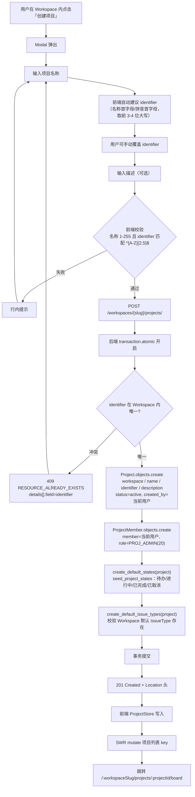
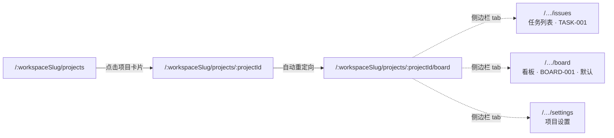
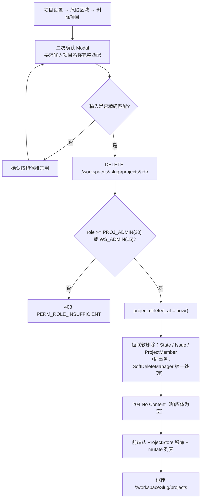

# 项目 CRUD

| 元信息项 | 内容 |
| --- | --- |
| 文档编号 | PROJ-001 |
| 所属迭代 | Sprint 0 — POC 技术验证（第 1-2 周） |
| 优先级 | P0（POC 阻塞级） |
| 所属模块 | M3-PROJ｜项目管理 |
| 文档状态 | 已确认（Approved） |
| 最后更新日期 | 2026-09-01 |
| 上游依赖 | `TEAM-001`（Workspace，`Project.workspace_id` 非空外键）、`AUTH-003`（最小权限隔离）、`INFRA-003`（初始数据模型） |
| 下游消费 | `TASK-001`（任务 CRUD，`Issue.project_id` 非空外键 + `identifier` 拼编号）、`BOARD-001`（看板列直接消费本文档创建的 `State`） |
| 上游依据 | `docs/需求文档.md` §3.3 项目管理、§8.3 POC 范围界定、§8.4 POC 验收标准 |
| 关联架构文档 | [`unified-issue-model.md`](../architecture/unified-issue-model.md) §2.4 §2.6 §5.2 §5.3、[`rbac-permission-model.md`](../architecture/rbac-permission-model.md) §2.3 §3.2 §7.4、[`api-conventions.md`](../architecture/api-conventions.md) §2.4 §2.5 §4.1、[`tech-stack.md`](../architecture/tech-stack.md) |
| 对标基线 | Plane Project（含 identifier 设计） · Ones 项目管理 |
| 工作量估算 | 后端 2 人日 / 前端 2 人日 / 联调与测试 1 人日，合计 **5 人日** |

---

## 1. 概述

### 1.1 功能定位

项目（Project）是**权限与数据隔离的主要边界**。所有 `Issue`、`State`、`Label`、看板、文件、甘特图均归属唯一一个 Project；反之，`Project` 归属唯一一个 Workspace（由 `TEAM-001` 创建）。

层级关系一句话表达：

```
Workspace（TEAM-001）
   └── Project（本文档）
          ├── State ×3（本文档创建，BOARD-001 直接消费为看板三列）
          └── Issue ×N（TASK-001 创建，BOARD-001 渲染为卡片）
```

P0 阶段本功能交付：

1. **创建项目**（含标识符 `identifier` 自动建议、默认状态集与默认任务类型自动初始化）；
2. **查询项目**（当前 Workspace 下的列表 + 详情）；
3. **更新项目**（名称、描述）；
4. **删除项目**（软删除）；
5. **状态集查询**（`GET .../states/`，为 `BOARD-001` 提供看板列定义）；
6. **项目详情页框架**（左侧导航 Issues / Board / Settings + 主内容区）。

### 1.2 范围边界

| 能力 | P0（本文档） | 后续迭代 |
| --- | --- | --- |
| 创建项目（名称 + identifier + 描述） | ✅ | — |
| identifier 自动建议 + Workspace 内唯一校验 | ✅ | — |
| 创建时自动加创建者为 `PROJ_ADMIN` | ✅ | — |
| 创建时自动初始化默认状态集（三态 + 已取消） | ✅ | — |
| 创建时关联默认任务类型 | ✅ | — |
| 项目列表（当前 Workspace，可见性过滤） | ✅ | — |
| 项目详情 | ✅ | — |
| 更新名称 / 描述 | ✅ | — |
| 软删除项目 | ✅ | — |
| 状态集查询 | ✅ | — |
| 项目详情页框架（三 tab） | ✅ | — |
| 项目成员邀请 / 子角色配置 | ❌ | `PROJ-002`（项目成员管理与搜索收藏） |
| 项目收藏 / 搜索 / 状态切换（active ↔ archived 归档动作） | ❌ | `PROJ-002` |
| 起止时间 / 项目负责人 / 项目图标 | ❌（列已建或 P1 补） | `PROJ-002` |
| 状态集增删改排序 | ❌ | `BOARD-003`（S3；状态集自定义归 BOARD-003，见 §4.2.6 归属勘误） |
| 项目完整生命周期（draft / closed）/ 动态时间线 / 项目模板 | ❌ | `PROJ-003`（项目生命周期与动态时间线） |
| 项目集 / 跨项目依赖 / 私密项目 | ❌ | 项目集与跨项目依赖 `PROJ-004`（portfolio）；私密项目 P3 预留（`rbac-permission-model.md` §7.4/§9，暂无编号，架构文档待回改） |

### 1.3 前置依赖

| 依赖文档 | 依赖内容 | 阻塞原因 |
| --- | --- | --- |
| `TEAM-001` | Workspace 已存在且当前用户是其成员；Workspace 创建时已 seed 默认 `IssueType`（`name="任务"`, `is_default=True`） | `Project.workspace` 非空；`create_default_issue_types` 需取到默认类型 |
| `AUTH-003` | `ProjectMember` 表已建（含冗余 `workspace_id`）；第三层 DB 行级过滤最小版（`Project.objects.accessible_by` + `BaseAPIView` 强制注入）。**不含** L1/L2 权限基类：`WorkspaceBasePermission`（L1）/ `ProjectBasePermission`（L2）属 P1 `AUTH-005`（AUTH-003 §1.4 交付边界） | 项目列表可见性由第三层行级过滤承担；创建 / 更新 / 删除的角色判定由本文档**自建最小 L2 判定**（`PROJ_ADMIN`(20) 或 `WS_ADMIN`+，见 §4.3.4），P1 `AUTH-005` 落地后迁移至 `ProjectBasePermission` |
| `INFRA-003` | `Project` / `ProjectMember` / `State` 三张表的 migration | 无表无从谈起 |

### 1.4 竞品参考

| 竞品 | 参考点 | 本功能处置 |
| --- | --- | --- |
| Plane | `Project.identifier`（项目缩写）+ `Issue.sequence_id` 组合成 `RBT-128` 编号；`State` 项目级可配 + 5 语义组；创建者自动 `PROJ_ADMIN`；创建时 seed 默认状态 | **完全对标**（详见 §6.1） |
| Ones | 项目模板、项目集、项目状态生命周期、项目卡片式列表 | 卡片式列表 P0 对标；模板与项目集延后（§6.2） |

---

## 2. 业务逻辑

### 2.1 创建项目主流程



**关键说明**：

| 步骤 | 不可省略的理由 |
| --- | --- |
| L（`ProjectMember`） | 缺失则创建者自己都不是项目成员，第三层行级过滤（`Project.objects.accessible_by`）会把刚建的项目过滤掉——用户看到「创建成功」但列表里没有 |
| M（默认状态集） | 缺失则 `TASK-001` 创建任务时 `state` 为 `null`，`BOARD-001` 无列可渲染。这是 P0 三列看板的**唯一数据来源** |
| N（默认任务类型） | P0 `Issue.issue_type` 可空，但必须校验 Workspace 级默认类型存在，否则 `P1` 升级为必填时存量数据无类型可回填 |
| O（同事务） | 四步任一失败必须整体回滚，否则产生「有项目无状态」「有项目无成员」的半成品数据 |

事务内**禁止**任何外部 HTTP 调用（Webhook、通知）。副作用统一走 `transaction.on_commit()` 投递 Celery（理由同 [`unified-issue-model.md`](../architecture/unified-issue-model.md) §3.5）。

### 2.2 项目标识符（identifier）

`identifier` 是本功能最需要仔细定义的字段。它与 `Issue.sequence_id` 拼接成**人类可读的工作项编号**：

```
Project.identifier = "PRJ"
Issue.sequence_id  = 1
        ↓  展示层拼接
   显示为  PRJ-1
```

这个编号会被写进 Git commit message、代码注释、外部工单、口头沟通中，因此其稳定性要求极高。

#### 2.2.1 规则

| 编号 | 规则 | 约束位置 |
| --- | --- | --- |
| ID-1 | 格式：**2 ~ 5 个字母**。序列化层接受 `^[A-Za-z]{2,5}$`（`IDENTIFIER_RE`，§4.3.5），`save()` 规范化为大写（ID-2），**落库最终满足 `^[A-Z]{2,5}$`** | Serializer 校验 + Model `save()` |
| ID-2 | 服务端 `Project.save()` 中执行 `identifier.strip().upper()`，因此客户端传小写也能通过 | Model `save()` |
| ID-3 | **Workspace 内唯一**（不是全局唯一），偏索引 `uniq_project_identifier_per_workspace`（`condition=Q(deleted_at__isnull=True)`） | DB 约束 |
| ID-4 | 软删除的项目释放其 identifier，可被新项目复用 | 同上偏索引 |
| ID-5 | 数据库列宽 `varchar(12)`，业务层限 5 位。列宽预留冗余以便 P3 放宽（如允许数字、放宽到 10 位）时零 DDL | Model |
| ID-6 | **必填**，服务端不自动生成兜底值。前端提供智能建议但用户必须确认 | Serializer |
| ID-7 | 创建后**原则上不可修改**。P0 直接声明为 `read_only`（PATCH 传入被忽略） | `ProjectWriteSerializer` |

> **为什么 P0 只允许大写字母而不允许数字**：Plane 允许字母数字混合，但 `PRJ2-1` 这类编号在口头沟通与正则解析（从 commit message 中提取工作项引用 `[A-Z]+-\d+`）时都存在歧义。P0 收紧到纯字母，规则明确、解析无歧义；P2 GitHub 集成落地后如确有需要再放宽（列宽已够）。

#### 2.2.2 前端自动建议算法

```typescript
// packages/utils/src/project-identifier.ts
import { pinyin } from "pinyin-pro";

/**
 * 从项目名称建议 identifier
 * 「兔子项目管理」→ 拼音首字母 TZXM → 取前 4 位 → "TZXM"
 * 「RabbitProjects」→ 词首字母 RP → 不足 2 位则用前缀补 → "RP"
 * 「Web」→ 全大写 → "WEB"
 */
export const suggestIdentifier = (name: string): string => {
  const trimmed = name.trim();
  if (!trimmed) return "";

  // 1) 中文：取每字拼音首字母
  if (/[\u4e00-\u9fa5]/.test(trimmed)) {
    const initials = pinyin(trimmed, { pattern: "first", toneType: "none", type: "array" })
      .join("")
      .replace(/[^a-zA-Z]/g, "")
      .toUpperCase();
    return initials.slice(0, 4) || "PRJ";
  }

  // 2) 多词英文：取各词首字母（RabbitProjects Core → RPC）
  const words = trimmed.split(/[\s\-_]+/).filter(Boolean);
  if (words.length >= 2) {
    const initials = words.map((w) => w[0]).join("").replace(/[^a-zA-Z]/g, "").toUpperCase();
    if (initials.length >= 2) return initials.slice(0, 5);
  }

  // 3) 驼峰拆分（RabbitProjects → RP）
  const camel = trimmed.match(/[A-Z][a-z]*/g);
  if (camel && camel.length >= 2) {
    return camel.map((w) => w[0]).join("").slice(0, 5).toUpperCase();
  }

  // 4) 单词：取前 3-4 字母
  return trimmed.replace(/[^a-zA-Z]/g, "").slice(0, 4).toUpperCase().padEnd(2, "X");
};
```

**建议值仅作预填，不做静默提交**。用户可自由改写；identifier 输入框设置 `maxLength=5` 并对输入实时 `toUpperCase()` + 过滤非字母字符，使非法输入在物理上不可能被键入。

#### 2.2.3 唯一性交互

P0 采用**提交时校验**，不做实时 `identifier-check` 请求：

| 方案 | 采纳 | 理由 |
| --- | --- | --- |
| 提交时校验，冲突返回 409 | ✅ | 单个 Workspace 下项目数量级为几十个，冲突概率低；少一个端点、少一轮防抖请求 |
| 输入时实时校验（防抖 + `identifier-check` 端点） | ❌（P1 补） | P0 收益不足；且实时校验不能替代提交时校验（竞态仍需 DB 约束兜底），属重复实现 |

冲突时前端将 `error.details[0]`（`field="identifier"`）映射到 identifier 输入框下方，提示「标识符 PRJ 已被占用，请换一个」，并自动在建议值后追加序号（`PRJ` → `PRJA`）供一键采纳。

### 2.3 默认状态集初始化

这是 `BOARD-001` 三列看板的**唯一数据来源**，必须与 [`unified-issue-model.md`](../architecture/unified-issue-model.md) §5.2 / §5.3 完全一致。

#### 2.3.1 种子数据（P0）

P0 阶段 `settings.ENABLE_PER_TYPE_STATES = False`，因此 `State.issue_type = NULL`（状态对项目内所有类型生效），且只取「任务」类型的状态集作为项目通用状态：

| 状态名 | `group` | `color` | `sort_order` | `is_default` | P0 看板列 |
| --- | --- | --- | --- | --- | --- |
| **待办** | `unstarted` | `#9CA3AF` | 1000 | ✅ | 第 1 列 |
| **进行中** | `started` | `#3B82F6` | 2000 | ❌ | 第 2 列 |
| **已完成** | `completed` | `#10B981` | 3000 | ❌ | 第 3 列 |
| 已取消 | `cancelled` | `#6B7280` | 4000 | ❌ | ❌ 不作为看板列（P1 起） |

> ⚠️ **口径校正（必读）**：「待办」列的 `group` 是 **`unstarted`**，**不是 `backlog`**。
>
> [`unified-issue-model.md`](../architecture/unified-issue-model.md) §5.2 明确：`backlog` 是**需求 / 缺陷 / 文档**类型的首状态（「草稿」「待确认」），语义为「待规划、不计入 Sprint 范围、看板中折叠展示」；而**任务**类型的首状态「待办」归入 `unstarted`（「未开始、计入剩余工作量、看板中作为待办列展示」）。
>
> 若误将「待办」建为 `backlog`，则 §2.6 的 `group → 看板列` 映射表会把它判定为「折叠展示」，`BOARD-001` 的第一列将渲染不出来，且燃尽图会漏算待办工作量。**本文档与 `BOARD-001` 统一以 `unstarted` 为准。**

四条状态**全部创建**（`已取消` 也建），但 `BOARD-001` 的 P0 看板只渲染 `unstarted` / `started` / `completed` 三个 group 对应的列。这样做的收益：P1 开放「已取消」列时无需数据迁移，只需放开前端列白名单。

#### 2.3.2 约束

| 约束 | 说明 |
| --- | --- |
| `uniq_state_name_per_project_type` | `(project, name, issue_type)` 偏索引唯一。**但 PostgreSQL 中 `NULL` 不参与唯一比较**：P0 `issue_type=NULL` 时该约束**不拦截**同项目同名状态（INFRA-003 §4.6）。P0 同项目状态名唯一由 `seed_project_states` 的 `get_or_create` **幂等** + **应用层校验**保证（P0 无其他状态写入路径；`BOARD-003` 开放写时须补 serializer / 服务层校验） |
| `uniq_default_state_per_project_type` | `(project, issue_type)` 且 `is_default=True` 时唯一。同上，P0 `issue_type=NULL` 时该偏索引**不生效**——「**一个项目有且仅有一个默认状态**」由 seed 幂等 + serializer / 服务层唯一默认态校验保证（`BOARD-003` 开放写时启用：设新默认态须同事务清除旧默认态） |
| `seed_project_states` 用 `get_or_create` | 幂等：重复调用不产生重复状态，便于补数据脚本重跑——这是 P0 两条唯一性保证的**实际执行者**（DB 偏索引对 NULL 不生效，见上两行） |
| `State.group` 不可为空 | `TextChoices` 5 值之一，`db_index=True`。所有报表、进度、看板列只认 `group` 不认 `name` |

**「结构由配置表承载、语义由枚举组承载」**是这里的核心设计。用户改名「待办」→「Backlog」不会破坏任何下游逻辑，因为下游全部按 `group` 判定。

### 2.4 项目列表可见性

```
可见集合 = { p | p.workspace = 当前 Workspace
              ∧ p.deleted_at IS NULL
              ∧ ( 当前用户在该 Workspace 的 role >= WS_ADMIN(15)      ← 隐式全项目可见
                  ∨ ∃ ProjectMember(project=p, member=当前用户, is_active=True) ) }
```

三条判定规则（来自 [`rbac-permission-model.md`](../architecture/rbac-permission-model.md) §2.2 / §7.4）：

| 用户在 Workspace 的角色 | 可见的项目范围 | 理由 |
| --- | --- | --- |
| `WS_OWNER`(20) / `WS_ADMIN`(15) | **该 Workspace 下全部项目**（无需是 `ProjectMember`） | Plane 同款设计：管理员隐式视为所有项目的 `PROJ_ADMIN` |
| `WS_MEMBER`(10) | 仅自己是 `ProjectMember` 的项目 | 工作空间角色不自动继承项目角色 |
| `WS_GUEST`(5) | 仅自己是 `ProjectMember` 的项目，**且无工作空间级浏览权** | 访客看不到项目列表整体 |

> P0 阶段每个 Workspace 只有创建者一人（`WS_OWNER`），因此实际效果是「自己的项目全可见」。但**判定代码必须按上述通用规则实现**，不得走「创建者即可见」的捷径，否则 `PROJ-002` 引入多成员后需重写鉴权层。

排序：`-created_at`（继承 `BaseModel.Meta.ordering`）。P0 不做收藏置顶与最近访问排序（`PROJ-002`）。

### 2.5 项目详情页导航



**默认进入 Board 视图**（而非 Issues 列表）。理由：需求文档 §8.4 的 POC 验收核心是「拖拽看板」，把最有说服力的视图设为默认，降低演示路径长度。Plane 的默认视图也是 Issues 列表，此处刻意与其不同。

P0 三个 tab 的交付状态：

| Tab | 路由 | P0 状态 | 交付方 |
| --- | --- | --- | --- |
| Issues | `/…/issues` | ✅ 可用 | `TASK-001` |
| Board | `/…/board` | ✅ 可用（默认） | `BOARD-001` |
| Settings | `/…/settings` | ✅ 框架可用（仅「基本信息」区块：名称 / 描述编辑 + 删除项目） | 本文档 |

### 2.6 删除项目

P0 使用**软删除**（`deleted_at` 置值），与 `Issue` 的删除语义一致。



| 约束 | 说明 |
| --- | --- |
| 响应码 | `204`，**响应体必须为空**，不得包装 `{status:"success"}`（[`api-conventions.md`](../architecture/api-conventions.md) §4.3） |
| 权限 | `PROJ_ADMIN`(20) 或 `WS_OWNER`/`WS_ADMIN`（隐式 `PROJ_ADMIN`） |
| 级联 | 软删除项目时，其 `State` / `Issue` / `ProjectMember` 一并置 `deleted_at`。使用**同事务批量 UPDATE**，不依赖 DB 级 CASCADE（DB CASCADE 是硬删除） |
| identifier 释放 | 软删除后偏索引不再约束该 identifier，可被新项目复用（ID-4） |
| 恢复 | P0 无 UI 恢复入口，但数据可恢复（`all_objects` 可查）。`PROJ-002` 提供归档/恢复能力 |
| 幂等 | 重复 DELETE 已软删的项目返回 `404`（`objects` 管理器已过滤） |

### 2.7 业务规则汇总

| 编号 | 规则 |
| --- | --- |
| BR-1 | `name` 必填，trim 后长度 1 ~ 255 字符 |
| BR-2 | `identifier` 必填，`^[A-Z]{2,5}$`，Workspace 内唯一（见 §2.2） |
| BR-3 | `description` 可空，纯文本，≤ 2000 字符（P0 不用富文本；`PROJ-002` 升级为 TipTap） |
| BR-4 | `status` 默认 `active`。P0 只产生 `active`，`archived` 由 `PROJ-002` 启用、`draft`/`closed` 由 `PROJ-003` 启用 |
| BR-5 | `workspace` 由 URL 路径段推导，**不接受请求体传入**（防跨 Workspace 写入） |
| BR-6 | 创建者自动成为 `PROJ_ADMIN`(20) |
| BR-7 | 创建项目权限：Workspace 内 `role >= WS_MEMBER`(10)。`WS_GUEST`(5) 不可创建项目 |
| BR-8 | 一个 Workspace 下项目数 P0 不限制 |
| BR-9 | 项目创建后必然拥有 4 条 `State` 与 1 个 `PROJ_ADMIN` 成员，此为不变量（invariant），可用管理命令校验 |
| BR-10 | 同一 Workspace 下项目名称**可重复**（只有 identifier 唯一）。理由：「移动端 v1」「移动端 v2」这类命名合法，强制名称唯一会造成不必要的摩擦 |

### 2.8 异常处理

| 异常场景 | HTTP | 错误码 | 用户可见提示 |
| --- | --- | --- | --- |
| 名称为空 | 400 | `VALIDATION_ERROR` + `details[].code=REQUIRED` | 「项目名称不能为空」 |
| 名称超长（> 255） | 400 | `VALIDATION_ERROR` + `TOO_LONG` | 「项目名称最多 255 个字符」 |
| identifier 为空 | 400 | `VALIDATION_ERROR` + `REQUIRED` | 「项目标识符不能为空」 |
| identifier 格式非法（含数字 / 长度不符） | 400 | `VALIDATION_ERROR` + `INVALID` | 「标识符须为 2-5 个字母」 |
| identifier 已被占用 | **409** | `RESOURCE_ALREADY_EXISTS` + `details[].field=identifier` `code=UNIQUE` | 「标识符 PRJ 已被占用，请换一个」 |
| identifier 竞态冲突（DB 约束触发） | 409 | 同上（捕获 `IntegrityError` 转换） | 同上 |
| 描述超长 | 400 | `VALIDATION_ERROR` + `TOO_LONG` | 「项目描述最多 2000 个字符」 |
| Workspace 不存在 / 非成员 | 404 | `RESOURCE_NOT_FOUND` | 「团队不存在或你没有访问权限」 |
| `WS_GUEST` 创建项目 | 403 | `PERM_ROLE_INSUFFICIENT` | 「访客无法创建项目」 |
| 项目不存在 / 无权可见 | 404 | `RESOURCE_NOT_FOUND` | 「项目不存在或你没有访问权限」 |
| 非 `PROJ_ADMIN` 更新项目 | 403 | `PERM_ROLE_INSUFFICIENT` | 「仅项目管理员可修改项目信息」 |
| 尝试修改 identifier | — | — | **无报错**：`read_only` 静默忽略；UI 中该输入框在编辑态直接禁用并附说明 |
| `?ordering=` 传非白名单字段 | 400 | `VALIDATION_INVALID_PARAM` | 「排序字段不合法」（api-conventions §5.4 / §8.4：此处不静默忽略） |
| PUT 请求 | 405 | `VALIDATION_ERROR` + `details[].code=INVALID`（`field=method`） | — |
| 跨 Workspace 访问项目（URL slug 与项目实际 workspace 不符） | 404 | `RESOURCE_NOT_FOUND` | 同上（`ProjectScopedAPIView` 强制 `workspace__slug` 过滤） |

> **405 的错误码说明**：`METHOD_NOT_ALLOWED` 未在 api-conventions §8 错误码注册表中注册，全局异常处理器按 §10.4「MethodNotAllowed → 对应 `VALIDATION_*` 码」统一映射为 `VALIDATION_ERROR` + 字段级子码（`field="method"`、`code="INVALID"`）。

---

## 3. UI/UX 设计

### 3.1 项目列表页

路由 `/:workspaceSlug/projects`。卡片式网格布局（对标 Ones 的项目卡片，Plane 用列表行）。

```
┌───────────────────────────────────────────────────────────────────────────┐
│  项目                                          ┌──────────────────────┐   │
│  RabbitProjects · 3 个项目                      │ ＋ 创建项目           │   │
│                                                └──────────────────────┘   │
├───────────────────────────────────────────────────────────────────────────┤
│ ┌─────────────────────────┐ ┌─────────────────────────┐ ┌───────────────┐ │
│ │ 🅡  兔子项目管理          │ │ 🅜  移动端 App           │ │ 🅦  官网重构   │ │
│ │     TZXM      ● 进行中   │ │     MOB       ● 进行中   │ │     WEB  ●   │ │
│ │                          │ │                          │ │               │ │
│ │ 企业级项目管理系统，对标  │ │ iOS 与 Android 客户端    │ │ 品牌官网 v2   │ │
│ │ Ones 与 Plane            │ │                          │ │               │ │
│ │                          │ │                          │ │               │ │
│ │ 👤        12 个任务      │ │ 👤👤       5 个任务      │ │ 👤   0 个任务 │ │
│ └─────────────────────────┘ └─────────────────────────┘ └───────────────┘ │
└───────────────────────────────────────────────────────────────────────────┘
```

| 元素 | 规格 |
| --- | --- |
| 网格 | `grid gap-4 grid-cols-1 md:grid-cols-2 xl:grid-cols-3 2xl:grid-cols-4` |
| 卡片 | `rounded-lg border border-neutral-200 bg-white p-4 hover:border-primary-300 hover:shadow-md transition cursor-pointer`；整卡可点 |
| 项目图标 | 24×24 圆角方形，首字母 + 由 `project.id` 哈希取色（与 `WorkspaceLogo` 同一取色函数，保证视觉体系统一） |
| 项目名 | `text-base font-medium truncate` |
| identifier 徽章 | `text-xs font-mono px-1.5 py-0.5 rounded bg-neutral-100 text-neutral-600`，等宽字体强化「编号前缀」的语义 |
| 状态徽章 | 圆点 + 文案。`active`→`#10B981` 绿「进行中」；其余状态 P0 不出现但组件已支持 |
| 描述 | `text-sm text-neutral-500 line-clamp-2`，无描述时渲染 `text-neutral-300` 的「暂无描述」 |
| 成员头像组 | 最多 3 个 24px 圆形头像叠放（`-space-x-2`），超出显示 `+N`。P0 恒为 1 人 |
| 任务计数 | `total_issues` 聚合值，`text-xs text-neutral-400` |
| 卡片右上角 | hover 时出现 `more-horizontal` 图标，下拉含「项目设置」「删除项目」（后者仅 `PROJ_ADMIN` 可见，由 `<PermissionGate>` 包裹） |

### 3.2 创建项目 Modal

Headless UI `Dialog`，宽 520px。

```
┌──────────────────────────────────────────────────────┐
│  创建项目                                          ✕  │
│                                                      │
│  项目名称 *                                           │
│  ┌────────────────────────────────────────────────┐  │
│  │ 兔子项目管理                                    │  │
│  └────────────────────────────────────────────────┘  │
│                                                      │
│  项目标识符 *                    ┌────────────────┐   │
│  ┌──────────────┐                │ 编号预览        │   │
│  │ TZXM         │                │ TZXM-1         │   │
│  └──────────────┘                └────────────────┘   │
│  2-5 个大写字母，用于生成任务编号，创建后不可修改        │
│                                                      │
│  项目描述                                             │
│  ┌────────────────────────────────────────────────┐  │
│  │ 企业级项目管理系统，对标 Ones 与 Plane          │  │
│  │                                                │  │
│  └────────────────────────────────────────────────┘  │
│                                          21 / 2000   │
│                                                      │
│                        ┌────────┐  ┌──────────────┐ │
│                        │  取消   │  │  创建项目     │ │
│                        └────────┘  └──────────────┘ │
└──────────────────────────────────────────────────────┘
```

**交互细节**：

| 行为 | 规格 |
| --- | --- |
| 打开时 | 名称输入框自动 focus |
| identifier 自动建议 | 名称输入后 **200ms 防抖**调用 `suggestIdentifier(name)`（§2.2.2）。**仅在用户尚未手动编辑过 identifier 时覆盖**（用 `isIdentifierDirty` 标记位控制），避免用户改完 identifier 后又被名称变更覆盖 |
| identifier 输入约束 | `maxLength=5`；`onChange` 中 `value.replace(/[^a-zA-Z]/g, "").toUpperCase()`，使非法字符物理上无法键入 |
| 编号预览 | identifier 右侧实时显示 `{identifier}-1`，用等宽字体。让用户在创建前就直观理解这个字段的用途 |
| identifier 说明文案 | 输入框下方常驻灰字「2-5 个大写字母，用于生成任务编号，**创建后不可修改**」。不可逆性必须前置告知 |
| 名称校验 | Zod：`z.string().trim().min(1, "项目名称不能为空").max(255)` |
| identifier 校验 | Zod：`z.string().regex(/^[A-Z]{2,5}$/, "标识符须为 2-5 个字母")` |
| 提交中 | 按钮 loading，Modal 锁定 |
| 409 冲突 | identifier 输入框标红 + 下方红字「标识符 TZXM 已被占用，请换一个」；同时在输入框右侧出现「试试 TZXMA」的一键采纳按钮 |
| 成功 | Modal 关闭 → toast「项目创建成功」→ 跳转 `/:workspaceSlug/projects/:projectId/board` |
| 关闭 | ✕ / `Esc` / 遮罩点击（表单已修改时二次确认） |

### 3.3 项目详情页框架

```
┌──────────────────────────────────────────────────────────────────────────┐
│ 🅣 张三的工作空间 ▾                                              ⌘K   👤 │
├──────────────┬───────────────────────────────────────────────────────────┤
│ 🅡 兔子项目管理│  看板                            ┌───────────────────┐   │
│    TZXM      │                                  │ ＋ 创建任务        │   │
│              │                                  └───────────────────┘   │
│ ── 视图 ──   ├───────────────────────────────────────────────────────────┤
│ ☰  任务列表   │                                                           │
│ ▦  看板  ●   │        ┌── BOARD-001 三列看板渲染区 ──┐                   │
│              │        │  待办    进行中    已完成      │                   │
│ ── 管理 ──   │        │  ┌──┐   ┌──┐     ┌──┐        │                   │
│ ⚙  项目设置   │        │  │  │   │  │     │  │        │                   │
│              │        │  └──┘   └──┘     └──┘        │                   │
│ ← 返回项目列表│        └──────────────────────────────┘                   │
└──────────────┴───────────────────────────────────────────────────────────┘
```

| 元素 | 规格 |
| --- | --- |
| 项目侧边栏 | 宽 220px，`border-r border-neutral-200`。顶部项目身份区（图标 + 名称 + identifier 徽章） |
| 分组标题 | `text-xs font-medium text-neutral-400 uppercase tracking-wide px-3 py-2`，分「视图」与「管理」两组 |
| tab 项 | 高 34px，图标 16px + 文案。激活态 `bg-primary-50 text-primary-700 font-medium` + 右侧 3px 主色竖条；非激活 hover `bg-neutral-50` |
| tab 图标 | 任务列表 `list`；看板 `columns-3`；项目设置 `settings`（lucide-react） |
| 返回入口 | 侧边栏底部，`arrow-left` + 「返回项目列表」 |
| 主内容区 | 顶部工具条（当前视图名 + 右侧「创建任务」主按钮），下方为视图渲染区（`<Outlet />`） |
| 权限 | 「项目设置」tab 由 `<PermissionGate projectRole={PROJ_ADMIN}>` 包裹；非管理员看不到该入口（UI 层），同时后端 PATCH 返回 403（API 层） |

### 3.4 项目设置页（P0 最小实现）

`/…/settings`，仅两个区块：

```
┌───────────────────────────────────────────────────────┐
│  基本信息                                              │
│                                                       │
│  项目名称   ┌──────────────────────────────────────┐  │
│             │ 兔子项目管理                          │  │
│             └──────────────────────────────────────┘  │
│                                                       │
│  项目标识符 ┌──────────┐  🔒 创建后不可修改            │
│             │ TZXM     │（disabled）                  │
│             └──────────┘                              │
│                                                       │
│  项目描述   ┌──────────────────────────────────────┐  │
│             │ 企业级项目管理系统…                    │  │
│             └──────────────────────────────────────┘  │
│                                       ┌────────────┐  │
│                                       │  保存更改   │  │
│                                       └────────────┘  │
├───────────────────────────────────────────────────────┤
│  ⚠️ 危险区域                                           │
│                                                       │
│  删除项目将同时删除其下全部任务，此操作不可在界面恢复。   │
│                                       ┌────────────┐  │
│                                       │  删除项目   │  │
│                                       └────────────┘  │
└───────────────────────────────────────────────────────┘
```

删除二次确认 Modal 要求**精确输入项目名称**方可启用确认按钮（对标 Plane 与 GitHub 的危险操作范式）。

### 3.5 空状态

| 场景 | 文案与视觉 |
| --- | --- |
| Workspace 下无项目 | 居中插画（`folder-plus` 96px，`text-neutral-300`）+ 主标题「还没有项目」+ 副文案「点击创建第一个项目，开始管理你的工作」+ 主按钮「＋ 创建项目」。文案严格对齐需求：**「还没有项目，点击创建第一个项目」** |
| 无权创建（`WS_GUEST`） | 同插画，副文案改为「你没有创建项目的权限，请联系团队管理员」，隐藏主按钮 |
| 列表加载中 | 渲染 6 个卡片骨架（`animate-pulse`），布局与真实卡片一致，避免加载完成时的布局跳动（CLS = 0） |
| 列表加载失败 | 居中 `alert-circle` + `error.message` + 「重试」按钮（触发 SWR `mutate()`） |

### 3.6 响应式

| 断点 | 布局 |
| --- | --- |
| ≥ 1536px（`2xl`） | 项目卡片 4 列 |
| ≥ 1280px（`xl`） | 3 列 |
| ≥ 768px（`md`） | 2 列；项目侧边栏收为 56px 图标栏 |
| < 768px | 1 列；项目侧边栏改为顶部横向 tab 条；Modal 宽度 `calc(100vw - 32px)` |

---

## 4. 技术架构

### 4.1 数据模型

完整定义见 [`unified-issue-model.md`](../architecture/unified-issue-model.md) §2.4 / §2.6 与 [`rbac-permission-model.md`](../architecture/rbac-permission-model.md) §3.2。本节摘录本功能直接使用的部分。

#### 4.1.1 Project

```python
# apps/api/plane/db/models/project.py
class Project(BaseModel):
    """项目 —— 归属 Workspace，是权限与数据隔离的主要边界"""

    class Status(models.TextChoices):
        DRAFT = "draft", "草稿"
        ACTIVE = "active", "进行中"
        ARCHIVED = "archived", "已归档"
        CLOSED = "closed", "已关闭"

    workspace = models.ForeignKey(
        Workspace, on_delete=models.CASCADE, related_name="projects", verbose_name="所属工作空间"
    )
    name = models.CharField(max_length=255, verbose_name="项目名称")
    description = models.TextField(blank=True, verbose_name="项目描述")
    identifier = models.CharField(
        max_length=12, verbose_name="项目缩写",
        help_text="大写字母数字，Workspace 内唯一，用于生成 RBT-128 形式的工作项编号",
    )
    status = models.CharField(
        max_length=16, choices=Status.choices, default=Status.ACTIVE,
        db_index=True, verbose_name="项目状态",
    )
    created_by = models.ForeignKey(
        "db.User", on_delete=models.SET_NULL, null=True,
        related_name="created_projects", verbose_name="创建人",
    )

    class Meta(BaseModel.Meta):
        db_table = "projects"
        verbose_name = "项目"
        ordering = ("-created_at",)
        constraints = [
            models.UniqueConstraint(
                fields=["workspace", "identifier"],
                condition=models.Q(deleted_at__isnull=True),
                name="uniq_project_identifier_per_workspace",
            ),
        ]
        indexes = [
            models.Index(fields=["workspace", "status"], name="idx_project_ws_status"),
        ]

    def save(self, *args, **kwargs):
        self.identifier = self.identifier.strip().upper()
        super().save(*args, **kwargs)
```

| 字段 | 类型 | 约束 / 索引 | P0 使用 | 说明 |
| --- | --- | --- | --- | --- |
| `id` | UUID | PK | ✅ | 继承 `BaseModel` |
| `workspace` | UUID FK | NOT NULL, CASCADE, 复合索引首列 | ✅ | 由 URL slug 推导，不接受请求体传入 |
| `name` | varchar(255) | NOT NULL | ✅ | 同 Workspace 内可重复（BR-10） |
| `description` | text | 可空 | ✅ | 纯文本，业务层限 2000 |
| `identifier` | varchar(12) | 偏索引唯一（+ workspace） | ✅ | 业务层限 `^[A-Z]{2,5}$`，`save()` 强制大写 |
| `status` | varchar(16) | `db_index`，default `active` | ⚠️ 仅 `active` | 其余值由 `PROJ-002`（archived）/ `PROJ-003`（draft / closed）启用 |
| `created_by` | UUID FK | SET_NULL | ✅ | 用户注销后项目保留 |
| `created_at`/`updated_at`/`deleted_at` | timestamptz | 索引 | ✅ | 继承 `BaseModel` |

#### 4.1.2 ProjectMember

```python
class ProjectMember(BaseModel):
    """项目成员：用户在某项目内的角色归属，与工作空间角色完全独立"""

    project = models.ForeignKey("db.Project", on_delete=models.CASCADE,
                               related_name="project_projectmember")
    workspace = models.ForeignKey("db.Workspace", on_delete=models.CASCADE,
                                  related_name="project_member")   # 反范式冗余，避免 JOIN
    member = models.ForeignKey("db.User", on_delete=models.CASCADE,
                               related_name="member_project")
    role = models.IntegerField(choices=ProjectRole.choices,
                               default=ProjectRole.CONTRIBUTOR)
    is_active = models.BooleanField(default=True)
    view_props = models.JSONField(default=dict)      # 个人视图偏好，非权限字段

    class Meta:
        unique_together = ("project", "member")
        indexes = [
            models.Index(fields=["member", "project", "role"]),   # 权限判定主索引
            models.Index(fields=["member", "workspace"]),          # 行级过滤子查询索引
        ]
```

项目级角色等级（[`rbac-permission-model.md`](../architecture/rbac-permission-model.md) §2.3）：

| 角色 | 代码标识 | `role` 值 | P0 是否产生 |
| --- | --- | --- | --- |
| 项目管理员 | `PROJ_ADMIN` | **20** | ✅ 创建者 |
| 协作者 | `PROJ_CONTRIBUTOR` | 15 | ❌（Model default，P0 不产生） |
| 评论者 | `PROJ_COMMENTER` | 10 | ❌ |
| 查看者 | `PROJ_VIEWER` | 5 | ❌ |

> `workspace` 冗余列的价值：使「查询用户在某 Workspace 下所有可见项目」成为单表查询（命中 `(member, workspace)` 索引），无需 `JOIN projects`。这是 §4.3.3 行级过滤能保持恒定成本的关键。

#### 4.1.3 State

```python
class State(BaseModel):
    """任务状态 —— 项目级自定义，必须归入 5 个固定语义组"""

    class Group(models.TextChoices):
        BACKLOG = "backlog", "待规划"
        UNSTARTED = "unstarted", "未开始"
        STARTED = "started", "进行中"
        COMPLETED = "completed", "已完成"
        CANCELLED = "cancelled", "已取消"

    project = models.ForeignKey(Project, on_delete=models.CASCADE,
                               related_name="states", verbose_name="所属项目")
    name = models.CharField(max_length=64, verbose_name="状态名称")
    color = models.CharField(max_length=9, default="#6B7280", verbose_name="状态颜色")
    group = models.CharField(max_length=16, choices=Group.choices, default=Group.BACKLOG,
                             db_index=True, verbose_name="语义分组")
    sort_order = models.FloatField(default=65535.0, verbose_name="排序值")
    is_default = models.BooleanField(default=False, verbose_name="是否默认状态")
    # P3 预留：类型专属状态集。为 null 时该状态对项目内所有类型生效
    issue_type = models.ForeignKey(IssueType, on_delete=models.CASCADE, null=True, blank=True,
                                   related_name="states", verbose_name="专属任务类型")

    class Meta(BaseModel.Meta):
        db_table = "states"
        ordering = ("sort_order",)
        constraints = [
            models.UniqueConstraint(
                fields=["project", "name", "issue_type"],
                condition=models.Q(deleted_at__isnull=True),
                name="uniq_state_name_per_project_type",
            ),
            models.UniqueConstraint(
                fields=["project", "issue_type"],
                condition=models.Q(is_default=True, deleted_at__isnull=True),
                name="uniq_default_state_per_project_type",
            ),
        ]
```

`group` 的下游语义（[`unified-issue-model.md`](../architecture/unified-issue-model.md) §2.6），`BOARD-001` 的列渲染直接依据此表：

| `group` | 燃尽图 | **看板默认列** | 进度百分比 | 甘特图 | P0 看板是否渲染 |
| --- | --- | --- | --- | --- | --- |
| `backlog` | 不计入 Sprint 范围 | 折叠展示 | 0% | 灰色 | ❌ P0 无此状态 |
| `unstarted` | 计入剩余 | **待办列** | 0% | 未开始 | ✅ 第 1 列 |
| `started` | 计入剩余 | **进行中列** | 50% | 进行中 | ✅ 第 2 列 |
| `completed` | 计入已完成 | **已完成列** | 100% | 完成 | ✅ 第 3 列 |
| `cancelled` | 移出范围 | 折叠展示 | 不计入 | 划线 | ❌ P1 起 |

### 4.2 API 定义

遵循 [`api-conventions.md`](../architecture/api-conventions.md)：`/api/v1/` 前缀、强制尾斜杠、`snake_case`、统一信封、最大嵌套 3 层资源。

| # | 方法 | 路径 | 描述 | 权限 | 成功码 |
| --- | --- | --- | --- | --- | --- |
| 1 | `POST` | `/api/v1/workspaces/{slug}/projects/` | 创建项目 | Workspace `role >= WS_MEMBER`(10) | `201` |
| 2 | `GET` | `/api/v1/workspaces/{slug}/projects/` | 项目列表 | Workspace 成员（DB 层再按项目可见性过滤） | `200` |
| 3 | `GET` | `/api/v1/workspaces/{slug}/projects/{project_id}/` | 项目详情 | 项目成员 或 `WS_ADMIN`+ | `200` |
| 4 | `PATCH` | `/api/v1/workspaces/{slug}/projects/{project_id}/` | 更新项目 | `PROJ_ADMIN`(20) 或 `WS_ADMIN`+ | `200` |
| 5 | `DELETE` | `/api/v1/workspaces/{slug}/projects/{project_id}/` | 删除项目（软删除） | `PROJ_ADMIN`(20) 或 `WS_ADMIN`+ | `204` |
| 6 | `GET` | `/api/v1/workspaces/{slug}/projects/{project_id}/states/` | 状态列表 | 项目成员 或 `WS_ADMIN`+ | `200` |

#### 4.2.1 `POST .../projects/` — 创建项目

**请求**

```http
POST /api/v1/workspaces/rabbitprojects/projects/ HTTP/1.1
Content-Type: application/json
X-CSRFToken: ...
```

```json
{
  "name": "兔子项目管理",
  "identifier": "TZXM",
  "description": "企业级项目管理系统，对标 Ones 与 Plane"
}
```

> `workspace` **不在请求体中**。它由 URL 路径段 `{slug}` 推导（BR-5），杜绝「路径指向 A 团队、请求体写 B 团队 ID」的跨租户写入攻击。

**成功响应 `201 Created`**

```http
HTTP/1.1 201 Created
Location: /api/v1/workspaces/rabbitprojects/projects/7b3e9c1a-4d5f-4a8b-9c2e-1f0a3b4c5d6e/
X-Request-Id: 01JBX4M2R8SA5N9P3Q6W7X8Y9Z
```

```json
{
  "status": "success",
  "data": {
    "id": "7b3e9c1a-4d5f-4a8b-9c2e-1f0a3b4c5d6e",
    "workspace_id": "3f2c8a1e-9b4d-4c7a-8e11-5d6f7a8b9c0d",
    "workspace_slug": "rabbitprojects",
    "name": "兔子项目管理",
    "identifier": "TZXM",
    "description": "企业级项目管理系统，对标 Ones 与 Plane",
    "status": "active",
    "current_user_role": 20,
    "total_members": 1,
    "total_issues": 0,
    "default_state_id": "c1d2e3f4-5a6b-4c7d-8e9f-0a1b2c3d4e5f",
    "created_by": "6c7d1a2b-3e4f-4a5b-9c8d-7e6f5a4b3c2d",
    "created_at": "2026-09-01T03:22:11.507Z",
    "updated_at": "2026-09-01T03:22:11.507Z"
  }
}
```

| 字段 | 说明 |
| --- | --- |
| `current_user_role` | 当前用户的**有效项目角色**。若用户是 `WS_ADMIN`+ 但非 `ProjectMember`，此处返回 `20`（隐式 `PROJ_ADMIN`，见 §4.3.3） |
| `total_issues` | 未软删、未归档的 Issue 数量聚合 |
| `default_state_id` | `is_default=True` 的 State ID。`TASK-001` 创建任务未指定状态时落入此状态 |
| `workspace_slug` | 冗余下发，前端拼接路由时无需再查 Workspace |

**失败响应 `409`（identifier 冲突）**

```json
{
  "status": "error",
  "error": {
    "code": "RESOURCE_ALREADY_EXISTS",
    "message": "项目标识符已被占用",
    "details": [
      { "field": "identifier", "code": "UNIQUE", "message": "标识符 TZXM 已被占用，请换一个" }
    ],
    "request_id": "01JBX4M2R8SA5N9P3Q6W7X8YA0"
  }
}
```

**失败响应 `400`（identifier 格式非法）**

```json
{
  "status": "error",
  "error": {
    "code": "VALIDATION_ERROR",
    "message": "请求参数校验失败",
    "details": [
      { "field": "identifier", "code": "INVALID", "message": "标识符须为 2-5 个大写字母" }
    ],
    "request_id": "01JBX4M2R8SA5N9P3Q6W7X8YA1"
  }
}
```

#### 4.2.2 `GET .../projects/` — 项目列表

**请求**

```http
GET /api/v1/workspaces/rabbitprojects/projects/?fields=id,name,identifier,description,status,total_members,total_issues,current_user_role&ordering=-created_at HTTP/1.1
```

| 查询参数 | P0 支持 | 说明 |
| --- | --- | --- |
| `?fields=` | ✅ | 字段裁剪 |
| `?search=` | ✅ | 按 `name` / `identifier` 模糊 |
| `?ordering=` | ✅ | 白名单 `created_at` / `name` / `identifier`；服务端自动追加 `-created_at,-id` 保证游标稳定 |
| `?status=` | ⚠️ | 端点支持但 P0 只有 `active` 数据 |
| `?expand=` | ❌ | P0 无需展开的关联；`PROJ-002` 开放 `expand=members` |
| `?cursor=`/`?per_page=` | ✅ | 游标分页 |

**成功响应 `200`**

```json
{
  "status": "success",
  "data": [
    {
      "id": "7b3e9c1a-4d5f-4a8b-9c2e-1f0a3b4c5d6e",
      "name": "兔子项目管理",
      "identifier": "TZXM",
      "description": "企业级项目管理系统，对标 Ones 与 Plane",
      "status": "active",
      "total_members": 1,
      "total_issues": 12,
      "current_user_role": 20
    },
    {
      "id": "9d8e7f6a-5b4c-4d3e-8f1a-2b3c4d5e6f7a",
      "name": "移动端 App",
      "identifier": "MOB",
      "description": "iOS 与 Android 客户端",
      "status": "active",
      "total_members": 1,
      "total_issues": 5,
      "current_user_role": 20
    }
  ],
  "meta": {
    "next_cursor": "100:1:0",
    "prev_cursor": "100:0:1",
    "next_page_results": false,
    "prev_page_results": false,
    "count": 2,
    "total_count": 2,
    "total_pages": 1,
    "page": 1,
    "per_page": 100
  }
}
```

#### 4.2.3 `GET .../projects/{project_id}/` — 详情

**成功响应 `200`**：返回与 §4.2.1 同结构的完整对象。

**失败响应 `404`**（项目不存在 / 已软删 / 无权可见 / 属于其他 Workspace，**四种情况响应完全一致**）：

```json
{
  "status": "error",
  "error": {
    "code": "RESOURCE_NOT_FOUND",
    "message": "项目不存在或你没有访问权限",
    "request_id": "01JBX4M2R8SA5N9P3Q6W7X8YA2"
  }
}
```

#### 4.2.4 `PATCH .../projects/{project_id}/` — 更新

**请求**

```json
{
  "name": "兔子项目管理 v2",
  "description": "已升级到第二阶段"
}
```

**成功响应 `200`**：完整详情对象（`updated_at` 已刷新）。

| 字段 | 可写性 | 说明 |
| --- | --- | --- |
| `name` | ✅ | — |
| `description` | ✅ | — |
| `identifier` | ❌ `read_only` | ID-7。已生成的 `TZXM-1` 编号被外部引用，修改需走管理员确认 + 全量历史编号重写迁移任务（P3） |
| `workspace_id` | ❌ `read_only` | 项目不可跨 Workspace 迁移（`PROJ-004` 项目集能力再议） |
| `status` | ❌ P0 `read_only` | `PROJ-002` 通过 `.../archive/` 动作子资源提供（active ↔ archived）；draft / closed 由 `PROJ-003` 扩展 |
| `created_by` | ❌ `read_only` | — |

仅支持 `PATCH`，`PUT` 返回 `405`（[`api-conventions.md`](../architecture/api-conventions.md) §3.2）。

**失败响应 `403`（`PROJ_CONTRIBUTOR` 尝试更新）**

```json
{
  "status": "error",
  "error": {
    "code": "PERM_ROLE_INSUFFICIENT",
    "message": "仅项目管理员可修改项目信息",
    "request_id": "01JBX4M2R8SA5N9P3Q6W7X8YA3"
  }
}
```

#### 4.2.5 `DELETE .../projects/{project_id}/` — 删除

**成功响应**

```http
HTTP/1.1 204 No Content
X-Request-Id: 01JBX4M2R8SA5N9P3Q6W7X8YA4
```

**响应体为空**——不得包装 `{status:"success"}`（§2.6）。

#### 4.2.6 `GET .../projects/{project_id}/states/` — 状态列表

这是 `BOARD-001` 渲染看板列的**直接数据源**。

**请求**

```http
GET /api/v1/workspaces/rabbitprojects/projects/7b3e9c1a-.../states/ HTTP/1.1
```

**成功响应 `200`**

```json
{
  "status": "success",
  "data": [
    {
      "id": "c1d2e3f4-5a6b-4c7d-8e9f-0a1b2c3d4e5f",
      "project_id": "7b3e9c1a-4d5f-4a8b-9c2e-1f0a3b4c5d6e",
      "name": "待办",
      "color": "#9CA3AF",
      "group": "unstarted",
      "sort_order": 1000.0,
      "is_default": true,
      "issue_type_id": null
    },
    {
      "id": "d2e3f4a5-6b7c-4d8e-9f0a-1b2c3d4e5f6a",
      "project_id": "7b3e9c1a-4d5f-4a8b-9c2e-1f0a3b4c5d6e",
      "name": "进行中",
      "color": "#3B82F6",
      "group": "started",
      "sort_order": 2000.0,
      "is_default": false,
      "issue_type_id": null
    },
    {
      "id": "e3f4a5b6-7c8d-4e9f-8a1b-2c3d4e5f6a7b",
      "project_id": "7b3e9c1a-4d5f-4a8b-9c2e-1f0a3b4c5d6e",
      "name": "已完成",
      "color": "#10B981",
      "group": "completed",
      "sort_order": 3000.0,
      "is_default": false,
      "issue_type_id": null
    },
    {
      "id": "f4a5b6c7-8d9e-4f0a-9b2c-3d4e5f6a7b8c",
      "project_id": "7b3e9c1a-4d5f-4a8b-9c2e-1f0a3b4c5d6e",
      "name": "已取消",
      "color": "#6B7280",
      "group": "cancelled",
      "sort_order": 4000.0,
      "is_default": false,
      "issue_type_id": null
    }
  ],
  "meta": { "count": 4, "total_count": 4 }
}
```

**契约保证**（`BOARD-001` 依赖这四条）：

1. 排序：按 `sort_order` 升序（`State.Meta.ordering = ("sort_order",)`），前端无需再排；
2. `group` 值必然是 5 个枚举之一，`BOARD-001` 按 `group` 过滤出三列；
3. 恰好有一条 `is_default=True`（由 `seed_project_states` 的 `get_or_create` 幂等 + 应用层唯一默认态校验保证，见 §2.3.2；P0 `issue_type=NULL` 时 DB 偏索引不生效，INFRA-003 §4.6）；
4. P0 `issue_type_id` 恒为 `null`。

POST / PATCH / DELETE `states/`（状态集增删改排序）由 `BOARD-003`（多个独立看板与视图配置，Sprint 3）承接实现，P0 不注册（返回 `405`）。

> **归属勘误**：状态集自定义（增删改排序与 `states/` 写操作）按 README §4.5 索引归 `BOARD-003`（S3）承接（该能力需在 BOARD-003 规格书中补齐 states/ 写端点）。`INFRA-003` §4.6 中「`BOARD-004` 开放自定义状态」的表述与 README 索引（`BOARD-004` = 任务批量操作）不符，以 README 为准，架构文档待回改。

### 4.3 后端实现

#### 4.3.1 创建项目事务

```python
# apps/api/plane/db/services/project.py
from django.db import IntegrityError, transaction

from plane.db.models import IssueType, Project, ProjectMember, ProjectRole, State
from plane.db.seeds.issue_types import seed_project_states


@transaction.atomic
def create_project(*, workspace, user, data: dict) -> Project:
    """创建项目 —— 四步必须同事务

    1. Project              项目本体
    2. ProjectMember        创建者 = PROJ_ADMIN(20)，缺失则行级过滤会滤掉刚建的项目
    3. create_default_states 默认状态集，缺失则 BOARD-001 无列可渲染
    4. create_default_issue_types 校验默认任务类型存在，P1 升级必填时可回填

    事务内禁止外部 HTTP 调用；副作用走 transaction.on_commit()。
    """
    project = Project.objects.create(
        workspace=workspace,
        name=data["name"].strip(),
        identifier=data["identifier"],          # Model.save() 内部 strip().upper()
        description=data.get("description", "").strip(),
        status=Project.Status.ACTIVE,
        created_by=user,
        updated_by=user,
    )

    ProjectMember.objects.create(
        project=project,
        # workspace 冗余列不手工赋值：由 save() 依 project.workspace_id 自动填充
        # （rbac-permission-model.md §3.2：冗余 workspace 禁止手工赋值）
        member=user,
        role=ProjectRole.ADMIN,                 # 20
        is_active=True,
        created_by=user,
        updated_by=user,
    )

    create_default_states(project)
    create_default_issue_types(project)

    transaction.on_commit(lambda: dispatch_project_created_events(project.id, user.id))
    return project


def create_default_states(project: Project) -> None:
    """创建默认状态集

    直接委托架构文档 §5.3 的 seed_project_states：
    P0 时 ENABLE_PER_TYPE_STATES=False，只取「任务」类型的状态集，
    issue_type=NULL（项目通用状态），共 4 条：
      待办(unstarted,#9CA3AF,1000,default) / 进行中(started,#3B82F6,2000)
      / 已完成(completed,#10B981,3000)     / 已取消(cancelled,#6B7280,4000)
    使用 get_or_create，天然幂等。
    """
    seed_project_states(project)


def create_default_issue_types(project: Project) -> IssueType:
    """关联默认任务类型

    P0 不在 Issue 上强制 issue_type，但必须保证 Workspace 级默认类型存在，
    否则 P1 升级为必填时存量数据无类型可回填。
    Workspace 创建时（TEAM-001 §4.3.1）已 seed，此处做一致性兜底。
    """
    issue_type = IssueType.objects.filter(
        workspace=project.workspace, is_default=True, is_active=True
    ).first()
    if issue_type is None:                      # 兜底：老 Workspace 补种
        seed_workspace_issue_types(project.workspace)
        issue_type = IssueType.objects.get(
            workspace=project.workspace, is_default=True, is_active=True
        )
    return issue_type
```

**identifier 冲突转换**：`Project.objects.create` 触发的 `IntegrityError`（约束名 `uniq_project_identifier_per_workspace`）必须在 View 层转换为 `409` + 字段级 `details`，不能泄漏为 `500`。全局异常处理器（[`api-conventions.md`](../architecture/api-conventions.md) §10.4）按约束名映射：

```python
# apps/api/plane/utils/exception_handler.py
CONSTRAINT_ERROR_MAP = {
    "uniq_project_identifier_per_workspace": (
        "RESOURCE_ALREADY_EXISTS", "项目标识符已被占用",
        {"field": "identifier", "code": "UNIQUE"},
    ),
    "uniq_workspace_slug_alive": (
        "RESOURCE_ALREADY_EXISTS", "团队标识已被占用",
        {"field": "slug", "code": "UNIQUE"},
    ),
    "uniq_issue_sequence_per_project": (
        "RESOURCE_CONFLICT", "工作项编号冲突，请重试", None,
    ),
}
```

这张映射表由 `PROJ-001`、`TEAM-001`、`TASK-001` 共用，是「DB 约束 → API 错误码」的单一数据源。

#### 4.3.2 ViewSet

```python
# apps/api/plane/app/views/project.py
class ProjectViewSet(WorkspaceScopedAPIView):
    """项目 CRUD

    WorkspaceScopedAPIView 提供：
    - 从 URL kwargs["slug"] 解析并校验 Workspace 成员身份
    - self.workspace 属性
    - 自动注入 workspace 过滤，杜绝跨租户读写
    """

    serializer_class = ProjectSerializer
    write_serializer_class = ProjectWriteSerializer
    permission_classes = [IsAuthenticatedAndActive, ProjectPermission]
    search_fields = ("name", "identifier")
    # 属性名对齐基类契约（api-conventions §10.1）：ordering_fields / filterset_class
    ordering_fields = ("created_at", "name", "identifier")
    filterset_class = ProjectFilter        # django-filter FilterSet，仅 status 等值筛选

    def get_queryset(self):
        return (
            Project.objects.accessible_by(self.request.user, workspace=self.workspace)
            .annotate(
                current_user_role=effective_project_role_subquery(self.request.user),
                total_members=Count("project_projectmember",
                                    filter=Q(project_projectmember__is_active=True), distinct=True),
                total_issues=Count("issues",
                                   filter=Q(issues__deleted_at__isnull=True,
                                            issues__archived_at__isnull=True), distinct=True),
                default_state_id=Subquery(
                    State.objects.filter(project=OuterRef("pk"), is_default=True)
                    .values("id")[:1]
                ),
            )
            .select_related("workspace", "created_by")
        )

    def perform_create(self, serializer):
        serializer.instance = create_project(
            workspace=self.workspace,
            user=self.request.user,
            data=serializer.validated_data,
        )

    @transaction.atomic
    def perform_destroy(self, instance):
        """软删除项目并级联软删除其下实体（同事务）"""
        now = timezone.now()
        Issue.objects.filter(project=instance).update(deleted_at=now, updated_at=now)
        State.objects.filter(project=instance).update(deleted_at=now, updated_at=now)
        ProjectMember.objects.filter(project=instance).update(deleted_at=now, updated_at=now)
        instance.deleted_at = now
        instance.save(update_fields=["deleted_at", "updated_at"])
```

> **读写序列化器切换与响应组装**（api-conventions §10.2「一个资源三个 serializer」）：请求体校验用 `ProjectWriteSerializer`（`write_serializer_class`，`get_serializer_class()` 按 action / 方法选用写序化器），但 `201` / `200` 响应**不得**沿用 Write 序列化器的 `serializer.data`——它只含 `name` / `identifier` / `description` 三个可写字段，直接回传会缺失全部只读字段。组装机制：`perform_create` 将服务层返回的实例写回 `serializer.instance` 后，`create()` 以 Read 序列化器 `ProjectSerializer` 对 `self.get_queryset().get(pk=instance.pk)` **重新序列化**（重走一次带 annotate 的查询，保证 `current_user_role` / `total_members` / `total_issues` / `default_state_id` 存在），再经 `success_response` 包装并附 `Location` 头——§4.2.1 的 `201` 响应即由该路径产生。`PATCH` 同理：校验用 Write 序列化器，响应用 `ProjectSerializer` 对更新后实例重新序列化。

#### 4.3.3 行级过滤与有效角色

```python
# apps/api/plane/db/models/project.py
class ProjectManager(SoftDeleteManager):
    def accessible_by(self, user, *, workspace=None):
        """第三层行级过滤（rbac-permission-model.md §6.2）

        WS_OWNER(20) / WS_ADMIN(15) 隐式可见该 Workspace 下全部项目（§7.4）；
        其余角色仅可见自己是 active ProjectMember 的项目。
        """
        qs = self.all()
        if workspace is not None:
            qs = qs.filter(workspace=workspace)
        if is_system_admin(user):
            return qs

        ws_admin_workspaces = WorkspaceMember.objects.filter(
            member=user, is_active=True, role__gte=WorkspaceRole.ADMIN,
        ).values("workspace_id")

        return qs.filter(
            Q(workspace_id__in=Subquery(ws_admin_workspaces))
            | Q(project_projectmember__member=user,
                project_projectmember__is_active=True)
        ).distinct()
```

```python
# apps/api/plane/app/utils/roles.py
def effective_project_role_subquery(user):
    """有效项目角色 = max(显式 ProjectMember.role, WS_ADMIN+ 隐含的 PROJ_ADMIN)

    前端 usePermission 只消费这一个整数，不需要自行组合两层角色。
    """
    return Coalesce(
        Subquery(
            ProjectMember.objects.filter(
                project=OuterRef("pk"), member=user, is_active=True
            ).values("role")[:1]
        ),
        Case(
            When(
                workspace_id__in=Subquery(
                    WorkspaceMember.objects.filter(
                        member=user, is_active=True, role__gte=WorkspaceRole.ADMIN
                    ).values("workspace_id")
                ),
                then=Value(ProjectRole.ADMIN),      # 隐式 20
            ),
            default=Value(None),
            output_field=IntegerField(),
        ),
    )
```

**性能**：`accessible_by` 的两个分支分别命中 `WorkspaceMember(member, workspace, role)` 与 `ProjectMember(member, project, role)` 索引；`effective_project_role_subquery` 为相关子查询，在项目数量级为几十的场景下成本可忽略。列表接口的 SQL 数量与项目数**无关**（见 §7.2 无 N+1 验收）。

#### 4.3.4 Permission

```python
# apps/api/plane/app/permissions/project.py
class ProjectPermission(IsAuthenticatedAndActive):
    """P0 自建最小 L2 判定：项目级动作鉴权（PROJ_ADMIN(20) 或 WS_ADMIN+ 可写）

    与 AUTH-003 交付边界对齐（AUTH-003 §1.4）：AUTH-003 只交付第三层 DB 行级过滤
    （accessible_by + BaseAPIView 强制注入），L1/L2 权限基类 WorkspaceBasePermission /
    ProjectBasePermission 属 P1 AUTH-005。P0 由本文档实现该简单角色判定，
    get_workspace_role / get_effective_project_role 为本类内辅助方法（判定语义与
    rbac-permission-model.md §5.2 一致）；AUTH-005 落地后改继承 ProjectBasePermission，
    判定语义不变。
    """

    def has_permission(self, request, view):
        ws_role = self.get_workspace_role(request.user, view.workspace)
        if ws_role is None:
            raise ResourceNotFoundError("团队不存在或你没有访问权限")     # 404
        if view.action == "create":
            if ws_role < WorkspaceRole.MEMBER:                          # GUEST(5) 不可创建
                raise RoleInsufficientError("访客无法创建项目")
            return True
        return True          # list 由 DB 层过滤；对象级动作走 has_object_permission

    def has_object_permission(self, request, view, obj):
        role = self.get_effective_project_role(request.user, obj)
        if role is None:
            raise ResourceNotFoundError("项目不存在或你没有访问权限")     # 404 而非 403
        if request.method in SAFE_METHODS:
            return True
        if role < ProjectRole.ADMIN:                                    # PATCH / DELETE 需 20
            raise RoleInsufficientError("仅项目管理员可修改项目信息")
        return True
```

#### 4.3.5 Serializer

```python
# apps/api/plane/app/serializers/project.py
IDENTIFIER_RE = RegexValidator(r"^[A-Za-z]{2,5}$", "标识符须为 2-5 个大写字母")


class ProjectLiteSerializer(BaseSerializer):
    """嵌套引用用：TASK-001 / BOARD-001 展示编号前缀时消费"""

    class Meta:
        model = Project
        fields = ("id", "name", "identifier")
        read_only_fields = fields


class ProjectSerializer(BaseSerializer):
    workspace_id = serializers.UUIDField(read_only=True)
    workspace_slug = serializers.CharField(source="workspace.slug", read_only=True)
    current_user_role = serializers.IntegerField(read_only=True)
    total_members = serializers.IntegerField(read_only=True)
    total_issues = serializers.IntegerField(read_only=True)
    default_state_id = serializers.UUIDField(read_only=True)

    class Meta:
        model = Project
        fields = (
            "id", "workspace_id", "workspace_slug", "name", "identifier", "description",
            "status", "current_user_role", "total_members", "total_issues",
            "default_state_id", "created_by", "created_at", "updated_at",
        )
        read_only_fields = fields


class ProjectWriteSerializer(BaseSerializer):
    name = serializers.CharField(max_length=255, trim_whitespace=True,
                                 error_messages={"blank": "项目名称不能为空",
                                                 "max_length": "项目名称最多 255 个字符"})
    identifier = serializers.CharField(max_length=5, validators=[IDENTIFIER_RE],
                                       error_messages={"blank": "项目标识符不能为空"})
    description = serializers.CharField(max_length=2000, allow_blank=True, required=False,
                                        error_messages={"max_length": "项目描述最多 2000 个字符"})

    class Meta:
        model = Project
        fields = ("name", "identifier", "description")

    def update(self, instance, validated_data):
        validated_data.pop("identifier", None)     # ID-7：创建后不可修改，静默忽略
        return super().update(instance, validated_data)


class StateSerializer(BaseSerializer):
    project_id = serializers.UUIDField(read_only=True)
    issue_type_id = serializers.UUIDField(read_only=True, allow_null=True)

    class Meta:
        model = State
        fields = ("id", "project_id", "name", "color", "group",
                  "sort_order", "is_default", "issue_type_id")
        read_only_fields = fields       # P0 只读；BOARD-003（S3）开放写（见 §4.2.6 归属勘误）
```

### 4.4 前端实现

#### 4.4.1 ProjectStore

```typescript
// apps/web/core/store/project/index.ts
import { action, computed, makeObservable, observable, runInAction } from "mobx";
import type { IProject, IState } from "@plane/types";
import { ProjectService } from "@/services/project.service";
import { StateService } from "@/services/state.service";

export class ProjectStore {
  // ---------- observables ----------
  projectMap: Record<string, IProject> = {};              // key = project.id
  /** 按 Workspace 分组的 id 列表，保证切换 Workspace 时不串数据 */
  projectIdsByWorkspace: Record<string, string[]> = {};
  /** 项目状态集：projectId → State[]（按 sort_order 升序，BOARD-001 直接消费） */
  statesByProject: Record<string, IState[]> = {};
  currentProjectId: string | null = null;
  isLoading = false;

  private projectService = new ProjectService();
  private stateService = new StateService();

  constructor(private rootStore: RootStore) {
    makeObservable(this, {
      projectMap: observable,
      projectIdsByWorkspace: observable,
      statesByProject: observable,
      currentProjectId: observable.ref,
      isLoading: observable.ref,
      currentWorkspaceProjects: computed,
      currentProject: computed,
      fetchProjects: action,
      fetchProjectStates: action,
      createProject: action,
      updateProject: action,
      deleteProject: action,
    });
  }

  // ---------- computed ----------
  get currentWorkspaceProjects(): IProject[] {
    const slug = this.rootStore.workspace.currentWorkspaceSlug;
    if (!slug) return [];
    return (this.projectIdsByWorkspace[slug] ?? [])
      .map((id) => this.projectMap[id])
      .filter(Boolean);
  }

  get currentProject(): IProject | null {
    return this.currentProjectId ? this.projectMap[this.currentProjectId] ?? null : null;
  }

  /** BOARD-001 消费：当前项目的状态集（已按 sort_order 排序） */
  getStates = (projectId: string): IState[] => this.statesByProject[projectId] ?? [];

  /** BOARD-001 消费：P0 三列 —— unstarted / started / completed，其余 group 不渲染 */
  getBoardStates = (projectId: string): IState[] => {
    const P0_GROUPS = ["unstarted", "started", "completed"] as const;
    return this.getStates(projectId).filter((s) =>
      (P0_GROUPS as readonly string[]).includes(s.group)
    );
  };

  // ---------- actions ----------
  fetchProjects = async (workspaceSlug: string): Promise<IProject[]> => {
    this.isLoading = true;
    try {
      const list = await this.projectService.list(workspaceSlug);
      runInAction(() => {
        list.forEach((p) => { this.projectMap[p.id] = p; });
        this.projectIdsByWorkspace[workspaceSlug] = list.map((p) => p.id);
      });
      return list;
    } finally {
      runInAction(() => { this.isLoading = false; });
    }
  };

  fetchProjectStates = async (workspaceSlug: string, projectId: string): Promise<IState[]> => {
    const states = await this.stateService.list(workspaceSlug, projectId);
    runInAction(() => { this.statesByProject[projectId] = states; });
    return states;
  };

  createProject = async (workspaceSlug: string, payload: ProjectCreatePayload) => {
    const created = await this.projectService.create(workspaceSlug, payload);
    runInAction(() => {
      this.projectMap[created.id] = created;
      this.projectIdsByWorkspace[workspaceSlug] = [
        created.id,
        ...(this.projectIdsByWorkspace[workspaceSlug] ?? []),
      ];
      this.rootStore.userPermission.setProjectRole(created.id, created.current_user_role);
    });
    return created;
  };

  updateProject = async (workspaceSlug: string, projectId: string, patch: ProjectUpdatePayload) => {
    const snapshot = this.projectMap[projectId];
    runInAction(() => { this.projectMap[projectId] = { ...snapshot, ...patch }; });   // 乐观
    try {
      const updated = await this.projectService.update(workspaceSlug, projectId, patch);
      runInAction(() => { this.projectMap[projectId] = updated; });
      return updated;
    } catch (e) {
      runInAction(() => { this.projectMap[projectId] = snapshot; });                  // 回滚
      throw e;
    }
  };

  deleteProject = async (workspaceSlug: string, projectId: string) => {
    await this.projectService.destroy(workspaceSlug, projectId);
    runInAction(() => {
      delete this.projectMap[projectId];
      delete this.statesByProject[projectId];
      this.projectIdsByWorkspace[workspaceSlug] =
        (this.projectIdsByWorkspace[workspaceSlug] ?? []).filter((id) => id !== projectId);
      if (this.currentProjectId === projectId) this.currentProjectId = null;
    });
  };
}
```

> **`projectIdsByWorkspace` 的必要性**：若只用 `projectMap` 与「按 `workspace_id` 过滤」的 computed，在切换 Workspace 时会因 `projectMap` 中残留上一个 Workspace 的数据而短暂闪现错误内容。按 slug 分组的 id 列表使「当前 Workspace 的项目」成为精确集合，与 `TEAM-001` §2.4 的切换流程严格配合。

#### 4.4.2 SWR key 与 hooks

```typescript
// apps/web/core/constants/swr-keys.ts
export const PROJECTS_KEY = (workspaceSlug: string) =>
  `/api/v1/workspaces/${workspaceSlug}/projects/`;

export const PROJECT_DETAIL_KEY = (workspaceSlug: string, projectId: string) =>
  `/api/v1/workspaces/${workspaceSlug}/projects/${projectId}/`;

export const PROJECT_STATES_KEY = (workspaceSlug: string, projectId: string) =>
  `/api/v1/workspaces/${workspaceSlug}/projects/${projectId}/states/`;
```

```typescript
// apps/web/core/hooks/use-projects.ts
export const useProjects = (workspaceSlug: string | undefined) => {
  const { project } = useStore();
  const { isLoading, error, mutate } = useSWR(
    workspaceSlug ? PROJECTS_KEY(workspaceSlug) : null,
    workspaceSlug ? () => project.fetchProjects(workspaceSlug) : null,
    { revalidateOnFocus: false }
  );
  return { projects: project.currentWorkspaceProjects, isLoading, error, mutate };
};

/** BOARD-001 与 TASK-001 共用：状态集变化极低频，缓存策略最激进 */
export const useProjectStates = (workspaceSlug?: string, projectId?: string) => {
  const { project } = useStore();
  const key = workspaceSlug && projectId ? PROJECT_STATES_KEY(workspaceSlug, projectId) : null;
  const { isLoading, error } = useSWR(
    key,
    key ? () => project.fetchProjectStates(workspaceSlug!, projectId!) : null,
    { revalidateOnFocus: false, revalidateIfStale: false, dedupingInterval: 300_000 }
  );
  return {
    states: projectId ? project.getStates(projectId) : [],
    boardStates: projectId ? project.getBoardStates(projectId) : [],
    isLoading,
    error,
  };
};
```

`useProjectStates` 的 `boardStates` 返回值是 `BOARD-001` §4.1 构造 `BoardColumn[]` 的直接输入，两文档在此处形成明确契约。

#### 4.4.3 路由设计

```
apps/web/app/routes/$workspaceSlug/
├── _layout.tsx                          # TEAM-001：侧边栏 + Workspace 切换器
├── projects/
│   ├── index.tsx                        # /:workspaceSlug/projects          项目列表
│   └── $projectId/
│       ├── _layout.tsx                  # 项目侧边栏（§3.3），loader 拉详情 + 状态集
│       ├── index.tsx                    # 重定向 → ./board
│       ├── issues.tsx                   # /…/issues     TASK-001
│       ├── board.tsx                    # /…/board      BOARD-001（默认视图）
│       └── settings.tsx                 # /…/settings   本文档 §3.4
```

`$projectId/_layout.tsx` 的 loader 职责：

1. 并发拉取项目详情与状态集（`Promise.all`），避免 Board 视图串行等待两次往返；
2. 校验 `projectId` 在可见集合内，否则渲染 404 边界；
3. `ProjectStore.currentProjectId = projectId`；
4. 同步 `current_user_role` 到 `UserPermissionStore`，供 `<PermissionGate>` 判定。

#### 4.4.4 组件清单

| 组件 | 路径 | 职责 |
| --- | --- | --- |
| `ProjectCard` | `core/components/project/card.tsx` | §3.1 卡片 |
| `ProjectGrid` | `core/components/project/grid.tsx` | 响应式网格 + 骨架 + 空状态编排 |
| `CreateProjectModal` | `core/components/project/create-modal.tsx` | §3.2 Modal，含 identifier 建议与 409 处理 |
| `ProjectIdentifierInput` | `core/components/project/identifier-input.tsx` | 大写过滤 + 编号预览 + `isDirty` 标记位 |
| `ProjectSidebar` | `core/components/project/sidebar.tsx` | §3.3 三 tab 导航，含 `PermissionGate` |
| `ProjectSettingsForm` | `core/components/project/settings-form.tsx` | §3.4 基本信息表单 |
| `DeleteProjectModal` | `core/components/project/delete-modal.tsx` | 名称精确匹配二次确认 |
| `NoProjectsState` | `core/components/project/empty-state.tsx` | §3.5 空状态 |
| `StateBadge` | `core/components/state/badge.tsx` | 状态圆点 + 名称，`TASK-001` / `BOARD-001` 复用 |
| `suggestIdentifier` | `packages/utils/src/project-identifier.ts` | §2.2.2 建议算法 |

---

## 5. 测试用例

### 5.1 后端测试

| # | 用例 | 操作 | 预期 |
| --- | --- | --- | --- |
| BE-01 | 创建成功 | `POST` `{"name":"兔子项目管理","identifier":"TZXM"}` | `201`；`Location` 头正确；`identifier == "TZXM"`；`status == "active"` |
| BE-02 | identifier 小写自动转大写 | `identifier: "tzxm"` | DB 存储 `"TZXM"` |
| BE-03 | identifier 首尾空格被 trim | `identifier: " TZ "` | DB 存储 `"TZ"` |
| BE-04 | 创建者成为 PROJ_ADMIN | 创建后查 `ProjectMember` | 存在 1 条 `role=20, is_active=True`，且 `workspace_id` 已冗余填充 |
| BE-05 | 默认状态集正确创建 | 创建后查 `State` | 4 条；按 `sort_order` 为 待办/进行中/已完成/已取消 |
| BE-06 | **待办的 group 是 unstarted 而非 backlog** | 同上 | `State(name="待办").group == "unstarted"` |
| BE-07 | 默认状态颜色精确匹配 | 同上 | 颜色分别为 `#9CA3AF` / `#3B82F6` / `#10B981` / `#6B7280` |
| BE-08 | 恰有一个默认状态 | 同上 | `State.objects.filter(project=p, is_default=True).count() == 1`，且为「待办」——由 `get_or_create` 幂等 seed 保证（P0 无其他状态写入路径，§2.3.2） |
| BE-09 | `is_default` 唯一性不被 DB 偏索引兜底（P0） | 绕过 seed 用 ORM 直插第二条 `is_default=True`、`issue_type=None` 的 State | **不**抛 `IntegrityError`（PostgreSQL `NULL` 不参与唯一比较，INFRA-003 §4.6）——唯一默认态由 seed 幂等 + 应用层校验保证；`BOARD-003` 开放写后 serializer / 服务层须拒绝第二个默认态（`400 VALIDATION_ERROR`，`details[].field="is_default"`） |
| BE-10 | P0 状态 `issue_type` 为 NULL | 同 BE-05 | 4 条全部 `issue_type_id is None` |
| BE-11 | 默认任务类型存在 | 创建后查 `IssueType` | Workspace 下存在 `is_default=True` 的「任务」 |
| BE-12 | 老 Workspace 缺类型时兜底补种 | 手工删除 Workspace 的 IssueType 后建项目 | `201`；`IssueType` 被重新 seed |
| BE-13 | 名称为空 | `{"name":"  ","identifier":"AB"}` | `400`；`details[0].field="name"`, `code="REQUIRED"` |
| BE-14 | 名称超长 | 256 字符 | `400`；`code="TOO_LONG"` |
| BE-15 | 名称恰好 255 | 255 字符 | `201` |
| BE-16 | identifier 为空 | `{"identifier":""}` | `400`；`details[0].field="identifier"` |
| BE-17 | identifier 仅 1 字符 | `"A"` | `400`；`code="INVALID"` |
| BE-18 | identifier 6 字符 | `"ABCDEF"` | `400` |
| BE-19 | identifier 含数字 | `"AB1"` | `400`；`code="INVALID"` |
| BE-20 | identifier 含中文 | `"项目"` | `400` |
| BE-21 | identifier 边界 2 与 5 | `"AB"` / `"ABCDE"` | 均 `201` |
| BE-22 | identifier Workspace 内冲突 | 同 Workspace 重复 `"TZXM"` | `409`；`error.code=RESOURCE_ALREADY_EXISTS`；`details[0].field="identifier"`, `code="UNIQUE"` |
| BE-23 | identifier 跨 Workspace 可重复 | WS-A 与 WS-B 各建 `"TZXM"` | 均 `201`（Workspace 内唯一而非全局唯一） |
| BE-24 | 软删除后 identifier 可复用 | 删除 `TZXM` 项目后重建 | `201` |
| BE-25 | 描述超长 | 2001 字符 | `400` |
| BE-26 | 请求体传 `workspace_id` 被忽略 | `{"workspace_id":"<其他 WS>"}` | `201`；项目归属 URL 中的 Workspace |
| BE-27 | 事务原子性 | mock `create_default_states` 抛异常 | `500`；DB 中无 `Project`、无 `ProjectMember`、无 `State` |
| BE-28 | 未登录 | 无 Session | `401` |
| BE-29 | 非 Workspace 成员创建 | U2 向 U1 的 WS 发 `POST` | `404`（Workspace 不可见） |
| BE-30 | `WS_GUEST` 创建被拒 | `role=5` | `403`；`error.code=PERM_ROLE_INSUFFICIENT` |
| BE-31 | `WS_MEMBER` 可创建 | `role=10` | `201` |
| BE-32 | 列表按 Workspace 隔离 | WS-A 3 个、WS-B 2 个项目 | `GET WS-A` 返回 3 条，不含 WS-B |
| BE-33 | 列表排除软删除 | 1 个项目软删 | 不出现在列表；`meta.total_count` 相应减 1 |
| BE-34 | `WS_ADMIN` 可见全部项目 | `role=15` 但非任何 `ProjectMember` | 列表返回该 WS 下全部项目；`current_user_role == 20`（隐式） |
| BE-35 | `WS_MEMBER` 仅见自己参与的 | `role=10`，是 1/3 个项目的成员 | 列表长度 1 |
| BE-36 | `total_issues` 聚合正确 | 项目下 5 个 Issue（1 软删、1 归档） | `total_issues == 3` |
| BE-37 | `default_state_id` 正确 | — | 等于「待办」State 的 id |
| BE-38 | 列表无 N+1 | 1 个项目 vs 10 个项目 | `assertNumQueries` 数量相同 |
| BE-39 | `?search=` 生效 | `?search=移动` | 仅返回名称含「移动」的项目 |
| BE-40 | `?search=` 命中 identifier | `?search=MOB` | 返回 identifier 为 MOB 的项目 |
| BE-41 | `?ordering=name` 生效 | — | 按名称升序 |
| BE-42 | `?ordering=` 非白名单字段 | `?ordering=secret_field` | `400`；`VALIDATION_INVALID_PARAM`（api-conventions §5.4 / §8.4） |
| BE-43 | 详情：项目成员可读 | `PROJ_VIEWER(5)` | `200`；`current_user_role == 5` |
| BE-44 | 详情：非成员 404 | U2 访问 U1 的项目 | `404`；`RESOURCE_NOT_FOUND` |
| BE-45 | 详情：跨 Workspace 路径 404 | `GET /workspaces/{ws-b}/projects/{ws-a 的项目 id}/` | `404`（`WorkspaceScopedAPIView` 强制过滤） |
| BE-46 | 不存在的 id 404 | 随机 UUID | `404`；响应体与 BE-44 完全一致 |
| BE-47 | `PROJ_ADMIN` 可更新 | `PATCH {"name":"新名"}` | `200` |
| BE-48 | `WS_ADMIN` 可更新（隐式） | `role=15`，非 ProjectMember | `200` |
| BE-49 | `PROJ_CONTRIBUTOR` 不可更新 | `role=15` 项目角色 | `403`；`PERM_ROLE_INSUFFICIENT` |
| BE-50 | identifier 更新被忽略 | `PATCH {"identifier":"NEW"}` | `200`；`identifier` 未变 |
| BE-51 | `status` 更新被忽略（P0） | `PATCH {"status":"archived"}` | `200`；`status` 仍为 `active` |
| BE-52 | PUT 405 | `PUT` | `405`；`VALIDATION_ERROR` + `details[0].field="method"`、`code="INVALID"`（按 api-conventions §10.4 映射，`METHOD_NOT_ALLOWED` 未注册） |
| BE-53 | 删除返回 204 空体 | `DELETE` | `204`；`response.content == b""` |
| BE-54 | 删除级联软删 | 项目下 3 Issue、4 State | 全部 `deleted_at` 非空；`Issue.objects.count()==0` 而 `all_objects.count()==3` |
| BE-55 | `PROJ_CONTRIBUTOR` 不可删除 | — | `403` |
| BE-56 | 重复删除 404 | 对已软删项目再 `DELETE` | `404` |
| BE-57 | 状态列表按 sort_order 排序 | `GET .../states/` | `data` 顺序为 待办→进行中→已完成→已取消 |
| BE-58 | 状态列表字段完整 | 同上 | 每项含 `id`/`project_id`/`name`/`color`/`group`/`sort_order`/`is_default`/`issue_type_id` |
| BE-59 | 状态列表非成员 404 | U2 请求 | `404` |
| BE-60 | 状态 POST 未实现 | `POST .../states/` | `405`（`BOARD-003` 交付） |
| BE-61 | `seed_project_states` 幂等 | 连续调用 2 次 | State 数量仍为 4 |
| BE-62 | 并发创建同 identifier | 10 线程并发同 `identifier` | 恰好 1 个 `201`，9 个 `409`；无 `500` |
| BE-63 | 尾斜杠强制 | `GET .../projects`（无尾斜杠） | `301` 重定向 |
| BE-64 | 响应含 `X-Request-Id` | 任意请求 | 响应头存在且为 ULID |

### 5.2 前端单元测试

| # | 用例 | 预期 |
| --- | --- | --- |
| FE-01 | `suggestIdentifier('兔子项目管理')` | `'TZXM'` |
| FE-02 | `suggestIdentifier('RabbitProjects')` | `'RP'`（驼峰拆分） |
| FE-03 | `suggestIdentifier('Mobile App Client')` | `'MAC'`（多词首字母） |
| FE-04 | `suggestIdentifier('Web')` | `'WEB'` |
| FE-05 | `suggestIdentifier('A')` | 长度 ≥ 2（`'AX'` 补位） |
| FE-06 | `suggestIdentifier('')` | `''` |
| FE-07 | identifier 输入过滤数字 | 键入 `AB1C` → 值为 `'ABC'` |
| FE-08 | identifier 输入自动大写 | 键入 `abc` → 值为 `'ABC'` |
| FE-09 | identifier `maxLength` | 键入 6 字符 → 值长度 5 |
| FE-10 | 用户改过 identifier 后名称变更不覆盖 | 手改为 `XYZ` 后改名 → 仍为 `XYZ` |
| FE-11 | 编号预览渲染 | identifier=`TZXM` → 文本含 `TZXM-1` |
| FE-12 | 名称为空提交禁用 | 按钮 `disabled` |
| FE-13 | identifier 格式非法提交禁用 | 输入 `A` → 按钮 `disabled` |
| FE-14 | 409 映射到 identifier 字段 | 显示「标识符 TZXM 已被占用，请换一个」 |
| FE-15 | `currentWorkspaceProjects` 按 Workspace 隔离 | 切换 slug 后返回对应集合，不含另一 Workspace 项目 |
| FE-16 | `getBoardStates` 只返回三 group | 4 条 State 输入 → 返回 3 条，不含 `cancelled` |
| FE-17 | `getBoardStates` 保持 sort_order 顺序 | 顺序为 待办→进行中→已完成 |
| FE-18 | `updateProject` 失败回滚 | mock 500 → Store 中 `name` 恢复原值 |
| FE-19 | `deleteProject` 清理 store | `projectMap` / `statesByProject` / id 列表均已移除 |
| FE-20 | 空状态文案 | 无项目时渲染「还没有项目」与「点击创建第一个项目」 |
| FE-21 | `WS_GUEST` 空状态隐藏创建按钮 | 无「创建项目」按钮 |
| FE-22 | 加载中渲染骨架 | 存在 6 个 `animate-pulse` 卡片 |
| FE-23 | 侧边栏非管理员隐藏设置 tab | `current_user_role=15` → 无「项目设置」入口 |
| FE-24 | 删除确认名称不匹配则禁用 | 输入错误名称 → 确认按钮 `disabled` |
| FE-25 | 项目详情根路由重定向 | 进入 `/…/projects/:id` → URL 变为 `/…/board` |

### 5.3 E2E 测试

| # | 场景 | 步骤 | 预期 |
| --- | --- | --- | --- |
| E2E-01 | 30 秒内创建项目 | 从项目列表点「创建项目」→ 输入「兔子项目管理」（identifier 自动填 TZXM）→ 创建 | 全程 ≤ 30 秒；落到 `/…/projects/:id/board`；看板显示三列 |
| E2E-02 | 空状态引导 | 新注册用户进入项目列表 | 显示「还没有项目」+「创建项目」按钮 |
| E2E-03 | identifier 冲突提示 | 再次用 `TZXM` 创建 | identifier 输入框标红 + 提示 + 「试试 TZXMA」按钮；点击后可成功创建 |
| E2E-04 | 项目卡片信息完整 | 创建后回列表 | 卡片显示名称、`TZXM` 徽章、描述、成员头像、任务计数 |
| E2E-05 | 三 tab 导航 | 依次点任务列表 / 看板 / 项目设置 | URL 与激活态正确切换，内容区对应渲染 |
| E2E-06 | 默认进入 Board | 从列表点卡片 | 直接落在 Board 视图 |
| E2E-07 | 修改项目名称 | 设置页改名保存 | 侧边栏与列表卡片名称即时更新；identifier 输入框为 disabled 状态 |
| E2E-08 | 删除项目 | 设置页 → 删除 → 输入项目名确认 | 跳回项目列表，卡片消失；刷新后仍不存在 |
| E2E-09 | 跨用户隔离 | U2 直接访问 U1 项目 URL | 404 页「项目不存在或你没有访问权限」 |
| E2E-10 | 状态集与看板一致 | 创建项目后进 Board | 三列列头依次为「待办」「进行中」「已完成」，颜色分别为灰 / 蓝 / 绿 |

### 5.4 覆盖率门禁

| 范围 | 门禁 |
| --- | --- |
| `plane/db/services/project.py` | 行覆盖 **100%**（含兜底补种分支） |
| `plane/db/seeds/issue_types.py` | 行覆盖 **100%** |
| `plane/app/permissions/project.py` | 行覆盖 **100%** |
| `plane/app/views/project.py` | ≥ 90% |
| `core/store/project/index.ts` | ≥ 85% |
| `packages/utils/src/project-identifier.ts` | **100%** |

---

## 6. 竞品对标

### 6.1 Plane Project 与 identifier 设计

| 维度 | Plane 开源版 | 本系统 P0 | 一致 / 差异 | 理由 |
| --- | --- | --- | --- | --- |
| 项目归属 | `Project.workspace` 非空 FK | 相同 | ✅ 一致 | — |
| **identifier 概念** | 有，`CharField`，与 `sequence_id` 拼 `TZXM-128` | 相同 | ✅ 一致 | 这是 Plane 最值得复用的产品设计之一（详见下方专题） |
| identifier 唯一性 | Workspace 内唯一 | Workspace 内唯一 + **软删除偏索引** | ⬆️ 增强 | 偏索引使软删项目释放其缩写 |
| identifier 字符集 | 字母 + 数字 | **仅大写字母 2-5 位**（P0 收紧） | ⚠️ 差异 | 使 `[A-Z]+-\d+` 正则可无歧义地从 commit message 提取工作项引用（P2 GitHub 集成的前置条件）。列宽 12 已预留放宽空间 |
| identifier 自动建议 | 用户手填，无建议 | **前端按名称智能建议**（中文取拼音首字母） | ⬆️ 增强 | 中文项目名手填缩写摩擦大；「30 秒建项目」的验收要求下必须减少输入 |
| identifier 可修改 | 可改（有警告） | P0 不可改 | ⚠️ 差异 | 改 identifier 需重写全部历史编号引用。P0 不做，避免半成品能力造成数据不一致 |
| 项目主键 | UUID，URL 用 UUID | UUID，URL 用 UUID | ✅ 一致 | 与 Workspace 用 slug 不同：项目名重复合法，无法保证 slug 唯一 |
| 创建者角色 | 自动 `ADMIN(20)` | 相同 | ✅ 一致 | — |
| 创建时 seed 默认状态 | 有（Backlog/Todo/In Progress/Done/Cancelled 五态） | **四态**（待办/进行中/已完成/已取消） | ⚠️ 差异 | Plane 的 Backlog + Todo 两态区分「未规划」与「已规划待做」，对 P0 单人演示场景过度设计。P0 用「待办」（`unstarted`）单态覆盖；`BOARD-003` 开放自定义后用户可自行拆分 |
| State 5 语义组 | `backlog/unstarted/started/completed/cancelled` | 完全相同 | ✅ 一致 | 报表、进度、看板列全部按 group 判定，这是「改名不破坏下游」的关键 |
| State 项目级 | 是 | 是 | ✅ 一致 | `TEAM-003` 提供团队级模板下发，不改变 State 的项目级归属 |
| `is_default` 唯一约束 | 有 | 约束已建，但 P0 `issue_type=NULL` 时偏索引不生效；唯一默认态由 seed 幂等 + 应用层校验保证（§2.3.2） | ⚠️ 差异 | PostgreSQL `NULL` 不参与唯一比较（INFRA-003 §4.6） |
| 类型专属状态集 | Pro 特性 | `State.issue_type` 列已建（P0 为 NULL），P3 启用 | ⬆️ 开源实现 | 零 DDL 升级 |
| 项目 status 生命周期 | 有（`archived_at`） | 列已建（`draft/active/archived/closed`），P0 只用 `active` | ⏭️ 延后 | `PROJ-002`（archived）/ `PROJ-003`（draft、closed 完整生命周期） |
| 项目图标 / 封面 | 支持 emoji + 图片 | P0 首字母 + 哈希取色 | ⏭️ 延后 | `PROJ-002` |
| 项目成员管理 | 完整 | P0 仅创建者 | ⏭️ 延后 | `PROJ-002` |
| 默认视图 | Issues 列表 | **Board** | ⚠️ 差异 | POC 演示核心是拖拽看板，缩短演示路径 |
| Owner/Admin 绕过项目成员检查 | 支持 | 支持（`effective_project_role_subquery`） | ✅ 一致 | — |
| 收藏 / 归档 / 取消归档 | 动作子资源 | 端点已在规范中登记，P0 不实现 | ⏭️ 延后 | `PROJ-002` |

#### 专题：为什么 identifier + sequence_id 优于纯 UUID

| 场景 | 纯 UUID | identifier + sequence_id |
| --- | --- | --- |
| 口头沟通 | 「那个 7b3e9c1a 开头的任务」 | 「TZXM-42」 |
| Git commit message | 无法引用 | `fix(board): 修复拖拽错乱 TZXM-42` |
| 正则提取工作项引用 | 不可行 | `/\b([A-Z]{2,5})-(\d+)\b/g` |
| 跨项目区分 | 无法从 ID 看出归属 | 前缀即项目 |
| 编号连续性（审计价值） | 无序 | 1,2,3… 一个不缺（advisory lock 保证，见 `TASK-001` §4.3） |
| 数据库主键与分布式友好 | ✅ | UUID 仍是主键，编号仅为展示层 |

本系统与 Plane 一致地采用「**UUID 作主键 + identifier-sequence_id 作展示编号**」双轨制，两者各司其职，无需取舍。

### 6.2 Ones 项目管理

| 维度 | Ones | 本系统 P0 | 处置 |
| --- | --- | --- | --- |
| 项目列表形态 | 卡片式网格，显示进度条与成员头像 | **卡片式网格**（§3.1） | ✅ 对标（Plane 用列表行，此处选 Ones 方案） |
| 项目编号前缀 | 有（项目 key） | 有（identifier） | ✅ 能力对等 |
| 项目模板 | 支持，可从模板创建（含工作流、字段、成员配置） | ❌ | ⏭️ `PROJ-003`（模板与生命周期同批交付） |
| 项目集（Program） | 支持多项目聚合与跨项目依赖 | ❌ | ⏭️ `PROJ-004` |
| 项目状态生命周期 | 未开始 / 进行中 / 已完成 / 已归档，含状态流转规则 | 列已建，P0 只用 `active` | ⏭️ `PROJ-002`（归档）/ `PROJ-003`（完整生命周期） |
| 项目起止时间与里程碑 | 支持 | ❌ | ⏭️ `PROJ-002` / `GANTT-001` |
| 项目负责人字段 | 支持（独立于创建者） | ❌（P0 只有 `created_by`） | ⏭️ `PROJ-002` |
| 项目级权限组 | 支持自定义权限组 | 四档固定项目角色 | ⏭️ `AUTH-008` |
| 私密项目 | 支持 | ❌ | ⏭️ P3 预留（`rbac-permission-model.md` §7.4/§9，暂无编号，架构文档待回改） |
| 项目回收站 | 支持，30 天内可恢复 | 软删除已实现（数据可恢复），无 UI 入口 | ⏭️ `PROJ-002`（归档 / 恢复） |

**从 Ones 吸收的两点**：

1. **卡片式项目列表**。卡片能在同一屏内承载「名称 + 编号 + 描述 + 成员 + 任务量」五类信息，视觉扫描效率高于列表行；Plane 的列表行需要横向扫视，在项目数少（P0 场景）时空旷感明显。
2. **危险操作要求输入项目名确认**。Ones 与 GitHub 同款范式，比单纯「确定/取消」显著降低误删率。

**不吸收的部分**：Ones 的「项目模板」。模板需要先冻结「工作流 + 自定义字段 + 状态集 + 成员角色」四套配置的数据结构，而这四者在 P0~P2 均处于演进中。过早引入模板会导致模板格式反复破坏性变更，成本远大于收益。项目模板由 `PROJ-003`（Sprint 5）在配置能力稳定后再落地。

### 6.3 三方能力矩阵

| 能力 | Plane | Ones | 本系统 P0 | 本系统终态 |
| --- | --- | --- | --- | --- |
| 项目归属顶层单元 | ✅ | ✅ | ✅ | ✅ |
| 项目编号前缀 | ✅ | ✅ | ✅ | ✅ |
| 编号前缀智能建议 | ❌ | ❌ | ✅ | ✅ |
| 创建时自动 seed 状态集 | ✅ | ✅ | ✅ | ✅ |
| State 5 语义组 | ✅ | 类似 | ✅ | ✅ |
| 卡片式项目列表 | ❌ | ✅ | ✅ | ✅ |
| 项目成员与子角色 | ✅ | ✅ | ❌ | ✅ `PROJ-002` |
| 状态集自定义增删改 | ✅ | ✅ | ❌ | ✅ `BOARD-003` |
| 项目模板 | ❌ | ✅ | ❌ | ✅ `PROJ-003` |
| 项目集 / 跨项目依赖 | Module | Program | ❌ | ✅ `PROJ-004` |
| 私密项目 | ✅ | ✅ | ❌ | ✅ P3 预留（编号未定，架构文档待回改） |
| 类型专属状态集 | Pro | ✅ | 列已建 | ✅ P3 |

---

## 7. 验收标准

### 7.1 功能验收

| # | 验收项 | 验证方式 | 通过判据 |
| --- | --- | --- | --- |
| AC-01 | **30 秒内完成项目创建** | 秒表计时，从点击「创建项目」到进入项目 Board | ≤ 30 秒（需求文档 §8.4 第 2 条）；identifier 由系统建议，用户零思考 |
| AC-02 | 项目归属正确的 Workspace | 创建后查库 | `project.workspace_id` 等于 URL slug 对应的 Workspace |
| AC-03 | 创建者自动成为项目管理员 | 查 `ProjectMember` | 存在 `role=20, is_active=True` 记录；UI 中可见「项目设置」入口 |
| AC-04 | **默认状态集自动创建且口径正确** | 查 `State` 与 `GET .../states/` | 4 条；「待办」`group=unstarted`（**非 backlog**）、色 `#9CA3AF`、`is_default=true`；「进行中」`started`/`#3B82F6`；「已完成」`completed`/`#10B981`；「已取消」`cancelled`/`#6B7280` |
| AC-05 | 默认任务类型已就绪 | 查 `IssueType` | Workspace 下存在 `is_default=True` 的「任务」类型 |
| AC-06 | identifier Workspace 内唯一 | 重复创建同 identifier | `409 RESOURCE_ALREADY_EXISTS`；前端在 identifier 输入框下显示中文提示并给出替代建议 |
| AC-07 | identifier 格式强校验 | 尝试提交 `A` / `ABCDEF` / `AB1` / `项目` | 全部 `400 VALIDATION_ERROR`；且前端输入框物理上无法键入数字与中文 |
| AC-08 | 项目列表按 Workspace 隔离 | 两个 Workspace 各建项目，来回切换 | 各列表内容严格对应，切换瞬间无错误内容闪现 |
| AC-09 | 项目列表按权限过滤 | `WS_MEMBER` 仅参与 1/3 个项目 | 列表长度 1；`WS_ADMIN` 则可见全部 3 个 |
| AC-10 | 越权访问被拦截 | U2 直接访问 U1 项目 URL | `404 RESOURCE_NOT_FOUND`；响应体与「项目不存在」完全一致（防枚举，需求文档 §8.4 第 5 条） |
| AC-11 | 跨 Workspace 路径不可穿越 | `GET /workspaces/{ws-b}/projects/{ws-a 项目 id}/` | `404` |
| AC-12 | 仅项目管理员可改 / 删 | `PROJ_CONTRIBUTOR` 调 PATCH 与 DELETE | 均 `403 PERM_ROLE_INSUFFICIENT`；且 UI 中看不到「项目设置」入口（三重权限的 UI 层与 API 层同时生效） |
| AC-13 | identifier 创建后不可改 | 设置页查看 + `PATCH` 尝试 | 输入框 `disabled` 并附「创建后不可修改」说明；API 静默忽略，`identifier` 不变 |
| AC-14 | 删除为软删除且级联 | 删除后查库 | `project.deleted_at` 非空；其下 `Issue` / `State` / `ProjectMember` 全部 `deleted_at` 非空；`all_objects` 仍可查到 |
| AC-15 | 删除响应体为空 | 抓包 | `204` 且 `Content-Length: 0`，无 JSON 体 |
| AC-16 | 事务原子性 | 注入 `create_default_states` 失败 | DB 中无 `Project`、无 `ProjectMember`、无 `State`，无半成品 |
| AC-17 | 状态集接口契约满足 BOARD-001 | `GET .../states/` | 按 `sort_order` 升序；恰一条 `is_default`（由 `get_or_create` 幂等 seed + 应用层校验保证，P0 DB 偏索引对 NULL 不生效，见 §2.3.2 / BE-09）；`group` 为 5 枚举之一；含 `color` 与 `id` |
| AC-18 | 项目详情页默认进 Board | 点击项目卡片 | URL 为 `/…/board`，看板三列已渲染 |
| AC-19 | 三 tab 框架可用 | 依次点击 | 任务列表（`TASK-001`）、看板（`BOARD-001`）、项目设置均可正常打开 |
| AC-20 | 空状态文案准确 | 新 Workspace 进项目列表 | 显示「还没有项目」与「点击创建第一个项目」 |
| AC-21 | 并发创建无脏数据 | 10 线程并发同 identifier | 恰 1 个成功、9 个 `409`，无 `500`，DB 中恰 1 条记录 |
| AC-22 | 响应格式全站一致 | 抓包全部 6 个端点 | 成功为 `{status:"success",data,meta?}`；错误为 `{status:"error",error:{code,message,request_id,…}}`；`204` 无体 |

### 7.2 非功能验收

| 项 | 指标 | 验证方式 |
| --- | --- | --- |
| `POST .../projects/` P95 | ≤ 400ms（含 1 次唯一性查询 + 6 次 INSERT） | 本地压测 100 次 |
| `GET .../projects/` P95 | ≤ 150ms（≤ 50 个项目） | 同上 |
| `GET .../states/` P95 | ≤ 60ms | 同上 |
| 列表接口 SQL 数 | ≤ 4 条，且**与项目数量无关** | `assertNumQueries` 在 1 与 10 个项目下相同 |
| 项目列表首屏 | ≤ 300ms（缓存命中时立即渲染） | Performance 面板 |
| 骨架屏 CLS | = 0（骨架与真实卡片同尺寸） | Lighthouse |
| 状态集缓存命中率 | 同一项目内切换视图不重复请求 `states/`（`dedupingInterval: 300s`） | Network 面板 |
| identifier 建议延迟 | ≤ 200ms 防抖，输入无卡顿 | 手工体感 + Performance |

### 7.3 代码质量门禁

| 门禁 | 要求 |
| --- | --- |
| `ruff check` | 零 error |
| `mypy` | `services/project.py`、`views/project.py`、`permissions/project.py`、`seeds/issue_types.py` 全量类型注解 |
| `oxlint` / `tsc --noEmit` | 零 error；`ProjectStore` 无 `any` |
| 覆盖率 | 见 §5.4 |
| Code Review 必查项 | ① 无 `fields="__all__"`；② `workspace` 不从请求体读取；③ 创建事务内无外部 HTTP；④ 权限类与 `PermissionGate` 成对存在；⑤ 默认状态 group 为 `unstarted` 而非 `backlog`；⑥ 软删除级联在同事务内 |

### 7.4 交付物清单

| 类型 | 交付物 |
| --- | --- |
| 后端 | `db/models/project.py`（Project + ProjectMember + ProjectManager）、`db/models/state.py`、`db/services/project.py`、`db/seeds/issue_types.py`（`seed_project_states`）、`app/views/project.py`、`app/views/state.py`、`app/serializers/project.py`、`app/permissions/project.py`、`app/utils/roles.py`、`utils/exception_handler.py`（约束名映射表）、`app/urls/project.py`、migration |
| 前端 | `core/store/project/index.ts`、`core/services/project.service.ts`、`core/services/state.service.ts`、`core/hooks/use-projects.ts`、`core/hooks/use-project-states.ts`、`core/components/project/*`、`core/components/state/badge.tsx`、`app/routes/$workspaceSlug/projects/**`、`packages/utils/src/project-identifier.ts`、`packages/types/src/project.d.ts`、`packages/types/src/state.d.ts` |
| 测试 | `tests/api/test_project_crud.py`、`tests/api/test_project_identifier.py`、`tests/api/test_project_permission.py`、`tests/api/test_default_states.py`、`core/store/project/index.test.ts`、`packages/utils/src/project-identifier.test.ts`、`e2e/project.spec.ts` |
| 文档 | 本文档；OpenAPI schema 中 6 个端点均含 `summary` / `description` / 请求响应示例 |

### 7.5 Definition of Done

- [ ] §7.1 全部 22 条功能验收项通过，并由非开发者走查
- [ ] §7.2 全部非功能指标达标
- [ ] §7.3 全部质量门禁通过，CI 绿灯
- [ ] §5 中 64 条后端 + 25 条前端 + 10 条 E2E 用例全部通过
- [ ] 上游确认：`TEAM-001` 的 Workspace 创建已 seed 默认 `IssueType`，`create_default_issue_types` 的兜底分支在正常流程中不会被触发
- [ ] 下游确认：`TASK-001` 开发者确认 `default_state_id` 与 `identifier` 足以支撑任务创建与编号展示；`BOARD-001` 开发者确认 `GET .../states/` 的四条契约（§4.2.6）足以构造 `BoardColumn[]`，无需追加字段
- [ ] `docker compose up` 后可从零完成「注册 → 默认团队 → 创建项目 → 进入 Board 看到三列」完整链路
