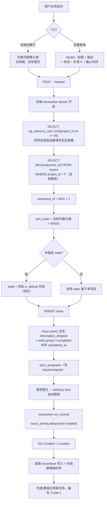
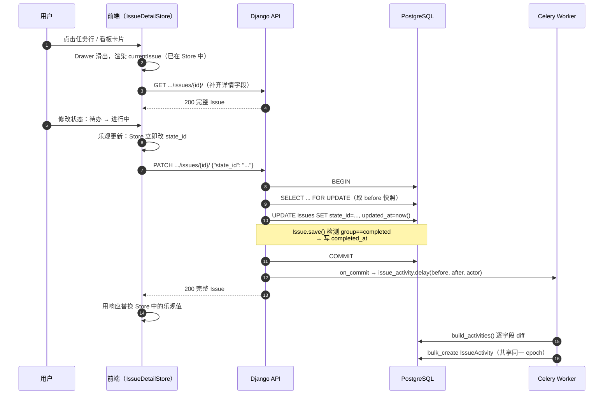
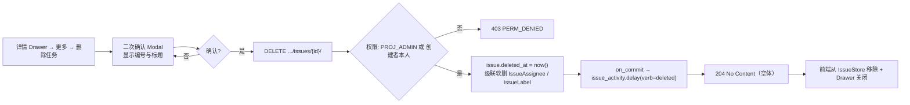
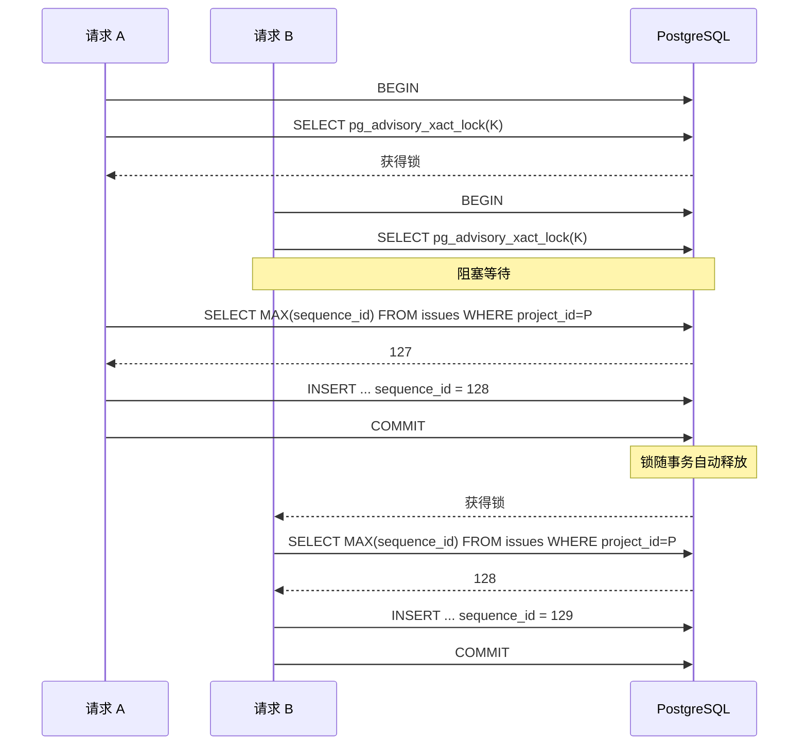
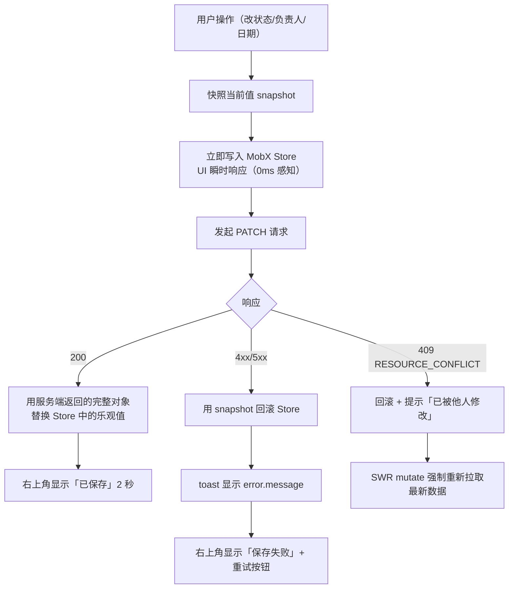

# 任务 CRUD（5 固定字段）

| 元信息项 | 内容 |
| --- | --- |
| 文档编号 | TASK-001 |
| 所属迭代 | Sprint 0 — POC 技术验证（第 1-2 周） |
| 优先级 | P0（POC 阻塞级 · **本迭代最核心功能**） |
| 所属模块 | M4-TASK｜任务核心 |
| 文档状态 | 已确认（Approved） |
| 最后更新日期 | 2026-09-01 |
| 上游依赖 | `PROJ-001`（项目 + 默认状态集 + identifier）、`INFRA-003`（Issue 建表）、`AUTH-003`（权限隔离） |
| 下游消费 | `BOARD-001`（看板卡片渲染本文档创建的 Issue，拖拽复用本文档的 PATCH 接口）、`TASK-002` ~ `TASK-015` 全系列 |
| 上游依据 | `docs/需求文档.md` §3.4 任务核心、§8.3 POC 范围界定（P0 固定 5 字段）、§8.4 POC 验收标准第 3 条 |
| 关联架构文档 | [`unified-issue-model.md`](../architecture/unified-issue-model.md)（**全文，尤其 §2.8 §2.9 §2.10 §3 §4**）、[`dynamic-fields-design.md`](../architecture/dynamic-fields-design.md)（`custom_fields` 预留）、[`api-conventions.md`](../architecture/api-conventions.md)、[`rbac-permission-model.md`](../architecture/rbac-permission-model.md)、[`tech-stack.md`](../architecture/tech-stack.md) |
| 对标基线 | Plane Issue 模型（advisory lock / 四格式描述 / sort_order 插值 / IssueActivity） · Ones 统一工作项 |
| 工作量估算 | 后端 3 人日 / 前端 3 人日 / 联调与测试 1.5 人日，合计 **7.5 人日** |

---

## 1. 概述

### 1.1 功能定位

任务（技术层为 `Issue`）是**整个系统的核心实体**。所有下游能力——看板、甘特图、筛选器、工作流、报表、评论、附件、工时、依赖关系——全部建立在 `Issue` 之上。本文档因此是 Sprint 0 中份量最重、技术风险最集中的一份。

P0 交付：在项目内完成任务的**创建、查询、编辑、删除**，仅开放 **5 个固定字段**。

### 1.2 P0 的 5 个固定字段

| # | 产品字段 | 数据库字段 | 类型 | 必填 | 说明 |
| --- | --- | --- | --- | --- | --- |
| 1 | 标题 | `name` | varchar(512) | ✅ | 唯一必填字段 |
| 2 | 描述 | `description_json` + `description_html` + `description_stripped` | jsonb + text + text | ❌ | TipTap 富文本，三列同步写入 |
| 3 | 状态 | `state` | UUID FK → State | ❌（默认落 `is_default`） | 由 `PROJ-001` 创建的四态之一 |
| 4 | 负责人 | `assignees` | M2M via `IssueAssignee` | ❌ | **P0 限单人**（UI 单选，数据结构为 M2M） |
| 5 | 截止时间 | `target_date` | date | ❌ | `YYYY-MM-DD`，无时间部分 |

### 1.3 关键约定：模型建全字段，前端只暴露 5 个

> ⚠️ **这是本文档最重要的技术约定。**

**`Issue` Model 必须一次性建齐全部字段**——`issue_type`、`priority`、`labels`、`parent`、`start_date`、`completed_at`、`custom_fields`、`archived_at`、`description_binary`、`sort_order`、`sequence_id` 等**全部建列、全部建索引**，只是 P0 的 API 不暴露、前端不展示。

| 字段 | P0 建列 | P0 建索引 | P0 API 暴露 | P0 前端展示 | 启用迭代 |
| --- | --- | --- | --- | --- | --- |
| `name` | ✅ | — | ✅ | ✅ | P0 |
| `description_json` / `_html` / `_stripped` | ✅ | ✅ GIN trgm | ✅ | ✅ | P0 |
| `description_binary` | ✅ | — | ❌ | ❌ | P2（Yjs 协同） |
| `state` | ✅ | ✅ 复合 | ✅ | ✅ | P0 |
| `assignees` | ✅ | ✅ | ✅ | ✅（单人） | P0 / P2 多人 |
| `target_date` | ✅ | ✅ | ✅ | ✅ | P0 |
| `sequence_id` | ✅ | ✅ 唯一 | ✅（只读） | ✅（编号） | P0 |
| `sort_order` | ✅ | ✅ 复合 | ✅ | ❌（隐式） | P0 |
| `issue_type` | ✅ | ✅ | ❌ | ❌ | P1 |
| `priority` | ✅ | ✅ | ❌ | ❌ | P1 |
| `labels` | ✅ | ✅ | ❌ | ❌ | P1 |
| `parent` | ✅ | ✅ | ❌ | ❌ | P1（一级子任务） |
| `start_date` | ✅ | — | ❌ | ❌ | P1 |
| `completed_at` | ✅ | — | ✅（只读） | ❌ | P0 自动写入 |
| `custom_fields` | ✅ | ✅ GIN | ❌ | ❌ | P2 |
| `archived_at` | ✅ | ✅ 偏索引 | ❌ | ❌ | P2 |

**为什么必须一次建齐**（[`unified-issue-model.md`](../architecture/unified-issue-model.md) §6 的核心结论）：

1. **零 DDL 升级**。`issues` 表是全库增长最快的核心表。在数据量达到百万级后执行 `ALTER TABLE ADD COLUMN` + `CREATE INDEX`，即便 PostgreSQL 支持 `CREATE INDEX CONCURRENTLY`，仍需数小时且伴随复制延迟风险。P0 阶段表为空，此时建齐成本为零。
2. **避免下游文档反复改模型**。`TASK-002` ~ `TASK-015` 共 14 份文档若各自追加列，将产生 14 次 migration 与 14 次回归测试。
3. **`completed_at` 必须 P0 就写入**。`Issue.save()` 在 `state.group` 首次进入 `completed` 时写 `completed_at`（[`unified-issue-model.md`](../architecture/unified-issue-model.md) §4.3）。若 P1 才加此逻辑，则 P0 期间完成的任务永久丢失完成时间，报表无法回溯。
4. **`sequence_id` 与 `sort_order` 是 P0 刚需**，不属于「预留」：前者支撑编号展示与验收，后者支撑 `BOARD-001` 的拖拽排序。

**反面约束**：P0 的 Serializer **不得**输出未启用字段（避免前端提前依赖后又变更），但 Model 与 migration **必须**包含它们。二者的分离由 `IssueSerializer.Meta.fields` 白名单实现。

### 1.4 范围边界

| 能力 | P0（本文档） | 后续 |
| --- | --- | --- |
| 创建任务（5 字段） | ✅ | — |
| 序列号自动生成（advisory lock） | ✅ | — |
| 任务列表（表格视图） | ✅ | `TASK-011` 加全字段筛选与任意字段排序 / 分组 |
| 任务详情（侧滑 Drawer） | ✅ | — |
| 编辑任务（自动保存） | ✅ | — |
| 软删除 | ✅ | — |
| IssueActivity 自动记录 | ✅ | `TASK-010` 补全量字段与 UI 时间线 |
| `sort_order` 生成与更新 | ✅ | `BOARD-001` 消费 |
| 富文本描述（TipTap 基础模式） | ✅ | `COLLAB-004` 加协同 |
| 类型 / 优先级 / 标签 | ❌（列已建） | `TASK-002` |
| 子任务 / 依赖关系 / 工时 | ❌（`parent` 列已建） | `TASK-003` ~ `TASK-006` |
| 多执行人 | ❌（M2M 已就绪） | `TASK-007` |
| 自定义字段 | ❌（`custom_fields` 列已建 + GIN） | `TASK-008` |
| 批量操作 / 复制 / 归档 | ❌ | `TASK-009` |
| 评论 / 附件 | ❌ | `COLLAB-001` / `FILE-001` |
| 组合筛选器 / 视图保存 | ❌ | `TASK-011` / `TASK-012` |

### 1.5 前置依赖

| 依赖 | 内容 | 阻塞原因 |
| --- | --- | --- |
| `PROJ-001` | 项目存在；`identifier`（编号前缀）；4 条 `State`（含 `is_default`）；`default_state_id` 已下发 | 创建任务需落入默认状态；编号需前缀 |
| `INFRA-003` | `Issue` / `IssueAssignee` / `IssueLabel` / `IssueActivity` 建表；`pg_trgm` 扩展已启用（GIN trgm 索引依赖） | 无表无从谈起 |
| `AUTH-003` | `ProjectBasePermission`（L2）、`ProjectEntityPermission`（L3） | 任务级权限判定 |
| `INFRA-002` | Celery worker + RabbitMQ 已就绪 | `IssueActivity` 异步写入 |

### 1.6 竞品参考

| 竞品 | 参考点 | 处置 |
| --- | --- | --- |
| Plane | Issue 模型字段、**PostgreSQL advisory lock 序列号**、**四格式描述存储**、**sort_order 浮点插值**、**IssueActivity event sourcing lite** | **四项核心机制完全复用**（§6.1） |
| Ones | 统一工作项模型（需求/缺陷/任务/测试同表）、工作项编号、字段级配置 | 统一模型思路一致；差异化配置延后（§6.2） |

---

## 2. 业务逻辑

### 2.1 创建任务



**为什么必须用 advisory lock 而不是数据库 SEQUENCE**：见 §4.3.1 与 §6.1 专题。核心结论是「编号必须无空洞」——`TZXM-1` 到 `TZXM-128` 一个不缺，这对审计与沟通有实际价值，而 PostgreSQL 原生 `SEQUENCE` 在事务回滚后不回退号码，必然产生空洞。

### 2.2 编辑任务



**自动保存策略**（不设「保存」按钮）：

| 字段 | 触发时机 | 理由 |
| --- | --- | --- |
| 标题 `name` | `onBlur` 或 `Enter`；且值确有变化 | 避免逐字符请求 |
| 描述 `description` | **停止输入 1500ms 防抖** + `onBlur` 强制 flush + 组件卸载前 flush | 富文本输入频繁；1500ms 是「不丢内容」与「不刷请求」的平衡点 |
| 状态 `state_id` | 选中即提交 | 离散值，一次点击即完整意图 |
| 负责人 `assignee_ids` | 选中即提交 | 同上 |
| 截止时间 `target_date` | 选中日期即提交；清空也提交（`null`） | 同上 |

**乐观更新与回滚**：所有字段修改先写 MobX Store（UI 立即响应），再发 PATCH。失败时用快照回滚并弹 toast 显示 `error.message`。详见 §4.3.4。

### 2.3 删除任务

**软删除**：`deleted_at` 置值。



| 约束 | 说明 |
| --- | --- |
| 响应 | `204`，**体为空** |
| 权限 | `PROJ_ADMIN`(20) 可删任意任务；`PROJ_CONTRIBUTOR`(15) **仅可删自己创建的**（`created_by == request.user`）；`COMMENTER`/`VIEWER` 不可删 |
| **序列号不复用** | `next_sequence_id` 用 `Issue.all_objects`（含软删除）算 `MAX`。删除 `TZXM-3` 后新任务是 `TZXM-4`，绝不重用 3 |
| 列表不显示 | `Issue.objects`（`SoftDeleteManager`）自动过滤 |
| 数据可恢复 | `all_objects` 可查；P0 无 UI 恢复入口 |
| 幂等 | 重复 DELETE 返回 `404` |

### 2.4 业务规则汇总

| 编号 | 规则 |
| --- | --- |
| BR-1 | `name` 必填，trim 后 1 ~ 512 字符 |
| BR-2 | `description` 全空时 `description_html` 为 `"<p></p>"`，`description_stripped` 为 `NULL`（`Issue.save()` 自动处理） |
| BR-3 | `state_id` 未指定时落入项目 `is_default=True` 的状态（「待办」） |
| BR-4 | `state_id` 必须属于当前项目，否则 `400 VALIDATION_ERROR` + `code=DOES_NOT_EXIST` |
| BR-5 | `assignee_ids` P0 **最多 1 个元素**；元素必须是当前项目的 active `ProjectMember` |
| BR-6 | `target_date` 格式 `YYYY-MM-DD`。**允许过去日期**（补录历史任务是合法场景），不校验 |
| BR-7 | `start_date` P0 不暴露，恒为 `NULL`。DB 约束 `chk_issue_start_before_target` 因此永不触发 |
| BR-8 | `sequence_id` 由服务端生成，**Workspace 内不唯一、项目内唯一**（约束 `uniq_issue_sequence_per_project`） |
| BR-9 | 展示编号 = `{project.identifier}-{sequence_id}`，如 `TZXM-1`。该拼接在**展示层**完成，DB 不冗余存储 |
| BR-10 | `sort_order` 新建时 = 目标状态列当前最大值 + 65535.0 |
| BR-11 | `state.group` 首次进入 `completed` 时写 `completed_at`；退回非 completed 状态时 `completed_at` **保留不清空**（首次完成时间语义） |
| BR-12 | `project` 由 URL 推导，不接受请求体传入 |
| BR-13 | 每次成功的 create / update / delete 必产生 ≥ 1 条 `IssueActivity` |
| BR-14 | P0 不返回也不接受 `issue_type_id` / `priority` / `label_ids` / `parent_id` / `custom_fields`；传入被静默忽略（不报错，便于 P1 平滑开放） |

### 2.5 异常处理

| 场景 | HTTP | 错误码 | 提示 |
| --- | --- | --- | --- |
| 标题为空 | 400 | `VALIDATION_ERROR` + `REQUIRED` | 「任务标题不能为空」 |
| 标题超 512 | 400 | `VALIDATION_ERROR` + `TOO_LONG` | 「任务标题最多 512 个字符」 |
| `state_id` 不属于本项目 | 400 | `VALIDATION_ERROR` + `DOES_NOT_EXIST` | 「所选状态无效」 |
| `state_id` 格式非 UUID | 400 | `VALIDATION_ERROR` + `INVALID` | 「状态参数格式错误」 |
| `assignee_ids` 超过 1 人 | 400 | `VALIDATION_ERROR` + `INVALID` | 「当前版本仅支持单个负责人」 |
| 负责人非项目成员 | 400 | `VALIDATION_ERROR` + `DOES_NOT_EXIST` | 「所选负责人不是项目成员」 |
| `target_date` 格式非法 | 400 | `VALIDATION_ERROR` + `INVALID` | 「截止时间格式应为 YYYY-MM-DD」 |
| 项目不存在 / 无权 | 404 | `RESOURCE_NOT_FOUND` | 「项目不存在或你没有访问权限」 |
| 任务不存在 / 无权 / 已软删 / 属于其他项目 | 404 | `RESOURCE_NOT_FOUND` | 「任务不存在或你没有访问权限」 |
| `PROJ_VIEWER` 创建任务 | 403 | `PERM_ROLE_INSUFFICIENT` | 「你没有创建任务的权限」 |
| `PROJ_CONTRIBUTOR` 删他人任务 | 403 | `PERM_DENIED` | 「只能删除自己创建的任务」 |
| 序列号唯一约束冲突（理论不应发生） | 409 | `RESOURCE_CONFLICT` | 「任务编号冲突，请重试」 |
| PUT 请求 | 405 | `METHOD_NOT_ALLOWED` | — |
| ETag 冲突（并发编辑） | 409 | `RESOURCE_CONFLICT` | 「该任务已被他人修改，请刷新后重试」 |

---

## 3. UI/UX 设计

### 3.1 任务列表视图

路由 `/:workspaceSlug/projects/:projectId/issues`。表格形式（`@tanstack/react-table` 8.21）。

```
┌────────────────────────────────────────────────────────────────────────────────┐
│  任务列表                                          ┌──────────────────────┐    │
│  12 个任务                                          │ ＋ 创建任务           │    │
├────────────────────────────────────────────────────────────────────────────────┤
│ ＋ 输入任务标题后按回车快速创建…                                                │  ← 快速创建行
├─────────┬────────────────────────────────┬──────────┬──────────┬──────────────┤
│ 编号    │ 标题                            │ 状态     │ 负责人   │ 截止时间      │
├─────────┼────────────────────────────────┼──────────┼──────────┼──────────────┤
│ TZXM-1  │ 搭建 Monorepo 工程骨架          │ ●已完成  │ 👤 张三  │ 2026-09-05   │
│ TZXM-2  │ Docker Compose 全套服务编排      │ ●进行中  │ 👤 张三  │ 2026-09-08   │
│ TZXM-3  │ Django ORM 初始数据模型          │ ●进行中  │ 👤 张三  │ 2026-09-10   │
│ TZXM-4  │ 邮箱注册 / 登录 / 退出           │ ●待办    │ —        │ 🔴 2026-08-30│  ← 逾期红色
│ TZXM-5  │ 固定三列看板 + 拖拽              │ ●待办    │ 👤 张三  │ —            │
└─────────┴────────────────────────────────┴──────────┴──────────┴──────────────┘
```

| 列 | 宽度 | 渲染 |
| --- | --- | --- |
| 编号 | 96px | `{identifier}-{sequence_id}`，`font-mono text-xs text-neutral-500`。点击复制到剪贴板并 toast |
| 标题 | flex-1，min 240px | `text-sm truncate`，hover 下划线。整行可点击打开 Drawer |
| 状态 | 120px | `StateBadge`（`PROJ-001` §4.4.4 提供）：圆点用 `state.color` + 状态名 |
| 负责人 | 100px | 24px 圆形头像 + 名称（`truncate`）；无则 `—` |
| 截止时间 | 120px | `date-fns` 4.1 格式化 `yyyy-MM-dd`；逾期且状态非 `completed` 时红色 + `alert-circle` 图标；无则 `—` |

**行为**：

| 行为 | 规格 |
| --- | --- |
| 行 hover | `bg-neutral-50`，右侧出现 `more-horizontal` 图标 |
| 行点击 | 打开右侧详情 Drawer（§3.3），不跳转路由；URL 追加 `?peekIssue={id}` 使详情可分享刷新 |
| 排序 | P0 固定按 `sort_order` 升序（与看板一致，保证两视图顺序统一）。列头排序由 `TASK-003` 交付 |
| 虚拟滚动 | P0 **不启用** `@tanstack/react-virtual`（任务量少）。列表超 200 条时才有必要，P1 视需要开启 |
| 空状态 | 见 §3.5 |

### 3.2 创建任务

#### 3.2.1 快速创建行（主路径）

置于列表顶部（表头下方）的常驻输入行——这是达成「1 分钟内创建 3 条以上任务」验收标准的**关键交互**。

```
┌────────────────────────────────────────────────────────────────────────┐
│ ＋ │ 输入任务标题后按回车快速创建…                                      │
└────────────────────────────────────────────────────────────────────────┘
```

| 行为 | 规格 |
| --- | --- |
| 提交 | `Enter` 立即创建（仅传 `name`），状态落默认「待办」，无负责人无截止时间 |
| **焦点保持** | 创建成功后输入框**清空但保持 focus**，可连续输入下一条。这是「1 分钟建 3 条」的核心 |
| 乐观插入 | 回车瞬间在列表末尾插入临时行（编号位显示 `…`，`opacity-60`），服务端返回后替换为真实数据并填入编号 |
| 失败 | 移除临时行 + toast `error.message` + 输入框内容**恢复**（不让用户重打） |
| `Esc` | 清空输入并失焦 |
| 空值 `Enter` | 无操作（不发请求） |
| 连击保护 | 请求未返回时再次 `Enter` 允许提交（并发创建由 advisory lock 保证编号正确），但同一内容 300ms 内重复提交则忽略 |

#### 3.2.2 完整表单 Modal

用于需要一次填齐 5 个字段的场景。Headless UI `Dialog`，宽 640px。

```
┌──────────────────────────────────────────────────────────────┐
│  创建任务 · 兔子项目管理                                   ✕  │
│                                                              │
│  ┌────────────────────────────────────────────────────────┐  │
│  │ 任务标题                                                │  │  ← 无 label，大字号
│  └────────────────────────────────────────────────────────┘  │
│                                                              │
│  ┌────────────────────────────────────────────────────────┐  │
│  │ B I U ≡ ☰ ⌗ ⌗⌗ </> 🔗                                 │  │  ← TipTap 工具条
│  ├────────────────────────────────────────────────────────┤  │
│  │ 添加描述…                                               │  │
│  │                                                        │  │
│  └────────────────────────────────────────────────────────┘  │
│                                                              │
│  ┌──────────┐ ┌──────────┐ ┌──────────────┐                 │
│  │ ●待办  ▾ │ │ 👤负责人▾ │ │ 📅截止时间 ▾ │                 │  ← 三个下拉，横向排列
│  └──────────┘ └──────────┘ └──────────────┘                 │
│                                                              │
│  ☐ 创建后继续创建下一个            ┌────────┐ ┌───────────┐  │
│                                    │  取消   │ │  创建任务  │  │
│                                    └────────┘ └───────────┘  │
└──────────────────────────────────────────────────────────────┘
```

| 元素 | 规格 |
| --- | --- |
| 标题输入 | `text-lg font-medium`，无边框（`border-0 focus:ring-0`），placeholder「任务标题」，自动 focus |
| 描述编辑器 | TipTap 2.14 基础模式（§3.4） |
| 状态下拉 | 默认选中项目默认状态；选项来自 `useProjectStates`（`PROJ-001` §4.4.2），显示圆点 + 名称 |
| 负责人下拉 | 项目成员单选 + 搜索框 + 「指派给我」快捷项 |
| 截止时间 | 日期选择器，含「今天 / 明天 / 下周」快捷项 |
| 「创建后继续创建」 | 勾选后创建成功保持 Modal 打开并清空表单（保留状态/负责人选择），用于批量录入 |
| 快捷键 | `⌘/Ctrl + Enter` 提交；`Esc` 关闭（有内容时二次确认） |
| 提交中 | 按钮 loading，Modal 锁定 |

### 3.3 任务详情面板（Drawer）

**右侧滑出面板**，宽 720px（`< 1280px` 时为 `calc(100vw - 64px)`）。`BOARD-001` 的卡片点击**复用同一组件**。

```
┌──────────────────────────────────────────────────────────────────┐
│ TZXM-2                                              ⋯    ✕      │
│                                                                  │
│ ┌──────────────────────────────────────────────────────────────┐ │
│ │ Docker Compose 全套服务编排                                   │ │  ← 可编辑标题
│ └──────────────────────────────────────────────────────────────┘ │
│                                                                  │
│ ┌──────────────────────────────────────────────────────────────┐ │
│ │ B I U ≡ ☰ ⌗ </> 🔗                                          │ │
│ ├──────────────────────────────────────────────────────────────┤ │
│ │ 编排 11 个服务：web / admin / space / api / worker / beat /   │ │
│ │ live / db / redis / mq / minio / proxy                        │ │
│ │                                                              │ │
│ │ • healthcheck + depends_on 保证启动顺序                       │ │
│ │ • profiles 区分本地与生产                                     │ │
│ └──────────────────────────────────────────────────────────────┘ │
│                                                                  │
│ ─────────────────────────────────────────────────────────────── │
│  状态        ┌────────────┐                                      │
│              │ ● 进行中 ▾ │                                      │
│              └────────────┘                                      │
│  负责人      ┌────────────┐                                      │
│              │ 👤 张三  ▾ │                                      │
│              └────────────┘                                      │
│  截止时间    ┌────────────┐                                      │
│              │ 2026-09-08 │                                      │
│              └────────────┘                                      │
│ ─────────────────────────────────────────────────────────────── │
│  创建者 张三 · 创建于 2026-09-01 11:22                            │
│  最后更新 2026-09-01 14:05                                        │
└──────────────────────────────────────────────────────────────────┘
```

| 元素 | 规格 |
| --- | --- |
| 顶部编号 | `font-mono text-sm text-neutral-500`，点击复制 |
| `⋯` 菜单 | 「复制链接」「复制编号」「删除任务」（后者红色，由 `<PermissionGate>` 包裹） |
| 关闭 | ✕ / `Esc` / 点击遮罩 / 浏览器后退（URL 中的 `?peekIssue` 被移除） |
| 标题编辑 | 点击变为输入框；`onBlur` 或 `Enter` 保存；`Esc` 取消恢复原值 |
| 属性区 | 左侧 label（80px，`text-sm text-neutral-500`）+ 右侧控件。P0 恰好三项 |
| 元信息 | 底部灰色小字，`date-fns` 格式化为本地时区 |
| 保存反馈 | 右上角出现 `已保存`（`check` 图标，2 秒后淡出）；失败时 `保存失败`（红色 + 重试按钮） |
| 动效 | Framer Motion 12：`x: '100%'` → `x: 0`，`spring` `{ stiffness: 320, damping: 32 }`；遮罩 `opacity` 联动 |
| URL 同步 | 打开时追加 `?peekIssue={issue_id}`。刷新页面自动重新打开该任务，链接可分享 |

### 3.4 TipTap 富文本编辑器（P0 基础模式）

```typescript
// packages/editor/src/basic-editor.tsx
import StarterKit from "@tiptap/starter-kit";
import Placeholder from "@tiptap/extension-placeholder";
import Link from "@tiptap/extension-link";
import { useEditor } from "@tiptap/react";

/**
 * P0 基础模式：不启用 Collaboration / CollaborationCursor（无 Yjs、无 WebSocket）。
 * 扩展集合刻意与 P2 协同模式保持同一份 schema，
 * 使 P2 接入 Hocuspocus 时不需要迁移已有文档结构。
 */
export const BASIC_EXTENSIONS = [
  StarterKit.configure({
    heading: { levels: [1, 2, 3] },
    codeBlock: {},
    // P2 协同模式需关闭 history（由 Yjs UndoManager 接管），P0 保留
    history: {},
  }),
  Placeholder.configure({ placeholder: "添加描述…" }),
  Link.configure({ openOnClick: false, autolink: true }),
];
```

| 能力 | P0 | 启用迭代 |
| --- | --- | --- |
| 粗体 / 斜体 / 下划线 / 删除线 | ✅ | P0 |
| 一至三级标题 | ✅ | P0 |
| 无序 / 有序列表 | ✅ | P0 |
| 代码块 + 行内代码 | ✅ | P0 |
| 引用块 / 分割线 | ✅ | P0 |
| 链接 | ✅ | P0 |
| 图片上传 | ❌ | `FILE-001` |
| 表格 | ❌ | `COLLAB-002` |
| @提及 | ❌ | `COLLAB-001` |
| 任务清单（checkbox） | ❌ | `TASK-002` |
| **多人协同光标** | ❌ | `COLLAB-004` |
| Slash 命令 | ❌ | P2 |

**三格式同步写入**：`onUpdate` 时同时产出 `description_json`（`editor.getJSON()`）与 `description_html`（`editor.getHTML()`），一起 PATCH。`description_stripped` 由服务端 `Issue.save()` 从 HTML 派生（§4.3.5），前端不参与。`description_binary`（Yjs）P0 恒为 `NULL`。

### 3.5 空状态

| 场景 | 处置 |
| --- | --- |
| 项目内无任务 | 居中插画（`clipboard-list` 96px `text-neutral-300`）+ 主标题「暂无任务」+ 副文案「**创建第一个任务开始工作**」+ 主按钮「＋ 创建任务」。快速创建行**仍然显示**（在空状态上方），使用户可直接输入 |
| 无创建权限（`PROJ_VIEWER`/`COMMENTER`） | 同插画，副文案「你没有创建任务的权限」，隐藏按钮与快速创建行 |
| 加载中 | 8 行表格骨架（`animate-pulse`），列宽与真实表格一致（CLS = 0） |
| 加载失败 | `alert-circle` + `error.message` + 「重试」按钮 |

### 3.6 响应式与无障碍

| 断点 | 布局 |
| --- | --- |
| ≥ 1280px | 表格全列；Drawer 720px |
| 768 ~ 1279px | 隐藏「截止时间」列（详情内仍可查看编辑）；Drawer `calc(100vw - 64px)` |
| < 768px | 表格降级为卡片列表（每卡两行：标题 / 编号+状态+负责人）；Drawer 全屏 |

无障碍：表格用语义 `<table>`；Drawer 为 `role="dialog"` + `aria-modal="true"` + 焦点陷阱 + 关闭后焦点归还触发元素；所有下拉用 Headless UI（自带键盘导航与 ARIA）；状态圆点不作为唯一信息载体（同时有文字，满足色盲可达）。

---

## 4. 技术架构

### 4.1 数据模型

完整定义见 [`unified-issue-model.md`](../architecture/unified-issue-model.md) §2.8。本节**完整引用**，因为 P0 必须一次建齐（§1.3）。

```python
# apps/api/plane/db/models/issue.py
from django.contrib.postgres.indexes import GinIndex


class Issue(BaseModel):
    """统一工作项 —— 系统核心模型

    需求 / 缺陷 / 任务 / 测试 / 文档均为本模型记录，通过 issue_type 区分。
    P0 仅暴露 5 个字段，但全部列一次建齐（TASK-001 §1.3）。
    """

    class Priority(models.TextChoices):
        NONE = "none", "无"
        LOW = "low", "低"
        MEDIUM = "medium", "中"
        HIGH = "high", "高"
        URGENT = "urgent", "紧急"

    # ---------------- 基础字段 ----------------
    project = models.ForeignKey(Project, on_delete=models.CASCADE,
                                related_name="issues", verbose_name="所属项目")
    name = models.CharField(max_length=512, verbose_name="标题")

    description_json = models.JSONField(default=dict, blank=True,
                                        verbose_name="描述-ProseMirror JSON")
    description_html = models.TextField(default="<p></p>", blank=True,
                                        verbose_name="描述-HTML")
    description_binary = models.BinaryField(null=True, blank=True,
                                            verbose_name="描述-Yjs Binary")
    description_stripped = models.TextField(null=True, blank=True,
                                            verbose_name="描述-纯文本")

    # ---------------- 分类与状态 ----------------
    issue_type = models.ForeignKey(IssueType, on_delete=models.SET_NULL, null=True, blank=True,
                                   related_name="issues", verbose_name="任务类型",
                                   help_text="P0 阶段为空，P1 起必填")
    state = models.ForeignKey(State, on_delete=models.SET_NULL, null=True,
                              related_name="issues", verbose_name="当前状态")
    priority = models.CharField(max_length=16, choices=Priority.choices,
                                default=Priority.NONE, db_index=True, verbose_name="优先级")

    # ---------------- 人员 ----------------
    created_by = models.ForeignKey("db.User", on_delete=models.SET_NULL, null=True,
                                   related_name="created_issues", verbose_name="创建人")
    assignees = models.ManyToManyField("db.User", through="IssueAssignee",
                                       through_fields=("issue", "assignee"),
                                       related_name="assigned_issues", blank=True,
                                       verbose_name="负责人")

    # ---------------- 时间 ----------------
    start_date = models.DateField(null=True, blank=True, verbose_name="开始时间")
    target_date = models.DateField(null=True, blank=True, db_index=True, verbose_name="截止时间")
    completed_at = models.DateTimeField(null=True, blank=True, verbose_name="完成时间",
                                        help_text="state.group 首次进入 completed 时写入")

    # ---------------- 层级 ----------------
    parent = models.ForeignKey("self", on_delete=models.CASCADE, null=True, blank=True,
                               related_name="sub_issues", verbose_name="父工作项")

    # ---------------- 序列 ----------------
    sequence_id = models.IntegerField(default=1, verbose_name="项目内序列号",
                                      help_text="PostgreSQL advisory lock 生成，展示为 TZXM-128")

    # ---------------- 排序 ----------------
    sort_order = models.FloatField(default=65535.0, verbose_name="排序值",
                                   help_text="看板/列表拖拽排序，浮点插值避免整表重排")

    # ---------------- 标签 ----------------
    labels = models.ManyToManyField(Label, through="IssueLabel",
                                    through_fields=("issue", "label"),
                                    related_name="issues", blank=True, verbose_name="标签")

    # ---------------- 预留扩展 ----------------
    custom_fields = models.JSONField(default=dict, blank=True, verbose_name="自定义字段值",
                                     help_text="动态字段值集合，GIN 索引，详见 dynamic-fields-design.md")

    # ---------------- 归档 ----------------
    archived_at = models.DateTimeField(null=True, blank=True, verbose_name="归档时间")

    class Meta(BaseModel.Meta):
        db_table = "issues"
        verbose_name = "工作项"
        ordering = ("-created_at",)
        constraints = [
            models.UniqueConstraint(
                fields=["project", "sequence_id"],
                condition=models.Q(deleted_at__isnull=True),
                name="uniq_issue_sequence_per_project",
            ),
            models.CheckConstraint(
                check=models.Q(start_date__isnull=True)
                | models.Q(target_date__isnull=True)
                | models.Q(start_date__lte=models.F("target_date")),
                name="chk_issue_start_before_target",
            ),
        ]
        indexes = [
            # 看板/列表主查询：项目 + 状态 + 排序 —— BOARD-001 的核心索引
            models.Index(fields=["project", "state", "sort_order"], name="idx_issue_proj_state_sort"),
            # 类型筛选（P1 需求池 / 缺陷列表核心查询）
            models.Index(fields=["project", "issue_type"], name="idx_issue_proj_type"),
            # 子任务查询
            models.Index(fields=["parent"], name="idx_issue_parent"),
            # 归档过滤：绝大多数查询带 archived_at IS NULL
            models.Index(fields=["project", "created_at"],
                         condition=models.Q(archived_at__isnull=True, deleted_at__isnull=True),
                         name="idx_issue_active_by_project"),
            # 自定义字段 JSONB 查询（P2 启用，P0 建索引）
            GinIndex(fields=["custom_fields"], name="idx_issue_custom_fields"),
            # 模糊搜索
            GinIndex(name="idx_issue_desc_trgm", fields=["description_stripped"],
                     opclasses=["gin_trgm_ops"]),
        ]

    def __str__(self) -> str:
        return f"{self.project.identifier}-{self.sequence_id} {self.name}"
```

#### 4.1.1 索引设计说明

| 索引 | 服务的查询 | P0 是否用到 |
| --- | --- | --- |
| `idx_issue_proj_state_sort` | `WHERE project=? AND state=? ORDER BY sort_order` —— **`BOARD-001` 每列的取数查询** | ✅ 核心 |
| `uniq_issue_sequence_per_project` | 序列号唯一性兜底 + `MAX(sequence_id)` 的索引扫描 | ✅ 核心 |
| `idx_issue_active_by_project` | `WHERE project=? AND archived_at IS NULL AND deleted_at IS NULL ORDER BY created_at` —— 列表默认查询 | ✅ |
| `target_date` 单列索引 | 逾期任务扫描（Celery beat 提醒任务） | ⚠️ P1 |
| `priority` 单列索引 | 优先级筛选 | ❌ P1 |
| `idx_issue_proj_type` | 需求池 / 缺陷列表 | ❌ P1 |
| `idx_issue_parent` | 子任务树 | ❌ P1 |
| `idx_issue_custom_fields`（GIN） | `custom_fields @> '{...}'` 动态字段筛选 | ❌ P2 |
| `idx_issue_desc_trgm`（GIN trgm） | `description_stripped ILIKE '%关键词%'` | ❌ P1 |

> **`pg_trgm` 扩展依赖**：`idx_issue_desc_trgm` 需要 `CREATE EXTENSION IF NOT EXISTS pg_trgm;`。此语句必须写在 `INFRA-003` 的第一个 migration 中（`django.contrib.postgres.operations.TrigramExtension`），否则本表 migration 会失败。这是 P0 阶段最容易踩的一个坑。

#### 4.1.2 IssueAssignee / IssueLabel

```python
class IssueAssignee(BaseModel):
    """负责人显式中间表 —— 相比 Plane 额外记录 assigned_by（谁指派的）"""

    issue = models.ForeignKey(Issue, on_delete=models.CASCADE, related_name="issue_assignee")
    assignee = models.ForeignKey("db.User", on_delete=models.CASCADE,
                                 related_name="issue_assignee")
    assigned_by = models.ForeignKey("db.User", on_delete=models.SET_NULL, null=True,
                                    related_name="assigned_issue_assignee")

    class Meta(BaseModel.Meta):
        db_table = "issue_assignees"
        constraints = [
            models.UniqueConstraint(fields=["issue", "assignee"],
                                    condition=models.Q(deleted_at__isnull=True),
                                    name="uniq_issue_assignee"),
        ]
        indexes = [models.Index(fields=["issue"], name="idx_assignee_issue")]
```

`IssueLabel` 结构同理（`issue` + `label`），P0 建表不使用。

#### 4.1.3 IssueActivity

```python
class IssueActivity(BaseModel):
    """操作日志 —— Event Sourcing lite：状态表 + 逐字段 diff 日志"""

    class Verb(models.TextChoices):
        CREATED = "created", "创建"
        UPDATED = "updated", "更新"
        DELETED = "deleted", "删除"

    issue = models.ForeignKey(Issue, on_delete=models.CASCADE, null=True,
                              related_name="issue_activities")
    actor = models.ForeignKey("db.User", on_delete=models.SET_NULL, null=True,
                              related_name="issue_activities")
    verb = models.CharField(max_length=16, choices=Verb.choices, default=Verb.CREATED)

    field = models.CharField(max_length=64, null=True, blank=True, verbose_name="变更字段名")
    old_value = models.TextField(null=True, blank=True, verbose_name="变更前值（可读文本）")
    new_value = models.TextField(null=True, blank=True, verbose_name="变更后值（可读文本）")
    old_identifier = models.UUIDField(null=True, blank=True)
    new_identifier = models.UUIDField(null=True, blank=True)

    comment = models.TextField(blank=True, verbose_name="人类可读描述")
    epoch = models.FloatField(null=True, verbose_name="毫秒时间戳",
                              help_text="同一次批量更新的多条日志按 epoch 分组聚合展示")

    class Meta(BaseModel.Meta):
        db_table = "issue_activities"
        ordering = ("created_at",)
        indexes = [
            models.Index(fields=["issue", "created_at"], name="idx_activity_issue_time"),
            models.Index(fields=["actor", "created_at"], name="idx_activity_actor_time"),
            models.Index(fields=["field"], name="idx_activity_field"),
        ]
```

### 4.2 API 定义

| # | 方法 | 路径 | 描述 | 权限 | 成功码 |
| --- | --- | --- | --- | --- | --- |
| 1 | `POST` | `/api/v1/workspaces/{slug}/projects/{project_id}/issues/` | 创建任务 | `PROJ_CONTRIBUTOR`(15)+ | `201` |
| 2 | `GET` | `/api/v1/workspaces/{slug}/projects/{project_id}/issues/` | 任务列表 | `PROJ_VIEWER`(5)+ | `200` |
| 3 | `GET` | `/api/v1/workspaces/{slug}/projects/{project_id}/issues/{issue_id}/` | 任务详情 | `PROJ_VIEWER`(5)+ | `200` |
| 4 | `PATCH` | `/api/v1/workspaces/{slug}/projects/{project_id}/issues/{issue_id}/` | 更新任务 | `PROJ_CONTRIBUTOR`(15)+ | `200` |
| 5 | `DELETE` | `/api/v1/workspaces/{slug}/projects/{project_id}/issues/{issue_id}/` | 删除任务（软删除） | `PROJ_ADMIN`(20) 或创建者本人 | `204` |

嵌套深度为 3 层资源（`workspaces` → `projects` → `issues`），恰好触及 [`api-conventions.md`](../architecture/api-conventions.md) §2.4 的上限。

#### 4.2.1 `POST .../issues/` — 创建任务

**请求（快速创建，仅标题）**

```json
{
  "name": "Docker Compose 全套服务编排"
}
```

**请求（完整表单）**

```json
{
  "name": "Docker Compose 全套服务编排",
  "description_json": {
    "type": "doc",
    "content": [
      {
        "type": "paragraph",
        "content": [{ "type": "text", "text": "编排 11 个服务：web / api / worker / live / db / redis / mq / minio / proxy" }]
      }
    ]
  },
  "description_html": "<p>编排 11 个服务：web / api / worker / live / db / redis / mq / minio / proxy</p>",
  "state_id": "d2e3f4a5-6b7c-4d8e-9f0a-1b2c3d4e5f6a",
  "assignee_ids": ["6c7d1a2b-3e4f-4a5b-9c8d-7e6f5a4b3c2d"],
  "target_date": "2026-09-08"
}
```

**成功响应 `201 Created`**

```http
HTTP/1.1 201 Created
Location: /api/v1/workspaces/rabbitprojects/projects/7b3e9c1a-.../issues/1a2b3c4d-5e6f-4a7b-8c9d-0e1f2a3b4c5d/
ETag: "W/\"1a2b3c4d-1756705331507\""
X-Request-Id: 01JBX5N3S9TB6P0Q4R7X8Y9Z0A
```

```json
{
  "status": "success",
  "data": {
    "id": "1a2b3c4d-5e6f-4a7b-8c9d-0e1f2a3b4c5d",
    "project_id": "7b3e9c1a-4d5f-4a8b-9c2e-1f0a3b4c5d6e",
    "project_identifier": "TZXM",
    "sequence_id": 2,
    "issue_key": "TZXM-2",
    "name": "Docker Compose 全套服务编排",
    "description_json": {
      "type": "doc",
      "content": [
        {
          "type": "paragraph",
          "content": [{ "type": "text", "text": "编排 11 个服务：web / api / worker / live / db / redis / mq / minio / proxy" }]
        }
      ]
    },
    "description_html": "<p>编排 11 个服务：web / api / worker / live / db / redis / mq / minio / proxy</p>",
    "state_id": "d2e3f4a5-6b7c-4d8e-9f0a-1b2c3d4e5f6a",
    "assignee_ids": ["6c7d1a2b-3e4f-4a5b-9c8d-7e6f5a4b3c2d"],
    "target_date": "2026-09-08",
    "completed_at": null,
    "sort_order": 131070.0,
    "created_by": "6c7d1a2b-3e4f-4a5b-9c8d-7e6f5a4b3c2d",
    "created_at": "2026-09-01T03:42:11.507Z",
    "updated_at": "2026-09-01T03:42:11.507Z"
  }
}
```

**字段说明**

| 字段 | 类型 | 说明 |
| --- | --- | --- |
| `sequence_id` | int | 项目内序列号，服务端 advisory lock 生成，**只读** |
| `project_identifier` | string | 冗余下发项目缩写，避免前端为拼编号而额外查项目 |
| `issue_key` | string | **服务端拼好的展示编号 `TZXM-2`**。前端直接用，不自行拼接 |
| `sort_order` | float | 排序值。首条为 65535.0，第二条为 131070.0（= 65535 × 2） |
| `completed_at` | datetime \| null | 只读。状态进入 `completed` group 时自动写入 |
| `description_stripped` | — | **不下发**。纯文本仅供服务端搜索使用，前端渲染用 `description_html` |

> **`issue_key` 由服务端下发的理由**：编号拼接规则（`{identifier}-{sequence_id}`）虽简单，但 P3 若引入「工作项类型前缀」（如 `TZXM-BUG-2`）则规则会变。让服务端负责拼接，规则变更时前端零改动。这是本系统相对 Plane 的一处小改进（Plane 由前端拼接）。

**失败响应 `400`（标题为空）**

```json
{
  "status": "error",
  "error": {
    "code": "VALIDATION_ERROR",
    "message": "请求参数校验失败",
    "details": [
      { "field": "name", "code": "REQUIRED", "message": "任务标题不能为空" }
    ],
    "request_id": "01JBX5N3S9TB6P0Q4R7X8Y9Z0B"
  }
}
```

**失败响应 `400`（状态不属于本项目）**

```json
{
  "status": "error",
  "error": {
    "code": "VALIDATION_ERROR",
    "message": "请求参数校验失败",
    "details": [
      { "field": "state_id", "code": "DOES_NOT_EXIST", "message": "所选状态无效" }
    ],
    "request_id": "01JBX5N3S9TB6P0Q4R7X8Y9Z0C"
  }
}
```

**失败响应 `400`（负责人超过 1 人）**

```json
{
  "status": "error",
  "error": {
    "code": "VALIDATION_ERROR",
    "message": "请求参数校验失败",
    "details": [
      { "field": "assignee_ids", "code": "INVALID", "message": "当前版本仅支持单个负责人" }
    ],
    "request_id": "01JBX5N3S9TB6P0Q4R7X8Y9Z0D"
  }
}
```

#### 4.2.2 `GET .../issues/` — 任务列表

**请求（列表视图）**

```http
GET /api/v1/workspaces/rabbitprojects/projects/7b3e9c1a-.../issues/?ordering=sort_order&per_page=100 HTTP/1.1
```

**请求（看板视图，`BOARD-001` 使用）**

```http
GET /api/v1/workspaces/rabbitprojects/projects/7b3e9c1a-.../issues/?group_by=state_id&ordering=sort_order HTTP/1.1
```

| 查询参数 | P0 支持 | 说明 |
| --- | --- | --- |
| `?group_by=state_id` | ✅ | 分组列表响应（§4.2.3），`BOARD-001` 专用 |
| `?ordering=` | ✅ | 白名单 `sort_order` / `created_at` / `updated_at` / `target_date` / `sequence_id`；服务端追加 `-created_at,-id` 保证游标稳定 |
| `?fields=` | ✅ | 字段裁剪。列表视图用 `?fields=id,issue_key,name,state_id,assignee_ids,target_date,sort_order` 显著减小载荷 |
| `?expand=` | ✅ | 深度 1 层，≤5 个。支持 `state` / `assignees` / `created_by` |
| `?state=` | ✅ | 逗号分隔多值为 OR |
| `?assignee=me` | ✅ | 语法糖，等价于当前用户 ID |
| `?target_date=` | ✅ | 支持 `;before` / `;after` / `;between` 修饰符 |
| `?search=` | ⚠️ | P0 仅按 `name` 模糊（`description_stripped` 的 trgm 搜索 P1 开放） |
| `?cursor=` / `?per_page=` | ✅ | 游标分页，`per_page` 默认 100，上限 250 |
| `?priority=` / `?labels=` / `?issue_type=` | ❌ | P1 |

**成功响应 `200`（普通列表）**

```json
{
  "status": "success",
  "data": [
    {
      "id": "9f8e7d6c-5b4a-4938-8271-6a5b4c3d2e1f",
      "project_id": "7b3e9c1a-4d5f-4a8b-9c2e-1f0a3b4c5d6e",
      "project_identifier": "TZXM",
      "sequence_id": 1,
      "issue_key": "TZXM-1",
      "name": "搭建 Monorepo 工程骨架",
      "description_html": "<p>pnpm workspace + Turborepo</p>",
      "state_id": "e3f4a5b6-7c8d-4e9f-8a1b-2c3d4e5f6a7b",
      "assignee_ids": ["6c7d1a2b-3e4f-4a5b-9c8d-7e6f5a4b3c2d"],
      "target_date": "2026-09-05",
      "completed_at": "2026-09-01T06:11:02.410Z",
      "sort_order": 65535.0,
      "created_by": "6c7d1a2b-3e4f-4a5b-9c8d-7e6f5a4b3c2d",
      "created_at": "2026-09-01T03:40:02.118Z",
      "updated_at": "2026-09-01T06:11:02.410Z"
    },
    {
      "id": "1a2b3c4d-5e6f-4a7b-8c9d-0e1f2a3b4c5d",
      "project_id": "7b3e9c1a-4d5f-4a8b-9c2e-1f0a3b4c5d6e",
      "project_identifier": "TZXM",
      "sequence_id": 2,
      "issue_key": "TZXM-2",
      "name": "Docker Compose 全套服务编排",
      "description_html": "<p>编排 11 个服务</p>",
      "state_id": "d2e3f4a5-6b7c-4d8e-9f0a-1b2c3d4e5f6a",
      "assignee_ids": ["6c7d1a2b-3e4f-4a5b-9c8d-7e6f5a4b3c2d"],
      "target_date": "2026-09-08",
      "completed_at": null,
      "sort_order": 131070.0,
      "created_by": "6c7d1a2b-3e4f-4a5b-9c8d-7e6f5a4b3c2d",
      "created_at": "2026-09-01T03:42:11.507Z",
      "updated_at": "2026-09-01T03:42:11.507Z"
    }
  ],
  "meta": {
    "next_cursor": "100:1:0",
    "prev_cursor": "100:0:1",
    "next_page_results": false,
    "prev_page_results": false,
    "count": 2,
    "total_count": 2,
    "total_pages": 1,
    "page": 1,
    "per_page": 100
  }
}
```

#### 4.2.3 分组列表响应（`?group_by=state_id`）

`BOARD-001` 的取数接口。`data` 从数组变为 **以 group_id 为键的对象**（[`api-conventions.md`](../architecture/api-conventions.md) §4.1）：

```json
{
  "status": "success",
  "data": {
    "c1d2e3f4-5a6b-4c7d-8e9f-0a1b2c3d4e5f": {
      "results": [
        {
          "id": "5e6f7a8b-9c0d-4e1f-8a2b-3c4d5e6f7a8b",
          "issue_key": "TZXM-4",
          "name": "邮箱注册 / 登录 / 退出",
          "state_id": "c1d2e3f4-5a6b-4c7d-8e9f-0a1b2c3d4e5f",
          "assignee_ids": [],
          "target_date": "2026-08-30",
          "sort_order": 65535.0
        }
      ],
      "total_results": 1
    },
    "d2e3f4a5-6b7c-4d8e-9f0a-1b2c3d4e5f6a": {
      "results": [
        {
          "id": "1a2b3c4d-5e6f-4a7b-8c9d-0e1f2a3b4c5d",
          "issue_key": "TZXM-2",
          "name": "Docker Compose 全套服务编排",
          "state_id": "d2e3f4a5-6b7c-4d8e-9f0a-1b2c3d4e5f6a",
          "assignee_ids": ["6c7d1a2b-3e4f-4a5b-9c8d-7e6f5a4b3c2d"],
          "target_date": "2026-09-08",
          "sort_order": 131070.0
        }
      ],
      "total_results": 1
    },
    "e3f4a5b6-7c8d-4e9f-8a1b-2c3d4e5f6a7b": {
      "results": [],
      "total_results": 0
    }
  },
  "meta": {
    "grouped_by": "state_id",
    "sub_grouped_by": null,
    "total_count": 2
  }
}
```

**契约保证**（`BOARD-001` 依赖）：

1. **每个 State 都有键**，即使 `results` 为空数组、`total_results` 为 0。前端无需为空列做兜底判断；
2. 每组内按 `sort_order` 升序；
3. 每组默认返回前 **25** 条 + `total_results`（避免看板首屏拉全量）。单列「加载更多」用 `?group_id={state_id}&cursor=…`；
4. 只返回 `state_id` 属于该项目的分组，不含其他项目的状态。

#### 4.2.4 `GET .../issues/{issue_id}/` — 详情

**请求**

```http
GET .../issues/1a2b3c4d-.../?expand=state,assignees,created_by HTTP/1.1
```

**成功响应 `200`**

```json
{
  "status": "success",
  "data": {
    "id": "1a2b3c4d-5e6f-4a7b-8c9d-0e1f2a3b4c5d",
    "project_id": "7b3e9c1a-4d5f-4a8b-9c2e-1f0a3b4c5d6e",
    "project_identifier": "TZXM",
    "sequence_id": 2,
    "issue_key": "TZXM-2",
    "name": "Docker Compose 全套服务编排",
    "description_json": { "type": "doc", "content": [] },
    "description_html": "<p>编排 11 个服务</p>",
    "state_id": "d2e3f4a5-6b7c-4d8e-9f0a-1b2c3d4e5f6a",
    "state": {
      "id": "d2e3f4a5-6b7c-4d8e-9f0a-1b2c3d4e5f6a",
      "name": "进行中",
      "color": "#3B82F6",
      "group": "started",
      "sort_order": 2000.0
    },
    "assignee_ids": ["6c7d1a2b-3e4f-4a5b-9c8d-7e6f5a4b3c2d"],
    "assignees": [
      {
        "id": "6c7d1a2b-3e4f-4a5b-9c8d-7e6f5a4b3c2d",
        "display_name": "张三",
        "email": "zhangsan@example.com",
        "avatar_url": null
      }
    ],
    "target_date": "2026-09-08",
    "completed_at": null,
    "sort_order": 131070.0,
    "created_by": "6c7d1a2b-3e4f-4a5b-9c8d-7e6f5a4b3c2d",
    "created_at": "2026-09-01T03:42:11.507Z",
    "updated_at": "2026-09-01T03:42:11.507Z"
  }
}
```

响应头带 `ETag`，供 §4.3.6 的乐观并发控制使用。

**失败响应 `404`**（不存在 / 已软删 / 无权 / 属于其他项目，四种情况响应一致）：

```json
{
  "status": "error",
  "error": {
    "code": "RESOURCE_NOT_FOUND",
    "message": "任务不存在或你没有访问权限",
    "request_id": "01JBX5N3S9TB6P0Q4R7X8Y9Z0E"
  }
}
```

#### 4.2.5 `PATCH .../issues/{issue_id}/` — 更新

**请求（改状态，`BOARD-001` 跨列拖拽复用此接口）**

```json
{
  "state_id": "e3f4a5b6-7c8d-4e9f-8a1b-2c3d4e5f6a7b",
  "sort_order": 98302.5
}
```

**请求（改标题）**

```json
{ "name": "Docker Compose 全套服务编排（含 healthcheck）" }
```

**请求（改描述）**

```json
{
  "description_json": { "type": "doc", "content": [] },
  "description_html": "<p>更新后的描述</p>"
}
```

**请求（清空负责人 / 截止时间）**

```json
{ "assignee_ids": [], "target_date": null }
```

> `assignee_ids: []` 表示「清空负责人」；不传 `assignee_ids` 表示「不改动」。二者语义严格区分（`api-conventions.md` §4.5：`null` 表示无值，`[]` 表示空集合）。

**成功响应 `200`**：返回与 §4.2.4 同结构的完整对象（`updated_at` 已刷新，`completed_at` 可能被写入）。

| 字段 | 可写 | 说明 |
| --- | --- | --- |
| `name` | ✅ | — |
| `description_json` / `description_html` | ✅ | 建议同时传，保持两列一致 |
| `state_id` | ✅ | 必须属于本项目 |
| `assignee_ids` | ✅ | P0 最多 1 个 |
| `target_date` | ✅ | 可传 `null` 清空 |
| `sort_order` | ✅ | `BOARD-001` 拖拽时传 |
| `sequence_id` | ❌ `read_only` | 编号不可改 |
| `project_id` | ❌ `read_only` | 任务不可跨项目移动（`TASK-009` 提供转移能力） |
| `completed_at` | ❌ `read_only` | 由 `state.group` 派生 |
| `issue_type_id` / `priority` / `label_ids` / `parent_id` / `custom_fields` | ❌ 静默忽略 | BR-14 |

**失败响应 `409`（ETag 冲突）**

```json
{
  "status": "error",
  "error": {
    "code": "RESOURCE_CONFLICT",
    "message": "该任务已被他人修改，请刷新后重试",
    "request_id": "01JBX5N3S9TB6P0Q4R7X8Y9Z0F"
  }
}
```

#### 4.2.6 `DELETE .../issues/{issue_id}/` — 删除

```http
HTTP/1.1 204 No Content
X-Request-Id: 01JBX5N3S9TB6P0Q4R7X8Y9Z0G
```

响应体为空。

**失败响应 `403`（`PROJ_CONTRIBUTOR` 删他人任务）**

```json
{
  "status": "error",
  "error": {
    "code": "PERM_DENIED",
    "message": "只能删除自己创建的任务",
    "request_id": "01JBX5N3S9TB6P0Q4R7X8Y9Z0H"
  }
}
```

### 4.3 核心逻辑

本节四个机制是 P0 的**技术风险集中区**，也是 Sprint 0 需要验证清零的核心。

#### 4.3.1 序列号生成（PostgreSQL Advisory Lock）

**问题**：同一项目并发创建任务时，`MAX(sequence_id) + 1` 存在竞态——两个请求都读到 127，都写 128，唯一约束报错或号码重复。

**方案对比**（[`unified-issue-model.md`](../architecture/unified-issue-model.md) §3.2）：

| 方案 | 空洞 | 额外表 | 死锁风险 | 影响其他操作 | 采纳 |
| --- | --- | --- | --- | --- | --- |
| PostgreSQL 原生 `SEQUENCE` | **有**（回滚不回退） | 每项目一个 sequence（DDL） | 无 | 无 | ❌ |
| 计数器表 + `SELECT FOR UPDATE` | 无 | `ProjectCounter` 表 | 有（行锁） | 无 | ❌ |
| Redis `INCR` | 有（Redis 与 PG 不同事务） | Redis key | 需 TTL/续期 | 无 | ❌ |
| **`pg_advisory_xact_lock`** | **无** | **无** | **无**（事务结束自动释放） | **仅串行化「创建」** | ✅ |

**完整实现**（与架构文档 §3.3 完全一致）：

```python
# apps/api/plane/db/services/issue_sequence.py
import uuid

from django.db import connection, transaction
from django.db.models import Max

from plane.db.models import Issue


def project_lock_key(project_id: uuid.UUID) -> int:
    """UUID(128 bit) → bigint(63 bit) 锁键

    右移 65 位取高 63 位，落入 pg_advisory_xact_lock(bigint) 的有效范围。
    不同项目碰撞概率约 1/2^63，可忽略；即便碰撞也只是两个项目的创建互相串行，
    不产生正确性问题。
    """
    return project_id.int >> 65


def acquire_project_lock(project_id: uuid.UUID) -> None:
    """获取项目级事务咨询锁，必须在 transaction.atomic() 内调用"""
    with connection.cursor() as cursor:
        cursor.execute("SELECT pg_advisory_xact_lock(%s)", [project_lock_key(project_id)])


def next_sequence_id(project_id: uuid.UUID) -> int:
    """计算项目下一个序列号，调用前必须已持有项目锁

    使用 all_objects（含软删除）避免号码复用：
    删除 TZXM-3 后新任务是 TZXM-4，绝不重用 3。
    """
    current_max = (
        Issue.all_objects.filter(project_id=project_id)
        .aggregate(max_seq=Max("sequence_id"))["max_seq"]
    )
    return (current_max or 0) + 1


@transaction.atomic
def create_issue(*, project_id: uuid.UUID, actor_id: uuid.UUID, payload: dict) -> Issue:
    """创建工作项 —— 序列号生成与插入在同一事务内串行化

    执行顺序至关重要：
    1. 先取锁（同项目其他创建请求在此阻塞）
    2. 再算 MAX(sequence_id) + 1（此时不可能有并发写入）
    3. 插入记录
    4. 事务提交 → 锁自动释放 → 下一个请求被唤醒
    """
    acquire_project_lock(project_id)

    issue = Issue.objects.create(
        project_id=project_id,
        created_by_id=actor_id,
        sequence_id=next_sequence_id(project_id),
        sort_order=calculate_sort_order(prev_order=None,
                                        next_order=payload.pop("next_sort_order", None)),
        **payload,
    )

    # M2M 在同一事务内落库，保证一致性
    sync_assignees(issue, payload.get("assignee_ids", []), actor_id)
    transaction.on_commit(lambda: dispatch_issue_created_events(issue.id, actor_id))
    return issue
```

**并发时序**（两个并发请求的实际 SQL）：



**五点优势**（架构文档 §3.4）：

1. **无需单独计数器表** —— 不存在「项目创建时忘记初始化计数器」「计数器与实际数据漂移」「数据导入后需修正计数器」三类运维问题。序列号的唯一真相来源就是 `issues` 表本身。
2. **锁随事务自动释放** —— 用 `pg_advisory_xact_lock` 而非 `pg_advisory_lock`，无需 `try/finally`。进程被 kill、worker OOM、网络断连时连接关闭即释放，不存在死锁残留。这一点显著优于 Redis 分布式锁（需 TTL + 续期 + 误删防护）。
3. **无空洞** —— `MAX()+1` 基于已提交数据计算，事务回滚时号码不被消耗。
4. **不与业务锁冲突** —— 咨询锁不锁任何行或表，并发的「更新」「拖拽排序」「查询」完全不受影响，**只有「创建」被串行化**。
5. **零 DDL** —— 新建项目不需要任何 DDL。

**性能**：单次「取锁 + `MAX()` + `INSERT`」在唯一索引支持下约 **1~3ms**，即按 3ms 悲观估算单项目仍有约 **330 QPS**。真实场景下单项目每秒创建 3 个任务已属极端。Plane 已用该方案支撑生产环境（含 Plane Cloud）。

**长事务禁忌（必须写入代码规范）**：咨询锁持有到事务提交，因此**创建事务内绝对不能包含慢操作**——不得调用外部 HTTP（Webhook、Slack、邮件）、不得上传文件、不得同步生成缩略图。所有副作用统一走 `transaction.on_commit()` 投递 Celery。

**监控**：

```sql
-- 当前正在等待咨询锁的会话数（持续 > 5 说明某项目创建事务过慢）
SELECT count(*) FROM pg_locks WHERE locktype = 'advisory' AND NOT granted;
```

对该指标设置告警阈值 5，持续 1 分钟触发。

**批量导入优化**（P0 不用，但代码规范先立）：

```python
@transaction.atomic
def bulk_create_issues(*, project_id: uuid.UUID, rows: list[dict]) -> list[Issue]:
    """批量导入 —— 取锁一次，一次性分配连续序列号段"""
    acquire_project_lock(project_id)
    start = next_sequence_id(project_id)
    issues = [
        Issue(project_id=project_id, sequence_id=start + offset, **row)
        for offset, row in enumerate(rows)
    ]
    return Issue.objects.bulk_create(issues, batch_size=500)
```

#### 4.3.2 `sort_order` 浮点插值算法

`sort_order` 决定任务在列表与看板中的顺序。核心目标：**拖拽仅更新被拖动的那一条记录**，不触碰同列其他记录，避免 `O(n)` 整表 `UPDATE`。

```python
# apps/api/plane/db/services/issue_sort.py
def calculate_sort_order(prev_order: float | None, next_order: float | None) -> float:
    """看板拖拽落位时计算新的 sort_order

    仅更新被拖拽的单条记录，不触碰同列其他记录，避免 O(n) 整表 UPDATE。
    """
    DEFAULT_GAP = 65535.0
    if prev_order is None and next_order is None:
        return DEFAULT_GAP
    if prev_order is None:                      # 拖到列首
        return next_order / 2
    if next_order is None:                      # 拖到列尾
        return prev_order + DEFAULT_GAP
    return (prev_order + next_order) / 2        # 插到中间


# 精度耗尽兜底：当相邻间隔小于阈值时，异步任务重排该列 sort_order
REBALANCE_THRESHOLD = 1e-6
```

| 场景 | 计算式 | 示例 |
| --- | --- | --- |
| 列为空 | `65535.0` | 首条任务 |
| **新建任务（追加到列尾）** | `prev + 65535`，`prev` = 当前列最大 `sort_order` | 第 2 条为 `131070.0` |
| 拖到列首 | `next / 2` | `65535 / 2 = 32767.5` |
| 拖到列尾 | `prev + 65535` | — |
| 插到中间 | `(prev + next) / 2` | `(65535 + 131070) / 2 = 98302.5` |

**精度耗尽**：双精度浮点约 52 位尾数，约 **50 次连续对半插入**后精度耗尽。检测与处置：

```python
def needs_rebalance(prev_order: float | None, next_order: float | None) -> bool:
    if prev_order is None or next_order is None:
        return False
    return abs(next_order - prev_order) < REBALANCE_THRESHOLD


# 拖拽 API 中：
if needs_rebalance(prev_order, next_order):
    rebalance_state_column.delay(str(project_id), str(state_id))
```

```python
# apps/api/plane/bgtasks/issue_sort.py
@shared_task(bind=True, max_retries=3)
def rebalance_state_column(self, project_id: str, state_id: str) -> None:
    """按 65535 步长重排该状态列的 sort_order（Celery 异步）

    对用户不可感知：顺序不变，只是数值重新均匀分布。
    """
    with transaction.atomic():
        issues = list(
            Issue.objects.filter(project_id=project_id, state_id=state_id)
            .order_by("sort_order", "created_at", "id")
            .only("id", "sort_order")
        )
        for index, issue in enumerate(issues, start=1):
            issue.sort_order = 65535.0 * index
        Issue.objects.bulk_update(issues, ["sort_order"], batch_size=500)
```

`order_by("sort_order", "created_at", "id")` 的三级排序键保证：即使多条记录 `sort_order` 完全相同（精度耗尽的极端情形），重排结果也是**确定性**的，不会因数据库返回顺序不同而抖动。

> `BOARD-001` §4.3 完整定义前端侧的插值与重排触发逻辑，与本节的服务端实现严格对应，是同一算法的两端。

#### 4.3.3 IssueActivity 自动记录（Celery 异步逐字段 diff）

**架构**：Event Sourcing lite ——「状态表（`Issue`）+ 逐字段 diff 日志（`IssueActivity`）」。不用事件重建状态（保证读性能），但满足审计溯源与活动流展示。

```python
# apps/api/plane/db/services/issue_activity.py
TRACKED_SCALAR_FIELDS = ("name", "priority", "start_date", "target_date", "description_html")
TRACKED_FK_FIELDS = ("state", "issue_type", "parent")
TRACKED_M2M_FIELDS = ("assignees", "labels")

FIELD_LABELS = {
    "name": "标题", "priority": "优先级", "start_date": "开始时间",
    "target_date": "截止时间", "description_html": "描述",
    "state": "状态", "issue_type": "任务类型", "parent": "父任务",
    "assignees": "负责人", "labels": "标签",
}


def build_activities(issue: Issue, before: dict, after: dict, actor_id: uuid.UUID) -> list[IssueActivity]:
    """比对更新前后快照，逐字段生成日志记录

    - 标量字段：直接比较值
    - 外键字段：记录 old_identifier / new_identifier + 可读名称
    - M2M 字段：拆成 added / removed 两类记录，每个成员一条
    """
    epoch = int(timezone.now().timestamp() * 1000)
    activities: list[IssueActivity] = []

    for field in TRACKED_SCALAR_FIELDS:
        if before.get(field) != after.get(field):
            activities.append(
                IssueActivity(
                    issue_id=issue.id, actor_id=actor_id,
                    verb=IssueActivity.Verb.UPDATED, field=field,
                    old_value=str(before.get(field) or ""),
                    new_value=str(after.get(field) or ""),
                    comment=f"更新了 {FIELD_LABELS[field]}",
                    epoch=epoch,
                )
            )

    for field in TRACKED_FK_FIELDS:
        old_obj, new_obj = before.get(field), after.get(field)
        if (old_obj and old_obj.id) != (new_obj and new_obj.id):
            activities.append(
                IssueActivity(
                    issue_id=issue.id, actor_id=actor_id,
                    verb=IssueActivity.Verb.UPDATED, field=field,
                    old_value=getattr(old_obj, "name", None),
                    new_value=getattr(new_obj, "name", None),
                    old_identifier=getattr(old_obj, "id", None),
                    new_identifier=getattr(new_obj, "id", None),
                    comment=f"将 {FIELD_LABELS[field]} 从 "
                            f"{getattr(old_obj, 'name', '空')} 改为 "
                            f"{getattr(new_obj, 'name', '空')}",
                    epoch=epoch,
                )
            )

    for field in TRACKED_M2M_FIELDS:
        old_ids = set(before.get(f"{field}_ids", []))
        new_ids = set(after.get(f"{field}_ids", []))
        for added in new_ids - old_ids:
            activities.append(IssueActivity(
                issue_id=issue.id, actor_id=actor_id, verb=IssueActivity.Verb.UPDATED,
                field=field, new_identifier=added,
                new_value=resolve_display_name(field, added),
                comment=f"添加了 {FIELD_LABELS[field]}", epoch=epoch,
            ))
        for removed in old_ids - new_ids:
            activities.append(IssueActivity(
                issue_id=issue.id, actor_id=actor_id, verb=IssueActivity.Verb.UPDATED,
                field=field, old_identifier=removed,
                old_value=resolve_display_name(field, removed),
                comment=f"移除了 {FIELD_LABELS[field]}", epoch=epoch,
            ))

    return activities
```

**写入路径**（Celery 异步，不阻塞主请求）：

```python
# apps/api/plane/bgtasks/issue_activity.py
@shared_task(bind=True, max_retries=3, default_retry_delay=10)
def issue_activity(self, issue_id: str, actor_id: str, verb: str,
                   before: dict | None = None, after: dict | None = None) -> None:
    try:
        issue = Issue.all_objects.get(id=issue_id)
        if verb == "created":
            IssueActivity.objects.create(
                issue=issue, actor_id=actor_id, verb=verb,
                comment="创建了任务", epoch=int(timezone.now().timestamp() * 1000),
            )
        elif verb == "deleted":
            IssueActivity.objects.create(
                issue=issue, actor_id=actor_id, verb=verb,
                comment="删除了任务", epoch=int(timezone.now().timestamp() * 1000),
            )
        else:
            IssueActivity.objects.bulk_create(
                build_activities(issue, before or {}, after or {}, uuid.UUID(actor_id))
            )
    except Issue.DoesNotExist:
        return                              # 任务已硬删，日志无归属，直接丢弃
    except Exception as exc:
        raise self.retry(exc=exc)
```

**View 层调用**（收集前后快照后 `.delay()` 投递，与 Plane 做法完全一致）：

```python
def perform_update(self, serializer):
    before = snapshot_issue(serializer.instance)          # 更新前快照
    issue = serializer.save()
    after = snapshot_issue(issue)                         # 更新后快照
    transaction.on_commit(
        lambda: issue_activity.delay(
            issue_id=str(issue.id), actor_id=str(self.request.user.id),
            verb="updated", before=before, after=after,
        )
    )
```

**`epoch` 的作用**：同一次批量更新的多条日志**共享同一 `epoch`**。前端活动流按 `epoch` 分组聚合展示为「张三批量更新了 50 个工作项的状态」，而非 50 条独立记录。

**P0 范围**：`TRACKED_SCALAR_FIELDS` 中 `priority` / `start_date` P0 不会变化（未暴露），因此实际只产生 `name` / `target_date` / `description_html` / `state` / `assignees` 五类日志。**代码按全量字段实现**，P1 开放字段时零改动。

**表体积控制**：`issue_activities` 是全库增长最快的表。P2 起按季度做 PostgreSQL 声明式分区（`PARTITION BY RANGE (created_at)`），P4 配合审计留存策略归档冷分区到对象存储。

#### 4.3.4 乐观更新策略（前端）



**为什么必须用服务端返回值替换而非保留乐观值**：服务端可能派生出前端不知道的字段变化——例如改状态到「已完成」时服务端写入 `completed_at`。若保留乐观值，`completed_at` 将在 UI 中缺失，直到下次刷新。

**并发请求处理**：同一任务的多个字段被快速连续修改时，各字段独立 PATCH。为避免响应乱序覆盖，`IssueDetailStore` 维护每字段的 `pendingRequestId`，只有最新请求的响应才允许写入 Store：

```typescript
private pendingByField = new Map<string, number>();
private requestSeq = 0;

private applyIfLatest(field: string, seq: number, apply: () => void) {
  if (this.pendingByField.get(field) === seq) apply();
}
```

#### 4.3.5 `description_stripped` 派生与 `completed_at` 写入

```python
# apps/api/plane/db/models/issue.py（Issue.save 续）
    def save(self, *args, **kwargs):
        # 1) 从 HTML 派生纯文本，供全文/模糊搜索（GIN trgm 索引）
        if self.description_html:
            parsed = strip_tags(self.description_html).strip()
            self.description_stripped = None if parsed in ("", "<p></p>") else parsed
        else:
            self.description_stripped = None

        # 2) state.group 首次进入 completed 时写完成时间
        if self.state_id and self.completed_at is None:
            if self.state.group == State.Group.COMPLETED:
                self.completed_at = timezone.now()

        super().save(*args, **kwargs)
```

| 约束 | 说明 |
| --- | --- |
| `description_stripped` 永不由客户端传入 | 服务端唯一派生源为 `description_html`，杜绝三列不一致 |
| `"<p></p>"` 视为空 | TipTap 空文档的 HTML 是 `<p></p>`，若原样存入 stripped，模糊搜索会命中所有空描述任务 |
| `completed_at` 只写一次 | 条件 `self.completed_at is None`。任务从「已完成」退回「进行中」再回「已完成」，`completed_at` 保留**首次**完成时间（BR-11）。这是报表周期统计的正确语义 |
| `self.state` 触发查询 | `save()` 中访问 `self.state.group` 会产生一次 SELECT。创建/更新路径应 `select_related("state")` 或直接传入 state 对象以避免额外往返 |

#### 4.3.6 乐观并发控制（ETag + If-Match）

任务详情是高冲突资源（多人可能同时编辑）。遵循 [`api-conventions.md`](../architecture/api-conventions.md) §3.3：

| 环节 | 行为 |
| --- | --- |
| `GET` 详情 | 响应头带 `ETag: W/"{id}-{updated_at 毫秒时间戳}"` |
| `PATCH` | 客户端**可选**带 `If-Match: {etag}` |
| 服务端 | 若带 `If-Match` 且与当前 ETag 不符 → `409 RESOURCE_CONFLICT` |
| P0 策略 | 前端**仅在编辑标题与描述时**发送 `If-Match`（这两个字段的并发覆盖损失最大）；状态 / 负责人 / 截止时间 / `sort_order` 不发送（离散值，后写胜出可接受，且 `BOARD-001` 的快速连续拖拽不应被 409 打断） |

### 4.4 前端实现

#### 4.4.1 IssueStore

```typescript
// apps/web/core/store/issue/index.ts
import { action, computed, makeObservable, observable, runInAction } from "mobx";
import type { IIssue } from "@plane/types";
import { IssueService } from "@/services/issue.service";

export class IssueStore {
  // ---------- observables ----------
  /** 规范化实体存储：id → Issue */
  issues = new Map<string, IIssue>();
  /** 按项目分组的 id 列表，保证切换项目时不串数据 */
  issueIdsByProject: Record<string, string[]> = {};
  isLoading = false;
  error: string | null = null;

  private service = new IssueService();

  constructor(private rootStore: RootStore) {
    makeObservable(this, {
      issues: observable,
      issueIdsByProject: observable,
      isLoading: observable.ref,
      error: observable.ref,
      currentProjectIssues: computed,
      fetchIssues: action,
      createIssue: action,
      updateIssue: action,
      deleteIssue: action,
    });
  }

  // ---------- computed ----------
  /** 当前项目的任务，按 sort_order 升序（与看板顺序一致） */
  get currentProjectIssues(): IIssue[] {
    const projectId = this.rootStore.project.currentProjectId;
    if (!projectId) return [];
    return (this.issueIdsByProject[projectId] ?? [])
      .map((id) => this.issues.get(id))
      .filter((i): i is IIssue => Boolean(i))
      .sort((a, b) => a.sort_order - b.sort_order);
  }

  /** BOARD-001 消费：按 state_id 分组 */
  getIssuesByState = (projectId: string, stateId: string): IIssue[] =>
    (this.issueIdsByProject[projectId] ?? [])
      .map((id) => this.issues.get(id))
      .filter((i): i is IIssue => Boolean(i) && i.state_id === stateId)
      .sort((a, b) => a.sort_order - b.sort_order);

  getIssue = (id: string): IIssue | undefined => this.issues.get(id);

  // ---------- actions ----------
  fetchIssues = async (workspaceSlug: string, projectId: string): Promise<IIssue[]> => {
    this.isLoading = true;
    this.error = null;
    try {
      const list = await this.service.list(workspaceSlug, projectId);
      runInAction(() => {
        list.forEach((i) => this.issues.set(i.id, i));
        this.issueIdsByProject[projectId] = list.map((i) => i.id);
      });
      return list;
    } catch (e) {
      runInAction(() => { this.error = resolveErrorMessage(e); });
      throw e;
    } finally {
      runInAction(() => { this.isLoading = false; });
    }
  };

  /** 乐观创建：先插临时项，服务端返回后替换 */
  createIssue = async (workspaceSlug: string, projectId: string, payload: IssueCreatePayload) => {
    const tempId = `temp-${crypto.randomUUID()}`;
    const optimistic = buildOptimisticIssue(tempId, projectId, payload, this.rootStore);
    runInAction(() => {
      this.issues.set(tempId, optimistic);
      this.issueIdsByProject[projectId] = [...(this.issueIdsByProject[projectId] ?? []), tempId];
    });

    try {
      const created = await this.service.create(workspaceSlug, projectId, payload);
      runInAction(() => {
        this.issues.delete(tempId);
        this.issues.set(created.id, created);
        this.issueIdsByProject[projectId] =
          (this.issueIdsByProject[projectId] ?? []).map((id) => (id === tempId ? created.id : id));
      });
      return created;
    } catch (e) {
      runInAction(() => {                                   // 回滚临时项
        this.issues.delete(tempId);
        this.issueIdsByProject[projectId] =
          (this.issueIdsByProject[projectId] ?? []).filter((id) => id !== tempId);
      });
      throw e;
    }
  };

  /** 乐观更新：BOARD-001 的拖拽也走这里 */
  updateIssue = async (
    workspaceSlug: string, projectId: string, issueId: string, patch: IssueUpdatePayload
  ) => {
    const snapshot = this.issues.get(issueId);
    if (!snapshot) throw new Error(`Issue ${issueId} not found in store`);
    runInAction(() => { this.issues.set(issueId, { ...snapshot, ...patch } as IIssue); });

    try {
      const updated = await this.service.update(workspaceSlug, projectId, issueId, patch);
      runInAction(() => { this.issues.set(issueId, updated); });   // 用服务端返回替换
      return updated;
    } catch (e) {
      runInAction(() => { this.issues.set(issueId, snapshot); });   // 回滚
      throw e;
    }
  };

  deleteIssue = async (workspaceSlug: string, projectId: string, issueId: string) => {
    const snapshot = this.issues.get(issueId);
    const snapshotIds = this.issueIdsByProject[projectId] ?? [];
    runInAction(() => {                                    // 乐观移除
      this.issues.delete(issueId);
      this.issueIdsByProject[projectId] = snapshotIds.filter((id) => id !== issueId);
    });
    try {
      await this.service.destroy(workspaceSlug, projectId, issueId);
    } catch (e) {
      runInAction(() => {                                  // 回滚
        if (snapshot) this.issues.set(issueId, snapshot);
        this.issueIdsByProject[projectId] = snapshotIds;
      });
      throw e;
    }
  };
}
```

> **`Map` 而非普通对象**：`issues` 用 `observable` 的 `Map`，MobX 6 对 `Map` 的键增删有精确的响应式追踪；普通对象的动态键增删需要 `observable.deep` 且性能较差。任务数量在 P1 后可达数千，`Map` 是正确选择。

#### 4.4.2 IssueDetailStore

```typescript
// apps/web/core/store/issue/detail.store.ts
export class IssueDetailStore {
  /** 当前 Drawer 打开的任务 id（与 URL 的 ?peekIssue 同步） */
  peekIssueId: string | null = null;
  /** 每字段的保存状态：idle | saving | saved | error */
  fieldStatus: Record<string, SaveStatus> = {};
  /** 描述编辑的防抖定时器 */
  private descriptionTimer: ReturnType<typeof setTimeout> | null = null;

  constructor(private rootStore: RootStore) {
    makeObservable(this, {
      peekIssueId: observable.ref,
      fieldStatus: observable,
      currentIssue: computed,
      openPeek: action,
      closePeek: action,
      patchField: action,
      patchDescription: action,
    });
  }

  get currentIssue(): IIssue | null {
    return this.peekIssueId ? this.rootStore.issue.getIssue(this.peekIssueId) ?? null : null;
  }

  openPeek = (issueId: string) => { this.peekIssueId = issueId; };

  closePeek = () => {
    this.flushDescription();          // 关闭前强制提交未保存的描述
    this.peekIssueId = null;
    this.fieldStatus = {};
  };

  /** 离散字段：选中即提交 */
  patchField = async (field: keyof IssueUpdatePayload, value: unknown) => {
    const issue = this.currentIssue;
    if (!issue) return;
    runInAction(() => { this.fieldStatus[field] = "saving"; });
    try {
      await this.rootStore.issue.updateIssue(
        this.rootStore.workspace.currentWorkspaceSlug!,
        issue.project_id, issue.id, { [field]: value } as IssueUpdatePayload
      );
      runInAction(() => { this.fieldStatus[field] = "saved"; });
      setTimeout(() => runInAction(() => { this.fieldStatus[field] = "idle"; }), 2000);
    } catch (e) {
      runInAction(() => { this.fieldStatus[field] = "error"; });
      toast.error(resolveErrorMessage(e));
    }
  };

  /** 描述：1500ms 防抖 */
  patchDescription = (json: object, html: string) => {
    if (this.descriptionTimer) clearTimeout(this.descriptionTimer);
    this.pendingDescription = { description_json: json, description_html: html };
    this.descriptionTimer = setTimeout(() => this.flushDescription(), 1500);
  };

  /** 强制提交（onBlur / 关闭 Drawer / 组件卸载时调用） */
  flushDescription = () => {
    if (this.descriptionTimer) { clearTimeout(this.descriptionTimer); this.descriptionTimer = null; }
    if (!this.pendingDescription) return;
    const payload = this.pendingDescription;
    this.pendingDescription = null;
    void this.patchField("description_json", payload.description_json);
    // 实际实现中两字段合并为一次 PATCH，此处拆开仅为示意
  };
}
```

#### 4.4.3 SWR key 与 hooks

```typescript
// apps/web/core/constants/swr-keys.ts
export const ISSUES_KEY = (workspaceSlug: string, projectId: string) =>
  `/api/v1/workspaces/${workspaceSlug}/projects/${projectId}/issues/`;

export const ISSUE_DETAIL_KEY = (workspaceSlug: string, projectId: string, issueId: string) =>
  `/api/v1/workspaces/${workspaceSlug}/projects/${projectId}/issues/${issueId}/`;

/** BOARD-001 使用的分组 key，与列表 key 区分以免缓存互相污染 */
export const BOARD_ISSUES_KEY = (workspaceSlug: string, projectId: string) =>
  `/api/v1/workspaces/${workspaceSlug}/projects/${projectId}/issues/?group_by=state_id`;
```

```typescript
// apps/web/core/hooks/use-issues.ts
export const useIssues = (workspaceSlug?: string, projectId?: string) => {
  const { issue } = useStore();
  const key = workspaceSlug && projectId ? ISSUES_KEY(workspaceSlug, projectId) : null;
  const { isLoading, error, mutate } = useSWR(
    key,
    key ? () => issue.fetchIssues(workspaceSlug!, projectId!) : null,
    { revalidateOnFocus: true, revalidateIfStale: true }
  );
  return { issues: issue.currentProjectIssues, isLoading, error, mutate };
};
```

| 配置 | 值 | 理由 |
| --- | --- | --- |
| `revalidateOnFocus` | `true` | 任务数据变化频繁（多人协作），窗口切回应拉最新。与 Workspace / State 列表策略相反 |
| `revalidateIfStale` | `true` | 同上 |
| 乐观更新兜底 | MobX 发起更新，失败时除回滚外**额外调用 `mutate()`** 强制与服务端对齐，防止 Store 与服务端长期分歧 |

#### 4.4.4 组件清单

| 组件 | 路径 | 职责 |
| --- | --- | --- |
| `IssueTable` | `core/components/issue/table.tsx` | §3.1 表格（`@tanstack/react-table`） |
| `QuickCreateRow` | `core/components/issue/quick-create-row.tsx` | §3.2.1 快速创建行，焦点保持 |
| `CreateIssueModal` | `core/components/issue/create-modal.tsx` | §3.2.2 完整表单 |
| `IssuePeekDrawer` | `core/components/issue/peek-drawer.tsx` | §3.3 详情 Drawer，**`BOARD-001` 复用** |
| `IssueTitleInput` | `core/components/issue/title-input.tsx` | 可编辑标题，`onBlur`/`Enter` 保存 |
| `StateSelect` | `core/components/issue/state-select.tsx` | 状态下拉（消费 `useProjectStates`） |
| `AssigneeSelect` | `core/components/issue/assignee-select.tsx` | 项目成员单选 + 「指派给我」 |
| `TargetDatePicker` | `core/components/issue/target-date-picker.tsx` | 日期选择器 + 快捷项 |
| `IssueKeyBadge` | `core/components/issue/key-badge.tsx` | `TZXM-2` 编号，点击复制 |
| `BasicEditor` | `packages/editor/src/basic-editor.tsx` | §3.4 TipTap 基础模式 |
| `NoIssuesState` | `core/components/issue/empty-state.tsx` | §3.5 空状态 |
| `DeleteIssueModal` | `core/components/issue/delete-modal.tsx` | 二次确认 |

---

## 5. 测试用例

### 5.1 序列号生成（核心风险区）

| # | 用例 | 操作 | 预期 |
| --- | --- | --- | --- |
| SEQ-01 | **首个任务编号为 1** | 空项目创建 1 条 | `sequence_id == 1`；`issue_key == "TZXM-1"` |
| SEQ-02 | **连续创建 3 个，编号递增** | 顺序创建 3 条 | `sequence_id` 依次为 1 / 2 / 3；`issue_key` 为 `TZXM-1` / `TZXM-2` / `TZXM-3` |
| SEQ-03 | **并发创建无冲突** | 20 线程并发创建（`ThreadPoolExecutor` + `pytest-django` 的 `django_db(transaction=True)`） | 全部 `201`；`sequence_id` 集合恰为 `{1..20}`，无重复无缺失；无 `IntegrityError` |
| SEQ-04 | 不同项目编号独立 | 项目 A 与 B 各创建 2 条 | A 为 1,2；B 也为 1,2（互不影响） |
| SEQ-05 | **软删除后编号不复用** | 建 3 条，删第 3 条，再建 1 条 | 新任务 `sequence_id == 4`（不是 3） |
| SEQ-06 | 事务回滚不消耗编号 | mock `sync_assignees` 抛异常后再正常创建 | 正常创建的任务 `sequence_id == 1`（失败的未消耗号） |
| SEQ-07 | `project_lock_key` 稳定 | 同一 UUID 调用 100 次 | 返回值恒定；且落在 bigint 范围内 |
| SEQ-08 | 不同项目锁键不同 | 1000 个随机 UUID | 锁键碰撞数为 0 |
| SEQ-09 | 唯一约束兜底 | 手工绕过服务函数直接插入重复 `(project, sequence_id)` | 抛 `IntegrityError`（`uniq_issue_sequence_per_project`） |
| SEQ-10 | 批量创建编号连续 | `bulk_create_issues` 100 条 | `sequence_id` 为连续 1..100 |
| SEQ-11 | 并发跨项目不互相阻塞 | 项目 A 与 B 同时各 10 并发 | 总耗时接近单项目 10 并发耗时（不同锁键，完全并行） |
| SEQ-12 | 长事务告警指标可查 | 执行 `SELECT count(*) FROM pg_locks WHERE locktype='advisory' AND NOT granted` | 语句可执行，空闲时返回 0 |

### 5.2 `sort_order` 算法

| # | 用例 | 输入 | 预期 |
| --- | --- | --- | --- |
| SORT-01 | 空列 | `(None, None)` | `65535.0` |
| SORT-02 | 拖到列首 | `(None, 65535.0)` | `32767.5` |
| SORT-03 | 拖到列尾 | `(131070.0, None)` | `196605.0` |
| SORT-04 | 插到中间 | `(65535.0, 131070.0)` | `98302.5` |
| SORT-05 | 新建任务取列尾 | 列中已有 sort_order 最大 65535 | 新任务 `131070.0` |
| SORT-06 | 精度耗尽检测 | `(1.0, 1.0000001)` | `needs_rebalance` 为 `True` |
| SORT-07 | 正常间隔不触发重排 | `(1.0, 2.0)` | `needs_rebalance` 为 `False` |
| SORT-08 | 端点为 None 不触发重排 | `(None, 1.0)` | `False` |
| SORT-09 | 重排后顺序不变 | 5 条乱序 sort_order 调 `rebalance_state_column` | 顺序与重排前一致；值为 65535 × 1..5 |
| SORT-10 | 重排确定性 | 3 条 sort_order 完全相同 | 按 `created_at`, `id` 二级排序，重排结果稳定（连续两次调用结果相同） |
| SORT-11 | 50 次连续对半插入 | 循环插到列首 | 第 50 次左右触发 `needs_rebalance` |

### 5.3 IssueActivity

| # | 用例 | 操作 | 预期 |
| --- | --- | --- | --- |
| ACT-01 | 创建产生日志 | 创建任务（`CELERY_TASK_ALWAYS_EAGER=True`） | 1 条 `IssueActivity(verb="created", comment="创建了任务")` |
| ACT-02 | **改标题产生 name 日志** | `PATCH {"name":"新标题"}` | 1 条 `field="name"`, `old_value="原标题"`, `new_value="新标题"` |
| ACT-03 | **改状态产生 state 日志** | 待办 → 进行中 | 1 条 `field="state"`, `old_value="待办"`, `new_value="进行中"`, `old_identifier`/`new_identifier` 为对应 State UUID，`comment` 含「将 状态 从 待办 改为 进行中」 |
| ACT-04 | 改截止时间产生日志 | `PATCH {"target_date":"2026-09-30"}` | 1 条 `field="target_date"` |
| ACT-05 | 改描述产生日志 | `PATCH description_html` | 1 条 `field="description_html"` |
| ACT-06 | 添加负责人产生日志 | `assignee_ids` 从 `[]` 到 `[U]` | 1 条 `field="assignees"`, `new_identifier=U.id`, `comment` 含「添加了 负责人」 |
| ACT-07 | 移除负责人产生日志 | `assignee_ids` 从 `[U]` 到 `[]` | 1 条 `field="assignees"`, `old_identifier=U.id`, `comment` 含「移除了 负责人」 |
| ACT-08 | 替换负责人产生 2 条 | `[U1]` → `[U2]` | 2 条：`old_identifier=U1` 与 `new_identifier=U2` |
| ACT-09 | **多字段同时改共享 epoch** | 一次 PATCH 改 `name` + `state_id` + `target_date` | 3 条日志，`epoch` 完全相同 |
| ACT-10 | 值未变化不产生日志 | `PATCH {"name": <原值>}` | 0 条新日志 |
| ACT-11 | 删除产生日志 | `DELETE` | 1 条 `verb="deleted"` |
| ACT-12 | 日志按时间正序 | 创建 + 3 次修改 | `IssueActivity.objects.filter(issue=i)` 按 `created_at` 正序（`Meta.ordering`） |
| ACT-13 | `actor` 正确 | U1 创建、U2 修改 | 两条日志的 `actor` 分别为 U1 / U2 |
| ACT-14 | 任务已硬删时任务不报错 | 手工硬删 Issue 后触发 task | task 静默返回，不抛异常、不重试 |
| ACT-15 | Celery 异步不阻塞主请求 | 生产模式（非 EAGER）下 PATCH | 响应时间不含日志写入耗时；日志最终一致 |

### 5.4 CRUD 与校验

| # | 用例 | 操作 | 预期 |
| --- | --- | --- | --- |
| BE-01 | 创建成功（仅标题） | `POST {"name":"任务A"}` | `201`；`state_id` 等于项目默认状态（待办）；`assignee_ids == []`；`target_date == null`；`sort_order == 65535.0` |
| BE-02 | 创建成功（全 5 字段） | 完整 payload | `201`；各字段与请求一致 |
| BE-03 | `Location` 头正确 | `POST` | 指向 `.../issues/{new_id}/` |
| BE-04 | `issue_key` 由服务端拼接 | `POST` | `issue_key == "TZXM-1"` |
| BE-05 | `project_identifier` 冗余下发 | `POST` | 等于项目 identifier |
| BE-06 | 标题为空 | `{"name":"  "}` | `400`；`details[0].field="name"`, `code="REQUIRED"` |
| BE-07 | 标题超 512 | 513 字符 | `400`；`code="TOO_LONG"` |
| BE-08 | 标题恰 512 | 512 字符 | `201` |
| BE-09 | 标题首尾空格 trim | `"  A  "` | DB 存 `"A"` |
| BE-10 | `state_id` 属于其他项目 | 传项目 B 的 state | `400`；`details[0].field="state_id"`, `code="DOES_NOT_EXIST"` |
| BE-11 | `state_id` 非 UUID | `"abc"` | `400`；`code="INVALID"` |
| BE-12 | `state_id` 显式指定生效 | 传「进行中」 | `201`；`state_id` 为进行中 |
| BE-13 | `assignee_ids` 2 人被拒 | `[U1, U2]` | `400`；`code="INVALID"`，message 含「仅支持单个负责人」 |
| BE-14 | 负责人非项目成员 | 传 Workspace 内非项目成员 | `400`；`code="DOES_NOT_EXIST"` |
| BE-15 | `IssueAssignee` 记录正确 | 创建带负责人 | DB 存在 1 条 `IssueAssignee`，`assigned_by` 为创建者 |
| BE-16 | `target_date` 格式非法 | `"2026/09/08"` | `400`；`code="INVALID"` |
| BE-17 | `target_date` 允许过去 | `"2020-01-01"` | `201`（BR-6） |
| BE-18 | 请求体传 `project_id` 被忽略 | `{"project_id": <其他项目>}` | `201`；归属 URL 中的项目 |
| BE-19 | 传 `sequence_id` 被忽略 | `{"sequence_id": 999}` | `201`；`sequence_id == 1` |
| BE-20 | 传 `priority` 被静默忽略 | `{"priority":"urgent"}` | `201`；DB `priority == "none"`；响应不含该字段（BR-14） |
| BE-21 | 传 `custom_fields` 被静默忽略 | `{"custom_fields":{"a":1}}` | `201`；DB `custom_fields == {}` |
| BE-22 | `description_stripped` 服务端派生 | `description_html="<p>Hello <b>World</b></p>"` | DB `description_stripped == "Hello World"` |
| BE-23 | 空描述 stripped 为 NULL | `description_html="<p></p>"` | DB `description_stripped is None` |
| BE-24 | `description_stripped` 不可客户端传入 | `{"description_stripped":"hack"}` | `201`；DB 值由 HTML 派生，非 `"hack"` |
| BE-25 | `description_binary` 恒为 NULL | `POST` | DB `description_binary is None` |
| BE-26 | **`completed_at` 自动写入** | 创建时 `state` 为「已完成」 | `completed_at` 非空 |
| BE-27 | 非完成状态 `completed_at` 为空 | 创建时状态「待办」 | `completed_at is None` |
| BE-28 | 改到完成状态写 `completed_at` | `PATCH state → 已完成` | `completed_at` 非空 |
| BE-29 | **退回后 `completed_at` 保留** | 已完成 → 进行中 | `completed_at` **仍为原值**（BR-11） |
| BE-30 | 再次完成不覆盖 `completed_at` | 已完成 → 进行中 → 已完成 | `completed_at` 仍为首次完成时间 |
| BE-31 | `completed_at` 客户端不可写 | `{"completed_at":"2020-01-01T00:00:00Z"}` | 被忽略 |
| BE-32 | 列表返回本项目任务 | 项目 A 3 条、B 2 条 | `GET A` 返回 3 条 |
| BE-33 | 列表排除软删除 | 删 1 条 | 列表少 1 条；`meta.total_count` 相应减少 |
| BE-34 | 列表默认按 sort_order | `?ordering=sort_order` | 升序 |
| BE-35 | `?ordering=` 非白名单 | `?ordering=secret` | `400` |
| BE-36 | `?fields=` 裁剪 | `?fields=id,name` | 每项仅 2 键 |
| BE-37 | `?expand=state` | — | 每项含 `state` 对象（`name`/`color`/`group`） |
| BE-38 | `?expand=assignees` | — | 含 `assignees` 数组（`display_name`/`avatar_url`） |
| BE-39 | `?expand=` 超 5 个 | 6 个字段 | `400` |
| BE-40 | `?expand=` 深度 2 层被拒 | `?expand=state.project` | `400` |
| BE-41 | `?state=` 多值 OR | `?state={A},{B}` | 返回状态为 A 或 B 的任务 |
| BE-42 | `?assignee=me` 语法糖 | — | 仅返回指派给当前用户的 |
| BE-43 | `?target_date=;before` | `?target_date=2026-09-10;before` | 仅返回早于该日期的 |
| BE-44 | `?search=` 按标题 | `?search=Docker` | 命中标题含 Docker 的 |
| BE-45 | **`?group_by=state_id` 分组响应** | — | `data` 为对象；键为 state UUID；每组含 `results` 与 `total_results`；`meta.grouped_by == "state_id"` |
| BE-46 | **空状态列也有键** | 「已完成」列无任务 | 该 state 键存在，`results == []`, `total_results == 0` |
| BE-47 | 分组内按 sort_order | 每组多条 | 组内升序 |
| BE-48 | 分组每组默认 25 条 | 某列 30 条 | `results` 长度 25，`total_results == 30` |
| BE-49 | 分组不含其他项目状态 | — | 键集合恰等于本项目 State 集合 |
| BE-50 | 列表无 N+1 | 1 条 vs 50 条任务 | `assertNumQueries` 数量相同 |
| BE-51 | 详情成功 | `GET` | `200`；含全部 P0 字段 |
| BE-52 | 详情响应带 ETag | `GET` | 响应头含 `ETag` |
| BE-53 | 详情 404（不存在） | 随机 UUID | `404`；`RESOURCE_NOT_FOUND` |
| BE-54 | 详情 404（跨项目） | 项目 A 路径查 B 的任务 | `404`；响应体与 BE-53 一致 |
| BE-55 | 详情 404（已软删） | 删除后再 GET | `404` |
| BE-56 | 详情 404（无权） | 非项目成员 | `404` |
| BE-57 | PATCH 改标题 | — | `200`；`name` 已改；`updated_at` 刷新 |
| BE-58 | PATCH 改状态 | — | `200` |
| BE-59 | PATCH 改 `sort_order` | `{"sort_order": 98302.5}` | `200`（`BOARD-001` 依赖） |
| BE-60 | PATCH 清空负责人 | `{"assignee_ids": []}` | `200`；`assignee_ids == []`；`IssueAssignee` 记录软删 |
| BE-61 | PATCH 清空截止时间 | `{"target_date": null}` | `200`；`target_date == null` |
| BE-62 | PATCH 不传字段则不改 | `{"name":"新"}` | `state_id` / `assignee_ids` / `target_date` 均未变 |
| BE-63 | PATCH `sequence_id` 被忽略 | — | `sequence_id` 不变 |
| BE-64 | PATCH `project_id` 被忽略 | — | 归属不变 |
| BE-65 | PUT 405 | — | `405` |
| BE-66 | ETag 匹配则成功 | `If-Match` 用最新 ETag | `200` |
| BE-67 | ETag 不匹配则 409 | `If-Match` 用过期 ETag | `409`；`RESOURCE_CONFLICT` |
| BE-68 | 不带 If-Match 则不校验 | — | `200`（后写胜出） |
| BE-69 | DELETE 返回 204 空体 | — | `204`；`content == b""` |
| BE-70 | **软删除后列表不显示** | 删除后 `GET` 列表 | 不含该任务；`all_objects` 仍可查到，`deleted_at` 非空 |
| BE-71 | 删除级联软删 M2M | 有负责人的任务被删 | `IssueAssignee.deleted_at` 非空 |
| BE-72 | 重复 DELETE 404 | — | `404` |
| BE-73 | `PROJ_ADMIN` 可删他人任务 | — | `204` |
| BE-74 | `PROJ_CONTRIBUTOR` 可删自己的 | `created_by == self` | `204` |
| BE-75 | `PROJ_CONTRIBUTOR` 不可删他人的 | — | `403`；`PERM_DENIED`，message 含「只能删除自己创建的任务」 |
| BE-76 | `PROJ_COMMENTER` 不可创建 | `role=10` | `403`；`PERM_ROLE_INSUFFICIENT` |
| BE-77 | `PROJ_VIEWER` 不可创建 | `role=5` | `403` |
| BE-78 | `PROJ_VIEWER` 可读列表 | `role=5` | `200` |
| BE-79 | `WS_ADMIN` 可创建（隐式 ADMIN） | `role=15` 非 ProjectMember | `201` |
| BE-80 | 未登录 | — | `401` |
| BE-81 | 尾斜杠强制 | `GET .../issues`（无尾斜杠） | `301` |
| BE-82 | 响应含 `X-Request-Id` | — | 头存在且为 ULID |
| BE-83 | `pg_trgm` 扩展已启用 | 查 `SELECT * FROM pg_extension WHERE extname='pg_trgm'` | 返回 1 行（否则 GIN trgm 索引 migration 会失败） |
| BE-84 | 全部索引已创建 | 查 `pg_indexes WHERE tablename='issues'` | 含 §4.1 列出的 6 个索引 + 唯一约束索引 |

### 5.5 前端单元测试

| # | 用例 | 预期 |
| --- | --- | --- |
| FE-01 | `currentProjectIssues` 按 sort_order 升序 | 顺序正确 |
| FE-02 | `getIssuesByState` 过滤正确 | 仅返回该 state 的任务，按 sort_order 升序 |
| FE-03 | `createIssue` 乐观插入临时项 | 请求返回前 Store 中已有 `temp-` 前缀项 |
| FE-04 | `createIssue` 成功后替换临时项 | `temp-` 项消失，真实 id 项存在，位置不变 |
| FE-05 | `createIssue` 失败回滚 | mock 500 → `temp-` 项被移除，`issueIdsByProject` 恢复 |
| FE-06 | `updateIssue` 乐观更新 | 请求返回前 Store 中已是新值 |
| FE-07 | `updateIssue` 用服务端返回替换 | mock 返回带 `completed_at` → Store 中含该字段 |
| FE-08 | `updateIssue` 失败回滚 | Store 恢复快照 |
| FE-09 | `deleteIssue` 乐观移除 + 失败回滚 | 失败后任务重新出现 |
| FE-10 | 快速创建行回车后保持焦点 | `document.activeElement` 仍为输入框 |
| FE-11 | 快速创建行清空输入 | 值为 `""` |
| FE-12 | 快速创建失败恢复输入内容 | 输入框值恢复为提交前内容 |
| FE-13 | 快速创建空值不发请求 | fetch mock 未被调用 |
| FE-14 | 300ms 内相同内容重复回车被忽略 | 仅 1 次请求 |
| FE-15 | Modal 标题为空提交禁用 | 按钮 `disabled` |
| FE-16 | Modal `⌘+Enter` 提交 | 触发创建 |
| FE-17 | Modal「继续创建」保持打开 | 勾选后创建成功 Modal 未关闭，标题已清空 |
| FE-18 | Drawer 打开写 URL | `?peekIssue={id}` 出现 |
| FE-19 | Drawer 关闭移除 URL 参数 | 参数消失 |
| FE-20 | URL 带 `?peekIssue` 时自动打开 | Drawer 渲染对应任务 |
| FE-21 | 标题 `onBlur` 保存 | 触发 PATCH |
| FE-22 | 标题值未变不发请求 | 无 PATCH |
| FE-23 | 标题 `Esc` 恢复原值 | 输入框值回滚，无请求 |
| FE-24 | 描述 1500ms 防抖 | 连续输入 5 次仅 1 次 PATCH |
| FE-25 | 描述 `onBlur` 强制 flush | 立即 PATCH，不等防抖 |
| FE-26 | 关闭 Drawer 前 flush 描述 | 未保存内容被提交 |
| FE-27 | 状态选中即提交 | 立即 PATCH |
| FE-28 | 保存成功显示「已保存」 | 2 秒后消失 |
| FE-29 | 保存失败显示错误 + toast | 状态为 `error` |
| FE-30 | 乱序响应不覆盖新值 | 先发 A 后发 B，A 响应后到 → Store 保持 B 的值 |
| FE-31 | 逾期任务日期标红 | `target_date` 过去且状态非 completed → 含红色 class |
| FE-32 | 已完成任务逾期不标红 | 状态为 completed → 不标红 |
| FE-33 | `issue_key` 点击复制 | `navigator.clipboard.writeText` 被调用 + toast |
| FE-34 | 空状态文案 | 含「暂无任务」与「创建第一个任务开始工作」 |
| FE-35 | 无权限时隐藏快速创建行 | `PROJ_VIEWER` → 不渲染 |
| FE-36 | 加载中骨架 CLS | 骨架行数 8，列宽与真实表格一致 |
| FE-37 | TipTap 空文档 HTML | `getHTML() === "<p></p>"` |
| FE-38 | TipTap 扩展集合 | 含 StarterKit / Placeholder / Link；**不含** Collaboration |

### 5.6 E2E 测试（Playwright）

| # | 场景 | 步骤 | 预期 |
| --- | --- | --- | --- |
| E2E-01 | **1 分钟内创建 3 条任务并分配给自己** | 进入项目 → 快速创建行连续输入 3 个标题各回车 → 逐条打开 Drawer 指派给自己 | 全程 ≤ 60 秒；3 条任务编号为 `TZXM-1/2/3`；负责人均为当前用户（需求文档 §8.4 第 3 条） |
| E2E-02 | 快速创建焦点保持 | 连续回车 3 次不点鼠标 | 3 条任务全部创建成功 |
| E2E-03 | 完整表单创建 | Modal 填齐 5 字段 → 创建 | 列表出现该任务，各字段正确显示 |
| E2E-04 | 编号连续 | 创建 5 条 | 编号 `TZXM-1` ~ `TZXM-5`，无跳号 |
| E2E-05 | 打开详情 Drawer | 点击任务行 | Drawer 从右滑出，URL 含 `?peekIssue` |
| E2E-06 | 详情链接可分享 | 复制含 `?peekIssue` 的 URL 新标签打开 | Drawer 自动打开对应任务 |
| E2E-07 | 编辑标题自动保存 | Drawer 改标题 → 点击外部 | 右上角出现「已保存」；关闭 Drawer 后列表标题已更新；F5 刷新仍为新标题 |
| E2E-08 | 编辑描述自动保存 | 输入富文本（加粗 + 列表）→ 等 2 秒 | 「已保存」出现；刷新后格式保留 |
| E2E-09 | 改状态 | Drawer 选「进行中」 | 列表状态徽章变更；刷新保持 |
| E2E-10 | 指派负责人 | 选「指派给我」 | 头像出现；刷新保持 |
| E2E-11 | 设置截止时间 | 选日期 | 列表显示；刷新保持 |
| E2E-12 | 清空截止时间 | 清除日期 | 列表显示 `—`；刷新保持 |
| E2E-13 | 删除任务 | Drawer → ⋯ → 删除 → 确认 | Drawer 关闭；列表中消失；F5 刷新仍不存在 |
| E2E-14 | 删除后编号不复用 | 删 `TZXM-3` 后新建 | 新任务为 `TZXM-4` |
| E2E-15 | 空状态 | 新项目进任务列表 | 显示「暂无任务」与「创建第一个任务开始工作」；快速创建行可用 |
| E2E-16 | 越权访问 | U2 直接访问 U1 项目的任务 URL | 404 页 |
| E2E-17 | 列表与看板顺序一致 | 列表记录顺序 → 切到 Board | 同列内任务相对顺序一致 |
| E2E-18 | 编号点击复制 | 点击 `TZXM-2` | toast「已复制 TZXM-2」 |

### 5.7 覆盖率门禁

| 范围 | 门禁 |
| --- | --- |
| `plane/db/services/issue_sequence.py` | 行覆盖 **100%**（序列号是核心风险区，零容忍） |
| `plane/db/services/issue_sort.py` | 行覆盖 **100%**（含 5 个分支与重排阈值） |
| `plane/db/services/issue_activity.py` | 行覆盖 **100%**（标量 / FK / M2M 三类分支全覆盖） |
| `plane/db/models/issue.py`（`save()`） | 行覆盖 **100%**（stripped 派生 + completed_at 两分支） |
| `plane/app/views/issue.py` | ≥ 90% |
| `plane/app/permissions/issue.py` | **100%** |
| `core/store/issue/**` | ≥ 85% |

---

## 6. 竞品对标

### 6.1 Plane Issue 模型逐字段对比

| Plane 字段 | Plane 类型 | 本系统字段 | P0 暴露 | 差异与说明 |
| --- | --- | --- | --- | --- |
| `id` | UUID PK | `id` | ✅ | 一致 |
| `workspace` | FK（冗余） | — | — | Plane 在 Issue 上冗余 `workspace_id` 加速跨项目查询；我们 P0-P2 不冗余（少一列、少一致性风险），P3 跨项目报表需要时再加冗余列 + 触发器维护 |
| `project` | FK | `project` | ✅ | 一致 |
| `name` | CharField(255) | `name` CharField(**512**) | ✅ | 放宽到 512，中文标题与 Jira 导入的长标题更友好 |
| `description` | JSONField | `description_json` | ✅ | 改名以与其他三列形成命名族 |
| `description_html` | TextField | `description_html` | ✅ | 一致 |
| `description_binary` | BinaryField | `description_binary` | ❌ 建列 | 一致；P2 Yjs 协同启用 |
| `description_stripped` | TextField | `description_stripped` | ❌ 建列 | 一致；P0 已写入但不下发（仅服务端搜索用） |
| `priority` | CharField(choices) | `priority` | ❌ 建列 | 一致（`none/low/medium/high/urgent` 五档完全相同） |
| `state` | FK State | `state` | ✅ | 一致 |
| `parent` | FK self | `parent` | ❌ 建列 | 一致 |
| `assignees` | M2M via IssueAssignee | `assignees` | ✅（P0 单人） | 一致，我们额外加 `assigned_by`（记录谁指派的） |
| `labels` | M2M via IssueLabel | `labels` | ❌ 建列 | 一致 |
| `start_date` | DateField | `start_date` | ❌ 建列 | 一致 |
| `target_date` | DateField | `target_date` | ✅ | 一致 |
| `completed_at` | DateTimeField | `completed_at` | ✅（只读） | 一致 |
| `sequence_id` | IntegerField | `sequence_id` | ✅（只读） | 一致（**含 advisory lock 生成机制**） |
| `sort_order` | FloatField | `sort_order` | ✅ | 一致（**含浮点插值算法**） |
| `estimate_point` | FK EstimatePoint | — | ❌ | Plane 的估算点是配置化的（Fibonacci / T-Shirt / Linear 三种刻度）；我们 P2 先用简单工时字段，P3 视需要升级 |
| `archived_at` | DateField | `archived_at` **DateTimeField** | ❌ 建列 | 精度提升为 datetime |
| `is_draft` | BooleanField | — | ❌ | Plane 用于「快速创建的草稿工作项」；我们 P2 通过 `state.group=backlog` + 内置视图覆盖，不加列 |
| `external_id` / `external_source` | CharField | — | ❌ | 第三方集成幂等键，随 P2 GitHub 集成一起加 |
| `type`（Issue Types，**Pro 特性**） | FK IssueType | `issue_type` | ❌ 建列 | **Plane 的 Issue Type 是 Pro 商业特性且不含自定义字段；我们开源实现且叠加 `custom_fields`** |
| — | — | `custom_fields` JSONB + GIN | ❌ 建列 | **Plane 完全没有，这是本系统的核心差异化能力**（见 `dynamic-fields-design.md`） |

**P0 有 / 没有的一句话总结**：P0 的**数据层字段覆盖率与 Plane 持平**（除 `estimate_point` / `is_draft` / `external_id` 三项），但**API 暴露面刻意只有 5 个字段**。

### 6.2 四项核心机制的完全复用

#### 复用 1：Advisory Lock 序列号生成

| 维度 | Plane | 本系统 |
| --- | --- | --- |
| 锁类型 | `pg_advisory_xact_lock` | 相同 |
| 锁键推导 | 项目 UUID 位移取 bigint | 相同（`project_id.int >> 65`） |
| 号码计算 | `MAX(sequence_id) + 1` | 相同 |
| 是否含软删除 | 含 | 相同（`all_objects`） |
| 空洞 | 无 | 无 |
| 生产验证 | 已支撑 Plane Cloud | **直接受益于其验证结果** |
| 本系统增量 | — | 补充 `pg_locks` 监控告警指标 + 「事务内禁止外部 HTTP」写入 Code Review 清单 |

**完全复用的理由**：这是一个已被生产验证、无外部依赖、无运维负担、无空洞的方案。自行设计（Redis / 计数器表）在每个维度上都不占优。

#### 复用 2：四格式描述存储

| 列 | 用途 | 权威来源 | P0 |
| --- | --- | --- | --- |
| `description_json` | ProseMirror 文档，**编辑器权威来源** | 前端 TipTap | ✅ |
| `description_html` | API 对外返回、邮件通知、导出 | 由 json 渲染 | ✅ |
| `description_binary` | Hocuspocus Yjs CRDT 状态 | live 服务 | ❌ 建列 |
| `description_stripped` | 全文/模糊搜索（GIN trgm） | 服务端从 html 派生 | ✅ 写入不下发 |

**为什么一份描述存四列**（架构文档 §4.1）：四者的**消费方与写入方各不相同**，且转换成本不对称。若只存 json，则每次 API 返回都要在服务端跑 ProseMirror 渲染（Python 侧无成熟实现）；若只存 html，则编辑器加载时要反解析（有损）；搜索若从 html 实时 strip 则无法建索引。冗余存储是唯一可行方案。

**P0 同样预留 `description_binary`**：即使 P0 无协同，该列也必须建。P2 接入 Hocuspocus 时采用「惰性迁移」（lazy migration on first access）——首次有人打开协同编辑时从 `description_json` 构造 Yjs 文档并写入 `description_binary`。若 P0 不建列，P2 需对百万行表执行 `ALTER TABLE ADD COLUMN bytea`。

#### 复用 3：sort_order 浮点插值

| 维度 | Plane | 本系统 |
| --- | --- | --- |
| 类型 | `FloatField` | 相同 |
| 默认间隔 | 65535 | 相同 |
| 插入算法 | `(prev + next) / 2` | 相同 |
| 列首 / 列尾 | `next / 2` / `prev + gap` | 相同 |
| 拖拽写入行数 | 1 行 | 相同 |
| 精度耗尽处置 | 异步重排该列 | 相同（阈值 `1e-6`，Celery 任务） |
| 本系统增量 | — | 重排时用 `("sort_order","created_at","id")` 三级排序键保证**确定性**；补充「50 次连续对半插入」的回归测试（SORT-11） |

#### 复用 4：IssueActivity Event Sourcing lite

| 维度 | Plane | 本系统 |
| --- | --- | --- |
| 架构 | 状态表 + 逐字段 diff 日志 | 相同 |
| 写入时机 | View 层收集前后快照 → `.delay()` | 相同 |
| 异步 | Celery | 相同 |
| 字段结构 | `verb`/`field`/`old_value`/`new_value`/`old_identifier`/`new_identifier`/`comment`/`epoch` | 相同 |
| `epoch` 聚合 | 同批次共享，前端聚合展示 | 相同 |
| 不做完整 Event Sourcing | 是（不用事件重建状态） | 相同 |
| 本系统增量 | — | ① `custom_fields` 逐 key diff（Plane 无此字段）；② P2 起按季度声明式分区；③ `FIELD_LABELS` 中文映射集中管理 |

**为什么不做完整 Event Sourcing**：完整 ES 需要事件重放才能得到当前状态，任务列表查询将退化为「读事件流 + 内存聚合」，无法用 SQL 索引。项目管理系统是**读多写少**且**要求复杂查询**（筛选、排序、分组、聚合报表）的场景，状态表是必需的。Event Sourcing lite 取两者之长。

### 6.3 Ones 统一工作项模型对比

| 维度 | Ones | 本系统 P0 | 处置 |
| --- | --- | --- | --- |
| 统一工作项模型 | 需求 / 缺陷 / 任务 / 测试 / 迭代同一套底层结构，通过工作项类型区分 | 完全相同思路（`Issue` + `issue_type`） | ✅ **核心设计一致** |
| 工作项编号 | 有（项目 key + 序号） | 有（`identifier` + `sequence_id`） | ✅ 能力对等 |
| 类型差异化字段配置 | 每个工作项类型可配独立字段集与表单布局 | `issue_type` 列已建，`custom_fields` 已建 | ⏭️ `TASK-013` |
| 工作项类型级状态流 | 每类型独立工作流 | `State.issue_type` 列已建（P0 为 NULL） | ⏭️ P3（`WF-002`） |
| 需求池 | 独立模块入口 | **不建独立表**，是 `Issue` 上 `issue_type=需求` 的预置视图 | ⏭️ `TASK-014`；架构已支持 |
| 工作项层级（多级父子） | Business+ 支持多级 | `parent` 自引用列已建 | ⏭️ `TASK-003`（一级）/ `TASK-004`（多级） |
| 自定义链接类型 | 支持（Custom Link Types） | `IssueLink` 模型已在架构文档定义，P0 不建 UI | ⏭️ `TASK-005` |
| 操作日志 | 完整变更留痕 | `IssueActivity` P0 已就绪 | ✅ 数据层对等，UI 时间线 `COLLAB-003` |
| 富文本描述 | 支持 | TipTap 基础模式 | ✅ 能力对等（协同 `COLLAB-004`） |
| 多执行人 | 支持 | M2M 已就绪，P0 UI 限单人 | ⏭️ `TASK-007` |
| 工时估算与填报 | 支持 | ❌ | ⏭️ `TASK-006` |
| 批量操作 | 支持 | 端点已在规范登记（`issues/bulk/`） | ⏭️ `TASK-009` |
| 字段级权限 | 支持 | `FieldLevelPermission`（L4）已在权限模型预留 | ⏭️ P3 |

**从 Ones 吸收的一点**：Ones 把「需求池」做成一个显式的导航入口而非隐藏在筛选器里。这个产品洞察值得吸收——用户心智中「需求池」是一个地方，不是一次筛选。因此 `TASK-014` 会把它实现为侧边栏一级入口，但**数据层仍是 `Issue` 上的预置视图**，不建独立表（架构文档 §5.4）。

**不吸收的部分**：Ones 的「工作项类型全局配置 + 项目级覆盖」双层配置机制。这套机制强大但复杂（需要处理配置继承、覆盖冲突、变更下发），且在 P0~P2 的团队规模下收益有限。本系统 P3 再评估。

### 6.4 三方能力矩阵

| 能力 | Plane | Ones | 本系统 P0 | 本系统终态 |
| --- | --- | --- | --- | --- |
| 统一工作项模型 | ✅ | ✅ | ✅ | ✅ |
| Advisory lock 无空洞编号 | ✅ | ✅（机制未公开） | ✅ | ✅ |
| 服务端拼接展示编号 | ❌（前端拼） | — | ✅ | ✅ |
| 四格式描述存储 | ✅ | — | ✅（三列写入 + 一列预留） | ✅ |
| sort_order 浮点插值 | ✅ | — | ✅ | ✅ |
| 逐字段 diff 操作日志 | ✅ | ✅ | ✅ | ✅ |
| 富文本描述 | ✅ | ✅ | ✅（基础模式） | ✅（协同） |
| 类型 / 优先级 / 标签 | ✅ | ✅ | 列已建 | ✅ `TASK-002` |
| 子任务 | ✅ | ✅ | 列已建 | ✅ `TASK-003/004` |
| 多执行人 | ✅ | ✅ | M2M 已建 | ✅ `TASK-007` |
| **动态自定义字段** | ❌ | ✅（付费） | 列 + GIN 已建 | ✅ **开源实现** `TASK-008` |
| 估算点配置化 | ✅ | ✅ | ❌ | ⏭️ P3 |
| 批量操作 | ✅ | ✅ | ❌ | ✅ `TASK-009` |
| 字段级权限 | ❌ | ✅ | ❌ | ✅ P3 |

---

## 7. 验收标准

### 7.1 功能验收

| # | 验收项 | 验证方式 | 通过判据 |
| --- | --- | --- | --- |
| AC-01 | **1 分钟内创建 3 条以上任务并分配给自己** | 秒表计时，浏览器实操 | 全程 ≤ 60 秒完成 3 条任务的创建与负责人指派；编号为 `TZXM-1/2/3`（需求文档 §8.4 第 3 条） |
| AC-02 | **首个任务编号为 `TZXM-1`** | 空项目创建 1 条 | 列表与详情均显示 `TZXM-1` |
| AC-03 | **连续创建编号严格递增无跳号** | 连续建 5 条 | `TZXM-1` ~ `TZXM-5` |
| AC-04 | **并发创建序列号无冲突** | 20 线程并发创建 | 全部成功；编号集合恰为 `{1..20}`；无重复、无缺失、无 500 |
| AC-05 | 软删除后编号不复用 | 删 `TZXM-3` 后新建 | 新任务为 `TZXM-4` |
| AC-06 | 5 个固定字段全部可编辑 | Drawer 逐一修改 | 标题 / 描述 / 状态 / 负责人 / 截止时间均可改，均自动保存，均刷新后保持 |
| AC-07 | 未指定状态时落默认状态 | 快速创建（仅标题） | 状态为「待办」（项目 `is_default`） |
| AC-08 | **编辑任务 IssueActivity 记录正确** | 改标题 + 状态 + 负责人后查库 | 产生对应字段的日志；`state` 日志含 `old_value="待办"` `new_value="进行中"` 与两个 `identifier`；同批次共享 `epoch` |
| AC-09 | 创建与删除也有日志 | — | `verb="created"` 与 `verb="deleted"` 各 1 条 |
| AC-10 | **软删除后列表不显示** | 删除后刷新列表 | 不显示；DB 中 `deleted_at` 非空且 `all_objects` 可查 |
| AC-11 | 富文本描述格式保留 | 输入加粗 + 列表 + 代码块后刷新 | 格式完整保留；`description_json` 与 `description_html` 均已写入 |
| AC-12 | `description_stripped` 服务端派生正确 | 查库 | 等于 HTML 去标签后的纯文本；空描述时为 `NULL` |
| AC-13 | `completed_at` 语义正确 | 状态改为「已完成」→ 退回「进行中」→ 再「已完成」 | 首次完成时写入；退回不清空；再次完成不覆盖 |
| AC-14 | **Issue 表已建齐全部字段与索引** | `\d+ issues` 与 `pg_indexes` | 含 `issue_type` / `priority` / `labels`（中间表）/ `parent` / `start_date` / `custom_fields` / `archived_at` / `description_binary` 全部列；含 §4.1 列出的 6 个索引；`pg_trgm` 扩展已启用 |
| AC-15 | P0 API 不暴露未启用字段 | 抓包检查响应 | 响应中**不含** `priority` / `issue_type_id` / `label_ids` / `parent_id` / `custom_fields` / `start_date` / `description_stripped` |
| AC-16 | 传入未启用字段被静默忽略 | `POST {"priority":"urgent","custom_fields":{"a":1}}` | `201`；DB 中为默认值；不报错（便于 P1 平滑开放） |
| AC-17 | **分组列表响应满足 BOARD-001 契约** | `GET ?group_by=state_id` | `data` 为对象；**每个 State 都有键（含空列）**；组内按 `sort_order` 升序；`meta.grouped_by == "state_id"` |
| AC-18 | `sort_order` 新建落列尾 | 连续建 3 条 | `sort_order` 为 65535 / 131070 / 196605 |
| AC-19 | 越权访问被拦截 | U2 访问 U1 任务 | `404 RESOURCE_NOT_FOUND`；响应体与「任务不存在」一致 |
| AC-20 | 跨项目路径不可穿越 | 项目 A 路径查 B 的任务 | `404` |
| AC-21 | 删除权限分级正确 | `PROJ_CONTRIBUTOR` 删他人任务 / 删自己任务 | 前者 `403 PERM_DENIED`；后者 `204` |
| AC-22 | 创建权限分级正确 | `PROJ_COMMENTER`(10) / `PROJ_VIEWER`(5) 创建 | 均 `403`；UI 中不显示快速创建行与「创建任务」按钮 |
| AC-23 | 乐观更新体验 | 改状态 | UI 立即变更（无等待感）；服务端确认后显示「已保存」 |
| AC-24 | 乐观更新失败回滚 | 断网后改状态 | UI 回滚到原值 + toast 错误提示，不产生「界面显示已改但服务端未改」的假象 |
| AC-25 | 详情链接可分享 | 复制含 `?peekIssue` 的 URL 新标签打开 | 自动打开对应任务详情 |
| AC-26 | 删除响应体为空 | 抓包 | `204` 且 `Content-Length: 0` |
| AC-27 | 响应格式全站一致 | 抓包全部 5 个端点 | 成功为 `{status:"success",data,meta?}`；错误为 `{status:"error",error:{...}}`；`204` 无体 |
| AC-28 | 列表与看板顺序一致 | 列表记录顺序后切 Board | 同列内相对顺序一致（同一 `sort_order` 排序键） |

### 7.2 非功能验收

| 项 | 指标 | 验证方式 |
| --- | --- | --- |
| `POST .../issues/` P95 | ≤ 350ms（含取锁 + `MAX()` + INSERT + M2M） | 本地压测 200 次 |
| **单项目创建吞吐** | ≥ 100 QPS（架构文档估算 330 QPS，取 1/3 作为验收线） | 压测工具并发 50 持续 30 秒 |
| `GET .../issues/` P95 | ≤ 200ms（100 条任务，含 expand） | 压测 200 次 |
| `GET ?group_by=state_id` P95 | ≤ 250ms（3 列 × 25 条） | 同上 |
| `PATCH .../issues/{id}/` P95 | ≤ 200ms（不含 Celery 日志写入） | 同上 |
| 列表接口 SQL 数 | ≤ 5 条，且**与任务数无关** | `assertNumQueries` 在 1 与 50 条下相同 |
| 无 N+1（含 expand） | `?expand=state,assignees` 时查询数不随任务数增长 | `assertNumQueries` |
| 咨询锁等待 | 压测期间 `pg_locks` 未授予的 advisory 锁数持续 < 5 | 压测中轮询 SQL |
| 快速创建感知延迟 | 回车到临时行出现 ≤ 16ms（一帧） | Performance 面板 |
| Drawer 打开动效 | ≤ 300ms，60fps 无掉帧 | Performance 面板 |
| 描述编辑输入延迟 | 输入到渲染 ≤ 16ms（TipTap 无卡顿） | 手工体感 + Performance |
| 表格骨架 CLS | = 0 | Lighthouse |
| `IssueActivity` 写入延迟 | ≤ 3 秒最终一致 | 修改后轮询查库 |

### 7.3 代码质量门禁

| 门禁 | 要求 |
| --- | --- |
| `ruff check` | 零 error |
| `mypy` | `services/issue_sequence.py`、`services/issue_sort.py`、`services/issue_activity.py`、`models/issue.py`、`views/issue.py`、`permissions/issue.py` 全量类型注解 |
| `oxlint` / `tsc --noEmit` | 零 error；`IssueStore` / `IssueDetailStore` 无 `any` |
| 覆盖率 | 见 §5.7 |
| Code Review 必查项 | ① **创建事务内无外部 HTTP / 文件 IO / 慢操作**（advisory lock 长事务禁忌）；② `next_sequence_id` 用 `all_objects` 而非 `objects`；③ `acquire_project_lock` 调用在 `transaction.atomic()` 内；④ 无 `fields="__all__"`；⑤ P0 Serializer 白名单不含未启用字段；⑥ `Issue.save()` 中 `completed_at` 写入带 `is None` 判定；⑦ 乐观更新失败必有回滚；⑧ 权限类与 `PermissionGate` 成对存在 |

### 7.4 交付物清单

| 类型 | 交付物 |
| --- | --- |
| 后端 | `db/models/issue.py`（Issue + IssueAssignee + IssueLabel + IssueActivity + IssueManager）、`db/services/issue_sequence.py`、`db/services/issue_sort.py`、`db/services/issue_activity.py`、`bgtasks/issue_activity.py`、`bgtasks/issue_sort.py`、`app/views/issue.py`、`app/serializers/issue.py`、`app/permissions/issue.py`、`app/urls/issue.py`、`app/pagination/grouped.py`（分组列表分页器）、migration（含 `TrigramExtension`） |
| 前端 | `core/store/issue/index.ts`、`core/store/issue/detail.store.ts`、`core/services/issue.service.ts`、`core/hooks/use-issues.ts`、`core/components/issue/*`、`packages/editor/src/basic-editor.tsx`、`packages/types/src/issue.d.ts`、`app/routes/$workspaceSlug/projects/$projectId/issues.tsx` |
| 测试 | `tests/api/test_issue_sequence.py`（含并发测试）、`tests/api/test_issue_sort.py`、`tests/api/test_issue_activity.py`、`tests/api/test_issue_crud.py`、`tests/api/test_issue_permission.py`、`tests/api/test_issue_grouped_list.py`、`core/store/issue/index.test.ts`、`core/store/issue/detail.store.test.ts`、`e2e/issue.spec.ts` |
| 运维 | `pg_locks` 咨询锁等待告警规则；`issue_activities` 表增长监控 |
| 文档 | 本文档；OpenAPI schema 中 5 个端点均含 `summary` / `description` / 请求响应示例（含分组响应示例） |

### 7.5 Definition of Done

- [ ] §7.1 全部 28 条功能验收项通过，并由非开发者走查
- [ ] §7.2 全部非功能指标达标，尤其**并发创建 20 线程编号无冲突**与**单项目 ≥ 100 QPS**
- [ ] §7.3 全部质量门禁通过，CI 绿灯
- [ ] §5 中 12 条序列号 + 11 条 sort_order + 15 条 Activity + 84 条 CRUD + 38 条前端 + 18 条 E2E 用例全部通过
- [ ] 上游确认：`PROJ-001` 的 `default_state_id` 与 `identifier` 已正确下发；4 条 `State` 存在且「待办」为 `is_default`
- [ ] 下游确认：`BOARD-001` 开发者确认 ① `?group_by=state_id` 分组响应的四条契约（§4.2.3）满足看板取数；② `PATCH .../issues/{id}/` 支持同时更新 `state_id` + `sort_order`；③ `calculate_sort_order` 的五个分支与前端算法一致；④ `IssuePeekDrawer` 组件可直接复用为看板卡片点击的详情面板
- [ ] `docker compose up` 后可从零完成「注册 → 默认团队 → 建项目 → 1 分钟建 3 条任务并指派给自己 → 编辑任务 → 删除任务」完整链路
- [ ] Sprint 0 技术风险清零确认：advisory lock 序列号、sort_order 浮点插值、IssueActivity 异步 diff、TipTap 三格式存储四项机制均已在真实环境验证通过
