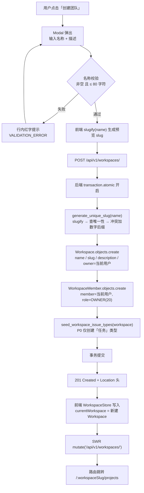
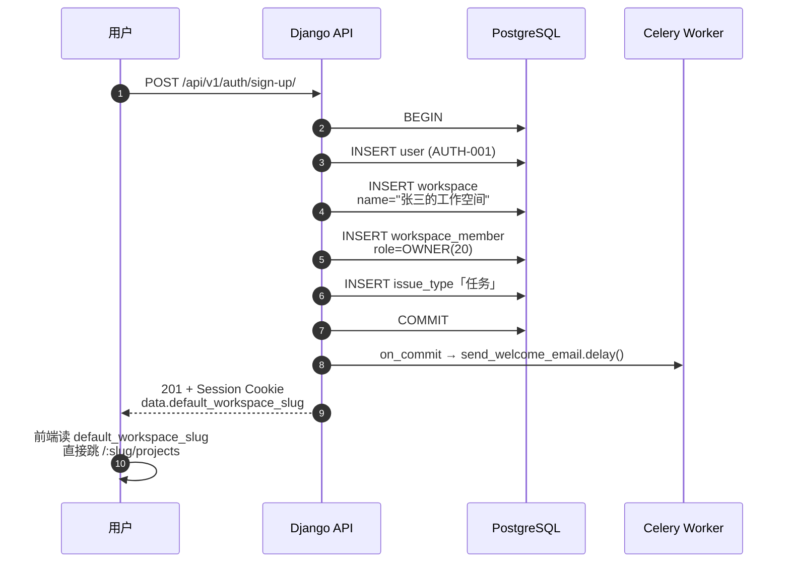
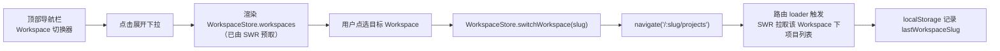
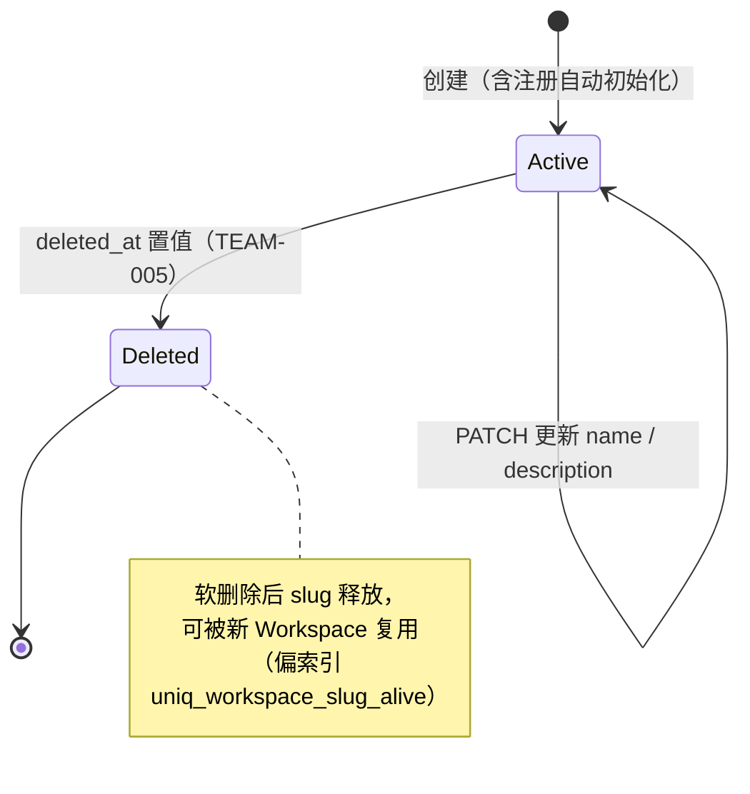

# 团队创建 / 查询 / 默认初始化

| 元信息项 | 内容 |
| --- | --- |
| 文档编号 | TEAM-001 |
| 所属迭代 | Sprint 0 — POC 技术验证（第 1-2 周） |
| 优先级 | P0（POC 阻塞级） |
| 所属模块 | M2-TEAM｜团队管理 |
| 文档状态 | 已确认（Approved） |
| 最后更新日期 | 2026-09-01 |
| 上游依赖 | `AUTH-001`（邮箱注册 / 登录 / 退出）、`AUTH-003`（最小权限隔离）、`INFRA-003`（Django ORM 初始数据模型） |
| 下游消费 | `PROJ-001`（项目 CRUD，`Project.workspace_id` 非空外键）、`TEAM-002`（团队基础信息查询与编辑，**同属 Sprint 0**）、`TEAM-003`（邀请 / 移除成员）、`TEAM-005`（团队归档与全局模板） |
| 上游依据 | `docs/需求文档.md` §3.2 团队管理、§8.3 POC 范围界定、§8.4 POC 验收标准 |
| 关联架构文档 | [`unified-issue-model.md`](../architecture/unified-issue-model.md) §2.3、[`rbac-permission-model.md`](../architecture/rbac-permission-model.md) §2.2 §3.2、[`api-conventions.md`](../architecture/api-conventions.md) §2.5 §4.1、[`tech-stack.md`](../architecture/tech-stack.md) §2 |
| 对标基线 | Plane Workspace 管理 · Ones 多团队管理 |
| 工作量估算 | 后端 1.5 人日 / 前端 1.5 人日 / 联调与测试 0.5 人日，合计 **3.5 人日** |

---

## 1. 概述

### 1.1 功能定位

本功能交付**工作空间（Workspace）管理**能力。Workspace 是系统**最顶层的组织单元**，也是全系统唯一的**多租户隔离边界**：所有 `Project`、`IssueType`、`Label`、`CustomFieldDefinition`、成员关系、文件资源，最终都归属唯一一个 Workspace。

P0 阶段本功能只交付三件事：

1. **创建** Workspace（含 slug 自动生成与冲突消解）；
2. **查询** Workspace（列表 + 详情，列表只返回「我是成员」的记录）；
3. **注册自动初始化**默认个人工作空间（用户注册成功后零操作即拥有可用工作空间）。

成员邀请、角色调整、所有权转让、团队归档、统计报表**均不在本文档范围**，分别由 `TEAM-003` / `TEAM-004` / `TEAM-005` / `TEAM-006` 承接。

### 1.2 术语对齐：「团队」= Workspace

> ⚠️ **这是本文档最重要的口径约定，全系统必须统一。**

需求文档中的产品用语「**团队**」，在技术层面对应 **Workspace** 概念（对标 Plane 的 Workspace）。二者是同一实体的两个视角：

| 视角 | 用语 | 出现位置 |
| --- | --- | --- |
| 产品 / UI / 需求文档 | 团队 | 界面文案、需求文档、用户手册 |
| 技术 / 数据模型 / API / 代码 | Workspace | Django Model、数据库表 `workspaces`、REST 路径 `/api/v1/workspaces/`、前端 `WorkspaceStore` |

选择 Workspace 而非 Team 作为技术命名的三点理由：

1. **对标一致性**：Plane 的顶层单元即 Workspace，路由为 `/:workspaceSlug/`，直接沿用可零成本复用其权限模型（`WorkspaceMember` + 整数角色等级）与路由结构。
2. **语义准确性**：本实体承载的是「租户 / 数据隔离边界」，而非「人的集合」。真正的「人的集合」是 `WorkspaceMember` 关系表。若命名为 Team，则 P3 引入「部门 / 小组」概念时必然发生二次命名冲突。
3. **规避与项目级角色混淆**：`Project` 下另有一套独立成员体系（`ProjectMember`），若顶层也叫 Team，"团队成员" 与 "项目成员" 在代码中难以区分。

**因此本文档正文一律使用 Workspace；仅在 UI 文案示例中使用「团队」。**

### 1.3 范围边界

| 能力 | P0（本文档） | 后续迭代 |
| --- | --- | --- |
| 创建 Workspace | ✅ 名称 + 描述 | `TEAM-002` 补 logo 上传 |
| slug 自动生成 + 唯一性消解 | ✅ | — |
| 列表查询（仅自己是 member） | ✅ | — |
| 详情查询 | ✅ | — |
| 更新名称 / 描述 | ✅（`WS_OWNER` / `WS_ADMIN`） | — |
| Workspace 切换器 | ✅ | — |
| 注册后自动创建个人工作空间 | ✅ | — |
| 删除 Workspace | ❌ | `TEAM-005` |
| 成员邀请 / 移除 / 退出 | ❌ | `TEAM-003` |
| 角色调整 / 所有权转让 / 层级保护 | ❌ | `TEAM-004` |
| 归档 / 全局标签与状态模板 | ❌ | `TEAM-005` |
| 团队统计 / 成员活跃度 | ❌ | `TEAM-006` |
| 多工作空间集团层级 / 模板下发 | ❌ | `TEAM-007` |

### 1.4 前置依赖

| 依赖文档 | 依赖内容 | 阻塞原因 |
| --- | --- | --- |
| `AUTH-001` | `User` 模型（含 `display_name`）、注册 / 登录 / Session 建立 | Workspace 必须有 `owner`；默认工作空间初始化挂在注册成功钩子上 |
| `AUTH-003` | `WorkspaceMember` 表已建、`IsAuthenticatedAndActive`（L0）与 `WorkspaceBasePermission`（L1）基类 | 列表查询的行级过滤与详情的成员校验直接复用 |
| `INFRA-003` | `BaseModel`（UUID 主键 + 软删除）、`Workspace` / `WorkspaceMember` 建表 migration | 无表无从谈起 |

### 1.5 竞品参考

| 竞品 | 参考点 | 本功能处置 |
| --- | --- | --- |
| Plane | Workspace 为顶层单元、`slug` 全局唯一并作为路由前缀、`WorkspaceMember` 双层 RBAC、注册后引导创建 Workspace | **完全对标**，仅将「引导创建」改为「自动创建」（见 §6.1） |
| Ones | 多团队并列、顶部团队切换器、团队内独立配置项 | 对标切换器交互；「团队级配置项」P0 不做，`TEAM-005` 承接 |

---

## 2. 业务逻辑

### 2.1 创建 Workspace 主流程



**关键说明**：

- 步骤 G ~ J 必须在**同一事务**内。若 `WorkspaceMember` 写入失败而 `Workspace` 已提交，将产生「无人可访问的孤儿 Workspace」——创建者自己都不是成员，列表查不到，只有 `SYSTEM_ADMIN` 能看见。
- 步骤 J 调用 `seed_workspace_issue_types`（[`unified-issue-model.md`](../architecture/unified-issue-model.md) §5.3）。P0 时 `settings.ENABLED_ISSUE_TYPE_PHASES = {"P0"}`，因此只创建「任务」一条 `IssueType`（`is_default=True`，图标 `circle-check`，颜色 `#3B82F6`）。这是 `PROJ-001` 创建项目时 `create_default_issue_types` 能取到默认类型的前提。
- 事务内**禁止**任何外部 HTTP 调用（欢迎邮件、Webhook）。所有副作用走 `transaction.on_commit()` 投递 Celery 任务，理由同 [`unified-issue-model.md`](../architecture/unified-issue-model.md) §3.5「长事务风险与规避」。

### 2.2 注册自动初始化默认工作空间

需求文档 §8.4 的验收标准要求「注册后 **1 分钟内**自动进入个人默认团队」。因此**不能**让新用户落到「请先创建团队」的空页面。



**命名规则**：`f"{user.display_name}的工作空间"`。

| 场景 | `display_name` | 生成的 Workspace 名称 | 生成的 slug |
| --- | --- | --- | --- |
| 常规 | `张三` | `张三的工作空间` | `zhang-san-workspace`（拼音兜底见 §2.5） |
| 英文名 | `Alice` | `Alice的工作空间` | `alice-workspace` |
| `display_name` 为空 | `null` | 回退用邮箱本地部分：`alice的工作空间` | `alice-workspace` |
| 同名用户第二次 | `张三` | `张三的工作空间` | `zhang-san-workspace-1` |

**幂等性**：初始化逻辑必须幂等。判定条件为 `WorkspaceMember.objects.filter(member=user).exists()`——已有任何工作空间归属则跳过。这一点保证注册接口被重试、或后续补数据脚本重跑时不会产出重复的「XX的工作空间」。

**实现位置选择**：**在注册视图的事务内直接调用**，不使用 `post_save` signal。

| 方案 | 采纳 | 理由 |
| --- | --- | --- |
| 注册视图事务内显式调用 | ✅ | 与注册在同一事务，原子性明确；调用链可读；测试中构造 `User` 不会产生副作用 |
| `post_save` signal on User | ❌ | `factory-boy` 造测试数据、`loaddata` 导入、`createsuperuser` 都会意外触发；事务边界隐式，排查成本高 |

### 2.3 Workspace 列表查询

**唯一规则：只返回当前用户是 `WorkspaceMember`（且 `is_active=True`）的 Workspace。**

这是第三层 DB 行级过滤（[`rbac-permission-model.md`](../architecture/rbac-permission-model.md) §6）的最简实例：

```
可见集合 = { w | ∃ WorkspaceMember(workspace=w, member=当前用户, is_active=True) } ∧ w.deleted_at IS NULL
```

不存在「公开 Workspace」概念，也不存在「知道 slug 就能看」的逻辑。非成员访问 `/api/v1/workspaces/{slug}/` 统一返回 **404 `RESOURCE_NOT_FOUND`**（而非 403），防止通过响应码差异枚举出系统内存在哪些 Workspace（[`api-conventions.md`](../architecture/api-conventions.md) §4.3）。

排序：`-created_at`（继承 `BaseModel.Meta.ordering`）。P0 不做「最近访问排序」与收藏置顶。

### 2.4 切换 Workspace



**设计要点**：

- **slug 是唯一状态载体**。当前 Workspace 由 URL 路径段 `/:workspaceSlug/` 决定，而非前端内存变量。刷新、复制链接分享、浏览器前进后退全部天然正确。这是对标 Plane 的关键设计。
- 切换**不发起** Workspace 相关请求（列表已在内存），只触发下游数据（项目列表）重新拉取。
- `localStorage.lastWorkspaceSlug` 仅用于「访问裸域名 `/` 时决定跳哪里」，不作为权威状态。若该 slug 已失效（成员被移除 / Workspace 被删），后端返回 404，前端回退到列表第一个 Workspace。

### 2.5 业务规则汇总

| 编号 | 规则 | 约束位置 |
| --- | --- | --- |
| BR-1 | `name` 必填，长度 1 ~ **80** 字符（首尾空格自动 trim 后计算） | Serializer 校验 |
| BR-2 | 数据库列宽为 `varchar(255)`，业务层限制 80。列宽预留冗余以便 P3 放宽限制时零 DDL | Model / Serializer |
| BR-3 | `slug` 由服务端从 `name` 自动生成，**不接受客户端传入** | `WorkspaceWriteSerializer` 将 `slug` 声明为 `read_only` |
| BR-4 | `slug` 必须 URL-safe：仅 `[a-z0-9-]`，长度 ≤ 48，不以 `-` 开头或结尾 | `generate_unique_slug()` |
| BR-5 | `slug` **全局唯一**（不是 Workspace 内唯一），通过带 `condition=Q(deleted_at__isnull=True)` 的偏索引 `uniq_workspace_slug_alive` 保证；软删除的 slug 可被复用 | DB 约束 |
| BR-6 | `slug` 冲突时追加数字后缀 `-1` / `-2` / …，最多重试 100 次，超限追加 6 位随机短码 | `generate_unique_slug()` |
| BR-7 | slug 保留词黑名单：`api` / `admin` / `space` / `static` / `login` / `sign-in` / `sign-up` / `god-mode` / `create-workspace` / `installation`，命中时视为冲突走后缀逻辑 | `RESERVED_SLUGS` 常量 |
| BR-8 | `description` 可空，纯文本，长度 ≤ 500 字符（P0 不用富文本） | Serializer |
| BR-9 | 创建者自动成为 `WS_OWNER`（role=20），且是 `Workspace.owner` 外键指向的用户 | 创建服务函数 |
| BR-10 | 一个用户可创建的 Workspace 数量 P0 **不限制**；`TEAM-007` 引入配额时通过 `QUOTA_*` 错误码返回 | — |
| BR-11 | 中文名称的 slug 化：`slugify()` 对纯中文会返回空串，因此先经 `pypinyin` 转拼音再 slugify；仍为空则回退 `workspace-{6位随机}` | `generate_unique_slug()` |
| BR-12 | `identifier` 概念不存在于 Workspace 层，只存在于 `Project`（见 `PROJ-001` §2.2） | — |

### 2.6 异常处理

| 异常场景 | 触发条件 | HTTP | 错误码 | 用户可见提示 |
| --- | --- | --- | --- | --- |
| 名称为空 | `name` 缺失或 trim 后为空串 | 400 | `VALIDATION_ERROR` + `details[0].code=REQUIRED` | 「团队名称不能为空」 |
| 名称超长 | trim 后 > 80 字符 | 400 | `VALIDATION_ERROR` + `TOO_LONG` | 「团队名称最多 80 个字符」 |
| 描述超长 | > 500 字符 | 400 | `VALIDATION_ERROR` + `TOO_LONG` | 「团队描述最多 500 个字符」 |
| slug 冲突 | `generate_unique_slug` 检测到重名 | — | — | **无提示**：服务端静默追加后缀，对用户透明 |
| slug 竞态冲突 | 两请求同时通过唯一性检查后 INSERT，DB 唯一约束报 `IntegrityError` | — | — | **无提示**：捕获 `IntegrityError` 后重试（最多 3 次，每次重新生成 slug）；3 次全失败才返回 409 `RESOURCE_ALREADY_EXISTS` |
| 未登录 | 无有效 Session | 401 | `AUTH_UNAUTHENTICATED` | 跳转登录页 |
| 非成员访问详情 | 目标 Workspace 存在但无 `WorkspaceMember` 记录 | 404 | `RESOURCE_NOT_FOUND` | 「团队不存在或你没有访问权限」 |
| 成员越权更新 | `WS_MEMBER` / `WS_GUEST` 调用 PATCH | 403 | `PERM_ROLE_INSUFFICIENT` | 「仅团队所有者与管理员可修改团队信息」 |
| slug 命中保留词 | `name="API"` → slug `api` | — | — | **无提示**：走后缀逻辑生成 `api-1` |

### 2.7 状态机

Workspace 在 P0 无状态字段（`status` 由 `TEAM-005` 引入归档能力时添加）。当前生命周期仅有软删除维度：



---

## 3. UI/UX 设计

### 3.1 技术选型

| 关注点 | 选型 | 版本 |
| --- | --- | --- |
| UI 基元 | Headless UI（`Dialog` / `Listbox` / `Transition`） | `2.2.x` |
| 样式 | Tailwind CSS | `4.1.x` |
| 图标 | lucide-react | 最新 minor |
| 表单 | react-hook-form + Zod resolver | `7.5x.x` / `3.25.x` |
| 动效 | `motion`（Framer Motion） | `12.x` |
| 数据获取 | SWR | `2.3.x` |
| 状态 | MobX + mobx-react-lite | `6.13.x` / `4.1.x` |

版本以 [`tech-stack.md`](../architecture/tech-stack.md) 为唯一权威来源，本文档不得出现与其冲突的版本号。

### 3.2 Workspace 切换器（顶部导航栏左侧）

```
┌──────────────────────────────────────────────────────────────────┐
│ ┌────────────────────┐                                    ⌘K  👤 │
│ │ 🅣 张三的工作空间 ▾ │                                          │
│ └────────────────────┘                                          │
└──────────────────────────────────────────────────────────────────┘
     │  点击展开
     ▼
┌──────────────────────────────┐
│ 我的团队                      │
│ ─────────────────────────────│
│ ✓ 🅣 张三的工作空间   所有者   │  ← 当前项：左侧 check + 浅色底
│   🅡 RabbitProjects  管理员   │
│   🅓 设计中心         成员     │
│ ─────────────────────────────│
│ ＋ 创建新团队                 │  ← 打开 §3.3 Modal
└──────────────────────────────┘
```

| 元素 | 规格 |
| --- | --- |
| 触发器 | 高 36px，左侧 20×20 圆角方形 Logo 占位（首字母 + 由 workspace.id 哈希取色），中间名称（`truncate`，最大 160px），右侧 `chevron-down` 12px |
| 下拉容器 | 宽 260px，`rounded-lg shadow-lg border border-neutral-200 bg-white`，`Transition` 进入 `opacity-0 scale-95` → `opacity-100 scale-100`，120ms |
| 列表项 | 高 40px，hover `bg-neutral-50`，右侧灰色小字显示当前用户在该 Workspace 的角色 label（由 `WorkspaceRole.choices` 的 label 渲染） |
| 当前项 | 左侧 `check` 图标（16px，主色），背景 `bg-primary-50` |
| 底部动作 | 分隔线上方，`＋ 创建新团队`，图标 `plus` |
| 键盘 | Headless UI `Listbox` 原生支持 `↑↓` 移动、`Enter` 选中、`Esc` 关闭；`Tab` 焦点可达 |
| 加载态 | `isLoading` 时触发器显示 20px 宽骨架块（`animate-pulse bg-neutral-200`） |

### 3.3 创建 Workspace 弹窗

Headless UI `Dialog`，宽 480px，居中，遮罩 `bg-black/30 backdrop-blur-sm`。

```
┌──────────────────────────────────────────────────┐
│  创建团队                                     ✕  │
│                                                  │
│  团队名称 *                                       │
│  ┌────────────────────────────────────────────┐  │
│  │ RabbitProjects                             │  │
│  └────────────────────────────────────────────┘  │
│  访问地址：rabbit.example.com/rabbitprojects      │  ← slug 实时预览
│                                                  │
│  团队描述                                         │
│  ┌────────────────────────────────────────────┐  │
│  │ 企业级项目管理系统研发团队                   │  │
│  │                                            │  │
│  └────────────────────────────────────────────┘  │
│                                        12 / 500  │
│                                                  │
│                      ┌────────┐  ┌────────────┐ │
│                      │  取消   │  │  创建团队   │ │
│                      └────────┘  └────────────┘ │
└──────────────────────────────────────────────────┘
```

**交互细节**：

| 行为 | 规格 |
| --- | --- |
| 打开时 | 名称输入框自动 focus（`Dialog` 的 `initialFocus`） |
| slug 预览 | 名称输入后 **300ms 防抖**，前端本地 `slugify()` 计算并展示。**明确标注为「预览」**——最终 slug 由服务端生成，冲突时会带数字后缀 |
| slug 可用性提示 | P0 **不调用** `GET /api/v1/workspaces/slug-check/`。理由：服务端已保证冲突自动消解，实时校验只增加请求量而不改变结果。该端点保留给 `TEAM-002` 的「自定义 slug」能力 |
| 名称校验 | `onBlur` + 提交前双重校验（Zod schema：`z.string().trim().min(1).max(80)`），错误以红字显示在输入框下方 |
| 描述计数 | 右下角 `已输入/500`，超限时数字变红且提交按钮禁用 |
| 提交中 | 按钮进入 loading（内嵌 `loader-2` 旋转图标 + 文案「创建中…」），Modal 不可关闭，遮罩点击无效 |
| 成功 | Modal 关闭 → toast「团队创建成功」→ 路由跳转 `/:newSlug/projects` |
| 失败 | Modal 保持打开，字段级错误按 `error.details[].field` 映射回表单项；非字段错误以 Modal 顶部 alert 条展示 `error.message` |
| 关闭方式 | ✕ 按钮 / `Esc` / 点击遮罩（仅在非提交中且表单未修改时；已修改则二次确认） |

### 3.4 侧边栏 Workspace 区块

左侧主侧边栏顶部为 Workspace 身份区，下方为该 Workspace 的导航项：

```
┌──────────────────────┐
│ 🅣 张三的工作空间  ▾  │  ← 与 §3.2 切换器共用组件
├──────────────────────┤
│ 🏠 首页               │
│ 📁 项目               │  ← P0 唯一实际可用入口
│ ✓  我的任务           │  ← P0 置灰（RPT-001 交付）
├──────────────────────┤
│ ⚙️  团队设置           │  ← P0 置灰（TEAM-002 交付）
└──────────────────────┘
```

P0 未交付的入口**保留占位并置灰**（`text-neutral-400 cursor-not-allowed`，hover 显示 tooltip「即将上线」），而非直接隐藏。这样做的目的是让 POC 演示时产品形态完整可感知。

### 3.5 空状态处理

| 场景 | 是否存在空状态 | 处置 |
| --- | --- | --- |
| 新用户首次登录 | **不存在** | 注册时已自动创建默认 Workspace（§2.2），用户永远至少拥有 1 个 |
| 用户被移除出所有 Workspace | 存在（`TEAM-003` 后才可能） | 展示全屏引导页「你还没有加入任何团队」+「创建团队」主按钮。P0 因无移除能力而不可达，但组件先实现以避免 `workspaces[0]` 越界崩溃 |
| Workspace 内无项目 | 存在 | 由 `PROJ-001` §3.4 定义 |

### 3.6 响应式与无障碍

| 断点 | 布局 |
| --- | --- |
| ≥ 1024px（`lg`） | 侧边栏常驻展开（240px），切换器在侧边栏顶部 |
| 768 ~ 1023px（`md`） | 侧边栏收起为 56px 图标栏，切换器仅显示 Logo，hover 出浮层 |
| < 768px | 侧边栏抽屉式，由顶部 `menu` 图标唤起；Modal 宽度改为 `calc(100vw - 32px)` |

无障碍要求：切换器触发器带 `aria-haspopup="listbox"` 与 `aria-expanded`；Modal 带 `aria-labelledby` 指向标题、`aria-describedby` 指向 slug 预览行；所有交互元素焦点环 `focus-visible:ring-2 ring-primary-500`；颜色对比度 ≥ 4.5:1。

---

## 4. 技术架构

### 4.1 数据模型

数据模型完整定义见 [`unified-issue-model.md`](../architecture/unified-issue-model.md) §2.3 与 [`rbac-permission-model.md`](../architecture/rbac-permission-model.md) §3.2。本节仅摘录本功能直接使用的部分，**不重复定义、不引入差异**。

#### 4.1.1 Workspace

```python
# apps/api/plane/db/models/workspace.py
class Workspace(BaseModel):
    """工作空间 —— 系统最顶层组织单元，多租户隔离边界"""

    name = models.CharField(max_length=255, verbose_name="工作空间名称")
    slug = models.SlugField(
        max_length=48, unique=True, db_index=True, verbose_name="URL 标识",
        help_text="全局唯一，用于 /:workspaceSlug/ 路由，小写字母数字与短横线",
    )
    description = models.TextField(blank=True, verbose_name="描述")
    logo = models.URLField(max_length=800, blank=True, null=True, verbose_name="Logo 地址")
    owner = models.ForeignKey(
        "db.User", on_delete=models.CASCADE,
        related_name="owner_workspaces", verbose_name="所有者",
    )

    class Meta(BaseModel.Meta):
        db_table = "workspaces"
        verbose_name = "工作空间"
        ordering = ("-created_at",)
        constraints = [
            models.UniqueConstraint(
                fields=["slug"],
                condition=models.Q(deleted_at__isnull=True),
                name="uniq_workspace_slug_alive",
            )
        ]
```

| 字段 | 类型 | 约束 / 索引 | P0 使用 | 说明 |
| --- | --- | --- | --- | --- |
| `id` | UUID | PK | ✅ | 继承 `BaseModel`，`uuid4` |
| `name` | varchar(255) | NOT NULL | ✅ | 业务层限 80 字符（BR-1/BR-2） |
| `slug` | varchar(48) | UNIQUE + 偏索引 | ✅ | 路由标识，服务端生成 |
| `description` | text | 可空 | ✅ | 纯文本，业务层限 500 字符 |
| `logo` | varchar(800) | 可空 | ❌ | `TEAM-002` 交付上传后启用；P0 前端用首字母占位 |
| `owner` | UUID FK → User | 索引，CASCADE | ✅ | 创建者；`TEAM-004` 交付转让能力 |
| `created_at` / `updated_at` / `deleted_at` | timestamptz | `created_at` 与 `deleted_at` 带索引 | ✅ | 继承 `BaseModel` |

#### 4.1.2 WorkspaceMember

```python
class WorkspaceMember(BaseModel):
    """工作空间成员：用户在某工作空间内的角色归属"""

    workspace = models.ForeignKey("db.Workspace", on_delete=models.CASCADE,
                                 related_name="workspace_member")
    member = models.ForeignKey("db.User", on_delete=models.CASCADE,
                               related_name="member_workspace")
    role = models.IntegerField(choices=WorkspaceRole.choices,
                               default=WorkspaceRole.MEMBER)
    is_active = models.BooleanField(default=True)
    company_role = models.TextField(null=True, blank=True)
    # P3 企业版扩展位：department / custom_role（见 rbac-permission-model.md §3.2）

    class Meta:
        unique_together = ("workspace", "member")
        indexes = [
            models.Index(fields=["member", "workspace", "role"]),  # 权限判定主索引
            models.Index(fields=["workspace", "role"]),            # 成员列表按角色筛选
        ]
```

角色等级（[`rbac-permission-model.md`](../architecture/rbac-permission-model.md) §2.2）：

| 角色 | 代码标识 | `role` 整数值 | P0 是否产生 |
| --- | --- | --- | --- |
| 所有者 | `WS_OWNER` | **20** | ✅ 创建者与注册初始化 |
| 管理员 | `WS_ADMIN` | 15 | ❌ 无邀请能力，P0 不产生 |
| 成员 | `WS_MEMBER` | 10 | ❌ 同上（Model default 值） |
| 访客 | `WS_GUEST` | 5 | ❌ 同上 |

> P0 阶段每个 Workspace 恰好有 1 条 `WorkspaceMember` 记录（role=20）。但**权限判定代码必须写成通用的 `role >= X` 比较**，不得硬编码「创建者即所有者」的捷径，否则 `TEAM-003` 引入多成员后需重写鉴权层。

#### 4.1.3 slug 生成算法

```python
# apps/api/plane/db/services/workspace.py
import re
import secrets

from django.utils.text import slugify
from pypinyin import lazy_pinyin

from plane.db.models import Workspace

SLUG_MAX_LENGTH = 48
MAX_SUFFIX_ATTEMPTS = 100
RESERVED_SLUGS = frozenset({
    "api", "admin", "space", "static", "media", "login", "logout",
    "sign-in", "sign-up", "god-mode", "installation", "create-workspace",
    "invitations", "onboarding", "profile", "settings",
})


def slugify_name(name: str) -> str:
    """名称 → URL-safe 基础 slug（支持中文转拼音）"""
    base = slugify(name)                          # 纯中文时返回空串
    if not base:
        base = slugify("-".join(lazy_pinyin(name)))
    base = re.sub(r"-{2,}", "-", base).strip("-")[:SLUG_MAX_LENGTH - 8]  # 预留后缀空间
    return base or f"workspace-{secrets.token_hex(3)}"


def generate_unique_slug(name: str) -> str:
    """生成全局唯一 slug

    1. slugify（中文走拼音兜底）
    2. 命中保留词 或 已存在（含软删除以外的记录）→ 追加 -1 / -2 / ...
    3. 100 次仍冲突 → 追加 6 位随机短码（概率上必然成功）
    """
    base = slugify_name(name)
    candidate = base
    attempt = 0
    while candidate in RESERVED_SLUGS or Workspace.objects.filter(slug=candidate).exists():
        attempt += 1
        if attempt > MAX_SUFFIX_ATTEMPTS:
            return f"{base}-{secrets.token_hex(3)}"[:SLUG_MAX_LENGTH]
        candidate = f"{base}-{attempt}"[:SLUG_MAX_LENGTH]
    return candidate
```

**为什么用 `Workspace.objects`（软删除管理器）而不是 `all_objects`**：软删除的 Workspace 其 slug 应当被释放复用，这与 DB 层偏索引 `uniq_workspace_slug_alive`（`condition=Q(deleted_at__isnull=True)`）的语义完全一致。若用 `all_objects` 检查，则应用层比 DB 约束更严格，会出现「DB 允许但应用拒绝」的不一致。

**竞态处理**：`generate_unique_slug` 的「查—再写」不是原子的。两个并发请求可能拿到同一 candidate。因此创建服务必须捕获 `IntegrityError` 重试：

```python
MAX_CREATE_RETRIES = 3


def create_workspace(*, owner, name: str, description: str = "") -> Workspace:
    for attempt in range(MAX_CREATE_RETRIES):
        try:
            with transaction.atomic():
                return _do_create_workspace(owner=owner, name=name, description=description)
        except IntegrityError:
            if attempt == MAX_CREATE_RETRIES - 1:
                raise ResourceAlreadyExistsError("团队标识生成失败，请重试")
            continue
```

注意 `transaction.atomic()` 必须在**循环体内**。若写在循环外，第一次 `IntegrityError` 已使事务进入 aborted 状态，后续任何查询都会抛 `TransactionManagementError`。

### 4.2 API 定义

全部遵循 [`api-conventions.md`](../architecture/api-conventions.md)：`/api/v1/` 前缀、**强制尾斜杠**、`snake_case` 字段、统一响应信封 `{status, data, meta}`、Session + CSRF 认证。

| # | 方法 | 路径 | 描述 | 权限 | 成功码 |
| --- | --- | --- | --- | --- | --- |
| 1 | `POST` | `/api/v1/workspaces/` | 创建 Workspace | 已认证用户 | `201` |
| 2 | `GET` | `/api/v1/workspaces/` | 列表（仅自己是 member 的） | 已认证用户 | `200` |
| 3 | `GET` | `/api/v1/workspaces/{slug}/` | 详情 | Workspace 成员（任意角色） | `200` |
| 4 | `PATCH` | `/api/v1/workspaces/{slug}/` | 更新 name / description | `WS_OWNER`(20) / `WS_ADMIN`(15) | `200` |

`DELETE /api/v1/workspaces/{slug}/` 已在 `api-conventions.md` §2.5 端点清单中登记，但**由 `TEAM-005` 实现**，P0 路由不注册（访问返回 405 `METHOD_NOT_ALLOWED`）。

#### 4.2.1 `POST /api/v1/workspaces/` — 创建

**请求**

```http
POST /api/v1/workspaces/ HTTP/1.1
Content-Type: application/json
Cookie: sessionid=...; csrftoken=...
X-CSRFToken: ...
```

```json
{
  "name": "RabbitProjects",
  "description": "企业级项目管理系统研发团队"
}
```

**成功响应 `201 Created`**

```http
HTTP/1.1 201 Created
Location: /api/v1/workspaces/rabbitprojects/
X-Request-Id: 01JBX3K9Q7ZR4M8N2P5V6W7X8Y
```

```json
{
  "status": "success",
  "data": {
    "id": "3f2c8a1e-9b4d-4c7a-8e11-5d6f7a8b9c0d",
    "name": "RabbitProjects",
    "slug": "rabbitprojects",
    "description": "企业级项目管理系统研发团队",
    "logo": null,
    "owner_id": "6c7d1a2b-3e4f-4a5b-9c8d-7e6f5a4b3c2d",
    "current_user_role": 20,
    "total_members": 1,
    "total_projects": 0,
    "created_at": "2026-09-01T02:14:07.331Z",
    "updated_at": "2026-09-01T02:14:07.331Z",
    "created_by": "6c7d1a2b-3e4f-4a5b-9c8d-7e6f5a4b3c2d",
    "updated_by": "6c7d1a2b-3e4f-4a5b-9c8d-7e6f5a4b3c2d"
  }
}
```

**字段说明**

| 字段 | 类型 | 说明 |
| --- | --- | --- |
| `current_user_role` | int | 当前请求用户在该 Workspace 的角色整数值。前端 `usePermission` 直接消费此值做 `>=` 比较 |
| `total_members` | int | 成员数（`COUNT` 聚合，P0 恒为 1） |
| `total_projects` | int | 项目数（`COUNT` 聚合，供 `PROJ-001` 列表页卡片展示） |
| `owner_id` | UUID | 关联字段默认返回 ID 形式（`api-conventions.md` §4.5） |

**失败响应 `400`（名称为空）**

```json
{
  "status": "error",
  "error": {
    "code": "VALIDATION_ERROR",
    "message": "请求参数校验失败",
    "details": [
      { "field": "name", "code": "REQUIRED", "message": "团队名称不能为空" }
    ],
    "request_id": "01JBX3K9Q7ZR4M8N2P5V6W7X8Y"
  }
}
```

**失败响应 `400`（名称超长）**

```json
{
  "status": "error",
  "error": {
    "code": "VALIDATION_ERROR",
    "message": "请求参数校验失败",
    "details": [
      { "field": "name", "code": "TOO_LONG", "message": "团队名称最多 80 个字符" }
    ],
    "request_id": "01JBX3K9Q7ZR4M8N2P5V6W7X8Z"
  }
}
```

#### 4.2.2 `GET /api/v1/workspaces/` — 列表

**请求**

```http
GET /api/v1/workspaces/?fields=id,name,slug,logo,current_user_role,total_projects HTTP/1.1
```

支持 `?fields=`（字段裁剪）与 `?search=`（按 `name` 模糊）。P0 不支持 `?expand=`（无需展开的关联）。

**成功响应 `200`**

```json
{
  "status": "success",
  "data": [
    {
      "id": "3f2c8a1e-9b4d-4c7a-8e11-5d6f7a8b9c0d",
      "name": "RabbitProjects",
      "slug": "rabbitprojects",
      "logo": null,
      "current_user_role": 20,
      "total_projects": 3
    },
    {
      "id": "a1b2c3d4-5e6f-4a7b-8c9d-0e1f2a3b4c5d",
      "name": "张三的工作空间",
      "slug": "zhang-san-workspace",
      "logo": null,
      "current_user_role": 20,
      "total_projects": 0
    }
  ],
  "meta": {
    "next_cursor": "100:1:0",
    "prev_cursor": "100:0:1",
    "next_page_results": false,
    "prev_page_results": false,
    "count": 2,
    "total_count": 2,
    "total_pages": 1,
    "page": 1,
    "per_page": 100
  }
}
```

> Workspace 列表天然是小集合（单用户通常 < 10 个），但**仍走统一游标分页信封**（`api-conventions.md` §6），保持全站响应结构一致，前端分页组件可无差别复用。

#### 4.2.3 `GET /api/v1/workspaces/{slug}/` — 详情

**成功响应 `200`**

```json
{
  "status": "success",
  "data": {
    "id": "3f2c8a1e-9b4d-4c7a-8e11-5d6f7a8b9c0d",
    "name": "RabbitProjects",
    "slug": "rabbitprojects",
    "description": "企业级项目管理系统研发团队",
    "logo": null,
    "owner_id": "6c7d1a2b-3e4f-4a5b-9c8d-7e6f5a4b3c2d",
    "current_user_role": 20,
    "total_members": 1,
    "total_projects": 3,
    "created_at": "2026-09-01T02:14:07.331Z",
    "updated_at": "2026-09-01T02:14:07.331Z"
  }
}
```

**失败响应 `404`（非成员 / 不存在 / 已软删除，三种情况响应完全一致）**

```json
{
  "status": "error",
  "error": {
    "code": "RESOURCE_NOT_FOUND",
    "message": "团队不存在或你没有访问权限",
    "request_id": "01JBX3K9Q7ZR4M8N2P5V6W7Y1A"
  }
}
```

> **三种情况响应一致是刻意设计**。若「存在但无权」返回 403 而「不存在」返回 404，攻击者可通过遍历 slug 探测系统内存在哪些团队。判定规则收口在 `WorkspaceBasePermission` 与 `Workspace.objects.accessible_by(user)`，不由各 ViewSet 自行决定（`rbac-permission-model.md` §1.1 / §6.1）。

#### 4.2.4 `PATCH /api/v1/workspaces/{slug}/` — 更新

**请求**

```json
{
  "name": "RabbitProjects 研发中心",
  "description": "负责核心产品研发"
}
```

**成功响应 `200`**：返回与 §4.2.3 同结构的完整详情对象（`updated_at` 已刷新）。

**关键约束**：

| 约束 | 说明 |
| --- | --- |
| 仅支持 `PATCH`，不支持 `PUT` | `api-conventions.md` §3.2。`BaseAPIView.update()` 抛 `MethodNotAllowedError` |
| `slug` 为 `read_only` | 改名**不改 slug**。已有路由链接、外部书签、Git commit 引用不会失效。自定义 slug 由 `TEAM-002` 通过独立端点提供 |
| `owner_id` 为 `read_only` | 所有权转让由 `TEAM-004` 通过 `.../transfer-ownership/` 动作子资源提供 |
| `logo` 为 `read_only`（P0） | `TEAM-002` 交付预签名上传后开放 |

**失败响应 `403`（`WS_MEMBER` 尝试更新）**

```json
{
  "status": "error",
  "error": {
    "code": "PERM_ROLE_INSUFFICIENT",
    "message": "仅团队所有者与管理员可修改团队信息",
    "request_id": "01JBX3K9Q7ZR4M8N2P5V6W7Y1B"
  }
}
```

### 4.3 后端实现

#### 4.3.1 创建服务（含注册自动初始化）

```python
# apps/api/plane/db/services/workspace.py
from django.db import IntegrityError, transaction

from plane.db.models import Workspace, WorkspaceMember, WorkspaceRole
from plane.db.seeds.issue_types import seed_workspace_issue_types


@transaction.atomic
def _do_create_workspace(*, owner, name: str, description: str = "") -> Workspace:
    """创建 Workspace 的原子单元

    三步必须同事务，缺一即产生脏数据：
    1. Workspace       —— 缺 2 则成为无人可访问的孤儿
    2. WorkspaceMember —— 创建者即 OWNER(20)
    3. IssueType 种子  —— PROJ-001 创建项目时依赖默认类型存在
    """
    workspace = Workspace.objects.create(
        name=name.strip(),
        slug=generate_unique_slug(name),
        description=description.strip(),
        owner=owner,
        created_by=owner,
        updated_by=owner,
    )
    WorkspaceMember.objects.create(
        workspace=workspace,
        member=owner,
        role=WorkspaceRole.OWNER,      # 20
        is_active=True,
        created_by=owner,
        updated_by=owner,
    )
    seed_workspace_issue_types(workspace)   # P0 仅创建「任务」类型
    return workspace


def create_default_workspace(user) -> Workspace | None:
    """注册成功后初始化个人默认工作空间（幂等）

    在 AUTH-001 注册视图的事务内直接调用，不使用 post_save signal
    （理由见 TEAM-001 §2.2「实现位置选择」）。
    """
    if WorkspaceMember.objects.filter(member=user, is_active=True).exists():
        return None                                   # 幂等：已有归属则跳过

    display_name = (user.display_name or user.email.split("@")[0]).strip()
    return create_workspace(
        owner=user,
        name=f"{display_name}的工作空间",
        description="注册时自动创建的个人工作空间",
    )
```

在 `AUTH-001` 的注册视图中：

```python
# apps/api/plane/app/views/auth.py
@transaction.atomic
def perform_sign_up(self, serializer) -> dict:
    user = serializer.save()
    workspace = create_default_workspace(user)
    transaction.on_commit(lambda: send_welcome_email.delay(str(user.id)))
    return {
        "user": UserSerializer(user).data,
        "default_workspace_slug": workspace.slug if workspace else None,
    }
```

前端注册成功后读取 `data.default_workspace_slug` 直接跳转 `/:slug/projects`，无需额外一次 `GET /api/v1/workspaces/` 往返——这是达成「注册后 1 分钟内进入个人默认团队」验收标准的关键优化。

#### 4.3.2 ViewSet 与行级过滤

```python
# apps/api/plane/app/views/workspace.py
class WorkspaceViewSet(BaseAPIView):
    """Workspace CRUD

    继承 BaseAPIView 获得：FieldSelectionMixin(?fields=) + ExpandMixin(?expand=)
    + 统一分页 + 统一异常包装（api-conventions.md §10.1）。
    """

    serializer_class = WorkspaceSerializer
    write_serializer_class = WorkspaceWriteSerializer
    lookup_field = "slug"
    permission_classes = [IsAuthenticatedAndActive, WorkspacePermission]
    search_fields = ("name",)
    ordering_whitelist = ("created_at", "name")

    def get_queryset(self):
        # 第三层 DB 行级过滤：只可见自己是 active member 的 Workspace
        return (
            Workspace.objects.accessible_by(self.request.user)
            .annotate(
                current_user_role=Subquery(
                    WorkspaceMember.objects.filter(
                        workspace=OuterRef("pk"), member=self.request.user, is_active=True
                    ).values("role")[:1]
                ),
                total_members=Count("workspace_member", filter=Q(workspace_member__is_active=True),
                                    distinct=True),
                total_projects=Count("projects", filter=Q(projects__deleted_at__isnull=True),
                                     distinct=True),
            )
            .select_related("owner")
        )

    def perform_create(self, serializer):
        workspace = create_workspace(
            owner=self.request.user,
            name=serializer.validated_data["name"],
            description=serializer.validated_data.get("description", ""),
        )
        serializer.instance = workspace
```

```python
# apps/api/plane/db/models/workspace.py
class WorkspaceManager(SoftDeleteManager):
    def accessible_by(self, user):
        """第三层行级过滤入口（rbac-permission-model.md §6.2）"""
        if is_system_admin(user):
            return self.all()
        return self.filter(
            workspace_member__member=user,
            workspace_member__is_active=True,
        ).distinct()
```

命中索引 `WorkspaceMember(member, workspace, role)` 的首列 `member`，单用户 Workspace 数量级为个位数，查询成本恒定。

```python
# apps/api/plane/app/permissions/workspace.py
class WorkspacePermission(WorkspaceBasePermission):
    """L1 层：Workspace 级动作鉴权"""

    def has_permission(self, request, view):
        if view.action in ("create", "list"):
            return True                          # 任何已认证用户可建、可列（列表由 DB 层过滤）
        return super().has_permission(request, view)

    def has_object_permission(self, request, view, obj):
        role = self.get_workspace_role(request.user, obj)
        if role is None:
            raise ResourceNotFoundError("团队不存在或你没有访问权限")   # 404 而非 403
        if request.method in SAFE_METHODS:
            return True                          # 任意角色可读
        if role < WorkspaceRole.ADMIN:            # PATCH 需 >= 15
            raise RoleInsufficientError("仅团队所有者与管理员可修改团队信息")
        return True
```

#### 4.3.3 Serializer 三件套

遵循 [`api-conventions.md`](../architecture/api-conventions.md) §10.2，**禁止 `fields="__all__"`**：

```python
# apps/api/plane/app/serializers/workspace.py
class WorkspaceLiteSerializer(BaseSerializer):
    """嵌套引用用：仅 4 字段，供 PROJ-001 等下游 expand 时使用"""

    class Meta:
        model = Workspace
        fields = ("id", "name", "slug", "logo")
        read_only_fields = fields


class WorkspaceSerializer(BaseSerializer):
    """读：完整详情"""

    current_user_role = serializers.IntegerField(read_only=True)
    total_members = serializers.IntegerField(read_only=True)
    total_projects = serializers.IntegerField(read_only=True)
    owner_id = serializers.UUIDField(read_only=True)

    class Meta:
        model = Workspace
        fields = (
            "id", "name", "slug", "description", "logo", "owner_id",
            "current_user_role", "total_members", "total_projects",
            "created_at", "updated_at", "created_by", "updated_by",
        )
        read_only_fields = fields


class WorkspaceWriteSerializer(BaseSerializer):
    """写：仅 name / description 可写"""

    name = serializers.CharField(max_length=80, trim_whitespace=True,
                                 error_messages={"blank": "团队名称不能为空",
                                                 "max_length": "团队名称最多 80 个字符"})
    description = serializers.CharField(max_length=500, allow_blank=True, required=False,
                                        error_messages={"max_length": "团队描述最多 500 个字符"})

    class Meta:
        model = Workspace
        fields = ("name", "description")
        # slug / logo / owner 刻意不在 fields 内 —— 见 §4.2.4 关键约束
```

### 4.4 前端实现

#### 4.4.1 状态职责边界

严格遵循 [`tech-stack.md`](../architecture/tech-stack.md) §2.1「SWR 与 MobX 职责边界」：

| 关注点 | 归属 | 本功能落地 |
| --- | --- | --- |
| GET 请求、缓存、revalidate | **SWR** | `useSWR('/api/v1/workspaces/')` |
| 实体规范化存储、派生计算 | **MobX** | `WorkspaceStore.workspaceMap` |
| 乐观更新发起 | **MobX** | `createWorkspace()` 先写 Store，再 `mutate()` 兜底 |
| UI 局部状态（Modal 开关、输入值） | **useState** | `CreateWorkspaceModal` 内部 |
| 权限判定数据 | **MobX**（`UserPermissionStore`） | `current_user_role` 同步进权限 Store |

#### 4.4.2 WorkspaceStore

```typescript
// apps/web/core/store/workspace/index.ts
import { action, computed, makeObservable, observable, runInAction } from "mobx";
import type { IWorkspace } from "@plane/types";
import { WorkspaceService } from "@/services/workspace.service";

export class WorkspaceStore {
  // ---------- observables ----------
  workspaceMap: Record<string, IWorkspace> = {};   // key = slug
  currentWorkspaceSlug: string | null = null;
  isLoading = false;
  error: string | null = null;

  private service = new WorkspaceService();

  constructor(private rootStore: RootStore) {
    makeObservable(this, {
      workspaceMap: observable,
      currentWorkspaceSlug: observable.ref,
      isLoading: observable.ref,
      error: observable.ref,
      workspaces: computed,
      currentWorkspace: computed,
      fetchWorkspaces: action,
      createWorkspace: action,
      updateWorkspace: action,
      switchWorkspace: action,
    });
  }

  // ---------- computed ----------
  /** 按 created_at 倒序，与后端 ordering 一致 */
  get workspaces(): IWorkspace[] {
    return Object.values(this.workspaceMap).sort(
      (a, b) => new Date(b.created_at).getTime() - new Date(a.created_at).getTime()
    );
  }

  get currentWorkspace(): IWorkspace | null {
    if (!this.currentWorkspaceSlug) return null;
    return this.workspaceMap[this.currentWorkspaceSlug] ?? null;
  }

  // ---------- actions ----------
  fetchWorkspaces = async (): Promise<IWorkspace[]> => {
    this.isLoading = true;
    this.error = null;
    try {
      const list = await this.service.list();
      runInAction(() => {
        this.workspaceMap = Object.fromEntries(list.map((w) => [w.slug, w]));
      });
      return list;
    } catch (e) {
      runInAction(() => { this.error = resolveErrorMessage(e); });
      throw e;
    } finally {
      runInAction(() => { this.isLoading = false; });
    }
  };

  createWorkspace = async (payload: { name: string; description?: string }) => {
    const created = await this.service.create(payload);
    runInAction(() => {
      this.workspaceMap[created.slug] = created;
      this.currentWorkspaceSlug = created.slug;
      // 角色快照同步进权限 Store，避免新建后按钮权限短暂错误
      this.rootStore.userPermission.setWorkspaceRole(created.slug, created.current_user_role);
    });
    return created;
  };

  updateWorkspace = async (slug: string, patch: Partial<Pick<IWorkspace, "name" | "description">>) => {
    const snapshot = this.workspaceMap[slug];
    runInAction(() => {                                   // 乐观更新
      this.workspaceMap[slug] = { ...snapshot, ...patch };
    });
    try {
      const updated = await this.service.update(slug, patch);
      runInAction(() => { this.workspaceMap[slug] = updated; });
      return updated;
    } catch (e) {
      runInAction(() => { this.workspaceMap[slug] = snapshot; });   // 回滚
      throw e;
    }
  };

  switchWorkspace = (slug: string) => {
    this.currentWorkspaceSlug = slug;
    localStorage.setItem("lastWorkspaceSlug", slug);       // 仅用于裸域名落地决策
  };
}
```

#### 4.4.3 SWR 集成

```typescript
// apps/web/core/hooks/use-workspaces.ts
export const WORKSPACES_KEY = "/api/v1/workspaces/";

export const useWorkspaces = () => {
  const { workspace: workspaceStore } = useStore();

  const { isLoading, error, mutate } = useSWR(
    WORKSPACES_KEY,
    () => workspaceStore.fetchWorkspaces(),
    { revalidateOnFocus: false, revalidateIfStale: false }
  );

  return { workspaces: workspaceStore.workspaces, isLoading, error, mutate };
};
```

| 配置 | 值 | 理由 |
| --- | --- | --- |
| `revalidateOnFocus` | `false` | Workspace 列表变化频率极低，窗口切回不必重拉 |
| `revalidateIfStale` | `false` | 由 `createWorkspace` / `updateWorkspace` 后显式 `mutate()` 驱动 |
| SWR key | `'/api/v1/workspaces/'` | 与真实端点路径一致，便于调试与 devtools 定位 |

#### 4.4.4 路由结构

```
apps/web/app/
├── routes.ts
├── routes/
│   ├── _auth.sign-in.tsx                    # AUTH-001
│   ├── _auth.sign-up.tsx                    # AUTH-001
│   ├── index.tsx                            # 裸域名：读 lastWorkspaceSlug 或 workspaces[0] 重定向
│   └── $workspaceSlug/
│       ├── _layout.tsx                      # 侧边栏 + 顶部切换器；loader 校验 slug 有效性
│       ├── index.tsx                         # 重定向到 ./projects
│       └── projects/…                        # PROJ-001
```

`$workspaceSlug/_layout.tsx` 的 loader 职责：

1. 确保 `WorkspaceStore.workspaces` 已加载（首次进入并发拉取）；
2. 校验路径中的 slug 存在于可见集合，否则渲染 404 边界页（`ErrorBoundary`）；
3. 调用 `switchWorkspace(slug)` 同步 `currentWorkspaceSlug`；
4. 预取 `GET /api/v1/users/me/permissions/?workspace_slug={slug}` 权限快照。

React Router v7 Framework Mode（SPA 模式，`ssr: false`），版本锁 `7.x`（[`tech-stack.md`](../architecture/tech-stack.md) §6.1 已说明为何不用 8.x）。

#### 4.4.5 组件清单

| 组件 | 路径 | 职责 |
| --- | --- | --- |
| `WorkspaceSwitcher` | `core/components/workspace/switcher.tsx` | §3.2 下拉切换器，Headless UI `Listbox` |
| `WorkspaceLogo` | `core/components/workspace/logo.tsx` | logo 有则显示图片，无则首字母 + `id` 哈希取色 |
| `CreateWorkspaceModal` | `core/components/workspace/create-modal.tsx` | §3.3 弹窗，`Dialog` + react-hook-form + Zod |
| `WorkspaceSidebar` | `core/components/workspace/sidebar.tsx` | §3.4 侧边栏，含置灰占位项 |
| `NoWorkspaceState` | `core/components/workspace/empty-state.tsx` | §3.5 全屏引导（P0 不可达但须存在） |
| `slugify` | `packages/utils/src/slug.ts` | 前端 slug 预览，与后端 `slugify_name` 行为对齐（含拼音） |

---

## 5. 测试用例

### 5.1 后端单元 / 集成测试（pytest + pytest-django + factory-boy）

| # | 用例 | 前置 | 操作 | 预期 |
| --- | --- | --- | --- | --- |
| BE-01 | 创建成功，OWNER 关系正确 | 已登录用户 U | `POST /api/v1/workspaces/` `{"name":"RabbitProjects"}` | `201`；`Location` 头为 `/api/v1/workspaces/rabbitprojects/`；DB 存在 `WorkspaceMember(member=U, role=20, is_active=True)`；响应 `current_user_role=20` |
| BE-02 | slug 自动生成（英文） | — | `name="RabbitProjects"` | `slug == "rabbitprojects"` |
| BE-03 | slug 自动生成（中文转拼音） | — | `name="张三的工作空间"` | `slug` 匹配 `^[a-z0-9-]+$` 且非空 |
| BE-04 | slug 冲突加后缀 | 已存在 slug `rabbitprojects` | 再次 `name="RabbitProjects"` | 新 `slug == "rabbitprojects-1"`；两条记录均存在 |
| BE-05 | slug 连续冲突 | 已存在 `-1` ~ `-3` | 第 5 次创建同名 | `slug == "rabbitprojects-4"` |
| BE-06 | slug 命中保留词 | — | `name="API"` | `slug != "api"`，为 `api-1` 或带随机码 |
| BE-07 | 名称为空 | — | `{"name":"   "}` | `400`；`error.code=VALIDATION_ERROR`；`details[0].field="name"`，`code="REQUIRED"` |
| BE-08 | 名称超长 | — | `name` 81 字符 | `400`；`details[0].code="TOO_LONG"` |
| BE-09 | 名称恰好 80 字符 | — | `name` 80 字符 | `201`（边界值通过） |
| BE-10 | 描述超长 | — | `description` 501 字符 | `400`；`details[0].field="description"` |
| BE-11 | 名称首尾空格被 trim | — | `name="  Rabbit  "` | DB 存储 `"Rabbit"` |
| BE-12 | 未登录创建 | 无 Session | `POST` | `401`；`error.code=AUTH_UNAUTHENTICATED` |
| BE-13 | 创建时自动 seed IssueType | — | 创建后查 `IssueType` | 存在 1 条 `name="任务"`, `icon="circle-check"`, `color="#3B82F6"`, `is_default=True`, `is_system=True` |
| BE-14 | 事务原子性 | mock `WorkspaceMember.objects.create` 抛异常 | `POST` | `500`；DB 中**无** `Workspace` 记录（已回滚），无孤儿数据 |
| BE-15 | 列表只返回自己是成员的 | U1 有 WS-A；U2 有 WS-B | U1 `GET /api/v1/workspaces/` | `data` 长度 1，仅含 WS-A；`meta.total_count == 1` |
| BE-16 | 列表包含 `total_projects` 聚合 | WS-A 下 3 个项目（1 个已软删） | `GET` 列表 | `total_projects == 2`（软删不计） |
| BE-17 | 列表排除软删除 Workspace | WS-A `deleted_at` 置值 | `GET` 列表 | 不含 WS-A |
| BE-18 | 列表响应含完整分页 meta | — | `GET` 列表 | `meta` 含 `next_cursor` / `prev_cursor` / `count` / `total_count` / `total_pages` / `page` / `per_page` 全部键 |
| BE-19 | `?fields=` 裁剪生效 | — | `GET ?fields=id,name` | `data[0]` 仅含 `id` 与 `name` 两键 |
| BE-20 | 成员可读详情 | U 是 WS-A 的 MEMBER(10) | `GET /workspaces/{slug}/` | `200`；`current_user_role == 10` |
| BE-21 | 非成员读详情返回 404 | U2 非 WS-A 成员 | `GET /workspaces/{ws-a-slug}/` | `404`；`error.code=RESOURCE_NOT_FOUND` |
| BE-22 | 不存在的 slug 返回 404 | — | `GET /workspaces/not-exist/` | `404`；响应体与 BE-21 **完全一致**（防枚举） |
| BE-23 | OWNER 可更新 | U 是 OWNER(20) | `PATCH {"name":"新名称"}` | `200`；`name` 已改；`updated_at` 刷新 |
| BE-24 | ADMIN 可更新 | 手工造 `role=15` | `PATCH` | `200` |
| BE-25 | MEMBER 不可更新 | `role=10` | `PATCH` | `403`；`error.code=PERM_ROLE_INSUFFICIENT` |
| BE-26 | GUEST 不可更新 | `role=5` | `PATCH` | `403` |
| BE-27 | 改名不改 slug | 原 slug `rabbitprojects` | `PATCH {"name":"完全不同的名字"}` | `slug` 仍为 `rabbitprojects` |
| BE-28 | slug 传入被忽略 | — | `PATCH {"slug":"hacked"}` | `200`；`slug` 未变（`read_only`） |
| BE-29 | `owner_id` 传入被忽略 | — | `PATCH {"owner_id": "<其他用户>"}` | `200`；`owner` 未变 |
| BE-30 | PUT 被拒绝 | — | `PUT /workspaces/{slug}/` | `405`；`error.code=METHOD_NOT_ALLOWED` |
| BE-31 | DELETE 未实现 | — | `DELETE /workspaces/{slug}/` | `405`（P0 不注册该动作） |
| BE-32 | 尾斜杠强制 | — | `GET /api/v1/workspaces`（无尾斜杠） | `301` 重定向到带尾斜杠版本 |
| BE-33 | 注册自动初始化 | — | `POST /api/v1/auth/sign-up/` | `201`；`data.default_workspace_slug` 非空；DB 存在 `Workspace(name="XX的工作空间")` 与 `WorkspaceMember(role=20)` |
| BE-34 | 注册初始化幂等 | 用户已有 WS | 再次调 `create_default_workspace(user)` | 返回 `None`；DB Workspace 数量不变 |
| BE-35 | `display_name` 为空时回退邮箱 | 注册未填 `display_name`，邮箱 `alice@x.com` | 注册 | Workspace 名为 `alice的工作空间` |
| BE-36 | 两个同名用户注册 | 已存在 `zhang-san-workspace` | 第二个「张三」注册 | 第二个 slug 为 `zhang-san-workspace-1`，两者均可用 |
| BE-37 | 并发创建同名 slug 竞态 | — | 10 线程并发 `POST` 同一 `name` | 全部 `201`；10 个 slug 互不相同；无 `IntegrityError` 泄漏为 500 |
| BE-38 | 软删除后 slug 可复用 | WS-A(`slug=abc`) 软删除 | 新建 `name="abc"` | `201`；新 `slug == "abc"`（偏索引允许） |
| BE-39 | `X-Request-Id` 响应头 | — | 任意请求 | 响应头含 `X-Request-Id`，值为 ULID 格式 |
| BE-40 | 错误响应含 `request_id` | — | 触发 400 | `error.request_id` 与 `X-Request-Id` 同值 |

### 5.2 前端单元测试（Vitest + @testing-library/react）

| # | 用例 | 预期 |
| --- | --- | --- |
| FE-01 | `slugify('RabbitProjects')` | `'rabbitprojects'` |
| FE-02 | `slugify('张三的工作空间')` | 非空，匹配 `^[a-z0-9-]+$` |
| FE-03 | `slugify('  A  B  ')` | `'a-b'`（多空格折叠为单短横线） |
| FE-04 | `slugify('---abc---')` | `'abc'`（首尾短横线剥离） |
| FE-05 | `WorkspaceStore.workspaces` 排序 | 按 `created_at` 倒序 |
| FE-06 | `createWorkspace` 后 `currentWorkspace` | 指向新建的 Workspace |
| FE-07 | `updateWorkspace` 失败回滚 | mock 接口 500，Store 中 `name` 恢复为原值 |
| FE-08 | `switchWorkspace` 写 localStorage | `localStorage.lastWorkspaceSlug === slug` |
| FE-09 | Modal 名称为空时提交按钮禁用 | `button[disabled]` 为 true |
| FE-10 | Modal 输入名称后 slug 预览出现 | 300ms 防抖后文本含预览 slug |
| FE-11 | Modal 描述超 500 字符 | 计数器变红且提交禁用 |
| FE-12 | Modal `Esc` 关闭 | `onClose` 被调用 |
| FE-13 | 提交中 Modal 不可关闭 | 点击遮罩 `onClose` 未被调用 |
| FE-14 | 后端 400 错误映射到表单字段 | `details[0].field="name"` → 名称输入框下显示对应 `message` |
| FE-15 | 切换器渲染角色 label | `role=20` 显示「所有者」 |
| FE-16 | 切换器当前项高亮 | 当前 slug 项含 check 图标与 `bg-primary-50` |
| FE-17 | `isLoading` 时切换器显示骨架 | 存在 `animate-pulse` 元素 |
| FE-18 | `WorkspaceLogo` 无 logo 时降级 | 渲染名称首字母 |

### 5.3 E2E 测试（Playwright）

| # | 场景 | 步骤 | 预期 |
| --- | --- | --- | --- |
| E2E-01 | 注册即得默认团队 | 打开 `/sign-up` → 填邮箱密码昵称「张三」→ 提交 | 自动登录并落到 `/zhang-san-workspace/projects`；切换器显示「张三的工作空间」 |
| E2E-02 | 创建第二个团队 | 点切换器 → 「创建新团队」→ 输入「RabbitProjects」→ 创建 | Modal 关闭；URL 变为 `/rabbitprojects/projects`；切换器显示新名称；toast 出现 |
| E2E-03 | 切换团队 | 在 WS-B 中点切换器 → 选 WS-A | URL 变为 `/{ws-a-slug}/projects`；页面内容为 WS-A 的项目列表 |
| E2E-04 | 刷新后当前团队保持 | 在 WS-B 页面按 F5 | 仍在 `/{ws-b-slug}/projects`（slug 由 URL 承载） |
| E2E-05 | 直接访问他人团队 URL | 用户 U2 访问 U1 的 `/{ws-a-slug}/projects` | 显示 404 页「团队不存在或你没有访问权限」，无数据泄漏 |
| E2E-06 | 修改团队名称 | 团队设置 → 改名 → 保存 | 切换器名称即时更新；URL 中 slug **未变** |
| E2E-07 | 表单校验 | 打开 Modal 直接点「创建团队」 | 名称输入框下出现红字「团队名称不能为空」；未发起请求 |

### 5.4 覆盖率门禁

| 范围 | 门禁 |
| --- | --- |
| `plane/db/services/workspace.py` | 行覆盖 **100%**（含 slug 冲突分支、竞态重试分支、幂等分支） |
| `plane/app/views/workspace.py` | 行覆盖 ≥ 90% |
| `plane/app/permissions/workspace.py` | 行覆盖 **100%**（权限代码零容忍） |
| `core/store/workspace/index.ts` | 行覆盖 ≥ 85% |

---

## 6. 竞品对标

### 6.1 Plane Workspace 管理

| 维度 | Plane 开源版 | 本系统 P0 | 一致 / 差异 | 理由 |
| --- | --- | --- | --- | --- |
| 顶层单元命名 | Workspace | Workspace | ✅ 一致 | 直接沿用，便于对照源码 |
| 路由形态 | `/:workspaceSlug/…` | `/:workspaceSlug/…` | ✅ 一致 | slug 作唯一状态载体，刷新与分享天然正确 |
| slug 唯一性 | 全局唯一 | 全局唯一（+ 软删除偏索引） | ⬆️ 增强 | Plane 用普通 `unique=True`；我们用 `condition=Q(deleted_at__isnull=True)` 偏索引，使软删团队的 slug 可释放复用 |
| slug 来源 | 用户在创建表单中手填，实时调 slug-check 校验 | **服务端从 name 自动生成 + 冲突自动加后缀** | ⚠️ 差异 | POC 追求「30 秒建团队」，少填一个字段、少一类校验失败。自定义 slug 由 `TEAM-002` 提供 |
| 中文名处理 | `slugify` 后为空则报错要求用户改 | 拼音兜底 + 随机码兜底 | ⬆️ 增强 | Plane 面向英文社区；本系统主场景为中文团队名，不能让「张三的工作空间」创建失败 |
| 成员模型 | `WorkspaceMember(role int)` | 完全相同 | ✅ 一致 | 20/15/10/5 四档整数等级也完全相同 |
| 角色等级整数化 | Owner=20 / Admin=15 / Member=10 / Guest=5 | 相同 | ✅ 一致 | `role__gte=15` 一次索引扫描完成等级比较 |
| 首次登录流程 | Onboarding 向导：填个人信息 → **手动创建 Workspace** → 邀请成员 → 完成 | **注册即自动创建个人工作空间**，无向导 | ⚠️ 差异 | 需求文档 §8.4 要求「注册 1 分钟内自动进入个人默认团队」。向导虽体验完整但增加 3 步操作与 3 个页面，P0 不做，`TEAM-002` 视需要补 |
| Owner/Admin 绕过项目成员检查 | 支持 | 支持（`rbac-permission-model.md` §7.4） | ✅ 一致 | P0 虽只有单成员，但判定逻辑已按通用规则实现 |
| Workspace 级 Issue 聚合查询 | 有（`/workspaces/{slug}/issues/`） | 端点已登记，P0 不实现 | ⏭️ 延后 | `TASK-015` 跨项目搜索承接 |
| Workspace logo | MinIO 预签名上传 | P0 首字母占位 | ⏭️ 延后 | `TEAM-002`；`logo` 列已建，零 DDL |
| 删除 Workspace | 支持（二次确认输入 slug） | P0 不支持 | ⏭️ 延后 | `TEAM-005` |

**从 Plane 完全复用的三处实现**：

1. **slug 作为路由主键**（`lookup_field = "slug"`）而非 UUID。URL 可读、可口述、可写进文档；UUID 只在 API 内部与 FK 中使用。
2. **`WorkspaceMember` 整数角色等级 + 权限判定主索引 `(member, workspace, role)`**。这使「当前用户在此 Workspace 的角色」查询恒定为一次索引命中。
3. **`current_user_role` 随详情/列表响应下发**，前端无需为每个 Workspace 单独查权限。

### 6.2 Ones 多团队管理

| 维度 | Ones | 本系统 P0 | 处置 |
| --- | --- | --- | --- |
| 顶层单元 | 团队（Team），支持一个账号加入多个团队 | Workspace，同样支持多归属 | ✅ 能力对等 |
| 团队切换 | 顶部下拉切换器，列出全部已加入团队 | 同（§3.2） | ✅ 对标交互 |
| 团队独立配置 | 每团队独立的成员、权限组、工作项类型、工作流、通知策略 | Workspace 级 `IssueType` 已隔离；权限组 / 工作流 P3 | ⏭️ 部分延后 |
| 团队级组织架构 | 支持部门树、成员归属部门 | `WorkspaceMember.department` 列已预留（nullable FK） | ⏭️ `AUTH-008` |
| 集团 / 多团队汇总 | 企业版支持跨团队报表 | `TEAM-007` | ⏭️ 延后 |
| 团队容量配额 | 按套餐限制成员数 | P0 无限制；`QUOTA_*` 错误码族已在 `api-conventions.md` §8.7 预留 | ⏭️ 延后 |

**吸收的一点**：Ones 的切换器在每个团队项右侧显示当前用户角色，用户能一眼看出「我在这个团队是管理员还是普通成员」。本系统 §3.2 采纳此设计（Plane 的切换器不显示角色）。

**不吸收的部分**：Ones 的「团队申请加入 / 审批」流程。P0 与 P1 的团队规模场景下，直接邀请（`TEAM-003`）足够；申请审批引入待办、通知、审批状态机三套依赖，成本远大于收益。

### 6.3 三方能力矩阵

| 能力 | Plane | Ones | 本系统 P0 | 本系统终态 |
| --- | --- | --- | --- | --- |
| 多顶层单元并列 | ✅ | ✅ | ✅ | ✅ |
| slug URL 标识 | ✅ | ❌（数字 ID） | ✅ | ✅ |
| 注册自动建默认团队 | ❌（向导手动） | ❌ | ✅ | ✅ |
| 中文名自动 slug | ❌ | — | ✅ | ✅ |
| 自定义 slug | ✅ | ❌ | ❌ | ✅ `TEAM-002` |
| 团队 logo | ✅ | ✅ | ❌ | ✅ `TEAM-002` |
| 成员邀请 | ✅ | ✅ | ❌ | ✅ `TEAM-003` |
| 所有权转让 | ✅ | ✅ | ❌ | ✅ `TEAM-004` |
| 团队归档 | ❌ | ✅ | ❌ | ✅ `TEAM-005` |
| 部门 / 组织架构 | ❌ | ✅ | ❌ | ✅ `AUTH-008` |
| 集团多团队汇总 | ❌ | ✅ | ❌ | ✅ `TEAM-007` |

---

## 7. 验收标准

### 7.1 功能验收（逐条可复现）

| # | 验收项 | 验证方式 | 通过判据 |
| --- | --- | --- | --- |
| AC-01 | 新用户注册后**无需任何操作**即拥有可用工作空间 | 浏览器完成一次注册 | 注册提交后直接落到 `/{slug}/projects`，侧边栏切换器显示「XX的工作空间」；全程 **≤ 1 分钟**（需求文档 §8.4 第 1 条） |
| AC-02 | 可创建新 Workspace | UI 操作 | 从点击「创建新团队」到进入新团队首页 ≤ 30 秒；`201` 且 `Location` 头正确 |
| AC-03 | slug 自动生成且 URL-safe | 用中文名「设计中心」创建 | 生成的 slug 匹配 `^[a-z0-9-]{1,48}$`，浏览器地址栏无转义字符 |
| AC-04 | slug 冲突自动消解 | 连续用同一名称创建 3 个 | 三者 slug 分别为 `x` / `x-1` / `x-2`，全部可正常访问 |
| AC-05 | 列表只显示自己是成员的 Workspace | 造两个用户各建团队，互查 | 各自列表长度为 1，看不到对方团队 |
| AC-06 | 非成员访问返回 404 而非 403 | 用户 B 直接访问 A 的团队 URL | HTTP `404`，`error.code=RESOURCE_NOT_FOUND`，响应体与「slug 不存在」情况完全一致 |
| AC-07 | 切换 Workspace 正确加载对应数据 | 建两个团队，各建 1 个项目，来回切换 | 每次切换后项目列表内容正确对应，无串数据 |
| AC-08 | 刷新后当前 Workspace 保持 | 在团队 B 页面 F5 | 仍在团队 B（slug 由 URL 承载） |
| AC-09 | 名称校验生效 | 提交空名称 / 81 字符名称 | 均返回 `400 VALIDATION_ERROR`，前端在对应输入框下显示中文提示 |
| AC-10 | 仅 OWNER/ADMIN 可更新 | 手工造 `role=10` 成员调 PATCH | `403 PERM_ROLE_INSUFFICIENT`；且该成员在 UI 中看不到「团队设置」入口（三重权限的 UI 层与 API 层同时生效） |
| AC-11 | 事务原子性 | 注入 `WorkspaceMember` 创建失败 | DB 中不存在对应 `Workspace` 记录，无孤儿数据 |
| AC-12 | 创建 Workspace 时 seed 默认 IssueType | 创建后查库 | 存在 1 条 `IssueType(name="任务", is_default=True, is_system=True)`，为 `PROJ-001` 的 `create_default_issue_types` 提供数据基础 |
| AC-13 | 响应格式全站一致 | 抓包检查全部 4 个端点 | 成功响应均为 `{status:"success", data, meta?}`；错误响应均为 `{status:"error", error:{code,message,request_id,…}}`；无一例外 |
| AC-14 | 并发创建无脏数据 | 10 线程并发创建同名团队 | 全部成功，10 个 slug 互不相同，无 500 错误 |

### 7.2 非功能验收

| 项 | 指标 | 验证方式 |
| --- | --- | --- |
| `GET /api/v1/workspaces/` P95 延迟 | ≤ 120ms（单用户 ≤ 10 个 Workspace） | 本地压测 100 次取 P95 |
| `POST /api/v1/workspaces/` P95 延迟 | ≤ 300ms（含 slug 唯一性查询 + 3 次 INSERT + seed） | 同上 |
| 切换器首屏渲染 | ≤ 200ms（数据已缓存时立即渲染，无闪烁） | Performance 面板 |
| Modal 打开动效 | 120ms，无布局抖动（CLS = 0） | Lighthouse |
| SQL 查询数（列表接口） | ≤ 3 条（1 主查询含 annotate 子查询 + 1 count + 1 session） | `django-debug-toolbar` / `assertNumQueries` |
| 无 N+1 查询 | 列表接口查询数与 Workspace 数量**无关** | `assertNumQueries` 在 1 个与 10 个 Workspace 下结果相同 |

### 7.3 代码质量门禁

| 门禁 | 要求 |
| --- | --- |
| `ruff check` | 零 error |
| `mypy` | `services/workspace.py`、`views/workspace.py`、`permissions/workspace.py` 全量类型注解，零 error |
| `oxlint` | 零 error |
| `tsc --noEmit` | 零 error；`WorkspaceStore` 无 `any` |
| pytest 覆盖率 | 见 §5.4 |
| Code Review 必查项 | ① 无 `fields="__all__"`；② 权限类与 UI `PermissionGate` 成对存在（`rbac-permission-model.md` §5.5）；③ 创建事务内无外部 HTTP 调用；④ `transaction.atomic()` 位于重试循环体内 |

### 7.4 交付物清单

| 类型 | 交付物 |
| --- | --- |
| 后端 | `db/models/workspace.py`（Workspace + WorkspaceMember + WorkspaceManager）、`db/services/workspace.py`、`db/seeds/issue_types.py`、`app/views/workspace.py`、`app/serializers/workspace.py`、`app/permissions/workspace.py`、`app/urls/workspace.py`、migration 文件 |
| 前端 | `core/store/workspace/index.ts`、`core/services/workspace.service.ts`、`core/hooks/use-workspaces.ts`、`core/components/workspace/*`、`app/routes/$workspaceSlug/_layout.tsx`、`packages/utils/src/slug.ts`、`packages/types/src/workspace.d.ts` |
| 测试 | `tests/api/test_workspace_crud.py`、`tests/api/test_workspace_permission.py`、`tests/api/test_default_workspace.py`、`core/store/workspace/index.test.ts`、`e2e/workspace.spec.ts` |
| 文档 | 本文档；OpenAPI schema 自动生成后 4 个端点均有 `summary` / `description` / 示例（`api-conventions.md` §10.6） |

### 7.5 Definition of Done

- [ ] §7.1 全部 14 条功能验收项通过，且由**非开发者**（产品视角）走查一遍
- [ ] §7.2 全部非功能指标达标
- [ ] §7.3 全部质量门禁通过，CI 绿灯
- [ ] §5 中 40 条后端 + 18 条前端 + 7 条 E2E 用例全部通过
- [ ] `docker compose up` 后可从零完成「注册 → 自动进入默认团队 → 创建第二个团队 → 切换 → 刷新保持」完整链路
- [ ] `PROJ-001` 的开发者确认：`GET /api/v1/workspaces/{slug}/` 返回的 `id` 与 `current_user_role` 足以支撑其项目列表页与权限渲染，无需追加字段

