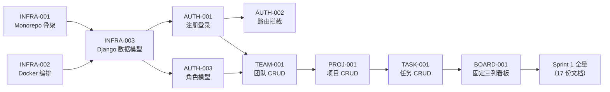
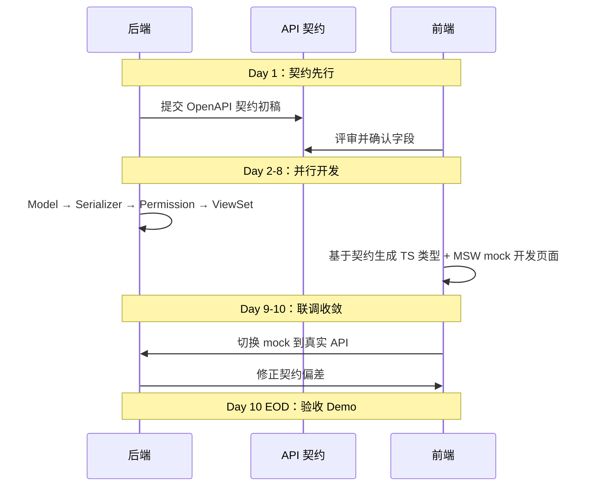

# Sprint 0 — POC 技术验证 · 迭代概览

| 元信息项 | 内容 |
| --- | --- |
| 迭代编号 | Sprint 0 |
| 迭代名称 | POC 技术验证（Proof of Concept） |
| 周期 | 第 1-2 周（10 个工作日） |
| 覆盖优先级 | **P0 全量**（P1 及以上一律不进入本迭代） |
| 文档数 | 10 份（3 份 INFRA + 3 份 AUTH + 4 份业务模块） |
| 文档状态 | 已确认（Approved） |
| 最后更新日期 | 2026-09-01 |
| 上游依据 | `docs/需求文档.md` §8.3（POC 范围界定）、§8.4（POC 验收标准）、§9.2（并行节奏） |
| 前置迭代 | 无（本迭代是全系统起点，仅依赖 7 份架构文档） |
| 阻塞下游 | Sprint 1 全量（17 份文档）→ 进而阻塞 Sprint 2-9 全部迭代 |

---

## 1. 迭代目标

**用 2 周时间跑通最小核心闭环，验证全栈技术架构可行性，清零技术风险。**

本迭代交付的是一条**端到端可演示的浏览器操作路径**：

```
注册登录 → 自动进入个人默认团队 → 创建项目 → 创建任务 → 拖拽看板卡片 → 刷新后状态与顺序一致
```

三条判定本迭代成功的核心标准：

| 维度 | 目标 | 判定方式 |
| --- | --- | --- |
| 技术可行性 | React Router v7 + Django/DRF + Celery + PostgreSQL + Valkey + RabbitMQ + MinIO + Nginx 全链路跑通 | `docker compose up` 后全部容器 healthy，浏览器可完成上述闭环 |
| 架构正确性 | 统一工作项模型、三重权限模型、统一 API 规范三份架构决策在代码中真实落地，而非仅停留在文档 | `issues` 表一次性建齐 P0-P4 全部列；`Manager.accessible_by()` 已收口；响应信封统一 |
| 交付节奏 | 5 分钟内可对外完整演示，无阻塞级 Bug | 按 §6 的 6 条验收标准逐条现场跑通 |

**本迭代不追求的东西**：UI 精美度、性能指标、测试覆盖率、代码可扩展性的极致打磨。使用自研 UI 组件库默认样式，可用即可（需求文档 §8.3 第 8 条原文要求）。

---

## 2. 交付范围（8 项，来自需求文档 §8.3）

| # | 交付项 | 具体内容 | 对应文档 |
| --- | --- | --- | --- |
| 1 | **技术底座** | pnpm + Turborepo Monorepo 骨架（仓库结构对齐 Plane）；React Router v7 + TS + Django + DRF + Celery + PostgreSQL 15.7 + Valkey 7.2 + RabbitMQ 3.13 + MinIO + Tailwind CSS 4 + MobX + SWR 全链路跑通 | `INFRA-001` |
| 2 | **Docker Compose 一键启动** | 一键启动 web/admin/space/api/worker/beat/live/db/redis/mq/minio/proxy 全套本地环境；Django migrations 自动迁移 | `INFRA-002` |
| 3 | **数据模型基线** | POC 阶段全部 Django Model + migrations；`Issue` 表一次性建齐 `issue_type` / `custom_fields` JSONB / GIN 索引等后续迭代扩展位 | `INFRA-003` |
| 4 | **邮箱注册登录** | 邮箱注册、登录、退出；Session 会话保持；密码 Argon2 加密存储 | `AUTH-001` |
| 5 | **最小权限隔离** | 未登录路由拦截（前端 loader + 后端 403/404）；用户仅可见自己创建/参与的团队、项目、任务；接口层拦截越权访问 | `AUTH-002` `AUTH-003` |
| 6 | **默认团队初始化** | 新用户注册后自动初始化个人默认团队（`Workspace` + `WorkspaceMember(OWNER)`）；支持手动新建团队、切换团队 | `TEAM-001` |
| 7 | **项目 CRUD** | 团队下新建 / 编辑 / 查看项目；项目列表页；项目归属当前团队；创建项目时自动种子**四态**状态集（待办 / 进行中 / 已完成 / 已取消，其中「已取消」建而不作为 P0 看板列，详见下方注） | `PROJ-001` |
| 8 | **任务 CRUD + 固定三列看板** | 项目下创建 / 编辑 / 删除任务，支持核心 5 字段（标题、描述、状态、负责人、截止时间）；固定三列看板（待办 / 进行中 / 已完成）；跨列拖拽自动改状态；同列拖拽自定义排序；刷新后一致 | `TASK-001` `BOARD-001` |

### 2.1 P0 能力分层约定（关键设计原则）

本迭代遵循 `unified-issue-model.md` §6 的核心原则：

> **P0 一次性把所有列建齐，后续迭代只做「功能开关 + 种子数据 + 索引」，不做建表与改列。**

具体表现为：

| 数据库层面 | P0 是否建列 | P0 是否使用 | 启用迭代 |
| --- | --- | --- | --- |
| `Issue.issue_type` FK | ✅ 建列（可空） | ❌ 不暴露给前端 | P1 |
| `Issue.custom_fields` JSONB + GIN 索引 | ✅ 建列建索引 | ❌ 不写入 | P2（`TASK-008`） |
| `Issue.sequence_id` + advisory lock | ✅ 建列 | ✅ 使用 | P0 |
| `Issue.sort_order` FloatField | ✅ 建列 | ✅ 使用（同列拖拽） | P0 |
| `Issue.parent` self FK | ✅ 建列 | ❌ 不使用 | P1（一级子任务） |
| `State.issue_type` FK | ✅ 建列（可空） | ❌ 不使用 | P3（按类型状态集） |
| `State`「已取消」（`group=cancelled`） | ✅ 建行（建项目时种子 4 条状态） | ⚠️ 仅作为合法 `state_id` 取值，**不渲染为看板列** | P1（开放为第四列） |
| `WorkspaceMember.department` / `custom_role` FK | ❌ **不建列**（以注释形式预留） | ❌ 不使用 | P3 |
| 描述四格式列（json/html/binary/stripped） | ✅ 全建 | ✅ 使用 html + stripped | P0 / binary 在 P3 协同编辑启用 |

开关由 `apps/api/plane/settings/features.py` 集中控制（`ENABLE_CUSTOM_FIELDS = False` 等），详见 `INFRA-003` §4。

> **「一次性建齐」的准确边界（两处例外与一处架构文档待回改项）**
>
> 上表第 7 行的 `department` / `custom_role` 是**建列原则的例外**：这两个列是 FK，分别指向 P3 才引入的 `Department` / `CustomRole` 表。**目标表不存在时 Django 无法生成 migration**（`ForeignKey` 需要对端表已注册），因此 P0 只能以注释形式预留，同理适用于 `Issue.cycle_id` / `module_id`。
>
> 因此「一次性把所有列建齐」的准确语义是：**不依赖未来新表的列，P0 全部建齐**。这不削弱原则的价值——后补一个可空 FK 列在 PostgreSQL 11+ 下是常数时间操作（`ADD COLUMN NULL` 不重写表），真正需要避免的是带 `DEFAULT` 非空值或需回填数据的列。
>
> [`rbac-permission-model.md`](../architecture/rbac-permission-model.md) §3.2 在 `WorkspaceMember` 上直接写出了这两个 FK，§9 第 4 条又表述为「P0 建表时预留」。直接照抄两侧会导致 `makemigrations` 失败。**以本表与 [`INFRA-003`](./INFRA-003-django-models-init.md) §2.4 / §4.4 为准**，并已登记为架构文档待回改项。

---

## 3. 范围排除（刻意砍掉，来自需求文档 §8.3）

以下功能在 POC 阶段**坚决不做**，任何"顺手加一下"的提议都视为范围蔓延，直接拒绝。目的是避免延期。

### 3.1 全部企业版功能（P3+）

- 自定义工作流（`WF-001~006`）、审批流、自动化规则引擎
- SSO 单点登录、LDAP / SCIM 账号同步
- 全量操作审计日志、多租户隔离、风控告警
- 部门层级组织架构、自定义角色组、字段级权限

### 3.2 全部 P2 级重功能

- **甘特图**（`GANTT-*`）：任务条渲染、依赖连线、关键路径
- **文件库**（`FILE-002~004`）：项目级文件目录、分片续传、在线预览、多版本
- **Wiki / 知识库**（`FILE-005`）
- **WebSocket 实时同步**（`COLLAB-004`）：`apps/live` 服务在 `INFRA-002` 中**编排就位但不承载业务功能**，仅验证容器可启动与 Nginx upgrade 路由可通
- **消息通知 / 评论 / @提醒**（`COLLAB-001~003`）
- 第三方集成（GitHub / Slack / Webhook）、数据报表、AI 能力
- 高级自定义字段、工时估算与填报、多层级子任务、任务依赖关系

### 3.3 任务与视图层面的排除

| 排除项 | 说明 | 启用迭代 |
| --- | --- | --- |
| 多执行人 | POC 单执行人，但 `assignees` 已建为 M2M（含 `IssueAssignee` 中间表），仅前端限制单选 | P2（`TASK-007`） |
| 复杂组合筛选 | 看板不提供任何筛选器 | P1 / P2 |
| 视图自定义与保存 | 看板列固定三列，不可增删改 | P2 / P3 |
| 分享导出 | 无 | P2+ |
| 移动端适配 | 仅保证桌面 Chrome 可用 | P2+ |
| 任务归档 | `archived_at` 列已建，功能不做 | P2（`TASK-010`） |
| 操作日志展示 | `IssueActivity` 表已建且写入，但**不提供查询接口与 UI** | P2（`TASK-010`） |
| 任务复制 / 批量操作 | 无 | P2 |

### 3.4 账号与边缘功能的排除

| 排除项 | POC 替代方案 |
| --- | --- |
| 邮件验证 | 注册即激活，不发验证邮件（SMTP 不配置） |
| 忘记密码 / 密码重置 | 端点不实现（`api-conventions.md` 中已定义契约，留待 `AUTH-004`） |
| 头像上传 | 统一使用默认头像；`User.avatar_url` 列已建但不提供上传入口 |
| 个人资料编辑 | 不提供 |
| 团队成员邀请 / 移除 / 角色分配 | 不提供；团队仅有创建者一人（`TEAM-002` 在 Sprint 1） |
| 项目成员管理 | 不提供；`ProjectMember` 在创建项目时自动写入创建者一条 `ADMIN` 记录 |
| API Key / Open API / 公开空间业务功能 | `apps/space` 仅保证容器启动与路由可通，无业务页面 |

### 3.5 已排除但必须预留的三件事（不可省略）

尽管功能不做，以下三项在 P0 必须落地，否则后续迭代要付出改表代价：

1. **`custom_fields` JSONB 列 + `idx_issue_custom_fields` GIN 索引**必须在 P0 建出（`dynamic-fields-design.md`）。
2. **`IssueState` 独立表 + 外键**（本系统命名为 `State`）而非枚举字段，为 P3 自定义工作流预留（`dependency-graph.md` §6）。
3. **Celery worker + beat 容器**必须在 `INFRA-002` 编排就位，即使 P0 无任何异步任务（`dependency-graph.md` §6 明确要求）。

---

## 4. 前置依赖

本迭代不依赖任何其他迭代，仅依赖 7 份架构文档。**架构文档未评审通过前不得开工**。

| 架构文档 | 本迭代对它的依赖点 | 主要消费文档 |
| --- | --- | --- |
| [`architecture/tech-stack.md`](../architecture/tech-stack.md) | 全部技术选型与**版本锁定**（Node 22.14 / pnpm 11 / Python 3.12 / PostgreSQL 15.7 / Valkey 7.2 / RabbitMQ 3.13 / Nginx 1.27）；Nginx 替代 Caddy 的决策；RabbitMQ 作为唯一 Celery broker 的决策；Yjs 跨包同版本红线 | `INFRA-001` `INFRA-002` |
| [`architecture/monorepo-structure.md`](../architecture/monorepo-structure.md) | 完整目录树；`pnpm-workspace.yaml`（含 `!apps/api` / `!apps/proxy` 排除）；`turbo.json` 管道；根 `package.json` 脚本；环境变量层级；包间依赖方向硬规则 | `INFRA-001` `INFRA-002` |
| [`architecture/api-conventions.md`](../architecture/api-conventions.md) | 三套 API 分组前缀；强制尾斜杠；统一响应信封 `{status, data, meta}`；只用 PATCH 不用 PUT；游标分页；错误码体系 | `AUTH-*` `TEAM-001` `PROJ-001` `TASK-001` `BOARD-001` |
| [`architecture/unified-issue-model.md`](../architecture/unified-issue-model.md) | `Issue` 完整字段定义与索引约束；`State.group` 五语义组；四格式描述存储；`sequence_id` advisory lock 实现；`sort_order` 浮点插值算法；内置 `IssueType` 全量定义（5 种，**P0 仅种子「任务」1 条**，其余受 `ENABLED_ISSUE_TYPE_PHASES` 门控）与四态种子状态集；P0 能力分层表 | `INFRA-003` `TASK-001` `BOARD-001` |
| [`architecture/dynamic-fields-design.md`](../architecture/dynamic-fields-design.md) | `custom_fields` JSONB 建列 SQL 与 `jsonb_ops` GIN 索引选型；`cf_` 前缀命名规范 | `INFRA-003` |
| [`architecture/rbac-permission-model.md`](../architecture/rbac-permission-model.md) | `BaseModel` 审计字段；`WorkspaceRole` / `ProjectRole` 整数等级枚举；`WorkspaceMember` / `ProjectMember` / `SystemAdmin` 模型；三重防护（UI 隐藏 / API 403 / DB 404）；`Manager.accessible_by()` 收口 | `INFRA-003` `AUTH-002` `AUTH-003` |
| [`architecture/dependency-graph.md`](../architecture/dependency-graph.md) | 文档级依赖边与编写顺序；全局技术决策清单；前后端并行策略 | 本概览 |

---

## 5. 本迭代阻塞下游

### 5.1 迭代级阻塞

| 下游迭代 | 周期 | 依赖强度 | 说明 |
| --- | --- | --- | --- |
| **Sprint 1（MVP 能力补齐）** | 第 3 周 | **全面依赖** | 17 份文档无一例外建立在 Sprint 0 之上：`AUTH-004/005/006` 依赖 `AUTH-001~003` 的认证与权限骨架；`TEAM-003/004` 依赖 `TEAM-001` 的 `Workspace`；`TASK-002/003/010` 依赖 `TASK-001` 的 `Issue` 模型；`BOARD-003/004` 依赖 `BOARD-001` 的看板骨架；`FILE-001` / `COLLAB-001/002` 依赖 `INFRA-002` 的 MinIO 与 Celery 编排 |
| Sprint 2-9 | 第 4-12 周 | 间接依赖 | 经由 Sprint 1 传递依赖 |

**结论：Sprint 0 验收不通过，整个 12 周排期全线顺延。** 这是全系统唯一一个"不可跳过、不可并行绕开"的迭代。

### 5.2 文档级关键阻塞边



| 阻塞边 | 强度 | 原因 |
| --- | --- | --- |
| `INFRA-001` → `INFRA-003` | 强 | 数据模型必须落地在 `apps/api/plane/db/models/` 结构内，目录骨架未成型无处写代码 |
| `INFRA-002` → `INFRA-003` | 强 | `manage.py migrate` 需要 PostgreSQL 15.7 容器就绪 |
| `INFRA-003` → `AUTH-*` | 强 | `BaseModel`（UUID 主键 + 审计字段 + 软删除）与 `User` / `WorkspaceMember` / `ProjectMember` 是权限模型的物理载体 |
| `AUTH-*` → 所有业务模块 | 横切 | 每个业务端点都要经过 API 层鉴权 + DB 层 `accessible_by()` 过滤 |
| `TASK-001` → `BOARD-001` | 强 | 看板是 `Issue` 按 `state.group` 的一种呈现，无 `Issue` 无看板 |

---

## 6. 验收标准（5 分钟可完整演示，来自需求文档 §8.4）

以下 6 条为**迭代级验收标准**，逐条现场演示，全部通过方可进入 Sprint 1。任一条不通过即视为 Sprint 0 未完成。

| # | 验收标准 | 时限 | 判定要点 | 责任文档 |
| --- | --- | --- | --- | --- |
| 1 | 新用户 1 分钟内完成注册登录，**自动进入个人默认团队** | 60s | 注册成功后无需任何额外操作即落地在个人默认 `Workspace` 工作台；密码在数据库中为 Argon2 哈希，非明文 | `AUTH-001` `TEAM-001` |
| 2 | 30 秒内创建一个测试项目并进入项目详情页 | 30s | 项目归属当前团队；创建时自动种子「待办 / 进行中 / 已完成 / 已取消」**四态**状态集 | `PROJ-001` |
| 3 | 1 分钟内创建 3 条以上测试任务并分配给自己 | 60s | 5 个核心字段可填；`sequence_id` 从 1 连续递增无重复 | `TASK-001` |
| 4 | 拖拽任务卡片从「待办」列移动到「进行中」列，**刷新浏览器后任务状态、卡片顺序保持一致** | — | 跨列拖拽写入 `state_id`；同列拖拽写入 `sort_order`；刷新后服务端返回顺序与拖拽后视觉顺序完全一致 | `BOARD-001` |
| 5 | 退出登录后直接输入项目详情 URL 会被拦截跳转登录页；**切换第二个账号无法看到第一个账号的团队 / 项目 / 任务数据** | — | 前端路由 loader 拦截 + 后端接口层拦截双保险；越权访问返回 404 而非 403（防资源 ID 枚举，见 `rbac-permission-model.md` §1.1） | `AUTH-002` `AUTH-003` |
| 6 | **全新环境执行 `docker compose up` 可一键启动全部服务**（前端三应用 + Django API + worker/beat + live + PostgreSQL/Redis/RabbitMQ/MinIO），自动完成表结构迁移，无需手动初始化 | — | 全新机器 `git clone` → `cp .env.example .env` → `docker compose up`；无任何手工 `migrate` / `createsuperuser` / MinIO 建桶步骤 | `INFRA-002` `INFRA-003` |

### 6.1 补充工程质量门槛（非演示项，但同为验收前置）

| 门槛 | 判定命令 |
| --- | --- |
| Monorepo 可从零安装构建 | `git clone && pnpm install && pnpm build` 零错误 |
| 类型检查通过 | `turbo run typecheck` 全绿（TypeScript strict 模式） |
| Lint 通过 | `pnpm lint`（OxLint）+ `pnpm api:lint`（ruff）零 error |
| 无阻塞级 Bug | 上述 6 条演示路径无中断、无白屏、无 500 |

---

## 7. 本迭代 10 份功能文档清单

> **文档数口径说明**：[`dependency-graph.md`](../architecture/dependency-graph.md) §2.1 将 Sprint 0 拆为 **13 个能力条目**，在文档层面按"同一模块的同批 CRUD 能力合并成一份规格"的原则收敛为 **10 份文档**，与 [`docs/README.md`](../README.md) §4.2 索引完全一致。合并映射为：`TEAM-002`（团队信息编辑）合入 `TEAM-001`、`PROJ-002`（项目信息编辑与详情页）合入 `PROJ-001`、`BOARD-002`（同列拖拽排序与顺序持久化）合入 `BOARD-001`。**能力范围不减，仅文档粒度合并**；被合并的编号在后续迭代中重新分配给新能力（`TEAM-002` = 团队成员邀请、`PROJ-002` = 项目成员管理与搜索收藏、`BOARD-002` = 看板筛选与卡片悬浮预览），编号一经分配不复用的规则在 README §5.2 中已声明。

| 编写顺序 | 文档 ID | 标题 | 模块 | 复杂度 | 核心风险点 |
| --- | --- | --- | --- | --- | --- |
| 1 | [`INFRA-001`](./INFRA-001-monorepo-scaffold.md) | Monorepo 工程骨架搭建 | INFRA | 中 | Turborepo 管道拓扑；Python 排除在 workspace 外；Yjs 同版本约束 |
| 2 | [`INFRA-002`](./INFRA-002-docker-compose.md) | Docker Compose 全套服务编排 | INFRA | **高** | 12 服务启动顺序与健康检查；Nginx 五路由；migrations 自动执行 |
| 3 | [`INFRA-003`](./INFRA-003-django-models-init.md) | Django ORM 初始数据模型 | INFRA | **高** | 一次性建齐 P0-P4 全部列；advisory lock 序列号；JSONB + GIN |
| 4 | [`AUTH-001`](./AUTH-001-registration-login.md) | 邮箱注册 / 登录 / 退出 | AUTH | 中 | Argon2 密码哈希；Session + CSRF；自定义 `User` 模型迁移时机 |
| 5 | [`AUTH-003`](./AUTH-003-basic-isolation.md) | 最小权限隔离 | AUTH | 中 | 整数角色等级；`WS_OWNER/ADMIN` 隐式 `PROJ_ADMIN` |
| 6 | [`AUTH-002`](./AUTH-002-route-guard.md) | 前端路由拦截 + 后端鉴权 | AUTH | 中 | React Router v7 loader 拦截；DB 层 404 而非 403 |
| 7 | [`TEAM-001`](./TEAM-001-team-crud.md) | 团队创建 / 查询 / 默认初始化 | TEAM | 中 | 注册事务内原子初始化默认团队；slug 唯一性与冲突重试 |
| 8 | [`PROJ-001`](./PROJ-001-project-crud.md) | 项目 CRUD | PROJ | 中 | `identifier` 团队内唯一且强制大写；建项目时种子四态状态集 |
| 9 | [`TASK-001`](./TASK-001-task-crud.md) | 任务 CRUD（5 固定字段） | TASK | **高** | `sequence_id` 并发唯一；四格式描述派生；`accessible_by()` 过滤 |
| 10 | [`BOARD-001`](./BOARD-001-fixed-kanban.md) | 固定三列看板 + 拖拽 | BOARD | **高** | `sort_order` 浮点插值；乐观更新与回滚；拖拽后刷新一致性 |

> **`AUTH-003` 先于 `AUTH-002` 的原因**：`AUTH-002` 的"最小数据隔离"需要 `AUTH-003` 定义的角色枚举与成员关系模型作为过滤依据，否则 `accessible_by()` 无从实现。这与 `dependency-graph.md` §7.2 中"`AUTH-002` 可在 `AUTH-001` 后随时插入"的说法不冲突——`AUTH-002` 的**路由拦截部分**只依赖 `AUTH-001`，**数据隔离部分**依赖 `AUTH-003`，编写顺序按后者从严。

---

## 8. 排期建议（10 个工作日）

节奏依据需求文档 §9.2 第 2 条：**第 1 周后端数据模型 + API + 骨架，第 2 周前端 + 看板 + 联调**。

### 8.1 第 1 周（Day 1-5）：底座与后端

| Day | 主线工作 | 交付物 | 对应文档 |
| --- | --- | --- | --- |
| Day 1 | Monorepo 骨架 + Docker 基础设施四件套（db/redis/mq/minio）拉起；**API 契约评审**（把 §7 全部端点的请求/响应体一次性定稿） | `pnpm install` 通过；`docker compose up db redis mq minio` healthy；OpenAPI 契约初稿 | `INFRA-001` `INFRA-002` |
| Day 2 | Django 项目骨架 + 全部 Model + 首个 migration；种子数据脚本 | `manage.py migrate` 零错误；Django Admin 可见全部模型 | `INFRA-003` |
| Day 3 | 认证体系：注册 / 登录 / 退出 / `users/me`；Argon2；Session + CSRF；注册时原子初始化默认团队 | 认证 4 端点 curl 可通；注册后库中有 `Workspace` + `WorkspaceMember(OWNER)` | `AUTH-001` `TEAM-001` |
| Day 4 | 权限三层落地：角色枚举 + DRF Permission 类 + `Manager.accessible_by()`；团队 / 项目端点 | 越权请求返回 404；项目创建自动种子四态状态集 | `AUTH-002` `AUTH-003` `PROJ-001` |
| Day 5 | 任务端点：CRUD + advisory lock 序列号 + `sort_order` 计算；看板列表端点（按 state 分组）；**api/worker/beat/live/proxy 全部容器编排完成** | `docker compose up` 12 服务全 healthy；任务 API 全通 | `TASK-001` `INFRA-002` |

**第 1 周末交付门槛**：后端全部 P0 端点可用 curl 走通完整闭环；`docker compose up` 一键启动成功（验收标准第 6 条提前达成）。

### 8.2 第 2 周（Day 6-10）：前端与联调

| Day | 主线工作 | 交付物 | 对应文档 |
| --- | --- | --- | --- |
| Day 6 | 前端骨架：React Router v7 路由树、axios 实例（尾斜杠校验 + CSRF + 响应信封解包）、MobX RootStore、SWR 配置、Tailwind 主题；登录 / 注册页 | 可注册登录并持久化会话 | `INFRA-001` `AUTH-001` |
| Day 7 | 路由守卫（loader 拦截）+ 团队切换器 + 团队工作台；项目列表页 + 创建项目弹窗 | 未登录访问受保护 URL 跳登录页 | `AUTH-002` `TEAM-001` `PROJ-001` |
| Day 8 | 项目详情页 + 任务列表 + 任务创建 / 编辑抽屉（5 字段） | 可创建 3 条任务并分配给自己 | `PROJ-001` `TASK-001` |
| Day 9 | 固定三列看板 + pragmatic-drag-and-drop 跨列拖拽 + 同列排序 + 乐观更新与失败回滚 | 拖拽后刷新状态与顺序一致 | `BOARD-001` |
| Day 10 | 前后端联调、演示路径全量回归、阻塞级 Bug 清零、**验收 Demo** | 6 条验收标准全部通过 | 全部 |

### 8.3 前后端并行策略

依据 `dependency-graph.md` §7.2：



关键约定：

- **Day 1 契约冻结**：P0 端点的请求/响应字段在 Day 1 定稿，之后变更必须双方同步确认，避免联调期返工。
- **类型自动生成**：前端通过 `pnpm gen:api-types` 从 drf-spectacular 产出的 OpenAPI schema 生成 `@rp/types` 中的 TS 类型（`monorepo-structure.md` §8.2），消除手写类型漂移。
- **20% 缓冲**：10 个工作日中实际排入 8 天工作量，预留 2 天缓冲（README §六）。

---

## 9. 技术风险与应对

| # | 风险 | 影响 | 概率 | 应对措施 | 责任文档 |
| --- | --- | --- | --- | --- | --- |
| 1 | **advisory lock 序列号并发正确性**：`pg_advisory_xact_lock` + `MAX()+1` 方案在高并发下是否真能保证 `(project, sequence_id)` 唯一，锁键碰撞概率是否可接受 | 高：序列号重复会直接触发唯一约束 500，且用户可见任务编号错乱 | 中 | ① 完全复用 Plane 的成熟实现（`project_id.int >> 65` 生成 64 位锁键）；② 数据库层保留 `uniq_issue_sequence_per_project` 唯一约束作为最终防线；③ Day 5 编写并发压测用例（20 并发 × 50 次创建，断言序列号集合 == 1..1000 无缺失无重复）；④ 事务内**严禁**任何外部 HTTP / 文件上传，防长事务持锁；⑤ 监控 `SELECT count(*) FROM pg_locks WHERE locktype='advisory' AND NOT granted` | `INFRA-003` §3 / §5 |
| 2 | **JSONB 扩展位预留是否到位**：P0 不使用 `custom_fields`，一旦漏建列或漏建 GIN 索引，P2 阶段需对已有数据做 `ALTER TABLE` + `CREATE INDEX`，在生产数据量下是长时间锁表操作 | 高：P2 迭代被迫安排停机窗口 | 中 | ① 把「一次性建齐全部列」写进 `INFRA-003` §7 验收标准，逐列 checklist 核对；② Day 2 migration 完成后执行 `\d+ issues` 与 `\di issues*` 快照留档；③ 验收标准明确包含"`custom_fields` JSONB 列存在且 `idx_issue_custom_fields` GIN 索引存在"；④ 索引 opclass 选定 `jsonb_ops`（非 `jsonb_path_ops`），因需支持 `custom_fields ? 'cf_xxx'` 键存在查询（`dynamic-fields-design.md`） | `INFRA-003` §4 / §7 |
| 3 | **Docker 多服务编排复杂度**：12 个服务的启动顺序、健康检查、环境变量注入、Nginx 五路由、migrations 自动执行、MinIO 自动建桶，任一环节出错都导致"一键启动"失败——而这是验收标准第 6 条 | 高：直接卡验收 | **高** | ① 分层拉起，Day 1 先跑通 4 个基础设施服务，Day 5 才补齐应用层；② 每个有状态服务强制 `healthcheck` + `depends_on: {condition: service_healthy}`，不用 `sleep` 硬等；③ migrations 用**独立的一次性 `migrator` 服务**执行而非塞进 api 启动脚本，避免多副本并发 migrate；④ MinIO 建桶用一次性 `createbuckets` 服务；⑤ `.env.example` 作为唯一模板，CI 中校验其与代码读取的变量集合一致 | `INFRA-002` §2 / §4 |
| 4 | 自定义 `User` 模型（继承 `AbstractUser`）的迁移时机 | 中：Django 要求 `AUTH_USER_MODEL` 在首个 migration 前确定，事后更换需重建数据库 | 低 | Day 2 首个 migration 就必须包含自定义 `User`，`INFRA-003` §2 明确 App 初始化顺序 | `INFRA-003` |
| 5 | React Router v7 Framework Mode（`ssr: false`）与 Session 认证的配合：loader 中的 fetch 需携带 cookie 与 CSRF | 中：路由守卫失效或登录态丢失 | 中 | Day 6 优先打通 axios 实例（`withCredentials: true` + CSRF 拦截器）再写页面；`AUTH-002` 给出 loader 统一封装 | `AUTH-002` |
| 6 | Yjs 跨包版本不一致（`apps/web` / `packages/editor` / `apps/live`） | 中：P3 协同编辑期才暴露，届时排查成本极高 | 低 | 根 `pnpm.overrides` 锁定 + `scripts/check-yjs-version.mjs` 在 `pre-push` 钩子中守卫（`tech-stack.md` §4.1） | `INFRA-001` |
| 7 | 范围蔓延（POC 期间"顺手"加评论、通知、筛选） | 高：直接导致延期 | **高** | §3 排除清单作为硬性范围基线；任何新增需求走 Sprint 1 排期，不进 Sprint 0 | 本文档 |

---

## 10. 迭代退出条件

同时满足以下三项，Sprint 0 方可关闭并进入 Sprint 1：

1. **功能验收**：§6 的 6 条验收标准现场演示全部通过，总时长不超过 5 分钟。
2. **工程质量**：§6.1 的 4 项工程门槛全部通过；无 P0/P1 级未修复缺陷。
3. **文档同步**：本迭代 10 份功能文档状态全部标记为「已实现」，实现过程中对架构决策的任何偏离已回写至对应架构文档（或已登记为 ADR）。

---

## 11. 相关文档

- 上级索引：[`docs/README.md`](../README.md) §4.2
- 术语定义：[`docs/glossary.md`](../glossary.md)
- 原始需求：[`docs/需求文档.md`](../需求文档.md) §8.3 / §8.4 / §9.2
- 下一迭代：`docs/sprint-1-mvp/`（Sprint 1 — MVP 能力补齐）
