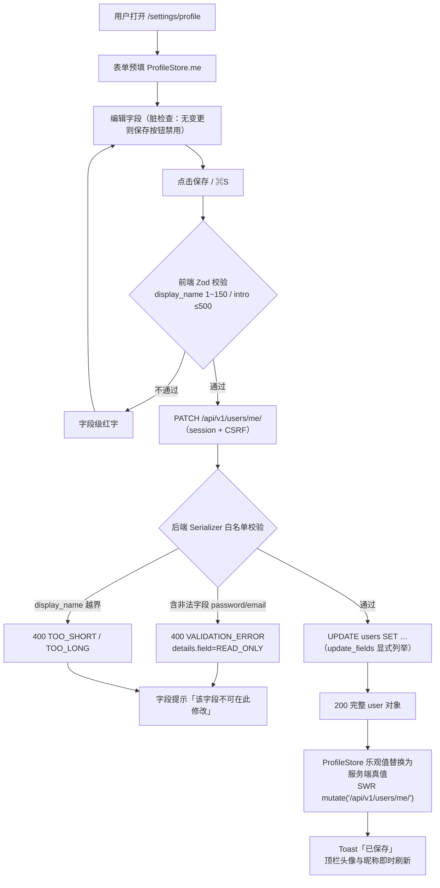
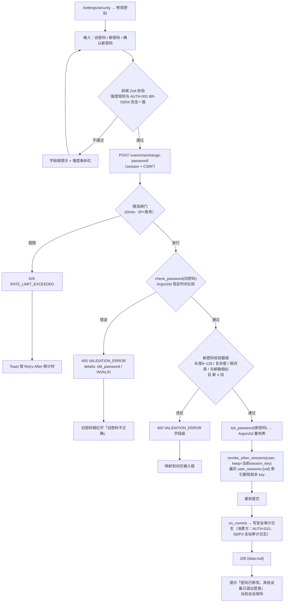
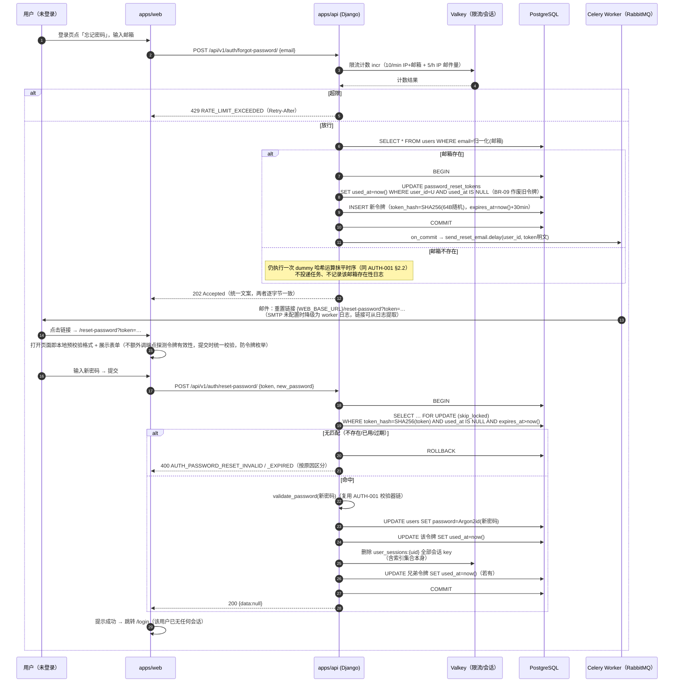
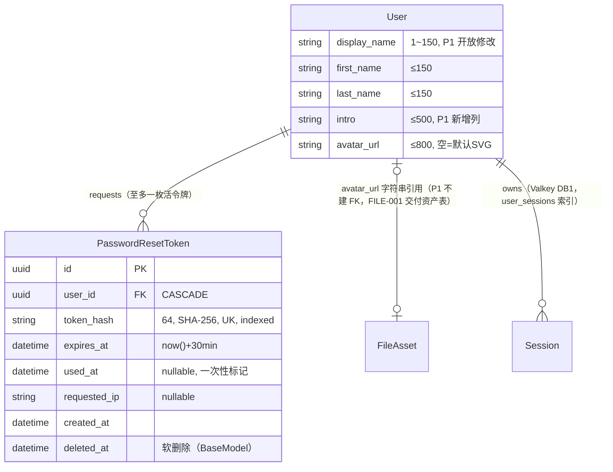

# 个人信息修改与密码重置

| 元信息项 | 内容 |
| --- | --- |
| 文档编号 | AUTH-004 |
| 所属迭代 | Sprint 1：MVP 能力补齐（第 3 周） |
| 优先级 | P1（MVP 必备级） |
| 所属模块 | M1-AUTH 账号与权限 |
| 文档状态 | 待评审（Draft） |
| 最后更新日期 | 2026-09-01 |
| 上游依据 | `docs/需求文档.md` §3.1（个人信息修改、头像、昵称、个人简介配置；密码加密存储、忘记密码 / 重置密码）、§8.2 账号权限 P1 列 |
| 前置依赖 | `AUTH-001`（注册 / 登录 / Session 体系、`User` 模型基线、Argon2id 哈希器与密码校验器）、`INFRA-004`（异常信封 / 日志 / SMTP 降级）、`INFRA-002`（Celery + RabbitMQ、MinIO、Valkey Session） |
| 下游依赖 | `TEAM-002`（邀请邮件复用发信通道与 SMTP 降级约定）、`FILE-001`（头像上传复用其 MinIO 预签名直传通道）、`AUTH-006`（P2 数据库行级隔离与成员权限分配，复用本文会话吊销工具做行级访问控制维度的会话失效）、`AUTH-009`（P3 SSO 单点登录；账号级禁用/启用联动需在 AUTH-009 中承接，禁用时吊销全部会话复用本文会话吊销工具——架构文档待回改）、`AUTH-010`（S8/P3 全站审计日志，消费本文 `password.changed` 等安全审计事件） |
| 架构基线 | [`api-conventions.md`](../architecture/api-conventions.md) §2.5（`PATCH /users/me/`、`forgot-password/`、`reset-password/` 契约已预定义）、§4（响应信封）、§7.2（认证端点限流）、§8.2（AUTH_* 错误码）、§9.2（Session 体系）；[`rbac-permission-model.md`](../architecture/rbac-permission-model.md) §3.2（成员模型，本文权限判定只涉及「已登录」）；[`unified-issue-model.md`](../architecture/unified-issue-model.md) §2.2（BaseModel） |
| 竞品参考 | Plane（`accounts/` 端点族：profile 修改 + onboarding 状态 + 密码修改；头像走 FileAsset 关联）、Ones（企业密码策略：有效期 / 历史密码 / 强度配置 + 管理员代发重置） |
| 工作量估算 | 后端 2.5 人日 / 前端 2.5 人日 / 联调与测试 1 人日，合计 **6 人日** |

> **范围声明**：交付「个人资料修改（昵称 / 姓名 / 头像 / 简介）+ 修改密码 + 忘记密码邮件重置」。邮箱变更（需验证邮件往返确认，防账号劫持，P2 评估）、密码有效期与历史密码策略（Ones 企业能力，P3 `AUTH-008` 自定义角色 / 实例配置中心）、MFA（P3+）、活跃会话管理界面（`GET /users/me/sessions/` 已在 `api-conventions.md` §9.2 登记，P2 交付）不在本范围。

---

## 1. 概述

### 1.1 功能定位

Sprint 0 按 `需求文档.md` §8.3 的 POC 排除清单，刻意砍掉了个人账户三件套——忘记密码、头像上传、个人资料编辑。这在演示场景没有任何影响，但进入「10 人小团队真实日常使用」后立即变成硬伤：

1. **识别需求**：`TASK-002` 的指派人选择器、`COLLAB-001` 的 @提及列表、`BOARD-001` 的卡片负责人头像，都消费 `display_name` 与头像。没有头像与可读昵称，协作界面上全是邮箱字符串。
2. **自助服务底线**：忘记密码若不能自助重置，每次都要管理员改库或发管理命令（`AUTH-001` §4.6 的 `grant_system_admin` 式操作）。10 人团队每周忘记一次密码，管理员就会被这类工单淹没。
3. **账号安全止损**：修改密码必须吊销其他设备的会话、重置密码必须吊销全部会话——这是「怀疑账号泄露时的一键止损」动作，成本极低但不可或缺。

工程上，本迭代还承担一个前置验证任务：**头像上传是 `FILE-001` MinIO 预签名直传通道的第一个消费者**（比任务附件更早落地），用最轻的流量把这个三步流（presign → 直传 → complete）跑通，为 P2 文件库铺路。

| 交付项 | 说明 |
| --- | --- |
| 个人资料修改 | `PATCH /api/v1/users/me/`：`display_name` / `first_name` / `last_name` / `intro`（个人简介，≤ 500 字） |
| 头像体系 | 默认首字母渐变头像（服务端 SVG 即时生成，零外部依赖）+ 上传自定义头像（MinIO 预签名直传，≤ 2MB，仅图片 MIME） |
| 修改密码 | `POST /api/v1/users/me/change-password/`：旧密码校验 + 新密码强度校验 + 改后吊销其他会话（保留当前会话） |
| 忘记密码 | `POST /api/v1/auth/forgot-password/`（发重置邮件，防枚举）→ `POST /api/v1/auth/reset-password/`（令牌 + 新密码，一次性令牌 + 吊销全部会话） |

### 1.2 关键约定：资料与安全的端点分离

> ⚠️ **本文档最重要的 API 约定。**

资料修改与密码修改使用**物理隔离的端点**，`PATCH /users/me/` 的 Serializer 字段白名单**永不包含任何密码字段**。

| 能力 | 端点 | 请求体可含字段 | 理由 |
| --- | --- | --- | --- |
| 资料修改 | `PATCH /api/v1/users/me/` | `display_name` / `first_name` / `last_name` / `intro` | 低风险、高频、字段级局部更新 |
| 修改密码 | `POST /api/v1/users/me/change-password/` | `old_password` / `new_password` / `new_password_confirm` | 高风险动作独立成端点：便于单独限流、单独审计、独立 CSRF 复核 |
| 重置密码 | `POST /api/v1/auth/reset-password/` | `token` / `new_password` / `new_password_confirm` | 匿名端点，令牌即凭证 |
| 头像 | `presign/` → `complete/` / `DELETE avatar/` | 文件元数据 / 无 | 走对象存储直传通道，不经 Django 中转 |

**防御性设计**：请求体中向 `PATCH /users/me/` 传入 `password` / `email` / `is_active` 等字段时，**显式返回 400 `VALIDATION_ERROR`（`details.field` 指向该字段，`code=READ_ONLY`）而非静默忽略**。静默忽略会让调用方误以为修改成功（「我 PATCH 了 password 怎么没生效」）；显式拒绝让契约在开发期就暴露歧义。这与 `AUTH-001` 注册端点的默认处理不同——其 `sign-up` Serializer（`AUTH-001` §4.2.1）沿用 DRF 默认行为，对白名单外的未声明字段（如当时尚未开放的 `first_name` / `intro`）静默忽略，面向「字段尚未开放的过渡态」；本文面向的是「永不通过该端点修改的安全字段」，必须显式拒绝。

### 1.3 能力 × 迭代阶段矩阵

| 能力 / 字段 | P0 建列 | P0 暴露 | **P1 交付（本文档）** | 后续 |
| --- | --- | --- | --- | --- |
| `display_name` | ✅ | 登录响应只读 | ✅ 可修改（1~150 字符，与 `AUTH-001` BR-09 / 模型列 `varchar(150)` 同口径） | — |
| `first_name` / `last_name` | ✅（AbstractUser 内置） | ❌ | ✅ 可修改 | — |
| `intro`（个人简介） | ❌ | ❌ | ✅ 新增列（varchar 500） | — |
| `avatar`（FileAsset 关联） | — | — | ✅ presign 直传 + 默认 SVG | `FILE-001` 建表 |
| `email` 变更 | ✅ | 只读 | ❌ 只读 | P2 评估（邮件往返验证） |
| 修改密码 | — | ❌ | ✅ | — |
| 忘记密码 / 重置 | — | ❌ | ✅ 邮件令牌流 | — |
| `PasswordResetToken` 表 | ❌ | ❌ | ✅ 新建 | — |
| 活跃会话列表 / 远端下线 UI | — | ❌ | ❌ 端点未交付 | P2（`api-conventions.md` §9.2 已登记） |
| 密码有效期 / 历史密码策略 | — | ❌ | ❌ 规则硬编码 | P3 实例配置 |
| MFA | — | ❌ | ❌ 错误码已登记 | P3+ |

### 1.4 范围边界

| 能力 | P1（本文档） | 后续 |
| --- | --- | --- |
| 改昵称 / 姓名 / 简介 | ✅ | — |
| 头像：默认 SVG + 上传自定义 | ✅ | `FILE-001` 承接资产表与清理任务 |
| 修改密码（旧密码 + 强度 + 踢其他会话） | ✅ | — |
| 忘记密码 → 邮件 → 重置 → 踢全会话 | ✅ | P2 模板可视化（`TEAM-003` 全局配置） |
| 重置邮件 HTML 精美模板 | ⭕ 纯文本即可用 | P2 邮件模板管理 |
| 邮箱变更 | ❌ | P2（防劫持需双向验证邮件） |
| 密码策略配置化 | ❌ 复用 `AUTH-001` 硬规则 | P3（Ones 对标） |
| 会话管理页面 | ❌ 吊销逻辑已就绪 | P2 |
| 头像裁剪编辑器（拖拽缩放） | ❌ 前端固定居中裁剪 256×256 | P3 体验增强 |

### 1.5 前置依赖

| 依赖文档 | 依赖内容 | 缺失后果 |
| --- | --- | --- |
| `AUTH-001` | `User` 模型（`display_name` / `avatar_url` / `is_active`）、Argon2 哈希器、`AUTH_PASSWORD_VALIDATORS` 校验器链、Session（Valkey DB 1、`rp_sessionid`、14 天滑动）、防枚举三处一致原则 | 无处落字段；重置后无法吊销会话；密码强度规则出现第二套口径 |
| `INFRA-004` | 统一错误信封与 `AUTH_*` 错误码、`AppException` 基类、SMTP 未配置时日志降级 | 错误格式漂移；开发环境邮件流程不可用 |
| `INFRA-002` | Celery worker + RabbitMQ（异步发信）、MinIO（头像对象）、Valkey（会话吊销索引） | 邮件阻塞请求；头像无存储位 |
| `FILE-001` | `FileAsset` 模型与预签名直传三步流定义（本文 §4.2.2~4.2.4 为其首个消费者，`FILE-001` 交付完整资产表；P1 先以最小 `FileAsset` 骨架承接） | 头像上传走不通 |
| `AUTH-005` | `PermissionGate` 组件（设置页入口「个人设置」对所有登录用户可见，不依赖权限矩阵；但安全页内的会话管理占位区需按 P2 能力灰置） | 无强依赖，弱关联 |

### 1.6 竞品参考

| 竞品 | 参考点 | 处置 |
| --- | --- | --- |
| Plane | `PATCH /api/users/me/` 修改 profile；头像本质是一张 `FileAsset`，前端上传后把 `avatar` 指向该资产；`change-password` 端点内嵌在 accounts 端点族；**改密后不吊销其他会话** | 资料与头像链路完全对齐；补强会话吊销（§6.3 D2） |
| Ones | 企业密码策略引擎（长度 / 复杂度 / 有效期 / 历史密码 N 次不可复用，管理端可配）；管理员代发重置邮件；邮件模板可视化 | 策略引擎后置 P3；P1 先把「自助 + 防枚举 + 一次性令牌」做到 Ones 级安全水位（§6.3 D4） |

---

## 2. 业务逻辑

### 2.1 修改资料流程



**要点**：资料保存**不做自动保存**（区别于 `TASK-001` 任务标题的 onBlur 自动保存）。理由：资料页是低频整页表单，用户预期「填完一起保存」；且 `display_name` 变更会即时影响协作界面上所有出现该用户的位置，误触发（输入中间态）会造成昵称闪烁。脏检查（`isDirty`）保证无变更时零请求。

### 2.2 修改密码流程



**为什么保留当前会话**：修改密码的发起者正在证明自己掌握旧密码（强于 Session 持有），踢掉其当前会话只会在「改密 → 立即被登出 → 重新登录」的流程里增加一次无意义摩擦。而重置密码（§2.3）不掌握旧密码、令牌可能泄露，必须吊销全部会话——两条路径的策略差异是刻意的。

### 2.3 忘记密码全链路（含令牌生命周期与防枚举）



**防枚举的一致性三件套**（与 `AUTH-001` §2.2 同一原则，逐项落实）：

| 位置 | 处理 |
| --- | --- |
| 响应码与文案 | 邮箱存在与否均返回 `202` +「若该邮箱存在，重置邮件已发送」；响应体逐字节一致 |
| 响应时间 | 邮箱不存在时对 dummy 哈希执行一次等价计算（令牌生成 + SHA-256），抹平时序差（UT-07 断言 < 30ms） |
| 限流与日志 | 不存在邮箱同样计数限流；访问日志不记录「该邮箱不存在」语义（只记 202 与 request_id，避免用日志侧信道反推） |

### 2.4 头像策略状态机

```mermaid
stateDiagram-v2
    [*] --> default: 注册（AUTH-001，avatar 为空）
    default --> default: 读取 GET /api/v1/public/users/{id}/avatar/?seed={id}&name={首字符}<br/>Cache-Control: public, max-age=31536000, immutable
    default --> uploading: 申请 presign → 浏览器直传 MinIO
    uploading --> default: 上传失败 / 用户放弃（is_uploaded=false 的资产由 FILE-001 清理任务回收）
    uploading --> custom: POST complete/ → 校验对象存在 → User.avatar_url = 资产公共 URL
    custom --> default: DELETE avatar/ → 恢复默认（对象由清理任务延迟删除）
    custom --> uploading: 更换头像（重复 presign 流程）
```

状态判定口径：`avatar_url` 为空 → default；非空 → custom。前端唯一消费该字段，不维护本地状态。

### 2.5 会话吊销策略总表

本迭代建立的全局会话吊销工具（§4.3.5）被四类事件消费，策略各不相同：

| 事件 | 吊销范围 | 保留 | 触发位置 |
| --- | --- | --- | --- |
| 修改密码（本迭代） | 该用户全部会话**除当前** | 当前 session | `PasswordService.change_password` |
| 重置密码（本迭代） | 该用户**全部**会话 + 全部未用重置令牌 | 无 | `PasswordService.reset_password` |
| 账号禁用（`AUTH-009` SSO 承接账号生命周期，含禁用/启用联动——架构文档待回改） | 全部会话 + 全部 API Key | 无 | 复用本工具，另加 Key 吊销 |
| 主动退出（`AUTH-001`） | 仅当前会话 | — | 已有实现，不走本工具 |

### 2.6 业务规则表

| 编号 | 规则 | 判定位置 | 违反后果 |
| --- | --- | --- | --- |
| BR-01 | `display_name` trim 后 1~150 字符（与 `AUTH-001` BR-09 及模型列一致）；`first_name` / `last_name` 各 ≤ 150；`intro` ≤ 500 字符（可为空） | 前端 Zod + 后端 Serializer | 400 `VALIDATION_ERROR` / `TOO_SHORT` / `TOO_LONG` |
| BR-02 | 资料端点与密码端点物理分离：`PATCH /users/me/` 的可写字段白名单仅 4 个资料字段；请求体出现 `password` / `email` / `is_active` / `last_workspace_id` 等 → 显式 400（`details.code=READ_ONLY`） | Serializer `validate()` | 400 `VALIDATION_ERROR` |
| BR-03 | 头像文件 ≤ 2MB 且 MIME ∈ {`image/png`, `image/jpeg`, `image/webp`}；扩展名与 MIME 声明一致 | presign 时校验 + complete 时对象元数据二次校验 | 400 `VALIDATION_FILE_SIZE_EXCEEDED` / `VALIDATION_FILE_TYPE_NOT_ALLOWED` |
| BR-04 | 修改密码：旧密码必验（Argon2id `check_password`）；新密码完整复用 `AUTH-001` BR-03/04 校验器链；新 ≠ 旧 | `PasswordService.change_password` | 400 `VALIDATION_ERROR`（`old_password` 或 `new_password` 字段级） |
| BR-05 | 修改密码成功后**保留当前会话**、吊销其余全部会话 | `revoke_other_sessions` | — |
| BR-06 | 重置令牌：64 字节 `secrets.token_urlsafe` 明文仅出现在邮件链接；DB 存 SHA-256 哈希（unique）；30 分钟过期；一次性（`used_at` 非空即拒绝） | `PasswordResetToken` 约束 + Service | 400 `AUTH_PASSWORD_RESET_INVALID` / `AUTH_PASSWORD_RESET_EXPIRED` |
| BR-07 | 重置成功后吊销该用户**全部**会话，并作废其全部未用重置令牌 | 同一事务 | — |
| BR-08 | `forgot-password` 恒返回 202 且不泄露邮箱存在性；双层限流：10/min（IP+邮箱，`api-conventions.md` §7.2 基线）+ 5/h（IP，邮件量防轰炸） | Throttle + Valkey | 429 `RATE_LIMIT_EXCEEDED` |
| BR-09 | 同一邮箱存在未过期令牌时再次申请：**先作废旧令牌再发新令牌**（同一事务），保证任意时刻每用户至多一枚活令牌、邮件轰炸只保留最新一封可用 | `forgot_password` Service | — |
| BR-10 | 邮件发送失败：Celery 重试 3 次（间隔 30s / 120s / 600s）后记 error 日志并放弃；不向用户暴露失败（可重新申请）；SMTP 未配置时任务不抛异常、降级输出 `plane.app.mail` 日志 | `send_reset_email` `autoretry_for` | — |
| BR-11 | 密码类端点（change / forgot / reset）全部纳入 CSRF 双提交校验（`AUTH-001` §4.3.4 同款，防 login CSRF 变体） | CSRF 中间件 | 403 `AUTH_CSRF_FAILED` |
| BR-12 | 令牌消费（reset）与令牌签发（forgot）均持锁串行化：消费用 `select_for_update(skip_locked=True)`，并发双请求恰一成功；签发侧作废旧令牌在同一事务 | Service | — |
| BR-13 | `intro` 入库前 strip 首尾空白；纯空白输入存空串（不存 NULL，列定义 `blank=True`） | Serializer `to_internal_value` | — |
| BR-14 | 头像 `complete` 必须校验对象真实存在（MinIO HEAD）且 `Content-Length` 与 presign 声明一致，防「伪造 complete 挂空头像」 | `complete_avatar` | 400 `VALIDATION_FILE_UPLOAD_MISMATCH`（`details.asset=DOES_NOT_EXIST`；码已登记于 `api-conventions.md` §8.4，`FILE-001` 同场景使用） |
| BR-15 | 默认头像 SVG 由服务端按 `seed=user_id` 决定渐变色、`name` 参数决定首字符；URL 含 name 参数本身参与缓存键，改名后自然换图，无需失效 | `avatar_svg` 视图 | — |

### 2.7 异常处理表

错误码全部出自 [`api-conventions.md`](../architecture/api-conventions.md) §8 登记集合。**本节同时完成对早期草案的规范化**：草案中的 `AUTH_INVALID_OLD_PASSWORD` 归并为 `VALIDATION_ERROR`（字段级 `old_password/INVALID`）、`AUTH_RESET_TOKEN_INVALID/EXPIRED` 统一为 §8.2 已登记的 `AUTH_PASSWORD_RESET_INVALID` / `AUTH_PASSWORD_RESET_EXPIRED`、`FILE_TOO_LARGE / FILE_TYPE_NOT_ALLOWED` 统一为 §8.4 的 `VALIDATION_FILE_SIZE_EXCEEDED` / `VALIDATION_FILE_TYPE_NOT_ALLOWED`。

| 场景 | HTTP | `error.code` | `details[]` | 前端行为 | 后端处理 |
| --- | --- | --- | --- | --- | --- |
| `display_name` 为空 / 超 150 | 400 | `VALIDATION_ERROR` | `display_name / TOO_SHORT 或 TOO_LONG` | 字段红字 | — |
| `intro` 超 500 | 400 | `VALIDATION_ERROR` | `intro / TOO_LONG` | 字数统计变红 | — |
| 资料端点传入安全字段 | 400 | `VALIDATION_ERROR` | `<field> / READ_ONLY` | 字段提示「不可在此修改」 | — |
| 旧密码错误 | 400 | `VALIDATION_ERROR` | `old_password / INVALID` | 旧密码框红字 | 计入账号失败计数（与登录共用 `login_fail_{email}` 键，锁定策略一致） |
| 新密码强度不足 / 与旧相同 | 400 | `VALIDATION_ERROR` | `new_password / TOO_SHORT、INVALID` | 强度条标红 + 字段提示 | — |
| 令牌不存在 / 已使用 | 400 | `AUTH_PASSWORD_RESET_INVALID` | —— | 失效态 + 「重新申请」按钮 | 不区分原因文案（防令牌枚举），但 `code` 区分 INVALID / EXPIRED |
| 令牌过期 | 400 | `AUTH_PASSWORD_RESET_EXPIRED` | —— | 同上，附「重新发送」入口 | beat 任务清理过期行（§4.4） |
| 头像 > 2MB | 400 | `VALIDATION_FILE_SIZE_EXCEEDED` | `file_size / TOO_LARGE`（message 给上限） | Toast + 文件选择器重置 | presign 前拦截 |
| 头像 MIME 非白名单 | 400 | `VALIDATION_FILE_TYPE_NOT_ALLOWED` | `content_type / INVALID` | 同上 | presign 前拦截；complete 二次校验 |
| complete 时对象缺失 | 400 | `VALIDATION_FILE_UPLOAD_MISMATCH` | `asset / DOES_NOT_EXIST` | 提示重传 | MinIO HEAD 校验（§8.4 已登记码，FILE-001 同场景） |
| 并发消费同一令牌 | 400 | `AUTH_PASSWORD_RESET_INVALID` | —— | — | `skip_locked` 串行化，恰一成功 |
| 未登录调用资料/改密端点 | 401 | `AUTH_REQUIRED` | —— | 跳登录（带 next） | — |
| CSRF 缺失/错误 | 403 | `AUTH_CSRF_FAILED` | —— | 重取 token 自动重试一次 | — |
| 忘记密码超限 | 429 | `RATE_LIMIT_EXCEEDED` | `retry_after / RETRY_AFTER` | 按倒计时冷却 | 双层限流任一触发 |
| 邮件队列不可达 | —— | —— | —— | 用户无感（202 已返回） | `SERVER_QUEUE_ERROR` 记日志；Celery 侧重试 |
| DB 异常 | 500 | `SERVER_DATABASE_ERROR` | —— | 通用错误 + request_id | 事务回滚 |

### 2.8 边界条件表

| 编号 | 边界 | 期望行为 |
| --- | --- | --- |
| EC-01 | `display_name` 恰 1 字符（trim 后）/ 恰 150 / 151 | 1 与 150 通过；151 返回 400 `TOO_LONG`（不静默截断——截断会造成「保存成功但显示不一致」） |
| EC-02 | `intro` 恰 500 / 501 字符 | 500 通过；501 返回 400 `TOO_LONG` |
| EC-03 | 密码恰 8 / 128 / 129 位 | 与 `AUTH-001` EC-01 完全一致（8/128 通过，129 拒绝） |
| EC-04 | 头像恰 2MB / 2MB+1B | 2MB 通过；2MB+1B 拒绝（presign 声明 `file_size` 为准，直传层 MinIO 亦有 `content-length-range` 条件双保险） |
| EC-05 | 令牌恰 30 分钟时提交 | 拒绝（`expires_at > now()` 为严格大于；边界秒级差异按过期处理，宁严勿松） |
| EC-06 | **并发用同一令牌重置**（两个请求同时到达） | 恰一 200 一 400，无死锁；败者得到 `AUTH_PASSWORD_RESET_INVALID`（IT-04） |
| EC-07 | 连续两次 forgot（间隔 < 30min） | 第 1 枚令牌立即作废，仅第 2 枚可用；用户收到 2 封邮件但只有最新链接有效（BR-09） |
| EC-08 | 重置页 URL 的 token 被篡改（截断/改字符） | SHA-256 无匹配 → `AUTH_PASSWORD_RESET_INVALID`；不区分「不存在」与「已用」文案 |
| EC-09 | 上传中用户离开页面 | presign 记录 30 分钟未 complete → `FILE-001` 清理任务删除孤儿对象（P1 由本文的清理 beat 先行兜底：只清理 `is_uploaded=false` 且超时的头像类资产） |
| EC-10 | 改名后默认头像 | URL 的 `name` 参数变化 → 新 URL → 缓存自然 miss；旧 URL 仍可访问（immutable 语义下不主动失效） |
| EC-11 | 邮箱不存在时连续申请 | 限流照常计数（防用 202 差异 + 计数差异枚举）；不产生任何 DB 写入 |
| EC-12 | SMTP 未配置（开发环境） | forgot 正常 202；worker 日志输出重置链接文本；`IT-01` 从日志提取链接完成端到端验证 |

---

## 3. UI/UX 设计

### 3.1 信息架构与路由

```
/login                     ← 「忘记密码？」文字链（AUTH-001 已占位，本迭代点亮）
/forgot-password           ← 输入邮箱（匿名可达）
/reset-password?token=…    ← 输入新密码（匿名可达，令牌预校验态）
/settings/profile          ← 个人资料（登录可达）
/settings/security         ← 安全：修改密码 + 会话管理（P2 占位灰置）
/settings/notifications    ← 通知偏好（P3 占位灰置）
```

设置区为二级页：左侧固定导航（个人资料 / 安全 / 通知偏好），右侧内容区。个人设置入口位于顶栏头像下拉菜单第一项（所有登录用户可见，不经过 `PermissionGate`——它不属于任何资源权限点）。

### 3.2 个人资料页（`/settings/profile`）

```
┌──────────────────────────────────────────────────────────────────┐
│  个人设置                                                        │
│  ┌──────────────┬─────────────────────────────────────────────┐  │
│  │              │  个人资料                        [保存] [重置]│  │
│  │ ● 个人资料    │  ┌─────────────────────────────────────────┐│  │
│  │              │  │        ┌────────┐                        ││  │
│  │ ○ 安全        │  │        │  头像   │   [更换头像]            ││  │
│  │              │  │        │ (160px) │   [恢复默认]            ││  │
│  │ ○ 通知偏好    │  │        └────────┘   jpg/png/webp ≤2MB     ││  │
│  │   (即将上线)  │  │        ▟▟▟▟▟▟░░░ 60%      ← 直传进度环     ││  │
│  │              │  └─────────────────────────────────────────┘│  │
│  │              │  昵称    ┌────────────────────────────────┐  │  │
│  │              │          │ 梁工                            │  │  │
│  │              │          └────────────────────────────────┘  │  │
│  │              │  名      ┌────────────────────────────────┐  │  │
│  │              │          │ 嘉                              │  │  │
│  │              │          └────────────────────────────────┘  │  │
│  │              │  姓      ┌────────────────────────────────┐  │  │
│  │              │          │ 徐                              │  │  │
│  │              │          └────────────────────────────────┘  │  │
│  │              │  个人简介 ┌────────────────────────────────┐  │  │
│  │              │          │ 后端工程师，负责任务核心模块      │  │  │
│  │              │          └────────────────────────────────┘  │  │
│  │              │          18 / 500                             │  │
│  │              │  邮箱    liang@example.com  🔒（不可修改）     │  │
│  └──────────────┴─────────────────────────────────────────────┘  │
└──────────────────────────────────────────────────────────────────┘
```

| 区域 | 组件 | 规格 |
| --- | --- | --- |
| 头像卡 | `Avatar`（160px 圆形）+ 悬浮遮罩「更换」+ 下方文字按钮 | 悬浮遮罩半透明黑 + 白色相机图标；`恢复默认` 仅在 `avatar_url` 非空时显示 |
| 直传进度 | 环形进度（`SVG circle` `stroke-dashoffset`） | presign 后出现；complete 成功淡入新头像后消失 |
| 资料表单 | `Form`（react-hook-form + Zod）四字段 | `display_name` 必填；`intro` 为 `TextArea` 3 行 + 右下角字数统计（`18 / 500`，超 480 变琥珀色预警） |
| 邮箱行 | 只读文本 + 锁图标 + Tooltip「邮箱变更即将上线」 | P1 不可修改（§1.2）；提前占位避免 P2 上线时布局重排（同 `AUTH-001` §3.3 忘记密码占位逻辑） |
| 保存按钮 | 主色实心；`isDirty && !isSubmitting` 才可点 | 保存成功后按钮短暂变为 `✓ 已保存`（2s）再回到禁用态 |
| 重置按钮 | 次级按钮 | 将表单恢复为 `ProfileStore.me` 当前值 |

### 3.3 安全设置页（`/settings/security`）

```
┌──────────────────────────────────────────────────────────────────┐
│  ┌──────────────┬─────────────────────────────────────────────┐  │
│  │ ○ 个人资料    │  安全                                           │  │
│  │              │                                                 │  │
│  │ ● 安全        │  ┌ 修改密码 ──────────────────────────────────┐ │  │
│  │              │  │                                             │ │  │
│  │              │  │  当前密码          ┌─────────────────────┐ │ │  │
│  │              │  │                    │ ••••••••          👁 │ │  │
│  │              │  │                    └─────────────────────┘ │ │  │
│  │              │  │  新密码            ┌─────────────────────┐ │ │  │
│  │              │  │                    │ •••              👁 │ │  │
│  │              │  │                    └─────────────────────┘ │ │  │
│  │              │  │  ▓▓▓▓░░░░░░  强度：中                       │ │  │
│  │              │  │  至少 8 位，需含大小写字母与数字              │ │  │
│  │              │  │  确认新密码        ┌─────────────────────┐ │ │  │
│  │              │  │                    │ •••              👁 │ │  │
│  │              │  │                    └─────────────────────┘ │ │  │
│  │              │  │                        [确认修改]           │ │  │
│  │              │  └─────────────────────────────────────────────┘ │  │
│  │              │                                                 │  │
│  │              │  ┌ 活跃会话 ─────────────────────── 即将上线 ──┐ │  │
│  │              │  │  管理各设备的登录状态（P2 交付）              │ │  │
│  │              │  └─────────────────────────────────────────────┘ │  │
│  └──────────────┴─────────────────────────────────────────────┘  │
└──────────────────────────────────────────────────────────────────┘
```

- 密码强度指示器**复用 `AUTH-001` §3.4 的同一组件**（弱 / 中 / 强三档 + 规则常驻清单），两处输入密码的界面不允许出现两套强度算法。
- 修改成功反馈：表单上方 Alert 条「密码已修改。其他设备已需要重新登录」，非 toast——用户视线在表单内。
- 「活跃会话」区块整体灰置 + `即将上线` 角标，不做隐藏（占位理由同 §3.2 邮箱行）。

### 3.4 忘记密码 / 重置密码页

```
┌────────────────────────────┐   ┌────────────────────────────────┐
│        [ Logo ]            │   │         [ Logo ]                │
│      重置你的密码           │   │       设置新密码                 │
├────────────────────────────┤   ├────────────────────────────────┤
│  输入注册邮箱，我们将发送    │   │  为账号 liang@example.com       │
│  重置链接到该邮箱。          │   │  设置新密码。                   │
│                            │   │                                │
│  邮箱                       │   │  新密码           ┌─────────┐ 👁│
│  ┌──────────────────────┐  │   │                   └─────────┘   │
│  │ you@company.com      │  │   │  ▓▓▓▓░░░░  强度：中              │
│  └──────────────────────┘  │   │  确认新密码       ┌─────────┐ 👁│
│                            │   │                   └─────────┘   │
│  [   发送重置邮件   ]       │   │                                │
│  （58s 后可再次发送）       │   │   [      重置密码并登录页      ]  │
├────────────────────────────┤   ├────────────────────────────────┤
│  想起密码了？ 返回登录       │   │  链接已失效？ 重新申请           │
└────────────────────────────┘   └────────────────────────────────┘
   /forgot-password                /reset-password（令牌失效态另见下）
```

令牌失效态（提交后收到 `AUTH_PASSWORD_RESET_INVALID/_EXPIRED`）：表单整体替换为居中失效卡——`link-2-off` 图标（96px `text-neutral-300`）+「重置链接无效或已过期」+ 副文案「链接有效期 30 分钟，且只能使用一次」+ 主按钮「重新申请」（预填邮箱跳转 forgot 页）。**不保留表单**：失效令牌下任何输入都不可能成功，保留只会诱导重复失败。

### 3.5 头像上传交互细节

| 步骤 | 行为 | 规格 |
| --- | --- | --- |
| ① 选择文件 | 点击「更换头像」触发隐藏 `<input type=file accept="image/png,image/jpeg,image/webp">`，或拖拽到头像区（虚线高亮） | `accept` 过滤 + 选择后 JS 再验 MIME 与大小，非法即 Toast，不发 presign |
| ② 前端处理 | `canvas` 读取 → 居中裁剪 → 缩放至 256×256 → `toBlob("image/webp", quality=0.85)` | 输出恒为 webp 方形小图（典型 20~60KB）；若压缩后仍 > 2MB（极端纯色噪声图）则提示改用更小原图 |
| ③ presign | `POST /users/me/avatar/presign/` | 携带压缩后 `file_name` / `file_size` / `content_type=image/webp` |
| ④ 直传 | `PUT` 预签名 URL | 进度环实时更新（`xhr.upload.onprogress`） |
| ⑤ complete | `POST /users/me/avatar/complete/` | 成功 → 新头像淡入（300ms opacity 过渡）+ 全站顶栏 / 卡片头像 SWR 失效刷新 |
| 失败 | 任一步失败 | 保留旧头像 + Toast `error.message`；进度环消失 |
| 放弃 | 上传中点击「取消」 | `xhr.abort()`；孤儿对象 30 分钟后被清理（EC-09） |

### 3.6 交互细节表（含防抖与提交策略）

| 交互 | 触发 | 反馈 | 加载 / 空 / 失败态 |
| --- | --- | --- | --- |
| 保存资料 | 点击保存 / `⌘S` | 乐观写入 `ProfileStore` → 成功 Toast + 顶栏昵称刷新 | 按钮 spinner；失败回滚快照 + 字段级 `setError` |
| 昵称输入 | 输入过程 | 不校验不清错；失焦校验 | — |
| 简介字数 | 输入实时 | 计数刷新；> 480 琥珀色 | — |
| 上传头像 | §3.5 五步 | 进度环 → 淡入新头像 | 失败保旧图 + Toast |
| 恢复默认头像 | 点击文字按钮 | 二次确认（Popover「恢复为系统默认头像？」）→ 头像淡出为 SVG 默认 | `avatar_url` 判空驱动 |
| 发送重置邮件 | 提交邮箱 | 202 后**无论邮箱真假**显示「邮件已发送，请查收（记得看看垃圾箱）」 | 按钮 60s 冷却倒计时（防连点与邮件轰炸的第三道前端防线）；冷却期内禁用 |
| 打开重置页 | 链接进入 | 本地仅校验 token 格式（43~128 位 urlsafe 字符；本文实发 86 字符，见 §4.1.1 `TOKEN_BYTES` 自注），不调端点探测 | 格式非法直接呈现失效态 |
| 重置成功 | 提交 | 成功页「密码已重置」+ 主按钮「去登录」 | — |
| 改密成功 | 提交 | Alert「其他设备已退出」；表单清空 | — |

**自动保存策略**：本页所有表单均为**显式保存**（无 onBlur 自动提交），理由见 §2.1。唯一的「实时」行为是前端本地校验与字数统计，零网络请求。

### 3.7 空状态与错误态

| 场景 | 处置 |
| --- | --- |
| 资料表单初始 | 全部预填当前值；保存按钮禁用（`isDirty=false`） |
| `/users/me/` 拉取失败 | 内容区错误态：`alert-circle` + `error.message` + 「重试」；表单禁用（防基于旧快照覆盖） |
| 头像加载失败（自定义 URL 失效） | `onError` 回退渲染默认 SVG（`avatar_url` 不回写，下次登录自然校正） |
| 重置页无 token 参数 | 直接失效态，副文案「请通过邮件中的链接进入」 |

### 3.8 响应式断点

| 断点 | 布局 |
| --- | --- |
| ≥ 1024px | 双栏：左侧导航 240px + 内容区 max-width 720px |
| 768 ~ 1023px | 双栏收窄：导航 200px；头像卡与表单单列堆叠 |
| < 768px | 单栏：导航折叠为顶部横向 Tab（个人资料 / 安全）；头像居中；表单全宽；发送 / 保存按钮吸底 |
| 暗色模式 | 跟随 `prefers-color-scheme`，`@rp/ui` token 驱动 |

### 3.9 无障碍要求（WCAG 2.1 AA）

| 项 | 实现 |
| --- | --- |
| 标签关联 | Headless UI `<Field>` + `<Label>`；禁用 placeholder 代 label |
| 密码强度 | `role="meter"` + `aria-valuenow/min/max` + `aria-label="密码强度"`（复用 `AUTH-001` §3.7 同款组件） |
| 错误播报 | 字段错误容器 `role="alert"` + `aria-live="polite"`；`aria-invalid` + `aria-describedby` 指向错误文本 |
| 头像上传 | 隐藏 input `aria-label="上传头像"`；进度环 `role="progressbar"` + `aria-valuetext="上传进度 60%"` |
| 冷却倒计时 | `aria-live="off"`（避免每秒播报）；倒计时结束播报一次「可再次发送」 |
| 焦点管理 | 重置失效态切换时焦点移至失效卡标题；改密成功后焦点移至 Alert 条 |
| 键盘 | 全部操作键盘可达；`⌘S` 保存；Esc 关闭二次确认 |

---

## 4. 技术架构

### 4.1 数据模型

#### 4.1.1 `PasswordResetToken`（新建表）

```python
# apps/api/plane/db/models/account.py
import hashlib
import secrets

from django.db import models
from django.utils import timezone

from plane.db.models.base import BaseModel


class PasswordResetToken(BaseModel):
    """密码重置令牌 —— 一次性、短时效、存哈希不存明文。

    设计要点（BR-06 / BR-09 / BR-12）：
    - 明文 token 仅存在于邮件链接与内存，落库前 SHA-256；库被拖走也无法反推令牌
    - token_hash 全局 unique：不同用户的令牌哈希碰撞直接被约束拒绝（概率可忽略）
    - 一次性由「消费时 UPDATE used_at WHERE used_at IS NULL」的行锁语义保证
    - 每用户任意时刻至多一枚活令牌（签发前作废旧令牌），邮件轰炸只保留最新一封可用
    """

    TOKEN_BYTES = 64          # 64B → token_urlsafe 输出 86 字符
    TTL_MINUTES = 30          # BR-06

    user = models.ForeignKey(
        "db.User", on_delete=models.CASCADE, related_name="reset_tokens", verbose_name="所属用户"
    )
    token_hash = models.CharField(
        max_length=64, unique=True, db_index=True, verbose_name="SHA-256(令牌)"
    )
    expires_at = models.DateTimeField(verbose_name="过期时间")
    used_at = models.DateTimeField(null=True, blank=True, verbose_name="使用时间")
    requested_ip = models.GenericIPAddressField(null=True, blank=True, verbose_name="申请来源 IP")

    class Meta(BaseModel.Meta):
        db_table = "password_reset_tokens"
        verbose_name = "密码重置令牌"
        ordering = ("-created_at",)
        constraints = [
            # 活令牌每用户至多一枚的数据库级兜底（Service 层 BR-09 为主判定，此约束防并发签发竞态）
            models.UniqueConstraint(
                fields=["user"],
                condition=models.Q(used_at__isnull=True),
                name="uniq_one_live_reset_token_per_user",
            ),
        ]
        indexes = [
            models.Index(fields=["user", "expires_at"], name="idx_prt_user_exp"),
        ]

    @classmethod
    def issue(cls, *, user, ip: str | None) -> str:
        """签发一枚新令牌并返回明文（仅此一处产生明文）。

        必须在 transaction.atomic() 内调用：作废旧令牌 + 写入新令牌为同一事务（BR-09/BR-12）。
        并发场景下第二个签发事务会被 uniq_one_live_reset_token_per_user 拦截并重试。
        """
        cls.objects.filter(user=user, used_at__isnull=True).update(used_at=timezone.now())
        token = secrets.token_urlsafe(cls.TOKEN_BYTES)
        cls.objects.create(
            user=user,
            token_hash=hashlib.sha256(token.encode()).hexdigest(),
            expires_at=timezone.now() + timezone.timedelta(minutes=cls.TTL_MINUTES),
            requested_ip=ip,
            created_by=user,
            updated_by=user,
        )
        return token
```

#### 4.1.2 `User` 增量（一个可空列）

```python
# apps/api/plane/db/models/user.py —— P1 migration 新增
intro = models.CharField(
    max_length=500, blank=True, default="", verbose_name="个人简介",
    help_text="≤500 字符；纯文本（无富文本），列表/提及浮层可截断展示",
)
# display_name / first_name / last_name / avatar_url / is_active 均为 AUTH-001 既有基线，本迭代仅开放写入
```

migration 说明：`ADD COLUMN intro varchar(500) NOT NULL DEFAULT ''` 是 O(1) 元数据操作（`unified-issue-model.md` §6 同论证——该节正是为避免后续对大表执行 `ALTER TABLE ADD COLUMN` 而确立「P0 一次性建齐列」的分层原则；其 §7.1 为 Issue 字段对比表，非本文所引论证）；users 表 P1 量级极小，无锁风险。`avatar` 若采用 `FileAsset` 外键形态（`FILE-001` 交付），本迭代先用 `avatar_url` 字符串列承接（AUTH-001 既有），`FILE-001` 建表后再评估是否迁移为 FK——**P1 明确不建 FK**，避免与 `FILE-001` 的资产生命周期管理（清理任务）产生级联耦合。

#### 4.1.3 ER 图



#### 4.1.4 索引设计说明

| 索引 | 服务的查询 | 本迭代使用 |
| --- | --- | --- |
| `idx_prt_user_exp (user, expires_at)` | `forgot-password` 作废旧令牌（`WHERE user=? AND used_at IS NULL`）；beat 清理过期行 | ✅ 核心 |
| `token_hash` UNIQUE（附带索引） | `reset-password` 点查 `WHERE token_hash=? AND used_at IS NULL AND expires_at>now()` | ✅ 核心（点查，无扫描） |
| `uniq_one_live_reset_token_per_user`（偏唯一约束） | 并发签发竞态兜底 | ✅ 兜底（正常路径不触发） |
| `users (email, is_active)`（`AUTH-001` 既有） | forgot 邮箱归一化点查 | ✅ 复用 |
| `users.email` UNIQUE | — | 复用 |

> 该表写入频率极低（每次忘记密码一行），读取只有两次点查，**不需要更多索引**；`requested_ip` 仅审计用途，不建索引。

### 4.2 API 定义

| # | 方法 | 路径 | 描述 | 认证 | 限流 | 成功码 |
| --- | --- | --- | --- | --- | --- | --- |
| 1 | `PATCH` | `/api/v1/users/me/` | 修改资料（4 字段白名单） | Session + CSRF | 60/min | `200` |
| 2 | `POST` | `/api/v1/users/me/avatar/presign/` | 申请头像直传凭证 | Session + CSRF | 30/min（`api-conventions.md` §7.2 预签名类） | `201` |
| 3 | `POST` | `/api/v1/users/me/avatar/complete/` | 确认上传并设为头像 | Session + CSRF | 30/min | `200` |
| 4 | `DELETE` | `/api/v1/users/me/avatar/` | 恢复默认头像 | Session + CSRF | 60/min | `200` |
| 5 | `GET` | `/api/v1/public/users/{user_id}/avatar/` | 默认头像 SVG（服务端生成，公开分组） | 匿名（public 分组） | 30/min/IP（`api-conventions.md` §7.2 匿名基线） | `200` |
| 6 | `POST` | `/api/v1/users/me/change-password/` | 修改密码（旧密码 + 吊销其他会话） | Session + CSRF | 10/min（IP+账号，认证端点档） | `200` |
| 7 | `POST` | `/api/v1/auth/forgot-password/` | 申请重置邮件（防枚举 202） | 匿名 + CSRF | 10/min（IP+邮箱）叠加 5/h（IP） | `202` |
| 8 | `POST` | `/api/v1/auth/reset-password/` | 令牌重置密码（吊销全部会话） | 匿名 + CSRF | 10/min（IP+账号） | `200` |

> 端点 1 / 6 / 7 / 8 的路径**全部取自 `api-conventions.md` §2.5「认证与账户」既有清单**，不另起命名；端点 2~4 是 `users/me` 的动作子资源（§2.6 动作子资源模式），与 `FILE-001` 的 `attachments/presign/` 保持同一命名范式。端点 5 为匿名只读，按 §2.1 三套分组归入公开前缀 `/api/v1/public/`（不挂在内部 `/api/v1/` 下），路径无扩展名（§2.3 禁止路径含文件扩展名——`Content-Type: image/svg+xml` 已表达格式）。

#### 4.2.1 `PATCH /api/v1/users/me/` — 修改资料

**请求**

```json
{
  "display_name": "梁工",
  "first_name": "嘉",
  "last_name": "徐",
  "intro": "后端工程师，负责任务核心模块"
}
```

**成功响应 `200`**

```json
{
  "status": "success",
  "data": {
    "id": "6c7d1a2b-3e4f-4a5b-9c8d-7e6f5a4b3c2d",
    "email": "liang@example.com",
    "display_name": "梁工",
    "first_name": "嘉",
    "last_name": "徐",
    "intro": "后端工程师，负责任务核心模块",
    "avatar_url": "https://app.local/uploads/avatar/6c7d1a2b…/01JBX3K9Q7ZR4M8N2P5V6W7A0A.webp",
    "is_default_avatar": false,
    "updated_at": "2026-09-01T08:30:00.000Z"
  }
}
```

> `is_default_avatar` 为派生只读字段（`avatar_url` 判空），前端据此切换「恢复默认」按钮可见性，避免在两处判空逻辑漂移。

**错误响应 `400`（传入安全字段）**

```json
{
  "status": "error",
  "error": {
    "code": "VALIDATION_ERROR",
    "message": "请求参数校验失败",
    "details": [
      { "field": "password", "code": "READ_ONLY", "message": "该字段不可通过资料端点修改" }
    ],
    "request_id": "01JBX3K9Q7ZR4M8N2P5V6W7A01"
  }
}
```

**错误响应 `400`（简介超长）**

```json
{
  "status": "error",
  "error": {
    "code": "VALIDATION_ERROR",
    "message": "请求参数校验失败",
    "details": [
      { "field": "intro", "code": "TOO_LONG", "message": "个人简介最多 500 字符" }
    ],
    "request_id": "01JBX3K9Q7ZR4M8N2P5V6W7A02"
  }
}
```

#### 4.2.2 `POST /api/v1/users/me/avatar/presign/` — 申请直传

**请求**

```json
{
  "file_name": "avatar.webp",
  "file_size": 48213,
  "content_type": "image/webp"
}
```

**成功响应 `201`**（响应头 `Location: /api/v1/users/me/avatar/`——满足 `api-conventions.md` §4.3「`201` 必带 `Location`」；指向头像子资源即资产 complete 生效后的读取位置，`asset_id` 已在响应体中，不单设资产详情端点）

```json
{
  "status": "success",
  "data": {
    "asset_id": "b2f1c9d0-8a3e-4f6b-9c2d-1e5f7a9b3c6e",
    "upload_url": "https://app.local/uploads/avatar/6c7d1a2b…/b2f1c9d0….webp?X-Amz-Algorithm=AWS4-HMAC-SHA256&X-Amz-Credential=…&X-Amz-Date=20260901T083000Z&X-Amz-Expires=1800&X-Amz-SignedHeaders=host&X-Amz-Signature=…",
    "fields": { "Content-Type": "image/webp" },
    "expires_at": "2026-09-01T09:00:00.000Z"
  }
}
```

> **协议字段对齐说明**：请求（`file_name` / `file_size` / `content_type`）与响应（`upload_url` / `fields` / `asset_id` / `expires_at`）逐字取自 [`api-conventions.md`](../architecture/api-conventions.md) §13.2 预签名直传规范原文——架构是协议字段的事实来源。不再自定义 `upload_method` / `max_size` / `allowed_types` 等协议外字段：上传动词固定 `PUT`（§13.2 第 2 步）；体积与类型上限由 BR-03 在 presign 服务端校验兜底，前端以本地常量做交互提示。`fields` 为直传请求必须原样携带的元数据（PUT 场景置于请求头，漏带会导致签名校验失败）。`FILE-001` §4.3.1 现用的 `name` / `size` / `mime` 与 `method` / `expires_in` / `headers` 与架构 §13.2 存在分歧，**以架构为准**（FILE-001 待回改）。URL 主机形态架构未规定，**已对齐 FILE-001**：同源 `/uploads/` 反代路由（FILE-001 §4.7 Nginx 直传路由，浏览器零跨域预检成本），对象键 `avatar/{user_id}/{ulid}.webp`（FILE-001 §4.1.3 头像前缀，桶 `rp-uploads`）。`X-Amz-Expires=1800` 与 30 分钟孤儿回收窗口对齐（EC-09）。

**错误响应 `400`（类型/大小拦截）**

```json
{
  "status": "error",
  "error": {
    "code": "VALIDATION_FILE_TYPE_NOT_ALLOWED",
    "message": "仅支持 png / jpeg / webp 图片",
    "details": [
      { "field": "content_type", "code": "INVALID", "message": "image/gif 不在允许列表" }
    ],
    "request_id": "01JBX3K9Q7ZR4M8N2P5V6W7A03"
  }
}
```

> 预签名 URL 的 Policy 附带 `content-length-range 1, 2097152` 条件——即使绕过前端校验直传超大文件，MinIO 也会拒绝，服务端无需在中转中读体（双保险，见 EC-04）。

#### 4.2.3 `POST /api/v1/users/me/avatar/complete/` — 确认并生效

**请求**

```json
{ "asset_id": "b2f1c9d0-8a3e-4f6b-9c2d-1e5f7a9b3c6e" }
```

**成功响应 `200`**

```json
{
  "status": "success",
  "data": {
    "avatar_url": "https://app.local/uploads/avatar/6c7d1a2b…/b2f1c9d0….webp",
    "is_default_avatar": false,
    "updated_at": "2026-09-01T08:31:12.500Z"
  }
}
```

**错误响应 `400`（对象未上传 / 大小不符）**

```json
{
  "status": "error",
  "error": {
    "code": "VALIDATION_FILE_UPLOAD_MISMATCH",
    "message": "头像对象校验失败",
    "details": [
      { "field": "asset", "code": "DOES_NOT_EXIST", "message": "存储中未找到该文件，请重新上传" }
    ],
    "request_id": "01JBX3K9Q7ZR4M8N2P5V6W7A04"
  }
}
```

#### 4.2.4 `DELETE /api/v1/users/me/avatar/` — 恢复默认

`200`：

```json
{
  "status": "success",
  "data": {
    "avatar_url": null,
    "is_default_avatar": true,
    "default_avatar_url": "/api/v1/public/users/6c7d1a2b…/avatar/?seed=6c7d1a2b…&name=%E6%A2%81",
    "updated_at": "2026-09-01T08:32:40.000Z"
  }
}
```

> 旧对象不在请求内同步删除：`avatar_url` 置空即语义生效；对象由清理 beat 延迟回收（30 分钟 + 全站无引用判重），避免「删除卡在对象存储 IO 上」。

#### 4.2.5 `GET /api/v1/public/users/{user_id}/avatar/` — 默认头像

**请求**：`GET /api/v1/public/users/6c7d1a2b…/avatar/?seed=6c7d1a2b…&name=梁 HTTP/1.1`

**成功响应 `200`**（`Content-Type: image/svg+xml`；`Cache-Control: public, max-age=31536000, immutable`）：

```svg
<svg xmlns="http://www.w3.org/2000/svg" width="160" height="160" viewBox="0 0 160 160">
  <defs><linearGradient id="g" x1="0" y1="0" x2="1" y2="1">
    <stop offset="0%" stop-color="#6366F1"/><stop offset="100%" stop-color="#8B5CF6"/>
  </linearGradient></defs>
  <rect width="160" height="160" rx="80" fill="url(#g)"/>
  <text x="80" y="80" dy=".35em" text-anchor="middle"
        font-size="72" fill="#FFFFFF" font-family="system-ui, sans-serif">梁</text>
</svg>
```

- 渐变双色由 `seed`（即 user_id）哈希从 12 组预置配色中选定——同一用户恒定同色，多人列表不花哨。
- `name` 参数参与 URL 缓存键：改名 → 新 URL → 缓存自然 miss（BR-15）；`immutable` 成立因为「同 URL 必同图」。
- 匿名可读，按 `api-conventions.md` §2.1 三套分组登记在**公开 API 前缀** `/api/v1/public/`（消费方含 `apps/space` 匿名访客；本端点无 Serializer、仅输出 SVG，不存在脱敏面问题）。该端点只暴露首字符与颜色，无隐私面（首字符在昵称可见处本就公开）；供 space 公开页与重置邮件复用。

#### 4.2.6 `POST /api/v1/users/me/change-password/` — 修改密码

**请求**

```json
{
  "old_password": "Rabbit2026Pm",
  "new_password": "Rabbit2026New!",
  "new_password_confirm": "Rabbit2026New!"
}
```

**成功响应 `200`**

```json
{
  "status": "success",
  "data": {
    "revoked_sessions": 2,
    "message": "密码已修改，其他 2 个设备需要重新登录"
  }
}
```

**错误响应 `400`（旧密码错误）**

```json
{
  "status": "error",
  "error": {
    "code": "VALIDATION_ERROR",
    "message": "请求参数校验失败",
    "details": [
      { "field": "old_password", "code": "INVALID", "message": "旧密码不正确" }
    ],
    "request_id": "01JBX3K9Q7ZR4M8N2P5V6W7A05"
  }
}
```

**错误响应 `400`（新密码复用旧密码）**

```json
{
  "status": "error",
  "error": {
    "code": "VALIDATION_ERROR",
    "message": "请求参数校验失败",
    "details": [
      { "field": "new_password", "code": "INVALID", "message": "新密码不能与当前密码相同" }
    ],
    "request_id": "01JBX3K9Q7ZR4M8N2P5V6W7A06"
  }
}
```

#### 4.2.7 `POST /api/v1/auth/forgot-password/` — 申请重置

**请求**

```json
{ "email": "liang@example.com" }
```

**成功响应 `202`（邮箱存在与不存在逐字节一致）**

```json
{
  "status": "success",
  "data": null,
  "meta": { "message": "若该邮箱存在，重置邮件已发送，请查收（含垃圾箱）" }
}
```

> **`202` 豁免 `task_id` 的说明**：`api-conventions.md` §4.3 / §13.1 的「`202` + `task_id`」面向**客户端需轮询结果**的异步任务（导入 / 导出 / 批量归档）；本端点的后续动作只有投递一封邮件，无任何客户端可消费的结果，不存在轮询场景。且防枚举三件套（§2.3）要求响应与邮箱存在性完全无关——任何按用户维度生成的任务句柄（`task_id` 或可查询的任务状态端点）都会成为「该邮箱是否注册」的侧信道。故本端点登记为「`202` 仅表受理语义、豁免 `task_id`」的显式场景（附录 A 已同步标注）。

**错误响应 `429`（响应头 `Retry-After: 873`）**

```json
{
  "status": "error",
  "error": {
    "code": "RATE_LIMIT_EXCEEDED",
    "message": "请求过于频繁，请在 15 分钟后重试",
    "details": [{ "field": "retry_after", "code": "RETRY_AFTER", "message": "873" }],
    "request_id": "01JBX3K9Q7ZR4M8N2P5V6W7A07"
  }
}
```

#### 4.2.8 `POST /api/v1/auth/reset-password/` — 令牌重置

**请求**

```json
{
  "token": "6cNLOwYQJmVRG3UWzm8aj2Waj5akX5SIH1ALoKrnZ6kc1tH3YGHrWDAK6KLR4GkyMK_hPXKEuNXHx8ZMXEhDlR",
  "new_password": "Rabbit2026New!",
  "new_password_confirm": "Rabbit2026New!"
}
```

**成功响应 `200`**

```json
{
  "status": "success",
  "data": { "revoked_sessions": 3 }
}
```

**错误响应 `400`（令牌过期）**

```json
{
  "status": "error",
  "error": {
    "code": "AUTH_PASSWORD_RESET_EXPIRED",
    "message": "重置链接已过期，请重新申请",
    "request_id": "01JBX3K9Q7ZR4M8N2P5V6W7A08"
  }
}
```

**错误响应 `400`（令牌不存在 / 已使用）**

```json
{
  "status": "error",
  "error": {
    "code": "AUTH_PASSWORD_RESET_INVALID",
    "message": "重置链接无效或已使用，请重新申请",
    "request_id": "01JBX3K9Q7ZR4M8N2P5V6W7A09"
  }
}
```

> `INVALID` 与 `EXPIRED` 共用「重新申请」交互，但保留两个独立 `code`：过期占多数、可给出「30 分钟有效期」的具体文案；不区分「不存在 vs 已使用」防令牌枚举探测。

### 4.3 核心逻辑实现

#### 4.3.1 `ProfileService.update_profile` — 白名单局部更新

```python
# apps/api/plane/account/services.py
PROFILE_WRITABLE_FIELDS = frozenset({"display_name", "first_name", "last_name", "intro"})
FORBIDDEN_ON_PROFILE = frozenset({"password", "email", "is_active", "is_staff", "last_workspace_id"})


class ProfileService:
    @staticmethod
    def update_profile(*, user, payload: dict) -> User:
        # BR-02：安全字段显式拒绝（先于字段校验，保证错误信息指向真正的意图错误）
        forbidden = FORBIDDEN_ON_PROFILE & set(payload)
        if forbidden:
            raise ValidationError({
                field: [ErrorDetail("该字段不可通过资料端点修改", code="READ_ONLY")]
                for field in forbidden
            })

        unknown = set(payload) - PROFILE_WRITABLE_FIELDS
        if unknown:                                   # 非白名单字段同样显式拒绝（拼写错误早暴露）
            raise ValidationError({
                field: [ErrorDetail("未知字段", code="INVALID")] for field in unknown
            })

        for field in PROFILE_WRITABLE_FIELDS & set(payload):
            value = payload[field]
            if isinstance(value, str):
                value = value.strip()                 # BR-13
            setattr(user, field, value)
        user.updated_by = user
        user.save(update_fields=sorted(PROFILE_WRITABLE_FIELDS & set(payload))
                  + ["updated_by", "updated_at"])     # 显式 update_fields：绝不触碰 password 等列
        return user
```

#### 4.3.2 `PasswordService.change_password` — 旧密码校验 + 部分吊销

```python
# apps/api/plane/account/services.py（续）
from django.contrib.auth import password_validation
from django.contrib.auth.hashers import check_password
from django.db import transaction


class PasswordService:

    @staticmethod
    def change_password(*, user, request_session_key: str,
                        old_password: str, new_password: str) -> int:
        if not check_password(old_password, user.password):        # Argon2id 恒定时间比较
            LoginFailureLock.record_failure(user.email)            # 与登录共用失败计数（§2.7）
            raise ValidationError({
                "old_password": [ErrorDetail("旧密码不正确", code="INVALID")]
            })

        if check_password(new_password, user.password):
            raise ValidationError({
                "new_password": [ErrorDetail("新密码不能与当前密码相同", code="INVALID")]
            })

        password_validation.validate_password(new_password, user=user)  # AUTH-001 校验器链（BR-04）

        with transaction.atomic():
            user.set_password(new_password)                         # Argon2id，自动重盐
            user.save(update_fields=["password", "updated_by", "updated_at"])
            revoked = revoke_other_sessions(user_id=user.id, keep_session_key=request_session_key)
            transaction.on_commit(lambda: security_audit.delay(
                event="password.changed", user_id=str(user.id), revoked_sessions=revoked
            ))                                  # AUTH-010（S8/P3 全站审计日志）消费；TASK-010（S2/P2
                                               # 全操作留痕）不含安全审计事件，其 §1 显式后置给 AUTH-010
        return revoked                                              # BR-05
```

#### 4.3.3 `PasswordService.forgot_password` — 防枚举 + 旧令牌作废

```python
    @staticmethod
    def forgot_password(*, email: str, ip: str | None) -> None:
        """申请重置。无论邮箱是否存在都执行等价计算量，恒定 202（防枚举三件套）。"""
        email = email.strip().lower()
        user = User.objects.filter(email=email, is_active=True).first()

        if user is None:
            # 时序抹平：执行一次 token_urlsafe(PasswordResetToken.TOKEN_BYTES) 与一次 sha256 哈希
            # （恒定时间比对策略），仅丢弃结果——与真实签发路径的 IO 形态一致即可，UT-07 断言 < 30ms
            secrets.token_urlsafe(PasswordResetToken.TOKEN_BYTES)
            hashlib.sha256(secrets.token_urlsafe(8).encode()).hexdigest()
            return

        with transaction.atomic():
            token = PasswordResetToken.issue(user=user, ip=ip)     # BR-09/BR-12：作废旧+签发新
            transaction.on_commit(lambda: send_reset_email.delay(str(user.id), token))
```

> 令牌明文 `token` 作为闭包变量传入 Celery 任务——它是**唯一**离开本函数的明文副本，只进入消息队列与邮件；`on_commit` 保证事务回滚时不发幽灵邮件（`api-conventions.md` §10.5）。

#### 4.3.4 `PasswordService.reset_password` — 令牌消费（CAS 一次性）

```python
    @staticmethod
    def reset_password(*, token: str, new_password: str) -> int:
        token_hash = hashlib.sha256(token.encode()).hexdigest()
        with transaction.atomic():
            prt = (PasswordResetToken.objects
                   .select_for_update(skip_locked=True)             # BR-12：并发双请求恰一成功
                   .filter(token_hash=token_hash, used_at__isnull=True)
                   .first())
            now = timezone.now()
            if prt is None:                                         # 不存在或已使用 → 同码（防枚举）
                raise AppException("AUTH_PASSWORD_RESET_INVALID")
            if prt.expires_at <= now:                               # EC-05：严格大于才有效
                raise AppException("AUTH_PASSWORD_RESET_EXPIRED")

            password_validation.validate_password(new_password, user=prt.user)

            prt.user.set_password(new_password)
            prt.user.save(update_fields=["password", "updated_by", "updated_at"])
            prt.used_at = now
            prt.save(update_fields=["used_at", "updated_by", "updated_at"])
            PasswordResetToken.objects.filter(user=prt.user).exclude(pk=prt.pk)\
                .update(used_at=now)                                # 兄弟令牌一并作废（BR-07）
            revoked = delete_all_sessions(user_id=prt.user_id)      # 全会话吊销（BR-07）
        return revoked
```

#### 4.3.5 会话吊销工具（本迭代交付的横切能力）

Session 后端为 Valkey cache（`AUTH-001` §4.3.3），无「按用户枚举会话」的原生能力，因此登录时维护一张**用户会话索引**：

```python
# apps/api/plane/account/sessions.py
from django.core.cache import caches

session_store = caches["sessions"]            # Valkey DB 1（与 SESSION_CACHE_ALIAS 同源）
SESSION_INDEX_TTL = 60 * 60 * 24 * 31         # 略长于最长会话（30 天记住我），自然过期兜底

def _index_key(user_id) -> str:
    return f"user_sessions:{user_id}"

def track_session(user_id, session_key: str) -> None:
    """登录建立会话后调用（挂在 AUTH-001 establish_session 尾部，本迭代以补丁方式接入）。

    用 Redis SET 存该用户的全部 session_key，TTL 取整组续期；
    会话自然过期不主动清（SET 可能含已过期 key，吊销时删除不存在键无副作用）。
    """
    session_store.sadd(_index_key(user_id), session_key)
    session_store.expire(_index_key(user_id), SESSION_INDEX_TTL)

def revoke_other_sessions(user_id, keep_session_key: str | None) -> int:
    keys = [k for k in session_store.smembers(_index_key(user_id))
            if k != keep_session_key]
    if keys:
        session_store.delete_many(keys)
        session_store.srem(_index_key(user_id), *keys)
    return len(keys)

def delete_all_sessions(user_id) -> int:
    key = _index_key(user_id)
    keys = list(session_store.smembers(key))
    if keys:
        session_store.delete_many(keys)
    session_store.delete(key)
    return len(keys)
```

**精确性说明**：索引是**尽力而为**的视图——直接删除 Valkey key、进程崩溃等极端场景可能残留已死 key 或漏记。这不构成安全缺口：吊销动作删除的是 session key 本体，漏删的最多是「本就已失效的 key」；漏记的新会话只发生在 `track_session` 未执行的登录（不存在——唯一登录入口 `establish_session` 已挂载）。P2 `GET /users/me/sessions/` 交付时升级为「索引 + session 数据反查双保险」。

#### 4.3.6 默认头像 SVG 生成

```python
# apps/api/plane/account/views.py（节选）
GRADIENT_PALETTE = [("#6366F1", "#8B5CF6"), ("#3B82F6", "#06B6D4"), ("#10B981", "#34D399"),
                    ("#F59E0B", "#F97316"), ("#EF4444", "#F43F5E"), ("#8B5CF6", "#D946EF")] * 2


@api_view(["GET"])
@authentication_classes([])          # 匿名可读；挂载公开分组路由 /api/v1/public/…（§2.1 / §4.2.5）
@permission_classes([AllowAny])
def avatar_svg(request, user_id: uuid.UUID):
    name = request.GET.get("name", "?")[:1] or "?"
    c1, c2 = GRADIENT_PALETTE[int(hashlib.md5(str(user_id).encode()).hexdigest(), 16)
                              % len(GRADIENT_PALETTE)]          # seed 决定配色，恒定
    svg = AVATAR_SVG_TEMPLATE.format(c1=c1, c2=c2, char=escape(name))
    return HttpResponse(svg, content_type="image/svg+xml", headers={
        "Cache-Control": "public, max-age=31536000, immutable",   # BR-15
    })
```

### 4.4 Celery 任务与定时清理

```python
# apps/api/plane/account/tasks.py
from celery import shared_task
from django.core.mail import send_mail
from django.utils import timezone
from smtplib import SMTPException


@shared_task(bind=True, max_retries=3, autoretry_for=(SMTPException, ConnectionError),
             retry_backoff=[30, 120, 600])                        # BR-10
def send_reset_email(self, user_id: str, token: str) -> None:
    """投递重置邮件。只传 ID（api-conventions.md §10.5），任务内重查用户。"""
    user = User.objects.get(pk=user_id)
    link = f"{settings.WEB_BASE_URL}/reset-password?token={token}"
    try:
        send_mail(
            subject="重置你的 RabbitProjects 密码",
            message=(f"你在 {timezone.localtime():%Y-%m-%d %H:%M} 申请了密码重置。\n"
                     f"30 分钟内有效，点击重置：{link}\n"
                     f"若非本人操作请忽略本邮件，你的密码不会发生变化。"),
            from_email=settings.DEFAULT_FROM_EMAIL,
            recipient_list=[user.email],
            fail_silently=False,
        )
    except SMTPException:
        if self.request.retries >= self.max_retries:
            logger.error("reset_email.failed user=%s retries=3", user_id)   # 放弃并记错
            return
        raise                                                  # 触发 autoretry


# 说明：SMTP 未配置（settings.EMAIL_BACKEND 为 console/log）时不设独立降级任务——
# 复用 INFRA-004 BR-14 的后端级日志降级（plane/app/mail.py：SMTP_HOST 为空时邮件
# 动作统一降级为 plane.app.mail 日志输出，IT-05），send_reset_email 无需感知部署形态，
# EC-12 / IT-01 的「从 worker 日志提取重置链接」即由该层兑现。


@shared_task
def cleanup_expired_reset_tokens() -> int:
    """beat 每小时：物理删除过期超过 7 天的令牌行（保留 7 天供安全审计追溯）。"""
    threshold = timezone.now() - timezone.timedelta(days=7)
    deleted, _ = PasswordResetToken.all_objects.filter(
        expires_at__lt=threshold).delete()
    return deleted


@shared_task
def cleanup_avatar_orphan_assets() -> int:
    """beat 每 30 分钟：P1 头像孤儿资产兜底清理（EC-09 / §4.2.4 延迟回收承诺的落点）。

    只处理头像类资产（entity_type=avatar，P1 以最小 FileAsset 骨架承接）：
    ① 超时孤儿——is_uploaded=false 且创建超 30 分钟（未 complete / 用户放弃，EC-09）；
    ② 被替换旧对象——已上传但创建超 30 分钟且不再被任何 User.avatar_url 引用
       （恢复默认 / 更换头像后，§4.2.4）。
    对象从未上传（MinIO 404）视为成功；记录硬删。FILE-001 交付资产表与统一清理
    任务（其 §4.6 mark_abandoned_uploads / purge_deleted_assets）后本任务退役收敛，
    避免两套清理并存。
    """
    cutoff = timezone.now() - timezone.timedelta(minutes=30)
    removed = 0
    for asset in (FileAsset.objects
                  .filter(entity_type="avatar", created_at__lt=cutoff)
                  .iterator()):
        referenced = User.objects.filter(
            avatar_url__endswith=asset.storage_path).exists()
        if asset.is_uploaded and referenced:
            continue                                   # 在役头像：保留
        remove_object_quietly("rp-uploads", asset.storage_path)   # 404 视为成功（幂等）
        asset.delete(hard=True)
        removed += 1
    return removed
```

```python
# apps/api/plane/settings/base.py（beat 注册，追加到 INFRA-002 既有清单）
CELERY_BEAT_SCHEDULE["account-cleanup"] = {
    "task": "plane.account.tasks.cleanup_expired_reset_tokens",
    "schedule": crontab(minute=17),                  # 整点后错峰（避开 0 分）
}
CELERY_BEAT_SCHEDULE["account-avatar-cleanup"] = {
    "task": "plane.account.tasks.cleanup_avatar_orphan_assets",
    "schedule": crontab(minute="*/30"),              # 与 30 分钟孤儿窗口对齐（EC-09）
}
```

### 4.5 前端实现

#### 4.5.1 `ProfileStore`（MobX，`packages/shared-state`）

```typescript
// packages/shared-state/src/stores/profile.store.ts
import { action, computed, makeObservable, observable, runInAction } from "mobx";

export class ProfileStore {
  me: TMe | null = null;

  constructor(private root: RootStore) {
    makeObservable(this, {
      me: observable,
      isDefaultAvatar: computed,
      fetchMe: action,
      applyProfile: action,
      applyAvatar: action,
    });
  }

  /** SWR onSuccess 写入；组件只读 store（tech-stack.md §2.1 分工） */
  fetchMe = (data: TMe) => runInAction(() => { this.me = data; });

  get isDefaultAvatar(): boolean {
    return !this.me?.avatar_url;
  }

  /** PATCH 成功后：用服务端真值替换乐观值（唯一写入点，杜绝双写漂移） */
  applyProfile = (data: TMe) => runInAction(() => { this.me = { ...this.me!, ...data }; });

  applyAvatar = (avatarUrl: string | null) =>
    runInAction(() => { this.me = this.me ? { ...this.me, avatar_url: avatarUrl } : this.me; });
}
```

SWR key 约定：读 `"/api/v1/users/me/"`（与 `AUTH-001` §4.4.2 同 key，全局唯一）；写动作成功后 `mutate("/api/v1/users/me/")` 触发重验证——所有消费昵称/头像的组件（顶栏、指派人选择器、评论浮层）经同一 key 自动收敛。

**与 `AuthStore` 的双 store 分工（单一真源声明）**：`/api/v1/users/me/` 的 SWR 缓存是**唯一真源**（`AUTH-001` §4.4.1 / §4.4.2 已确立）；`AuthStore.currentUser` 与 `ProfileStore.me` 是同一缓存经 `onSuccess` 派生的两个**只读投影副本**，二者互不直写、互不同步——认证域（`isAuthenticated` / `isBootstrapped` / 登录登出）归 `AuthStore`，资料域（资料字段的写动作与 `isDefaultAvatar` 等派生）归 `ProfileStore`，组件按域就近消费。收敛路径唯一：一切资料写动作成功后统一 `mutate` 该 key，两个投影随同一次重验证落到同一服务端真值；`applyProfile` / `applyAvatar` 仅作 `mutate` 返回前的乐观过渡，服务端真值到达即被覆盖——不存在第二个持久写入点，无双写漂移面。

#### 4.5.2 头像直传（复用 `FILE-001` 通道的参数化封装）

```typescript
// apps/web/core/hooks/use-avatar-upload.ts
export const useAvatarUpload = () => {
  const { root: { profile } } = useStore();
  const [progress, setProgress] = useState(0);

  const upload = async (file: File) => {
    // ① 前端校验（§3.5）：类型白名单 + 原始大小粗拦（>8MB 的原图直接劝退，避免白压一遍）
    if (!["image/png", "image/jpeg", "image/webp"].includes(file.type))
      throw new UploadError("VALIDATION_FILE_TYPE_NOT_ALLOWED");
    // ② canvas 居中裁剪 → 256×256 → webp 0.85（§3.5 步骤②）
    const blob = await squareResize(file, 256, "image/webp", 0.85);
    // ③④⑤ presign → PUT（fields 元数据置于请求头，见 §4.2.2 对齐说明；onprogress → setProgress）→ complete
    const { asset_id, upload_url, fields } = await profileService.presignAvatar({
      file_name: "avatar.webp", file_size: blob.size, content_type: "image/webp",
    });
    await putWithProgress(upload_url, blob, fields, setProgress);
    const { avatar_url } = await profileService.completeAvatar(asset_id);
    profile.applyAvatar(avatar_url);
    mutate("/api/v1/users/me/");
  };

  return { upload, progress };
};
```

`FILE-001` 交付通用 `usePresignedUpload` 后，本 hook 收敛为其参数化调用（`maxSize=2MB`、`accepts=images`、`onComplete=completeAvatar`）；P1 先行自持实现，协议字段以 `api-conventions.md` §13.2 为准（见 §4.2.2 对齐说明），FILE-001 按架构回改协议字段后即可平滑替换。

#### 4.5.3 路由与表单

| 路由 | 组件 | 表单库 | 校验 |
| --- | --- | --- | --- |
| `/settings/profile` | `ProfileForm` | react-hook-form + Zod | `display_name: z.string().trim().min(1).max(150)`；`intro: z.string().max(500)` |
| `/settings/security` | `ChangePasswordForm` | 同上 | 三字段；新密码 schema **从 `AUTH-001` 注册表单导出复用**（`passwordSchema` 单一导出，禁止复制第二份规则） |
| `/forgot-password` | `ForgotPasswordForm` | 同上 | `z.string().email()` |
| `/reset-password` | `ResetPasswordForm` | 同上 | token 格式 `^[A-Za-z0-9_-]{43,128}$`（区间覆盖 `token_urlsafe` 32~96 字节输出，本文 `TOKEN_BYTES=64` 实发 86 字符，见 §4.1.1；只拦明显非法格式，不做精确长度断言）+ `passwordSchema` |

`/settings/*` 路由挂 `AUTH-002` 的 `ProtectedRoute`（未登录 → `/login?next=`）；三个匿名路由反向处理：已登录访问 `/forgot-password` 时直接 redirect 工作台（对称于 `AUTH-001` EC-12）。

### 4.6 安全设计要点汇总

| # | 要点 | 落点 |
| --- | --- | --- |
| S1 | 令牌明文零持久化：只在内存、消息队列、邮件中出现；DB 只存 SHA-256 | §4.1.1 / §4.3.3 |
| S2 | 一次性消费的原子性：`select_for_update(skip_locked)`，无先查后改竞态窗口 | §4.3.4 |
| S3 | 防枚举三件套：同响应 + 恒定时序 + 限流与日志不泄露 | §2.3 / UT-07 |
| S4 | 会话吊销作为改密/重置的必做副作用（事务内） | §4.3.2 / §4.3.4 / §2.5 |
| S5 | 资料端点白名单 + 安全字段显式拒绝 + `update_fields` 显式列举（双保险防 ORM 意外写列） | §4.3.1 |
| S6 | 上传体积双保险：presign 校验 + MinIO Policy `content-length-range` | §4.2.2 |
| S7 | 旧密码失败计入与登录共用的失败计数（撞库改密与撞库登录同水位防御） | §4.3.2 / §2.7 |
| S8 | CSRF 覆盖全部三个密码端点（防利用已登录会话的静默改密） | BR-11 |

---

## 5. 测试用例

覆盖率门禁：`plane/account/` 行覆盖 ≥ 90%（安全边界模块，高于全局 80% 基线，与 `AUTH-001` 同标准）。

### 5.1 单元测试（pytest + pytest-django）

| 编号 | 用例 | 断言 | 覆盖类型 |
| --- | --- | --- | --- |
| UT-01 | 资料 PATCH 白名单：请求体含 `password` | 400，`details[0] = {field: password, code: READ_ONLY}` | 安全 |
| UT-02 | `display_name` 0 / 1 / 150 / 151 字符参数化 | 0 与 151 → `TOO_SHORT` / `TOO_LONG`；1 与 150 通过 | 边界 |
| UT-03 | `intro` 500 / 501 + 纯空白输入 | 501 拒绝；纯空白存空串（BR-13） | 边界 |
| UT-04 | 令牌哈希存储 | 签发后库中无明文 token 子串；`token_hash` 为 64 位 hex | 安全 |
| UT-05 | 旧令牌作废 | 连续两次 forgot 后，第 1 枚 reset → `AUTH_PASSWORD_RESET_INVALID` | 正常 |
| UT-06 | 活令牌唯一约束兜底 | 并发两个签发事务，第二个被 `uniq_one_live_reset_token_per_user` 拦截 | 并发 |
| UT-07 | 忘记密码防枚举 | 存在 / 不存在邮箱各 50 次：响应逐字节一致，P95 耗时差 < 30ms | 安全 |
| UT-08 | 头像类型白名单 | `image/gif` presign → `VALIDATION_FILE_TYPE_NOT_ALLOWED`；`image/webp` 通过 | 异常 |
| UT-09 | 头像大小边界 | 恰 2MB 通过；2MB+1 → `VALIDATION_FILE_SIZE_EXCEEDED` | 边界 |
| UT-10 | 修改密码踢会话范围 | 用户 3 会话，改密后：当前 key 存活，另 2 key 消失（`revoke_other_sessions` 单测，Valkey 用 fakeredis） | 正常 |
| UT-11 | 新旧密码相同 | 400，`details.field=new_password` | 边界 |
| UT-12 | SVG 生成确定性 | 同 `user_id` 两次生成配色一致；`name` 含 `<script>` 时被 escape | 安全 |

### 5.2 集成测试（DRF `APIClient`）

| 编号 | 场景 | 前置 | 步骤 | 断言 |
| --- | --- | --- | --- | --- |
| IT-01 | 完整重置流（SMTP 日志降级） | `EMAIL_BACKEND=log` | forgot → worker 日志提取链接 → reset → 旧/新密码分别登录 | 202 → 200；新密码 200，旧密码 401 |
| IT-02 | 重置后其他设备登出 | 用户两个 session | 重置密码 | 另一 session 下次请求 401 `AUTH_SESSION_EXPIRED` |
| IT-03 | 改密保留当前会话 | 用户两个 session | A 会话执行 change-password | A 仍 200；B 401；响应 `revoked_sessions=1` |
| IT-04 | 并发消费同一令牌 | 一枚活令牌 | 两线程同时 reset | 恰一 200 一 400；DB 无二次写；无死锁 |
| IT-05 | 头像直传全链路 | MinIO 就绪 | presign → PUT webp → complete | `avatar_url` 可 GET；`Content-Type: image/webp`；大小与声明一致 |
| IT-06 | 伪造 complete | 未上传对象 | 直接 complete | 400 `VALIDATION_FILE_UPLOAD_MISMATCH`（`details: asset/DOES_NOT_EXIST`）；`avatar_url` 未变更 |
| IT-07 | 双层限流 | 同 IP | 6 次 forgot（1 小时窗口） | 第 6 次 429 + `Retry-After`；分钟档 10/min 独立生效 |
| IT-08 | 令牌过期清理 | 造 8 天前过期行 | 触发 beat 任务 | 行被物理删除；7 天内过期行保留 |
| IT-09 | 头像孤儿清理 beat | 造 31 分钟前 `is_uploaded=false` 头像资产 + 在役头像资产 + 恢复默认后的无引用旧对象 | 触发 `cleanup_avatar_orphan_assets` | 孤儿记录与对象被删；在役资产保留；被替换旧对象被删且无悬挂 `avatar_url`（EC-09 / §4.2.4） |

### 5.3 E2E 测试（Playwright）

| 编号 | 场景 | 步骤与断言 |
| --- | --- | --- |
| E2E-01 | 完善资料 | 登录 → `/settings/profile` 改昵称/简介 → 刷新 → 值保持；顶栏与指派人选择器昵称同步 |
| E2E-02 | 上传头像 | 选择本地 png → 进度环出现 → complete 后头像淡入；刷新保持；`恢复默认` 可用 |
| E2E-03 | 自助重置（降级模式） | 退出 → 忘记密码 → 提交 → （测试钩子从 worker 日志取链接）→ 打开 → 设新密码 → 新密码登录成功 |
| E2E-04 | 令牌二次使用 | E2E-03 后用浏览器回退再次提交同 token | 呈现失效卡「重新申请」 |
| E2E-05 | 改密踢出其他会话 | 两个 context 登录同账号 | A 改密 → B 刷新 → 回登录页并 toast「登录已过期」 |

### 5.4 安全与边界测试

| 编号 | 用例 | 断言 |
| --- | --- | --- |
| ST-01 | 改密端点撞库：错误旧密码 5 次 | 第 6 次（即使旧密码正确）429 `AUTH_TOO_MANY_ATTEMPTS`（与登录锁定共用计数） |
| ST-02 | 令牌篡改：截断 / 改字符 / 拼接 | 均 `AUTH_PASSWORD_RESET_INVALID`，无 500 |
| ST-03 | 重置链接跨环境重放 | 测试环境签发的 token 在另一环境 reset → INVALID（`SECRET_KEY` 不同则哈希域不同；即使相同，唯一性约束兜底） |
| ST-04 | 响应与日志脱敏 | 三个密码端点的访问日志不含任何密码字段；邮件日志不含 token 之外的凭据 |
| ST-05 | 匿名访问受保护端点 | `/users/me/` PATCH / change-password 未登录 → 401 `AUTH_REQUIRED` |
| ST-06 | SVG XSS | `name="><script>` 生成物中脚本被转义，浏览器渲染为文本 |
| ST-07 | 邮件轰炸窗口 | 同 IP 1 小时内第 6 次 forgot → 429；用户侧无第 6 封邮件产生 |
| ST-08 | 默认头像端点越权探测（`GET /api/v1/public/users/{user_id}/avatar/`） | 任意不存在 user_id → 仍返回一个合法 SVG（固定灰配色 + `?`），不 404（避免用该端点枚举有效用户 ID） |

---

## 6. 竞品深度对标

### 6.1 Plane 实现分析

| 维度 | Plane 的做法 | 本系统处置 |
| --- | --- | --- |
| 资料修改 | `PATCH /api/users/me/`（`first_name` / `last_name` / `avatar` / `onboarding_step` 等）；端点宽字段集，弱白名单 | ✅ 端点一致；收紧为显式白名单 + 安全字段显式拒绝（§4.3.1） |
| 头像 | 头像即 `FileAsset`：前端走 `/users/me/avatar/presign/` 直传，`user.avatar` 存资产 URL；无默认头像生成（无头像显示占位图） | ✅ 直传链路完全对齐；**增补**服务端 SVG 默认头像（`AUTH-001` P0 已用前端首字母占位，P1 升级为服务端生成以供 space/邮件复用） |
| 密码修改 | `POST /accounts/users/change-password/`（accounts 端点族）；旧密码校验 | ✅ 语义一致，路径并入 `users/me` 动作子资源范式 |
| 改密后会话 | **不吊销其他会话**，依赖 Session 自然过期 | ⚠️ **偏离**：补强吊销（§6.3 D2） |
| 忘记密码 | `forgot-password` 发送 magic-link 风格重置邮件；令牌一次性 | ✅ 一致；**增补**每用户单活令牌 + DB 存哈希 + 恒定时序防枚举 |
| 错误反馈 | 密码类错误多为 400 + 文案，机器码弱 | ⚠️ 改进：走 `AUTH_PASSWORD_RESET_*` / `VALIDATION_ERROR` 字段级码 |

### 6.2 Ones 实现分析

Ones 的账户安全是企业治理视角：密码策略引擎（长度 / 复杂度 / **有效期强制轮换** / **历史 N 次不可复用**，管理端可配）；管理员可代发重置邮件并留痕；邮件模板可视化配置；配合 SSO / LDAP 形成企业身份底座。这些能力的共同前提是「组织配置中心 + 管理员体系」——本系统 P1 无实例配置中心（P3 `AUTH-008` / `TEAM-003` 交付），因此 P1 的取舍是：**策略引擎后置，但安全水位不降**——自助重置的防枚举、一次性令牌、全会话吊销三件套在标准版即完备（见 §6.3 D4），Ones 级配置能力（有效期、历史密码、模板）作为 P3 增量平滑叠加（校验器链天然支持追加规则，`AUTH-001` §4.3.1 责任链模式）。

### 6.3 本系统设计决策记录

| 编号 | 决策 | 理由 | 代价 |
| --- | --- | --- | --- |
| D1 | 头像即 FileAsset、走预签名直传（学 Plane） | 与附件体系统一零特殊逻辑；且作为 `FILE-001` 通道的首个消费者提前清零直传风险 | P1 需先落地最小 `FileAsset` 骨架，`FILE-001` 交付时补全生命周期管理 |
| D2 | 改密踢其他会话、重置踢全会话（补 Plane 缺口） | 会话吊销是账号安全事件的止损按钮；P1 成本极低（Valkey SET 遍历删除，亚毫秒） | 极端场景「改密后其他设备静默掉线」可能让多设备用户困惑——用 Alert 文案显式告知 mitigated |
| D3 | 每用户单活令牌 + DB 存 SHA-256 哈希 | 邮件轰炸只保留最新一封可用；库泄露无法反推令牌 | 用户重开两封旧邮件时第二封已失效（符合直觉：「最新邮件才有效」常驻文案） |
| D4 | 防枚举三件套对齐 `AUTH-001`（同响应 / 恒定时序 / 限流日志不泄露） | forgot 端点是账号存在性的天然探测面，必须与登录端点同水位 | 邮箱不存在的用户得不到「该邮箱未注册」提示——由注册页的 409 提示补偿（`AUTH-001` D4 同款取舍） |
| D5 | 默认头像服务端 SVG 生成（而非前端组件） | space 公开页、重置邮件、未来 Slack 通知卡片等非 React 场景可直接引用同一 URL；`immutable` 缓存友好 | 服务端多一个无状态渲染端点（成本恒定，无存储） |

---

## 7. 里程碑与验收

### 7.1 交付物清单

| 类型 | 交付物 |
| --- | --- |
| Model / Migration | `PasswordResetToken` 新表（含 3 项约束/索引）；`User.intro` 新列 |
| API 端点 | §4.2 全部 8 个端点（资料 4 + 密码 3 + 默认头像 1） |
| 后端 | `plane/account/`（`services.py` Profile/Password 双服务、`sessions.py` 吊销工具、`tasks.py`、`views.py`、`serializers.py`）；双层限流 Throttle；beat 清理任务注册 |
| 前端 | `/settings/profile`、`/settings/security`、`/forgot-password`、`/reset-password` 四页；`ProfileStore`、`useAvatarUpload`、`passwordSchema` 共享导出、令牌失效卡组件 |
| 邮件 | 重置邮件纯文本模板（P2 升级 HTML 模板管理） |
| 测试 | UT-01~12、IT-01~09、E2E-01~05、ST-01~08 |

### 7.2 可操作演示的验收标准

| 编号 | 验收项 | 通过标准 |
| --- | --- | --- |
| AC-01 | 资料修改即时生效 | 改昵称 / 简介 / 头像后，顶栏、指派人选择器、评论区一屏内同步新身份（SWR 失效链路） |
| AC-02 | 自助重置闭环 | 忘记密码 → 收到邮件（降级模式从日志取链接）→ 重置 → 新密码登录；全程 ≤ 5 分钟且无管理员介入 |
| AC-03 | 旧凭据全失效 | 重置后：旧密码登录 401；重置前的全部会话下次请求 401；同令牌第二次使用 400 |
| AC-04 | 防枚举可验证 | 存在与不存在邮箱的 forgot 响应逐字节一致（抓包对比）；响应时间差 < 30ms（UT-07 报告） |
| AC-05 | 头像约束生效 | 3MB 文件与 gif 均被拒且无对象产生；png/jpg/webp 上传成功即时生效；恢复默认可用 |
| AC-06 | 改密踢会话 | 双设备登录，A 改密后 B 被登出、A 保持在线并看到「其他设备已退出」提示 |
| AC-07 | 限流生效 | 同 IP 第 6 次 forgot 得 429 + `Retry-After`；改密端点撞库 5 次后锁定（ST-01） |
| AC-08 | 契约合规 | 全部响应用 §8 已登记错误码；信封结构正确；`202` 携带 meta.message；错误体含 request_id（`api-conventions.md` §14 清单逐项过） |

---

## 附录 A：与架构文档的一致性对照

| 架构约束 | 出处 | 本文档落点 |
| --- | --- | --- |
| `PATCH /users/me/` / `forgot-password/` / `reset-password/` 端点契约 | `api-conventions.md` §2.5 | §4.2 端点表 |
| 统一信封 / 204 特例 / 201 带 Location / 异步 202+task_id | §4 / §13.1 | §4.2 全部示例（本端点族无 204；presign `201` 携带 `Location`（§4.2.2）；forgot `202` 豁免 `task_id` 的理由见 §4.2.7 注） |
| 认证端点限流 10/min + 失败 5 次锁 15min；预签名 30/min | §7.2 | §4.2 限流列、§2.7、ST-01/ST-07 |
| `AUTH_PASSWORD_RESET_INVALID/EXPIRED`、`AUTH_TOO_MANY_ATTEMPTS`、`VALIDATION_FILE_*` | §8.2 / §8.4 | §2.7 异常表（含草案错误码规范化说明） |
| Session（cache 后端 / Cookie 属性 / 14 天滑动）与吊销语义 | §9.2 | §4.3.5 索引式吊销工具、§2.5 策略总表 |
| 副作用置于 `transaction.on_commit`；Celery 只传 ID；任务幂等 | §10.5 | §4.3.3 / §4.4 |
| `BaseModel`（UUID / 审计 / 软删除） | `unified-issue-model.md` §2.2 | §4.1.1 |
| Argon2id + `AUTH_PASSWORD_VALIDATORS` 唯一口径 | `AUTH-001` §4.3.1 | §4.3.2 复用（`passwordSchema` 前端同源复用，§4.5.3） |
| 防枚举三处一致原则 | `AUTH-001` §2.2 | §2.3、D4、UT-07 |
| SMTP 未配置降级为日志 | `INFRA-004` | §4.4 / EC-12 / IT-01 |
