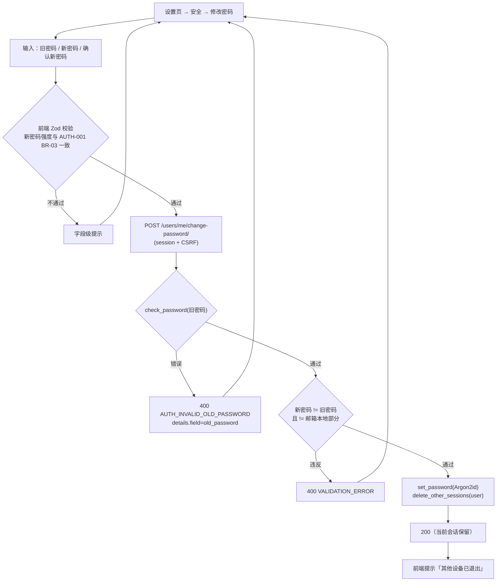
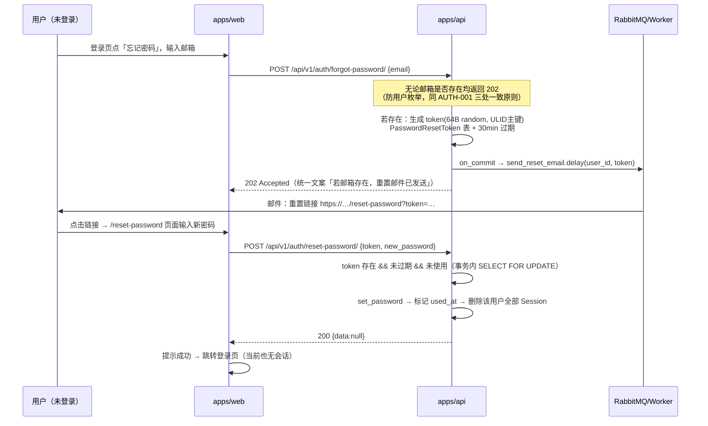
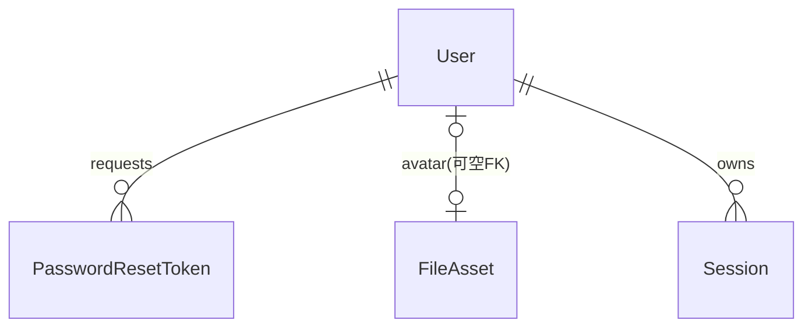

# 个人信息修改与密码重置

| 元信息项 | 内容 |
| --- | --- |
| 文档编号 | AUTH-004 |
| 所属迭代 | Sprint 1：MVP 能力补齐（第 3 周） |
| 优先级 | P1（MVP 必备级） |
| 所属模块 | M1-AUTH 账号与权限 |
| 文档状态 | 待评审（Draft） |
| 最后更新日期 | 2026-09-01 |
| 上游依据 | `docs/需求文档.md` §3.1（个人信息修改、头像、昵称、个人简介配置；忘记密码 / 重置密码） |
| 前置依赖 | `AUTH-001`（注册 / 登录 / Session 体系、`User` 模型基线）、`INFRA-004`（异常信封 / 日志）、`INFRA-002`（Celery + RabbitMQ、MinIO） |
| 下游依赖 | `TEAM-002`（邀请邮件复用发信通道）、`FILE-001`（头像上传复用 MinIO 直传通道）、`AUTH-010`（P3 SSO 登录后资料联动） |
| 架构基线 | [`api-conventions.md`](../architecture/api-conventions.md) §2.5（`PATCH /users/me/`、`forgot-password/`、`reset-password/` 契约已预定义）、§8.2（AUTH_* 错误码）；[`rbac-permission-model.md`](../architecture/rbac-permission-model.md) §2（`User` 字段基线） |
| 竞品参考 | Plane（`accounts/` 端点：profile 修改 + onboarding 状态 + 密码修改；头像走 FileAsset 关联）、Ones（企业密码策略：有效期 / 历史密码 / 强度配置） |

> **范围声明**：交付「个人资料修改（昵称 / 头像 / 简介）+ 修改密码 + 忘记密码邮件重置」。邮箱变更（需验证邮件往返确认，防账号劫持）、密码有效期策略（Ones 企业能力，P3 `AUTH-008`）、MFA（P3+）不在本范围。

---

## 1. 概述

### 1.1 功能定位

Sprint 0 刻意砍掉的个人账户三件套（POC 排除清单：忘记密码、头像上传、个人资料编辑）在本迭代补齐。这是「真实小团队可用」的最低账户体验——同事间需要头像与昵称识别彼此（`TASK-002` 指派人选择器、`COLLAB-001` @提及列表都消费头像），而忘记密码是自助服务的底线（否则 10 人团队每次忘密码都要找管理员改库）。

| 交付项 | 说明 |
| --- | --- |
| 个人资料修改 | `PATCH /api/v1/users/me/`：`display_name` / `first_name` / `last_name` / `intro`（个人简介，≤ 500 字） |
| 头像 | 默认首字母渐变头像（本地 SVG 生成，无外部依赖）+ 上传自定义头像（MinIO 预签名直传，≤ 2MB，仅图片 MIME） |
| 修改密码 | `POST /api/v1/users/me/change-password/`：旧密码校验 + 新密码强度校验 + 改后吊销其他会话 |
| 忘记密码 | `POST /api/v1/auth/forgot-password/`（发重置邮件）→ `POST /api/v1/auth/reset-password/`（令牌 + 新密码） |

### 1.2 目标用户

| 用户 | 场景 | 关注点 |
| --- | --- | --- |
| 全部用户 | 首次登录后完善昵称 / 头像 | 30 秒内完成；默认头像开箱即用 |
| 全部用户 | 忘记密码 | 全程自助，5 分钟内收到邮件并完成重置 |
| 安全审计视角 | 密码重置防劫持 | 重置链接一次性、短时效；重置后旧会话全部失效 |

### 1.3 前置依赖说明

| 依赖文档 | 依赖内容 | 缺失后果 |
| --- | --- | --- |
| `AUTH-001` | `User` 模型（`display_name` / `avatar` / `is_active`）、Argon2 哈希体系、Session 生命周期 | 无处落字段；重置后无法吊销会话 |
| `INFRA-004` | 统一错误码（`AUTH_INVALID_CREDENTIALS` 等）、Celery 投递约定 | 错误格式漂移 |
| `FILE-001` | MinIO 预签名直传三步流（头像上传为该通道的第一个轻量消费者，详见 §4.4 协同说明） | 头像上传走不通 |

### 1.4 竞品参考结论（详见第 6 章）

- **Plane**：`PATCH /api/users/me/` 修改 profile；头像本质是一张 `FileAsset`，前端上传后把 `avatar` 字段指向该资产 URL；无独立密码修改端点错误码细分（统一 400）。
- **Ones**：企业密码策略引擎（长度 / 复杂度 / 有效期 / 历史密码不可复用次数可配置），邮件模板可管理。
- **本系统**：资料与密码链路对齐 Plane；重置令牌采用「数据库一次性别 + 30 分钟时效 + 单击即焚」，强度校验复用 `AUTH-001` 的 Django validators，策略引擎后置 P3。

---

## 2. 业务逻辑

### 2.1 修改密码流程



### 2.2 忘记密码流程



### 2.3 头像策略状态机

```mermaid
stateDiagram-v2
    [*] --> default: 注册（AUTH-001）
    default --> default: 读取 /avatar.svg?seed=<id>&name=<首字符>
    default --> uploading: 申请头像直传（presign）
    uploading --> default: 上传失败/放弃（is_uploaded=false 的资产由清理任务回收）
    uploading --> custom: 完成确认 → User.avatar=资产URL
    custom --> default: 删除自定义头像
    custom --> uploading: 替换头像
```

### 2.4 业务规则表

| 编号 | 规则 | 判定位置 | 违反后果 |
| --- | --- | --- | --- |
| BR-01 | `display_name` 1~50 字符，去除首尾空白；`intro` ≤ 500 字符 | 前端 Zod + 后端 Serializer | 400 `VALIDATION_ERROR` / `TOO_LONG` |
| BR-02 | 资料字段与密码字段端点分离：`PATCH /users/me/` 不接受任何密码字段 | Serializer `fields` 白名单 | 出现在请求体中即 400 `INVALID`（防误改） |
| BR-03 | 头像文件 ≤ 2MB 且 MIME ∈ {image/png, image/jpeg, image/webp}；扩展名与 MIME 一致 | presign 时校验 + 完成确认时二次校验 | 400 `FILE_TOO_LARGE` / `FILE_TYPE_NOT_ALLOWED` |
| BR-04 | 修改密码：旧密码必验；新密码复用 `AUTH-001` BR-03/04 强度与弱密码规则；新旧不得相同 | 后端 | 400 `AUTH_INVALID_OLD_PASSWORD` / `VALIDATION_ERROR` |
| BR-05 | 修改密码成功后**保留当前会话**、吊销其余全部会话 | `SessionStore` 遍历删除 | — |
| BR-06 | 重置令牌：64 字节随机 urlsafe，DB 存 SHA-256 哈希；30 分钟过期；一次性（`used_at` 非空即拒绝） | `PasswordResetToken` 约束 | 400 `AUTH_RESET_TOKEN_INVALID` / `AUTH_RESET_TOKEN_EXPIRED` |
| BR-07 | 重置成功后吊销该用户**全部**会话与未用重置令牌 | 同事务 | — |
| BR-08 | `forgot-password` 恒返回 202 且文案不泄露邮箱存在性；限流 5 次/小时/IP | Throttle + Valkey | 429 `RATE_LIMIT_EXCEEDED` |
| BR-09 | 同一邮箱存在未过期令牌时再次申请：**作废旧令牌再发新令牌**（防邮件轰炸只保留最新一封可用） | Service 层 | — |
| BR-10 | 邮件发送失败：worker 重试 3 次（间隔 30s/120s/600s）后记 error 日志并放弃，用户可重新申请 | Celery `autoretry_for` | — |

### 2.5 异常处理表

| 异常场景 | 触发条件 | HTTP / 错误码 | 前端表现 | 后端处理 |
| --- | --- | --- | --- | --- |
| 旧密码错误 | `check_password` 失败 | 400 `AUTH_INVALID_OLD_PASSWORD` | 旧密码框红字 | 失败计数（不锁定，仅日志） |
| 令牌无效 | 不存在 / 已用 / 哈希不匹配 | 400 `AUTH_RESET_TOKEN_INVALID` | 提示重新申请 | — |
| 令牌过期 | `expires_at < now` | 400 `AUTH_RESET_TOKEN_EXPIRED` | 同上并附「重新发送」入口 | 定时任务清理过期行 |
| 头像超限 | > 2MB 或非法类型 | 400 `FILE_TOO_LARGE` / `FILE_TYPE_NOT_ALLOWED` | Toast + 文件选择器重置 | presign 前拦截 |
| 并发重置 | 两请求同时用同一令牌 | 一者 400，一者 200 | — | `select_for_update` 串行化 |

### 2.6 边界条件表

| 边界场景 | 限制值 | 超出处理方式 |
| --- | --- | --- |
| 单用户未过期重置令牌 | 1 个（BR-09） | 旧令牌立即作废 |
| 密码长度 | 8~128（同 `AUTH-001`） | 400 |
| 头像像素 | 服务端不裁剪，前端上传前统一压缩至 256×256 | 前端 `canvas` 压缩，超 2MB 拒绝选择 |
| 未读邮件堆积 | 邮箱不存在时静默 202 | 不发送、不记录该邮箱存在性日志 |

---

## 3. UI/UX 设计

### 3.1 页面布局

**个人设置页 `/settings/profile`**（二级页，左侧导航：个人资料 / 安全 / 通知偏好(P3 占位灰置)）：

| 区域 | 组件层级 | UI 组件 |
| --- | --- | --- |
| 头像卡 | 160px 圆形头像 + 悬浮「更换」遮罩 + 「恢复默认」文字按钮 | `Avatar` / `ImageUploader`（单文件、拖拽、2MB 约束） |
| 资料表单 | 昵称 / 名 / 姓 / 简介四字段 + 保存按钮（脏检查，无变更禁用） | `Form` + `TextArea`（简介，字数统计） |
| 安全区（`/settings/security`） | 修改密码三字段表单 | `PasswordInput`（可见性切换 + 强度条） |
| 忘记密码入口 | 登录页表单下方文字链 | — |
| 重置页 `/reset-password` | 仅新密码 + 确认两字段 | 复用注册页密码组件 |

### 3.2 交互细节表

| 交互动作 | 触发方式 | 反馈效果 | 加载态 / 空态 |
| --- | --- | --- | --- |
| 保存资料 | 点击保存 / ⌘S | SWR mutate 乐观更新 → 成功 Toast | 按钮 spinner；失败回滚并字段报错 |
| 上传头像 | 点击遮罩 / 拖拽文件 | 圆形进度环（直传进度）→ 完成后淡入新头像 | 失败保留旧头像 + Toast |
| 申请重置 | 提交邮箱 | 202 后无论真假均显示「邮件已发送，请查收（含垃圾箱提示）」 | 按钮 60s 冷却倒计时（防连点） |
| 令牌失效 | 打开重置页即预校验 | 直接呈现失效态 + 「重新申请」按钮，不展示表单 | — |

### 3.3 响应式与无障碍

- ≥ 768px 双栏（导航 + 内容），< 768px 单栏折叠导航；表单字段全宽。
- 密码输入框带 `aria-describedby` 指向强度提示；错误提示 `role="alert"`；头像上传含屏幕阅读器可用的隐藏 input。

---

## 4. 技术架构

### 4.1 数据模型

```python
class PasswordResetToken(BaseModel):
    """密码重置令牌 —— 一次性、短时效、存哈希不存明文。"""

    user = models.ForeignKey("db.User", on_delete=models.CASCADE, related_name="reset_tokens")
    token_hash = models.CharField(max_length=64, unique=True, verbose_name="SHA-256(令牌)")
    expires_at = models.DateTimeField(verbose_name="过期时间")
    used_at = models.DateTimeField(null=True, blank=True, verbose_name="使用时间")
    requested_ip = models.GenericIPAddressField(null=True, blank=True)

    class Meta(BaseModel.Meta):
        db_table = "password_reset_tokens"
        indexes = [models.Index(fields=["user", "expires_at"], name="idx_prt_user_exp")]
```

`User` 模型新增字段（一个可空列，P1 migration）：

```python
intro = models.CharField(max_length=500, blank=True, verbose_name="个人简介")
# display_name / avatar(FileAsset FK, 可空) 已在 AUTH-001 基线中存在
```



### 4.2 API 定义

| 方法/路径 | 描述 | 权限 |
| --- | --- | --- |
| `PATCH /api/v1/users/me/` | 修改资料（display_name/first_name/last_name/intro） | 已登录 |
| `POST /api/v1/users/me/avatar/presign/` | 申请头像直传 | 已登录 |
| `POST /api/v1/users/me/avatar/complete/` | 完成上传并设为头像 | 已登录 |
| `DELETE /api/v1/users/me/avatar/` | 恢复默认头像 | 已登录 |
| `POST /api/v1/users/me/change-password/` | 修改密码 | 已登录 + CSRF |
| `POST /api/v1/auth/forgot-password/` | 申请重置邮件 | 匿名 + 限流 |
| `POST /api/v1/auth/reset-password/` | 令牌重置密码 | 匿名 + 限流 |

**PATCH /users/me/ 示例**：

```json
// Request
{ "display_name": "梁工", "intro": "后端工程师，负责任务核心模块" }
// Response 200
{ "status": "success",
  "data": { "id": "6c7d…", "email": "liang@ex.com", "display_name": "梁工",
            "first_name": "", "last_name": "", "intro": "后端工程师，负责任务核心模块",
            "avatar_url": "https://minio…/avatars/6c7d….webp", "is_default_avatar": false,
            "updated_at": "2026-09-01T08:30:00.000Z" } }
```

**change-password 错误示例**：

```json
// Response 400
{ "status": "error",
  "error": { "code": "AUTH_INVALID_OLD_PASSWORD", "message": "旧密码不正确",
             "details": [{"field": "old_password", "code": "INVALID", "message": "旧密码不正确"}],
             "request_id": "01JBX…" } }
```

### 4.3 核心逻辑

```python
class PasswordService:
    def reset_password(self, *, token: str, new_password: str) -> None:
        token_hash = hashlib.sha256(token.encode()).hexdigest()
        with transaction.atomic():
            prt = (PasswordResetToken.objects
                   .select_for_update(skip_locked=True)
                   .filter(token_hash=token_hash, used_at__isnull=True, expires_at__gt=timezone.now())
                   .first())  # 无匹配 → 统一抛 AUTH_RESET_TOKEN_INVALID（不区分原因，防探测）
            if prt is None:
                raise AppException("AUTH_RESET_TOKEN_INVALID")
            validate_password(new_password, user=prt.user)          # 复用 AUTH-001 校验器
            prt.user.set_password(new_password)
            prt.user.save(update_fields=["password", "updated_at", "updated_by_id"])
            prt.used_at = timezone.now()
            prt.save(update_fields=["used_at"])
            delete_all_sessions(prt.user_id)                          # 全会话吊销
            PasswordResetToken.objects.filter(user=prt.user).exclude(pk=prt.pk).update(
                used_at=timezone.now())                               # 兄弟令牌作废
```

**并发策略**：令牌消费用 `select_for_update(skip_locked=True)`，并发双请求恰一成功一失败；「申请时作废旧令牌」（BR-09）在 `forgot-password` 的事务内完成。

### 4.4 前端状态管理

- `ProfileStore`（MobX）：`me`（来自 SWR `/users/me/` 的规范化数据）、`updateProfile` action（乐观更新 + 失败回滚）。
- 头像上传复用 `FILE-001` 的 `usePresignedUpload` hook（约束参数化：maxSize=2MB、accepts=images、onComplete 调 complete 端点）。
- 默认头像：`/api/v1/users/{id}/avatar.svg?seed={id}` 由后端即时生成 SVG（首字符 + 由 id 哈希决定的双色渐变），`Cache-Control: public, max-age=31536000, immutable`。

### 4.5 异步任务

```python
@shared_task(bind=True, max_retries=3, autoretry_for=(SMTPException,),
             retry_backoff=[30, 120, 600])
def send_reset_email(self, user_id: str, token: str) -> None:
    user = User.objects.get(pk=user_id)   # 只传 ID，Celery 不序列化对象
    link = f"{settings.WEB_BASE_URL}/reset-password?token={token}"
    send_mail(subject="重置你的 RabbitProjects 密码",
              message=f"30 分钟内有效，点击重置：{link}\n若非本人操作请忽略。", from_email=…, recipient_list=[user.email])
```

SMTP 未配置时（`INFRA-004` IT-05）：任务不抛异常，降级输出 `plane.app.mail` 日志，保证开发环境可用。

---

## 5. 测试用例

### 5.1 单元测试

| 用例 ID | 测试目标 | 输入 | 预期输出 | 覆盖类型 |
| --- | --- | --- | --- | --- |
| UT-01 | 资料 PATCH 白名单 | 请求体含 `password` 字段 | 400 `INVALID` | 安全 |
| UT-02 | intro 超长 | 501 字符 | 400 `TOO_LONG` | 边界 |
| UT-03 | 令牌哈希存储 | 创建令牌 | 库中无明文 token | 安全 |
| UT-04 | 旧令牌作废 | 连续两次 forgot-password | 仅第 2 枚可用 | 正常 |
| UT-05 | 令牌一次性 | 同令牌两次 reset | 第 2 次 400 | 边界 |
| UT-06 | 会话吊销 | 改密后旧 sessionid 请求 | 401 `AUTH_SESSION_EXPIRED`；当前会话仍 200 | 正常 |
| UT-07 | 忘记密码防枚举 | 存在 / 不存在邮箱各一次 | 两者 202 且响应体逐字节一致、耗时差 < 30ms | 安全 |
| UT-08 | 头像类型白名单 | `image/gif` | 400 `FILE_TYPE_NOT_ALLOWED` | 异常 |

### 5.2 集成测试

| 用例 ID | 场景 | 前置条件 | 操作步骤 | 预期结果 |
| --- | --- | --- | --- | --- |
| IT-01 | 完整重置流 | SMTP 为日志降级模式 | forgot → 从 worker 日志取链接 → reset → 登录 | 新密码可登录，旧密码 401 |
| IT-02 | 重置后其他设备登出 | 用户在两个 session | 重置密码 | 另一 session 下次请求 401 |
| IT-03 | 头像直传全链路 | MinIO 就绪 | presign → PUT → complete | 头像 URL 可 GET 且为公共缓存 |
| IT-04 | 并发消费令牌 | 同令牌并发 2 请求 | — | 恰一 200 一 400，无死锁 |
| IT-05 | 限流 | 同 IP 6 次 forgot | 第 6 次 | 429 + Retry-After |

### 5.3 E2E 测试

| 用例 ID | 用户场景 | 操作路径 | 验收标准 |
| --- | --- | --- | --- |
| E2E-01 | 完善资料 | 登录 → 设置 → 改昵称简介 → 刷新 | 值保持；右上角与评论处昵称同步更新 |
| E2E-02 | 自助重置 | 退出 → 忘记密码 → 收信 → 重置 → 新密码登录 | 全程 ≤ 5 分钟（本地 SMTP 降级即时） |
| E2E-03 | 修改密码踢出其他会话 | 浏览器 A 改密 | 浏览器 B 刷新即回登录页 |

---

## 6. 竞品深度对标

### 6.1 Plane 实现分析

`PATCH /api/users/me/` 更新 profile；头像 = 上传 `FileAsset` 后将 `user.avatar` 指向资产；密码修改内嵌在 accounts 端点族。**优势**：头像与附件体系统一，零特殊逻辑。**劣势**：`set-password` 类端点无「吊销其他会话」动作，安全面依赖 Session 过期自然淘汰。

### 6.2 Ones 实现分析

企业密码策略（有效期强制轮换、历史 N 次不可复用、锁定阈值管理端可配）+ 管理员代发重置邮件；邮件模板可视化配置。属管理员治理视角能力，依赖组织配置中心（本系统 P3 `AUTH-008` 自定义角色 / P4 `AUTH-011`）。

### 6.3 本系统设计决策

1. **采纳 Plane 的「头像即资产」**：头像上传是 `FILE-001` 直传通道的首个消费者，验证该通道可用性，为 P2 文件库铺路。
2. **补强 Plane 缺失的两点安全动作**：改密踢会话、重置踢全会话——会话吊销是账号安全事件的止损按钮，P1 成本低（遍历 Valkey session 索引）。
3. **令牌存哈希 + 单列存活性**：库被拖走也无法反推令牌；`select_for_update` 保证一次性语义，不依赖先查后改的竞态窗口。
4. **差异化价值**：Ones 级「自助 + 防枚举 + 一次性令牌」的重置体验在标准版即完备，不需要管理员介入。

---

## 7. 里程碑与验收

### 7.1 交付物清单

| 类型 | 交付物 |
| --- | --- |
| Model / Migration | `PasswordResetToken` 新表；`User.intro` 列；`FileAsset` FK 关联（`FILE-001` 定义） |
| API 端点 | §4.2 全部 7 个端点 |
| 前端页面 / 组件 | `/settings/profile`、`/settings/security`、`/forgot-password`、`/reset-password`；`Avatar`（含默认 SVG）、`PasswordInput` |
| Celery | `send_reset_email`（重试 3 次 + 降级） |
| 测试 | UT-01~08、IT-01~05、E2E-01~03 |

### 7.2 可操作演示的验收标准

1. 改昵称 / 头像 / 简介后，任务指派人选择器与评论区即时展示新身份。
2. 忘记密码 → 收到邮件 → 重置 → 新密码登录成功；旧密码与旧会话全部失效；同令牌第二次使用被拒绝。
3. 输入不存在的邮箱申请重置，响应与存在邮箱完全一致（抓包对比）。
4. 上传 3MB 文件被拒，提示文件过大；上传 png/jpg/webp 成功并即时生效。
