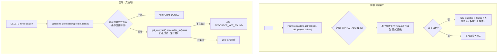

# 按钮级权限 + 接口二次鉴权

| 元信息项 | 内容 |
| --- | --- |
| 文档编号 | AUTH-005 |
| 所属迭代 | Sprint 1：MVP 能力补齐（第 3 周） |
| 优先级 | P1（MVP 必备级） |
| 所属模块 | M1-AUTH 账号与权限 |
| 文档状态 | 待评审（Draft） |
| 最后更新日期 | 2026-09-01 |
| 上游依据 | `docs/需求文档.md` §3.1（前端按钮级权限控制 + 后端接口二次鉴权 + 数据库行级过滤三重防护）、§五（接口层、数据层、UI 层三重权限校验，杜绝越权） |
| 前置依赖 | `AUTH-001`（会话）、`AUTH-003`（角色枚举 / `accessible_by()` / 三层防护骨架）、`INFRA-004`（错误信封） |
| 下游依赖 | `TEAM-002`（成员管理按钮）、`PROJ-002`（项目设置按钮）、`TASK-002/003`、`BOARD-002`（任务 / 看板操作按钮）；Sprint 2+ 所有新端点按本文档的矩阵扩展机制登记 |
| 架构基线 | [`rbac-permission-model.md`](../architecture/rbac-permission-model.md) §1（三重防护）、§4.4（PermissionGate 设计稿）、§5（Permission 类族 / 装饰器 / 权限矩阵）、§5.5（一致性校验）；[`api-conventions.md`](../architecture/api-conventions.md) §8.3（PERM_*） |
| 竞品参考 | Plane（`usePermissions` hook + EEG 权限矩阵包 + 后端 `allow_permission` 装饰器）、Ones（企业版细粒度权限点配置 + 字段级权限） |

> **范围声明**：交付「三重防护」中**第一层（UI 按钮级）的完整实现**与**第二层（API 二次鉴权）的矩阵化收口**。第三层（DB 行级过滤）已在 `AUTH-003` 交付，本文档只做集成回归。自定义角色 / 字段级权限 / 权限点管理 UI 属 P3（`AUTH-008` / `TASK-012`）。

---

## 1. 概述

### 1.1 功能定位

Sprint 0 已有「接口能拦住越权」，但没有「界面不出现无权操作」。两者体验差异巨大：普通成员看到「邀请成员」按钮、点下去却弹 403，会让 10 人团队的第一周使用充满挫败感。AUTH-005 把权限从「后端防线」升级为「前后端一致的显示契约」：

| 交付项 | 说明 |
| --- | --- |
| 权限下发端点 | `GET /api/v1/users/me/permissions/`：系统管理员标志 + 每工作空间角色 + 每项目角色（含继承来源） |
| 权限矩阵单一数据源 | `PERMISSION_MATRIX`（scope → permission → 所需最低角色）后端常量 + 前端 `@rp/constants` 同源生成 |
| 前端组件族 | `PermissionStore`（MobX）+ `usePermission` / `<PermissionGate>` / `PermissionRouteGuard` |
| 后端 Permission 类族 | `WorkspacePermission` / `ProjectPermission` / `IssuePermission` + `require_permission` 装饰器（`rbac-permission-model.md` §5 设计稿的完整实现） |
| 一致性守护 | CI 静态扫描：每个 `PermissionGate` 使用的权限点必须有对应后端 Permission 类 / 装饰器引用（成对检查） |

### 1.2 目标用户

| 用户 | 场景 | 关注点 |
| --- | --- | --- |
| 普通成员 | 日常操作 | 界面不诱导他做无权操作；被禁用的危险按钮有原因提示 |
| 团队 / 项目管理员 | 管理动作 | 设置入口齐全；不会误触超越自身等级的动作 |
| 开发者 | 新增功能 | 加一个按钮权限只需登记矩阵一行 + 两端同源常量，CI 防漏配

### 1.3 前置依赖说明

| 依赖文档 | 依赖内容 | 缺失后果 |
| --- | --- | --- |
| `AUTH-003` | `WorkspaceRole` / `ProjectRole` 整数枚举、`WS_OWNER/ADMIN` 隐式 `PROJ_ADMIN`、`accessible_by()` | 判定逻辑无依据 |
| `rbac-permission-model.md` §5 | Permission 基类 / 装饰器设计稿 | 本文 §4.3 为其完整落地 |

### 1.4 竞品参考结论（详见第 6 章）

- **Plane**：前端 `usePermissions` + `@plane/constants` 权限枚举；后端 `allow_permission("PERM_…")` 装饰器。前后端权限点靠人工同步，EE 版本按 workspace 订阅插拔权限。
- **Ones**：权限点可配置化（管理员勾选角色可见按钮）、字段级读写权限，企业治理能力强但配置复杂。
- **本系统**：P1 用「矩阵单一数据源 + CI 同源生成 + 成对扫描」达到 Plane 的易用性并消除其人工同步缺陷；Ones 式权限点可配置后置 P3。

---

## 2. 业务逻辑

### 2.1 权限判定总流程（一次「删除项目」按钮的渲染与调用）



### 2.2 P1 权限矩阵（核心子集）

矩阵是「权限点 → 所需最低角色」的声明，前后端同源。P1 全量矩阵以此为基础在各业务文档交付时登记追加：

| scope | 权限点 | 所需角色（取低者放行） | 后端守护 | 本迭代消费者 |
| --- | --- | --- | --- | --- |
| workspace | `workspace.settings.manage` | `WS_ADMIN` | ViewSet `permission_classes` | 设置页入口 |
| workspace | `workspace.member.invite` | `WS_ADMIN` | `@require_permission` | `TEAM-002` 邀请按钮 |
| workspace | `workspace.member.manage` | `WS_ADMIN` | 同上 | 移除 / 改角色按钮 |
| workspace | `workspace.member.leave` | `WS_MEMBER` | 同上（OWNER 禁退，业务层校验） | 退出团队按钮 |
| workspace | `workspace.ownership.transfer` | `WS_OWNER` | 同上 | 转让所有权按钮 |
| project | `project.read` | `PROJ_VIEWER` | `ProjectPermission.read_role` | 全部 |
| project | `project.update` | `PROJ_ADMIN` | 同上 write | 项目设置按钮 |
| project | `project.delete` | `PROJ_ADMIN` | 同上 | 删除项目（disable 态） |
| project | `project.member.manage` | `PROJ_ADMIN` | `@require_permission` | `PROJ-002` 成员管理 |
| project | `project.label.manage` | `PROJ_ADMIN` | 同上 | `TASK-002` 标签管理 |
| project | `issue.create` | `PROJ_CONTRIBUTOR` | `IssuePermission.write_role` | 新建任务 |
| project | `issue.update` | `PROJ_CONTRIBUTOR` | 同上 | 编辑任务 / 拖拽 |
| project | `issue.delete` | `PROJ_CONTRIBUTOR`（仅本人创建，对象级） | `IssuePermission.destroy` 定制 | 删除任务 |
| project | `issue.comment` | `PROJ_COMMENTER` | `CommentPermission` | `COLLAB-001` 评论框 |
| project | `issue.attachment.manage` | `PROJ_CONTRIBUTOR` | 同上 | `FILE-001` 附件区 |

> 矩阵扩展规则：Sprint 2+ 新增能力（如 `issue.bulk.update`、`view.save.team`）在对应功能文档的「交付物清单」中登记矩阵行，PR 必须同时含后端常量、前端常量（生成物）与守护代码，否则 CI 失败。

### 2.3 有效角色推导规则（业务规则表）

| 编号 | 规则 | 说明 |
| --- | --- | --- |
| BR-01 | 项目有效角色 = `max(显式 ProjectMember.role, 隐式提升)`；隐式提升：`WS_OWNER/WS_ADMIN` 视为 `PROJ_ADMIN` | `rbac-permission-model.md` §2.4 同款 |
| BR-02 | `SYSTEM_ADMIN` 在第二层全放行；第三层仍走 `accessible_by()`（系统管理员可见全部工作空间） | 与 `AUTH-003` 一致 |
| BR-03 | 权限判定只发生在服务端推导的会话用户上；请求体 / Header / Cookie 中的任何角色声明一律忽略 | 前端不可信原则 |
| BR-04 | 前端权限数据仅用于渲染，缓存有效期 5 分钟，且在 403 `PERM_DENIED` 发生时立即失效重拉 | 见 §2.4 失效策略 |
| BR-05 | `mode="disable"` 用于危险操作（删除类），`mode="hide"` 用于入口类（菜单 / 按钮）；路由级用 `PermissionRouteGuard` 重定向 403 页 | UX 约定 |
| BR-06 | 权限点未登记矩阵即使用 = CI 报错（前端 lint 规则 + 后端常量 KeyError） | 防裸字符串 |
| BR-07 | 对象级规则（如 `issue.delete` 仅限本人创建）在前端表现为 disable + 提示，在后端在 Permission / ViewSet 内二次判定 | 单层不足以表达 |

### 2.4 权限缓存与失效策略

| 事件 | 前端动作 | 时效 |
| --- | --- | --- |
| 登录 / 页面刷新 | SWR 拉取 `/users/me/permissions/`，写入 `PermissionStore` | — |
| 静默使用 | `revalidateOnFocus`（SWR 默认）+ `dedupingInterval 5min` | 5 min |
| 收到 403 `PERM_DENIED` | 拦截器调用 `permissionsMutate()` 强制重拉（管理员刚改了我的角色） | 即时 |
| 角色变更（自己操作成功，如接受邀请） | 对应 action 后主动 mutate | 即时 |
| 后端 | 不缓存（每次从成员表推导；查询为两条索引聚合，成本可忽略） | — |

> 不做 WebSocket 推送角色变更（P2 `COLLAB-004` 后可升级为推送失效）。

### 2.5 异常处理表

| 异常场景 | 触发条件 | HTTP / 错误码 | 前端表现 | 后端处理 |
| --- | --- | --- | --- | --- |
| 绕过前端直调管理接口 | `WS_MEMBER` POST invitations | 403 `PERM_DENIED` | （非正常路径）Toast | `require_permission` 抛出 |
| 权限点未登记 | 后端引用不存在 key | — | — | 启动期 / 测试期 `KeyError` 暴露 |
| 前后端矩阵不同源 | CI 扫描差异 | — | — | CI 失败并列出差异 |
| 资源不可见 | 访问他人项目 | 404 `RESOURCE_NOT_FOUND` | 404 空态 | 第三层过滤（`AUTH-003`） |
| 权限数据拉取失败 | 5xx | — | Gate 保守渲染为无权（fail-closed） | 重试后恢复 |

> **fail-closed 原则**：权限数据缺失时组件一律按「无权」渲染，宁可少显示，不可错放行。

### 2.6 边界条件表

| 边界场景 | 限制值 | 超出处理方式 |
| --- | --- | --- |
| 下发体积 | 用户加入 ≤ 50 工作空间 / ≤ 200 项目 | P1 无分页；超限时端点截断 + `meta.truncated=true`（预警） |
| 矩阵权限点数量 | P1 约 15 个 | 每新增 Sprint 由 CI 统计并写入架构文档附录 |
| 未登录拉取 permissions | — | 401 `AUTH_REQUIRED`（前端仅登录后调用） |

---

## 3. UI/UX 设计

### 3.1 组件层级与使用范式

```tsx
// 入口类：hide（不出现）
<PermissionGate permission="project.member.manage" resourceId={project.id}>
  <Button icon={<UserPlus/>} onClick={openMemberDrawer}>成员</Button>
</PermissionGate>

// 危险类：disable + 原因
<PermissionGate permission="project.delete" resourceId={project.id} mode="disable">
  <DangerButton onClick={confirmDeleteProject}>删除项目</DangerButton>
</PermissionGate>

// 区块级：fallback（降级视图）
<PermissionGate permission="workspace.member.manage" scope="workspace"
                fallback={<ReadOnlyMemberList/>}>
  <EditableMemberList/>
</PermissionGate>

// 路由级
<Route path="/:workspaceSlug/settings/members" element={
  <PermissionRouteGuard permission="workspace.member.manage" scope="workspace">
    <MembersSettingsPage/>
  </PermissionRouteGuard>} />
```

### 3.2 交互细节表

| 交互动作 | 触发方式 | 反馈效果 | 加载态 / 空态 |
| --- | --- | --- | --- |
| 无权按钮悬浮 | hover disabled 按钮 | Tooltip「当前角色无权执行此操作」 | — |
| 权限数据加载中 | 首屏 | Gate 渲染骨架占位（防闪烁误判） | 骨架 ≤ 300ms |
| 403 后权限刷新 | 拦截器触发 | 静默重拉；界面按钮显隐随之收敛 | 无感 |

### 3.3 无障碍要求

- disabled 按钮保留 `aria-disabled` 且可聚焦（Tooltip 可达）；hide 模式从 DOM 移除且不占焦点序。
- 403 路由页提供「返回工作台」链接，`role="alert"` 说明原因。

---

## 4. 技术架构

### 4.1 数据模型

无新增表。读取 `WorkspaceMember` / `ProjectMember` / `SystemAdmin`（`INFRA-003` 基线）。

### 4.2 API 定义

**`GET /api/v1/users/me/permissions/`**（契约与 `rbac-permission-model.md` §3.4 一致）：

```json
{
  "status": "success",
  "data": {
    "is_system_admin": false,
    "workspaces": {
      "3f2c8e1a-…": { "slug": "acme", "role": 15 }
    },
    "projects": {
      "9d8e…": { "workspace_id": "3f2c8e1a-…", "role": 15, "inherited": true }
    }
  },
  "meta": { "generated_at": "2026-09-01T08:00:00.000Z", "truncated": false }
}
```

`inherited=true` 表示该角色来自工作空间隐式提升（WS_OWNER/ADMIN），供前端展示「因工作空间管理员而具备」提示。实现要点：单次查询聚合 `WorkspaceMember` + `SystemAdmin` 存在性 + `ProjectMember`，再对 `role>=15` 的每个工作空间补齐隐式项目角色（无需扫项目表，仅标记 inherited 候选集）。

### 4.3 后端权限类族（`rbac-permission-model.md` §5 完整落地）

```python
# apps/api/plane/app/permissions/base.py（关键骨架）
class WorkspacePermission(BasePermission):
    read_role = WorkspaceRole.MEMBER
    write_role = WorkspaceRole.ADMIN

    def has_permission(self, request, view):
        if request.user.is_authenticated is False:
            raise NotAuthenticated()
        if SystemAdmin.objects.filter(user=request.user).exists():
            return True
        role = self._resolve_workspace_role(request)      # 从 URL slug → WorkspaceMember.role
        required = self.read_role if request.method in SAFE_METHODS else self.write_role
        if role is None or role < required:
            raise PermissionDeniedWithCode()
        return True


def require_permission(permission_key: str, scope: str = "project"):
    """动作型端点专用（invite/favorite/transfer 等），矩阵取需角色，重新推导实际角色。"""
    required = PERMISSION_MATRIX[scope][permission_key]   # KeyError = 未登记，测试暴露
    ...
```

```python
# apps/api/plane/constants/permissions.py —— 单一数据源
PERMISSION_MATRIX: dict[str, dict[str, int]] = {
    "workspace": {
        "workspace.member.invite": WorkspaceRole.ADMIN,
        "workspace.member.manage": WorkspaceRole.ADMIN,
        "workspace.member.leave": WorkspaceRole.MEMBER,
        "workspace.ownership.transfer": WorkspaceRole.OWNER,
        ...
    },
    "project": {
        "project.member.manage": ProjectRole.ADMIN,
        "project.label.manage": ProjectRole.ADMIN,
        "issue.comment": ProjectRole.COMMENTER,
        ...
    },
}
```

### 4.4 前端实现

```ts
// packages/constants/src/permissions.ts —— 由 scripts/gen-permissions.mjs
// 从后端 PERMISSION_MATRIX 源文件生成，禁止手改
export const PERMISSION_MATRIX = {
  workspace: { "workspace.member.invite": 15, /* … */ },
  project: { "issue.comment": 10, "project.delete": 20, /* … */ },
} as const;
export type PermissionKey = /* 生成联合类型 */;

// apps/web/stores/permission.store.ts（要点）
export class PermissionStore {
  me: PermissionsPayload | null = null;
  effectiveProjectRole(pid: string): number {
    const p = this.me?.projects[pid];
    if (!p) return -1;                       // fail-closed：未知 → 无任何权限
    return p.role;
  }
  can(permission: PermissionKey, scope: Scope, resourceId?: string): boolean {
    const required = PERMISSION_MATRIX[scope][permission];
    if (scope === "workspace") {
      const ws = resourceId ? this.me?.workspaces[resourceId] : undefined;
      return (ws?.role ?? -1) >= required;
    }
    return this.effectiveProjectRole(resourceId!) >= required;
  }
}
```

`usePermission(key, scope, resourceId)` = `useStore(PermissionStore).can(...)`；`PermissionGate` 按 §3.1 三模式渲染。

### 4.5 CI 一致性守护（成对检查）

| 检查 | 方式 | 失败表现 |
| --- | --- | --- |
| 矩阵同源 | `scripts/gen-permissions.mjs --check`：后端常量与前端生成物 diff | CI 失败 |
| 前端权限点已登记 | ESLint 自定义规则：`PermissionGate` 的 `permission` prop 必须属于 `PermissionKey` 联合类型 | 编译错误 |
| 后端守护成对 | 静态扫描：前端被引用的每个权限点 key 在后端仓库中出现于 `PERMISSION_MATRIX` 且被某 Permission 类 / 装饰器消费 | CI 列出「无守护权限点」 |
| 权限点 → 测试 | 单测参数化：对矩阵每个 key 至少一条 403 用例引用 | 覆盖率门禁 |

---

## 5. 测试用例

### 5.1 单元测试

| 用例 ID | 测试目标 | 输入 | 预期输出 | 覆盖类型 |
| --- | --- | --- | --- | --- |
| UT-01 | 隐式提升 | WS_ADMIN 未加入项目，推导项目有效角色 | `PROJ_ADMIN(20)` | 正常 |
| UT-02 | 下发结构 | 三角色用户请求 | workspaces/projects 键齐全，inherited 正确 | 正常 |
| UT-03 | 前端 fail-closed | me=null 时 can() | false | 异常 |
| UT-04 | 未登记权限点 | 后端引用 `"foo.bar"` | KeyError（测试期） | 防御 |
| UT-05 | 矩阵同源 | 前后端常量对比 | 集合与值全等 | 一致性 |
| UT-06 | 对象级删除 | CONTRIBUTOR 删他人创建任务 | 403 | 安全 |
| UT-07 | SYSTEM_ADMIN 放行 | 系统管理员调 workspace 端点 | 放行 | 正常 |

### 5.2 集成测试

| 用例 ID | 场景 | 前置条件 | 操作步骤 | 预期结果 |
| --- | --- | --- | --- | --- |
| IT-01 | 直调越权 | MEMBER 会话 | curl POST invitations | 403 `PERM_DENIED` 信封 |
| IT-02 | 降权后即时收敛 | 用户从 ADMIN 降为 MEMBER | 前端触发 mutate 后渲染 | 管理按钮消失 |
| IT-03 | 403 触发重拉 | 手工制造角色变更 | 前端继续点受限按钮 | 收到 403 → 自动重拉 → 按钮 hide |
| IT-04 | 权限数据截断 | 用户 201 个项目 | 请求 permissions | 200 项目 + `truncated:true` | 

### 5.3 E2E 测试

| 用例 ID | 用户场景 | 操作路径 | 验收标准 |
| --- | --- | --- | --- |
| E2E-01 | 普通成员看不到管理入口 | MEMBER 登录 → 项目页 | 无「成员管理 / 设置 / 删除」可见入口 |
| E2E-02 | 危险按钮禁用有因 | CONTRIBUTOR 打开项目设置 | 「删除项目」灰置 + Tooltip 原因 |
| E2E-03 | 直达路由拦截 | MEMBER 访问 `/:ws/settings/members` | 重定向 403 页 |
| E2E-04 | 越权请求被拦 | 用 MEMBER token curl 删除项目 | 403 信封（非前端路径） |

---

## 6. 竞品深度对标

### 6.1 Plane 实现分析

前端 `usePermissions`（EE 版为 `use flag` 体系）从 `user_permissions` API 拉取布尔集合；后端 `allow_permission` 装饰器按权限点放行。**优势**：权限点语义化、装饰器简洁。**劣势**：前端布尔集合由后端逐点计算并需与订阅计划（EE）耦合；前后端权限点清单靠人工维护，曾出现前端显示但后端未守护的漏网 issue。

### 6.2 Ones 实现分析

权限点管理界面化：管理员可按角色勾选可见按钮/字段，支持只读/隐藏/必填字段级权限与跨团队管控。强大但依赖其组织架构与配置中心体系，小团队配置成本高。

### 6.3 本系统设计决策

1. **矩阵单一数据源 + 生成**：权限点清单只写一次（后端常量），前端常量、TS 类型、CI 检查全部生成物——直接修复 Plane 的「人工同步漏网」缺陷。
2. **下发角色而非布尔**：下发的是数值角色 + 矩阵，新增权限点无需改下发端点（Plane 每加一个权限点要动 permissions 端点计算逻辑）。
3. **fail-closed**：权限态未知一律拒绝渲染，杜绝「数据没到先放行」窗口。
4. **差异化价值**：以 15 行矩阵 + 一个 Gate 组件的成本获得 Ones 级「所见即可做」的一致体验，且为 P3 自定义角色（矩阵阈值改为角色配置表查询）保留平滑升级路径——矩阵接口不变，只换数据来源。

---

## 7. 里程碑与验收

### 7.1 交付物清单

| 类型 | 交付物 |
| --- | --- |
| Model / Migration | 无 |
| API 端点 | `GET /api/v1/users/me/permissions/` |
| 后端 | `permissions/{base,project,issue}.py` 类族、`require_permission` 装饰器、`PERMISSION_MATRIX` 常量 |
| 前端 | `PermissionStore`、`usePermission`、`PermissionGate`、`PermissionRouteGuard`、403 路由页、`@rp/constants` 生成管线 |
| CI | 同源检查脚本 + ESLint 规则 + 成对扫描 + 矩阵参数化 403 测试 |
| 测试 | UT-01~07、IT-01~04、E2E-01~04 |

### 7.2 可操作演示的验收标准

1. MEMBER 账号界面无任何管理入口；token 直调 `POST …/invitations/` 得 403 信封。
2. ADMIN 把 MEMBER 提升为 ADMIN（`TEAM-002` 操作），该成员刷新后管理入口出现（≤ 5s）。
3. CONTRIBUTOR 看到灰置的「删除项目」并悬浮可见原因；删除他人任务被 403 拦截。
4. 人为制造前后端矩阵差异（改常量不重新生成），CI 立即失败并列出差异点。
