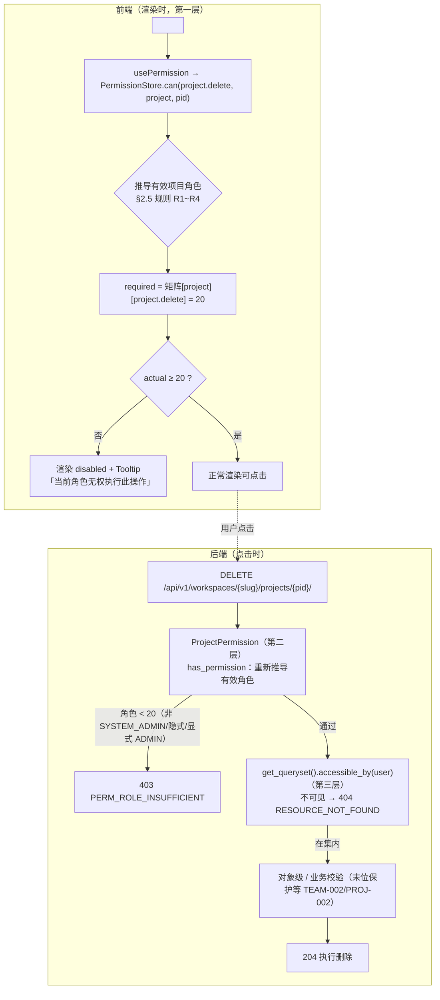
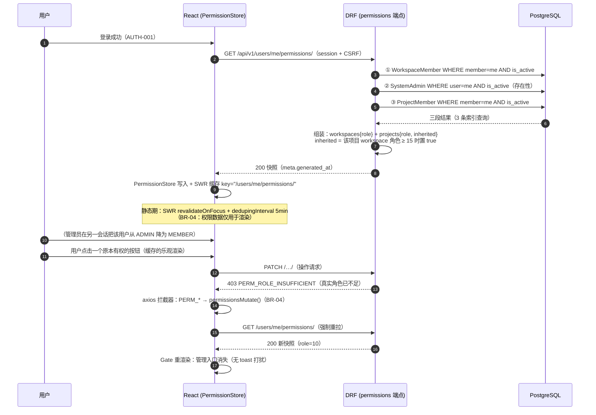
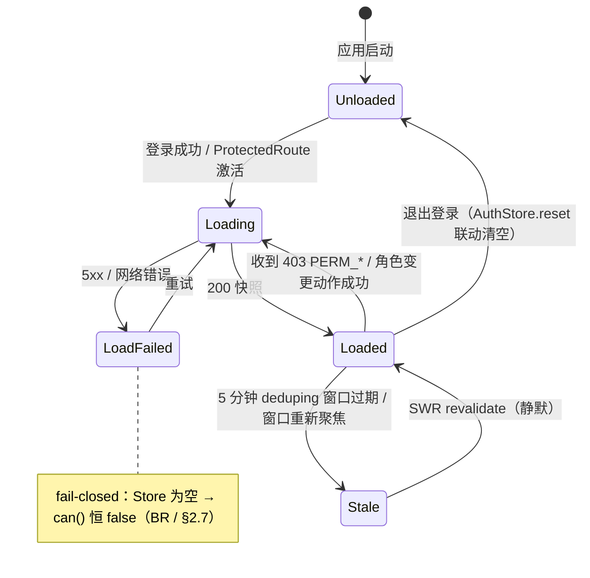
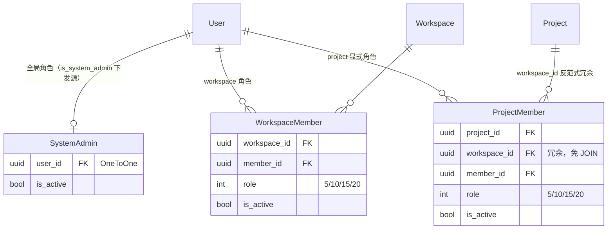

# 按钮级权限 + 接口二次鉴权

| 元信息项 | 内容 |
| --- | --- |
| 文档编号 | AUTH-005 |
| 所属迭代 | Sprint 1：MVP 能力补齐（第 3 周） |
| 优先级 | P1（MVP 必备级） |
| 所属模块 | M1-AUTH 账号与权限 |
| 文档状态 | 待评审（Draft） |
| 最后更新日期 | 2026-09-01 |
| 上游依据 | `docs/需求文档.md` §3.1（前端按钮级权限控制 + 后端接口二次鉴权 + 数据库行级过滤三重防护）、§五（接口层、数据层、UI 层三重权限校验，杜绝越权）、§8.2 账号权限 P1 列 |
| 前置依赖 | `AUTH-001`（会话体系、`/users/me/` 契约）、`AUTH-002`（路由拦截骨架与 `ProtectedRoute`）、`AUTH-003`（角色整数枚举 / `accessible_by()` / 三层防护骨架与 404 隐藏策略）、`INFRA-004`（错误信封）、`INFRA-001`（CI 管线挂载点） |
| 下游依赖 | `TEAM-002`（成员管理按钮）、`PROJ-002`（项目设置 / 成员按钮）、`TASK-002`（标签管理入口）、`TASK-003` / `BOARD-002`（列表与看板操作按钮）、`COLLAB-001`（评论框）、`FILE-001`（附件区）；**Sprint 2+ 所有新端点按本文档 §2.4 的矩阵登记机制扩展** |
| 架构基线 | [`rbac-permission-model.md`](../architecture/rbac-permission-model.md) §1（三重防护）、§2（角色体系与等级值）、§4（第一层设计稿）、§5（Permission 类族 / 装饰器 / 一致性校验）、§7（层级保护与绕过规则）、§8（完整权限矩阵，本文 P1 子集的权威来源）；[`api-conventions.md`](../architecture/api-conventions.md) §8.3（PERM_* 错误码）、§10.3（Permission 类约定）、§14（交付检查清单） |
| 竞品参考 | Plane（`usePermissions` hook + `@plane/constants` 权限枚举 + 后端 `allow_permission` 装饰器 + EEG 权限矩阵包）、Ones（权限点配置化 + 字段级权限 + 跨团队管控） |
| 工作量估算 | 后端 3 人日 / 前端 3 人日 / CI 与联调 1.5 人日，合计 **7.5 人日** |

> **范围声明**：交付「三重防护」中**第一层（UI 按钮级）的完整实现**与**第二层（API 二次鉴权）的矩阵化收口**，并把两层用「矩阵单一数据源 + 同源生成 + CI 成对检查」焊死。第三层（DB 行级过滤）已在 `AUTH-003` 交付，本文档只做集成回归（§5.2 IT-05）。自定义角色、字段级权限、权限点管理 UI 属 P3（`AUTH-008` / `TASK-012`）；WebSocket 推送角色变更失效属 P2（`COLLAB-004`）。

---

## 1. 概述

### 1.1 功能定位

Sprint 0 交付的是「接口能拦住越权」（`AUTH-003`：第二层雏形 + 第三层），但没有「界面不诱导越权」。两者的体验差异在第一天使用就会暴露：普通成员看到「邀请成员」按钮、点下去却弹 403 toast；看到「删除项目」红字、悬停没有任何解释——10 人团队的第一周会被这种「看得见做不到」的挫败感消耗掉。

AUTH-005 把权限从「后端防线」升级为「前后端一致的显示契约」：

1. **界面层**：无权的入口不出现（hide）、危险操作灰置并说明原因（disable）、区块降级为只读视图（fallback）、直达路由重定向 403 页（route guard）。
2. **接口层**：Permission 类族 + `require_permission` 装饰器按**权限矩阵**收口判定，矩阵是「权限点 → 所需最低角色等级」的声明式常量。
3. **一致性机制**（本文档的差异化核心）：矩阵只在后端常量里写一次；前端常量、TS 类型、ESLint 规则、CI 成对扫描全部是**生成物**。Plane 的前后端权限点靠人工同步、曾出现「前端显示但后端未守护」的漏网 issue——本系统用生成链路从机制上消灭这类缺陷。

| 交付项 | 说明 |
| --- | --- |
| 权限下发端点 | `GET /api/v1/users/me/permissions/`：系统管理员标志 + 每工作空间角色 + 每项目显式角色（含继承来源标记） |
| 权限矩阵单一数据源 | `PERMISSION_MATRIX`（scope → permission → 所需最低角色）后端常量；前端 `@rp/constants` 由脚本同源生成 |
| 前端组件族 | `PermissionStore`（MobX）+ `usePermission` + `<PermissionGate>`（hide / disable / fallback 三模式）+ `PermissionRouteGuard` + 403 路由页 |
| 后端类族落地 | `WorkspacePermission` / `ProjectPermission` / `IssuePermission` + `require_permission` 装饰器（`rbac-permission-model.md` §5 设计稿的完整实现） |
| 一致性守护 | CI 四道检查：矩阵同源 diff、ESLint 权限点类型约束、前后端成对扫描、矩阵参数化 403 测试（§4.6） |

### 1.2 三重防护与本迭代的位置

| 层级 | 位置 | 职责 | 状态 |
| --- | --- | --- | --- |
| 第一层｜UI | `usePermission` / `<PermissionGate>` / 路由守卫 | 按钮、菜单、路由的显示 / 隐藏 / 禁用 | ✅ **本文档完整交付** |
| 第二层｜API | DRF Permission 类 + `require_permission` | 「能不能执行这个操作」→ 403 | ✅ **本文档矩阵化收口**（`AUTH-003` 骨架升级） |
| 第三层｜DB | `accessible_by()` + `get_queryset()` | 「能看到哪些行」→ 404（隐藏存在性） | ✅ `AUTH-003` 已交付，本文集成回归 |

三层的**判定语义必须逐字一致**（尤其「WS_ADMIN 隐式 PROJ_ADMIN」这条绕过规则，`rbac-permission-model.md` §7.4）：同一用户同一资源，第一层显示按钮 ⇔ 第二层放行 ⇔ 第三层查得到行。任何一层偏离即产生「看得到点不了」或「点了 404」的割裂——一致性由 §4.6 的四道 CI 检查在机制层保证，而非靠评审自觉。

### 1.3 关键约定

#### 1.3.1 角色等级值（`rbac-permission-model.md` §2 权威定义）

| 层级 | 角色 | 等级值 | 判定语义 |
| --- | --- | --- | --- |
| 系统 | `SYSTEM_ADMIN` | 100 | 第二层全放行；第三层可见全部（仍走 `accessible_by`） |
| 系统 | `USER` | 0 | 无资源权限，实际权限由下两级决定 |
| 工作空间 | `WS_OWNER` | 20 | 完全控制（删除空间 / 转让所有权独占） |
| 工作空间 | `WS_ADMIN` | 15 | 完全管理；**隐式获得全部项目 `PROJ_ADMIN`** |
| 工作空间 | `WS_MEMBER` | 10 | 标准贡献者；仅能进入显式加入的项目 |
| 工作空间 | `WS_GUEST` | 5 | 只见显式加入的项目；项目角色上限 COMMENTER |
| 项目 | `PROJ_ADMIN` | 20 | 项目完全控制 |
| 项目 | `PROJ_CONTRIBUTOR` | 15 | 创建 / 编辑 / 上传；删除仅限本人创建 |
| 项目 | `PROJ_COMMENTER` | 10 | 只读 + 评论 |
| 项目 | `PROJ_VIEWER` | 5 | 纯只读 |

所有判定统一为 `actual >= required` 的一次整数比较；数值间留 5 的步长，为 P3 自定义角色（可插入 12、17 等中间等级）预留空间。

#### 1.3.2 同源链路（本文档的核心机制）

```
后端 PERMISSION_MATRIX（唯一手写处，Python 常量）
   │ scripts/gen-permissions.mjs --check（CI）
   ├──▶ 前端 @rp/constants/permissions.ts（生成物：矩阵 + PermissionKey 联合类型）
   │       ├──▶ ESLint 自定义规则：PermissionGate 的 permission prop 必须属于联合类型
   │       └──▶ PermissionStore.can() 运行时查表
   ├──▶ CI 成对扫描：前端引用的每个 key ⇔ 后端被 Permission 类 / 装饰器消费
   └──▶ 矩阵参数化测试：每个 key 至少一条 403 用例
```

### 1.4 范围边界

| 能力 | P1（本文档） | 后续 |
| --- | --- | --- |
| 权限快照端点 + 5 分钟缓存 + 403 触发重拉 | ✅ | P2 `COLLAB-004` 升级为 WebSocket 推送失效 |
| 矩阵单一数据源 + 生成 + 四道 CI 检查 | ✅ | — |
| hide / disable / fallback / 路由级四种控制形态 | ✅ | — |
| 对象级「仅本人」组合判定（`issue.delete.own`） | ✅ | — |
| 层级保护（不可管同级 / 上级）、末位 Owner 保护 | ❌ 属 `TEAM-002` / `PROJ-002` 业务层 | 本文矩阵已为其登记权限点 |
| 自定义角色（矩阵阈值 → 角色配置表查询） | ❌ | P3 `AUTH-008`（矩阵接口不变，只换数据来源） |
| 字段级权限（hidden / readonly / required） | ❌ | P3 `TASK-012` |
| 权限点管理 UI（按角色勾选） | ❌ | P3（Ones 对标） |
| 权限变更审计留痕 | ❌ 端点不写审计 | P3 `AUTH-010`（角色变更强制留痕） |

### 1.5 前置依赖

| 依赖文档 | 依赖内容 | 缺失后果 |
| --- | --- | --- |
| `AUTH-003` | `WorkspaceRole` / `ProjectRole` 整数枚举、`accessible_by()`、404 隐藏策略、Permission 骨架 | 判定逻辑无依据；三层语义漂移 |
| `AUTH-001` | Session 体系与 `/users/me/` 契约（permissions 端点挂其旁，同 `users/me` 单例语义） | 权限数据无承载会话 |
| `AUTH-002` | `ProtectedRoute` 与 401 分派（403 页复用其错误页骨架） | 路由级控制无挂载点 |
| `rbac-permission-model.md` §5 / §8 | Permission 类设计稿与完整权限矩阵 | 本文 §4.3 无实现蓝图；P1 子集无权威来源 |
| `INFRA-004` | 错误信封与 `PERM_*` 码收敛 | 403 响应格式漂移 |
| `INFRA-001` | CI 管线（lint / test / 脚本挂载点） | 四道检查无处执行 |

### 1.6 竞品参考

| 竞品 | 参考点 | 处置 |
| --- | --- | --- |
| Plane | 前端 `usePermissions` hook 从 `user_permissions` API 拉布尔集合；`@plane/constants` 维护权限枚举；后端 `allow_permission("PERM_…")` 装饰器按点放行；EE 版按 workspace 订阅插拔权限点 | 吸收「hook + 常量 + 装饰器」形态；**改为下发角色 + 前端查表**，并把人工同步换成生成链路（§6.3 D1/D2） |
| Ones | 权限点管理界面化（管理员按角色勾选按钮 / 字段可见性）、字段级读写、跨团队管控 | 配置化后置 P3；P1 用「固定矩阵 + 数值角色」达到「所见即可做」的一致体验（§6.3 D5） |

---

## 2. 业务逻辑

### 2.1 一次「删除项目」的渲染与调用（全链路总流程）



**关键不变量**：C 处的前端推导与 I 处的后端推导执行**同一套规则**（§2.5 R1~R4，两端各自实现但语义逐字对齐，由 §4.6 CI 守护）；且后端**绝不信任**任何前端传入的角色声明（BR-03）。

### 2.2 权限快照的下发、缓存与失效



### 2.3 权限数据生命周期状态机（前端视角）



### 2.4 P1 权限矩阵（单一数据源的核心切片）

矩阵取自 [`rbac-permission-model.md`](../architecture/rbac-permission-model.md) §8 全量矩阵的 **P1 交付子集**——本表是前后端共同实现的唯一依据；Sprint 2+ 新能力按行追加登记（见本节末扩展规则）。

**命名规范化说明**：早期草案中的 `issue.comment`、`issue.attachment.manage`、`workspace.ownership.transfer` 在本文定稿时归并为架构矩阵已登记键 `comment.create`、`file.upload`、`workspace.transfer`，避免同义双名导致前后端矩阵对不齐（`rbac-permission-model.md` §4.4 命名约定：统一 REST 动词，不引入别名）。

#### 2.4.1 workspace 域（scope="workspace"）

| 权限点 | 所需最低角色 | 后端守护 | 本迭代消费者（UI 形态） |
| --- | --- | --- | --- |
| `workspace.read` | `WS_GUEST`(5) | `WorkspacePermission`（read_role） | 全部页面基底（不单独设 Gate） |
| `workspace.update` | `WS_ADMIN`(15) | `WorkspacePermission`（write_role） | 空间设置入口（hide） |
| `workspace.setting.manage` | `WS_ADMIN`(15) | `@require_permission` | 全局标签 / 模板配置入口（hide，P2 `TEAM-003` 点亮） |
| `workspace.member.read` | `WS_MEMBER`(10) | `WorkspacePermission`（read_role） | 成员列表页（路由守卫） |
| `workspace.member.invite` | `WS_ADMIN`(15) | `@require_permission` | `TEAM-002`「邀请成员」按钮（hide） |
| `workspace.member.manage` | `WS_ADMIN`(15) + 层级保护 R2 | `@require_permission` + 业务层 `assert_can_manage_member` | 改角色菜单项（hide） |
| `workspace.member.remove` | `WS_ADMIN`(15) + 层级保护 R2 | `@require_permission` + 业务层 | 移除成员按钮（disable） |
| `workspace.member.leave` | `WS_MEMBER`(10) + 末位保护 R3 | `@require_permission` + 业务层 `assert_not_last_owner` | 退出团队按钮（hide；OWNER 灰置） |
| `workspace.transfer` | `WS_OWNER`(20) | `WorkspaceOwnerPermission` | 转让所有权按钮（disable + 二次确认） |
| `project.create` | `WS_MEMBER`(10)⚠R5 可配置 | `@require_permission` | 新建项目按钮（hide） |

#### 2.4.2 project 域（scope="project"）

| 权限点 | 所需最低角色 | 后端守护 | 本迭代消费者（UI 形态） |
| --- | --- | --- | --- |
| `project.read` | `PROJ_VIEWER`(5) | `ProjectPermission`（read_role） | 项目页基底 |
| `project.update` | `PROJ_ADMIN`(20) | `ProjectPermission`（write_role） | `PROJ-002` 项目设置入口（hide） |
| `project.delete` | `PROJ_ADMIN`(20) | 同上 + 业务层末位校验 | 删除项目（**disable**，危险操作示范位） |
| `project.member.manage` | `PROJ_ADMIN`(20) + 层级保护 R2 | `@require_permission` | `PROJ-002` 成员管理抽屉（fallback → 只读名单） |
| `project.label.manage` | `PROJ_ADMIN`(20) | `@require_permission` | `TASK-002` 标签管理入口（hide；`project.setting.manage` 的 P1 细分键） |
| `issue.create` | `PROJ_CONTRIBUTOR`(15) | `IssuePermission`（write_role） | 新建任务按钮 + 快速创建行（hide） |
| `issue.update` | `PROJ_CONTRIBUTOR`(15) | 同上 | 编辑任务 / 列表行内编辑（hide） |
| `issue.state.transition` | `PROJ_CONTRIBUTOR`(15) | 同上（action 级） | 看板拖拽 `isDragDisabled`（`BOARD-002`） |
| `issue.delete` | `PROJ_ADMIN`(20) | `IssuePermission.has_object_permission` | 任务删除菜单项（ADMIN 任意） |
| `issue.delete.own` | `PROJ_CONTRIBUTOR`(15) + 对象级 R1 | 同上（`obj.created_by == user`） | 任务删除菜单项（CONTRIBUTOR 仅本人，逐行组合判定） |
| `comment.create` | `PROJ_COMMENTER`(10) | `IssueCommentPermission`（write_role） | `COLLAB-001` 评论框（fallback → 「登录后可评论」占位 / VIEWER 隐藏） |
| `file.upload` | `PROJ_CONTRIBUTOR`(15) | `FilePermission`（write_role） | `FILE-001` 附件区上传按钮（hide） |

> **矩阵扩展规则**（写入 PR 模板）：Sprint 2+ 新增能力（如 `issue.bulk.update`、`view.create.shared`、`worklog.create`）必须在对应功能文档「交付物清单」登记矩阵行；PR 必须同时包含 ① 后端 `PERMISSION_MATRIX` 常量增量、② 重新生成的前端常量、③ 守护代码（Permission 类继承或装饰器引用）、④ 参数化 403 测试——四项缺一 CI 失败（§4.6）。

#### 2.4.3 对象级「仅本人」组合判定

`issue.delete`（任意）与 `issue.delete.own`（仅本人）是**两个独立 key**，UI 侧组合判定：

```typescript
export const useCanDeleteIssue = (issue: TIssueRow): boolean => {
  const canDeleteAny = usePermission("issue.delete", "project", issue.project_id);
  const canDeleteOwn = usePermission("issue.delete.own", "project", issue.project_id);
  const { root: { profile } } = useStore();
  return canDeleteAny || (canDeleteOwn && issue.created_by === profile.me?.id);
};
```

### 2.5 有效角色推导规则（业务规则表）

| 编号 | 规则 | 说明 / 违反后果 |
| --- | --- | --- |
| BR-01（R1 对象级） | 「仅本人」判定：`obj.created_by_id == request.user.id` | 前端 disable + 提示；后端 `has_object_permission` 二次判定 |
| BR-02（R2 层级保护） | 成员管理仅可作用于**低于**自己等级的成员；不可提升任何人到 ≥ 自己的等级 | 403 `PERM_ROLE_INSUFFICIENT`（业务层抛出；规则本体属 `TEAM-002`，本文矩阵登记） |
| BR-03 | 判定只发生在**服务端推导的会话用户**上；请求体 / Header / Cookie 中任何角色声明一律忽略 | 前端不可信原则（`rbac` §1.2） |
| BR-04 | 前端权限数据**仅用于渲染**，缓存 5 分钟（SWR deduping）；收到 403 `PERM_*` 立即失效重拉 | fail-closed 前提 |
| BR-05 | `mode` 选择约定：hide=入口类（菜单/主操作）；disable=危险操作（删除/转让，保留可见性以传达能力存在）；fallback=区块降级；路由级用 `PermissionRouteGuard` | UX 约定（§3） |
| BR-06 | 权限点未登记矩阵即使用 = 构建期失败（后端常量 `KeyError` 于测试暴露 + 前端 ESLint 编译错误） | 防裸字符串 |
| BR-07 | 快照端点不缓存（`Cache-Control: no-store`）；后端每次实时推导（3 条索引查询，成本可忽略） | 角色变更即时可感知 |
| BR-08 | `inherited=true` 仅作展示提示（「继承自工作空间管理员」），**不参与**判定数值——判定统一走「有效角色 = max(显式项目角色, 工作空间推导)」 | 防双口径 |
| BR-09 | 快照含 `is_system_admin=true` 时，前端 `can()` 短路放行（与后端第二层短路一致）；第三层仍走 `accessible_by` | 三层语义对齐 |
| BR-10 | fail-closed：Store 未加载 / 加载失败 / resourceId 未知 → `can()` 恒 `false`；宁可少显示，不可错放行 | 安全边界 |
| BR-11 | 权限数据拉取失败（5xx）时 Gate 渲染骨架占位 ≤ 300ms 后按无权处理 + 静默重试 | 防闪烁误判 |
| BR-12 | `PermissionRouteGuard` 判定失败重定向 `/403?required=<permission>`（记录上下文便于反馈），不静默白屏 | 可达性 |

### 2.6 权限缓存与失效策略

| 事件 | 动作 | 时效 |
| --- | --- | --- |
| 登录成功 / 页面刷新 | SWR 拉取 `/users/me/permissions/` 写入 Store | — |
| 静态使用 | `revalidateOnFocus` + `dedupingInterval: 5min` | 5 min |
| 收到 403 `PERM_*` | axios 拦截器 `permissionsMutate()` 强制重拉（§2.2 步骤 12~14） | 即时 |
| 自己的角色变更动作成功（接受邀请 / 被提升后刷新） | 对应 action 后主动 `mutate` | 即时 |
| 退出登录 | `AuthStore.reset()` 联动清空 PermissionStore + SWR cache | 即时 |
| 后端 | 不缓存，实时推导（BR-07） | — |
| P2 升级位 | `COLLAB-004` WebSocket `permission.changed` 事件 → 主动 mutate，替代 403 被动触发 | — |

### 2.7 异常处理表

| 场景 | HTTP | `error.code` | 前端表现 | 后端处理 |
| --- | --- | --- | --- | --- |
| 绕过前端直调管理接口（`WS_MEMBER` POST invitations） | 403 | `PERM_ROLE_INSUFFICIENT` | （非正常路径）局部提示，不弹全局 toast（`api-conventions.md` §8.9 分派约定） | `require_permission` 抛 `PermissionDeniedWithCode` |
| 权限点未登记即引用 | —— | —— | 编译错误（ESLint） | 测试期 `KeyError` 暴露（BR-06） |
| 前后端矩阵不同源 | —— | —— | —— | CI `--check` 失败并列差异（§4.6） |
| 权限点无后端守护（只有前端 Gate） | —— | —— | —— | CI 成对扫描失败，列出「无守护权限点」 |
| 资源不可见（他人项目 / 已删） | 404 | `RESOURCE_NOT_FOUND` | 404 空态 | 第三层过滤（`AUTH-003`） |
| 权限快照拉取失败 | 5xx | `SERVER_*` | Gate 骨架 300ms → 按无权渲染（fail-closed）+ 静默重试 | 正常错误信封 |
| 未登录拉取 permissions | 401 | `AUTH_REQUIRED` | 前端仅登录后调用（挂 `ProtectedRoute` 后） | — |
| 快照超截断阈值 | 200 | ——（`meta.truncated=true`） | 顶栏一次性提示「部分项目权限未同步，请刷新」 | 截断 + 标记（§2.8） |

### 2.8 边界条件表

| 编号 | 边界 | 期望行为 |
| --- | --- | --- |
| EC-01 | 用户加入 50 工作空间 / 200 项目以内 | 快照全量下发（P1 无分页） |
| EC-02 | 超过 200 项目 | 端点截断至 200 + `meta.truncated=true`（预警；P2 升级分页或按需查询） |
| EC-03 | 用户既是显式 `PROJ_CONTRIBUTOR` 又是 `WS_ADMIN` | 快照中该项目 `role=15, inherited=true`；判定取 max → 20（BR-08） |
| EC-04 | Gate 在权限数据未加载时渲染 | 骨架占位，不闪现按钮再消失（防「能力闪烁」） |
| EC-05 | 降权后 5 分钟窗口内用户仍见旧按钮 | 点击得 403 → 自动重拉 → 按钮收敛（§2.2 被动路径；P2 推送化） |
| EC-06 | `resourceId` 拼写错误 / 项目已删除 | Store 无该键 → fail-closed 判否（BR-10） |
| EC-07 | 矩阵权限点数量增长（P1 约 22 个） | 每新增一个 Sprint 由 CI 统计并回写架构文档 §8 附录（防矩阵无限膨胀无人知晓） |
| EC-08 | `SYSTEM_ADMIN` 访问普通成员视角 | 快照 `is_system_admin=true` → 全部 Gate 放行（BR-09）；与后端第二层短路一致 |

---

## 3. UI/UX 设计

### 3.1 组件族与使用范式

```tsx
// ① 入口类：hide（不出现）—— 邀请成员
<PermissionGate permission="workspace.member.invite" scope="workspace"
                resourceId={workspace.id}>
  <Button icon={<UserPlus />} onClick={openInviteModal}>邀请成员</Button>
</PermissionGate>

// ② 危险类：disable + 原因 —— 删除项目（保留可见性，传达「能力存在但当前角色不可用」）
<PermissionGate permission="project.delete" resourceId={project.id} mode="disable">
  <DangerButton onClick={confirmDeleteProject}>删除项目</DangerButton>
</PermissionGate>

// ③ 区块级：fallback（降级视图）—— 成员管理抽屉对非管理员降级为只读名单
<PermissionGate permission="project.member.manage" resourceId={project.id}
                mode="fallback" fallback={<ReadOnlyMemberList members={members} />}>
  <EditableMemberList members={members} />
</PermissionGate>

// ④ 路由级：守卫重定向
<Route path="/:workspaceSlug/settings/members" element={
  <PermissionRouteGuard permission="workspace.member.manage" scope="workspace">
    <MembersSettingsPage />
  </PermissionRouteGuard>
} />
```

**mode 决策树**（写入组件 Storybook 文档）：

```
该操作的失败后果是否不可逆（删除/转让/解散）？
 ├─ 是 → disable（用户需要知道「这个能力存在，但需要更高角色」）
 └─ 否 → 该入口对无权用户是否有认知价值？
     ├─ 无（纯管理入口，成员永远不该关心）→ hide
     └─ 有（如只读名单也有浏览价值）      → fallback
路由入口 → 一律 PermissionRouteGuard（直达 URL 必须有终点，不能白屏）
```

### 3.2 同一页面的两种渲染（项目头部的角色差异）

**`PROJ_ADMIN` 视角：**

```
┌────────────────────────────────────────────────────────────────────┐
│ ● RabbitProjects 研发                    [★收藏] [成员 8] [⚙ 设置] ⋯ │
│   RBT · 进行中 · 张三/李四 负责                                        │
│   [概览] [任务] [看板] [文件(P2)]                                     │
└────────────────────────────────────────────────────────────────────┘
                                                     ⋯ 菜单展开：
                                             ┌──────────────────────┐
                                             │ 复制项目链接           │
                                             │ ──────────────────  │
                                             │ 🗑 删除项目            │ ← 可点击，红色
                                             └──────────────────────┘
```

**`PROJ_CONTRIBUTOR` 视角（同一路由）：**

```
┌────────────────────────────────────────────────────────────────────┐
│ ● RabbitProjects 研发                    [★收藏] [成员 8]           │
│   RBT · 进行中 · 张三/李四 负责                                        │
│   [概览] [任务] [看板] [文件(P2)]                                     │
└────────────────────────────────────────────────────────────────────┘
  · [⚙ 设置] 与 ⋯ 菜单整体不渲染（hide——设置入口对贡献者无认知价值）
  · 任务页内「新建任务」「快速创建行」正常出现（issue.create ≥ 15 通过）
  · 任务行删除图标：本人创建的任务显示，他人的不显示（useCanDeleteIssue 组合判定）
```

**`PROJ_VIEWER` 视角**：新建 / 拖拽全部消失；看板卡片 `isDragDisabled`；评论区替换为「你以查看者身份访问此项目」占位条（`comment.create` fallback）。

### 3.3 403 路由页（`/403`）

```
┌──────────────────────────────────────────────┐
│                                              │
│              🛡  (shield-off, 96px)          │
│                                              │
│           没有访问该页面的权限                 │
│   当前角色不满足「workspace.member.manage」    │
│   所需的最低角色要求。                         │
│                                              │
│        [ 返回工作台 ]   [ 切换账号 ]           │
│                                              │
│   认为这是误判？请联系空间管理员检查你的角色。  │
└──────────────────────────────────────────────┘
```

- `required` 权限点经 URL 参数带入，页面将其渲染为权限点的**中文名**（`@rp/constants` 同源生成的 `PERMISSION_LABELS` 映射），不裸露英文 key。
- 「返回工作台」永远可用（工作台本身无权限门槛）；不提供「申请权限」动线（P1 无申请审批流）。

### 3.4 交互细节表

| 交互 | 触发 | 反馈 | 加载 / 空 / 失败态 |
| --- | --- | --- | --- |
| 无权 disabled 按钮悬浮 | hover | Tooltip「当前角色无权执行此操作」（可换文案 prop） | — |
| 权限数据加载中 | 首屏 / 路由切换 | Gate 渲染骨架占位（等宽等高，防布局跳动） | 骨架 ≤ 300ms（BR-11） |
| 403 后权限刷新 | 拦截器触发 | 静默重拉；按钮显隐随之收敛 | 无感（无 toast 打扰，`PERM_*` 分派约定） |
| 继承角色提示 | 成员列表中 inherited 行 | 名片徽标「继承自工作空间管理员」 | — |
| 截断提示 | `meta.truncated=true` | 顶栏一次性黄色条「部分项目权限未同步」+ 刷新按钮 | — |
| 权限点非法引用 | 开发期 | 编译错误，指向 `PermissionKey` 类型定义 | 构建失败（预期） |

### 3.5 响应式断点

| 断点 | 影响 |
| --- | --- |
| ≥ 1280px | 项目头操作按钮全量平铺 |
| 768 ~ 1279px | 「设置 / 成员」收入 ⋯ 菜单（Gate 仍在菜单项级生效） |
| < 768px | 403 页与设置页单栏；Gate 形态不变（逻辑与断点正交） |

### 3.6 无障碍要求（WCAG 2.1 AA）

| 项 | 实现 |
| --- | --- |
| disabled 按钮 | 包裹层 `aria-disabled="true"` 且**可聚焦**（Tab 可达，Tooltip 可被屏幕阅读器触发）；不使用原生 `disabled`（会移出 Tab 序并吞掉 Tooltip） |
| hide 模式 | 从 DOM 移除且不占焦点序（`null` 返回） |
| 403 页 | 主标题 `role="alert"`；焦点自动移至标题；「返回工作台」为默认焦点按钮 |
| 骨架占位 | `aria-busy="true"`，300ms 后转为无权渲染时 `aria-live="polite"` 播报一次 |
| 权限原因 Tooltip | 键盘聚焦即触发（focus + hover 双通道），非仅 hover |

---

## 4. 技术架构

### 4.1 数据模型

**零新增表、零 DDL**。读取 `INFRA-003` 既有三张表：



**索引设计说明**（全部 `INFRA-003` 既有，本迭代是核心消费者）：

| 索引 | 服务的查询 | 本迭代使用 |
| --- | --- | --- |
| `WorkspaceMember (member, workspace, role)` | 快照查询 ①：`WHERE member=me AND is_active` 单扫描取全部角色 | ✅ 核心 |
| `ProjectMember (member, project, role)` | 快照查询 ③：同上 | ✅ 核心 |
| `ProjectMember (member, workspace)` | （P2 行级过滤子查询用） | ⭕ 复用 |
| `SystemAdmin (user, is_active)` | 快照查询 ② 存在性 | ✅ 核心 |
| `WorkspaceMember (workspace, role)` | 成员列表按角色筛选（`TEAM-002` 消费） | 间接 |

快照端点固定 **3 条查询**，与用户加入的资源数无关（`values_list` 单表扫描），`assertNumQueries(3)` 写入测试（IT-02）。

### 4.2 API 定义

#### `GET /api/v1/users/me/permissions/`

| 项 | 约定 |
| --- | --- |
| 认证 | Session + CSRF（GET 免 CSRF 但保持同源调用） |
| 限流 | 60/min（已认证用户档，`api-conventions.md` §7.2） |
| 缓存 | `Cache-Control: no-store`（BR-07：实时性优先） |
| 权限 | `IsAuthenticatedAndActive`（L0）——本端点不设资源门槛 |

**成功响应 `200`**

```json
{
  "status": "success",
  "data": {
    "is_system_admin": false,
    "workspaces": {
      "3f2c8e1a-5d64-4f30-9b6c-77e1d2f3a4b5": { "slug": "acme", "role": 15 },
      "8a1d0b3e-7c92-4e5f-8b2a-1d4c6e8f0a2b": { "slug": "rabbitprojects", "role": 20 }
    },
    "projects": {
      "9d8e7f6a-1b2c-4d3e-8f9a-0b1c2d3e4f5a": {
        "workspace_id": "3f2c8e1a-5d64-4f30-9b6c-77e1d2f3a4b5", "role": 15, "inherited": true
      },
      "7b3e9c1a-4d5f-4a8b-9c2e-1f0a3b4c5d6e": {
        "workspace_id": "3f2c8e1a-5d64-4f30-9b6c-77e1d2f3a4b5", "role": 20, "inherited": false
      }
    }
  },
  "meta": { "generated_at": "2026-09-01T08:00:00.000Z", "truncated": false }
}
```

**字段说明**

| 字段 | 类型 | 说明 |
| --- | --- | --- |
| `is_system_admin` | bool | `SystemAdmin(user=me, is_active=True)` 存在性（BR-09 前端短路源） |
| `workspaces` | map<id, {slug, role}> | 全部 active 成员身份；`slug` 供路由上下文 → 工作空间解析 |
| `projects` | map<id, {workspace_id, role, inherited}> | **仅显式 `ProjectMember` 行**；`inherited=true` 表示该用户在此项目同时具备工作空间 ≥ ADMIN 身份（展示提示，不参与数值判定，BR-08） |
| `meta.truncated` | bool | 项目数 > 200 时截断（EC-02） |

> **为什么不枚举隐式项目角色**：`WS_ADMIN` 隐式获得**该工作空间下全部项目**的 `PROJ_ADMIN`——逐项目枚举需要扫描项目表且随项目增长膨胀快照。正确做法是下发「推导原料」（workspaces 角色 + slug），前端按 §4.5 的推导函数就地计算（与后端 `get_effective_project_role` 同一语义）。`inherited` 只是对**显式行**的叠加标注。

**错误响应 `401`（未登录）**

```json
{
  "status": "error",
  "error": {
    "code": "AUTH_REQUIRED",
    "message": "请先登录",
    "details": [],
    "request_id": "01JBX3K9Q7ZR4M8N2P5V6W7B01"
  }
}
```

**实现要点**（单请求三查询聚合）：

```python
# apps/api/plane/account/views.py（节选）
@action(detail=False, methods=["get"], url_path="permissions")
def permissions(self, request):
    user = request.user
    ws_rows = (WorkspaceMember.objects.filter(member=user, is_active=True)
               .values("workspace_id", "workspace__slug", "role"))
    is_admin = SystemAdmin.objects.filter(user=user, is_active=True).exists()
    proj_rows = (ProjectMember.objects.filter(member=user, is_active=True)
                 .values("project_id", "workspace_id", "role"))
    ws_role = {r["workspace_id"]: r["role"] for r in ws_rows}

    projects, truncated = {}, False
    for r in proj_rows[:200]:
        projects[str(r["project_id"])] = {
            "workspace_id": str(r["workspace_id"]),
            "role": r["role"],
            "inherited": ws_role.get(r["workspace_id"], 0) >= WorkspaceRole.ADMIN,  # BR-08
        }
    truncated = len(proj_rows) > 200                                            # EC-02
    return success_response({
        "is_system_admin": is_admin,
        "workspaces": {str(r["workspace_id"]): {"slug": r["workspace__slug"], "role": r["role"]}
                       for r in ws_rows},
        "projects": projects,
    }, meta={"generated_at": timezone.now().isoformat(), "truncated": truncated})
```

### 4.3 后端权限类族（`rbac-permission-model.md` §5 的完整落地）

#### 4.3.1 `WorkspacePermission` 基类

```python
# apps/api/plane/app/permissions/base.py
from rest_framework.permissions import BasePermission, SAFE_METHODS

from plane.db.models import SystemAdmin, WorkspaceMember, WorkspaceRole


class PermissionDeniedWithCode(PermissionDenied):
    """统一 403，错误码挂 code 属性，由全局异常处理器收敛为信封（rbac §5.5）。"""
    default_code = "PERM_ROLE_INSUFFICIENT"


def is_system_admin(user) -> bool:
    return SystemAdmin.objects.filter(user=user, is_active=True).exists()


class WorkspacePermission(BasePermission):
    """工作空间级基类：读 / 写分别声明最低角色（rbac §5.2 完整实现）。"""

    message = "当前角色无权执行此操作"
    code = "PERM_ROLE_INSUFFICIENT"

    read_role: int = WorkspaceRole.GUEST
    write_role: int = WorkspaceRole.ADMIN

    def get_workspace_slug(self, view) -> str | None:
        return view.kwargs.get("slug") or view.kwargs.get("workspace_slug")

    def get_workspace_role(self, request, view) -> int | None:
        slug = self.get_workspace_slug(view)
        if not slug:
            return None
        cache_key = f"_ws_role_{slug}"                  # 请求级缓存：单请求至多一查
        if not hasattr(request, cache_key):
            role = (WorkspaceMember.objects
                    .filter(workspace__slug=slug, member=request.user, is_active=True)
                    .values_list("role", flat=True).first())
            setattr(request, cache_key, role)
        return getattr(request, cache_key)

    def has_permission(self, request, view) -> bool:
        if not request.user or not request.user.is_authenticated:
            return False                                # → 401（认证层先行）
        if is_system_admin(request.user):
            return True                                 # BR-09 第二层短路
        role = self.get_workspace_role(request, view)
        if role is None:
            return False
        required = self.read_role if request.method in SAFE_METHODS else self.write_role
        if role < required:
            raise PermissionDeniedWithCode(self.message)   # 显式抛出以携带 code
        return True


class WorkspaceAdminPermission(WorkspacePermission):
    read_role = write_role = WorkspaceRole.ADMIN


class WorkspaceOwnerPermission(WorkspacePermission):
    read_role = write_role = WorkspaceRole.OWNER        # workspace.transfer 守护
```

#### 4.3.2 `ProjectPermission`（含隐式提升）

```python
# apps/api/plane/app/permissions/project.py
class ProjectPermission(WorkspacePermission):
    """项目级基类。判定顺序（短路，rbac §5.2）：
    1. SYSTEM_ADMIN → ADMIN；2. WS_OWNER/WS_ADMIN → 隐式 PROJ_ADMIN（§7.4 绕过）；
    3. 显式 ProjectMember 且 role ≥ 所需；4. 拒绝。"""

    read_role = ProjectRole.VIEWER
    write_role = ProjectRole.CONTRIBUTOR

    def get_project_id(self, view):
        return view.kwargs.get("project_id") or view.kwargs.get("pk")

    def get_effective_project_role(self, request, view) -> int | None:
        if is_system_admin(request.user):
            return ProjectRole.ADMIN
        ws_role = self.get_workspace_role(request, view)
        if ws_role is not None and ws_role >= WorkspaceRole.ADMIN:
            return ProjectRole.ADMIN                     # ★ 与前端推导逐字一致（§2.1）
        project_id = self.get_project_id(view)
        if not project_id:
            return None
        cache_key = f"_proj_role_{project_id}"
        if not hasattr(request, cache_key):
            role = (ProjectMember.objects
                    .filter(project_id=project_id, member=request.user, is_active=True)
                    .values_list("role", flat=True).first())
            setattr(request, cache_key, role)
        return getattr(request, cache_key)

    def has_permission(self, request, view) -> bool:
        if not request.user or not request.user.is_authenticated:
            return False
        role = self.get_effective_project_role(request, view)
        if role is None:
            return False
        required = self.read_role if request.method in SAFE_METHODS else self.write_role
        if role < required:
            raise PermissionDeniedWithCode(self.message)
        return True


class ProjectAdminPermission(ProjectPermission):
    read_role = write_role = ProjectRole.ADMIN
```

#### 4.3.3 `IssuePermission` 与对象级「仅本人」

```python
# apps/api/plane/app/permissions/issue.py
class IssuePermission(ProjectPermission):
    """任务级：COMMENTER 可读不可写；CONTRIBUTOR 的 destroy 仅限本人创建（rbac §5.3）。"""

    read_role = ProjectRole.VIEWER
    write_role = ProjectRole.CONTRIBUTOR

    def has_object_permission(self, request, view, obj) -> bool:
        role = self.get_effective_project_role(request, view)
        if role is None:
            return False
        if request.method in SAFE_METHODS:
            return role >= ProjectRole.VIEWER
        if role >= ProjectRole.ADMIN:
            return True
        if view.action == "destroy":                     # BR-01 对象级
            return role >= ProjectRole.CONTRIBUTOR and obj.created_by_id == request.user.id
        return role >= ProjectRole.CONTRIBUTOR


class IssueCommentPermission(IssuePermission):
    write_role = ProjectRole.COMMENTER                   # comment.create
    def has_object_permission(self, request, view, obj):
        role = self.get_effective_project_role(request, view)
        if role is None:
            return False
        if request.method in SAFE_METHODS:
            return True
        if role >= ProjectRole.ADMIN:
            return True
        return obj.actor_id == request.user.id           # 编辑/删除仅本人
```

#### 4.3.4 `require_permission` 装饰器（动作型端点）

```python
# apps/api/plane/app/permissions/decorators.py
from functools import wraps

from plane.constants.permissions import PERMISSION_MATRIX


def require_permission(permission_key: str, scope: str = "project"):
    """细粒度动作端点专用（invite / favorite / transfer 等）。

    矩阵取所需角色 → 重新推导实际角色 → 比较。KeyError = 未登记权限点，
    在测试期即暴露（BR-06）——这是「矩阵是唯一数据源」的运行时防线。
    """
    def decorator(func):
        @wraps(func)
        def wrapper(self, request, *args, **kwargs):
            required = PERMISSION_MATRIX[scope][permission_key]
            actual = resolve_effective_role(request, self, scope)   # 复用基类推导
            if actual is None or actual < required:
                raise PermissionDeniedWithCode(
                    f"缺少权限：{permission_key}（需要角色等级 ≥ {required}）")
            return func(self, request, *args, **kwargs)
        return wrapper
    return decorator
```

### 4.4 `PERMISSION_MATRIX` 单一数据源（后端常量）

```python
# apps/api/plane/constants/permissions.py —— ★ 全仓库唯一手写权限点清单
from plane.db.models import ProjectRole, WorkspaceRole

PERMISSION_MATRIX: dict[str, dict[str, int]] = {
    "workspace": {                                      # §2.4.1（P1 子集）
        "workspace.read":             WorkspaceRole.GUEST,
        "workspace.update":           WorkspaceRole.ADMIN,
        "workspace.setting.manage":   WorkspaceRole.ADMIN,
        "workspace.member.read":      WorkspaceRole.MEMBER,
        "workspace.member.invite":    WorkspaceRole.ADMIN,
        "workspace.member.manage":    WorkspaceRole.ADMIN,   # + R2 层级保护（业务层）
        "workspace.member.remove":    WorkspaceRole.ADMIN,   # + R2
        "workspace.member.leave":     WorkspaceRole.MEMBER,  # + R3 末位保护（业务层）
        "workspace.transfer":         WorkspaceRole.OWNER,
        "project.create":             WorkspaceRole.MEMBER,  # ⚠ R5 可配置（默认开）
    },
    "project": {                                        # §2.4.2（P1 子集）
        "project.read":             ProjectRole.VIEWER,
        "project.update":           ProjectRole.ADMIN,
        "project.delete":           ProjectRole.ADMIN,
        "project.member.manage":    ProjectRole.ADMIN,       # + R2
        "project.label.manage":     ProjectRole.ADMIN,
        "issue.create":             ProjectRole.CONTRIBUTOR,
        "issue.update":             ProjectRole.CONTRIBUTOR,
        "issue.state.transition":   ProjectRole.CONTRIBUTOR,
        "issue.delete":             ProjectRole.ADMIN,
        "issue.delete.own":         ProjectRole.CONTRIBUTOR, # + R1 对象级
        "comment.create":           ProjectRole.COMMENTER,
        "file.upload":              ProjectRole.CONTRIBUTOR,
    },
}

# 中文标签：同源生成到前端 PERMISSION_LABELS（403 页展示用，§3.3）
PERMISSION_LABELS: dict[str, str] = {
    "workspace.member.invite": "邀请成员", "workspace.member.manage": "管理成员角色",
    "workspace.member.remove": "移除成员", "workspace.transfer": "转让所有权",
    "project.update": "编辑项目设置", "project.delete": "删除项目",
    "project.member.manage": "管理项目成员", "project.label.manage": "管理项目标签",
    "issue.create": "创建任务", "issue.update": "编辑任务",
    "issue.delete": "删除任务", "issue.delete.own": "删除自己创建的任务",
    "comment.create": "发表评论", "file.upload": "上传文件",
    # …
}
```

> 矩阵阈值是**最低门槛**；R1~R3 的对象级 / 层级 / 末位约束在 Permission 类与业务层叠加（表中注释标注），二者是「门槛 + 附加规则」关系，不是替代关系。

### 4.5 前端实现

#### 4.5.1 `PermissionStore`（MobX）

```typescript
// packages/shared-state/src/stores/permission.store.ts
import { action, computed, makeObservable, observable, runInAction } from "mobx";
import { PERMISSION_MATRIX, ProjectRole, WorkspaceRole } from "@rp/constants";

export class PermissionStore {
  me: TPermissionsPayload | null = null;     // null = 未加载 / 加载失败 → fail-closed

  constructor(private root: RootStore) {
    makeObservable(this, {
      me: observable,
      isSystemAdmin: computed,
      hydrate: action,
      reset: action,
    });
  }

  get isSystemAdmin(): boolean { return this.me?.is_system_admin ?? false; }

  hydrate = (data: TPermissionsPayload) => runInAction(() => { this.me = data; });
  reset = () => runInAction(() => { this.me = null; });   // AuthStore.reset 联动

  /** 工作空间角色：优先 id 精确匹配，退化为当前路由 slug 解析 */
  workspaceRole(workspaceId?: string, workspaceSlug?: string): number {
    if (!this.me) return -1;
    if (workspaceId && this.me.workspaces[workspaceId])
      return this.me.workspaces[workspaceId].role;
    if (workspaceSlug)
      return Object.values(this.me.workspaces).find(w => w.slug === workspaceSlug)?.role ?? -1;
    return -1;
  }

  /** 有效项目角色 = max(显式 ProjectMember 角色, 工作空间推导) —— 与后端 get_effective_project_role 同语义 */
  effectiveProjectRole(projectId?: string, workspaceSlug?: string): number {
    if (!this.me) return -1;
    const explicit = projectId ? this.me.projects[projectId]?.role ?? -1 : -1;
    const wsId = projectId ? this.me.projects[projectId]?.workspace_id : undefined;
    const wsRole = this.workspaceRole(wsId, workspaceSlug);
    const derived = wsRole >= WorkspaceRole.ADMIN ? ProjectRole.ADMIN : -1;  // 隐式提升
    return Math.max(explicit, derived);
  }

  can(permission: PermissionKey, scope: Scope, resourceId?: string,
      ctx?: { workspaceSlug?: string }): boolean {
    if (this.isSystemAdmin) return true;                                    // BR-09
    const required = PERMISSION_MATRIX[scope][permission];                  // 生成物查表
    if (required === undefined) return false;
    const actual = scope === "workspace"
      ? this.workspaceRole(resourceId, ctx?.workspaceSlug)
      : this.effectiveProjectRole(resourceId, ctx?.workspaceSlug);
    return actual >= required;                                              // BR-10：-1 恒败
  }
}
```

> **路由上下文注入**：项目页内的 Gate 不必逐层传 `workspaceSlug`——`usePermission` 从 React Router 的 `useParams()` 就地取当前 `:workspaceSlug` 作为兜底 ctx，使「项目未在快照中（隐式成员）」也能正确推导（EC-03 反向场景）。

#### 4.5.2 `usePermission` / `<PermissionGate>` / `PermissionRouteGuard`

```tsx
// apps/web/core/hooks/use-permission.ts
export const usePermission = (permission: PermissionKey, scope: Scope = "project",
                              resourceId?: string): boolean => {
  const { root: { permission } } = useStore();
  const { workspaceSlug } = useParams();
  return permission.can(permission, scope, resourceId, { workspaceSlug });
};

// apps/web/core/components/permission/permission-gate.tsx
type GateMode = "hide" | "disable" | "fallback";
type Props = {
  permission: PermissionKey; scope?: Scope; resourceId?: string;
  mode?: GateMode; fallback?: React.ReactNode; reason?: string;
  children: React.ReactNode;
};

export const PermissionGate: React.FC<Props> = observer(({
  permission, scope = "project", resourceId, mode = "hide",
  fallback, reason = "当前角色无权执行此操作", children }) => {
  const { root: { permission: store } } = useStore();
  const allowed = usePermission(permission, scope, resourceId);

  if (store.me === null)                       // BR-11：加载中/失败 → 骨架（fail-closed 前置）
    return <GateSkeleton />;

  if (allowed) return <>{children}</>;
  if (mode === "hide") return null;
  if (mode === "fallback") return <>{fallback ?? null}</>;
  return (                                     // disable：可聚焦 + Tooltip 可达（§3.6）
    <Tooltip content={reason}>
      <div className="pointer-events-none opacity-50 inline-flex" aria-disabled="true" tabIndex={0}>
        {children}
      </div>
    </Tooltip>
  );
});

// apps/web/core/components/permission/permission-route-guard.tsx
export const PermissionRouteGuard: React.FC<
  { permission: PermissionKey; scope?: Scope; children: React.ReactNode }
> = ({ permission, scope = "project", children }) => {
  const allowed = usePermission(permission, scope);
  if (!allowed)
    return <Navigate to={`/403?required=${permission}`} replace />;   // BR-12
  return <>{children}</>;
};
```

### 4.6 同源生成与 CI 一致性守护（四道检查）

| # | 检查 | 方式 | 失败表现 |
| --- | --- | --- | --- |
| C1 | 矩阵同源 | `scripts/gen-permissions.mjs --check`：解析后端 `permissions.py` → 与 `@rp/constants/permissions.ts`（矩阵 + `PermissionKey` 联合类型 + `PERMISSION_LABELS`）逐项 diff | CI 失败，列出增 / 删 / 改差异 |
| C2 | 前端权限点类型约束 | ESLint 自定义规则 `no-unknown-permission`：`PermissionGate` / `usePermission` 的 `permission` prop 必须可赋值给 `PermissionKey`（联合类型外的字符串编译报错） | 编译错误（BR-06 前端侧） |
| C3 | 前后端成对 | 静态扫描：前端源码引用的每个 key，在后端必须存在于 `PERMISSION_MATRIX` **且**被某 Permission 类 `read_role/write_role` 语义覆盖或被 `@require_permission` 引用 | CI 列出「无守护权限点」清单 |
| C4 | 权限点 → 测试 | `tests/permissions/test_matrix.py` 参数化遍历矩阵：每个 key 至少一条「低角色 403 + 满足角色放行」用例（从矩阵自动生成用例 ID） | 覆盖率门禁失败（新增 key 无测试即红） |

```javascript
// scripts/gen-permissions.mjs（骨架）
// 1. 读取 apps/api/plane/constants/permissions.py（正则/AST 提取嵌套 dict 与角色常量值）
// 2. 渲染 packages/constants/src/generated/permissions.ts：
//    export const PERMISSION_MATRIX = { workspace: {...}, project: {...} } as const;
//    export type PermissionKey = keyof typeof PERMISSION_MATRIX["workspace"]
//                             | keyof typeof PERMISSION_MATRIX["project"];
//    export const PERMISSION_LABELS = {...} as const;
// 3. --check 模式：生成物与磁盘 diff，非零退出码并列出差异（C1）
// ⚠ 生成文件头部注入「禁止手改」横幅；CI 同时校验该横幅存在（防有人手改后删横幅）
```

### 4.7 性能预算

| 指标 | 预算 | 验证 |
| --- | --- | --- |
| 快照端点 P95 | ≤ 60ms（3 条索引查询 + 序列化） | IT-02 附带计时断言 |
| 快照响应体积 | 200 项目 ≈ 30KB（gzip 后 ≈ 4KB） | 一次性成本，5 分钟复用 |
| `can()` 单次判定 | ≤ 0.01ms（两次 map 查找 + 整数比较） | MobX computed 缓存，无重复计算 |
| 权限类后端判定增量 | ≤ 2 条查询/请求（请求级缓存后通常 1 条） | `assertNumQueries`（复用 `rbac` §6.4） |

---

## 5. 测试用例

覆盖率门禁：`plane/app/permissions/` 行覆盖 ≥ 90%（安全边界模块）。

### 5.1 单元测试（pytest + pytest-django）

| 编号 | 用例 | 断言 | 覆盖类型 |
| --- | --- | --- | --- |
| UT-01 | 隐式提升：`WS_ADMIN` 未加入项目 | `get_effective_project_role() == 20`；对应 Gate `can() == true` | 正常 |
| UT-02 | 快照结构：三身份用户（系统管理员候选 + 2 空间 + 2 项目） | `workspaces` / `projects` 键齐全；`inherited` 计算正确（EC-03） | 正常 |
| UT-03 | 前端 fail-closed：`me=null` | `can()` 恒 false（含 `workspace.read`） | 异常 |
| UT-04 | 未登记权限点：后端引用 `"foo.bar"` | `KeyError` 在测试期抛出（BR-06） | 防御 |
| UT-05 | 矩阵同源：构造前后端常量人为差异 | `--check` 非零退出并列出差异（C1） | 一致性 |
| UT-06 | 对象级删除：CONTRIBUTOR 删他人创建的任务 | `has_object_permission` False → 403 | 安全 |
| UT-07 | `SYSTEM_ADMIN` 放行：调 workspace 管理端点 | 第二层放行（BR-09） | 正常 |
| UT-08 | 快照 `no-store` | 响应头 `Cache-Control: no-store`（BR-07） | 契约 |
| UT-09 | 请求级缓存：同一请求两次 `get_workspace_role` | 仅 1 条 SQL（挂 `request` 属性验证） | 性能 |
| UT-10 | slug 兜底推导：项目不在快照、当前路由 slug 的工作空间角色 = 15 | `effectiveProjectRole() == 20`（EC-06 反例） | 边界 |
| UT-11 | 截断：201 个项目成员身份 | 返回 200 键 + `truncated=true`（EC-02） | 边界 |
| UT-12 | `PERMISSION_LABELS` 完备性 | 矩阵每个 key 都有非空中文标签（403 页不裸 key） | 契约 |

### 5.2 集成测试（DRF `APIClient`）

| 编号 | 场景 | 前置 | 步骤 | 断言 |
| --- | --- | --- | --- | --- |
| IT-01 | 直调越权 | `WS_MEMBER` 会话 | curl `POST …/invitations/` | 403 信封 `PERM_ROLE_INSUFFICIENT` + request_id |
| IT-02 | 快照三查询 | 用户 3 空间 10 项目 | `assertNumQueries(3)`；P95 ≤ 60ms | 查询数与资源数无关 |
| IT-03 | 降权即时收敛 | 用户 ADMIN→MEMBER（另一会话操作） | 前端 mutate 后渲染 | 管理按钮消失（Playwright 驱动） |
| IT-04 | 403 触发重拉 | 手工制造角色变更 | 继续点受限按钮 | 收 403 → 自动重拉 → 按钮 hide |
| IT-05 | 三层集成回归 | `WS_MEMBER` 访问非成员项目 | GET 项目详情 | 404 `RESOURCE_NOT_FOUND`（第三层，`AUTH-003` 契约不回归） |
| IT-06 | 装饰器守护 | CONTRIBUTOR 调 `@require_permission("project.label.manage")` 动作 | 403 `PERM_ROLE_INSUFFICIENT` | — |
| IT-07 | 对象级放行 | CONTRIBUTOR 删**本人**创建的任务 | DELETE | 204（UT-06 的正路径） |
| IT-08 | 未登录拉取 | 无 session | GET permissions | 401 `AUTH_REQUIRED` |

### 5.3 E2E 测试（Playwright）

| 编号 | 场景 | 步骤与断言 |
| --- | --- | --- |
| E2E-01 | 普通成员无管理入口 | MEMBER 登录 → 项目页 | 「设置 / 成员 / ⋯ 菜单」不可见；新建任务按钮**可见**（issue.create ≥ 15 通过） |
| E2E-02 | 危险按钮禁用有因 | CONTRIBUTOR 打开项目头 | 「删除项目」灰置、可聚焦、悬浮 Tooltip 出现原因文案 |
| E2E-03 | 直达路由拦截 | MEMBER 访问 `/:ws/settings/members` | 重定向 `/403?required=workspace.member.manage`；页面显示中文名「管理成员角色」 |
| E2E-04 | 越权请求被拦（接口侧） | 用 MEMBER storageState 直接 fetch 删除项目 | 403 信封（非浏览器 UI 路径） |
| E2E-05 | 隐式管理员视角 | WS_ADMIN（非项目成员）打开项目页 | 全部管理入口可见且操作成功（隐式提升三层一致） |

### 5.4 矩阵参数化安全测试（C4 生成）

| 编号 | 用例 | 断言 |
| --- | --- | --- |
| PT-01 | 遍历 `workspace` 域每个 key：`(角色=required-1)` 调对应端点 | 全部 403 `PERM_ROLE_INSUFFICIENT` |
| PT-02 | 遍历 `project` 域每个 key：同上 | 同上 |
| PT-03 | 遍历 `project` 域每个 key：`(角色=required)` | 全部非 403（放行或进入后续业务校验） |
| PT-04 | 对象级 key（`issue.delete.own`）：非本人资源 | 403（R1 叠加验证） |

---

## 6. 竞品深度对标

### 6.1 Plane 实现分析

| 维度 | Plane 的做法 | 事实依据 / 路径 | 本系统处置 |
| --- | --- | --- | --- |
| 前端判定 | `usePermissions` hook：从 `user_permissions` API 拉取**布尔集合**，组件内 `if (permissions.includes("PERM_…"))` | `apps/web/core/hooks/permissions.ts`（CE 版经 `use flag` / EEG `usePermissions`） | ✅ 保留 hook 形态；**改下发角色 + 前端查表**（D2） |
| 权限常量 | `@plane/constants` 维护权限点枚举与角色映射，前后端各一份 | `packages/constants/src/…` + `apps/api/plane/constants/…` | ⚠️ **改进**：后端单源 + 脚本生成前端（D1） |
| 后端守护 | `allow_permission("PERM_…")` 装饰器按点放行，Permission 类按 workspace/project 分层 | `apps/api/plane/app/permissions/base.py` | ✅ 装饰器 + 类族双形态沿用（`rbac` §5.4 三用法） |
| 一致性 | 前后端权限点清单**人工同步**；社区 issue 曾出现前端显示而后端未守护的漏网点 | GitHub Issues 历史 | ⚠️ 机制化修复：四道 CI 检查（D1/C3） |
| 订阅耦合 | EE 版权限点与 workspace 订阅计划绑定，`use flag` 体系插拔 | EE 代码路径 | ❌ P1 无计费分层，不引入 flag 体系（P3 许可证再评估） |

### 6.2 Ones 实现分析

Ones 的权限治理是「配置中心」形态：管理员在界面按角色**勾选**权限点（按钮可见性、字段 hidden/readonly/required）、自定义角色组跨项目复用、跨团队权限管控与 IP 白名单。其能力强的前提是组织架构 + 配置中心 + 审计体系三位一体——对小团队是「三倍的配置负担换一倍的管控收益」。本系统 P1 的判断：**固定矩阵 + 数值角色**已覆盖 10 人团队的全部真实场景（谁能管理、谁能贡献、谁能看），Ones 式配置化在多角色组织（PMO、外包、跨部门）出现真实需求时（P3）再引入——届时矩阵的**消费接口不变**（`can()` 与 `require_permission` 签名不动），只把查表来源从编译期常量换成 `CustomRole` 配置查询 + Redis 缓存（`rbac` §3.4 已预留模型）。

### 6.3 本系统设计决策记录

| 编号 | 决策 | 理由 | 代价 |
| --- | --- | --- | --- |
| D1 | 矩阵单一数据源 + 生成链路（后端常量 → 前端常量 / 类型 / 标签 / CI 检查） | 直接修复 Plane 的「人工同步漏网」缺陷；新增权限点从 4 处编辑降为 1 处 | 多一个生成脚本与「禁止手改」纪律（横幅 + CI 校验兜底） |
| D2 | 下发**角色数值 + 推导原料**而非逐点布尔 | 新增权限点无需改下发端点（Plane 每加一个点要动 permissions 计算逻辑）；快照体积与权限点数解耦 | 前端承担一次推导逻辑——用与后端逐字对齐的同一套规则换（C3 守护） |
| D3 | fail-closed（未知即拒绝） | 权限数据缺失的短暂窗口若放行，即产生真实越权；渲染层错杀的代价只是用户刷新一次 | 极端网络下界面保守（少显示），可接受 |
| D4 | 403 触发权限重拉而非仅报错 | 角色变更最常见于「管理员刚改了我」，被动 403 + 主动收敛 = 无需用户理解的自动修复 | 一次额外请求（仅发生一次，随后 5 分钟窗口稳定） |
| D5 | 危险操作 disable 而非 hide | 删除 / 转让类能力的**存在性**本身有信息价值（用户知道该找谁）；隐藏反而制造「系统没有这功能」的误解 | 界面多一个灰置元素（Tooltip 解释成本一次） |

---

## 7. 里程碑与验收

### 7.1 交付物清单

| 类型 | 交付物 |
| --- | --- |
| Model / Migration | 无（零 DDL） |
| API 端点 | `GET /api/v1/users/me/permissions/`（`no-store`，3 查询） |
| 后端 | `plane/app/permissions/{base,project,issue,comment,file}.py` 类族、`decorators.py`（`require_permission`）、`plane/constants/permissions.py`（矩阵 + 标签单一数据源）、异常处理器 PERM 收敛 |
| 前端 | `PermissionStore`、`usePermission`、`PermissionGate`（hide/disable/fallback + 骨架）、`PermissionRouteGuard`、`/403` 页、`useCanDeleteIssue` 组合判定、`@rp/constants` 生成管线 |
| CI | `gen-permissions.mjs --check`、ESLint `no-unknown-permission` 规则、成对扫描脚本、矩阵参数化测试生成器（C1~C4） |
| 测试 | UT-01~12、IT-01~08、E2E-01~05、PT-01~04 |

### 7.2 可操作演示的验收标准

| 编号 | 验收项 | 通过标准 |
| --- | --- | --- |
| AC-01 | 成员视角所见即可做 | MEMBER 界面无任何管理入口且**无 403 发生**；用其会话直调 `POST …/invitations/` 得 403 信封（双端验证） |
| AC-02 | 角色提升即时生效 | ADMIN 把 MEMBER 提升为 ADMIN（`TEAM-002` 操作），该成员刷新（或触发一次 403 后自动重拉）后管理入口出现，≤ 5s |
| AC-03 | 危险按钮可解释 | CONTRIBUTOR 见灰置「删除项目」，键盘可聚焦、Tooltip 说明原因；删除他人任务 403、删本人任务 204（R1） |
| AC-04 | 直达路由有终点 | MEMBER 直达 `/:ws/settings/members` → `/403` 页显示中文权限名 + 可返回工作台 |
| AC-05 | 隐式提升三层一致 | WS_ADMIN（非项目成员）项目页全功能可用；接口侧同样放行；快照中无该项目行（推导路径生效） |
| AC-06 | 一致性守护可演示 | 人为制造前后端矩阵差异（改常量不重新生成）→ CI 立即失败并列出差异点；删掉某 key 的守护引用 → 成对扫描失败 |
| AC-07 | fail-closed 可验证 | 断网模拟快照失败 → 界面按无权渲染（无管理入口闪现）→ 恢复后重试自动收敛 |
| AC-08 | 契约合规 | 全部 403 用 §8.3 已登记码（`PERM_ROLE_INSUFFICIENT` / `PERM_DENIED`）；矩阵 22 个 key 的 PT 参数化测试全绿（C4） |

---

## 附录 A：与架构文档的一致性对照

| 架构约束 | 出处 | 本文档落点 |
| --- | --- | --- |
| 三重防护分层与 403/404 分工 | `rbac-permission-model.md` §1.1 | §1.2、§2.1 |
| 角色等级值（20/15/10/5 × 双域）与整数比较语义 | §2 | §1.3.1 |
| 快照端点契约（`/users/me/permissions/` 含 `inherited`） | §4.1 | §4.2（含「不枚举隐式角色」的实现论证） |
| 权限矩阵单一数据源 / `PermissionKey` 命名约定（不引入别名） | §4.2 | §1.3.2、§2.4（含命名规范化说明）、§4.4 |
| `usePermission` / `PermissionGate` 三模式设计稿 | §4.3 / §4.4 | §3.1、§4.5.2 |
| Permission 类层级 / 基类实现 / 请求级缓存 | §5.1 / §5.2 | §4.3.1~4.3.3 |
| `require_permission` 装饰器三用法之（c） | §5.4 | §4.3.4 |
| CI 一致性校验（矩阵三处齐备） | §5.5 | §4.6 四道检查（C1~C4，含测试维度扩展） |
| WS_OWNER/ADMIN 隐式 PROJ_ADMIN 绕过 | §7.4 | §2.5 推导规则、§4.3.2、E2E-05 |
| 完整权限矩阵（P1 子集的权威来源） | §8.1 / §8.2 | §2.4.1 / §2.4.2 |
| 受限项 R1~R10 判定说明 | §8.4 | §2.5 BR-01~03 对应 R1~R3 |
| `PERM_*` 错误码族与 `PERM_ROLE_INSUFFICIENT` | `api-conventions.md` §8.3 | §2.7、§4.3.1 |
| `PERM_*` 不弹全局 toast、交由局部渲染 | §8.9 | §2.7、§3.4 |
| 新增受权限资源的 7 步清单 | `rbac` 附录 B | §2.4 矩阵扩展规则（PR 模板化） |
