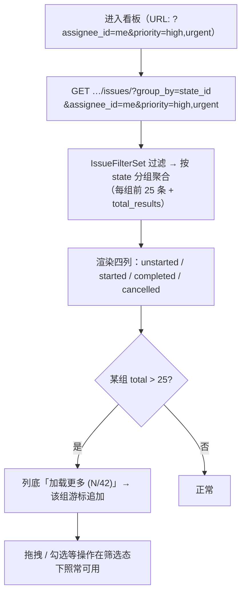
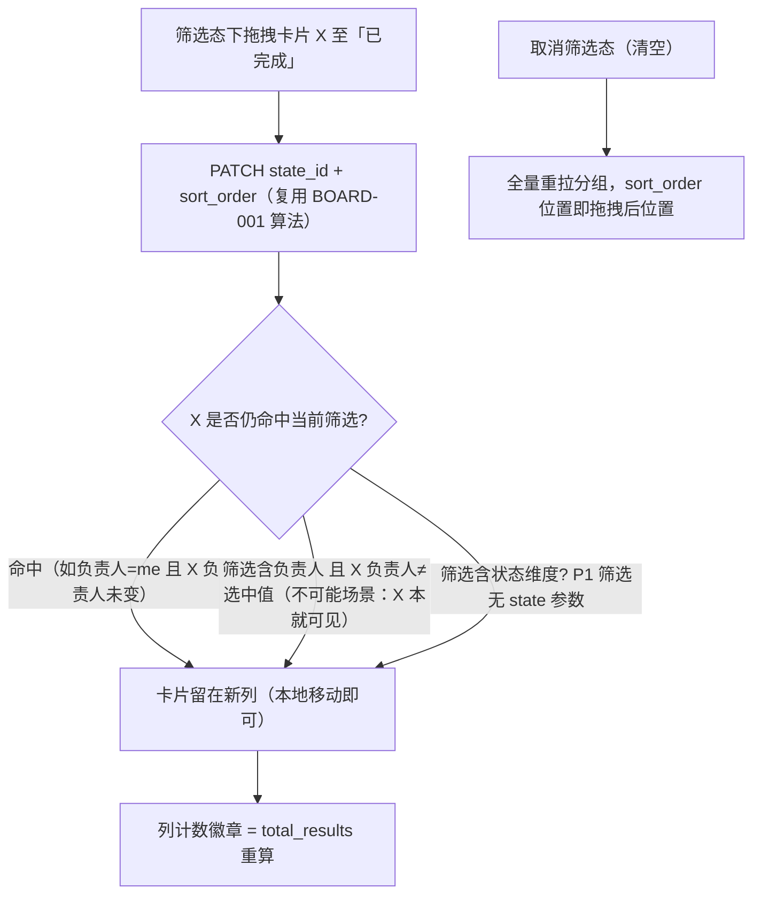

# 看板筛选与卡片悬浮预览

| 元信息项 | 内容 |
| --- | --- |
| 文档编号 | BOARD-002 |
| 所属迭代 | Sprint 1：MVP 能力补齐（第 3 周） |
| 优先级 | P1（MVP 必备级） |
| 所属模块 | M5-BOARD 看板视图 |
| 文档状态 | 待评审（Draft） |
| 最后更新日期 | 2026-09-01 |
| 上游依据 | `docs/需求文档.md` §3.5（卡片悬浮预览、弹窗详情编辑；看板筛选：按人 / 优先级 / 标签 / 时间筛选）、§8.2 看板 P1 列 |
| 前置依赖 | `BOARD-001`（固定三列看板 / 拖拽 / 分组端点）、`TASK-002`（卡片字段 / 标签 / 计数）、`TASK-003`（筛选参数语义）、`INFRA-004` |
| 下游依赖 | `BOARD-003/004`（P2 多看板与批量操作）、`TASK-011`（P2 视图保存把筛选状态升级为持久视图）、`COLLAB-004`（P2 WebSocket 后筛选态实时刷新） |
| 架构基线 | [`api-conventions.md`](../architecture/api-conventions.md) §4.1（分组列表响应 `group_by`）；[`unified-issue-model.md`](../architecture/unified-issue-model.md) §2.6（`State.group` 五语义组——本迭代开放 `cancelled` 第四列） |
| 竞品参考 | Plane（看板 filters（优先级/标签/负责人/状态）+ 卡片 hover peek 弹层）、Ones（企业看板筛选与视图模板） |

> **范围声明**：交付看板顶部筛选（负责人 / 优先级 / 标签 + 截止时间）、卡片悬浮预览（Hover Peek）、「已取消」第四列开放。多看板 / 列自定义 / 批量操作 / 视图保存 / 多维度分组（P2/P3）不在范围。

---

## 1. 概述

### 1.1 功能定位

看板是 POC 演示的主角，但 P0 的看板「只能拖」。P1 让看板成为日常作战屏：按人找自己的卡、按优先级聚焦紧急项、悬浮卡片不点开即知全貌。同时把 P0 已种子的第四态「已取消」开放为第四列，让「不做了」的任务有明确去处（P0 只能删除或留在三列中错位）。

| 交付项 | 说明 |
| --- | --- |
| 看板筛选 | 顶部筛选条：负责人（多选）/ 优先级（多选）/ 标签（多选）/ 截止时间（区间，复用 `TASK-003` 语法）；语义与列表完全一致（同参 OR / 跨参 AND）；URL query 同步 |
| 分组端点扩展 | `?group_by=state_id` 分组查询叠加全部 P1 筛选参数（P0 仅支持裸分组） |
| 第四列开放 | 看板渲染 `group=cancelled` 状态列（四列：待办 / 进行中 / 已完成 / 已取消）；拖入即置状态 `cancelled` |
| 卡片悬浮预览 | hover ≥ 400ms 弹出 peek 层：描述摘要（stripped 前 200 字）、全部标签、子任务 n/m 进度条、附件数（`FILE-001` 上线后生效）、开始 / 截止、创建人 / 时间 |
| 卡片信息补全 | P0 卡片（标题 + 负责人 + 截止）升级为 `TASK-002` 全字段卡片（类型色条 / 优先级 / 标签 / 计数） |

### 1.2 目标用户

| 用户 | 场景 | 关注点 |
| --- | --- | --- |
| 成员 | 站会前 | 按自己筛出四列卡片，30 秒汇报素材 |
| 管理员 | 排查风险 | 高优 + 逾期卡片聚焦；悬浮看详情不动上下文 |
| 全体 | 取消任务 | 拖入「已取消」而非删除，保留记录 |

### 1.3 前置依赖说明

| 依赖文档 | 依赖内容 | 缺失后果 |
| --- | --- | --- |
| `BOARD-001` | 分组端点 / `sort_order` 拖拽 / 乐观更新骨架 | 无承载 |
| `TASK-002` | 卡片字段（类型 / 优先级 / 标签 / 计数）与值域端点 | 卡片无内容可显 |
| `TASK-003` | `IssueFilterSet`（本迭代直接复用注入分组查询） | 筛选语义漂移 |

### 1.4 竞品参考结论（详见第 6 章）

- **Plane**：看板 `display filters`（优先级 / 标签 / 负责人 / 周期）+ 卡片 hover peek（Canvas 内预览卡）。
- **Ones**：看板筛选可存视图模板（P2 对齐），企业版支持多维度分组（P3）。
- **本系统**：筛选语义与列表 / P2 筛选器单源复用（一个 `IssueFilterSet` 三处消费），这是比两家竞品更彻底的「一处定义、处处一致」。

---

## 2. 业务逻辑

### 2.1 筛选态看板加载流



### 2.2 拖拽与筛选共存规则



> P1 看板筛选**刻意不含状态维度**（列本身即状态分组，筛状态 = 隐藏列，语义混淆）；「隐藏某列」是 P2 `BOARD-003` 视图配置（`hidden_columns`）的范围。

### 2.3 悬浮预览（Hover Peek）行为

| 参数 | 值 | 说明 |
| --- | --- | --- |
| 触发延迟 | 400ms hover | 防扫视误弹 |
| 关闭时机 | 移出卡片与 peek 层 / Esc | peek 层可 hover 进入（内含滚动） |
| 定位 | 卡片右侧锚定，越界自动翻转 | — |
| 内容 | 描述 stripped 前 200 字 +「展开」进详情 | 打点进详情页 |
| 数据来源 | 卡片对象自带字段（无额外请求）；附件数用计数列 | 零请求 peek |

### 2.4 业务规则表

| 编号 | 规则 | 判定位置 | 违反后果 |
| --- | --- | --- | --- |
| BR-01 | 看板筛选参数域 = `TASK-003` 全集减 `state_id`；语义同参 OR / 跨参 AND | FilterSet 复用 | 400 |
| BR-02 | 分组响应结构遵循 `api-conventions.md` §4.1 分组信封（每组 `results/total_results`，首屏每组 25） | 序列化 | — |
| BR-03 | 四列渲染顺序固定：`unstarted → started → completed → cancelled`；列 = 项目 `State` 表中对应 `group` 的默认态行（P0 种子） | 前端 | — |
| BR-04 | 拖入「已取消」列写入该列 `state_id`，`completed_at` **不**写入（仅 completed 组写入，`unified-issue-model.md` §2.8 约定）；拖出 cancelled 至 completed 时补写 `completed_at` | Service | — |
| BR-05 | 筛选态下列头计数显示 `total_results`（筛选后计数），非全量数；悬浮列头显示全量 tooltip | 前端 | — |
| BR-06 | peek 层数据由列表载荷自带（列表默认字段集已含全部 peek 字段），禁止 peek 触发请求 | 前端 | 性能红线 |
| BR-07 | 筛选态 URL 同步与列表页一致（`?assignee_id=…`），两视图切换共享筛选状态（同一 query 源） | 前端 | — |
| BR-08 | 「已取消」列卡片半透明（60% opacity）视觉降权；可正常拖出恢复 | 前端 | — |
| BR-09 | 看板在 `PROJ_VIEWER` 下拖拽禁用（列渲染正常，卡片 `mode="disable"` 拖柄） | `AUTH-005` 联动 | 403（若强拖） |

### 2.5 异常处理表

| 异常场景 | 触发条件 | HTTP / 错误码 | 前端表现 | 后端处理 |
| --- | --- | --- | --- | --- |
| 筛选空结果 | 条件过窄 | 200 全组空 | 中央空态「无匹配卡片 + 清空筛选」 | — |
| 组加载更多失败 | 游标过期 | 400 `INVALID` | 该组 toast + 重拉该组 | — |
| peek 溢出屏幕 | 边缘卡片 | — | 自动翻转方向 | — |

### 2.6 边界条件表

| 边界场景 | 限制值 | 超出处理方式 |
| --- | --- | --- |
| 单组卡片首屏 | 25 | 「加载更多」游标追加 |
| 列宽 | 4 列最小视口 1280px | < 1280px 横向滚动（列固定宽 280px） |
| peek 内容高度 | 320px | 内部滚动 |
| 卡片标签显示 | 3 个 +「+N」 | 全量在 peek |

---

## 3. UI/UX 设计

### 3.1 布局

| 区域 | 组件 | UI 组件 |
| --- | --- | --- |
| 看板工具条 | 视图切换（列表 ⇄ 看板，共享筛选）+ 筛选条（复用 `TASK-003` FilterBar 的看板变体：负责人 / 优先级 / 标签 / 截止）+ 已选 Chips + 清空 | `FilterBar` |
| 四列 | 列头（色点 + 名称 + 计数徽章）+ 卡片堆 + 列底「+」与「加载更多」 | `KanbanColumn` |
| 卡片 | `TASK-002` 全字段卡片；已取消列半透明 | `IssueCard` |
| Peek 层 | 浮层卡片（见 §2.3） | `HoverPeek`（Headless UI Floating） |

### 3.2 交互细节表

| 交互动作 | 触发方式 | 反馈效果 | 加载态 / 空态 |
| --- | --- | --- | --- |
| 筛选应用 | 选择即查（防抖 300ms） | 各列计数徽章数字滚动；卡片渐隐重排 | 列骨架 |
| 拖入已取消 | 拖拽落子 | 卡片半透明淡入；toast 可撤销（拖回） | — |
| 悬浮预览 | hover 400ms | peek 浮入（120ms ease-out）；可进入滚动 | — |
| 加载更多 | 列底按钮 | 追加卡片 | 计数 (N/total) |
| Esc | 键盘 | 关 peek / 取消拖拽 | — |

### 3.3 无障碍要求

- 卡片为 `role="button"` 可聚焦，Enter 打开详情、F2 聚焦 peek；peek `role="dialog"` + `aria-labelledby`。
- 拖拽提供键盘替代：卡片菜单「移动到 → 进行中」（复用 `BOARD-001` P0 无障碍路径，本迭代扩展四列）。

---

## 4. 技术架构

### 4.1 数据模型

零新增。消费 `State`（四态行）与 `Issue`（计数 / 属性列）。

### 4.2 API 定义

| 方法/路径 | 描述 | 权限 |
| --- | --- | --- |
| `GET …/projects/{pid}/issues/?group_by=state_id&{P1 筛选参数}&group_per_page=25` | 分组看板数据（筛选叠加） | `project.read` |
| `GET …/projects/{pid}/issues/?group_by=state_id&state_id={gid}&cursor=…` | 单组加载更多（组内游标） | `project.read` |
| `PATCH …/issues/{issue_id}/` | 拖拽改 `state_id`+`sort_order`（复用） | `issue.update` |

**分组响应示例**：

```json
{ "status": "success",
  "data": {
    "state:unstarted-default": { "state": { "id": "…", "name": "待办", "group": "unstarted", "color": "#94a3b8" },
                                  "results": [ /* ≤25 张卡片 */ ], "total_results": 42 },
    "state:started-default":   { "state": { "…": "进行中" }, "results": [], "total_results": 0 },
    "state:completed-default": { "state": { "…": "已完成" }, "results": [], "total_results": 3 },
    "state:cancelled-default": { "state": { "…": "已取消" }, "results": [], "total_results": 1 }
  },
  "meta": { "grouped_by": "state_id", "total_count": 46, "applied": { "assignee_id": ["me"], "priority": ["high","urgent"] } } }
```

### 4.3 核心逻辑

```python
class KanbanGroupView(IssueListView):
    """在 TASK-003 列表能力之上做分组聚合 —— 同一 FilterSet，同一权限，同一游标。"""

    group_per_page = 25

    def list(self, request, *args, **kwargs):
        base_qs = self.filter_queryset(self.get_queryset())          # 复用 IssueFilterSet
        states = State.objects.filter(project=self.project, is_active=True).order_by("sort_order")
        data = {}
        for st in states:                                             # 四态（P0 种子全量行）
            group_qs = base_qs.filter(state=st)
            page = self.paginate_within_group(group_qs)               # 组内游标 (offset:page:__ + state 标识)
            data[f"state:{st.id}"] = {"state": StateSerializer(st).data,
                                       "results": page.results, "total_results": page.total}
        return envelope(data=data, meta={"grouped_by": "state_id", "total_count": base_qs.count(), ...})
```

**性能**：四组各一次 `count()` + 首屏 25 行——单项目万级任务下 6 条 SQL，P95 < 200ms（索引 `idx_issue_proj_state_sort` 命中）。组间无跨列大查询。

### 4.4 前端状态管理

- `BoardStore` 扩展（`BOARD-001` 基线）：`columns: Map<stateId, {meta, issues[], cursor}>`；`filters` 派生自 URL（与列表视图共享 query 源 → 切换视图筛选保持）。
- 拖拽乐观更新复用 P0 管道；筛选态变化时全量 `mutate` 分组 key。
- `HoverPeek` 组件：纯展示（props = 卡片对象），`useHoverIntent(400ms)`；不进 Store。

---

## 5. 测试用例

### 5.1 单元测试

| 用例 ID | 测试目标 | 输入 | 预期输出 | 覆盖类型 |
| --- | --- | --- | --- | --- |
| UT-01 | 分组 + 筛选叠加 | assignee=me 分组查询 | 每组仅该成员卡片 | 正常 |
| UT-02 | cancelled 拖入不写 completed_at | 拖入取消列 | `completed_at` 保持 null | 正常 |
| UT-03 | cancelled→completed 补写 | 拖回已完成 | `completed_at` 写入当下 | 正常 |
| UT-04 | 组内游标独立 | A 组翻页不影响 B 组 | 各组 cursor 独立 | 边界 |
| UT-05 | 每组首屏上限 | 42 卡组 | results=25 + total=42 | 边界 |
| UT-06 | 筛选空结果 | 无匹配 | 全组空数组 + total_count=0 | 边界 |
| UT-07 | peek 零请求 | hover | 网络面板无新请求 | 性能 |
| UT-08 | VIEWER 拖拽 | 强 PATCH | 403 | 安全 |

### 5.2 集成测试

| 用例 ID | 场景 | 前置条件 | 操作步骤 | 预期结果 |
| --- | --- | --- | --- | --- |
| IT-01 | 筛选态拖拽一致性 | 筛负责人=me | 拖卡片至已完成 → 刷新 | 位置与状态保持；计数徽章正确 |
| IT-02 | 四列渲染 | 项目种子四态 | 打开看板 | 四列顺序与色点正确 |
| IT-03 | 视图切换共享筛选 | 列表筛 high → 切看板 | — | 看板同参数查询 |
| IT-04 | 加载更多 | 单组 42 卡 | 追加两次 | 25+17 恰好齐 |

### 5.3 E2E 测试

| 用例 ID | 用户场景 | 操作路径 | 验收标准 |
| --- | --- | --- | --- |
| E2E-01 | 站会视图 | 筛自己 + 高优 | 四列计数即时收敛；全程无整页刷新 |
| E2E-02 | 悬浮审卡 | hover 卡片 0.5s | peek 显示描述摘要 / 标签 / 子任务进度；Esc 关闭 |
| E2E-03 | 取消任务 | 拖卡片入已取消 | 卡片半透明；刷新保持；拖出可恢复 |

---

## 6. 竞品深度对标

### 6.1 Plane 实现分析

看板 display filters 与列表 filters 分离实现（看板有自己的 display 参数集）；hover peek 为 Canvas peek 卡片。**劣势**：两套筛选语义存在细微差异（如看板不感知 `q`），用户在视图间切换需重设。**优势**：分组响应每组独立分页设计成熟，本系统采纳。

### 6.2 Ones 实现分析

看板筛选即全局筛选器体系的一部分，可保存为视图模板并按角色共享（对应 P2 `TASK-011` / P3 `BOARD-005`）。

### 6.3 本系统设计决策

1. **单一 FilterSet 三处消费**（列表 / 看板分组 / P2 筛选器）：语义不可能漂移，修复了 Plane 的双轨差异。
2. **peek 零请求**：列表载荷自带全字段（`?fields=` 默认集已覆盖），万卡看板悬浮无网络抖动。
3. **cancelled 第四列语义收口**：`completed_at` 只在 completed 组写入，保证报表口径（`RPT-001` 本周完成统计）不受取消污染——这是两家竞品未显式约定、而本系统显式冻结的规则。
4. **差异化价值**：筛选态与拖拽共存且刷新一致，站会场景「筛 → 拖 → 刷新验证」闭环可用。

---

## 7. 里程碑与验收

### 7.1 交付物清单

| 类型 | 交付物 |
| --- | --- |
| Model / Migration | 无 |
| API 端点 | 分组端点扩展（筛选叠加 + 组内游标 + cancelled 组） |
| 后端 | `KanbanGroupView`（组内分页聚合）、completed_at 写入规则 |
| 前端 | 看板筛选条（FilterBar 看板变体）、四列渲染、半透明取消卡、`HoverPeek`、列计数徽章 |
| 测试 | UT-01~08、IT-01~04、E2E-01~03 |

### 7.2 可操作演示的验收标准

1. 筛选「负责人 = 我 + 优先级 = 高 / 紧急」后四列仅显示匹配卡片，列计数徽章为筛选后计数；清空恢复全量。
2. hover 任一卡片 0.5 秒弹出预览：描述摘要、标签、子任务进度条；过程中网络面板零新增请求。
3. 拖卡片至「已取消」列，卡片半透明；刷新后位置保持；拖回「已完成」后被计为本周期完成（与 `RPT-001` 口径一致）。
4. 列表与看板切换，筛选状态保持（URL query 同源）。
5. VIEWER 角色看板只读，拖拽禁用且接口强拖返回 403。
