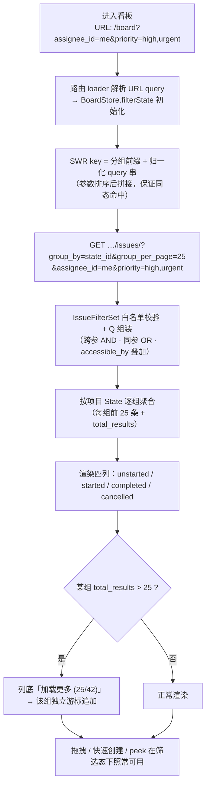
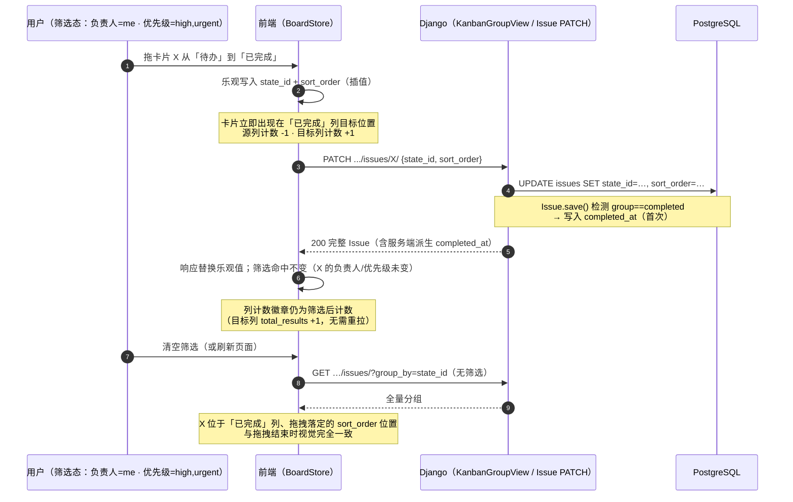
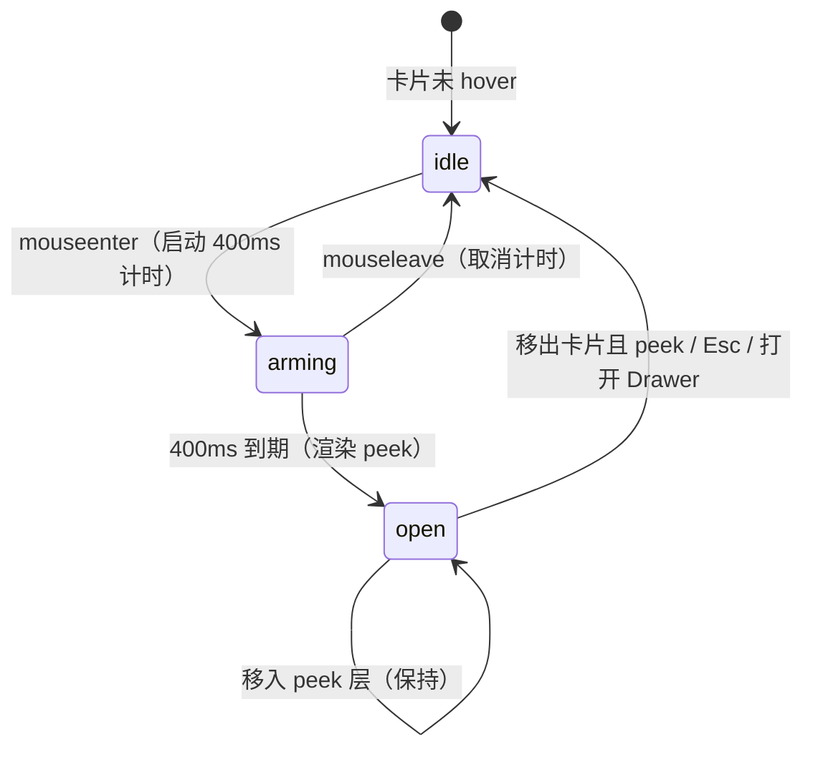

# 看板筛选与卡片悬浮预览

| 元信息项 | 内容 |
| --- | --- |
| 文档编号 | BOARD-002 |
| 所属迭代 | Sprint 1：MVP 能力补齐（第 3 周） |
| 优先级 | P1（MVP 必备级 · **看板从「可演示」到「可日常使用」的关键一步**） |
| 所属模块 | M5-BOARD｜看板视图 |
| 文档状态 | 待评审（Draft） |
| 最后更新日期 | 2026-09-01 |
| 上游依据 | `docs/需求文档.md` §3.5（看板筛选：按人 / 优先级 / 标签 / 时间筛选；卡片悬浮预览、弹窗详情编辑）、§8.2 看板 P1 列 |
| 前置依赖 | `BOARD-001`（固定三列看板 / 拖拽链路 / 分组端点 / `BoardStore` 骨架）、`TASK-002`（类型 / 优先级 / 标签 / 子任务计数等卡片字段与值域端点）、`TASK-003`（`IssueFilterSet` 参数语义与 `meta.applied` 回显）、`INFRA-004`（错误信封 / request_id） |
| 下游消费 | `BOARD-003/004`（P2 多看板 / 批量操作，筛选条组件直接复用）、`TASK-011`（P2 视图保存把 URL 筛选态升级为持久视图）、`COLLAB-004`（P2 WebSocket 后筛选态实时刷新）、`RPT-001`（`completed_at` 只在 completed 组写入的口径联动） |
| 关联架构文档 | [`api-conventions.md`](../architecture/api-conventions.md) §4.1（分组列表响应 `group_by`）、§5.3（筛选语法）、§6（游标分页）；[`unified-issue-model.md`](../architecture/unified-issue-model.md) §2.6（`State.group` 五语义组——本迭代看板开放第四列 `cancelled`）、§2.8（`completed_at` 派生规则）；[`rbac-permission-model.md`](../architecture/rbac-permission-model.md) §4.5（`PermissionGate` 拖拽场景） |
| 对标基线 | Plane 看板 display filters + hover peek（`web/core/components/issues/issue-layouts/kanban/`） · Ones 看板筛选与视图模板 |
| 工作量估算 | 后端 1.5 人日 / 前端 3 人日 / 联调与测试 1 人日，合计 **5.5 人日** |

> **范围声明**：交付看板顶部筛选（负责人 / 优先级 / 标签 / 截止时间）、卡片悬浮预览（Hover Peek）、「已取消」第四列开放与全字段卡片。多看板 / 列自定义 / 批量操作 / 视图保存 / 多维度分组 / 筛选态实时刷新均为 P2/P3（`BOARD-003/004`、`TASK-011`、`COLLAB-004`），不在本迭代范围。

---

## 1. 概述

### 1.1 功能定位

看板是 POC 演示的主角，但 P0 的看板「只能拖」——30 张卡之后，找一个成员的高优任务只能肉眼扫列。P1 让看板成为**日常作战屏**：

1. **筛选**：按人找自己的卡、按优先级聚焦紧急项、按标签切功能域、按截止时间看风险窗口——四维筛选叠加在分组端点之上，语义与列表视图**完全一致**（同一参数、同一 FilterSet、同一 URL query）；
2. **悬浮预览（Hover Peek）**：hover 400ms 不点开即知全貌（描述摘要 / 全部标签 / 子任务进度 / 附件数 / 起止时间），保持拖拽上下文不被打断；
3. **第四列「已取消」**：P0 已种子的 `cancelled` 状态开放为第四列，「不做了」的任务有明确去处（拖入即取消，而非删除——保留记录与统计可回溯）；
4. **卡片信息补全**：P0 卡片（标题 + 负责人 + 截止）升级为 `TASK-002` 全字段卡片（类型色条 / 优先级 / 标签 / 子任务 n/m）。

| 交付项 | 说明 |
| --- | --- |
| 看板筛选 | 顶部筛选条：负责人（多选）/ 优先级（多选）/ 标签（多选）/ 截止时间（区间，复用 `TASK-003` 语法）；语义同参 OR / 跨参 AND；URL query 同步 |
| 分组端点扩展 | `?group_by=state_id` 分组查询叠加全部 P1 筛选参数 + `meta.applied` 回显（P0 仅支持裸分组） |
| 第四列开放 | 看板渲染 `group=cancelled` 状态列（四列：待办 / 进行中 / 已完成 / 已取消）；拖入即置状态 `cancelled` |
| 卡片悬浮预览 | hover ≥ 400ms 弹出 peek 层：描述摘要（stripped 前 200 字）、全部标签、子任务 n/m 进度条、附件数（`FILE-001` 上线后生效）、开始 / 截止、创建人 / 时间 |
| 卡片信息补全 | 类型色条 / 优先级 / 标签（3 个 +「+N」）/ 子任务计数徽标 |

### 1.2 关键约定：单一 FilterSet 三处消费

> ⚠️ **这是本文档最重要的架构约定，也是相对两家竞品的核心差异化决策。**

看板筛选**不新建任何筛选实现**——直接复用 `TASK-003` 交付的 `IssueFilterSet`，仅裁剪参数域（移除 `state_id`，理由见 §2.2 备注）。这是「一处定义、处处一致」的落地：

| 消费方 | 参数域 | 实现位置 |
| --- | --- | --- |
| 列表视图（`TASK-003`） | 全集：`q` / `state_id` / `type_id` / `priority` / `label_id` / `assignee_id` / `target_date` / `created_by` / `order_by` | `IssueListView.get_queryset` |
| **看板分组视图（本文档）** | 全集减 `state_id`：`q` / `type_id` / `priority` / `label_id` / `assignee_id` / `target_date` / `created_by` | `KanbanGroupView.list`（§4.3.1） |
| P2 组合筛选器（`TASK-011`） | 全集 + 自定义字段 + AND/OR 树 | `FilterCompiler`（`dynamic-fields-design.md` §5.3 预留） |

三处共用带来的硬保证：

1. **语义不可能漂移**：`priority=high,urgent` 在列表命中什么，在看板就命中什么；修复一个筛选 bug，三处同时生效；
2. **URL 可跨视图分享**：`?assignee_id=me&priority=high,urgent` 在列表与看板两个路由下语义相同，切换视图筛选保持（§4.4.4）；
3. **P2 升级成本趋零**：`TASK-011` 视图保存只是把这份 URL query 存库。

**反面约束**：看板筛选条组件（`FilterBar` 看板变体）只裁剪**控件**（不渲染状态选择器），不裁剪**语义**。禁止在看板侧对 FilterSet 做任何复制粘贴式修改——CI 通过「`IssueFilterSet` 仅存在一处定义」的导入检查守护。

### 1.3 范围边界

| 能力 | P1（本文档） | 后续 |
| --- | --- | --- |
| 四维筛选（负责人 / 优先级 / 标签 / 截止时间） | ✅ | — |
| 关键词搜索 `?q=` 挂入看板 | ✅（语义复用，工具条含搜索框） | — |
| 筛选 + 分组叠加（`meta.applied` 回显） | ✅ | — |
| 组内独立游标「加载更多」 | ✅ | — |
| URL query 同步 + 列表/看板切换筛选保持 | ✅ | — |
| 卡片悬浮预览（零请求 peek） | ✅ | — |
| 「已取消」第四列 + 半透明视觉降权 | ✅ | — |
| 全字段卡片（类型 / 优先级 / 标签 / 计数） | ✅（消费 `TASK-002`） | — |
| 看板筛选含状态维度 | ❌（列即状态，语义混淆） | P2 `BOARD-003` 以「隐藏列」配置承载 |
| 多看板 / 视图保存 / 视图模板 | ❌ | `BOARD-003` / `TASK-011` |
| 批量操作（框选多卡） | ❌ | `BOARD-004` |
| 多维度分组（按负责人 / 优先级分组列） | ❌ | P3 多维分组看板 |
| 筛选态他人变更实时刷新 | ❌（SWR focus 重验证） | `COLLAB-004` |
| 卡片 Display Properties 面板（字段可配） | ❌（固定字段集） | P2 |
| 虚拟滚动 | ❌（每列服务端分页 25 条） | 单列 > 200 条时启用 |

### 1.4 前置依赖

| 依赖 | 内容 | 阻塞原因 |
| --- | --- | --- |
| `BOARD-001` | 分组端点 `?group_by=state_id`（每 State 有键 / 组内 `sort_order` 升序 / 每组首屏 25 条 + `total_results`）；拖拽 PATCH 链路与乐观更新管道；`BoardStore` / `P0_BOARD_GROUPS` 白名单机制 | 筛选叠加在分组端点之上；拖拽在筛选态下复用同一管道 |
| `TASK-002` | 卡片字段值域端点（`GET .../labels/`、`GET .../issue-types/`）；子任务计数 annotate（`sub_issues_count` / `completed_sub_issues_count`）；`Priority` 枚举 | 筛选器选项来源与卡片渲染内容 |
| `TASK-003` | `IssueFilterSet`（参数白名单 / 同参 OR / 跨参 AND / 值域宽容 / `me` 展开）；`meta.applied` 回显机制；`FilterBar` 组件（列表变体） | 语义与 UI 的直接复用源 |
| `INFRA-004` | 统一错误信封 / `request_id` | 错误响应规范 |
| `PROJ-001` | `cancelled` 状态种子（`#6B7280`，P0 已建未渲染） | 第四列数据来源 |

### 1.5 竞品参考

| 竞品 | 参考点 | 处置 |
| --- | --- | --- |
| Plane | 看板 display filters（优先级 / 标签 / 负责人 / 状态）；hover peek 弹层；每组独立分页 | 筛选能力对标；peek 交互对标；**双轨筛选语义的缺陷反规避**（§6.1） |
| Ones | 看板筛选可保存为视图模板、按角色共享；企业版多维度分组 | 视图模板对齐 P2 `TASK-011`；多维分组 P3 |

---

## 2. 业务逻辑

### 2.1 筛选态看板加载流



**关键点：筛选态下的数据契约与 P0 完全同构**。`data` 的键仍覆盖项目全部 `State`（含空列），每组的 `results` 仍按 `sort_order` 升序——筛选只是收窄了每组的成员集合与 `total_results`。`TASK-001` 建立的四条分组契约（§4.2.3）在筛选态下不变，前端列渲染代码零分支。

### 2.2 筛选与拖拽共存规则

筛选激活时，拖拽依然按 `BOARD-001` 的完整链路执行（hitbox → sort_order 插值 → 乐观更新 → PATCH → 响应替换）。需要显式约定的只有一个问题：**拖拽改的是 `state_id`（跨列）或 `sort_order`（同列），而 P1 筛选维度不含状态**——因此拖拽结果**永远不会把卡片「拖出」筛选结果集**：



**为什么筛选态拖拽不需要重拉分组**：P1 筛选维度（负责人 / 优先级 / 标签 / 截止 / 关键词）都不随拖拽改变——拖拽只改 `state_id` 与 `sort_order`。前端本地移动卡片 + 维护 `total_results` 即可保持一致；清空筛选或刷新时服务端数据自证。

> **P1 看板筛选刻意不含状态维度**：列本身即状态分组，「按状态筛选」=「隐藏列」，两种心智叠加会造成「筛了状态但列还在」的困惑。隐藏列是 P2 `BOARD-003` 视图配置（`hidden_columns`）的范围，本迭代不做。

### 2.3 悬浮预览（Hover Peek）行为

| 参数 | 值 | 说明 |
| --- | --- | --- |
| 触发延迟 | hover **400ms**（hover-intent） | 防扫视误弹；计时器在移出时立即取消 |
| 关闭时机 | 移出卡片且移出 peek 层 / `Esc` / 打开详情 Drawer | peek 层可 hover 进入（内含滚动内容） |
| 定位 | 卡片右侧锚定；越界自动水平翻转；垂直方向跟随并夹取在视口内 | Floating UI `flip` + `shift` |
| 内容 | 描述 stripped 前 200 字 +「展开」；全部标签；子任务 n/m 进度条；附件数（`FILE-001` 上线后生效）；开始 / 截止；创建人 / 时间 | 见 §3.4 |
| 数据来源 | **卡片对象自带字段（零请求）**：列表默认字段集已含全部 peek 字段；附件数用计数列 | 性能红线 BR-06 |
| 最大高度 | 320px，内部滚动 | — |

**hover-intent 计时器状态机**：



> 计时器取消（`arming → idle`）是防抖关键：用户扫过 10 张卡片不产生任何 peek 渲染。peek 打开后**不再有请求**（BR-06），因此无「加载取消」问题；唯一的异步行为是 200ms 后的描述全文截断渲染（纯前端）。

### 2.4 「已取消」第四列语义

第四列开放后，`completed_at` 的写入规则必须与报表口径（`RPT-001`）显式冻结：

| 拖拽动作 | `state.group` 变化 | `completed_at` | 说明 |
| --- | --- | --- | --- |
| 拖入「已完成」列 | `*` → `completed` | **写入当下**（首次进入） | `Issue.save()` 派生（`unified-issue-model.md` §2.8） |
| 「已完成」列内排序 | 不变 | **不刷新**（保持首次完成时间） | 同列 PATCH 不触发派生 |
| 拖入「已取消」列 | `*` → `cancelled` | **不写入**（保持 null 或已有值不变） | 只有 completed 组触发写入 |
| 已取消 → 已完成 | `cancelled` → `completed` | **补写当下** | 取消后复活完成，以复活时间为准 |
| 已完成 → 拖出 | `completed` → 其他 | **保留**（不刷新、不清空） | 首次完成时间语义（`TASK-001` BR-11 / `unified-issue-model.md` §4.3 `save()` 仅在 `None` 时写入、从不清空） |

> 「已取消」任务的卡片半透明（60% opacity）视觉降权，但**可正常拖出恢复**——取消是可逆的软状态，不是删除。

### 2.5 业务规则表

| 编号 | 规则 | 判定位置 | 违反后果 |
| --- | --- | --- | --- |
| BR-01 | 看板筛选参数域 = `TASK-003` 全集减 `state_id`；语义同参 OR / 跨参 AND，与列表零差异（`IssueFilterSet` 单点复用，禁止复制实现） | FilterSet 复用 | 400（值域非法时）；CI 导入检查守护单点 |
| BR-02 | 分组响应结构遵循 [`api-conventions.md`](../architecture/api-conventions.md) §4.1 分组信封（与 `TASK-001` §4.2.3 同构）：`data` 键以项目 State UUID 为键覆盖**全部** `State`（含空列与筛选后 0 命中列），每组 `results`（≤25）+ `total_results`（筛选后）+ `unfiltered_total_results`（筛选前，供列头 tooltip） | 序列化 | — |
| BR-03 | 四列渲染顺序固定：`unstarted → started → completed → cancelled`；列 = 项目 `State` 表中对应 `group` 的种子行，列名 / 颜色取 `State.name` / `State.color` 不硬编码 | 前端 | — |
| BR-04 | 拖入「已取消」列写入该列 `state_id`，`completed_at` **不**写入；拖出 cancelled 至 completed 时补写（§2.4 全表） | Service（`Issue.save()`） | — |
| BR-05 | 筛选态下列头计数显示 `total_results`（筛选后计数）；hover 列头 tooltip 显示「共 N 个任务，当前筛选命中 M」，N 取 `unfiltered_total_results`（每组响应同位置给出，M 取 `total_results`） | 前端 | — |
| BR-06 | peek 层数据由列表载荷自带（列表默认字段集已含全部 peek 字段），**禁止 peek 触发任何请求** | 前端 | 性能红线 |
| BR-07 | 筛选态 URL 同步与列表页一致（`?assignee_id=…&priority=…`），列表 ⇄ 看板切换共享同一 query 源，筛选保持 | 前端（路由层） | — |
| BR-08 | 「已取消」列卡片 60% 半透明视觉降权；可正常拖出恢复 | 前端 | — |
| BR-09 | `PROJ_VIEWER`(5) 下拖拽禁用（列渲染正常，卡片不可拖）；绕过 UI 强拖接口返回 `403 PERM_ROLE_INSUFFICIENT` | `AUTH-005` 联动 + Permission 类 | 403 |
| BR-10 | `meta.applied` 回显服务端实际生效的筛选（含 `me` 展开后的用户 ID），供前端 Chip 精确展示；与 `TASK-003` 同构 | 序列化 | — |
| BR-11 | 组内游标互相独立：A 组翻页不影响 B 组的游标与结果；任一组游标解码失败（含整体损坏与单组过期）均返回 `400 VALIDATION_INVALID_CURSOR`，前端 toast + 仅该组自动重拉首页（其他组不受影响） | 分页器 | 400 `VALIDATION_INVALID_CURSOR` |
| BR-12 | 软删除（`deleted_at`）与归档（`archived_at`，防御式）的任务不出现在任何分组，无论筛选与否 | ORM 基线过滤 | — |

### 2.6 异常处理表

| 异常场景 | 触发条件 | HTTP / 错误码 | 前端表现 | 后端处理 |
| --- | --- | --- | --- | --- |
| 筛选空结果 | 条件过窄（如负责人 + 标签无交集） | 200 全组空 | 四列保留、卡片区中央空态「无匹配卡片」+「清空筛选」按钮 | 正常返回空组 |
| 枚举值非法 | `priority=abc` | 400 `VALIDATION_ERROR` / `INVALID` | 筛选器红框提示 | FilterSet 白名单校验 |
| 值域外 UUID（他项目标签 / 已删成员） | 多选器异步竞态 | 200 命中 0 行 | 静默空结果（宽容语义，`TASK-003` BR-08 同源） | 不报错 |
| 组加载更多失败 | 游标过期（他人批量移动后） | 400 `VALIDATION_INVALID_CURSOR` | 该组 toast + 自动重拉该组首页 | 游标校验 |
| peek 溢出屏幕 | 边缘卡片 | — | Floating UI 自动翻转方向 / 垂直夹取 | — |
| 拖拽 PATCH 失败 | 网络 / 5xx | — | 复用 `BOARD-001` 回滚链路：卡片弹回 + toast | — |
| 强拖（VIEWER） | DevTools 绕过 UI | 403 `PERM_ROLE_INSUFFICIENT` | 回滚 + toast | Permission 二次鉴权 |
| 项目状态集异常（某 group 无种子行） | 数据损坏 | — | 该 group 列缺失 + 错误边界日志 | 前端按实际 State 渲染，不白屏 |

### 2.7 边界条件表

| 边界场景 | 限制值 | 超出处理方式 |
| --- | --- | --- |
| 单组卡片首屏 | 25（`group_per_page`） | 「加载更多 (25/42)」组内游标追加 |
| 列宽与列数 | 4 列最小视口 1280px | < 1280px 横向滚动（列固定宽 280px，`scroll-snap`） |
| peek 内容高度 | 320px | 内部滚动；描述 200 字截断 +「展开」 |
| 卡片标签显示 | 3 个 +「+N」 | 全量标签在 peek 层展示 |
| 筛选参数单值多选数 | ≤ 20（`TASK-003` 边界同源） | 400 `VALIDATION_ERROR` + 子码 `TOO_LARGE`（`api-conventions.md` §8.4 / §8.8） |
| `q` 关键词长度 | ≤ 64 | 400 `TOO_LONG` |
| 筛选 + 每组 25 条的 SQL 预算 | ≤ 10 条（4 组 count + 4 组取数 + 权限 + 计数） | `assertNumQueries` 门禁（IT-05） |

---

## 3. UI/UX 设计

### 3.1 看板整体布局（四列 + 工具条）

```
┌──────────────────────────────────────────────────────────────────────────────────────┐
│ 🔍 搜索…  [👤 负责人 ▾] [⚑ 优先级 ▾] [🏷 标签 ▾] [📅 截止时间 ▾]     ( me × ) ( 高/紧急 × ) [清空] │  ← 筛选工具条
├──────────────────────────────────────────────────────────────────────────────────────┤
│  ┌──────────────────┐ ┌──────────────────┐ ┌──────────────────┐ ┌──────────────────┐ │
│  │ ● 待办        3  │ │ ● 进行中      2  │ │ ● 已完成      1  │ │ ● 已取消      1  │ │
│  │ ──────────────── │ │ ──────────────── │ │ ──────────────── │ │ ──────────────── │ │
│  │ ┃🐛 邮箱注册…     │ │ ┃⚙ Docker 编排   │ │ ┃✓ Monorepo 骨架 │ │ ┃░ 旧导出方案    │ │  ← 类型色条 + 半透明
│  │ ┃ 🔴urgent 👤 8-30│ │ ┃ ⚑high 👤 9-08 │ │ ┃ 👤 9-05        │ │ ┃ 👤 8-12        │ │
│  │ ┃ [前端][P1] 2/5 │ │ ┃ [infra]       │ │ ┃                │ │ ┃                │ │
│  │ ┗━━━━━━━━━━━━━━ │ │ ┗━━━━━━━━━━━━━━ │ │ ┗━━━━━━━━━━━━━━ │ │ ┗━━━━━━━━━━━━━━ │ │
│  │ ┃🐢 路由拦截      │ │ ┃📦 ORM 模型     │ │                  │ │                  │ │
│  │ ┃ 🔴high —      │ │ ┃ ⚑medium 👤   │ │                  │ │                  │ │
│  │ ┗━━━━━━━━━━━━━━ │ │ ┗━━━━━━━━━━━━━━ │ │                  │ │                  │ │
│  │ ＋ 添加任务       │ │ ＋ 添加任务      │ │ ＋ 添加任务       │ │ ＋ 添加任务      │ │
│  └──────────────────┘ └──────────────────┘ └──────────────────┘ └──────────────────┘ │
└──────────────────────────────────────────────────────────────────────────────────────┘
```

| 区域 | 组件 | UI 组件 |
| --- | --- | --- |
| 筛选工具条 | 搜索框（防抖 300ms）+ 四个筛选下拉（负责人 / 优先级 / 标签 / 截止）+ 已选 Chips（可单个 ✕）+「清空」；视图切换（列表 ⇄ 看板）在工具条左侧 | `SearchInput` / `FilterBar`（看板变体）/ `ChipGroup` |
| 四列 | 列头（色点 + 名称 + 计数徽章）+ 卡片堆 + 列底「+」与「加载更多 (N/total)」 | `KanbanColumn`（`BOARD-001` 扩展） |
| 卡片 | `TASK-002` 全字段卡片；已取消列半透明 | `IssueCard` |
| Peek 层 | 浮层卡片（§3.4） | `HoverPeek`（Headless UI + Floating UI） |

**工具条规格**：高 52px，`sticky top-0 z-20 bg-white/95 backdrop-blur`；筛选下拉复用 `TASK-003` 的 `FilterBar` 控件（多选下拉带色点 / 头像 / 复选），仅去掉「状态」项；Chips 区 `flex-wrap`，超过一行时折叠为「+N 个筛选」气泡。

### 3.2 筛选条与已选 Chips

```
┌────────────────────────────────────────────────────────────────────────────────┐
│ [列表|看板] │ 🔍 搜索任务…   [👤 负责人 ▾] [⚑ 优先级 ▾] [🏷 标签 ▾] [📅 截止 ▾] │
│                                ╭───────╮ ╭─────────────╮                        │
│                                │ 我 ×  │ │ 高 · 紧急 ×  │      [清空全部]        │
│                                ╰───────╯ ╰─────────────╯                        │
└────────────────────────────────────────────────────────────────────────────────┘
```

| 元素 | 规格 |
| --- | --- |
| 视图切换 | 分段控件（列表 / 看板）；切换时 URL 只变路由段，query 保留 → 筛选保持（BR-07） |
| 搜索框 | `w-56 rounded-md border-neutral-200`，placeholder「搜索任务…」；输入防抖 300ms 后写入 URL `?q=`；清空按钮（有内容时显示） |
| 负责人下拉 | 多选；项目成员列表（含头像 + 「指派给我」快捷项置顶）；选中项 Chips 显示头像 + 名字 |
| 优先级下拉 | 多选；五档色点（urgent `#EF4444` / high `#F59E0B` / medium `#3B82F6` / low `#10B981` / none `#9CA3AF`）；Chips 合并显示「高 · 紧急」 |
| 标签下拉 | 多选；`TASK-002` 标签色块 + 名称 |
| 截止时间 | 预设区间下拉（今天 / 本周 / 已逾期 / 未来 7 天 / 自定义区间）；写入 `target_date=…;before/after` 语法 |
| Chips | `rounded-full bg-neutral-100 px-2 py-0.5 text-xs`；hover 显示 ✕；键盘可聚焦（`Tab` 到达，`Enter`/`Backspace` 移除） |
| 清空全部 | 文字按钮；URL query 清空后 SWR key 变化触发全量重拉 |

### 3.3 任务卡片（P1 全字段）

```
┌─────────────────────────────┐
│┃                            │  ← 左侧 3px 类型色条（issue_type.color：缺陷红/需求紫/任务蓝…）
│┃ 🐛 修复登录页 500 错误      │  ← 类型图标(lucide) + 标题，最多 3 行
│┃                            │
│┃ 🔴urgent      👤张三  🔴8-30│  ← 优先级色点+标签 / 负责人头像 / 截止（逾期红）
│┃ [前端] [P1] +1     ⓔ 2/5  │  ← 标签(3+N) / 子任务进度徽标
└─────────────────────────────┘
```

| 元素 | 规格 |
| --- | --- |
| 类型色条 | 左侧 3px 垂直条替换 P0 的状态色条，`background: issue_type.color`（`TASK-002` 五内置色）；已取消列卡片再叠加 `opacity-60` |
| 类型图标 | 12px lucide 图标（`bug` / `sparkles` / `circle-check` / `flask-conical` / `file-text`），`text-neutral-400`，置于标题前 |
| 标题 | `text-sm text-neutral-800 line-clamp-3 leading-snug` |
| 优先级 | 8px 色点 + 短文本（`urgent`/`high` 时显示，`none` 不渲染）；色值见 §3.2 |
| 底部行 | `mt-2 flex items-center justify-between text-xs`：负责人 20px 头像（多指派显示 `AvatarGroup` 前叠 2 + 计数）；截止 `M-d` 格式，逾期且未完成红色 + `alert-circle` 图标 |
| 标签 | 最多 3 个色块标签（`TASK-002` Label 色），超出显示 `+N`；全部在 peek 展示 |
| 子任务徽标 | `ⓔ 2/5`（完成数/总数，`sub_issues_count` annotate）；无子任务不渲染 |
| 拖拽 / 点击 | 与 P0 完全一致（`BOARD-001` §3.2 / §3.3）；VIEWER `isDragDisabled` |

### 3.4 Hover Peek 浮层

```
        ┌──────────────────────────────────────────┐
        │ TZXM-4 · 🐛 缺陷 · 🔴urgent      ⤢ 打开  │  ← 编号 / 类型 / 优先级 / 打开详情
        ├──────────────────────────────────────────┤
        │ 修复登录页 500 错误                        │  ← 完整标题（2 行内）
        │                                          │
        │ prod 环境 POST /auth/sign-in/ 偶发 500，  │  ← description_stripped 前 200 字
        │ 日志显示 Argon2 校验超时…（187/200 字）    │
        │                                「展开 ▾」 │
        │                                          │
        │ 🏷 [前端] [P1] [认证] [Sprint-3]           │  ← 全部标签（无 +N 截断）
        │ ⓔ 子任务 2/5 ▓▓▓▓▓░░░░░                   │  ← 进度条（40%）
        │ 📎 附件 3                                  │  ← 附件数（FILE-001 上线后）
        │ 📅 2026-08-28 → 2026-08-30   ⏰ 逾期 2 天  │  ← 开始→截止 / 逾期天数
        │ 👤 张三 创建于 2026-08-20                  │  ← 创建人 / 创建时间
        └──────────────────────────────────────────┘
（锚定在卡片右侧，越界翻转；hover 可进入浮层内部滚动）
```

| 元素 | 规格 |
| --- | --- |
| 浮层 | 宽 340px；`rounded-lg border border-neutral-200 bg-white shadow-xl p-4`；z-30；`max-h-[320px] overflow-y-auto` |
| 出入场 | 进入 `opacity 0→1 + translateY(4px→0)` 120ms ease-out；退出瞬时（无动画，防残影） |
| 打开详情 | 右上 `⤢` 图标按钮（`aria-label="打开详情"`）→ 打开 `IssuePeekDrawer`（复用 `TASK-001`）；peek 关闭 |
| 描述摘要 | `text-xs text-neutral-600 leading-relaxed`，200 字截断 + 「展开 ▾」文字按钮（进详情） |
| 标签 | 全量平铺（`flex-wrap gap-1`） |
| 子任务进度 | 8px 高进度条（完成色 `#10B981`）+ `n/m` 文本 |
| 逾期行 | 已逾期且未完成：`text-red-500` + 逾期天数；已完成 / 无日期正常显示 |
| 触摸设备 | hover 不存在 → peek 不触发；点按即打开详情（无信息损失） |

### 3.5 交互细节表

| 交互动作 | 触发方式 | 反馈效果 | 加载态 / 空态 |
| --- | --- | --- | --- |
| 筛选应用 | 下拉选择 / Chip 移除（防抖 300ms 合并） | URL query 更新 → SWR key 变化 → 四列卡片渐隐重排（120ms）；列计数徽章数字滚动过渡 | 四列骨架（每列 3 卡 `animate-pulse`） |
| 搜索 | 输入防抖 300ms | 同上；搜索框清空按钮出现 | 无结果空态 |
| 拖入已取消 | 拖拽落子 | 卡片半透明淡入（200ms）；toast「已取消，可拖回恢复」（5s，含「撤销」= 拖回原列） | — |
| 悬浮预览 | hover 400ms | peek 浮入（120ms ease-out）；可进入滚动 | — |
| Esc | 键盘 | 关 peek / 取消拖拽 / 关筛选下拉 | — |
| 加载更多 | 列底按钮 | 追加 25 张卡片（骨架占位） | 按钮转「已全部加载 (42/42)」后隐藏 |
| 列头 hover | mouseenter | tooltip「共 N 个任务，当前筛选命中 M」（BR-05） | — |
| 视图切换 | 分段控件 | 路由切换动画；query 保留，目标视图直接以同参数查询 | — |

### 3.6 空状态

| 场景 | 处置 |
| --- | --- |
| 筛选空结果（四列均 0 命中） | 四列结构保留；卡片区中央浮层插画（`search-x` 64px `text-neutral-300`）+「无匹配卡片」+ 副文案「尝试调整或清空筛选」+ 主按钮「清空筛选」。**不**移除列结构（用户需看到「列还在、只是没命中」的因果） |
| 项目无任务（未筛选） | 复用 `BOARD-001` §3.5：四列 + 引导条「暂无任务，点击『＋ 创建任务』或在列内添加」 |
| 单组空（其他组有卡） | 复用 P0 空列提示「将任务拖拽到这里」 |
| 加载失败 | 卡片区居中 `alert-circle` + `error.message` +「重试」（SWR `mutate`） |

### 3.7 响应式与无障碍

| 断点 | 布局 |
| --- | --- |
| ≥ 1280px（`xl`） | 四列并排（4 × 280px + gap），无横向滚动 |
| 768 ~ 1279px | 容器横向滚动，列宽保持 280px，`scroll-snap` |
| < 768px | 列宽 `calc(100vw - 48px)` 横滑切换；筛选工具条折叠为「🔍 + 筛选(N)」按钮，点开抽屉式筛选面板 |

**无障碍**：

| 要求 | 实现 |
| --- | --- |
| 卡片可达 | `role="button"` + `tabIndex={0}`，`Enter` 打开详情、`F2` 聚焦 peek（peek 获得焦点后可 `Tab` 遍历内部「打开 / 展开」） |
| peek 语义 | `role="dialog"` + `aria-labelledby` 指向标题节点；`aria-expanded` 在卡片上表达 peek 开合 |
| 筛选组语义 | `role="group"` + `aria-label="看板筛选"`；每个下拉 `aria-label`；Chip ✕ 可聚焦可 `Enter` 移除 |
| 拖拽键盘替代 | 卡片上下文菜单「移动到 → 待办 / 进行中 / 已完成 / 已取消」（复用 `BOARD-001` P0 替代路径，本迭代扩展到四列） |
| 拖拽播报 | `aria-live="polite"`：「正在拖动 TZXM-4」「已移动 TZXM-4 到 已完成」；拖入已取消额外播报「任务已取消」 |
| 色盲可达 | 优先级色点恒伴随文本标签；类型色条伴随类型图标；逾期红伴随 `alert-circle` 图标与「逾期 N 天」文本 |
| 对比度 | 全部文本 ≥ 4.5:1；半透明卡片（60%）仍 ≥ 4.5:1（底色白 + 中性 800 文本组合验证） |
| 减少动效 | `prefers-reduced-motion: reduce` 时 peek 出入场与卡片重排动画降级为瞬时 |

---

## 4. 技术架构

### 4.1 数据模型

**零新增表、零 DDL**。消费既有模型与索引：

| 消费对象 | 字段 / 索引 | 用途 |
| --- | --- | --- |
| `State` | `group`（四列白名单）、`name` / `color`（列头）、`sort_order`（列序） | 列定义（`PROJ-001` 种子） |
| `Issue` | `state_id` / `sort_order`（分组键 + 组内序）；`priority` / `issue_type_id` / `target_date` / `description_stripped`（筛选与 peek）；`archived_at` / `deleted_at`（基线过滤） | 卡片与筛选 |
| `Issue` 索引 | `idx_issue_proj_state_sort`（分组主查询）；`idx_issue_active_by_project`（默认列表）；`target_date` 单列（截止筛选）；`priority` 单列（优先级筛选）；`idx_issue_desc_trgm`（`q` 搜索） | 全部查询路径走索引 |
| M2M 中间表 | `IssueAssignee.idx_assignee_issue`（负责人筛选用反查）；`IssueLabel` 唯一约束附带索引（标签筛选用子查询） | 筛选 join |
| `Issue` annotate | `sub_issues_count` / `completed_sub_issues_count`（`TASK-002` 交付）；`attachment_count`（`FILE-001` 交付后生效） | peek 与卡片计数 |

### 4.2 API 定义

#### 4.2.1 端点表

| # | 方法 | 路径 | 描述 | 权限 | 成功码 |
| --- | --- | --- | --- | --- | --- |
| 1 | `GET` | `…/projects/{project_id}/issues/?group_by=state_id&{筛选参数}&group_per_page=25` | 分组看板数据（筛选叠加 + `meta.applied`） | `PROJ_VIEWER`(5)+ | `200` |
| 2 | `GET` | `…/projects/{project_id}/issues/?group_by=state_id&group_id={state_id}&cursor=…` | 单组加载更多（组内游标） | `PROJ_VIEWER`(5)+ | `200` |
| 3 | `PATCH` | `…/projects/{project_id}/issues/{issue_id}/` | 拖拽改 `state_id`+`sort_order`（**复用 `BOARD-001` / `TASK-001`，零改动**） | `PROJ_CONTRIBUTOR`(15)+ | `200` |
| 4 | `GET` | `…/projects/{project_id}/labels/` | 筛选器标签选项（复用 `TASK-002`） | `PROJ_VIEWER`(5)+ | `200` |
| 5 | `GET` | `…/projects/{project_id}/issue-types/` | 类型图标 / 色值（卡片渲染，复用 `TASK-002`） | `PROJ_VIEWER`(5)+ | `200` |

筛选参数域（BR-01，`TASK-003` 全集减 `state_id`）：`q` / `type_id` / `priority` / `label_id` / `assignee_id`（含 `me`）/ `target_date`（`;before` / `;after` / `;on`）/ `created_by`。同参多值 OR、跨参 AND。`order_by` 在分组端点固定为 `sort_order`（组内序即看板序，不接受客户端覆盖）。

#### 4.2.2 分组 + 筛选请求示例

```http
GET /api/v1/workspaces/acme/projects/9d8e8c7a-.../issues/?group_by=state_id&group_per_page=25&assignee_id=me&priority=high,urgent HTTP/1.1
Cookie: sessionid=…
```

**成功响应 `200`**（注意四条分组契约：每 State 有键、含空列与 0 命中列、组内 `sort_order` 升序、每组 `total_results`）：

```json
{
  "status": "success",
  "data": {
    "a1b2c3d4-0001-4000-8000-000000000001": {
      "results": [
        {
          "id": "8a1f9c2e-6b3d-4a7e-9f11-2c4d5e6f7a8b",
          "sequence_id": 4, "issue_key": "RBT-4", "name": "修复登录页 500 错误",
          "type_id": "bug-type-id", "priority": "urgent", "state_id": "a1b2c3d4-0001-4000-8000-000000000001",
          "assignee_ids": ["6c7d…"], "label_ids": ["lbl-fe", "lbl-p1", "lbl-auth", "lbl-s3"],
          "start_date": "2026-08-28", "target_date": "2026-08-30",
          "description_stripped": "prod 环境 POST /auth/sign-in/ 偶发 500，日志显示 Argon2 校验超时…",
          "sub_issues_count": 5, "completed_sub_issues_count": 2,
          "attachment_count": 0, "sort_order": 65535.0,
          "created_by": "6c7d…", "created_at": "2026-08-20T03:12:45.120Z", "updated_at": "2026-09-01T07:00:00.000Z"
        }
      ],
      "total_results": 1,
      "unfiltered_total_results": 3
    },
    "a1b2c3d4-0002-4000-8000-000000000002": {
      "results": [],
      "total_results": 0,
      "unfiltered_total_results": 5
    },
    "a1b2c3d4-0003-4000-8000-000000000003": {
      "results": [],
      "total_results": 0,
      "unfiltered_total_results": 2
    },
    "a1b2c3d4-0004-4000-8000-000000000004": {
      "results": [],
      "total_results": 0,
      "unfiltered_total_results": 1
    }
  },
  "meta": {
    "grouped_by": "state_id",
    "sub_grouped_by": null,
    "total_count": 1,
    "applied": { "assignee_id": ["6c7d…"], "priority": ["high", "urgent"] }
  }
}
```

> `meta.applied` 回显服务端实际生效的筛选（`me` 已展开为用户 ID），前端 Chip 依据它而非本地状态渲染（BR-10）——与 `TASK-003` 的列表行为同构。

**失败响应 `400`**（枚举值非法）：

```json
{
  "status": "error",
  "error": {
    "code": "VALIDATION_ERROR",
    "message": "请求参数校验失败",
    "details": [{ "field": "priority", "code": "INVALID", "message": "priority 取值须为 none/low/medium/high/urgent" }],
    "request_id": "01JBX7Q2M9UC8R3S5T7W9X0Y1Z"
  }
}
```

**失败响应 `404`**（项目不存在 / 非成员，存在性隐藏）：

```json
{
  "status": "error",
  "error": { "code": "RESOURCE_NOT_FOUND", "message": "项目不存在或你没有访问权限",
             "request_id": "01JBX7Q2M9UC8R3S5T7W9X0Y2Z" }
}
```

#### 4.2.3 单组加载更多

```http
GET …/issues/?group_by=state_id&group_id=a1b2c3d4-0001-4000-8000-000000000001&assignee_id=me&priority=high,urgent&cursor=MjU6MTow HTTP/1.1
```

**成功响应 `200`**（平铺列表结构，非分组结构；筛选参数必须与首屏一致，否则游标失效）：

```json
{
  "status": "success",
  "data": [ { "id": "…", "issue_key": "RBT-7", "name": "…", "sort_order": 196605.0, "…": "…" } ],
  "meta": { "next_cursor": "NTA6Mjow", "prev_cursor": "NTA6MTow", "next_page_results": false,
            "prev_page_results": true, "count": 17,
            "total_count": 42, "total_pages": 2, "page": 2, "per_page": 25 }
}
```

**失败响应 `400`**（游标损坏或筛选参数与游标绑定态不一致）：

```json
{
  "status": "error",
  "error": { "code": "VALIDATION_INVALID_CURSOR", "message": "游标无效，已返回该组首页",
             "request_id": "01JBX7Q2M9UC8R3S5T7W9X0Y3Z" }
}
```

> **组内游标与筛选态绑定**：游标编码中混入归一化筛选串哈希（§4.3.2）。筛选变化后旧游标必然失效（400），前端收到后自动重拉该组首页——这是「加载更多期间修改筛选」竞态的服务端兜底。

#### 4.2.4 拖拽 PATCH（复用，无改动）

```json
// PATCH …/issues/8a1f…/   拖入「已取消」列
{ "state_id": "a1b2c3d4-0004-4000-8000-000000000004", "sort_order": 65535.0 }
// 200 完整 Issue；completed_at 保持 null（BR-04）
```

完整契约见 `BOARD-001` §4.4.1 与 `TASK-001` §4.2.5，本文档零改动、零二次实现。

### 4.3 核心逻辑

#### 4.3.1 `KanbanGroupView` 完整实现

```python
# apps/api/plane/app/views/issue/kanban.py
import hashlib
import base64
import json

from django.core.exceptions import ValidationError
from django.db.models import QuerySet
from rest_framework.response import Response

from plane.app.views.base import ProjectScopedAPIView
from plane.app.filters.issue import IssueFilterSet          # TASK-003 交付，单点复用（BR-01）
from plane.db.models import Issue, State


class KanbanGroupView(ProjectScopedAPIView):
    """看板分组端点 —— 在 TASK-003 列表能力之上做分组聚合。

    同一 FilterSet、同一权限、同一游标协议（与列表视图零语义差异）。
    P1 扩展：筛选参数叠加 + meta.applied 回显 + cancelled 组随四态种子自然出现。
    """

    permission_classes = [IsAuthenticatedAndActive, ProjectEntityPermission]
    filterset_class = IssueFilterSet
    group_per_page = 25

    def list(self, request, *args, **kwargs):
        # ① 权限 + 作用域 + 基线过滤（软删/归档，BR-12）—— get_queryset 收口
        base_qs = self.filter_queryset(self.get_queryset())

        # ② 单组加载更多：平铺结构，游标与筛选态绑定
        group_id = request.query_params.get("group_id")
        if group_id:
            return self._group_page(request, base_qs, group_id)

        # ③ 全组聚合：每 State 有键（含空列 / 0 命中列），与 TASK-001 §4.2.3 同构
        states = (State.objects.filter(project=self.project, deleted_at__isnull=True)
                  .order_by("sort_order"))
        data, group_meta = {}, {}
        for st in states:
            group_qs = base_qs.filter(state_id=st.id)
            page = self._paginate_within_group(request, group_qs, st)
            # unfiltered_qs 在筛选参数为空时等价于 group_qs；筛选态下保留全量计数供列头 hover tooltip
            unfiltered_total = base_qs.filter(state_id=st.id).count() if base_qs.query.where else page["total"]
            data[str(st.id)] = {
                "results": page["results"],
                "total_results": page["total"],
                "unfiltered_total_results": unfiltered_total,
            }
            group_meta[str(st.id)] = {"next_cursor": page["next_cursor"]}

        return Response({"status": "success", "data": data, "meta": {
            "grouped_by": "state_id", "sub_grouped_by": None,
            "total_count": base_qs.count(),
            "applied": self.filterset.applied,             # me 展开后的生效筛选（BR-10）
            "group_cursors": group_meta,                   # 每组独立游标（BR-11）
        }})

    def _paginate_within_group(self, request, qs: QuerySet, state: State) -> dict:
        """组内分页：每组前 25 条 + total_results + 该组独立游标"""
        per = self.group_per_page
        offset = self._group_offset(request, state.id)      # 游标解码（§4.3.2），无游标为 0
        total = qs.count()
        rows = (qs.select_related("state", "issue_type")
                   .order_by("sort_order", "-created_at", "-id")   # 三级稳定键（BOARD-001 契约）
                   [offset: offset + per])
        return {
            "results": self.get_serializer(rows, many=True).data,
            "total": total,
            "next_cursor": self._encode_group_cursor(offset + per, state.id) if offset + per < total else None,
        }

    def _group_page(self, request, base_qs: QuerySet, group_id: str) -> Response:
        """单组「加载更多」—— 校验组归属、游标与筛选态绑定，返回平铺列表"""
        state = State.objects.filter(id=group_id, project=self.project).first()
        if state is None:
            raise ValidationError({"group_id": "所选分组无效"})
        offset = self._decode_group_cursor(request, state.id)   # 损坏 → 400 VALIDATION_INVALID_CURSOR，客户端自动重拉该组首页
        ...
```

#### 4.3.2 组内游标编码

```python
def _filter_fingerprint(self, request) -> str:
    """筛选态指纹：归一化排序后的 query 参数哈希——游标与筛选态绑定的关键"""
    keys = ("q", "type_id", "priority", "label_id", "assignee_id", "target_date", "created_by")
    normalized = {k: request.query_params[k] for k in keys if k in request.query_params}
    return hashlib.sha1(json.dumps(normalized, sort_keys=True).encode()).hexdigest()[:8]

def _encode_group_cursor(self, offset: int, state_id) -> str:
    # payload = "{filter_fp}:{state_id 前 8 位}:{offset}"，URL 安全 base64
    payload = f"{self._filter_fingerprint(self.request)}:{str(state_id)[:8]}:{offset}"
    return base64.urlsafe_b64encode(payload.encode()).decode().rstrip("=")
```

> 与 [`api-conventions.md`](../architecture/api-conventions.md) §6.2 的 `value:offset:is_prev` 全局游标格式并存：**组内游标是它的作用域限定变体**（多绑定了组与筛选指纹），解码失败的处理策略一致（400 `VALIDATION_INVALID_CURSOR` → 前端 toast + 自动重拉该组首页）。

#### 4.3.3 性能分析

| 查询 | 数量 | 命中索引 | 预期耗时（万级任务库 / 单项目 1 万） |
| --- | --- | --- | --- |
| 权限与作用域 | 1-2 | `ProjectMember` 唯一约束 | < 1ms |
| 筛选基数（`total_count`） | 1 | 视筛选维度（`idx_issue_active_by_project` / M2M 反查） | < 30ms |
| 每组 count × 4 | 4 | 同上（可合并为单条 `GROUP BY state_id` 聚合，见下注） | < 40ms |
| 每组取数 × 4 | 4 | `idx_issue_proj_state_sort`（`LIMIT 25` 索引有序扫描） | 每组 < 5ms |
| **合计** | **≤ 10 条** | — | **P95 < 200ms**（验收门禁） |

> **优化注**：四组 count 在实现上合并为一条 `values("state_id").annotate(n=Count("id"))`，SQL 数降至 7 条以内；`assertNumQueries` 门禁（IT-05）按 ≤ 10 设上限以容忍权限缓存冷启动。

### 4.4 前端实现

#### 4.4.1 `BoardStore` 扩展（筛选态）

```typescript
// apps/web/core/store/board/filter-state.ts
import { action, computed, makeObservable, observable } from "mobx";

/** P1 看板筛选态 —— 从 URL query 派生（BR-07：与列表视图同源） */
export class BoardFilterState {
  q = "";
  assigneeIds: string[] = [];      // 含 "@me" 占位（服务端展开）
  priorities: string[] = [];
  labelIds: string[] = [];
  targetDate: string | null = null; // "2026-09-07;before" 原样语法

  constructor() {
    makeObservable(this, {
      q: observable, assigneeIds: observable, priorities: observable,
      labelIds: observable, targetDate: observable,
      isEmpty: computed, queryString: computed,
      hydrateFromURL: action, apply: action, clear: action, removeChip: action,
    });
  }

  get isEmpty(): boolean {
    return !this.q && !this.assigneeIds.length && !this.priorities.length
        && !this.labelIds.length && !this.targetDate;
  }

  /** 归一化 query 串 —— SWR key 组成部分；参数定序保证同态命中 */
  get queryString(): string {
    const p = new URLSearchParams();
    if (this.q) p.set("q", this.q);
    if (this.assigneeIds.length) p.set("assignee_id", this.assigneeIds.join(","));
    if (this.priorities.length) p.set("priority", this.priorities.join(","));
    if (this.labelIds.length) p.set("label_id", this.labelIds.join(","));
    if (this.targetDate) p.set("target_date", this.targetDate);
    p.sort();                                            // ← 归一化关键
    return p.toString();
  }

  hydrateFromURL(search: string) { /* URLSearchParams → 各字段（路由 loader 调用） */ }
  apply(patch: Partial<BoardFilterState>) { Object.assign(this, patch); this.syncURL(); }
  clear() { this.q = ""; this.assigneeIds = []; this.priorities = []; this.labelIds = []; this.targetDate = null; this.syncURL(); }
  removeChip(kind: ChipKind, value?: string) { /* 单 Chip 移除（数组 splice / 标量清空） */ }
  private syncURL() { /* router.replace({ search: this.queryString })，浏览器后退栈不污染 */ }
}
```

**P1 四列白名单**（对 `BOARD-001` 的 `P0_BOARD_GROUPS` 一行扩展）：

```typescript
/** P1 看板渲染的 group 白名单，顺序即列顺序（BOARD-001 §1.2 的演进） */
export const P1_BOARD_GROUPS = ["unstarted", "started", "completed", "cancelled"] as const;
```

#### 4.4.2 `useHoverIntent`（peek 触发核心）

```typescript
// apps/web/core/hooks/use-hover-intent.ts
import { useCallback, useEffect, useRef, useState } from "react";

/**
 * hover-intent：停留 ≥ delay 才置位；移出立即复位并取消计时（§2.3 状态机）
 * peek 的「零请求」属性使这里不存在数据加载取消问题——唯一被取消的是计时器本身。
 */
export const useHoverIntent = (delay = 400) => {
  const [active, setActive] = useState(false);
  const timer = useRef<ReturnType<typeof setTimeout> | null>(null);

  const onPointerEnter = useCallback(() => {
    timer.current = setTimeout(() => setActive(true), delay);
  }, [delay]);

  const onPointerLeave = useCallback(() => {
    if (timer.current) { clearTimeout(timer.current); timer.current = null; }
    setActive(false);
  }, []);

  useEffect(() => () => { if (timer.current) clearTimeout(timer.current); }, []);

  return { active, onPointerEnter, onPointerLeave };
};
```

#### 4.4.3 `HoverPeek` 组件（结构示意）

```tsx
// apps/web/core/components/board/hover-peek.tsx
export const HoverPeek = ({ issue, onOpen }: { issue: IIssue; onOpen: () => void }) => (
  <div role="dialog" aria-label={`${issue.issue_key} 预览`}
       className="z-30 w-[340px] max-h-[320px] overflow-y-auto rounded-lg
                  border border-neutral-200 bg-white p-4 shadow-xl">
    <header className="flex items-center justify-between text-xs text-neutral-500">
      <span className="font-mono">{issue.issue_key}</span>
      <button aria-label="打开详情" onClick={onOpen}><Maximize2 size={14} /></button>
    </header>
    <h3 className="mt-1 line-clamp-2 text-sm font-medium">{issue.name}</h3>
    <p className="mt-2 text-xs leading-relaxed text-neutral-600">
      {issue.description_stripped?.slice(0, 200)}
      {(issue.description_stripped?.length ?? 0) > 200 && (
        <button className="ml-1 text-primary-600" onClick={onOpen}>展开 ▾</button>
      )}
    </p>
    <LabelRow labelIds={issue.label_ids} />                 {/* 全量标签，无 +N 截断 */}
    <SubtaskProgress done={issue.completed_sub_issues_count} total={issue.sub_issues_count} />
    {issue.attachment_count > 0 && <MetaRow icon={Paperclip} text={`附件 ${issue.attachment_count}`} />}
    <DateRow start={issue.start_date} target={issue.target_date} />
    <footer className="mt-2 text-xs text-neutral-400">
      创建人 {issue.created_by?.display_name} · {format(issue.created_at, "yyyy-MM-dd")}
    </footer>
  </div>
);
```

定位用 Floating UI（`middleware: [flip(), shift({ padding: 8 })]`）锚定卡片右侧；触摸设备 `matchMedia("(hover: none)")` 下跳过注册（点按直接 `onOpen`）。

#### 4.4.4 SWR key 策略与视图切换共享筛选

```typescript
// 看板分组数据的 SWR key：前缀 + 归一化筛选串
export const BOARD_KEY = (slug: string, pid: string, filterQuery: string) =>
  `board:${slug}:${pid}:v1?${filterQuery}`;

// 列表视图（TASK-003）与看板共用 filterState 单例（路由层注入）：
//   切换 列表 ⇄ 看板 时路由段变化、query 不变 → 两视图同参数查询（BR-07）。
//   两视图 SWR key 前缀不同（list: / board:），缓存互不污染，但 filterState 同源。
```

| 关注点 | 归属 | 落地 |
| --- | --- | --- |
| 筛选态存储 | **URL query**（唯一事实来源） | `BoardFilterState` 从 URL 派生，`syncURL` 写回（`replace` 不入后退栈） |
| 分组数据缓存 | SWR | key 含归一化筛选串；`revalidateOnFocus: true` |
| 拖拽落库中 | SWR `isPaused` | 复用 `BOARD-001` §4.6 的 `movingIssueIds` 机制 |
| 卡片实体 | MobX `IssueStore` | 规范化 `Map<id, Issue>`；peek 直接读卡片对象（零请求，BR-06） |

### 4.5 权限集成

| 层 | 位置 | 表现 |
| --- | --- | --- |
| UI 层 | `FilterBar` 常驻（读权限即可用）；卡片 `canDrag` / 「＋ 添加任务」由 `<PermissionGate>` 包裹 | VIEWER 可筛选可 peek，不可拖不可建 |
| API 层 | `ProjectEntityPermission`（L3）：GET 5+，PATCH 15+ | 绕过 UI → 403 `PERM_ROLE_INSUFFICIENT`（BR-09） |
| DB 层 | `get_queryset()` 强制 `accessible_by(user)` + 项目作用域 | 他项目任务 ID → 404（存在性隐藏） |

### 4.6 组件清单

| 组件 | 路径 | 职责 |
| --- | --- | --- |
| `BoardToolbar` | `core/components/board/toolbar.tsx` | 搜索框 + 四筛选下拉 + Chips + 清空 + 视图切换（本迭代新增） |
| `FilterBar`（看板变体） | `core/components/filters/filter-bar.tsx` | 复用 `TASK-003` 控件，裁剪「状态」项 |
| `BoardRoot` / `KanbanColumn` / `IssueCard` | `core/components/board/*` | `BOARD-001` 组件扩展：白名单四列、全字段卡片、半透明取消卡 |
| `HoverPeek` | `core/components/board/hover-peek.tsx` | §4.4.3 悬浮预览（新增） |
| `useHoverIntent` | `core/hooks/use-hover-intent.ts` | §4.4.2 hover 意图（新增） |
| `BoardFilterState` | `core/store/board/filter-state.ts` | §4.4.1 URL 派生筛选态（新增） |
| `P1_BOARD_GROUPS` | `packages/types/src/board.d.ts` | 四列白名单（一行扩展） |

---

## 5. 测试用例

技术风险集中在**筛选与分组的组合语义**、**组内游标**、**peek 零请求**与**取消列的 `completed_at` 口径**。

### 5.1 后端单元 / 接口测试

| 编号 | 场景 | 输入 / 前置 | 期望 |
| --- | --- | --- | --- |
| BE-1 | 分组 + 负责人筛选 | `assignee_id=me` | 每组仅含该成员卡片；`meta.applied.assignee_id` 为展开后的 UUID |
| BE-2 | 分组 + 多参 AND | `assignee_id=me&priority=high,urgent` | 跨参 AND、同参 OR，与列表同查询结果集一致（对拍断言） |
| BE-3 | 空列契约 | 项目四态、筛选命中 1 卡 | 四个 State UUID 键齐全（与 `TASK-001` §4.2.3 同构），未命中组 `results=[]`、`total_results=0`，命中组含 `unfiltered_total_results`（BR-02 / BR-05） |
| BE-4 | cancelled 拖入不写 `completed_at` | PATCH 到取消列 | `completed_at` 保持 `null`（BR-04） |
| BE-5 | cancelled → completed 补写 | 从取消列拖回已完成 | `completed_at` 写入当下时间 |
| BE-6 | 已完成列内排序 | 同列 PATCH `sort_order` | `completed_at` 不刷新（保持首次） |
| BE-7 | 组内游标独立 | A 组翻页后请求 B 组 | B 组游标与结果不受影响（BR-11） |
| BE-8 | 每组首屏上限 | 单组 42 卡 | `results` 恰 25 + `total_results=42` + `group_cursors` 给出 next |
| BE-9 | 游标筛选态绑定 | 首屏带筛选取游标 → 变更筛选后用旧游标 | 400 `VALIDATION_INVALID_CURSOR` |
| BE-10 | 筛选空结果 | 互斥组合 | 200 全组空 + `total_count=0` |
| BE-11 | 值域外 UUID 宽容 | `label_id` 属他项目 | 200 命中 0 行，不 500 |
| BE-12 | 枚举非法 | `priority=abc` | 400 `VALIDATION_ERROR` + `details[0].field="priority"` |
| BE-13 | VIEWER 发起分组 GET | 5 级角色 | 200（读允许） |
| BE-14 | VIEWER 强拖 PATCH | 绕过 UI | 403 `PERM_ROLE_INSUFFICIENT`（BR-09） |
| BE-15 | 非项目成员 GET 分组 | 外部用户 | 404 `RESOURCE_NOT_FOUND` |
| BE-16 | 软删 / 归档任务 | 预置 | 不出现在任何分组（BR-12） |

### 5.2 前端单元测试（Vitest + RTL）

| 编号 | 场景 | 期望 |
| --- | --- | --- |
| FE-1 | 四列派生 | 4 个 State → 恰 4 列，顺序 `unstarted→started→completed→cancelled` |
| FE-2 | 列名 / 颜色取自 State | 不含硬编码文案断言 |
| FE-3 | 筛选态 SWR key 归一化 | `{a:1,b:2}` 与 `{b:2,a:1}` 生成同 key |
| FE-4 | 筛选变化触发重拉 | `queryString` 变化 → `mutate` 被调用 |
| FE-5 | Chip 移除反查 | 移除「紧急」Chip → `priorities=["high"]` 且 URL 更新 |
| FE-6 | 清空全部 | URL query 清空 + Store 字段复位 |
| FE-7 | 列计数 = `total_results` | 筛选态下列头显示筛选后计数（BR-05） |
| FE-8 | 拖拽后计数本地维护 | 跨列拖拽：源列 `-1` 目标列 `+1`，不发分组重拉 |
| FE-9 | **peek 零请求** | hover 400ms 打开 peek → 网络请求计数不增（BR-06 红线） |
| FE-10 | hover-intent 取消 | hover 399ms 移出 → peek 不出现且无残留计时器 |
| FE-11 | peek Esc 关闭 | `keydown Esc` → `active=false` |
| FE-12 | 触摸设备跳过 | `(hover: none)` mock → 不注册 hover，点按直开详情 |
| FE-13 | 取消列半透明 | `group=cancelled` 卡片类含 `opacity-60`（BR-08） |
| FE-14 | 标签 3+N 截断 | 4 标签卡片 → 3 色块 + `+1`；peek 内全量 4 个 |
| FE-15 | VIEWER 禁拖 | `canDrag=false`，卡片 `cursor-pointer` 非 `grab` |

### 5.3 集成测试

| 编号 | 场景 | 前置条件 | 操作步骤 | 预期结果 |
| --- | --- | --- | --- | --- |
| IT-01 | 筛选态拖拽一致性 | 筛负责人=me，拖卡至已完成 | 刷新 | 位置与状态保持；列计数徽章正确 |
| IT-02 | 四列渲染 | 项目四态种子 | 打开看板 | 四列顺序与色点正确 |
| IT-03 | 视图切换共享筛选 | 列表筛 `priority=high` → 切看板 | — | 看板同参数查询（URL query 保留） |
| IT-04 | 加载更多 | 单组 42 卡 | 追加两次 | 25+17 恰好齐；与其他组无重复 |
| IT-05 | **SQL 预算门禁** | 万级任务项目 | `assertNumQueries` 全组请求 | ≤ 10 条（§4.3.3） |
| IT-06 | 性能门禁 | 单项目 1 万任务 | 筛选态分组请求 50 次 | P95 < 200ms |

### 5.4 E2E 测试（Playwright）

| 编号 | 场景 | 断言 |
| --- | --- | --- |
| E2E-1 | 站会视图 | 筛「负责人=我 + 高/紧急」→ 四列计数即时收敛；全程无整页刷新；URL 含筛选参数可分享还原 |
| E2E-2 | 悬浮审卡 | hover 卡片 ≥ 0.5s → peek 显示描述摘要 / 全量标签 / 子任务进度；`page.on("request")` 断言**零新增请求**；`Esc` 关闭 |
| E2E-3 | 取消任务 | 拖卡片入「已取消」→ 半透明 + toast 可撤销；刷新保持；拖回「已完成」后 `completed_at` 有值（详情 Drawer 验证） |
| E2E-4 | 筛选空态恢复 | 组合互斥筛选 → 空态 + 「清空筛选」按钮 → 点击恢复全量四列 |
| E2E-5 | VIEWER 只读 | 以 VIEWER 登录看板 → 筛选 / peek 可用；拖拽无响应；API 直调 PATCH 返回 403 |

### 5.5 覆盖率门禁

| 范围 | 门禁 |
| --- | --- |
| `use-hover-intent.ts` | 行 / 分支 100% |
| `filter-state.ts`（`queryString` 归一化） | 行 100% / 分支 ≥ 90% |
| `board/` 组件目录 | 行 ≥ 75%（DOM 交互由 E2E 覆盖） |
| 后端 `kanban.py` | 行 ≥ 90%（`pytest --cov`） |
| CI | `pnpm test` / `pytest` / `pnpm test:e2e` 全绿 |

---

## 6. 竞品深度对标

### 6.1 Plane 实现分析

Plane 看板（`web/core/components/issues/issue-layouts/kanban/`）的筛选走 **display filters 体系**（`DisplayFiltersSelection` 组件），与列表视图的 `filters` 是**两套参数集合**：

| 维度 | Plane 的做法 | 本系统 P1 | 评价 |
| --- | --- | --- | --- |
| 看板筛选参数 | `priority` / `labels` / `assignees` / `state` / `cycle` 等 display filters | 复用 `IssueFilterSet` 全集减 `state_id` | — |
| 列表筛选参数 | 另一套 `filters`（含 `search` 的行为差异） | **同一套**（含 `q`，行为一致） | **本系统改进**：Plane 的看板不完整感知 `search`，用户切视图需重设条件 |
| 语义实现位置 | 各 layout 组件内拼装 query | 后端单一 FilterSet，前端仅传参 | **本系统改进**：语义收口在后端，前端不可能拼错 |
| hover peek | Kanban 卡片 `updateDate`/hover 触发 peek 弹层（模态形态为主） | 非模态浮层 + 零请求 + 400ms intent | 对标其形态，补强「不打断拖拽上下文」 |
| 每组独立分页 | `group_by` 响应每组 `total_results` + 子查询分页 | 一致（`BOARD-001` 契约沿用） | 采纳 |
| 取消态列 | `cancelled` 组默认折叠 | **显式第四列 + 半透明 + `completed_at` 口径冻结** | 本系统更直白 |

**结论**：采纳 Plane 的「display filters 概念 + 每组分页」，但用**单一 FilterSet** 修复其「列表 / 看板双轨语义」的结构性缺陷——这是本系统在筛选一致性上的核心差异化（§1.2）。

### 6.2 Ones 实现分析

| 能力 | Ones | 本系统 P1 | 处置 |
| --- | --- | --- | --- |
| 看板筛选 | 全局筛选器体系的一部分 | 复用列表 FilterSet | 语义一致 |
| 筛选保存为视图模板 | ✅（按角色共享） | ❌ | P2 `TASK-011`（URL query 即视图雏形，升级成本趋零） |
| 多维度分组（泳道） | ✅ | ❌ | P3 多维分组看板 |
| 视图模板权限 | ✅ | ❌ | P2/P3 |

Ones 的筛选器是企业级配置体系（组合树 + 模板 + 共享），本系统 P1 只做「单层筛选条」，把体系化能力按迭代分给 `TASK-011` 与共享视图——与其「一步到位的重配置」相比，本系统选择「参数语义先冻结、体系后叠加」的渐进路线。

### 6.3 本系统设计决策

1. **单一 FilterSet 三处消费**（列表 / 看板分组 / P2 筛选器）：语义不可能漂移，修复了 Plane 的双轨差异；CI 导入检查守护「仅一处定义」。
2. **peek 零请求**：列表载荷自带全字段（`description_stripped` / 全量 `label_ids` / 计数 annotate），万卡看板悬浮无网络抖动——这是把「字段裁剪」预算花在 peek 上的显式决策（BR-06 红线 + FE-9 守护）。
3. **cancelled 第四列语义收口**：`completed_at` 只在 completed 组写入、取消不污染完成统计（§2.4 全表 + BE-4~6），保证 `RPT-001` 报表口径——两家竞品未显式约定、而本系统显式冻结的规则。
4. **组内游标与筛选态绑定**：游标编码混入筛选指纹，「加载更多期间改筛选」的竞态由服务端 400 兜底 + 前端自动回组首页，杜绝错页叠加。
5. **差异化价值**：筛选态与拖拽共存且刷新一致（E2E-1/IT-01），站会「筛 → 拖 → 刷新验证」闭环可用；URL 即视图雏形，P2 升级成本趋零。

### 6.4 三方能力矩阵

| 能力 | Plane | Ones | 本系统 P1 | 后续 |
| --- | --- | --- | --- | --- |
| 看板基础筛选（人 / 优先级 / 标签 / 时间） | ✅ | ✅ | ✅ | — |
| 列表 / 看板筛选语义同源 | ❌ 双轨 | ✅ | ✅ **领先** | — |
| 筛选态 URL 化 + 视图切换保持 | 部分 | 部分 | ✅ | P2 存库即视图 |
| 卡片悬浮预览（零请求） | peek 弹层 | ✅ | ✅ | — |
| 取消列 + 完成时间口径冻结 | 折叠组 | 未公开 | ✅ **显式约定** | — |
| 组内独立分页 | ✅ | ✅ | ✅ | — |
| 筛选保存视图 / 模板 | ✅ | ✅ | ❌ | `TASK-011` |
| 多维度分组 / 泳道 | 子分组 | ✅ | ❌ | P3 |
| 筛选态实时刷新 | ✅（live） | ✅ | ❌（SWR focus） | `COLLAB-004` |

---

## 7. 里程碑与验收

### 7.1 交付物清单

| 类别 | 交付物 |
| --- | --- |
| Model / Migration | 无（零 DDL） |
| API 端点 | 分组端点扩展：筛选叠加 + `meta.applied` + `group_cursors` + 组内游标 + cancelled 组（`KanbanGroupView`） |
| 后端 | `KanbanGroupView`（组内分页 / 游标筛选指纹 / 四组 count 合并优化）、`completed_at` 写入规则联测 |
| 前端 | `BoardToolbar` + `FilterBar` 看板变体、四列渲染（`P1_BOARD_GROUPS`）、半透明取消卡、全字段卡片、`HoverPeek` + `useHoverIntent`、`BoardFilterState`（URL 派生） |
| 测试 | BE-1~16、FE-1~15、IT-01~06、E2E-01~05 + 覆盖率门禁 |
| 文档 | 本文档 + OpenAPI（`drf-spectacular` 自动产出，`group_per_page` / `group_id` 参数显式声明） |

### 7.2 可操作演示的验收标准

1. 筛选「负责人 = 我 + 优先级 = 高 / 紧急」后四列仅显示匹配卡片，列计数徽章为筛选后计数（hover 列头可见全量 tooltip）；清空恢复全量。
2. hover 任一卡片 0.5 秒弹出预览：描述摘要、全部标签、子任务进度条；过程中网络面板零新增请求。
3. 拖卡片至「已取消」列，卡片半透明、toast 可撤销；刷新后位置保持；拖回「已完成」后详情中 `completed_at` 有值（与 `RPT-001` 口径一致——取消任务不计入本周完成）。
4. 列表与看板切换，筛选状态保持（URL query 同源）；含筛选参数的链接在另一浏览器打开结果一致。
5. VIEWER 角色看板只读：筛选与 peek 可用，拖拽禁用且接口强拖返回 403。
6. 单项目 1 万任务下，筛选态分组请求 P95 < 200ms、SQL ≤ 10 条（IT-05/IT-06 报告）。

### 7.3 非功能验收

| 指标 | 目标 | 测量方式 |
| --- | --- | --- |
| 筛选态看板首屏（四列 × ≤25 卡） | P95 < 1.5s（本地 Docker） | Playwright `performance` |
| 分组接口（筛选叠加） | P95 < 200ms | `pytest-benchmark` |
| peek 触发 | 零网络请求、首帧 < 16ms | DevTools Network / Performance |
| 筛选切换重排帧率 | ≥ 55 FPS（100 卡场景） | Chrome Performance |
| 无 console error | 0 条 | E2E `page.on("console")` |

### 7.4 Definition of Done

- [ ] §7.2 六条验收全部通过（E2E-1/2/3 为核心，须自动化守护）
- [ ] §5 全部用例通过：BE-16 + FE-15 + IT-6 + E2E-5
- [ ] `use-hover-intent.ts` 与 `filter-state.ts` 达到覆盖率门禁
- [ ] **上游确认（`TASK-003`）**：`IssueFilterSet` 参数语义与 `meta.applied` 回显可直接注入分组查询；`FilterBar` 控件可复用
- [ ] **上游确认（`BOARD-001`）**：分组端点四条契约在筛选态下不变；拖拽 PATCH 链路零改动复用
- [ ] **口径确认**：`completed_at` 仅 completed 组写入（§2.4 表）已与 `RPT-001` 对齐，全体开发者知悉
- [ ] CI 全绿（`pnpm test` / `pytest` / `pnpm test:e2e`）

