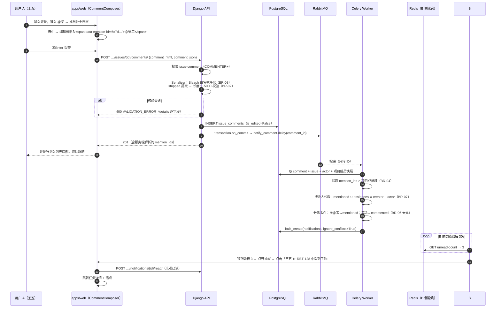
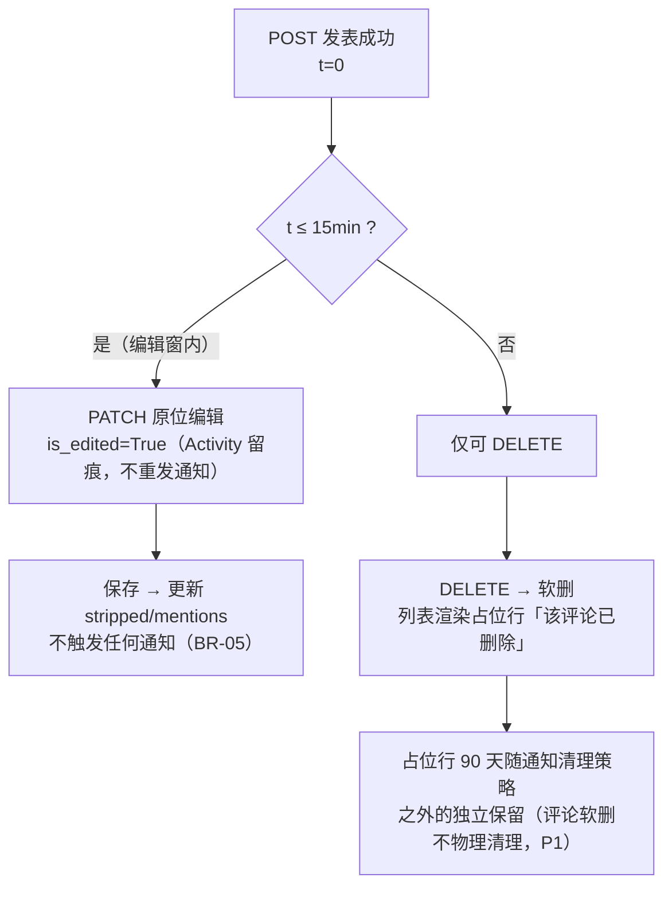
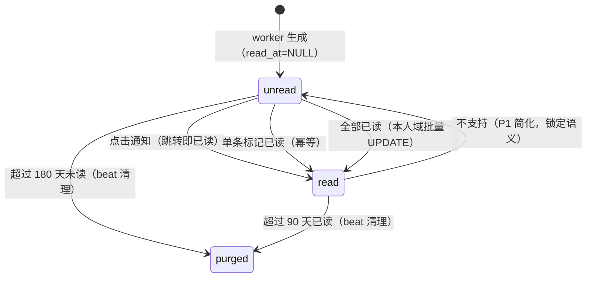
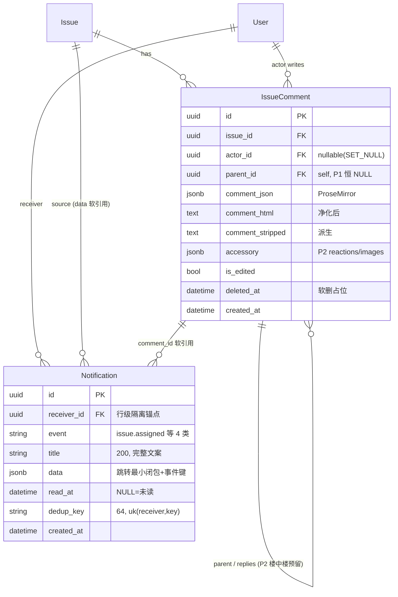

# 任务评论 / @提醒 / 通知中心

| 元信息项 | 内容 |
| --- | --- |
| 文档编号 | COLLAB-001 |
| 所属迭代 | Sprint 1：MVP 能力补齐（第 3 周） |
| 优先级 | P1（MVP 必备级） |
| 所属模块 | M8-COLLAB 实时协作与通知 |
| 文档状态 | 待评审（Draft） |
| 最后更新日期 | 2026-09-01 |
| 上游依据 | `docs/需求文档.md` §3.8（任务详情评论、评论@成员提醒、站内通知中心、已读/未读标记、全部已读）、§8.2 协作通知 P1 列 |
| 前置依赖 | `TASK-001/002`（Issue / 属性 / `IssueActivity` 异步写入范式）、`PROJ-002`（成员域 = @ 候选与通知接收域）、`AUTH-005`（`issue.comment` 权限点 + 按钮级 Gate）、`INFRA-004`（错误码注册表 / Celery 基础 / 日志）、`INFRA-002`（Celery worker + beat + Redis） |
| 下游依赖 | `COLLAB-002`（P2 楼中楼 / 表情 / 图片评论——消费 `parent_id` 与 `accessory` 预留列）、`COLLAB-003`（P2 项目动态流——复用 Activity/通知管道）、`COLLAB-004`（P2 WebSocket 把 30s 轮询升级为推送）、`RPT-001`（工作台通知摘要卡消费未读数）、`TASK-007`（P2 多执行人事件源扩展） |
| 架构基线 | [`api-conventions.md`](../architecture/api-conventions.md) §2.5（comments 端点）、§4（信封 / 游标）、§8（错误码）、§10.5（`on_commit` 副作用纪律）；[`rbac-permission-model.md`](../architecture/rbac-permission-model.md) §5.5（Notification 行级隔离：`filter(receiver=user)`）；[`unified-issue-model.md`](../architecture/unified-issue-model.md) §2.1 ER（IssueComment 基线：issue / actor / **parent_id 楼中楼预留** / comment_json / comment_html）、§2.10（Activity 异步范式） |
| 竞品参考 | Plane（IssueComment：comment_html/stripped + accessory JSONB；@mention 以 ProseMirror 节点 id 存储；Notification 表 + unread 计数端点 + 前端轮询）、Ones（企业消息中心：站内/邮件/IM 多通道 + 通知粒度权限 + 静默时段） |
| 工作量估算 | 后端 3 人日 / 前端 3 人日 / 联调与测试 1.5 人日，合计 **7.5 人日** |

> **范围声明**：交付扁平单层评论（CRUD + 15 分钟编辑窗口）、@提及解析与提醒、站内通知中心（未读数 / 列表 / 单条已读 / 全部已读）与四类核心事件通知。楼中楼 / 表情 / 图片评论（P2 `COLLAB-002`，模型预留列本迭代建齐）、项目动态流（P2 `COLLAB-003`）、WebSocket 实时推送（P2 `COLLAB-004`，P1 为 30s 轮询）、邮件通知（P3 静默策略配套）不在范围。

---

## 1. 概述

### 1.1 功能定位

派任务（`TASK-002`）解决了「谁做」，评论与通知解决「怎么说」——这是 MVP 协作闭环的最后一公里：A 在 B 的任务下评论「@B 接口今天能好吗」，B 的铃铛出现红点，点进来回到任务上下文并锚定那条评论。没有这条链路，任务系统只是单人清单；有了它，10 人团队的日常沟通可以完全留在任务上下文里，不再散落到群聊。

本文档同时建立全系统**通知基础设施**（`Notification` 模型 + `on_commit → Celery` 异步生成管道 + 幂等去重 + 未读计数端点）。P2 的实时推送（`COLLAB-004`）只是把「轮询传输层」换成「WebSocket 传输层」，数据模型、生成管道、去重规则、已读语义全部不动——本迭代按终局模型建表，避免 P2 迁移。

**工程上必须一次做对的三件事**：

1. **通知生成全异步 + 幂等**——评论 / 指派 / 属性变更的请求线程只投递 Celery 任务，通知由 worker `bulk_create(ignore_conflicts)` 落库；重试、重投、批量操作都不产生重复通知。这是对 Plane 早期「请求线程内同步生成通知拉高 P95」已知问题的前置规避（§6.1）。
2. **XSS 防线在服务端**——评论是用户产生的 HTML，前端编辑器 schema 只是第一道门；服务端 Bleach 白名单净化是唯一可信边界（UT-01 以注入载荷验证）。
3. **接收域显式代数**——`接收人 = (mentions ∪ assignees ∪ creator) − 操作者 − 域外成员`，写进规则表而非散落代码；P2 加参与人 / 关注者时只需扩展集合并同步本文档。

### 1.2 交付项

| 交付项 | 说明 |
| --- | --- |
| 评论 CRUD | 任务详情「评论」Tab：发表（Tiptap 纯文本 + @ + 链接）、编辑（15 分钟窗口，原位 + 倒计时）、删除（软删占位行） |
| @提及 | 评论中的 `@成员`：编辑器 Mention 锚点（`data-mention-id`）；服务端解析 → 域校验 → 去重 → 触发提醒 |
| `IssueComment` 模型 | 架构基线全列：`comment_json` / `comment_html` / `comment_stripped` / `accessory` JSONB / `parent_id` 楼中楼预留（P1 建列不启用） |
| `Notification` 模型 | receiver / event / title / data / read_at / `dedup_key` 唯一约束 |
| 四类事件通知 | `issue.assigned` / `issue.mentioned` / `issue.commented` / `issue.updated`（仅负责人 + 创建者收摘要） |
| 生成管道 | `notify_comment` / `notify_issue_event` 两个 Celery 任务 + epoch 批量合并 |
| 通知中心 | 顶栏铃铛（未读徽标 99+，30s 轮询）→ 抽屉（时间分组列表 / 单条点击已读跳转 / 全部已读 / 仅看未读） |
| 清理任务 | 已读超 90 天、未读超 180 天物理清理（beat） |

### 1.3 目标用户

| 用户 | 场景 | 关注点 |
| --- | --- | --- |
| 任务负责人 | 被派活 / 被 @ | 铃铛红点不漏；点开直达任务并定位评论 |
| 评论者 | 沟通 | @ 有自动补全；发出去 15 分钟内可改 |
| 全体 | 降噪 | 自己操作不给自己发通知；被 @ 与被评论只收一条；全部已读一键清 |
| 管理视角 | 追溯 | 谁、何时、说了什么、改过没有（`is_edited` + Activity 留痕） |

### 1.4 关键约定：通知通道演进矩阵

| 阶段 | 传输层 | 本迭代复用的资产 | 新增内容 |
| --- | --- | --- | --- |
| **P1（本文档）** | 30s 轮询（`unread-count`）+ 按需拉取（列表） | — | 模型 / 管道 / 去重 / 已读语义 / 中心 UI |
| P2 `COLLAB-004` | WebSocket 推送（live 服务） | 模型、生成管道、去重、`unread-count` 与列表端点（保留为降级通道） | live 房间广播、连接降级回退轮询 |
| P3 | 多通道路由（邮件 / IM Webhook） | 模型、事件源 | 通道路由表、静默时段、按事件粒度开关 |

**对 P1 的两条锁定**（P2/P3 不得破坏）：

1. `Notification.dedup_key = hash(event, issue_id, actor_id, epoch, receiver_id)` 的唯一约束语义——「同一操作对同一人至多一条」；
2. 已读语义单向（unread → read），P1 不提供「重新标为未读」。

### 1.5 范围边界

| 能力 | P1（本文档） | 归属 |
| --- | --- | --- |
| 扁平评论 CRUD + 编辑窗口 + 软删占位 | ✅ | — |
| @提及（评论内）+ 提醒通知 | ✅ | — |
| 任务描述中的 @ 提及提醒 | ✅（描述编辑新增锚点同样触发 `issue.mentioned`） | — |
| 通知中心（轮询 / 已读 / 全部已读 / 仅看未读） | ✅ | — |
| 楼中楼回复 | ❌（`parent_id` 列已建，P1 强制 NULL） | P2 `COLLAB-002` |
| 表情反应 / 图片评论 | ❌（`accessory` JSONB 已预留） | P2 `COLLAB-002`（图片经 `FILE-001` 通道） |
| 项目动态流 / 任务动态时间线 | ❌（`IssueActivity` P0 已埋点，消费在 P2） | P2 `COLLAB-003` |
| WebSocket 实时推送 | ❌（30s 轮询先行） | P2 `COLLAB-004` |
| 邮件 / IM 通道 | ❌ | P3（`INFRA-004` SMTP 可空降级已预留） |
| 静默时段 / 通知粒度权限 | ❌ | P3 |
| 评论附件（文件） | ❌ | P2（图片先行） |

### 1.6 前置依赖

| 依赖 | 内容 | 阻塞原因 |
| --- | --- | --- |
| `TASK-001/002` | Issue 属性（通知文案需类型 / 状态名）；`IssueActivity` 的 `on_commit → Celery` 写入范式（本文档管道与之同构） | 文案无语义、管道无参照 |
| `PROJ-002` | 项目成员域（@ 候选集与通知接收域的判定基础） | @ 越界、通知泄密 |
| `AUTH-005` | `issue.comment` 权限点（PROJ_COMMENTER+）与 `<PermissionGate>` | 越权评论 |
| `INFRA-004` | 错误码注册表、统一信封、Celery + RabbitMQ 可用、结构化日志 | 规范与运行时 |
| `RPT-001` | 工作台「通知摘要卡」消费 `unread-count`（并行交付，接口互锁） | 未读数双口径 |

### 1.7 竞品参考

| 竞品 | 参考点 | 处置 |
| --- | --- | --- |
| Plane | `IssueComment`（comment_html / comment_stripped / accessory JSONB）；@mention 存 ProseMirror 节点 id；`Notification` 表 + 独立 `unread_notifications` 计数端点 + 前端轮询 | 数据模型完全对齐（含楼中楼 `parent` 预留）；生成管道改全异步（规避其同步写先例） |
| Plane | 早期版本评论通知在请求线程内同步生成，批量操作拉高 P95（社区 issue 有记录），后逐步异步化 | 从第一天即全异步（§6.1） |
| Ones | 消息中心多通道（站内 / 邮件 / 企业微信 / 钉钉）、按事件粒度接收开关、静默时段 | 通道与策略 P3 对齐；P1 只做站内单通道 |

---

## 2. 业务逻辑

### 2.1 发表评论与 @ 提醒全链路



### 2.2 评论生命周期（编辑窗口）



**15 分钟窗口的产品依据**：够修正错别字 / 补充一句话；不够「改口否认说过」——超过窗口的内容变更轨迹由「删除 + 重发」显式完成，历史语境不被动篡改。`is_edited` 徽标让阅读者知道内容变过。

### 2.3 通知事件源表（P1 四类）

| 事件 | 触发 | 接收人 | title 文案 | data 载荷 |
| --- | --- | --- | --- | --- |
| `issue.assigned` | 指派集合**新增**成员（含创建时首派；移除不通知） | 新增被指派人 − 操作者 | 「{actor} 将 {RBT-128} 指派给你」 | `{issue_id, project_id, workspace_slug, issue_key, actor}` |
| `issue.mentioned` | 评论 **或** 任务描述编辑中**新增** @ 锚点 | 被 @ 者 − 操作者 | 「{actor} 在 {RBT-128} 中提到了你」 | 同上 + `comment_id`（描述来源无此项） |
| `issue.commented` | 新评论 | 指派人 ∪ 创建者 − 操作者 − **已 @ 者**（@ 已单独通知，去重） | 「{actor} 评论了 {RBT-128}」 | 同上 + `comment_id` |
| `issue.updated` | 关键属性变更（state / priority / target_date / assignees 增删） | 指派人 ∪ 创建者 − 操作者 | 「{actor} 更新了 {RBT-128}：状态 待办 → 已完成」 | 同上 + `changes` 摘要数组 |

**epoch 批量合并**：`BOARD-001` 看板批量拖拽 50 个任务（共享同一 `epoch`）时，同一操作者对同一接收人产生 50 个同型事件——`dedup_key` 含 epoch 会生成 50 条。P1 约定：批量路径的 `notify_issue_event` 先在 worker 内**按 (event, actor, receiver) 归并 title 为「更新了 50 个任务」单条**（epoch 相同），再落库。归并发生在生成侧而非查询侧，列表端不聚合。

### 2.4 通知已读状态机



| 迁移 | 触发 | 幂等性 |
| --- | --- | --- |
| unread → read（点击） | 前端点击行 → `POST …/read/`（不等响应即跳转） | 已读再标 200 无变化 |
| 全部已读 | `POST …/read-all/`：`filter(receiver=user, read_at__isnull=True).update(read_at=now)` 单事务 | 重复调用 0 行更新 |
| 实体失效 | 点击时 `data.issue_id` 对应任务已软删 / 用户被移出项目 | 前端跳转降级 Toast「原任务已不可访问」，通知仍标记已读 |

### 2.5 业务规则表

| 编号 | 规则 | 判定位置 | 违反后果 |
| --- | --- | --- | --- |
| BR-01 | 评论权限 `issue.comment`（PROJ_COMMENTER+）；编辑 / 删除仅**本人**评论（对象级校验） | `AUTH-005` 矩阵 + ViewSet | 403 `PERM_ROLE_INSUFFICIENT` / `PERM_DENIED` |
| BR-02 | 评论长度：`comment_stripped` 去除空白后 1~5000 字符；空评论（仅空白 / 仅 @）拒绝 | Serializer | 400 `VALIDATION_ERROR` + `REQUIRED`/`TOO_LONG` |
| BR-03 | HTML 净化白名单：标签 `span(data-mention-id) / a(href) / strong / em / code / br / p`；其余标签与**全部**属性剥离（Bleach） | Serializer | 静默净化（200，净化后内容） |
| BR-04 | @ 候选域 = 当前项目成员 ∪ 隐式 WS_OWNER/WS_ADMIN；锚点 `data-mention-id` 必须在域内，域外锚点净化为纯文本（不产生通知） | 解析器 | 静默降级 |
| BR-05 | 编辑窗口：发表后 **15 分钟**内可 PATCH；编辑写 `IssueActivity(updated, comments)` 与 `is_edited=True`，**不重复通知** | Service | 超窗 409 `RESOURCE_STATE_INVALID`（details 提示可删除重发） |
| BR-06 | 同一评论内「被 @ 者」只收 `mentioned` 一条（即便他同时是指派人 / 创建者）——事件分派互斥 | Worker | — |
| BR-07 | 通知接收域剔除：操作者本人、非项目成员、软删用户 | Worker | — |
| BR-08 | 幂等键 `dedup_key = sha256(event + issue_id + actor_id + epoch + receiver_id)`；`(receiver, dedup_key)` 唯一约束 + `bulk_create(ignore_conflicts)`——worker 重试 / MQ 重投零重复 | DB + Worker | — |
| BR-09 | 通知保留：已读 90 天、未读 180 天（beat 物理清理） | beat | — |
| BR-10 | 未读计数展示 99+；`unread-count` 端点走 `idx_notif_receiver_unread` 索引 O(1)，与列表分页端点分离 | 前端 / ORM | — |
| BR-11 | 跳转语义：点击 → 标记已读（乐观，不阻塞跳转）→ 导航 `/{ws}/{proj}/issues/{id}` + `#comment-{id}` 锚点高亮 2s；实体失效则 Toast 降级 | 前端 | — |
| BR-12 | 全部已读为**本人域**动作：`filter(receiver=user).update(read_at=now)` 批量 UPDATE 单事务；他人通知不受影响 | Service | — |
| BR-13 | 评论列表按 `created_at` **正序**（会话流）；游标向上加载历史（`?before=`）；倒序开关 P2 | ViewSet | — |
| BR-14 | `parent_id` P1 强制 NULL（楼中楼 P2 启用）；`comment_json` 与 `comment_html` 同请求成对提交（与 `TASK-001` 描述三列纪律一致） | Serializer | 带非空 `parent_id` 400 |
| BR-15 | 通知 `data` 结构约定：必含 `issue_id / project_id / workspace_slug / issue_key / actor` 五键（前端跳转的最小闭包）；事件特有键（`comment_id` / `changes`）附加 | Worker | — |

### 2.6 异常处理表

| 异常场景 | 触发条件 | HTTP / 错误码 | 前端表现 | 后端处理 |
| --- | --- | --- | --- | --- |
| XSS 注入 | `<script>` / `` / 伪协议链接 | 200（净化后） | 内容按净化结果展示，无脚本执行 | 白名单净化（BR-03）；注入样本入库用于回归（UT-01） |
| 空评论 | 仅空白 / 仅 @ | 400 `VALIDATION_ERROR` + `REQUIRED` | 输入框红框「评论不能为空」 | — |
| 超长 | stripped > 5000 | 400 + `TOO_LONG` | 字数统计红字 + 截断提示 | — |
| @ 数超限 | 单条评论 @ > 20 人 | 409 `RESOURCE_LIMIT_EXCEEDED` | Toast「单条评论最多 @ 20 人」 | — |
| 编辑超窗 | > 15 分钟 PATCH | 409 `RESOURCE_STATE_INVALID` | 行内「已超编辑窗口，可删除重发」 | — |
| 编辑他人评论 | 非本人 | 403 `PERM_DENIED` | Toast | 对象级校验 |
| worker 失败重试 | MQ 抖动 / DB 瞬断 | — | 通知延迟到达（≤ 重试窗） | `max_retries=3` 指数退避；`ignore_conflicts` 保证重跑幂等 |
| 通知实体失效 | 点击时任务已删 / 已被移出项目 | — | Toast「原任务已不可访问」 | 通知已标已读，不删除记录 |
| 轮询失败 | 网络中断 | — | 保留上次计数 | 指数退避 30s→60s→120s 封顶，恢复即同步 |
| 评论已删后编辑 | 软删记录被 PATCH | 404 `RESOURCE_NOT_FOUND` | — | 软删行不可编辑 |

### 2.7 边界条件表

| 边界场景 | 限制值 | 超出处理方式 |
| --- | --- | --- |
| 单评论 @ 数 | 20 | 409（BR 见 §2.6） |
| 单任务评论数 | 无硬限 | 首屏 30 条 + 向上加载（游标 `before`） |
| 未读通知堆积 | 无硬限（180 天清理） | 99+ 封顶展示；「仅看未读」过滤 |
| 同 epoch 批量 | 生成侧归并为 1 条 / (event, actor, receiver) | 「更新了 50 个任务」单条 |
| 通知 title 长度 | 200 字符 | 截断 + 省略号（实体名优先保留） |
| 评论内链接数 | 无限制（净化后 a[href] 合法即留） | — |
| 自己 @ 自己 | 允许插入锚点 | 接收域剔除操作者，不产生通知 |

---

## 3. UI/UX 设计

### 3.1 评论 Tab（任务详情 Drawer，描述与属性区之下）

```
┌──────────────────────────────────────────────────────────────────┐
│ 💬 评论 5                                                        │
├──────────────────────────────────────────────────────────────────┤
│ ┌──┐ 王五  ·  3 分钟前                                ✏️  🗑      │
│ │头像│ <span data-mention-id="6c7d">@梁工</span> 接口今天能好吗？  │
│ └──┘ （@ 高亮蓝字，hover 弹成员卡片）                              │
│ ├──────────────────────────────────────────────────────────────┤ │
│ ┌──┐ 梁工  ·  1 分钟前  ·  已编辑                                 │
│ │头像│ 下午 3 点前给，联调数据我先 Mock 一份。                     │
│ └──┘                                                              │
│ ├──────────────────────────────────────────────────────────────┤ │
│ ┌──┐ 张三  ·  昨天                                                │
│ │头像│ 该评论已删除                                               │
│ └──┘ （灰字占位，无操作按钮）                                      │
│ ├──────────────────────────────────────────────────────────────┤ │
│ ＋ 加载更早的 12 条评论…                                          │
├──────────────────────────────────────────────────────────────────┤
│ ┌──────────────────────────────────────────────────────────────┐ │
│ │ @ B I  💬  🔗                                              │ │ ← 精简工具条
│ │ 评论…                                                        │ │
│ │                                    （⌘Enter 发表） 0/5000     │ │
│ └──────────────────────────────────────────────────────────────┘ │
└──────────────────────────────────────────────────────────────────┘
```

**编辑态**（原位替换为输入框）：

```
│ ┌──┐ 王五 · 编辑中 · 剩余 04:32 ⏱                                  │
│ │头像│ [ 接口今天 16 点前能给吗？（多了个 6）           ] 取消 | 保存│
│ └──┘                                                              │
```

### 3.2 @ 补全浮层

```
        │ 评论输入：@lia┌──────────────────────┐
        │              │ 🔍 过滤：lia           │
        │              ├──────────────────────┤
        │              │ ● 梁工  liang@rp.dev  │ ← ↑↓ 选择，Enter 确认
        │              │ ○ 李安  lia@rp.dev    │
        │              └──────────────────────┘
```

| 元素 | 规格 |
| --- | --- |
| 触发 | 键入 `@` + ≥0 字符；`Esc` 关闭；退格删除触发词后关闭 |
| 候选源 | 项目成员缓存（`PROJ-002` 数据 + WS_OWNER/ADMIN 隐式成员），按昵称 / 邮箱前缀模糊过滤 |
| 键盘 | ↑↓ 移动（`aria-activedescendant` 跟随）、Enter 选中、Esc 关闭；浮层 `role="listbox"` |
| 插入产物 | `<span data-mention-id="{uuid}" class="mention">@梁工</span>`（蓝色 `text-primary-600`） |
| hover 成员卡片 | 已删 / 已移出成员的旧锚点：卡片提示「已不在项目」，渲染保持蓝字 |

### 3.3 通知中心（顶栏铃铛 → 抽屉）

```
┌──────────────────────────────── 420px ─────────────────────────┐
│ 通知                                              ［仅看未读］全部已读│
├────────────────────────────────────────────────────────────────┤
│ 今天                                                             │
│ ● 👤 王五 在 RBT-128 中提到了你                        3 分钟前  │
│ ● 👤 李四 将 RBT-130 指派给你                          10 分钟前 │
│ ○ 👤 王五 更新了 RBT-128：状态 待办 → 进行中            1 小时前  │
├────────────────────────────────────────────────────────────────┤
│ 昨天                                                             │
│ ● 💬 张三 评论了 RBT-130                              昨天 18:22│
│ ○ 👤 系统 · 你加入项目「RabbitProjects」               昨天 09:00│
├────────────────────────────────────────────────────────────────┤
│ 更早 (12)                                                        │
│   …                                                             │
└────────────────────────────────────────────────────────────────┘
   ● = 未读蓝点     点击行 → 已读 + 跳转任务详情并锚定
```

| 元素 | 规格 |
| --- | --- |
| 铃铛 | 顶栏固定；徽标 `bg-red-500` 圆形，数字 99+ 封顶；`aria-live="polite"` 播报变化 |
| 抽屉 | 右侧滑入 420px；`role="dialog"`；打开时自动拉取列表（不全量预取） |
| 分组 | 今天 / 昨天 / 更早（`date-fns` `isToday/isYesterday`） |
| 事件图标 | `issue.assigned` 👤 / `mentioned` @ / `commented` 💬 / `updated` ✏️（蓝点同时存在，图标非唯一信号） |
| 「仅看未读」 | 开关态同步 URL query（`?unread_only=true`），刷新保持 |
| 「全部已读」 | 确认 Toast「已将 N 条标为已读」；徽标动画归零 |
| 空态 | 「没有新消息」插画 + 「去协作」引导按钮 |

### 3.4 交互细节表

| 交互动作 | 触发方式 | 反馈效果 | 加载态 / 空态 / 失败态 |
| --- | --- | --- | --- |
| 发表评论 | ⌘Enter / 按钮 | 行划入列表底部 + 滚动跟随 + 输入框清空保持焦点 | 按钮 spinner；失败保留草稿 + Toast |
| 乐观插入 | 提交瞬间 | 本地行（`opacity-60`）插入，201 后替换正式行 | 失败移除 + 草稿恢复 |
| @ 补全 | `@` + 字符 | 浮层过滤 | 无匹配显示「无成员」 |
| 编辑 | 行内 ✏️（本人 + Gate） | 原位变输入框 + 倒计时（最后 30s 变橙） | 超窗提交 → 行内提示 |
| 删除 | 行内 🗑 → 确认 | 行淡出 → 占位行替换 | — |
| 点击通知 | 行点击 | 蓝点消失（乐观）→ 跳转 + 锚点高亮 2s | 实体失效 Toast 降级 |
| 全部已读 | 头部按钮 | 全部蓝点淡出 + 徽标归零动画 | — |
| 铃铛轮询 | 30s 自动 | 徽标数变化时轻微弹跳动画（≤1 次/30s） | 失败静默退避 |

### 3.5 响应式适配

| 断点 | 布局变化 |
| --- | --- |
| ≥ 1280px | 评论全宽；抽屉 420px 并存 Drawer（720px 详情）不遮蔽 |
| 768 ~ 1279px | 抽屉覆盖详情 Drawer；工具条收纳表情等次要按钮 |
| < 768px | 评论输入框吸底（键盘弹出时 `interactive-widget=resizes-content`）；抽屉全屏 |

### 3.6 无障碍要求

- 铃铛按钮 `aria-label="通知，N 条未读"`；徽标数字变化 `aria-live="polite"` 播报。
- 通知行 `role="link"` + `aria-label` 完整朗读（「王五 在 RBT-128 中提到了你，3 分钟前，未读」）。
- 评论输入框 `aria-label="评论"`；Mention 浮层 `role="listbox"` + `aria-activedescendant`；键盘全可达。
- 已读 / 未读除蓝点外提供 `sr-only`「未读」文本（色弱可达）。
- 编辑倒计时用文本呈现（非纯颜色），最后 30s 橙色同时有 ⏱ 图标。

---

## 4. 技术架构

### 4.1 数据模型

#### 4.1.1 IssueComment（对齐架构基线全列）

```python
# apps/api/plane/db/models/comment.py
from django.db import models

from plane.db.models.base import BaseModel


class IssueComment(BaseModel):
    """任务评论 —— 对标 Plane IssueComment

    扁平单层（P1）；P2 COLLAB-002 启用 parent 楼中楼与 accessory 表情/图片。
    列一次建齐（unified-issue-model.md §2.1 ER 基线 + P0 全列原则），P2 零 DDL。
    """

    class Source(models.TextChoices):
        IN_APP = "in_app", "站内"
        # P2+: slack / webhook（INTG-003 回写评论）

    issue = models.ForeignKey(
        "db.Issue", on_delete=models.CASCADE, related_name="comments", verbose_name="所属任务"
    )
    actor = models.ForeignKey(
        "db.User", on_delete=models.SET_NULL, null=True, related_name="issue_comments", verbose_name="评论人"
    )
    # ── 楼中楼预留（P2 COLLAB-002 启用；P1 强制 NULL，Serializer 拒绝非空）──
    parent = models.ForeignKey(
        "self", on_delete=models.CASCADE, null=True, blank=True,
        related_name="replies", verbose_name="父评论",
        help_text="P1 恒为 NULL；P2 楼中楼两级结构",
    )

    # ── 内容三列（与 Issue 描述三列同纪律：json/html 成对提交，stripped 服务端派生）──
    comment_json = models.JSONField(
        default=dict, blank=True, verbose_name="评论-ProseMirror JSON",
        help_text="Tiptap 编辑器原生格式，编辑回显用",
    )
    comment_html = models.TextField(verbose_name="评论 HTML（净化后）")
    comment_stripped = models.TextField(verbose_name="纯文本", help_text="长度校验 / 搜索 / 通知摘要")

    accessory = models.JSONField(
        default=dict, blank=True, verbose_name="扩展数据",
        help_text='P2: {"reactions":[{"emoji":"👍","user_ids":[…]}],"images":[asset_id,…]}——Plane 同构预留',
    )

    is_edited = models.BooleanField(default=False, verbose_name="是否编辑过")
    deleted_at = models.DateTimeField(null=True, blank=True, db_index=True, verbose_name="软删时间")

    class Meta(BaseModel.Meta):
        db_table = "issue_comments"
        verbose_name = "任务评论"
        ordering = ("created_at",)                     # 会话流正序（BR-13）
        indexes = [
            # 评论列表取数：WHERE issue_id=? AND deleted_at IS NULL ORDER BY created_at
            models.Index(fields=["issue", "created_at"], name="idx_comment_issue_time"),
        ]

    def save(self, *args, **kwargs):
        from django.utils.html import strip_tags
        if self.comment_html:
            self.comment_stripped = strip_tags(self.comment_html)   # 服务端派生，单一真相
        super().save(*args, **kwargs)
```

#### 4.1.2 Notification

```python
# apps/api/plane/db/models/notification.py
import hashlib

from django.db import models

from plane.db.models.base import BaseModel


class Notification(BaseModel):
    """站内通知 —— 行级隔离：QuerySet 恒 filter(receiver=user)（rbac §5.5）

    通道演进：P1 轮询消费 → P2 COLLAB-004 WebSocket 推送（本表不动）。
    """

    class Event(models.TextChoices):
        ISSUE_ASSIGNED = "issue.assigned", "被指派"
        ISSUE_MENTIONED = "issue.mentioned", "被提及"
        ISSUE_COMMENTED = "issue.commented", "任务被评论"
        ISSUE_UPDATED = "issue.updated", "任务被更新"
        # P2+: comment.replied / issue.archived / member.joined …

    receiver = models.ForeignKey(
        "db.User", on_delete=models.CASCADE, related_name="notifications", verbose_name="接收人"
    )
    event = models.CharField(max_length=32, choices=Event.choices, db_index=True, verbose_name="事件类型")
    title = models.CharField(max_length=200, verbose_name="标题", help_text="可直接展示的完整文案")
    data = models.JSONField(
        default=dict, verbose_name="跳转载荷",
        help_text="必含 issue_id/project_id/workspace_slug/issue_key/actor（BR-15）+ 事件特有键",
    )
    read_at = models.DateTimeField(null=True, blank=True, db_index=True, verbose_name="已读时间")
    dedup_key = models.CharField(
        max_length=64, blank=True, default="", verbose_name="幂等键",
        help_text="sha256(event+issue+actor+epoch+receiver)——worker 重试/MQ 重投零重复",
    )

    class Meta(BaseModel.Meta):
        db_table = "notifications"
        verbose_name = "站内通知"
        ordering = ("-created_at",)
        constraints = [
            models.UniqueConstraint(
                fields=["receiver", "dedup_key"],
                condition=~models.Q(dedup_key=""),
                name="uniq_notif_dedup",
            ),
        ]
        indexes = [
            # 未读计数（O(1)）+ 未读列表过滤：WHERE receiver=? AND read_at IS NULL
            models.Index(fields=["receiver", "read_at", "created_at"], name="idx_notif_receiver_unread"),
            # 清理任务扫描：WHERE read_at < now-90d OR (read_at IS NULL AND created_at < now-180d)
            models.Index(fields=["read_at", "created_at"], name="idx_notif_retention"),
        ]

    @staticmethod
    def build_dedup_key(*, event: str, issue_id, actor_id, epoch: str, receiver_id) -> str:
        raw = f"{event}|{issue_id}|{actor_id}|{epoch}|{receiver_id}"
        return hashlib.sha256(raw.encode()).hexdigest()
```

#### 4.1.3 索引说明

| 索引 | 服务的查询 | 量级评估 |
| --- | --- | --- |
| `idx_comment_issue_time` | 评论列表（每任务通常 < 200 条） | 低频低量，无分区需求 |
| `idx_notif_receiver_unread` | `unread-count`（每 30s × 每在线用户）+ 仅看未读过滤 | **全表最高频查询**，必须索引覆盖 |
| `idx_notif_retention` | beat 清理扫描（日频） | 批量 DELETE 走索引定位 |

> `notifications` 是增长第二快的表（仅次于 `issue_activities`）：10 人团队 × 20 通知/日 ≈ 200 行/日，90/180 天保留策略下稳态 ~4 万行，P1 无分区需求；P3 企业版按月分区（与 Activity 同策略）。

### 4.2 ER 图



> `Notification` 对 Issue / Comment 是**软引用**（data 内 ID，无 FK）：通知的生存期独立于实体（实体删除后通知仍可展示为「原任务已不可访问」），FK 反而会造成级联误删历史。

### 4.3 API 定义

| # | 方法 | 路径 | 描述 | 权限 | 成功码 |
| --- | --- | --- | --- | --- | --- |
| 1 | `GET` | `…/issues/{issue_id}/comments/?cursor=&before=` | 评论列表（正序游标） | `project.read` | `200` |
| 2 | `POST` | `…/issues/{issue_id}/comments/` | 发表评论 | `issue.comment` | `201` |
| 3 | `PATCH` | `…/issues/{issue_id}/comments/{comment_id}/` | 编辑（15 分钟窗口） | 本人 + `issue.comment` | `200` |
| 4 | `DELETE` | `…/issues/{issue_id}/comments/{comment_id}/` | 删除（软删占位） | 本人 | `200` |
| 5 | `GET` | `/api/v1/users/me/notifications/?unread_only=&cursor=` | 通知列表 | 本人 | `200` |
| 6 | `GET` | `/api/v1/users/me/notifications/unread-count/` | 未读计数 | 本人 | `200` |
| 7 | `POST` | `/api/v1/users/me/notifications/{id}/read/` | 单条已读（幂等） | 本人 | `200` |
| 8 | `POST` | `/api/v1/users/me/notifications/read-all/` | 全部已读（本人域） | 本人 | `200` |
| 9 | `GET` | `/api/v1/workspaces/{slug}/members/search/?q=` | @ 候选搜索 | `project.read` | `200` |

> 通知端点挂在 `/users/me/`（不嵌套 workspace——通知跨项目聚合，与 `RPT-001` 的「我的待办」同设计理由）；行级隔离由 `filter(receiver=request.user)` 在 `get_queryset` 收口。

#### 4.3.1 `POST …/issues/{issue_id}/comments/` — 发表

**请求**

```json
{
  "comment_html": "<p><span data-mention-id=\"6c7d1a2b-3e4f-4a5b-9c8d-7e6f5a4b3c2d\">@梁工</span> 接口今天能好吗？</p>",
  "comment_json": {
    "type": "doc",
    "content": [
      { "type": "paragraph",
        "content": [
          { "type": "mention", "attrs": { "id": "6c7d1a2b-3e4f-4a5b-9c8d-7e6f5a4b3c2d", "label": "@梁工" } },
          { "type": "text", "text": " 接口今天能好吗？" }
        ] }
    ]
  }
}
```

**成功响应 `201 Created`**

```json
{
  "status": "success",
  "data": {
    "id": "cm1b2c3d-4e5f-4a6b-8c7d-9e0f1a2b3c4d",
    "actor": { "id": "a2b3c4d5-…", "display_name": "王五", "avatar_url": "https://…" },
    "comment_html": "<p><span data-mention-id=\"6c7d…\">@梁工</span> 接口今天能好吗？</p>",
    "comment_stripped": "@梁工 接口今天能好吗？",
    "mention_ids": ["6c7d1a2b-3e4f-4a5b-9c8d-7e6f5a4b3c2d"],
    "is_edited": false,
    "created_at": "2026-09-01T09:30:00.000Z"
  }
}
```

> `mention_ids` 由**服务端解析净化后 HTML** 得出并回传——前端不做通知域判定（BR-04 权威在后端）。

**失败响应 `400`（空评论）**

```json
{
  "status": "error",
  "error": {
    "code": "VALIDATION_ERROR",
    "message": "请求参数校验失败",
    "details": [{ "field": "comment_html", "code": "REQUIRED", "message": "评论不能为空" }],
    "request_id": "01JBX5N3S9TB6P0Q4R7X8Y9Z0B"
  }
}
```

**失败响应 `409`（@ 超限）**：`RESOURCE_LIMIT_EXCEEDED` + details「单条评论最多 @ 20 人」。
**失败响应 `403`（VIEWER 评论）**：`PERM_ROLE_INSUFFICIENT`。

#### 4.3.2 `GET …/issues/{issue_id}/comments/` — 列表

**请求**

```http
GET /api/v1/workspaces/acme/projects/9d8e…/issues/8a1f…/comments/?per_page=30 HTTP/1.1
```

**成功响应 `200`（正序；翻历史用 `?before=<cursor>`）**

```json
{
  "status": "success",
  "data": [
    {
      "id": "cm0a1b2c-…",
      "actor": { "id": "e4f5…", "display_name": "张三", "avatar_url": null },
      "comment_html": null,
      "comment_stripped": null,
      "is_deleted": true,
      "created_at": "2026-08-31T08:00:00.000Z"
    },
    {
      "id": "cm1b2c3d-…",
      "actor": { "id": "a2b3…", "display_name": "王五", "avatar_url": "https://…" },
      "comment_html": "<p><span data-mention-id=\"6c7d…\">@梁工</span> 接口今天能好吗？</p>",
      "comment_stripped": "@梁工 接口今天能好吗？",
      "mention_ids": ["6c7d…"],
      "is_edited": false,
      "is_deleted": false,
      "created_at": "2026-09-01T09:30:00.000Z"
    }
  ],
  "meta": {
    "next_cursor": "30:1:0", "prev_cursor": "30:0:1",
    "next_page_results": false, "prev_page_results": true,
    "count": 2, "total_count": 17, "total_pages": 1, "page": 1, "per_page": 30
  }
}
```

> 软删行返回 `is_deleted: true` + 内容置 null（占位渲染所需的最小信息）；不可编辑不可删除。

#### 4.3.3 `PATCH …/comments/{comment_id}/` — 编辑

**请求**

```json
{
  "comment_html": "<p><span data-mention-id=\"6c7d…\">@梁工</span> 接口今天 16 点前能给吗？</p>",
  "comment_json": { "type": "doc", "content": [ /* 同构省略 */ ] }
}
```

**成功响应 `200`**：`is_edited: true` + 净化后内容。

**失败响应 `409`（超窗）**

```json
{
  "status": "error",
  "error": {
    "code": "RESOURCE_STATE_INVALID",
    "message": "评论已超过 15 分钟编辑窗口",
    "details": [{ "field": "comment_id", "code": "EDIT_WINDOW_EXPIRED", "message": "可删除后重新发表" }],
    "request_id": "01JBX5N3S9TB6P0Q4R7X8Y9Z0C"
  }
}
```

> `EDIT_WINDOW_EXPIRED` 作为 `details[].code` 子码（字段级子码不占用全局错误码注册表），HTTP 层复用 `RESOURCE_STATE_INVALID`——「资源当前状态不允许该操作」的既有语义。

**失败响应 `403`（编辑他人评论）**：`PERM_DENIED` +「只能编辑自己发表的评论」。

#### 4.3.4 `DELETE …/comments/{comment_id}/`

**成功响应 `200`**

```json
{ "status": "success", "data": { "id": "cm1b2c3d-…", "is_deleted": true } }
```

> 软删（BR：占位行）；重复 DELETE 已删记录返回 404。

#### 4.3.5 `GET /users/me/notifications/` — 列表

**请求**

```http
GET /api/v1/users/me/notifications/?unread_only=false&per_page=20 HTTP/1.1
```

**成功响应 `200`**

```json
{
  "status": "success",
  "data": [
    {
      "id": "n1a2b3c4-…",
      "event": "issue.mentioned",
      "title": "王五 在 RBT-128 中提到了你",
      "data": {
        "issue_id": "8a1f…", "project_id": "9d8e…", "workspace_slug": "acme",
        "issue_key": "RBT-128", "actor": "王五", "comment_id": "cm1b2c3d-…"
      },
      "read_at": null,
      "created_at": "2026-09-01T09:30:01.000Z"
    },
    {
      "id": "n2b3c4d5-…",
      "event": "issue.updated",
      "title": "李四 更新了 RBT-128：状态 待办 → 进行中",
      "data": {
        "issue_id": "8a1f…", "project_id": "9d8e…", "workspace_slug": "acme",
        "issue_key": "RBT-128", "actor": "李四",
        "changes": [{ "field": "state", "old": "待办", "new": "进行中" }]
      },
      "read_at": "2026-09-01T10:00:00.000Z",
      "created_at": "2026-09-01T09:45:00.000Z"
    }
  ],
  "meta": {
    "next_cursor": "20:1:0", "prev_cursor": null,
    "next_page_results": true, "prev_page_results": false,
    "count": 2, "total_count": 15, "total_pages": 1, "page": 1, "per_page": 20,
    "unread_count": 3
  }
}
```

> `meta.unread_count` 顺带回传（打开抽屉即同步，省一次计数请求）；`?unread_only=true` 切换过滤。

#### 4.3.6 `GET /users/me/notifications/unread-count/`

**成功响应 `200`**

```json
{ "status": "success", "data": { "unread_count": 3 } }
```

> `Cache-Control: no-store`；走 `idx_notif_receiver_unread` 索引 COUNT，10 万通知量级 < 5ms（UT-14）。

#### 4.3.7 `POST …/notifications/{id}/read/` 与 `POST …/read-all/`

**单条已读 `200`（幂等）**

```json
{ "status": "success", "data": { "id": "n1a2b3c4-…", "read_at": "2026-09-01T10:02:00.000Z" } }
```

**全部已读 `200`**

```json
{ "status": "success", "data": { "updated_count": 12, "unread_count": 0 } }
```

### 4.4 核心逻辑

#### 4.4.1 服务端净化与 @ 解析

```python
# apps/api/plane/app/comments/sanitize.py
import bleach

ALLOWED_TAGS = ["p", "br", "strong", "em", "code", "a", "span"]
ALLOWED_ATTRS = {
    "a": ["href"],                       # rel/target 由 bleach 强制补齐
    "span": ["data-mention-id", "class"],
}
MENTION_RE = re.compile(r'data-mention-id="([0-9a-fA-F-]{36})"')


def sanitize_comment(html: str) -> str:
    """Bleach 白名单净化（BR-03）——服务端唯一可信边界

    - <script>//伪协议链接的标签与属性全部剥离，正文文本保留
    - a[href] 仅允许 http/https（bleach protocols）
    """
    return bleach.clean(
        html,
        tags=ALLOWED_TAGS, attributes=ALLOWED_ATTRS,
        protocols=["http", "https"], strip=True,
    )


def extract_mentions(sanitized_html: str) -> set[str]:
    """从净化后 HTML 提取 @ 锚点 ID（域校验在调用侧，BR-04）"""
    return {m.lower() for m in MENTION_RE.findall(sanitized_html) if m != "undefined"}
```

#### 4.4.2 发表 / 编辑（View 层编排）

```python
# apps/api/plane/app/comments/services.py（节选）
from datetime import timedelta
from django.db import transaction
from django.utils import timezone

EDIT_WINDOW = timedelta(minutes=15)
MAX_MENTIONS = 20


class CommentService:
    def create(self, *, issue, actor, payload: dict) -> tuple[IssueComment, list[str]]:
        html = sanitize_comment(payload["comment_html"])          # 净化先行
        stripped = strip_tags(html)
        if not stripped.strip():
            raise AppException("VALIDATION_ERROR",
                               details=[{"field": "comment_html", "code": "REQUIRED",
                                         "message": "评论不能为空"}])
        if len(stripped) > 5000:
            raise AppException("VALIDATION_ERROR",
                               details=[{"field": "comment_html", "code": "TOO_LONG",
                                         "message": "评论最多 5000 字符"}])
        mentions = extract_mentions(html)
        if len(mentions) > MAX_MENTIONS:
            raise AppException("RESOURCE_LIMIT_EXCEEDED",
                               details=[{"field": "comment_html", "code": "TOO_LARGE",
                                         "message": f"单条评论最多 @ {MAX_MENTIONS} 人"}])

        comment = IssueComment.objects.create(
            issue=issue, actor=actor,
            comment_html=html, comment_json=payload.get("comment_json", {}),
        )                                                          # save() 派生 stripped
        transaction.on_commit(lambda: notify_comment.delay(str(comment.id)))
        return comment, sorted(mentions)

    def update(self, *, comment: IssueComment, actor, payload: dict) -> IssueComment:
        if comment.actor_id != actor.id:
            raise AppException("PERM_DENIED", message="只能编辑自己发表的评论")
        if comment.deleted_at:
            raise AppException("RESOURCE_NOT_FOUND")
        if timezone.now() - comment.created_at > EDIT_WINDOW:      # BR-05
            raise AppException("RESOURCE_STATE_INVALID",
                               details=[{"field": "comment_id", "code": "EDIT_WINDOW_EXPIRED",
                                         "message": "已超过 15 分钟编辑窗口，可删除后重新发表"}])
        html = sanitize_comment(payload["comment_html"])
        comment.comment_html = html
        comment.comment_json = payload.get("comment_json", {})
        comment.is_edited = True
        comment.save()
        # 编辑写 Activity 留痕但**不重发通知**（BR-05）
        transaction.on_commit(lambda: issue_activity.delay(
            issue_id=str(comment.issue_id), field="comments", verb="updated",
            comment_id=str(comment.id), actor_id=str(actor.id)))
        return comment
```

#### 4.4.3 通知生成任务（Celery，幂等核心）

```python
# apps/api/plane/bgtasks/notifications.py
from celery import shared_task
from django.db.models import Q


@shared_task(bind=True, max_retries=3, autoretry_for=(Exception,), retry_backoff=True)
def notify_comment(self, comment_id: str) -> int:
    """新评论 → mentioned / commented 两类通知（去重规则 BR-06/07）"""
    comment = (IssueComment.objects
               .select_related("issue", "issue__project", "actor")
               .get(pk=comment_id))
    issue, actor = comment.issue, comment.actor
    if comment.deleted_at or actor is None:
        return 0

    member_ids = set(issue.project.member_ids()) | set(issue.project.workspace.admin_ids())
    mentioned = extract_mentions(comment.comment_html) & member_ids     # BR-04 域校验
    if len(mentioned) > MAX_MENTIONS:                                    # 净化后二次校验
        return 0

    fanout = set(issue.assignee_ids) | {issue.created_by_id}
    receivers = (fanout | mentioned) - {actor.id} - {None}               # BR-07 剔除
    receivers &= member_ids                                              # 通知域 = @ 域
    epoch = f"{comment.created_at.timestamp()}"

    rows = []
    for uid in mentioned - {actor.id}:
        rows.append(_build(uid, "issue.mentioned", issue, actor, comment, epoch))
    for uid in receivers - mentioned:                                    # BR-06 互斥分派
        rows.append(_build(uid, "issue.commented", issue, actor, comment, epoch))
    Notification.objects.bulk_create(rows, ignore_conflicts=True)        # BR-08 幂等
    return len(rows)


@shared_task(bind=True, max_retries=3, autoretry_for=(Exception,), retry_backoff=True)
def notify_issue_event(self, *, event: str, issue_id: str, actor_id: str | None,
                       epoch: str, changes: list[dict] | None = None,
                       new_assignee_ids: list[str] | None = None) -> int:
    """assigned / updated / 描述新增 mention 的通用事件任务

    - assigned：仅新增被指派人（new_assignee_ids 差集）
    - updated：指派人 ∪ 创建者收 changes 摘要；同 epoch 批量在调用侧预归并
    """
    issue = Issue.objects.select_related("project", "project__workspace").get(pk=issue_id)
    actor = issue.project.workspace.members.filter(id=actor_id).first() if actor_id else None
    epoch = epoch or f"{timezone.now().timestamp()}"

    rows = []
    if event == "issue.assigned":
        for uid in set(new_assignee_ids or []) - {actor_id}:
            rows.append(_build(uid, event, issue, actor, None, epoch))
    elif event == "issue.updated":
        fanout = set(issue.assignee_ids) | {issue.created_by_id}
        summary = "；".join(f"{c['field']} {c['old']} → {c['new']}" for c in (changes or []))
        for uid in fanout - {actor_id} - {None}:
            n = _build(uid, event, issue, actor, None, epoch)
            n.title = f"{actor.display_name} 更新了 {issue.issue_key}：{summary}"[:200]
            n.data["changes"] = changes or []
            rows.append(n)

    Notification.objects.bulk_create(rows, ignore_conflicts=True)
    return len(rows)


def _build(receiver_id, event, issue, actor, comment, epoch) -> Notification:
    """通知构造器：title / data 按 BR-15 最小闭包"""
    key = Notification.build_dedup_key(event=event, issue_id=issue.id,
                                       actor_id=actor.id if actor else "system",
                                       epoch=epoch, receiver_id=receiver_id)
    title_map = {
        "issue.assigned": f"{actor.display_name} 将 {issue.issue_key} 指派给你",
        "issue.mentioned": f"{actor.display_name} 在 {issue.issue_key} 中提到了你",
        "issue.commented": f"{actor.display_name} 评论了 {issue.issue_key}",
    }
    data = {
        "issue_id": str(issue.id), "project_id": str(issue.project_id),
        "workspace_slug": issue.project.workspace.slug,
        "issue_key": issue.issue_key,
        "actor": actor.display_name if actor else "系统",
    }
    if comment:
        data["comment_id"] = str(comment.id)
    return Notification(receiver_id=receiver_id, event=event,
                        title=title_map.get(event, "")[:200], data=data, dedup_key=key)
```

**业务埋点（on_commit）**：指派变更（`TASK-002` 的 `sync_assignees`）、属性变更（Issue PATCH 的 diff 收集）、描述编辑新增 mention——三处调用 `notify_issue_event.delay(...)`，与 `issue_activity.delay` 同一事务提交点（[`api-conventions.md`](../architecture/api-conventions.md) §10.5：回滚不产生幽灵通知）。

#### 4.4.4 清理任务（beat）

```python
# apps/api/plane/bgtasks/notification_cleanup.py
from datetime import timedelta
from celery import shared_task
from django.utils import timezone

READ_RETENTION = timedelta(days=90)
UNREAD_RETENTION = timedelta(days=180)


@shared_task
def purge_expired_notifications() -> dict[str, int]:
    """每日 03:00：已读超 90 天、未读超 180 天物理清理（BR-09）"""
    now = timezone.now()
    read_purged = Notification.objects.filter(
        read_at__lt=now - READ_RETENTION).delete()[0] or 0
    unread_purged = Notification.objects.filter(
        read_at__isnull=True, created_at__lt=now - UNREAD_RETENTION).delete()[0] or 0
    return {"read_purged": read_purged, "unread_purged": unread_purged}
```

### 4.5 权限矩阵

| 操作 | 权限点 | PROJ_ADMIN | CONTRIBUTOR | COMMENTER | VIEWER |
| --- | --- | --- | --- | --- | --- |
| 读评论 / 通知（本人） | `project.read` / 本人域 | ✅ | ✅ | ✅ | ✅ |
| 发表评论 | `issue.comment` | ✅ | ✅ | ✅ | ❌ 403 |
| 编辑 / 删除评论 | 本人 + `issue.comment` | 仅自己的 | 仅自己的 | 仅自己的 | ❌ 403 |
| 通知已读 / 全部已读 | `receiver == request.user` | 本人 | 本人 | 本人 | 本人 |

### 4.6 前端实现

#### 4.6.1 NotificationStore（`@rp/shared-state`）

```typescript
// packages/shared-state/src/notification/notification.store.ts（节选）
import { makeAutoObservable, runInAction } from "mobx";

export class NotificationStore {
  unreadCount = 0;
  list: Notification[] = [];
  unreadOnly = false;

  constructor(private api: NotificationApi) { makeAutoObservable(this); }

  /** 30s 轮询（SWR refreshInterval；失败指数退避 30→60→120s 封顶） */
  async refreshUnread() {
    const { data } = await this.api.unreadCount();
    runInAction(() => { this.unreadCount = data.unread_count; });
  }

  async markRead(id: string) {
    runInAction(() => {                          // 乐观：蓝点先消失
      const n = this.list.find((x) => x.id === id);
      if (n?.read_at == null) { n.read_at = new Date().toISOString(); this.unreadCount--; }
    });
    await this.api.markRead(id);                 // 失败由 SWR revalidate 收敛
  }

  async readAll() {
    const { data } = await this.api.readAll();
    runInAction(() => {
      this.list.forEach((n) => { n.read_at ??= new Date().toISOString(); });
      this.unreadCount = 0;
    });
    void data; // updated_count 仅用于确认 Toast
  }
}
```

#### 4.6.2 CommentComposer 与 Mention 配置

```typescript
// apps/web/src/features/issues/comments/comment-composer.tsx（关键扩展配置）
import Mention from "@tiptap/extension-mention";
import { PluginKey } from "@tiptap/pm/state";

const MentionExt = Mention.configure({
  HTMLAttributes: { class: "mention" },               // 渲染为 <span data-mention-id class="mention">
  suggestion: {
    char: "@",
    pluginKey: new PluginKey("memberMention"),
    items: ({ query }) =>
      projectMemberCache.search(query),               // PROJ-002 成员缓存（昵称/邮箱前缀模糊）
    render: () => mentionListboxRenderer,             // role="listbox" + aria-activedescendant
  },
});
// 编辑器 extension 集：Paragraph / Text / Bold / Italic / Code / Link / Mention / HardBreak
// —— 与后端白名单（§4.4.1）一一对应：多出的节点类型会在净化时被剥成纯文本
```

- `CommentStore`：`byIssue: Map<issueId, Comment[]>`（SWR key `issue:{id}:comments`）；发表乐观插入临时行（负数 id），201 替换；编辑保存后置 `is_edited`。
- 轮询挂载：`RootStore` 初始化即启动 `refreshUnread` 定时器（登录态判定），路由切换不重建；`RPT-001` 工作台摘要卡复用同一 store。
- 路由集成：点击通知 → `markRead(id)`（fire-and-forget）→ `navigate(/{slug}/{proj}/issues/{id}#comment-{cid})`；详情页 `scrollIntoView` + 高亮 class 2s。

---

## 5. 测试用例

### 5.1 单元测试

| 用例 ID | 测试目标 | 输入 | 预期输出 | 覆盖类型 |
| --- | --- | --- | --- | --- |
| UT-01 | XSS 净化 | `<script>alert(1)</script>` / `` / `javascript:` 链接 | 标签与危险属性全剥离、正文文本保留；返回 200 | 安全 |
| UT-02 | 白名单保真 | 合法 strong/a/span 锚点 | 原样保留 | 正常 |
| UT-03 | 空评论 | 仅空格 / 仅 @ 锚点 | 400 `VALIDATION_ERROR` | 边界 |
| UT-04 | 超长 | stripped 5001 字符 | 400 + `TOO_LONG` | 边界 |
| UT-05 | 编辑窗口边界 | 第 14:59 与第 15:01 PATCH | 前者 200；后者 409 `RESOURCE_STATE_INVALID` | 边界 |
| UT-06 | 编辑不重发通知 | 窗内编辑 | 0 条新通知；`is_edited=True`；Activity 有记录 | 正常 |
| UT-07 | 域外 @ 净化 | 锚点为非成员 UUID | 不产生通知；内容保留文本 | 安全 |
| UT-08 | 操作者自通知剔除 | 自己评论自己的任务 | 0 条通知 | 正常 |
| UT-09 | @ 与评论互斥 | 评论 @ 了指派人（同 1 人） | 该人仅收 `mentioned` 1 条 | 正常 |
| UT-10 | 幂等重试 | worker 同 comment_id 跑两次 | 通知零重复（唯一约束 + ignore_conflicts） | 并发 |
| UT-11 | 全部已读域隔离 | A read-all 后查 B | B 未读不变；A 归零 | 安全 |
| UT-12 | 软删占位 | 删除评论后取列表 | 返回 `is_deleted: true` + null 内容；不可再编辑 | 正常 |
| UT-13 | parent_id 拒绝 | 带非空 `parent` 提交 | 400（P1 锁定扁平） | 契约 |
| UT-14 | 计数性能 | 10 万通知 | `unread-count` 走索引 < 5ms（`assertNumQueries`=1） | 性能 |
| UT-15 | title 截断 | 200+ 字符摘要 | 恰 200 + 省略号，实体名保留 | 边界 |

### 5.2 集成测试

| 用例 ID | 场景 | 前置条件 | 操作步骤 | 预期结果 |
| --- | --- | --- | --- | --- |
| IT-01 | 指派通知 | A 派 B | B 轮询 +1 | title 含 issue_key 与操作者 |
| IT-02 | @ 闭环 | A 评论 @B | B 铃铛 → 点击 → 落任务页 `#comment-{id}` 高亮 | 已读状态持久（刷新仍已读） |
| IT-03 | 批量归并 | 批量改 50 任务状态（同 epoch） | 负责人收到的通知数 | 每接收人恰 1 条「更新了 50 个任务」 |
| IT-04 | 描述 @ 触发 | 描述编辑新增锚点 | 被 @ 者收 `mentioned`（无 comment_id） | — |
| IT-05 | 已删实体跳转 | 删任务后点通知 | Toast 降级 + 通知已读 | — |
| IT-06 | 通知清理 | 造 91 天前已读 / 181 天前未读 | 手动触发 beat | 按期物理删；重跑幂等 |
| IT-07 | worker 重投 | MQ 手动 redeliver | 通知零重复 | 幂等 |
| IT-08 | 权限矩阵 | VIEWER 评论 / COMMENTER 删他人评论 | — | 均 403，错误码正确 |

### 5.3 E2E 测试

| 用例 ID | 用户场景 | 操作路径 | 验收标准 |
| --- | --- | --- | --- |
| E2E-01 | 完整协作闭环 | A 派 B + 评论 @B → B 完成 → A 收 updated | 双方铃铛各自触发；全程不离开系统 |
| E2E-02 | 编辑旅程 | 发评论 → 14 分钟编辑 → 16 分钟再编辑 | 前者 200 + 「已编辑」徽标；后者 409 行内提示可删除重发 |
| E2E-03 | 一键清零 | 30 未读 → 全部已读 | 徽标动画归零；「仅看未读」为空；他人通知不受影响 |
| E2E-04 | XSS 攻防 | 注入 `<script>alert(1)</script>` 评论 | 页面无脚本执行；内容按净化结果展示 |
| E2E-05 | 通知跳转精度 | 点击「提到了你」 | 落任务详情且目标评论高亮 2s；返回抽屉该行已无蓝点 |

---

## 6. 竞品深度对标

### 6.1 Plane 实现分析

- **模型**：`apps/api/plane/db/models/issue.py` 的 `IssueComment`——`comment_json` / `comment_html` / `comment_stripped` 三列 + `accessory` JSONB + `parent` 自引用（楼中楼）。本系统全列对齐（含 P1 不启用但建齐的 `parent` / `accessory`，P0 全列原则）。
- **@mention 存储**：ProseMirror mention 节点序列化为 `<span id="…">` 锚点存入 HTML；本系统改用 `data-mention-id` 属性（id 属性易与 DOM 语义混淆，data-* 更符合 HTML 约定），解析用同一正则。
- **通知**：`Notification` 表 + 独立 `unread_notifications` 计数端点，前端轮询——传输层形态本系统 P1 同构。
- **已知问题（前置规避）**：早期版本评论 / 通知在请求线程内同步生成，批量操作（看板多选拖拽）时 P95 显著劣化，社区 issue 有记录，后续版本逐步异步化。本系统从第一天即 `on_commit → Celery`（§2.1 时序），且以 `dedup_key` 唯一约束兜住异步重试的重复投递——这是「抄作业时把它没做好的部分一起修了」。

### 6.2 Ones 实现分析

消息中心是企业通讯体系的一环：多通道路由（站内 / 邮件 / 企业微信 / 钉钉）、按事件粒度的接收开关、静默时段、强推送策略（关键变更强制通知）。能力完整但重：依赖企业通讯录与 IM 集成，P1 投入不成比例。本系统通道与策略全部后置 P3（§1.4 矩阵），P1 只做站内单通道——但 `Notification` 模型的 `event` 枚举与 `data` 结构已为多通道预留（每通道只需一个消费 `event` 的投递器）。

### 6.3 本系统设计决策

1. **通知生成全异步 + 幂等键**：`on_commit → Celery → bulk_create(ignore_conflicts)`；`(receiver, dedup_key)` 唯一约束使 worker 重试 / MQ 重投**物理上不可能**产生重复通知（UT-10/IT-07）。批量操作在生成侧按 epoch 归并（IT-03），从源头避免通知风暴——对 Plane 已知问题的前置规避。
2. **接收域显式代数**：`(mentions ∪ assignees ∪ creator) − actor − 域外` 写进规则表（BR-07），代码即公式翻译；P2 `TASK-007` 多执行人、P3 关注者 / 参与人只扩集合，管道不动。
3. **净化唯一可信边界在服务端**：前端编辑器 extension 集与后端 Bleach 白名单一一对应（多出的节点净化时剥为纯文本，用户无感但不可注入）；UT-01 注入载荷入库回归。
4. **`parent_id` / `accessory` / `comment_json` 一次建齐**：P2 楼中楼 / 表情 / 图片评论零 DDL（Plane 同构已验证的路径）；P1 以 Serializer 拒绝锁定扁平语义（UT-13 契约测试防提前滥用）。
5. **轮询先行、模型终局**：P2 `COLLAB-004` WebSocket 只替换传输层（`unread-count` 与列表端点保留为降级通道）；P3 多通道只需新增 event 消费者。通知基建一次到位，是「P1 投入 / 全周期复用」性价比最高的一块。

---

## 7. 里程碑与验收

### 7.1 交付物清单

| 类型 | 交付物 |
| --- | --- |
| Model / Migration | `IssueComment`（含 `parent` / `comment_json` / `accessory` 预留列）、`Notification`（dedup 唯一约束 + 2 索引）两表 |
| API 端点 | 评论 4 个 + 通知 5 个（§4.3 全表） |
| 后端 | Bleach 净化器、`CommentService`（编辑窗口 / 软删）、`notify_comment` + `notify_issue_event` Celery 任务、通知清理 beat、`unread-count` |
| 错误码 | 复用 `RESOURCE_STATE_INVALID` / `RESOURCE_LIMIT_EXCEEDED` / `PERM_*`；`EDIT_WINDOW_EXPIRED` 作为字段级子码（不占注册表） |
| 前端 | 评论 Tab（Composer / Mention 补全 / 编辑倒计时 / 软删占位）、通知中心（铃铛 / 抽屉 / 分组 / 已读交互）、`NotificationStore` + `CommentStore` |
| 事件接入 | 指派 / 描述 @ / 评论 / 属性变更四处业务埋点（on_commit） |
| 测试 | UT-01~15、IT-01~08、E2E-01~05 |

### 7.2 可操作演示的验收标准

1. A 在 B 的任务评论中输入 `@梁` 出现成员补全浮层，选择后发表；B 的铃铛 30 秒内出现红点，点击直达该任务并高亮那条评论 2 秒。
2. A 把任务指派给 B、改状态为已完成：B 分别收到 `assigned` 与 `updated` 两条通知，文案含任务编号与操作者；`updated` 的 data 内含 changes 摘要。
3. 自己评论自己的任务不产生任何通知；同一条评论中 @ 与指派为同一人时仅一条 `mentioned` 提醒。
4. 评论 15 分钟内可编辑（显示「已编辑」徽标，Activity 留痕且不重发通知）；超时编辑被 409 拒绝但可删除；删除后显示灰字占位行。
5. 注入 `<script>alert(1)</script>` 与 `` 的评论被净化为纯文本，页面无脚本执行；「全部已读」后徽标归零且他人通知不受影响。
6. 批量拖拽 50 个任务状态后，负责人各收到 1 条归并通知（非 50 条）；worker 手动重投同一任务两次，通知零重复。
