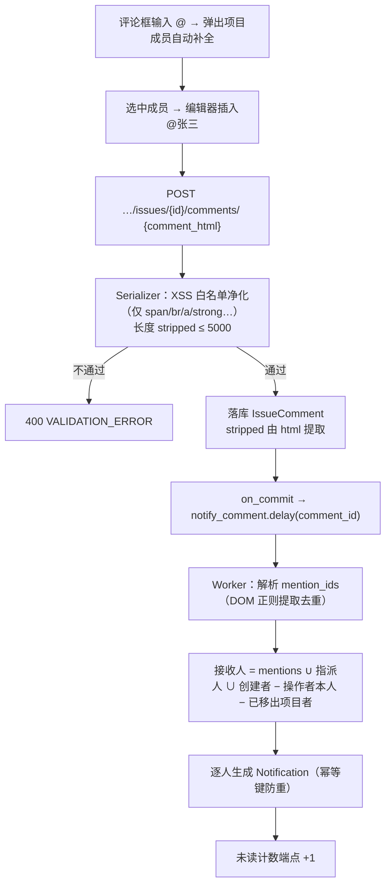
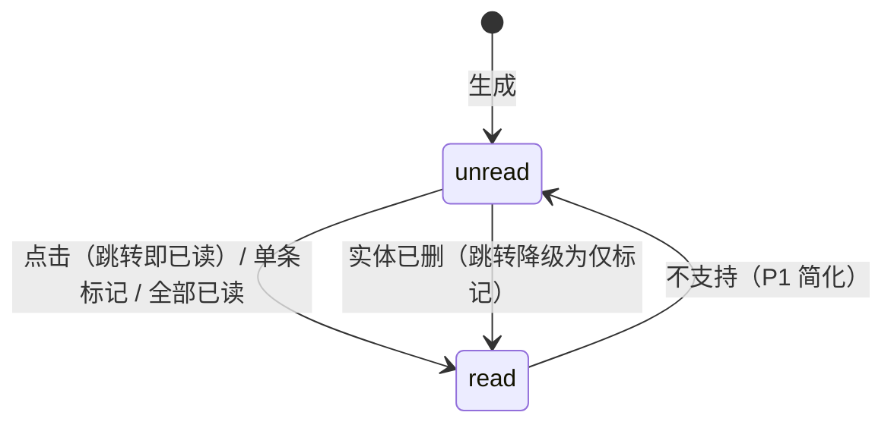
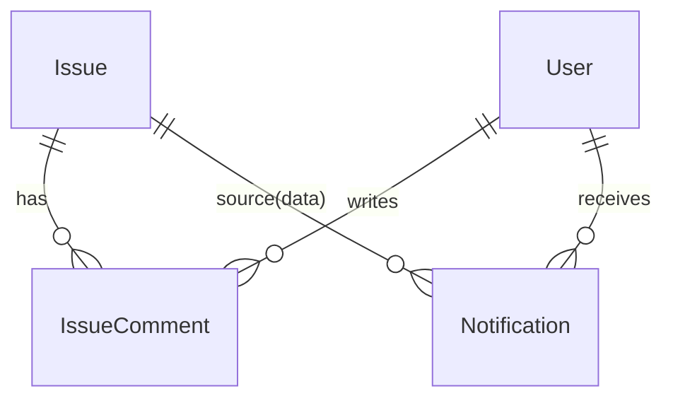

# 任务评论 / @提醒 / 通知中心

| 元信息项 | 内容 |
| --- | --- |
| 文档编号 | COLLAB-001 |
| 所属迭代 | Sprint 1：MVP 能力补齐（第 3 周） |
| 优先级 | P1（MVP 必备级） |
| 所属模块 | M8-COLLAB 实时协作与通知 |
| 文档状态 | 待评审（Draft） |
| 最后更新日期 | 2026-09-01 |
| 上游依据 | `docs/需求文档.md` §3.8（任务详情评论、评论@成员提醒、站内通知中心、已读/未读标记、全部已读）、§8.2 协作通知 P1 列 |
| 前置依赖 | `TASK-001/002`（Issue / 属性 / 动态基线）、`PROJ-002`（成员 = 通知候选域）、`FILE-001`（直传通道，图片评论 P2 复用）、`INFRA-004` |
| 下游依赖 | `COLLAB-002/003`（P2 楼中楼 / 表情 / 图片评论与项目动态流）、`COLLAB-004`（P2 WebSocket 把轮询升级推送）、`RPT-001`（通知未读数入工作台） |
| 架构基线 | [`api-conventions.md`](../architecture/api-conventions.md) §2.5（comments 端点）、§4（信封）；[`rbac-permission-model.md`](../architecture/rbac-permission-model.md) §5.5（Notification 行级：`filter(receiver=user)`）；[`unified-issue-model.md`](../architecture/unified-issue-model.md) §2.10（Activity 异步写入范式） |
| 竞品参考 | Plane（IssueComment：comment_html/stripped + accessory JSONB；@mention 以 `<span id="…">` 锚点存储；Notification 表 + unread 徽标轮询）、Ones（企业消息中心 + 邮件/IM 多通道） |

> **范围声明**：交付扁平单层评论（CRUD + 编辑窗口）、@提及解析与提醒、站内通知中心（未读数 / 列表 / 单条已读 / 全部已读）与四类核心事件通知。楼中楼 / 表情 / 图片评论（P2 `COLLAB-002`）、项目动态流（P2 `COLLAB-003`）、WebSocket 推送（P2 `COLLAB-004`）、邮件通知（P3 静默策略配套）不在范围。

---

## 1. 概述

### 1.1 功能定位

派任务（`TASK-002`）解决了「谁做」，评论与通知解决「怎么说」——这是 MVP 协作闭环的最后一公里：A 在 B 的任务下评论「@B 接口今天能好吗」，B 的铃铛出现红点，点进来回到任务上下文。本文档同时建立全系统**通知基础设施**（`Notification` 模型 + 异步生成管道），P2 实时推送只是换传输层，数据模型不动。

| 交付项 | 说明 |
| --- | --- |
| 评论 CRUD | 任务详情「评论」Tab；发表（Tiptap 纯文本 + @ / 链接）、编辑（15 分钟窗口）、删除（软删占位） |
| @提及 | 评论与任务描述中的 `@成员`：编辑器锚点结构（data-mention-id）；服务端解析 → 去重 → 触发提醒通知 |
| 通知模型 | `Notification`（receiver / title / data / read_at / source 实体定位） |
| 四类事件通知 | 被指派、被 @、任务被评论（非本人操作时）、任务属性被变更（仅负责人 + 创建者收到摘要） |
| 通知中心 | 顶栏铃铛（未读数徽标，30s 轮询）→ 抽屉列表（时间分组 / 单条点击已读跳转 / 全部已读 / 仅看未读） |

### 1.2 目标用户

| 用户 | 场景 | 关注点 |
| --- | --- | --- |
| 任务负责人 | 被派活 / 被 @ | 铃铛红点不漏；点开直达任务 |
| 评论者 | 沟通 | @ 有自动补全；发出去可撤改 |
| 全体 | 降噪 | 自己操作不给自己发通知；全部已读一键清 |

### 1.3 前置依赖说明

| 依赖文档 | 依赖内容 | 缺失后果 |
| --- | --- | --- |
| `TASK-002` | Issue 属性（通知文案需类型 / 状态名）、`IssueActivity` 异步写入范式 | 文案无语义、管道无参照 |
| `PROJ-002` | 项目成员域（@ 候选与通知接收域） | @ 越界 |
| `AUTH-005` | `issue.comment` 权限点（COMMENTER+） | 越权评论 |

### 1.4 竞品参考结论（详见第 6 章）

- **Plane**：`IssueComment`（comment_html / comment_stripped / accessory JSONB）；@mention 存编辑器锚点 id；`Notification` 表 + `unread_notifications` 计数端点，前端轮询。
- **Ones**：消息中心多通道（站内 / 邮件 / 企业微信钉钉）+ 通知粒度权限（P3 对齐）。
- **本系统**：数据模型对齐 Plane（含 accessory 预留），通知生成走 `on_commit → Celery`（Plane 部分同步写有阻塞先例），轮询 P1 先行、P2 换 WebSocket。

---

## 2. 业务逻辑

### 2.1 发表评论与 @ 提醒流



### 2.2 通知事件源表（P1 四类）

| 事件 | 触发 | 接收人 | title 文案 | data |
| --- | --- | --- | --- | --- |
| `issue.assigned` | 指派集合新增成员（含创建时首派） | 新增被指派人 − 操作者 | 「{actor} 将 {PROJ-128} 指派给你」 | issue 定位 + 项目上下文 |
| `issue.mentioned` | 评论 / 描述含 @（描述编辑新增锚点同样触发） | 被 @ 者 − 操作者 | 「{actor} 在 {PROJ-128} 中提到了你」 | 同上 + comment_id |
| `issue.commented` | 新评论 | 指派人 ∪ 创建者 − 操作者 − 已 @ 者（@ 已单独通知，去重） | 「{actor} 评论了 {PROJ-128}」 | 同上 + comment_id |
| `issue.updated` | 关键属性变更（state / priority / target_date） | 指派人 ∪ 创建者 − 操作者 | 「{actor} 更新了 {PROJ-128}：状态 → 已完成」 | 同上 + 摘要 |

> 幂等键：`(event, issue_id, actor_id, epoch)`——同一次批量变更（如 `BOARD-001` 批量拖拽共享 epoch）对同一接收人合并为一条，防止通知风暴。

### 2.3 通知已读状态机



### 2.4 业务规则表

| 编号 | 规则 | 判定位置 | 违反后果 |
| --- | --- | --- | --- |
| BR-01 | 评论权限 `issue.comment`（`PROJ_COMMENTER+`）；编辑 / 删除仅**本人**评论 | `AUTH-005` + 对象级 | 403 |
| BR-02 | 评论长度：stripped 1~5000 字符；空评论（仅空白 / 仅 @）拒绝 | Serializer | 400 |
| BR-03 | HTML 净化：标签白名单 `span(data-mention-id) / a(href) / strong / em / code / br / p`；其余标签与全部属性剥离（Bleach） | Serializer | 静默净化 |
| BR-04 | @ 候选 = 当前项目成员 ∪ 隐式 WS_OWNER/ADMIN（可被 @）；锚点 id 必须在候选域，域外锚点净化为纯文本 | 解析器 | 静默降级 |
| BR-05 | 编辑窗口：发表后 15 分钟内可编辑（PATCH），编辑产生 `IssueActivity(updated, comments)`，**不重复通知** | Service | — |
| BR-06 | 删除：软删，前端占位「该评论已删除」；15 分钟窗口外不可编辑只可删除 | Service | — |
| BR-07 | 通知接收域剔除：操作者本人、非项目成员、软删用户 | Worker | — |
| BR-08 | 通知保留 90 天（beat 清理已读超 90 天、未读超 180 天） | beat | — |
| BR-09 | 未读计数上限展示 99+；`unread_count` 端点与列表游标分离（计数 O(1) 索引） | 前端 / ORM | — |
| BR-10 | 跳转语义：点击通知 → 标记已读（幂等）→ 导航 `/{ws}/{proj}/issues/{id}`；实体已删则停留并 Toast | 前端 | — |
| BR-11 | 全部已读为**本人域**动作（`filter(receiver=user).update(read_at=now)`），批量 UPDATE 单事务 | Service | — |
| BR-12 | 评论列表默认按 `created_at` 正序（会话流），倒序开关 P2 | — | — |

### 2.5 异常处理表

| 异常场景 | 触发条件 | HTTP / 错误码 | 前端表现 | 后端处理 |
| --- | --- | --- | --- | --- |
| XSS 注入 | `<script>` / `onerror` 属性 | 200（净化后） | 内容按净化结果展示 | 白名单净化（BR-03） |
| 编辑超窗 | > 15 分钟 PATCH | 400 `EDIT_WINDOW_EXPIRED` | 行内「已超编辑窗口，可删除重发」 | — |
| 编辑他人评论 | 非本人 | 403 | Toast | — |
| 通知实体失效 | 跳转时任务已删 | — | Toast「原任务已删除」 | 前端降级 |
| 轮询失败 | 网络 | — | 保留上次计数，下次恢复 | 指数退避（30s→60s→120s 封顶） |

### 2.6 边界条件表

| 边界场景 | 限制值 | 超出处理方式 |
| --- | --- | --- |
| 单评论 @ 数 | 20 | 400 `TOO_MANY` |
| 单任务评论数 | 无硬限（游标分页） | 首屏 30 条向上加载 |
| 未读通知堆积 | 无硬限（90/180 天清理） | 列表「仅看未读」过滤 |
| 同 epoch 批量 | 合并一条 / 接收人 | 幂等键去重 |

---

## 3. UI/UX 设计

### 3.1 评论 Tab（任务详情）

| 区域 | 组件 | UI 组件 |
| --- | --- | --- |
| 评论流 | 头像 + 昵称 + 相对时间 + 内容（@ 高亮蓝字 hover 卡片）+ 操作（编辑 / 删除，本人 + Gate） | `CommentList` |
| 已删占位 | 灰字「该评论已删除」 | — |
| 编辑态 | 原位变输入框 + 剩余秒数提示 + 保存/取消 | `EditableComment` |
| 输入区 | Tiptap 精简版（`@` 唤起 Mention 补全：键盘上下 + 回车）+ ⌘Enter 发表 + 字数统计 | `CommentComposer` |

### 3.2 通知中心（顶栏铃铛）

| 区域 | 组件 | UI 组件 |
| --- | --- | --- |
| 铃铛 | 未读徽标（99+）；30s 轮询 | `Badge` |
| 抽屉（420px） | 头部：「仅看未读」开关 + 「全部已读」；列表按 今天 / 昨天 / 更早 分组 | `Drawer` |
| 通知行 | 事件图标 + title（实体名高亮）+ 相对时间；未读左侧蓝点 | `NotificationRow` |
| 空态 | 「没有新消息」插画 | — |

### 3.3 交互细节表

| 交互动作 | 触发方式 | 反馈效果 | 加载态 / 空态 |
| --- | --- | --- | --- |
| 发表评论 | ⌘Enter / 按钮 | 行划入；滚动到底；铃铛（他人侧）下次轮询 +1 | 按钮 spinner |
| @ 补全 | 输入 `@` + 字符 | 成员浮层（头像 / 昵称 / 邮箱前缀过滤） | 无匹配「无成员」 |
| 点击通知 | 行点击 | 蓝点消失（乐观）→ 跳任务详情并锚点评论 | — |
| 全部已读 | 头部按钮 | 全部蓝点淡出；徽标归零 | — |
| 编辑倒计时 | 编辑态 | 最后 30 秒提示变色 | — |

### 3.4 无障碍要求

- 铃铛 `aria-live="polite"` 播报未读数变化；通知行 `role="link"`。
- 评论输入框 `aria-label`；Mention 浮层 `role="listbox"` + `aria-activedescendant`。

---

## 4. 技术架构

### 4.1 数据模型

```python
class IssueComment(BaseModel):
    """任务评论 —— 对标 Plane IssueComment（扁平单层，P2 扩 parent 楼中楼）。"""

    class Source(models.TextChoices):
        IN_APP = "in_app", "站内"

    issue = models.ForeignKey(Issue, on_delete=models.CASCADE, related_name="comments")
    actor = models.ForeignKey("db.User", on_delete=models.SET_NULL, null=True, related_name="issue_comments")
    comment_html = models.TextField(verbose_name="评论 HTML（净化后）")
    comment_stripped = models.TextField(verbose_name="纯文本（搜索/摘要）")
    accessory = models.JSONField(default=dict, blank=True,
                                 help_text="P2 表情反应 / 图片引用承载位（Plane 同构预留）")
    is_edited = models.BooleanField(default=False)
    deleted_at = models.DateTimeField(null=True, blank=True, verbose_name="软删时间")

    class Meta(BaseModel.Meta):
        db_table = "issue_comments"
        indexes = [models.Index(fields=["issue", "created_at"], name="idx_comment_issue_time")]


class Notification(BaseModel):
    """站内通知 —— 行级隔离：filter(receiver=user)（rbac §5.5 天然规则）。"""

    class Event(models.TextChoices):
        ISSUE_ASSIGNED = "issue.assigned"
        ISSUE_MENTIONED = "issue.mentioned"
        ISSUE_COMMENTED = "issue.commented"
        ISSUE_UPDATED = "issue.updated"

    receiver = models.ForeignKey("db.User", on_delete=models.CASCADE, related_name="notifications")
    event = models.CharField(max_length=32, choices=Event.choices, db_index=True)
    title = models.CharField(max_length=200)
    data = models.JSONField(default=dict, help_text="issue_id/project_id/comment_id/actor/摘要")
    read_at = models.DateTimeField(null=True, blank=True, db_index=True)
    dedup_key = models.CharField(max_length=128, blank=True, default="",
                                 help_text="(event,issue,actor,epoch,receiver) 哈希，防重")

    class Meta(BaseModel.Meta):
        db_table = "notifications"
        constraints = [models.UniqueConstraint(fields=["receiver", "dedup_key"],
                                               condition=~models.Q(dedup_key=""), name="uniq_notif_dedup")]
        indexes = [models.Index(fields=["receiver", "read_at", "created_at"], name="idx_notif_receiver_unread")]
```



### 4.2 API 定义

| 方法/路径 | 描述 | 权限 |
| --- | --- | --- |
| `GET …/issues/{issue_id}/comments/?cursor=` | 评论列表（正序游标，向上加载用 `before`） | `project.read` |
| `POST …/issues/{issue_id}/comments/` | 发表评论 | `issue.comment` |
| `PATCH …/comments/{comment_id}/` | 编辑（15 分钟窗口） | 本人 + `issue.comment` |
| `DELETE …/comments/{comment_id}/` | 删除（软删） | 本人 |
| `GET /api/v1/users/me/notifications/?unread_only=&cursor=` | 通知列表 | 本人 |
| `GET /api/v1/users/me/notifications/unread-count/` | 未读计数 | 本人 |
| `POST /api/v1/users/me/notifications/{id}/read/` | 单条已读（幂等） | 本人 |
| `POST /api/v1/users/me/notifications/read-all/` | 全部已读 | 本人 |
| `GET /api/v1/workspaces/{slug}/members/search/?q=` | @ 候选搜索（项目内过滤在前端做） | `project.read` |

**发表示例**：

```json
// POST …/issues/8a1f…/comments/
{ "comment_html": "<p><span data-mention-id=\"6c7d…\">@梁工</span> 接口今天能好吗？</p>" }
// 201
{ "status": "success", "data": {
    "id": "cm1…", "actor": { "id": "a2…", "display_name": "王五", "avatar_url": "…" },
    "comment_html": "…（净化后原样）", "comment_stripped": "@梁工 接口今天能好吗？",
    "mention_ids": ["6c7d…"], "is_edited": false, "created_at": "2026-09-01T09:30:00.000Z" } }
```

**通知列表示例**：

```json
{ "status": "success",
  "data": [
    { "id": "n1…", "event": "issue.mentioned", "title": "王五 在 RBT-128 中提到了你",
      "data": { "issue_id": "8a1f…", "project_id": "9d8e…", "workspace_slug": "acme",
                "comment_id": "cm1…", "actor": "王五" },
      "read_at": null, "created_at": "2026-09-01T09:30:01.000Z" }
  ],
  "meta": { "next_cursor": null, "count": 12, "unread_count": 3 } }
```

### 4.3 核心逻辑

```python
MENTION_RE = re.compile(r'data-mention-id="([0-9a-f-]{36})"')

def extract_mentions(comment_html: str) -> set[str]:
    return {m for m in re.findall(MENTION_RE, comment_html) if m != "undefined"}


@shared_task(max_retries=3, autoretry_for=(Exception,), retry_backoff=True)
def notify_comment(comment_id: str) -> None:
    comment = IssueComment.objects.select_related("issue", "issue__project", "actor").get(pk=comment_id)
    issue, actor = comment.issue, comment.actor
    mentioned = extract_mentions(comment.comment_html)
    mentioned &= set(issue.project.member_ids())                    # BR-04 域校验
    receivers = (mentioned | set(issue.assignee_ids) | {issue.created_by_id}) - {actor.id}
    # 去重原则：被 @ 者只收 mentioned；其余收 commented
    epoch = str(comment.created_at.timestamp())
    rows = []
    for uid in mentioned:
        rows.append(make_notification(uid, "issue.mentioned", issue, actor, comment, dedup(epoch, uid)))
    for uid in receivers - mentioned:
        rows.append(make_notification(uid, "issue.commented", issue, actor, comment, dedup(epoch, uid)))
    Notification.objects.bulk_create(rows, ignore_conflicts=True)   # 唯一约束幂等
```

**写入路径范式**：业务事务 `on_commit` 后投递（与 `IssueActivity` 相同，`unified-issue-model.md` §2.10）；worker 只传 ID、可重试、`bulk_create(ignore_conflicts)` 天然幂等——重试不产生重复通知。

### 4.4 前端实现

- `NotificationStore`：`unreadCount`（SWR 30s 轮询 `unread-count`）、`list`（`useSWRInfinite`）；`markRead / readAll` 乐观更新。
- 路由集成：点击通知 → `markRead(id)`（不等待）→ `navigate(data 定位)`；评论锚点 `#comment-{id}` 滚动高亮 2s。
- `CommentComposer`：Tiptap Mention 扩展（候选 = 项目成员缓存，`TASK-002` 指派人同源）；净化双保险（前端 schema 限制 + 后端 Bleach）。

---

## 5. 测试用例

### 5.1 单元测试

| 用例 ID | 测试目标 | 输入 | 预期输出 | 覆盖类型 |
| --- | --- | --- | --- | --- |
| UT-01 | XSS 净化 | `<script>` / `` | 标签与属性全剥离，正文保留 | 安全 |
| UT-02 | 空评论 | 仅空格 | 400 | 边界 |
| UT-03 | 编辑窗口 | 第 16 分钟 PATCH | 400 `EDIT_WINDOW_EXPIRED` | 边界 |
| UT-04 | 域外 @ 净化 | 锚点为非成员 UUID | 不产生通知，渲染降级纯文本 | 安全 |
| UT-05 | 操作者不self-notify | 自己评论自己任务 | 0 条通知 | 正常 |
| UT-06 | @ 与评论去重 | 评论 @ 了指派人 | 该人仅收 mentioned 一条 | 正常 |
| UT-07 | 幂等重试 | worker 失败重跑 | 通知无重复（唯一约束） | 并发 |
| UT-08 | 全部已读域隔离 | A read-all | B 未读不受影响 | 安全 |
| UT-09 | 软删占位 | 删除评论 | 列表返回占位标记 | 正常 |
| UT-10 | 未读计数索引 | 10 万通知 | 计数 O(1)（`idx_notif_receiver_unread`） | 性能 |

### 5.2 集成测试

| 用例 ID | 场景 | 前置条件 | 操作步骤 | 预期结果 |
| --- | --- | --- | --- | --- |
| IT-01 | 指派通知 | A 派 B | B 轮询 +1 | title 含实体名 |
| IT-02 | @ 闭环 | A 评论 @B | B 铃铛 → 点击 → 落任务页评论锚点 | 已读状态持久 |
| IT-03 | 批量拖拽合并 | 批量改 50 任务状态（同 epoch） | 负责人各 1 条（非 50 条） | 幂等 |
| IT-04 | 已删实体跳转 | 删任务后点通知 | Toast 降级，通知已读 | 正常 |
| IT-05 | 通知清理 | 造 91 天前已读 | beat 后物理删 | 生命周期 |

### 5.3 E2E 测试

| 用例 ID | 用户场景 | 操作路径 | 验收标准 |
| --- | --- | --- | --- |
| E2E-01 | 完整协作闭环 | A 派 B + @B → B 完成 → A 收 updated | 双方铃铛各自触发；全程不离开系统 |
| E2E-02 | 编辑旅程 | 发评论 → 14 分钟时编辑 → 16 分钟再试 | 前者成功标记已编辑；后者被拒可删除重发 |
| E2E-03 | 一键清零 | 30 未读 → 全部已读 | 徽标即时归零；仅看未读为空 |

---

## 6. 竞品深度对标

### 6.1 Plane 实现分析

评论三字段（html / stripped / binary 预留）+ accessory JSONB；@mention 以 ProseMirror 节点 id 存储；Notification 表 + 单独 unread 计数端点，前端 30s 轮询——本系统 P1 同构。**劣势**：早期版本评论通知在请求线程内同步生成，批量操作时拉高 P95（社区 issue 有记录），后逐步异步化——本系统从第一天即全异步。

### 6.2 Ones 实现分析

消息中心支持多通道路由（站内 / 邮件 / 企业微信 / 钉钉）、按事件粒度的接收开关与静默时段（P3 对齐 `AUTH` 通知策略）；其通知与 IM 深度整合，依赖企业通讯录。

### 6.3 本系统设计决策

1. **通知生成全异步 + 幂等键**：`on_commit → Celery → bulk_create(ignore_conflicts)`，重试安全、批量合并（epoch），从源头避免通知风暴——这是对 Plane 已知问题的前置规避。
2. **接收域显式代数**（`mentions ∪ assignees ∪ creator − actor − 域外`）写进规则表而非散落代码，P2 加参与人 / 关注者时扩展集合即可。
3. **accessory JSONB 预留**：P2 表情反应 / 图片评论零 DDL（Plane 同构验证过的路径）。
4. **差异化价值**：轮询先行、模型终局——P2 `COLLAB-004` WebSocket 只替换传输（未读计数与列表端点保留作降级通道），通知基建一次到位。

---

## 7. 里程碑与验收

### 7.1 交付物清单

| 类型 | 交付物 |
| --- | --- |
| Model / Migration | `IssueComment`、`Notification` 两表 |
| API 端点 | 评论 4 个 + 通知 5 个（§4.2） |
| 后端 | Bleach 净化器、`notify_comment` / `notify_issue_event` 任务、通知清理 beat、`unread-count` |
| 前端 | 评论 Tab（Composer / Mention 补全 / 编辑倒计时 / 软删占位）、通知中心（铃铛 / 抽屉 / 已读交互） |
| 事件接入 | 指派 / @ / 评论 / 属性变更四处业务埋点（on_commit） |
| 测试 | UT-01~10、IT-01~05、E2E-01~03 |

### 7.2 可操作演示的验收标准

1. A 在 B 的任务评论中输入 `@梁` 出现补全，选择后发表；B 的铃铛 30 秒内出现红点，点击直达该评论并高亮。
2. A 把任务指派给 B、改状态为已完成：B 分别收到 assigned 与 updated 两条通知，文案含任务编号与操作者。
3. 自己评论自己的任务不产生任何通知；同一条评论中 @ 与指派为同一人时仅一条提醒。
4. 评论 15 分钟内可编辑（显示已编辑标记），超时编辑被拒绝但可删除；删除后显示占位行。
5. 注入 `<script>alert(1)</script>` 的评论被净化为纯文本，页面无脚本执行；「全部已读」后徽标归零且他人通知不受影响。
