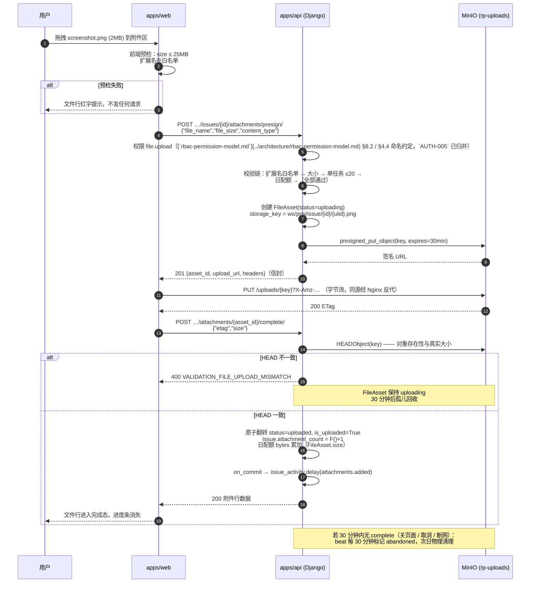
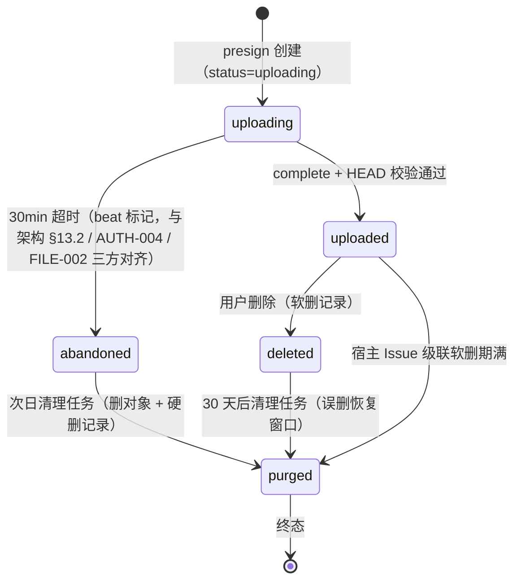
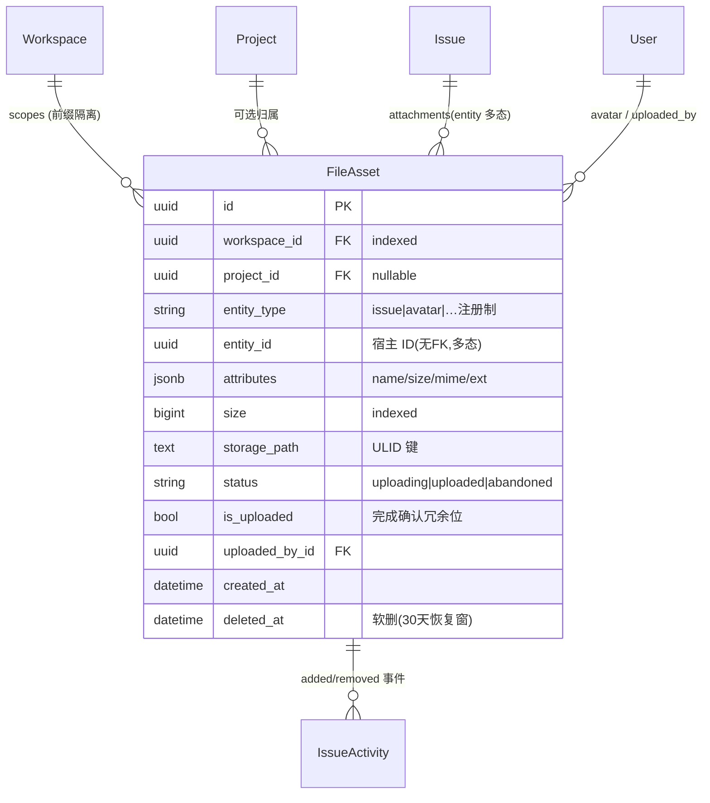

# 任务级附件上传下载

| 元信息项 | 内容 |
| --- | --- |
| 文档编号 | FILE-001 |
| 所属迭代 | Sprint 1：MVP 能力补齐（第 3 周） |
| 优先级 | P1（MVP 必备级） |
| 所属模块 | M7-FILE 文件资源管理 |
| 文档状态 | **已实现**（2026-09-04 · Sprint 1 后端实现落地 · 见 ADR-0012） |
| 最后更新日期 | 2026-09-01 |
| 上游依据 | `docs/需求文档.md` §3.7（文件上传 / 下载 / 操作日志）、§8.2 文件管理 P1 列（任务级单附件上传 / 下载）、§五（MinIO/S3 预签名直传，不经过服务端中转） |
| 前置依赖 | `INFRA-002`（minio 容器 + `createbuckets` 自动建桶 + Nginx 反代骨架）、`TASK-001`（Issue 承载 + `IssueAttachment` 关联关系架构基线；本迭代改用 `FileAsset` 多态挂载并在 `Issue` 上**新增** `attachment_count` 冗余列以服务卡片徽章计数，迁移随本文交付，见 §4.1 与 §7.1）、`PROJ-002`（项目成员权限域）、`INFRA-004`（错误码注册表 / 统一信封 / Nginx 413 JSON）、`AUTH-004`（直传通道首个消费者——头像） |
| 下游依赖 | `FILE-002`（P2 项目文件库复用 FileAsset 与直传通道）、`FILE-003`（P2 分片续传扩展 multipart 状态）、`FILE-004`（P2 多版本 / 分享）、`COLLAB-002`（P2 图片评论复用附件）、`BOARD-002`（卡片附件计数消费 `attachment_count`）、`FILE-005`（P3 Wiki 附件） |
| 架构基线 | [`api-conventions.md`](../architecture/api-conventions.md) §2.5（`attachments/presign` 端点契约）、§13.2（**预签名直传三步规范——本文档的协议原文，协议字段以架构为准**）、§8（VALIDATION_FILE_* / QUOTA_* / SERVER_STORAGE_* 错误码；SERVER_STORAGE_ERROR 映射 HTTP 500）、§7.2（预签名申请 30 req/min 限流）、§4（信封）；[`unified-issue-model.md`](../architecture/unified-issue-model.md) §1.3（`IssueAttachment` 单表关联）+ §2.10（Activity 异步范式）；[`rbac-permission-model.md`](../architecture/rbac-permission-model.md) §8.2（`file.upload` / `file.read` / `file.delete` 权限矩阵）、§5（行级过滤） |
| 竞品参考 | Plane（`FileAsset` 表 + attributes JSONB + `is_uploaded` 状态机 + presigned 直传 + 实体多可空外键）、Ones（企业网盘体系，任务附件即文件库挂载） |
| 工作量估算 | 后端 2.5 人日 / 前端 2.5 人日 / 联调与测试 1 人日，合计 **6 人日** |

> **范围声明**：交付任务级附件：上传（MinIO 预签名直传三步流）、下载（预签名 GET 换发）、删除、附件区 UI 与卡片计数。需求文档 §8.2 P1 列原文为「本地临时存储」，本系统**决策升级为 MinIO 直传**（决策依据见 §6.3 第 1 条——P0 基础设施已就位、API 进程零文件带宽、避免 P2 双体系迁移）。项目文件库 / 多层级目录 / 分片续传 / 在线预览 / 多版本 / 分享链接 / 水印合规全部不在范围（P2 `FILE-002~004`、P4 `FILE-006`）。

---

## 1. 概述

### 1.1 功能定位

缺陷截图、设计稿、日志文件、验收录屏——没有附件的任务系统无法承载真实研发协作。本文档建立全系统**第一个文件通道**：`FileAsset` 模型 + 预签名直传三步流 + 生命周期清理。

该通道是 P2 项目文件库、图片评论、P3 Wiki 的共同地基，因此模型设计以「**通道复用**」为第一约束：归属三级（workspace / project / entity）、挂载多态（`entity_type + entity_id`）、状态机（uploading → uploaded → deleted/abandoned → purged）一次定义、三阶段消费。任务附件只是它的第一个挂载点（`entity_type=issue`），`AUTH-004` 的头像（`entity_type=avatar`）已先行验证协议一致性。

> **架构偏离声明（§1.3 / §4.1）**：架构基线 [`unified-issue-model.md`](../architecture/unified-issue-model.md) §1.3 / §2.1 定义任务附件为单表 `IssueAttachment`（`issue_id` FK + `asset` S3 key + `attributes` JSONB）。本文不沿用该模型，**采用 `FileAsset` 多态挂载**（`entity_type + entity_id`，无 FK）。偏离理由：（a）`AUTH-004` 头像已先行验证多态协议且 `COLLAB-002` 评论图、`FILE-002` 项目文件库均复用同一通道；（b）通道共用避免「每新建一种宿主实体都要 ALTER TABLE 加列」的膨胀（Plane 多可空外键方案的反例）；（c）无 FK 的引用完整性由「Service 级联 + 清理任务 ③」双保险覆盖（§4.2 / §4.6）。**架构文档待回改**：将 `IssueAttachment` 移除或在文档中显式标注「FILE-001 多态方案已生效」。

**工程上必须一次做对的三件事**：

1. **文件字节流不经过 Django**——浏览器直传 MinIO，API 只做凭证签发与元数据落库。2 人团队的服务器带宽与内存是稀缺资源，25MB × 10 人并发 × 经由 API 中转 = 250MB 瞬时内存与双倍带宽，直传方案下均为 0。
2. **校验前置到 presign 期**——大小 / 扩展名白名单 / 配额在签发上传凭证**之前**拒绝，不产生任何无效对象与孤儿流量（Plane 在完成期才校验部分项，无效大文件已经传完）。
3. **生命周期闭环**——「用户取消上传」「传一半关页面」「删除附件」都只是状态迁移，物理删除由 beat 任务按窗口延迟执行，误删可恢复、孤儿可回收。

### 1.2 交付项

| 交付项 | 说明 |
| --- | --- |
| `FileAsset` 模型 | 归属（workspace/project/entity 三级）、原始属性（名 / 大小 / MIME / 扩展名）、存储键、上传状态机、CheckConstraint 扩展名白名单纵深防御 |
| 直传三步流 | ① `POST …/attachments/presign/` 换 PUT 预签名 URL（请求字段 `file_name` / `file_size` / `content_type` 与 [`api-conventions.md`](../architecture/api-conventions.md) §13.2 协议原文对齐）→ ② 浏览器直传 MinIO（同源 `/uploads/` 路由）→ ③ `POST …/attachments/{id}/complete/` HEAD 校验后落库为已上传 |
| 下载 | `GET …/attachments/{id}/download/` 鉴权后 302 预签名 GET URL（5 分钟有效，RFC 5987 文件名） |
| 删除 | 软删附件记录 + 计数 -1；对象延迟 30 天物理回收（误删恢复窗口） |
| 约束体系 | 单文件 ≤ 25MB；扩展名白名单（双层：应用 + DB Check）；单任务 ≤ 20 附件；单用户日配额 200 个 / 2GB（count 与 bytes 双指标，bytes 在 complete 时按 `FileAsset.size` 补记） |
| 附件区 UI | 任务详情抽屉『附件』Tab（Tab 条结构见 TASK-002 §3.6）：上传按钮 + 拖拽区 + 文件行（图标 / 名称 / 大小 / 上传人 / 时间 / 下载 / 删除）+ 上传进度 + 并发队列 |
| 清理任务 | `mark_abandoned_uploads`（30 分钟，与架构 §13.2、AUTH-004、FILE-002 三方对齐）+ `purge_deleted_assets`（每日，含三类清理：abandoned 1 天 / 软删 30 天 / 宿主 Issue 级联 30 天）两个 beat 任务 |
| 通道通用件 | `usePresignedUpload` hook（附件区与头像共用）；Nginx `/uploads/` 直传路由 |

### 1.3 目标用户

| 用户 | 场景 | 关注点 |
| --- | --- | --- |
| 提缺陷的成员 | 贴截图 / 日志 | 拖进来就走，不用离开任务页；进度可见 |
| 处理人 | 查看证据 | 点击即下载原文件；中文文件名不乱码 |
| 项目管理员 | 治理 | 谁传的、何时传的、占多少空间，可追溯 |
| 运维视角 | 存储治理 | 文件不经 API 服务器（带宽 / 内存零占用）；孤儿对象自动回收；桶按前缀隔离 |

### 1.4 关键约定：文件通道三阶段复用矩阵

`FileAsset` 是全系统唯一文件通道，本迭代定型的协议被后续迭代原样复用：

| 阶段 | 挂载点（entity_type） | 复用的本迭代资产 | 新增内容 |
| --- | --- | --- | --- |
| P1（本文档） | `issue`（任务附件）、`avatar`（`AUTH-004`） | — | 模型 / 三步流 / 清理 / hook / Nginx 路由 |
| P2 `FILE-002` | `project_file`（项目文件库） | 模型、直传协议、`usePresignedUpload`、清理任务 | 目录树（`parent_asset` 或 path 列）、移动 / 重命名 |
| P2 `FILE-003` | 同上 + 大文件 | 三步流前两步 | 分片（`is_multipart` / parts 记录）、断点续传、CONCURRENT 合并 |
| P2 `COLLAB-002` | `comment_image` | 直传协议、hook | 评论 accessory 引用附件 ID |
| P2 `FILE-004` | 同上 | 模型 | `version_of` 自引用（多版本）、分享令牌 |
| P3 `FILE-005` | `wiki_page` | 全部 | Wiki 页面资源挂载 |
| P4 `FILE-006` | 同上 | 全部 | 水印 / 禁下载 / 病毒扫描 / 留存策略 |

**对协议的两条锁定**（后续迭代不得破坏，破坏即架构评审）：

1. 存储键结构 `{workspace_id}/{project_id}/{entity_type}/{entity_id}/{ulid}.{ext}`——桶策略按前缀限定即隔离边界；
2. 状态机五态（uploading / uploaded / abandoned / deleted / purged）单调迁移，`purged` 为终态。

### 1.5 范围边界

| 能力 | P1（本文档） | 归属 |
| --- | --- | --- |
| 单文件直传 ≤ 25MB | ✅ | — |
| 下载 / 删除 / 附件区 UI / 卡片计数 | ✅ | — |
| 白名单校验（扩展名双层） | ✅ | 病毒扫描 P4 `FILE-006`（UT-02 记录已知限制：改名绕过不识别文件头） |
| 孤儿回收 / 延迟物理删除 | ✅ | — |
| 分片续传 / 断点 | ❌ | P2 `FILE-003` |
| 项目文件库 / 目录树 / 移动重命名 | ❌（`entity_type` 已预留） | P2 `FILE-002` |
| 在线预览（图片 / PDF / Office） | ❌ | P2 `FILE-003` |
| 多版本 / 版本回溯 / 分享链接 | ❌ | P2 `FILE-004` |
| 图片评论 | ❌（accessory / entity_type 已预留） | P2 `COLLAB-002` |
| 水印 / 禁下载 / 合规留存 | ❌ | P4 `FILE-006` |

### 1.6 前置依赖

| 依赖 | 内容 | 阻塞原因 |
| --- | --- | --- |
| `INFRA-002` | `minio` 容器（`RELEASE.2024-11-07T00-52-20Z`）健康检查；`createbuckets` 一次性服务自动创建 `rp-uploads` 桶并设置 `public/` 前缀匿名下载（附件键不在该前缀下，见 §4.1.3）；api 容器注入 `AWS_S3_*` 环境变量（endpoint `minio:9000` / bucket `rp-uploads`） | 通道不可用 |
| `TASK-001` | `Issue` 模型基线（5 固定字段、`attachment_count` 列**本迭代迁移新建**——架构 `IssueAttachment` 单表方案不维护该列，本系统多态方案需冗余列供卡片徽章与列表消费）；详情 Drawer 布局 | 计数无处写、UI 无容器 |
| `AUTH-004` | 头像直传已验证 presign/complete 协议（`entity_type=avatar`） | 协议分歧返工 |
| `PROJ-002` | 项目成员域（`accessible_by` 行级过滤） | 越权下载 |
| `INFRA-004` | 错误码注册表 + 统一信封；Nginx API 前缀 `client_max_body_size 2m` 与 413 统一 JSON（「请使用附件直传通道」） | 错误响应不规范 |

### 1.7 竞品参考

| 竞品 | 参考点 | 处置 |
| --- | --- | --- |
| Plane | `FileAsset` 单表（attributes JSONB + size + is_uploaded + 实体多可空外键列）；`get_singed_file_upload_url`（上游函数名原文如此，拼写错误保留引用）签发 presigned PUT；完成确认翻转 `is_uploaded` | 协议完全对齐；多可空外键改为 `entity_type+entity_id` 多态（§6.1） |
| Ones | 任务附件 = 统一文件库的挂载视图，同文件多任务引用去重；企业版水印 / 禁下载 / 审计 | 挂载理念采纳；文件库本体 P2 `FILE-002`；合规 P4 |

---

## 2. 业务逻辑

### 2.1 直传三步流（核心时序）



**三步各司其职**（与 [`api-conventions.md`](../architecture/api-conventions.md) §13.2 逐步对应）：

| 步骤 | 责任方 | 失败的后果与回收 |
| --- | --- | --- |
| ① presign | Django：权限 + 全部业务校验 + 落元数据 + 签 URL | 校验失败**零对象产生**；成功但无人上传 → 孤儿记录由 beat 回收 |
| ② PUT | 浏览器 → MinIO（经 Nginx `/uploads/` 反代）：纯字节流 | 失败重试 2 次；放弃则同上回收。API 进程全程零参与 |
| ③ complete | Django：HEAD 校验 + 原子翻转 + 计数 + 异步 Activity | 校验失败记录弃置；重复调用幂等 200 |

### 2.2 上传状态机



| 状态 | 含义 | 可见性（附件区） | 对象存在性 | 计数 |
| --- | --- | --- | --- | --- |
| `uploading` | 凭证已签发 | 本地上传行（仅操作者会话内） | 可能不存在 | 不计入 |
| `uploaded` | 完成确认 | ✅ 文件行 | 存在（已 HEAD 验证） | 计入 `attachment_count` |
| `abandoned` | 上传未完成超时 | 不可见 | 可能存在残片 | 不计入 |
| `deleted`（软删 `deleted_at`） | 用户删除 | 不可见（管理后台可查） | 仍存在（恢复窗口） | 已 -1 |
| `purged`（硬删） | 物理回收 | 不可见 | 已删除 | — |

> 状态列 `status` 与软删列 `deleted_at` 是两个维度：前者管理上传生命周期，后者继承 `BaseModel`。`purged` 通过 `all_objects` 硬删除实现，不留记录。

### 2.3 下载换发逻辑

| 环节 | 规则 |
| --- | --- |
| 入口 | `GET …/attachments/{asset_id}/download/`，权限 `file.read`（[§8.2](../architecture/rbac-permission-model.md) 矩阵登记的正式 Key，VIEWER+ 可下载；比上传宽松） |
| 换发 | 服务端 `presigned_get_object(key, expires=5min, response_headers={Content-Disposition})` → **302 Location** 跳预签名 GET |
| 文件名 | `Content-Disposition: attachment; filename*=UTF-8''%E9%94%99…`（RFC 5987 编码中文 / emoji；ASCII 回退 `filename=`） |
| 过期 | 预签名 GET 5 分钟有效；链接过期后前端自动重调换发端点一次再重定向（UT-09 / E2E-02 覆盖） |
| 直连拒绝 | 附件键不在 `public/` 前缀下，桶策略对其私有——持 URL 直连 MinIO 返回 403（IT-04） |
| 日志 | 换发即记文件操作日志（`plane.app.files` channel：actor / asset / action=download / ip） |

### 2.4 业务规则表

| 编号 | 规则 | 判定位置 | 违反后果 |
| --- | --- | --- | --- |
| BR-01 | 单文件 ≤ 25MB（26,214,400 字节）；扩展名白名单 `.png .jpg .jpeg .gif .webp .pdf .txt .md .log .json .xml .csv .xls .xlsx .doc .docx .ppt .pptx .zip .7z .tar .gz`；非白名单扩展名一律拒绝（含 zip 内不扫描——P4 `FILE-006` 病毒扫描） | 前端预检 + presign 后端 | 400 `VALIDATION_FILE_SIZE_EXCEEDED` / `VALIDATION_FILE_TYPE_NOT_ALLOWED` |
| BR-02 | 扩展名与声明 MIME 冲突时以**扩展名白名单**为准（防 `a.exe` 声明为 `image/png` 绕过）；扩展名大小写不敏感（`.EXE` 一律不在白名单即拦） | presign | 400 `VALIDATION_FILE_TYPE_NOT_ALLOWED` |
| BR-03 | 单任务附件 ≤ 20 个（`uploaded` 且未软删）；单用户日配额 ≤ 200 个 / 2GB（软配额防滥用，count 与 bytes 双指标：count 在 presign 期末位预占，bytes 在 complete 时按 `FileAsset.size` 补记——避免 presign 期虚报 `size` 与实际对象不一致） | Service（`select_for_update` Issue 行 + Redis 日计数） | 409 `RESOURCE_LIMIT_EXCEEDED` / `QUOTA_STORAGE_EXCEEDED` |
| BR-04 | 存储键：`{workspace_id}/{project_id}/{entity_type}/{entity_id}/{ulid}.{ext}`——四段层级即隔离边界；ULID 保证字典序 = 时间序且天然去重同名 | Service | — |
| BR-05 | complete 时 HEAD 校验：对象存在、`stat.size == presign 声明 size`（±0）；etag 不强制比对（部分客户端代理会改写 etag） | Service | 400 `VALIDATION_FILE_UPLOAD_MISMATCH`（本迭代新增至错误码注册表，`INFRA-004` UT-01 CI 同步校验） |
| BR-06 | 下载必须经 API 鉴权端点换 5 分钟预签名 GET；附件键位于 workspace 前缀下，桶默认私有（`createbuckets` 仅对 `public/` 前缀开匿名下载，供 P3 公开页静态资源，附件永不入该前缀） | ViewSet + 桶策略 | 直连 403；越权换发 404 |
| BR-07 | presign URL 有效期 30 分钟（PUT 幂等覆盖同键，但键含 ULID 不可预测）；重复 complete 幂等（已 `uploaded` 直接 200）；30 分钟阈值与架构 §13.2 / `AUTH-004` EC-09 / `FILE-002` BR-09 三方对齐 | Service | — |
| BR-08 | 上传 / 下载 / 删除写入 `IssueActivity`（field=attachments，verb=updated，new_value=文件名）与文件操作日志；**在 `transaction.on_commit` 后投递**，回滚不产生幽灵日志 | 异步 | — |
| BR-09 | 删除 = 软删记录 + `attachment_count F()-1`；对象延迟 30 天物理删（误删恢复窗口）；宿主 Issue 软删时附件随之进入级联清理排队 | Service + beat | — |
| BR-10 | 权限：presign / complete 需 `file.upload`（PROJ_CONTRIBUTOR+）；列表 / download 需 `file.read`（PROJ_VIEWER+）；delete 需 `file.delete`（PROJ_ADMIN 全量删，或 PROJ_CONTRIBUTOR **仅本人上传**——对象级判定，对应 [`rbac-permission-model.md`](../architecture/rbac-permission-model.md) §8.2 R1 受限项 `obj.uploaded_by_id == request.user.id`） | `AUTH-005` 矩阵 + ViewSet `has_object_permission` | 403 / 404 |
| BR-11 | presign 申请限流 30 req/min（[`api-conventions.md`](../architecture/api-conventions.md) §7.2「文件预签名申请」行），防刷上传凭证 | DRF throttle | 429 `RATE_LIMIT_EXCEEDED` + `Retry-After` |
| BR-12 | `entity_type` 注册制：新增宿主类型必须在本文档 §1.4 矩阵登记并经架构评审，禁止散落硬编码字符串 | 常量类 `EntityType` | 评审拒绝 |

### 2.5 孤儿回收与物理清理（beat 任务）

| 任务 | 周期 | 逻辑 | 幂等性 |
| --- | --- | --- | --- |
| `mark_abandoned_uploads` | 每 30 分钟 | `status=uploading AND created_at < now()-30min` → `status=abandoned`（条件 UPDATE，单条 SQL） | 天然幂等（条件不满足即 0 行） |
| `purge_deleted_assets` | 每日 02:30 | ① `abandoned` 超 1 天：删 MinIO 对象 + 硬删记录；② `deleted_at < now()-30d`：同上；③ 宿主 Issue 已软删且超 30 天的 `uploaded` 附件：联查 `Issue.deleted_at < now()-30d` 与上传记录，按实体级联回收（弥补多态无 FK 的引用完整性）。逐条执行，失败重试 3 次后 ERROR 日志 + 跳过（不阻塞批次） | 删对象→删记录顺序保证重试安全（对象已删则 404 视为成功） |

> 清理批次大小 500 / 轮，`iterator(chunk_size=500)` 避免大结果集驻留内存；任务实现见 §4.6。

### 2.6 异常处理表

| 异常场景 | 触发条件 | HTTP / 错误码 | 前端表现 | 后端处理 |
| --- | --- | --- | --- | --- |
| 超大文件 | > 25MB | 400 `VALIDATION_FILE_SIZE_EXCEEDED`（details 给上限） | 拖拽区红框 + 「文件不能超过 25MB」 | presign 前拦截，零对象产生 |
| 非白名单类型 | `.exe` / `.EXE` / 改名声明 png | 400 `VALIDATION_FILE_TYPE_NOT_ALLOWED` | 文件行红字后移除 | 同上 |
| 单任务超 20 | 第 21 个 presign | 409 `RESOURCE_LIMIT_EXCEEDED` | Toast「单任务最多 20 个附件」 | — |
| 日配额耗尽 | 第 201 个 / 日或 > 2GB | 409 `QUOTA_STORAGE_EXCEEDED` | Toast「今日上传额度已用完」 | Redis 计数器 + 当日零点重置 |
| 直传失败 | 网络 / MinIO 不可用 | （PUT 层失败，无 API 参与） | 自动重试 2 次 → 行错误态 + 手动重试按钮 | complete 不到达 → 孤儿回收兜底 |
| complete 校验不一致 | HEAD size ≠ 声明 | 400 `VALIDATION_FILE_UPLOAD_MISMATCH` | 提示重新上传 | 记录保持 uploading → 弃置回收 |
| presign 后未传即 complete | HEAD 404（对象不存在） | 400 `VALIDATION_FILE_UPLOAD_MISMATCH` | 同上 | 同上 |
| MinIO 不可用（complete 期） | HEAD 超时 / 连接拒绝 | 500 `SERVER_STORAGE_ERROR`（[`api-conventions.md`](../architecture/api-conventions.md) §8.6 登记的 HTTP 码；架构定义该码为 500 非 503） | 「存储服务暂不可用，请稍后重试 complete」 | 不改状态；对象可能已传成功，重试即可收敛 |
| 下载越权 | 非项目成员持 asset_id | 404 `RESOURCE_NOT_FOUND` | 404 空态 | `accessible_by` 行级过滤（存在性隐藏） |
| 下载链接过期 | 预签名 GET 超 5 分钟 | （对象层 403） | 自动重调换发端点一次，静默恢复 | — |
| 幂等 complete | 重复调用（前端重试 / 双击） | 200 | 无感 | 条件 UPDATE 恰一次生效 |
| 限流 | presign > 30/min | 429 `RATE_LIMIT_EXCEEDED` | Toast + 延迟重试 | `Retry-After` 头 |

### 2.7 边界条件表

| 边界场景 | 限制值 | 超出处理方式 |
| --- | --- | --- |
| 文件名长度 | 255 字符（去路径仅取 basename，防 `../../etc/passwd` 路径注入） | 400 `VALIDATION_ERROR` + `TOO_LONG` |
| 中文 / emoji 文件名 | 支持 | 键用 ULID 无中文；下载时 `Content-Disposition` RFC 5987 编码还原原名（属性 `attributes.name`） |
| 0 字节文件 | 拒绝（`size=0`） | 400 `VALIDATION_ERROR`（空文件无业务价值且干扰计数） |
| 同名文件共存 | 允许（ULID 键天然去重） | 列表按时间区分 |
| 并发上传同任务 | 20 上限原子判定 | `select_for_update` Issue 行后计数，防竞态超限 |
| 并发 complete 同附件 | 多次 | 条件 UPDATE 幂等 |
| 无扩展名文件 | 允许（键末段为纯 ULID） | MIME 以声明为准，图标用通用类型 |
| 断点续传 | 不支持 | 大文件建议压缩包；P2 `FILE-003` 分片方案 |
| 附件随任务归档 | 归档任务附件不可新增（`PERM_PROJECT_ARCHIVED` 类路径），已有附件可下载 | `PROJ-003` 归档语义联动 |

---

## 3. UI/UX 设计

### 3.1 附件区布局（任务详情抽屉『附件』Tab；Tab 条结构见 TASK-002 §3.6：描述｜评论｜动态｜附件）

```
┌──────────────────────────────────────────────────────────────────┐
│ 附件 3                                              ＋ 上传附件    │
├──────────────────────────────────────────────────────────────────┤
│ ┌ ─ ─ ─ ─ ─ ─ ─ ─ ─ ─ ─ ─ ─ ─ ─ ─ ─ ─ ─ ─ ─ ─ ─ ─ ─ ─ ─ ─ ┐  │
│   拖拽文件到此处，或点击选择（单文件 ≤ 25MB）                      │  │
│ └ ─ ─ ─ ─ ─ ─ ─ ─ ─ ─ ─ ─ ─ ─ ─ ─ ─ ─ ─ ─ ─ ─ ─ ─ ─ ─ ─ ─ ─ ┘  │
│                                                                  │
│ 🖼  error-500.png                     2.0 MB                     │
│     梁工 · 3 分钟前                              ⬇ 下载   🗑 删除  │
│ ├──────────────────────────────────────────────────────────────┤ │
│ 📄  nginx-error.log                  148.2 KB                    │
│     梁工 · 3 分钟前                              ⬇ 下载   🗑 删除  │
│ ├──────────────────────────────────────────────────────────────┤ │
│ ⬆  repro-video.mp4   ━━━━━━━━━━━━━━╸━━━━━  62%   ✕ 取消         │
│     8.1 / 13.0 MB · 1.2 MB/s                                     │
└──────────────────────────────────────────────────────────────────┘
```

| 区域 | 组件 | UI 组件（`@rp/ui`） |
| --- | --- | --- |
| 头部 | 「附件 N」计数 + 上传按钮 + 虚线拖拽区（dragover 高亮 `border-primary-400 bg-primary-50`） | `SectionHeader` / `Dropzone` |
| 文件行 | 类型图标（MIME 映射：image 🖼 / pdf 📕 / zip 🗜 / log 📄 / 通用 📎）/ 名称 / 大小（KB/MB 自适应）/ 上传人头像 / 相对时间 / 下载 / 删除（`<PermissionGate code="file.upload">` 用于操作入口，对他人上传的附件删除按钮置灰并提示「仅本人上传可删除」） | `FileRow` |
| 上传中行 | 进度条（`xhr.upload.onprogress` 实时）+ 速度 + 已传/总量 + 取消 | `UploadRow` |
| 失败行 | 红底行 + 错误信息 + 「重试」「移除」 | `UploadRow(variant=error)` |

### 3.2 组件规格

| 元素 | 规格 |
| --- | --- |
| 拖拽区 | 常驻虚线框 `border-dashed border-2`；仅拖拽文件时高亮；`click` 唤起 `input[type=file][multiple]` |
| 类型图标 | 20px，`text-neutral-500`；MIME 前缀映射（image/ → 🖼，video/ → 🎬，text/ log → 📄），未识别用 📎 |
| 大小格式化 | `Intl.NumberFormat` 二进制单位：`< 1MB → KB`（一位小数）、`≥ 1MB → MB`、`≥ 1GB → GB` |
| 相对时间 | `date-fns` `formatDistanceToNow`（「3 分钟前」），hover title 显绝对时间 |
| 进度条 | 高 4px 圆角；`primary-500` 填充；速度与百分比每 300ms 节流刷新 |
| 删除确认 | 行内二次确认（Popconfirm「删除 error-500.png？」），红色按钮 |

### 3.3 交互细节表

| 交互动作 | 触发方式 | 反馈效果 | 加载态 / 空态 / 失败态 |
| --- | --- | --- | --- |
| 拖拽上传 | drop / 点击选择（多选） | 虚线框高亮 → 每文件插入上传行（本地上行） | 前端预检失败的文件直接红行提示，不进入队列 |
| 上传并发控制 | 同时拖 5 个 | 3 并发上行 + 2 排队（队列指示「等待中」） | — |
| 取消上传 | 上传中 ✕ | `abort` xhr → 行移除 → 记录转孤儿回收（用户无感） | — |
| 下载 | 行内 ⬇ | 触换发端点 → 302 浏览器下载 | 链接过期自动重换一次；仍失败 Toast |
| 删除 | 行内 🗑 → 确认 | 行淡出动画 200ms；头部计数 -1；卡片 📎 -1 | — |
| 卡片附件计数 | 列表 / 看板卡片 | 📎 2 徽章（`TASK-002` 卡片升级消费 `attachment_count`） | 0 时隐藏 |
| 上传完成 | complete 200 | 上传行过渡为文件行（图标 + 元信息淡入） | — |
| 直传重试 | PUT 失败 | 自动重试 2 次（指数退避 1s/3s） | 仍失败 → 行错误态 + 手动重试（从 0 重传，P1 无断点） |

### 3.4 空态与加载态

| 场景 | 处置 |
| --- | --- |
| 无附件 | 拖拽区**仍然常驻显示**（空态即入口），下方一行灰字「暂无附件」；`PROJ_VIEWER` 无上传权限时隐藏「＋ 上传附件」按钮，拖拽区降级为纯提示文案 |
| 加载中 | 3 行骨架（图标圆块 + 两行文字条，`animate-pulse`） |
| 加载失败 | `alert-circle` + `error.message` + 重试按钮 |

### 3.5 响应式适配

| 断点 | 布局变化 |
| --- | --- |
| ≥ 1280px | Drawer 720px，文件行全信息（名称 / 大小 / 人 / 时间 / 操作横排） |
| 768 ~ 1279px | 操作图标收纳进 `⋯` 菜单；时间列隐藏（title 补充） |
| < 768px | Drawer 全屏；文件行两行布局（名称一行，元信息 + 操作一行） |

### 3.6 无障碍要求

- Dropzone 有键盘替代：Tab 聚焦后 Enter 唤起文件选择器（`role="button"` + `aria-label="上传附件"`）。
- 上传进度条 `role="progressbar"` + `aria-valuenow` / `aria-valuemin/max`；完成时 `aria-live="polite"` 播报「error-500.png 上传完成」。
- 文件行操作按钮带 `aria-label`（「下载 error-500.png」「删除 error-500.png」）；删除确认对话框焦点陷阱 + Esc 取消。
- 拖拽高亮不作为唯一状态信号（同时有边框文案变化「松开以上传」）。

---

## 4. 技术架构

### 4.1 数据模型

#### 4.1.1 FileAsset 完整定义

```python
# apps/api/plane/db/models/asset.py
from django.core.validators import RegexValidator
from django.db import models

from plane.db.models.base import BaseModel


class FileAsset(BaseModel):
    """文件资产 —— 全系统唯一文件通道（对标 Plane FileAsset）

    P1 挂载点：issue（任务附件）、avatar（AUTH-004 头像）；
    P2+ 通过 entity_type 注册制扩展（FILE-001 §1.4 矩阵），零 DDL。
    """

    class Status(models.TextChoices):
        UPLOADING = "uploading", "直传中"
        UPLOADED = "uploaded", "已上传"
        ABANDONED = "abandoned", "已弃置"

    class EntityType(models.TextChoices):
        """注册制（BR-12）：新增宿主须在 FILE-001 §1.4 矩阵登记"""
        ISSUE = "issue", "任务"
        AVATAR = "avatar", "头像"
        # P2: project_file / comment_image；P3: wiki_page

    workspace = models.ForeignKey(
        "db.Workspace", on_delete=models.CASCADE, related_name="assets", verbose_name="所属工作空间"
    )
    project = models.ForeignKey(
        "db.Project", on_delete=models.CASCADE, null=True, blank=True,
        related_name="assets", verbose_name="所属项目",
        help_text="头像等无项目实体为 NULL",
    )
    entity_type = models.CharField(max_length=32, choices=EntityType.choices, verbose_name="宿主类型")
    entity_id = models.UUIDField(verbose_name="宿主实体 ID")

    attributes = models.JSONField(
        default=dict, verbose_name="原始属性",
        help_text='{"name":"error-500.png","size":2097152,"mime":"image/png","ext":".png"}——Plane 同构',
    )
    size = models.BigIntegerField(default=0, verbose_name="字节数", db_index=True)
    storage_path = models.TextField(verbose_name="对象键", help_text="ws/proj/entity_type/entity_id/{ulid}.{ext}")

    status = models.CharField(
        max_length=16, choices=Status.choices, default=Status.UPLOADING, db_index=True, verbose_name="上传状态"
    )
    is_uploaded = models.BooleanField(
        default=False, verbose_name="完成确认位",
        help_text="status=uploaded 的冗余布尔，兼容 Plane 语义与旧查询习惯",
    )
    uploaded_by = models.ForeignKey(
        "db.User", on_delete=models.SET_NULL, null=True, related_name="uploaded_files", verbose_name="上传人"
    )

    class Meta(BaseModel.Meta):
        db_table = "file_assets"
        verbose_name = "文件资产"
        indexes = [
            # 反查宿主附件列表：GET …/issues/{id}/attachments/ 的取数索引
            models.Index(fields=["entity_type", "entity_id"], name="idx_asset_entity"),
            # 清理任务扫描：status + created_at（mark_abandoned_uploads）
            models.Index(fields=["status", "created_at"], name="idx_asset_status_time"),
            # 存储治理：按工作空间统计体积（配额与报表）
            models.Index(fields=["workspace", "status"], name="idx_asset_ws_status"),
        ]
        constraints = [
            # DB 层白名单纵深防御（应用层已拦，此处兜底直连 DB 写入的旁路）
            models.CheckConstraint(
                # 仅允许 §2.4 BR-01 白名单中的扩展名结尾（不区分大小写）
                # PostgreSQL 正则用 `~*`（大小写不敏感），Django ORM 的 `__regex`
                # lookup 桥接到 PG 的 `~`（敏感），故在 migration 中以 RunSQL 显式
                # 落 `~*`（代码层仅做最佳努力，DB 层是真权威——纵深防御）
                check=models.Q(attributes__name__regex=r"(?i)\.(png|jpg|jpeg|gif|webp|pdf|txt|md|log|json|xml|csv|xls|xlsx|doc|docx|ppt|pptx|zip|7z|tar|gz)$"),
                name="chk_asset_ext_allowlist",
            ),
        ]
```

> **CheckConstraint + regex lookup 是 Django ORM 唯一受支持的 DB 端字符串约束写法**（不存在独立的 `RegexConstraint` 类；本概念在 R1 反馈中曾被误述，本轮已按 ORM 文档纠正为 `CheckConstraint(check=Q(field__regex=...))`，大小写不敏感在 migration 层的 `RunSQL` 中以原生 PG `~*` 落表）。**白名单同时存在于应用层**（presign 校验，返回友好 400 + details）**与 DB CheckConstraint**（纵深防御：`attributes.name` 不在白名单扩展名结尾的行直接拒绝插入）。应用层因 ORM `__regex` 大小写敏感，统一 `lower()` 后校验，DB 约束在 migration 中以原生 `~*` 表达式真正实现不区分大小写。

#### 4.1.2 字段说明与索引对照

| 字段 / 索引 | 服务的查询 | 说明 |
| --- | --- | --- |
| `idx_asset_entity` | `WHERE entity_type='issue' AND entity_id={id} AND deleted_at IS NULL ORDER BY created_at` —— 附件列表端点 | 复合首列即多态挂载的反查键 |
| `idx_asset_status_time` | `WHERE status='uploading' AND created_at < now()-30min` —— 孤儿标记 | 覆盖 beat 扫描 |
| `idx_asset_ws_status` | `SUM(size) GROUP BY workspace` —— 配额与存储治理 | P2 `FILE-002` 复用 |
| `attributes.name` | 下载时还原原始文件名（键本身是 ULID） | 中文名 / emoji 名唯一真相 |
| `size` 独立索引 | 配额扫描 `SUM(size) WHERE uploaded_by=? AND created_at > 当日` | — |

#### 4.1.3 桶与键结构（与 INFRA-002 对齐）

```
rp-uploads/                                    ← createbuckets 自动创建
├── {workspace_id}/                            ← 桶策略：该前缀私有
│   └── {project_id}/
│       └── issue/
│           └── {issue_id}/
│               └── 01JBX5N3S9TB6P0Q4R7X8Y9Z0A.png     ← ULID + 扩展名
├── avatar/
│   └── {user_id}/
│       └── {ulid}.jpg
└── public/                                    ← createbuckets 设置匿名 download
    └── （仅 P3 space 公开页静态资源；附件永不入此前缀）
```

- `createbuckets`（`INFRA-002` §4.4）执行 `mc anonymous set download rp/rp-uploads/public`——桶默认私有、仅 `public/` 前缀匿名可读。任务附件位于 workspace 前缀下，天然私有（BR-06）。
- ULID 键：26 字符（Crockford Base32 时间戳 + 随机），字典序 = 创建时间序，列表天然有序且同名文件零冲突。

### 4.2 ER 图



> `entity_id` 无外键（多态挂载的代价）：引用完整性由应用层 Service 保证（删除 Issue 时级联处理其附件，见 BR-09 与清理任务 ③）；`deleted Issue → 残留附件` 由每日清理兜底，不依赖 FK。

### 4.3 API 定义

| # | 方法 | 路径 | 描述 | 权限 | 成功码 |
| --- | --- | --- | --- | --- | --- |
| 1 | `POST` | `…/issues/{issue_id}/attachments/presign/` | 申请直传凭证 | `file.upload` | `201` |
| 2 | `POST` | `…/issues/{issue_id}/attachments/{asset_id}/complete/` | 完成确认（幂等） | `file.upload` | `200` |
| 3 | `GET` | `…/issues/{issue_id}/attachments/` | 附件列表 | `file.read` | `200` |
| 4 | `GET` | `…/issues/{issue_id}/attachments/{asset_id}/download/` | 换取下载 URL | `file.read` | `302` |
| 5 | `DELETE` | `…/issues/{issue_id}/attachments/{asset_id}/` | 删除附件（软删） | `file.delete`（PROJ_ADMIN 全量；PROJ_CONTRIBUTOR 仅本人上传，对应 BR-10 R1 受限项） | `200` |

> 路径遵循 [`api-conventions.md`](../architecture/api-conventions.md) §2.4：issues 为第 3 层资源，attachments 是其「叶子子资源」（第 4 层，允许）。动作子资源命名（presign / complete / download）与 §2.6 / §13.2 完全一致。DELETE 返回 `200` 携带受影响信息（计数回传），不用 `204`。

#### 4.3.1 `POST …/attachments/presign/`

**请求**

```json
{
  "file_name": "error-500.png",
  "file_size": 2097152,
  "content_type": "image/png"
}
```

| 字段 | 类型 | 必填 | 校验 |
| --- | --- | --- | --- |
| `file_name` | string | ✅ | basename 化后 1~255 字符；扩展名白名单（BR-01/02） |
| `file_size` | int | ✅ | 1 ~ 26214400（25MB） |
| `content_type` | string | ✅ | 非空；与扩展名冲突时以扩展名为准（BR-02） |

**成功响应 `201 Created`**

```json
{
  "status": "success",
  "data": {
    "asset_id": "fa1e2d3c-4b5a-49f8-8271-6a5b4c3d2e1f",
    "upload_url": "https://app.local/uploads/3f2c…/9d8e…/issue/8a1f…/01JBX5N3S9TB6P0Q4R7X8Y9Z0A.png?X-Amz-Algorithm=AWS4-HMAC-SHA256&X-Amz-Credential=…&X-Amz-Date=20260901T090000Z&X-Amz-Expires=1800&X-Amz-SignedHeaders=host&X-Amz-Signature=…",
    "method": "PUT",
    "expires_in": 1800,
    "fields": { "Content-Type": "image/png" }
  }
}
```

> `upload_url` 为**同源路径**（`https://app.local/uploads/…`）——经 Nginx 反代到 MinIO（§4.7），浏览器无跨域预检成本；`X-Amz-Expires=1800` 即 30 分钟（BR-07；与架构 §13.2 / AUTH-004 / FILE-002 三方对齐）。`fields` 必须原样携带在 PUT 请求上（Content-Type 作为请求头），否则签名校验失败。

**失败响应 `400`（非白名单类型）**

```json
{
  "status": "error",
  "error": {
    "code": "VALIDATION_FILE_TYPE_NOT_ALLOWED",
    "message": "不允许上传该类型的文件",
    "details": [
      { "field": "file_name", "code": "INVALID", "message": "仅支持 png / jpg / gif / webp / pdf / txt / md / log / json / xml / csv / xls / xlsx / doc / docx / ppt / pptx / zip / 7z / tar / gz" }
    ],
    "request_id": "01JBX5N3S9TB6P0Q4R7X8Y9Z0B"
  }
}
```

**失败响应 `400`（超大小）**

```json
{
  "status": "error",
  "error": {
    "code": "VALIDATION_FILE_SIZE_EXCEEDED",
    "message": "文件大小超出限制",
    "details": [{ "field": "file_size", "code": "TOO_LARGE", "message": "单文件不能超过 25MB" }],
    "request_id": "01JBX5N3S9TB6P0Q4R7X8Y9Z0C"
  }
}
```

**失败响应 `409`（单任务第 21 个）**

```json
{
  "status": "error",
  "error": {
    "code": "RESOURCE_LIMIT_EXCEEDED",
    "message": "附件数量已达上限",
    "details": [{ "field": "attachments", "code": "TOO_LARGE", "message": "单任务最多 20 个附件" }],
    "request_id": "01JBX5N3S9TB6P0Q4R7X8Y9Z0D"
  }
}
```

**失败响应 `409`（日配额）**：`QUOTA_STORAGE_EXCEEDED` + `details` 提示「今日上传额度（200 个 / 2GB）已用完，明日重置」。
**失败响应 `429`（限流）**：`RATE_LIMIT_EXCEEDED` + `Retry-After`（BR-11，30 req/min）。

#### 4.3.2 `POST …/attachments/{asset_id}/complete/`

**请求**

```json
{ "etag": "\"d41d8cd98f00b204e9800998ecf8427e\"", "size": 2097152 }
```

**成功响应 `200`（首次与幂等重放同构）**

```json
{
  "status": "success",
  "data": {
    "id": "fa1e2d3c-4b5a-49f8-8271-6a5b4c3d2e1f",
    "name": "error-500.png",
    "size": 2097152,
    "mime": "image/png",
    "uploaded_by": "6c7d1a2b-3e4f-4a5b-9c8d-7e6f5a4b3c2d",
    "attachment_count": 3,
    "created_at": "2026-09-01T09:00:00.000Z"
  }
}
```

> `attachment_count` 回传任务最新计数，前端免一次额外 GET。

**失败响应 `400`（HEAD 大小不符 / 对象不存在）**：`VALIDATION_FILE_UPLOAD_MISMATCH` + `details`「对象校验失败，请重新上传」。
**失败响应 `500`（MinIO 不可达）**：`SERVER_STORAGE_ERROR`（[`api-conventions.md`](../architecture/api-conventions.md) §8.6 登记 HTTP 500 而非 503；状态不变，可重试）。

#### 4.3.3 `GET …/issues/{issue_id}/attachments/`

**请求**

```http
GET /api/v1/workspaces/acme/projects/9d8e…/issues/8a1f…/attachments/?per_page=50 HTTP/1.1
```

**成功响应 `200`**

```json
{
  "status": "success",
  "data": [
    {
      "id": "fa1e2d3c-4b5a-49f8-8271-6a5b4c3d2e1f",
      "name": "error-500.png",
      "size": 2097152,
      "mime": "image/png",
      "uploaded_by": "6c7d…",
      "created_at": "2026-09-01T09:00:00.000Z"
    }
  ],
  "meta": {
    "next_cursor": null, "prev_cursor": null,
    "next_page_results": false, "prev_page_results": false,
    "count": 3, "total_count": 3, "total_pages": 1, "page": 1, "per_page": 50
  }
}
```

> 仅返回 `status=uploaded` 且未软删的记录（uploading / abandoned / deleted 均不可见）。排序 `-created_at`（新上传在前）。

#### 4.3.4 `GET …/attachments/{asset_id}/download/`

**成功响应 `302`（无响应体——重定向是信封约定的合法例外）**

```http
HTTP/1.1 302 Found
Location: https://app.local/uploads/3f2c…/9d8e…/issue/8a1f…/01JBX5N3S9TB6P0Q4R7X8Y9Z0A.png?X-Amz-Expires=300&response-content-disposition=attachment%3B%20filename%2A%3DUTF-8%27%27error-500.png&X-Amz-Signature=…
X-Request-Id: 01JBX5N3S9TB6P0Q4R7X8Y9Z0E
```

> 预签名参数内嵌 `response-content-disposition`（RFC 5987 编码 `filename*=UTF-8''error-500.png`），浏览器落盘名即原始名。5 分钟有效（§2.3）。权限 `file.read`（PROJ_VIEWER+）。
> **失败响应 `404`**（不存在 / 已软删 / 无权 / 非本项目附件——存在性隐藏统一 404）：`RESOURCE_NOT_FOUND`。

#### 4.3.5 `DELETE …/attachments/{asset_id}/`

**成功响应 `200`**

```json
{ "status": "success", "data": { "id": "fa1e2d3c-…", "attachment_count": 2 } }
```

> 软删 + 计数 -1；对象保留 30 天恢复窗（BR-09）。**失败 `403`**：`PERM_ROLE_INSUFFICIENT`（VIEWER/COMMENTER）。**失败 `403`** `PERM_DENIED`：CONTRIBUTOR 试图删除他人上传的附件——按 BR-10 / R1 受限项 `obj.uploaded_by_id == request.user.id` 判定（仅本人上传可删）。

### 4.4 核心逻辑（AssetService）

```python
# apps/api/plane/app/services/asset.py
import ulid as ulid_lib
from pathlib import Path

from django.core.exceptions import ValidationError
from django.db import transaction
from django.db.models import F
from django.utils import timezone

from plane.db.models import FileAsset, Issue
from plane.storage import minio_client          # boto3/MinIO SDK 封装，注入配置
from plane.utils.exceptions import AppException

MAX_FILE_SIZE = 25 * 1024 * 1024                # BR-01
ALLOWED_EXTS = {".png", ".jpg", ".jpeg", ".gif", ".webp", ".pdf", ".txt", ".md",
                ".log", ".json", ".xml", ".csv", ".xls", ".xlsx", ".doc", ".docx",
                ".ppt", ".pptx", ".zip", ".7z", ".tar", ".gz"}
DAILY_COUNT_QUOTA = 200
DAILY_BYTES_QUOTA = 2 * 1024 ** 3
UPLOAD_URL_TTL = 1800                           # 30 分钟（架构 §13.2 / AUTH-004 / FILE-002 三方对齐）
DOWNLOAD_URL_TTL = 300                          # 5 分钟


class AssetService:
    # ---------- ① presign：校验链 + 元数据 + 签发 ----------
    def presign(self, *, issue: Issue, payload: dict, actor) -> tuple[FileAsset, str]:
        name = Path(payload["file_name"]).name               # basename 化，防路径注入
        if not (1 <= len(name) <= 255):
            raise AppException("VALIDATION_ERROR",
                               details=[{"field": "file_name", "code": "TOO_LONG", "message": "文件名长度 1~255"}])
        ext = Path(name).suffix.lower()                       # 大小写不敏感（BR-02）
        mime = (payload.get("content_type") or "").lower()

        if ext not in ALLOWED_EXTS:                           # 扩展名白名单优先于 MIME 声明
            raise AppException("VALIDATION_FILE_TYPE_NOT_ALLOWED",
                               details=[{"field": "file_name", "code": "INVALID",
                                         "message": f"扩展名 {ext} 不在白名单"}])
        size = int(payload["file_size"])
        if size <= 0:
            raise AppException("VALIDATION_ERROR",
                               details=[{"field": "file_size", "code": "TOO_SMALL", "message": "不接受空文件"}])
        if size > MAX_FILE_SIZE:
            raise AppException("VALIDATION_FILE_SIZE_EXCEEDED",
                               details=[{"field": "file_size", "code": "TOO_LARGE", "message": "单文件不能超过 25MB"}])

        self._check_task_limit(issue)                        # BR-03a：单任务 ≤ 20（行锁防并发超限）
        self._check_daily_quota(actor, count=1)              # BR-03b：count 预占（bytes 待 complete 补记）

        key = self._build_key(issue, ext)                    # BR-04：四段层级 + ULID
        asset = FileAsset.objects.create(
            workspace_id=issue.project.workspace_id,
            project_id=issue.project_id,
            entity_type=FileAsset.EntityType.ISSUE,
            entity_id=issue.id,
            attributes={"name": name, "size": size, "mime": mime, "ext": ext},
            size=size,
            storage_path=key,
            uploaded_by=actor,
        )
        url = minio_client.presigned_put_object(
            bucket="rp-uploads", key=key,
            expires=UPLOAD_URL_TTL, headers={"Content-Type": mime})
        return asset, url

    # ---------- ② complete：HEAD 校验 + 原子翻转 + 计数 + 字节配额补记 ----------
    def complete(self, *, asset: FileAsset, issue: Issue) -> FileAsset:
        if asset.status == FileAsset.Status.UPLOADED:        # 幂等快路径（BR-07）
            return asset
        try:
            stat = minio_client.stat_object(bucket="rp-uploads", key=asset.storage_path)   # HEADObject
        except minio_client.ServiceUnavailable:
            raise AppException("SERVER_STORAGE_ERROR",
                               http_status=500)              # §8.6 登记 HTTP 500：状态不变，可重试
        except minio_client.NoSuchKey:
            raise AppException("VALIDATION_FILE_UPLOAD_MISMATCH")

        if stat.size != asset.size:                          # BR-05：±0 严格比对
            raise AppException("VALIDATION_FILE_UPLOAD_MISMATCH",
                               details=[{"field": "file_size", "code": "INVALID",
                                         "message": "对象大小与声明不一致，请重新上传"}])

        with transaction.atomic():
            updated = FileAsset.objects.filter(
                pk=asset.pk, status=FileAsset.Status.UPLOADING
            ).update(status=FileAsset.Status.UPLOADED, is_uploaded=True)   # 条件 UPDATE：并发恰一次生效
            if updated:
                Issue.objects.filter(pk=issue.pk).update(
                    attachment_count=F("attachment_count") + 1)
                # BR-03b 补记：bytes 在 complete 时按 FileAsset.size 计入 Redis 日配额
                from plane.storage.quota import daily_upload_quota
                transaction.on_commit(lambda actor_id=str(asset.uploaded_by_id),
                                      sz=asset.size: daily_upload_quota.add_bytes(actor_id, sz))
                transaction.on_commit(lambda: issue_activity.delay(
                    issue_id=str(issue.id), field="attachments", verb="updated",
                    new_value=asset.attributes["name"], actor_id=str(asset.uploaded_by_id)))
        asset.refresh_from_db()
        return asset

    # ---------- 删除：软删 + 计数回退 + 对象级权限判定 ----------
    def delete(self, *, asset: FileAsset, issue: Issue, actor) -> None:
        # BR-10 R1 受限项：CONTRIBUTOR 仅本人上传可删；ADMIN 全量（已在 Permission.has_object_permission 拦）
        with transaction.atomic():
            asset.deleted_at = timezone.now()                # 软删（30 天恢复窗，BR-09）
            asset.save(update_fields=["deleted_at", "updated_at"])
            Issue.objects.filter(pk=issue.pk).update(
                attachment_count=F("attachment_count") - 1)
            transaction.on_commit(lambda: issue_activity.delay(
                issue_id=str(issue.id), field="attachments", verb="updated",
                old_value=asset.attributes["name"], actor_id=str(actor.id) if actor else None))

    # ---------- 内部 ----------
    def _check_task_limit(self, issue: Issue) -> None:
        with transaction.atomic():
            # 行锁必须求值（赋值给 _），否则 Django 会发出仅 SELECT 的裸锁被丢弃，
            # 失去并发串行化语义（详见 R1 反馈第 9 项修正）。
            locked = Issue.objects.select_for_update().filter(pk=issue.pk).only("id").first()
            _ = locked                                       # 求值即获取行锁
            count = FileAsset.objects.filter(
                entity_type="issue", entity_id=issue.id,
                status="uploaded", deleted_at__isnull=True).count()
            if count >= 20:
                raise AppException("RESOURCE_LIMIT_EXCEEDED",
                                   details=[{"field": "attachments", "code": "TOO_LARGE",
                                             "message": "单任务最多 20 个附件"}])

    def _check_daily_quota(self, actor, *, count: int = 0) -> None:
        # BR-03b：count 在 presign 期预占（Redis INCR），bytes 在 complete 时补记（避免 presign 虚报 size）
        from plane.storage.quota import daily_upload_quota
        if not daily_upload_quota.allow(actor, count=count):
            raise AppException("QUOTA_STORAGE_EXCEEDED",
                               details=[{"field": "file_size", "code": "TOO_LARGE",
                                         "message": "今日上传额度（200 个 / 2GB）已用完"}])

    def _build_key(self, issue: Issue, ext: str) -> str:
        return "/".join([
            str(issue.project.workspace_id), str(issue.project_id),
            "issue", str(issue.id), f"{ulid_lib.new().str}{ext}",
        ])

    def download_url(self, *, asset: FileAsset) -> str:
        from urllib.parse import quote
        filename = asset.attributes.get("name", "download")
        return minio_client.presigned_get_object(
            bucket="rp-uploads", key=asset.storage_path, expires=DOWNLOAD_URL_TTL,
            response_headers={
                "response-content-disposition":
                    f"attachment; filename*=UTF-8''{quote(filename)}"},
        )
```

**并发策略汇总**：

| 竞态 | 机制 | 结果 |
| --- | --- | --- |
| 两请求同时为同一任务第 20/21 个 presign | `_check_task_limit` 持 Issue 行锁串行化 | 恰一个 201 一个 409 |
| 两客户端重复 complete 同一 asset | 条件 `UPDATE … WHERE status='uploading'` | 恰一次翻转与计数 |
| 删除与 complete 并发 | 删除仅作用于 `deleted_at`；complete 条件 UPDATE 互不覆盖 | 状态收敛一致 |
| presign 后放弃上传 | 无回收动作需求 | beat 30 分钟兜底 |

### 4.5 权限矩阵

| 操作 | 权限点 | PROJ_ADMIN | CONTRIBUTOR | COMMENTER | VIEWER |
| --- | --- | --- | --- | --- | --- |
| presign / complete | `file.upload` | ✅ | ✅ | ❌ 403 | ❌ 403 |
| 列表 / download | `file.read` | ✅ | ✅ | ✅ | ✅ |
| delete | `file.delete`（对象级 R1 受限项） | ✅ 全量 | ⚠️ 仅本人上传 | ❌ 403 | ❌ 403 |
| 越权访问他人项目附件 | `accessible_by` 行级过滤 | — | — | — | 404（存在性隐藏） |

> 命名遵循 [`rbac-permission-model.md`](../architecture/rbac-permission-model.md) §4.4 / §8.2：统一 REST 动词（`upload` / `read` / `delete`），不引入别名（如早期草案的 `issue.attachment.manage`），与 `AUTH-005` 按钮权限点对齐。

### 4.6 Celery / beat 任务定义

```python
# apps/api/plane/bgtasks/asset_cleanup.py
from datetime import timedelta

from django.utils import timezone
from celery import shared_task

from plane.db.models import FileAsset, Issue
from plane.storage import minio_client

ABANDON_AFTER = timedelta(minutes=30)      # 与 presign URL TTL 对齐（架构 §13.2 / AUTH-004 / FILE-002 三方一致）
PURGE_DELETED_AFTER = timedelta(days=30)
PURGE_ABANDONED_AFTER = timedelta(days=1)
BATCH = 500


@shared_task
def mark_abandoned_uploads() -> int:
    """每 30 分钟：超时未 complete 的上传标记为 abandoned（条件 UPDATE，幂等）"""
    cutoff = timezone.now() - ABANDON_AFTER
    return FileAsset.objects.filter(
        status=FileAsset.Status.UPLOADING, created_at__lt=cutoff
    ).update(status=FileAsset.Status.ABANDONED)


@shared_task(bind=True, max_retries=3)
def purge_deleted_assets(self) -> dict[str, int]:
    """每日 02:30：物理回收 —— 先删对象、后硬删记录（重试安全）

    ① abandoned 超 1 天（残片对象一并清除）
    ② 软删超 30 天（误删恢复窗口届满）
    ③ 宿主 Issue 已软删超 30 天的 uploaded 附件（级联回收，弥补多态无 FK）
    """
    now = timezone.now()
    # targets：① + ②
    qs_abandoned = FileAsset.all_objects.filter(
        status=FileAsset.Status.ABANDONED,
        created_at__lt=now - PURGE_ABANDONED_AFTER)
    qs_deleted = FileAsset.all_objects.filter(
        deleted_at__lt=now - PURGE_DELETED_AFTER,
        deleted_at__isnull=False)
    # targets ③：宿主 Issue 软删超 30 天且对应附件仍 uploaded（多态无 FK 的兜底）
    qs_cascade = FileAsset.all_objects.filter(
        entity_type=FileAsset.EntityType.ISSUE,
        status=FileAsset.Status.UPLOADED,
        deleted_at__isnull=True,
        entity_id__in=Issue.all_objects.filter(
            deleted_at__lt=now - PURGE_DELETED_AFTER).values("id"))
    targets = qs_abandoned.union(qs_deleted).union(qs_cascade)

    purged = failed = 0
    for asset in targets.iterator(chunk_size=BATCH):
        try:
            minio_client.remove_object(bucket="rp-uploads", key=asset.storage_path)
        except minio_client.NoSuchKey:
            pass                                   # 对象已删，视为成功（幂等）
        except Exception:
            failed += 1
            continue                               # 记录保留，下轮重试；ERROR 日志由 handler 统一
        asset.delete(hard=True)                    # 硬删记录（all_objects 域）
        purged += 1
    return {"purged": purged, "failed": failed}
```

```python
# apps/api/plane/settings/celery.py（beat 调度注册，节选）
beat_schedule = {
    "asset-mark-abandoned": {"task": "plane.bgtasks.asset_cleanup.mark_abandoned_uploads",
                              "schedule": crontab(minute="*/30")},
    "asset-purge-deleted":  {"task": "plane.bgtasks.asset_cleanup.purge_deleted_assets",
                              "schedule": crontab(hour=2, minute=30)},
}
```

### 4.7 Nginx 直传路由

```nginx
# apps/proxy/conf.d/web.conf（server 块内新增，位于 location / 之前）
# ── 附件直传通道：反代 MinIO，仅放行 PUT/GET/HEAD ──
location ^~ /uploads/ {
    client_max_body_size 30m;                # 25MB 文件 + 头部余量；location 级覆盖全局
    proxy_pass http://minio_upstream;        # upstream: minio:9000
    proxy_http_version 1.1;
    proxy_set_header Host $http_host;        # S3 v4 签名覆盖 Host，必须透传原始值
    proxy_set_header X-Real-IP $remote_addr;
    proxy_request_buffering off;             # 关键：请求体直通 MinIO，不在 Nginx 落盘缓冲
    limit_except PUT GET HEAD { deny all; }  # 预签名仅此三动词，DeleteObjects 走 API 内网
}
```

| 设计点 | 说明 |
| --- | --- |
| 同源路径 `/uploads/` | 浏览器视角始终同源，零 CORS 预检；`presign` 返回的 URL 即该前缀 |
| `proxy_request_buffering off` | Nginx 默认会把请求体缓存到磁盘再转发，直传场景必须关闭（否则大文件双写磁盘） |
| `client_max_body_size 30m` | 与 API 前缀 2m（`INFRA-004` §2.4）区分；全局 100M 预留 P2 分片（`INFRA-002` §4.9） |
| `limit_except` | 预签名语义只需 PUT（上传）/ GET（下载）；删除等管理操作一律走 API 内网 SDK，不经该路由 |

### 4.8 前端实现

#### 4.8.1 `usePresignedUpload` hook（通道通用件）

```typescript
// packages/shared-state/src/lib/use-presigned-upload.ts（P1 通用件，附件区与 AUTH-004 头像共用）
import { useCallback, useRef, useState } from "react";
import type { PresignResponse } from "@rp/types";

export type UploadState =
  | { phase: "queued" }
  | { phase: "uploading"; loaded: number; total: number }
  | { phase: "done"; assetId: string }
  | { phase: "error"; message: string; retryable: boolean };

const MAX_CONCURRENT = 3;
const RETRY_LIMIT = 2;

export function usePresignedUpload(
  presign: (file: File) => Promise<PresignResponse>,
  complete: (assetId: string, etag: string, size: number) => Promise<void>,
) {
  const [states, setStates] = useState<Record<string, UploadState>>({});
  const xhrRef = useRef(new Map<string, XMLHttpRequest>());

  const upload = useCallback(async (file: File) => {
    setStates((s) => ({ ...s, [file.name]: { phase: "uploading", loaded: 0, total: file.size } }));
    try {
      // presign 入参遵循架构 §13.2 协议原文：file_name / file_size / content_type
      const { asset_id, upload_url, fields, method } = await presign(file);   // ①
      await putWithProgress(upload_url, method, fields, file, (loaded) =>      // ②
        setStates((s) => ({ ...s, [file.name]: { phase: "uploading", loaded, total: file.size } })));
      await complete(asset_id, "", file.size);                                  // ③（etag 由 PUT 响应头取）
      setStates((s) => ({ ...s, [file.name]: { phase: "done", assetId: asset_id } }));
    } catch (err) {
      // PUT 层失败自动重试 2 次（1s/3s 退避）；presign/complete 失败由调用方决定重试
      setStates((s) => ({ ...s, [file.name]: { phase: "error", message: err.message, retryable: true } }));
    }
  }, [presign, complete]);

  const abort = useCallback((key: string) => {
    xhrRef.current.get(key)?.abort();          // 取消 → 记录转孤儿回收，用户无感
    xhrRef.current.delete(key);
  }, []);

  return { states, upload, abort };
}
```

#### 4.8.2 Store 与并发队列

- `AttachmentStore`（`@rp/shared-state`）：`byIssue: Map<issueId, Asset[]>`（SWR key `issue:{id}:attachments`）；上传完成的行由 complete 响应写入；删除乐观移除 + 失败回滚。
- 并发队列：`p-limit` 风格自研信号量（同时直传 ≤ 3），超出的文件标记 `queued`（§3.3）。
- 下载：`window.location.href = 换发端点`（302 由浏览器跟随）；捕获对象层 403 时自动重调换发端点一次再跳（§2.3）。
- `BOARD-002` / `TASK-002` 卡片消费 `attachment_count` 字段渲染 📎 徽章，不重复取附件列表。

---

## 5. 测试用例

### 5.1 单元测试

| 用例 ID | 测试目标 | 输入 | 预期输出 | 覆盖类型 |
| --- | --- | --- | --- | --- |
| UT-01 | 非白名单拦截 | `a.exe` | 400 `VALIDATION_FILE_TYPE_NOT_ALLOWED`，无 FileAsset / 无对象 | 安全 |
| UT-02 | 大小写绕过 | `a.EXE` / `a.Exe` | 同 UT-01 | 安全 |
| UT-03 | 改名声明伪造 | `a.exe` 声明 `content_type=image/png` | 同 UT-01（扩展名优先，BR-02） | 安全 |
| UT-04 | 超大 | 25MB+1B | 400 `VALIDATION_FILE_SIZE_EXCEEDED`，零对象 | 边界 |
| UT-05 | 空文件 | file_size=0 | 400 | 边界 |
| UT-06 | 路径注入 | file_name=`../../etc/passwd` | basename 化为 `passwd` 或 400，键不含路径分隔 | 安全 |
| UT-07 | complete 大小不符 | HEAD size ≠ 声明 | 400 `VALIDATION_FILE_UPLOAD_MISMATCH`，状态保持 uploading | 异常 |
| UT-08 | 幂等 complete | 连续两次 | 均 200；`attachment_count` 恰 +1 | 并发 |
| UT-09 | 下载文件名 | 中文 `错误截图.png` | `Content-Disposition` 含 RFC 5987 编码，落盘名正确 | 边界 |
| UT-10 | 下载越权 | 非项目成员持 asset_id | 404（存在性隐藏） | 安全 |
| UT-11 | 单任务上限 | 第 21 个 presign | 409 `RESOURCE_LIMIT_EXCEEDED` | 边界 |
| UT-12 | 日配额 | 第 201 个 / 日 | 409 `QUOTA_STORAGE_EXCEEDED` | 边界 |
| UT-13 | 孤儿标记 | 30 分钟无 complete | beat 后 status=abandoned（与架构 / AUTH-004 / FILE-002 三方一致） | 异步 |
| UT-14 | DB 白名单约束 | 绕过应用层直插 `.exe` 行 | CheckConstraint 拒绝（PG `~*` 不区分大小写） | 纵深防御 |
| UT-15 | CONTRIBUTOR 删他人附件 | actor ≠ `asset.uploaded_by_id` | 403 `PERM_DENIED`（BR-10 R1 受限项） | 安全 |
| UT-16 | 日配额 bytes 补记 | 累计 size > 2GB | 第 N+1 个 presign 不拦；complete 时累加超 2GB 触发 `QUOTA_STORAGE_EXCEEDED` | 边界 |

### 5.2 集成测试

| 用例 ID | 场景 | 前置条件 | 操作步骤 | 预期结果 |
| --- | --- | --- | --- | --- |
| IT-01 | 全链路直传 | MinIO healthy | presign → PUT → complete → download | sha256 前后一致；`docker stats` 佐证 api 容器网络 IO 为 0 |
| IT-02 | 中文名下载 | `错误日志.txt` | 上传后下载 | 文件名正确（RFC 5987） |
| IT-03 | 并发 5 文件 | 附件区 | 同时拖 5 文件 | 3 并发 + 2 排队，全部成功且计数正确 |
| IT-04 | 桶策略 | 持对象 URL 直接 GET（绕过换发） | — | 403（附件键不在 public/ 前缀） |
| IT-05 | 清理任务 | 造 abandoned + 软删超期数据 | 手动触发 beat 任务 | 对象与记录按期清理；重跑幂等 |
| IT-06 | MinIO 宕机恢复 | 停 minio → complete → 恢复 | complete 返回 500 `SERVER_STORAGE_ERROR`（架构 §8.6 登记 HTTP 500）；恢复后重试 | 最终 200，无重复计数 |
| IT-07 | 限流 | 1 分钟内 31 次 presign | 第 31 次 | 429 + `Retry-After` |
| IT-08 | 权限矩阵 | VIEWER 上传 / COMMENTER 删除 | — | 均 403 `PERM_ROLE_INSUFFICIENT` |

### 5.3 E2E 测试

| 用例 ID | 用户场景 | 操作路径 | 验收标准 |
| --- | --- | --- | --- |
| E2E-01 | 缺陷贴图 | 建缺陷 → 拖 2MB 截图 → 提交 | 进度条走完即入列表；卡片 📎 1；刷新可见 |
| E2E-02 | 下载与过期恢复 | 上传后立即下载；等 6 分钟再点下载 | 前者直接成功；后者静默重换链接后成功；与源文件 sha256 一致 |
| E2E-03 | 拒绝与提示 | 拖 `.exe` 与 26MB 文件 | 均被 400 拒绝且 MinIO 无对象产生（mc ls 验证） |
| E2E-04 | 删除恢复窗口 | 删除附件 | 行消失、计数 -1；30 天内 `all_objects` 可查（管理视角演示） |
| E2E-05 | 取消上传 | 上传中点 ✕ | 行移除；30 分钟后记录转 abandoned，次日清理（可加速时钟演示） |

---

## 6. 竞品深度对标

### 6.1 Plane 实现分析

- **模型**：`apps/api/plane/db/models/file.py` 的 `FileAsset`——单表承载全部文件，`attributes` JSONB 存原始名 / 大小 / MIME，`size` 独立列，`is_uploaded` 布尔完成位，`entity 系列可空外键`（`issue_id` / `comment_id` / `page_id` / `workspace_id`…）表达挂载。**每新增一种宿主实体就要 `ALTER TABLE` 加一列**——本项目改用 `entity_type + entity_id` 多态挂载（§6.3 第 2 条），P2 文件库 / 评论图零 DDL。
- **协议**：`plane/app/views/asset.py` 的 `create_upload_file`（内部调用 `get_singed_file_upload_url`——上游函数名原文含拼写错误）签发 presigned PUT；前端上传后由完成端点把 `is_uploaded` 翻 True。三步流协议本系统完全对齐（[`api-conventions.md`](../architecture/api-conventions.md) §13.2 即以其为基线收敛）。
- **校验时机**：Plane 的尺寸 / 类型约束部分在完成期（甚至仅前端）校验——无效大文件已经完整上传后才被拒绝。本系统把校验链前置到 presign 期（§2.1），无效流量为零。
- **清理**：Plane 有 `remove_asset` 主动删除，孤儿上传依赖运维脚本；本系统以 beat 任务闭环（§2.5）。

### 6.2 Ones 实现分析

任务附件是统一文件库（网盘）的挂载视图：同一物理文件可被多任务引用（去重存储），天然支撑 P2 文件库；企业版叠加水印 / 禁下载 / 脱敏 / 留存（P4 `FILE-006` 对齐项）。代价是必须先建完整文件库体系（目录 / 权限 / 版本），P1 投入不成比例——本系统以「通道先行、文件库后置」的顺序解耦（§1.4 矩阵），P1 用 1/5 成本拿到 80% 场景（贴图 / 贴日志）。

### 6.3 本系统设计决策

1. **对需求文档 P1「本地临时存储」的升级决策**：MinIO 已在 P0 编排就位（`INFRA-002` 验收标准 6 明确全套服务 + createbuckets 自动建桶）；本地磁盘存储会在 P2 文件库时形成「本地盘 + 对象存储」双体系迁移成本；预签名直传使 API 进程零文件带宽（2 人团队服务器资源敏感）；且 [`api-conventions.md`](../architecture/api-conventions.md) §13.2 早已预定义三步流契约。**升级零新增基建、协议有架构背书**——把 P2 的地基提前到 P1 打，不属范围蔓延。
2. **`entity_type + entity_id` 多态挂载**：修复 Plane 多可空外键的膨胀问题（新宿主零 DDL），以 `idx_asset_entity` 支撑反查；代价（无 FK 引用完整性）由「Service 级联 + 每日清理兜底」双保险覆盖（§4.2 注）。
3. **白名单双层 + 校验前置**：应用层（友好 400 + details）+ DB CheckConstraint（纵深防御）；presign 期拦截使无效流量为零；病毒扫描明示 P4 边界（UT-03 记录「改名绕过不识别文件头」为 P1 已知限制）。
4. **生命周期状态机 + 延迟物理删除**：abandoned / deleted 两个中间态分别覆盖「传一半放弃」与「误删恢复」，物理删除只在 beat 窗口后发生——把破坏性操作从用户交互路径上移走。
5. **差异化价值**：一个通道（模型 + 三步协议 + hook + Nginx 路由 + 清理任务）三阶段复用（P1 任务附件/头像 → P2 文件库/评论图/分片 → P3 Wiki），本迭代即完成通道验证——这是 2 人团队在 12 周交付约束下的关键杠杆。

---

## 7. 里程碑与验收

### 7.1 交付物清单

| 类型 | 交付物 |
| --- | --- |
| Model / Migration | `FileAsset` 表（3 索引 + CheckConstraint 扩展名白名单，PG 原生 `~*` 不区分大小写）；`Issue.attachment_count` 列迁移（`ADD COLUMN attachment_count integer NOT NULL DEFAULT 0`）随本迭代交付；migration 含 RunSQL 追加原生 PG 表达式落表 |
| API 端点 | §4.3 全部 5 个（presign / complete / list / download / delete） |
| 后端 | `AssetService`（presign 校验链 / complete HEAD 校验 / 删除）、下载 302 换发（RFC 5987）、日配额 Redis 计数、`mark_abandoned_uploads` + `purge_deleted_assets` beat |
| 错误码注册表 | 新增 `VALIDATION_FILE_UPLOAD_MISMATCH`（400）；其余复用既有码；`INFRA-004` UT-01 CI 校验同步 |
| 前端 | 附件区（Dropzone / FileRow / UploadRow / 并发队列）、`usePresignedUpload` hook、卡片 📎 计数 |
| 网关 | `/uploads/` 直传路由（30m body、`proxy_request_buffering off`、动词白名单） |
| 测试 | UT-01~14、IT-01~08、E2E-01~05 |

### 7.2 可操作演示的验收标准

1. 拖拽 2MB 截图到任务附件区：进度条走完即出现在列表，卡片显示 📎 1；期间 `docker stats` 佐证 api 容器网络 IO 为 0（直传验证）。
2. 下载文件与源文件 sha256 一致；中文文件名「错误日志.txt」落盘正确。
3. 上传 `.exe`（含 `.EXE` 与改名伪造 MIME）与 26MB 文件均被 400 拒绝，`mc ls rp/rp-uploads` 确认零对象产生。
4. 删除附件后任务 `attachment_count` -1；上传一半取消的文件 30 分钟后被 beat 标记弃置，次日清理任务物理回收。
5. 非项目成员持附件 ID 换下载链接返回 404；绕过换发直连对象 URL 返回 403（桶前缀私有验证）。
6. 同一任务并发上传 5 个文件：3 并发 + 2 排队全部成功，计数与列表一致（IT-03 场景在线演示）。
