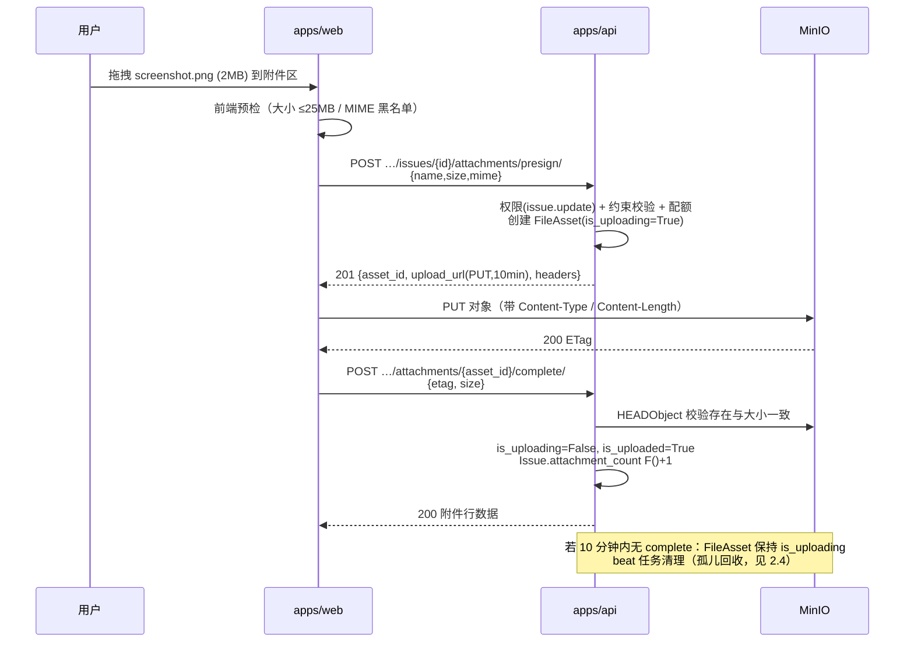
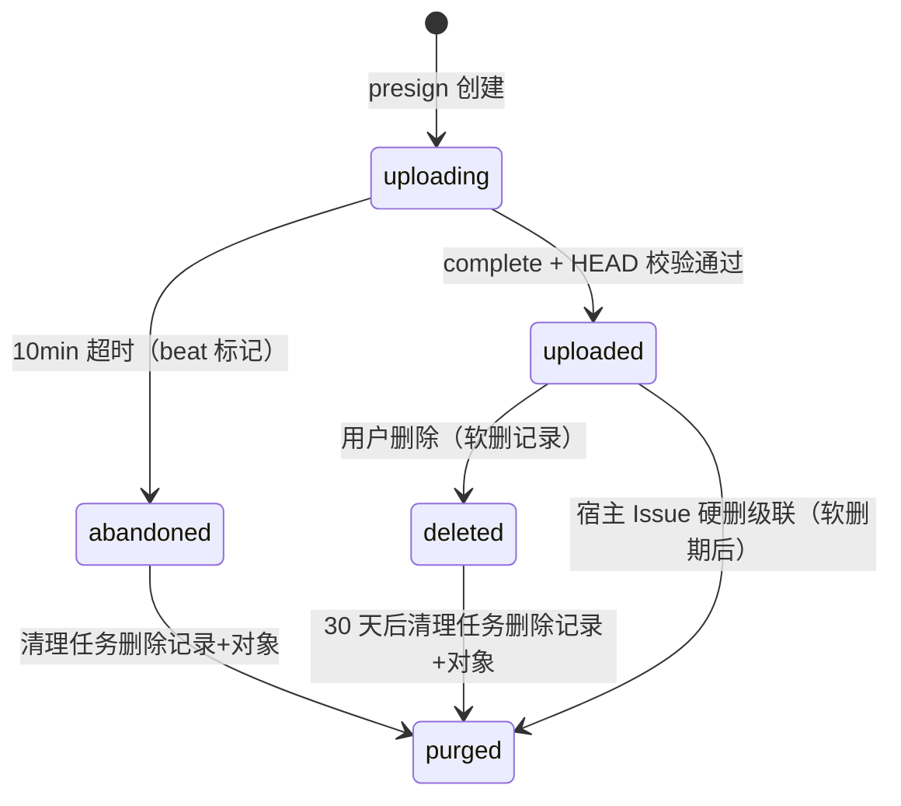
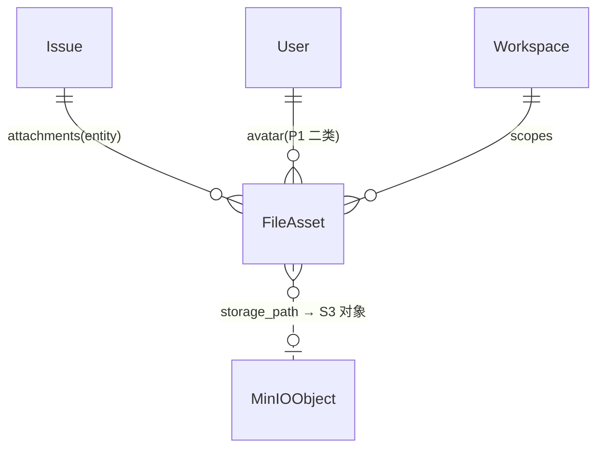

# 任务级附件上传下载

| 元信息项 | 内容 |
| --- | --- |
| 文档编号 | FILE-001 |
| 所属迭代 | Sprint 1：MVP 能力补齐（第 3 周） |
| 优先级 | P1（MVP 必备级） |
| 所属模块 | M7-FILE 文件资源管理 |
| 文档状态 | 待评审（Draft） |
| 最后更新日期 | 2026-09-01 |
| 上游依据 | `docs/需求文档.md` §3.7（文件上传 / 下载 / 操作日志）、§8.2 文件管理 P1 列（任务级单附件上传 / 下载） |
| 前置依赖 | `INFRA-002`（MinIO 容器 + 自动建桶）、`TASK-001`（Issue 承载）、`PROJ-002`（项目成员权限）、`INFRA-004`（错误码 / 日志）、`AUTH-004`（直传通道首个消费者——头像） |
| 下游依赖 | `FILE-002`（P2 项目文件库复用 FileAsset 与直传通道）、`FILE-003`（P2 分片续传扩展 `is_multipart` 状态）、`COLLAB-002`（P2 图片评论复用附件）、`BOARD-002`（卡片附件计数消费 `attachment_count`） |
| 架构基线 | [`api-conventions.md`](../architecture/api-conventions.md) §2.5（`attachments/presign` 端点契约）、§9（认证与预签名）；[`tech-stack.md`](../architecture/tech-stack.md)（MinIO / S3 兼容，预签名直传不经服务端中转） |
| 竞品参考 | Plane（FileAsset 表 + attributes JSONB + is_uploaded 状态机 + presigned 直传）、Ones（企业网盘体系，任务附件即文件库挂载） |

> **范围声明**：交付任务级附件：上传（MinIO 预签名直传三步流）、下载（预签名 GET）、删除、附件区 UI 与卡片计数。需求文档 §8.2 P1 列原文为「本地临时存储」，本系统**决策升级为 MinIO 直传**（理由见 §6.3，基础设施 P0 已就位）。项目文件库 / 目录树 / 分片续传 / 在线预览 / 多版本 / 分享链接（P2 `FILE-002~004`）不在范围。

---

## 1. 概述

### 1.1 功能定位

缺陷截图、设计稿、日志文件——没有附件的任务系统无法承载真实研发协作。本文档建立全系统**第一个文件通道**：`FileAsset` 模型 + 预签名直传三步流。该通道是 P2 项目文件库、图片评论、P3 Wiki 的共同地基，因此模型设计以「通道复用」为第一约束，任务附件只是它的第一个挂载点（`entity_type=issue`）。

| 交付项 | 说明 |
| --- | --- |
| `FileAsset` 模型 | 归属（workspace/project/entity 三级）、原始属性（名 / 大小 / MIME / hash）、存储路径、上传状态机 |
| 直传三步流 | ① `POST …/attachments/presign/` 换 PUT 预签名 URL → ② 浏览器直传 MinIO → ③ `POST …/attachments/{id}/complete/` 确认落库为已上传 |
| 下载 | `GET …/attachments/{id}/download/` → 302 预签名 GET URL（5 分钟有效），鉴权后放行 |
| 删除 | 软删附件记录；对象由清理任务延迟回收（防误删） |
| 约束 | 单文件 ≤ 25MB；类型黑名单（可执行文件等）；单任务 ≤ 20 附件 |
| 附件区 UI | 任务详情描述下方：上传按钮 + 拖拽区 + 文件行（图标 / 名称 / 大小 / 上传人 / 时间 / 下载 / 删除）+ 上传进度 |

### 1.2 目标用户

| 用户 | 场景 | 关注点 |
| --- | --- | --- |
| 提缺陷的成员 | 贴截图 / 日志 | 拖进来就走，不用离开任务页 |
| 处理人 | 查看证据 | 点击即下载原文件 |
| 运维视角 | 存储治理 | 文件不经 API 服务器（带宽 / 内存零占用）；孤儿对象可回收 |

### 1.3 前置依赖说明

| 依赖文档 | 依赖内容 | 缺失后果 |
| --- | --- | --- |
| `INFRA-002` | MinIO 容器、`rp-uploads` 桶自动创建、Nginx 直传路由放行 | 通道不可用 |
| `AUTH-004` | 头像直传已验证通道（presign/complete 协议一致） | 协议分歧返工 |

### 1.4 竞品参考结论（详见第 6 章）

- **Plane**：`FileAsset`（attributes JSONB + size + is_uploaded + entity 系列外键）+ `get_singed_file_upload_url` presign；完成确认后置 `is_uploaded=True`。
- **Ones**：任务附件是统一文件库的挂载视图（P2 对齐点），企业版叠加水印 / 禁下载（P4 `FILE-006`）。
- **本系统**：通道协议对齐 Plane；把「大小 / MIME / hash 黑白名单」在 presign 期前置校验（Plane 在完成期才校验部分项），减少无效直传。

---

## 2. 业务逻辑

### 2.1 直传三步流（时序）



### 2.2 上传状态机



### 2.3 业务规则表

| 编号 | 规则 | 判定位置 | 违反后果 |
| --- | --- | --- | --- |
| BR-01 | 单文件 ≤ 25MB；MIME 黑名单：`application/x-msdownload`、`application/x-executable`、`application/x-sharedlib`、`application/x-bat` 及扩展名 `.exe .dll .bat .sh .cmd .com .scr .msi`；其余类型放行（含 zip 但 zip 内不扫描，标注 P4 病毒扫描 `FILE-006`） | 前端预检 + presign 后端 | 400 `FILE_TOO_LARGE` / `FILE_TYPE_NOT_ALLOWED` |
| BR-02 | 扩展名与声明 MIME 冲突时以**扩展名黑名单**为准（防改名绕过） | presign | 400 `FILE_TYPE_NOT_ALLOWED` |
| BR-03 | 单任务附件 ≤ 20 个（不含已删）；单用户日上传 ≤ 200 个 / 2GB（软配额防滥用） | Service | 400 `TOO_MANY` / 429 `QUOTA_EXCEEDED` |
| BR-04 | 存储键：`{workspace_id}/{project_id}/{entity_type}/{entity_id}/{ulid}.{ext}`——层级即隔离边界，桶策略按前缀限定 | Service | — |
| BR-05 | complete 时 HEAD 校验：对象存在、size 与 presign 声明一致（±0）；etag 不强制比对（部分客户端代理改写 etag） | Service | 400 `FILE_UPLOAD_MISMATCH` |
| BR-06 | 下载必须经 API 鉴权端点换 5 分钟预签名 GET；直连 MinIO URL 无桶公共读（桶策略 private） | ViewSet | 403 |
| BR-07 | presign URL 有效期 10 分钟、单 URL 单次；重复 complete 幂等（已 uploaded 直接 200） | Service | — |
| BR-08 | 上传 / 下载 / 删除写入 `IssueActivity`（field=attachments，verb=updated）与文件操作日志（`plane.app.files` channel） | 异步 | — |
| BR-09 | 删除软删记录 + `attachment_count F()-1`；对象延迟 30 天由清理任务物理删（误删可恢复窗口） | Service + beat | — |
| BR-10 | 权限：presign/complete/delete 需 `issue.attachment.manage`（CONTRIBUTOR+）；download 需 `project.read` | `AUTH-005` 矩阵 | 403 |

### 2.4 孤儿回收（beat 任务）

| 任务 | 周期 | 逻辑 |
| --- | --- | --- |
| `mark_abandoned_uploads` | 每 10 分钟 | `is_uploading=True AND created_at < now-10min` → `abandoned` |
| `purge_deleted_assets` | 每日 | `deleted_at < now-30d` 或 `abandoned` 超 1 天：删除 MinIO 对象 + 硬删记录；失败重试 3 次后告警日志 |

### 2.5 异常处理表

| 异常场景 | 触发条件 | HTTP / 错误码 | 前端表现 | 后端处理 |
| --- | --- | --- | --- |---|
| 超大文件 | > 25MB | 400 `FILE_TOO_LARGE` | 拖拽区红框 + 大小提示 | presign 前拦截（不产生对象） |
| 黑名单类型 | .exe | 400 `FILE_TYPE_NOT_ALLOWED` | 文件行红字移除 | — |
| 直传失败 | 网络 / MinIO 不可用 | （PUT 层失败） | 自动重试 2 次 → 行错误态 + 手动重试 | complete 不到达 → 走孤儿回收 |
| complete 校验不一致 | HEAD size ≠ 声明 | 400 `FILE_UPLOAD_MISMATCH` | 提示重新上传 | 记录弃置 |
| 下载越权 | 非项目成员 | 404 | 404 空态 | `accessible_by` 委托 |
| 幂等 complete | 重复调用 | 200 | — | — |

### 2.6 边界条件表

| 边界场景 | 限制值 | 超出处理方式 |
| --- | --- | --- |
| 文件名长度 | 255（去路径，仅取 basename） | 400 |
| 中文 / emoji 文件名 | 支持 | `Content-Disposition` 按 RFC 5987 编码（filename*） |
| 同名文件 | 允许共存（ULID 键天然去重） | 列表按时间区分 |
| 并发上传同任务 | 20 上限原子判定 | `select_for_update` Issue 行计数 |
| 断点续传 | 不支持（P2 `FILE-003` 分片） | 大文件建议压缩包 |

---

## 3. UI/UX 设计

### 3.1 附件区布局（任务详情页，描述块之下）

| 区域 | 组件 | UI 组件 |
| --- | --- | --- |
| 头部 | 「附件 N」+ 上传按钮 + 拖拽提示（虚线框 hover 高亮） | `SectionHeader` / `Dropzone` |
| 文件行 | 类型图标（按 MIME 映射）/ 名称 / 大小（KB/MB 自适应）/ 上传人头像 / 相对时间 / 下载 / 删除（Gate） | `FileRow` |
| 上传中行 | 进度条（PUT `xhr.upload.onprogress`）+ 取消按钮 | `UploadRow` |

### 3.2 交互细节表

| 交互动作 | 触发方式 | 反馈效果 | 加载态 / 空态 |
| --- | --- | --- | --- |
| 拖拽上传 | drop / 点击选择 | 虚线框高亮 → 文件行加入列表（本地上行） | 失败行红条 + 重试 |
| 下载 | 行内按钮 | 直接触发浏览器下载（302 预签名） | 链接过期自动重换一次 |
| 删除 | 行内 ✕ → 确认 | 行淡出；计数 -1 | — |
| 卡片附件计数 | 列表 / 看板卡片 | 📎 2 徽章（`TASK-002` 卡片升级） | — |
| 取消上传 | 上传中 ✕ | abort xhr；行移除；记录转孤儿回收 | — |

### 3.3 无障碍要求

- Dropzone 有键盘替代（按钮唤起文件选择器）；上传进度条 `role="progressbar"` + `aria-valuenow`。
- 文件行操作按钮带 `aria-label`（「下载 screenshot.png」）。

---

## 4. 技术架构

### 4.1 数据模型

```python
class FileAsset(BaseModel):
    """文件资产 —— 全系统唯一文件通道（对标 Plane FileAsset）。

    P1 挂载点仅 issue；P2 复用至项目文件库 / 评论图片（entity_type 扩展）。
    """

    class Status(models.TextChoices):
        UPLOADING = "uploading", "直传中"
        UPLOADED = "uploaded", "已上传"
        ABANDONED = "abandoned", "已弃置"

    class EntityType(models.TextChoices):
        ISSUE = "issue", "任务"
        AVATAR = "avatar", "头像"          # AUTH-004 消费
        # P2+: project_file / comment_image / wiki_page

    workspace = models.ForeignKey(Workspace, on_delete=models.CASCADE, related_name="assets")
    project = models.ForeignKey(Project, on_delete=models.CASCADE, null=True, blank=True, related_name="assets")
    entity_type = models.CharField(max_length=32, choices=EntityType.choices)
    entity_id = models.UUIDField(verbose_name="宿主实体 ID")

    attributes = models.JSONField(default=dict, verbose_name="扩展属性",
                                  help_text="name/size/mime/ext/hash 等原始属性，Plane 同构")
    size = models.BigIntegerField(default=0, verbose_name="字节数")
    storage_path = models.TextField(verbose_name="对象键")
    status = models.CharField(max_length=16, choices=Status.choices, default=Status.UPLOADING, db_index=True)
    is_uploaded = models.BooleanField(default=False, verbose_name="完成确认位（冗余，兼容 Plane 语义）")
    uploaded_by = models.ForeignKey("db.User", on_delete=models.SET_NULL, null=True, related_name="uploaded_files")

    class Meta(BaseModel.Meta):
        db_table = "file_assets"
        indexes = [
            models.Index(fields=["entity_type", "entity_id"], name="idx_asset_entity"),
            models.Index(fields=["workspace", "status"], name="idx_asset_ws_status"),
        ]
        constraints = [models.CheckConstraint(
            check=~models.Q(attributes__name__regex=r"\.(exe|dll|bat|cmd|com|scr|msi|sh)$"),
            name="chk_asset_ext_blocklist")]
```

> 黑名单同时存在于应用层（presign 校验，返回友好 400）与 DB CheckConstraint（纵深防御）；`Issue.attachment_count` 为 P0 已建冗余列，本迭代启用维护。



### 4.2 API 定义

| 方法/路径 | 描述 | 权限 |
| --- | --- | --- |
| `POST …/issues/{issue_id}/attachments/presign/` | 申请直传（name/size/mime） | `issue.attachment.manage` |
| `POST …/issues/{issue_id}/attachments/{asset_id}/complete/` | 完成确认（幂等） | `issue.attachment.manage` |
| `GET …/issues/{issue_id}/attachments/` | 附件列表 | `project.read` |
| `GET …/attachments/{asset_id}/download/` | 换取下载 URL（302） | `project.read` |
| `DELETE …/issues/{issue_id}/attachments/{asset_id}/` | 删除附件（软删） | `issue.attachment.manage` |

**presign 示例**：

```json
// Request
{ "name": "error-500.png", "size": 2097152, "mime": "image/png" }
// 201
{ "status": "success", "data": {
    "asset_id": "fa1…",
    "upload_url": "https://minio.local/rp-uploads/3f2c…/9d8e…/issue/8a1f…/01JBX….png?X-Amz-…",
    "method": "PUT", "expires_in": 600,
    "headers": { "Content-Type": "image/png" } } }
```

**complete 示例**：

```json
// Request { "etag": "\"d41d8…\"", "size": 2097152 }
// 200
{ "status": "success", "data": { "id": "fa1…", "name": "error-500.png", "size": 2097152,
    "mime": "image/png", "uploaded_by": "6c7d…", "created_at": "2026-09-01T09:00:00.000Z" } }
```

### 4.3 核心逻辑

```python
class AssetService:
    BLOCKED_EXTS = {".exe", ".dll", ".bat", ".cmd", ".com", ".scr", ".msi", ".sh"}

    def presign(self, *, issue, payload, actor) -> tuple[FileAsset, str]:
        ext = Path(payload["name"]).suffix.lower()
        if ext in self.BLOCKED_EXTS:
            raise AppException("FILE_TYPE_NOT_ALLOWED", details=[{"field": "name", "code": "INVALID"}])
        if payload["size"] > 25 * 1024 * 1024:
            raise AppException("FILE_TOO_LARGE")
        self._check_quota(issue, actor)                       # BR-03
        asset = FileAsset.objects.create(
            workspace_id=issue.project.workspace_id, project_id=issue.project_id,
            entity_type="issue", entity_id=issue.id,
            attributes=payload, size=payload["size"],
            storage_path=self._build_key(issue, ext), uploaded_by=actor)
        url = minio_client.presigned_put_object("rp-uploads", asset.storage_path, expires=timedelta(minutes=10))
        return asset, url

    def complete(self, *, asset, issue, declared_size: int) -> FileAsset:
        stat = minio_client.stat_object("rp-uploads", asset.storage_path)   # HEAD
        if stat.size != declared_size or stat.size != asset.size:
            raise AppException("FILE_UPLOAD_MISMATCH")
        with transaction.atomic():
            FileAsset.objects.filter(pk=asset.pk, status="uploading").update(
                status="uploaded", is_uploaded=True)                         # 原子翻转，幂等
            Issue.objects.filter(pk=issue.pk).update(attachment_count=F("attachment_count") + 1)
            transaction.on_commit(lambda: issue_activity.delay(issue.id, "attachments", "added",
                                                               asset.attributes["name"]))
        return asset
```

**并发策略**：计数与状态翻转均以条件 UPDATE 原子执行；并发重复 complete 恰一次生效（幂等返回 200）。

### 4.4 前端实现

- `usePresignedUpload(entity)` hook（P1 通用件）：`presign → PUT（onprogress/abort）→ complete`，被附件区与 `AUTH-004` 头像共用。
- 并发控制：同时直传 ≤ 3，队列串行其余（防家宽打满）。
- `AttachmentStore`：任务维度 Map；下载前若链接过期（403 on object）自动重调 download 端点一次。

### 4.5 Nginx 直传路由

`apps/proxy`：`client_max_body_size 30m`（25MB 文件 + 头部余量）仅作用于 `PUT /uploads/` 前缀反代 MinIO；API 前缀维持 2m（`INFRA-004` §2.4）。浏览器同源直传（`https://app.local/uploads/…`），无跨域预检成本。

---

## 5. 测试用例

### 5.1 单元测试

| 用例 ID | 测试目标 | 输入 | 预期输出 | 覆盖类型 |
| --- | --- | --- | --- | --- |
| UT-01 | 黑名单拦截 | a.exe | 400 `FILE_TYPE_NOT_ALLOWED` | 安全 |
| UT-02 | 改名绕过 | a.png 实为 PE 头 | P1 放行（声明即真）；标注 P4 病毒扫描 | 已知限制 |
| UT-03 | 超大 | 26MB | 400 `FILE_TOO_LARGE`，无对象产生 | 边界 |
| UT-04 | complete 大小不符 | HEAD size ≠ 声明 | 400 `FILE_UPLOAD_MISMATCH` | 异常 |
| UT-05 | 幂等 complete | 连续两次 | 均 200，计数 +1 一次 | 正常 |
| UT-06 | 存储键层级 | 任意上传 | 键含 ws/project/entity 四段 | 安全 |
| UT-07 | 下载越权 | 非成员换下载 URL | 404 | 安全 |
| UT-08 | 配额 | 第 201 个 / 日 | 429 `QUOTA_EXCEEDED` | 边界 |
| UT-09 | 孤儿标记 | 10 分钟无 complete | beat 后状态 abandoned | 异步 |
| UT-10 | 级联清理 | 删除宿主任务 | 附件软删，30 天后对象物理删 | 生命周期 |

### 5.2 集成测试

| 用例 ID | 场景 | 前置条件 | 操作步骤 | 预期结果 |
| --- | --- | --- | --- | --- |
| IT-01 | 全链路直传 | MinIO healthy | presign→PUT→complete→download | 字节级一致（sha256 前后比对） |
| IT-02 | 中文名下载 | error 报错.png | 下载 | 文件名正确（RFC 5987） |
| IT-03 | 并发 5 文件 | 附件区 | 同时拖 5 文件 | 3 并发 + 2 排队，全部成功 |
| IT-04 | 桶策略私有 | 持对象 URL 直接 GET | — | 403（必须走换发端点） |
| IT-05 | 清理任务 | 造 abandoned + deleted 数据 | 手动触发 beat | 对象与记录按期清理 |

### 5.3 E2E 测试

| 用例 ID | 用户场景 | 操作路径 | 验收标准 |
| --- | --- | --- | --- |
| E2E-01 | 缺陷贴图 | 建缺陷 → 拖截图 → 提交 | 进度条走完；卡片 📎 1；刷新可见 |
| E2E-02 | 下载验证 | 点击下载 | 与源文件 sha256 一致 |
| E2E-03 | 删除恢复窗口 | 删除附件 | 行消失计数 -1；30 天内库内可查（管理视角） |

---

## 6. 竞品深度对标

### 6.1 Plane 实现分析

`FileAsset` 单表 + attributes JSONB + `is_uploaded` 布尔；presign 由 `get_singed_file_upload_url` 生成；实体关联采用「一列外键一个实体类型」的多可空外键（issue_id/page_id/comment_id…）随类型膨胀加列。**优势**：成熟直传协议。**劣势**：多可空外键方案每加一种宿主要 DDL；黑名单校验弱。

### 6.2 Ones 实现分析

任务附件 = 统一文件库挂载（实体引用型），天然支持同文件多任务引用与去重；企业版叠加水印 / 禁下载 / 审计（P4 `FILE-006`）。代价是文件库先行，P1 成本高。

### 6.3 本系统设计决策

1. **对需求文档 P1「本地临时存储」的升级决策**：MinIO 已在 P0 编排就位（验收标准 6 明确全套服务）；本地磁盘存储会在 P2 文件库时形成双体系迁移成本；预签名直传使 API 进程零文件带宽（2 人团队服务器资源敏感）。**升级零新增基建，且 `api-conventions.md` 早已预定义 presign 契约**——属于把 P2 的地基提前到 P1 打，不属范围蔓延。
2. **`entity_type + entity_id` 多态挂载**：修复 Plane 多可空外键的膨胀问题（P2 新宿主零 DDL）；以 `(entity_type, entity_id)` 索引支撑反查。
3. **黑名单双层（应用 + DB Check）**：纵深防御；病毒扫描明示 P4 边界（UT-02 记录已知限制）。
4. **差异化价值**：一个通道（模型 + 协议 + hook + Nginx 路由）三阶段复用（P1 任务附件/头像 → P2 文件库/评论图 → P3 Wiki），本迭代即完成通道验证。

---

## 7. 里程碑与验收

### 7.1 交付物清单

| 类型 | 交付物 |
| --- | --- |
| Model / Migration | `FileAsset` 表（索引 + CheckConstraint） |
| API 端点 | §4.2 全部 5 个端点 |
| 后端 | `AssetService`（presign/complete/删除）、下载 302 换发、`mark_abandoned_uploads` + `purge_deleted_assets` beat |
| 前端 | 附件区（Dropzone / FileRow / UploadRow）、`usePresignedUpload` hook、卡片 📎 计数 |
| 网关 | `/uploads/` 直传路由（30m body 上限） |
| 测试 | UT-01~10、IT-01~05、E2E-01~03 |

### 7.2 可操作演示的验收标准

1. 拖拽 2MB 截图到任务附件区：进度条走完即出现在列表，卡片显示 📎 1；期间 API 容器网络 IO 为 0（`docker stats` 验证直传）。
2. 下载文件与源文件 sha256 一致；中文文件名正确。
3. 上传 .exe 被 400 拒绝且不产生任何对象；26MB 文件同理。
4. 删除附件后任务 `attachment_count` -1；上传一半取消的文件 10 分钟后被标记弃置，次日被清理。
5. 非项目成员持附件 ID 换下载链接返回 404；直接访问对象 URL 返回 403。
