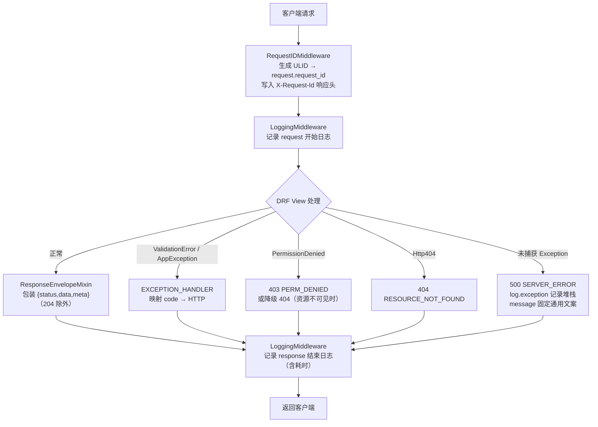

# 统一返回格式 / 全局错误 / 环境配置

| 元信息项 | 内容 |
| --- | --- |
| 文档编号 | INFRA-004 |
| 所属迭代 | Sprint 1：MVP 能力补齐（第 3 周） |
| 优先级 | P1（MVP 必备级） |
| 所属模块 | M9-INFRA 基础设施与部署运维 |
| 文档状态 | 待评审（Draft） |
| 最后更新日期 | 2026-09-01 |
| 上游依据 | `docs/需求文档.md` §8.2 部署运维 P1 列（统一接口返回格式、全局错误捕获、环境变量配置、基础运行日志） |
| 前置依赖 | `INFRA-001`（工程骨架）、`INFRA-002`（Docker Compose 全套服务）、`INFRA-003`（Django 项目结构与 settings 骨架） |
| 下游依赖 | Sprint 1 全部 10 份功能文档；Sprint 2-9 所有新增端点默认继承本文档的异常处理、日志与配置框架 |
| 架构基线 | [`api-conventions.md`](../architecture/api-conventions.md) §4（响应格式）、§8（错误码体系）、§8.9（前端消费范式）、§10（日志与可观测）；[`monorepo-structure.md`](../architecture/monorepo-structure.md) §7（环境变量层级） |
| 竞品参考 | Plane（`plane/settings/common.py` 环境分层 + DRF `EXCEPTION_HANDLER` + `base/views/base.py` 异常基类）、Ones（企业级配置中心与运维日志采集） |

> **范围声明**：本文档交付「后端响应 / 异常 / 日志 / 配置」四件套的统一实现。接口限流（`INFRA-005`，P2）、Sentry 接入（P2）、多租户配置中心（P4）不在本文档范围。P0 阶段各文档已按信封格式手工实现，本文档将其**收口为框架级默认行为**，业务代码不再手写。

---

## 1. 概述

### 1.1 功能定位

Sprint 0 的端点是「逐个手工遵守规范」，存在三个工程隐患：一是 DRF 默认抛出的 404/403/405/429 仍是 DRF 原生格式，绕过了统一信封；二是错误码字符串散落各文件，无注册表约束，前端无法穷举分支；三是日志无结构、无请求 ID，多人协作排障时无法把一次报障定位到具体请求。INFRA-004 把这三件事一次收口：

| 交付项 | 说明 |
| --- | --- |
| 全局异常处理器 | `EXCEPTION_HANDLER` 统一改写全部 4xx/5xx（含 DRF 默认、PermissionDenied、Http404、未捕获 Exception）为 `{status, error}` 信封 |
| 错误码注册表 | `ErrorCodes` 常量类 + 枚举校验，新增错误码必须登记，禁止裸字符串 |
| 环境配置体系 | `settings/{base,dev,staging,prod}.py` 分层 + `.env` 单一事实来源 + 启动时强校验 |
| 结构化运行日志 | JSON 行格式日志 + ULID 请求追踪 ID + 按模块分 channel |

### 1.2 目标用户

| 用户 | 场景 | 关注点 |
| --- | --- | --- |
| 后端开发者（本迭代 2 人） | 新增端点、排障 | 不写样板代码即获得统一错误格式；一条 request_id 串起一次请求的全部日志 |
| 前端开发者 | 错误分支处理 | `error.code` 可穷举；`details[]` 可直接映射表单字段 |
| 运维 / 未来企业版管理员 | 生产部署、故障定位 | 环境变量集中可审计；日志可被 Loki/ELK 直接采集 |

### 1.3 前置依赖说明

| 依赖文档 | 依赖内容 | 缺失后果 |
| --- | --- | --- |
| `INFRA-003` | Django App 划分、`settings/common.py` 骨架、`BaseModel` | 异常处理器与日志中间件无处挂载 |
| `INFRA-002` | Nginx（`apps/proxy`）与全部服务容器 | Nginx 层 413/502/503 统一 JSON 无法落地 |
| `api-conventions.md` | §4 响应格式、§8 错误码总表——本文档是其**代码实现**，不新增规范 | — |

### 1.4 竞品参考结论（详见第 6 章）

- **Plane**：`apps/api/plane/settings/common.py` 按 Docker 环境变量读取配置；`base/exception.py` 定义 `AppException` 基类；但错误响应未做全局信封收口（部分端点返回 DRF 原生格式）。
- **Ones**：企业版具备配置中心、分级日志采集、按租户的配置下发，属 P3/P4 能力。
- **本系统**：以「架构文档定契约 + 本文档代码收口」的方式比 Plane 更严格——**不存在任何绕过信封的端点**，CI 以响应快照测试守护。

---

## 2. 业务逻辑

### 2.1 一次错误请求的完整处理流



### 2.2 异常分类映射（业务规则表）

| 编号 | 异常源 | 映射结果 | 说明 |
| --- | --- | --- | --- |
| BR-01 | `rest_framework.exceptions.ValidationError` | 400 `VALIDATION_ERROR`，`details` 从 `detail` 字典逐字段展开 | 字段级子码遵循 §8.8（`REQUIRED` / `INVALID` / `UNIQUE`…） |
| BR-02 | 业务代码抛 `AppException(code=…)` | 按 `ErrorCodes` 注册表映射 HTTP 码 | `AppException` 支持 `details` / `doc_url` 附加参数 |
| BR-03 | `rest_framework.exceptions.PermissionDenied` | 403 `PERM_DENIED` | 资源不可见场景由 Permission 基类改抛 `Http404`（见 `AUTH-003` IR 规则） |
| BR-04 | `django.http.Http404` / `get_object_or_404` | 404 `RESOURCE_NOT_FOUND` | 含 `accessible_by()` 过滤后的空查询集 |
| BR-05 | `rest_framework.exceptions.NotAuthenticated` | 401 `AUTH_REQUIRED` | 前端拦截器据此跳登录 |
| BR-06 | `rest_framework.exceptions.AuthenticationFailed` | 401 `AUTH_INVALID_CREDENTIALS` 或 `AUTH_ACCOUNT_DISABLED` | 由认证层指定子码 |
| BR-07 | `django.db.utils.IntegrityError`（唯一约束） | 409 `RESOURCE_ALREADY_EXISTS` | 从约束名反查冲突字段填入 `details` |
| BR-08 | `django.core.exceptions.PermissionDenied`（CSRF） | 403 `AUTH_CSRF_FAILED` | — |
| BR-09 | `SimpleRateThrottle` 触发 | 429 `RATE_LIMIT_EXCEEDED` + `Retry-After` | P1 仅认证端点启用，全量见 `INFRA-005` |
| BR-10 | 未捕获 `Exception` | 500 `SERVER_ERROR`，`message` 固定「服务器开小差了，请稍后重试」，堆栈只进日志与 `log.exception` | 响应体**永不**包含堆栈、SQL、路径 |
| BR-11 | 请求体 JSON 解析失败 | 400 `VALIDATION_ERROR`，子码 `MALFORMED_BODY` | — |
| BR-12 | `error.request_id` 必填且等于 `X-Request-Id` 头 | 成功响应也带 `X-Request-Id` | 客户端报障提供此 ID 即可检索日志 |

### 2.3 异常处理表（前端表现）

| 异常场景 | HTTP | error.code | 前端表现 | 后端处理 |
| --- | --- | --- | --- | --- |
| 表单校验失败 | 400 | `VALIDATION_ERROR` | `details[]` 映射到对应输入框红字 | 逐字段展开子码 |
| 越权访问他人资源 | 404 | `RESOURCE_NOT_FOUND` | 404 空态页 | 权限不可见统一 404（防枚举） |
| 已认证无操作权限 | 403 | `PERM_DENIED` | Toast「无权限执行此操作」 | Permission 类抛出 |
| 会话过期 | 401 | `AUTH_SESSION_EXPIRED` | 清理本地态，跳登录（带 `next`） | 拦截器统一分派 |
| 唯一性冲突 | 409 | `RESOURCE_ALREADY_EXISTS` | 对应字段提示已存在 | IntegrityError 捕获转换 |
| 触发限流 | 429 | `RATE_LIMIT_EXCEEDED` | Toast 展示 `Retry-After` 秒数 | Throttle 类抛出 |
| 服务端异常 | 500 | `SERVER_ERROR` | 通用错误 + 展示 request_id 后 8 位 | log.exception + 上报 |
| 网关层错误 | 502/503 | `SERVER_UNAVAILABLE` | 「服务暂不可用，请稍后重试」 | Nginx 返回统一 JSON（§4.5） |

### 2.4 边界条件表

| 边界场景 | 限制值 | 超出处理方式 |
| --- | --- | --- |
| 单个 `details[]` 条目 | ≤ 20 | 超出部分截断，`meta.truncated=true`（不实现，防御性约定） |
| 日志单条体积 | 8 KB | 超长字段（如请求体）截断为前 512 字符 + `…` |
| `AppException` 消息长度 | 200 字符 | 构造时断言，超长视为编码错误 |
| 请求体大小 | 2 MB（api 层）/ 100 MB（附件直传走 MinIO 不经 api） | Nginx `client_max_body_size` 拦截 → 413 统一 JSON |
| 环境变量缺失（`SECRET_KEY` 等 6 个必填项） | — | 启动即 `ImproperlyConfigured` 快速失败，禁止带缺省启动 |

---

## 3. UI/UX 设计

### 3.1 本文档无直接用户界面

交付物为后端框架代码与 Nginx 配置，但其行为直接决定前端三类全局 UI：

| UI 元素 | 依赖本文档的行为 | 实现位置 |
| --- | --- | --- |
| 全局错误 Toast | `error.message` 可直接展示 | `packages/ui` `ErrorToast` |
| 表单字段错误 | `details[].field → code → 文案` 映射表 | `packages/form` `useApiFieldErrors` |
| 404 / 403 / 500 空态页 | `error.code` 分支 | `apps/web` `routes/_error.tsx` |

### 3.2 前端 axios 错误拦截器（统一分派）

```ts
// packages/api/src/interceptors/error.ts（关键分支）
axios.interceptors.response.use(
  (res) => res,
  (err: AxiosError<ApiErrorEnvelope>) => {
    const code = err.response?.data?.error?.code;
    switch (code) {
      case "AUTH_REQUIRED":
      case "AUTH_SESSION_EXPIRED":
        authStore.resetAndRedirectToLogin(); return Promise.reject(err);
      case "VALIDATION_ERROR":
        // 由各表单的 useApiFieldErrors 消费 details[]
        return Promise.reject(new FormFieldError(err.response.data.error));
      case "RATE_LIMIT_EXCEEDED":
        toast.warning(`请求过于频繁，请 ${retryAfter(err)} 秒后重试`);
        return Promise.reject(err);
      case "SERVER_ERROR":
        toast.error(`服务器异常（${shortId(err)}），请稍后重试或反馈`);
        return Promise.reject(err);
      default:
        toast.error(err.response?.data?.error?.message ?? "请求失败");
        return Promise.reject(err);
    }
  },
);
```

### 3.3 无障碍与国际化

- 错误文案统一中文，后续国际化（P3）通过 `error.code → i18n key` 映射实现，因此**客户端分支只允许依赖 `code`**。
- Toast 展示时长 ≥ 5s（含 request_id 的错误 ≥ 10s），保证可读。

---

## 4. 技术架构

### 4.1 错误码注册表

```python
# apps/api/plane/base/exception.py
from rest_framework import exceptions, status


class ErrorCodes:
    """错误码注册表 —— 与 api-conventions.md §8 一一对应。

    新增错误码必须先在架构文档 §8 登记再在此实现；
    CI 通过单测断言两者集合一致，防止漂移。
    """

    AUTH_REQUIRED = ("AUTH_REQUIRED", status.HTTP_401_UNAUTHORIZED)
    AUTH_SESSION_EXPIRED = ("AUTH_SESSION_EXPIRED", status.HTTP_401_UNAUTHORIZED)
    AUTH_INVALID_CREDENTIALS = ("AUTH_INVALID_CREDENTIALS", status.HTTP_401_UNAUTHORIZED)
    AUTH_ACCOUNT_DISABLED = ("AUTH_ACCOUNT_DISABLED", status.HTTP_401_UNAUTHORIZED)
    AUTH_CSRF_FAILED = ("AUTH_CSRF_FAILED", status.HTTP_403_FORBIDDEN)
    AUTH_TOO_MANY_ATTEMPTS = ("AUTH_TOO_MANY_ATTEMPTS", status.HTTP_429_TOO_MANY_REQUESTS)
    PERM_DENIED = ("PERM_DENIED", status.HTTP_403_FORBIDDEN)
    VALIDATION_ERROR = ("VALIDATION_ERROR", status.HTTP_400_BAD_REQUEST)
    RESOURCE_NOT_FOUND = ("RESOURCE_NOT_FOUND", status.HTTP_404_NOT_FOUND)
    RESOURCE_ALREADY_EXISTS = ("RESOURCE_ALREADY_EXISTS", status.HTTP_409_CONFLICT)
    RESOURCE_CONFLICT = ("RESOURCE_CONFLICT", status.HTTP_409_CONFLICT)
    RATE_LIMIT_EXCEEDED = ("RATE_LIMIT_EXCEEDED", status.HTTP_429_TOO_MANY_REQUESTS)
    SERVER_ERROR = ("SERVER_ERROR", status.HTTP_500_INTERNAL_SERVER_ERROR)
    SERVER_UNAVAILABLE = ("SERVER_UNAVAILABLE", status.HTTP_503_SERVICE_UNAVAILABLE)
    # Sprint 1 各业务文档新增码在此追加（如 FILE_TOO_LARGE / NOTIFY_*）


class AppException(exceptions.APIException):
    """业务异常基类 —— 业务代码唯一允许抛出的异常类型。"""

    def __init__(
        self,
        code: str,
        message: str | None = None,
        details: list[dict] | None = None,
        doc_url: str | None = None,
    ):
        self.error_code, self.http_status = ErrorCodes.__dict__[code]  # KeyError = 未注册码，测试期暴露
        self.detail_message = message or DEFAULT_MESSAGES[self.error_code]
        self.extra_details = details or []
        self.doc_url = doc_url
        super().__init__(self.detail_message)
```

### 4.2 全局异常处理器

```python
# apps/api/plane/base/handlers.py
import logging
from rest_framework.views import exception_handler as drf_exception_handler

logger = logging.getLogger("plane.api.errors")


def envelope_exception_handler(exc, context):
    """全局异常处理器 —— DRF settings.EXCEPTION_HANDLER 指向此函数。

    保证任何路径（包括未捕获异常）都返回 {status:"error", error:{...}} 信封。
    """
    response = drf_exception_handler(exc, context)
    request = context.get("request")
    request_id = getattr(request, "request_id", "unknown")

    if response is None:  # 未捕获异常 → 500
        logger.exception("unhandled exception request_id=%s", request_id)
        response = Response(status=500)
        response.data = build_error_body("SERVER_ERROR", request_id)

    elif isinstance(exc, exceptions.ValidationError):
        response.data = build_error_body("VALIDATION_ERROR", request_id, details=flatten_validation(exc.detail))

    elif getattr(exc, "error_code", None):  # AppException
        response.data = build_error_body(exc.error_code, request_id, message=exc.detail_message,
                                         details=exc.extra_details, doc_url=exc.doc_url)
        response.status_code = exc.http_status

    elif isinstance(exc, exceptions.NotFound):
        response.data = build_error_body("RESOURCE_NOT_FOUND", request_id)

    elif isinstance(exc, exceptions.PermissionDenied):
        response.data = build_error_body("PERM_DENIED", request_id)

    elif isinstance(exc, exceptions.NotAuthenticated):
        response.data = build_error_body("AUTH_REQUIRED", request_id)

    response.headers["X-Request-Id"] = request_id
    return response
```

**收口验证**：CI 中对每个已注册路由发起「制造异常 → 断言响应体结构」的快照测试（见 §5 集成测试 IT-01）。

### 4.3 请求追踪与结构化日志

```python
# apps/api/plane/base/middleware.py（要点）
import time, ulid
import structlog

class RequestIDMiddleware:
    """入口中间件：无 X-Request-Id 头则生成 ULID，注入 request 与日志上下文。"""

    def __call__(self, request):
        request.request_id = request.headers.get("X-Request-Id") or str(ulid.new())
        structlog.contextvars.bind_contextvars(request_id=request.request_id,
                                               path=request.path, method=request.method,
                                               user_id=getattr(getattr(request, "user", None), "id", None))
        return self.get_response(request)


class AccessLogMiddleware:
    """出口中间件：记录一行 access log，含 status / 耗时 / request_id。"""

    def __call__(self, request):
        start = time.perf_counter()
        response = self.get_response(request)
        structlog.get_logger("plane.api.access").info(
            "http_request", status_code=response.status_code,
            duration_ms=round((time.perf_counter() - start) * 1000, 2),
        )
        return response
```

日志格式：`structlog` JSON 行输出到 stdout，由 Docker `json-file` driver 收集：

```json
{"event": "http_request", "request_id": "01JBX3K9Q7ZR4M8N2P5V6W7X8Y", "level": "info", "logger": "plane.api.access", "method": "PATCH", "path": "/api/v1/workspaces/acme/projects/…/issues/…/", "status_code": 200, "duration_ms": 34.2, "user_id": "6c7d…"}
```

| 日志 channel | 用途 | 级别 |
| --- | --- | --- |
| `plane.api.access` | 每请求一行 | info |
| `plane.api.errors` | 未捕获异常堆栈 | error |
| `plane.app.<module>` | 业务日志（如 `plane.app.files`） | info/warning |
| `plane.celery` | 异步任务执行 | info/error |

### 4.4 环境配置体系

```bash
# .env.example（唯一模板；CI 校验代码读取的变量集合与模板一致）
# ---- Django 核心（6 个启动必填项）----
SECRET_KEY=                    # 50+ 随机字符；缺失拒绝启动
DJANGO_SETTINGS_MODULE=plane.settings.prod
ALLOWED_HOSTS=localhost,127.0.0.1
CORS_ALLOWED_ORIGINS=http://localhost:3000
# ---- 数据层 ----
POSTGRES_HOST=db POSTGRES_PORT=5432 POSTGRES_DB=plane POSTGRES_USER=plane POSTGRES_PASSWORD=
VALKEY_URL=redis://redis:6379/0
AMQP_URL=amqp://plane:pass@mq:5672/plane
# ---- MinIO ----
MINIO_ENDPOINT=minio:9000 MINIO_ACCESS_KEY= MINIO_SECRET_KEY= MINIO_BUCKET=rp-uploads
# ---- SMTP（P1 可空 = 邮件功能降级为日志投递）----
SMTP_HOST= SMTP_PORT=587 SMTP_USER= SMTP_PASSWORD= EMAIL_FROM=noreply@example.com
# ---- Web ----
VITE_API_BASE_URL=/api
```

```python
# apps/api/plane/settings/{__init__,base,dev,prod}.py 结构
# base.py：公共配置；dev.py：DEBUG=True + 本地容器默认值 + CORS 全开；
# prod.py：DEBUG=False + 安全头（HSTS/X-Frame-Options/CSP）+ 6 项必填启动校验。
def _require(env_keys: list[str]) -> None:
    missing = [k for k in env_keys if not os.environ.get(k)]
    if missing:
        raise ImproperlyConfigured(f"missing required env vars: {missing}")


# prod.py 模块级调用（import 即校验，manage.py 任何命令快速失败）
_require(["SECRET_KEY", "POSTGRES_PASSWORD", "MINIO_SECRET_KEY", ...])
```

| 环境变量变更流程 | 约束 |
| --- | --- |
| 新增变量 | 先改 `.env.example` + `base.py` 读取 + `INFRA-002` compose 注入，同一 PR 完成 |
| 删除变量 | 保留读取代码一个迭代期并打 `Deprecation` 日志，再删除 |
| 密钥类变量 | 禁止提交真实值；`docker compose` 用 `${VAR}` 引用宿主环境 |

### 4.5 Nginx 网关层统一 JSON

```nginx
# apps/proxy/conf.d/api.conf（节选）
client_max_body_size 2m;
error_page 413 = @ oversized;
location @oversized { return 413 '{"status":"error","error":{"code":"VALIDATION_ERROR","message":"请求体过大，请使用附件直传通道"}}'; }
error_page 502 503 504 = @unavailable;
location @unavailable { return 503 '{"status":"error","error":{"code":"SERVER_UNAVAILABLE","message":"服务暂不可用，请稍后重试"}}'; }
```

### 4.6 OpenAPI 契约与前端类型

- `drf-spectacular` 产出 `/api/v1/schema/`；错误响应统一注册为 `ErrorEnvelope` 组件，全部端点引用同一组件。
- 前端 `pnpm gen:api-types` 生成 `@rp/types`（`monorepo-structure.md` §8.2），`ErrorCode` 枚举与后端注册表同源生成，杜绝手写漂移。

---

## 5. 测试用例

### 5.1 单元测试

| 用例 ID | 测试目标 | 输入 | 预期输出 | 覆盖类型 |
| --- | --- | --- | --- | --- |
| UT-01 | 错误码注册表与架构文档 §8 集合一致 | 解析 `api-conventions.md` 错误码表 vs `ErrorCodes` | 集合完全相等 | 一致性 |
| UT-02 | 未注册码抛 `AppException` | `AppException("NOT_EXIST")` | `KeyError`（测试期暴露） | 防御 |
| UT-03 | ValidationError details 展开 | DRF `ValidationError({"name": "…"})` | `details=[{field:"name",…}]` | 正常 |
| UT-04 | 未捕获异常脱敏 | 视图抛 `RuntimeError("db password is xxx")` | 响应体无该字符串；日志有堆栈 | 安全 |
| UT-05 | request_id 生成与回显 | 不带头的请求 | 响应 `X-Request-Id` 为合法 ULID 且与 body 一致 | 正常 |
| UT-06 | prod 缺 SECRET_KEY 拒绝启动 | `DJANGO_SETTINGS_MODULE=plane.settings.prod` + 空 key | `ImproperlyConfigured` | 边界 |
| UT-08 | 日志超长字段截断 | 8KB+ 请求体日志 | 单条 ≤ 8KB | 边界 |
| UT-09 | `.env.example` 与代码读取集合一致 | 扫描 `os.environ.get` 全部调用 | 无未登记变量 | 一致性 |
| UT-10 | IntegrityError → 409 | 触发 `uniq_issue_sequence_per_project` | `RESOURCE_ALREADY_EXISTS` + details.field | 异常 |

### 5.2 集成测试

| 用例 ID | 场景 | 前置条件 | 操作步骤 | 预期结果 |
| --- | --- | --- | --- | --- |
| IT-01 | 全路由信封快照 | 全部 P0+P1 路由注册 | 对每个路由 GET（未登录） | 响应体均为 `{status:"error"…}`，无 DRF 原生格式 |
| IT-02 | 404 与 403 边界 | 用户 A、B 两账号 | A 访问 B 的资源；A 访问不存在 ID | 前者后者均 404 同构（时间差 < 20ms） |
| IT-03 | 500 时 request_id 可检索 | 人为注入抛异常的调试路由 | 触发后用返回 request_id 检索日志 | 命中 1 条 access + 1 条 error 日志 |
| IT-04 | Nginx 413 JSON | 3MB 请求体直发 Nginx | POST | 413 + 统一 JSON 信封 |
| IT-05 | SMTP 未配置降级 | `SMTP_HOST` 为空 | 触发发信 | 接口 202 正常，邮件降级为 `plane.app.mail` 日志 |
| IT-06 | 幂等键重放（若 `TASK-001` 已启用） | 同 `Idempotency-Key` 二次 POST | — | 响应体一致 + `Idempotency-Replayed: true` |

### 5.3 E2E 测试

| 用例 ID | 用户场景 | 操作路径 | 验收标准 |
| --- | --- | --- | --- |
| E2E-01 | 用户提交非法表单 | 创建项目 → 清空名称提交 | 名称输入框红字；无白屏；无未捕获错误弹窗 |
| E2E-02 | 用户触发 500 | 调试注入 | Toast 含 request_id 后 8 位；刷新后系统仍可用 |

---

## 6. 竞品深度对标

### 6.1 Plane 实现分析

- **配置**：`plane/settings/common.py` 直接从 `os.environ` 读取约 40 个变量，无启动校验——漏配在首次用到时才爆，排障成本高。
- **异常**：`base/views/base.py` 提供 `BaseAPIView`；部分模块（如 session 认证）自定义了响应结构，但**未全局收口**，`Http404` 等仍可能以 DRF 原生格式漏出。
- **日志**：默认 Django 文本日志，无请求 ID，社区版排障主要靠容器 stdout 肉眼扫。
- **优势**：配置即环境变量，Docker 部署心智简单。**劣势**：错误格式不完全统一、可观测性弱。

### 6.2 Ones 实现分析

企业版提供配置中心（租户级配置下发、灰度开关）、分级日志采集与审计级留痕，属私有化交付标配。这些能力依赖多租户与合规体系，对应本系统 P3/P4 范围（`AUTH-012`、`FILE-006`）。

### 6.3 本系统设计决策

1. **契约先行、代码收口**：`api-conventions.md` §8 是唯一错误码事实来源，CI 断言注册表与文档一致（UT-01），比 Plane 多一层防漂移机制。
2. **快速失败**：prod 6 项必填环境变量 import 期校验，杜绝「带病启动」。
3. **request_id 贯穿**：ULID 生成于最外层中间件，出现在响应头、错误体、access/error 两类日志，P1 即建立最小可观测性，为 P2 Sentry 接入预留锚点。
4. **差异化价值**：以 2 人团队的投入逼近 Ones 的「配置可审计、故障可定位」体验——JSON 结构化日志 + 环境变量单一模板 + 启动校验，是标准版即具备、不额外收费的工程底座。

---

## 7. 里程碑与验收

### 7.1 交付物清单

| 类型 | 交付物 |
| --- | --- |
| Model / Migration | 无新增表 |
| 后端 | `base/exception.py`（注册表 + `AppException`）、`base/handlers.py`、`base/middleware.py`（RequestID + AccessLog）、`settings/{base,dev,prod}.py`、structlog 配置 |
| 网关 | `apps/proxy` 413/502/503/504 统一 JSON 配置 |
| 前端 | axios 错误拦截器统一分派、`ErrorToast`、`useApiFieldErrors`、错误空态页 |
| 契约 | drf-spectacular `ErrorEnvelope` 组件 + `pnpm gen:api-types` 集成 |
| 测试 | UT-01~10、IT-01~06、E2E-01~02 |

### 7.2 可操作演示的验收标准

1. 对系统任意端点制造 404 / 403 / 400 / 500，curl 响应体均为统一信封，`error.code` 在注册表内。
2. 用响应中 `X-Request-Id` 在 `docker compose logs api` 中检索，能同时命中 access 与 error 两条日志。
3. 删除 `.env` 中 `SECRET_KEY` 后启动 prod 配置，进程立即报 `ImproperlyConfigured` 退出。
4. `SMTP_HOST` 为空时邮件功能不报错，投递动作降级为日志记录。
5. `IT-01` 路由快照测试在 CI 全绿。
