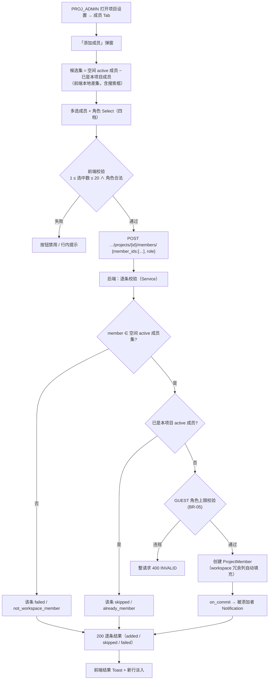
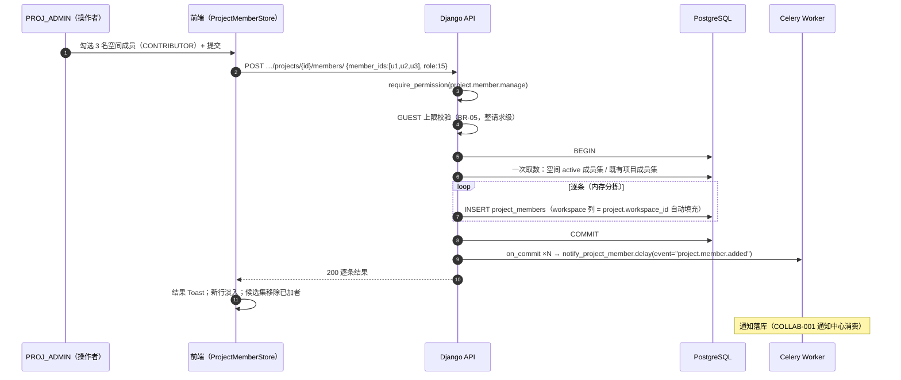
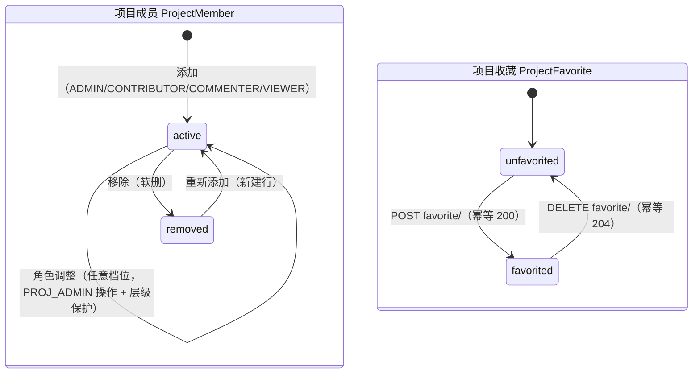
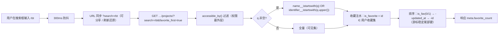
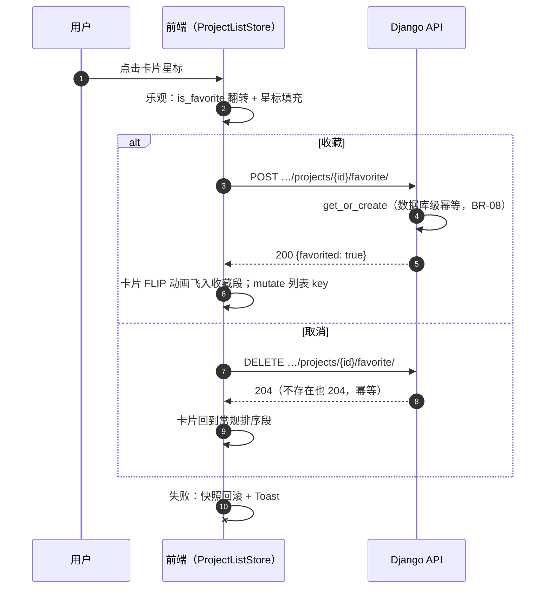
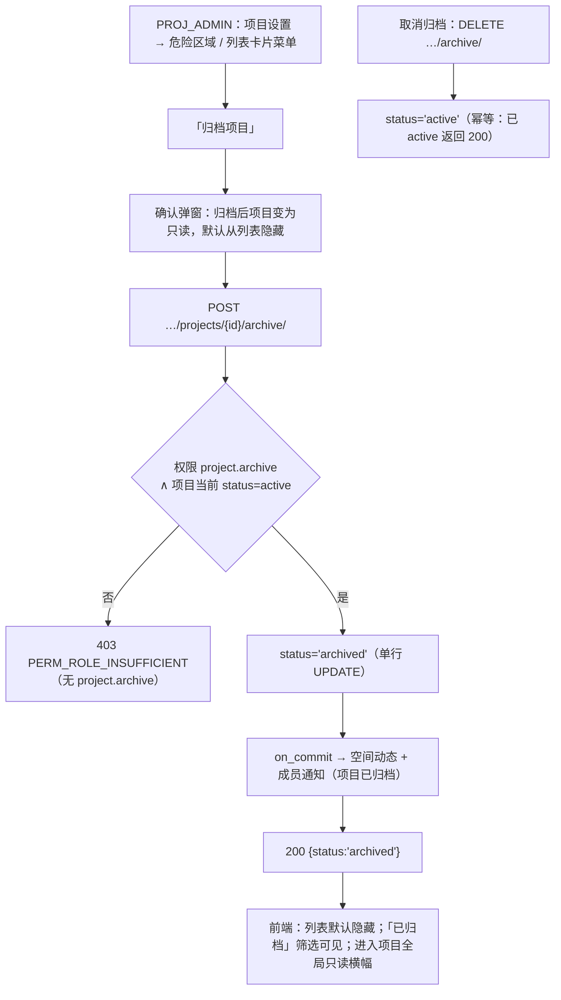
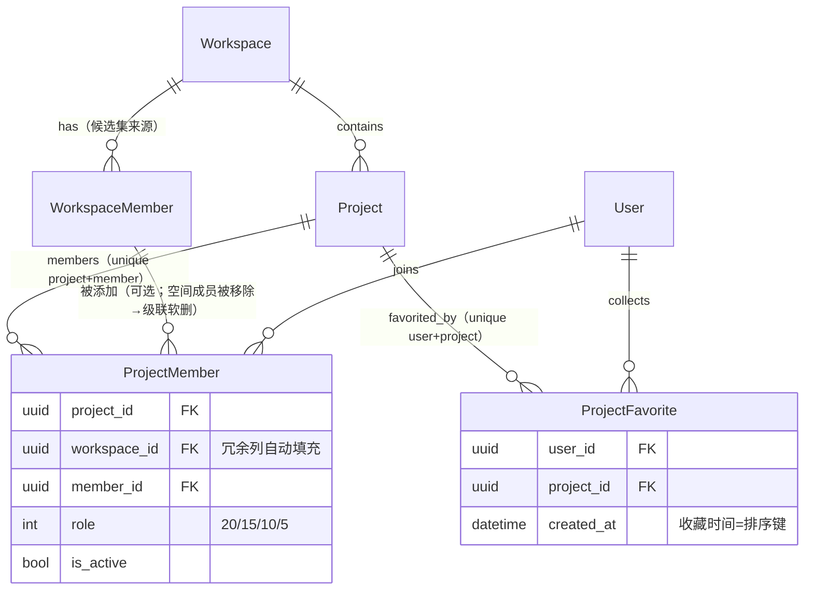

# 项目成员管理与搜索收藏

| 元信息项 | 内容 |
| --- | --- |
| 文档编号 | PROJ-002 |
| 所属迭代 | Sprint 1：MVP 能力补齐（第 3 周） |
| 优先级 | P1（MVP 必备级） |
| 所属模块 | M3-PROJ｜项目管理 |
| 文档状态 | 待评审（Draft） |
| 最后更新日期 | 2026-09-01 |
| 上游依据 | `docs/需求文档.md` §3.3（项目成员添加、移除、项目子角色权限配置；项目全局筛选、搜索、收藏项目）、§8.2 项目管理 P1 列（含「项目状态切换（进行中/归档）」） |
| 前置依赖 | `PROJ-001`（项目 CRUD / `ProjectMember` 创建者 ADMIN 记录 / `status` 枚举）、`TEAM-001`（Workspace 与空间成员）、`TEAM-002`（空间成员候选集与移除级联）、`AUTH-003`（项目可见性行级规则）、`AUTH-005`（权限矩阵与按钮守护）、`INFRA-004`（错误信封） |
| 下游消费 | `TASK-002`（指派人选择器消费项目成员）、`COLLAB-001`（通知接收人 = 项目成员；消费本文档 4 类成员变动通知：加入/移除/角色变更/归档）、`BOARD-002` / `TASK-003`（筛选候选同样取自项目成员）、`RPT-002`（P2 成员任务量统计）、`AUTH-006`（P2 行级隔离深化）、`PROJ-003`（P2 完整生命周期：draft/closed 与动态时间线） |
| 关联架构文档 | [`rbac-permission-model.md`](../architecture/rbac-permission-model.md) §2.3（PROJ_* 角色）、§5.5（保护规则统一 403 错误码：PERM_ROLE_HIERARCHY / PERM_LAST_OWNER / PERM_GUEST_LIMIT）、§7.1（层级保护）、§7.2（末位 Owner/Admin 保护）、§7.3（GUEST 提升限制）、§7.4（WS_OWNER/ADMIN 隐式 PROJ_ADMIN）、§8.2（项目级权限矩阵：含 `project.favorite` / `project.archive` 权限点）、[`api-conventions.md`](../architecture/api-conventions.md) §2.5（members / favorite / archive 端点契约）、§2.6（动作子资源）、§4（信封 / 游标）、§5.5（`?search=` 全文搜索）、§6.3（meta 必含字段）、§8（错误码） |
| 对标基线 | Plane `ProjectMember` + `UserProjectFavorite`（favorites 端点 + 项目搜索） · Ones 项目成员按角色模板批量套用 |
| 工作量估算 | 后端 2 人日 / 前端 2.5 人日 / 联调与测试 1 人日，合计 **5.5 人日** |

> **范围声明**：交付项目级成员管理（从工作空间成员中添加 / 移除 / 调整项目子角色）、项目关键词搜索与收藏、项目基础状态切换（进行中 ↔ 已归档，`archive/` 动作子资源）。跨项目全局筛选器（P2 `TASK-011`）、项目模板与角色模板批量套用（P2/P3）、完整生命周期（draft / closed / 动态时间线，P2 `PROJ-003`）、项目集（P3 `PROJ-004`）不在范围。

---

## 1. 概述

### 1.1 功能定位

**工作空间成员 ≠ 项目成员**——这是双层 RBAC 的核心边界（[`rbac-permission-model.md`](../architecture/rbac-permission-model.md) §2）：`WS_MEMBER` 必须被显式加入项目（成为 `ProjectMember`）才能访问该项目；只有 `WS_OWNER` / `WS_ADMIN` 例外（隐式 `PROJ_ADMIN`，§7.4）。`TEAM-002` 把人拉进了空间，本文档决定「**谁能进哪个项目**」——这是任务指派（`TASK-002` 选择器只列项目成员）与通知触达（`COLLAB-001` 接收人 = 项目成员）的准入闸门。

同时补齐 P0 遗留的三个轻量体验，使「20+ 项目的团队」仍能高效定位工作对象：

| 交付项 | 说明 |
| --- | --- |
| 项目成员管理 | 添加（从空间成员多选，指定 `PROJ_*` 角色）、移除、角色调整；`project.member.manage` 权限 + 层级保护 |
| 成员候选集 | 添加弹窗仅展示「本空间 active 成员 − 已是项目成员」，含搜索（P1 前端本地差集实现） |
| 项目搜索 | 列表页关键词（名称 / identifier 前缀匹配）+ 状态筛选，在 `accessible_by()` 过滤内完成 |
| 项目收藏 | `POST/DELETE …/favorite/` 动作子资源（幂等）；列表「收藏置顶」段 + 「已收藏」Tab |
| 状态切换 | `POST/DELETE …/archive/` 动作子资源：`active ↔ archived`（需求 P1 列）；归档项目默认不出现在列表，可筛出 |

### 1.2 关键约定：双层角色的边界与例外

> ⚠️ **这是本文档最重要的口径约定，成员可见性的全部判定都由此推导。**

```
项目可见集合（AUTH-003 已确立，本文档消费）：
可见 = { p | p.workspace = 当前空间 ∧ p.deleted_at IS NULL
          ∧ ( 用户 WS 角色 ≥ WS_ADMIN(15)          ← 隐式全部可见（rbac §7.4）
              ∨ ∃ ProjectMember(project=p, member=用户, is_active=True) ) }
```

| 用户在空间的角色 | 可见项目 | 可管理成员 |
| --- | --- | --- |
| `WS_OWNER`(20) / `WS_ADMIN`(15) | 该空间**全部项目**（无需 `ProjectMember` 行） | 全部（隐式 `PROJ_ADMIN`） |
| `WS_MEMBER`(10) | 仅自己是 active `ProjectMember` 的项目 | 仅自己是 `PROJ_ADMIN` 的项目 |
| `WS_GUEST`(5) | 仅被显式加入的项目；**项目列表接口只返回已加入的**（rbac §7.3） | 项目内角色上限 `PROJ_COMMENTER`(10) |

三条派生口径（全部沿袭架构基线，本文档落地）：

1. **隐式管理员标注**：成员列表 UI 中，`WS_ADMIN`+ 用户标注「继承自工作空间管理员」，**不出现在 `ProjectMember` 计数里**（rbac §7.4）；
2. **候选集只从空间成员取**（BR-01）：项目是空间的子集边界，不存在「空间外成员进项目」的路径——需要先 `TEAM-002` 邀请入空间；
3. **GUEST 上限**（BR-05，rbac §7.3）：`WS_GUEST` 在项目中最高 `PROJ_COMMENTER`，要给更高权限须先提升空间角色。

### 1.3 能力 × 迭代矩阵

| 能力 | P0（PROJ-001） | P1（本文档） | P2+（后置） |
| --- | --- | --- | --- |
| `ProjectMember` 表 | ✅ 建表（创建者 ADMIN 一行） | ✅ 多成员全四角色读写 | 部门维度视图 P3 |
| 添加 / 移除 / 调角色 | ❌ | ✅ 批量添加 + 逐条结果 | — |
| 候选集 | ❌ | ✅ 前端本地差集 | 独立候选端点（P2 视性能） |
| 项目搜索 | 列表无搜索 | ✅ 名称 / identifier 前缀 | trigram 模糊（项目量大时） |
| 项目收藏 | ❌ | ✅ 独立表 + 动作子资源 | 视图收藏 / 排序扩展 P2 |
| 状态切换 | 仅 `active` | ✅ `active ↔ archived` | draft / closed / 生命周期 `PROJ-003` |
| 项目模板 / 角色模板批量套用 | ❌ | ❌ | P2/P3（Ones 式） |
| 项目动态时间线 | ❌ | ❌ | `PROJ-003` |
| 私密项目白名单 | ❌ | ❌ | `AUTH-006`（P2）/ `PROJ-004` |

### 1.4 范围边界

| 能力 | P1（本文档） | 归属 |
| --- | --- | --- |
| 从空间成员批量添加项目成员（≤ 20 / 次） | ✅ | — |
| 移除项目成员（不级联改派任务） | ✅ | — |
| 项目角色四档调整（含层级保护） | ✅ | — |
| 末位 `PROJ_ADMIN` 保护（含隐式接管判定） | ✅ | — |
| 项目列表 `?search=` 搜索 + `?status=` 筛选 | ✅ | — |
| 收藏 / 取消收藏（幂等）+ 置顶段 + Tab | ✅ | — |
| `active ↔ archived` 切换 | ✅ | — |
| 空间级邀请（入队前置） | ❌ | `TEAM-002`（同 Sprint） |
| 被移除成员的任务转交 | ❌ | P2 `TASK-007` |
| 跨项目全局筛选 | ❌ | P2 `TASK-011` |
| `WS_MEMBER → WS_GUEST` 降级时的项目角色联动 | ❌ | P2 `AUTH-006`（rbac §7.3 降级保护） |

### 1.5 前置依赖

| 依赖文档 | 依赖内容 | 阻塞原因 |
| --- | --- | --- |
| `PROJ-001` | `Project`（identifier / status 枚举 / `accessible_by`）、`ProjectMember`（unique_together + 权限判定主索引） | 无承载 |
| `TEAM-001` | `WorkspaceMember`（候选集的来源表） | 候选集无法构造 |
| `TEAM-002` | 空间成员列表端点（`?expand=user`）；移除空间成员时级联软删 `ProjectMember` | 候选集数据 / 孤儿成员 |
| `AUTH-003` | 项目可见性三态规则（404 防探测） | 越权可见 |
| `AUTH-005` | `project.member.manage` 权限点与 `<PermissionGate>`；`project.favorite` / `project.archive` 已在 `rbac-permission-model.md` §8.2 矩阵登记（`AUTH-005` 仅交付按钮级 Gate，AUTH-005 矩阵扩展在本文档一并冻结——架构文档待回改登记） | UI 与接口守护 |

### 1.6 竞品参考

| 竞品 | 参考点 | 本功能处置 |
| --- | --- | --- |
| Plane | `ProjectMember` 表 + 项目设置成员 Tab；收藏为独立 `UserProjectFavorite`（user, project）二列唯一 | **收藏独立表采纳**（天然支持 P2 排序扩展）；搜索对齐并补索引策略说明 |
| Plane | 成员添加单人一次、无批量结果反馈 | **批量 + 逐条结果**（沿袭 `TEAM-002` 范式） |
| Plane | 移除成员无「末位管理员」保护 | **末位 ADMIN 保护 + 隐式接管判定**（BR-06） |
| Ones | 项目成员按「角色模板 / 用户组」批量套用（测试组 5 人一次加入） | P1 收敛为「同角色多选」；模板批量套用 P3 |
| Ones | 项目级权限白名单 / 涉密项目 | P3 `AUTH-006` / `PROJ-004` |

---

## 2. 业务逻辑

### 2.1 项目成员添加主流程



### 2.2 添加与通知时序



### 2.3 项目成员与收藏状态机



| 迁移 | 守卫 | 副作用 |
| --- | --- | --- |
| 添加 | 候选 ∈ 空间 active 成员（BR-01）；GUEST ≤ COMMENTER（BR-05） | 通知被添加者；候选集剔除 |
| 角色调整 | `project.member.manage` + 层级保护（rbac §7.1：PROJ_ADMIN 之间不可互改） | 通知被调整者 |
| 移除 | 末位 `PROJ_ADMIN` 保护（BR-06） | 通知被移除者；任务指派**保留**（BR-07） |
| 空间成员被移除 | `TEAM-002` 级联 | 本表行级联软删（无通知，空间级已通知） |
| 收藏切换 | `project.favorite`（全员可用，个人态） | 仅个人列表排序变化，无通知 |

> **重新添加新建行**（与 `TEAM-002` 同口径）：`created_at` 准确反映「本次加入项目」的时间，「加入时间」列与 `RPT-002` 成员任务量统计依赖它。

### 2.4 搜索与收藏的列表流程



**收藏切换的乐观路径**：



### 2.5 项目状态切换（active ↔ archived）



| 约束 | 说明 |
| --- | --- |
| 归档 ≠ 删除 | 软删除（`deleted_at`）是 `PROJ-001` 的删除语义；归档是**可逆的业务状态**，数据与关联完整保留 |
| 归档只读 | 归档项目内全部写操作返回 `403 PERM_PROJECT_ARCHIVED`（错误码已在 `api-conventions.md` §8.3 注册；任务 / 评论 / 文件各 ViewSet 的通用守卫） |
| 列表默认排除 | `?status=` 未传时默认 `status != 'archived'`；「已归档」Tab / 筛选显式传 `status=archived` 可见 |
| 幂等 | 重复 POST archive 返回 200；重复 DELETE 返回 200（`api-conventions.md` §2.6） |
| draft / closed | P2 `PROJ-003`（本迭代不产生这两个状态） |

### 2.6 业务规则汇总

| 编号 | 规则 | 约束位置 | 违反后果 |
| --- | --- | --- | --- |
| BR-01 | 候选必须为**同空间 active 成员**；空间外用户不可添加（引导去 `TEAM-002` 邀请） | Serializer + Service | 该条 `failed / not_workspace_member` |
| BR-02 | 单次添加 1 ~ 20 人；请求内去重 | Serializer | 400 `VALIDATION_ERROR` + `TOO_LONG` |
| BR-03 | 角色域为 `PROJ_ADMIN(20)/CONTRIBUTOR(15)/COMMENTER(10)/VIEWER(5)` 四值 | Serializer | 400 + `NOT_A_CHOICE` |
| BR-04 | 仅 `project.member.manage` 持有者（含隐式 `PROJ_ADMIN`）可管理项目成员 | Permission | 403 `PERM_ROLE_INSUFFICIENT` |
| BR-05 | `WS_GUEST` 只能被授予 `PROJ_COMMENTER` 及以下（rbac §7.3 `ALLOWED_PROJECT_ROLES_FOR_GUEST`）；整请求级前置校验 | Service（`assert_valid_project_role_for_guest`） | 403 `PERM_GUEST_LIMIT`（rbac §5.5/§7.3） |
| BR-06 | **末位 ADMIN 保护**：移除 / 降级最后一个 `PROJ_ADMIN` 前，断言「仍存在其他显式 ADMIN **或** 空间存在 `WS_OWNER`/`WS_ADMIN`（隐式接管）」；全部不满足 → 拒绝 | Service（事务） | 403 `PERM_LAST_OWNER`（rbac §5.5/§7.2） |
| BR-07 | 移除项目成员**不触发任务改派**：其名下任务保留指派但该成员已不可见（前端以「已移出成员」灰头像展示）；P2 `TASK-007` 交付转交 | — | — |
| BR-08 | 收藏幂等：POST = `get_or_create`（重复 200）；DELETE 不存在也 204 | 动作子资源（`api-conventions.md` §2.6） | — |
| BR-09 | 搜索关键词 1 ~ 64 字符；匹配 `name` 与 `identifier` 前缀（大小写不敏感）；URL `?search=` 同源可分享（参数命名与 `api-conventions.md` §5.5 一致） | Serializer | 400 `VALIDATION_INVALID_PARAM` + `details.field=search/TOO_LONG` |
| BR-10 | 列表排序：收藏段（组内按收藏时间倒序）→ 其余（按 `-updated_at`）；两段间有视觉分隔；游标分页尾部追加 `-id` 保稳定 | 前端 + 查询 | — |
| BR-11 | 归档项目默认不出现在列表（`?status=` 未传时过滤）；收藏的已归档项目在「已收藏」Tab 中以归档徽标展示（不静默消失） | 查询 + 前端 | — |
| BR-12 | 角色调整层级保护：`PROJ_ADMIN` 之间不可互相降级（rbac §7.1）；不可修改隐式管理员（其无本表行） | Service | 403 `PERM_ROLE_HIERARCHY`（rbac §5.5/§7.1） |
| BR-13 | `ProjectMember.workspace` 冗余列由 `save()` 从 `project.workspace_id` 自动填充，禁止手工赋值（rbac §3.2） | Model | — |
| BR-14 | 成员变动（被加入 / 被移除 / 角色变更）产生 `Notification` 与项目动态落库（本迭代仅落库，`COLLAB-001` / `PROJ-003` 消费） | `on_commit` | — |
| BR-15 | 收藏再激活：`ProjectFavorite` 取消时硬删除（`delete()`），不再保留 `deleted_at` 软删痕迹——保证再次收藏走 `get_or_create` 创建新行时无唯一冲突；项目软删期间用户无法访问 favorite 端点（`accessible_by` 过滤），恢复后收藏记录自然可重新生效。 | Model / Service | — |

### 2.7 异常处理

| 异常场景 | 触发条件 | HTTP | 错误码 / 子码 | 前端表现 | 后端处理 |
| --- | --- | --- | --- | --- | --- |
| 添加空间外成员 | member_ids 含非空间 active 成员 | 200 | —（该条 `failed` + reason） | Toast「请先邀请至工作空间」＋「去邀请」链接 | 跳过该条 |
| 添加已是成员 | member ∈ 项目 active 集 | 200 | —（该条 `skipped`） | 结果列表「已在项目中」 | — |
| 超过 20 人 | 21 个 member_ids | 400 | `VALIDATION_ERROR` + `TOO_LONG` | — | — |
| 角色非法 | role=99 | 400 | `VALIDATION_ERROR` + `NOT_A_CHOICE` | 角色下拉标红 | — |
| GUEST 越权角色 | 给 GUEST 授 CONTRIBUTOR+ | 403 | `PERM_GUEST_LIMIT`（rbac §5.5/§7.3） | 弹窗提示「访客最高为评论者，如需更高权限请先提升空间角色」 | 整请求前置校验 |
| 移除 / 降级末位 ADMIN | BR-06 断言失败 | 403 | `PERM_LAST_OWNER`（rbac §5.5/§7.2） | 弹窗「请先指定新的项目管理员，或由工作空间管理员接管」 | 事务回滚 |
| 非管理员管理成员 | CONTRIBUTOR 调用 | 403 | `PERM_ROLE_INSUFFICIENT` | 操作菜单不可见（UI 层）+ 403（API 层） | — |
| 收藏不可见项目 | 项目不在 `accessible_by()` 集 | 404 | `RESOURCE_NOT_FOUND` | 404 空态 | DB 层过滤（存在性隐藏） |
| 收藏越限 | 第 51 个 | 409 | `RESOURCE_LIMIT_EXCEEDED` | 「收藏已满（50），请先取消部分收藏」 | Service 前置断言 |
| 归档已归档项目 | status 已 archived | 200 | —（幂等） | — | 直接返回当前状态 |
| 归档中成员写入 | 在归档项目建任务 / 评论 | 403 | `PERM_PROJECT_ARCHIVED` | 全局只读横幅 | 通用守卫（各 ViewSet） |
| 搜索含特殊字符 | `%` `_` `\` | 正常 | — | — | 参数化查询（ORM 转义） |
| 项目成员越限 | 第 101 个 | 409 | `RESOURCE_LIMIT_EXCEEDED` | 升级引导文案 | Service 前置断言 |

### 2.8 边界条件

| 边界场景 | 限制值 | 超出处理方式 |
| --- | --- | --- |
| 项目成员上限 | 100 | 409 `RESOURCE_LIMIT_EXCEEDED`（该条 failed / 整请求 409） |
| 收藏数量 | 50 / 用户 | 409 `RESOURCE_LIMIT_EXCEEDED`（文案引导先取消） |
| GUEST 可见项目列表 | 仅被加入的项目 | 列表天然过滤（rbac §7.3） |
| 候选集为空 | 空间成员全部已在项目 | 弹窗空态 +「去邀请成员」链接（跳 `TEAM-002` 邀请弹窗） |
| 隐式管理员 | `WS_ADMIN`+ 无 `ProjectMember` 行 | 不占成员计数；成员 Tab 顶部提示条展示（§3.2） |
| 搜索空串 | `q=""` | 等价未传（不过滤） |
| 收藏置顶下的分页 | 收藏段 + 常规段整体游标 | `is_fav, -updated_at, -id` 复合排序保证翻页无重复（UT-10） |

---

## 3. UI/UX 设计

### 3.1 项目列表页（工作台首页改造）

路由 `/:workspaceSlug/projects`（`PROJ-001` 交付的卡片网格升级）。

```
┌───────────────────────────────────────────────────────────────────────────────┐
│  项目                                               ┌──────────────────────┐ │
│  RabbitProjects · 12 个项目                          │ ＋ 创建项目           │ │
│                                                     └──────────────────────┘ │
├───────────────────────────────────────────────────────────────────────────────┤
│ ┌────────────────────────────────────┐ ┌──────────────────┐ ┌───────────────┐ │
│ │ 🔍 搜索项目名或标识，如 RBT          │ │ 状态 ▾（进行中）  │ │ 已归档 ▾       │ │ ← 筛选行
│ └────────────────────────────────────┘ └──────────────────┘ └───────────────┘ │
│ ┌────────────┐┌────────────┐                                                        │
│ │ 全部 (12)   ││ ★ 已收藏 (2)│                                                        │ ← Tabs
│ └────────────┘└────────────┘                                                        │
├───────────────────────────────────────────────────────────────────────────────┤
│ ★ 已收藏                                                            〔分隔横条〕   │
│ ┌─────────────────────────┐ ┌─────────────────────────┐                         │
│ │ 🅡 ★ 兔子核心系统 RBT     │ │ 🅜 ★ 营销页改版 MKP      │                         │
│ │    ● 进行中              │ │    ● 进行中              │                         │
│ │ 👤👤👤 6 成员 · 34 任务   │ │ 👤👤 3 成员 · 12 任务     │                         │
│ └─────────────────────────┘ └─────────────────────────┘                         │
│ ───────────────────────────────────────────────────────────────────────────── │
│ 全部项目（更新时间排序）                                                         │
│ ┌─────────────────────────┐ ┌─────────────────────────┐ ┌────────────────────┐ │
│ │ 🅦 官网重构 WEB           │ │ 🅣 测试平台 TST ● 进行中  │ │ 🅔 旧版维护 LEG     │ │
│ │   ● 进行中               │ │ 👤 2 成员 · 8 任务        │ │ ⊘ 已归档（筛选时）  │ │
│ │ 👤 1 成员 · 5 任务        │ │                          │ │ 👤 1 成员          │ │
│ └─────────────────────────┘ └─────────────────────────┘ └────────────────────┘ │
└───────────────────────────────────────────────────────────────────────────────┘
```

| 元素 | 规格 |
| --- | --- |
| 搜索框 | 占位「搜索项目名或标识，如 RBT」；300ms 防抖；`search` 同步到 URL（分享 / 刷新还原）；清空按钮 |
| 状态筛选 | 下拉：进行中（默认）/ 已归档 / 全部；映射 `?status=active|archived|` （未传=默认排除归档） |
| Tabs | 「全部 (N)」/「★ 已收藏 (M)」；后者 = `?favorite=true`；计数实时 |
| 卡片星标 | 右上角 24px `star` / `star-filled`；`aria-pressed`；点击即乐观切换（§2.4） |
| 收藏段 | 横条标题「★ 已收藏」+ 组内按收藏时间倒序；与常规段间有分隔线（BR-10） |
| 已归档卡片 | 仅在「已归档」筛选 / 收藏 Tab 中出现；`⊘ 已归档` 灰徽标；整卡 `opacity-75`；点击进入只读 |
| 成员头像堆叠 | ≤ 5 个 24px 叠放（`-space-x-2`），超出 `+N`；title 列名字 |
| 卡片菜单 | hover `more-horizontal`：「项目设置」「归档项目 / 取消归档」（`project.archive` Gate，归档项红色区） |

### 3.2 项目设置 → 成员 Tab

路由 `/…/projects/:projectId/settings/members`（`PROJ-001` 设置页的第 2 个区块）。

```
┌────────────────────────────────────────────────────────────────────────────┐
│  ℹ 你以工作空间管理员身份管理此项目（隐式管理员提示条，仅 WS_ADMIN+ 显示）    │
├────────────────────────────────────────────────────────────────────────────┤
│  成员（6）                                 ┌──────────────────────────────┐ │
│  🔍 搜索成员…   角色 ▾（全部）               │ ＋ 添加成员（PROJ_ADMIN）     │ │
│                                            └──────────────────────────────┘ │
├─────────┬──────────────────────────────┬─────────────┬───────────┬─────────┤
│ 成员     │ 邮箱                          │ 项目角色      │ 加入时间    │ 操作 ⋯  │
├─────────┼──────────────────────────────┼─────────────┼───────────┼─────────┤
│ 👤 梁工  │ liang@ex.com                  │ ▾ 管理员     │ 09-01      │ 改角色/移除│
│ 👤 王工  │ wang@ex.com                   │ ▾ 协作者     │ 09-02      │ 改角色/移除│
│ 👤 李工  │ li@ex.com                     │ ▾ 评论者     │ 09-02      │ 改角色/移除│
│ 👤 访客甲 │ guest@partner.com             │ ▾ 查看者     │ 09-03      │ 改角色/移除│
└─────────┴──────────────────────────────┴─────────────┴───────────┴─────────┘
```

| 元素 | 规格 |
| --- | --- |
| 隐式管理员提示条 | 仅当前用户为 `WS_ADMIN`+ 且无 `ProjectMember` 行时显示（rbac §7.4 标注口径）；`bg-blue-50 text-blue-700` |
| 添加按钮 | `<PermissionGate permission="project.member.manage">` 包裹 |
| 角色行内下拉 | 四档（管理员/协作者/评论者/查看者）；`PROJ_ADMIN` 之间互改时层级保护拦截（BR-12，后端 403 → 前端回滚 + Toast）；下拉项附能力说明（`aria-describedby`） |
| 移除菜单 | 确认弹窗列明「其名下 N 个任务指派将保留，以已移出成员展示」（BR-07）；末位 ADMIN 拦截提示（BR-06） |
| GUEST 行 | 若成员空间角色为 GUEST，其角色下拉仅显示查看者 / 评论者两档（BR-05 前端预拦） |

### 3.3 添加成员弹窗

Headless UI `Dialog`，宽 520px。

```
┌──────────────────────────────────────────────────────────────┐
│  添加成员到「兔子核心系统」                                 ✕  │
│                                                              │
│  🔍 搜索空间成员…                                            │
│ ┌────────────────────────────────────────────────────────┐  │
│ │ ☑ 👤 梁工   liang@ex.com            （空间·管理员）      │  │
│ │ ☑ 👤 王工   wang@ex.com             （空间·成员）        │  │
│ │ ☐ 👤 张三   zhangsan@ex.com         （空间·所有者）      │  │
│ │ ☐ 👤 访客甲 guest@partner.com       （空间·访客）        │  │ ← 候选=空间成员−已在项目
│ └────────────────────────────────────────────────────────┘  │
│  已选 2 人（已在项目中的成员不再显示）                        │
│                                                              │
│  项目角色                                                     │
│  ┌────────────────┐                                          │
│  │ ● 协作者      ▾ │                                          │
│  └────────────────┘                                          │
│  协作者可创建与编辑任务；评论者只读+评论；查看者仅只读           │
│                                                              │
│              ┌────────┐  ┌────────────────────────┐         │
│              │  取消   │  │  添加（2）              │         │
│              └────────┘  └────────────────────────┘         │
└──────────────────────────────────────────────────────────────┘
        ↓ 提交后（结果 Toast 逐条）
   ✅ 梁工、王工 已加入（协作者）
   （若含 skipped/failed 逐条列出）
```

| 行为 | 规格 |
| --- | --- |
| 候选集 | 前端本地差集：`空间成员列表（TEAM-002 GET members/?expand=user）− 本项目成员`；实时搜索过滤（昵称 / 邮箱前缀） |
| 候选为空 | 空态「空间成员都已在项目中」+「去邀请成员」链接（打开 `TEAM-002` 邀请弹窗） |
| GUEST 候选 | 正常列出；选中时若角色 > 评论者，提交按钮旁内联警示（后端仍有 BR-05 硬校验） |
| 提交中 | 按钮 loading；Modal 锁定 |
| 结果 | 成功者行淡入成员表；skipped / failed 逐条 Toast |
| 关闭 | ✕ / `Esc` / 遮罩（有勾选时二次确认） |

### 3.4 空状态与加载态

| 场景 | 处置 |
| --- | --- |
| 列表加载中 | 6 卡片骨架（`animate-pulse`），布局与真实卡片一致（CLS = 0） |
| 搜索无结果 | `search-x` 插画 +「未找到匹配的项目」+「清除搜索」 |
| 「已收藏」Tab 为空 | `star` 插画 +「收藏高频项目，快速直达」+「浏览全部项目」 |
| 无可见项目（GUEST 未被加入任何项目） | `folder-lock` 插画 +「你还未被加入任何项目，请联系管理员」（对齐 `AUTH-003` 口径） |
| 成员 Tab 加载失败 | `alert-circle` + `error.message` +「重试」 |

### 3.5 响应式与无障碍

| 断点 | 布局 |
| --- | --- |
| ≥ 1280px | 卡网格 4 列；筛选行单行 |
| 768 ~ 1279px | 2 列；隐藏「状态」筛选下拉（并入 Tabs 行） |
| < 768px | 1 列；搜索框全宽；成员表降级卡片列表 |

无障碍要求：

- 星标为 `aria-pressed` 切换按钮 + `aria-label="收藏项目 兔子核心系统"`（不依赖颜色 / 图标形状差异）；
- Tabs 用 Headless UI `TabList`（方向键切换）；候选多选列表用 `role="listbox"` + `aria-multiselectable`，`↑↓` 移动、`Space` 勾选、`Enter` 提交；
- 角色 Select 每项 `aria-describedby` 指向能力说明文本；
- 归档确认弹窗默认焦点在「取消」，`role="alertdialog"`。

---

## 4. 技术架构

### 4.1 数据模型

#### 4.1.1 ProjectFavorite（本迭代唯一新表）

```python
# apps/api/plane/db/models/project.py
class ProjectFavorite(BaseModel):
    """项目收藏 —— 独立表（对标 Plane UserProjectFavorite），为 P2 视图收藏与排序扩展预留。

    设计取舍（独立表 vs ProjectMember.view_props 内嵌）：
    - 独立表可用 (user, project) 数据库级唯一约束表达幂等（BR-08），
      内嵌 JSONB 做不到数据库级防重；
    - 「按收藏时间排序的收藏列表」是索引查询（idx_pf_user_time），
      内嵌方案需要读出整个 view_props 再内存过滤；
    - P2 视图收藏 / 自定义首页卡片沿袭本表结构扩展 resource_type 列即可。
    """

    user = models.ForeignKey(
        "db.User", on_delete=models.CASCADE, related_name="project_favorites", verbose_name="用户"
    )
    project = models.ForeignKey(
        Project, on_delete=models.CASCADE, related_name="favorited_by", verbose_name="项目"
    )

    class Meta(BaseModel.Meta):
        db_table = "project_favorites"
        verbose_name = "项目收藏"
        ordering = ("-created_at",)
        constraints = [
            models.UniqueConstraint(
                fields=["user", "project"],
                condition=models.Q(deleted_at__isnull=True),
                name="uniq_user_project_favorite",
            ),
        ]
        indexes = [
            models.Index(fields=["user", "created_at"], name="idx_pf_user_time"),
        ]
```

| 字段 | 类型 | 约束 / 索引 | 说明 |
| --- | --- | --- | --- |
| `user` | UUID FK | CASCADE；复合唯一首列；`idx_pf_user_time` 首列 | 收藏主体 |
| `project` | UUID FK | CASCADE；复合唯一次列 | 目标项目（项目软删时收藏行 CASCADE 语义由软删除传导，实际保留至用户取消） |
| `created_at` | timestamptz | `idx_pf_user_time` 次列 | **收藏时间**——收藏段组内倒序的排序键 |

**索引说明**：

| 索引 | 服务的查询 | 命中场景 |
| --- | --- | --- |
| `uniq_user_project_favorite` | 幂等（`get_or_create` 内建 ON CONFLICT 语义）+ 防重 | 收藏切换 |
| `idx_pf_user_time` | `WHERE user=%s ORDER BY created_at DESC` | 列表页收藏集一次取全（≤ 50 行）＋「已收藏」Tab |

#### 4.1.2 既有表消费：ProjectMember

`INFRA-003` / `rbac-permission-model.md` §3.2 基线，本文档**零 DDL、零字段变更**，仅启用全部四角色写入：

```python
class ProjectMember(BaseModel):
    """项目成员（基线摘录）—— workspace 冗余列是本功能的性能关键"""

    project = models.ForeignKey("db.Project", on_delete=models.CASCADE,
                                related_name="project_projectmember")
    workspace = models.ForeignKey("db.Workspace", on_delete=models.CASCADE,
                                  related_name="project_member")   # 反范式冗余：单表判定空间内资格
    member = models.ForeignKey("db.User", on_delete=models.CASCADE,
                               related_name="member_project")
    role = models.IntegerField(choices=ProjectRole.choices,
                               default=ProjectRole.CONTRIBUTOR)   # 本迭代四档全量启用
    is_active = models.BooleanField(default=True)
    view_props = models.JSONField(default=dict)                    # 个人视图偏好，非权限字段

    class Meta:
        unique_together = ("project", "member")
        indexes = [
            models.Index(fields=["member", "project", "role"]),   # 权限判定主索引
            models.Index(fields=["member", "workspace"]),          # 行级过滤子查询索引
        ]

    def save(self, *args, **kwargs):
        self.workspace_id = self.project.workspace_id              # BR-13 自动填充
        super().save(*args, **kwargs)
```



### 4.2 API 定义

遵循 [`api-conventions.md`](../architecture/api-conventions.md)：强制尾斜杠、`snake_case`、统一信封、动作子资源幂等。批量添加属批量端点 throttle 档（10 次 / 分钟）。

| # | 方法 | 路径 | 描述 | 权限 Key | 成功码 |
| --- | --- | --- | --- | --- | --- |
| 1 | `GET` | `/api/v1/workspaces/{slug}/projects/` | 列表（`?search=&status=&favorite=&favorite_first=&cursor=&per_page=`） | `project.list` | `200` |
| 2 | `GET` | `…/projects/{project_id}/members/` | 项目成员列表（`?expand=user&search=`） | `project.member.read` | `200` |
| 3 | `POST` | `…/projects/{project_id}/members/` | 批量添加成员（同角色，≤ 20） | `project.member.manage` | `200` |
| 4 | `PATCH` | `…/projects/{project_id}/members/{member_id}/` | 调整项目角色 | `project.member.manage` | `200` |
| 5 | `DELETE` | `…/projects/{project_id}/members/{member_id}/` | 移除成员 | `project.member.manage` | `204` |
| 6 | `POST` | `…/projects/{project_id}/favorite/` | 收藏（幂等） | `project.favorite` | `200` |
| 7 | `DELETE` | `…/projects/{project_id}/favorite/` | 取消收藏（幂等） | `project.favorite` | `204` |
| 8 | `POST` | `…/projects/{project_id}/archive/` | 归档（active → archived，幂等） | `project.archive` | `200` |
| 9 | `DELETE` | `…/projects/{project_id}/archive/` | 取消归档（幂等） | `project.archive` | `200` |

#### 4.2.1 `GET .../projects/` — 列表（搜索 + 筛选 + 收藏置顶）

**请求**

```http
GET /api/v1/workspaces/rabbitprojects/projects/?search=rbt&favorite_first=true&per_page=20 HTTP/1.1
```

| 查询参数 | 支持 | 说明 |
| --- | --- | --- |
| `?search=` | ✅ | `name` / `identifier` 前缀匹配（`istartswith`），≤ 64 字符（BR-09；参数名与 `api-conventions.md` §5.5 一致） |
| `?status=` | ✅ | `active` / `archived`；**未传时默认排除 archived**（BR-11）；`all` 显式全量 |
| `?favorite=true` | ✅ | 仅收藏项（「已收藏」Tab） |
| `?favorite_first=true` | ✅ | 收藏置顶段排序（BR-10） |
| `?ordering=` | ✅ | 白名单 `updated_at` / `created_at` / `name`；服务端追加稳定尾部键 |
| `?cursor=` / `?per_page=` | ✅ | 游标分页，默认 20 |

**成功响应 `200`**

```json
{
  "status": "success",
  "data": [
    {
      "id": "9d8e7f6a-5b4c-4d3e-8f1a-2b3c4d5e6f7a",
      "identifier": "RBT",
      "name": "兔子核心系统",
      "description": "核心业务系统",
      "status": "active",
      "is_favorite": true,
      "total_members": 6,
      "total_issues": 34,
      "current_user_role": 20,
      "updated_at": "2026-08-31T10:00:00.000Z"
    },
    {
      "id": "f0a1b2c3-4d5e-4f60-8a71-3c4d5e6f7a8b",
      "identifier": "MKP",
      "name": "营销页改版",
      "description": "官网 v2",
      "status": "active",
      "is_favorite": false,
      "total_members": 3,
      "total_issues": 12,
      "current_user_role": 15,
      "updated_at": "2026-08-30T09:00:00.000Z"
    }
  ],
  "meta": {
    "next_cursor": "20:1:0",
    "prev_cursor": "20:0:1",
    "next_page_results": true,
    "prev_page_results": false,
    "count": 2,
    "total_count": 12,
    "total_pages": 1,
    "page": 1,
    "per_page": 20,
    "favorite_count": 1
  }
}
```

| 字段 | 说明 |
| --- | --- |
| `is_favorite` | **注水字段**：序列化层用「一次取出的用户收藏集」判定，非逐行子查询（§4.3.1） |
| `favorite_count` | 可见集中被收藏的数量（「已收藏」Tab 计数） |
| `total_members` / `total_issues` | annotate 聚合（沿袭 `PROJ-001` 列表页口径，成员计数仅显式 `ProjectMember`，隐式管理员不占位） |
| `current_user_role` | 有效项目角色（显式与隐式取大，`PROJ-001` §4.3.3） |

**失败响应 `400`（关键词超长）**

```json
{
  "status": "error",
  "error": {
    "code": "VALIDATION_ERROR",
    "message": "请求参数校验失败",
    "details": [
      { "field": "search", "code": "TOO_LONG", "message": "搜索关键词最多 64 个字符" }
    ],
    "request_id": "01JCTF5N3S9UB6O3R7X8Y9Z1A01"
  }
}
```

#### 4.2.2 `POST .../members/` — 批量添加

**请求**

```json
{
  "member_ids": [
    "6c7d1a2b-3e4f-4a5b-9c8d-7e6f5a4b3c2d",
    "7d8e9f0a-1b2c-4d3e-8f4a-5b6c7d8e9f0a",
    "8e9f0a1b-2c3d-4e4f-9a5b-6c7d8e9f0a1b"
  ],
  "role": 15
}
```

**成功响应 `200`**

```json
{
  "status": "success",
  "data": [
    {
      "member_id": "6c7d1a2b-3e4f-4a5b-9c8d-7e6f5a4b3c2d",
      "status": "added",
      "project_member_id": "pm1a2b3c-0001-4000-8000-000000000001",
      "role": 15
    },
    {
      "member_id": "7d8e9f0a-1b2c-4d3e-8f4a-5b6c7d8e9f0a",
      "status": "added",
      "project_member_id": "pm1a2b3c-0001-4000-8000-000000000002",
      "role": 15
    },
    {
      "member_id": "8e9f0a1b-2c3d-4e4f-9a5b-6c7d8e9f0a1b",
      "status": "skipped",
      "reason": "already_member"
    }
  ],
  "meta": { "summary": { "added": 2, "skipped": 1, "failed": 0 } }
}
```

**失败响应 `400`（GUEST 角色上限，BR-05）**

```json
{
  "status": "error",
  "error": {
    "code": "VALIDATION_ERROR",
    "message": "请求参数校验失败",
    "details": [
      {
        "field": "member_ids",
        "code": "INVALID",
        "message": "工作空间访客（guest@partner.com）在项目中最高只能被分配为评论者"
      }
    ],
    "request_id": "01JCTF5N3S9UB6O3R7X8Y9Z1A02"
  }
}
```

**失败响应 `400`（超过 20 人）**：`VALIDATION_ERROR` + `member_ids/TOO_LONG`（message「单次最多添加 20 名成员」）。

#### 4.2.3 `GET .../members/` — 成员列表

**请求**

```http
GET …/projects/9d8e7f6a-…/members/?expand=user&search=liang HTTP/1.1
```

**成功响应 `200`**

```json
{
  "status": "success",
  "data": [
    {
      "id": "pm1a2b3c-0001-4000-8000-000000000001",
      "user": {
        "id": "6c7d1a2b-3e4f-4a5b-9c8d-7e6f5a4b3c2d",
        "display_name": "梁工",
        "email": "liang@ex.com",
        "avatar_url": "https://minio.local/avatars/u1.png"
      },
      "role": 20,
      "workspace_role": 15,
      "is_active": true,
      "joined_at": "2026-09-01T08:00:00.000Z"
    }
  ],
  "meta": {
    "next_cursor": null, "prev_cursor": null,
    "next_page_results": false, "prev_page_results": false,
    "count": 6, "total_count": 6, "total_pages": 1,
    "page": 1, "per_page": 20
  }
}
```

| 字段 | 说明 |
| --- | --- |
| `workspace_role` | 该成员的空间角色（一次 JOIN 取回）：前端用于 GUEST 上限预拦（§3.3）与「访客」标记 |
| `joined_at` | 序列化映射 `created_at`（重新添加新建行保证语义） |
| 隐式管理员 | **不在本列表**（无 `ProjectMember` 行）；由 `total_members` 之外的提示条表达（§3.2） |

#### 4.2.4 `PATCH .../members/{member_id}/` — 调整角色

**请求**

```json
{ "role": 20 }
```

**成功响应 `200`**：返回该成员完整对象（`role` 已更新）。

**失败响应 `403`（末位 ADMIN 降级，`PERM_LAST_OWNER`，rbac §5.5/§7.2）**

```json
{
  "status": "error",
  "error": {
    "code": "PERM_LAST_OWNER",
    "message": "项目必须保留至少一名项目管理员：请先指定新管理员，或由工作空间管理员接管",
    "request_id": "01JCTF5N3S9UB6O3R7X8Y9Z1A03"
  }
}
```

#### 4.2.5 `DELETE .../members/{member_id}/` — 移除成员

**成功响应**

```http
HTTP/1.1 204 No Content
X-Request-Id: 01JCTF5N3S9UB6O3R7X8Y9Z1A04
```

响应体为空。**失败响应** `403`（末位 ADMIN）同 §4.2.4；`403`（非管理员操作）为 `PERM_ROLE_INSUFFICIENT`。

#### 4.2.6 `POST .../favorite/` — 收藏（幂等）

**请求**（无请求体）

**成功响应 `200`**

```json
{ "status": "success", "data": { "favorited": true, "favorited_at": "2026-09-01T09:00:00.000Z" } }
```

**失败响应 `409`（收藏越限）**

```json
{
  "status": "error",
  "error": {
    "code": "RESOURCE_LIMIT_EXCEEDED",
    "message": "收藏数量已达上限（50），请先取消部分收藏",
    "request_id": "01JCTF5N3S9UB6O3R7X8Y9Z1A05"
  }
}
```

**失败响应 `404`（不可见项目，存在性隐藏）**：`RESOURCE_NOT_FOUND`，与「项目不存在」响应完全一致。

`DELETE .../favorite/`：`204` 空体；未收藏时同样 204（幂等）。

#### 4.2.7 `POST .../archive/` — 归档（幂等）

**成功响应 `200`**

```json
{ "status": "success", "data": { "status": "archived", "archived_at": "2026-09-01T09:30:00.000Z" } }
```

重复 POST（已归档）返回同结构 200；`DELETE .../archive/` 返回 `{ "status": "active" }`。`archived_at` 不建列——由项目动态（`PROJ-003` 时间线）承载精确时刻，本迭代响应值取本次操作时间。

### 4.3 后端实现

#### 4.3.1 ProjectQueryService（搜索 + 收藏置顶）

```python
# apps/api/plane/db/services/project_query.py
from django.db.models import Case, Q, Value, When


class ProjectQueryService:
    """项目列表查询：权限过滤 → 搜索 → 状态筛选 → 收藏注水与置顶排序"""

    def list_for_user(self, *, user, workspace, q: str | None = None,
                      status: str | None = None, favorite_only: bool = False,
                      favorite_first: bool = False):
        # ① 权限最外层（rbac §6.2 accessible_by：WS_ADMIN+ 全可见 / 其余显式成员）
        qs = Project.objects.accessible_by(user, workspace=workspace)

        # ② 状态筛选：未传默认排除归档（BR-11）
        if status == "all":
            pass
        elif status in ("active", "archived"):
            qs = qs.filter(status=status)
        else:
            qs = qs.exclude(status=Project.Status.ARCHIVED)

        # ③ 搜索：前缀匹配（P1 项目量 ≤ 数百，name 普通索引前缀 + identifier 唯一索引即可）
        if q:
            qs = qs.filter(
                Q(name__istartswith=q) | Q(identifier__istartswith=q.upper())
            )

        # ④ 收藏集一次取全（≤ 50 行，命中 idx_pf_user_time），供过滤 / 注水 / 计数共用
        favorites = set(
            ProjectFavorite.objects.filter(
                user=user, project__deleted_at__isnull=True
            ).values_list("project_id", flat=True)
        )
        if favorite_only:
            qs = qs.filter(id__in=favorites)

        # ⑤ 置顶排序：is_fav(0/1) → -updated_at → -id（尾部唯一键保游标稳定，BR-10）
        if favorite_first:
            qs = qs.annotate(
                is_fav=Case(When(id__in=favorites, then=Value(0)), default=Value(1))
            ).order_by("is_fav", "-updated_at", "-id")
        else:
            qs = qs.order_by("-updated_at", "-id")

        # ⑥ 聚合（成员计数只数显式 ProjectMember——隐式管理员不占位，rbac §7.4；
        #    字段命名沿袭 PROJ-001 §4.3.2/§4.3.5，使用 total_members 而非 member_count）
        qs = qs.annotate(
            total_members=Count(
                "project_projectmember",
                filter=Q(project_projectmember__is_active=True,
                         project_projectmember__deleted_at__isnull=True),
                distinct=True,
            ),
            total_issues=Count(
                "issues",
                filter=Q(issues__deleted_at__isnull=True,
                         issues__archived_at__isnull=True),
                distinct=True,
            ),
        )
        # is_favorite 序列化注水：把 favorites 集合放入 serializer context，逐行 set 判定
        return qs, favorites
```

**搜索的 P2 升级路径（trigram）**：当单空间项目数超过数百、前缀匹配不再够用时，切换为与 `TASK-003`（任务搜索）同源的 trigram 方案：

```python
# P2 升级形态（预留，不在本迭代启用）：
#   ① CREATE EXTENSION pg_trgm（INFRA-003 已启用）；
#   ② CREATE INDEX CONCURRENTLY idx_project_name_trgm
#        ON projects USING GIN (name gin_trgm_ops) WHERE deleted_at IS NULL;
#   ③ 查询切换：
qs = qs.filter(
    Q(name__icontains=q)                                  # → trgm GIN 加速的 ILIKE
    | Q(identifier__istartswith=q.upper())                # identifier 仍走前缀
)
```

切换判据：`EXPLAIN` 显示 `istartswith` 退化为顺序扫描且 P95 > 300ms。前缀 → 模糊的语义变化对用户无感知差异（包含匹配是前缀匹配的超集）。

#### 4.3.2 成员 Service（批量添加 + 保护规则）

```python
# apps/api/plane/db/services/project_member.py
from django.db import transaction

MAX_BATCH_MEMBERS = 20
PROJECT_MEMBER_LIMIT = 100


class ProjectMemberService:
    """项目成员：批量添加 / 角色调整 / 移除，全部保护规则收口于此"""

    # ---------------- 批量添加 ----------------

    def add_members(self, *, project, actor, member_ids: list[str], role: int) -> list[dict]:
        if role not in ProjectRole.values:                       # BR-03
            raise AppValidationError({"role": [("NOT_A_CHOICE", "非法的项目角色")]})
        deduped = list(dict.fromkeys(member_ids))                # 请求内去重
        if len(deduped) > MAX_BATCH_MEMBERS:                     # BR-02
            raise AppValidationError(
                {"member_ids": [("TOO_LONG", f"单次最多添加 {MAX_BATCH_MEMBERS} 名成员")]})

        # 一次取数：空间 active 成员映射 + 既有项目成员集（分拣全在内存完成）
        workspace_members = {
            str(m["member_id"]): m["ws_role"]
            for m in WorkspaceMember.objects.filter(
                workspace=project.workspace, is_active=True, deleted_at__isnull=True
            ).values("member_id", "ws_role")
        }
        existing = set(
            ProjectMember.objects.filter(
                project=project, is_active=True, deleted_at__isnull=True
            ).values_list("member_id", flat=True)
        )

        # BR-05 GUEST 上限：整请求级前置校验（存在违规则整单拒绝，避免部分成功造成误解）
        from plane.app.permissions.rbac import ALLOWED_PROJECT_ROLES_FOR_GUEST
        for mid in deduped:
            ws_role = workspace_members.get(mid)
            if ws_role == WorkspaceRole.GUEST and role > ProjectRole.COMMENTER:
                raise AppValidationError(
                    {"member_ids": [("INVALID",
                     "工作空间访客在项目中最高只能被分配为评论者")]})

        if existing.__len__() + len([m for m in deduped if m not in existing and m in workspace_members]) \
                > PROJECT_MEMBER_LIMIT:
            raise ResourceLimitExceededError(f"项目成员上限为 {PROJECT_MEMBER_LIMIT} 人")

        results = []
        with transaction.atomic():
            for mid in deduped:
                if mid not in workspace_members:                 # BR-01
                    results.append({"member_id": mid, "status": "failed",
                                    "reason": "not_workspace_member"})
                    continue
                if mid in existing:
                    results.append({"member_id": mid, "status": "skipped",
                                    "reason": "already_member"})
                    continue
                member = ProjectMember.objects.create(           # save() 自动填 workspace（BR-13）
                    project=project, member_id=mid, role=role,
                    is_active=True, created_by=actor, updated_by=actor,
                )
                transaction.on_commit(
                    lambda m_id=mid: notify_project_member.delay(
                        receiver_id=m_id, event="project.member.added",
                        title=f"你已加入项目「{project.name}」（{ProjectRole(role).label}）",
                        data={"project_id": str(project.id),
                              "project_name": project.name,
                              "workspace_slug": project.workspace.slug,
                              "role": role, "actor": actor.display_name},
                    )
                )
                results.append({"member_id": mid, "status": "added",
                                "project_member_id": str(member.id), "role": role})
        return results

    # ---------------- 保护规则 ----------------

    def _assert_not_last_admin(self, *, project, member_being_changed) -> None:
        """BR-06 末位 ADMIN 保护：显式 ADMIN 或隐式接管（WS_OWNER/WS_ADMIN）二者居其一方可操作。

        rbac §7.2：若项目 Admin 全部离开，自动回退为「由工作空间 Admin 隐式管理」。
        因此仅当「目标是最后一个显式 ADMIN ∧ 空间不存在 WS_ADMIN+」时才拒绝。
        """
        other_explicit_admin = ProjectMember.objects.filter(
            project=project, role=ProjectRole.ADMIN,
            is_active=True, deleted_at__isnull=True,
        ).exclude(pk=member_being_changed.pk).exists()
        if other_explicit_admin:
            return
        ws_admin_exists = WorkspaceMember.objects.filter(
            workspace=project.workspace, role__gte=WorkspaceRole.ADMIN,
            is_active=True, deleted_at__isnull=True,
        ).exists()
        if not ws_admin_exists:
            raise ResourceStateInvalidError(
                "项目必须保留至少一名项目管理员：请先指定新管理员，或由工作空间管理员接管")

    # ---------------- 移除 / 调整 ----------------

    @transaction.atomic
    def remove_member(self, *, project, member: ProjectMember, actor) -> None:
        assert_can_manage_member(operator_role=actor.effective_project_role(project),
                                 target_role=member.role)         # rbac §7.1
        self._assert_not_last_admin(project=project, member_being_changed=member)
        member.delete()                                           # 软删；任务指派保留（BR-07）
        transaction.on_commit(lambda: notify_project_member.delay(
            receiver_id=str(member.member_id), event="project.member.removed",
            title=f"你已被移出项目「{project.name}」",
            data={"project_id": str(project.id), "project_name": project.name,
                  "workspace_slug": project.workspace.slug,
                  "actor": actor.display_name}))

    @transaction.atomic
    def change_role(self, *, project, member: ProjectMember, new_role: int, actor) -> ProjectMember:
        if new_role not in ProjectRole.values:
            raise AppValidationError({"role": [("NOT_A_CHOICE", "非法的项目角色")]})
        assert_can_manage_member(
            operator_role=actor.effective_project_role(project),
            target_role=member.role, new_role=new_role)          # 层级 + 提升保护（BR-12）
        if member.role == ProjectRole.ADMIN and new_role < ProjectRole.ADMIN:
            self._assert_not_last_admin(project=project, member_being_changed=member)
        member.role = new_role
        member.updated_by = actor
        member.save(update_fields=["role", "updated_by", "updated_at"])
        transaction.on_commit(lambda: notify_project_member.delay(
            receiver_id=str(member.member_id), event="project.member.role_changed",
            title=f"你在项目「{project.name}」的角色已变更为 {ProjectRole(new_role).label}",
            data={"project_id": str(project.id), "project_name": project.name,
                  "workspace_slug": project.workspace.slug,
                  "old_role": member.role, "new_role": new_role,
                  "actor": actor.display_name}))
        return member

    # ---------------- 收藏 / 归档 ----------------

    def favorite(self, *, user, project) -> dict:
        if ProjectFavorite.objects.filter(user=user).count() >= 50:
            raise ResourceLimitExceededError("收藏数量已达上限（50），请先取消部分收藏")
        _, created = ProjectFavorite.objects.get_or_create(   # 数据库级幂等（BR-08）
            user=user, project=project,
            defaults={"created_by": user, "updated_by": user},
        )
        return {"favorited": True, "created": created}

    def unfavorite(self, *, user, project) -> None:
        ProjectFavorite.objects.filter(user=user, project=project).delete()  # 不存在也成功（幂等）

    @transaction.atomic
    def set_archived(self, *, project, actor, archived: bool) -> Project:
        project.status = (
            Project.Status.ARCHIVED if archived else Project.Status.ACTIVE
        )
        project.updated_by = actor
        project.save(update_fields=["status", "updated_by", "updated_at"])
        transaction.on_commit(lambda: notify_project_archived.delay(
            project_id=str(project.id), archived=archived))
        return project
```

> **为什么「归档」不走 PATCH status**：状态迁移是带副作用与守卫的业务动作（通知 / 动态 / 只读切换），用动作子资源（`POST/DELETE archive/`）表达方向与幂等，`PATCH` 的 `status` 字段保持 `read_only`——与 `api-conventions.md` §2.6 的设计理由一致（同一资源上「字段编辑」与「状态机迁移」分离）。

#### 4.3.3 ViewSet 与权限接线

```python
# apps/api/plane/app/views/project_member.py
class ProjectMemberViewSet(ProjectScopedAPIView):
    """项目成员 CRUD（嵌套于项目，第 3 层资源）"""

    serializer_class = ProjectMemberSerializer
    write_serializer_class = ProjectMemberWriteSerializer
    permission_classes = [IsAuthenticatedAndActive, ProjectMemberPermission]
    http_method_names = ["get", "post", "patch", "delete", "head", "options"]  # 禁 PUT

    def get_queryset(self):
        return (
            ProjectMember.objects.filter(
                project=self.project, is_active=True
            )
            .select_related("member", "workspace")
            .annotate(joined_at=F("created_at"),
                      workspace_role=F("member__workspace_member__role"))   # GUEST 预拦数据（§4.2.3）
            # 注：workspace_member 是 User 侧的 related_name（WorkspaceMember.member 反向），
            # 必须经 ProjectMember.member 中转才能 JOIN；直接 workspace_member__role 会因
            # ProjectMember 无此关系而抛 FieldError。本字段为「该成员的空间角色」聚合读数，
            # 服务于前端 GUEST 上限预拦（§3.3）与「访客」标记（§3.2）。
            .order_by("-role", "created_at")
        )
```

```python
# apps/api/plane/app/permissions/project_member.py
class ProjectMemberPermission(ProjectBasePermission):
    ACTION_PERMISSION_MAP = {
        "list": "project.member.read",        # 项目全员
        "create": "project.member.manage",    # PROJ_ADMIN（含隐式）
        "partial_update": "project.member.manage",
        "destroy": "project.member.manage",
    }
```

列表端点（`GET projects/`）在 `PROJ-001` 的 `ProjectViewSet.list` 上扩展查询参数解析（`search` / `status` / `favorite` / `favorite_first`），委托 `ProjectQueryService`；favorite / archive 两个动作子资源以 `@action(detail=True, methods=["post", "delete"])` 挂载。

### 4.4 通知与 Celery 任务

本迭代**不新增 beat 任务**（收藏 / 搜索 / 归档均为同步低耗时操作）。成员变动通知复用 `COLLAB-001` 建立的通知管道（只传 ID、任务内重查、幂等）：

```python
# apps/api/plane/bgtasks/project_notifications.py
@shared_task(bind=True, max_retries=3)
def notify_project_member(self, receiver_id: str, event: str,
                          title: str, data: dict) -> None:
    """项目成员变动通知（added / removed / role_changed）——落库，COLLAB-001 通知中心消费。

    字段命名与 Notification 模型（COLLAB-001 §4.1.2）对齐：event / title / data / read_at。
    `project.member.*` 这 4 类事件须在 COLLAB-001 §2.3 / §4.1.2 的 Event 枚举中补登——
    当前 COLLAB-001 仅登记 4 类 issue.* 事件，**架构文档待回改登记**。
    """
    Notification.objects.create(
        receiver_id=receiver_id, event=event, title=title[:200], data=data,
        # read_at 默认 NULL（未读）；dedup_key 由 worker 内构建：
        # sha256(event + project_id + actor_id + epoch + receiver_id)
    )

@shared_task(bind=True, max_retries=3)
def notify_project_archived(self, project_id: str, archived: bool) -> None:
    """归档状态变更：项目全员通知 + 项目动态落库（PROJ-003 时间线消费）。"""
    ...
```

| 任务 | 触发 | 队列 | 幂等 |
| --- | --- | --- | --- |
| `notify_project_member` | `on_commit` | `default` | 只传 ID；重试由 `(receiver, dedup_key)` 唯一约束天然幂等（COLLAB-001 §4.1.2） |
| `notify_project_archived` | `on_commit` | `default` | 同上 |

### 4.5 端点 × 角色权限矩阵

| 端点 | PROJ_ADMIN(20) | CONTRIBUTOR(15) | COMMENTER(10) | VIEWER(5) | WS_MEMBER 非项目成员 | WS_GUEST 未加入 |
| --- | :-: | :-: | :-: | :-: | :-: | :-: |
| GET projects/（列表） | ✅ | ✅ | ✅ | ✅ | ✅（可见集） | ⚠️ 仅已加入项目 |
| GET members/ | ✅ | ✅ | ✅ | ✅ | 404 | 404 |
| POST members/ | ✅ | 403 | 403 | 403 | 404 | 404 |
| PATCH / DELETE members/ | ⚠️ 层级保护 | 403 | 403 | 403 | 404 | 404 |
| POST / DELETE favorite/ | ✅ | ✅ | ✅ | ✅ | 404（不可见项目） | 404 |
| POST / DELETE archive/ | ✅ | 403 | 403 | 403 | 404 | 404 |

（非项目成员对项目内端点的 404 为存在性隐藏口径，`AUTH-003` 已确立；矩阵与 `rbac-permission-model.md` §8.2 对齐，`AUTH-005` CI 校验前后端一致。）

### 4.6 前端实现

#### 4.6.1 ProjectListStore（搜索 / 收藏）

```typescript
// apps/web/core/store/project-list/index.ts
import { action, computed, makeObservable, observable, runInAction } from "mobx";
import { useSearchParams } from "react-router";
import type { IProject } from "@rp/types";
import { ProjectService, ProjectFavoriteService } from "@/services/project.service";

export class ProjectListStore {
  filters: { search: string; status: "active" | "archived" | "all"; favorite: boolean } = {
    search: "", status: "active", favorite: false,
  };
  favoriteIds: Set<string> = new Set();
  private projectService = new ProjectService();
  private favoriteService = new ProjectFavoriteService();

  constructor(private rootStore: RootStore) {
    makeObservable(this, {
      filters: observable, favoriteIds: observable,
      setFilter: action, toggleFavorite: action, syncFromUrl: action,
    });
  }

  /** URL ↔ Store 双向同步：search / status / favorite 均落在 URL（可分享 / 刷新还原，TASK-003 同源策略） */
  setFilter = (patch: Partial<typeof this.filters>, replaceUrl = true) => {
    this.filters = { ...this.filters, ...patch };
    if (replaceUrl) {
      const params = new URLSearchParams();
      if (this.filters.search) params.set("search", this.filters.search);
      if (this.filters.status !== "active") params.set("status", this.filters.status);
      if (this.filters.favorite) params.set("favorite", "true");
      window.history.replaceState(null, "", `?${params.toString()}`);
    }
  };

  syncFromUrl = (params: URLSearchParams) => {
    this.setFilter({
      search: params.get("search") ?? "",
      status: (params.get("status") as typeof this.filters.status) ?? "active",
      favorite: params.get("favorite") === "true",
    }, false);
  };

  /** SWR key 派生：filters 变化 → key 变化 → 自动重新请求 */
  get listKey(): string {
    const { search, status, favorite } = this.filters;
    return `/api/v1/workspaces/${this.rootStore.workspace.currentWorkspaceSlug}/projects/`
         + `?search=${encodeURIComponent(search)}&status=${status}&favorite=${favorite}&favorite_first=true`;
  }

  toggleFavorite = async (projectId: string) => {
    const snapshot = new Set(this.favoriteIds);               // 回滚快照
    const willFavorite = !this.favoriteIds.has(projectId);
    runInAction(() => {                                       // 乐观切换
      willFavorite ? this.favoriteIds.add(projectId) : this.favoriteIds.delete(projectId);
    });
    try {
      if (willFavorite) await this.favoriteService.favorite(projectId);
      else await this.favoriteService.unfavorite(projectId);
    } catch (e) {
      runInAction(() => { this.favoriteIds = snapshot; });    // 回滚
      throw e;                                                // Toast 由调用方弹（含 409 上限文案）
    }
  };
}
```

#### 4.6.2 ProjectMemberStore

```typescript
// apps/web/core/store/project-members/index.ts
export class ProjectMemberStore {
  memberMap: Record<string, IProjectMember> = {};
  memberIds: string[] = [];

  /** 添加弹窗候选集：空间成员 − 已在项目（P1 前端本地差集；P2 视性能拆独立端点） */
  get candidates(): IWorkspaceMember[] {
    const wsMembers = this.rootStore.workspaceMemberStore.members;
    const inProject = new Set(this.memberIds.map((id) => this.memberMap[id]?.user?.id));
    return wsMembers.filter((m) => !inProject.has(m.user.id));
  }

  addMembers = async (projectId: string, memberIds: string[], role: number) => {
    const { data } = await this.service.bulkAdd(projectId, { member_ids: memberIds, role });
    await this.fetchMembers(projectId);                       // 以服务端结果收敛
    return data;                                              // 逐条结果给 Toast
  };

  changeRole = async (projectId: string, memberId: string, role: number) => {
    const snapshot = this.memberMap[memberId];
    runInAction(() => { this.memberMap[memberId] = { ...snapshot, role }; });   // 乐观
    try {
      const updated = await this.service.changeRole(projectId, memberId, { role });
      runInAction(() => { this.memberMap[memberId] = updated; });
    } catch (e) {
      runInAction(() => { this.memberMap[memberId] = snapshot; });              // 回滚（403 层级 / 末位保护）
      throw e;
    }
  };
}
```

#### 4.6.3 组件清单

| 组件 / 路由 | 路径 | 职责 |
| --- | --- | --- |
| `ProjectsPage`（升级） | `app/routes/$workspaceSlug/projects/index.tsx` | §3.1：搜索行 + Tabs + 收藏段 + 卡网格 |
| `ProjectCard`（升级） | `core/components/projects/card.tsx` | 星标切换（FLIP）+ 归档徽标 + 菜单 |
| `FavoriteStar` | `core/components/projects/favorite-star.tsx` | `aria-pressed` 切换按钮，乐观更新 |
| `AddProjectMemberModal` | `core/components/project-members/add-modal.tsx` | §3.3 候选多选 + 结果反馈 |
| `ProjectMembersSettings` | `app/routes/$workspaceSlug/projects/$projectId/settings/members.tsx` | §3.2 成员 Tab |
| `ArchiveConfirmDialog` | `core/components/projects/archive-dialog.tsx` | 归档确认 / 恢复 |
| `project.service.ts` / `project-member.service.ts` | `core/services/` | 9 端点封装 |

#### 4.6.4 SWR 策略

| key | 配置 | 理由 |
| --- | --- | --- |
| `ProjectListStore.listKey`（派生自 filters） | `keepPreviousData: true` | 搜索输入时列表不闪烁 |
| `…/projects/{id}/members/?expand=user` | 操作后显式 `mutate` | 成员低频变化 |
| `…/workspaces/{slug}/members/?expand=user` | `revalidateOnFocus: false` | 候选集数据源，进入弹窗时保证新鲜（`mutate` on open） |
| 收藏切换后 | `mutate(listKey)` | 置顶段即时重排 |

---

## 5. 测试用例

### 5.1 后端单元 / 集成测试（pytest + factory-boy）

| # | 用例 | 前置 | 操作 | 预期 |
| --- | --- | --- | --- | --- |
| BE-01 | 正常批量添加 | 3 空间成员（1 已在项目） | POST members | 2 条 `added` + 1 条 `skipped/already_member`；`ProjectMember` 行 `workspace` 列自动填充 |
| BE-02 | 添加空间外成员 | member_ids 含空间外 UUID | POST | 该条 `failed/not_workspace_member`；他条不受影响 |
| BE-03 | 超过 20 人 | 21 个 | POST | 400 + `member_ids/TOO_LONG` |
| BE-04 | 角色非法 | role=99 | POST | 400 + `role/NOT_A_CHOICE` |
| BE-05 | GUEST 上限 | GUEST + role=15 | POST | 403 `PERM_GUEST_LIMIT`（rbac §5.5/§7.3，整请求级拒绝） |
| BE-06 | GUEST 合法档位 | GUEST + role=10（评论者） | POST | `added` |
| BE-07 | CONTRIBUTOR 管理 | role=15 调用 POST | — | 403 `PERM_ROLE_INSUFFICIENT` |
| BE-08 | 末位 ADMIN 保护（显式） | 唯一 PROJ_ADMIN，空间无 WS_ADMIN+ | DELETE 该成员 | 403 `PERM_LAST_OWNER`（rbac §5.5/§7.2） |
| BE-09 | 隐式接管放行 | 空间存在 WS_ADMIN | DELETE 唯一 PROJ_ADMIN | 204（隐式接管，动态留痕） |
| BE-10 | 末位 ADMIN 降级 | 同 BE-08 前置 | PATCH role=15 | 403 `PERM_LAST_OWNER` |
| BE-11 | 层级保护 | PROJ_ADMIN 改另一 PROJ_ADMIN | PATCH | 403 `PERM_ROLE_HIERARCHY`（rbac §5.5/§7.1） |
| BE-12 | 移除后隔离 | 移除成员 | 该成员 GET 项目 / 任务 | 404（`accessible_by`） |
| BE-13 | 任务指派保留 | 被移除者名下 5 个任务 | 移除后查 | `IssueAssignee` 行完整（BR-07） |
| BE-14 | 空间移除级联 | `TEAM-002` 移除空间成员 | 查其 ProjectMember | 行软删 |
| BE-15 | 重新添加新建行 | 移除后再次添加 | 查行数与 created_at | 新行；旧行保持软删 |
| BE-16 | 搜索前缀命中 | 造 `兔子核心系统 RBT` / `营销页改版 MKP` | `?search=rbt` | 仅命中 RBT（大小写不敏感） |
| BE-17 | 搜索 identifier 前缀 | `?search=mk` | — | 命中 MKP |
| BE-18 | 搜索空串 | `?search=` | — | 等价未传（全量） |
| BE-19 | 归档默认排除 | 1 active + 1 archived | GET 列表（无 status） | 仅 active |
| BE-20 | 归档筛选 | `?status=archived` | — | 仅 archived |
| BE-21 | 收藏幂等 | 同项目两次 POST favorite | — | 均 200；库中一行（`created` 第二次为 false） |
| BE-22 | 取消幂等 | 未收藏直接 DELETE | — | 204 |
| BE-23 | 收藏越限 | 已 50 条 | POST | 409 `RESOURCE_LIMIT_EXCEEDED` |
| BE-24 | 收藏置顶排序 | 收藏 2 / 全部 12 | `?favorite_first=true` | 收藏段在前，组内按收藏时间倒序 |
| BE-25 | 收藏注水正确性 | — | 列表响应 | `is_favorite` 与库一致；SQL 中无逐行子查询（`assertNumQueries` 恒定） |
| BE-26 | 置顶分页稳定 | 12 项目翻页 | 三页遍历 | 无重复 / 无丢失（`-id` 尾键） |
| BE-27 | 收藏不可见项目 | GUEST 收藏他人项目 | POST favorite | 404（与不存在响应一致） |
| BE-28 | 归档幂等 | 已 archived 再 POST archive | — | 200 `{status:"archived"}` |
| BE-29 | 归档后只读 | 归档项目内建任务 | POST issues | 403 `PERM_PROJECT_ARCHIVED` |
| BE-30 | 恢复归档 | DELETE archive | — | 200 `{status:"active"}`；列表重新出现 |
| BE-31 | 隐式管理员不计数 | WS_ADMIN 无成员行 | 列表 `total_members` | 仅显式成员数 |
| BE-32 | GUEST 列表过滤 | GUEST 已加入 1 / 空间共 5 项目 | GET 列表 | 仅 1 个 |
| BE-33 | 响应契约 | 任意端点 | 抓包 | 信封 / `request_id` / 204 空体全部合规 |
| BE-34 | workspace 冗余列自动填充（BR-13） | 故意构造 `ProjectMember` 直接 `create(project=p, member=u, role=…)` 不传 workspace | 查行 | `workspace_id == p.workspace_id`（Model `save()` 自动填，BE-01 仅观察已含此行为，本用例专项守护） |
| BE-35 | 收藏已归档项目在「已收藏」Tab 中显示（BR-11） | 收藏 1 个已归档项目 + 默认 `?status=` | GET `?favorite=true` | 命中该归档项目；响应带 `status:"archived"`；前端展示归档徽标（FE-13 配套守护） |

### 5.2 前端单元测试（Vitest + Testing Library）

| # | 用例 | 预期 |
| --- | --- | --- |
| FE-01 | 搜索防抖 300ms | 两次快速输入仅发一次请求 |
| FE-02 | URL 同步 | 输入后 `?search=rbt` 出现；带参刷新还原筛选 |
| FE-03 | `keepPreviousData` | key 变化时旧列表保持渲染（无闪白） |
| FE-04 | 收藏乐观切换 + 回滚 | mock 500 后星标恢复；409 时 Toast 显示上限文案 |
| FE-05 | FLIP 动画触发 | 收藏后卡片进入收藏段（位置动画帧存在） |
| FE-06 | 候选集差集 | 空间 5 成员、项目已有 2 → 候选 3 |
| FE-07 | 候选搜索 | 输入 `liang` 过滤到 1 条 |
| FE-08 | 候选为空态 | 显示「去邀请成员」链接 |
| FE-09 | GUEST 预拦 | 选中 GUEST + 角色协作者 → 内联警示 |
| FE-10 | 角色回滚 | PATCH 403 后徽章恢复 |
| FE-11 | 移除确认文案 | 显示其名下任务数（「指派将保留」） |
| FE-12 | 星标 aria | `aria-pressed` 随状态切换；`aria-label` 含项目名 |
| FE-13 | 收藏 Tab 归档徽标 | 「已收藏」Tab 含归档项目 | 卡片显示「⊘ 已归档」灰徽标 + `opacity-75`（配套 BE-35） |

### 5.3 E2E 测试（Playwright）

| # | 场景 | 步骤 | 预期 |
| --- | --- | --- | --- |
| E2E-01 | 组建项目小队 | ADMIN 添加 3 成员（CONTRIBUTOR，1 人已在项目） | 2 成功 1 skipped 逐条可见；成功者立即可建任务并收到通知（拦截通知落库） |
| E2E-02 | 移除即隔离 | 移除成员后其刷新页面 | 项目 404；他人视角其名下任务灰头像展示、数据未丢 |
| E2E-03 | 找项目 | 20 项目中搜「rbt」 | 1 结果 < 1s；清空恢复全量；URL 分享打开结果一致 |
| E2E-04 | 高频项目直达 | 收藏 2 项目后刷新浏览器 | 收藏段稳定置顶；「已收藏」Tab 计数 2；取消后回到常规排序 |
| E2E-05 | 归档旅程 | 归档项目 → 列表消失 → 「已归档」筛出 → 进入见只读横幅 → 恢复 | 每步状态正确；归档项目内建任务被拦截 |
| E2E-06 | 末位保护 | 移除唯一 ADMIN（空间无 WS_ADMIN+） | 403 `PERM_LAST_OWNER` 弹窗提示指定新管理员 |

### 5.4 覆盖率门禁

| 范围 | 门禁 |
| --- | --- |
| `db/services/project_member.py` | 行覆盖 **100%**（含三条保护规则全分支） |
| `db/services/project_query.py` | ≥ 95%（搜索 / 筛选 / 注水全组合） |
| `app/permissions/project_member.py` | **100%** |
| `core/store/project-list/` + `project-members/` | ≥ 85% |

---

## 6. 竞品深度对标

### 6.1 Plane 实现分析

| 维度 | Plane 开源版 | 本系统 P1 | 处置 |
| --- | --- | --- | --- |
| 成员模型 | `ProjectMember`（project + member + role） | 相同（含 `workspace` 冗余列——Plane 无此列） | ✅ 对齐 + 行级过滤性能增强 |
| 收藏模型 | `UserProjectFavorite`（user, project 二列唯一） | `ProjectFavorite` 独立表 + 偏条件唯一 + 时间索引 | ✅ 结构对齐（`idx_pf_user_time` 支持收藏段倒序） |
| 收藏端点 | `POST/DELETE .../projects/{id}/user-favorites/` | `POST/DELETE .../favorite/`（`api-conventions.md` §2.5 注册形态） | ✅ 语义一致，路径从注册契约 |
| 成员添加 | 单人一次、无批量结果反馈 | **单请求 ≤ 20 + 逐条结果** | ⬆️ 增强（沿袭 `TEAM-002` 范式） |
| 末位管理员 | 无保护（可把项目删成「无主」） | **末位 ADMIN 保护 + 隐式接管判定**（BR-06） | ⬆️ 增强 |
| 项目搜索 | 后端 `ilike` 全模糊、无索引策略说明 | **前缀匹配 + 索引说明 + trgm 升级路径**（§4.3.1） | ⬆️ 工程化：P1 前缀（有索引）→ P2 trgm（有索引）平滑演进 |
| 归档 | `archived_at` 时间戳列 | `status` 枚举（draft/active/archived/closed，`PROJ-001` 基线） | ⚠️ 有意差异：归档是**业务状态**而非删除语义；draft/closed 由 `PROJ-003` 启用 |
| 角色模板批量套用 | ❌ | ❌ | ⏭️ P3（Ones 对齐项） |

### 6.2 Ones 实现分析

| 维度 | Ones | 本系统 P1 | 处置 |
| --- | --- | --- | --- |
| 项目成员批量 | 「角色模板 / 用户组」套用（测试组 5 人一次以 TESTER 加入） | 同角色多选批量 | ⏭️ 模板能力 P3（依赖用户组概念） |
| 项目权限白名单 | 项目级白名单 / 涉密项目 | 无（可见性 = 双层 RBAC 规则） | ⏭️ P3 `AUTH-006` / `PROJ-004` |
| 成员与部门联动 | 入项目即挂部门岗位视图 | 无部门概念 | ⏭️ P3 `AUTH-007` |
| 成员管理入口 | 项目设置内（同构） | 相同 | ✅ 对齐 |

### 6.3 三方能力矩阵

| 能力 | Plane | Ones | 本系统 P1 | 终态 |
| --- | --- | --- | --- | --- |
| 项目成员 CRUD | ✅ | ✅ | ✅ | ✅ |
| 批量添加 + 逐条结果 | ❌ | ✅（模板） | ✅（≤20） | ✅ + 模板 P3 |
| 末位管理员保护 | ❌ | ✅ | ✅ | ✅ |
| 项目搜索 | ✅ | ✅ | ✅（前缀） | ✅ trgm |
| 收藏（独立表） | ✅ | — | ✅ | ✅ |
| 状态切换 | 归档时间戳 | 完整生命周期 | ✅ active↔archived | ✅ `PROJ-003` |
| 角色模板 / 用户组 | ❌ | ✅ | ❌ | P3 |
| 私密项目白名单 | ❌ | ✅ | ❌ | P3 |

### 6.4 本系统设计决策

1. **候选集从空间成员推导**（BR-01）：项目是空间的严格子集边界，这条规则使「准入」只有一条路径（空间 → 项目），不存在绕过空间直接进项目的旁路——权限推理因此始终局部可判定。
2. **末位 ADMIN 保护纳入隐式接管判定**（BR-06）：把 rbac §7.2 的「WS_ADMIN 隐式管理回退」纳入断言，比 Plane 的无保护更稳（项目不失管），又比 Ones 的审批制轻（无额外流程）——多数场景由隐式接管静默兜底。
3. **收藏注水而非逐行子查询**：收藏集一次取全（≤ 50 行）注入 serializer context，`is_favorite` 为 O(1) 集合判定，`assertNumQueries` 与项目数无关（BE-25）。
4. **任务指派保留**（BR-07）：移除成员不触碰 `IssueAssignee`——指派是「历史贡献记录」而非「准入凭证」，与 `TEAM-002` 的级联口径（只清凭证、不清业务数据）一脉相承。
5. **差异化价值**：项目边界（谁能进）+ 找项目效率（搜索 / 收藏）+ 状态治理（归档）三补齐后，「空间 → 项目 → 任务」三层准入全部闭环——这是 MVP 协作的组织前提，也是 P2 行级隔离（`AUTH-006`）深化的基线。

---

## 7. 里程碑与验收

### 7.1 交付物清单

| 类型 | 交付物 |
| --- | --- |
| Model / Migration | `ProjectFavorite` 新表（`uniq_user_project_favorite` + `idx_pf_user_time`） |
| API 端点 | §4.2 全部 9 个（列表端点扩展 `search/status/favorite/favorite_first` 参数） |
| 后端 | `ProjectQueryService`（搜索 + 收藏置顶 + 注水）、`ProjectMemberService`（批量 / 三条保护规则 / 收藏 / 归档）、`ProjectMemberViewSet` + favorite/archive 动作子资源、`ProjectMemberPermission` |
| Celery | `notify_project_member` / `notify_project_archived`（复用 COLLAB-001 管道，无新 beat） |
| 前端 | 项目列表页升级（搜索行 / Tabs / 收藏段 / 星标 / 归档徽标）、项目设置成员 Tab、添加成员弹窗（候选差集）、归档确认弹窗、`ProjectListStore` / `ProjectMemberStore` |
| 通知 | 被加入 / 被移出 / 角色变更 / 归档 4 类 `Notification`（落库） |
| 测试 | BE-01~35、FE-01~13、E2E-01~06 |
| 文档 | 本文档；OpenAPI `@extend_schema` 补齐 9 端点与查询参数 |

### 7.2 功能验收（可操作演示）

| # | 验收项 | 通过判据 |
| --- | --- | --- |
| AC-01 | 批量添加逐条反馈 | 项目管理员一次添加 3 名成员：2 成功 1 skipped（已在项目）；成功者立即获得对应权限并收到通知，且出现在 `TASK-002` 指派人选择器中 |
| AC-02 | 移除即隔离、数据不丢 | 被移除成员刷新后项目 404；其名下任务对他人仍可见（灰头像，指派保留） |
| AC-03 | 保护规则 | 移除 / 降级唯一 ADMIN（空间无 WS_OWNER/ADMIN）被 403 `PERM_LAST_OWNER` 拦截并提示指定新管理员；空间存在 WS_ADMIN 时放行（隐式接管） |
| AC-04 | 搜索可分享 | 搜索「rbt」大小写任意命中 RBT 项目；URL 参数在另一浏览器打开结果一致；清空恢复全量 |
| AC-05 | 收藏直达 | 收藏项目后刷新浏览器，收藏段稳定置顶且组内按收藏时间倒序；「已收藏」Tab 计数正确；取消后回到常规排序；第 51 个收藏被 409 引导 |
| AC-06 | 归档旅程 | 归档后项目默认从列表消失、「已归档」筛选可见、进入后全局只读（建任务 403）、取消归档完全恢复 |
| AC-07 | 权限矩阵全对齐 | §4.5 矩阵逐格验证（UI 显隐 + 接口状态码一致，`AUTH-005` CI 通过） |
| AC-08 | 响应契约 | 全端点信封 / 错误码 / `request_id` / 204 空体合规；列表 `assertNumQueries` 与项目数无关 |

### 7.3 非功能验收

| 项 | 指标 | 验证方式 |
| --- | --- | --- |
| 列表（含搜索 + 置顶 + 聚合）P95 | ≤ 150ms（≤ 50 项目） | 压测 100 次 |
| 批量添加（20 人）P95 | ≤ 350ms | 同上 |
| 收藏切换 P95 | ≤ 120ms | 同上 |
| 无 N+1 | 列表 `assertNumQueries` 在 1 vs 50 项目下相同 | 测试断言 |
| 置顶排序翻页稳定 | 三页无重复无丢失 | BE-26 |

### 7.4 Definition of Done

- [ ] §7.2 八条功能验收全部通过，并由非开发者走查一遍
- [ ] §7.3 非功能指标达标；§5.4 覆盖率门禁通过；`ruff` / `mypy` / `oxlint` / `tsc` 零 error
- [ ] `TASK-002` 开发者确认：`GET members/?expand=user`（含 `workspace_role`）足以支撑指派人选择器与 GUEST 预拦
- [ ] `COLLAB-001` 开发者确认：4 类项目成员 Notification 的 `event` / `title` / `data` 契约冻结（`project.member.added` / `removed` / `role_changed` / `project.archived` 4 个 event 在 COLLAB-001 §2.3 / §4.1.2 Event 枚举补登——架构文档待回改登记）
- [ ] `docker compose up` 环境完整走通「邀请入空间 → 加入项目 → 建任务指派 → 搜索 / 收藏项目 → 移除 → 隔离 → 归档 / 恢复」链路
