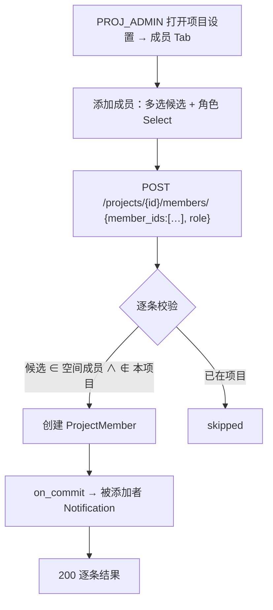
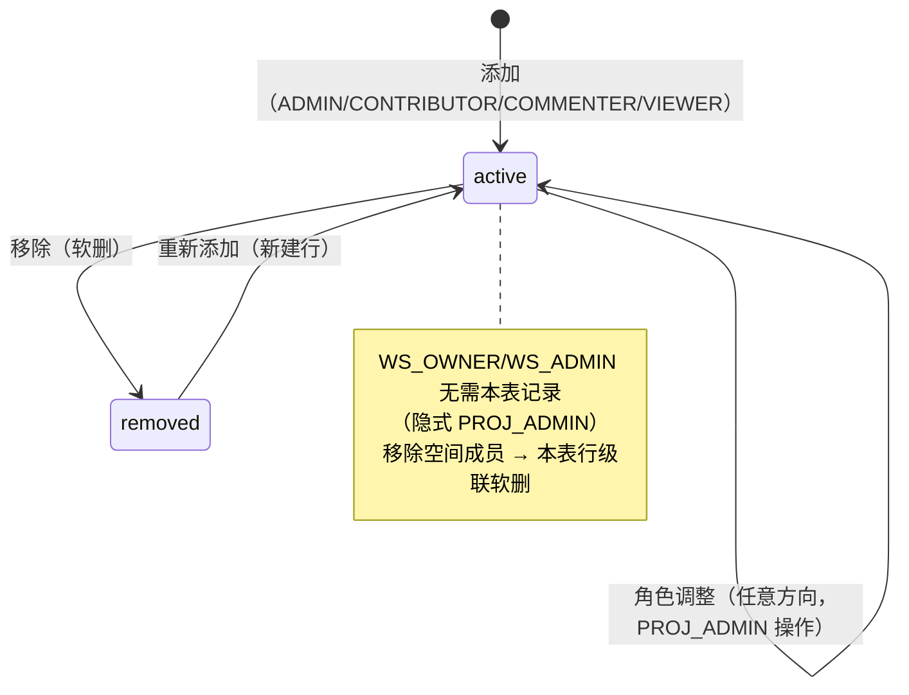
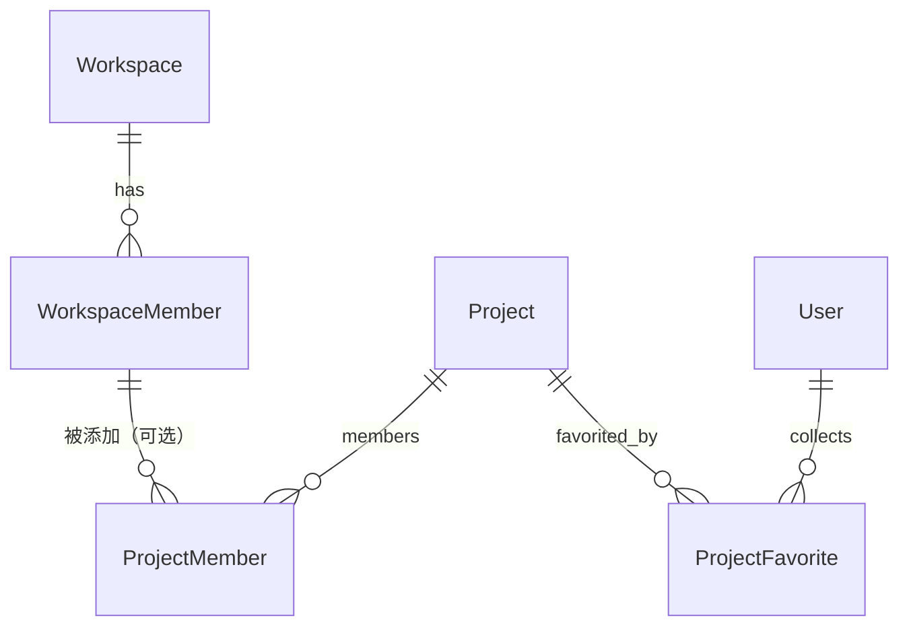

# 项目成员管理与搜索收藏

| 元信息项 | 内容 |
| --- | --- |
| 文档编号 | PROJ-002 |
| 所属迭代 | Sprint 1：MVP 能力补齐（第 3 周） |
| 优先级 | P1（MVP 必备级） |
| 所属模块 | M3-PROJ 项目管理 |
| 文档状态 | 待评审（Draft） |
| 最后更新日期 | 2026-09-01 |
| 上游依据 | `docs/需求文档.md` §3.3（项目成员添加、移除、项目子角色权限配置；项目全局筛选、搜索、收藏项目） |
| 前置依赖 | `PROJ-001`（项目 CRUD / `ProjectMember` 创建者 ADMIN 记录）、`TEAM-002`（工作空间成员候选集）、`AUTH-005`（权限矩阵与按钮）、`INFRA-004` |
| 下游依赖 | `TASK-002`（指派人选择器消费项目成员）、`COLLAB-001`（通知接收人 = 项目成员）、`RPT-002`（P2 成员任务量统计）、`AUTH-006`（P2 行级隔离深化） |
| 架构基线 | [`rbac-permission-model.md`](../architecture/rbac-permission-model.md) §2.3（PROJ_* 角色）、§5.5；[`api-conventions.md`](../architecture/api-conventions.md) §2.5（members / favorite 端点）、§2.6（动作子资源） |
| 竞品参考 | Plane（ProjectMember + 项目内成员管理 + 项目收藏 favorites 接口）、Ones（项目成员按角色模板批量套用） |

> **范围声明**：交付项目级成员管理（从工作空间成员中添加 / 移除 / 调整项目子角色）、项目关键词搜索与收藏。跨项目全局筛选器（P2）、项目模板与角色模板批量套用（P2/P3）、项目集（P3 `PROJ-004`）不在范围。

---

## 1. 概述

### 1.1 功能定位

工作空间成员 ≠ 项目成员——这是双层 RBAC 的核心边界（`WS_MEMBER` 需被显式加入项目才可访问）。`TEAM-002` 把人拉进了空间，本文档决定「谁能进哪个项目」。同时补齐 P0 遗留的两个轻量体验：项目列表关键词搜索（项目多了以后找项目）与收藏（高频项目置顶直达）。

| 交付项 | 说明 |
| --- | --- |
| 项目成员管理 | 添加（从空间成员多选，指定 `PROJ_*` 角色）、移除、角色调整；`PROJ_ADMIN` 权限 |
| 成员候选集 | 添加弹窗仅展示「本空间成员 − 已是项目成员」，含搜索 |
| 项目搜索 | 列表页关键词（名称 / identifier）搜索 + 状态筛选，`accessible_by()` 过滤内完成 |
| 项目收藏 | `POST/DELETE …/favorite/` 动作子资源；列表「收藏置顶」排序段 + 收藏筛选 Tab |

### 1.2 目标用户

| 用户 | 场景 | 关注点 |
| --- | --- | --- |
| 项目管理员 | 控制项目边界 | 只让相关的人进项目；被移出者立即不可见 |
| 空间成员 | 找项目 | 搜索 / 收藏直达，不在 20+ 项目列表里翻找 |
| WS_ADMIN | 全局治理 | 无须逐个加入项目即可访问全部项目（隐式 PROJ_ADMIN） |

### 1.3 前置依赖说明

| 依赖文档 | 依赖内容 | 缺失后果 |
| --- | --- | --- |
| `PROJ-001` | `Project`（identifier / 状态）与 `ProjectMember`（创建即 OWNER 记录 ADMIN） | 无承载 |
| `TEAM-002` | 空间成员列表（候选集来源）；移除空间成员级联软删项目成员 | 候选集错误 / 孤儿成员 |
| `AUTH-003` | 项目可见性规则（MEMBER 需显式加入；ADMIN 全可见） | 越权可见 |

### 1.4 竞品参考结论（详见第 6 章）

- **Plane**：`ProjectMember` 表 + 项目设置内成员 Tab；收藏为独立 `ProjectFavorite`（user, project）二列唯一。**优势**：收藏独立表天然支持排序扩展。
- **Ones**：项目成员可按「角色模板」批量套用（如把测试组 5 人一次以 TESTER 加入）。
- **本系统**：收藏对齐 Plane 独立表；批量添加 P1 支持一次多选成员（同一角色），角色模板后置 P3。

---

## 2. 业务逻辑

### 2.1 项目成员管理流程



### 2.2 项目成员状态与角色规则



### 2.3 业务规则表

| 编号 | 规则 | 判定位置 | 违反后果 |
| --- | --- | --- | --- |
| BR-01 | 候选必须为**同空间 active 成员**；不可添加空间外用户（引导去 `TEAM-002` 邀请） | Serializer + Service | 400 `INVALID` |
| BR-02 | 单次添加 ≤ 20 人；同邮箱去重 | Serializer | 400 `TOO_MANY` |
| BR-03 | 角色域为 `PROJ_ADMIN/CONTRIBUTOR/COMMENTER/VIEWER` 四值 | Serializer | 400 `INVALID` |
| BR-04 | 仅 `PROJ_ADMIN`（含隐式）可管理项目成员（`project.member.manage`） | `@require_permission` | 403 |
| BR-05 | `WS_GUEST` 只能被授予 `PROJ_COMMENTER` 及以下（对齐 `rbac-permission-model.md` §2.4 限制边） | Service | 400 `INVALID` |
| BR-06 | 项目创建者行不可被移除到「零 ADMIN」：移除 / 降级最后一个 `PROJ_ADMIN` 前，断言仍存在其他 ADMIN 或隐式 WS_OWNER/ADMIN 在空间 | Service 事务 | 409 `PROJECT_LAST_ADMIN` |
| BR-07 | 移除项目成员不触发任务改派：其名下任务保留指派但该成员已不可见（前端以「已移出成员」灰头像展示）；P2 `TASK-007` 交付转交 | — | — |
| BR-08 | 收藏幂等：重复 POST favorite 返回 200（`api-conventions.md` §2.6）；重复 DELETE 返回 204 | 动作子资源 | — |
| BR-09 | 搜索关键词 ≤ 64 字符；匹配 `name` 与 `identifier` 前缀（大小写不敏感） | Serializer | 400 `TOO_LONG` |
| BR-10 | 列表排序：收藏段（按收藏时间倒序）→ 其余（按 `sort_order`/更新时间）；两段间有视觉分隔 | 前端 + `?favorite_first=true` | — |

### 2.4 异常处理表

| 异常场景 | 触发条件 | HTTP / 错误码 | 前端表现 | 后端处理 |
| --- | --- | --- | --- | --- |
| 添加空间外邮箱 | member_ids 含非空间成员 | 400 `INVALID`（details 指明） | Toast「请先邀请至工作空间」 | — |
| 移除最后 ADMIN | BR-06 断言失败 | 409 `PROJECT_LAST_ADMIN` | 弹窗提示先指定新 ADMIN | 事务回滚 |
| 收藏他人项目 | 项目不在 `accessible_by()` | 404 | 404 空态 | DB 层过滤 |
| 搜索含特殊字符 | `%` `_` | 正常转义 | — | 参数化查询 |

### 2.5 边界条件表

| 边界场景 | 限制值 | 超出处理方式 |
| --- | --- | --- |
| 项目成员上限 | 100 | 403 `PROJECT_MEMBER_LIMIT`（文案引导） |
| 收藏数量 | 50 / 用户 | 超出 400 `FAVORITE_LIMIT`（先取消再收藏） |
| GUEST 可见项目列表 | 仅被加入的项目 | 列表天然过滤（`AUTH-003` IR 规则） |
| 候选集为空 | 空间成员全部已在项目 | 弹窗空态 + 「去邀请成员」链接 |

---

## 3. UI/UX 设计

### 3.1 页面布局

**项目列表页（工作台首页）改造**：

| 区域 | 组件 | UI 组件 |
| --- | --- | --- |
| 顶栏 | 搜索框（占位「搜索项目名或标识，如 RBT」）+ 状态筛选（进行中 / 已归档）+ 「新建项目」 | `SearchInput` / `Select` |
| Tab | 「全部 (N)」 / 「已收藏 (M)」 | `Tabs` |
| 项目卡网格 | 卡片：identifier 徽章 + 名称 + 状态点 + 成员头像堆叠（≤5 +N）+ 星标切换 | `CardGrid` / `AvatarStack` |
| 收藏段 | 「已收藏」分组横条置顶 | 分组标题 |

**项目设置 → 成员 Tab**（`project.member.manage` Gate）：

| 区域 | 组件 |
| --- | --- |
| 添加区 | 成员多选（候选集搜索）+ 角色 Select + 添加按钮 |
| 成员表 | 头像昵称 / 项目角色（行内下拉） / 加入时间 / 移除菜单 |
| 空间治理提示条 | 若当前用户为隐式 ADMIN：「你以工作空间管理员身份管理此项目」 |

### 3.2 交互细节表

| 交互动作 | 触发方式 | 反馈效果 | 加载态 / 空态 |
| --- | --- | --- | --- |
| 搜索 | 输入防抖 300ms | 结果即时收窄；URL `?q=` 同步可分享 | 无结果空态插画 + 「清除搜索」 |
| 收藏切换 | 卡片星标点击 | 星标填充 + 卡片飞入收藏段（FLIP 动画）；SWR 乐观更新 | — |
| 添加成员 | 弹窗提交 | 逐条结果 Toast；新行淡入 | 候选骨架 |
| 改项目角色 | 行内下拉 | 徽章色即时变化；失败回滚 | — |
| 移除成员 | 菜单确认 | 行淡出；提示其名下任务数（只提示不改派，BR-07） | — |

### 3.3 响应式与无障碍

- 卡网格 ≥1280px 4 列 / ≥768px 2 列 / <768px 1 列；星标有 `aria-pressed` 与文字标签。
- 候选多选支持键盘上下 + 回车；角色 Select 带 `aria-describedby` 说明各角色能力差异。

---

## 4. 技术架构

### 4.1 数据模型

```python
class ProjectFavorite(BaseModel):
    """项目收藏 —— 独立表（对标 Plane），为 P2 视图收藏与排序扩展预留。"""

    user = models.ForeignKey("db.User", on_delete=models.CASCADE, related_name="project_favorites")
    project = models.ForeignKey(Project, on_delete=models.CASCADE, related_name="favorited_by")

    class Meta(BaseModel.Meta):
        db_table = "project_favorites"
        constraints = [models.UniqueConstraint(fields=["user", "project"], name="uniq_user_project_favorite")]
        indexes = [models.Index(fields=["user", "created_at"], name="idx_pf_user_time")]
```

`ProjectMember` 沿用 `INFRA-003` 基线（role IntegerField + 复合唯一 (project, user, active)），本文档仅启用全部四角色。



### 4.2 API 定义

| 方法/路径 | 描述 | 权限 |
| --- | --- | --- |
| `GET /api/v1/workspaces/{slug}/projects/?q=&status=&favorite=&favorite_first=&cursor=` | 项目列表（搜索 + 筛选 + 收藏置顶） | `WS_MEMBER+`（GUEST 受 IR 过滤） |
| `GET /api/v1/workspaces/{slug}/projects/{project_id}/members/` | 项目成员列表（?expand=user&search=） | `project.read` |
| `POST /api/v1/workspaces/{slug}/projects/{project_id}/members/` | 批量添加成员（同角色） | `project.member.manage` |
| `PATCH …/members/{member_id}/` | 调整项目角色 | `project.member.manage` |
| `DELETE …/members/{member_id}/` | 移除成员 | `project.member.manage` |
| `POST /api/v1/workspaces/{slug}/projects/{project_id}/favorite/` | 收藏（幂等） | `project.read` |
| `DELETE /api/v1/workspaces/{slug}/projects/{project_id}/favorite/` | 取消收藏（幂等） | `project.read` |

**列表示例（收藏置顶）**：

```json
{ "status": "success",
  "data": [
    { "id": "9d8e…", "identifier": "RBT", "name": "兔子核心系统", "status": "in_progress",
      "is_favorite": true, "member_count": 6, "updated_at": "2026-08-31T10:00:00.000Z" },
    { "id": "f0a1…", "identifier": "MKP", "name": "营销页改版", "status": "in_progress",
      "is_favorite": false, "member_count": 3, "updated_at": "2026-08-30T09:00:00.000Z" }
  ],
  "meta": { "next_cursor": null, "count": 2, "total_count": 12,
            "favorite_count": 1, "grouped_by": "favorite_first" } }
```

**批量添加示例**：

```json
// POST …/projects/9d8e…/members/
{ "member_ids": ["a1…", "b2…", "c3…"], "role": 15 }
// 200
{ "status": "success",
  "data": [ { "member_id": "a1…", "status": "added", "project_member_id": "pm1…" },
            { "member_id": "b2…", "status": "added", "project_member_id": "pm2…" },
            { "member_id": "c3…", "status": "skipped", "reason": "already_member" } ] }
```

### 4.3 核心逻辑

```python
class ProjectQueryService:
    def list_for_user(self, user, slug: str, *, q: str | None, favorite_first: bool, ...):
        qs = (Project.objects.accessible_by(user)
              .filter(workspace__slug=slug, archived_at__isnull=True))
        if q:
            qs = qs.filter(Q(name__istartswith=q) | Q(identifier__istartswith=q.upper()))
        favorites = set(ProjectFavorite.objects.filter(user=user).values_list("project_id", flat=True))
        if favorite_first:
            qs = qs.annotate(is_fav=Case(When(id__in=favorites, then=0), default=1))
            qs = qs.order_by("is_fav", "-updated_at")
        # is_favorite 通过注水（避免每行子查询）：序列化层用 favorites 集合判断
        return qs, favorites
```

**搜索性能**：P1 项目量 ≤ 数百，`istartswith` 走 `name` 的普通索引前缀即可；`identifier` 建有唯一索引。P2 项目模板 / 全局筛选时升级 trigram（与 `TASK-003` 同方案）。

### 4.4 前端状态管理

- `ProjectListStore`：`filters {q, status, favorite}`（URL 双向同步）、`favorites: Set`；`toggleFavorite` 乐观切换 + 卡片 FLIP。
- `ProjectMemberStore`：`members`、`candidates`（`GET …/members/candidates/`——空间成员差集，P1 由前端用空间成员列表本地差集实现，独立候选端点 P2 视性能需要再拆）。

---

## 5. 测试用例

### 5.1 单元测试

| 用例 ID | 测试目标 | 输入 | 预期输出 | 覆盖类型 |
| --- | --- | --- | --- | --- |
| UT-01 | 候选必须是空间成员 | member_ids 含空间外用户 | 400 `INVALID` | 安全 |
| UT-02 | GUEST 角色上限 | 给 GUEST 授 PROJ_ADMIN | 400 `INVALID` | 边界 |
| UT-03 | 收藏幂等 | 同项目两次 POST favorite | 均 200，库中一行 | 正常 |
| UT-04 | 收藏上限 | 第 51 个 | 400 `FAVORITE_LIMIT` | 边界 |
| UT-05 | 最后 ADMIN 保护 | 移除唯一 PROJ_ADMIN（无隐式） | 409 `PROJECT_LAST_ADMIN` | 边界 |
| UT-06 | 隐式 ADMIN 不受保护限制 | 空间有 WS_ADMIN，移除唯一 PROJ_ADMIN | 204（隐式接管） | 正常 |
| UT-07 | 搜索前缀大小写 | q=rbt | 命中 RBT 项目 | 正常 |
| UT-08 | 级联清理 | `TEAM-002` 移除空间成员 | 其 ProjectMember 软删 | 集成 |
| UT-09 | GUEST 列表过滤 | GUEST 请求项目列表 | 仅其被加入的项目 | 安全 |
| UT-10 | 收藏不影响分页游标 | 置顶排序下翻页 | 游标稳定无重复 | 边界 |

### 5.2 集成测试

| 用例 ID | 场景 | 前置条件 | 操作步骤 | 预期结果 |
| --- | --- | --- | --- | --- |
| IT-01 | 成员加入→可见任务 | MEMBER 被加入项目 | 打开项目任务列表 | 可见；加入前 404 |
| IT-02 | 移除后隔离 | 移除成员 | 该成员访问项目 | 404；任务指派灰头像 |
| IT-03 | 搜索分享还原 | URL 带 `?q=rbt` 打开 | — | 结果与分享者一致 |
| IT-04 | 收藏置顶排序 | 收藏 2/12 项目 | 列表 | 收藏段置顶且组内按收藏时间倒序 |

### 5.3 E2E 测试

| 用例 ID | 用户场景 | 操作路径 | 验收标准 |
| --- | --- | --- | --- |
| E2E-01 | 组建项目小队 | ADMIN 添加 3 成员（CONTRIBUTOR） | 3 人立即可建任务；收到通知 |
| E2E-02 | 高频项目直达 | 收藏 2 项目 | 首页顶部收藏段直达，两次点击进入 |
| E2E-03 | 找项目 | 20 项目中搜「rbt」 | 1 结果 < 1s；清空恢复全量 |

---

## 6. 竞品深度对标

### 6.1 Plane 实现分析

项目成员管理与收藏均为成熟实现：`ProjectMember` + `UserProjectFavorite`；项目列表支持名称搜索。**劣势**：列表搜索在后端为 ilike 全模糊（无索引策略说明）；成员添加仅单人一次（无批量结果反馈）。

### 6.2 Ones 实现分析

项目权限可按「角色模板 / 用户组」批量套用，支持项目级权限白名单与涉密项目（P3 `AUTH-006` 对齐点）；其成员管理强依赖部门组织架构（本系统 P3 `AUTH-007`）。

### 6.3 本系统设计决策

1. **批量添加 + 逐条结果**：与 `TEAM-002` 同一交互范式（added/skipped），一次多选降低管理员操作成本。
2. **最后 ADMIN 保护**（BR-06）：显式防「项目失管」，且把隐式 WS_ADMIN 接管纳入判定——比 Plane 的无保护更稳，避免 Ones 式复杂审批。
3. **收藏独立表**：采纳 Plane 结构，`uniq_user_project_favorite` 数据库级幂等；动作子资源 POST/DELETE 幂等语义（`api-conventions.md` §2.6）。
4. **差异化价值**：项目边界（谁能进）+ 找项目效率（搜索 / 收藏）双补齐后，「空间 → 项目 → 任务」三层准入全部闭环，构成 MVP 协作的组织前提。

---

## 7. 里程碑与验收

### 7.1 交付物清单

| 类型 | 交付物 |
| --- | --- |
| Model / Migration | `ProjectFavorite` 新表 |
| API 端点 | §4.2 全部 7 个端点（列表端点扩展 q/status/favorite 参数） |
| 后端 | `ProjectQueryService`（搜索 + 收藏置顶）、成员 Service（批量 / 最后 ADMIN 保护） |
| 前端页面 / 组件 | 项目列表页改造（搜索 / Tab / 收藏星标 / 头像堆叠）、项目设置成员 Tab、添加成员弹窗 |
| 通知 | 被加入 / 被移出项目 2 类 Notification |
| 测试 | UT-01~10、IT-01~04、E2E-01~03 |

### 7.2 可操作演示的验收标准

1. 项目管理员一次添加 3 名成员，2 成功 1 skipped（已在项目），成功者立即获得对应权限并收到通知。
2. 被移除成员刷新后项目 404，其名下任务对他人仍可见（灰头像，不丢数据）。
3. 搜索「rbt」大小写任意命中 RBT 项目；URL 参数分享打开结果一致。
4. 收藏项目后刷新浏览器，收藏段稳定置顶；取消收藏后回到常规排序。
5. 尝试移除项目唯一 ADMIN（且空间无 WS_OWNER/ADMIN）被 409 拦截并提示指定新管理员。
