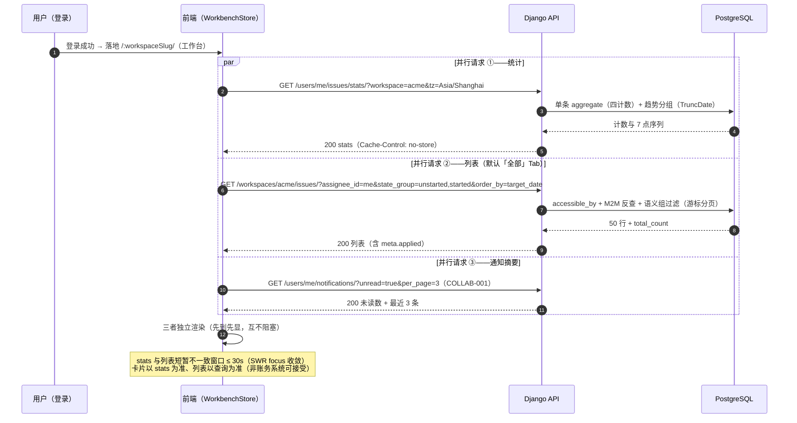
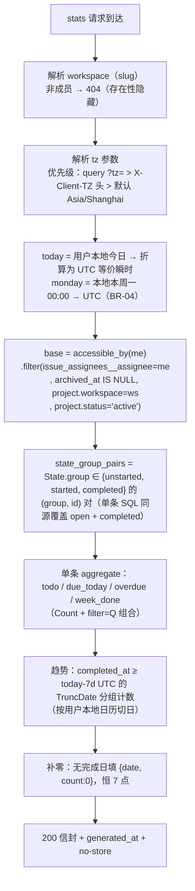
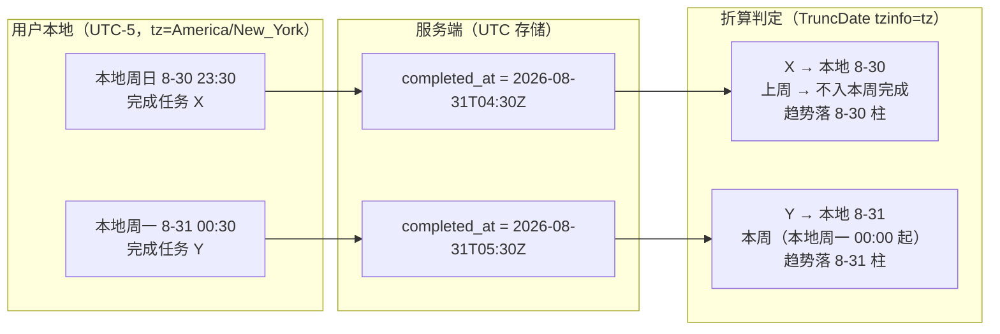

# 个人待办与已完成统计

| 元信息项 | 内容 |
| --- | --- |
| 文档编号 | RPT-001 |
| 所属迭代 | Sprint 1：MVP 能力补齐（第 3 周） |
| 优先级 | P1（MVP 必备级 · **数据报表模块的第一块基石**） |
| 所属模块 | M10-RPT｜数据报表 |
| 文档状态 | 待评审（Draft） |
| 最后更新日期 | 2026-09-01 |
| 上游依据 | `docs/需求文档.md` §8.2 数据报表 P1 列（个人待办 / 已完成任务统计）、§3.8（实时消息推送中「任务变更」的未读数联动） |
| 前置依赖 | `AUTH-003`（`accessible_by()` 行级过滤 Manager——统计与列表共用基座的权限根源）、`TASK-001/002/003`（Issue 属性 / 列表筛选语义 / 跨项目聚合端点）、`COLLAB-001`（通知未读数，工作台摘要卡消费）、`INFRA-004`（错误信封 / `Cache-Control` 头规范） |
| 下游消费 | `RPT-002`（P2 项目进度 / 成员任务量统计**复用本迭代交付的聚合查询范式**）、`RPT-003/004`（P3 敏捷报表注入同一 Service 框架）、需求池视图（P2 消费 `state_group` 参数）、`TASK-013`（P3 工时台账，扩展 `WorkLog` 维度） |
| 关联架构文档 | [`unified-issue-model.md`](../architecture/unified-issue-model.md) §2.6（`State.group` 语义组）、§2.8（`completed_at` 口径与派生规则）、§2.9（`idx_assignee_issue` 索引）；[`api-conventions.md`](../architecture/api-conventions.md) §4（信封）、§5.3（筛选语义）、§7.2（报表聚合端点限流 10 req/min）；[`rbac-permission-model.md`](../architecture/rbac-permission-model.md) §3（`accessible_by` 行级过滤） |
| 对标基线 | Plane `/users/me/issues/`（跨 workspace 我的工作项端点） · Ones 个人工时台账与绩效视图（Business+） |
| 工作量估算 | 后端 1.5 人日 / 前端 2.5 人日 / 联调与测试 1 人日，合计 **5 人日** |

> **范围声明**：交付个人维度的「我的待办」工作台页与统计卡（待办 / 今日到期 / 已逾期 / 本周完成 + 7 日完成趋势）。项目进度、成员任务量、燃尽图等团队维度报表全部 P2+（`RPT-002/003`）；工时统计 P2 `TASK-006`（填报）/ P3 `TASK-013`（台账与管控）；考核型绩效指标刻意不做（避免过早引入绩效语义，见 §6.2）。

---

## 1. 概述

### 1.1 功能定位

P1 的成员被派了一堆任务，但系统没有一处「以我为中心」的入口——他要在多个项目间来回切换找自己的卡，靠记忆拼凑「我今天欠什么账」。「我的待办」工作台页 + 统计卡把这个视角补上，同时让每天上班第一屏有**决策价值**：先处理今日到期与已逾期，而不是先翻项目列表。

工程上，本迭代交付一个**跨项目聚合查询范式**：在 `accessible_by(user)` 行级过滤之上，按「指派给我 + 状态语义组 + 时间窗」聚合。这个范式（权限过滤 → 维度过滤 → 单条 aggregate → 趋势分组）是 `RPT-002`（换 project 维度）与 P3 敏捷报表（换时间序列口径）的直接模板——**聚合框架不换，只换维度**。

| 交付项 | 说明 |
| --- | --- |
| 统计端点 | `GET /api/v1/users/me/issues/stats/?workspace=<slug>`：四个计数 + 7 日完成趋势序列 |
| 「我的待办」页 | 工作空间首页工作台：统计卡行 + 我的任务列表（按项目分组 / 筛选 Tabs） |
| 列表端点点亮 | `GET /api/v1/workspaces/{slug}/issues/`（P0 已定义的跨项目聚合端点，本迭代点亮）+ 本迭代新增 `state_group` 参数，复用 `TASK-003` 筛选语义 |
| 逾期口径 | `target_date < today ∧ state.group ∈ {unstarted, started}`（与看板 / 列表红色口径一致） |

### 1.2 关键约定：口径单源

> ⚠️ **统计产品最大的失败模式是「卡片 3、列表 5」。本文档的全部设计围绕一个原则：同一指标在任何消费点数字一致。**

| 指标消费点 | 数据来源 | 一致性机制 |
| --- | --- | --- |
| 统计卡（四卡） | `PersonalStatsService.stats()` 单条 aggregate | 同一 Service 构造器（BR-01） |
| 「我的待办」列表 Tabs | `PersonalStatsService.my_issues_queryset()` 派生 + `state_group` 参数 | 列表 QuerySet 从统计的同一基座派生（口径继承而非重写） |
| 看板 / 列表红色逾期标记 | `target_date < today ∧ 未完成` | 同一表达式（`TASK-003` / `BOARD-002` 已冻结） |
| `completed_at` | `Issue.save()` 在 `state.group` 首次进入 `completed` 时写入；`cancelled` 组**不写**（`BOARD-002` §2.4 冻结） | 趋势数据不被取消态污染（BR-02） |

**反面约束**：前端与后端任何位置禁止手写第二份口径表达式。统计卡与列表共用 QuerySet 构造器是评审红线（BR-01），CI 通过「`PersonalStatsService` 仅一处定义、无内联复制」的静态检查守护。

### 1.3 范围边界

| 能力 | P1（本文档） | 后续 |
| --- | --- | --- |
| 四统计卡（待办 / 今日到期 / 已逾期 / 本周完成） | ✅ | — |
| 7 日完成趋势迷你柱状图 | ✅ | — |
| 「我的待办」Tabs（全部 / 今日到期 / 已逾期 / 本周完成） | ✅ | — |
| 跨项目（工作空间内全部可见项目）聚合 | ✅ | — |
| `state_group` 筛选参数（按语义组过滤） | ✅ | — |
| 用户时区折算（今日 / 本周界线） | ✅ | — |
| 通知未读摘要卡 | ✅（消费 `COLLAB-001` 数据，只读展示） | — |
| 项目进度 / 成员任务量统计 | ❌ | `RPT-002` |
| 燃尽图 / 迭代速率 / 累积流图 | ❌（依赖 Cycle） | `RPT-003` |
| 团队负载 / 项目健康度 | ❌ | `RPT-004` |
| 工时统计（个人台账 / 管控） | ❌（依赖 `WorkLog`） | `TASK-006` / `TASK-013` |
| 考核型指标（完成率 / 响应时长） | ❌（产品价值观决策） | P3 工时管控时再评估 |
| 报表导出（PNG / CSV） | ❌ | `RPT-004` |
| 跨工作空间汇总 | ❌（stats 按 workspace 查询） | P4 数据大屏 |

### 1.4 前置依赖

| 依赖 | 内容 | 阻塞原因 |
| --- | --- | --- |
| `AUTH-003` | `Issue.objects.accessible_by(user)` 行级过滤 Manager（统计与列表共用基座的权限根源，§4.3.1） | 被移出项目的旧指派需自然消失（BR-08） |
| `TASK-001/002` | Issue 完整字段（`target_date` / `completed_at` / `state` 关联 / `IssueAssignee` M2M） | 聚合的列基础 |
| `TASK-003` | `IssueFilterSet`（`assignee_id=me` 语义 / `me` 展开 / 稳定次序）；列表游标分页 | 列表 Tab 的查询语义与分页 |
| `INFRA-003` | 索引 `idx_assignee_issue`（我的待办核心反查）、`idx_issue_active_by_project`、`target_date` 单列索引 | 性能门禁（BR-06） |
| `COLLAB-001` | 通知中心未读数端点与最近通知列表 | 摘要卡数据 |
| `INFRA-004` | `Cache-Control: no-store` 头规范、错误信封 | BR-05 与错误响应 |

### 1.5 竞品参考

| 竞品 | 参考点 | 处置 |
| --- | --- | --- |
| Plane | `/users/me/issues/` 跨 workspace 聚合我的工作项（按 state 分组返回）；无独立统计卡，趋势依赖 P2 cycles 报表 | 端点形态对标；**统计卡与开工屏语义为本系统增强** |
| Ones | 个人工时台账 / 绩效视图（完成率 / 响应时长，Business+，考核导向） | 台账形态 P3 对齐；考核语义**刻意不做**（§6.2） |

---

## 2. 业务逻辑

### 2.1 统计口径（单一事实来源，全前端共用）

| 指标 | 口径（SQL 语义） |
| --- | --- |
| 我的待办 `todo_count` | `assignee = me ∧ state.group ∈ {unstarted, started} ∧ 未删未归档 ∧ project.status='active'` |
| 今日到期 `due_today_count` | 待办 ∧ `target_date = today`（`today` 按用户时区折算，BR-04） |
| 已逾期 `overdue_count` | 待办 ∧ `target_date < today` |
| 本周完成 `completed_this_week_count` | `assignee = me ∧ completed_at ∈ [本地本周一 00:00 → UTC 等价瞬时, UTC now]`（周一起始；服务端 UTC 瞬时比较，与 TruncDate 同语义，BR-04） |
| 7 日趋势 `trend` | 近 7 天（含今日）每日 `completed_at` 落当日数；`TruncDate(completed_at, tzinfo=tz)` 按用户本地日历切日；窗口起点 `completed_at >= now-7d UTC`；无值日补 0；`cancelled` 态不计入 |

> 全部计数均在 `Issue.objects.accessible_by(user)` 之上聚合——「我的待办」天然只含**我仍有权访问的项目**的任务：被移出项目的历史指派不计数（与列表可见性一致，UT-04 守护）。项目状态过滤用 `Project.status='active'`（[unified-issue-model.md] §2.4 枚举：active/draft/archived/closed），P1 唯一启用值为 active；其余值由 PROJ-002/003 启用后加入显式集合。

### 2.2 工作台页加载流（并行时序）



### 2.3 统计口径决策流程



### 2.4 业务规则表

| 编号 | 规则 | 判定位置 | 违反后果 |
| --- | --- | --- | --- |
| BR-01 | 「我的待办」列表与统计共用同一 QuerySet 构造器（同一 `PersonalStatsService`），禁止两处手写口径 | Service 层 | 评审拒绝；CI 静态检查 |
| BR-02 | 已完成 Tab 仅显示 `completed_at` 本周内任务；`cancelled` 态不计入完成与趋势（取消污染防护） | Service | — |
| BR-03 | 多指派任务（P1 单人，P2 多人）对「我」的计数：`IssueAssignee` 存在即计 1（按人视角天然正确，不去重不拆分） | ORM | — |
| BR-04 | 时区：`today` / `monday` 以请求时区（query `tz` > `X-Client-TZ` 头 > 默认 `Asia/Shanghai`）折算为 UTC 等价瞬时比较；跨日界任务归属正确（与 TruncDate 同语义；AUTH-004 Profile 无 timezone 字段，时区由前端持、后端折算） | Service | — |
| BR-05 | stats 端点响应 `Cache-Control: no-store`（实时性优先，禁中间缓存）；列表复用游标分页 | ViewSet | — |
| BR-06 | 统计接口 SQL ≤ 5 条（workspace 查 + 成员判定 + state_group_pairs（open + completed 同源）+ 单条 aggregate + 趋势），P95 < 100ms @ 10 万任务 | ORM | 性能门禁（IT-06） |
| BR-07 | stats 限流 10 请求/分钟（报表聚合端点配额，[`api-conventions.md`](../architecture/api-conventions.md) §7.2）；超限 `429 RATE_LIMIT_EXCEEDED` + `Retry-After` | Throttle | 429 |
| BR-08 | 被移出项目的历史指派不计数、不出现在列表（`accessible_by` 先于一切业务过滤） | Service | — |
| BR-09 | `state_group` 参数值域 `{backlog, unstarted, started, completed, cancelled}` 逗号分隔 OR；非法值 400 `INVALID`；未知参数忽略 | FilterSet | 400 |
| BR-10 | 趋势序列恒 7 点（近 7 天含今日），日期为用户本地日期字符串 `YYYY-MM-DD` | Service | — |
| BR-11 | `tz` 参数非法（非 IANA 时区名）返回 400 `INVALID`；不信任客户端时区以外的任何本地计算 | Serializer | 400 |
| BR-12 | 统计卡红 / 橙语义仅为视觉，数字本身与列表逐 Tab 一致（IT-01 对拍断言） | 前端 + 集成测试 | — |

### 2.5 异常处理表

| 异常场景 | 触发条件 | HTTP / 错误码 | 前端表现 | 后端处理 |
| --- | --- | --- | --- | --- |
| 工作空间不存在 / 非成员 | slug 错误或未加入 | 404 `RESOURCE_NOT_FOUND` | 工作台错误态 + 引导返回 | 存在性隐藏 |
| `tz` 非法 | `tz=ABC` | 400 `VALIDATION_ERROR` / `INVALID` | 静默回退默认时区重试一次 | — |
| `state_group` 非法 | `state_group=doing` | 400 `VALIDATION_ERROR` / `INVALID` | Tab 回退「全部」 | — |
| stats 与列表短暂不一致 | 完成任务瞬间 | — | 卡片以 stats 为准，列表以查询为准，30s 内 SWR 收敛 | 可接受（非账务系统） |
| 无任何任务 | 新用户 | 200 全 0 + 趋势全 0 | 空态插画「暂无待办，去项目创建任务」+ 新建入口 | — |
| 限流 | > 10 req/min | 429 `RATE_LIMIT_EXCEEDED` | 卡片显示缓存值 + 静默退避重试 | `Retry-After` |
| 跨时区日界 | 用户 UTC-5 | — | 今日到期按其本地日历 | BR-04 |

### 2.6 边界条件表

| 边界场景 | 限制值 | 超出处理方式 |
| --- | --- | --- |
| 我的待办列表 | 游标分页 50/页（上限 100） | 「加载更多」 |
| 趋势序列 | 恒 7 点 | 无值日补 0（BR-10） |
| 多项目任务分组 | 项目徽章排序按 `updated_at` | 无上限（游标控制） |
| `per_page` 超限 | 100 | 截断 + `meta.degraded` |
| 完成即取消往返 | completed→cancelled→completed | `completed_at` 首次写入后按 `BOARD-002` §2.4 规则流转，趋势取实际 `completed_at` 落日 |

### 2.7 时区折算图解（BR-04 / BR-10 的边界示例）



| 场景 | 服务器 UTC 视角（错误做法） | 用户本地视角（本系统口径） |
| --- | --- | --- |
| X 的归属 | 8-31 UTC 完成 → 误入「本周」 | **8-30（上周日）**：不计入本周完成（BE-7） |
| Y 的归属 | 8-31 UTC | 8-31（本地周一）：计入本周（BE-7a） |
| `today` 的「今日到期」 | UTC 日期（UTC-5 用户深夜错位一天） | 本地日历日（BE-6） |
| 趋势 7 点的日期标签 | UTC 日期 | 本地日期（与卡片 / Tabs 的字面日期一致） |

> 该图即 BE-6 / BE-7 / BE-7a 三条用例的判定依据；「双路同源」（§4.4.2：stats 后端折算 + 列表前端注入字面日期）保证两条路径在用户本地日历上重合。注：日历锚点 2026-09-01 为周二、08-31 为周一、08-30 为周日——所有日期标注与真实日历一致。

---

## 3. UI/UX 设计

### 3.1 工作台页布局（`/:workspaceSlug/` 首页改造）

```
┌────────────────────────────────────────────────────────────────────────────────┐
│ 早上好，梁工 👋                                    2026年9月1日 星期二  [刷新 ⟳] │  ← 欢迎行
├────────────────────────────────────────────────────────────────────────────────┤
│ ┌──────────┐ ┌──────────┐ ┌──────────┐ ┌──────────────────┐ ┌────────────────┐ │
│ │ 📋 待办   │ │ 🕐 今日到期│ │ ⚠ 已逾期  │ │ ✓ 本周完成        │ │ 📈 近 7 日完成  │ │
│ │    23    │ │    3     │ │    1 🔴  │ │       8          │ │ ▁▂▁▃▂▁▂       │ │  ← 统计卡行
│ │  项任务   │ │  项到期   │ │  项逾期   │ │      项          │ │ 8 项           │ │
│ └──────────┘ └──────────┘ └──────────┘ └──────────────────┘ └────────────────┘ │
├────────────────────────────────────────────────────────────┬───────────────────┤
│ 我的待办                                                     │ 🔔 通知 (2)       │
│ [全部 23] [今日到期 3] [已逾期 1] [本周完成 8]                │ ─────────────────│
│ ────────────────────────────────────────────────────────────│ · 张三 评论了     │
│ [RBT] 修复登录页 500        缺陷 · 🔴urgent · 🔴8-30 逾期2天  │   RBT-4          │
│ [RBT] 分页游标改造          任务 · ⚑high   · 9-03           │ ─────────────────│
│ [OPS] 导出对账日报          需求 · ⚑medium · 今日到期 🕐     │ · 李四 指派给你   │
│ [RBT] Docker 编排收尾       任务 · ⚠ 已逾期                  │   OPS-12         │
│ …（50/页，加载更多 23/87）                                    │ ─────────────────│
│                                                              │ 查看全部 →       │
└────────────────────────────────────────────────────────────┴───────────────────┘
```

| 区域 | 组件 | UI 组件 |
| --- | --- | --- |
| 欢迎行 | 「早上好，{display_name}」（按本地时间 5-11 点 / 11-14 点 / 14-18 点 / 其余切换问候语）+ 日期 + 手动刷新按钮 | — |
| 统计卡行 | 4 卡（图标 + 大数字 + 标签；已逾期卡数字红色 `text-red-500` + ⚠ 图标，今日到期橙色 `text-amber-500` + 🕐）；趋势卡（recharts 迷你柱） | `StatCard`（自研）/ `recharts BarChart` |
| 趋势卡 | 「近 7 日完成」迷你柱状图（7 柱，hover 显示日期与数；今日柱高亮） | `recharts BarChart`（§4.4.3 配置） |
| 待办列表 | Tabs（全部 / 今日到期 / 已逾期 / 已完成(本周)）+ 行列表（项目徽章 + `RBT-128` 编号 + 标题 + 类型/优先级/截止） | `Tabs` / `IssueRow` |
| 通知摘要卡 | 未读数徽标 + 最近 3 条（复用 `COLLAB-001` 数据）+「查看全部」 | `MiniNotification` |

### 3.2 组件规格

| 元素 | 规格 |
| --- | --- |
| `StatCard` | `flex-1 min-w-[160px] rounded-lg border border-neutral-200 bg-white p-4`；图标 20px `text-neutral-400`；数字 `text-3xl font-semibold tabular-nums`；标签 `text-xs text-neutral-500`；hover `border-neutral-300 shadow-sm`；整卡可点击（`role="button"`） |
| 数字过渡 | 计数变化时 `tabular-nums` 下做 200ms 数字滚动（requestAnimationFrame 插值） |
| 逾期卡 | 数字红色 + ⚠ 12px 图标；0 时恢复正常色（红色是告警不是常态） |
| 趋势迷你柱 | 高 64px；柱宽 10px 圆角；柱色 `#10B981`（今日柱 `#3B82F6` 高亮）；无值日 2px 高度占位柱（视觉连续）；Y 轴隐藏，仅 hover tooltip 显示「8-28 · 1 项」 |
| Tabs | 下划线式；每 Tab 带计数徽标（`rounded-full bg-neutral-100 px-1.5 text-xs`）；当前 Tab 主色下划线 2px |
| `IssueRow` | 高 44px；项目徽章（`identifier` 色块 `rounded px-1 font-mono text-xs`）；编号 `font-mono text-xs text-neutral-400`；标题 `text-sm truncate`；右侧类型图标 + 优先级色点 + 截止（逾期红 / 今日橙）；行 hover `bg-neutral-50`；整行可点击 |
| 通知摘要卡 | `rounded-lg border p-4`；未读数红色徽标；条目 `text-xs` 两行截断 + 相对时间（「3 分钟前」） |

### 3.3 交互细节表

| 交互动作 | 触发方式 | 反馈效果 | 加载态 / 空态 |
| --- | --- | --- | --- |
| 卡片点击 | 点「已逾期 1」 | 列表切到对应 Tab（Tab 与卡片的四元映射） | — |
| 任务行点击 | 行点击 | 跳转项目内任务详情（新页签打开，保留工作台上下文） | — |
| 手动刷新 | 下拉 / 刷新按钮 ⟳ | stats + 列表 + 通知并行 revalidate；按钮旋转 | 骨架卡 |
| Tab 切换 | 点击 Tab | SWR key 切换（`state_group` / 时间窗参数变化）→ 列表渐隐重排 | 列表骨架 3 行 |
| 趋势柱 hover | mouseenter | tooltip「8-28 · 完成 1 项」 | — |
| 通知「查看全部」 | 点击 | 跳转通知中心（`COLLAB-001` 页面） | — |
| 定时收敛 | 窗口 focus / 60s | stats revalidate（`revalidateOnFocus + refreshInterval: 60_000`） | — |

### 3.4 空状态

| 场景 | 处置 |
| --- | --- |
| 新用户无任务 | 统计卡正常显示 0（结构保留）；列表区插画（`coffee` 64px `text-neutral-300`）+「暂无待办」+ 副文案「去项目创建你的第一个任务」+ 按钮「浏览项目」；趋势卡 7 根占位柱 |
| 某 Tab 空（其他有） | 列表区局部空态「该分类下暂无任务」+ 建议切「全部」 |
| stats 加载失败 | 四卡显示 `—` 占位（不显示 0，防误导）+ 卡角「重试」 |
| 列表加载失败 | 列表区 `alert-circle` + `error.message` +「重试」 |
| 通知无未读 | 摘要卡「🎉 已处理全部通知」+ 最近 3 条仍展示（灰显） |

### 3.5 响应式与无障碍

| 断点 | 布局 |
| --- | --- |
| ≥ 1280px | 统计卡行 5 卡并排；列表 + 通知双栏（列表 flex-1，通知卡 320px） |
| 768 ~ 1279px | 统计卡 2×3 换行；通知卡移至列表下方全宽 |
| < 768px | 统计卡横向滑动（`scroll-snap`）；单栏；趋势卡保持 |

**无障碍**：

| 要求 | 实现 |
| --- | --- |
| 数字为真实文本 | 统计数字非纯图形，屏幕阅读器可读「待办 23 项」 |
| 趋势图摘要 | `aria-label="近 7 日共完成 8 项"` + 每柱 `aria-label="8月28日 完成 1 项"`（recharts `<Bar>` 附属） |
| 红 / 橙语义冗余 | 已逾期卡 ⚠ 图标、今日到期 🕐 图标（色弱用户可辨） |
| Tabs 键盘导航 | `role="tablist"` / `tab` / `tabpanel`；方向键切换；`aria-selected` |
| 卡片可达 | `StatCard` 为 `role="button"` + `aria-label="查看已逾期任务，共 1 项"` |
| 行可达 | `IssueRow` `tabIndex={0}`，`Enter` 打开详情 |
| 对比度 | 全部文本 ≥ 4.5:1；红 / 橙数字在白底 ≥ 4.5:1（`text-red-500` / `text-amber-500` 实测通过） |

---

## 4. 技术架构

### 4.1 数据模型

**零新增表、零 DDL**。消费既有字段与索引：

| 消费对象 | 字段 / 索引 | 用途 |
| --- | --- | --- |
| `Issue` | `completed_at`（本周完成 + 趋势落点）、`target_date`（今日 / 逾期）、`archived_at` / `deleted_at`（基线过滤） | 聚合列 |
| `Issue` ↔ `State` | `state__group` 语义组（open = `unstarted`+`started`；`completed` 判完成；`cancelled` 排除） | 口径核心（§2.1） |
| `IssueAssignee` | `idx_assignee_issue`（assignee 前缀反查索引，[`unified-issue-model.md`](../architecture/unified-issue-model.md) §2.9） | 「指派给我」的核心查询路径 |
| `Issue` ↔ `Project` | `project.workspace_id`（跨项目限定）+ `accessible_by(user)` 行级过滤 | 权限内聚合（BR-08） |
| `completed_at` 派生 | `Issue.save()` 首次进入 completed 组写入；`cancelled` 不写（`BOARD-002` §2.4 冻结） | 趋势不被取消污染（BR-02） |
| 辅助索引 | `target_date` 单列（逾期窗扫描）；`idx_issue_active_by_project`（活跃任务基线） | 性能门禁支撑 |

> **为什么趋势不建物化列 / 汇总表**：P1 量级（单 workspace ≤ 10 万 Issue）下单条 `aggregate` + 一条 `TruncDate` 分组实测 P95 < 100ms（BR-06）。`RPT-002` 引入项目维度报表时再评估 Celery 预聚合——**先量测，再优化**，避免为不存在的量级预建汇总表（写入放大 + 口径双源风险）。

### 4.2 API 定义

#### 4.2.1 端点表

| # | 方法 | 路径 | 描述 | 权限 | 成功码 |
| --- | --- | --- | --- | --- | --- |
| 1 | `GET` | `/api/v1/users/me/issues/stats/?workspace=<slug>[&tz=<IANA>]` | 个人统计（四计数 + 7 日趋势） | 登录（workspace 成员） | `200` |
| 2 | `GET` | `/api/v1/workspaces/{slug}/issues/?assignee_id=me&state_group=…&order_by=target_date` | 「我的待办」列表（P0 跨项目聚合端点点亮 + 本迭代新增 `state_group` 参数） | `PROJ_VIEWER`(5)+（行级按成员资格过滤） | `200` |
| 3 | `GET` | `/api/v1/users/me/notifications/?unread=true&per_page=3` | 通知摘要（**复用 `COLLAB-001`，零新增**） | 登录 | `200` |

`stats` 是用户自资源（`/users/me/` 不嵌套 workspace，[`api-conventions.md`](../architecture/api-conventions.md) §2.4「可独立存在的资源不嵌套」），workspace 经查询参数限定。

#### 4.2.2 `GET /users/me/issues/stats/` 成功响应

```http
GET /api/v1/users/me/issues/stats/?workspace=acme&tz=Asia/Shanghai HTTP/1.1
Cookie: sessionid=…
```

```json
{
  "status": "success",
  "data": {
    "todo_count": 23,
    "due_today_count": 3,
    "overdue_count": 1,
    "completed_this_week_count": 8,
    "trend": [
      { "date": "2026-08-26", "count": 1 }, { "date": "2026-08-27", "count": 2 },
      { "date": "2026-08-28", "count": 0 }, { "date": "2026-08-29", "count": 0 },
      { "date": "2026-08-30", "count": 1 }, { "date": "2026-08-31", "count": 2 },
      { "date": "2026-09-01", "count": 2 }
    ],
    "generated_at": "2026-09-01T09:00:00.000Z"
  }
}
```

| 字段 | 类型 | 说明 |
| --- | --- | --- |
| `todo_count` 等 | int | §2.1 口径；`trend` 日期为**用户本地日期**（BR-04 / BR-10） |
| `trend` | array×7 | 恒 7 点，无值日补 0；首元素 = 今日-6 |
| `generated_at` | datetime | 服务端 UTC 生成时刻，供前端判断数据新鲜度 |
| 响应头 | — | `Cache-Control: no-store`（BR-05）；`X-RateLimit-*`（10/min 配额） |

#### 4.2.3 错误响应

**`404`**（workspace 不存在 / 非成员，存在性隐藏）：

```json
{ "status": "error",
  "error": { "code": "RESOURCE_NOT_FOUND", "message": "工作空间不存在或你没有访问权限",
             "request_id": "01JBY8R4N0VD9S4U6W8X0Z2A4C" } }
```

**`400`**（`tz` / `state_group` 非法）：

```json
{ "status": "error",
  "error": { "code": "VALIDATION_ERROR", "message": "请求参数校验失败",
             "details": [{ "field": "tz", "code": "INVALID", "message": "tz 须为合法 IANA 时区名，如 Asia/Shanghai" }],
             "request_id": "01JBY8R4N0VD9S4U6W8X0Z2A4D" } }
```

**`429`**（报表端点限流，BR-07）：

```json
{ "status": "error",
  "error": { "code": "RATE_LIMIT_EXCEEDED", "message": "请求过于频繁，请在 23 秒后重试",
             "details": [{ "field": "retry_after", "code": "RETRY_AFTER", "message": "23" }],
             "request_id": "01JBY8R4N0VD9S4U6W8X0Z2A4E" } }
```

#### 4.2.4 列表 Tab 参数映射

| Tab | 查询参数（复用 `TASK-003` 语义 + `state_group`） |
| --- | --- |
| 全部（待办） | `assignee_id=me&state_group=unstarted,started&order_by=target_date` |
| 今日到期 | 全部 + `target_date=<today>;on`（`today` 由前端按本地日历注入字面日期） |
| 已逾期 | 全部 + `target_date=<today>;before` |
| 本周完成 | `assignee_id=me&state_group=completed&order_by=-completed_at`（本周界由 `completed_at >= 周一` 服务端参数 `created_at` 同款 `;after` 语法：`completed_at=<monday>;after`） |

```json
// GET /api/v1/workspaces/acme/issues/?assignee_id=me&state_group=unstarted,started&target_date=2026-09-01;before&order_by=target_date&per_page=50
{ "status": "success",
  "data": [ { "id": "8a1f…", "sequence_id": 4, "issue_key": "RBT-4", "name": "修复登录页 500",
              "project_id": "9d8e…", "project_identifier": "RBT", "type_id": "…", "priority": "urgent",
              "state_id": "…", "state_group": "unstarted", "target_date": "2026-08-30",
              "completed_at": null, "updated_at": "2026-09-01T07:00:00.000Z" } ],
  "meta": { "next_cursor": "50:1:0", "next_page_results": true, "count": 50, "total_count": 1,
            "applied": { "assignee_id": ["6c7d…"], "state_group": ["unstarted", "started"],
                         "target_date": "2026-09-01;before" } } }
```

> `state_group` 是本迭代对跨项目聚合端点新增的唯一参数（BR-09）：值域五语义组、逗号 OR、与既有参数 AND。它同时服务 `RPT-001` Tabs 与 P2 需求池视图（按语义组而非具体状态过滤），属一次性投资。

### 4.3 核心逻辑

#### 4.3.1 `PersonalStatsService` 完整实现

```python
# apps/api/plane/analytics/services/personal.py
import uuid
from datetime import date, datetime, timedelta
from zoneinfo import ZoneInfo

from django.db.models import Count, Q, QuerySet
from django.db.models.functions import TruncDate
from django.utils import timezone

from plane.db.models import Issue, Project, State


class PersonalStatsService:
    """个人维度统计 —— 统计卡与「我的待办」列表的唯一口径来源（BR-01）。

    P2 演进位：RPT-002 注入同一框架换 project 维度 + 成员分组；
    P3 燃尽图注入换时间序列口径。聚合框架不换，只换维度。
    """

    OPEN_GROUPS = ("unstarted", "started")

    # ---------- 基座：统计与列表共用的 QuerySet 构造器 ----------
    def my_issues_queryset(self, user, *, workspace_id: uuid.UUID) -> QuerySet[Issue]:
        """我的可见任务基座 —— 统计与列表都从这里出发（口径单源）"""
        return (
            Issue.objects.accessible_by(user)                       # 行级过滤先于一切（BR-08）
            .filter(
                issue_assignees__assignee=user,                     # idx_assignee_issue 反查
                project__workspace_id=workspace_id,
                archived_at__isnull=True,
                # 归档项目任务不入待办：Project 以 status 枚举记录归档态（[unified-issue-model.md] §2.4），
                # 不存在 archived_at 列；只保留 status="active" 的项目（其余 draft/archived/closed 由
                # PROJ-002/003 启用后扩展为显式集合）
                project__status=Project.Status.ACTIVE,
            )
            .distinct()                                             # M2M join 去重
        )

    # ---------- 统计 ----------
    def stats(self, user, *, workspace_id: uuid.UUID, tz_name: str) -> dict:
        tz = ZoneInfo(tz_name)
        base = self.my_issues_queryset(user, workspace_id=workspace_id)
        now_local = datetime.now(tz)                                # 用户本地当前时刻
        today = now_local.date()                                    # 用户本地今日（BR-04）
        monday_local = datetime.combine(today - timedelta(days=today.weekday()), datetime.min.time(), tzinfo=tz)
        monday_utc = monday_local.astimezone(ZoneInfo("UTC"))        # 本地周一 → UTC 等价瞬时

        # 单条 SQL 取 open + completed 两组 id（BR-06 ≤5 SQL 预算不变，§4.3.3「open_state_ids」注口径扩展为「state_ids」）
        state_group_pairs = list(
            State.objects
            .filter(group__in=("unstarted", "started", "completed"))
            .values_list("group", "id")
        )
        open_state_ids = [sid for g, sid in state_group_pairs if g in self.OPEN_GROUPS]
        completed_state_ids = [sid for g, sid in state_group_pairs if g == "completed"]

        counts = base.aggregate(                                    # 第 2 条：单条聚合四计数
            todo_count=Count("id", filter=Q(state_id__in=open_state_ids)),
            due_today_count=Count("id", filter=Q(state_id__in=open_state_ids, target_date=today)),
            overdue_count=Count("id", filter=Q(state_id__in=open_state_ids, target_date__lt=today)),
            completed_this_week_count=Count(
                "id",
                filter=Q(state_id__in=completed_state_ids,
                         completed_at__gte=monday_utc)),             # 本地周一 00:00 → UTC 等价瞬时（BR-04）
        )

        trend_rows = (                                              # 第 3 条：趋势分组
            base.filter(completed_at__gte=now_local.astimezone(ZoneInfo("UTC")) - timedelta(days=7),
                        state__group="completed")                    # 防御过滤：trend 仅含 completed（不染 cancelled，BE-3）
            .annotate(day=TruncDate("completed_at", tzinfo=tz))
            .values("day").annotate(count=Count("id")).order_by("day")
        )
        counts["trend"] = self._pad_zero(trend_rows, today)
        counts["generated_at"] = timezone.now().isoformat()
        return counts

    @staticmethod
    def _pad_zero(rows, today: date) -> list[dict]:
        """补零 —— 恒 7 点，无完成日填 0（BR-10）"""
        by_day = {r["day"]: r["count"] for r in rows}
        return [
            {"date": (today - timedelta(days=offset)).isoformat(),
             "count": by_day.get(today - timedelta(days=offset), 0)}
            for offset in range(6, -1, -1)
        ]
```

> **三处实现细节**：① `TruncDate(..., tzinfo=tz)` 让「完成落哪一天」按**用户本地日历**切分（UTC-5 用户深夜完成的任务落在他的「今天」，BR-04）；② `completed_at__gte=monday_utc` 把本地周一 00:00 显式换算为 UTC 瞬时比较，与 TruncDate 时区口径一致（之前的 `__date__gte=monday` 是按 UTC 日期切，会让 UTC+8 用户「本地周一凌晨完成」算到「UTC 周日」漂出本周——BE-7 守护）；③ 趋势 7 日窗同样改 `completed_at__gte = now-7d`（UTC）以与 TruncDate 切日同语义，规避「6 天 23 小时」漂移导致的昨日漏算。

#### 4.3.2 ViewSet

```python
# apps/api/plane/app/views/user/me.py（节选）
class MyIssuesStatsAPIView(BaseAPIView):
    """GET /users/me/issues/stats/ —— 报表聚合端点：no-store + 10/min 限流"""
    permission_classes = [IsAuthenticatedAndActive]
    throttle_classes = [ReportAggregationThrottle]          # 10 req/min（BR-07）

    def get(self, request):
        slug = request.query_params.get("workspace")
        workspace = Workspace.objects.filter(slug=slug).first()
        if workspace is None or not workspace.members.filter(id=request.user.id).exists():
            raise NotFound()                                 # 404 存在性隐藏
        # 时区优先级：query 显式 tz > 浏览器时区（前端注入 X-Client-TZ）> 系统默认（BR-04 兜底）
        # 注：AUTH-004 Profile 模型未提供 timezone 字段，时区由前端持、后端折算（§4.4.2「双路同源」）；
        # 本迭代不扩展 Profile，避免与 AUTH-004 §1.3「字段阶段矩阵」漂移
        tz_name = (
            request.query_params.get("tz")
            or request.headers.get("X-Client-TZ")
            or "Asia/Shanghai"
        )
        try:
            ZoneInfo(tz_name)
        except Exception:
            raise ValidationError({"tz": "tz 须为合法 IANA 时区名"})   # 400 INVALID
        data = PersonalStatsService().stats(
            request.user, workspace_id=workspace.id, tz_name=tz_name)
        return success_response(data, headers={"Cache-Control": "no-store"})
```

#### 4.3.3 性能分析

| SQL | # | 路径 | 预期（10 万任务 / 单 workspace） |
| --- | --- | --- | --- |
| workspace 查 + 成员判定（ViewSet） | 2 | `Workspace.slug` 唯一 + `ProjectMember` 索引（`idx_project_member_user`） | < 1ms |
| state_group_pairs（open + completed 同源） | 1 | `State.group` 低基数小表（`group__in={unstarted,started,completed}`） | < 1ms |
| 四计数单条 aggregate | 1 | `idx_assignee_issue` 反查 + filter 组合（含基座 `project__status="active"`） | < 25ms |
| 趋势 TruncDate 分组 | 1 | 同上（时间窗收窄到 7 日，按用户本地切日） | < 20ms |
| **合计** | **5** | 与 BR-06 / BE-11 口径一致 | **P95 < 100ms（BR-06 门禁，IT-06）** |

### 4.4 前端实现

#### 4.4.1 `WorkbenchStore`

```typescript
// apps/web/core/store/workbench/index.ts
import { action, computed, makeObservable, observable } from "mobx";

export class WorkbenchStore {
  stats: IPersonalStats | null = null;
  statsError: unknown = null;
  activeTab: "all" | "due_today" | "overdue" | "completed" = "all";

  constructor(private root: RootStore) {
    makeObservable(this, {
      stats: observable.ref, statsError: observable, activeTab: observable,
      tabQuery: computed, setTab: action, applyStats: action,
    });
  }

  /** Tab → 列表查询参数（§4.2.4 映射的单一实现；today 由前端本地注入字面日期） */
  get tabQuery(): string {
    const today = formatLocalDate(new Date());          // 用户本地 YYYY-MM-DD
    const monday = formatLocalMonday(new Date());
    switch (this.activeTab) {
      case "due_today": return `assignee_id=me&state_group=unstarted,started&target_date=${today};on&order_by=target_date`;
      case "overdue":   return `assignee_id=me&state_group=unstarted,started&target_date=${today};before&order_by=target_date`;
      case "completed": return `assignee_id=me&state_group=completed&completed_at=${monday};after&order_by=-completed_at`;
      default:          return `assignee_id=me&state_group=unstarted,started&order_by=target_date`;
    }
  }

  setTab = (tab: WorkbenchTab) => { this.activeTab = tab; };
  applyStats = (stats: IPersonalStats) => { this.stats = stats; this.statsError = null; };
}
```

#### 4.4.2 SWR 策略

```typescript
// apps/web/core/hooks/use-workbench.ts
export const useWorkbenchStats = (workspaceSlug?: string) => {
  const { workbench } = useStore();
  const tz = Intl.DateTimeFormat().resolvedOptions().timeZone;   // 前端持时区（§4.4 约定）
  const key = workspaceSlug ? `stats:${workspaceSlug}:v1` : null;
  const { isLoading, error, mutate } = useSWR(
    key, () => workbenchApi.fetchStats(workspaceSlug!, tz),
    {
      refreshInterval: 60_000,          // 60s 周期收敛
      revalidateOnFocus: true,          // 窗口 focus 即时收敛
      onSuccess: workbench.applyStats,  // MobX 规范化（store 只存实体）
      keepPreviousData: true,           // 刷新期间显示旧值，不闪骨架
    },
  );
  return { stats: workbench.stats, isLoading, error, mutate };
};

// 我的待办列表：Tab 切换换 key（useSWRInfinite 游标追加）
export const MY_ISSUES_KEY = (slug: string, tabQuery: string) =>
  `my-issues:${slug}:v1?${tabQuery}`;
```

| 关注点 | 归属 | 落地 |
| --- | --- | --- |
| stats 请求与缓存 | SWR | `no-store` 由响应头声明，SWR 内存级缓存 + 60s/focus revalidate |
| 列表请求 | SWR Infinite | key = `MY_ISSUES_KEY(slug, tabQuery)`，Tab 切换即换 key |
| 实体存储 | MobX `IssueStore` | 列表行规范化入 `byId`；行点击跳详情零等待 |
| 统计派生 | MobX `WorkbenchStore` | `stats` / `activeTab` / `tabQuery` computed |
| 时区 | **前端持、后端折算** | 请求带 `tz`；`today` / `monday` 字面日期由前端本地生成注入列表参数，与 stats 后端折算**双路同源**（均为用户本地日历） |

#### 4.4.3 趋势迷你柱（recharts）

```tsx
// apps/web/core/components/workbench/trend-card.tsx
import { Bar, BarChart, ResponsiveContainer, Tooltip, XAxis } from "recharts";

export const TrendCard = ({ trend }: { trend: TrendPoint[] }) => {
  const total = trend.reduce((s, p) => s + p.count, 0);
  return (
    <StatCard aria-label={`近 7 日共完成 ${total} 项`} icon={<TrendingUp />} label="近 7 日完成">
      <ResponsiveContainer width="100%" height={64}>
        <BarChart data={trend} margin={{ top: 4, right: 0, bottom: 0, left: 0 }}>
          <XAxis dataKey="date" hide />
          <Tooltip
            cursor={{ fill: "rgba(0,0,0,0.04)" }}
            formatter={(v) => [`${v} 项`, "完成"]}
            labelFormatter={(d) => format(new Date(d), "M-d")} />
          <Bar dataKey="count" radius={[2, 2, 0, 0]} maxBarSize={10}
               fill={config.theme.success}                        // #10B981
               // 今日柱高亮：Cell 逐柱着色（末位 #3B82F6）
               shape={<TrendBarShape highlightIndex={trend.length - 1} />} />
        </BarChart>
      </ResponsiveContainer>
      <span className="text-xs text-neutral-500">{total} 项</span>
    </StatCard>
  );
};
```

无值日渲染 2px 高度占位柱（`TrendBarShape` 内 `Math.max(count, 0.02)` 比例），保证视觉连续不出现断柱。

### 4.5 组件清单

| 组件 | 路径 | 职责 |
| --- | --- | --- |
| `WorkbenchPage` | `apps/web/routes/$workspaceSlug/_workbench.tsx` | 工作台页装配（并行三请求） |
| `StatCard` | `core/components/workbench/stat-card.tsx` | 统计卡（图标 / 数字 / 标签 / 可点击） |
| `TrendCard` | `core/components/workbench/trend-card.tsx` | 趋势迷你柱（§4.4.3） |
| `MyIssuesPanel` | `core/components/workbench/my-issues-panel.tsx` | Tabs + `IssueRow` 列表 + 加载更多 |
| `IssueRow` | `core/components/workbench/issue-row.tsx` | 项目徽章 + 编号 + 标题 + 属性行 |
| `MiniNotification` | `core/components/workbench/mini-notification.tsx` | 通知摘要卡（消费 `COLLAB-001`） |
| `WorkbenchStore` | `core/store/workbench/index.ts` | §4.4.1 |
| `useWorkbenchStats` / `MY_ISSUES_KEY` | `core/hooks/use-workbench.ts` | §4.4.2 |

---

## 5. 测试用例

技术风险集中在**口径正确性**（时区 / 取消污染 / 权限内聚合）、**口径一致性**（卡片 vs 列表对拍）与**性能门禁**。

### 5.1 后端单元 / 接口测试

| 编号 | 场景 | 输入 / 前置 | 期望 |
| --- | --- | --- | --- |
| BE-1 | 逾期口径 | 昨天截止未完成 1 条 | `overdue_count=1` |
| BE-2 | 今日到期口径 | 今天截止未完成 | `due_today_count` 计入、`overdue` 不计 |
| BE-3 | 取消不污染完成 | 拖入 `cancelled` 的本周任务 | `completed_this_week_count` 与趋势（7 日柱）均不含 cancelled（BR-02；trend SQL 含 `state__group="completed"` 防御过滤） |
| BE-4 | 已完成不再计待办 | `completed` 态任务 | 不入 `todo_count` |
| BE-5 | backlog 不计待办 | `backlog` 态任务 | 不入 `todo_count`（open 仅两语义组） |
| BE-6 | 时区折算（UTC-5） | 用户本地 8-31 深夜完成（UTC 9-01 凌晨） | 趋势落该用户本地 8-31（BR-04） |
| BE-7 | 周界折算 | 本地周日 23:59（UTC+8）完成 | 不入「本周」（周一 00:00 起） |
| BE-7a | 本地周一边界（**新增，§2.7 守护**） | 本地周一 00:00（UTC-5）本地完成（即 UTC 05:00） | 入「本周」完成计数，趋势落本地周一柱 |
| BE-8 | 权限内聚合 | 被移出项目的旧指派 | 不计数不出列表（BR-08） |
| BE-9 | 多指派计数（前瞻） | 一任务挂两人 | 每人视角各计 1（BR-03） |
| BE-10 | 趋势补零 | 中间 4 日无完成 | 恰 7 点含 0（BR-10） |
| BE-11 | SQL 条数 | 任一 stats 请求（workspace 存在 + 成员判定 + Service） | `assertNumQueries` ≤ 5（BR-06；§4.3.3 拆解：workspace 1 + 成员 1 + state_group_pairs 1 + aggregate 1 + 趋势 1 = 5） |
| BE-12 | `no-store` 头 | 响应头检查 | `Cache-Control: no-store`（BR-05） |
| BE-13 | `tz` 非法 | `tz=ABC` | 400 `VALIDATION_ERROR` / `INVALID` |
| BE-14 | `state_group` 非法 | `state_group=doing` | 400 `INVALID`；合法五组逗号 OR 正常（BR-09） |
| BE-15 | workspace 非成员 | 外部用户带他人 slug | 404 `RESOURCE_NOT_FOUND`（存在性隐藏） |
| BE-16 | 限流 | 1 分钟第 11 次 | 429 `RATE_LIMIT_EXCEEDED` + `Retry-After`（BR-07） |
| BE-17 | 新用户空态 | 无任何任务 | 全 0 + 趋势全 0 + `generated_at` 有值 |

### 5.2 前端单元测试（Vitest + RTL）

| 编号 | 场景 | 期望 |
| --- | --- | --- |
| FE-1 | `tabQuery` 四 Tab 映射 | 各 Tab 生成 §4.2.4 表中的参数串（字面日期注入正确） |
| FE-2 | Tab 切换换 key | `activeTab` 变化 → `MY_ISSUES_KEY` 变化 |
| FE-3 | 卡片-Tab 点击联动 | 点「已逾期」卡 → `activeTab="overdue"` |
| FE-4 | 数字滚动过渡 | 计数 3→2 时 200ms 内插值（rAF mock） |
| FE-5 | 逾期卡红色条件 | `overdue_count=0` 时恢复正常色 |
| FE-6 | stats 失败占位 | error 时卡片显示 `—` 非 `0` |
| FE-7 | 趋势柱渲染 | 7 柱恒渲染；0 值柱 2px 占位；今日柱高亮色 |
| FE-8 | 趋势 aria | `aria-label="近 7 日共完成 8 项"` |
| FE-9 | 通知摘要 | 未读 2 → 徽标「2」；条目 3 条 + 「查看全部」 |
| FE-10 | 空态 | 新用户 → 插画 + 「浏览项目」按钮；卡片仍显示 0 |

### 5.3 集成测试

| 编号 | 场景 | 前置条件 | 操作步骤 | 预期结果 |
| --- | --- | --- | --- | --- |
| IT-01 | **卡片-列表一致（对拍）** | 造 3 逾期 + 2 今日到期 | 点已逾期卡 | 列表 Tab 恰 3 行且与卡片计数相等（BR-12 核心断言） |
| IT-02 | 完成即时收敛 | 从待办勾选完成一条 | revalidate 后 | `todo_count -1`、`completed_this_week_count +1`、趋势今日 +1 |
| IT-03 | 登录落地 | 用户登录 | 访问 `/:slug/` | 三请求并行（DevTools 时序），先到先显互不阻塞 |
| IT-04 | 行点击跳详情 | 点击任务行 | — | 新页签打开项目内任务详情（`peekIssue` 或详情路由） |
| IT-05 | 加载更多 | 87 条待办 | 50/页翻两页 | 首尾相接无重复；Tab 切换后游标重置 |
| IT-06 | **性能门禁** | 10 万任务种子 | stats 50 次 | P95 < 100ms、SQL ≤ 5（IT-06 报告归档） |
| IT-07 | 收敛窗口 | 完成任务后不刷新 | 等 60s / focus | stats 自动 revalidate 收敛 |

### 5.4 E2E 测试（Playwright）

| 编号 | 场景 | 断言 |
| --- | --- | --- |
| E2E-01 | 每日开工 | 登录落地工作台 → 四卡 + 趋势 1 屏可见；点卡切 Tab；数字与列表逐 Tab 一致 |
| E2E-02 | 闭环回写 | 完成一条今日到期任务 → 卡片 `3→2`、逾期不变（60s 内或手动刷新收敛） |
| E2E-03 | 取消不污染 | 拖一条任务入「已取消」（看板）→ 回工作台：本周完成与趋势不含该任务 |
| E2E-04 | 通知联动 | 他人指派任务给自己 → 通知摘要卡出现该事件；未读数 +1 |

### 5.5 覆盖率门禁

| 范围 | 门禁 |
| --- | --- |
| `personal.py`（Service） | 行 ≥ 95% / 分支 ≥ 90%（口径逻辑是报表可信度根基） |
| `workbench/` 组件目录 | 行 ≥ 75% |
| 后端 `me.py` stats 视图 | 行 ≥ 90% |
| CI | `pnpm test` / `pytest` / `pnpm test:e2e` 全绿 |

### 5.6 测试数据构造（BE 用例共用夹具）

统计口径测试的成败取决于**夹具能否精确落在口径边界上**。统一夹具（`tests/analytics/fixtures/personal_stats.py`）按「相对今天」构造，避免硬编码日期导致的用例腐烂：

```python
import factory
from datetime import timedelta
from django.utils import timezone

def build_personal_stats_dataset(user, workspace, today):
    """按 §2.1 口径矩阵构造边界数据集（today 为测试注入的『今天』，可冻结时间）"""
    proj = ProjectFactory(workspace=workspace, identifier="RBT")
    yesterday, tmrw = today - timedelta(days=1), today + timedelta(days=1)
    return {
        # 待办 / 今日 / 逾期的三向边界
        "open_no_date":  IssueFactory(project=proj, assignee=user, target_date=None),
        "open_due_today": IssueFactory(project=proj, assignee=user, target_date=today),
        "open_overdue":  IssueFactory(project=proj, assignee=user, target_date=yesterday),
        # 完成与取消的分野（BR-02 / BR-03 联动）
        "done_this_week": IssueFactory(project=proj, assignee=user,
                                        state__group="completed",
                                        completed_at=timezone.now()),
        "cancelled_this_week": IssueFactory(project=proj, assignee=user,
                                        state__group="cancelled"),      # 无 completed_at
        # 权限边界（BR-08）
        "in_other_project": IssueFactory(project=ProjectFactory(workspace=workspace),
                                        assignee=user),                 # 可见项目之外的同 ws 项目
        "removed_project":  IssueFactory(project=ProjectFactory(workspace=workspace,
                                        members=[]), assignee=user),    # 被移出成员资格的项目
        # backlog 排除（BE-5）
        "backlog_issue":  IssueFactory(project=proj, assignee=user, state__group="backlog"),
    }
```

| 夹具键 | 服务的断言 |
| --- | --- |
| `open_no_date` / `open_due_today` / `open_overdue` | `todo=3`、`due_today=1`、`overdue=1` 的三计数（BE-1/2） |
| `done_this_week` / `cancelled_this_week` | `completed_this_week=1`（取消不计，BE-3）；趋势恰 1 点非 0 |
| `removed_project` | 全部指标不含（BR-08 / BE-8） |
| `backlog_issue` | 不入 `todo`（BE-5） |

> 时区用例（BE-6/7）在夹具之上用 `freezegun` 冻结 UTC 时刻 + `tz=America/New_York` 参数重放 §2.7 图解的两个边界点；性能用例（IT-06）用 `factory_boy` 批量种子 10 万行（`bulk_create`，禁用信号加速）。

---

## 6. 竞品深度对标

### 6.1 Plane 实现分析

Plane 的对应能力是 `/api/users/me/issues/` 端点（`apps/api/plane/app/views/user/`）：

| 维度 | Plane 的做法 | 本系统 P1 | 评价 |
| --- | --- | --- | --- |
| 数据形态 | 跨 workspace 返回我的全部工作项，按 **state 分组**的结构化响应 | 四计数 + 7 日趋势的**聚合结果**（不下发明细） | 本系统前端零聚合、首屏轻；明细由列表端点按 Tab 拉取 |
| 统计卡 | **无**独立统计卡；工作区首页以项目列表为主 | 四卡 + 趋势的开工屏 | **本系统增强**：把「我的 issues」升级为有优先级语义的决策屏（逾期置顶红） |
| 趋势 | 无（依赖 P2 `cycles` 概念的燃尽 / 速率报表） | 个人 7 日完成趋势（不依赖 Cycle） | 本系统以 `completed_at` 直算，零前置概念 |
| 口径单源 | 端点内联过滤逻辑，与列表过滤各自实现 | `PersonalStatsService` 与列表共用 QuerySet 基座（BR-01） | **本系统改进**：结构上杜绝「卡片 3 列表 5」 |
| 权限 | workspace 成员过滤 | `accessible_by` 行级 + 项目移出即不计（BR-08） | 本系统更严格（行级过滤先于业务过滤） |

**可借鉴点已吸收**：跨项目聚合端点形态（P0 已定义 `workspaces/{slug}/issues/`，本迭代点亮）；「按语义组而非具体状态聚合」的组织方式。

### 6.2 Ones 实现分析

| 能力 | Ones（Business+） | 本系统 P1 | 处置 |
| --- | --- | --- | --- |
| 个人工时台账 | 工时填报 → 台账 → 审批链 | ❌ | P2 `TASK-006` 填报 / P3 `TASK-013` 台账管控 |
| 绩效视图 | 完成率 / 响应时长 / 质量分，考核导向 | ❌ | **产品价值观决策：刻意不做** |
| 个人待办工作台 | ✅ | ✅ | 对齐 |
| 报表权限 | 台账仅本人与管理者可见 | stats 仅本人（`/users/me/`） | 对齐 |

**为什么不引入绩效语义**：统计一旦成为考核依据，就会驱动「为数字而做」的行为（拆任务凑数、争抢易完成任务），P1 阶段的系统还没有支撑公平考核的数据完备性（工时、复杂度、阻塞都未采集）。本系统把 P1 统计定位为**自我管理工具**（先处理逾期），把考核链留给 P3 工时管控（届时数据完备、且由企业显式配置开启）。

### 6.3 本系统设计决策

1. **口径单源**：统计与列表共用 Service 构造器 + `completed_at` 口径联动 `BOARD-002`——杜绝「卡片 3 列表 5」的经典不一致（IT-01 对拍断言是合并门禁）。
2. **轻即是对的**：四卡 + 趋势 7 点，两三条 SQL、零新表、零新组件（recharts 已在技术栈）——P1 报表的性价比最优解；汇总表 / 预聚合在量级证明需要前**不预建**（§4.1）。
3. **时区双路同源**：stats 由后端按 `tz` 折算，列表字面日期由前端本地注入——两路都以「用户本地日历」为唯一口径，跨时区用户的今日 / 本周不漂移（BE-6/7）。
4. **聚合范式可注入**：`PersonalStatsService` 的「权限 → 维度 → 单 aggregate → 趋势分组」框架即 `RPT-002`（项目维度）与 P3 敏捷报表的模板，本迭代是报表体系的地基投资而非孤立页面。
5. **差异化价值**：把 Plane 分散的「我的 issues」聚合成有优先级语义的开工屏（逾期红卡置顶、点击直达），是 MVP 留存体验的最后一环。

### 6.4 三方能力矩阵

| 能力 | Plane | Ones | 本系统 P1 | 后续 |
| --- | --- | --- | --- | --- |
| 跨项目我的工作项端点 | ✅ | ✅ | ✅ | — |
| 个人统计卡（含逾期 / 今日到期） | ❌ | ✅ | ✅ **领先 Plane** | — |
| 7 日完成趋势（零 Cycle 前置） | ❌ | 台账维度 | ✅ | — |
| 统计与列表口径单源 | ❌ | 未公开 | ✅ **结构化保证** | — |
| 用户时区感知口径 | 部分 | ✅ | ✅ | — |
| 工时台账 / 绩效 | ❌ | ✅（B+） | ❌（刻意不做） | `TASK-006/013` |
| 团队 / 项目维度报表 | cycles（P2 概念） | ✅ | ❌ | `RPT-002/003/004` |

### 6.5 RPT 模块演进路线

编号与 [`dependency-graph.md`](../architecture/dependency-graph.md) 的 RPT 模块清单严格一致；本文档确立的聚合范式（权限 → 维度 → 单 aggregate → 趋势分组）逐级注入：

```
Sprint 1 / P1
  RPT-001  个人待办与已完成统计（四卡 + 7 日趋势 + state_group 参数）   ← 本文档
   ↓ 复用 my_issues_queryset 范式换维度
Sprint 5 / P2
  RPT-002  项目进度统计 + 成员任务量统计（换 project 维度 + 成员分组；
           消费 completed_at / sub_issues_count 既有口径）
   ↓ 依赖 Cycle（P2 引入）与 WorkLog（TASK-006）
Sprint 9 / P3
  RPT-003  燃尽图 / 迭代速率 / 累积流图（换时间序列口径；
           消费 progress_snapshot 快照保证历史不可篡改）
  RPT-004  团队负载 / 项目健康度 / 报表导出（PNG/CSV）
   ↓
P4 远期
  RPT-005  企业数据大屏与自定义报表
```

> 本文档不引入 `dependency-graph.md` 之外的新文档编号；「考核型绩效指标」明确不在路线图内（§6.2 价值观决策），如未来企业客户提出，应作为 `TASK-013` 工时管控的增量需求评估，而不是新开 RPT 编号。

---

## 7. 里程碑与验收

### 7.1 交付物清单

| 类别 | 交付物 |
| --- | --- |
| Model / Migration | 无（零 DDL） |
| API 端点 | `GET /users/me/issues/stats/`（新）；`GET /workspaces/{slug}/issues/` 点亮（含 `state_group` 参数）；通知摘要复用 `COLLAB-001` |
| 后端 | `PersonalStatsService`（口径单源基座 / 时区折算 / 单条 aggregate / TruncDate 趋势 / 补零）、`MyIssuesStatsAPIView`（`no-store` + 10/min 限流） |
| 前端 | 工作台页（`StatCard` ×4 + `TrendCard` + `MyIssuesPanel` Tabs 列表 + `MiniNotification`）、`WorkbenchStore`、`useWorkbenchStats` |
| 测试 | BE-1~17、FE-1~10、IT-01~07、E2E-01~04 + 覆盖率门禁 |
| 文档 | 本文档 + OpenAPI（`workspace` / `tz` 参数与 429 响应显式声明） |

### 7.2 可操作演示的验收标准

1. 成员登录即见四卡与 7 日趋势；数字与「我的待办」列表**逐 Tab 一致**（点卡切 Tab 对拍）。
2. 有一条昨天截止的未完成任务时「已逾期」红卡计数为 1，点击直达该任务；完成后卡片即时收敛（≤ 60s 或手动刷新）。
3. 拖入「已取消」的任务不出现在本周完成统计与趋势图中（与 `BOARD-002` 口径联动）。
4. UTC-5 时区用户的「今日到期」与「本周完成」按其本地日历切分（BE-6/7 测试可复演）。
5. 被移出项目后，该项目的指派任务从统计与列表同时消失。
6. 10 万任务数据集下 stats 端点 P95 < 100ms、SQL ≤ 5 条（IT-06 报告）。

### 7.3 非功能验收

| 指标 | 目标 | 测量方式 |
| --- | --- | --- |
| stats 接口（10 万任务） | P95 < 100ms | `pytest-benchmark` / IT-06 |
| 工作台首屏（三请求并行） | P95 < 1.5s（本地 Docker） | Playwright `performance` |
| 三请求互不阻塞 | 最慢请求不延迟最快区域渲染 | DevTools 时序断言 |
| 无 console error | 0 条 | E2E `page.on("console")` |
| stats 不入中间缓存 | 响应头 `Cache-Control: no-store` | BE-12 |

### 7.4 Definition of Done

- [ ] §7.2 六条验收全部通过（E2E-01/02/03 为核心，须自动化守护）
- [ ] §5 全部用例通过：BE-17 + FE-10 + IT-7 + E2E-4
- [ ] `personal.py` 达到行 ≥ 95% / 分支 ≥ 90% 覆盖率门禁
- [ ] **上游确认（`TASK-003`）**：`assignee_id=me` 与 `meta.applied` 语义可直接用于跨项目聚合端点；游标分页在 workspace 级端点行为一致
- [ ] **口径确认（`BOARD-002`）**：`completed_at` 仅 completed 组写入、取消不污染——三份文档（`BOARD-002` §2.4 / 本文档 §2.1 / `RPT-002` 预留）口径一致，全体开发者知悉
- [ ] `state_group` 参数已纳入 `IssueFilterSet` 白名单并有 BE-14 用例守护
- [ ] CI 全绿（`pnpm test` / `pytest` / `pnpm test:e2e`）
