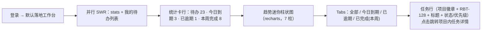

# 个人待办与已完成统计

| 元信息项 | 内容 |
| --- | --- |
| 文档编号 | RPT-001 |
| 所属迭代 | Sprint 1：MVP 能力补齐（第 3 周） |
| 优先级 | P1（MVP 必备级） |
| 所属模块 | M10-RPT 数据报表 |
| 文档状态 | 待评审（Draft） |
| 最后更新日期 | 2026-09-01 |
| 上游依据 | `docs/需求文档.md` §8.2 数据报表 P1 列（个人待办 / 已完成任务统计） |
| 前置依赖 | `TASK-001/002/003`（Issue 属性 / 筛选语义）、`COLLAB-001`（未读数）、`INFRA-004` |
| 下游依赖 | `RPT-002`（P2 项目进度 / 成员任务量统计复用聚合框架）、`RPT-003/004`（P3 敏捷报表）、需求池视图（P2） |
| 架构基线 | [`api-conventions.md`](../architecture/api-conventions.md) §4（信封）；[`unified-issue-model.md`](../architecture/unified-issue-model.md) §2.8（`completed_at` 口径、`idx_assignee_issue` 索引） |
| 竞品参考 | Plane（`/users/me/issues/` 我的工作项 + workspace 级聚合端点）、Ones（个人工时台账与绩效视图，P3+ 对齐） |

> **范围声明**：交付个人维度的「我的待办」工作台页与统计卡（待办 / 今日到期 / 已逾期 / 本周完成 + 7 日完成趋势）。项目进度、成员任务量、燃尽图等团队维度报表全部 P2+（`RPT-002/003`）；工时统计 P2 `TASK-006`。

---

## 1. 概述

### 1.1 功能定位

P1 的成员被派了一堆任务，但系统没有一处「以我为中心」的入口——他要在多个项目间来回切换找自己的卡。「我的待办」工作台页 + 统计卡把这个视角补上，同时让每天上班第一屏有决策价值：先处理今日到期与已逾期。工程上，本迭代交付一个**跨项目聚合查询范式**（`accessible_by` 之上按人聚合），P2 项目报表直接复用。

| 交付项 | 说明 |
| --- | --- |
| 统计端点 | `GET /api/v1/users/me/issues/stats/`：四个计数 + 7 日完成趋势序列 |
| 「我的待办」页 | 工作空间首页工作台：统计卡行 + 我的任务列表（按项目分组 / 筛选 Tabs） |
| 列表端点 | `GET /api/v1/workspaces/{slug}/issues/?assignee_id=me&…`（P0 已定义的跨项目聚合端点，本迭代点亮）复用 `TASK-003` 筛选语义 |
| 逾期口径 | `target_date < today ∧ state.group ∈ {unstarted, started}`（与看板 / 列表一致） |

### 1.2 目标用户

| 用户 | 场景 | 关注点 |
| --- | --- | --- |
| 全体成员 | 每日开工 | 一屏看清「欠账」：今日到期 / 逾期高亮 |
| 成员 | 周报素材 | 本周完成数与 7 日趋势截图可用 |

### 1.3 前置依赖说明

| 依赖文档 | 依赖内容 | 缺失后果 |
| --- | --- | --- |
| `TASK-003` | `IssueFilterSet`（`assignee_id=me` 等语义复用） | 口径漂移 |
| `unified-issue-model.md` §2.8 | `completed_at` 仅 completed 组写入的口径（`BOARD-002` BR-04 联动） | 趋势数据被取消态污染 |

### 1.4 竞品参考结论（详见第 6 章）

- **Plane**：`/api/users/me/issues/`（跨 workspace 聚合我的工作项，按 state 分组返回）；无独立统计卡，趋势靠 P2 cycles 报表。
- **Ones**：个人绩效视图（工时 / 完成率 / 响应时长），企业考核导向。
- **本系统**：P1 给「轻统计」（四卡 + 趋势），考核型指标刻意不做（避免过早引入绩效语义）。

---

## 2. 业务逻辑

### 2.1 统计口径（单一事实来源，全前端共用）

| 指标 | 口径（SQL 语义） |
| --- | --- |
| 我的待办 | `assignee = me ∧ state.group ∈ {unstarted, started} ∧ 未删未归档` |
| 今日到期 | 待办 ∧ `target_date = today` |
| 已逾期 | 待办 ∧ `target_date < today` |
| 本周完成 | `assignee = me ∧ completed_at ∈ [本周一 00:00, now]`（周一起始，时区按用户本地→服务端 UTC 折算日期） |
| 7 日趋势 | 近 7 天每日 `completed_at` 落当日数（含今日进行中为 0） |

> 全部计数均在 `Issue.objects.accessible_by(user)` 之上聚合——我的待办天然只含「我仍有权访问的项目」的任务（被移出项目的历史指派不计数，与可见性一致）。

### 2.2 工作台页结构逻辑



### 2.3 业务规则表

| 编号 | 规则 | 判定位置 | 违反后果 |
| --- | --- | --- | --- |
| BR-01 | 「我的待办」列表与统计共用同一 QuerySet 构造器（同一 Service），禁止两处手写口径 | Service 层 | 评审拒绝 |
| BR-02 | 已完成 Tab 仅显示 `completed_at` 本周内任务；取消态（`group=cancelled`）不计入完成 | Service | — |
| BR-03 | 多指派任务（P1 单人，P2 多人）对「我」的计数：`IssueAssignee` 存在即计 1（P2 多人不去重计数——按人视角天然正确） | ORM | — |
| BR-04 | 时区：`today` 以用户 profile 时区（默认 UTC+8）折算为 UTC 区间比较；跨日界任务归属正确 | Service | — |
| BR-05 | stats 端点响应 `Cache-Control: no-store`（实时性优先）；列表复用游标分页 | ViewSet | — |
| BR-06 | 统计接口 5 条聚合 SQL 封顶（4 计数合并为 1 条 `aggregate` + 趋势 1 条 `TruncDate` 分组 + 权限子查询），P95 < 100ms @ 10 万任务 | ORM | 性能门禁 |

### 2.4 异常处理表

| 异常场景 | 触发条件 | 表现 | 处理 |
| --- | --- | --- | --- |
| 无任何任务 | 新用户 | 空态插画「暂无待办，去项目创建任务」+ 新建入口 | — |
| stats 与列表短暂不一致 | 完成任务瞬间 | 卡片以 stats 为准，列表以查询为准，30s 内 SWR 收敛 | 可接受（非账务系统） |
| 跨时区日界 | 用户 UTC-5 | 今日到期按其本地日历 | BR-04 |

### 2.5 边界条件表

| 边界场景 | 限制值 | 超出处理方式 |
| --- | --- | --- |
| 我的待办列表 | 游标分页 50/页 | 加载更多 |
| 趋势序列 | 恒 7 点 | 无值日补 0 |
| 多项目任务分组 | 项目徽章排序按更新时间 | 无上限（游标控制） |

---

## 3. UI/UX 设计

### 3.1 工作台页布局（`/:workspaceSlug/` 首页改造）

| 区域 | 组件 | UI 组件 |
| --- | --- | --- |
| 欢迎行 | 「早上好，梁工」+ 日期 | — |
| 统计卡行 | 4 卡（图标 + 数字 + 标签；已逾期卡红色数字，今日到期橙） | `StatCard` |
| 趋势卡 | 「近 7 日完成」迷你柱状图（hover 显示日期与数） | `recharts BarChart` |
| 待办列表 | Tabs（全部 / 今日到期 / 已逾期 / 本周完成）+ 行列表 | `Tabs` / `IssueRow` |
| 通知摘要卡 | 未读数 + 最近 3 条（复用 `COLLAB-001` 数据） | `MiniNotification` |

### 3.2 交互细节表

| 交互动作 | 触发方式 | 反馈效果 | 加载态 / 空态 |
| --- | --- | --- | --- |
| 卡片点击 | 点「已逾期 1」 | 列表切到对应 Tab | — |
| 任务行点击 | 行点击 | 跳转项目任务详情（保留来源返回） | — |
| 手动刷新 | 下拉 / 刷新按钮 | stats + 列表并行 revalidate | 骨架卡 |

### 3.3 无障碍要求

- 统计数字为真实文本（非纯图形）；趋势图提供 `aria-label` 摘要（「近 7 日共完成 8 项」）。
- 卡片红 / 橙语义冗余图标（⚠ / 🕐）供色弱用户。

---

## 4. 技术架构

### 4.1 数据模型

零新增。消费 `Issue`（`completed_at` / `target_date` / `state__group`）与 `IssueAssignee.idx_assignee_issue`。

### 4.2 API 定义

**`GET /api/v1/users/me/issues/stats/?workspace=<slug>`**：

```json
{ "status": "success", "data": {
    "todo_count": 23,
    "due_today_count": 3,
    "overdue_count": 1,
    "completed_this_week_count": 8,
    "trend": [ { "date": "2026-08-26", "count": 1 }, { "date": "2026-08-27", "count": 2 },
               { "date": "2026-08-28", "count": 0 }, { "date": "2026-08-29", "count": 0 },
               { "date": "2026-08-30", "count": 1 }, { "date": "2026-08-31", "count": 2 },
               { "date": "2026-09-01", "count": 2 } ],
    "generated_at": "2026-09-01T09:00:00.000Z" } }
```

**列表复用**：`GET /api/v1/workspaces/acme/issues/?assignee_id=me&state_group=unstarted,started&order_by=target_date`（`state_group` 为本迭代新增参数：按 `State.group` 语义组过滤，供 Tabs 使用）。

### 4.3 核心逻辑

```python
class PersonalStatsService:
    def stats(self, user, *, workspace_id, tz) -> dict:
        base = Issue.objects.accessible_by(user).filter(
            issue_assignees__assignee=user,
            archived_at__isnull=True, project__workspace_id=workspace_id)
        today = timezone.localdate(zone=tz)
        open_states = State.objects.filter(group__in=["unstarted", "started"]).values("id")
        counts = base.aggregate(
            todo=Count("id", filter=Q(state_id__in=open_states)),
            due_today=Count("id", filter=Q(state_id__in=open_states, target_date=today)),
            overdue=Count("id", filter=Q(state_id__in=open_states, target_date__lt=today)),
            week_done=Count("id", filter=Q(completed_at__date__gte=monday(today))))     # 单条聚合
        trend = (base.filter(completed_at__date__gte=today - timedelta(days=6))
                      .annotate(d=TruncDate("completed_at")).values("d")
                      .annotate(c=Count("id")).order_by("d"))                            # 第 2 条
        return {**counts, "trend": self._pad_zero(trend, today)}
```

P2 演进位：本 Service 注入 `RPT-002`（换 project 维度 + 成员分组）与 P3 燃尽图（换时间序列口径），聚合框架不换。

### 4.4 前端实现

- `WorkbenchStore`：`stats`（SWR 60s revalidate + focus）、`myIssues`（Tab 切换换 key）。
- 统一日期：前端持用户时区（profile，默认 Asia/Shanghai），stats 请求带 `tz` 参数由后端折算。

---

## 5. 测试用例

### 5.1 单元测试

| 用例 ID | 测试目标 | 输入 | 预期输出 | 覆盖类型 |
| --- | --- | --- | --- | --- |
| UT-01 | 逾期口径 | 昨天截止未完成 | overdue=1 | 正常 |
| UT-02 | 取消不污染完成 | 拖入 cancelled | week_done 不计 | 正常 |
| UT-03 | 时区折算 | 用户 UTC-5 的今天 | due_today 按其日历 | 边界 |
| UT-04 | 权限内聚合 | 被移出项目的旧指派 | 不计数 | 安全 |
| UT-05 | 趋势补零 | 中间日无完成 | 序列含 0 点 | 边界 |
| UT-06 | SQL 条数 | 任一请求 | ≤ 5 条（assertNumQueries） | 性能 |

### 5.2 集成测试

| 用例 ID | 场景 | 前置条件 | 操作步骤 | 预期结果 |
| --- | --- | --- | --- | --- |
| IT-01 | 卡片-列表一致 | 造 3 逾期 | 点已逾期卡 | 列表恰 3 行 |
| IT-02 | 完成即时收敛 | 从待办勾选完成 | todo -1、week_done +1（revalidate 后） | — |
| IT-03 | 性能门禁 | 10 万任务 | stats 50 次 | P95 < 100ms |

### 5.3 E2E 测试

| 用例 ID | 用户场景 | 操作路径 | 验收标准 |
| --- | --- | --- | --- |
| E2E-01 | 每日开工 | 登录落地工作台 | 四卡 + 趋势 1 屏可见；点卡切 Tab |
| E2E-02 | 闭环回写 | 完成一条今日到期任务 | 卡片数字 3→2、逾期不变 |

---

## 6. 竞品深度对标

### 6.1 Plane 实现分析

`/users/me/issues/` 按 state 分组返回我的工作项；无独立四卡统计，趋势依赖 cycles（P2 概念）。其跨项目聚合端点即本系统 `workspaces/{slug}/issues/` 的原型——本迭代点亮该端点并叠加 `state_group` 参数。

### 6.2 Ones 实现分析

个人工时台账 / 绩效视图为 Business+ 能力，强调考核证据链。本系统 P1 刻意只做「自我管理」视角统计，不引入绩效语义（产品价值观决策，P3 工时管控 `TASK-013` 时再引入台账）。

### 6.3 本系统设计决策

1. **口径单源**：统计与列表共用 Service 构造器 + `completed_at` 口径联动 `BOARD-002`——杜绝「卡片 3 列表 5」的经典不一致。
2. **轻即是对的**：四卡 + 趋势 7 点，两三条 SQL、零新表、零新组件（recharts 已在技术栈）——P1 报表的性价比最优解。
3. **差异化价值**：把 Plane 分散的「我的 issues」聚合成有优先级语义的开工屏（逾期置顶红），是 MVP 留存体验的最后一环。

---

## 7. 里程碑与验收

### 7.1 交付物清单

| 类型 | 交付物 |
| --- | --- |
| Model / Migration | 无 |
| API 端点 | `GET /users/me/issues/stats/`；`GET /workspaces/{slug}/issues/` 点亮（含 `state_group` 参数） |
| 后端 | `PersonalStatsService`（时区折算 / 补零 / 单聚合） |
| 前端 | 工作台页（统计卡行 / 趋势图 / Tabs 列表 / 通知摘要卡） |
| 测试 | UT-01~06、IT-01~03、E2E-01~02 |

### 7.2 可操作演示的验收标准

1. 成员登录即见四卡与 7 日趋势；数字与「我的待办」列表逐 Tab 一致。
2. 有一条昨天截止的未完成任务时「已逾期」红卡计数为 1，点击直达该任务；完成后卡片即时收敛。
3. 拖入「已取消」的任务不出现在本周完成统计与趋势图中。
4. 10 万任务数据集下 stats 端点 P95 < 100ms，SQL 条数 ≤ 5。
