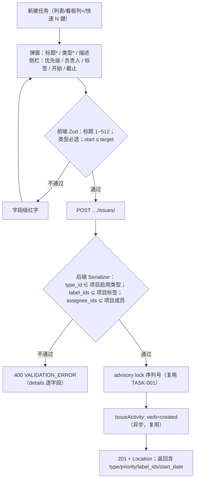
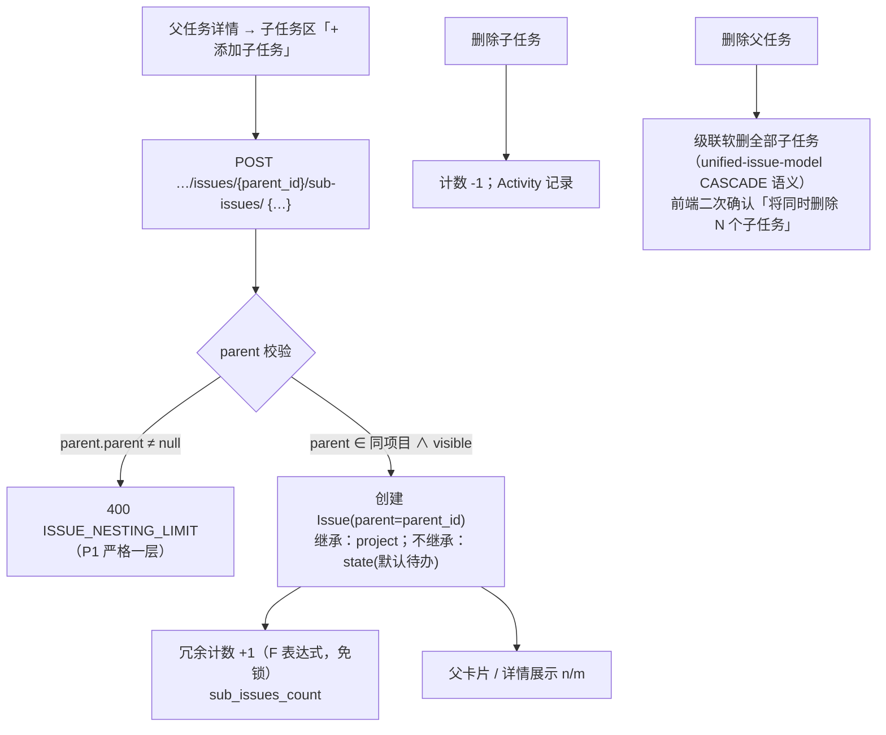

# 任务扩展属性与一级子任务

| 元信息项 | 内容 |
| --- | --- |
| 文档编号 | TASK-002 |
| 所属迭代 | Sprint 1：MVP 能力补齐（第 3 周） |
| 优先级 | P1（MVP 必备级） |
| 所属模块 | M4-TASK 任务核心（统一工作项） |
| 文档状态 | 待评审（Draft） |
| 最后更新日期 | 2026-09-01 |
| 上游依据 | `docs/需求文档.md` §3.4（优先级、任务类型、标签、子任务）、§3.4.1（统一工作项 / P1 任务类型切换与基础类型区分）、§8.2 任务核心 P1 列 |
| 前置依赖 | `TASK-001`（Issue CRUD / 5 固定字段 / `IssueActivity` 写入）、`PROJ-002`（成员候选集 / 指派人）、`AUTH-005`（权限矩阵）、`INFRA-004` |
| 下游依赖 | `TASK-003` / `BOARD-002`（本批字段全部进入筛选器）、`COLLAB-001`（类型徽章 / 指派通知）、`TASK-004`（P2 一级 → 多层子任务演进基线）、`TASK-008`（自定义字段沿用同一下拉渲染体系） |
| 架构基线 | [`unified-issue-model.md`](../architecture/unified-issue-model.md) §2.5（IssueType）/§2.7（Label）/§2.8（Issue 字段 P1 启用行）/§6（P0 能力分层——P1 只做开关翻转与回填，零 DDL）；[`dynamic-fields-design.md`](../architecture/dynamic-fields-design.md)（`cf_` 命名预留，P1 不启用） |
| 竞品参考 | Plane（优先级六档 / Label 项目级 / sub-issues 一级计数）、Ones（Issue Type 五类 + 类型图标色 + 类型字段模板） |

> **范围声明**：交付 P1 任务属性包：`issue_type`（转必填 + 5 内置类型开放）、`priority`、项目级标签、`start_date`、一级子任务（严格一层）、基础操作日志只读展示。多层级子任务（P2 `TASK-004`）、类型专属字段模板（P2）、按类型独立工作流（P3）、自定义字段（P2 `TASK-008`）不在范围。

---

## 1. 概述

### 1.1 功能定位

Sprint 0 的任务是「标题 + 描述 + 状态 + 负责人 + 截止时间」五字段裸模型。真实团队第一天就会问三件事：「这是需求还是缺陷？」（类型）、「哪个先做？」（优先级）、「大任务怎么拆？」（子任务）。本文档把 `unified-issue-model.md` 中已建好但未启用的列逐个「点亮」，并交付配套 UI。**核心工程价值：P0 一次性建齐全部列的架构决策在本迭代兑现——除 `User.intro` 外零 DDL，全部为功能开关翻转 + 一次数据回填迁移。**

| 交付项 | 说明 |
| --- | --- |
| 类型启用 | `issue_type` 由「建而不暴露」转为**创建时必填**；项目级 5 种内置类型（需求 / 缺陷 / 任务 / 测试 / 文档）全部开放（种子升级迁移）；存量 P0 任务回填为「任务」 |
| 优先级启用 | `none/low/medium/high/urgent` 五档；创建 / 编辑 / 列表 / 看板卡片 / 详情侧栏全链路 |
| 标签体系 | 项目级 `Label` CRUD（名称 + 颜色，`PROJ_ADMIN` 管理）；任务多选挂载 / 摘除（`IssueLabel`） |
| 开始时间 | `start_date` 启用；与 `target_date` 联合校验（`chk_issue_start_before_target` 已建） |
| 一级子任务 | `parent` 启用且**严格一层**（父不得再有父）；子任务列表、父卡片计数、父详情内嵌列表、创建入口 |
| 基础操作日志 | `GET …/issues/{id}/activities/` 只读时间线（P0 已在写入）；前端任务详情「动态」Tab 消费 |

### 1.2 目标用户

| 用户 | 场景 | 关注点 |
| --- | --- | --- |
| 全体成员 | 建任务 | 必须声明类型；快速给优先级与标签 |
| 需求 / 缺陷提出者 | 录入需求 / 缺陷 | 选「需求 / 缺陷」类型即完成录入（`glossary.md` 统一工作项） |
| 任务负责人 | 拆解执行 | 一级子任务跟踪自己的分步进度 |
| 全体 | 追溯 | 谁在什么时候改了什么（操作日志） |

### 1.3 前置依赖说明

| 依赖文档 | 依赖内容 | 缺失后果 |
| --- | --- | --- |
| `TASK-001` | `Issue` / `IssueAssignee` / `IssueActivity` 与 advisory lock 序列号 | 无基线 |
| `unified-issue-model.md` §2.5/§2.7/§6 | `IssueType` 五类定义（`ENABLED_ISSUE_TYPE_PHASES` 门控）、`Label` / `IssueLabel` 模型、P1 启用行约定 | 违反架构基线会引发 P2 返工 |
| `PROJ-002` | 项目成员（指派人候选） | 无法指派 |

### 1.4 竞品参考结论（详见第 6 章）

- **Plane**：优先级六档（none/low/medium/high/urgent/critical——本系统取五档）；Label 项目级；sub_issues_count 冗余计数；无强类型体系（EE 才有 Issue Type）。
- **Ones**：Issue Type 是一等公民（五类默认 + 可自定义 + 图标颜色 + 类型字段模板）。
- **本系统**：类型体系对齐 Ones（P1 开放五内置，P2 类型模板，P3 类型工作流）；标签与子任务计数对齐 Plane。

---

## 2. 业务逻辑

### 2.1 创建任务流程（属性全开后的新形态）



### 2.2 一级子任务规则



### 2.3 业务规则表

| 编号 | 规则 | 判定位置 | 违反后果 |
| --- | --- | --- | --- |
| BR-01 | `issue_type` 创建必填；`PATCH` 可改类型；类型必须属于当前项目且 `is_active` | Serializer | 400 `VALIDATION_ERROR / REQUIRED`、`INVALID` |
| BR-02 | 存量回填：P0 存量 Issue（type 为空）在迁移中回填项目「任务」类型；迁移幂等可重跑 | data migration | — |
| BR-03 | `priority` 五档枚举，默认 `none`；可随时改 | Serializer | 400 `INVALID` |
| BR-04 | 标签：`PROJ_ADMIN` 管理（增删改 / 16 进制颜色 / 排序）；任务挂载多选 ≤ 10；重复挂载幂等（`uniq_issue_label`） | Serializer + 约束 | 400 / 200 幂等 |
| BR-05 | 标签删除：若被任务引用，默认「停用」（`is_active=false`，卡片淡显）而非物理删；强制删需确认「从 N 个任务摘除」 | Service | — |
| BR-06 | `start_date ≤ target_date`（复用 `chk_issue_start_before_target`） | DB 约束 + Serializer | 400 `INVALID_DATE_RANGE` |
| BR-07 | 子任务严格一层：候选 parent 的 `parent_id` 必须为 null | Service | 400 `ISSUE_NESTING_LIMIT` |
| BR-08 | 子任务与父必须同项目（P1 不支持跨项目父子） | Service | 400 `INVALID` |
| BR-09 | 子任务状态独立于父（无自动联动；进度联动 P2 `TASK-004` 交付）；父卡片仅显示 n/m 完成计数 | — | — |
| BR-10 | 删除父任务级联软删子树（一层）+ 二次确认文案含数量 | Service + UI | — |
| BR-11 | `sub_issues_count` / `completed_sub_issues_count` 冗余计数用 `F() + 1/-1` 原子更新，避免 count(*) 实时聚合 | Service | — |
| BR-12 | 全部新属性变更进入 `IssueActivity` diff（`TRACKED_FK_FIELDS` 已含 `issue_type`/`parent`，`TRACKED_M2M` 已含 `labels`——P0 基线即写好，本迭代仅开放读取） | 异步 | — |
| BR-13 | 操作日志只读端点仅项目成员可读，游标分页，按 `epoch` 聚合展示 | Permission | 403/404 |

### 2.4 异常处理表

| 异常场景 | 触发条件 | HTTP / 错误码 | 前端表现 | 后端处理 |
| --- | --- | --- | --- | --- |
| 缺类型创建 | 未传 type_id | 400 `VALIDATION_ERROR/REQUIRED` | 类型选择器红字「请选择任务类型」 | — |
| 二层嵌套 | 父已有 parent | 400 `ISSUE_NESTING_LIMIT` | Toast「MVP 阶段子任务仅一层」 | — |
| 挂他人项目标签 | label_id 越界 | 400 `INVALID` | — | 序列化层校验 |
| 日期倒置 | start > target | 400 `INVALID_DATE_RANGE` | 截止字段红字 | — |
| 删除被引用标签（未确认强制） | 默认路径 | 200 停用 | 标签列表灰置「已停用」 | — |

### 2.5 边界条件表

| 边界场景 | 限制值 | 超出处理方式 |
| --- | --- | --- |
| 单任务标签数 | 10 | 400 `TOO_MANY` |
| 项目标签总数 | 100 | 400 `TOO_MANY` |
| 子任务数 / 父 | 100（P1） | 400 `TOO_MANY`（提示 P2 多层拆分） |
| 类型数 / 项目 | 5 内置，P1 不可自建（自建 P2） | 管理入口不开放 |
| 标题长度 | 512（`TASK-001` 基线） | 400 |

---

## 3. UI/UX 设计

### 3.1 页面布局

**创建 / 编辑弹窗**（复用 P0 骨架，扩展侧栏属性区）：

| 区域 | 组件 | UI 组件 |
| --- | --- | --- |
| 主区 | 标题*（大输入）/ Tiptap 描述 | `Input` / `@rp/editor` |
| 属性侧栏（右列，均行内编辑） | 类型*（图标+色点下拉）/ 优先级（旗形图标五档）/ 负责人（成员 AvatarSelect 单选）/ 标签（彩色 Tag 多选）/ 开始·截止（DateRange 双输入） | `PropertyRow` 系列 |
| 子任务区（详情内） | 「子任务 2/5」标题 + 进度微条 + 内联添加行 | `SubtaskList` |

**任务详情页新增 Tab**：「动态」（操作日志时间线，按 epoch 聚合：头像 +「将优先级从 中 改为 高」+ 相对时间）。

**卡片信息升级**（列表 & 看板，为 `BOARD-002` 预置）：

```
[类型图标色条] RBT-128 修复登录页 500        [P1 高 ▲] [⚑ bug 红]
[子任务 2/5 ▓▓░░] [🏷 前端] [👤 梁工] [📅 09-15]
```

### 3.2 交互细节表

| 交互动作 | 触发方式 | 反馈效果 | 加载态 / 空态 |
| --- | --- | --- | --- |
| 改类型 / 优先级 / 日期 | 侧栏行内选择 | 乐观更新徽章；失败回滚红点 | — |
| 标签管理 | 标签行「管理」→ 项目标签面板 | 增删改 / 颜色板（预设 12 色 + 自定义 hex） | 列表骨架 |
| 添加子任务 | 子任务区回车 | 新行划入；父计数 +1 动画 | — |
| 勾选子任务完成 | 行前 checkbox | 状态切已完成；`m` 计数 +1（n 不变） | — |
| 查看动态 | 详情切「动态」Tab | 时间线骨架 → 按 epoch 聚合分组 | 空态「暂无操作记录」 |

### 3.3 无障碍要求

- 优先级图标携带 `aria-label`（「高优先级」）；类型色条冗余文字缩写（REQ/BUG…）供色弱用户。
- 子任务 checkbox 为真实 `input[type=checkbox]`，键盘可操作；标签 Tag 可 Backspace 删除。

---

## 4. 技术架构

### 4.1 数据模型

**零新增表**。本迭代的全部「模型工作」是一次功能迁移（`00XX_p1_enable_issue_attributes.py`）：

```python
from django.db import migrations
from plane.db.seed.issue_types import BUILTIN_ISSUE_TYPES  # 5 类定义（unified-issue-model.md §2.5）

def enable(apps, schema_editor):
    IssueType = apps.get_model("db", "IssueType")
    Issue = apps.get_model("db", "Issue")
    # ① 对每个已有项目补齐 5 种内置类型（P0 仅种子「任务」）
    for project in apps.get_model("db", "Project").objects.all():
        for spec in BUILTIN_ISSUE_TYPES:
            IssueType.objects.get_or_create(project=project, is_epic=spec["key"], defaults=spec["fields"])
    # ② 存量 Issue 回填「任务」类型（幂等：仅处理 type__isnull=True）
    task_types = {it.project_id: it.id for it in IssueType.objects.filter(is_epic="task")}
    for issue in Issue.objects.filter(issue_type__isnull=True).iterator(chunk_size=500):
        issue.issue_type_id = task_types.get(issue.project_id)
        Issue.objects.filter(pk=issue.pk).update(issue_type_id=issue.issue_type_id)

def rollback(apps, schema_editor):
    # 回滚不删数据（列本就可空），仅恢复类型种子至 P0 门控状态
    ...
```

**`IssueType` 字段约定**（`unified-issue-model.md` §2.5 基线，本迭代消费）：`project` FK / `name` / `description` / `logo_props JSONB`（图标 + 颜色）/ `is_active` / `sort_order`；五内置：需求 `requirement`（蓝图紫）/ 缺陷 `bug`（红）/ 任务 `task`（蓝）/ 测试 `test`（绿）/ 文档 `document`（灰）。

**`Label`**（§2.7 基线）：`project` FK / `name` / `color`（hex）/ `sort_order` / `parent`（预留，P1 不用）；`IssueLabel` 中间表复合唯一。

### 4.2 API 定义

| 方法/路径 | 描述 | 权限 |
| --- | --- | --- |
| `GET …/projects/{project_id}/issue-types/` | 项目类型列表 | `project.read` |
| `GET\|POST …/projects/{project_id}/labels/` | 标签列表 / 创建 | 读：`project.read`；写：`project.label.manage` |
| `PATCH\|DELETE …/labels/{label_id}/` | 标签编辑 / 停用·强制删 | `project.label.manage` |
| `PUT …/issues/{issue_id}/labels/` | 全量替换任务标签集合（§3.2 唯一 PUT 白名单） | `issue.update` |
| `POST …/issues/` | 创建（新增 type_id/priority/label_ids/start_date） | `issue.create` |
| `PATCH …/issues/{issue_id}/` | 局部更新（含 type_id / priority / start_date） | `issue.update` |
| `GET\|POST …/issues/{issue_id}/sub-issues/` | 子任务列表 / 挂载创建 | `issue.create`（POST） |
| `DELETE …/issues/{issue_id}/sub-issues/{sub_id}/` | 摘除（软删子任务） | `issue.delete` |
| `GET …/issues/{issue_id}/activities/` | 操作日志（游标，?cursor=） | `project.read` |

**创建示例**：

```json
// POST /api/v1/workspaces/acme/projects/9d8e…/issues/
{ "name": "修复登录页 500", "type_id": "bug-type-id", "priority": "high",
  "assignee_ids": ["6c7d…"], "label_ids": ["lbl-fe"], "start_date": "2026-09-01",
  "target_date": "2026-09-03", "description_html": "<p>prod 环境 …</p>" }
// 201
{ "status": "success", "data": {
    "id": "8a1f…", "sequence_id": 128, "name": "修复登录页 500",
    "type_id": "bug-type-id", "priority": "high",
    "state_id": "待办-state-id", "assignee_ids": ["6c7d…"], "label_ids": ["lbl-fe"],
    "start_date": "2026-09-01", "target_date": "2026-09-03",
    "sub_issues_count": 0, "completed_sub_issues_count": 0, "created_at": "…" } }
```

**子任务挂载示例**：

```json
// POST …/issues/{parent_id}/sub-issues/  { "name": "定位 Nginx 413 配置", "type_id": "task-type-id" }
// 201 data 含 parent_id；父对象 sub_issues_count 由响应 meta 或前端乐观更新
```

**标签替换（PUT 白名单场景）**：

```json
// PUT …/issues/8a1f…/labels/   { "label_ids": ["lbl-fe", "lbl-urgent"] }
// 200 { "status":"success", "data": { "label_ids": ["lbl-fe","lbl-urgent"] } }
```

### 4.3 核心逻辑

```python
class IssueAttributeMixin:
    """P1 属性校验（Serializer 层）要点。"""

    def validate(self, attrs):
        project = self.context["project"]
        if "type_id" in attrs:
            if not IssueType.objects.filter(pk=attrs["type_id"], project=project, is_active=True).exists():
                self.fail_field("type_id", "INVALID", "任务类型不属于当前项目或已停用")
        if "label_ids" in attrs:
            valid = set(Label.objects.filter(pk__in=attrs["label_ids"], project=project).values_list("id", flat=True))
            if set(attrs["label_ids"]) - valid:
                self.fail_field("label_ids", "INVALID", "包含不属于当前项目的标签")
        if len(attrs.get("label_ids", [])) > 10:
            self.fail_field("label_ids", "TOO_MANY", "单个任务最多 10 个标签")
        # start/target 联合校验（DB CheckConstraint 兜底）
        start, target = attrs.get("start_date"), attrs.get("target_date") or self.instance and self.instance.target_date
        if start and target and start > target:
            self.fail_field("target_date", "INVALID_DATE_RANGE", "截止时间不能早于开始时间")
        return attrs


class SubIssueService:
    def create_sub(self, *, parent: Issue, payload, actor) -> Issue:
        if parent.parent_id is not None:                      # BR-07 一层限制
            raise AppException("VALIDATION_ERROR", message="子任务仅支持一层",
                               details=[{"field": "parent_id", "code": "INVALID"}])
        with transaction.atomic():
            sub = IssueService.create(project=parent.project, parent=parent, payload=payload, actor=actor)
            Issue.objects.filter(pk=parent.pk).update(sub_issues_count=F("sub_issues_count") + 1)
            return sub
```

**计数一致性**：`sub_issues_count` 增减均在创建 / 软删子任务的事务内以 `F()` 原子执行；若出现漂移（历史脏数据），详情端点返回的计数以 JSONB 注解 `Count()` 校准值兜底并打 warning 日志（自愈观测点）。

### 4.4 前端状态管理

- `IssueDraftStore`（创建弹窗）：`attributes {type_id*, priority, label_ids, ...}`；类型必填红点逻辑。
- `LabelStore`：项目标签列表 + CRUD；Tag 颜色即时预览。
- `IssueDetailStore` 扩展：`subIssues[]`、`activities[]`（SWR 各自 key：`/sub-issues/`、`/activities/`）；勾选完成走 `PATCH state`（复用 `BOARD-001` 状态机）。
- 类型 / 优先级 / 标签三选择器为 P2 `TASK-008` 自定义字段同族组件（`SingleSelectField` / `MultiTagField`），props 驱动数据源，本迭代以组件复用度 ≥ 80% 为设计约束。

---

## 5. 测试用例

### 5.1 单元测试

| 用例 ID | 测试目标 | 输入 | 预期输出 | 覆盖类型 |
| --- | --- | --- | --- | --- |
| UT-01 | 迁移回填幂等 | 跑两次 enable | 二次 0 行变更 | 迁移 |
| UT-02 | 类型必填 | 创建不带 type_id | 400 `REQUIRED` | 异常 |
| UT-03 | 跨项目类型 | type_id 属他项目 | 400 `INVALID` | 安全 |
| UT-04 | 优先级枚举 | priority=“critical” | 400 `INVALID` | 边界 |
| UT-05 | 标签上限 | 11 个 label_ids | 400 `TOO_MANY` | 边界 |
| UT-06 | 标签幂等挂载 | PUT 同集合两次 | 库中行数不变 | 正常 |
| UT-07 | 二层嵌套拦截 | 对子任务再挂子 | 400（`ISSUE_NESTING_LIMIT` 语义） | 边界 |
| UT-08 | 计数原子性 | 并发 10 挂 10 删 | 计数终值 = 真实行数 | 并发 |
| UT-09 | 日期倒置 | start=09-10, target=09-01 | 400 `INVALID_DATE_RANGE` | 异常 |
| UT-10 | 级联软删 | 删父（3 子） | 4 行 deleted_at 非空 | 正常 |
| UT-11 | Activity diff 覆盖新属性 | 改类型+优先级+标签 | 3+ 条 Activity（M2M 拆两条） | 正常 |
| UT-12 | 标签停用后挂载 | 挂 is_active=false 标签 | 400 `INVALID` | 边界 |

### 5.2 集成测试

| 用例 ID | 场景 | 前置条件 | 操作步骤 | 预期结果 |
| --- | --- | --- | --- | --- |
| IT-01 | P0 存量数据升级 | P0 库（含无类型任务） | 执行迁移 → 列表 | 全部显示「任务」类型，无 500 |
| IT-02 | 5 类型可用性 | 新建 5 任务各选一类 | — | 类型徽章正确；列表可区分 |
| IT-03 | 子任务全链路 | 父 + 5 子 | 勾 2 完成 | 父卡片 2/5；动态 Tab 有记录 |
| IT-04 | 操作日志权限 | 非成员读 activities | — | 404 |

### 5.3 E2E 测试

| 用例 ID | 用户场景 | 操作路径 | 验收标准 |
| --- | --- | --- | --- |
| E2E-01 | 录入一条缺陷 | 新建 → 类型=缺陷 → 高优先级 → 标签 bug | 卡片色条 + 徽章齐全；动态 Tab 首条「创建了任务」 |
| E2E-02 | 拆解执行 | 建父任务 + 3 子 | 逐一勾选完成；父 3/3；全程 ≤ 60s |
| E2E-03 | 标签治理 | 建标签→挂 3 任务→删除 | 默认停用；任务卡片标签淡显不消失 |

---

## 6. 竞品深度对标

### 6.1 Plane 实现分析

- 优先级：六档 TextChoices，卡片旗形图标。
- 标签：项目级 `Label`（name/color），任务侧栏多选；EE 有 workspace 级标签。
- 子任务：`parent` 自引用 + `sub_issues_count` 冗余计数；支持多层但 UI 预设一层展开。
- **劣势（对本系统）**：开源版无 Issue Type 概念，「需求 / 缺陷」只能靠标签模拟（`dynamic-fields-design.md` §竞品已论证其查询 / 必填 / 排序能力缺失）。

### 6.2 Ones 实现分析

Issue Type 体系是其统一工作项的招牌：五类默认 + 自定义 + 类型级字段模板 / 工作流 / 图标颜色。类型即一等公民，筛选器、报表、权限全部感知类型。**代价**：配置复杂度随自由度上升（P3 才开放自建类型正是为控制该复杂度）。

### 6.3 本系统设计决策

1. **类型采用 Ones 模型、开源版零成本交付**：P1 即把类型做成必填一等字段（Plane EE 才有的能力），且因 P0 已建列，本迭代只花「一次迁移 + 校验 + UI」的成本。
2. **一层限制是刻意的产品决策**：多层拆解的真实需求出现在 20+ 人团队（P2 `TASK-004` 递归 CTE 已预研），P1 强制一层让数据结构先稳定（防脏层级进入 P2 迁移）。
3. **标签默认停用而非物理删**：保护历史卡片语义可读，兼顾治理与安全。
4. **差异化价值**：类型（Ones）+ 标签 / 计数（Plane）+ 零 DDL 点亮（本系统架构红利），三方优点在一个迭代内收敛。

---

## 7. 里程碑与验收

### 7.1 交付物清单

| 类型 | 交付物 |
| --- | --- |
| Model / Migration | 功能迁移 1 份（类型种子升级 + 存量回填）；`Label.is_active` 若基线未含则补一列（核查 `INFRA-003` 后定） |
| API 端点 | §4.2 全部 9 个（新增 5、扩展 2、复用 2） |
| 后端 | `IssueAttributeMixin`、`SubIssueService`、标签停用策略、activities 只读端点 |
| 前端 | 属性侧栏（类型 / 优先级 / 标签 / 日期）、标签管理面板、子任务区、动态 Tab、卡片信息升级 |
| 测试 | UT-01~12、IT-01~04、E2E-01~03 |

### 7.2 可操作演示的验收标准

1. 新建任务不选类型无法提交；选择 5 种内置类型任意一种，卡片与详情图标色条正确。
2. P0 存量任务升级后全部显示「任务」类型，列表 / 看板 / 详情零报错，序列号不变。
3. 给任务打 2 标签、设高优先级、填开始 / 截止时间；动态 Tab 逐字段展示「谁把什么从什么改成了什么」。
4. 父任务下建 3 个子任务并勾选完成 2 个：父卡片显示 2/3；对子任务再挂子任务被拦截提示一层限制。
5. `PROJ_ADMIN` 新建 / 停用项目标签即时生效于全部任务的标签选择器；普通成员不可见管理入口（`AUTH-005` 联动）。
