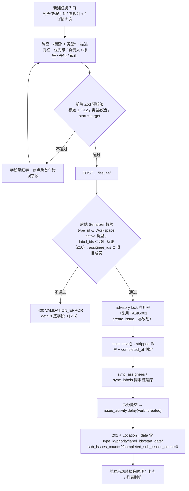
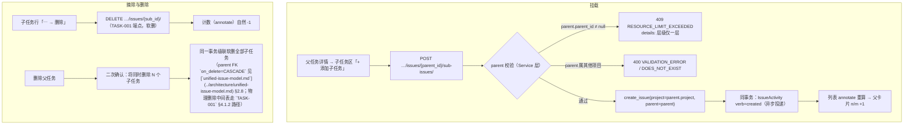
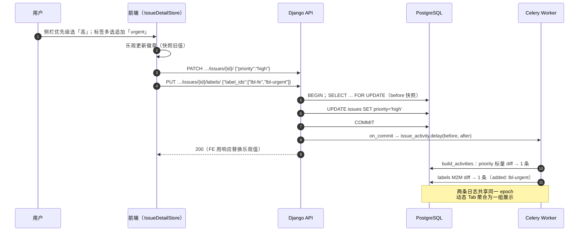
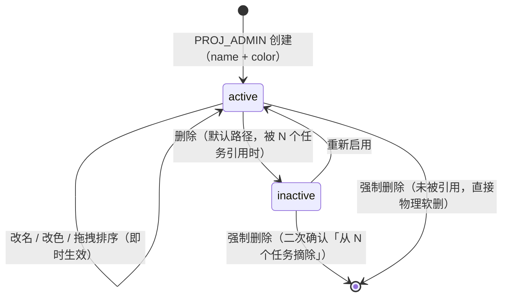
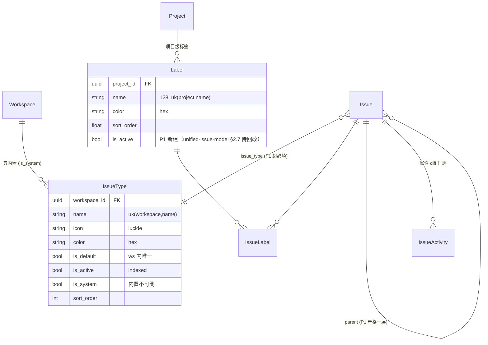

# 任务扩展属性与一级子任务

| 元信息项 | 内容 |
| --- | --- |
| 文档编号 | TASK-002 |
| 所属迭代 | Sprint 1：MVP 能力补齐（第 3 周） |
| 优先级 | P1（MVP 必备级 · **任务模块本迭代核心**） |
| 所属模块 | M4-TASK 任务核心（统一工作项） |
| 文档状态 | **已实现**（2026-09-04 · Sprint 1 后端实现落地 · 见 ADR-0012） |
| 最后更新日期 | 2026-09-01 |
| 上游依据 | `docs/需求文档.md` §3.4（优先级、任务类型、标签、子任务）、§3.4.1（统一工作项 / P1 任务类型切换与基础类型区分）、§8.2 任务核心 P1 列 |
| 前置依赖 | `TASK-001`（Issue CRUD / advisory lock 序列号 / IssueActivity 写入管道）、`PROJ-002`（项目成员候选集 / 指派人）、`AUTH-005`（权限矩阵与按钮门控）、`INFRA-004`（错误信封 / Celery 基线） |
| 下游消费 | `TASK-003` / `BOARD-002`（本批字段全部进入筛选器）、`COLLAB-001`（类型徽章 / 指派通知）、`TASK-004`（P2 一级 → 多层子任务演进基线）、`TASK-008`（自定义字段沿用同一下拉渲染体系） |
| 架构基线 | [`unified-issue-model.md`](../architecture/unified-issue-model.md) §2.5（IssueType，**Workspace 级**）/ §2.7（Label）/ §2.8（Issue 字段 P1 启用行）/ §5（内置类型与状态种子）/ §6（P0 能力分层——P1 只做开关翻转与回填）；[`api-conventions.md`](../architecture/api-conventions.md) §10.2（**计数字段一律 annotate，禁止冗余列**） |
| 竞品参考 | Plane（优先级五档 / Label 项目级 / sub-issues 计数 / 开源版无 Issue Type）、Ones（Issue Type 一等公民 + 类型图标色 + 类型字段模板） |
| 工作量估算 | 后端 3 人日 / 前端 3.5 人日 / 联调与测试 1.5 人日，合计 **8 人日** |

> **范围声明**：交付 P1 任务属性包：`issue_type`（转必填 + 5 内置类型开放）、`priority`、项目级标签、`start_date`、一级子任务（严格一层）、基础操作日志只读展示。多层级子任务（P2 `TASK-004`）、类型专属字段模板（P2）、按类型独立工作流（P3）、自定义字段（P2 `TASK-008`）不在范围。

---

## 1. 概述

### 1.1 功能定位

Sprint 0 的任务是「标题 + 描述 + 状态 + 负责人 + 截止时间」五字段裸模型。真实团队第一天就会问三件事：「这是需求还是缺陷？」（类型）、「哪个先做？」（优先级）、「大任务怎么拆？」（子任务）。本文档把 [`unified-issue-model.md`](../architecture/unified-issue-model.md) 中已建好但未启用的列逐个「点亮」，并交付配套 UI。

**核心工程价值：P0「一次性建齐核心列」的架构决策在本迭代主体兑现——`IssueType` / `priority` / `parent` / `IssueLabel` 等主体列由 P0 建齐、本迭代仅 API 暴露 + 校验 + UI（[`unified-issue-model.md`](../architecture/unified-issue-model.md) §6 与 [`sprint-overview.md`](./sprint-overview.md) §4 的口径：P1 仅开关翻转 + 种子数据补充 + 存量回填迁移）；`Label.is_active` 与 `idx_label_project_active` 为本迭代 P1 新建列 / 索引（[`unified-issue-model.md`](../architecture/unified-issue-model.md) §2.7 当前未声明 `is_active`，架构文档待回改追加——本表与该列的注册关系见 §4.1.2 / §4.1.4 注解；R4 评审发现并修复）。其余全部为功能开关翻转 + 种子数据升级 + 一次存量回填迁移。**

| 交付项 | 说明 |
| --- | --- |
| 类型启用 | `issue_type` 由「建而不暴露」转为**创建时必填**；Workspace 级 5 种内置类型（需求 / 缺陷 / 任务 / 测试 / 文档）全部开放（种子升级迁移）；存量 P0 任务回填为「任务」 |
| 优先级启用 | `none/low/medium/high/urgent` 五档；创建 / 编辑 / 列表 / 看板卡片 / 详情侧栏全链路 |
| 标签体系 | 项目级 `Label` CRUD（名称 + 颜色，`PROJ_ADMIN` 管理，默认停用而非物理删）；任务多选挂载 / 摘除（`IssueLabel`） |
| 开始时间 | `start_date` 启用；与 `target_date` 联合校验（`chk_issue_start_before_target` P0 已建） |
| 一级子任务 | `parent` 启用且**严格一层**（父不得再有父）；子任务列表、父卡片计数、父详情内嵌列表、创建入口 |
| 基础操作日志 | `GET …/issues/{id}/activities/` 只读时间线（P0 已在写入）；前端任务详情「动态」Tab 消费 |

### 1.2 P1 属性开放矩阵（关键约定）

> ⚠️ **本表是本文档最重要的技术约定**：全部列在 P0 已建（`TASK-001` §1.3），本迭代做的是「API 暴露 + 校验 + UI」三层点亮，Serializer 白名单逐字段放开。

| 字段 | P0 建列 | P0 建索引 | P1 API 暴露 | P1 前端展示 | 校验要点 | 后续迭代 |
| --- | --- | --- | --- | --- | --- | --- |
| `issue_type` | ✅ | ✅ `idx_issue_proj_type` | ✅（**创建必填**） | ✅ 图标 + 色条 | 属于本项目 Workspace 且 `is_active` | P2 类型模板 / P3 类型工作流 |
| `priority` | ✅ | ✅ B-Tree | ✅ | ✅ 旗形图标五档 | 五档枚举 | P2 进筛选排序（`TASK-003`） |
| `labels` | ✅（中间表） | ✅ 复合唯一 | ✅（`label_ids`） | ✅ 彩色 Tag 多选 | ⊆ 项目标签且 `is_active`；≤ 10 个 | P2 筛选 / P3 Workspace 级标签 |
| `start_date` | ✅ | — | ✅ | ✅ DateRange 输入 | `start ≤ target`（DB Check 兜底） | — |
| `parent` | ✅ | ✅ `idx_issue_parent` | ✅（`parent_id` + `sub-issues/` 端点） | ✅ 子任务区 + 计数徽标 | 严格一层；同项目 | P2 多层（`TASK-004` 递归 CTE） |
| `sub_issues_count` / `completed_sub_issues_count` | ❌ **不建列** | — | ✅（**annotate 实时计算**） | ✅ `n/m` 徽标 | — | P2 复用同一 annotate 口径 |
| `description_stripped` | ✅ | ✅ GIN trgm | ❌（仍只作服务端搜索源） | ❌ | — | `TASK-003` 点亮搜索 |
| `custom_fields` | ✅ | ✅ GIN | ❌ | ❌ | — | P2 `TASK-008` |
| `archived_at` | ✅ | ✅ 偏索引 | ❌ | ❌ | — | P2 `TASK-009` |

### 1.3 三条关键架构决策

#### 决策 1：`IssueType` 是 Workspace 级，不是项目级

依据 [`unified-issue-model.md`](../architecture/unified-issue-model.md) §2.5：类型定义挂在 Workspace（`workspace` FK），保证组织内类型语义统一——跨项目报表（如「全组织缺陷密度」）才能按同一类型记录聚合。P0 的种子函数 `seed_workspace_issue_types(workspace)` 按 `ENABLED_ISSUE_TYPE_PHASES` 门控仅创建「任务」，本迭代把门控翻为 `{"P0", "P1"}` 后补齐其余 4 类。项目级的类型子集启用（`ProjectIssueType` 关联表）是 P2 能力，P1 项目内可见类型 = 所属 Workspace 的全部 `is_active` 类型。

| `IssueType` 字段 | 类型 | 约束 | 五内置取值 |
| --- | --- | --- | --- |
| `workspace` | UUID FK | CASCADE，索引 | — |
| `name` | varchar(64) | `uk(workspace, name)` 偏唯一 | 需求 / 缺陷 / 任务 / 测试 / 文档 |
| `icon` | varchar(64) | lucide 图标名 | `sparkles` / `bug` / `circle-check` / `flask-conical` / `file-text` |
| `color` | varchar(9) | hex | `#8B5CF6` / `#EF4444` / `#3B82F6` / `#10B981` / `#F59E0B` |
| `is_default` | bool | Workspace 内唯一偏约束 | 仅「任务」为 `True` |
| `is_active` | bool | 索引 | 全 `True` |
| `is_system` | bool | 内置不可删 | 全 `True`（可改名改色停用） |
| `sort_order` | int | — | 1000 ~ 5000 |

#### 决策 2：子任务计数用 annotate，不建冗余列

[`api-conventions.md`](../architecture/api-conventions.md) §10.2 硬性规则：「计数字段用 annotate——`sub_issues_count` 等在 QuerySet 层 `annotate`，**禁止**在 SerializerMethodField 中查询（N+1 元凶）」，且**不建冗余计数列**（冗余列引入「计数漂移修复」这类运维负担，Plane 的 `sub_issues_count` 冗余列方案在生产中恰有此问题）。本迭代与 P2 `TASK-004` 共用同一对 annotate 表达式，口径永不漂移：

```python
# cancelled 不计入分子分母（BR-11 / SUB-04：2 完成 1 取消 → total=2, completed=2）
qs.annotate(
    sub_issues_count=Count("sub_issues",
        filter=Q(sub_issues__deleted_at__isnull=True)
              & ~Q(sub_issues__state__group="cancelled"), distinct=True),
    completed_sub_issues_count=Count("sub_issues",
        filter=Q(sub_issues__deleted_at__isnull=True,
                 sub_issues__state__group="completed"), distinct=True),
)
```

#### 决策 3：存量数据迁移必须幂等可重跑

P0 存量 Issue 的 `issue_type` 为 NULL。回填迁移只处理 `issue_type__isnull=True` 的行、逐项目映射「任务」类型 ID、`iterator(chunk_size=500)` 分批——重复执行时第二次 0 行变更（MIG-01 守护）。回滚不删数据（列本就可空），仅把类型种子恢复至 P0 门控状态。

### 1.4 范围边界

| 能力 | P1（本文档） | 后续 |
| --- | --- | --- |
| 类型必填 + 5 内置开放 + 存量回填 | ✅ | P2 自定义类型 / 类型字段模板；P3 类型工作流 |
| 优先级五档全链路 | ✅ | `TASK-003` 筛选与语义排序 |
| 项目标签 CRUD + 挂载 / 摘除 | ✅ | P2 标签筛选；P3 Workspace 级标签 |
| 标签停用（默认）/ 强制删（二次确认） | ✅ | — |
| `start_date` + 日期联合校验 | ✅ | — |
| 一级子任务（挂载 / 摘除 / 级联删 / 计数） | ✅ | P2 `TASK-004` 多层 + 防环 + 进度联动 |
| 操作日志只读时间线（动态 Tab） | ✅ | P2 `TASK-010` 全量字段审计；`COLLAB-003` 项目动态流 |
| 多层子任务 / 跨项目父子 | ❌ | `TASK-004` |
| 自定义字段 | ❌（列已建） | `TASK-008` |
| 类型级必填字段规则（如缺陷必填严重等级） | ❌ | P2 类型模板 |

### 1.5 前置依赖

| 依赖 | 内容 | 阻塞原因 |
| --- | --- | --- |
| `TASK-001` | `Issue` / `IssueAssignee` / `IssueActivity` 全部建齐；advisory lock 创建管道；`TRACKED_*_FIELDS` 已含 `priority` / `issue_type` / `parent` / `labels`（P0 基线即写好，本迭代零改动点亮） | 属性变更日志无写入管道则动态 Tab 无数据 |
| `unified-issue-model.md` §2.5/§5/§6 | `IssueType` 模型与五内置种子定义、`ENABLED_ISSUE_TYPE_PHASES` 门控、P1 启用行约定 | 违反基线会引发 P2 返工 |
| `PROJ-002` | 项目成员列表（指派人候选集） | 无法校验与选择负责人 |
| `AUTH-005` | `<PermissionGate>` 按钮门控（标签管理入口仅 `PROJ_ADMIN`） | 管理入口泄漏给普通成员 |
| `INFRA-002`/`INFRA-004` | Celery worker + RabbitMQ；统一错误信封 | 日志异步写入与错误响应格式 |

### 1.6 竞品参考

| 竞品 | 参考点 | 处置 |
| --- | --- | --- |
| Plane | 优先级五档（`none/low/medium/high/urgent`）与本项目完全同构；Label 项目级（name + color）；sub-issues 一级展开 | **三项完全对齐**（§6.1） |
| Plane | 开源版**无 Issue Type**（EE 商业特性）；`sub_issues_count` 冗余列 | 前者反向超越（P1 即开源交付类型）；后者改为 annotate（§1.3 决策 2） |
| Ones | Issue Type 一等公民：五类默认 + 自定义 + 图标颜色 + 类型字段模板 | 类型模型对齐 Ones（P1 五内置 / P2 模板 / P3 类型工作流），配置治理 P3 再评估 |

---

## 2. 业务逻辑

### 2.1 创建任务（属性全开后的新形态）



> 快速创建行（仅标题回车）在 P1 的行为变化：**类型缺省取项目默认类型「任务」**（前端补默认值后提交，用户无感），仍满足 TASK-001「1 分钟建 3 条」验收不回退。

### 2.2 一级子任务生命周期



**摘除 vs 删除**：P1 不提供「把子任务提升为顶层」的摘除操作（`PATCH parent_id=null` 留给 P2 `TASK-004` 的子树移动统一交付）；子任务脱离父级的唯一路径是删除后重建——这是一层限制下的刻意简化，避免 P1 出现「半移动」语义。

### 2.3 属性变更与 IssueActivity diff（sequenceDiagram）

以「把优先级从中改为高、并加一个标签」为例：



**标签走 `PUT` 集合替换而非 `PATCH` 追加**：这是 [`api-conventions.md`](../architecture/api-conventions.md) §3.2「PUT 仅限集合型子资源全量替换」的白名单场景之一（与 `assignees` 同类）——前端始终提交「完整标签集合」，服务端 diff 出增删，天然幂等且避免「追加 / 移除」两种动作端点分裂。

### 2.4 标签管理生命周期



| 状态 | 表现 |
| --- | --- |
| `active` | 标签选择器可选；卡片 Tag 正常色 |
| `inactive`（`is_active=false`） | 选择器隐藏；**已挂载卡片 Tag 保留但淡显**（历史语义可读）；不可再新挂载（400） |
| 强制删除 | 软删 `Label` 行 + 同事务软删全部 `IssueLabel` 关联；卡片 Tag 消失 |

### 2.5 业务规则表

| 编号 | 规则 | 判定位置 | 违反后果 |
| --- | --- | --- | --- |
| BR-01 | `issue_type` 创建必填；`PATCH` 可改类型；类型必须属于当前项目所属 Workspace 且 `is_active` | Serializer | 400 `VALIDATION_ERROR` + `REQUIRED` / `DOES_NOT_EXIST` |
| BR-02 | 存量回填：P0 存量 Issue（type 为空）在迁移中回填所属 Workspace「任务」类型；迁移幂等可重跑 | data migration | — |
| BR-03 | `priority` 五档枚举，默认 `none`；可随时改 | Serializer | 400 + 子码 `NOT_A_CHOICE` |
| BR-04 | 标签管理仅 `PROJ_ADMIN`+（含隐式 `WS_ADMIN`）；任务挂载多选 ≤ 10；重复挂载幂等（`uniq_issue_label`） | Permission + 约束 | 403 / 400 `TOO_LARGE` / 200 幂等 |
| BR-05 | 标签删除：被引用时默认「停用」（`is_active=false`，卡片淡显）而非物理删；强制删需确认「从 N 个任务摘除」 | Service + UI | — |
| BR-06 | `start_date ≤ target_date`（Serializer 先判 + `chk_issue_start_before_target` DB 兜底） | 双层 | 400 + 子码 `INVALID_DATE_RANGE` |
| BR-07 | 子任务严格一层：候选 parent 的 `parent_id` 必须为 null | Service | `409 RESOURCE_LIMIT_EXCEEDED`（`details` 注明层级上限 1） |
| BR-08 | 子任务与父必须同项目（P1 不支持跨项目父子） | Service | 400 + 子码 `DOES_NOT_EXIST` |
| BR-09 | 子任务状态独立于父（无自动联动）；父卡片仅显示 `n/m` 完成计数（annotate 口径，§1.3 决策 2） | ORM | — |
| BR-10 | 删除父任务：同一事务级联软删一层子树 + 前端二次确认文案含数量 | Service + UI | — |
| BR-11 | `sub_issues_count` / `completed_sub_issues_count` 由 QuerySet `annotate(Count, distinct=True)` 计算，**无冗余列、无定时校准任务**；`completed` 判定 = `state.group='completed'`，`cancelled` 不计入分子分母 | ORM | — |
| BR-12 | 全部新属性变更进入 `IssueActivity` diff（P0 基线 `TRACKED_SCALAR_FIELDS` 已含 `priority`/`start_date`、`TRACKED_FK_FIELDS` 已含 `issue_type`/`parent`、`TRACKED_M2M_FIELDS` 已含 `labels`——**代码零改动**，本迭代仅开放读取） | 异步 | — |
| BR-13 | 操作日志端点只读、仅项目成员可读、游标分页、按 `epoch` 聚合展示 | Permission | 404 / 403 |
| BR-14 | 停用类型（`is_active=false`）不出现在新建选择器；历史任务类型保留可读；`PATCH` 改为停用类型被拒 | Serializer | 400 + `DOES_NOT_EXIST` |
| BR-15 | 快速创建行不传类型时服务端兜底填 Workspace 默认类型（`is_default=True`，即「任务」） | Service | — |

### 2.6 异常处理表

| 异常场景 | 触发条件 | HTTP / 错误码 | 前端表现 | 后端处理 |
| --- | --- | --- | --- | --- |
| 缺类型创建 | 未传 `type_id` 且无默认兜底 | 400 `VALIDATION_ERROR` + `REQUIRED` | 类型选择器红字「请选择任务类型」 | — |
| 类型跨 Workspace / 已停用 | `type_id` 越域 | 400 + `DOES_NOT_EXIST` | 同上 | 序列化层校验 |
| 优先级非法 | `priority=critical` | 400 + `NOT_A_CHOICE` | 优先级下拉红框 | — |
| 二层嵌套 | 父已有 parent | 409 `RESOURCE_LIMIT_EXCEEDED` | Toast「MVP 阶段子任务仅支持一层」 | `details` 注明 `limit=1` |
| 挂他项目标签 | `label_id` 越域 | 400 + `DOES_NOT_EXIST` | 标签选择器过滤掉非法项 | 序列化层校验 |
| 挂停用标签 | `is_active=false` | 400 + `DOES_NOT_EXIST` | 选择器不展示停用项 | — |
| 标签超限 | 11 个 `label_ids` | 400 + `TOO_LARGE` | 多选器红字「最多 10 个」 | — |
| 日期倒置 | `start > target` | 400 + `INVALID_DATE_RANGE` | 截止字段红字 | DB CheckConstraint 兜底（理论不触达） |
| 标签名重复 | 同项目同名 | 409 `RESOURCE_ALREADY_EXISTS` | 表单字段级提示 | `uniq_label_name_per_project` |
| 非管理员建标签 | `PROJ_CONTRIBUTOR` POST labels | 403 `PERM_ROLE_INSUFFICIENT` | 管理入口不可见（`AUTH-005` 联动） | — |
| 子任务数达上限 | 单父 100 个子任务 | 400 + `TOO_LARGE` | 添加行禁用 + 提示 | — |

### 2.7 边界条件表

| 边界场景 | 限制值 | 超出处理方式 |
| --- | --- | --- |
| 单任务标签数 | 10 | 400 + `TOO_LARGE` |
| 项目标签总数 | 100 | 400 + `TOO_LARGE`（提示清理停用标签） |
| 子任务数 / 父 | 100（P1） | 400 + `TOO_LARGE`（提示 P2 多层拆分） |
| 类型数 / Workspace | 5 内置，P1 不可自建 | 管理入口不开放（P2 交付） |
| 标签名称长度 | 128（`uniq_label_name_per_project`） | 400 + `TOO_LONG` |
| 标题长度 | 512（`TASK-001` 基线） | 400 + `TOO_LONG` |
| 动态 Tab 分页 | 游标 30 条 / 页 | 「加载更多」 |
| 回填迁移批次 | 500 行 / chunk | `iterator` 流式处理，不锁全表 |

---

## 3. UI/UX 设计

### 3.1 创建 / 编辑弹窗（属性侧栏形态）

P0 的 `CreateIssueModal`（`TASK-001` §3.2.2）扩展为双栏：主区（标题 + 描述）+ 右侧属性栏（280px）。宽 920px。

```
┌──────────────────────────────────────────────────────────────────────────────┐
│  创建任务 · 兔子项目管理                                                   ✕  │
│                                                                              │
│  ┌──────────────────────────────────────────────┐ ┌──────────────────────┐  │
│  │ ● 缺陷 ▾（类型*，色点+图标+名称）              │ │ 优先级               │  │
│  ├──────────────────────────────────────────────┤ │ ┌──────────────────┐ │  │
│  │ 修复登录页 500                                │ │ │ ⚑ 高 ▾           │ │  │
│  │                                              │ │ └──────────────────┘ │  │
│  ├──────────────────────────────────────────────┤ │ 负责人                │  │
│  │ B I U ≡ ☰ ⌗ </> 🔗                          │ │ ┌──────────────────┐ │  │
│  ├──────────────────────────────────────────────┤ │ │ 👤 梁工 ▾         │ │  │
│  │ prod 环境登录必现 500，Nginx 413 日志…        │ │ └──────────────────┘ │  │
│  │                                              │ │ 标签                  │  │
│  │                                              │ │ ┌──────────────────┐ │  │
│  │                                              │ │ │ 🏷前端 ✕ ⚑urgent ✕ ＋│ │  │
│  │                                              │ │ └──────────────────┘ │  │
│  │                                              │ │ 开始 · 截止            │  │
│  │                                              │ │ ┌───────┐ ┌────────┐ │  │
│  │                                              │ │ │09-01 ▾│ │09-03 ▾ │ │  │
│  │                                              │ │ └───────┘ └────────┘ │  │
│  └──────────────────────────────────────────────┘ └──────────────────────┘  │
│                                                            ┌────┐ ┌───────┐│
│                                                            │ 取消 │ │ 创建  ││
│                                                            └────┘ └───────┘│
└──────────────────────────────────────────────────────────────────────────────┘
```

| 元素 | 规格 |
| --- | --- |
| 类型下拉（必填） | 选项 = Workspace `is_active` 类型，按 `sort_order`；每项「图标 + 色点 + 名称」；默认选中 `is_default`（任务）；停用类型不出现（BR-14） |
| 优先级下拉 | 五档旗形图标（`flag`），`none` 显示「无」；默认 `none` |
| 标签多选 | 项目 `active` 标签彩色 Tag；已选项可 `Backspace` 删除；「＋」展开面板（含「管理标签」入口，`PermissionGate` 包裹） |
| 开始 / 截止 | 双日期选择器联动：选完开始后截止的早于日期禁用（前端预校验 BR-06） |
| 必填标记 | 类型未选时「创建」按钮禁用 + 下拉描红 |
| P0 差异提示条 | 创建弹窗顶部 info 条，定稿文案「类型为必填项（P0 阶段仅标题必填）」；仅首次展示 |

### 3.2 任务详情 Drawer 属性区升级

P0 `IssuePeekDrawer`（720px）属性区从三项扩为七项，仍为「label 80px + 控件」行式布局：

```
│  状态        ┌────────────┐                                          │
│              │ ● 进行中 ▾ │                                          │
│  类型        ┌────────────┐                                          │
│              │ ● 缺陷   ▾ │                                          │
│  优先级      ┌────────────┐                                          │
│              │ ⚑ 高     ▾ │                                          │
│  负责人      ┌────────────┐                                          │
│              │ 👤 梁工  ▾ │                                          │
│  标签        [🏷前端] [⚑urgent] ＋                                    │
│  开始 · 截止  [09-01] → [09-03]                                       │
```

全部行内编辑、选中即提交（离散值语义，同 `TASK-001` §2.2 自动保存策略表）。

### 3.3 子任务区（详情 Drawer 内嵌）

```
┌──────────────────────────────────────────────────────────────────┐
│  子任务  2/5   ▓▓▓▓▓▓░░░░░░░░░                                   │
│  ┌────────────────────────────────────────────────────────────┐  │
│  │ ☑ 定位 Nginx 413 配置                        ●已完成  ⋯     │  │
│  │ ☑ 复查 proxy client_max_body_size             ●已完成  ⋯     │  │
│  │ ☐ 修复后回归登录链路                          ●待办    ⋯     │  │
│  │ ☐ 补充 e2e 用例                              ●待办    ⋯     │  │
│  │ ☐ 更新运维文档                                ●待办    ⋯     │  │
│  ├────────────────────────────────────────────────────────────┤  │
│  │ ＋ 添加子任务，回车保存…                        （此层不可再挂）│  │
│  └────────────────────────────────────────────────────────────┘  │
└──────────────────────────────────────────────────────────────────┘
```

| 元素 | 规格 |
| --- | --- |
| 标题行 | 「子任务 `m/n`」+ 8px 进度微条（`m/n` 百分比填充，全完成变绿） |
| 子任务行 | checkbox（真实 `input`）+ 标题（点击打开该子任务 Drawer，`?peekIssue` 替换）+ 状态徽章 + `⋯` 菜单（删除） |
| 勾选完成 | checkbox 勾选 → `PATCH state`（复用 `BOARD-001` 状态机端点）→ 徽章 / 微条即时更新（乐观） |
| 添加行 | 子任务名回车即建（`POST sub-issues/`，仅标题 + 继承父类型）；**子任务行不显示「+ 添加子任务」**（一层限制的 UI 表达） |
| 嵌套深度防御 | 对子任务打开的 Drawer 中，子任务区渲染「MVP 阶段子任务仅支持一层」提示条而非输入行 |

### 3.4 标签管理面板（`PROJ_ADMIN`）

```
┌──────────────────────────────────────────────────────────────┐
│  项目标签                                    ＋ 新建标签      │
│  ┌────────────────────────────────────────────────────────┐  │
│  │ ● 前端        #3B82F6   被 23 个任务使用     ✏   🗑      │  │
│  │ ● urgent      #EF4444   被 8 个任务使用      ✏   🗑      │  │
│  │ ● 已废弃需求   #9CA3AF   已停用 · 被 3 个任务引用  ↺ 强制删│  │
│  └────────────────────────────────────────────────────────┘  │
│  新建：[名称] [颜色板(12 预设 + 自定义 hex)]           [保存]  │
└──────────────────────────────────────────────────────────────┘
```

| 元素 | 规格 |
| --- | --- |
| 挂载形态 | 720px 弹窗；入口两处——列表 / 看板筛选条「标签」下拉尾部「管理标签」+ 项目设置页「标签管理」链接 |
| 列表 | 色点 + 名称 + 引用计数（`Count('issue_labels')` 实时）+ 编辑 / 删除 |
| 🗑 默认路径 | 被引用 → 二次确认后**停用**（行灰置、出现 ↺ 恢复与「强制删除」）；未被引用 → 直接软删 |
| 强制删除 | 红字确认「将从 N 个任务摘除该标签」，输入标签名二次确认（N > 50 时） |
| 颜色板 | 12 预设色 + 自定义 hex 输入（`#RRGGBB` 校验） |
| 排序 | 拖拽行排序（`sort_order` 浮点插值，复用 `TASK-001` 算法） |

### 3.5 卡片信息升级（列表 & 看板，为 `BOARD-002` 预置）

```
[▮红] RBT-128 修复登录页 500                          [⚑ 高] [🏷bug]
[子任务 2/5 ▓▓░░] [🏷前端] [👤梁工] [📅 09-15]
```

| 元素 | 规格 |
| --- | --- |
| 类型色条 | 卡片左缘 3px 竖条，取 `type.color`；冗余文字缩写（REQ/BUG/TSK/TST/DOC）供色弱用户（`aria-label`） |
| 优先级徽章 | 旗形图标 + 档位中文名；`none` 不显示 |
| 标签 Tag | 最多展示 3 个 + `+N` 溢出提示 |
| 子任务徽标 | `2/5` + 微条，无子任务不渲染 |

### 3.6 动态 Tab（操作日志时间线）

详情 Drawer Tab 条终态结构为「描述｜评论｜动态｜附件」四个 Tab，全部可点；「动态」本节交付，「评论」（`COLLAB-001`）与「附件」（`FILE-001`）本迭代内后续交付，交付前对应 Tab 显示各自空态：

```
┌──────────────────────────────────────────────┐
│  描述 | 评论 | 动态 | 附件                     │
├──────────────────────────────────────────────┤
│  👤梁工  刚刚                                  │
│    ⚑ 将 优先级 从 中 改为 高                   │
│    🏷 添加了标签 urgent                         │
│  👤梁工  2 小时前                              │
│    ● 将 状态 从 待办 改为 进行中                │
│  👤系统  09-01 11:22                           │
│    ✚ 创建了任务（类型：缺陷）                    │
│  ── 加载更多 ──                                │
└──────────────────────────────────────────────┘
```

按 `epoch` 聚合：同一次批量修改的多条日志归组到同一头像与时间下（`TASK-001` §4.3.3 的 `epoch` 机制消费端）。游标 30 条 / 页。

### 3.7 交互细节表

| 交互动作 | 触发方式 | 反馈效果 | 加载态 / 空态 |
| --- | --- | --- | --- |
| 改类型 / 优先级 / 日期 | 侧栏行内选择 | 乐观更新徽章；失败回滚红点 + toast | — |
| 标签挂载 / 摘除 | 多选器勾选 / Tag Backspace | `PUT` 全量替换；Tag 划入 / 划出动画 | — |
| 标签管理 | 标签行「管理」→ 面板 | 增删改 / 颜色即时预览 | 列表骨架 |
| 添加子任务 | 子任务区回车 | 新行划入 + 微条 / 计数 +1（乐观） | 失败移除行并恢复输入 |
| 勾选子任务完成 | 行前 checkbox | 状态切已完成（复用状态端点）；`m` 计数 +1 | — |
| 删除父任务 | `⋯` → 删除 | 确认文案「将同时删除 N 个子任务」 | — |
| 查看动态 | 详情切「动态」Tab | 时间线骨架 → epoch 聚合分组 | 空态「暂无操作记录」 |

### 3.8 空状态

| 场景 | 处置 |
| --- | --- |
| 子任务区无子任务 | 「暂无子任务，添加一个开始拆解」+ 输入行常驻 |
| 项目无标签（标签面板） | 「还没有标签」+ 新建表单常驻 |
| 动态 Tab 仅 1 条 | 正常展示创建记录，不显示「加载更多」 |
| 类型全部停用（极端） | 类型下拉空态「请联系管理员启用类型」；创建入口仍可用（兜底默认类型，BR-15 防御） |

### 3.9 响应式与无障碍

| 断点 | 布局 |
| --- | --- |
| ≥ 1280px | 弹窗双栏（主区 + 280px 属性栏）；Drawer 720px |
| 768 ~ 1279px | 弹窗属性栏折为主区下方网格（2 列）；Drawer `calc(100vw - 64px)` |
| < 768px | 属性区单列；子任务区 checkbox 增大触控热区（≥ 44px） |

无障碍：优先级图标携带 `aria-label`（「高优先级」）；类型色条冗余文字缩写；子任务 checkbox 为真实 `input[type=checkbox]` 键盘可操作；标签 Tag 可聚焦后 `Backspace` 删除；动态 Tab 时间线用 `<ol>` 语义列表。

---

## 4. 技术架构

### 4.1 数据模型

**本迭代主体零 DDL**（[`unified-issue-model.md`](../architecture/unified-issue-model.md) §6 P1 行明文「无 DDL（仅种子数据补充）」，[`sprint-overview.md`](./sprint-overview.md) §4 沿用同一口径）。**例外登记**：`Label.is_active` 列与 `idx_label_project_active` 复合索引为本迭代 P1 新建（unified-issue-model §2.7 当前 `Label` 模型定义不含 `is_active`，架构文档待回改追加——本表为该列与索引的合法登记位置；R4 评审发现并修复），由 §4.1.4 迁移同批 `AddField` + `AddIndex` 完成；其余模型定义全部引自架构基线（本节完整引用供本迭代开发者直用）。

#### 4.1.1 `IssueType`（[`unified-issue-model.md`](../architecture/unified-issue-model.md) §2.5）

```python
class IssueType(BaseModel):
    """任务类型定义 —— 对标 Ones 的 Issue Type

    Workspace 级定义（而非 Project 级），保证组织内类型语义统一；
    项目通过 ProjectIssueType 启用/停用类型子集（P2 引入）。
    """

    workspace = models.ForeignKey(
        Workspace, on_delete=models.CASCADE, related_name="issue_types", verbose_name="所属工作空间"
    )
    name = models.CharField(max_length=64, verbose_name="类型名称")
    description = models.TextField(blank=True, verbose_name="类型说明")
    icon = models.CharField(
        max_length=64, default="circle-dot", verbose_name="图标", help_text="lucide-react 图标名"
    )
    color = models.CharField(max_length=9, default="#6B7280", verbose_name="主题色",
                             help_text="#RRGGBB 或 #RRGGBBAA")

    is_default = models.BooleanField(default=False, verbose_name="是否默认类型",
                                     help_text="新建工作项时的默认选中项，Workspace 内唯一")
    is_active = models.BooleanField(default=True, db_index=True, verbose_name="是否启用",
                                    help_text="停用后不出现在新建入口，历史数据仍可查看")
    is_system = models.BooleanField(default=False, verbose_name="是否内置",
                                    help_text="内置 5 种类型可改名/改色，不可删除")
    sort_order = models.PositiveIntegerField(default=1000, verbose_name="显示排序")

    class Meta(BaseModel.Meta):
        db_table = "issue_types"
        verbose_name = "任务类型"
        ordering = ("sort_order", "created_at")
        constraints = [
            models.UniqueConstraint(
                fields=["workspace", "name"],
                condition=models.Q(deleted_at__isnull=True),
                name="uniq_issue_type_name_per_workspace",
            ),
            models.UniqueConstraint(
                fields=["workspace"],
                condition=models.Q(is_default=True, deleted_at__isnull=True),
                name="uniq_default_issue_type_per_workspace",
            ),
        ]
```

#### 4.1.2 `Label` 与 `IssueLabel`（§2.7 基线 + P1 补列）

```python
class Label(BaseModel):
    """标签 —— 项目级，Issue 通过 M2M 关联，一个 Issue 可打多个标签"""

    project = models.ForeignKey(
        Project, on_delete=models.CASCADE, related_name="labels", verbose_name="所属项目"
    )
    name = models.CharField(max_length=128, verbose_name="标签名称")
    color = models.CharField(max_length=9, default="#6B7280", verbose_name="标签颜色")
    sort_order = models.FloatField(default=65535.0, verbose_name="排序值")
    is_active = models.BooleanField(          # 【P1 新建 · 上游待回改项】unified-issue-model §2.7 当前
        default=True, db_index=True, verbose_name="是否启用",   # Label 定义未含 is_active，架构文档待回改追加；
        help_text="停用后不可新挂载；已挂载卡片淡显保留（BR-05）",   # 本字段由 §4.1.4 迁移同 AddField 落地（R4 修复）。
    )

    class Meta(BaseModel.Meta):
        db_table = "labels"
        verbose_name = "标签"
        ordering = ("sort_order",)
        constraints = [
            models.UniqueConstraint(
                fields=["project", "name"],
                condition=models.Q(deleted_at__isnull=True),
                name="uniq_label_name_per_project",
            )
        ]


class IssueLabel(BaseModel):
    """标签关联表"""

    issue = models.ForeignKey(Issue, on_delete=models.CASCADE, related_name="issue_labels")
    label = models.ForeignKey(Label, on_delete=models.CASCADE, related_name="issue_labels")

    class Meta(BaseModel.Meta):
        db_table = "issue_labels"
        constraints = [
            models.UniqueConstraint(fields=["issue", "label"], name="uniq_issue_label"),
        ]
```

#### 4.1.3 ER 关系（P1 视角）



#### 4.1.4 功能迁移（种子升级 + 存量回填，幂等）

```python
# apps/api/plane/db/migrations/00XX_p1_enable_issue_attributes.py
from django.db import migrations

from plane.db.seeds.issue_types import BUILTIN_ISSUE_TYPES  # §5.3 五类定义（含 min_phase）


def enable(apps, schema_editor):
    """P1 点亮：① 每个已有 Workspace 补齐 5 种内置类型；② 存量 Issue 回填「任务」。

    幂等性：① get_or_create；② 仅处理 issue_type__isnull=True 的行——
    重复执行时第二步命中 0 行（MIG-01 守护）。
    """
    IssueType = apps.get_model("db", "IssueType")
    Issue = apps.get_model("db", "Issue")

    # ① 类型种子：P0 仅「任务」，此处按 BUILTIN_ISSUE_TYPES 补齐全部 5 类
    for workspace in apps.get_model("db", "Workspace").objects.all():
        for spec in BUILTIN_ISSUE_TYPES:
            IssueType.objects.get_or_create(
                workspace=workspace, name=spec["name"],
                defaults={
                    "icon": spec["icon"], "color": spec["color"],
                    "sort_order": spec["sort_order"], "is_default": spec["is_default"],
                    "is_system": True, "is_active": True,
                },
            )

    # ② 存量回填：按 workspace 映射「任务」类型，分批流式更新
    task_types = dict(
        IssueType.objects.filter(is_system=True, name="任务").values_list("workspace_id", "id")
    )
    qs = Issue.objects.filter(issue_type__isnull=True).only("id", "issue_type").iterator(chunk_size=500)
    for issue in qs:
        type_id = task_types.get(issue.project.workspace_id)   # 经 project 取 ws（P0 数据必然存在）
        if type_id:
            Issue.objects.filter(pk=issue.pk).update(issue_type_id=type_id)


def rollback(apps, schema_editor):
    """回滚不删数据（列本就可空、类型记录无害），仅恢复 P0 门控：
    把「任务」以外的内置类型 is_active 置 False（下次正向迁移可再启用）。"""
    IssueType = apps.get_model("db", "IssueType")
    IssueType.objects.filter(is_system=True).exclude(name="任务").update(is_active=False)


class Migration(migrations.Migration):
    dependencies = [("db", "00XX_p0_initial")]
    operations = [
        # ①【P1 新建 · 上游待回改项】Label.is_active 列追加
        # （unified-issue-model §2.7 当前 Label 定义未含 is_active，架构文档待回改；
        # 本 AddField 为该列在本迭代的合法登记落地，R4 评审发现并修复）
        migrations.AddField(
            model_name="label",
            name="is_active",
            field=models.BooleanField(
                default=True, db_index=True, verbose_name="是否启用",
                help_text="停用后不可新挂载；已挂载卡片淡显保留（BR-05）",
            ),
        ),
        # ② 复合索引：标签选择器 WHERE project=? AND is_active=true 的核心查询
        # （P1 新建——与 is_active 列同批补建；统一服务 §4.1.2 模型定义注释）
        migrations.AddIndex(
            model_name="label",
            index=models.Index(
                fields=["project", "is_active"], name="idx_label_project_active",
            ),
        ),
        migrations.RunPython(enable, rollback),
    ]
```

配套开关翻转（无 DDL）：

```python
# apps/api/plane/settings/features.py —— P1 起
ENABLED_ISSUE_TYPE_PHASES: set[str] = {"P0", "P1"}   # P0 为 {"P0"}
EXPOSE_ISSUE_TYPE_SELECTOR: bool = True               # P0 为 False
```

新建 Workspace 的种子函数 `seed_workspace_issue_types` 无需改动——它本就按 `ENABLED_ISSUE_TYPE_PHASES` 门控，开关翻转后新 Workspace 自动获得全部 5 类。

### 4.2 索引核查表（全部 P0 已建，本迭代点亮）

| 索引 | 服务的查询 | P1 是否用到 |
| --- | --- | --- |
| `idx_issue_proj_type`（project, issue_type） | 类型筛选 / 需求池 / 缺陷列表（`TASK-003`） | ✅（被筛选消费） |
| `priority` 单列 B-Tree | 优先级筛选与权重排序 | ✅（`TASK-003`） |
| `idx_issue_parent`（parent） | 子任务列表 `WHERE parent_id=?` | ✅ **核心** |
| `uniq_issue_label`（issue, label）附带索引 | 标签反查（`TASK-003` `label_id` 筛选走 `issue` 前缀） | ✅ |
| `idx_label_project_active`（project, is_active）复合（**P1 新建**，与 `Label.is_active` 列同批落地，见 §4.1.4 注解；BR-MIG-07） | 标签选择器 `WHERE project=? AND is_active` | ✅ |
| `idx_activity_issue_time`（issue, created_at） | 动态 Tab 时间线 | ✅ |
| `idx_issue_desc_trgm` | 描述搜索 | ❌ `TASK-003` 点亮 |

### 4.3 API 定义

| # | 方法 | 路径 | 描述 | 权限 | 成功码 |
| --- | --- | --- | --- | --- | --- |
| 1 | `GET` | `…/projects/{project_id}/issue-types/` | 项目可用类型列表（= 所属 Workspace `is_active` 类型，P1 无项目级子集） | `PROJ_VIEWER`(5)+ | `200` |
| 2 | `GET` | `…/projects/{project_id}/labels/` | 标签列表（含 `is_active=false`，供淡显渲染） | `PROJ_VIEWER`(5)+ | `200` |
| 3 | `POST` | `…/projects/{project_id}/labels/` | 创建标签 | `PROJ_ADMIN`(20)+ | `201` |
| 4 | `PATCH` | `…/projects/{project_id}/labels/{label_id}/` | 改名 / 改色 / 排序 / 启停 | `PROJ_ADMIN`(20)+ | `200` |
| 5 | `DELETE` | `…/projects/{project_id}/labels/{label_id}/?force=false` | 默认停用；`force=true` 强制删（摘除全部关联） | `PROJ_ADMIN`(20)+ | `200` / `204` |
| 6 | `POST` | `…/projects/{project_id}/issues/` | 创建（新增 `type_id`/`priority`/`label_ids`/`start_date`） | `PROJ_CONTRIBUTOR`(15)+ | `201` |
| 7 | `PATCH` | `…/projects/{project_id}/issues/{issue_id}/` | 局部更新（含 `type_id` / `priority` / `start_date`） | `PROJ_CONTRIBUTOR`(15)+ | `200` |
| 8 | `PUT` | `…/projects/{project_id}/issues/{issue_id}/labels/` | 全量替换任务标签集合（**PUT 白名单场景**，§2.3） | `PROJ_CONTRIBUTOR`(15)+ | `200` |
| 9 | `GET` | `…/projects/{project_id}/issues/{issue_id}/sub-issues/` | 子任务列表（annotate 计数内含） | `PROJ_VIEWER`(5)+ | `200` |
| 10 | `POST` | `…/projects/{project_id}/issues/{issue_id}/sub-issues/` | 挂载创建子任务 | `PROJ_CONTRIBUTOR`(15)+ | `201` |
| 11 | `DELETE` | `…/projects/{project_id}/issues/{sub_id}/` | 删除子任务（软删，复用 `TASK-001` §4.2.6 端点；P1 无摘除，见 §2.2） | `PROJ_ADMIN`(20) 或子任务创建者 | `204` |
| 12 | `GET` | `…/projects/{project_id}/issues/{issue_id}/activities/` | 操作日志（游标 30/页） | `PROJ_VIEWER`(5)+ | `200` |

#### 4.3.1 标签与类型管理端点（Labels & Issue-Types Endpoints）

> 本节合并原 §4.3.1 / §4.3.1a 两个同名 `GET …/labels/` 子节，并按 HTTP 方法分子标题展开。
> §4.3 表行 2-5 + 12 个端点（4 标签写 + 1 类型读）的完整请求/响应契约见下文。

##### GET `…/projects/{project_id}/labels/`

```json
// 200（含 is_active=false 停用项，供卡片淡显与「管理标签」面板消费）
{ "status": "success",
  "data": [
    { "id": "lbl-fe", "name": "前端", "color": "#3B82F6",
      "is_active": true, "sort_order": 1024.0 },
    { "id": "lbl-urgent", "name": "urgent", "color": "#EF4444",
      "is_active": true, "sort_order": 2048.0 },
    { "id": "lbl-deprecated", "name": "已废弃需求", "color": "#9CA3AF",
      "is_active": false, "sort_order": 99999.0 }
  ],
  "meta": { "next_cursor": null, "prev_cursor": null,
            "next_page_results": false, "prev_page_results": false,
            "count": 3, "total_count": 3, "total_pages": 1,
            "page": 1, "per_page": 100 } }
```

##### POST `…/projects/{project_id}/labels/`

**请求**

```json
{ "name": "前端", "color": "#3B82F6" }
```

**成功响应 `201 Created`**

```json
{ "status": "success",
  "data": { "id": "lbl-fe", "name": "前端", "color": "#3B82F6",
            "is_active": true, "sort_order": 65535.0 } }
```

**失败响应 `409`（同名标签）**：`RESOURCE_ALREADY_EXISTS` + `details[0].code="DUPLICATE_NAME"`。

##### PATCH `…/projects/{project_id}/labels/{label_id}/`

**请求（改名 + 改色 + 排序）**

```json
{ "name": "前端基础", "color": "#10B981", "sort_order": 2048.0 }
```

**请求（启停切换）**

```json
{ "is_active": false }
```

**成功响应 `200`**：返回完整标签对象。

##### DELETE `…/projects/{project_id}/labels/{label_id}/`

**请求（默认停用，被引用）**

```http
DELETE …/labels/lbl-deprecated/?force=false HTTP/1.1
```

**成功响应 `200`**

```json
{ "status": "success",
  "data": { "result": "deactivated", "usage_count": 3 } }
```

**请求（强制删除）**

```http
DELETE …/labels/lbl-deprecated/?force=true HTTP/1.1
```

**成功响应 `204`**：响应体为空（`IssueLabel` 关联同步物理软删）。

##### GET `…/projects/{project_id}/issue-types/`

```json
// 200
{ "status": "success",
  "data": [
    { "id": "8c0d…", "name": "需求", "icon": "sparkles", "color": "#8B5CF6",
      "is_default": false, "sort_order": 1000 },
    { "id": "9d1e…", "name": "缺陷", "icon": "bug", "color": "#EF4444",
      "is_default": false, "sort_order": 2000 },
    { "id": "7f2a…", "name": "任务", "icon": "circle-check", "color": "#3B82F6",
      "is_default": true, "sort_order": 3000 },
    { "id": "5e3b…", "name": "测试", "icon": "flask-conical", "color": "#10B981",
      "is_default": false, "sort_order": 4000 },
    { "id": "4c4c…", "name": "文档", "icon": "file-text", "color": "#F59E0B",
      "is_default": false, "sort_order": 5000 }
  ] }
```

#### 4.3.2 `POST …/issues/`（属性全开形态）

**请求**

```json
{ "name": "修复登录页 500",
  "type_id": "9d1e…",
  "priority": "high",
  "assignee_ids": ["6c7d…"],
  "label_ids": ["lbl-fe", "lbl-urgent"],
  "start_date": "2026-09-01",
  "target_date": "2026-09-03",
  "description_html": "<p>prod 环境登录必现 500，Nginx 413 日志…</p>",
  "description_json": { "type": "doc", "content": [{ "type": "paragraph", "content": [
    { "type": "text", "text": "prod 环境登录必现 500，Nginx 413 日志…" }] }] } }
```

**成功响应 `201 Created`**（`Location` 头 + `ETag` 同 `TASK-001` §4.2.1）

```json
{ "status": "success",
  "data": {
    "id": "8a1f…", "project_id": "9d8e…", "project_identifier": "RBT",
    "sequence_id": 128, "issue_key": "RBT-128",
    "name": "修复登录页 500",
    "type_id": "9d1e…", "priority": "high",
    "state_id": "d2e3…",
    "assignee_ids": ["6c7d…"], "label_ids": ["lbl-fe", "lbl-urgent"],
    "start_date": "2026-09-01", "target_date": "2026-09-03",
    "parent_id": null,
    "sub_issues_count": 0, "completed_sub_issues_count": 0,
    "completed_at": null,
    "created_by": "6c7d…", "created_at": "2026-09-01T03:42:11.507Z",
    "updated_at": "2026-09-01T03:42:11.507Z" } }
```

**失败响应 `400`（缺类型——若客户端未做 BR-15 兜底直连 API）**

```json
{ "status": "error",
  "error": { "code": "VALIDATION_ERROR", "message": "请求参数校验失败",
    "details": [{ "field": "type_id", "code": "REQUIRED", "message": "任务类型为必填项" }],
    "request_id": "01JBX…" } }
```

**失败响应 `400`（标签越域）**

```json
{ "status": "error",
  "error": { "code": "VALIDATION_ERROR", "message": "请求参数校验失败",
    "details": [{ "field": "label_ids", "code": "DOES_NOT_EXIST",
                  "message": "包含不属于当前项目或已停用的标签" }],
    "request_id": "01JBX…" } }
```

#### 4.3.3 `PUT …/issues/{id}/labels/`（集合替换）

**请求**

```json
{ "label_ids": ["lbl-fe", "lbl-urgent"] }
```

**成功响应 `200`**

```json
{ "status": "success",
  "data": { "id": "8a1f…", "label_ids": ["lbl-fe", "lbl-urgent"] } }
```

**失败响应 `400`（标签停用后强制替换）**：`VALIDATION_ERROR` + `details[0].code="DOES_NOT_EXIST"` 指明停用标签名。重复提交相同集合 → `200` 且库中无变更（幂等，`uniq_issue_label` + diff 为空）。

#### 4.3.4 `POST …/issues/{parent_id}/sub-issues/`

**请求**

```json
{ "name": "定位 Nginx 413 配置", "type_id": "7f2a…" }
```

**成功响应 `201`**（`data.parent_id` 指向父；计数由父对象响应或前端乐观更新）

```json
{ "status": "success",
  "data": { "id": "b2c3…", "parent_id": "8a1f…", "sequence_id": 129,
            "issue_key": "RBT-129", "name": "定位 Nginx 413 配置",
            "type_id": "7f2a…", "state_id": "d2e3…", "priority": "none",
            "assignee_ids": [], "label_ids": [],
            "sub_issues_count": 0, "completed_sub_issues_count": 0 } }
```

**失败响应 `409`（二层嵌套）**

```json
{ "status": "error",
  "error": { "code": "RESOURCE_LIMIT_EXCEEDED", "message": "MVP 阶段子任务仅支持一层",
    "details": [{ "field": "parent_id", "code": "NESTING",
                  "message": "层级上限 1（P2 开放多层）" }],
    "request_id": "01JBX…" } }
```

#### 4.3.5 `GET …/issues/{id}/sub-issues/`

```json
{ "status": "success",
  "data": [
    { "id": "b2c3…", "sequence_id": 129, "issue_key": "RBT-129",
      "name": "定位 Nginx 413 配置", "state_id": "e3f4…", "state_group": "completed",
      "assignee_ids": ["6c7d…"], "sort_order": 65535.0 },
    { "id": "c3d4…", "sequence_id": 130, "issue_key": "RBT-130",
      "name": "修复后回归登录链路", "state_id": "d2e3…", "state_group": "unstarted",
      "assignee_ids": [], "sort_order": 131070.0 }
  ],
  "meta": { "next_cursor": null, "prev_cursor": null,
            "next_page_results": false, "prev_page_results": false,
            "count": 2, "total_count": 2, "total_pages": 1,
            "page": 1, "per_page": 100 } }
```

#### 4.3.6 `GET …/issues/{id}/activities/`

```json
{ "status": "success",
  "data": [
    { "id": "act-1…", "actor_id": "6c7d…", "verb": "updated", "field": "priority",
      "old_value": "medium", "new_value": "high",
      "comment": "更新了 优先级", "epoch": 1767290431507.0,
      "created_at": "2026-09-01T05:20:31.507Z" },
    { "id": "act-2…", "actor_id": "6c7d…", "verb": "updated", "field": "labels",
      "new_identifier": "lbl-urgent", "new_value": "urgent",
      "comment": "添加了 标签", "epoch": 1767290431507.0,
      "created_at": "2026-09-01T05:20:31.507Z" }
  ],
  "meta": { "next_cursor": "30:1:0", "prev_cursor": null,
            "next_page_results": true, "prev_page_results": false,
            "count": 2, "total_count": 12, "total_pages": 1,
            "page": 1, "per_page": 30 } }
```

#### 4.3.7 `PATCH …/issues/{issue_id}/`（属性全开形态）

**请求（改类型 + 优先级 + 开始时间）**

```json
{ "type_id": "9d1e…", "priority": "high", "start_date": "2026-09-02" }
```

**请求（清空开始时间）**

```json
{ "start_date": null }
```

**成功响应 `200`**：返回与 §4.3.2 同结构的完整 Issue 对象（`updated_at` 已刷新；类型 / 优先级变更触发 `IssueActivity` 异步日志，`epoch` 共享）。

**失败响应 `400`（优先级非法）**

```json
{ "status": "error",
  "error": { "code": "VALIDATION_ERROR", "message": "请求参数校验失败",
    "details": [{ "field": "priority", "code": "NOT_A_CHOICE", "message": "优先级取值非法" }],
    "request_id": "01JBX…" } }
```

**失败响应 `400`（日期倒置）**

```json
{ "status": "error",
  "error": { "code": "VALIDATION_ERROR", "message": "请求参数校验失败",
    "details": [{ "field": "target_date", "code": "INVALID_DATE_RANGE",
                  "message": "截止时间不能早于开始时间" }],
    "request_id": "01JBX…" } }
```

#### 4.3.8 `DELETE …/issues/{sub_id}/`（删除子任务）

**请求**

```http
DELETE /api/v1/workspaces/rabbitprojects/projects/7b3e9c1a-.../issues/b2c3…/ HTTP/1.1
```

**成功响应 `204`**：响应体为空。父任务 `sub_issues_count` / `completed_sub_issues_count` 由 annotate 自然 -1，列表与详情视图 SWR revalidate 收敛。

**失败响应 `403`（`PROJ_CONTRIBUTOR` 删他人创建的子任务）**

```json
{ "status": "error",
  "error": { "code": "PERM_DENIED", "message": "只能删除自己创建的子任务",
    "request_id": "01JBX…" } }
```

> 端点复用 `TASK-001` §4.2.6（子任务本身即 `Issue` 记录，`parent_id` 非空不影响删除语义；二级端点 `…/sub-issues/{sub_id}/` 不再单独提供，避免双端点命名漂移）。

### 4.4 核心逻辑

#### 4.4.1 `IssueAttributeMixin`（Serializer 层校验）

```python
# apps/api/plane/app/serializers/issue.py（P1 扩展段）
class IssueAttributeMixin:
    """P1 属性校验：类型 / 优先级 / 标签 / 日期联合。全部失败走 details[] 逐字段。"""

    MAX_LABELS_PER_ISSUE = 10

    def validate(self, attrs):
        project = self.context["project"]
        errors: list[dict] = []

        # ---- 类型（BR-01 / BR-14）----
        if (type_id := attrs.get("type_id")) is not None:
            if not IssueType.objects.filter(
                pk=type_id, workspace_id=project.workspace_id, is_active=True
            ).exists():
                errors.append(field_error("type_id", "DOES_NOT_EXIST",
                                          "任务类型不属于当前工作空间或已停用"))

        # ---- 优先级（BR-03）----
        if (priority := attrs.get("priority")) is not None and priority not in dict(Issue.Priority.choices):
            errors.append(field_error("priority", "NOT_A_CHOICE", "优先级取值非法"))

        # ---- 标签（BR-04）----
        if (label_ids := attrs.get("label_ids")) is not None:
            valid = set(Label.objects.filter(
                pk__in=label_ids, project=project, is_active=True
            ).values_list("id", flat=True))
            if invalid := set(label_ids) - valid:
                errors.append(field_error("label_ids", "DOES_NOT_EXIST",
                                          "包含不属于当前项目或已停用的标签"))
            if len(label_ids) > self.MAX_LABELS_PER_ISSUE:
                errors.append(field_error("label_ids", "TOO_LARGE",
                                          f"单个任务最多 {self.MAX_LABELS_PER_ISSUE} 个标签"))

        # ---- 日期联合（BR-06；DB CheckConstraint 兜底）----
        start = attrs.get("start_date") or (self.instance and self.instance.start_date)
        target = attrs.get("target_date") or (self.instance and self.instance.target_date)
        if start and target and start > target:
            errors.append(field_error("target_date", "INVALID_DATE_RANGE",
                                      "截止时间不能早于开始时间"))

        if errors:
            raise AppValidationError(errors)
        return attrs
```

#### 4.4.2 `SubIssueService`（一层限制 + annotate 计数口径）

```python
# apps/api/plane/db/services/sub_issue.py
MAX_SUB_ISSUES_PER_PARENT = 100          # P1 边界（§2.7）

class SubIssueService:

    @transaction.atomic
    def create_sub(self, *, parent: Issue, payload: dict, actor_id: uuid.UUID) -> Issue:
        # BR-07：严格一层 —— 候选父不得再有父
        if parent.parent_id is not None:
            raise AppException(
                code="RESOURCE_LIMIT_EXCEEDED", http_status=409,
                message="MVP 阶段子任务仅支持一层",
                details=[{"field": "parent_id", "code": "NESTING", "message": "层级上限 1"}],
            )
        # BR-08：同项目（parent 来自当前项目作用域查询，此处防御式复核）
        if payload.get("project_id") and payload["project_id"] != str(parent.project_id):
            raise AppValidationFieldError("parent_id", "DOES_NOT_EXIST", "父子任务必须属于同一项目")
        # 边界：单父上限
        if parent.sub_issues_count >= MAX_SUB_ISSUES_PER_PARENT:
            raise AppValidationFieldError("parent_id", "TOO_LARGE",
                                          f"单个任务最多 {MAX_SUB_ISSUES_PER_PARENT} 个子任务")

        # 复用 TASK-001 的创建管道（advisory lock / stripped 派生 / activity 投递）
        return create_issue(
            project_id=parent.project_id, actor_id=actor_id,
            payload={**payload, "parent": parent},
        )
```

**计数不在此处维护**——`sub_issues_count` 由列表 / 详情 QuerySet 的 annotate 统一提供（§1.3 决策 2）：

```python
# apps/api/plane/app/views/issue.py（get_queryset 扩展段）
def get_queryset(self):
    qs = super().get_queryset().select_related("state", "issue_type") \
        .annotate(
            # cancelled 不计入分子分母（BR-11 / SUB-04 口径联动 TASK-001 §4.2.2 / §4.3.1）
            sub_issues_count=Count("sub_issues",
                filter=Q(sub_issues__deleted_at__isnull=True)
                      & ~Q(sub_issues__state__group="cancelled"), distinct=True),
            completed_sub_issues_count=Count("sub_issues",
                filter=Q(sub_issues__deleted_at__isnull=True,
                         sub_issues__state__group="completed"), distinct=True),
        )
    if parent_id := self.kwargs.get("parent_id"):        # sub-issues 端点
        qs = qs.filter(parent_id=parent_id)
    return qs
```

#### 4.4.3 `LabelService`（停用优先的删除策略）

```python
class LabelService:

    def delete(self, *, label: Label, force: bool) -> dict:
        """BR-05：被引用时默认停用；force=True 才物理（软）删并摘除全部关联。"""
        usage = label.issue_labels.filter(deleted_at__isnull=True).count()
        if usage and not force:
            label.is_active = False
            label.save(update_fields=["is_active", "updated_at"])
            return {"result": "deactivated", "usage_count": usage}
        with transaction.atomic():
            label.issue_labels.update(deleted_at=timezone.now())     # 摘除全部关联
            label.deleted_at = timezone.now()                        # 软删标签本体
            label.save(update_fields=["deleted_at"])
        return {"result": "deleted", "usage_count": usage}
```

#### 4.4.4 IssueActivity 对新字段的覆盖（零改动点亮）

`TASK-001` §4.3.3 的 P0 基线已把 `priority` / `start_date` 写入 `TRACKED_SCALAR_FIELDS`、`issue_type` / `parent` 写入 `TRACKED_FK_FIELDS`、`labels` 写入 `TRACKED_M2M_FIELDS`。P1 开放这些字段后，日志自动产生，**服务层零代码改动**——这是 P0「代码按全量字段实现」约定的直接兑现。动态 Tab 前端按 `epoch` 聚合（§3.6）。

### 4.5 前端实现

#### 4.5.1 `LabelStore`

```typescript
// packages/shared-state/src/label/label.store.ts
import { action, computed, makeObservable, observable, runInAction } from "mobx";
import type { ILabel } from "@rp/types";

export class LabelStore {
  labelsByProject: Record<string, ILabel[]> = {};
  isLoading = false;

  constructor(private rootStore: RootStore) {
    makeObservable(this, {
      labelsByProject: observable,
      isLoading: observable.ref,
      activeLabels: computed,
      fetchLabels: action,
      upsert: action,
    });
  }

  /** 选择器数据源：仅 active（BR-05 停用项不出现在新挂载入口） */
  get activeLabels(): ILabel[] {
    const pid = this.rootStore.project.currentProjectId;
    return (this.labelsByProject[pid] ?? []).filter((l) => l.is_active);
  }

  /** 含停用：标签管理面板与卡片淡显渲染用 */
  allLabels = (projectId: string): ILabel[] => this.labelsByProject[projectId] ?? [];

  fetchLabels = async (workspaceSlug: string, projectId: string) => { /* SWR 注入，略 */ };
  upsert = (projectId: string, label: ILabel) => { /* 乐观更新，略 */ };
}
```

#### 4.5.2 子任务区与动态 Tab（`IssueDetailStore` 扩展）

```typescript
// apps/web/core/store/issue/detail.store.ts（P1 扩展段）
export class IssueDetailStore {
  subIssues: IIssue[] = [];
  activities: IIssueActivity[] = [];
  activeTab: "description" | "activity" = "description";

  /** 勾选子任务完成：复用状态端点（BOARD-001 状态机），计数由 annotate 语义自然更新 */
  toggleSubIssueDone = async (sub: IIssue, done: boolean) => {
    // unified-issue-model §2.6 仅定义单一 state FK + group 枚举，不存在 per-state 字段；
    // 目标态从父项目状态集缓存按 group 推导（done → 'completed'，否则取 is_default 默认态）
    const states = this.rootStore.project.statesByProject[sub.project_id] ?? [];
    const nextState = done
      ? states.find((s) => s.group === "completed")
      : states.find((s) => s.is_default);
    if (!nextState) throw new Error("project state set not loaded");
    await this.rootStore.issue.updateIssue(ws, sub.project_id, sub.id, {
      state_id: nextState.id,
    });
    // 乐观：父 Drawer 内 subIssues[].state_group 即时更新，n/m 徽标为 computed
  };
}
```

SWR keys：

```typescript
export const SUB_ISSUES_KEY = (ws: string, pid: string, issueId: string) =>
  `/api/v1/workspaces/${ws}/projects/${pid}/issues/${issueId}/sub-issues/`;
export const ISSUE_ACTIVITIES_KEY = (ws: string, pid: string, issueId: string, cursor?: string) =>
  `/api/v1/workspaces/${ws}/projects/${pid}/issues/${issueId}/activities/${cursor ? `?cursor=${cursor}` : ""}`;
```

#### 4.5.3 属性选择器组件族（P2 复用约束）

类型 / 优先级 / 标签三选择器实现为 `SingleSelectField` / `EnumSelectField` / `MultiTagField`——props 驱动数据源（`options` / `value` / `onChange`），不内嵌业务请求。它们是 P2 `TASK-008` 自定义字段动态表单的同族组件，**本迭代以组件复用度 ≥ 80% 为设计约束**（`TASK-008` 的 select / multi_select / member 类型直接换数据源复用）。

#### 4.5.4 组件清单

| 组件 | 路径 | 职责 |
| --- | --- | --- |
| `TypeSelect` | `core/components/issue/type-select.tsx` | 类型下拉（图标 + 色点 + 名称；停用项不出现） |
| `PrioritySelect` | `core/components/issue/priority-select.tsx` | 五档旗形下拉 |
| `LabelMultiSelect` | `core/components/issue/label-multi-select.tsx` | 标签多选 + 管理入口（`PermissionGate`） |
| `DateRangeInput` | `core/components/issue/date-range-input.tsx` | 开始 / 截止联动（早于日期禁用） |
| `LabelManagePanel` | `core/components/label/manage-panel.tsx` | §3.4 标签管理面板 |
| `SubtaskList` | `core/components/issue/subtask-list.tsx` | §3.3 子任务区（含一层限制提示） |
| `SubtaskProgress` | `core/components/issue/subtask-progress.tsx` | `n/m` 徽标 + 微条 |
| `ActivityTimeline` | `core/components/issue/activity-timeline.tsx` | 动态 Tab（epoch 聚合） |
| `IssueCardMeta` | `core/components/issue/card-meta.tsx` | §3.5 卡片信息升级（列表 & 看板共用） |

---

## 5. 测试用例

### 5.1 迁移与回填（MIG-*）

| # | 用例 | 操作 | 预期 |
| --- | --- | --- | --- |
| MIG-01 | **回填幂等** | 对同一 P0 快照库连续执行两次 `enable` | 第二次 0 行 `issue_type` 变更；无异常 |
| MIG-02 | 存量全部回填 | P0 库 1000 条无类型任务 | 迁移后 `issue_type__isnull=True` 计数为 0；全部为所属 Workspace「任务」类型 |
| MIG-03 | 序列号不变 | 迁移前后对比 `sequence_id` | 逐行一致（迁移不触碰编号） |
| MIG-04 | 五类型补齐 | 迁移后按 Workspace 查 `issue_types` | 每个 Workspace 恰 5 条 `is_system=True`，`is_default` 唯一且为「任务」 |
| MIG-05 | 大库流式回填 | 5 万条存量（mock） | 迁移内存占用平稳（`iterator` 生效）；无长事务锁告警 |
| MIG-06 | 回滚可执行 | `rollback` 后再 `enable` | 状态复原；数据无损 |
| MIG-07 | `Label.is_active` 加列（P1 新建） | 迁移后查 `information_schema` | 列存在，默认 `true`；`labels(project, is_active)` 复合索引存在（unified-issue-model §2.7 架构文档待回改，本迁移为该列 / 索引的合法登记） |

### 5.2 类型与优先级（ATTR-*）

| # | 用例 | 操作 | 预期 |
| --- | --- | --- | --- |
| ATTR-01 | 创建缺类型（绕过前端兜底直连） | `POST` 无 `type_id` | `400` + `details[0]={"field":"type_id","code":"REQUIRED"}` |
| ATTR-02 | 快速创建兜底 | 前端快速行仅标题 | 提交 payload 含 `is_default` 类型 id；`201` |
| ATTR-03 | 跨 Workspace 类型 | 传他 Workspace 的 type_id | `400` + `DOES_NOT_EXIST` |
| ATTR-04 | 停用类型 | `PATCH is_active=false` 后创建引用 | `400` + `DOES_NOT_EXIST`（BR-14） |
| ATTR-05 | 停用类型的历史任务可读 | 停用后 GET 该类型存量任务 | `200`，`type_id` 保留 |
| ATTR-06 | 优先级非法值 | `priority="critical"` | `400` + `NOT_A_CHOICE` |
| ATTR-07 | 优先级五档合法 | 逐一提交五档 | 全部 `201`；默认 `none` |
| ATTR-08 | PATCH 改类型 | 任务 → 需求 | `200`；Activity 1 条 `field="issue_type"`（含双 identifier） |
| ATTR-09 | 内置类型不可删 | `DELETE issue-types/{id}`（P1 无此端点，直连测 Permission） | `405` / 端点不存在 |
| ATTR-10 | `start_date` 晚于存量 `target_date`（违反 `start ≤ target`） | `PATCH start_date` 晚于已有 `target_date` | `400` + `INVALID_DATE_RANGE` |

### 5.3 标签（LBL-*）

| # | 用例 | 操作 | 预期 |
| --- | --- | --- | --- |
| LBL-01 | 创建标签 | `POST {name:"前端",color:"#3B82F6"}` | `201`；`is_active=true` |
| LBL-02 | 同项目重名 | 二次创建同名 | `409 RESOURCE_ALREADY_EXISTS` |
| LBL-03 | 名称越界 | 129 字符 | `400` + `TOO_LONG` |
| LBL-04 | 挂载任务 | `PUT labels` 两个 id | `200`；`IssueLabel` 2 行 |
| LBL-05 | 幂等替换 | 相同集合 `PUT` 两次 | 第二次 `200` 且库无变更、Activity 0 条 |
| LBL-06 | 越域标签 | 他项目 label_id | `400` + `DOES_NOT_EXIST` |
| LBL-07 | 超限挂载 | 11 个 id | `400` + `TOO_LARGE` |
| LBL-08 | 默认删除=停用 | 删被 3 任务引用的标签 | `200 {result:"deactivated"}`；卡片 Tag 淡显保留；新挂载被拒 |
| LBL-09 | 强制删除 | `?force=true` | 关联 `IssueLabel` 全部软删；`204`；卡片 Tag 消失 |
| LBL-10 | 停用后恢复 | `PATCH is_active=true` | 选择器重新出现；历史关联不恢复（需重挂） |
| LBL-11 | 权限 | `PROJ_CONTRIBUTOR` POST labels | `403 PERM_ROLE_INSUFFICIENT` |
| LBL-12 | 隐式管理员 | `WS_ADMIN`（非项目成员）POST labels | `201`（rbac §2.4 例外） |
| LBL-13 | Activity diff | 替换 `[a]` → `[a,b]` | 1 条 `field="labels"` added 记录；`[a]`→`[c]` 产生 2 条 |

### 5.4 子任务（SUB-*）

| # | 用例 | 操作 | 预期 |
| --- | --- | --- | --- |
| SUB-01 | 挂载成功 | 父下建子 | `201`；`parent_id` 正确；`sequence_id` 续父项目序列 |
| SUB-02 | **二层拦截** | 对子任务再挂子 | `409 RESOURCE_LIMIT_EXCEEDED` + `NESTING` 子码 |
| SUB-03 | 跨项目父 | 父属项目 B | `400` + `DOES_NOT_EXIST` |
| SUB-04 | 计数口径 | 父 3 子：2 完成 1 取消 | `sub_issues_count=2`、`completed=2`（ cancelled 不入分母，BR-11） |
| SUB-05 | 计数实时性 | 软删 1 子后刷新列表 | 计数即时正确（annotate 无缓存漂移） |
| SUB-06 | 级联软删 | 删父（3 子） | 4 行 `deleted_at` 非空；同一事务 |
| SUB-07 | 单父上限 | 建 101 子 | 第 101 个 `400` + `TOO_LARGE` |
| SUB-08 | 列表无 N+1 | 100 父各 5 子，`assertNumQueries` | 查询数与父任务数无关 |
| SUB-09 | 子任务独立状态 | 子完成 | 父 `state` 不变（BR-09） |
| SUB-10 | 子任务复用序列管道 | 并发 20 挂载 | 编号无冲突（复用 SEQ 机制） |

### 5.5 动态日志（ACT-*）

| # | 用例 | 操作 | 预期 |
| --- | --- | --- | --- |
| ACT-01 | 类型变更日志 | `PATCH type_id` | 1 条 `field="issue_type"`，`old/new_value` 为类型名 + 双 identifier |
| ACT-02 | 优先级日志 | medium → high | 1 条 `field="priority"` |
| ACT-03 | 标签 added/removed | 替换集合 | 拆两条；comment 分别「添加了/移除了 标签」 |
| ACT-04 | start_date 日志 | 首次设置 | 1 条 `field="start_date"` |
| ACT-05 | epoch 聚合 | 一次 PATCH 多属性 | 同批日志 `epoch` 相同 |
| ACT-06 | 端点游标 | 35 条日志 | 首页 30 + `next_cursor` |
| ACT-07 | 权限 | 非项目成员 GET activities | `404`（存在性隐藏） |

### 5.6 前端（FE-*）

| # | 用例 | 预期 |
| --- | --- | --- |
| FE-01 | 类型未选时创建按钮禁用 | `disabled` 且下拉描红 |
| FE-02 | 快速创建行自动补默认类型 | 提交 payload 含类型 id，用户无感 |
| FE-03 | 标签 Backspace 删除 Tag | 触发 `PUT` 全量替换 |
| FE-04 | 标签选择器不含停用项 | 仅 `active` |
| FE-05 | 卡片 Tag 淡显（停用标签） | opacity 类名存在且可读 |
| FE-06 | 子任务勾选乐观更新 | 请求返回前徽标已 +1 |
| FE-07 | 子任务勾选失败回滚 | checkbox 复原 + toast |
| FE-08 | 子任务的子任务区渲染限制提示 | 无输入行，有提示条文案 |
| FE-09 | 删除父任务确认文案含数量 | 「将同时删除 3 个子任务」 |
| FE-10 | 动态 Tab epoch 聚合 | 同批日志一个头像一组 |
| FE-11 | 日期联动禁用 | 开始 09-03 时截止 09-01 不可选 |
| FE-12 | 类型色条 + 文字缩写冗余 | `aria-label` 含 REQ/BUG 等缩写 |

### 5.7 E2E 测试（Playwright）

| # | 场景 | 步骤 | 预期 |
| --- | --- | --- | --- |
| E2E-01 | 录入一条缺陷 | 新建 → 类型=缺陷 → 高优先级 → 标签 bug | 卡片色条红 + 徽章齐全；动态 Tab 首条「创建了任务」 |
| E2E-02 | 拆解执行 | 建父任务 + 3 子 → 逐一勾选完成 | 父 3/3；全程 ≤ 60s |
| E2E-03 | 一层限制 | 打开子任务详情尝试再加子 | 无输入入口；API 直连 409 |
| E2E-04 | 标签治理 | 建标签 → 挂 3 任务 → 删除 | 默认停用；卡片标签淡显不消失 |
| E2E-05 | 存量升级零回归 | P0 库升级后走查列表 / 看板 / 详情 | 全部显示「任务」类型；编号不变；无 500 |
| E2E-06 | 动态追溯 | 改类型 + 优先级 + 标签后查看动态 Tab | 三组记录逐字段「谁把什么从什么改成什么」 |

### 5.8 覆盖率门禁

| 范围 | 门禁 |
| --- | --- |
| `migrations/00XX_p1_enable_issue_attributes.py` | 逻辑覆盖 **100%**（含 rollback 分支） |
| `serializers/issue.py`（IssueAttributeMixin） | **100%** |
| `services/sub_issue.py` | **100%** |
| `services/label.py` | ≥ 95% |
| `core/store/label/**`、`subtask-list.tsx` | ≥ 85% |

---

## 6. 竞品对标

### 6.1 Plane 实现分析（代码级）

| 维度 | Plane（`apps/api/plane/`） | 本系统 P1 | 关系 |
| --- | --- | --- | --- |
| 优先级 | `Issue.Priority` TextChoices 五档 `none/low/medium/high/urgent`，卡片旗形图标 | 完全同构五档 | ✅ 对齐 |
| Label | 项目级 `Label(name, color, sort_order)` + `IssueLabel` 中间表；EE 有 Workspace 级标签 | 同构 + 额外 `is_active` 停用态 | ✅ 对齐 + 增强（停用保留语义） |
| Label 删除 | 直接级联删除中间表，历史卡片标签消失 | 默认停用淡显 | ⚠️ 改进（历史可读） |
| Issue Type | `IssueType`（`logo_props` JSONB / `is_epic`）为 **EE 商业特性**，开源版不可用 | 五内置 P1 即开放，`icon`/`color` 独立列 | ⚠️ **反向超越**（开源交付） |
| sub-issues | `parent` 自引用 + `sub_issues_count` **冗余列**（`F()` 维护，存在漂移修复脚本） | annotate 实时计算 | ⚠️ 改进（无漂移风险，见 §1.3 决策 2） |
| 子任务层级 | 数据层不限层，UI 一层展开 | P1 服务端强制一层 | 有意收紧（P2 放开） |

### 6.2 Ones 实现分析

Issue Type 体系是 Ones 统一工作项的招牌：五类默认 + 自定义 + 类型级字段模板 / 工作流 / 图标颜色，类型即一等公民——筛选器、报表、权限全部感知类型。其「全局配置 + 项目级覆盖」两级治理保证组织规范统一。**代价**：配置复杂度随自由度上升（类型模板、覆盖冲突、下发一致性），且为付费墙能力。本系统 P1 只取「五内置 + 必填 + 图标色」这一最小内核，自定义类型（P2）与类型工作流（P3）按需递进，治理机制 P3 再评估——与 [`unified-issue-model.md`](../architecture/unified-issue-model.md) §8.4 的取舍一致。

### 6.3 本系统设计决策

1. **类型采用 Ones 模型、开源版零成本交付**：P1 即把类型做成必填一等字段（Plane EE 才有），且因 P0 已建列，本迭代只花「一次迁移 + 校验 + UI」的成本。
2. **一层限制是刻意的产品决策**：多层拆解的真实需求出现在 20+ 人团队（P2 `TASK-004` 递归 CTE 已预研），P1 强制一层让数据结构先稳定（防脏层级进入 P2）。
3. **计数走 annotate、标签删除走停用**：两处都是对 Plane 生产教训（计数漂移、标签级联消失）的事前规避。
4. **差异化价值**：类型（Ones）+ 标签 / 子任务（Plane）+ 零 DDL 点亮（本系统架构红利），三方优点在一个迭代内收敛。

### 6.4 三方能力矩阵

| 能力 | Plane 开源版 | Ones | 本系统 P1 | 终态 |
| --- | --- | --- | --- | --- |
| 任务类型 | ❌（EE） | ✅ | ✅ 五内置必填 | ✅ 自定义（P2） |
| 类型图标色 | EE | ✅ | ✅ | ✅ |
| 优先级五档 | ✅ | ✅ | ✅ | ✅ |
| 项目标签 | ✅ | ✅ | ✅ | ✅（P3 + Workspace 级） |
| 标签停用保历史 | ❌ | ✅ | ✅ | ✅ |
| 一级子任务 + 计数 | ✅（冗余列） | ✅ | ✅（annotate） | ✅ 多层（P2） |
| 属性级操作日志 | ✅ | ✅ | ✅ | ✅ 全量审计（P2 `TASK-010`） |

---

## 7. 里程碑与验收

### 7.1 功能验收

| # | 验收项 | 验证方式 | 通过判据 |
| --- | --- | --- | --- |
| AC-01 | 新建任务必选类型 | 不选类型提交 | 按钮禁用 + 红字；直连 API `400 REQUIRED` |
| AC-02 | 五类型全链路 | 各建一条 | 卡片 / 详情图标色条正确；动态 Tab 首条含类型 |
| AC-03 | **存量升级零回归** | P0 库跑迁移后走查 | 全部显示「任务」；序列号不变；列表 / 看板 / 详情无 500（MIG-02/03） |
| AC-04 | 迁移幂等 | 连跑两次 | 第二次 0 行变更（MIG-01） |
| AC-05 | 优先级全链路 | 设高优先级 | 弹窗 / 详情 / 卡片 / 列表一致；动态有记录 |
| AC-06 | 标签挂载 / 摘除 | 挂 2 摘 1 | Tag 动画与库一致；`PUT` 幂等（LBL-05） |
| AC-07 | 标签停用语义 | 删被引用标签 | 卡片淡显保留；新挂载被拒；可恢复 |
| AC-08 | 强制删除 | `force=true` | 全部关联摘除；卡片 Tag 消失 |
| AC-09 | **一层子任务闭环** | 父 + 3 子勾 2 完成 | 父卡片 `2/3`；子任务详情无再加入口；二层 API `409` |
| AC-10 | 级联删除确认 | 删父 | 确认文案含 N；整树消失 |
| AC-11 | 动态 Tab 分字段追溯 | 改类型 + 优先级 + 标签 | 逐字段「谁把什么从什么改成什么」；epoch 聚合 |
| AC-12 | 权限联动 | `PROJ_CONTRIBUTOR` 看标签管理 | 入口不可见；API `403` |
| AC-13 | 日期联合校验 | start > target | 前端禁用 + API `400 INVALID_DATE_RANGE` |

### 7.2 非功能验收

| 项 | 指标 | 验证方式 |
| --- | --- | --- |
| 属性创建 P95 | ≤ 350ms（与 P0 基线持平，校验增量可忽略） | 压测 200 次 |
| 子任务列表查询 P95 | ≤ 150ms（100 父 × 5 子） | 压测 |
| 列表 annotate 无 N+1 | 查询数与任务数无关 | `assertNumQueries`（SUB-08） |
| 动态 Tab 首屏 | ≤ 200ms（30 条） | 压测 |
| 迁移耗时 | 5 万存量 ≤ 90s，无长事务告警 | MIG-05 |
| 标签多选交互延迟 | 勾选到 Tag 划入 ≤ 16ms | Performance |

### 7.3 代码质量门禁

| 门禁 | 要求 |
| --- | --- |
| `ruff check` / `mypy` | 零 error；Mixin / Service / 迁移全量类型注解 |
| `oxlint` / `tsc --noEmit` | 零 error；Store 无 `any` |
| 覆盖率 | §5.8 |
| Code Review 必查 | ① 迁移幂等且 `iterator` 分批；② 计数一律 annotate（出现 `sub_issues_count` 冗余列即拒绝）；③ 类型校验带 `workspace_id` 作用域（防跨租户 type_id）；④ `PUT` 仅出现在 labels / assignees 白名单；⑤ 停用标签的新挂载拦截在 Serializer；⑥ `PermissionGate` 与 Permission 类成对 |

### 7.4 交付物清单

| 类型 | 交付物 |
| --- | --- |
| Migration | `00XX_p1_enable_issue_attributes.py`（`Label.is_active` 加列 + `idx_label_project_active` 索引 + 种子升级 + 存量回填 + rollback；`is_active` / 索引为 P1 新建，unified-issue-model §2.7 架构文档待回改——本迁移为合法登记位置） |
| 后端 | `serializers/issue.py`（IssueAttributeMixin）、`services/sub_issue.py`、`services/label.py`、`views/issue.py`（annotate 扩展 + sub-issues / activities 路由）、`views/label.py`、`views/issue_type.py` |
| 前端 | 属性侧栏（TypeSelect / PrioritySelect / LabelMultiSelect / DateRangeInput）、`LabelManagePanel`、`SubtaskList` + `SubtaskProgress`、`ActivityTimeline`、`IssueCardMeta`、`LabelStore` |
| 测试 | MIG 7 + ATTR 10 + LBL 13 + SUB 10 + ACT 7 + FE 12 + E2E 6 |
| 文档 | 本文档；OpenAPI schema 12 端点含示例；`features.py` 开关翻转记录 |

### 7.5 Definition of Done

- [ ] §7.1 全部 13 条功能验收通过，非开发者走查
- [ ] §7.2 非功能指标达标；MIG-01 ~ MIG-07 全绿
- [ ] §5 全部 65 条用例通过；§5.8 覆盖率门禁达标
- [ ] 下游确认：`TASK-003` 开发者确认七维筛选参数值域（`state_id` / `type_id` / `priority` / `label_id` / `assignee_ids` / `created_by` / `target_date`，见 [`TASK-003`](./TASK-003-list-filter-sort.md) §1.2）可从本迭代端点取数；`BOARD-002` 确认卡片字段（`IssueCardMeta`）可直接复用；`TASK-004` 确认一层限制的门控点可替换为深度校验
- [ ] P0 存量演示库升级后完整走查一遍「登录 → 列表 → 详情 → 拆子任务 → 打标签 → 看动态」无回归
