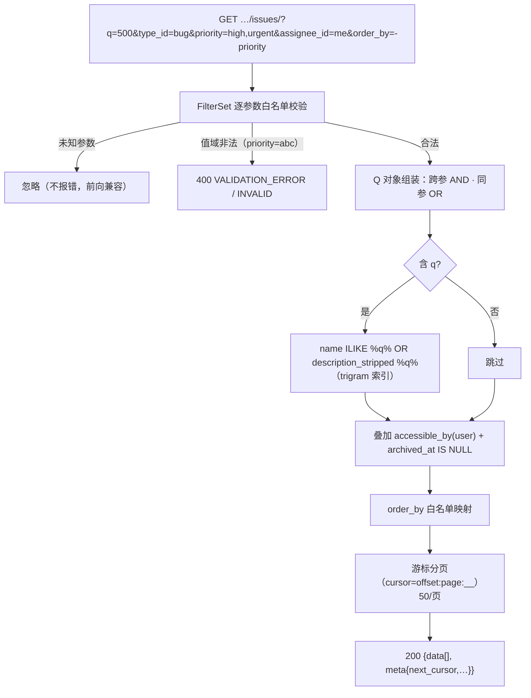

# 任务列表筛选 / 搜索 / 排序

| 元信息项 | 内容 |
| --- | --- |
| 文档编号 | TASK-003 |
| 所属迭代 | Sprint 1：MVP 能力补齐（第 3 周） |
| 优先级 | P1（MVP 必备级） |
| 所属模块 | M4-TASK 任务核心 |
| 文档状态 | 待评审（Draft） |
| 最后更新日期 | 2026-09-01 |
| 上游依据 | `docs/需求文档.md` §3.4（全局任务搜索、多条件筛选、排序）、§3.4.2(3)（P1：内置固定字段的基础筛选、关键词搜索、简单排序） |
| 前置依赖 | `TASK-001`（列表端点 / 游标分页）、`TASK-002`（类型 / 优先级 / 标签 / 子任务计数等被筛字段）、`INFRA-004` |
| 下游依赖 | `BOARD-002`（看板筛选复用同一查询参数语义）、`TASK-009`（P2 全字段组合筛选器在其上扩展 AND/OR）、`TASK-011`（P2 视图保存消费排序 / 筛选状态）、`RPT-001`（聚合口径与筛词语义一致） |
| 架构基线 | [`api-conventions.md`](../architecture/api-conventions.md) §5.3（筛选语法）、§5.4（排序）、§6（游标分页）；[`unified-issue-model.md`](../architecture/unified-issue-model.md) §2.8（`idx_issue_desc_trgm` GIN trigram 索引 P1 启用说明） |
| 竞品参考 | Plane（issues 端点 20+ 过滤参数 + `order_by` 负号降序 + 游标分页）、Ones（企业级筛选器体系，P2 对齐） |

> **范围声明**：交付 P1「内置固定字段」的筛选（状态 / 类型 / 优先级 / 标签 / 负责人 / 时间窗）、关键词搜索（标题 + 描述纯文本）、简单排序（单字段）、URL 参数化状态。AND/OR 组合、条件分组、自定义字段筛选、视图保存全部 P2（`TASK-009/011`）。

---

## 1. 概述

### 1.1 功能定位

P0 的列表是「全量倒序翻页」，30 条任务以上就不可用。P1 让列表变成「能找到任务」的工具：搜索框 + 六维筛选 + 可点列头排序 + URL 可分享。设计上把**查询参数语义**做扎实——它是 P2 组合筛选器与视图保存的直接地基，本迭代字段域内保证语义不再变更。

| 交付项 | 说明 |
| --- | --- |
| 关键词搜索 `?q=` | 标题 + `description_stripped` 的 trigram 相似匹配（`idx_issue_desc_trgm` P0 已建，本迭代点亮） |
| 六维筛选 | `state_id` / `type_id` / `priority` / `label_id` / `assignee_id` / `target_date`（before/after/on 区间语法） |
| 排序 `?order_by=` | 单字段 ± 升降序：`created_at / updated_at / sequence_id / priority / target_date / sort_order` |
| 组合语义 | 同参数多值 = OR；不同参数 = AND（`api-conventions.md` §5.3 语法子集） |
| 列表 UI | TanStack Table 表格视图：筛选条、列头排序、行内卡片信息（`TASK-002` 卡片字段）、加载更多 |
| URL 状态化 | 全部筛选 / 搜索 / 排序写入 URL query，刷新与分享还原 |

### 1.2 目标用户

| 用户 | 场景 | 关注点 |
| --- | --- | --- |
| 全体成员 | 「我的高优 bug 在哪」 | 一次组合查询 ≤ 3 次点击出结果 |
| 项目管理员 | 周会准备 | 按状态 / 负责人筛出视图，URL 发群里 |
| 开发 | 找旧任务 | 记得描述关键词即可搜到（不只标题） |

### 1.3 前置依赖说明

| 依赖文档 | 依赖内容 | 缺失后果 |
| --- | --- | --- |
| `TASK-001` | 列表端点、游标分页实现、`Issue` 基线字段 | 无承载 |
| `TASK-002` | 类型 / 优先级 / 标签值域与端点 | 筛选器数据源缺失 |
| `INFRA-003` | `pg_trgm` 扩展与 `idx_issue_desc_trgm` 索引（P0 已建） | 搜索全表扫 |

### 1.4 竞品参考结论（详见第 6 章）

- **Plane**：单端点 20+ 过滤参数（`priority`、`state`、`labels`、`assignees`、`created_by`、`target_date`、`search`…）+ `order_by=-created_at`；游标分页。**优势**：参数语义与 URL 天然融合。
- **Ones**：筛选器为可视化组合面板（AND/OR 树 + 保存视图），能力对应本系统 P2。
- **本系统**：P1 参数语义对齐 Plane（多值 OR / 跨参 AND），UI 只做单层筛选条，把组合树留给 P2。

---

## 2. 业务逻辑

### 2.1 查询构建流程



### 2.2 参数语义表（P1 冻结域）

| 参数 | 类型 | 语法 / 取值 | 语义 |
| --- | --- | --- | --- |
| `q` | string ≤ 64 | 任意词 | 标题 + 描述 stripped 模糊（ILIKE %…%，trigram） |
| `state_id` | UUID 列表 | 逗号分隔 | OR：命中任一状态 |
| `type_id` | UUID 列表 | 逗号分隔 | OR |
| `priority` | enum 列表 | `none,low,medium,high,urgent` | OR |
| `label_id` | UUID 列表 | 逗号分隔 | OR（任务挂任一标签即命中） |
| `assignee_id` | UUID 列表 / `me` | 逗号分隔 | OR；`me` 服务端展开为当前用户 |
| `target_date` | 区间 | `2026-09-01;before` / `;after` / `;on` | 截止时间早于 / 晚于 / 等于（含当日全天） |
| `created_by` | UUID 列表 | 逗号分隔 | OR（创建人） |
| `order_by` | 单字段 | `±{created_at,updated_at,sequence_id,priority,target_date,sort_order}` | 前缀 `-` 降序；默认 `-created_at` |

**组合语义**：不同参数之间恒为 AND；同参数多值恒为 OR（`api-conventions.md` §5.3 的 P1 子集，P2 在此上叠加显式 `and/or` 操作符）。

### 2.3 业务规则表

| 编号 | 规则 | 判定位置 | 违反后果 |
| --- | --- | --- | --- |
| BR-01 | 未知查询参数忽略不报错；已知参数值域非法返回 400 | FilterSet | 400 `INVALID` |
| BR-02 | 全部查询在 `accessible_by(user)` 之上叠加（行级过滤优先于业务过滤） | ViewSet `get_queryset` | — |
| BR-03 | 默认排除 `archived_at IS NOT NULL`（P1 无归档功能，防御式） | QuerySet | — |
| BR-04 | `q` 长度 ≤ 64；内部 `%` `_` 转义；不使用正则 | Serializer | 400 `TOO_LONG` |
| BR-05 | `priority` 排序权重 `urgent>high>medium>low>none`，用 `Case/When` 注解实现，避免字典序错误 | ORM | — |
| BR-06 | `order_by` 仅白名单字段；非法值回退默认并在 `meta.warning` 提示 | FilterSet | 200 + warning |
| BR-07 | 排序必须附加 `-id` 稳定次序（同值不抖动，游标一致性前提） | ORM | — |
| BR-08 | 筛选值（state/type/label/assignee）若不属于当前项目：命中 0 行而非报错（宽容语义，避免多选器竞态报错风暴） | FilterSet | 空结果 |
| BR-09 | 列表默认字段集 20 个（含 `TASK-002` 新属性 + 计数）；`?fields=` 裁剪可用 | Serializer | — |
| BR-10 | 单页 ≤ 100（默认 50）；`per_page` 超限截断 | 分页器 | — |

### 2.4 异常处理表

| 异常场景 | 触发条件 | HTTP / 错误码 | 前端表现 | 后端处理 |
| --- | --- | --- | --- | --- |
| 枚举值非法 | priority=abc | 400 `VALIDATION_ERROR` | 筛选器红框 | — |
| 游标损坏 | cursor 乱码 | 400 `INVALID` | 静默回第一页 | — |
| 搜索超长 | q > 64 | 400 `TOO_LONG` | 输入框计数红字 | — |
| 组合空结果 | 互斥筛选 | 200 空数组 | 空态插画 +「调整筛选」 | — |

### 2.5 边界条件表

| 边界场景 | 限制值 | 超出处理方式 |
| --- | --- | --- |
| 单参数多值数 | ≤ 20 | 400 `TOO_MANY` |
| 结果集 | 游标不跳页 | 只能顺序「加载更多」 |
| q 为纯通配符 `%` | — | 转义后按字面量匹配，等价空条件 |
| `me` 展开 | 未登录调用 | 401（理论上不可能，登录域） |

---

## 3. UI/UX 设计

### 3.1 列表视图布局（项目内「任务」页签新增「列表」子视图）

| 区域 | 组件 | UI 组件 |
| --- | --- | --- |
| 工具条 | 搜索框（防抖 300ms，清空按钮）+ 筛选器组（状态 / 类型 / 优先级 / 标签 / 负责人 / 截止）+ 已选条件 Chips（可单个 ✕）+「清空全部」 | `SearchInput` / `FilterBar` / `ChipGroup` |
| 表格 | 列：ID（PROJ-1042）/ 标题（含类型色点 / 标签）/ 优先级 / 状态 / 负责人 / 截止 / 子任务 n/m / 更新时间；列头点击排序（↑↓ 指示） | `TanStack Table` |
| 底部 | 「加载更多 (N/total)」按钮 + 计数 | — |

### 3.2 交互细节表

| 交互动作 | 触发方式 | 反馈效果 | 加载态 / 空态 |
| --- | --- | --- | --- |
| 搜索 | 输入防抖 | 结果骨架 300ms；URL `?q=` 更新 | 无结果空态 + 清除建议 |
| 筛选选择 | 下拉多选 | Chip 加入工具条；结果即时刷新（SWR key = URL） | — |
| 列头排序 | 点击 | 指示图标切换 asc→desc→默认；URL 同步 | — |
| 分享 | 复制地址栏 | 对方打开还原全部状态 | — |
| URL 直达 | 外部链接进入 | loader 解析 query 初始化 Store | — |

### 3.3 无障碍要求

- 筛选器组为 `role="group"` + 每个筛选 `aria-label`；Chip 删除按钮可聚焦。
- 排序列头 `aria-sort`；表格行键盘上下导航 + Enter 打开详情抽屉。

---

## 4. 技术架构

### 4.1 数据模型

零新增。依赖索引核查表：

| 查询形态 | 命中索引（P0 已建） |
| --- | --- |
| 默认列表（项目 + 排序） | `idx_issue_active_by_project`（偏索引） |
| `state_id` 筛选 | `idx_issue_proj_state_sort` |
| `type_id` 筛选 | `idx_issue_proj_type` |
| `q` 搜索 | `idx_issue_desc_trgm`（GIN trigram，`unified-issue-model.md` §2.8 明确 P1 启用于搜索） |
| `label_id` 筛选 | `IssueLabel` 复合唯一附带索引（`issue` 前缀），通过 `filter(issue_labels__label_id__in=…)` 子查询 |
| `assignee_id` 筛选 | `IssueAssignee.idx_assignee_issue` 反向 join |

### 4.2 API 定义

**组合查询示例**：

```http
GET /api/v1/workspaces/acme/projects/9d8e…/issues/?q=登录&type_id=8c…&priority=high,urgent&assignee_id=me&target_date=2026-09-07;before&order_by=-priority&per_page=50
```

```json
{ "status": "success",
  "data": [
    { "id": "8a1f…", "sequence_id": 128, "name": "修复登录页 500",
      "type_id": "8c…", "priority": "urgent", "state_id": "…",
      "assignee_ids": ["6c7d…"], "label_ids": ["lbl-fe"],
      "target_date": "2026-09-03", "sub_issues_count": 2, "completed_sub_issues_count": 1,
      "updated_at": "2026-09-01T07:00:00.000Z" }
  ],
  "meta": { "next_cursor": "50:1:0", "next_page_results": true,
            "count": 50, "total_count": 87, "applied": { "q": "登录", "priority": ["high","urgent"] } } }
```

`meta.applied` 回显服务端实际生效的筛选（含 `me` 展开结果），供前端 Chip 精确展示。

### 4.3 核心逻辑

```python
class IssueFilterSet(FilterSet):
    """P1 固定字段筛选器 —— 参数语义冻结，P2 在其上叠加显式 and/or。"""

    PRIORITY_WEIGHT = {"urgent": 5, "high": 4, "medium": 3, "low": 2, "none": 1}

    def build_query(self, params) -> tuple[Q, list[tuple[str, str]]]:
        q = Q()
        for key, field in [("state_id", "state_id__in"), ("type_id", "issue_type_id__in"),
                           ("priority", "priority__in"), ("created_by", "created_by_id__in")]:
            values = self.parse_uuid_list(params.get(key))          # None 跳过
            if values:
                q &= Q(**{field: values})                            # 同参 OR（__in）
        if assignees := self.parse_uuid_list(params.get("assignee_id"), alias_me=True):
            q &= Q(assignees__id__in=assignees)                      # M2M join
        if labels := self.parse_uuid_list(params.get("label_id")):
            q &= Q(labels__id__in=labels)
        if search := self.escape_like(params.get("q", ""))[:64]:
            q &= Q(name__icontains=search) | Q(description_stripped__icontains=search)
        # 注意：q 与其他条件是 AND —— 上式括号内才是 OR
        return q, []

    def apply_order(self, qs, order_by: str):
        desc = order_by.startswith("-")
        field = order_by.lstrip("-")
        if field == "priority":
            weight = Case(*[When(priority=k, then=v) for k, v in self.PRIORITY_WEIGHT.items()])
            qs = qs.annotate(_prio=weight).order_by(("-" if desc else "") + "_prio")
        ...
        return qs.order_by(order_expr, "-id")                        # BR-07 稳定次序
```

**性能基线**（验收门槛）：单项目 1 万任务 + 描述 2KB 下，任一单筛选 P95 < 120ms、`q` 搜索 P95 < 300ms（trigram 索引命中前提 `pg_trgm` 已启用，`INFRA-003` §2 迁移含 `CREATE EXTENSION IF NOT EXISTS pg_trgm`）。

### 4.4 前端状态管理

- `IssueListViewStore`：`filters / q / orderBy` 三态全部从 URL query 派生（`URLSearchParams` ↔ Store 双向绑定，SWR key 直接序列化 query 串——**同参数顺序归一化**保证缓存命中）。
- 「加载更多」以 cursor 追加：`useSWRInfinite`；列表数据与看板（`BOARD-001` 分组端点）互不共享缓存键。

---

## 5. 测试用例

### 5.1 单元测试

| 用例 ID | 测试目标 | 输入 | 预期输出 | 覆盖类型 |
| --- | --- | --- | --- | --- |
| UT-01 | 同参 OR | priority=high,urgent | 命中两档并集 | 正常 |
| UT-02 | 跨参 AND | priority=high&type=bug | 交集 | 正常 |
| UT-03 | q 命中描述 | 标题无「413」但描述有 | 命中 | 正常 |
| UT-04 | LIKE 注入 | q=`%'; DROP TABLE--` | 字面量匹配 0 行，库完好 | 安全 |
| UT-05 | 优先级权重排序 | 混合五档 | urgent→none 降序正确 | 正常 |
| UT-06 | 未知参数忽略 | ?foo=1 | 200 不报错 | 兼容 |
| UT-07 | 稳定次序 | 同优先级 50 条翻 3 页 | 无重复无遗漏 | 边界 |
| UT-08 | 越项目值宽容 | label_id 属他项目 | 0 行 200 | 边界 |
| UT-09 | me 展开 | assignee_id=me | 等于当前用户 ID | 正常 |
| UT-10 | 日期区间语义 | target_date=…;before | 含当日 23:59 前（DateField 全天语义） | 边界 |

### 5.2 集成测试

| 用例 ID | 场景 | 前置条件 | 操作步骤 | 预期结果 |
| --- | --- | --- | --- | --- |
| IT-01 | 行级过滤叠加 | 用户非项目成员 | 带任意筛选请求 | 404（先于业务筛选） |
| IT-02 | 性能基线 | 1 万任务种子 | 六维各查 + q 搜索各 50 次 | P95 达标（§4.3） |
| IT-03 | URL 还原 | 带 5 参数链接打开 | — | Store 与结果一致 |
| IT-04 | 游标翻页一致性 | 87 结果 per_page=50 | 两页加载 | 首尾相接无重复 |

### 5.3 E2E 测试

| 用例 ID | 用户场景 | 操作路径 | 验收标准 |
| --- | --- | --- | --- |
| E2E-01 | 三击找任务 | 搜索 500 + 优先级高 + 负责人 me | ≤ 3 次交互出目标行 |
| E2E-02 | 视图分享 | 组合筛选后复制链接发给同事 | 对方打开还原同一结果集 |
| E2E-03 | 排序探索 | 依次点截止 / 优先级列头 | 指示与顺序正确；再点恢复默认 |

---

## 6. 竞品深度对标

### 6.1 Plane 实现分析

列表端点承载 20+ 过滤参数与 `order_by`；搜索默认匹配 `name`，参数化开启描述匹配；游标分页 `cursor` 为 base64 元组。**劣势**：过滤校验散落各 ViewSet（部分非法值 500）；`priority` 排序早期版本曾按字典序出错后以 DB 枚举序修复——本系统以显式权重注解规避此类问题。

### 6.2 Ones 实现分析

可视化筛选器 + 保存视图 + 全局跨项目搜索，配合自定义字段形成完整检索体系（对应本系统 P2 `TASK-009/011` 与全局搜索 P2+）。其检索后端为独立搜索服务（ES 类），小团队部署成本高。

### 6.3 本系统设计决策

1. **参数语义 P1 冻结**：P2 组合筛选器（`TASK-009`）以「同参 OR / 跨参 AND」为默认起点叠加显式操作符，不破坏既有 URL 兼容。
2. **宽容值域 + 严格语法**：语法错（枚举拼错）报 400，值域外（他项目标签）静默 0 行——多选器异步竞态下用户体验优先，与 Plane 的部分 500 形成差异。
3. **trigram 而非 ES**：万级任务量 PG trigram P95 300ms 内，零新增组件；P4 若需全局检索再评估 ES（架构文档技术栈未引入，遵循既定边界）。
4. **差异化价值**：URL 即视图雏形——P2 视图保存只是把 URL query 存库，本迭代的参数化设计使升级成本趋近于零。

---

## 7. 里程碑与验收

### 7.1 交付物清单

| 类型 | 交付物 |
| --- | --- |
| Model / Migration | 无（索引 P0 已建） |
| API 端点 | `GET …/issues/` 扩展 9 个查询参数 + `meta.applied` 回显 |
| 后端 | `IssueFilterSet`（白名单 / 权重排序 / 稳定次序）、性能基线压测脚本 |
| 前端 | 列表子视图（TanStack Table）、`FilterBar` + Chip、URL 状态化、加载更多 |
| 测试 | UT-01~10、IT-01~04、E2E-01~03 |

### 7.2 可操作演示的验收标准

1. 搜索「登录」同时命中标题与描述含关键词的任务；清空恢复全量。
2. 组合「类型=缺陷 + 优先级=高/紧急 + 负责人=我」三筛选 AND 生效，Chips 可单个移除即时反查。
3. 点击截止 / 优先级列头排序正确（优先级按语义权重非字典序），刷新顺序稳定。
4. 复制含全部状态的 URL 在另一浏览器打开，结果与状态完全还原。
5. 1 万任务数据集下，上述任意操作 P95 < 300ms（IT-02 报告）。
