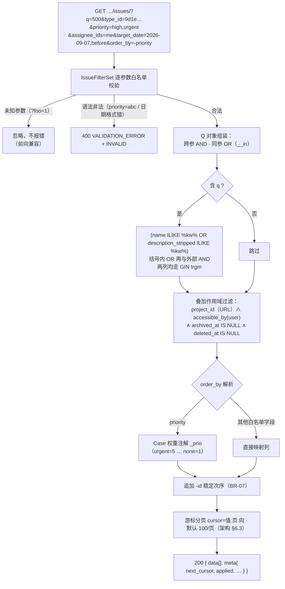
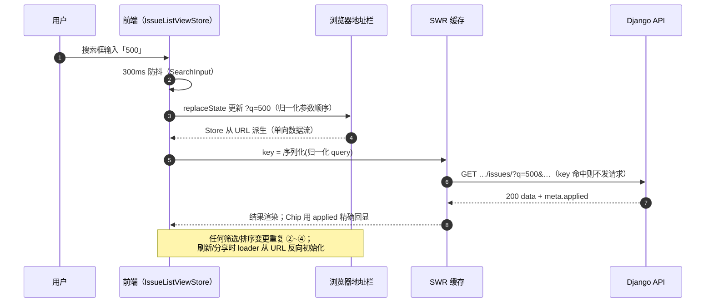
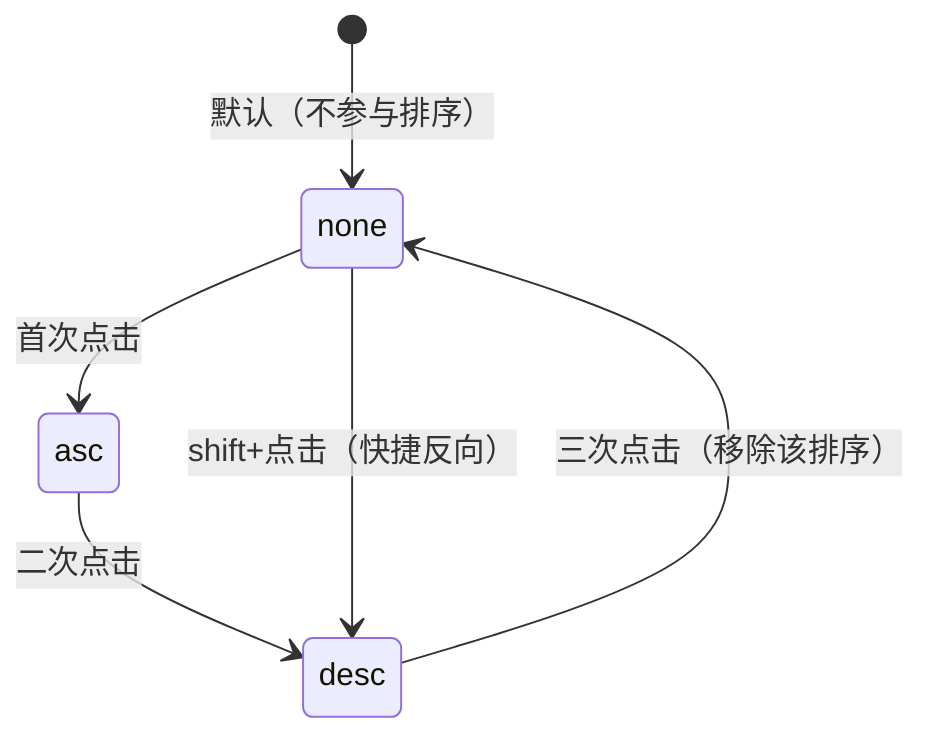

# 任务列表筛选 / 搜索 / 排序

| 元信息项 | 内容 |
| --- | --- |
| 文档编号 | TASK-003 |
| 所属迭代 | Sprint 1：MVP 能力补齐（第 3 周） |
| 优先级 | P1（MVP 必备级） |
| 所属模块 | M4-TASK 任务核心 |
| 文档状态 | **已实现**（2026-09-04 · Sprint 1 后端实现落地 · 见 ADR-0012） |
| 最后更新日期 | 2026-09-01 |
| 上游依据 | `docs/需求文档.md` §3.4（全局任务搜索、多条件筛选、排序）、§3.4.2(3)（P1：内置固定字段的基础筛选、关键词搜索、简单排序）、§8.2 任务核心 P1 列 |
| 前置依赖 | `TASK-001`（列表端点 / 游标分页 / `?fields=` / `?expand=`）、`TASK-002`（类型 / 优先级 / 标签值域与取数端点）、`INFRA-003`（`pg_trgm` 扩展 + `idx_issue_desc_trgm` 索引 P0 已建）、`INFRA-004`（错误信封） |
| 下游消费 | `BOARD-002`（看板筛选复用同一查询参数语义）、`TASK-011`（P2 全字段 AND/OR 组合筛选器与视图保存）、`RPT-001`（聚合口径与筛词语义一致） |
| 架构基线 | [`api-conventions.md`](../architecture/api-conventions.md) §5.3（筛选语法）、§5.4（排序）、§5.5（搜索分层）、§6（游标分页）、§8（错误码）；[`unified-issue-model.md`](../architecture/unified-issue-model.md) §4.3（`search_vector` P2 演进位）、§2.8（`idx_issue_desc_trgm` P0 已建、P1 启用） |
| 竞品参考 | Plane（issues 端点 20+ 过滤参数 + `order_by` 负号降序 + 游标分页）、Ones（可视化筛选器体系 + 独立搜索服务，对应本系统 P2） |
| 工作量估算 | 后端 2.5 人日 / 前端 3 人日 / 联调与测试 1.5 人日，合计 **7 人日** |

> **范围声明**：交付 P1「内置固定字段」的筛选（状态 / 类型 / 优先级 / 标签 / 负责人 / 创建人 / 时间窗）、关键词搜索（标题 + 描述纯文本）、简单排序（单字段）、URL 参数化状态。AND/OR 显式组合、条件分组嵌套、自定义字段筛选、视图保存全部 P2（`TASK-011`）；全局跨项目搜索（⌘K）P2+。

---

## 1. 概述

### 1.1 功能定位

P0 的列表是「全量倒序翻页」，30 条任务以上就不可用。P1 让列表变成「能找到任务」的工具：搜索框 + 七维筛选 + 可点列头排序 + URL 可分享。设计上把**查询参数语义**做扎实——它是 P2 组合筛选器与视图保存的直接地基，本迭代在固定字段域内保证语义不再变更（§2.5「冻结域」）。

| 交付项 | 说明 |
| --- | --- |
| 关键词搜索 `?q=` | 标题（`name`）/ `sequence_id`（项目内数字编号，支持 `RBT-128` 与 `128` 两种格式）/ `description_stripped` 三列 trigram 匹配（`idx_issue_desc_trgm` P0 已建，本迭代点亮）；两阶段策略见 §2.2 |
| 七维筛选 | `state_id` / `type_id` / `priority` / `label_id` / `assignee_ids` / `created_by` / `target_date`（`;before` / `;after` / `;on` 区间语法） |
| 排序 `?order_by=` | 单字段 ± 升降序：`created_at / updated_at / sequence_id / priority / target_date / sort_order`；优先级按**语义权重**排序 |
| 组合语义 | 同参数多值 = OR；不同参数 = AND（[`api-conventions.md`](../architecture/api-conventions.md) §5.3 语法子集） |
| 列表 UI | TanStack Table 表格视图：筛选条、Chip 回显、列头排序、行内卡片信息（`TASK-002` 字段）、加载更多 |
| URL 状态化 | 全部筛选 / 搜索 / 排序写入 URL query，刷新与分享还原；**URL 是 P2 视图保存的存储原型**（§1.3 决策 1） |
| `meta.applied` 回显 | 服务端实际生效的筛选（含 `me` 展开、默认值补全）回显给前端，供 Chip 精确展示 |

### 1.2 P1 查询能力矩阵（关键约定）

> ⚠️ **本表是 P2 组合筛选器的地基**：每个参数的操作符集合与索引路径在本迭代冻结；P2 只叠加显式 `and/or` 逻辑节点，不改变条件叶子的语义。

| 参数 | 类型 / 语法 | 操作符 | SQL 路径与索引 | P2 演进位 |
| --- | --- | --- | --- | --- |
| `q` | string ≤ 64 | 模糊（`name` / `sequence_id` / `description_stripped` 三列） | `name ILIKE` ∪ `sequence_id =` ∪ `description_stripped ILIKE`（GIN trgm） | `TASK-011` 接入 `search_vector` 全文 + `TASK-008` 自定义文本字段 |
| `state_id` | UUID 列表（逗号） | in（OR） | `state_id__in`（`idx_issue_proj_state_sort` 前缀） | + `not_in` / `is_empty` |
| `type_id` | UUID 列表 | in | `issue_type_id__in`（`idx_issue_proj_type`） | + `not_in` |
| `priority` | enum 列表 | in | `priority__in`（单列 B-Tree） | + `gt/lt` 权重比较 |
| `label_id` | UUID 列表 | any-of | `labels__id__in`（`IssueLabel` 反向 join） | + `contains_all`（AND 语义） |
| `assignee_ids` | UUID 列表 / `me` | any-of | `assignees__id__in`（`idx_assignee_issue`） | + `is_empty`（未指派） |
| `created_by` | UUID 列表 | in | `created_by_id__in` | — |
| `target_date` | `<date>;before/;after/;on` | 比较（DateField 全天语义） | `target_date__lt/gt`（单列索引） | + `;between` / 相对时间 `today` `this_week` |
| `order_by` | `±` 单字段 | 升 / 降 | 白名单映射；priority 走 Case 权重注解 | P2 多字段排序 + 自定义字段排序 |
| `cursor` / `per_page` | 游标格式 `值:页:向` | — | [`api-conventions.md`](../architecture/api-conventions.md) §6.2 | — |

### 1.3 三条关键架构决策

#### 决策 1：URL 即视图雏形

P2 的「视图保存」（`IssueView`，[`dynamic-fields-design.md`](../architecture/dynamic-fields-design.md) §5.6）存储的就是筛选 + 排序 + 显示列组合。本迭代把全部列表状态写入 URL query 并保证「URL → 结果集」是纯函数（同 URL 必同结果），P2 视图保存退化为「把 URL query 存库 + 命名」，升级成本趋近于零。约束：**前端任何筛选状态不得只存内存**——Store 是 URL 的派生物（§4.4）。

#### 决策 2：宽容值域 + 严格语法

语法错误（枚举拼错、日期格式非法、UUID 非法）返回 `400`——这是用户配置错误必须暴露；**值域越界（他项目的 state_id、已删除的 label_id）静默命中 0 行**——多选器异步竞态下（用户刚删了标签、另一端筛选器还持有旧 id）报错风暴比空结果体验更差。这与 Plane「部分非法值 500」形成刻意差异（§6.1）。

#### 决策 3：trigram 而非独立搜索服务

万级任务量下 PostgreSQL trigram + GIN 的 P95 在 300ms 内（§7.2 门禁），零新增组件、零数据同步。Ones 类产品的独立搜索服务（ES 系）在十万级以下属于过度设计。P2 升级路径已预研：`search_vector` 生成列 + GIN（[`unified-issue-model.md`](../architecture/unified-issue-model.md) §4.3），P4 视量级再评估外置引擎——技术栈边界遵循 [`tech-stack.md`](../architecture/tech-stack.md)。

### 1.4 范围边界

| 能力 | P1（本文档） | 后续 |
| --- | --- | --- |
| 标题 + 描述关键词搜索 | ✅ trigram | P2 `search_vector` 全文（权重 A/B）；P4 外置引擎评估 |
| 七维筛选 + 组合（跨参 AND / 同参 OR） | ✅ | `TASK-011` 显式 AND/OR + 分组嵌套 |
| 单字段排序（含优先级语义权重） | ✅ | P2 多字段 + 自定义字段排序 |
| URL 状态化与分享还原 | ✅ | `TASK-011` 视图保存（个人 / 共享） |
| `meta.applied` 生效回显 | ✅ | P2 筛选器 DSL 编译器（`dynamic-fields-design.md` §5.3） |
| 自定义字段筛选 | ❌ | `TASK-008` + `TASK-011` |
| 全局跨项目搜索（⌘K） | ❌ | P2+（`GET /workspaces/{slug}/search/`） |
| 已保存视图下拉 / 最近使用 | ❌ | `TASK-011` |
| 列显示配置 | ❌（P1 固定列集） | `TASK-011` display_props |

### 1.5 前置依赖

| 依赖 | 内容 | 阻塞原因 |
| --- | --- | --- |
| `TASK-001` | 列表端点骨架、游标分页器、`?fields=` / `?expand=`、`assertNumQueries` 基线 | 查询能力挂载点 |
| `TASK-002` | 类型 / 优先级 / 标签的值域与取数端点（`issue-types/` / `labels/`） | 筛选器数据源 |
| `INFRA-003` | `pg_trgm` 扩展 + `idx_issue_desc_trgm` GIN 索引（P0 migration 已含 `TrigramExtension`） | 缺失则 `q` 全表扫描 |
| `INFRA-004` | 统一错误信封与 `details[]` 结构 | 400 响应格式 |

### 1.6 竞品参考

| 竞品 | 参考点 | 处置 |
| --- | --- | --- |
| Plane | issues 端点 20+ 过滤参数（`priority`/`state`/`labels`/`assignees`/`created_by`/`target_date`/`search`…）+ `order_by=-created_at` + 游标分页 | 参数集与语义对齐（§6.1） |
| Plane | 过滤校验散落各 ViewSet，部分非法值 500；`priority` 排序早期版本按字典序出错 | 前者以「白名单 FilterSet + 宽容值域」规避；后者以显式权重注解规避 |
| Ones | 可视化筛选器（AND/OR 树 + 保存视图）+ 独立搜索服务 | 前者对应 P2 `TASK-011`；后者以 trigram 替代（决策 3） |

---

## 2. 业务逻辑

### 2.1 查询构建流程



### 2.2 搜索两阶段策略与 P2 演进

**P1 两阶段**（关键词长度决定路径，防短词全表扫描）：

| 关键词长度 | 策略 | 理由 |
| --- | --- | --- |
| 1 ~ 2 字符 | 仅 `name` 前缀匹配（`name ILIKE 'q%'`，可走 B-Tree 前缀） | trigram 对 < 3 字符的词无法构建有效 trigram 集，索引失效退化为顺序扫描 |
| ≥ 3 字符 | `name ILIKE '%q%' OR description_stripped ILIKE '%q%'`（双列 GIN trgm） | trigram 索引命中，P95 < 300ms（§7.2） |

**P2 演进位**（[`unified-issue-model.md`](../architecture/unified-issue-model.md) §4.3 已预研，本迭代零实现）：

```sql
-- P2：生成列自动维护 + GIN，标题权重 A 高于正文 B
ALTER TABLE issues ADD COLUMN search_vector tsvector
  GENERATED ALWAYS AS (
    setweight(to_tsvector('simple', coalesce(name, '')), 'A') ||
    setweight(to_tsvector('simple', coalesce(description_stripped, '')), 'B')
  ) STORED;
CREATE INDEX idx_issue_search_vector ON issues USING GIN (search_vector);
```

### 2.3 前端交互时序（防抖 → URL → SWR）



### 2.4 列头排序三态状态机

每个可排序列头独立维护三态循环（`aria-sort` 联动）：



| 状态 | URL 表现 | `aria-sort` |
| --- | --- | --- |
| `none` | 参数不含该字段 | `none` |
| `asc` | `order_by=priority` | `ascending` |
| `desc` | `order_by=-priority` | `descending` |

> P1 为单字段排序：进入新列的 `asc/desc` 时，前一列自动回到 `none`（URL 中仅存一个 `order_by`）。多字段排序（`order_by=a,b`）为 P2 能力，状态机扩展为按列独立存储。

### 2.5 参数语义表（P1 冻结域）

| 参数 | 类型 | 语法 / 取值 | 语义 |
| --- | --- | --- | --- |
| `q` | string ≤ 64 | 任意词（`%` `_` 转义） | 标题（`name`）/ 编号（`sequence_id` 支持 `RBT-128` 与 `128`）/ 描述 stripped 三列模糊；两阶段（§2.2） |
| `state_id` | UUID 列表 | 逗号分隔 | OR：命中任一状态 |
| `type_id` | UUID 列表 | 逗号分隔 | OR |
| `priority` | enum 列表 | `none,low,medium,high,urgent` | OR |
| `label_id` | UUID 列表 | 逗号分隔 | OR（任务挂任一标签即命中） |
| `assignee_ids` | UUID 列表 / `me` | 逗号分隔 | OR；`me` 服务端展开为当前用户并回显于 `meta.applied` |
| `target_date` | 区间 | `2026-09-01;before` / `;after` / `;on` | 早于（含之前全部）/ 晚于 / 等于（DateField **全天语义**：`;on` = `[当日 00:00, 当日 24:00)`） |
| `created_by` | UUID 列表 | 逗号分隔 | OR（创建人） |
| `order_by` | 单字段 | `±{created_at,updated_at,sequence_id,priority,target_date,sort_order}` | 前缀 `-` 降序；默认 `-created_at` |
| `per_page` / `cursor` | int ≤ 100 / 游标串 | — | 分页（[`api-conventions.md`](../architecture/api-conventions.md) §6） |

**组合语义**：不同参数之间恒为 AND；同参数多值恒为 OR。`q` 的多列 OR 在括号内自成一组后再与外部 AND（§4.3 实现中的括号是常见缺陷点，FLT-11 守护）。

### 2.6 业务规则表

| 编号 | 规则 | 判定位置 | 违反后果 |
| --- | --- | --- | --- |
| BR-01 | 未知查询参数忽略不报错；已知参数**语法**非法返回 400 | FilterSet | 400 + 子码 `INVALID` |
| BR-02 | 全部查询在 `accessible_by(user)` + `project_id` 作用域之上叠加（行级过滤先于业务过滤） | ViewSet `get_queryset` | — |
| BR-03 | 默认排除 `archived_at IS NOT NULL`（P1 无归档功能，防御式）与软删除 | QuerySet | — |
| BR-04 | `q` 长度 ≤ 64；内部 `%` `_` 转义；不使用正则（杜绝 ReDoS 与通配注入） | Serializer | 400 + 子码 `TOO_LONG` |
| BR-05 | `priority` 排序权重 `urgent(5) > high(4) > medium(3) > low(2) > none(1)`，`Case/When` 注解实现，禁字典序 | ORM | — |
| BR-06 | `order_by` 仅白名单字段；非法值**回退默认** `-created_at` 并在 `meta.warning` 提示（静默忽略排序会让用户看到错误顺序却无提示——与未知筛选参数的忽略策略刻意不同） | FilterSet | 200 + warning |

> **ADR-002（与架构 §5.4 偏离）**：架构 `api-conventions.md` §5.4 规定非法排序字段统一返回 `400 VALIDATION_INVALID_PARAM`，本表 BR-06 选择 200 + `meta.warning` 回退默认排序，属于行为分歧。理由：排序常由列头点击或视图分享链接带入，前端 bug 或手抖 URL 极常见；硬报错会让整个列表 400 不可用，用户体感远差于「静默按默认序展示 + 顶部 toast 提示」。**需在合并前补 ADR 登记并同步回改 `architecture/api-conventions.md` §5.4**（P1 范围已识别，但 ADR 草案与同步动作不在本迭代交付）。
| BR-07 | 排序必须附加 `-id` 稳定次序（同值不抖动；游标一致性前提，[`api-conventions.md`](../architecture/api-conventions.md) §5.4） | ORM | — |
| BR-08 | 筛选值域外（他项目 state / 已删 label）命中 0 行而非报错（宽容语义，§1.3 决策 2） | FilterSet | 空结果 |
| BR-09 | 列表默认字段集 20 个（含 `TASK-002` 属性 + 计数 annotate）；`?fields=` 裁剪可用 | Serializer | — |
| BR-10 | 单页 ≤ 100（默认 100）；`per_page` 超限静默截断并在 `meta.degraded` 告知 | 分页器 | — |
| BR-11 | 单参数多值 ≤ 20（防 URL 炸弹与巨 SQL） | FilterSet | 400 + 子码 `TOO_LARGE` |
| BR-12 | `meta.applied` 必须回显服务端实际生效筛选（`me` 展开后 UUID、默认 order_by、被忽略的未知参数清单） | Serializer | — |
| BR-13 | `target_date` 为 DateField：`;on` 全天语义、`;before` 不含当日（与 [`api-conventions.md`](../architecture/api-conventions.md) §5.3 `;before` 严格小于语义一致，避免跨时区偏移一天的classic bug） | FilterSet | — |

### 2.7 异常处理表

| 异常场景 | 触发条件 | HTTP / 错误码 | 前端表现 | 后端处理 |
| --- | --- | --- | --- | --- |
| 枚举值非法 | `priority=abc` | 400 `VALIDATION_ERROR` + `INVALID` | 筛选器红框（仅直连场景；UI 下拉不可能产出） | — |
| 日期语法错 | `target_date=2026/09/01;before` | 400 + `INVALID_DATE` | 同上 | — |
| UUID 语法错 | `state_id=xyz` | 400 + `INVALID_UUID` | 同上 | — |
| 搜索超长 | `q` > 64 | 400 + `TOO_LONG` | 输入框计数红字 | — |
| 多值超限 | 21 个 id | 400 + `TOO_LARGE` | 多选器上限拦截 | — |
| 游标损坏 | `cursor` 乱码 | 400 `VALIDATION_INVALID_CURSOR` | 静默回第一页 | 解码失败统一该码 |
| 排序字段非法 | `order_by=secret` | 200 + `meta.warning` | Toast「已按默认排序」 | 回退默认（BR-06） |
| 组合空结果 | 互斥筛选 | 200 空数组 | 空态插画 +「调整筛选」+ 一键清空 | — |
| 非项目成员 | 任意查询 | 404 `RESOURCE_NOT_FOUND` | 404 页 | 作用域先于业务筛选（BR-02） |

### 2.8 边界条件表

| 边界场景 | 限制值 | 超出处理方式 |
| --- | --- | --- |
| 单参数多值数 | 20 | 400 + `TOO_LARGE` |
| `q` 长度 | 64 | 400 + `TOO_LONG` |
| `q` 为纯通配符 `%` | — | 转义后按字面量匹配（等价空条件） |
| 结果集 | 游标不跳页 | 只能顺序「加载更多」 |
| 短词搜索 | 1~2 字符 | 仅标题前缀匹配（§2.2 两阶段） |
| `me` 展开 | 未登录调用 | 401（登录域拦截，业务层不触达） |
| `total_count` 大结果 | > 50,000 | 执行计划估算 + `meta.total_count_estimated=true`（[`api-conventions.md`](../architecture/api-conventions.md) §6.4） |

---

## 3. UI/UX 设计

### 3.1 列表视图布局（项目内「任务」页签的「列表」子视图）

```
┌────────────────────────────────────────────────────────────────────────────────┐
│ ┌──────────────────┐ ┌─────────┐┌─────────┐┌────────┐┌────────┐┌──────────┐      │
│ │ 🔍 搜索任务…  ✕  │ │状态  ▾ ││类型  ▾ ││优先级 ▾││标签  ▾ ││负责人 ▾ │ 更多▾ │      │
│ └──────────────────┘ └─────────┘└─────────┘└────────┘└────────┘└──────────┘      │
│ 已筛选: [✕ 高,紧急] [✕ 负责人:我] [✕ 截止≤09-07]          [清空全部]  87 个任务  │
├──────┬──────────────────────────────────┬────────┬────────┬────────┬───────────┤
│ 编号 │ 标题                             │ 优先级 │ 状态    │ 负责人  │ 截止 ↑↓   │
├──────┼──────────────────────────────────┼────────┼────────┼────────┼───────────┤
│▮RBT-128│ 修复登录页 500 [🏷bug]          │ ⚑ 高   │ ●进行中 │ 👤梁工  │ 🔴 09-03  │
│▮RBT-127│ 导出报表 API [子任务 2/5]       │ ⚑ 紧急 │ ●待办   │ 👤梁工  │   09-07   │
│▮RBT-126│ 登录页 UI 走查                  │   —    │ ●已完成 │ 👤张三  │   08-30   │
├──────┴──────────────────────────────────┴────────┴────────┴────────┴───────────┤
│                          ┌────────────────────────────┐                        │
│                          │  加载更多（已显示 50 / 87）  │                        │
│                          └────────────────────────────┘                        │
└────────────────────────────────────────────────────────────────────────────────┘
```

| 区域 | 组件 | UI 组件 |
| --- | --- | --- |
| 搜索框 | 防抖 300ms、清空按钮、字符计数（>56 变红预警） | `SearchInput` |
| 筛选器组 | 六个下拉多选（选项带色点 / 头像）+「更多」（创建人 / 排序入口） | `FilterBar` |
| 已选 Chips | 每个生效条件一枚 Chip（label 取 `meta.applied` 回显值），单个 ✕ 移除反查 | `ChipGroup` |
| 表格 | 列头点击排序（`aria-sort`）；行点击开 Drawer（`?peekIssue`） | `TanStack Table` |
| 底部 | 「加载更多 (N/total)」按钮 + 总计数 | — |

### 3.2 列定义表

| 列 | 宽度 | 渲染 | 可排序 |
| --- | --- | --- | --- |
| 编号 | 96px | `▮`类型色条 + `RBT-128`（mono，点击复制） | ✅ `sequence_id` |
| 标题 | flex-1 min 240px | 标题 + 内联标签 Tag（≤3 + `+N`）+ 子任务 `n/m` 徽标 | ❌ |
| 优先级 | 96px | 旗形图标 + 档位（`none` 显示 `—`） | ✅ `priority`（权重序） |
| 状态 | 112px | `StateBadge`（圆点 + 名） | ❌（P2） |
| 负责人 | 100px | 头像组（多人头叠放） | ❌ |
| 截止 | 112px | `yyyy-MM-dd`；逾期且未完成红 + 图标 | ✅ `target_date` |
| 更新时间 | 128px | 相对时间（hover 绝对时间） | ✅ `updated_at` |

### 3.3 筛选器下拉（以优先级为例）

```
┌─────────────────────┐
│ ☑ 紧急  ⚑ #EF4444   │
│ ☑ 高    ⚑ #F59E0B   │
│ ☐ 中    ⚑ #3B82F6   │
│ ☐ 低    ⚑ #10B981   │
│ ☐ 无    ⚑ #9CA3AF   │
├─────────────────────┤
│ 仅看我的任务          │ ← assignee_ids=me 快捷
└─────────────────────┘
```

五档色值注册表以 `BOARD-002` §3.2 为准（urgent `#EF4444` / high `#F59E0B` / medium `#3B82F6` / low `#10B981` / none `#9CA3AF`）。

选项数据源：类型 / 状态 / 标签来自 `TASK-002` 端点（SWR 缓存）；负责人来自 `PROJ-002` 成员列表。多选确认即生效（无「应用」按钮——离散值语义）。

### 3.4 交互细节表

| 交互动作 | 触发方式 | 反馈效果 | 加载态 / 空态 |
| --- | --- | ---| --- |
| 搜索 | 输入防抖 300ms | URL `?q=` 更新；结果骨架 300ms | 无结果空态 + 清除建议 |
| 筛选选择 | 下拉勾选 | Chip 划入工具条；结果即时刷新（SWR key = URL） | — |
| Chip 移除 | 点 ✕ | 单条件反查（其余条件保留） | — |
| 清空全部 | 链接按钮 | 回默认列表；URL 参数清空 | — |
| 列头排序 | 点击 | `asc → desc → 默认` 三态循环；指示图标 + `aria-sort`；URL 同步 | — |
| 加载更多 | 按钮 | 追加下一页（cursor）；按钮计数更新 | 末页隐藏按钮 |
| 分享 | 复制地址栏 | 对方打开还原全部状态（含排序） | — |
| URL 直达 | 外部链接进入 | loader 解析 query 初始化 Store（§2.3 反向流） | 非法参数走 §2.7 表现 |

### 3.5 空状态

| 场景 | 处置 |
| --- | --- |
| 无任务 | 复用 `TASK-001` §3.5 空态（快速创建行常驻） |
| 筛选后空结果 | 插画 +「没有符合当前筛选的任务」+ 已选条件 Chips + 主按钮「清空全部」 |
| 搜索空结果 | 同上 + 建议「试试更短的关键词（≥ 3 字符可搜描述）」 |

### 3.6 响应式与无障碍

| 断点 | 布局 |
| --- | --- |
| ≥ 1280px | 全列 + 工具条单行 |
| 768 ~ 1279px | 隐藏「更新时间」列；筛选器组折两行 |
| < 768px | 筛选器收进「筛选」按钮（Sheet 展开）；表格降级卡片列表 |

无障碍：筛选器组 `role="group"` + 每筛选器 `aria-label`；Chip ✕ 可聚焦（`aria-label="移除筛选：高优先级"`）；排序列头 `aria-sort="ascending/descending/none"`；表格行方向键导航 + Enter 开 Drawer；搜索框 `type="search"` 语义。

### 3.7 键盘快捷键

| 快捷键 | 作用 | 说明 |
| --- | --- | --- |
| `/` | 聚焦搜索框 | 列表视图全局监听（输入态除外）；与 GitHub/Jira 心智一致 |
| `Esc` | 清空搜索并失焦 | 有词先清词，无词直接失焦 |
| `↑` / `↓` | 表格行间移动 | 焦点行高亮，循环滚动 |
| `Enter` | 打开焦点行详情 Drawer | `?peekIssue` 写入（`TASK-001` §3.3） |
| `Shift` + 点击列头 | 直接降序 | 跳过 asc 态（§2.4 状态机快捷边） |

---

## 4. 技术架构

### 4.1 数据模型与索引核查

**零新增表**；**新增 1 个 DDL**：`idx_issue_name_trgm` GIN trgm（标题列，见下）。P1 查询路径与索引对照：

| 查询形态 | SQL 路径 | 命中索引 | 备注 |
| --- | --- | --- | --- |
| 默认列表 | `project=? AND archived_at IS NULL ORDER BY created_at DESC` | `idx_issue_active_by_project`（偏索引） | P0 已建 |
| `state_id` 筛选 | `state_id IN (…)` | `idx_issue_proj_state_sort` 前缀 | P0 已建 |
| `type_id` 筛选 | `issue_type_id IN (…)` | `idx_issue_proj_type` | P0 已建 |
| `priority` 筛选 | `priority IN (…)` | `priority` 单列 B-Tree | P0 已建 |
| `q` 搜索（≥3 字符） | `name ILIKE OR description_stripped ILIKE`（含 `sequence_id` 精确匹配） | `idx_issue_name_trgm` ∪ `idx_issue_desc_trgm`（GIN trgm 双列） | `idx_issue_desc_trgm` P0 已建；`idx_issue_name_trgm` **P1 新建**（见下） |
| `q` 搜索（1~2 字符） | `name ILIKE 'x%'` | `name` 前缀（B-Tree 可用） | P0 已建 |
| `label_id` 筛选 | `labels__id__in`（join `issue_labels`） | `uniq_issue_label`（issue 前缀）+ label 侧 PK | P0 已建 |
| `assignee_ids` 筛选 | `assignees__id__in`（join `issue_assignees`） | `idx_assignee_issue` | P0 已建 |
| `target_date` 比较 | `target_date < / > / =` | `target_date` 单列索引 | P0 已建 |
| 计数 annotate | `Count("sub_issues", distinct=True)` | `idx_issue_parent` | P0 已建 |

**P1 新增 DDL：`idx_issue_name_trgm`**（架构 `unified-issue-model.md` §2.8 未声明，P1 首次点亮 `q` 标题列覆盖能力）：

```sql
-- apps/api/plane/db/migrations/0003_issue_name_trgm.py
from django.contrib.postgres.operations import GinIndex
from django.db import migrations


class Migration(migrations.Migration):
    dependencies = [("db", "0002_seed_workspace_issue_types")]
    operations = [
        GinIndex(
            name="idx_issue_name_trgm",
            fields=["name"],
            opclasses=["gin_trgm_ops"],
        ),
    ]
```

落地约定（沿用架构 §2.8 P0 索引约定）：

1. 使用 `CREATE INDEX CONCURRENTLY`（Django 通过 `AddIndexConcurrently` 包装）以避免长时间持锁；
2. 空表零成本，非空表走 PG 后台 build，CI 用 IT-14 同款 SQL 断言可命中；
3. 代码层无需 ORM 改动，查询计划自动选用。

> 多值 join（label / assignee）可能产生重复行：`label_id` 与 `assignee_ids` 同时使用时 QuerySet 必须 `.distinct()`（FLT-12 守护）。

### 4.2 API 定义

`GET /api/v1/workspaces/{slug}/projects/{project_id}/issues/` 扩展 10 个查询参数（`TASK-001` 已有 `ordering` 白名单机制，本迭代统一更名为 **`order_by`** 并冻结——与 Plane 参数名一致，`TASK-011` 沿用）。

> **ADR-001（破坏性变更）**：将 P0 的 `?ordering=`（架构 §5.4）更名为 `?order_by=` 属于破坏性客户端契约变更，需在合并前走 ADR 流程（Architecture Decision Record）登记，授权后同步回改 `architecture/api-conventions.md` §5.4 与本节，并发布 `Deprecation: true` + `Sunset` 头（架构 §2.2 字段废弃流程）兼容旧客户端至少两个迭代。

#### 4.2.1 组合查询（典型请求）

```http
GET /api/v1/workspaces/acme/projects/9d8e…/issues/?q=登录&type_id=9d1e…&priority=high,urgent&assignee_ids=me&target_date=2026-09-07;before&order_by=-priority&per_page=100 HTTP/1.1
```

**成功响应 `200`**

```json
{ "status": "success",
  "data": [
    { "id": "8a1f…", "sequence_id": 128, "issue_key": "RBT-128",
      "name": "修复登录页 500", "type_id": "9d1e…", "priority": "urgent",
      "state_id": "d2e3…", "assignee_ids": ["6c7d…"], "label_ids": ["lbl-fe"],
      "start_date": "2026-09-01", "target_date": "2026-09-03",
      "sub_issues_count": 2, "completed_sub_issues_count": 1,
      "created_by": "6c7d…", "updated_at": "2026-09-01T07:00:00.000Z" }
  ],
  "meta": {
    "next_cursor": "100:1:0", "prev_cursor": "100:0:1",
    "next_page_results": true, "prev_page_results": false,
    "count": 100, "total_count": 187, "total_pages": 2, "page": 1, "per_page": 100,
    "applied": {
      "q": "登录", "type_id": ["9d1e…"], "priority": ["high", "urgent"],
      "assignee_ids": ["6c7d…"], "target_date": "2026-09-07;before",
      "order_by": "-priority"
    },
    "ignored_params": []
  } }
```

`meta.applied` 回显**服务端实际生效**的筛选（`me` 已展开为 UUID）——前端 Chip 的显示依据（BR-12）。

#### 4.2.2 错误响应

**400（枚举非法）**

```json
{ "status": "error",
  "error": { "code": "VALIDATION_ERROR", "message": "请求参数校验失败",
    "details": [{ "field": "priority", "code": "NOT_A_CHOICE",
                  "message": "priority 取值非法：abc" }],
    "request_id": "01JBX…" } }
```

**400（日期语法错）**

```json
{ "status": "error",
  "error": { "code": "VALIDATION_ERROR", "message": "请求参数校验失败",
    "details": [{ "field": "target_date", "code": "INVALID_DATE",
                  "message": "格式应为 YYYY-MM-DD;before|after|on" }],
    "request_id": "01JBX…" } }
```

**400（游标损坏）**

```json
{ "status": "error",
  "error": { "code": "VALIDATION_INVALID_CURSOR", "message": "游标无效，已回到首页",
    "request_id": "01JBX…" } }
```

**200 + warning（排序字段非法，BR-06）**

```json
{ "status": "success", "data": [],
  "meta": { "warning": "order_by=secret 不在白名单，已回退 -created_at",
            "applied": { "order_by": "-created_at" }, "…" : "…" } }
```

#### 4.2.3 翻页（第二页）

```http
GET …/issues/?q=登录&…&cursor=100:1:0&per_page=100 HTTP/1.1
```

`meta.next_cursor = "50:2:0"`；`total_count` 恒可复用（同 key 结果集未变时 SWR 缓存计数）。

### 4.3 核心逻辑

#### 4.3.1 `IssueFilterSet` 完整实现

```python
# apps/api/plane/app/filters/issue.py
import uuid
from datetime import date

from django.db.models import Case, Q, QuerySet, Value, When
from django.db import models

from plane.utils.filters import BaseFilterSet, field_error

PRIORITY_CHOICES = ("none", "low", "medium", "high", "urgent")
ORDER_BY_WHITELIST = ("created_at", "updated_at", "sequence_id",
                      "priority", "target_date", "sort_order")
PRIORITY_WEIGHT = {"urgent": 5, "high": 4, "medium": 3, "low": 2, "none": 1}
MAX_VALUES_PER_PARAM = 20
MAX_Q_LENGTH = 64


class IssueFilterSet(BaseFilterSet):
    """P1 固定字段筛选器 —— 参数语义冻结（§2.5），P2 在其上叠加显式 and/or。

    组装原则：
      - 跨参数 AND（&= 逐条叠加）
      - 同参数多值 OR（__in）
      - q 的多列 OR 自成括号组（防 OR 短路其他条件 —— FLT-11）
    """

    def build_query(self, params: dict) -> tuple[Q, dict]:
        q, applied = Q(), {}

        # ---- UUID 列表参数（state/type/label/assignee/created_by）----
        for key, lookup in (("state_id", "state_id__in"),
                            ("type_id", "issue_type_id__in"),
                            ("created_by", "created_by_id__in")):
            values = self.parse_uuid_list(params.get(key), field_name=key)
            if values:
                q &= Q(**{lookup: values})
                applied[key] = values
        if assignees := self.parse_uuid_list(params.get("assignee_ids"), field_name="assignee_ids", alias_me=True):
            q &= Q(assignees__id__in=assignees)          # M2M join → 需 distinct（FLT-12）
            applied["assignee_ids"] = [str(v) for v in assignees]
        if labels := self.parse_uuid_list(params.get("label_id"), field_name="label_id"):
            q &= Q(labels__id__in=labels)
            applied["label_id"] = [str(v) for v in labels]

        # ---- 枚举参数（严格语法 → 400；值域宽容 → 0 行，BR-01/08）----
        if (raw_priority := params.get("priority")) is not None:
            parts = [p.strip() for p in raw_priority.split(",") if p.strip()]
            invalid = set(parts) - set(PRIORITY_CHOICES)
            if invalid:
                raise field_error("priority", "NOT_A_CHOICE", f"priority 取值非法：{','.join(invalid)}")
            if len(parts) > MAX_VALUES_PER_PARAM:
                raise field_error("priority", "TOO_LARGE", f"单参数最多 {MAX_VALUES_PER_PARAM} 个值")
            q &= Q(priority__in=parts)
            applied["priority"] = parts

        # ---- 日期区间（;before / ;after / ;on，BR-13）----
        if (raw_date := params.get("target_date")) is not None:
            value, _, modifier = raw_date.partition(";")
            modifier = modifier or "on"
            try:
                day = date.fromisoformat(value.strip())
            except ValueError:
                raise field_error("target_date", "INVALID_DATE",
                                  "格式应为 YYYY-MM-DD;before|after|on")
            q &= {
                "before": Q(target_date__lt=day),       # 严格早于（不含当日）
                "after":  Q(target_date__gt=day),       # 严格晚于
                "on":     Q(target_date=day),           # DateField 全天语义
            }[modifier]
            applied["target_date"] = raw_date

        # ---- 关键词（两阶段 + 转义，§2.2 / BR-04）----
        if (keyword := (params.get("q") or "").strip()):
            if len(keyword) > MAX_Q_LENGTH:
                raise field_error("q", "TOO_LONG", f"关键词最长 {MAX_Q_LENGTH} 字符")
            esc = self.escape_like(keyword)
            # 搜索覆盖 name / sequence_id / description_stripped 三列（架构 §5.5）
            seq_match = None
            if keyword.isdigit():
                seq_match = Q(sequence_id=int(keyword))
            elif "-" in keyword and keyword.split("-", 1)[1].isdigit():
                # 支持 RBT-128 形式：以 identifier-数字 出现时仅按 sequence_id 命中
                seq_match = Q(sequence_id=int(keyword.split("-", 1)[1]))
            if len(esc) >= 3:
                text_match = (Q(name__icontains=esc) | Q(description_stripped__icontains=esc))
            else:
                text_match = Q(name__istartswith=esc)   # 短词：仅标题前缀
            match = text_match | seq_match if seq_match is not None else text_match
            q &= match
            applied["q"] = keyword

        return q, applied

    # ---------------- 排序（BR-05/06/07）----------------
    def apply_order(self, qs: QuerySet, raw_order: str | None) -> tuple[QuerySet, str | None]:
        warning = None
        desc = bool(raw_order and raw_order.startswith("-"))
        field = (raw_order or "").lstrip("-")

        # 可空字段排序：NULL 一律排最后，避免 NULL 被误判为「最早/最小」（ORD-06 守护）
        # Postgres 默认 NULLS FIRST（升序）/ NULLS LAST（降序），对可空列会反转语义；
        # 这里显式锁死 NULLS LAST 让两种序向保持一致行为。
        NULLS_LAST_FIELDS = {"target_date", "sort_order"}

        if field not in ORDER_BY_WHITELIST:
            if raw_order:                               # 显式传了非法值 → 回退 + 警告
                warning = f"order_by={raw_order} 不在白名单，已回退 -created_at"
            field, desc = "created_at", True
        if field == "priority":                          # 语义权重（禁字典序）
            weight = Case(*[When(priority=k, then=Value(v)) for k, v in PRIORITY_WEIGHT.items()])
            qs = qs.annotate(_prio=weight).order_by(("-" if desc else "") + "_prio", "-id")
        else:
            prefix = "-" if desc else ""
            if field in NULLS_LAST_FIELDS:
                qs = qs.order_by(
                    models.F(field).asc(nulls_last=True) if not desc
                    else models.F(field).desc(nulls_last=True),
                    "-id",
                )
            else:
                qs = qs.order_by(prefix + field, "-id")   # -id 稳定次序
        return qs, warning

    # ---------------- 工具 ----------------
    def parse_uuid_list(
        self, raw: str | None, *, field_name: str, alias_me: bool = False
    ) -> list[uuid.UUID]:
        """逗号分隔 UUID 列表 → list；语法错 400；me → 当前用户。空 / None → []（跳过）。

        ``field_name`` 必须显式传入，用于错误响应中 ``details[].field`` 的精确指向
        ——避免硬编码 "state_id" / "assignee_id" 错把其他字段的错误标错归属（FLT-07）。
        """
        if not raw:
            return []
        parts = [p.strip() for p in raw.split(",") if p.strip()]
        if len(parts) > MAX_VALUES_PER_PARAM:
            raise field_error(field_name, "TOO_LARGE", f"单参数最多 {MAX_VALUES_PER_PARAM} 个值")
        result: list[uuid.UUID] = []
        for p in parts:
            if alias_me and p == "me":
                result.append(self.request.user.id)
                continue
            try:
                result.append(uuid.UUID(p))
            except ValueError:
                raise field_error(field_name, "INVALID_UUID", f"UUID 格式非法：{p}")
        return result

    @staticmethod
    def escape_like(s: str) -> str:
        """转义 LIKE 通配符（BR-04：q 永远是字面量，杜绝 % 注入与 ReDoS）。"""
        return s.replace("\\", "\\\\").replace("%", "\\%").replace("_", "\\_")
```

#### 4.3.2 ViewSet 装配

```python
# apps/api/plane/app/views/issue.py（list 扩展段）
def list(self, request, *args, **kwargs):
    filterset = IssueFilterSet(request)
    q_obj, applied = filterset.build_query(request.query_params)

    qs = self.get_queryset() \
        .filter(q_obj) \
        .distinct()                                   # M2M join 去重（FLT-12）
    qs, warning = filterset.apply_order(qs, request.query_params.get("order_by"))

    page = self.paginate_queryset(qs)
    data = self.get_serializer(page, many=True).data
    meta = self.paginator.meta()
    meta["applied"] = applied                         # BR-12 生效回显
    if warning:
        meta["warning"] = warning
    if ignored := self.ignored_query_params():
        meta["ignored_params"] = ignored
    return success_response(data, meta=meta)
```

### 4.4 执行计划详解（`q` 搜索的索引验证）

PERF-06 的判定基准。以「`q=登录` + `priority=high` + 项目作用域」为例：

```sql
EXPLAIN (ANALYZE, BUFFERS)
SELECT i.id, i.sequence_id, i.name
  FROM issues i
 WHERE i.project_id = '9d8e…'
   AND i.deleted_at IS NULL AND i.archived_at IS NULL
   AND i.priority = 'high'
   AND (i.name ILIKE '%登录%' OR i.description_stripped ILIKE '%登录%')
 ORDER BY i.created_at DESC, i.id DESC
 LIMIT 50;
```

期望执行计划形态（关键节点）：

```
Limit
  -> Sort (key: created_at DESC, id DESC)
       -> Nested Loop / Bitmap Heap Scan on issues i
            Recheck Cond: (description_stripped ILIKE '%登录%' OR name ILIKE '%登录%')
            Filter: (project_id = … AND priority = 'high' AND deleted_at IS NULL …)
            -> BitmapOr
                 -> Bitmap Index Scan on idx_issue_desc_trgm   ← GIN trgm 命中（描述）
                      Index Cond: (description_stripped ~~* '%登录%')
                 -> Bitmap Index Scan on idx_issue_name_trgm   ← GIN trgm 命中（标题）
                      Index Cond: (name ~~* '%登录%')
```

| 解读点 | 判定 |
| --- | --- |
| `Bitmap Index Scan on idx_issue_desc_trgm` 出现 | ✅ trigram 生效；若出现 `Seq Scan on issues` 即 PERF-06 失败 |
| `Recheck Cond` 存在 | 正常（GIN bitmap 有损时回表复核） |
| `Buffers: shared hit` 占比 | 命中率应 > 95%（压测预热后） |
| `Sort` 节点无 `external merge` | 结果集在 `work_mem` 内完成；若落盘需检查偏索引选择性 |

> `idx_issue_name_trgm`（标题列的 trigram GIN）为**本迭代 P1 新建** DDL——`INFRA-003` P0 仅建 `idx_issue_desc_trgm`，架构 `unified-issue-model.md` §2.8 未声明此索引。落地路径见 §4.1 DDL 块；落地后纳入 BE-84 同款检查守护。

### 4.5 前端实现

#### 4.5.1 `IssueListViewStore`（URL 单向数据源）

```typescript
// packages/shared-state/src/issue/list-view.store.ts
import { action, computed, makeObservable, observable } from "mobx";

/** URL query ↔ Store 双向绑定；Store 是 URL 的派生物（§1.3 决策 1）。 */
export class IssueListViewStore {
  search = "";                                  // 对应 URL 参数 ?q=
  filters: Record<string, string[]> = {};   // state_id / type_id / priority / label_id / assignee_ids / created_by
  targetDate = "";                          // "2026-09-07;before"
  orderBy = "-created_at";

  constructor(private rootStore: RootStore, private syncUrl: (qs: string) => void) {
    makeObservable(this, {
      search: observable, filters: observable, targetDate: observable.ref, orderBy: observable.ref,
      queryKey: computed, chipList: computed,
      initFromUrl: action, setFilter: action, removeChip: action, clearAll: action,
    });
  }

  /** loader 反向初始化（URL 直达场景，§2.3 步骤 ②'） */
  initFromUrl(search: string) { /* 解析 → 赋值；非法值走 §2.7 前端表现 */ }

  /** 归一化参数顺序 → query 串（同状态必同串 → SWR 缓存命中稳定） */
  get queryKey(): string {
    const params = new URLSearchParams();
    if (this.search) params.set("q", this.search);
    for (const key of Object.keys(this.filters).sort()) {
      if (this.filters[key].length) params.set(key, this.filters[key].join(","));
    }
    if (this.targetDate) params.set("target_date", this.targetDate);
    params.set("order_by", this.orderBy);
    params.set("per_page", "100");
    return params.toString();
  }

  get chipList(): Chip[] { /* 从 filters/targetDate/search 派生；显示名由 applied/meta 回填 */ return []; }

  @action
  setFilter(key: string, values: string[]) {
    this.filters[key] = values;
    this.syncUrl(this.queryKey);            // replaceState（不产生历史记录）
  }

  @action
  removeChip(chip: Chip) { /* 单条件反查 */ }

  @action
  clearAll() {
    this.search = ""; this.filters = {}; this.targetDate = ""; this.orderBy = "-created_at";
    this.syncUrl(this.queryKey);
  }
}
```

#### 4.5.2 URL 同步封装（replaceState + 路由 loader 集成）

```typescript
// apps/web/core/lib/url-state.ts
/** 筛选状态写 URL：replaceState（不入历史栈——筛选操作不应污染后退按钮） */
export const syncQueryToUrl = (queryKey: string) => {
  const url = `${location.pathname}?${queryKey}${location.hash}`;
  history.replaceState(null, "", url);
};

/** 路由 loader 侧反向初始化（URL 直达场景）：
 *  React Router v7 loader 先于组件执行，把 query 串交给 Store 工厂做水合，
 *  组件挂载时 SWR 首请求即携带完整参数（无「先默认后纠正」的双跳）。 */
export const hydrateListStore = (request: Request): string => {
  const qs = new URL(request.url).searchParams;
  // 校验交给后端 BR-01（前端不重复枚举校验，只做长度兜底防 URL 炸弹）
  if (qs.toString().length > 2048) return "";
  return qs.toString();
};
```

| 约束 | 说明 |
| --- | --- |
| 单向数据流 | URL → Store（loader 水合）→ SWR key；用户操作 → Store → `replaceState` → URL。Store 永远可由 URL 重建（决策 1） |
| 历史栈 | 筛选 / 排序用 `replaceState`；`?peekIssue` 详情抽屉仍用 `pushState`（后退关闭抽屉是既定交互，`TASK-001` §3.3） |
| URL 长度 | > 2048 字符水合放弃（回到默认列表），防恶意长链接 |
| `?peekIssue` 共存 | 筛选参数与详情参数互不干扰：`queryKey` 序列化时排除 `peekIssue` |

#### 4.5.3 数据获取（`useSWRInfinite`）

```typescript
// apps/web/core/hooks/use-issue-list.ts
export const useIssueList = (ws?: string, pid?: string) => {
  const { list } = useStore().issue;
  const key = ws && pid ? `${ISSUES_KEY(ws, pid)}?${list.queryKey}` : null;

  const { data, isLoading, setSize, mutate } = useSWRInfinite(
    (index, prev) => {
      if (prev && !prev.meta.next_page_results) return null;      // 末页停止
      const cursor = index === 0 ? "" : `&cursor=${prev!.meta.next_cursor}`;
      return `${key}&__page=${index}${cursor}`;
    },
    (url) => fetchJson(url.replace("&__page=", "")),               // 剥离分页辅助参数
    { revalidateOnFocus: true, revalidateFirstPage: true }
  );
  return { pages: data ?? [], isLoading, loadMore: () => setSize((n) => n + 1), mutate };
};
```

| 配置 | 值 | 理由 |
| --- | --- | --- |
| key 组成 | URL query 归一化串 | 同状态同 key → 缓存命中；条件变更自动重取首页 |
| `revalidateFirstPage` | `true` | 条件未变但数据可能更新（协作场景） |
| 缓存隔离 | 列表（本 key）与看板（`BOARD_ISSUES_KEY`）互不共享 | 两视图分页结构不同 |

#### 4.5.4 组件清单

| 组件 | 路径 | 职责 |
| --- | --- | --- |
| `IssueListView` | `core/components/issue/list-view.tsx` | §3.1 布局装配 |
| `SearchInput` | `core/components/issue/search-input.tsx` | 防抖 300ms / 清空 / 计数预警 |
| `FilterBar` | `core/components/issue/filter-bar.tsx` | 六筛选下拉 +「更多」 |
| `FilterDropdown` | `core/components/issue/filter-dropdown.tsx` | 通用多选下拉（选项色点 / 头像，数据源 props 注入——P2 `TASK-011` 复用为条件叶子控件） |
| `ChipGroup` | `core/components/issue/chip-group.tsx` | 生效条件回显（applied 驱动） |
| `IssueTable` | `core/components/issue/table.tsx` | P0 表格扩展（列 §3.2 + `aria-sort`） |

---

## 5. 测试用例

### 5.1 筛选（FLT-*）

| # | 用例 | 输入 | 预期 |
| --- | --- | --- | --- |
| FLT-01 | 同参 OR | `priority=high,urgent` | 命中两档并集 |
| FLT-02 | 跨参 AND | `priority=high&type_id=9d1e…` | 交集 |
| FLT-03 | 多参数组合 | 六维全给 | AND 语义；`meta.applied` 完整回显 |
| FLT-04 | 值域宽容 | 他项目 `label_id` | 200 + 0 行（BR-08） |
| FLT-05 | `me` 展开 | `assignee_ids=me` | 等于当前用户；`applied` 回显 UUID |
| FLT-06 | 枚举非法 | `priority=abc` | 400 + `NOT_A_CHOICE` |
| FLT-07 | UUID 非法 | `state_id=xyz` | 400 + `INVALID_UUID` |
| FLT-08 | 多值超限 | 21 个 id | 400 + `TOO_LARGE` |
| FLT-09 | 未知参数 | `?foo=1` | 200；`meta.ignored_params=["foo"]` |
| FLT-10 | 作用域优先 | 非成员带任意筛选 | 404（BR-02 先于业务筛选） |
| FLT-11 | **q 括号语义** | `q=500&priority=high` | 仅返回「(标题或描述含 500) 且 优先级高」——OR 不短路其他条件 |
| FLT-12 | M2M join 去重 | 任务挂 2 标签且同时筛 label+assignee | 无重复行（`.distinct()`） |
| FLT-13 | 软删除排除 | 删 1 条后筛选 | 不出现 |
| FLT-14 | 归档防御 | 手工置 `archived_at` | 不出现（BR-03） |

### 5.2 搜索（SRCH-*）

| # | 用例 | 输入 | 预期 |
| --- | --- | --- | --- |
| SRCH-01 | 标题命中 | `q=登录` | 标题含词任务返回 |
| SRCH-02 | **描述命中** | 标题无「413」描述有 | 命中（≥3 字符两列搜索） |
| SRCH-03 | 短词仅标题前缀 | `q=50`（2 字符） | 仅标题 `50` 开头命中；描述不参与 |
| SRCH-04 | LIKE 注入 | `q=%'; DROP TABLE issues--` | 字面量匹配 0 行；库完好（BR-04） |
| SRCH-05 | 纯通配符 | `q=%` | 转义后按字面量，等价空条件 |
| SRCH-06 | 超长 | 65 字符 | 400 + `TOO_LONG` |
| SRCH-07 | 与筛选组合 | `q=500&priority=high` | AND（同 FLT-11） |
| SRCH-08 | 大小写 | `q=Docker` / `q=docker` | 均命中（ILIKE） |
| SRCH-09 | 中文关键词 | `q=导出` | trigram 命中 |

### 5.3 排序（ORD-*）

| # | 用例 | 输入 | 预期 |
| --- | --- | --- | --- |
| ORD-01 | **优先级语义权重** | 混合五档降序 | `urgent→high→medium→low→none`（非字典序） |
| ORD-02 | 优先级升序 | `order_by=priority` | 反向正确 |
| ORD-03 | 稳定次序 | 同优先级 50 条翻 3 页 | 无重复无遗漏（`-id` 兜底） |
| ORD-04 | 非法字段 | `order_by=secret` | 200 + `meta.warning` + 回退默认（BR-06） |
| ORD-05 | 默认排序 | 不传 | `-created_at` |
| ORD-06 | target_date 空 | 无截止任务 | 空 values 排最后（`NULLS LAST` 语义） |
| ORD-07 | 白名单全集 | 逐一 6 字段 ± | 全部生效 |

### 5.4 分页（PAGE-*）

| # | 用例 | 输入 | 预期 |
| --- | --- | --- | --- |
| PAGE-01 | 游标翻页 | 187 结果 `per_page=100` 两页 | 首尾相接无重复无遗漏 |
| PAGE-02 | 游标损坏 | 乱码 cursor | 400 `VALIDATION_INVALID_CURSOR` |
| PAGE-03 | per_page 超限 | `per_page=500` | 截断 100 + `meta.degraded` |
| PAGE-04 | `total_count` | 正常 | 精确值；`applied` 同批返回 |
| PAGE-05 | 筛选变更 | 翻页中改筛选 | 回第一页重新取 |

### 5.5 性能（PERF-*，验收门禁）

| # | 用例 | 数据集 | 预期 |
| --- | --- | --- | --- |
| PERF-01 | 单维筛选 | 单项目 1 万任务、描述均值 2KB | 任一单筛选 P95 < 120ms（50 次采样） |
| PERF-02 | 组合筛选 | 同上 + 六维组合 | P95 < 200ms |
| PERF-03 | `q` 搜索（≥3 字符） | 同上 | P95 < 300ms（trigram 命中） |
| PERF-04 | 短词前缀 | 同上 | P95 < 120ms |
| PERF-05 | 查询数 | `assertNumQueries` | ≤ 5 且与结果数无关（含 annotate 计数） |
| PERF-06 | 执行计划 | `EXPLAIN (ANALYZE, BUFFERS)` `q` 查询 | `idx_issue_desc_trgm` Bitmap Index Scan 出现（非 Seq Scan） |

### 5.6 性能数据集种子（PERF 前置）

PERF-01 ~ 06 共用的基准数据集，由 management command 一次性生成（幂等，按 `--project` 重建）：

```python
# apps/api/plane/management/commands/seed_benchmark_issues.py（要点）
HELP = "生成 1 万条任务用于 TASK-003 性能门禁压测"

# 数据形态（贴近真实分布，避免「均匀数据掩盖索引退化」）：
#   - 状态分布：待办 40% / 进行中 30% / 已完成 20% / 已取消 10%
#   - 优先级：  none 30% / low 25% / medium 25% / high 15% / urgent 5%
#   - 标签：    30% 无标签，其余 1~3 个随机
#   - 描述：    均值 2KB（中英文混合，含可命中的固定锚词「登录」「导出」「413」各 50 条）
#   - 截止时间：30% 为空；其余散布 [-30, +30] 天
#   - 层级：    500 个父任务各挂 3~8 个一级子任务
#   - 软删除：  200 条（验证排除路径）
# 写入方式：bulk_create_issues（TASK-001 §4.3.1 批量管道：取锁一次、连续序列号段）
```

| 种子项 | 值 | 对应验证 |
| --- | --- | --- |
| 总量 | 10,000 | PERF-01~04 |
| 锚词任务 | 「登录」/「导出」/「413」各 50 条 | SRCH 精确计数断言 |
| 软删除 | 200 条 | FLT-13 |
| 人工归档 | 50 条 | FLT-14 |
| 幂等 | 重复执行先清空目标项目再重建 | CI 可重复跑 |

### 5.7 前端（FE-*）

| # | 用例 | 预期 |
| --- | --- | --- |
| FE-01 | 搜索防抖 | 连续输入 5 字符仅 1 次请求 |
| FE-02 | URL 同步 | 每次筛选变更 `replaceState` 且无历史记录入栈 |
| FE-03 | key 归一化 | 同状态不同录入顺序 → 同一 SWR key（缓存命中） |
| FE-04 | Chip 单移除 | 仅该条件反查，其余保留 |
| FE-05 | 列头三态 | asc → desc → 默认循环；`aria-sort` 正确 |
| FE-06 | URL 直达还原 | 带 7 参数链接打开 → Store / Chip / 结果一致 |
| FE-07 | 空结果空态 | 显示已选 Chips +「清空全部」 |
| FE-08 | 加载更多 | 追加不闪动；末页按钮隐藏 |

### 5.8 E2E 测试（Playwright）

| # | 场景 | 步骤 | 预期 |
| --- | --- | --- | --- |
| E2E-01 | 三击找任务 | 搜索 500 + 优先级高 + 负责人 me | ≤ 3 次交互出目标行 |
| E2E-02 | 视图分享 | 组合筛选后复制链接发给同事 | 对方打开还原同一结果集（含排序） |
| E2E-03 | 排序探索 | 依次点截止 / 优先级列头 | 指示与顺序正确；再点恢复默认 |
| E2E-04 | 搜索描述 | 输入仅存在于描述的关键词 | 目标任务出现 |
| E2E-05 | 刷新还原 | 筛选 + 排序后 F5 | 全部状态与结果还原 |

### 5.9 覆盖率门禁

| 范围 | 门禁 |
| --- | --- |
| `app/filters/issue.py` | **100%**（含全部 400 分支与两阶段搜索） |
| `views/issue.py`（list 装配段） | ≥ 90% |
| `shared-state/issue/list-view.store.ts` | ≥ 90%（key 归一化与 URL 双向为重点） |

---

## 6. 竞品对标

### 6.1 Plane 实现分析（代码级）

| 维度 | Plane（`apps/api/plane/app/views/issue.py` 等） | 本系统 P1 | 关系 |
| --- | --- | --- | --- |
| 过滤参数集 | 20+（`priority` / `state` / `labels` / `assignees` / `created_by` / `target_date` / `active_commenter` / `cursor` …） | 7 维 + 搜索 + 排序（P1 需求全集） | ✅ 参数命名与语义对齐 |
| 参数语义 | 同参多值 OR、跨参 AND（`__in` 展开） | 完全一致 | ✅ |
| `order_by` | 负号降序，白名单校验 | 一致；差异：非法值**回退 + `meta.warning`** 而非 400/静默 | ⚠️ 增强（用户可感知） |
| `search` | 默认仅 `name`，参数开启描述匹配 | 两阶段自动（短词标题 / 长词双列） | ⚠️ 增强（无隐藏参数） |
| 校验健壮性 | 过滤校验散落各 ViewSet，社区报告过非法值 500 | 白名单 FilterSet 集中收口；语法 400 / 值域宽容 0 行 | ⚠️ 改进 |
| `priority` 排序 | 早期版本按字典序出错（`low > high`），后以枚举序修复 | 显式 `Case` 权重注解（BR-05）+ 回归测试 ORD-01 | ⚠️ 事前规避 |
| 游标分页 | `value:offset:is_prev` + base64 | 完全沿用（[`api-conventions.md`](../architecture/api-conventions.md) §6.2） | ✅ |
| `meta.applied` 回显 | ❌ 无 | ✅ | ⚠️ **本系统新增**（Chip 精确回显） |

### 6.2 Ones 实现分析

Ones 的筛选是可视化组合面板：AND/OR 条件树 + 条件分组嵌套 + 保存视图 + 全局跨项目搜索，配合自定义字段形成完整检索体系——能力对应本系统 P2（`TASK-011` 全字段 AND/OR 组合筛选器与视图保存）。其后端为独立搜索服务（ES 系），对中小团队是显著的部署与运维成本；本系统 P1 用 PG trigram 覆盖同量级需求（决策 3），把复杂度预算留给 P2 的 DSL 编译器（[`dynamic-fields-design.md`](../architecture/dynamic-fields-design.md) §5.3——筛选器编译为 Q 对象的架构在 P1 的 `IssueFilterSet` 中已具雏形）。

### 6.3 本系统设计决策

1. **参数语义 P1 冻结**：P2 组合筛选器（`TASK-011`）以「同参 OR / 跨参 AND」为默认起点叠加显式操作符，不破坏既有 URL 兼容；`FilterDropdown` 直接复用为条件叶子控件。
2. **宽容值域 + 严格语法**：语法错报 400、值域外静默 0 行——多选器异步竞态下用户体验优先，与 Plane 的部分 500 形成差异。
3. **trigram 而非 ES**：万级任务 PG trigram P95 300ms 内，零新增组件；`search_vector` 生成列的 P2 升级位已预研（§2.2）。
4. **差异化价值**：URL 即视图雏形（决策 1）+ `meta.applied` 生效回显——P2 视图保存成本趋近于零，且用户永远看到「服务端真实执行了什么」。

### 6.4 三方能力矩阵

| 能力 | Plane | Ones | 本系统 P1 | 终态 |
| --- | --- | --- | --- | --- |
| 固定字段筛选 | ✅ 20+ 参数 | ✅ | ✅ 7 维 | ✅ |
| 标题 + 描述搜索 | ⚠️ 参数开关 | ✅（ES） | ✅ 自动两阶段 | ✅ P2 全文权重 |
| 语义优先级排序 | ⚠️ 修复史 | ✅ | ✅ 权重注解 | ✅ |
| URL 状态化 | 部分 | — | ✅ 全参数 | ✅ P2 视图保存 |
| 生效筛选回显 | ❌ | — | ✅ `meta.applied` | ✅ |
| AND/OR 组合树 | ❌ | ✅ | ❌ | ✅ P2 `TASK-011` |
| 自定义字段筛选 | ❌ | ✅ | ❌ | ✅ P2 `TASK-008/009` |

---

## 7. 里程碑与验收

### 7.1 功能验收

| # | 验收项 | 验证方式 | 通过判据 |
| --- | --- | --- | --- |
| AC-01 | 搜索命中标题与描述 | 输入仅存在于描述的关键词（≥3 字符） | 目标任务出现；清空恢复全量 |
| AC-02 | 短词仅标题前缀 | 2 字符词 | 描述不参与且无慢查询 |
| AC-03 | 三筛选 AND 组合 | 类型=缺陷 + 优先级=高/紧急 + 负责人=我 | 结果为交集；Chips 可单个移除即时反查 |
| AC-04 | `meta.applied` 回显 | `assignee_ids=me` | Chip 显示展开后语义（「负责人：梁工」） |
| AC-05 | 优先级语义排序 | 点优先级列头 | `urgent→none` 降序（非字典序）；刷新稳定 |
| AC-06 | 非法排序回退 | `order_by=secret` 直连 | 200 + `meta.warning` + 默认序 |
| AC-07 | **URL 完整还原** | 组合筛选 + 排序后复制链接新浏览器打开 | 结果与状态完全一致（E2E-02/05） |
| AC-08 | 值域宽容 | 传已删除 label_id | 200 + 0 行 + 正常空态 |
| AC-09 | 语法严格 | `priority=abc` | 400 + 字段级 details |
| AC-10 | 游标翻页一致性 | 87 结果两页 | 首尾相接无重复遗漏 |
| AC-11 | 权限前置 | 非成员任意筛选 | 404 |

### 7.2 非功能验收

| 项 | 指标 | 验证方式 |
| --- | --- | --- |
| 单维筛选 P95 | < 120ms @ 单项目 1 万任务 | PERF-01 压测报告 |
| 组合筛选 P95 | < 200ms | PERF-02 |
| 搜索 P95 | < 300ms（≥3 字符，trigram 命中） | PERF-03 + 执行计划含 Bitmap Index Scan（PERF-06） |
| 查询数 | ≤ 5，与结果数无关 | `assertNumQueries`（PERF-05） |
| 搜索防抖 | 5 次输入 1 次请求 | FE-01 |
| 筛选交互感知 | 勾选到骨架 ≤ 16ms | Performance 面板 |
| URL 归一化缓存命中 | 同状态 0 重复请求 | FE-03 |

### 7.3 代码质量门禁

| 门禁 | 要求 |
| --- | --- |
| `ruff` / `mypy` | 零 error；`filters/issue.py` 全量注解 |
| `oxlint` / `tsc --noEmit` | 零 error；Store 无 `any` |
| 覆盖率 | §5.9 |
| Code Review 必查 | ① `q` 的 OR 括号独立成组（FLT-11）；② M2M 筛选后 `.distinct()`；③ 排序链尾 `-id`；④ `escape_like` 应用于所有 ILIKE 输入；⑤ 未知参数不报错但进 `ignored_params`；⑥ 白名单与索引清单同步（新增可筛字段必须先有索引——[`api-conventions.md`](../architecture/api-conventions.md) §5.3 规则） |

### 7.4 交付物清单

| 类型 | 交付物 |
| --- | --- |
| Model / Migration | `0003_issue_name_trgm.py`：`idx_issue_name_trgm` GIN（`gin_trgm_ops`）`AddIndexConcurrently`；`search_vector` P2 演进位仅文档化 |
| API 端点 | `GET …/issues/` 扩展 10 个查询参数 + `meta.applied` / `meta.warning` / `ignored_params` |
| 后端 | `app/filters/issue.py`（IssueFilterSet 完整实现）、`utils/filters.py`（BaseFilterSet / field_error）、`views/issue.py` list 装配、性能压测脚本（PERF-01~06） |
| 前端 | `IssueListView`、`SearchInput`、`FilterBar` + `FilterDropdown`、`ChipGroup`、`IssueTable` 扩展、`IssueListViewStore`、`useIssueList` |
| 测试 | FLT 14 + SRCH 9 + ORD 7 + PAGE 5 + PERF 6 + FE 8 + E2E 5 |
| 文档 | 本文档；OpenAPI 参数示例与 `applied` 结构补全 |

### 7.5 Definition of Done

- [ ] §7.1 全部 11 条功能验收通过，非开发者走查
- [ ] §7.2 性能门禁达标（尤其搜索 P95 < 300ms 且执行计划命中 trigram 索引）
- [ ] §5 全部 54 条用例通过；覆盖率门禁达标
- [ ] 下游确认：`BOARD-002` 开发者确认看板筛选复用同一参数语义与 `FilterBar`；`TASK-011` 确认 FilterSet 可扩展 AND/OR 编译（条件叶子语义不变）且 URL query 结构可直接存为视图 filters
- [ ] URL 直达 / 刷新 / 分享三路径回归通过（E2E-02/05）
