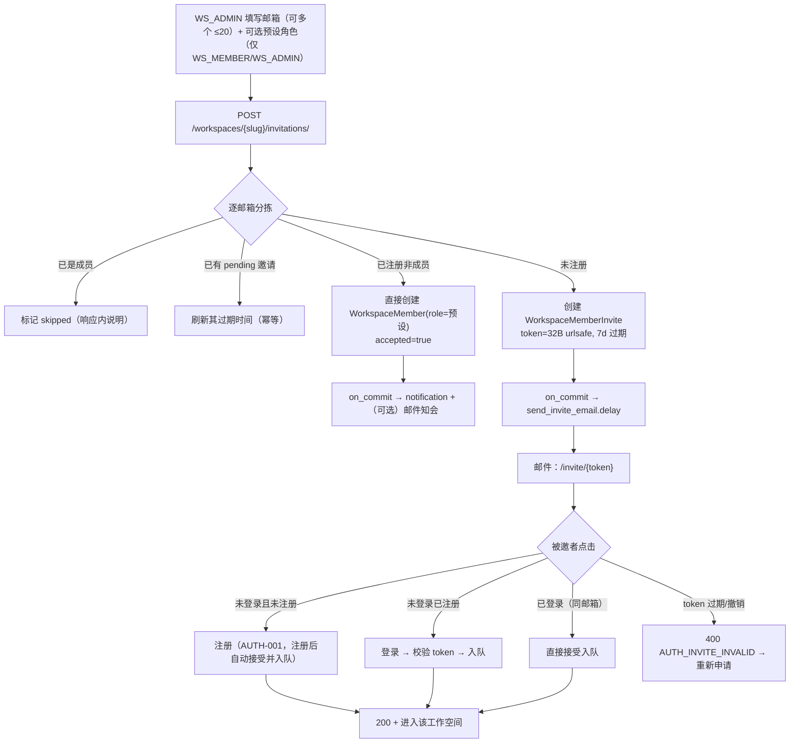
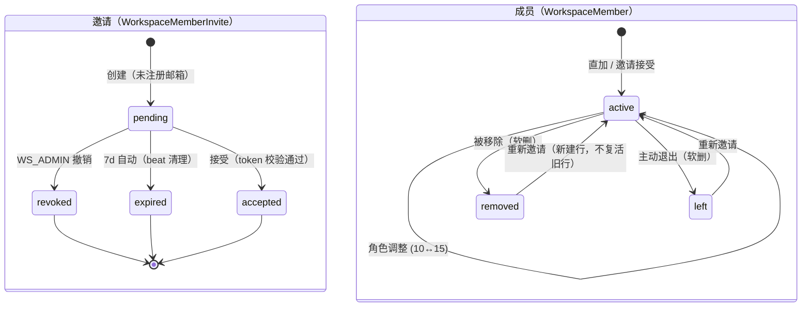
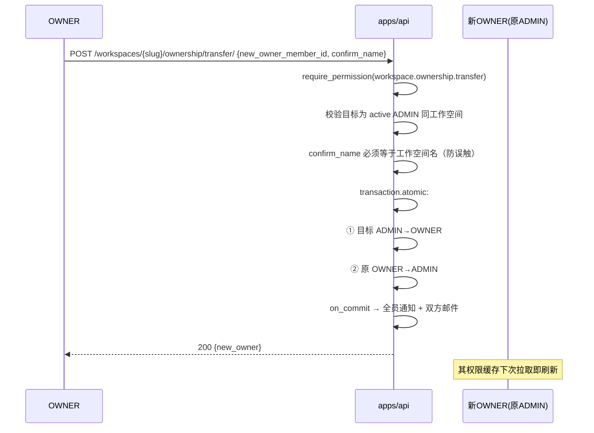
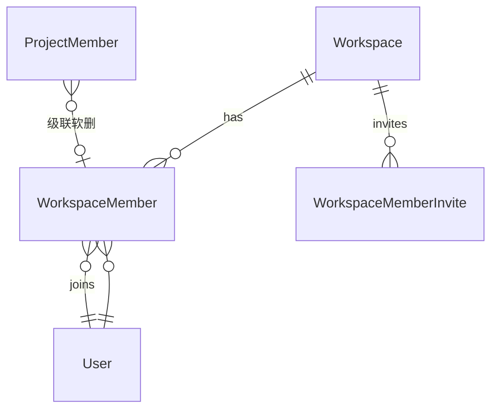

# 团队成员邀请 / 移除 / 角色分配

| 元信息项 | 内容 |
| --- | --- |
| 文档编号 | TEAM-002 |
| 所属迭代 | Sprint 1：MVP 能力补齐（第 3 周） |
| 优先级 | P1（MVP 必备级） |
| 所属模块 | M2-TEAM 团队管理 |
| 文档状态 | 待评审（Draft） |
| 最后更新日期 | 2026-09-01 |
| 上游依据 | `docs/需求文档.md` §3.2（批量添加成员、移除成员、退出团队、团队内角色分配）、§8.2 团队管理 P1 列 |
| 前置依赖 | `TEAM-001`（Workspace 模型 / slug / 默认团队）、`AUTH-001`（注册登录）、`AUTH-004`（邮件通道）、`AUTH-005`（权限矩阵与按钮）、`INFRA-004`（错误信封） |
| 下游依赖 | `PROJ-002`（项目成员候选集来自工作空间成员）、`RPT-001`（按成员聚合统计）、`COLLAB-001`（成员变动通知）、`TEAM-003`（P2 团队归档与全局配置） |
| 架构基线 | [`rbac-permission-model.md`](../architecture/rbac-permission-model.md) §2（WS_* 角色与等级）、§5（权限守护）；[`api-conventions.md`](../architecture/api-conventions.md) §2.5（invitations / members 端点契约） |
| 竞品参考 | Plane（`WorkspaceMemberInvite` 状态机 pending/accepted/revoked + 邮件 token 确认）、Ones（企业通讯录导入 / 审批制入队） |

> **范围声明**：本系统中「团队」即**工作空间（Workspace）**，是数据隔离最外层边界（`glossary.md`）。交付工作空间成员全生命周期：邀请（已注册直加 / 未注册邮件确认）、列表搜索、角色调整、移除、主动退出、所有权转让。企业通讯录批量导入、审批制入队、多级组织（P3 `AUTH-007`）、团队归档（P2 `TEAM-003`）不在范围。

---

## 1. 概述

### 1.1 功能定位

Sprint 0 的团队是「一人孤岛」（POC 排除清单明确砍掉成员邀请）。Sprint 1 的第一天就要打通「把同事拉进来」——这是所有协作功能（派任务、@提醒、评论）的前置条件。本文档交付成员从进入（邀请/接受）到离开（移除/退出/转让）的完整状态机，以及围绕 `WorkspaceMember.role` 的变更治理。

| 交付项 | 说明 |
| --- | --- |
| 批量邀请 | 邮箱数组一次最多 20 个；已注册用户直加为 `WS_MEMBER`；未注册用户收到确认邮件，接受并注册后入队 |
| 邀请治理 | 待接受邀请可撤销、7 天过期自动清理、同邮箱重复邀请幂等 |
| 成员列表 | 搜索（昵称 / 邮箱前缀）、按角色筛选、分页；展示头像 / 角色 / 加入时间 |
| 角色分配 | `WS_MEMBER ↔ WS_ADMIN` 互调（`WS_ADMIN` 权限）；`WS_OWNER` 仅经「所有权转让」产生 |
| 移除成员 | 软移除（`deleted_at`）；级联回收其项目成员资格；邀请人需为 `WS_ADMIN+` |
| 退出团队 | 成员自助；`WS_OWNER` 不可退出（须先转让）；最后一名成员不可退出（须解散，P2 `TEAM-003` 交付解散，本迭代禁止该场景） |
| 所有权转让 | 原 OWNER → 目标 ADMIN，事务内角色互换 + 会话权限刷新 + 全员通知 |

### 1.2 目标用户

| 用户 | 场景 | 关注点 |
| --- | --- | --- |
| 团队管理员 / 所有者 | 组建团队 | 批量拉人一步到位；不希望误操作把 OWNER 交出去 |
| 新成员 | 被邀请 | 一封邮件、一次点击就能进入团队 |
| 普通成员 | 离开团队 | 自助退出，不产生悬挂数据 |

### 1.3 前置依赖说明

| 依赖文档 | 依赖内容 | 缺失后果 |
| --- | --- | --- |
| `TEAM-001` | `Workspace` / `WorkspaceMember` 模型与 slug 语义 | 无承载表 |
| `AUTH-004` | Celery 邮件通道（重试 + 降级） | 邀请邮件不可发 |
| `AUTH-005` | `workspace.member.invite/manage` 等权限点 | 界面与接口守护缺失 |
| `AUTH-003` | 移除后 `accessible_by()` 自然过滤 | 移除成员仍可见数据（隔离失效） |

### 1.4 竞品参考结论（详见第 6 章）

- **Plane**：`WorkspaceMemberInvite` 表带 `token` 与状态机；邀请邮件链接 `/invite/:token` 接受；接受时若已登录直匹配，未注册先注册再接受。**优势**：token 制避免「裸邮箱即可入队」的滥用。
- **Ones**：企业版支持管理员审批入队、通讯录（Excel/LDAP）批量导入、部门挂载。
- **本系统**：邀请链路完全对齐 Plane（token 制）；批量能力收敛为「单请求 20 邮箱」，导入工具后置。

---

## 2. 业务逻辑

### 2.1 邀请流程



### 2.2 成员与邀请状态机



> 重新邀请**新建 `WorkspaceMember` 行**而非复活软删行，保留历史痕迹（审计友好，且 `created_at` 语义准确反映本次加入时间）。

### 2.3 所有权转让流程



### 2.4 业务规则表

| 编号 | 规则 | 判定位置 | 违反后果 |
| --- | --- | --- | --- |
| BR-01 | 单次邀请 ≤ 20 邮箱；邮箱格式校验；去重（大小写归一） | Serializer | 400 `VALIDATION_ERROR` / `TOO_MANY` |
| BR-02 | 邀请角色仅允许 `WS_MEMBER` / `WS_ADMIN`；OWNER 只能经转让产生 | Serializer + Service | 400 `INVALID` |
| BR-03 | 邀请 token 32 字节 urlsafe、7 天过期、一次性；撤销后立即失效 | Model 约束 + Service | 400 `AUTH_INVITE_INVALID` |
| BR-04 | 接受邀请时校验「当前登录用户邮箱 == 邀请邮箱」，防 token 抢用 | Service | 403 `PERM_DENIED` |
| BR-05 | 角色调整仅 `WS_ADMIN+` 可操作，且不可修改 OWNER 行（只能转让） | Permission + Service | 403 / 400 `INVALID` |
| BR-06 | 移除成员：不可移除 OWNER；不可移除自己（走退出）；级联软删其本空间全部 `ProjectMember` | Service（事务） | 400 `INVALID` |
| BR-07 | 退出团队：OWNER 禁退（提示先转让）；工作空间仅剩 1 名 active 成员时禁退（提示转让或等待 P2 解散） | Service | 400 `TEAM_LAST_MEMBER` |
| BR-08 | 转让：目标必须为 active `WS_ADMIN`；`confirm_name` 镜像工作空间名称 | Service | 400 `INVALID` / `REQUIRED` |
| BR-09 | 被移除 / 退出成员的既有 Session 不强制吊销，但下一次携带该空间上下文的请求被 `accessible_by()` 过滤（数据面立即隔离）；管理面（成员表不在集内）立即失效 | DB 层过滤 | 404 |
| BR-10 | 成员列表仅 `WS_MEMBER+` 可见（含 GUEST 不可见——GUEST 本就无空间浏览权） | Permission | 403 |
| BR-11 | 每次成员/角色变更产生 `Notification`（被操作人）与工作空间动态记录（P2 动态流消费，本迭代仅落库） | on_commit | — |
| BR-12 | 移除操作限流：每管理员 30 次/小时（防误触批量踢人） | Throttle | 429 |

### 2.5 异常处理表

| 异常场景 | 触发条件 | HTTP / 错误码 | 前端表现 | 后端处理 |
| --- | --- | --- | --- | --- |
| 邀请自己（已是成员） | 邮箱在 active 集内 | 200 但该条 `skipped` | 逐条结果列表展示「已是成员」 | 不创建邀请 |
| token 失效 | 过期 / 撤销 / 已用 | 400 `AUTH_INVITE_INVALID` | 失效页 + 「联系管理员重新邀请」 | — |
| 邮箱大小写变体 | `Li@x.com` 已是成员再邀 `li@x.com` | skipped | — | 归一化比较（同 `AUTH-001` BR-02） |
| 移除 OWNER | — | 400 `INVALID` | Toast「所有者不可移除，请先转让所有权」 | — |
| 并发转让 | 两个 OWNER 请求（理论仅一个 OWNER） | 第二个 409 `RESOURCE_CONFLICT` | Toast 重试 | `select_for_update` |
| 转让给自己 | new_owner = 自己 | 400 `INVALID` | — | — |
| SMTP 降级模式 | 未配置 SMTP | 邀请照常创建 | 提示「邮件通道未配置，请复制邀请链接」 | 响应 `meta.invite_link` 回显 token 链接（仅 dev/降级时） |

### 2.6 边界条件表

| 边界场景 | 限制值 | 超出处理方式 |
| --- | --- | --- |
| 工作空间成员上限（P1） | 100（标准版软限） | 第 101 个邀请 403 `TEAM_MEMBER_LIMIT` + 升级引导（文案） |
| pending 邀请堆积 | 同邮箱仅 1 条 active | 新邀请刷新旧过期时间（BR 幂等） |
| 批量邀请部分失败 | 逐条独立事务 | 请求级 200，`data[].status ∈ {invited, added, skipped, failed}` |
| 成员列表搜索 | 前缀匹配（昵称 / 邮箱），≤ 64 字符 | trigram 不启用（量小走 ilike 前缀索引） |

---

## 3. UI/UX 设计

### 3.1 页面布局

**成员设置页 `/:workspaceSlug/settings/members`**（`PermissionRouteGuard: workspace.member.manage` 只读降级为 `ReadOnlyMemberList`）：

| 区域 | 组件 | UI 组件 |
| --- | --- | --- |
| 顶栏 | 标题「成员」+ 计数 + 「邀请成员」主按钮（ADMIN+） | `PageHeader` |
| 邀请弹窗 | 多邮箱输入（Tag 化回车确认）+ 角色预设下拉 + 提交 | `MultiEmailInput` / `Select` |
| 筛选条 | 搜索框（昵称 / 邮箱）+ 角色下拉（全部 / 管理员 / 成员） | `SearchInput` / `Select` |
| 成员表 | 头像+昵称+邮箱 / 角色徽章 / 加入时间 / 操作菜单（改角色 / 移除） | `TanStack Table` |
| 待接受区 | 折叠面板「待接受邀请 (N)」：邮箱 / 角色 / 过期倒计时 / 撤销按钮 | `Collapsible` |
| 危险区 | 「转让所有权」按钮（仅 OWNER 可见）+ 二次确认输入工作空间名 | `DangerZone` |

### 3.2 交互细节表

| 交互动作 | 触发方式 | 反馈效果 | 加载态 / 空态 |
| --- | --- | --- | --- |
| 批量邀请结果 | 提交后 | 逐条结果 Toast/列表（invited/added/skipped） | 按钮行内 spinner；结果区骨架 |
| 改角色 | 行内下拉选择 | 乐观更新徽章 → 失败回滚 + Toast | — |
| 移除成员 | 菜单「移除」→ 确认弹窗（列明将同时移出 N 个项目） | 行淡出 | — |
| 撤销邀请 | 待接受区「撤销」 | 行移除 + Toast | — |
| 转让所有权 | DangerZone → 选择目标 ADMIN → 输入空间名确认 | 双重确认弹窗；成功后自身按钮组收敛为 ADMIN 视图 | — |
| 被邀者接受 | 邮件链接 `/invite/:token` | 未登录跳登录（带 next）→ 接受成功 Toast + 进空间 | 失效态独立页面 |

### 3.3 响应式与无障碍

- < 768px 成员表降级为卡片列表；操作菜单保留。
- 邮箱输入 Tag 支持退格删除与粘贴自动切分（逗号 / 分号 / 空格）；屏幕阅读器播报「已添加 n 个邮箱」。
- 危险操作（移除 / 转让）确认弹窗默认焦点在「取消」。

---

## 4. 技术架构

### 4.1 数据模型

```python
class WorkspaceMemberInvite(BaseModel):
    """工作空间邀请 —— token 制，对标 Plane WorkspaceMemberInvite。"""

    class Status(models.TextChoices):
        PENDING = "pending", "待接受"
        ACCEPTED = "accepted", "已接受"
        REVOKED = "revoked", "已撤销"
        EXPIRED = "expired", "已过期"

    workspace = models.ForeignKey(Workspace, on_delete=models.CASCADE, related_name="invites")
    email = models.EmailField(verbose_name="被邀邮箱（归一小写）")
    role = models.IntegerField(default=WorkspaceRole.MEMBER, verbose_name="预设角色")
    token_hash = models.CharField(max_length=64, unique=True, verbose_name="SHA-256(token)")
    status = models.CharField(max_length=16, choices=Status.choices, default=Status.PENDING, db_index=True)
    expires_at = models.DateTimeField(verbose_name="过期时间")
    accepted_at = models.DateTimeField(null=True, blank=True)
    invited_by = models.ForeignKey("db.User", on_delete=models.SET_NULL, null=True, related_name="workspace_invites")

    class Meta(BaseModel.Meta):
        db_table = "workspace_member_invites"
        constraints = [models.UniqueConstraint(
            fields=["workspace", "email"], condition=models.Q(status="pending"),
            name="uniq_pending_invite_per_email")]
        indexes = [models.Index(fields=["workspace", "status"], name="idx_invite_ws_status")]
```



### 4.2 API 定义

| 方法/路径 | 描述 | 权限 |
| --- | --- | --- |
| `GET /api/v1/workspaces/{slug}/members/` | 成员列表（?search=&role=&cursor=） | `WS_MEMBER+` |
| `POST /api/v1/workspaces/{slug}/invitations/` | 批量邀请 | `workspace.member.invite` |
| `GET /api/v1/workspaces/{slug}/invitations/` | 待接受邀请列表 | `workspace.member.manage` |
| `DELETE /api/v1/workspaces/{slug}/invitations/{invite_id}/` | 撤销邀请 | `workspace.member.manage` |
| `POST /api/v1/invitations/{token}/accept/` | 接受邀请（全局端点，token 自带空间上下文） | 匿名→登录态 |
| `PATCH /api/v1/workspaces/{slug}/members/{member_id}/` | 调整角色（10↔15） | `workspace.member.manage` |
| `DELETE /api/v1/workspaces/{slug}/members/{member_id}/` | 移除成员 | `workspace.member.manage` |
| `POST /api/v1/workspaces/{slug}/members/leave/` | 退出团队 | `workspace.member.leave` |
| `POST /api/v1/workspaces/{slug}/ownership/transfer/` | 转让所有权 | `workspace.ownership.transfer` |

**批量邀请示例**：

```json
// POST /api/v1/workspaces/acme/invitations/
// Request
{ "emails": ["liang@ex.com", "wang@ex.com", "zhang@ex.com"], "role": 10 }
// Response 200
{ "status": "success",
  "data": [
    { "email": "liang@ex.com", "status": "added", "member_id": "a1…" },
    { "email": "wang@ex.com", "status": "invited", "invite_id": "b2…", "expires_at": "2026-09-08T00:00:00.000Z" },
    { "email": "zhang@ex.com", "status": "skipped", "reason": "already_member" }
  ] }
```

**成员列表示例**：

```json
{ "status": "success",
  "data": [
    { "id": "m1…", "user": { "id": "6c7d…", "display_name": "梁工", "email": "liang@ex.com", "avatar_url": "…" },
      "role": 15, "joined_at": "2026-09-01T02:00:00.000Z" }
  ],
  "meta": { "next_cursor": "100:1:0", "next_page_results": false, "count": 8, "total_count": 8 } }
```

### 4.3 核心逻辑

```python
class MemberService:
    def remove_member(self, *, workspace: Workspace, member: WorkspaceMember, actor: User) -> None:
        with transaction.atomic():
            member.delete()  # BaseModel 软删除（deleted_at）
            ProjectMember.objects.filter(workspace=workspace, user=member.user).delete()
            NotificationService.bulk_notify(
                receivers=[member.user_id], title="你已被移出工作空间",
                data={"workspace": workspace.slug, "actor": actor.display_name})
            transaction.on_commit(lambda: log_member_event.delay("member.removed", member.id))

    def transfer_ownership(self, *, workspace, target: WorkspaceMember, actor, confirm_name: str) -> None:
        if confirm_name != workspace.name:
            raise AppException("VALIDATION_ERROR", details=[{"field": "confirm_name", "code": "REQUIRED"}])
        with transaction.atomic():
            rows = WorkspaceMember.objects.select_for_update().filter(
                pk__in=[target.pk, actor.membership(workspace).pk])
            # ADMIN→OWNER, OWNER→ADMIN；断言恰两行且角色符合预期，否则 RESOURCE_CONFLICT
            ...
```

**并发策略**：角色调整 / 移除 / 转让对目标行 `select_for_update`；邀请接受的 token 消费用 `select_for_update(skip_locked=True)` + status 原子翻转（`UPDATE … WHERE status='pending'` 乐观检查，两并发接受恰一成功）。

### 4.4 Celery 任务

| 任务 | 触发 | 逻辑 |
| --- | --- | --- |
| `send_invite_email(workspace_id, invite_id)` | on_commit | 渲染纯文本邮件（链接 + 空間名 + 邀请人）；重试 3 次；SMTP 降级为日志 |
| `expire_invites`（beat，每日） | 定时 | `status=pending AND expires_at<now` → `expired` |

### 4.5 前端状态管理

- `MemberStore`：`members`（Map by id）、`invites`、`filters`；action：`invite`（结果合并 skipped 提示）、`changeRole`（乐观 + 回滚）、`remove`（行淡出）、`transferOwnership`。
- 邀请接受页 `/invite/:token`：独立轻路由，成功后 `AuthStore.workspaces` mutate 并跳转该空间。

---

## 5. 测试用例

### 5.1 单元测试

| 用例 ID | 测试目标 | 输入 | 预期输出 | 覆盖类型 |
| --- | --- | --- | --- | --- |
| UT-01 | 已注册直加 | 邀请已注册邮箱 | `added`，成员即现 | 正常 |
| UT-02 | 幂等重邀 | 同邮箱两次 | 第二次刷新过期时间，不新建行 | 边界 |
| UT-03 | token 抢用 | A 的 token 由 B（已登录）接受 | 403 | 安全 |
| UT-04 | 移除级联 | 移除属于 3 个项目的成员 | 3 条 ProjectMember 软删 | 正常 |
| UT-05 | OWNER 禁退 | OWNER 调 leave | 400 `INVALID` | 边界 |
| UT-06 | 最后成员禁退 | 仅 1 active 成员 | 400 `TEAM_LAST_MEMBER` | 边界 |
| UT-07 | 转让原子性 | 转让中途注入异常 | 两角色均未变化 | 事务 |
| UT-08 | 软删隔离 | 被移除者访问原空间资源 | 404（accessible_by 过滤） | 安全 |
| UT-09 | 归一化比较 | 邀请 `Li@EX.com` vs 成员 `li@ex.com` | skipped | 边界 |
| UT-10 | 成员上限 | 第 101 个邀请 | 403 `TEAM_MEMBER_LIMIT` | 边界 |

### 5.2 集成测试

| 用例 ID | 场景 | 前置条件 | 操作步骤 | 预期结果 |
| --- | --- | --- | --- | --- |
| IT-01 | 全邀请链路（未注册） | SMTP 降级 | 邀请 → 取日志链接 → 注册 → 断言 | 自动入队为预设角色 |
| IT-02 | 撤销后接受 | pending 邀请 | 撤销 → 访问链接 | 400 `AUTH_INVITE_INVALID` |
| IT-03 | 并发接受 | 同 token 两请求 | — | 恰一 200 |
| IT-04 | 降权后收敛 | ADMIN 被降 MEMBER | 前端 mutate 后 | 设置入口消失（联动 `AUTH-005` IT-02） |
| IT-05 | 转让端到端 | OWNER + 1 ADMIN | 转让 → 双方分别操作 | 新 OWNER 可管理；旧 OWNER 失去 ownership 按钮但保留 ADMIN |

### 5.3 E2E 测试

| 用例 ID | 用户场景 | 操作路径 | 验收标准 |
| --- | --- | --- | --- |
| E2E-01 | 管理员拉同事入队 | 邀请 2 邮箱（1 已注册） | 一直接出现在列表；一收到邮件并 3 步内完成入队 |
| E2E-02 | 移除成员回收数据 | 移除后该成员刷新页面 | 看不到原空间任何项目 / 任务 |
| E2E-03 | 角色自助旅程 | MEMBER→ADMIN→建项目→被降权 | 每步界面按钮显隐正确收敛 |

---

## 6. 竞品深度对标

### 6.1 Plane 实现分析

`WorkspaceMemberInvite`（email / accepted / token / role）+ 邮件确认；接受时区分「已注册 / 未注册」两条路径；EE 版叠加邀请审批与配额。**优势**：状态机简洁成熟，token 校验收敛在单一端点。**劣势**：批量邀请逐条发请求；移除成员对项目成员的级联清理依赖各 ViewSet 自行处理，存在残留死角。

### 6.2 Ones 实现分析

企业入队走「审批 + 通讯录」：管理员可配置是否需要审批、支持 Excel / LDAP 批量导入、入队即挂部门岗位。强大但重，依赖组织架构模块。

### 6.3 本系统设计决策

1. **批量邀请单请求事务分拣**：一次 POST 返回逐条结果（added/invited/skipped），比 Plane 少 N-1 次往返，且天然幂等。
2. **移除级联收口在 Service 层事务**：`WorkspaceMember` 软删 + 同事务级联 `ProjectMember`，修复 Plane 式残留死角；配合 `accessible_by()` 达到「管理面立即失效、数据面立即不可见」。
3. **token 存哈希 + 邮箱绑定校验**（BR-04）：邀请链接泄露也不可被他人冒用。
4. **差异化价值**：以 Plane 的轻量状态机获得 Ones 级「入队即治理」的组织卫生（无悬挂权限、无孤儿数据），且转让 / 退出 / 上限等边界全部显式定义，10 人团队零管理成本。

---

## 7. 里程碑与验收

### 7.1 交付物清单

| 类型 | 交付物 |
| --- | --- |
| Model / Migration | `WorkspaceMemberInvite` 新表（唯一 pending 约束 + 索引） |
| API 端点 | §4.2 全部 9 个端点 |
| 后端 | `MemberService`（邀请分拣 / 移除级联 / 转让）、`send_invite_email`、beat `expire_invites` |
| 前端页面 / 组件 | 成员设置页、邀请弹窗、待接受面板、`/invite/:token` 接受页、DangerZone 转让 |
| 通知 | 入队 / 移除 / 角色变更 / 转让 4 类 `Notification`（消费方 `COLLAB-001`） |
| 测试 | UT-01~10、IT-01~05、E2E-01~03 |

### 7.2 可操作演示的验收标准

1. 管理员一次邀请 3 人（已注册 / 未注册 / 重复邮箱），结果逐条可见：一人即时入队、一人收到链接 3 步完成入队、一人提示已是成员。
2. 被邀者完成入队后，管理员在 `PROJ-002` 的成员选择器中立即可见该成员。
3. 移除某成员后，该成员浏览器刷新即与原空间数据完全隔离（404）；其项目成员资格同步消失。
4. OWNER 完成「输入空间名」双重确认转让后，新 OWNER 拥有全部管理按钮，原 OWNER 自动降为 ADMIN；全程无权限真空（任一时刻空间恰有一个 OWNER）。
5. pending 邀请 7 天后由 beat 自动标记过期，链接访问返回失效页。
