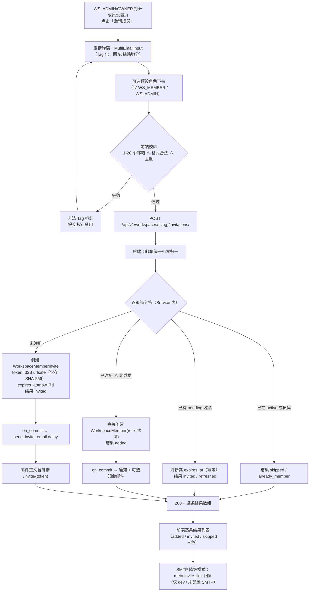
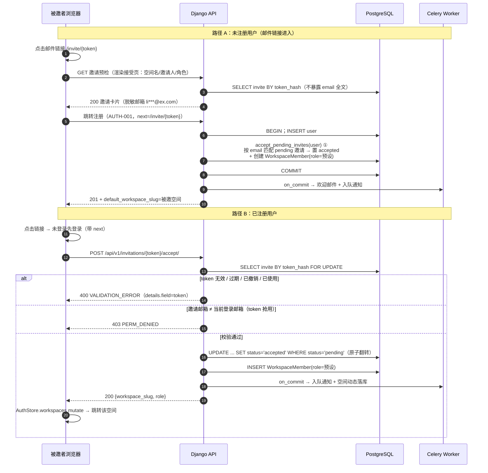
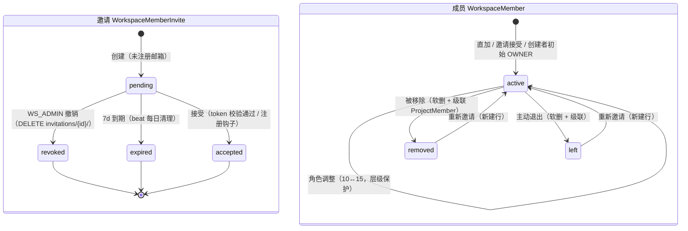
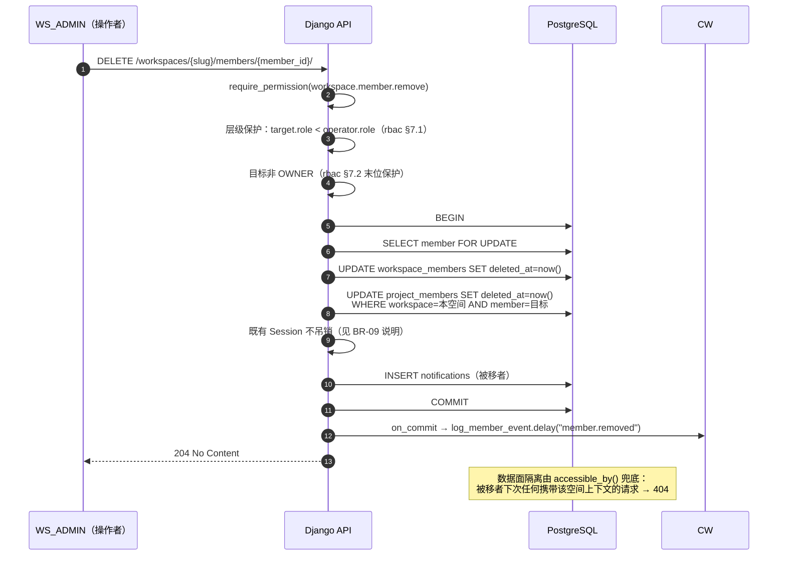
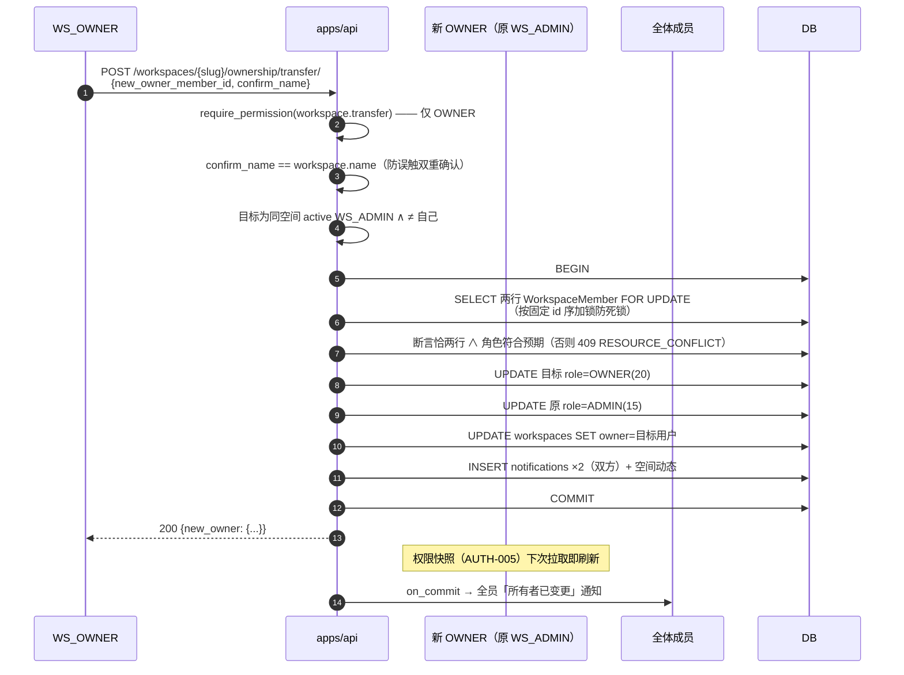
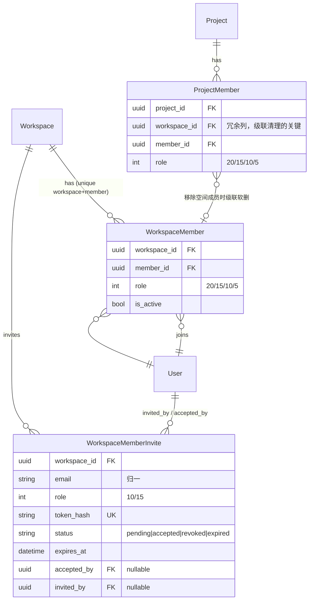

# 团队成员邀请 / 移除 / 角色分配

| 元信息项 | 内容 |
| --- | --- |
| 文档编号 | TEAM-002 |
| 所属迭代 | Sprint 1：MVP 能力补齐（第 3 周） |
| 优先级 | P1（MVP 必备级 · **本迭代协作能力的第一前置**） |
| 所属模块 | M2-TEAM｜团队管理 |
| 文档状态 | 待评审（Draft） |
| 最后更新日期 | 2026-09-01 |
| 上游依据 | `docs/需求文档.md` §3.2（批量添加成员、移除成员、退出团队、团队内角色分配）、§8.2 团队管理 P1 列 |
| 前置依赖 | `TEAM-001`（Workspace 模型 / slug / 默认团队 / `WorkspaceMember` 基线）、`AUTH-001`（注册登录 / 注册钩子）、`AUTH-003`（`accessible_by()` 行级过滤）、`AUTH-004`（Celery 邮件通道与 SMTP 降级）、`AUTH-005`（权限矩阵与按钮守护）、`INFRA-004`（错误信封 / 全局异常） |
| 下游消费 | `PROJ-002`（项目成员候选集 = 工作空间成员）、`TASK-002`（指派人选择器）、`COLLAB-001`（消费本文档落库的 4 类成员变动 Notification）、`RPT-001`（按成员聚合统计）、`TEAM-003`（P2 团队归档与全局配置，其中「解散团队」承接本文档留出的末位成员场景） |
| 关联架构文档 | [`rbac-permission-model.md`](../architecture/rbac-permission-model.md) §2.2（WS_* 角色等级）、§7（层级保护 / 末位 Owner / GUEST 限制 / 转让规则）、§8.1（权限矩阵）、[`api-conventions.md`](../architecture/api-conventions.md) §2.5（invitations / members 端点契约）、§2.6（动作子资源）、§4（信封）、§8（错误码）、[`unified-issue-model.md`](../architecture/unified-issue-model.md) §2.2（BaseModel 软删除） |
| 对标基线 | Plane `WorkspaceMemberInvite`（token 状态机 pending/accepted/revoked + 邮件确认） · Ones 企业通讯录导入 / 审批制入队 |
| 工作量估算 | 后端 2.5 人日 / 前端 3 人日 / 联调与测试 1.5 人日，合计 **7 人日** |

> **范围声明**：本系统中「团队」即**工作空间（Workspace）**，是数据隔离最外层边界（`glossary.md`，口径见 `TEAM-001` §1.2）。本文档交付工作空间成员的完整生命周期：邀请（已注册直加 / 未注册邮件 token 确认）、列表搜索、角色调整、移除、主动退出、所有权转让。企业通讯录批量导入、审批制入队、多级组织（P3 `AUTH-007`）、团队归档与解散（P2 `TEAM-003`）不在范围。

---

## 1. 概述

### 1.1 功能定位

Sprint 0 的团队是「一人孤岛」——POC 排除清单明确砍掉成员邀请（`需求文档.md` §8.3）。Sprint 1 的第一天就要打通「把同事拉进来」：这是所有协作能力（派任务、@提醒、评论、通知）的**组织前置条件**——没有第二个成员，`TASK-002` 的指派人选择器、`COLLAB-001` 的通知中心都无的放矢。

本文档交付两条主线：

1. **成员生命周期状态机**：邀请（pending → accepted / revoked / expired）与成员（active → removed / left → 重新加入），及其与项目成员资格（`ProjectMember`）的级联关系；
2. **角色治理**：`WS_MEMBER ↔ WS_ADMIN` 的受控互调、层级保护（不能管理同级及以上）、末位 OWNER 保护、所有权转让的原子互换。

工程上本功能确立两个可复用范式，供 `PROJ-002` 直接沿袭：**「批量操作逐条分拣 + 逐条结果返回」**（一次 POST 返回 added / invited / skipped 逐条结果）与**「软删除 + 级联清理收口在同一 Service 事务」**（管理面立即失效、数据面立即不可见）。

### 1.2 关键约定矩阵（能力 × 迭代）

> ⚠️ **邀请 token 是本功能最重要的安全设计**：邀请链接泄露也不能被他人冒用（token 存哈希 + 邮箱绑定校验，BR-03 / BR-04）。

| 能力 | P0（TEAM-001） | P1（本文档） | P2+（后置） |
| --- | --- | --- | --- |
| 成员表 `WorkspaceMember` | ✅ 建表（仅创建者 OWNER 一行） | ✅ 多成员读写 | 部门挂载 P3 `AUTH-007` |
| 邀请入口 | ❌ | ✅ 邮箱邀请（直加 / 邮件确认） | 通讯录 Excel 导入 P3 |
| 邀请审批 | ❌ | ❌（默认免审批） | 审批制入队（Ones 式）不排期 |
| 角色调整 | ❌ | ✅ MEMBER↔ADMIN | 自定义角色 P3 `AUTH-008` |
| 移除 / 退出 | ❌ | ✅（软删 + 级联） | — |
| 所有权转让 | ❌ | ✅（双重确认 + 原子互换） | — |
| 成员上限 | 不限 | **100 软限**（标准版） | 席位计费 `QUOTA_MEMBER_EXCEEDED` P4 |
| 解散团队 | ❌ | ❌（末位成员禁退，规避无主状态） | `TEAM-003` |
| 成员活跃度统计 | ❌ | ❌ | `TEAM-003` |

### 1.3 范围边界

| 能力 | P1（本文档） | 归属 |
| --- | --- | --- |
| 批量邀请（≤ 20 邮箱 / 请求） | ✅ | — |
| 已注册用户直加 | ✅ | — |
| 未注册用户邮件 token 确认 | ✅ | — |
| 注册钩子自动接受 pending 邀请 | ✅ | — |
| 邀请撤销 / 7 天过期清理 | ✅ | — |
| 成员列表 + 搜索 + 角色筛选 | ✅ | — |
| 角色调整（含层级保护） | ✅ | — |
| 移除成员（级联回收项目资格） | ✅ | — |
| 成员自助退出 | ✅ | — |
| 所有权转让 | ✅ | — |
| 项目级成员管理 | ❌ | `PROJ-002`（同 Sprint） |
| 成员变动通知推送 UI | 落库 only | 通知中心界面 `COLLAB-001` |
| 解散团队 / 归档 | ❌ | `TEAM-003` |
| GUEST 降级的项目角色联动 | ❌ | P2 `AUTH-006`（`rbac-permission-model.md` §7.3 降级保护规则） |

### 1.4 前置依赖

| 依赖文档 | 依赖内容 | 阻塞原因 |
| --- | --- | --- |
| `TEAM-001` | `Workspace` / `WorkspaceMember` 模型、slug 路由、`WorkspaceBasePermission`（L1） | 无承载表与鉴权基类 |
| `AUTH-001` | 注册视图事务（本迭代在其内挂「自动接受 pending 邀请」钩子）、Session 体系 | 未注册邀请无法闭环 |
| `AUTH-003` | `Workspace.objects.accessible_by(user)` 行级过滤 | 移除后数据面隔离失效 |
| `AUTH-004` | Celery 邮件通道（重试 3 次 + SMTP 未配置时降级日志投递，见 `INFRA-004` §4） | 邀请邮件不可发 |
| `AUTH-005` | `workspace.member.invite / manage / remove / leave / read`、`workspace.transfer` 权限点与 `<PermissionGate>` | 界面与接口守护缺失 |
| `INFRA-004` | 统一错误信封 / `request_id` / 结构化日志 | 错误契约 |

### 1.5 竞品参考

| 竞品 | 参考点 | 本功能处置 |
| --- | --- | --- |
| Plane | `WorkspaceMemberInvite` 表（email / token / role / accepted）+ 邮件链接 `/invite/:token` 接受；接受时区分已注册 / 未注册两路径 | **邀请链路完全对齐**（token 制防「裸邮箱即可入队」滥用），叠加哈希存储与邮箱绑定校验（§6.1） |
| Plane | 移除成员对项目成员的级联清理分散在各 ViewSet | **收口到本文档 Service 单事务**（修复残留死角） |
| Ones | 企业入队走「审批 + 通讯录」（Excel / LDAP 批量导入、入队即挂部门岗位） | P1 不做（依赖组织架构模块 P3）；批量能力收敛为「单请求 ≤ 20 邮箱」 |
| Ones | 成员生命周期治理（无悬挂权限、无孤儿数据） | **组织卫生目标采纳**，实现走轻量路线 |

---

## 2. 业务逻辑

### 2.1 批量邀请主流程



**分拣算法要点**（完整实现见 §4.3.1）：

| 步骤 | 说明 |
| --- | --- |
| 归一化 | 全部邮箱 `strip().lower()` 后比较，杜绝 `Li@x.com` 与 `li@ex.com` 双行（与 `AUTH-001` BR-02 同口径） |
| 一次取数 | active 成员邮箱集与 pending 邀请邮箱集**各一次查询取全**，20 个邮箱的判定在内存完成，不逐条打库 |
| 逐条独立 | 单条失败（如邮件格式在服务端再次被判非法）不影响其他条目，结果标记 `failed` 并附 `error.message` |
| 幂等 | 同邮箱重复邀请不新建行，只把既有 pending 邀请的 `expires_at` 顺延 7 天并重发邮件 |

### 2.2 邀请接受时序（未注册 / 已注册两路径）



① **注册钩子的实现位置**：与 `TEAM-001` §2.2「注册自动初始化默认工作空间」同一决策——在注册视图事务内**显式调用**，不用 `post_save` signal（测试工厂造用户不产生副作用、事务边界可读）。

**并发接受防护**：同一 token 被并发提交两次时，`UPDATE ... WHERE status='pending'` 的原子翻转保证恰有一个请求更新成功（`rowcount == 1`）；落败方读到 `status='accepted'` 后返回 400（token 已使用）。见 §4.3.2。

### 2.3 成员与邀请双状态机



| 状态迁移 | 触发方 | 守卫条件 | 副作用 |
| --- | --- | --- | --- |
| pending → accepted | 被邀者 / 注册钩子 | token 有效 ∧ 邮箱匹配 | 建 `WorkspaceMember`；通知；空间动态 |
| pending → revoked | ADMIN+ | `workspace.member.invite` | 无（行保留供审计） |
| pending → expired | beat 定时 | `expires_at < now` | 无（行保留） |
| active → removed | ADMIN+ | `workspace.member.remove`；不可移 OWNER（末位保护 §7.2） | 级联软删 `ProjectMember`；通知被移者 |
| active → left | 本人 | `workspace.member.leave`；OWNER 禁退；末位成员禁退 | 级联软删 `ProjectMember` |
| removed/left → active | ADMIN+ 重新邀请 | 同新建 | **新建 `WorkspaceMember` 行**，不复活旧行 |

> **重新邀请新建行而非复活软删行**：保留历史痕迹（审计友好），且 `created_at` 语义准确反映「本次加入时间」（成员列表「加入时间」列与 `RPT-001` 活跃度统计依赖它）。唯一约束 `unique_together("workspace","member")` 基于 `SoftDeleteManager` 的可见集合判定，软删行不阻塞新行插入（同 `INFRA-003` 软删除口径）。

### 2.4 移除成员的级联清理时序



**为什么 `IssueAssignee` 不清理**：任务指派是业务数据而非准入凭证。保留指派记录使「该成员的历史贡献」可追溯；其不可见性由项目可见性传导（`Issue` 经 `project` 过滤）。前端对「已移出成员」的指派以灰头像 + 「已移出」标记展示（`TASK-002` 口径），P2 `TASK-007` 交付转交能力。

### 2.5 所有权转让流程



**不变量**：任一时刻工作空间**恰有一个 OWNER**。互换在同一事务内完成，无权限真空窗口。转让后原 OWNER 自动降为 `WS_ADMIN`（`rbac-permission-model.md` §7.5）。

### 2.6 业务规则汇总

| 编号 | 规则 | 约束位置 | 违反后果 |
| --- | --- | --- | --- |
| BR-01 | 单次邀请 1 ~ 20 邮箱；邮箱格式校验；请求内去重（大小写归一） | Serializer | 400 `VALIDATION_ERROR`（`TOO_LONG` / `INVALID` / `REQUIRED` 子码） |
| BR-02 | 邀请预设角色仅 `WS_MEMBER`(10) / `WS_ADMIN`(15)；OWNER(20) 只能经转让产生 | Serializer + Service | 400 `VALIDATION_ERROR` + `NOT_A_CHOICE` / `INVALID` |
| BR-03 | token 32 字节 urlsafe、仅存 SHA-256 哈希、7 天过期、一次性（accepted 后失效）；撤销立即失效 | Model + Service | 400 `VALIDATION_ERROR`（`details.field=token`，message 区分过期/撤销/已使用/无效） |
| BR-04 | 接受邀请校验「当前登录用户邮箱 == 邀请邮箱」（token 抢用防护） | Service | 403 `PERM_DENIED` |
| BR-05 | 角色调整仅 `workspace.member.manage` 持有者；层级保护：target.role < operator.role 且 new_role < operator.role（rbac §7.1，ADMIN 之间不可互改）；不可修改 OWNER 行（只能转让）；不可修改自己的角色 | Permission + Service | 403 `PERM_ROLE_INSUFFICIENT` / 400 `VALIDATION_ERROR` |
| BR-06 | 移除成员：不可移除 OWNER；不可移除自己（走退出）；同事务级联软删其在本空间全部 `ProjectMember` | Service（事务） | 409 `RESOURCE_STATE_INVALID` / 400 `VALIDATION_ERROR` |
| BR-07 | 退出团队：OWNER 禁退（提示先转让）；工作空间仅剩 1 名 active 成员时禁退（避免无主空间；解散由 P2 `TEAM-003` 提供） | Service | 409 `RESOURCE_STATE_INVALID` |
| BR-08 | 转让：仅 OWNER；目标必须为 active `WS_ADMIN`；`confirm_name` 精确等于工作空间名 | Service | 403 / 400 `VALIDATION_ERROR`（`details.field=confirm_name`） |
| BR-09 | 被移除 / 退出成员的既有 Session **不强制吊销**：数据面由 `accessible_by()` 立即过滤（下次请求 404），管理面（成员表不在集内）立即失效。不吊销的理由：Session 可能同时承载其**其他**工作空间的合法上下文，整体吊销属过度执行 | DB 行级过滤 | 404 `RESOURCE_NOT_FOUND` |
| BR-10 | 成员列表仅 `workspace.member.read`（WS_MEMBER+）可见；GUEST 不可见 | Permission | 403 `PERM_NOT_WORKSPACE_MEMBER` / `PERM_ROLE_INSUFFICIENT` |
| BR-11 | 每次成员 / 角色变更产生 `Notification`（被操作人）与工作空间动态记录（本迭代仅落库，`COLLAB-001` 消费） | `transaction.on_commit` | — |
| BR-12 | 移除操作限流：每管理员 30 次 / 小时（防误触批量踢人）；邀请 10 次 / 分钟（批量端点，对齐 `api-conventions.md` §7.2） | Throttle | 429 `RATE_LIMIT_EXCEEDED` |
| BR-13 | 同邮箱同时只允许一条 pending 邀请（`uniq_pending_invite_per_email` 偏条件唯一约束兜底） | DB 约束 | 409 `RESOURCE_ALREADY_EXISTS`（并发竞态时） |
| BR-14 | 邀请结果响应不泄露「该邮箱是否已注册于系统」：`invited` 与 `added` 的区分仅返回给操作的管理员（管理员本就有权知道），对外部不可枚举 | API 设计 | — |

### 2.7 异常处理

| 异常场景 | 触发条件 | HTTP | 错误码 / 子码 | 前端表现 | 后端处理 |
| --- | --- | --- | --- | --- | --- |
| 邀请邮箱已是成员 | 邮箱在 active 集内 | 200 | —（该条 `skipped` / `already_member`） | 结果列表逐条展示「已是成员」 | 不创建任何记录 |
| 邮箱格式非法 | 服务端二次校验失败 | 200 | —（该条 `failed` + message） | 该 Tag 标红 | 跳过该条 |
| token 已过期 | `expires_at < now` | 400 | `VALIDATION_ERROR` + `details.field=token` | 失效页「邀请已过期，请联系管理员重新邀请」 | 不暴露具体过期时间 |
| token 已撤销 / 已使用 / 无效 | status ≠ pending 或哈希不匹配 | 400 | 同上（message 区分） | 失效页（文案对应） | 统一 400，防枚举 |
| token 抢用 | 登录邮箱 ≠ 邀请邮箱 | 403 | `PERM_DENIED` | 「该邀请不属于当前账号」 | — |
| 邮箱大小写变体 | `Li@x.com` 已是成员再邀 `li@ex.com` | 200 | skipped | — | 归一化比较 |
| 移除 OWNER | target.role == 20 | 409 | `RESOURCE_STATE_INVALID` | Toast「所有者不可移除，请先转让所有权」 | — |
| 移除 / 降级同级及以上 | target.role ≥ operator.role | 403 | `PERM_ROLE_INSUFFICIENT` | Toast「不能管理权限等级不低于自己的成员」 | rbac §7.1 |
| 并发转让 | 两请求竞争（理论仅一 OWNER，防御性） | 409 | `RESOURCE_CONFLICT` | Toast 重试 | `select_for_update` + 角色断言 |
| 转让给自己 | new_owner = 自己 | 400 | `VALIDATION_ERROR` + `INVALID` | — | — |
| confirm_name 不匹配 | 输入 ≠ 工作空间名 | 400 | `VALIDATION_ERROR` + `details.field=confirm_name, code=INVALID` | 输入框标红 | — |
| 末位成员退出 | active 成员数 == 1 | 409 | `RESOURCE_STATE_INVALID` | 「团队仅剩你一人，转让或等待解散能力（TEAM-003）」 | — |
| OWNER 退出 | role == 20 | 409 | `RESOURCE_STATE_INVALID` | 「请先转让所有权」 | — |
| 成员上限 | 第 101 个成员 | 409 | `QUOTA_MEMBER_EXCEEDED` | 升级引导文案（标准版软限） | Service 前置断言 |
| SMTP 降级模式 | 未配置 `SMTP_HOST`（`INFRA-004` 降级口径） | 200 | — | 提示「邮件通道未配置，请复制邀请链接」 | 邀请照常创建；`meta.invite_links` 回显（仅 dev / 降级时）；邮件投递降级为日志 |
| 触发限流 | 1 小时移除 > 30 次 / 1 分钟邀请 > 10 次 | 429 | `RATE_LIMIT_EXCEEDED` | Toast + `Retry-After` | Throttle 层 |

> **token 失效为何用 400 而非 401 `AUTH_TOKEN_*`**：`api-conventions.md` §8.9 规定前端对 `AUTH_*`（401）统一执行「清用户态 → 跳登录」。而邀请接受的主体是**已登录用户**，业务性 token 失效不应触发登出跳转，否则形成「登录 → 跳回 → 再登录」死循环。因此邀请 token 按请求参数校验失败处理（400 `VALIDATION_ERROR` + `details.field=token`），文案区分四种失效原因。

### 2.8 边界条件

| 边界场景 | 限制值 | 超出处理方式 |
| --- | --- | --- |
| 单次邀请邮箱数 | 20 | 400 `VALIDATION_ERROR` + `TOO_LONG`（message 给出上限） |
| 工作空间成员上限（P1 标准版软限） | 100 | 第 101 个邀请该条 `failed`（reason=`member_limit`）或整请求 409 `QUOTA_MEMBER_EXCEEDED`（当 20 条全部越限时）；文案引导 |
| pending 邀请堆积 | 同邮箱仅 1 条 active（BR-13） | 重邀刷新过期时间（幂等） |
| 邀请过期窗口 | 7 × 24 h | beat 每日 03:30 批量置 `expired`；过期后链接立即不可用（实时判定，不依赖 beat） |
| 成员列表搜索 | 前缀匹配（display_name / email），≤ 64 字符 | 超长 400 `TOO_LONG`；量级小走 `istartswith`（不启用 trigram） |
| 批量邀请部分失败 | 逐条独立判定 | 请求级 200，`data[].status ∈ {added, invited, skipped, failed}` |
| token 尝试次数 | 同 IP 20 次 / 10 分钟（防暴力猜 token） | 429 `RATE_LIMIT_EXCEEDED` |

---

## 3. UI/UX 设计

### 3.1 成员设置页

路由 `/:workspaceSlug/settings/members`。`<PermissionRouteGate permission="workspace.member.read">` 守护；无 `invite/manage` 权限的用户降级为只读列表（操作列隐藏）。

```
┌────────────────────────────────────────────────────────────────────────────┐
│  成员                                                        8 名成员     │
│                                        ┌────────────────────────────────┐  │
│                                        │ ＋ 邀请成员       （ADMIN+）   │  │
│                                        └────────────────────────────────┘  │
├────────────────────────────────────────────────────────────────────────────┤
│ ┌──────────────────────────────┐ ┌──────────────────┐                      │
│ │ 🔍 搜索昵称或邮箱…            │ │ 角色 ▾（全部）    │   ← 筛选条          │
│ └──────────────────────────────┘ └──────────────────┘                      │
├────────────────────────────────────────────────────────────────────────────┤
│ ▸ 待接受邀请 (2)                                                〔展开〕  │
├─────────┬──────────────────────────────┬─────────┬───────────┬──────────┤
│ 成员     │ 邮箱                          │ 角色     │ 加入时间    │ 操作 ⋯   │
├─────────┼──────────────────────────────┼─────────┼───────────┼──────────┤
│ 👤 张三  │ zhangsan@ex.com              │ ● 所有者 │ 09-01 02:14│ （无）    │
│ 👤 梁工  │ liang@ex.com                  │ ▾ 管理员 │ 09-01 08:00│ 改角色/移除│
│ 👤 王工  │ wang@ex.com                   │ ▾ 成员   │ 09-02 10:11│ 改角色/移除│
│ 👤 …     │ …                             │ ▾ 成员   │ …          │ …        │
└─────────┴──────────────────────────────┴─────────┴───────────┴──────────┘
（表格底部）                                          〔加载更多 (2)〕      │
├────────────────────────────────────────────────────────────────────────────┤
│ ⚠️ 危险区域（仅 OWNER 可见）                                                 │
│ 转让所有权后你将成为管理员，且不可自助撤销。        ┌────────────────┐      │
│                                                    │  转让所有权      │      │
│                                                    └────────────────┘      │
└────────────────────────────────────────────────────────────────────────────┘
```

| 元素 | 规格 |
| --- | --- |
| 页头 | 标题「成员」+ 计数（active 成员数聚合）；「邀请成员」主按钮由 `<PermissionGate permission="workspace.member.invite">` 包裹 |
| 筛选条 | 搜索框 300ms 防抖 → `?search=`；角色下拉（全部 / 管理员+所有者 / 成员）→ `?role__gte=` |
| 成员表 | TanStack Table。列：头像+昵称（24px + `truncate`）/ 邮箱（`font-mono text-xs`）/ 角色徽章 / 加入时间（`date-fns` `MM-dd HH:mm`）/ 操作菜单 |
| 角色徽章 | 所有者 `#8B5CF6` 紫 / 管理员 `#3B82F6` 蓝 / 成员 `#6B7280` 灰；圆点 + 文字（色盲可达） |
| 角色行内下拉 | 仅 `workspace.member.manage` 持有者且目标非 OWNER 且目标等级低于自己时可见（BR-05）；选项依层级保护过滤（ADMIN 只能给 MEMBER 档） |
| 操作菜单 | `more-horizontal`：「调整角色」「移除」（红色，`workspace.member.remove` + 层级保护双重判定） |
| 待接受面板 | `Collapsible` 折叠区：邮箱（脱敏）/ 预设角色 / 过期倒计时（`<72h` 橙色）/ 「撤销」次级按钮 / 「重发邮件」 |
| 危险区域 | `border-red-200 bg-red-50` 分区；转让按钮仅 `workspace.transfer`（OWNER）可见 |

### 3.2 邀请成员弹窗

Headless UI `Dialog`，宽 560px。

```
┌──────────────────────────────────────────────────────────────┐
│  邀请成员加入「RabbitProjects」                            ✕  │
│                                                              │
│  邮箱（1-20 个）                                              │
│  ┌────────────────────────────────────────────────────────┐  │
│  │ ┌─────────────┐ ┌──────────┐                            │  │
│  │ │ liang@ex.com ✕│ │ wang@ex ✕│  继续输入或粘贴…          │  │  │
│  │ └─────────────┘ └──────────┘                            │  │
│  └────────────────────────────────────────────────────────┘  │
│  支持逗号 / 分号 / 空格 / 换行分隔，粘贴自动切分                │
│                                                              │
│  预设角色                                                     │
│  ┌────────────────┐                                          │
│  │ ● 成员        ▾ │                                          │
│  └────────────────┘                                          │
│  成员可参与协作；管理员可管理成员与项目（对标 §8.1 权限矩阵）    │
│                                                              │
│              ┌────────┐  ┌────────────────────────┐         │
│              │  取消   │  │  发送邀请（2）           │         │
│              └────────┘  └────────────────────────┘         │
└──────────────────────────────────────────────────────────────┘
        ↓ 提交后（逐条结果视图，替换表单区）
┌──────────────────────────────────────────────────────────────┐
│  邀请结果                                                     │
│  ✅ liang@ex.com    已直接加入（成员）                         │
│  ✉️ wang@ex.com     邮件已发送，7 天内有效                     │
│  ⏭️ zhang@ex.com    已是成员，已跳过                           │
│                              ┌────────┐  ┌──────────────┐    │
│                              │ 继续邀请 │  │  完成          │    │
│                              └────────┘  └──────────────┘    │
└──────────────────────────────────────────────────────────────┘
```

| 行为 | 规格 |
| --- | --- |
| Tag 输入 | 回车 / 逗号 / 分号 / 空格 / 粘贴切分为 Tag；退格删除末 Tag；每个 Tag 实时格式校验，非法 Tag 红框 |
| 计数 | 输入区下方 `n / 20`，达到 20 后不再接受新 Tag（输入禁用 + 提示） |
| 预设角色 | 仅「成员 / 管理员」两项（BR-02）；下拉项附一行能力说明（`aria-describedby`） |
| 提交中 | 按钮 loading（`loader-2` 旋转 + 「发送中…」），Modal 锁定 |
| 结果视图 | 三态图标：`check-circle`（added，绿）/ `mail`（invited，蓝）/ `skip-forward`（skipped，灰）/ `x-circle`（failed，红 + message） |
| SMTP 降级 | invited 条目追加「复制邀请链接」按钮（读 `meta.invite_links[email]`） |
| 继续邀请 | 清空 Tag 保留角色选择，回到输入态 |
| 关闭 | ✕ / `Esc` / 遮罩（提交中不可关；表单有内容时二次确认） |

### 3.3 邀请接受页（`/invite/:token`）

独立轻路由（不进工作空间布局），三种形态：

```
① 有效邀请（未登录 → 先跳登录/注册，next 带回本页；已登录且邮箱匹配）
┌────────────────────────────────────────────┐
│            🅣  RabbitProjects                │
│                                            │
│      张三 邀请你加入该团队                    │
│      邀请邮箱：li***@ex.com                  │
│      你将获得角色：成员                       │
│                                            │
│            ┌──────────────────┐             │
│            │   接受邀请        │             │
│            └──────────────────┘             │
└────────────────────────────────────────────┘

② 邮箱不匹配（已登录其他账号）
   同布局，正文：「该邀请面向 li***@ex.com，当前账号不匹配」＋「切换账号」按钮

③ token 失效（过期 / 撤销 / 已使用 / 无效）
   同布局，正文按 message 区分 ＋「联系管理员重新邀请」说明，无操作按钮
```

| 行为 | 规格 |
| --- | --- |
| 预检 | 进入页面 `GET /api/v1/invitations/{token}/` 渲染脱敏信息；预检失败直接渲染失效态（不发 accept） |
| 接受 | `POST /api/v1/invitations/{token}/accept/` → 成功后 `AuthStore` mutate 工作空间列表 → `navigate('/{slug}/projects')` → toast「已加入 RabbitProjects」 |
| 未登录 | 跳 `/sign-in?next=/invite/{token}`；无账号者从登录页切到注册；注册成功由服务端钩子自动接受（§2.2 路径 A），前端读 `default_workspace_slug` 直达 |
| 邮箱脱敏 | `li***@ex.com`（保留首字符与域名），防止链接被转发时的信息泄露 |

### 3.4 移除确认与转让弹窗

```
移除确认（Dialog 400px）
┌──────────────────────────────────────────────┐
│  移除成员                                      │
│  确定将 王工（wang@ex.com）移出 RabbitProjects？│
│  ⚠ 该成员将同时被移出 3 个项目的成员名单；        │
│    其名下任务指派将保留并以「已移出成员」展示。    │
│               ┌────────┐  ┌────────┐          │
│               │  取消   │  │ 移除     │（红色） │
│               └────────┘  └────────┘          │
└──────────────────────────────────────────────┘

转让所有权（DangerZone → Dialog 480px，双重确认）
┌──────────────────────────────────────────────────────┐
│  转让所有权                                           │
│  新所有者  ┌────────────────────────────────┐         │
│           │ 🔍 选择当前管理员…          ▾    │         │
│           └────────────────────────────────┘         │
│  转让后：对方成为所有者，你自动降为管理员。              │
│                                                      │
│  输入团队名称以确认：RabbitProjects                    │
│  ┌────────────────────────────────────────┐          │
│  │                                        │          │
│  └────────────────────────────────────────┘          │
│                ┌────────┐  ┌────────────────┐        │
│                │  取消   │  │  确认转让（禁用） │        │
│                └────────┘  └────────────────┘        │
└──────────────────────────────────────────────────────┘
```

| 行为 | 规格 |
| --- | --- |
| 移除确认 | 列明级联影响（N 个项目）；确认按钮红色；默认焦点在「取消」（危险操作范式） |
| 转让目标下拉 | 仅列 active `WS_ADMIN`（BR-08）；空态提示「先将目标成员提升为管理员」 |
| confirm_name 输入 | 精确匹配工作空间名才启用确认按钮（placeholder 显示空间名）；`confirm_name` 随请求提交 |
| 转让成功 | toast ＋ 自身界面收敛：DangerZone 消失、成员表自己行徽章变「管理员」、管理按钮保留 |

### 3.5 空状态与加载态

| 场景 | 处置 |
| --- | --- |
| 成员表加载中 | 6 行表格骨架（`animate-pulse`），列宽与真实表一致（CLS = 0） |
| 搜索无结果 | 居中 `search-x` 插画 ＋「未找到匹配的成员」＋「清除搜索」 |
| 待接受邀请为空 | 折叠面板隐藏（不渲染空态） |
| 候选下拉为空 | —（本页无候选集；`PROJ-002` 添加弹窗才涉及） |
| 列表加载失败 | `alert-circle` ＋ `error.message` ＋「重试」（SWR `mutate()`） |

### 3.6 响应式与无障碍

| 断点 | 布局 |
| --- | --- |
| ≥ 1024px | 表格全列；筛选条单行 |
| 768 ~ 1023px | 隐藏「加入时间」列 |
| < 768px | 表格降级为卡片列表（每卡两行：头像+昵称+角色徽章 / 邮箱+操作）；Modal 宽 `calc(100vw - 32px)` |

无障碍要求：

- MultiEmailInput：每个 Tag 为 `aria-label="邮箱 liang@ex.com，按退格删除"` 的按钮；添加 / 删除后 `aria-live="polite"` 播报「已添加 n 个邮箱」；
- 角色徽章色点不作为唯一信息载体（始终带文字）；
- 危险操作（移除 / 转让）确认弹窗默认焦点在「取消」；`role="alertdialog"`；
- 表格语义 `<table>` + `<th scope="col">`；操作菜单为 Headless UI `Menu`（自带键盘导航）。

---

## 4. 技术架构

### 4.1 数据模型

#### 4.1.1 WorkspaceMemberInvite（本迭代唯一新表）

```python
# apps/api/plane/db/models/workspace.py
import secrets

from django.db import models
from django.utils import timezone


class WorkspaceMemberInvite(BaseModel):
    """工作空间邀请 —— token 制，对标 Plane WorkspaceMemberInvite。

    安全设计：
    - token 明文仅出现在邮件链接与创建响应的 meta（降级模式）中，
      库中只存 SHA-256 哈希（token_hash），库泄露不可反推可用邀请；
    - 邮箱归一小写存储，与 User.email 归一口径一致（AUTH-001 BR-02）；
    - 同邮箱同空间同时只允许一条 pending（偏条件唯一约束），
      「重发邀请」语义 = 顺延既有 pending 的 expires_at 并重发邮件。
    """

    class Status(models.TextChoices):
        PENDING = "pending", "待接受"
        ACCEPTED = "accepted", "已接受"
        REVOKED = "revoked", "已撤销"
        EXPIRED = "expired", "已过期"

    INVITE_TTL_DAYS = 7

    workspace = models.ForeignKey(
        Workspace, on_delete=models.CASCADE, related_name="invites", verbose_name="目标工作空间"
    )
    email = models.EmailField(verbose_name="被邀邮箱（归一小写）")
    role = models.IntegerField(
        choices=WorkspaceRole.choices, default=WorkspaceRole.MEMBER, verbose_name="预设角色",
        help_text="仅允许 MEMBER(10) / ADMIN(15)，Service 层校验（BR-02）",
    )
    token_hash = models.CharField(
        max_length=64, unique=True, db_index=True, verbose_name="SHA-256(token)",
        help_text="接受端点按 hash 检索，token 明文不落库",
    )
    status = models.CharField(
        max_length=16, choices=Status.choices, default=Status.PENDING,
        db_index=True, verbose_name="状态",
    )
    expires_at = models.DateTimeField(verbose_name="过期时间")
    accepted_at = models.DateTimeField(null=True, blank=True, verbose_name="接受时间")
    accepted_by = models.ForeignKey(
        "db.User", on_delete=models.SET_NULL, null=True, blank=True,
        related_name="accepted_workspace_invites", verbose_name="接受人",
    )
    invited_by = models.ForeignKey(
        "db.User", on_delete=models.SET_NULL, null=True,
        related_name="workspace_invites", verbose_name="邀请人",
    )

    class Meta(BaseModel.Meta):
        db_table = "workspace_member_invites"
        verbose_name = "工作空间邀请"
        ordering = ("-created_at",)
        constraints = [
            models.UniqueConstraint(
                fields=["workspace", "email"],
                condition=models.Q(status="pending", deleted_at__isnull=True),
                name="uniq_pending_invite_per_email",
            ),
        ]
        indexes = [
            models.Index(fields=["workspace", "status"], name="idx_invite_ws_status"),
            models.Index(fields=["status", "expires_at"], name="idx_invite_status_expiry"),
        ]

    # ---------- 工厂与判定 ----------

    @classmethod
    def issue_token(cls) -> tuple[str, str]:
        """生成 (token 明文, SHA-256 哈希)。明文只在调用栈内存与邮件/降级回显中存在。"""
        token = secrets.token_urlsafe(32)              # 32 字节 → 43 字符 urlsafe
        return token, hashlib.sha256(token.encode()).hexdigest()

    @property
    def is_consumable(self) -> bool:
        """有效性实时判定（不依赖 beat：过期在读取时即可判死）"""
        return self.status == self.Status.PENDING and self.expires_at > timezone.now()
```

| 字段 | 类型 | 约束 / 索引 | 说明 |
| --- | --- | --- | --- |
| `workspace` | UUID FK | CASCADE；复合索引首列 | 目标空间 |
| `email` | varchar(254) | 偏条件唯一 `(workspace, email) WHERE status='pending'` | 归一小写 |
| `role` | int | choices 10/15 | 预设角色（接受时生效） |
| `token_hash` | char(64) | UNIQUE + 索引 | 接受端点的主检索键 |
| `status` | varchar(16) | `db_index`；复合 `(workspace,status)` `(status,expires_at)` | 状态机 |
| `expires_at` | timestamptz | NOT NULL | 创建时 `now + 7d`；重邀顺延 |
| `accepted_at` / `accepted_by` | — | 可空 | 审计：谁在何时接受 |
| `invited_by` | UUID FK | SET_NULL | 邀请人（邮件署名） |
| `created_at` … | — | 继承 `BaseModel` | 软删除 + 审计基线 |

**索引说明**：

| 索引 | 服务的查询 | 命中场景 |
| --- | --- | --- |
| `token_hash` UNIQUE | `SELECT ... WHERE token_hash=%s`（接受端点 / 预检） | 点查，O(1) |
| `idx_invite_ws_status` | 待接受面板：`WHERE workspace=%s AND status='pending'` | 单空间 pending 集合（个位数） |
| `idx_invite_status_expiry` | beat 清理：`WHERE status='pending' AND expires_at < now()` | 全库日扫，只触达过期行 |
| `uniq_pending_invite_per_email` | 分拣判定「已有 pending？」+ 并发重邀竞态兜底 | BR-13 |

#### 4.1.2 既有表消费（不改动）



- `WorkspaceMember`：`unique_together("workspace","member")` + 权限判定主索引 `(member, workspace, role)`（`rbac-permission-model.md` §3.2）。移除 = 软删（`deleted_at` 置值），`SoftDeleteManager` 自动从可见集合剔除。
- `ProjectMember`：其上的 **`workspace` 冗余列**（`rbac-permission-model.md` §3.2）正是级联清理的关键——`WHERE workspace=%s AND member=%s` 单表扫描即可回收该成员在本空间的全部项目资格，无需 `JOIN projects`。

### 4.2 API 定义

遵循 [`api-conventions.md`](../architecture/api-conventions.md)：`/api/v1/` 前缀、强制尾斜杠、`snake_case`、统一信封、Session + CSRF。批量邀请属「批量端点」throttle 档（10 次 / 分钟）。

| # | 方法 | 路径 | 描述 | 权限 Key | 成功码 |
| --- | --- | --- | --- | --- | --- |
| 1 | `GET` | `/api/v1/workspaces/{slug}/members/` | 成员列表（`?search=&role__gte=&cursor=`） | `workspace.member.read` | `200` |
| 2 | `POST` | `/api/v1/workspaces/{slug}/invitations/` | 批量邀请（≤ 20 邮箱） | `workspace.member.invite` | `200` |
| 3 | `GET` | `/api/v1/workspaces/{slug}/invitations/` | 待接受邀请列表 | `workspace.member.manage` | `200` |
| 4 | `DELETE` | `/api/v1/workspaces/{slug}/invitations/{invite_id}/` | 撤销邀请 | `workspace.member.manage` | `204` |
| 5 | `GET` | `/api/v1/invitations/{token}/` | 邀请预检（接受页渲染，脱敏） | 已认证（任意登录用户） | `200` |
| 6 | `POST` | `/api/v1/invitations/{token}/accept/` | 接受邀请（全局端点，token 自带空间上下文） | 已认证 | `200` |
| 7 | `PATCH` | `/api/v1/workspaces/{slug}/members/{member_id}/` | 调整角色（10↔15） | `workspace.member.manage` | `200` |
| 8 | `DELETE` | `/api/v1/workspaces/{slug}/members/{member_id}/` | 移除成员 | `workspace.member.remove` | `204` |
| 9 | `POST` | `/api/v1/workspaces/{slug}/members/leave/` | 退出团队（动作子资源） | `workspace.member.leave` | `204` |
| 10 | `POST` | `/api/v1/workspaces/{slug}/ownership/transfer/` | 转让所有权（动作子资源） | `workspace.transfer` | `200` |

> 端点 5/6 挂在 `/api/v1/invitations/` 顶层而非 workspace 嵌套下：token 本身携带空间上下文，被邀者在接受前对该空间无任何归属关系，URL 中也没有可用的 `{slug}`。这与「不嵌套的可独立存在资源不嵌套」规则（`api-conventions.md` §2.4）一致。

#### 4.2.1 `POST .../invitations/` — 批量邀请

**请求**

```http
POST /api/v1/workspaces/rabbitprojects/invitations/ HTTP/1.1
Content-Type: application/json
X-CSRFToken: ...
```

```json
{
  "emails": ["liang@ex.com", "wang@ex.com", "zhang@ex.com", "liang@ex.com"],
  "role": 10
}
```

**成功响应 `200`**（注意：批量分拣语义下整体为 200，逐条结果在 `data[]`）

```json
{
  "status": "success",
  "data": [
    {
      "email": "liang@ex.com",
      "status": "added",
      "member_id": "a1b2c3d4-0001-4000-8000-000000000001",
      "role": 10
    },
    {
      "email": "wang@ex.com",
      "status": "invited",
      "invite_id": "e5f6a7b8-0002-4000-8000-000000000002",
      "expires_at": "2026-09-08T03:30:00.000Z",
      "refreshed": false
    },
    {
      "email": "zhang@ex.com",
      "status": "skipped",
      "reason": "already_member"
    },
    {
      "email": "liang@ex.com",
      "status": "skipped",
      "reason": "duplicate_in_request"
    }
  ],
  "meta": {
    "summary": { "added": 1, "invited": 1, "skipped": 2, "failed": 0 },
    "invite_links": null
  }
}
```

| 字段 | 说明 |
| --- | --- |
| `data[].status` | `added`（直加）/ `invited`（邮件邀请，`refreshed=true` 表示顺延了既有 pending）/ `skipped`（`already_member` / `duplicate_in_request`）/ `failed`（附 `message`） |
| `meta.summary` | 四类计数，前端结果视图头部汇总 |
| `meta.invite_links` | **仅 SMTP 降级模式**（`INFRA-004`：`SMTP_HOST` 为空）回显 `{email: "http://…/invite/{token}"}` 供管理员复制；正常模式恒为 `null`，**token 明文不进常规响应** |

**失败响应 `400`（超过 20 个邮箱）**

```json
{
  "status": "error",
  "error": {
    "code": "VALIDATION_ERROR",
    "message": "请求参数校验失败",
    "details": [
      { "field": "emails", "code": "TOO_LONG", "message": "单次最多邀请 20 个邮箱" }
    ],
    "request_id": "01JCTE4M2R8SA5N9P3Q6W7X8Y01"
  }
}
```

**失败响应 `400`（预设角色非法）**

```json
{
  "status": "error",
  "error": {
    "code": "VALIDATION_ERROR",
    "message": "请求参数校验失败",
    "details": [
      { "field": "role", "code": "NOT_A_CHOICE", "message": "邀请角色仅支持成员或管理员" }
    ],
    "request_id": "01JCTE4M2R8SA5N9P3Q6W7X8Y02"
  }
}
```

**失败响应 `403`（WS_MEMBER 尝试邀请）**

```json
{
  "status": "error",
  "error": {
    "code": "PERM_ROLE_INSUFFICIENT",
    "message": "仅团队所有者与管理员可以邀请成员",
    "request_id": "01JCTE4M2R8SA5N9P3Q6W7X8Y03"
  }
}
```

#### 4.2.2 `GET .../members/` — 成员列表

**请求**

```http
GET /api/v1/workspaces/rabbitprojects/members/?search=li&role__gte=15&expand=user&per_page=20 HTTP/1.1
```

| 查询参数 | 支持 | 说明 |
| --- | --- | --- |
| `?search=` | ✅ | `display_name` / `email` 前缀匹配（`istartswith`），≤ 64 字符 |
| `?role__gte=` | ✅ | 角色筛选：15 = 管理员及以上（含 OWNER）、10 = 全部成员 |
| `?expand=user` | ✅ | 展开 `user` 对象（白名单内，`select_related` 预映射） |
| `?cursor=` / `?per_page=` | ✅ | 游标分页，默认 20（成员页为分页型 UI） |

**成功响应 `200`**

```json
{
  "status": "success",
  "data": [
    {
      "id": "m1b2c3d4-0000-4000-8000-000000000011",
      "user": {
        "id": "6c7d1a2b-3e4f-4a5b-9c8d-7e6f5a4b3c2d",
        "display_name": "梁工",
        "email": "liang@ex.com",
        "avatar_url": "https://minio.local/avatars/u1.png"
      },
      "role": 15,
      "is_active": true,
      "joined_at": "2026-09-01T08:00:00.000Z",
      "is_owner": false
    },
    {
      "id": "m1b2c3d4-0000-4000-8000-000000000012",
      "user": { "id": "9a1b2c3d-…", "display_name": "张三", "email": "zhangsan@ex.com", "avatar_url": null },
      "role": 20,
      "is_active": true,
      "joined_at": "2026-09-01T02:14:07.331Z",
      "is_owner": true
    }
  ],
  "meta": {
    "next_cursor": "20:1:0",
    "prev_cursor": "20:0:1",
    "next_page_results": false,
    "prev_page_results": false,
    "count": 2,
    "total_count": 8,
    "total_pages": 4,
    "page": 1,
    "per_page": 20
  }
}
```

> `joined_at` 为序列化层映射自 `created_at`（当前行的创建时间即「本次加入时间」——重新邀请新建行保证了该语义，§2.3）。`is_owner` 是 `role == 20` 的便捷布尔，供前端免做魔法值比较。

#### 4.2.3 `POST /api/v1/invitations/{token}/accept/` — 接受邀请

**请求**（无请求体；认证为当前 Session）

```http
POST /api/v1/invitations/9fK3xQ7vZm2LpR8wY4tN6bJ1cD5gH0aE2sU9iX3oPq4/accept/ HTTP/1.1
X-CSRFToken: ...
```

**成功响应 `200`**

```json
{
  "status": "success",
  "data": {
    "workspace": {
      "id": "3f2c8a1e-9b4d-4c7a-8e11-5d6f7a8b9c0d",
      "name": "RabbitProjects",
      "slug": "rabbitprojects"
    },
    "role": 10,
    "current_user_role": 10
  }
}
```

**失败响应 `400`（token 过期）**

```json
{
  "status": "error",
  "error": {
    "code": "VALIDATION_ERROR",
    "message": "邀请已过期，请联系管理员重新发送",
    "details": [
      { "field": "token", "code": "INVALID", "message": "邀请已过期" }
    ],
    "request_id": "01JCTE4M2R8SA5N9P3Q6W7X8Y04"
  }
}
```

**失败响应 `403`（token 抢用）**

```json
{
  "status": "error",
  "error": {
    "code": "PERM_DENIED",
    "message": "该邀请面向其他邮箱，请切换账号后重试",
    "request_id": "01JCTE4M2R8SA5N9P3Q6W7X8Y05"
  }
}
```

#### 4.2.4 `PATCH .../members/{member_id}/` — 调整角色

**请求**

```json
{ "role": 15 }
```

**成功响应 `200`**：返回该成员完整对象（同 §4.2.2 单条结构，`role` 已更新）。

**失败响应 `403`（WS_ADMIN 试图修改同级 ADMIN）**

```json
{
  "status": "error",
  "error": {
    "code": "PERM_ROLE_INSUFFICIENT",
    "message": "不能修改权限等级不低于自己的成员",
    "request_id": "01JCTE4M2R8SA5N9P3Q6W7X8Y06"
  }
}
```

**失败响应 `400`（试图直接设为 OWNER）**

```json
{
  "status": "error",
  "error": {
    "code": "VALIDATION_ERROR",
    "message": "请求参数校验失败",
    "details": [
      { "field": "role", "code": "NOT_A_CHOICE", "message": "所有者仅能通过转让所有权产生" }
    ],
    "request_id": "01JCTE4M2R8SA5N9P3Q6W7X8Y07"
  }
}
```

#### 4.2.5 `DELETE .../members/{member_id}/` — 移除成员

**成功响应**

```http
HTTP/1.1 204 No Content
X-Request-Id: 01JCTE4M2R8SA5N9P3Q6W7X8Y08
```

响应体为空（`api-conventions.md` §4.3）。

**失败响应 `409`（移除 OWNER）**

```json
{
  "status": "error",
  "error": {
    "code": "RESOURCE_STATE_INVALID",
    "message": "所有者不可移除，请先转让所有权",
    "request_id": "01JCTE4M2R8SA5N9P3Q6W7X8Y09"
  }
}
```

#### 4.2.6 `POST .../members/leave/` — 退出团队

**成功响应**：`204 No Content`（空体）。

**失败响应 `409`（末位成员 / OWNER）**：`RESOURCE_STATE_INVALID`，message 分别为「团队仅剩你一名成员，无法退出」/「所有者不能退出团队，请先转让所有权」。

#### 4.2.7 `POST .../ownership/transfer/` — 转让所有权

**请求**

```json
{
  "new_owner_member_id": "m1b2c3d4-0000-4000-8000-000000000011",
  "confirm_name": "RabbitProjects"
}
```

**成功响应 `200`**

```json
{
  "status": "success",
  "data": {
    "new_owner": {
      "member_id": "m1b2c3d4-0000-4000-8000-000000000011",
      "user_id": "6c7d1a2b-3e4f-4a5b-9c8d-7e6f5a4b3c2d",
      "display_name": "梁工"
    },
    "previous_owner_role": 15
  }
}
```

**失败响应 `400`（confirm_name 不匹配）**

```json
{
  "status": "error",
  "error": {
    "code": "VALIDATION_ERROR",
    "message": "请求参数校验失败",
    "details": [
      { "field": "confirm_name", "code": "INVALID", "message": "输入的团队名称不匹配" }
    ],
    "request_id": "01JCTE4M2R8SA5N9P3Q6W7X8Y0A"
  }
}
```

#### 4.2.8 `DELETE .../invitations/{invite_id}/` — 撤销邀请

**成功响应**：`204 No Content`。幂等：对已 revoked 的邀请重复 DELETE 仍返回 204；对不存在 / 其他空间的邀请返回 404 `RESOURCE_NOT_FOUND`。

### 4.3 后端实现

#### 4.3.1 批量邀请分拣（MemberService.invite_members）

```python
# apps/api/plane/db/services/workspace_member.py
import hashlib
import uuid

from django.db import transaction
from django.db.models import Q

from plane.db.models import (
    User, WorkspaceMember, WorkspaceMemberInvite, WorkspaceRole,
)
from plane.bgtasks.notifications import send_workspace_notification

MAX_INVITE_EMAILS = 20


class MemberService:
    """工作空间成员生命周期服务 —— 邀请 / 接受 / 角色 / 移除 / 转让"""

    # ---------------- 邀请 ----------------

    def invite_members(
        self, *, workspace, actor, emails: list[str], role: int = WorkspaceRole.MEMBER
    ) -> list[dict]:
        """批量邀请：一次取数、内存分拣、逐条独立落库。

        返回逐条结果（added / invited / skipped / failed），单条失败不影响他条。
        """
        if role not in (WorkspaceRole.MEMBER, WorkspaceRole.ADMIN):     # BR-02
            raise AppValidationError({"role": [("NOT_A_CHOICE", "邀请角色仅支持成员或管理员")]})

        # 归一化 + 请求内去重（保留首现顺序）
        normalized: list[str] = []
        seen_in_request: set[str] = set()
        for raw in emails:
            email = raw.strip().lower()
            if email in seen_in_request:
                continue
            seen_in_request.add(email)
            normalized.append(email)

        # 一次取数：active 成员邮箱集 + pending 邀请映射（20 个邮箱的判定全在内存完成）
        member_emails = set(
            User.objects.filter(
                member_workspace__workspace=workspace,
                member_workspace__is_active=True,
                member_workspace__deleted_at__isnull=True,
            ).values_list("email", flat=True)
        )
        pending_invites: dict[str, WorkspaceMemberInvite] = {
            inv.email: inv
            for inv in WorkspaceMemberInvite.objects.filter(
                workspace=workspace, status=WorkspaceMemberInvite.Status.PENDING
            )
            if inv.email in seen_in_request
        }

        results: list[dict] = []
        for email in normalized:
            if email in member_emails:
                results.append({"email": email, "status": "skipped", "reason": "already_member"})
                continue

            registered = User.objects.filter(email=email).exists()
            if registered:
                # 已注册非成员 → 直加（不需要邮件确认：身份已由注册时验证）
                with transaction.atomic():
                    member = WorkspaceMember.objects.create(
                        workspace=workspace, member_id=self._get_user_id(email),
                        role=role, is_active=True, created_by=actor, updated_by=actor,
                    )
                    transaction.on_commit(
                        lambda m=member: send_workspace_notification.delay(
                            receiver_id=str(m.member_id), kind="workspace.member.added",
                            context={"workspace_slug": workspace.slug, "actor": actor.display_name},
                        )
                    )
                results.append({"email": email, "status": "added", "member_id": str(member.id), "role": role})
            else:
                # 未注册 → token 邀请（或顺延既有 pending）
                invite, token, refreshed = self._upsert_invite(
                    workspace=workspace, actor=actor, email=email, role=role,
                    existing=pending_invites.get(email),
                )
                transaction.on_commit(
                    lambda i=invite, t=token: send_invite_email.delay(str(i.id), t)
                )
                results.append({
                    "email": email, "status": "invited", "invite_id": str(invite.id),
                    "expires_at": invite.expires_at.isoformat(), "refreshed": refreshed,
                })
        return results

    def _upsert_invite(self, *, workspace, actor, email, role, existing) -> tuple:
        """创建或顺延 pending 邀请，返回 (invite, token 明文, refreshed)。

        并发同邮箱竞态由 uniq_pending_invite_per_email 兜底：
        IntegrityError → 重读既有行按顺延处理（重试一次）。
        """
        if existing is not None:
            existing.expires_at = timezone.now() + timedelta(
                days=WorkspaceMemberInvite.INVITE_TTL_DAYS
            )
            existing.save(update_fields=["expires_at", "updated_at", "updated_by"])
            # 既有行的 token 明文已不可再现，生成新 token 覆盖（旧链接随之失效，防旧链接长存）
            token, token_hash = WorkspaceMemberInvite.issue_token()
            existing.token_hash = token_hash
            existing.save(update_fields=["token_hash"])
            return existing, token, True

        token, token_hash = WorkspaceMemberInvite.issue_token()
        invite = WorkspaceMemberInvite.objects.create(
            workspace=workspace, email=email, role=role,
            token_hash=token_hash,
            expires_at=timezone.now() + timedelta(days=WorkspaceMemberInvite.INVITE_TTL_DAYS),
            invited_by=actor, created_by=actor, updated_by=actor,
        )
        return invite, token, False
```

#### 4.3.2 接受邀请（原子 token 消费）

```python
    # ---------------- 接受 ----------------

    @transaction.atomic
    def accept_invite(self, *, token: str, actor: User) -> WorkspaceMember:
        """接受邀请：哈希检索 + 邮箱绑定校验 + 原子状态翻转 + 成员落库（同一事务）"""
        token_hash = hashlib.sha256(token.encode()).hexdigest()
        invite = WorkspaceMemberInvite.objects.select_for_update().filter(
            token_hash=token_hash
        ).first()

        if invite is None or invite.status != WorkspaceMemberInvite.Status.PENDING:
            raise AppValidationError({"token": [("INVALID", "邀请无效或已被使用")]})
        if invite.expires_at <= timezone.now():
            raise AppValidationError({"token": [("INVALID", "邀请已过期，请联系管理员重新发送")]})
        if invite.email != actor.email.lower():                          # BR-04 token 抢用
            raise PermissionDeniedError("该邀请面向其他邮箱，请切换账号后重试")
        # 邀请所属空间与目标邮箱接受者的空间上下文一致性由 invite.workspace 保证

        member = WorkspaceMember.objects.create(
            workspace=invite.workspace, member=actor,
            role=invite.role, is_active=True,
            created_by=invite.invited_by, updated_by=invite.invited_by,
        )
        invite.status = WorkspaceMemberInvite.Status.ACCEPTED
        invite.accepted_at = timezone.now()
        invite.accepted_by = actor
        invite.save(update_fields=["status", "accepted_at", "accepted_by", "updated_at"])

        transaction.on_commit(
            lambda: send_workspace_notification.delay(
                receiver_id=str(actor.id), kind="workspace.member.added",
                context={"workspace_slug": invite.workspace.slug},
            )
        )
        return member


    def accept_pending_invites(self, user: User) -> list[WorkspaceMember]:
        """注册钩子（AUTH-001 注册事务内调用）：自动接受所有面向该邮箱的 pending 邀请。

        邮箱在注册时已验证（AUTH-001），故跳过 BR-04 的登录邮箱比对
        —— 注册者本人即邮箱所有者。多空间邀请逐一接受。
        """
        members = []
        for invite in WorkspaceMemberInvite.objects.filter(
            email=user.email.lower(), status=WorkspaceMemberInvite.Status.PENDING
        ).select_for_update():
            member, _ = self._do_accept(invite=invite, actor=user)
            members.append(member)
        return members
```

> **并发接受防护**：`select_for_update()` 锁行后校验 `status == PENDING` 再翻转。两个并发请求接受同一 token 时，后到者在锁上等待，拿到锁后读到 `accepted` → 400（token 已被使用），恰一成功。

#### 4.3.3 移除 / 退出（级联清理收口）

```python
    # ---------------- 移除 / 退出 ----------------

    @transaction.atomic
    def remove_member(self, *, workspace, member: WorkspaceMember, actor) -> None:
        if member.role == WorkspaceRole.OWNER:
            raise ResourceStateInvalidError("所有者不可移除，请先转让所有权")
        if member.member_id == actor.id:
            raise AppValidationError({"member_id": [("INVALID", "不能移除自己，请使用退出团队")]})
        assert_can_manage_member(operator_role=actor.membership(workspace).role,
                                 target_role=member.role)               # rbac §7.1

        member.delete()   # BaseModel 软删除（deleted_at 置值）
        # 级联回收项目资格：ProjectMember.workspace 冗余列使之为单表 UPDATE
        ProjectMember.objects.filter(
            workspace=workspace, member=member.member, deleted_at__isnull=True
        ).delete()
        transaction.on_commit(
            lambda: send_workspace_notification.delay(
                receiver_id=str(member.member_id), kind="workspace.member.removed",
                context={"workspace_slug": workspace.slug, "actor": actor.display_name},
            )
        )

    @transaction.atomic
    def leave_workspace(self, *, workspace, actor) -> None:
        membership = actor.membership(workspace)      # 不存在则上游已 404
        if membership.role == WorkspaceRole.OWNER:
            raise ResourceStateInvalidError("所有者不能退出团队，请先转让所有权")
        active_count = WorkspaceMember.objects.filter(
            workspace=workspace, is_active=True, deleted_at__isnull=True
        ).count()
        if active_count <= 1:
            raise ResourceStateInvalidError("团队仅剩你一名成员，无法退出")
        self.remove_member_common(workspace=workspace, membership=membership, actor=actor)
```

#### 4.3.4 角色调整与转让（层级保护 + 原子互换）

```python
    # ---------------- 角色 / 转让 ----------------

    @transaction.atomic
    def change_role(self, *, workspace, member: WorkspaceMember, new_role: int, actor) -> WorkspaceMember:
        if member.role == WorkspaceRole.OWNER:
            raise AppValidationError({"role": [("NOT_A_CHOICE", "所有者角色仅能通过转让变更")]})
        if member.member_id == actor.id:
            raise AppValidationError({"role": [("INVALID", "不能修改自己的角色")]})
        if new_role == WorkspaceRole.OWNER:
            raise AppValidationError({"role": [("NOT_A_CHOICE", "所有者仅能通过转让所有权产生")]})
        operator_role = actor.membership(workspace).role
        assert_can_manage_member(operator_role, member.role, new_role)  # §7.1 双向保护

        member.role = new_role
        member.updated_by = actor
        member.save(update_fields=["role", "updated_by", "updated_at"])
        transaction.on_commit(lambda: notify_role_changed.delay(str(member.id), new_role))
        return member

    @transaction.atomic
    def transfer_ownership(self, *, workspace, target: WorkspaceMember, actor, confirm_name: str) -> dict:
        if confirm_name != workspace.name:
            raise AppValidationError(
                {"confirm_name": [("INVALID", "输入的团队名称不匹配")]}
            )
        if target.role != WorkspaceRole.ADMIN or not target.is_active:
            raise AppValidationError(
                {"new_owner_member_id": [("INVALID", "转让目标必须是在职管理员")]}
            )
        if target.member_id == actor.id:
            raise AppValidationError(
                {"new_owner_member_id": [("INVALID", "不能转让给自己")]}
            )

        current = actor.membership(workspace)
        if current.role != WorkspaceRole.OWNER:
            raise RoleInsufficientError("仅所有者可以转让所有权")

        # 固定 id 序加锁防死锁；两行同锁保证「恰一 OWNER」不变量无真空窗口
        rows = list(
            WorkspaceMember.objects.select_for_update()
            .filter(pk__in=sorted([target.pk, current.pk]))
            .order_by("pk")
        )
        if len(rows) != 2 or {r.role for r in rows} != {WorkspaceRole.OWNER, WorkspaceRole.ADMIN}:
            raise ResourceConflictError("成员状态已变化，请刷新后重试")

        target.role = WorkspaceRole.OWNER
        current.role = WorkspaceRole.ADMIN               # rbac §7.5：原 OWNER 自动降为 ADMIN
        WorkspaceMember.objects.bulk_update(rows, ["role", "updated_at"])
        workspace.owner = target.member                  # Workspace.owner 同步指向
        workspace.save(update_fields=["owner", "updated_at"])

        transaction.on_commit(lambda: notify_ownership_transferred.delay(
            str(workspace.id), str(target.member_id), str(actor.id)
        ))
        return {"new_owner": {...}, "previous_owner_role": WorkspaceRole.ADMIN}
```

#### 4.3.5 ViewSet 与权限接线

```python
# apps/api/plane/app/views/workspace_member.py
class WorkspaceMemberViewSet(WorkspaceScopedAPIView):
    """成员列表 / 角色调整 / 移除（管理面）"""

    serializer_class = WorkspaceMemberSerializer
    write_serializer_class = WorkspaceMemberWriteSerializer
    permission_classes = [IsAuthenticatedAndActive, WorkspaceMemberPermission]
    filterset_class = WorkspaceMemberFilterSet
    search_fields = ("member__display_name", "member__email")

    def get_queryset(self):
        # 只读 active 成员；expand=user 时 select_related 一并装好（防 N+1）
        return (
            WorkspaceMember.objects.filter(
                workspace=self.workspace, is_active=True
            )
            .select_related("member")
            .annotate(joined_at=F("created_at"))
            .order_by("-role", "created_at")            # OWNER 置顶，其余按加入时间
        )


class WorkspaceInvitationViewSet(WorkspaceScopedAPIView):
    """待接受邀请列表 / 撤销"""
    http_method_names = ["get", "post", "delete", "head", "options"]

    def get_queryset(self):
        return WorkspaceMemberInvite.objects.filter(
            workspace=self.workspace, status=WorkspaceMemberInvite.Status.PENDING
        ).order_by("-created_at")


class InvitationAcceptAPIView(BaseAPIView):
    """全局端点：GET 预检（脱敏）+ POST 接受。token 自带空间上下文。"""
    # 不挂 workspace 作用域；节流 20 次 / 10 分钟（防 token 暴力猜解）
```

```python
# apps/api/plane/app/permissions/workspace_member.py
class WorkspaceMemberPermission(WorkspaceBasePermission):
    """L1 + 权限 Key 分派（AUTH-005 矩阵的接口层实现）"""

    ACTION_PERMISSION_MAP = {
        "list": "workspace.member.read",          # WS_MEMBER(10)+
        "partial_update": "workspace.member.manage",
        "destroy": "workspace.member.remove",
    }

    def has_permission(self, request, view):
        if view.action == "list":
            return require_role(request, view.workspace, WorkspaceRole.MEMBER)
        return require_permission(
            request, view.workspace, self.ACTION_PERMISSION_MAP.get(view.action)
        )
```

Serializer 三件套遵循 [`api-conventions.md`](../architecture/api-conventions.md) §10.2（读 / 写 / Lite 分离；写序列化器仅暴露 `role` 字段且 `NOT_A_CHOICE` 校验限定 10/15）。

### 4.4 Celery 任务

```python
# apps/api/plane/bgtasks/workspace_invite.py
from celery import shared_task


@shared_task(bind=True, max_retries=3, default_retry_delay=30)
def send_invite_email(self, invite_id: str, token: str) -> None:
    """投递邀请邮件 —— 事务提交后触发（on_commit），只传 ID + token（token 不入库明文，
    故此处必须透传；任务失败重试时 token 仍可用——status 仍为 pending）。"""
    invite = WorkspaceMemberInvite.all_objects.get(id=invite_id)
    if invite.status != WorkspaceMemberInvite.Status.PENDING:
        return                                              # 已撤销/过期则不再投递（幂等）

    link = f"{settings.APP_BASE_URL}/invite/{token}"
    body = INVITE_EMAIL_TEMPLATE.format(
        workspace=invite.workspace.name,
        inviter=invite.invited_by.display_name if invite.invited_by else "系统",
        role_label=WorkspaceRole(invite.role).label,
        link=link, expires_date=invite.expires_at.date(),
    )
    try:
        send_mail(subject=f"【{invite.workspace.name}】邀请你加入团队",
                  message=body,
                  from_email=settings.DEFAULT_FROM_EMAIL,
                  recipient_list=[invite.email],
                  fail_silently=False)
    except SMTPException as exc:
        if settings.SMTP_HOST:                              # 仅配置了 SMTP 才算失败
            raise self.retry(exc=exc)
        logger.warning("invite_email.degraded", invite_id=invite_id, link=link)
        # 降级口径（INFRA-004）：未配置 SMTP → 日志投递，邀请本身不受影响


@shared_task
def expire_invites() -> int:
    """beat 每日 03:30：将过期待接受邀请置 expired（行保留供审计）。

    注意：有效性判定以读取时实时判断为准（is_consumable），
    本任务只负责把状态落库，使待接受面板不再显示过期项。
    """
    return WorkspaceMemberInvite.objects.filter(
        status=WorkspaceMemberInvite.Status.PENDING,
        expires_at__lt=timezone.now(),
    ).update(status=WorkspaceMemberInvite.Status.EXPIRED, updated_at=timezone.now())
```

| 任务 | 触发 | 队列 | 幂等性 |
| --- | --- | --- | --- |
| `send_invite_email` | `on_commit` | `email` | 重试前检查 `status == pending`；撤销后不再投递 |
| `expire_invites` | beat 每日 03:30 | `default` | `update` 天然幂等 |
| `send_workspace_notification` / `notify_role_changed` / `notify_ownership_transferred` | `on_commit` | `default` | 只传 ID，任务内重查（`api-conventions.md` §10.5） |

### 4.5 端点 × 角色权限矩阵

| 端点 | WS_OWNER(20) | WS_ADMIN(15) | WS_MEMBER(10) | WS_GUEST(5) |
| --- | :-: | :-: | :-: | :-: |
| GET members/ | ✅ | ✅ | ✅ | ❌ 403 |
| POST invitations/ | ✅ | ✅ | ❌ 403 | ❌ 403 |
| GET invitations/（待接受） | ✅ | ✅ | ❌ 403 | ❌ 403 |
| DELETE invitations/{id}/ | ✅ | ✅ | ❌ 403 | ❌ 403 |
| GET/POST /invitations/{token}/ | ✅（任意登录用户，按 token 与邮箱判定） | ✅ | ✅ | ✅ |
| PATCH members/{id}/ | ✅ | ⚠️ 仅目标等级 < 15 且非 OWNER | ❌ 403 | ❌ 403 |
| DELETE members/{id}/ | ✅ | ⚠️ 同上（且不可移 OWNER） | ❌ 403 | ❌ 403 |
| POST members/leave/ | ⚠️ 禁（先转让） | ✅ | ✅ | ✅ |
| POST ownership/transfer/ | ✅ | ❌ 403 | ❌ 403 | ❌ 403 |

（矩阵与 `rbac-permission-model.md` §8.1 逐行对齐；前端 `<PermissionGate>` 与此表同源生成，`AUTH-005` CI 校验一致性。）

### 4.6 前端实现

#### 4.6.1 MemberStore

```typescript
// apps/web/core/store/workspace-members/index.ts
import { action, computed, makeObservable, observable, runInAction } from "mobx";
import type { IWorkspaceMember, IWorkspaceInvite } from "@rp/types";
import { WorkspaceMemberService } from "@/services/workspace-member.service";

export class WorkspaceMemberStore {
  memberMap: Record<string, IWorkspaceMember> = {};       // key = member row id
  memberIds: string[] = [];                               // 当前列表顺序
  invites: IWorkspaceInvite[] = [];
  filters: { search: string; roleGte: number | null } = { search: "", roleGte: null };
  inviteResult: InviteItemResult[] | null = null;

  private service = new WorkspaceMemberService();

  constructor(private rootStore: RootStore) {
    makeObservable(this, {
      memberMap: observable, memberIds: observable, invites: observable,
      filters: observable, inviteResult: observable.ref,
      members: computed, pendingInvites: computed,
      fetchMembers: action, invite: action, changeRole: action,
      removeMember: action, leave: action, transferOwnership: action,
      setFilters: action,
    });
  }

  get members(): IWorkspaceMember[] {
    return this.memberIds.map((id) => this.memberMap[id]).filter(Boolean);
  }
  get pendingInvites(): IWorkspaceInvite[] { return this.invites; }

  setFilters = (patch: Partial<typeof this.filters>) => {
    this.filters = { ...this.filters, ...patch };
  };

  fetchMembers = async (workspaceSlug: string) => {
    const { data } = await this.service.list(workspaceSlug, {
      search: this.filters.search || undefined,
      role__gte: this.filters.roleGte ?? undefined,
      expand: "user",
    });
    runInAction(() => {
      data.forEach((m) => { this.memberMap[m.id] = m; });
      this.memberIds = data.map((m) => m.id);
    });
    return data;
  };

  fetchInvites = async (workspaceSlug: string) => {
    const list = await this.service.listInvites(workspaceSlug);
    runInAction(() => { this.invites = list; });
  };

  invite = async (workspaceSlug: string, emails: string[], role: number) => {
    const { data, meta } = await this.service.invite(workspaceSlug, { emails, role });
    runInAction(() => { this.inviteResult = data; });
    // 直加的成员立即并入列表；invited 的进入待接受面板
    await Promise.all([this.fetchMembers(workspaceSlug), this.fetchInvites(workspaceSlug)]);
    return { data, meta };                                 // meta.invite_links 供降级复制
  };

  changeRole = async (workspaceSlug: string, memberId: string, role: number) => {
    const snapshot = this.memberMap[memberId];
    runInAction(() => { this.memberMap[memberId] = { ...snapshot, role }; });   // 乐观
    try {
      const updated = await this.service.changeRole(workspaceSlug, memberId, { role });
      runInAction(() => { this.memberMap[memberId] = updated; });
    } catch (e) {
      runInAction(() => { this.memberMap[memberId] = snapshot; });              // 回滚
      throw e;
    }
  };

  removeMember = async (workspaceSlug: string, memberId: string) => {
    await this.service.remove(workspaceSlug, memberId);
    runInAction(() => {
      delete this.memberMap[memberId];
      this.memberIds = this.memberIds.filter((id) => id !== memberId);          // 行淡出
    });
  };

  revokeInvite = async (workspaceSlug: string, inviteId: string) => {
    await this.service.revokeInvite(workspaceSlug, inviteId);
    runInAction(() => { this.invites = this.invites.filter((i) => i.id !== inviteId); });
  };

  transferOwnership = async (workspaceSlug: string, payload: TransferPayload) => {
    const result = await this.service.transferOwnership(workspaceSlug, payload);
    await this.fetchMembers(workspaceSlug);                 // 双方角色以服务端为准刷新
    await this.rootStore.userPermission.refresh(workspaceSlug);  // 权限快照立即收敛（AUTH-005）
    return result;
  };
}
```

#### 4.6.2 路由与组件清单

| 组件 / 路由 | 路径 | 职责 |
| --- | --- | --- |
| `MembersSettingsPage` | `app/routes/$workspaceSlug/settings/members.tsx` | §3.1 页面骨架 |
| `InviteMembersModal` | `core/components/workspace-members/invite-modal.tsx` | §3.2 弹窗（Tag 输入 + 结果视图双态） |
| `MultiEmailInput` | `core/components/ui/multi-email-input.tsx` | Tag 化邮箱输入（切分 / 校验 / 计数），上移 `@rp/ui` 候选 |
| `PendingInvitePanel` | `core/components/workspace-members/pending-panel.tsx` | 折叠面板：倒计时 / 撤销 / 重发 |
| `TransferOwnershipDialog` | `core/components/workspace-members/transfer-dialog.tsx` | §3.4 双重确认 |
| `InviteAcceptPage` | `app/routes/invite.$token.tsx` | §3.3 三态接受页（独立轻路由） |
| `workspace-member.service.ts` | `core/services/workspace-member.service.ts` | 10 端点封装 |

#### 4.6.3 SWR 策略

| key | 配置 | 理由 |
| --- | --- | --- |
| `/api/v1/workspaces/{slug}/members/` | `revalidateOnFocus: false`，操作后显式 `mutate` | 成员变化低频；乐观更新已覆盖 UI 即时性 |
| `/api/v1/workspaces/{slug}/invitations/` | `refreshInterval` 关闭；面板展开时拉取 | 待接受集低频 |
| `/api/v1/invitations/{token}/`（预检） | `revalidateIfStale: false` | 一次性渲染 |
| 转让成功后 | `userPermission.refresh(slug)` + `mutate('/api/v1/workspaces/')` | 权限快照与切换器角色 label 同步收敛 |

---

## 5. 测试用例

### 5.1 后端单元 / 集成测试（pytest + factory-boy）

| # | 用例 | 前置 | 操作 | 预期 |
| --- | --- | --- | --- | --- |
| BE-01 | 已注册直加 | 邀请已注册非成员邮箱 | POST invitations | 该条 `added`；`WorkspaceMember(role=预设)` 落库；on_commit 发通知任务 |
| BE-02 | 未注册走 token | 邀请未注册邮箱 | POST invitations | 该条 `invited`；库中 token 仅存哈希；`expires_at ≈ now+7d` |
| BE-03 | 幂等重邀 | 同邮箱已有 pending | 再次邀请 | 不新建行；`expires_at` 顺延；`refreshed=true`；旧 token 失效（新哈希覆盖） |
| BE-04 | 请求内去重 | emails 含重复 | POST | 重复条 `skipped / duplicate_in_request`；库中至多一条 |
| BE-05 | 大小写归一 | 成员 `li@ex.com`，邀请 `LI@EX.COM` | POST | `skipped / already_member` |
| BE-06 | 超过 20 邮箱 | 21 个 | POST | 400 `VALIDATION_ERROR` + `emails/TOO_LONG` |
| BE-07 | 预设角色非法 | `role: 20` | POST | 400 + `role/NOT_A_CHOICE` |
| BE-08 | WS_MEMBER 邀请 | role=10 操作者 | POST | 403 `PERM_ROLE_INSUFFICIENT` |
| BE-09 | token 接受全链路 | pending 邀请面向 `li@ex.com` | 该用户登录后 POST accept | 200；成员落库 `role=预设`；invite 置 accepted + accepted_at/by |
| BE-10 | token 抢用 | 邀请面向 A，B 登录接受 | POST accept | 403 `PERM_DENIED` |
| BE-11 | 过期 token | `expires_at` 置过去 | POST accept | 400 + `token/INVALID`（message「已过期」） |
| BE-12 | 已撤销 token | 先 DELETE invitations/{id}/ | POST accept | 400 + `token/INVALID`（message「已撤销」） |
| BE-13 | 并发接受 | 同 token 两并发请求 | POST accept ×2 | 恰一 200，另一 400；成员恰一行 |
| BE-14 | 注册钩子 | 面向新邮箱的 pending 邀请 | 完成注册 | 注册事务内自动接受；`WorkspaceMember` 落库；多空间邀请逐一接受 |
| BE-15 | 移除级联 | 成员属 3 个项目 | DELETE members/{id}/ | 204；3 条 `ProjectMember.deleted_at` 置值；`IssueAssignee` 保留 |
| BE-16 | 移除后隔离 | 上一步被移除者 | GET 该空间任意资源 | 404（`accessible_by` 过滤） |
| BE-17 | 移除 OWNER | 目标 role=20 | DELETE | 409 `RESOURCE_STATE_INVALID` |
| BE-18 | 层级保护 | ADMIN 移除另一 ADMIN | DELETE | 403 `PERM_ROLE_INSUFFICIENT`（rbac §7.1） |
| BE-19 | 末位成员退出 | 仅 1 active 成员 | POST leave | 409 `RESOURCE_STATE_INVALID` |
| BE-20 | OWNER 退出 | role=20 | POST leave | 409（message 提示先转让） |
| BE-21 | 角色调整正常 | ADMIN 把 MEMBER 升 ADMIN | PATCH | 200；通知任务入队 |
| BE-22 | 自我改角色 | member == actor | PATCH | 400 + `role/INVALID` |
| BE-23 | 直接设 OWNER | `role: 20` | PATCH | 400 + `role/NOT_A_CHOICE` |
| BE-24 | 转让原子性 | OWNER + 1 ADMIN | 转让中注入异常 | 两角色均未变化（事务回滚）；无「双 OWNER / 零 OWNER」中间态 |
| BE-25 | confirm_name 不匹配 | 错误名称 | POST transfer | 400 + `confirm_name/INVALID` |
| BE-26 | 转让后身份 | 成功转让 | 分别查两人 | 新 OWNER role=20 且 `workspace.owner` 指向其用户；原 OWNER role=15 |
| BE-27 | 成员上限 | 已 100 成员 | 第 101 个邀请 | 该条 `failed(member_limit)` 或 409 `QUOTA_MEMBER_EXCEEDED` |
| BE-28 | beat 过期清理 | 构造 2 条过期 pending | 运行 `expire_invites` | 置 expired ×2；行未删除 |
| BE-29 | 邮件降级 | `SMTP_HOST=""` | 邀请 | 200；日志含链接；`meta.invite_links` 回显 |
| BE-30 | 邮件重试与撤销竞态 | 撤销发生在重试间隙 | 手动触发任务 | 任务发现 status≠pending 直接返回（不投递） |
| BE-31 | 成员列表搜索 | 造 `梁工 / liang@ex.com` | `?search=li` | 命中邮箱前缀；`?search=梁` 命中昵称 |
| BE-32 | GUEST 不可见成员列表 | role=5 | GET members | 403 |
| BE-33 | 响应契约 | 任意端点 | 抓包 | 成功信封 `{status,data,meta}`；错误含 `request_id`；204 无响应体 |

### 5.2 前端单元测试（Vitest + Testing Library）

| # | 用例 | 预期 |
| --- | --- | --- |
| FE-01 | 粘贴 `a@x.com, b@x.com；c@x.com` | 切分为 3 个 Tag |
| FE-02 | 非法 Tag（`abc`） | 红框 + 提交禁用 |
| FE-03 | 第 21 个 Tag | 输入禁用 + 计数提示 |
| FE-04 | `changeRole` 失败回滚 | mock 500，徽章恢复原角色 |
| FE-05 | 邀请结果三态渲染 | added/invited/skipped 图标与文案正确 |
| FE-06 | 降级模式显示复制链接 | `meta.invite_links` 存在时出现按钮，剪贴板写入链接 |
| FE-07 | 接受页三态 | 有效 / 邮箱不匹配 / 失效 渲染对应形态 |
| FE-08 | 转让确认按钮启用条件 | `confirm_name === workspace.name` 才可点 |
| FE-09 | 转让成功后界面收敛 | DangerZone 消失；自身徽章变管理员 |
| FE-10 | 移除确认弹窗默认焦点 | 焦点在「取消」 |
| FE-11 | `aria-live` 播报 | 添加 Tag 后播报「已添加 n 个邮箱」 |
| FE-12 | 成员行淡出 | `removeMember` 后行从 DOM 移除 |

### 5.3 E2E 测试（Playwright）

| # | 场景 | 步骤 | 预期 |
| --- | --- | --- | --- |
| E2E-01 | 管理员拉同事入队 | 邀请 2 邮箱（1 已注册 1 未注册） | 一直接出现在列表；另一收到邮件（拦截 SMTP）并在 3 步内完成入队 |
| E2E-02 | 注册自动接受 | 未注册邀请 → 被邀者注册 | 注册成功直达被邀空间；成员列表 +1 |
| E2E-03 | 移除成员回收数据 | 移除后该成员刷新页面 | 看不到原空间任何项目 / 任务（404 边界页） |
| E2E-04 | 角色自助旅程 | MEMBER→ADMIN→建项目→被降权 | 每步界面按钮显隐正确收敛（联动 `AUTH-005`） |
| E2E-05 | 所有权转让全流程 | OWNER 输入空间名完成转让 | 新 OWNER 拥有全部管理按钮；原 OWNER 降为 ADMIN；全员收到通知（`COLLAB-001` 落库） |
| E2E-06 | 失效邀请访问 | 撤销后访问链接 | 失效页文案正确，无接受按钮 |

### 5.4 覆盖率门禁

| 范围 | 门禁 |
| --- | --- |
| `db/services/workspace_member.py` | 行覆盖 **100%**（分拣全分支 / 竞态 / 层级保护） |
| `app/permissions/workspace_member.py` | **100%**（权限代码零容忍） |
| `app/views/workspace_member.py` / invitations | ≥ 90% |
| `core/store/workspace-members/` | ≥ 85% |

---

## 6. 竞品深度对标

### 6.1 Plane 实现分析

| 维度 | Plane 开源版 | 本系统 P1 | 处置 |
| --- | --- | --- | --- |
| 邀请数据模型 | `WorkspaceMemberInvite`：email / role / token / accepted 布尔 + 多端点 | 独立表 + **四态状态机**（pending/accepted/revoked/expired）+ `token_hash` | ⬆️ 增强：布尔无法表达「撤销 vs 过期」，四态使待接受面板与审计可区分 |
| token 存储 | token 明文入库 | **仅存 SHA-256** | ⬆️ 增强：库泄露不可反推可用邀请（对齐 `AUTH-001` 密码哈希理念） |
| token 归属校验 | 接受时按 email 匹配当前用户 | 相同（BR-04） | ✅ 对齐 |
| 批量邀请 | 前端逐条循环单邮箱请求（N 次往返，部分失败难汇总） | **单请求 ≤ 20 + 逐条结果** | ⬆️ 增强：一次往返、结果可汇总、天然幂等 |
| 重邀语义 | 视唯一约束报错或新建重复行 | 顺延既有 pending + 换新 token | ⬆️ 增强：旧链接随换 token 失效，不产生链接长存风险 |
| 未注册路径 | 注册后再回来点接受（跨会话易断链） | **注册钩子自动接受**（注册即入队） | ⬆️ 增强：缩短断链路径 |
| 移除成员级联 | 各项目 ViewSet 自行处理（存在残留死角） | **Service 单事务收口**（workspace 冗余列单表 UPDATE） | ⬆️ 增强：修复残留死角 |
| 层级保护 | 角色比较分散在视图层 | `assert_can_manage_member` 统一（rbac §7.1） | ✅ 对齐并收口 |
| 邀请审批 / 配额 | EE 版 | P1 免审批 + 100 软限 | ⏭️ 席位计费 P4 |

### 6.2 Ones 实现分析

| 维度 | Ones | 本系统 P1 | 处置 |
| --- | --- | --- | --- |
| 入队方式 | 管理员可配「需审批」；支持 Excel / LDAP 通讯录批量导入；入队即挂部门岗位 | 免审批 + 邮箱邀请 | ⏭️ 导入与审批依赖组织架构（P3 `AUTH-007`），P1 不做 |
| 组织卫生 | 成员生命周期与部门 / 岗位 / 权限组联动，无悬挂权限 | 软删 + 级联 + 行级过滤实现同等卫生 | ✅ 目标采纳、轻量实现 |
| 移除成员 | 与项目权限组解绑（联动部门体系） | 级联 `ProjectMember`；`IssueAssignee` 保留（业务数据） | ⚠️ 有意差异：指派是贡献记录不是准入凭证 |
| 邮箱域名白名单 | 企业版可限定 @company.com 才可被邀 | P1 不做 | ⏭️ P3 治理项 |

### 6.3 三方能力矩阵

| 能力 | Plane | Ones | 本系统 P1 | 终态 |
| --- | --- | --- | --- | --- |
| 邮箱 token 邀请 | ✅ | ✅ | ✅ | ✅ |
| token 哈希存储 | ❌ | — | ✅ | ✅ |
| 批量邀请单请求 | ❌ | ✅（导入） | ✅（≤20） | ✅ |
| 注册自动接受 | ❌ | — | ✅ | ✅ |
| 移除级联清理 | ⚠️ 分散 | ✅ | ✅ 收口 | ✅ |
| 层级 / 末位保护 | 部分 | ✅ | ✅ | ✅ |
| 所有权转让 | ✅ | ✅ | ✅ | ✅ |
| 审批制入队 | EE | ✅ | ❌ | 不排期 |
| 通讯录导入 | ❌ | ✅ | ❌ | P3 |

### 6.4 本系统设计决策

1. **批量分拣范式**：一次取数 + 内存分拣 + 逐条独立落库 + 逐条结果。该范式被 `PROJ-002`（项目成员批量添加）直接沿袭，成为全系统批量操作的标准形态（P2 `BOARD-004` 批量任务操作同源）。
2. **级联清理收口 Service 层**：`WorkspaceMember` 软删与 `ProjectMember` 级联在同一事务，配合 `accessible_by()` 实现「管理面立即失效、数据面立即不可见」——不依赖各 ViewSet 自觉，从结构上消灭 Plane 式残留死角。
3. **token 三重防滥用**：仅存哈希（库泄露不可用）+ 邮箱绑定校验（泄露不可被他人用）+ 换 token 的重邀语义（旧链接不长存）。
4. **不吊销 Session 的克制**（BR-09）：被移除者的数据隔离交给行级过滤（精准到空间维度），而非粗暴登出（会误伤其其他空间的合法会话）。这是「最小作用域执行」原则在安全侧的体现。
5. **差异化价值**：以 Plane 的轻量状态机获得 Ones 级「入队即治理」的组织卫生（无悬挂权限、无孤儿数据、无权限真空），且转让 / 退出 / 上限等边界全部显式定义——10 人团队零管理成本，100 人团队无需改一行代码。

---

## 7. 里程碑与验收

### 7.1 交付物清单

| 类型 | 交付物 |
| --- | --- |
| Model / Migration | `WorkspaceMemberInvite` 新表（`uniq_pending_invite_per_email` + 3 索引） |
| 后端 | `db/services/workspace_member.py`（分拣 / 接受 / 级联 / 层级保护 / 转让）、`app/views/workspace_member.py` + `invitations.py`（10 端点）、`app/permissions/workspace_member.py`、Serializer 三件套、`AUTH-001` 注册视图挂钩 `accept_pending_invites` |
| Celery | `send_invite_email`（重试 + 降级）、beat `expire_invites`（每日 03:30） |
| 前端 | 成员设置页、邀请弹窗（Tag 输入 + 结果视图）、待接受面板、`/invite/$token` 三态接受页、移除 / 转让确认弹窗、`WorkspaceMemberStore` |
| 通知 | 入队 / 移除 / 角色变更 / 转让 4 类 `Notification`（落库，`COLLAB-001` 消费） |
| 测试 | BE-01~33、FE-01~12、E2E-01~06 |
| 文档 | 本文档；OpenAPI `@extend_schema` 补齐 10 端点 |

### 7.2 功能验收（可操作演示）

| # | 验收项 | 通过判据 |
| --- | --- | --- |
| AC-01 | 三种邀请结果一次可见 | 管理员一次邀请「已注册 / 未注册 / 重复邮箱」三人：一人即时出现在列表（added）、一人收到邮件并在 3 步内完成入队（invited→accepted）、一人提示已是成员（skipped） |
| AC-02 | 注册即入队 | 未注册被邀者从邮件链接注册，注册成功直达被邀空间，无需再回邮件点接受 |
| AC-03 | 邀请治理 | 待接受面板可见倒计时；撤销后链接立即失效（失效页）；7 天后 beat 置过期 |
| AC-04 | 移除即隔离 | 被移除者浏览器刷新后与原空间数据完全隔离（404）；其项目成员资格同步消失；其历史任务指派保留且灰头像展示 |
| AC-05 | 层级与末位保护 | ADMIN 无法移除 / 降级另一 ADMIN（403）；无法移除 OWNER（409）；OWNER 无法退出（409）；末位成员无法退出（409） |
| AC-06 | 转让无真空 | OWNER 输入空间名双重确认转让后：新 OWNER 拥有全部管理按钮、原 OWNER 自动降为 ADMIN 且界面即时收敛；任一时刻空间恰有一个 OWNER |
| AC-07 | 权限矩阵全对齐 | §4.5 矩阵逐格验证（UI 按钮显隐 + 接口状态码双重一致，`AUTH-005` CI 校验通过） |
| AC-08 | 响应契约 | 全部端点信封 / 错误码 / `request_id` / 204 空体符合 `api-conventions.md` |

### 7.3 非功能验收

| 项 | 指标 | 验证方式 |
| --- | --- | --- |
| `GET members/` P95 | ≤ 120ms（≤ 100 成员 + expand） | 压测 100 次 |
| `POST invitations/`（20 邮箱）P95 | ≤ 400ms | 同上 |
| 列表无 N+1 | `assertNumQueries` 与成员数无关 | 1 vs 100 成员对比 |
| 接受端点 P95 | ≤ 200ms（含锁 + 翻转 + 插入） | 同上 |
| token 猜解防护 | 20 次 / 10 分钟限流生效 | 脚本连发 |

### 7.4 Definition of Done

- [ ] §7.2 八条功能验收全部通过，并由非开发者走查一遍
- [ ] §7.3 非功能指标达标；§5.4 覆盖率门禁通过；`ruff` / `mypy` / `oxlint` / `tsc` 零 error
- [ ] `PROJ-002` 开发者确认：`GET members/?expand=user` 返回结构足以支撑其项目成员候选集，无需追加端点
- [ ] `COLLAB-001` 开发者确认：4 类 Notification 的 kind 与 context 字段契约冻结
- [ ] `docker compose up` 环境完整走通「邀请 → 邮件 → 接受 → 指派任务给新成员 → 移除 → 隔离」链路
