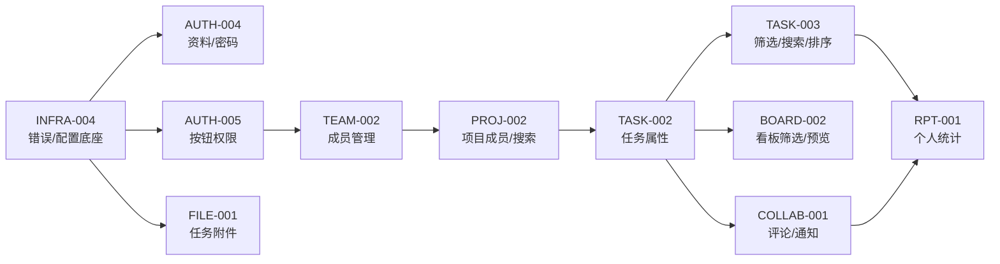

# Sprint 1 — MVP 能力补齐 · 迭代概览

| 元信息项 | 内容 |
| --- | --- |
| 迭代编号 | Sprint 1 |
| 迭代名称 | MVP 能力补齐（Minimum Viable Product） |
| 周期 | 第 3 周（5 个工作日，固定预留 20% 缓冲） |
| 覆盖优先级 | **P1 全量**（P2 及以上一律不进入本迭代） |
| 文档数 | 11 份（1 份 INFRA + 2 份 AUTH + 1 份 TEAM + 1 份 PROJ + 2 份 TASK + 1 份 BOARD + 1 份 FILE + 1 份 COLLAB + 1 份 RPT） |
| 文档状态 | 待评审（Draft） |
| 最后更新日期 | 2026-09-01 |
| 上游依据 | `docs/需求文档.md` §8.2 分模块优先级全景表（P1 列）、§9.1 排期里程碑表 |
| 前置迭代 | Sprint 0（POC 技术验证）验收通过 |
| 阻塞下游 | Sprint 2（任务体系完善）→ 进而阻塞 Sprint 3-9 全部迭代 |

> **口径说明**：`docs/sprint-0-poc/sprint-overview.md` §5.1 曾按旧拆分口径称「Sprint 1 全量（17 份文档）」。后按「同一模块同批能力合并成一份规格」原则收敛为 **11 份**，与 [`docs/README.md`](../README.md) §4.3 索引一致。能力范围不减，仅文档粒度合并。

---

## 1. 迭代目标

**用 1 周时间，把 POC 演示品变成 10 人以内小团队可以真实日常使用的产品。**

Sprint 0 回答了「架构能不能跑通」，Sprint 1 回答「一个真实小团队能不能留下来用」：

```
POC（单人单团队）                    MVP（小团队协作）
─────────────────                  ─────────────────────
注册即孤立个人空间        →         邀请同事进团队、进项目
只有自己给自己派任务      →         任务指派、评论 @、通知触达
任务只有 5 个裸字段       →         类型 / 优先级 / 标签 / 一级子任务
列表只能全量翻页          →         关键词搜索 + 基础筛选 + 排序
没有附件与评论            →         任务附件、评论、站内通知中心
无个人工作台              →         我的待办 / 已完成统计
```

三条判定本迭代成功的核心标准：

| 维度 | 目标 | 判定方式 |
| --- | --- | --- |
| 协作闭环 | A 邀请 B → A 给 B 派任务并 @B → B 收到通知 → B 完成任务，全程不离开系统 | §6 验收标准第 1-3 条现场演示 |
| 数据正确性 | 所有新增写操作（评论 / 附件 / 角色变更 / 属性修改）在多人并发下不丢不串，越权一律 404 | 各文档异常路径测试用例 |
| 工程收口 | 统一响应格式、全局异常、结构化日志、环境变量体系一次到位，成为后续全部迭代的默认底座 | `INFRA-004` 验收清单 |

**本迭代不追求的东西**：楼中楼评论、表情/图片评论、WebSocket 实时推送（P3 `COLLAB-004`）、多看板与视图保存（P2/P3）、组合筛选器（P2 `TASK-009/011`）、项目文件库（P2 `FILE-002`）、邮件模板美化。

---

## 2. 交付范围（11 项，对应需求文档 §8.2 P1 列）

| # | 交付项 | 具体内容 | 对应文档 |
| --- | --- | --- | --- |
| 1 | **统一返回格式 / 全局错误 / 环境配置** | 全局异常处理器改写 DRF 默认响应；错误码注册表；`dev/staging/prod` 三环境 settings 分层；`.env` 清单与校验；结构化 JSON 运行日志 + 请求追踪 ID | `INFRA-004` |
| 2 | **个人信息修改与密码重置** | 昵称 / 头像 / 个人简介修改；首字母渐变默认头像；修改密码（旧密码校验）；忘记密码邮件重置（Celery 异步发信） | `AUTH-004` |
| 3 | **按钮级权限 + 接口二次鉴权** | `/users/me/permissions/` 权限下发；前端 `PermissionGate` 组件族；后端 DRF Permission 类族；两者成对校验的 CI 规则 | `AUTH-005` |
| 4 | **团队成员邀请 / 移除 / 角色分配** | 邮箱批量邀请（已注册直加 / 未注册邮件链接）；成员列表搜索；角色调整；移除成员；退出团队；所有权转让 | `TEAM-002` |
| 5 | **项目成员管理与搜索收藏** | 项目成员添加 / 移除（含项目子角色）；项目关键词搜索（名称 + identifier）；项目收藏 / 取消收藏与收藏置顶 | `PROJ-002` |
| 6 | **任务扩展属性与一级子任务** | `issue_type` 转必填（5 种内置类型开放）；`priority` 启用；项目级标签 CRUD 与挂载；`start_date`；一级子任务挂载与计数；基础操作日志只读时间线 | `TASK-002` |
| 7 | **任务列表筛选 / 搜索 / 排序** | 列表端点 `?q= / ?priority= / ?type= / ?label= / ?assignee= / ?order_by=`；`description_stripped` trigram 全文搜索启用；前端列表页筛选条与排序 | `TASK-003` |
| 8 | **看板筛选与卡片悬浮预览** | 看板筛选条（负责人 / 优先级 / 标签，URL 参数同步）；卡片悬浮预览（描述摘要 / 标签 / 子任务进度 / 附件数）；「已取消」第四列开放 | `BOARD-002` |
| 9 | **任务级附件上传下载** | `FileAsset` 模型；MinIO 预签名直传三步流；下载 / 删除；大小与类型限制；任务详情附件区 | `FILE-001` |
| 10 | **任务评论 / @提醒 / 通知中心** | `IssueComment` + `Notification` 模型；评论 CRUD 与编辑窗口；`@提及` 解析与去重；通知异步生成；通知中心（未读数 / 已读 / 全部已读） | `COLLAB-001` |
| 11 | **个人待办与已完成统计** | `/users/me/stats/` 跨项目聚合（待办 / 今日到期 / 已逾期 / 本周完成）；「我的待办」工作台页；recharts 趋势图 | `RPT-001` |

---

## 3. 范围排除（P2 及以后，坚决不做）

| 排除项 | 归属 | 说明 |
| --- | --- | --- |
| 楼中楼回复 / 表情 / 图片评论 | P2 `COLLAB-002` | P1 评论为扁平单层 |
| 项目动态流 / 任务动态时间线 UI 完整版 | P2 `COLLAB-003` | P1 仅开放任务详情「基础操作日志」只读列表 |
| WebSocket 实时推送 | P2 `COLLAB-004` | 通知中心靠轮询 / SWR refresh 刷新 |
| 多层级子任务 / 依赖 / 工时 / 多执行人 | P2 `TASK-004~007` | P1 子任务严格一层 |
| 自定义字段 / 组合筛选器 / 视图保存 | P2 `TASK-008~011` | P1 仅内置固定字段筛选 |
| 多看板 / 批量操作 / 列自定义 | P2 `BOARD-003/004` | P1 看板列 = 四态固定 |
| 项目文件库 / 分片续传 / 预览 / 版本 | P2 `FILE-002~004` | P1 仅任务级单附件 |
| 项目进度 / 成员任务量统计 | P2 `RPT-002` | P1 仅个人维度 |
| 团队归档 / 全局标签模板配置 | P2 `TEAM-003` | — |
| 邮件模板体系 / 消息静默 | P3+ | P1 邮件为无模板纯文本 + 单一重置链接 |

---

## 4. 前置依赖（来自 Sprint 0 的既有资产）

| 既有资产 | 本迭代如何消费 | 主要消费文档 |
| --- | --- | --- |
| `Issue` 全字段已建齐（`unified-issue-model.md` §2.8） | `issue_type` / `priority` / `parent` / `labels` / `start_date` / `description_stripped` 由「建而不用」转为启用，**零 DDL、仅迁移数据回填** | `TASK-002` `TASK-003` `BOARD-002` |
| `IssueActivity` P0 已写入（`TASK-001`） | 开放只读查询端点与时间线 UI | `TASK-002` |
| `State` 四态种子（含「已取消」） | 看板开放第四列 | `BOARD-002` |
| `WorkspaceMember` 整数角色（`rbac-permission-model.md` §2） | 成员管理 / 角色分配 / 权限下发全部基于该枚举 | `TEAM-002` `AUTH-005` |
| `api-conventions.md` §2.5 端点契约 | `invitations/` `favorite/` `sub-issues/` `comments/` `attachments/presign/` `forgot-password/` 端点位置与信封格式全部沿用，不再发明 | 全部 |
| MinIO 容器 + Celery 编排（`INFRA-002`） | 附件直传与邮件异步发送直接复用 | `FILE-001` `AUTH-004` `COLLAB-001` |
| `Manager.accessible_by()`（`AUTH-003`） | `IssueComment` / `FileAsset` / `Notification` 等派生资源沿用「委托上游」隔离模式 | 全部 |

**本迭代新增模型**（均在对应文档定义）：`WorkspaceInvitation`、`ProjectFavorite`、`Label`（P0 已建，P1 启用）、`FileAsset`、`IssueComment`、`Notification`。

---

## 5. 文档依赖与编写顺序



| 顺序 | 文档 ID | 标题 | 复杂度 | 核心风险点 |
| --- | --- | --- | --- | --- |
| 1 | [`INFRA-004`](./INFRA-004-api-error-config.md) | 统一返回格式 / 全局错误 / 环境配置 | 中 | 全局异常处理器对 DRF 默认 404/403/405 的改写；环境变量漂移 |
| 2 | [`AUTH-004`](./AUTH-004-profile-password.md) | 个人信息修改与密码重置 | 中 | 重置令牌一次性与时效；邮件异步发送失败兜底 |
| 3 | [`AUTH-005`](./AUTH-005-button-permission.md) | 按钮级权限 + 接口二次鉴权 | 中 | 前后端权限映射一致性；权限缓存失效时机 |
| 4 | [`TEAM-002`](./TEAM-002-member-management.md) | 团队成员邀请 / 移除 / 角色分配 | 高 | 所有权转让原子性；移除成员的派生数据回收 |
| 5 | [`PROJ-002`](./PROJ-002-member-search.md) | 项目成员管理与搜索收藏 | 中 | WS_ADMIN 绕过项目成员检查的边界 |
| 6 | [`TASK-002`](./TASK-002-task-attributes.md) | 任务扩展属性与一级子任务 | 高 | `issue_type` 必填迁移的存量回填；一级子任务环防护 |
| 7 | [`TASK-003`](./TASK-003-list-filter-sort.md) | 任务列表筛选 / 搜索 / 排序 | 中 | trigram 搜索性能；组合查询索引命中 |
| 8 | [`BOARD-002`](./BOARD-002-kanban-filter.md) | 看板筛选与卡片悬浮预览 | 中 | 筛选后拖拽排序的 sort_order 语义 |
| 9 | [`FILE-001`](./FILE-001-task-attachment.md) | 任务级附件上传下载 | 高 | 直传三步流状态机；孤儿文件回收 |
| 10 | [`COLLAB-001`](./COLLAB-001-comment-notify.md) | 任务评论 / @提醒 / 通知中心 | 高 | @提及解析与去重；通知异步生成的幂等 |
| 11 | [`RPT-001`](./RPT-001-personal-stats.md) | 个人待办与已完成统计 | 低 | 跨项目聚合查询的 N+1 |

---

## 6. 迭代验收标准（可操作演示）

| # | 验收标准 | 判定要点 | 责任文档 |
| --- | --- | --- | --- |
| 1 | 管理员用邮箱邀请同事，同事登录后出现在成员列表并被派到项目中 | 已注册直加即时生效；未注册走邮件链接注册后自动入队 | `TEAM-002` `PROJ-002` |
| 2 | A 创建任务指派给 B、类型=缺陷、优先级=高、打标签，B 收到站内通知与 @提醒 | 通知未读数 +1；点击通知直达任务详情 | `TASK-002` `COLLAB-001` |
| 3 | B 在任务下发表评论、上传附件、完成任务，A 的通知中心全程可追溯 | 评论与附件在详情页可见；操作日志时间线有记录 | `COLLAB-001` `FILE-001` `TASK-002` |
| 4 | 任务列表按关键词搜索、按优先级 / 类型 / 标签 / 负责人筛选、按任意支持字段排序，看板同样可按人 / 优先级 / 标签筛选 | 列表与看板筛选互不干扰；URL 参数可分享还原 | `TASK-003` `BOARD-002` |
| 5 | 普通成员看不到「邀请成员 / 移除成员 / 删除项目」按钮，直接调对应接口返回 403/404 | 前端隐藏 + 后端二次鉴权双保险 | `AUTH-005` |
| 6 | 个人工作台展示待办 / 今日到期 / 已逾期 / 本周完成统计与 7 日趋势 | 数据与「我的待办」列表一致 | `RPT-001` |
| 7 | 用户可改昵称 / 头像 / 简介；忘记密码走邮件重置；重置后旧密码失效、旧会话吊销 | 重置令牌一次性，二次使用 400 | `AUTH-004` |
| 8 | 任意接口错误响应均为统一信封；日志带请求 ID 可串联一次请求全程 | 人为制造 404/403/500 验证 | `INFRA-004` |

---

## 7. 排期建议（5 个工作日，2 人并行）

| Day | 主线 A（偏后端） | 主线 B（偏前端） | 当日验收 |
| --- | --- | --- | --- |
| Day 1 | `INFRA-004` 全局异常 / 日志 / 配置；`AUTH-004` 后端 | `INFRA-004` 前端错误拦截统一化；`AUTH-005` `PermissionGate` | 信封统一；错误码可测 |
| Day 2 | `AUTH-005` 权限下发端点；`TEAM-002` 邀请 / 成员 API | `AUTH-004` 资料页 UI；`TEAM-002` 成员管理页 | 越权 403/404 演示通过 |
| Day 3 | `TASK-002` 属性迁移与 API；`TASK-003` 筛选查询参数 | `TASK-002` 属性面板 / 标签 / 子任务 UI；`TASK-003` 列表筛选条 | P0 旧数据回填零错误 |
| Day 4 | `FILE-001` 直传三步流；`COLLAB-001` 评论 / 通知 API | `BOARD-002` 看板筛选 / 预览；`FILE-001` 附件区 UI | 附件与评论闭环 |
| Day 5 | `RPT-001` 聚合端点；联调 / 回归 / 缓冲 | `COLLAB-001` 通知中心；`RPT-001` 工作台页 | §6 全部通过 |

---

## 8. 相关文档

- 上级索引：[`docs/README.md`](../README.md) §4.3
- 前置迭代：[`docs/sprint-0-poc/sprint-overview.md`](../sprint-0-poc/sprint-overview.md)
- 原始需求：[`docs/需求文档.md`](../需求文档.md) §8.2 / §9.1
- 下一迭代：`docs/sprint-2-task-full/sprint-overview.md`（Sprint 2 — 任务体系完善）
