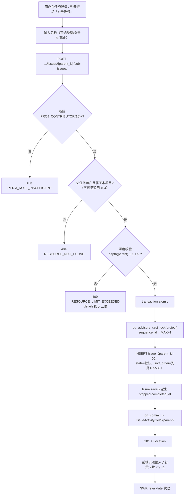
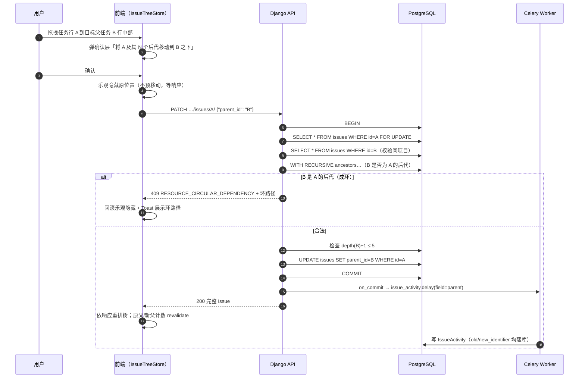
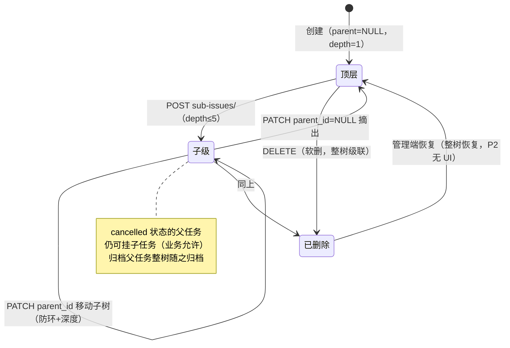
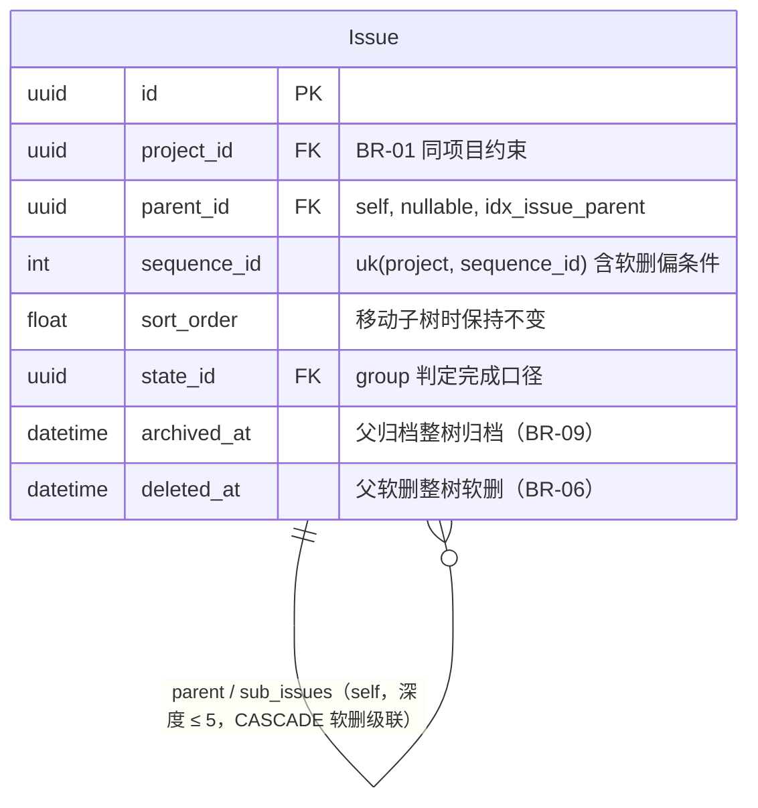

# 多层级子任务与进度联动

| 元信息项 | 内容 |
| --- | --- |
| 文档编号 | TASK-004 |
| 所属迭代 | Sprint 2 — 任务体系完善（第 4 周） |
| 优先级 | P2（标准版完整级） |
| 所属模块 | M4-TASK｜任务核心 |
| 文档状态 | 待评审（Draft） |
| 最后更新日期 | 2026-09-01 |
| 上游依赖 | `TASK-001`（Issue CRUD 与序列号机制）、`TASK-002`（一级子任务 API 与 `parent` 列启用）、`INFRA-003`（`idx_issue_parent` 索引已建） |
| 下游消费 | `TASK-006`（子树工时汇总）、`TASK-009`（深拷贝含整树、归档级联）、`TASK-011`（树形视图与分组）、需求一键转子任务（`decompose` 动作子资源）、`GANTT-001`（树形任务条） |
| 上游依据 | `docs/需求文档.md` §3.4（子任务多层级创建、子任务进度联动父任务）、§8.2 任务核心 P2 列 |
| 关联架构文档 | [`unified-issue-model.md`](../architecture/unified-issue-model.md)（**§2.8 `parent` 自引用 / CASCADE 语义、§8.3 递归 CTE 与深度上限、§3 advisory lock**）、[`api-conventions.md`](../architecture/api-conventions.md)（§2.4 嵌套约定、§2.6 动作子资源）、[`rbac-permission-model.md`](../architecture/rbac-permission-model.md)（L2/L3 权限层） |
| 对标基线 | Plane `Issue.parent` 自引用（不限层级、不校验类型、子任务计数子查询） · Ones Issue Hierarchy（Business+ 类型层级强校验 + 进度上卷） |
| 工作量估算 | 后端 2.5 人日 / 前端 3 人日 / 联调与测试 1.5 人日，合计 **7 人日** |

---

## 1. 概述

### 1.1 功能定位

任务层级是标准版任务体系的骨架能力。Sprint 1 交付的一级子任务只能表达「需求 → 任务」的单层拆解；真实研发协作中「Epic → 需求 → 任务 → 子任务」至少三层起步，测试用例、缺陷复现场景也常常要挂在任务之下。本迭代把 `Issue.parent` 外键的业务深度从 1 放开到 5，并用**递归 CTE** 解决两个硬问题：

1. **写入防环**——把 A 挂到 A 自己的后代之下必须被拒绝，且错误信息要给出完整环路径；
2. **子树查询不 N+1**——整棵树一次 SQL 取回，父级行进度计数一次 annotate 取回，不随树深与节点数放大查询数。

进度联动的口径与 `RPT-001`（个人统计）、`BOARD-001/002`（看板卡片）、`TASK-002`（一级子任务计数）完全共用：**`sub_issues_count` / `completed_sub_issues_count` 两个 annotate 字段是唯一事实来源**，全前端禁止自行累加。

### 1.2 P2 交付内容

| # | 能力 | 说明 |
| --- | --- | --- |
| 1 | 深度放开 | `MAX_ISSUE_DEPTH = 5`（根为第 1 层）；创建/移动时超限返回 `409 RESOURCE_LIMIT_EXCEEDED` |
| 2 | 防环校验 | 挂载 / 移动父项前用递归 CTE 判断「新父是否为当前节点的后代」 |
| 3 | 子树查询 | `GET …/issues/{id}/subtree/` 一次 CTE 返回整树（带 `depth`、状态组、层级统计） |
| 4 | 进度联动 | 父卡片 / 列表行 / 详情侧栏显示 `x/y` 完成比例；口径全系统单源 |
| 5 | 树形列表 | 列表页层级缩进 + 逐层懒加载展开 + 折叠状态记忆 |
| 6 | 移动子树 | 拖拽行到目标父任务下，整棵子树随之迁移（`sequence_id` 不变） |
| 7 | 级联软删 / 级联归档 | 删除父任务整树进入回收站；归档父任务整树退出默认视图 |

### 1.3 关键约定：层级模型的三层防线

> ⚠️ **本文档最重要的技术约定。**

层级自由度是双刃剑：层级太深导致界面不可用，环状引用导致所有递归算法（进度、甘特关键路径、CTE）死循环。本系统在**三个层面**控制风险：

| 防线 | 机制 | 值 | 作用 |
| --- | --- | --- | --- |
| 业务层 | `MAX_ISSUE_DEPTH` | **5** | 产品上限：第 5 层任务不再提供「+ 子任务」入口；API 硬校验 |
| 查询层 | CTE `depth < 5` 条件 | 5 | 子树查询天然截断，即使脏数据也不会无限递归 |
| 保险丝 | `CTE_GUARD_DEPTH` | **100** | 防环上行扫描的硬上限；数据异常（人为改库）时快速失败并 ERROR 告警，而非慢查询拖垮数据库 |

**为什么业务上限是 5 而不是 3 或无限**：

- 3 层（Epic→Story→Task）是 Jira 经典模型，但国内研发团队普遍需要「子任务下再挂测试点 / 缺陷复现步骤」，4~5 层是真实诉求；
- Plane 不设上限的实践反馈是：超过 5 层后列表缩进在 1280px 屏幕上已无空间，且无人能维护心智模型——上限本质是**保护用户而不是限制用户**；
- `unified-issue-model.md` §8.3 已将 P2 深度锁定为 5，P3 如需更深（Ones Business+ 场景）再评估放开。

### 1.4 层级能力 × 迭代矩阵

| 能力 | P1（TASK-002） | **P2（本文档）** | P3（WF/TASK-012） |
| --- | --- | --- | --- |
| `parent` 列 | ✅ 已建已启用 | ✅ | ✅ |
| 层级深度 | 1 | **5** | 5（可配置评估） |
| 防环校验 | 单层天然无环 | **CTE 多级防环** | 同左 |
| 子树一次查询 | ❌（仅直接子级列表） | **✅ `subtree/` 端点** | 同左 |
| 进度计数（直接子级） | ✅ `sub_issues_count` | ✅ | ✅ |
| 整树进度统计 | ❌ | **✅ `stats` 聚合** | ✅ |
| 移动子树 | ❌（仅摘出/重挂） | **✅（含确认弹层）** | ✅ |
| 类型层级强校验 | ❌ | ❌ | ⏳ `enforce_hierarchy` 开关 |
| 完成自动上卷父状态 | ❌ | ❌（仅比例展示） | ⏳ 项目级配置 |

### 1.5 范围边界

| 能力 | 本文档（P2） | 归属 |
| --- | --- | --- |
| 多层级创建 / 展开 / 折叠 | ✅ | — |
| 防环 / 深度校验 | ✅ | — |
| 子树查询与整树统计 | ✅ | — |
| 移动子树（同项目内） | ✅ | — |
| **跨项目**父子关系 | ❌ 明确禁止（BR-01） | P4 评估（跨项目关联用 `IssueLink` 表达） |
| 类型层级强校验（Epic 下只能挂 Story 等） | ❌ | P3 `enforce_hierarchy` |
| 子任务全完成自动改父状态 | ❌ 仅比例展示 | P3 自动化规则 `WF-003` |
| 层级基线 / 版本对比 | ❌ | P4 `TASK-015` |
| 需求一键拆解（`decompose`） | 消费本能力 | `unified-issue-model.md` §5.4 已定义，P2 末点亮 |

### 1.6 前置依赖

| 依赖 | 内容 | 阻塞原因 |
| --- | --- | --- |
| `TASK-002` | `POST …/sub-issues/` 挂载 API、`parent` 校验逻辑（P1 为「父无父」单层校验） | 本迭代将该逻辑改写为深度 + 防环双校验，必须基于既有入口演进而非另开端点 |
| `INFRA-003` | `idx_issue_parent` 索引、`parent` CASCADE 外键 | 子树查询与防环扫描的性能前提 |
| `TASK-003` | 列表页行渲染、`order_by=sort_order`、URL 状态同源 | 树形列是列表页的结构升级 |
| `PROJ-002` | 项目成员候选集 | 子任务快速指派 |
| `unified-issue-model.md` §3 | advisory lock 序列号 | 子任务创建复用（与普通创建同锁空间） |

### 1.7 竞品参考

| 竞品 | 参考点 | 处置 |
| --- | --- | --- |
| Plane | `parent` 自引用、不限层级、不校验类型；`sub_issues_count` 序列化层子查询 | 自由模型采纳；**计数下沉 QuerySet annotate + 子树走 CTE**（规避其 N+1） |
| Plane | 删除父任务 `CASCADE` 硬删子任务 | 改为**软删整树**（可恢复，符合回收站语义） |
| Ones | Issue Hierarchy（Business+）：类型层级 + 强校验 + 进度加权上卷 | 理念采纳、执行延后：P3 以 `enforce_hierarchy` 开关引入 |
| Jira | Epic/Story/Sub-task 固定三层 | 反例：层级固化无法覆盖测试点细分场景，不采纳 |

---

## 2. 业务逻辑

### 2.1 创建子任务（挂载）



> 子任务创建与普通创建**共用** `create_issue` 服务与 advisory lock（`unified-issue-model.md` §3.3），唯一差异是 payload 带 `parent_id` 并先行执行深度校验。序列号与父任务同一编号空间——子任务不重新从 1 编号，这保证「项目内编号全量无空洞」的审计承诺对树同样成立。

### 2.2 移动子树（核心风险场景）



**为什么移动必须 `select_for_update` 锁 A 行**：并发场景下，两个请求同时把 A 移到彼此的子树下（A→B 下、B→A 下），若不加锁，两次校验都通过、两次 UPDATE 都执行，最终形成环。行锁串行化「读祖先链 → 校验 → 写」的临界区。

**为什么移动不改 `sequence_id` / `sort_order`**：编号是项目级审计资产（被外部引用），排序是「列内位置」语义。移动子树只改变归属，不改变身份与列内相对顺序——子树进入新父后其 `sort_order` 保持原值，与新兄弟并列排序。

### 2.3 层级关系生命周期



### 2.4 删除与归档的级联语义

| 操作 | 数据层行为 | API 行为 | 恢复 |
| --- | --- | --- | --- |
| 删除父任务 | 同一事务内：软删整棵子树（沿 `parent` 下行）、级联软删 `IssueAssignee` / `IssueLabel` / `IssueAttachment` 关联 | `DELETE` 返回 `200` + `{ "affected_count": N }`（**不用 204**，因为要回传受影响数）；二次确认 UI 显示「将同时删除 N 个子任务」 | `all_objects` 可整树恢复（管理端，P2 无 UI） |
| 归档父任务 | 父与全部后代 `archived_at = now()` | `POST …/archive/`（`TASK-009` 交付动作端点；本文档定义级联语义） | 取消归档同样整树恢复 |
| 移动子树 | 仅 `parent_id` 变更，子树其余字段不动 | `PATCH` | — |

> **为什么删除用 `200` 而非 `204`**：`api-conventions.md` §4.3 允许 DELETE 成功且需回传受影响信息时用 `200`。「删除了 1 条」与「删除了 1 父 + 7 后代」对用户的确认价值完全不同，这个数字必须回传。

### 2.5 业务规则汇总

| 编号 | 规则 | 判定位置 | 违反后果 |
| --- | --- | --- | --- |
| BR-01 | 父子必须**同项目**（同 Workspace 蕴含）；跨项目 `parent_id` 拒绝 | Serializer + Service | `400 VALIDATION_ERROR` + `DOES_NOT_EXIST` |
| BR-02 | 业务深度上限 `MAX_ISSUE_DEPTH=5`（根=1）；CTE 保险丝 `CTE_GUARD_DEPTH=100` | Service | `409 RESOURCE_LIMIT_EXCEEDED` |
| BR-03 | 新父不得为当前节点自身或其后代（任意深度）；`details` 给出环路径（`A → B → … → A`，用名称展示） | Service（CTE 上行） | `409 RESOURCE_CIRCULAR_DEPENDENCY` |
| BR-04 | `sub_issues_count` / `completed_sub_issues_count` 仅统计**直接子级**且排除软删；整树统计走 `subtree/` 的 `stats` | ORM annotate | — |
| BR-05 | 完成判定 = `state.group='completed'`；`cancelled` 子任务**不计入分子也不计入分母**（与 `RPT-001` / 看板口径一致） | ORM | — |
| BR-06 | 删除父任务 → 同事务软删整树 + 级联软删关联表；响应回传 `affected_count` | Service | — |
| BR-07 | 移动子树不改变子树内任何 `sequence_id` / `sort_order` / 状态 | Service | — |
| BR-08 | 子任务全部完成**不自动**改父状态（仅比例展示）；自动上卷归 P3 自动化规则 | Service | — |
| BR-09 | 归档父任务 → 整树置 `archived_at`；所有默认查询（`archived_at IS NULL`）天然排除整树 | ORM 偏索引 | — |
| BR-10 | 移动子树前对被移动任务行 `select_for_update`，防并发互换成环 | Service | — |
| BR-11 | 子树查询返回节点数上限 500；超出截断并在 `meta.truncated=true` 提示 | Service | — |
| BR-12 | 子任务创建与普通创建共用 advisory lock 序列号空间；子任务编号不重新起算 | Service | — |
| BR-13 | 父任务 `state` 为 `cancelled` 时仍允许挂子任务（业务上取消的需求可能继续处理子缺陷）；归档任务禁止任何写（含挂子任务） | Permission + Service | `403 PERM_PROJECT_ARCHIVED` |
| BR-14 | 每次挂载 / 摘出 / 移动产生 1 条 `IssueActivity(field='parent')`，含 `old_identifier` / `new_identifier` | Service on_commit | — |
| BR-15 | 悬挂孤儿子任务不存在：任何写路径保证 `parent` 指向同项目存活任务或 NULL（外键 + 事务保证）；管理端数据修复须整树操作 | DB 约束 | — |

### 2.6 异常处理

| 场景 | HTTP | 错误码 | details 子码 | 前端提示与表现 |
| --- | --- | --- | --- | --- |
| 挂到自己的后代下 | 409 | `RESOURCE_CIRCULAR_DEPENDENCY` | `CYCLE` | Toast 列出环路径：「导出功能 → 后端导出 API → 分页游标改造 ✕」；树高亮环上节点 2 秒 |
| 超深度 | 409 | `RESOURCE_LIMIT_EXCEEDED` | `DEPTH` | 「层级已达 5 层上限，请平铺或重组任务」 |
| 跨项目 parent | 400 | `VALIDATION_ERROR` | `DOES_NOT_EXIST` | 「所选父任务无效」（父选择器本就只检索本项目，直连 API 才会触发） |
| 父任务已软删 / 不可见 | 404 | `RESOURCE_NOT_FOUND` | — | 「任务不存在或你没有访问权限」 |
| 项目已归档时挂子任务 | 403 | `PERM_PROJECT_ARCHIVED` | — | 界面只读态提示 |
| `PROJ_VIEWER`/`COMMENTER` 创建子任务 | 403 | `PERM_ROLE_INSUFFICIENT` | — | 入口隐藏；直连返回 403 |
| 移动时父被并发删除 | 404 | `RESOURCE_NOT_FOUND` | — | 回滚 UI + 提示刷新 |
| CTE 触发保险丝（脏数据） | 500 | `SERVER_ERROR` | — | 通用错误 + request_id；服务端 ERROR 日志与告警 |
| 子树超 500 节点 | 200 | —（截断） | — | 全屏树顶部黄条「树过大已截断显示前 500 节点，请用筛选收窄」 |

### 2.7 边界条件

| 边界场景 | 限制值 | 超出处理方式 |
| --- | --- | --- |
| 单任务直接子任务数 | 无硬上限（产品设计建议 < 200） | 列表分组分页；详情侧栏显示前 20 + 「查看全部」 |
| 子树查询返回节点 | 500 | 截断 + `meta.truncated` |
| 展开懒加载每层 | 50 条（游标） | 「加载更多」 |
| 深度 | 5 | 第 5 层「+ 子任务」入口消失；API 409 |
| 移动子树体积 | 无限制（仅改 1 行） | — |
| 并发同父子创建 | advisory lock 串行 | 编号正确，无冲突 |
| 树缩进宽度 | 5 层 × 20px = 100px | 1280px 屏可用 |

---

## 3. UI/UX 设计

### 3.1 列表页树形展示（`TASK-003` 列表升级）

路由不变：`/:workspaceSlug/projects/:projectId/issues`。行为列新增层级缩进与折叠控件。

```
┌──────────────────────────────────────────────────────────────────────────────────┐
│ 任务列表                                    [⊕ 展开 ▾] [＋ 创建任务]              │
├──────────┬──────────────────────────────────────────┬────────┬────────┬──────────┤
│ 编号      │ 标题                                      │ 状态   │ 负责人 │ 子任务    │
├──────────┼──────────────────────────────────────────┼────────┼────────┼──────────┤
│ RBT-12   │ ▾ 导出功能                                │ ●进行中│ 👤张三 │ ◔ 1/2    │
│ RBT-13   │   ├ 后端导出 API                          │ ●已完成│ 👤李四 │ —        │
│ RBT-15   │   │  └ 分页游标改造                        │ ●待办  │ —      │ —        │
│ RBT-14   │   └ 前端导出按钮                          │ ●待办  │ 👤王五 │ —        │
│ RBT-20   │ ▸ 登录改造                                │ ●待办  │ 👤张三 │ ◔ 0/3    │
│ RBT-31   │ 修复报表页 504                            │ ●进行中│ 👤李四 │ —        │
└──────────┴──────────────────────────────────────────┴────────┴────────┴──────────┘
  ▾ = 已展开可折叠     ▸ = 有子级未展开     ├ │ └ = 树形引导线（缩进 20px/层）
  ◔ x/y = 子任务进度徽标（直接子级口径）
```

| 列 | 宽度 | 渲染 |
| --- | --- | --- |
| 编号 | 96px | `font-mono text-xs text-neutral-500`；缩进发生在**整行**（编号列随行右移） |
| 折叠箭头 | 行首 16px | 有子级才渲染：`ChevronRight`（展开时旋转 90°，150ms ease）；无子级占位保持对齐 |
| 标题 | flex-1 | 树形引导线 `border-l`（`neutral-200`）；子任务行 `text-sm`，顶层行 `text-sm font-medium` |
| 子任务进度 | 88px | `SubtaskProgress`：16px 圆环 + `1/2` 文本；全完成圆环实心绿 + `2/2`；无子级显示 `—` |
| 其余列 | 同 `TASK-003` | 状态 / 负责人 / 截止 / 优先级不变 |

**行为规格**：

| 行为 | 规格 |
| --- | --- |
| 展开子级 | 点箭头：该层懒加载（`?parent_id=<id>&order_by=sort_order&per_page=50`）；箭头旋转；请求期间箭头转圈 |
| 折叠 | 点已展开箭头：子行从 Store 的 `expandedByParent` 移除（数据保留缓存） |
| 展开记忆 | 折叠状态存 `localStorage`（key `issue-tree:collapsed:{projectId}`），刷新还原 |
| 「⊕ 展开」下拉 | 「全部展开（≤500 节点）」/「收起到第 1 层」/「收起到第 2 层」 |
| 行悬浮 | 出现「＋」（在下方插入子任务快速行）与拖拽把手 `grip-vertical` |
| 排序语义 | 树形模式下 `order_by` 仅作用于**同层兄弟**；全局排序（如 `-created_at`）自动切换为平铺模式并顶部提示 |

### 3.2 快速加子任务（行内插入）

```
│ RBT-12   │ ▾ 导出功能                                │ ●进行中│ 👤张三 │ ◔ 1/2    │
│          │   ├ ＋ 输入子任务标题后按回车…             │        │        │          │  ← 插入的输入行
```

| 行为 | 规格 |
| --- | --- |
| 提交 | `Enter` 创建（仅 `name`，类型继承父任务，状态落默认）；输入框清空保持 focus 可连续录入 |
| 乐观插入 | 回车瞬间插入 `opacity-60` 临时行（编号 `…`）；成功后替换真实行，父徽标 +1 |
| 失败 | 移除临时行 + 内容恢复输入框 + Toast `error.message` |
| 深度上限 | 第 5 层行的悬浮「＋」不渲染（前端预判）；直连 API 由后端 409 兜底 |

### 3.3 全屏树抽屉（整树视图）

任务详情侧栏「子任务」分区尾部「查看整棵树 →」打开。宽 `min(960px, calc(100vw - 48px))`。

```
┌──────────────────────────────────────────────────────────────────────┐
│ 导出功能 的任务树   3 个任务 · 1 已完成 · 最深 2 层              ✕   │
├──────────────────────────────────────────────────────────────────────┤
│ ●进行中  RBT-12  导出功能                                ◔ 1/2      │
│ ●已完成  RBT-13  └ 后端导出 API                          👤李四     │
│ ●待办    RBT-15     └ 分页游标改造                                   │
│ ●待办    RBT-14  └ 前端导出按钮                          👤王五     │
├──────────────────────────────────────────────────────────────────────┤
│ （截断提示条：仅当 meta.truncated=true 时出现）                        │
└──────────────────────────────────────────────────────────────────────┘
  数据源：GET …/issues/{id}/subtree/ 一次 CTE
  节点点击 → 打开该任务详情 Drawer（返回时树状态保留）
```

| 元素 | 规格 |
| --- | --- |
| 头部统计 | `total / completed / max_depth` 来自响应 `stats`；`font-mono` |
| 节点行 | 状态圆点（`state.color`）+ 编号 + 标题（truncate）+ 负责人头像；缩进 24px/层 |
| 空态 | 「暂无子任务」+ 「添加第一个子任务」按钮（focus 到隐藏快速行） |
| 加载 | 3 层 × 5 行骨架树 |
| 截断 | 黄条 + 建议按状态/负责人筛选 |

### 3.4 任务详情侧栏（`TASK-001` Drawer 升级）

侧栏「子任务」分区（`TASK-002` 已有）升级：

| 元素 | 规格 |
| --- | --- |
| 分区头 | 「子任务 ◔ 1/2」+ 折叠开关 + 「＋」 |
| 列表 | 直接子级前 20 条（标题 + 状态圆点 + 复选完成）；尾部「查看全部 N 个 →」进全屏树 |
| 完成勾选 | 点复选 = `PATCH state`（落项目「已完成」状态）；父徽标乐观 +1 |
| 排序 | 拖拽把手在分区内重排（更新 `sort_order`，复用 `BOARD-001` 插值算法） |

### 3.5 拖拽移动子树（列表行拖拽）

| 阶段 | 规格 |
| --- | --- |
| 起拖 | 按住把手 150ms；行 `opacity-50`；光标 `grabbing` |
| 悬停判定 | 目标行分双区：**上沿 25%** = 「排到它上面」（同级排序）；**中部 75%** = 「成为它的子任务」（行显示缩进轮廓预览） |
| 预览 | 中部悬停 400ms 后目标行展开一级缩进虚线框，提示「松开移入」 |
| 确认 | 松手弹确认层：「将 “分页游标改造”（含 0 个后代）移动到 “前端导出按钮” 之下？」显示 `移动` / `取消`；含后代时列出数量 |
| 成环即时反馈 | 409 响应到达后 Toast 环路径；树中环上节点红色高亮 2s |
| 自拖自 | 拖到自身行 = 无操作（前端判定） |

### 3.6 空状态 / 加载 / 失败

| 场景 | 处置 |
| --- | --- |
| 项目无任务 | 沿用 `TASK-001` 空态（树形无独立空态） |
| 展开无子级 | 箭头不渲染，不可能触发 |
| 展开加载失败 | 该层显示「加载失败 · 重试」行内按钮 |
| subtree 失败 | 抽屉内 `alert-circle` + `error.message` + 重试 |

### 3.7 响应式与无障碍

| 断点 | 布局 |
| --- | --- |
| ≥ 1280px | 全列 + 缩进 20px/层 + 全屏树 960px |
| 768~1279px | 隐藏「负责人」「截止」列；缩进 16px/层；全屏树全宽 |
| < 768px | 树降级为「卡片 + 缩进横条」；折叠默认全收起；拖拽移动禁用（触屏误操作多），改用行菜单「移动到…」弹窗选择父任务 |

无障碍：

- 树容器 `role="tree"`、行 `role="treeitem"`、`aria-expanded` 绑定折叠箭头、`aria-level={depth}`；
- 键盘：`←` 折叠 / `→` 展开 / `↑↓` 同层移动 / `Home/End` 首末；`Enter` 打开详情；
- 进度徽标 `aria-label="子任务 2 个，已完成 1 个"`（不依赖圆环颜色）；
- 确认弹层聚焦陷阱，`Esc` 取消并还原拖拽。

---

## 4. 技术架构

### 4.1 数据模型

**零新增表、零 DDL**。全部消费 `INFRA-003` 已建结构：

```python
# apps/api/plane/db/models/issue.py —— 既有定义（本迭代零改动，引用自 unified-issue-model.md §2.8）
parent = models.ForeignKey(
    "self", on_delete=models.CASCADE, null=True, blank=True,
    related_name="sub_issues", verbose_name="父工作项",
)

# Meta.indexes 既有项：
#   models.Index(fields=["parent"], name="idx_issue_parent")
```

新增配置常量：

```python
# apps/api/plane/settings/features.py
MAX_ISSUE_DEPTH: int = 5      # 业务层级上限（根 = 第 1 层）
CTE_GUARD_DEPTH: int = 100    # 递归 CTE 保险丝：防环上行扫描深度硬上限
```



#### 4.1.1 索引设计说明

| 索引 | 服务的查询 | 本迭代使用 |
| --- | --- | --- |
| `idx_issue_parent` | 展开懒加载 `WHERE parent_id=? ORDER BY sort_order`；防环 CTE 的上行 JOIN；级联软删的下行扫描 | ✅ 核心 |
| `idx_issue_proj_state_sort` | 子树内按状态过滤（全屏树 + 筛选联动） | ✅ |
| `uniq_issue_sequence_per_project` | `MAX(sequence_id)` 索引扫描（子任务创建） | ✅ |
| `idx_issue_active_by_project` | 默认列表排除归档树 | ✅ |

> 防环 CTE 的上行扫描沿 `parent_id` 逐级 JOIN——`idx_issue_parent` 使每步都是索引点查，深度 d 的祖先链共 d 次点查，与树规模无关。

### 4.2 API 定义

| # | 方法 | 路径 | 描述 | 权限 | 成功码 |
| --- | --- | --- | --- | --- | --- |
| 1 | `POST` | `…/projects/{project_id}/issues/{issue_id}/sub-issues/` | 挂载创建子任务（`TASK-002` 已有；本迭代放开深度 + 防环） | `PROJ_CONTRIBUTOR`(15)+ | `201` |
| 2 | `GET` | `…/projects/{project_id}/issues/{issue_id}/subtree/` | **新增**：整棵子树（CTE） | `PROJ_VIEWER`(5)+ | `200` |
| 3 | `GET` | `…/projects/{project_id}/issues/?parent_id=<uuid>` | 某层子级列表（懒加载） | `PROJ_VIEWER`(5)+ | `200` |
| 4 | `PATCH` | `…/projects/{project_id}/issues/{issue_id}/` | `parent_id` 变更 = 移动子树 / 摘出 | `PROJ_CONTRIBUTOR`(15)+ | `200` |
| 5 | `DELETE` | `…/projects/{project_id}/issues/{issue_id}/` | 删除（整树级联软删，回传受影响数） | `PROJ_ADMIN`(20) 或创建者 | `200` |

> `subtree/` 是第 4 层路径（`workspaces → projects → issues → subtree`），属 `api-conventions.md` §2.4 允许的「叶子资源直接子资源」。`parent_id` 作为列表筛选参数加入 `TASK-003` 的 `IssueFilterSet` 白名单。

#### 4.2.1 `POST …/sub-issues/` — 挂载创建

**请求**

```json
{
  "name": "分页游标改造",
  "type_id": "9d8e4f2a-1b3c-4d5e-8f9a-0a1b2c3d4e5f",
  "assignee_ids": [],
  "target_date": null
}
```

**成功响应 `201 Created`**

```json
{
  "status": "success",
  "data": {
    "id": "d4e5f6a7-8b9c-4d0e-9f1a-2b3c4d5e6f7a",
    "project_id": "7b3e9c1a-4d5f-4a8b-9c2e-1f0a3b4c5d6e",
    "project_identifier": "RBT",
    "sequence_id": 15,
    "issue_key": "RBT-15",
    "name": "分页游标改造",
    "parent_id": "b2c3d4e5-f6a7-4b8c-9d0e-1f2a3b4c5d6e",
    "type_id": "9d8e4f2a-1b3c-4d5e-8f9a-0a1b2c3d4e5f",
    "state_id": "e3f4a5b6-7c8d-4e9f-8a1b-2c3d4e5f6a7b",
    "priority": "none",
    "assignee_ids": [],
    "target_date": null,
    "depth": 3,
    "created_by": "6c7d1a2b-3e4f-4a5b-9c8d-7e6f5a4b3c2d",
    "created_at": "2026-09-01T08:14:33.221Z",
    "updated_at": "2026-09-01T08:14:33.221Z"
  }
}
```

> `depth` 为只读派生字段（服务端按父链长度计算），前端用于缩进与「+ 子任务」入口预判，避免再发一次 `subtree/`。

**失败响应 `409`（超深度）**

```json
{
  "status": "error",
  "error": {
    "code": "RESOURCE_LIMIT_EXCEEDED",
    "message": "层级已达 5 层上限，无法再创建子任务",
    "details": [{ "field": "parent_id", "code": "DEPTH", "message": "当前父任务位于第 5 层" }],
    "request_id": "01JCB4R8M2XQ7N9P5V3W6Y8Z1A"
  }
}
```

#### 4.2.2 `GET …/subtree/` — 整棵子树

**请求**

```http
GET /api/v1/workspaces/acme/projects/7b3e9c1a-.../issues/8a1f9c2e-.../subtree/ HTTP/1.1
```

**成功响应 `200`**

```json
{
  "status": "success",
  "data": {
    "root": {
      "id": "8a1f9c2e-6b3d-4a7e-9f11-2c4d5e6f7a8b",
      "issue_key": "RBT-12",
      "sequence_id": 12,
      "name": "导出功能",
      "depth": 0,
      "state_id": "d2e3f4a5-6b7c-4d8e-9f0a-1b2c3d4e5f6a",
      "state_group": "started",
      "assignee_ids": ["6c7d1a2b-3e4f-4a5b-9c8d-7e6f5a4b3c2d"],
      "sub_issues_count": 2,
      "completed_sub_issues_count": 1
    },
    "nodes": [
      {
        "id": "b2c3d4e5-f6a7-4b8c-9d0e-1f2a3b4c5d6e",
        "parent_id": "8a1f9c2e-6b3d-4a7e-9f11-2c4d5e6f7a8b",
        "issue_key": "RBT-13",
        "sequence_id": 13,
        "name": "后端导出 API",
        "depth": 1,
        "state_group": "completed",
        "assignee_ids": ["2b3a4c5d-6e7f-4a8b-9c0d-1e2f3a4b5c6d"]
      },
      {
        "id": "d4e5f6a7-8b9c-4d0e-9f1a-2b3c4d5e6f7a",
        "parent_id": "b2c3d4e5-f6a7-4b8c-9d0e-1f2a3b4c5d6e",
        "issue_key": "RBT-15",
        "sequence_id": 15,
        "name": "分页游标改造",
        "depth": 2,
        "state_group": "unstarted",
        "assignee_ids": []
      },
      {
        "id": "c3d4e5f6-a7b8-4c9d-0e1f-2a3b4c5d6e7f",
        "parent_id": "8a1f9c2e-6b3d-4a7e-9f11-2c4d5e6f7a8b",
        "issue_key": "RBT-14",
        "sequence_id": 14,
        "name": "前端导出按钮",
        "depth": 1,
        "state_group": "unstarted",
        "assignee_ids": ["4d5e6f7a-8b9c-4d0e-9f1a-2b3c4d5e6f70"]
      }
    ],
    "stats": { "total": 4, "completed": 1, "cancelled": 0, "max_depth": 2 }
  },
  "meta": { "truncated": false, "node_limit": 500 }
}
```

**契约要点**：

1. `root` 单列，`nodes` 平铺（非嵌套）——平铺结构序列化 / 前端建树都是 O(n)，嵌套 JSON 深层解析反而慢；
2. `stats.completed` 按 `state_group='completed'` 全树统计（含根）；`cancelled` 单列（不污染完成率）；
3. `truncated=true` 时 `nodes` 恰 500 条且无 `stats`（不完整数据不出统计）。

**失败响应 `404`**（不存在 / 已软删 / 无权 / 跨项目，四态一致）：

```json
{
  "status": "error",
  "error": {
    "code": "RESOURCE_NOT_FOUND",
    "message": "任务不存在或你没有访问权限",
    "request_id": "01JCB4R8M2XQ7N9P5V3W6Y8Z1B"
  }
}
```

#### 4.2.3 `GET …/issues/?parent_id=` — 懒加载某层

```http
GET …/issues/?parent_id=b2c3d4e5-...&order_by=sort_order&per_page=50&fields=id,issue_key,name,state_id,assignee_ids,target_date,sort_order,sub_issues_count,completed_sub_issues_count HTTP/1.1
```

响应为标准游标列表（同 `TASK-001` §4.2.2 结构），`meta.next_cursor` 供「加载更多」。

#### 4.2.4 `PATCH …/issues/{id}/` — 移动子树

**请求（移动）**

```json
{ "parent_id": "8a1f9c2e-6b3d-4a7e-9f11-2c4d5e6f7a8b" }
```

**请求（摘出为顶层）**

```json
{ "parent_id": null }
```

**成功响应 `200`**：完整 Issue 对象（同 §4.2.1 结构，`parent_id` 已更新，`depth` 重算）。

**失败响应 `409`（成环，含环路径）**

```json
{
  "status": "error",
  "error": {
    "code": "RESOURCE_CIRCULAR_DEPENDENCY",
    "message": "不能将该工作项移动到它自己的子级之下",
    "details": [{
      "field": "parent_id",
      "code": "CYCLE",
      "message": "环路径：导出功能 RBT-12 → 后端导出 API RBT-13 → 分页游标改造 RBT-15"
    }],
    "request_id": "01JCB4R8M2XQ7N9P5V3W6Y8Z1C"
  }
}
```

#### 4.2.5 `DELETE …/issues/{id}/` — 级联软删

**成功响应 `200`**（本端点因需回传受影响数，弃用 204）：

```json
{
  "status": "success",
  "data": { "deleted_count": 4, "descendant_ids": ["b2c3…", "d4e5…", "c3d4…"] }
}
```

### 4.3 核心逻辑

#### 4.3.1 防环校验（递归 CTE 上行）

```python
# apps/api/plane/db/services/issue_hierarchy.py
import uuid

from django.conf import settings
from django.db import connection, transaction

from plane.db.models import Issue


class CircularDependencyError(Exception):
    """携带环路径（人类可读）的业务异常 → 409 RESOURCE_CIRCULAR_DEPENDENCY"""


def _is_descendant(candidate_id: uuid.UUID, of_id: uuid.UUID) -> bool:
    """candidate 是否为 of 的后代（任意深度）——递归 CTE 沿 parent 上行。

    每步 JOIN 走 idx_issue_parent 点查；guard 深度 100 为保险丝：
    正常业务深度 ≤ 5，触达 100 意味着脏数据，快速失败优于慢查询。
    """
    with connection.cursor() as cursor:
        cursor.execute(
            """
            WITH RECURSIVE ancestors(id, depth) AS (
                SELECT %(start)s::uuid, 0
                UNION ALL
                SELECT i.parent_id, a.depth + 1
                  FROM issues i
                  JOIN ancestors a ON i.id = a.id
                 WHERE i.parent_id IS NOT NULL
                   AND i.deleted_at IS NULL
                   AND a.depth < %(guard)s
            )
            SELECT EXISTS(SELECT 1 FROM ancestors WHERE id = %(of)s)""",
            {"start": candidate_id, "of": of_id, "guard": settings.CTE_GUARD_DEPTH},
        )
        return cursor.fetchone()[0]


def _ancestor_chain(issue_id: uuid.UUID) -> list[uuid.UUID]:
    """取祖先链（用于环路径展示与深度计算，一次 CTE）"""
    with connection.cursor() as cursor:
        cursor.execute(
            """
            WITH RECURSIVE chain(id, parent_id, depth) AS (
                SELECT id, parent_id, 0 FROM issues WHERE id = %(start)s
                UNION ALL
                SELECT i.id, i.parent_id, c.depth + 1
                  FROM issues i JOIN chain c ON i.id = c.parent_id
                 WHERE c.depth < %(guard)s
            )
            SELECT id FROM chain ORDER BY depth DESC""",
            {"start": issue_id, "guard": settings.CTE_GUARD_DEPTH},
        )
        return [row[0] for row in cursor.fetchall()]


def _depth_of(issue_id: uuid.UUID) -> int:
    """节点深度（根=1）= 祖先链长度 + 1"""
    return len(_ancestor_chain(issue_id)) + 1
```

#### 4.3.2 移动子树（行锁 + 双校验 + 单行更新）

```python
@transaction.atomic
def move_subtree(issue_id: uuid.UUID, new_parent_id: uuid.UUID | None,
                 actor_id: uuid.UUID) -> Issue:
    """移动子树：BR-01 同项目 / BR-02 深度 / BR-03 防环 / BR-07 不动编号排序 / BR-10 行锁"""
    issue = Issue.objects.select_for_update().select_related("project").get(id=issue_id)

    if new_parent_id is None:                       # 摘出为顶层
        issue.parent = None
    else:
        parent = Issue.objects.select_related("project").get(
            id=new_parent_id, deleted_at__isnull=True)
        if parent.project_id != issue.project_id:   # BR-01
            raise ValidationError({"parent_id": "父子工作项必须属于同一项目"})
        if _is_descendant(candidate=parent.id, of=issue.id):   # BR-03
            raise CircularDependencyError(path=_render_cycle(issue, parent))
        if _depth_of(parent.id) + 1 > settings.MAX_ISSUE_DEPTH:  # BR-02
            raise DepthLimitExceeded(limit=settings.MAX_ISSUE_DEPTH)
        issue.parent = parent

    issue.updated_by_id = actor_id
    issue.save(update_fields=["parent", "updated_by", "updated_at"])
    # BR-14：单条 Activity，old/new_identifier 都落库（TASK-010 diff 管道消费）
    transaction.on_commit(
        lambda: record_parent_change.delay(str(issue_id), str(actor_id)))
    return issue
```

**为什么校验放在行锁之后**：`select_for_update` 先取得 A 行锁，随后读祖先链时并发的另一个移动（B→A 下）必然已提交或被阻塞——两个「互换父子」请求被串行化，后者校验时能看到前者已写入的 `parent_id`，环被正确拒绝。这是 BR-10 存在的全部理由。

#### 4.3.3 子树查询（递归 CTE 下行）

```python
SUBTREE_SQL = """
    WITH RECURSIVE subtree(id, parent_id, sequence_id, name, state_group, assignees, depth) AS (
        SELECT i.id, i.parent_id, i.sequence_id, i.name, s."group",
               (SELECT array_agg(a.assignee_id) FROM issue_assignees a
                 WHERE a.issue_id = i.id AND a.deleted_at IS NULL), 0
          FROM issues i LEFT JOIN states s ON s.id = i.state_id
         WHERE i.id = %(root)s AND i.deleted_at IS NULL AND i.archived_at IS NULL
        UNION ALL
        SELECT i.id, i.parent_id, i.sequence_id, i.name, s."group",
               (SELECT array_agg(a.assignee_id) FROM issue_assignees a
                 WHERE a.issue_id = i.id AND a.deleted_at IS NULL), st.depth + 1
          FROM issues i
          JOIN subtree st ON i.parent_id = st.id
          LEFT JOIN states s ON s.id = i.state_id
         WHERE i.deleted_at IS NULL
           AND i.archived_at IS NULL            -- BR-09：归档树整体不可见
           AND st.depth < %(guard)s
         LIMIT %(node_limit)s                    -- BR-11：500 节点截断（CTE 内截断，非取回后）
    )
    SELECT * FROM subtree ORDER BY depth, sequence_id
"""


def fetch_subtree(root_id: uuid.UUID) -> dict:
    with connection.cursor() as cursor:
        cursor.execute(SUBTREE_SQL, {
            "root": root_id, "guard": settings.CTE_GUARD_DEPTH, "node_limit": 500})
        rows = cursor.fetchall()
    truncated = len(rows) >= 500
    # 平铺结构装配（root 单列 + nodes 列表 + stats 聚合）
    ...
```

期望执行计划形态（`EXPLAIN ANALYZE` 验证目标）：

```
CTE Scan on subtree
  ->  Recursive Union
        ->  Index Scan using issues_pkey (cost=0.43..8.45 rows=1)          ← 根点查
        ->  Nested Loop
              ->  WorkTable Scan on subtree st
              ->  Index Scan using idx_issue_parent on issues i            ← 每层点查
                    Index Cond: (parent_id = st.id)
```

每层扩展都是 `idx_issue_parent` 点查——整树查询成本 = O(节点数)，与树深无关。

#### 4.3.4 级联软删（同事务 CTE 下行 UPDATE）

```python
@transaction.atomic
def delete_subtree(issue_id: uuid.UUID, actor_id: uuid.UUID) -> dict:
    """删除父任务 → 整树软删 + 关联表级联（BR-06）。

    两步 UPDATE 共用同一 CTE 结果集：
      ① issues 整树 deleted_at = now()
      ② issue_assignees / issue_labels / 后续 worklogs 按 issue_id IN (子树) 级联软删
    """
    now = timezone.now()
    with connection.cursor() as cursor:
        cursor.execute(
            """
            WITH RECURSIVE target AS (
                SELECT id FROM issues WHERE id = %(root)s AND deleted_at IS NULL
                UNION ALL
                SELECT i.id FROM issues i JOIN target t ON i.parent_id = t.id
                 WHERE i.deleted_at IS NULL AND i.archived_at IS NULL
            ),
            marked AS (
                UPDATE issues SET deleted_at = %(now)s, updated_by_id = %(actor)s
                 WHERE id IN (SELECT id FROM target) RETURNING id
            ),
            marked_assignees AS (
                UPDATE issue_assignees SET deleted_at = %(now)s
                 WHERE issue_id IN (SELECT id FROM target) RETURNING 1
            ),
            marked_labels AS (
                UPDATE issue_labels SET deleted_at = %(now)s
                 WHERE issue_id IN (SELECT id FROM target) RETURNING 1
            )
            SELECT (SELECT count(*) FROM marked),
                   (SELECT array_agg(id) FROM marked)""",
            {"root": issue_id, "now": now, "actor": actor_id})
        deleted_count, ids = cursor.fetchone()
    transaction.on_commit(lambda: record_delete.delay(str(issue_id), str(actor_id),
                                                      deleted_count))
    return {"deleted_count": deleted_count, "descendant_ids": ids[1:]}
```

> 序列号不留洞承诺不受影响：`next_sequence_id` 用 `all_objects`（含软删）取 `MAX`（`unified-issue-model.md` §3.3），被删子树的编号永不复用。

#### 4.3.5 列表计数 annotate（父行 `x/y` 唯一来源）

```python
# 列表 QuerySet 统一装配（TASK-003 的 build_issue_queryset 扩展）
from django.db.models import Count, Q

SUBTREE_COUNT_FILTER = Q(sub_issues__deleted_at__isnull=True,
                         sub_issues__archived_at__isnull=True,
                         sub_issues__state__group__in=["unstarted", "started", "completed"])
COMPLETED_COUNT_FILTER = Q(sub_issues__deleted_at__isnull=True,
                           sub_issues__archived_at__isnull=True,
                           sub_issues__state__group="completed")

qs = (Issue.objects.filter(project_id=pid, archived_at__isnull=True)
     .annotate(
         sub_issues_count=Count("sub_issues", filter=SUBTREE_COUNT_FILTER, distinct=True),
         completed_sub_issues_count=Count("sub_issues",
                                          filter=COMPLETED_COUNT_FILTER, distinct=True),
     ))
```

- `distinct=True` 防止与其他 JOIN（assignees 预取）产生笛卡尔放大；
- `cancelled` 既不在分子也不在分母（BR-05）——「2 个子任务中 1 个被取消」显示 `1/1` 而非 `1/2`，语义为「有效子任务完成率」。

#### 4.3.6 Celery 任务

```python
# apps/api/plane/bgtasks/issue_hierarchy.py
@shared_task(bind=True, max_retries=3, retry_backoff=True)
def record_parent_change(self, issue_id: str, actor_id: str) -> None:
    """挂载/移动的 Activity 落库（TASK-010 管道的前置钩子）——幂等：按 (issue, epoch, field) 去重"""
    ...

@shared_task(bind=True, max_retries=3)
def record_delete(self, issue_id: str, actor_id: str, deleted_count: int) -> None:
    """删除 Activity（verb=deleted，comment 携带级联数量）——幂等"""
    ...
```

### 4.4 前端实现

#### 4.4.1 `IssueTreeStore`（`packages/shared-state`）

```typescript
// packages/shared-state/src/issue-tree.store.ts
import { makeAutoObservable, observable, computed } from "mobx";

export class IssueTreeStore {
  /** 展开的父节点集合（懒加载状态机：idle/loading/loaded/error） */
  expandedByParent = observable.map<string, "idle" | "loading" | "loaded" | "error">();
  /** 子级缓存：parentId -> issueId[]（顺序即 sort_order） */
  childrenByParent = observable.map<string, string[]>();
  /** 全屏树缓存（SWR key: `issue:${id}:subtree`） */
  subtreeByRoot = observable.map<string, SubtreeResponse | undefined>();

  constructor(private readonly issueStore: IssueStore) {
    makeAutoObservable(this, {}, { autoBind: true });
  }

  @computed get visibleIssueIds(): string[] {
    // 深度优先：顶层按 sort_order，子级按 childrenByParent；仅展开的父节点下钻
    ...
  }

  async expand(parentId: string): Promise<void> {
    if (this.expandedByParent.get(parentId) === "loaded") return;
    this.expandedByParent.set(parentId, "loading");
    try {
      const res = await this.services.fetchChildren(parentId); // 注入的 service
      this.childrenByParent.set(parentId, res.data.map((i) => i.id));
      res.data.forEach((i) => this.issueStore.upsert(i));
      this.expandedByParent.set(parentId, "loaded");
    } catch {
      this.expandedByParent.set(parentId, "error");
    }
  }

  /** 折叠状态持久化（localStorage key: `issue-tree:collapsed:${projectId}`） */
  persistCollapse(projectId: string): void { ... }
}
```

- 折叠记忆只存「用户显式折叠过的节点」集合（非展开集合），默认全折叠，集合体积最小；
- `depth` 不在前端累加维护——依赖服务端下发的只读 `depth` 字段（§4.2.1），杜绝两端漂移。

#### 4.4.2 拖拽双区判定（`@atlaskit/pragmatic-drag-and-drop`）

```typescript
// apps/web/src/routes/projects.$projectId.issues-/components/tree-row.tsx（节选）
const DROP_EDGE_RATIO = 0.25; // 行高上沿 25% = 排序区，其余 = 成为子级区

useDropTarget({
  element: rowRef.current,
  onDrag: ({ location, source }) => {
    const rect = rowRef.current!.getBoundingClientRect();
    const relative = (location.current.input.clientY - rect.top) / rect.height;
    setDropMode(relative < DROP_EDGE_RATIO ? "reorder" : "nest");
  },
  onDrop: ({ source, self }) => {
    const draggedId = source.data.issueId as string;
    if (self.data.dropMode === "nest") {
      confirmMoveSubtree(draggedId, issue.id);   // 确认弹层 → PATCH parent_id
    } else {
      reorderWithinSibling(draggedId, issue.id); // 复用 BOARD-001 sort_order 插值
    }
  },
});
```

- 409 环路径响应处理：`error.details[0].message` 直接进 Toast（服务端已渲染人类可读路径），并触发树上节点红色高亮 2s（`flashCyclePath(ids)`）；
- `< 768px` 断点禁用拖拽，行菜单提供「移动到…」弹窗（父任务搜索选择器）。

#### 4.4.3 SWR 缓存策略

| 数据 | key | 策略 |
| --- | --- | --- |
| 某层子级 | `issue:{parentId}:children:{cursor}` | 保持 60s；父卡片计数变化时 `mutate` 对应 key |
| 整树 | `issue:{rootId}:subtree` | 按需（打开抽屉才请求）；任何 `parent_id` 变更后失效重建 |
| 父行计数 | 随列表响应 | 子任务创建/完成/取消后 revalidate 所在列表页 |

---

## 5. 测试用例

### 5.1 单元测试

| 用例 ID | 测试目标 | 输入 | 预期输出 | 覆盖类型 |
| --- | --- | --- | --- | --- |
| UT-01 | 深度上限拦截 | 已 5 层时下挂第 6 层 | `409 RESOURCE_LIMIT_EXCEEDED`，details 含当前层数 | 边界 |
| UT-02 | 直接环 | A.parent = A 的子节点 C | `409` + 环路径含 A 与 C | 异常 |
| UT-03 | 间接环（环长 4） | D.parent = A（A→B→C→D） | 拒绝 + 路径按序渲染 4 节点 | 异常 |
| UT-04 | 自引用 | A.parent = A | 拒绝（`_is_descendant` 先判等短路） | 异常 |
| UT-05 | 移动不改编号 | 移动 3 层子树到新父 | 子树内 `sequence_id`、`sort_order` 全不变 | 正常 |
| UT-06 | 计数口径 | 3 子级：1 完成 1 取消 1 进行 | `sub_issues_count=2`、`completed=1` | 边界 |
| UT-07 | 归档树不可见 | 归档父任务 | `subtree/` 404；列表不含整树 | 正常 |
| UT-08 | 摘出 | parent_id=null | 变顶层，`depth=1` | 正常 |
| UT-09 | 跨项目 parent | parent 属项目 Y | `400 DOES_NOT_EXIST` | 安全 |
| UT-10 | CTE 保险丝 | 人为构造 101 层脏数据 | 抛保险丝异常 + ERROR 日志 | 异常 |
| UT-11 | 子树截断 | 600 节点 | 500 条 + `truncated=true` + 无 stats | 边界 |
| UT-12 | 级联软删计数 | 1 根 + 2 层共 6 后代 | `deleted_count=7`；整树 `deleted_at` 非空 | 正常 |
| UT-13 | 权限矩阵 | VIEWER/COMMENTER 挂子任务 | `403 PERM_ROLE_INSUFFICIENT` | 安全 |
| UT-14 | 归档项目写保护 | 归档项目挂子任务 | `403 PERM_PROJECT_ARCHIVED` | 安全 |

### 5.2 集成测试

| 用例 ID | 场景 | 前置条件 | 操作步骤 | 预期结果 |
| --- | --- | --- | --- | --- |
| IT-01 | 四层建树 | 项目与默认状态 | 建 Epic→需求→任务→子任务 | 全 201；各 `depth` 1/2/3/4 正确 |
| IT-02 | 并发互换父子防环 | A、B 互为独立树 | 并发 PATCH A.parent=B 与 B.parent=A | 恰一个成功一个 409（行锁串行化） |
| IT-03 | 列表无 N+1 | 100 父任务 × 10 子 | `assertNumQueries` 拉列表 | 查询数常数级（annotate 一次聚合） |
| IT-04 | 性能门禁 | 单项目 1 万 Issue、最深 5 层 | `subtree/` 连续 50 次 | P95 < 150ms（`idx_issue_parent` 点查） |
| IT-05 | 级联删除事务性 | 3 层子树 | DELETE 根 + 中途注入异常 | 整树无部分删除（全回滚） |
| IT-06 | Activity 完整性 | 移动子树 | 查 `IssueActivity` | 1 条 `field=parent`，old/new_identifier 齐全 |
| IT-07 | 序列号无空洞 | 删 3 个子任务后再建 | 新任务编号 = 全局 MAX+1 | 无复用 |
| IT-08 | 展开懒加载 | 某父 120 子级 | `?parent_id=` 两页 | 50+50，游标稳定 |

### 5.3 E2E 测试

| 用例 ID | 用户场景 | 操作路径 | 验收标准 |
| --- | --- | --- | --- |
| E2E-01 | 需求多层拆解 | 需求下建两层共 5 个子任务，完成 3 个 | 父徽标 `3/5`；刷新保持；全屏树结构正确 |
| E2E-02 | 拖拽移动子树 | 把「分页游标改造」子树拖到「前端导出按钮」下 | 确认后树重排；原父计数 -1、新父 +1；编号不变 |
| E2E-03 | 非法移动拦截 | 把父任务拖到自己子级下，确认 | Toast 显示完整环路径；树上环节点红显 2s；无数据变更 |
| E2E-04 | 深度入口预判 | 在第 5 层任务行悬浮 | 无「＋」子任务入口；直连 API 409 |
| E2E-05 | 级联删除确认 | 删除有 6 后代的父任务 | 确认弹层列数量；成功后整树从列表消失 |
| E2E-06 | 折叠记忆 | 展开某分支后刷新 | 折叠状态还原（localStorage） |

---

## 6. 竞品深度对标

### 6.1 Plane 实现分析

- **模型**：`apps/api/plane/db/models/issue.py` 的 `parent = ForeignKey("self")`，无深度限制、无类型校验、无环校验代码——因为其 UI 只提供「在详情页添加 sub-issue」的单向下挂，不提供移动子树，天然构造不出环；一旦用户操作 API 直改 `parent_id`，Plane 无任何防护，环将导致其前端子任务递归渲染栈溢出。
- **计数**：`sub_issues_count` 在序列化层逐条子查询（`IssueSerializer` 相关 `Prefetch`/annotation 混用），Plane 社区 issue 中有看板加载慢的反馈，部分场景即源于此。
- **删除**：`CASCADE` 硬删子任务，无回收站语义——误删父任务即永久丢失整树。
- **评价**：Plane 用「砍掉移动能力」换实现简单，这在开源轻量场景成立；但「重组任务树」是真实高频需求（需求拆错了、架构调整），砍功能不是答案。

### 6.2 Ones 实现分析

- Issue Hierarchy（Business+）：类型上定义层级（Epic=3 > Story=2 > Task=1），创建时强校验「子项类型层级必须严格低于父项」；进度支持按子项加权上卷（工时加权或等权）。
- 能力完整但有两个代价：①配置心智重——中小团队要先设计类型层级制度才能用子任务；②强校验在跨类型协作（需求下直接挂测试点）时制造摩擦。
- Ones 的层级制度本质上服务于**企业流程管控**（什么层级能拆什么、谁对哪层负责），这与 P3 工作流治理才是同期的能力。

### 6.3 本系统设计决策

1. **自由模型 + 数据库级防护**（学 Plane 的自由、补 Plane 的漏洞）：P2 不设类型校验，任何人可拆任何层（≤5）；环防护放进数据库 CTE 而非应用层递归——正确性与深树性能同时成立（IT-02/IT-04 双测试锚定）。
2. **移动是一等公民**：拖拽移动子树 + 确认弹层 + 环路径可视化报错。Plane 没有、Ones 藏在菜单深处的能力，本系统做成核心交互——这是对「任务重组」这一真实痛点直接回应的差异化。
3. **计数单源 + 深度服务端下发**：`x/y` 只信 annotate，`depth` 只信服务端字段，前端零自算——杜绝「卡片 3/5 列表 2/4」这类经典不一致。
4. **软删整树而非硬删**： CASCADE 语义保留（父子共生死），但落地为软删——误删可救，配合 `TASK-009` 的归档/恢复形成完整的任务生命周期安全网。
5. **P3 演进位已留好**：`enforce_hierarchy` / `hierarchy_level` 在架构文档 §8.3 已设计，届时企业客户要「Ones 式层级制度」时开开关即可，表结构零变更。

---

## 7. 里程碑与验收

### 7.1 交付物清单

| 类型 | 交付物 |
| --- | --- |
| Model / Migration | 零 DDL；`settings/features.py` 增 `MAX_ISSUE_DEPTH=5`、`CTE_GUARD_DEPTH=100` |
| 后端 | `plane/db/services/issue_hierarchy.py`（`_is_descendant` / `_ancestor_chain` / `move_subtree` / `fetch_subtree` / `delete_subtree`）；`subtree/` 端点；`sub-issues/` 深度放开改造；`parent_id` 进 `IssueFilterSet` 白名单；DELETE 级联改造 |
| Celery | `record_parent_change` / `record_delete`（幂等） |
| 前端 | 列表树形列（缩进/引导线/折叠/进度徽标/快速加子）、全屏树抽屉、拖拽移动双区判定 + 确认弹层、`IssueTreeStore`、折叠持久化 |
| 测试 | UT-01~14、IT-01~08、E2E-01~06 |

### 7.2 可操作演示的验收标准

1. 建一条 4 层任务链（Epic→需求→任务→子任务）：父卡片与列表行实时显示 `x/y`；刷新、切换视图、重开浏览器后层级与比例保持；「查看整棵树」结构与统计正确。
2. 把某中间任务拖到自己后代之下并确认：收到含完整环路径的拦截提示，树上环节点高亮，数据零变更；拖到合法新父下：确认弹层显示后代数量，成功后原/新父计数正确变化、子树编号不变。
3. 第 5 层任务行无「＋ 子任务」入口；绕过前端直连 API 返回 `409 RESOURCE_LIMIT_EXCEEDED`。
4. 删除一个 3 层子树的根任务：确认弹层明示将删除的后代数量；成功响应回传 `deleted_count`；列表中整树消失；此后新建任务编号连续无复用。
5. 归档父任务后，默认列表与 `subtree/` 均不见整树；展开/折叠状态在刷新后还原。
6. 1 万 Issue（最深 5 层）数据集：`subtree/` P95 < 150ms，列表查询查询数为常数级（`assertNumQueries` 通过）。
