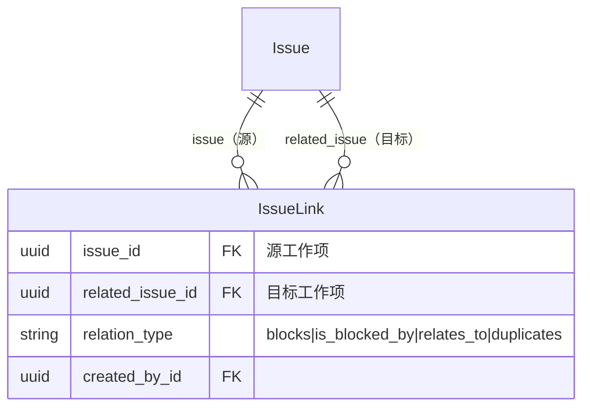
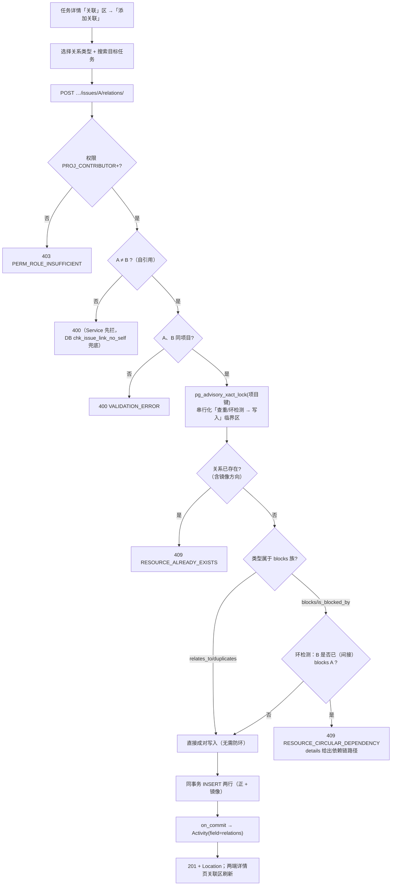
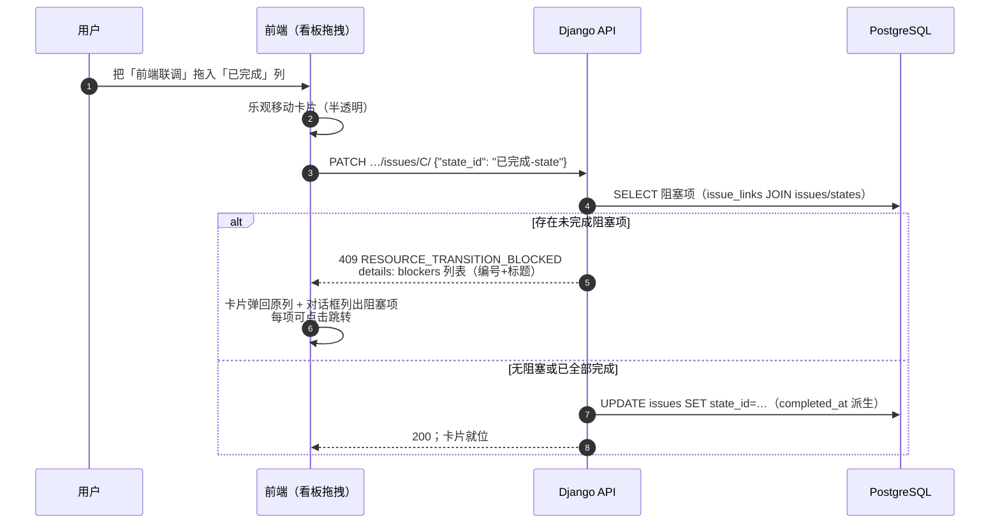
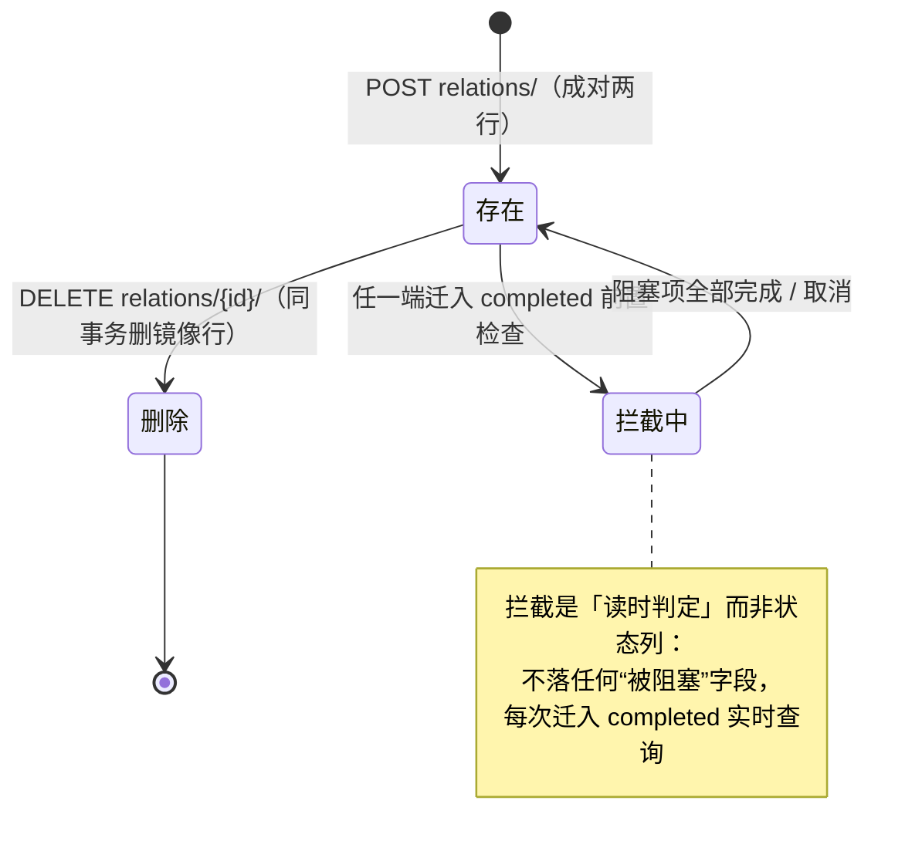

# 任务前置 / 后置依赖关系

| 元信息项 | 内容 |
| --- | --- |
| 文档编号 | TASK-005 |
| 所属迭代 | Sprint 2 — 任务体系完善（第 4 周） |
| 优先级 | P2（标准版完整级） |
| 所属模块 | M4-TASK｜任务核心 |
| 文档状态 | 待评审（Draft） |
| 最后更新日期 | 2026-09-01 |
| 上游依赖 | `TASK-001`（Issue CRUD 与状态流转）、`TASK-004`（层级服务与 CTE 范式）、`INFRA-003`（`IssueLink` 建表与双索引） |
| 下游消费 | **`GANTT-001`（甘特图依赖连线与前置约束，数据结构契约的唯一下游）**、`TASK-010`（关系变更 Activity）、`WF-004`（P3 流转守卫扩展位）、`PROJ-004`（P3 跨项目依赖评估） |
| 上游依据 | `docs/需求文档.md` §3.4（任务依赖关系：前置任务/后置任务联动）、§8.2 任务核心 P2 列 |
| 关联架构文档 | [`unified-issue-model.md`](../architecture/unified-issue-model.md)（**§2.11 IssueLink 成对存储 / INVERSE_MAP / 依赖环检测 CTE**、**§3 项目级 advisory lock**）、[`api-conventions.md`](../architecture/api-conventions.md)（§2.5 端点清单 `relations/`、§8.5 `RESOURCE_TRANSITION_BLOCKED` / `RESOURCE_CIRCULAR_DEPENDENCY`）、[`rbac-permission-model.md`](../architecture/rbac-permission-model.md) |
| 对标基线 | Plane `IssueLink`（blocks/blocked_by/relates_to/duplicate 成对存储） · Ones Custom Link Types（Business+ 自定义关联类型） |
| 工作量估算 | 后端 3 人日 / 前端 2.5 人日 / 联调与测试 1.5 人日，合计 **7 人日** |

---

## 1. 概述

### 1.1 功能定位

依赖关系回答「这件事为什么还不能做」：后端 API 没上线，前端联调任务就只能等。本迭代交付四类有向关联（`blocks` / `is_blocked_by` / `relates_to` / `duplicates`），并在此基础上交付两条硬约束：

1. **依赖图无环**——`blocks` 关系构成有向图，创建时用递归 CTE 做可达性检查（并发创建经项目级 advisory lock 串行化，见 §4.3.2），任何会闭合回路的边直接拒绝（`409 RESOURCE_CIRCULAR_DEPENDENCY`；环链达 101 条边、CTE 命中深度 100 仍回到起点的闭合判脏数据 `500`，见 §2.6）；
2. **流转拦截**——任务存在未完成的前置阻塞项（`blocks` 本任务的那些任务）时，将其拖入 `completed` 组状态被拒绝（`409 RESOURCE_TRANSITION_BLOCKED`，`details` 列出阻塞项）。

工程上最关键的一条契约是：**`GET …/issues/{id}/relations/` 的响应结构是 `GANTT-001` 甘特图连线渲染的直接数据源**，本迭代一经交付即冻结（加字段可以，改语义不可以）。

### 1.2 四类关系语义

| relation_type | 语义 | 方向 | 是否参与防环 | 是否参与流转拦截 | 示例 |
| --- | --- | --- | --- | --- | --- |
| `blocks` | 源阻塞目标（源不完成，目标做不了） | 有向 | ✅ | ✅（目标被拦） | 「后端 API」 blocks 「前端联调」 |
| `is_blocked_by` | 源被目标阻塞（`blocks` 的反向读法） | 有向（`blocks` 镜像） | ✅（同一图） | ✅（等价） | 「前端联调」 is_blocked_by 「后端 API」 |
| `relates_to` | 相关（文档引用、联合测试等） | 无向语义、成对存储 | ❌ | ❌ | 「导出功能」 relates_to 「报表重构」 |
| `duplicates` | 源是目标的重复项 | 有向 | ❌ | ❌（由自动化关闭引导，见 BR-11） | 「登录 504」 duplicates 「登录超时」 |

> `blocks` 与 `is_blocked_by` 是**同一条业务事实的两行记录**（成对存储），不是两种独立关系。用户在 UI 上无论说「A 阻塞 B」还是「B 被 A 阻塞」，落库都是两行、同事务写入。`relates_to` / `duplicates` 同样成对存储（正反各一行、`relation_type` 相同），保证任一侧详情页只需 `issue_id = me` 单向查询即可取全部关联。

### 1.3 关键约定：成对存储（Paired Records）

> ⚠️ **本文档最重要的数据结构约定。**



用户创建「A blocks B」时，同事务写入两行：

| issue_id | related_issue_id | relation_type |
| --- | --- | --- |
| A | B | `blocks` |
| B | A | `is_blocked_by` |

**为什么成对而不是单行 + OR 双向查询**：

| 方案 | 详情页查询 | 索引 | 删除一致性 |
| --- | --- | --- | --- |
| 单行存储 + `Q(issue=A) \| Q(related=A)` | 每次双向 OR，优化器难稳定走索引 | 需要 4 组复合索引覆盖双向 | 删一行即完整 |
| **成对存储（采纳，同 Plane）** | `WHERE issue_id = A` 单向点查 | 2 组索引即全覆盖 | 删「A blocks B」须同时删镜像行（同事务） |

代价是写入翻倍与镜像一致性义务（本系统把删除/创建都封装在 `link_service` 单一入口，任何路径不得绕过直写 `IssueLink`）。

### 1.4 范围边界

| 能力 | 本文档（P2） | 归属 |
| --- | --- | --- |
| 四类关系创建 / 查询 / 删除 | ✅ | — |
| 依赖防环（`blocks` 图） | ✅ | — |
| 流转拦截（未完成前置禁止完成） | ✅ 基础版（仅 `blocks`） | `WF-004` P3 扩展为可配置守卫（字段校验/工时必填/权限矩阵） |
| 关系在详情页分组展示 | ✅ | — |
| 甘特图连线数据契约 | ✅ 冻结 | `GANTT-001` 消费 |
| 自定义关联类型（验证/衍生于…） | ❌ | P3 `IssueLinkType` 配置表（架构文档 §2.11 P3 升级路径已设计） |
| 关键路径计算 | ❌ | P3 `GANTT-003` |
| 跨项目依赖 | ❌ 同项目限定（BR-02） | P3（`PROJ-004`，Sprint 9 项目集跨项目依赖评估） |
| 依赖驱动的自动排期 / 日期联动 | ❌ | P4（甘特拖拽联动仅展示，不自动改期，`GANTT-002`） |

### 1.5 前置依赖

| 依赖 | 内容 | 阻塞原因 |
| --- | --- | --- |
| `INFRA-003` | `issue_links` 表、`uniq_issue_relation` 约束、`chk_issue_link_no_self` 检查约束、双索引 | 全部数据结构已建，本迭代零 DDL 点亮 |
| `TASK-001` | 状态流转路径（`PATCH state_id` + `Issue.save()` 派生 `completed_at`） | 流转拦截钩子挂在该路径 |
| `TASK-004` | CTE 服务范式与 `CircularDependencyError` 业务异常 | 依赖环检测复用同一范式与异常类型 |
| `TASK-003` | 列表筛选白名单机制 | `?blocked=true` 筛选参数挂载 |

### 1.6 竞品参考

| 竞品 | 参考点 | 处置 |
| --- | --- | --- |
| Plane | `IssueLink` 成对存储 + `INVERSE_MAP`；`relations/` 端点 | **完全采纳**（含 4 类型枚举）；补充防环 CTE（Plane 无环检测，依赖图成环后其甘特渲染异常） |
| Plane | 无流转拦截 | 补齐：未完成前置禁止完成（需求文档 §3.4 明确要求） |
| Ones | Custom Link Types：自定义类型 + 正反向名称 + `is_blocking` 开关 | P3 升级位预留（`relation_type` → `IssueLinkType` 外键，API 兼容） |
| Jira | `is blocked by` / `blocks` 连接类型 | 语义一致，验证四类型划分符合主流心智 |

---

## 2. 业务逻辑

### 2.1 创建依赖关系



### 2.2 流转拦截（依赖 × 状态机交汇点）



**拦截语义精确化**：

| 规则点 | 取值 |
| --- | --- |
| 拦截的动作 | 目标任务的 `state.group` 从非 `completed` 迁入 `completed`（任何状态名，只认语义组） |
| 拦截的条件 | 存在 `blocks` 本任务且其 `state.group ≠ 'completed'` 的任务（`cancelled` 的阻塞项**视为已解除**，见 BR-07） |
| 不拦截的动作 | 迁入 `started` / `unstarted` / `cancelled`（开始做被阻塞的任务是允许的——现实中「先干能干的部分」完全合法）；`relates_to` / `duplicates` 永不拦截 |
| 例外通道 | `PROJ_ADMIN`(20) 可携 `force=true` 强制完成，`comment` 必填（落 Activity；BR-09） |

### 2.3 依赖关系生命周期



> **为什么拦截不做物化列**（如 `is_blocked` 布尔）：阻塞状态随两端任务状态实时变化，物化列需要事件级联维护（阻塞项完成→刷新全部被阻塞项），一致性窗口与写放大都不值得——迁入 `completed` 是低频动作，读时 JOIN 判定成本约 1ms（双索引点查）。

### 2.4 业务规则汇总

| 编号 | 规则 | 判定位置 | 违反后果 |
| --- | --- | --- | --- |
| BR-01 | 禁止自引用（A 关联 A） | Service 先拦 + DB `chk_issue_link_no_self` 兜底 | `400 VALIDATION_ERROR` |
| BR-02 | 两端必须同项目（同 Workspace 蕴含）；跨项目关联 P3 评估（`PROJ-004`，Sprint 9） | Serializer | `400 VALIDATION_ERROR` + `DOES_NOT_EXIST` |
| BR-03 | 成对写入：正反两行同一事务；删除同步删镜像行；**任何路径不得绕过 `link_service` 直写 `IssueLink`** | Service 唯一入口 | 评审拒绝 |
| BR-04 | 唯一性以「业务事实」判定：`(A,B,blocks)` 存在时，创建 `(A,B,is_blocked_by)` / `(B,A,blocks)` 均拒绝（防镜像方向重复建档） | Service（查正反两向）+ DB `uniq_issue_relation` 兜底 | `409 RESOURCE_ALREADY_EXISTS` |
| BR-05 | `blocks` 族关系创建前执行可达性环检测（递归 CTE；保险丝 100 **仅作脏数据告警线**——命中环且环链达 101 条边（CTE 命中深度 100）判脏数据 500，未命中环（含环链超 101 条边、扫描被截断）按不可达放行、不拦截合法深链，§2.6），检测与写入在项目级 advisory lock 串行化下进行（READ COMMITTED 下 CTE 看不到并发未提交边，§4.3.2）；`relates_to` / `duplicates` 不检测 | Service | `409 RESOURCE_CIRCULAR_DEPENDENCY` + 链路径；保险丝命中 → `500 SERVER_ERROR` + ERROR 告警 |
| BR-06 | 拦截判定：目标迁入 `completed` 组时，存在 `blocks` 我方且 `state.group ∉ {completed, cancelled}` 的任务 → 拒绝 | 流转校验钩子 | `409 RESOURCE_TRANSITION_BLOCKED` + blockers 明细 |
| BR-07 | 阻塞项 `cancelled` 视为解除阻塞（取消 = 明确不做，不再构成依赖）；`duplicates` 不参与拦截 | 流转校验 | — |
| BR-08 | 单任务直接关联数上限 50（正反合并计数）；超出提示拆分 | Service | `409 RESOURCE_LIMIT_EXCEEDED` |
| BR-09 | `PROJ_ADMIN` 可 `force=true` 越过拦截，`comment` 必填且落 Activity（可审计） | Service | 缺 comment `400` |
| BR-10 | 删除任务时其全部关联（含镜像）同事务软删 | 级联服务 | — |
| BR-11 | `duplicates` 建议闭环：标记重复后 UI 引导「将重复项拖入已取消」；自动关闭重复项归 P3 自动化规则 | UI 引导 | — |
| BR-12 | 每次创建/删除关系产生 `IssueActivity(field='relations')`（两端共享同一 epoch，`TASK-010` 管道口径） | on_commit | — |
| BR-13 | 软删任务的关系对默认查询不可见（JOIN `deleted_at IS NULL`），恢复任务则关系恢复 | ORM 过滤 | — |

### 2.5 异常处理

| 场景 | HTTP | 错误码 | details 子码 | 前端表现 |
| --- | --- | --- | --- | --- |
| 自引用 | 400 | `VALIDATION_ERROR` | `INVALID` | 「不能与自身建立关联」 |
| 跨项目目标 | 400 | `VALIDATION_ERROR` | `DOES_NOT_EXIST` | 搜索器本就限本项目；直连触发 |
| 关系已存在（任一方向） | 409 | `RESOURCE_ALREADY_EXISTS` | `UNIQUE` | 「两个任务已存在该关联」 |
| 依赖成环 | 409 | `RESOURCE_CIRCULAR_DEPENDENCY` | `CYCLE` | Toast 展示依赖链「A → B → C」；关系区高亮链上任务 |
| 完成被拦截 | 409 | `RESOURCE_TRANSITION_BLOCKED` | `BLOCKED_BY` | 看板卡片弹回；对话框列出阻塞项（可点击跳转、可「强制完成（管理员）」） |
| 强制完成缺 comment | 400 | `VALIDATION_ERROR` | `REQUIRED` | comment 输入框标红 |
| 关联数超 50 | 409 | `RESOURCE_LIMIT_EXCEEDED` | `LIMIT` | 「单任务最多 50 条关联」 |
| 目标任务不存在/不可见 | 404 | `RESOURCE_NOT_FOUND` | — | 通用 404 提示 |
| 删除已被他人先删 | 404 | `RESOURCE_NOT_FOUND` | — | 静默刷新关联区 |
| CTE 保险丝命中（环链达 101 条边、CTE 命中深度 100 仍回到起点 → 判脏数据；合法深链未成环不触发，§2.6） | 500 | `SERVER_ERROR` | — | 通用错误 + request_id；ERROR 告警 |

> **字段级子码登记**：本表使用的 `CYCLE` / `BLOCKED_BY` / `LIMIT` 为 `details[].code` 字段级子码，不占用全局错误码注册表，由 [`api-conventions.md`](../architecture/api-conventions.md) §8.8「字段级子码」承载。§8.8 现表已含 `DOES_NOT_EXIST` / `UNIQUE` 等（直接复用），但**未注册** `CYCLE`（依赖环，`message` 给出环链路径，与 `TASK-004` 同码）、`BLOCKED_BY`（前置阻塞，`details[].issue_key` 给出阻塞项编号，§4.2.4）与 `LIMIT`（关联数超上限，`message` 给出上限值与实际值）——交付时需在 §8.8 补登这三条子码条目，**架构文档待回改登记**（与 `TASK-007` `LIMIT` / `STATE` 的补登模式一致）。

### 2.6 边界条件

| 边界场景 | 限制值 | 超出处理 |
| --- | --- | --- |
| 单任务直接关联数 | 50 | 拒绝并提示 |
| 依赖链深度（防环 CTE 扫描） | 100（保险丝，**仅作脏数据告警线**，不构成业务深度限制） | 命中环且环链达 101 条边（§4.3.2 锚点邻点 depth=0、第 k 跳节点 depth=k−1，故 101 条边闭合时 target 命中 depth=100）仍回到起点 → 判脏数据：500 `SERVER_ERROR` + ERROR 告警；未命中环（含环链超 101 条边、target 落在截断层之外）→ 按不可达放行（合法深链不拦截）。闭合前环链超 101 条边的环仍可经 API 逐步建成——截断按不可达放行属已声明权衡（BR-05） |
| 依赖链业务深度 | 无硬限（甘特渲染按层级折叠） | `GANTT-001` 处理——与上行保险丝正交：保险丝不拦截合法深链，仅在环检测场景命中「环链 101 条边（深度 100）仍回到起点」时告警 |
| 并发互建镜像 | 同时建 `(A,B)` 与 `(B,A)` | 唯一约束兜底，后到者 409 |
| 并发环构造 | 同时建 A→B 与 B→C→A 两条长链 | 项目级 advisory lock 串行化临界区（§4.3.1），后提交者在已提交图上检测 → 409 |
| 目标搜索结果 | 前 20 条（标题 trgm） | 关键词收窄 |

---

## 3. UI/UX 设计

### 3.1 任务详情「关联」分区（Drawer 新增区块）

```
┌──────────────────────────────────────────────────────────────────┐
│ TZXM-18  前端联调                          ⋯    ✕                │
│ …（标题 / 描述区略）                                               │
│ ──────────────────────────────────────────────────────────────── │
│  关联 (4)                                        [+ 添加关联]    │
│                                                                   │
│  ⛔ 阻塞于此（前置）                                                │
│    ├ TZXM-13  后端导出 API          ●已完成   →                  │
│    └ TZXM-21  导出限流配置          ●进行中   →        ⓧ         │
│                                                                   │
│  ⛔ 阻塞（后置）                                                    │
│    └ TZXM-25  前端回归测试          ●待办     →        ⓧ         │
│                                                                   │
│  🔗 相关                                                           │
│    └ TZXM-12  导出功能              ●进行中   →        ⓧ         │
└──────────────────────────────────────────────────────────────────┘
  → 点击跳转目标详情（保留返回栈）   ⓧ 悬浮显示，点击删除（二次确认）
```

| 元素 | 规格 |
| --- | --- |
| 分组 | 三组固定顺序：**阻塞于此**（`is_blocked_by`，我的前置）/ **阻塞**（`blocks`，被我阻塞的）/ **相关**（`relates_to` + `duplicates` 合并，`duplicates` 项加「重复于」角标）；空组不渲染 |
| 行 | 图标 + 编号（`font-mono text-xs`）+ 标题（truncate）+ 状态圆点 + 跳转箭头 + 删除 ⓧ（悬浮显现） |
| 阻塞语义强化 | 未完成的前置行前置 `alert-triangle`（amber）；已完成的为 `check`（green）——完成态视觉降级 |
| 「+ 添加关联」 | 弹出关系选择 + 目标搜索的组合弹层（§3.2） |
| 计数 | 分区标题 `(4)` 为三组合计（前置 2 + 后置 1 + 相关 1；BR-08 的 50 上限进度提示：≥40 时计数变 amber） |

### 3.2 添加关联弹层

```
┌────────────────────────────────────────────────┐
│  添加关联                                        │
│                                                  │
│  关系类型     ⚡ 阻塞了…（blocks）        ▾     │
│              ┌────────────────────────┐        │
│              │ ⚡ 阻塞了…   blocks     │        │
│              │ ⛔ 被…阻塞  is_blocked_by│        │
│              │ 🔗 相关于…  relates_to  │        │
│              │ 👥 重复于…  duplicates  │        │
│              └────────────────────────┘        │
│  目标任务   ┌────────────────────────┐        │
│            │ 🔍 搜索任务标题或编号…   │        │
│            ├────────────────────────┤        │
│            │ TZXM-21 导出限流配置 ●进行中│     │
│            │ TZXM-22 导出灰度方案   ●待办│     │
│            └────────────────────────┘        │
│                                                  │
│  ⓘ 选择「阻塞了…」：TZXM-21 完成前，             │
│    当前任务将无法流转到已完成。                    │
│                          [取消]  [创建关联]      │
└────────────────────────────────────────────────┘
```

| 元素 | 规格 |
| --- | --- |
| 类型下拉 | 四项固定（图标 + 中文名 + 代码角标）；选中后底部出现该类型的**语义提示行**（如上图 ⓘ，管理用户预期，尤其流转拦截后果） |
| 目标搜索 | 防抖 300ms `GET …/issues/?search=<kw>&per_page=20&fields=id,issue_key,name,state_id`（`?search=` 为 issues 列表搜索参数，api-conventions §5.3/§5.5；`?q=` 仅 workspace 全局搜索端点，白名单外传入会被忽略进 `meta.ignored_params`）；排除自身；显示状态圆点 |
| 预判提示 | 目标已被当前任务阻塞时搜索行内灰字「已关联」且不可选（前端预判，后端 409 兜底） |
| 提交 | `[创建关联]` loading；成功关闭弹层、关联区乐观插入对应分组 |
| 失败 | 409 环路径 → 弹层内红条完整展示依赖链；其他 → toast |

### 3.3 完成被拦截对话框（看板 / 详情双入口）

```
┌────────────────────────────────────────────────┐
│  ⛔ 无法完成「前端联调」                          │
│                                                  │
│  以下前置任务尚未完成：                            │
│                                                  │
│  ● TZXM-21  导出限流配置            进行中  →   │
│  ● TZXM-22  导出灰度方案            待办     →   │
│                                                  │
│  ⓘ 已取消（cancelled）的前置任务不会阻塞完成。    │
│                                                  │
│              [我知道了]      [强制完成（管理员）]  │
└────────────────────────────────────────────────┘
```

| 元素 | 规格 |
| --- | --- |
| 触发 | 拖拽 409 后卡片弹回原列 + 此对话框；详情页改状态同样触发 |
| 阻塞项行 | 点击 `→` 跳转该任务详情（返回后对话框已关闭、原任务留在原地） |
| 强制完成 | 仅 `PROJ_ADMIN` 可见（rbac §8 矩阵无独立权限点，按 AUTH-005 `PermissionStore.effectiveProjectRole ≥ PROJ_ADMIN(20)` 判定，与后端 403 同口径）；点击展开必填 comment 输入（≥5 字符）后重发 `force=true` |
| 看板弹回动画 | 卡片 300ms 弹回 + 列头 shake 一次（明确「没成功」的信号） |

### 3.4 列表 / 看板的依赖可见性

| 位置 | 表现 |
| --- | --- |
| 列表行 | 标题左侧 12px `link` 图标（存在任意关联时）；`?blocked=true` 筛选只看被阻塞任务 |
| 看板卡片 | 被未完成前置阻塞的卡片右上角 `⛔` 角标（amber）；悬浮 tooltip 列阻塞项前 3 个 + 「等 N 项」 |
| 分组统计 | 看板列头「进行中 · 5（2 被阻塞）」次级文本 |

### 3.5 空状态 / 加载 / 失败

| 场景 | 处置 |
| --- | --- |
| 无任何关联 | 分区收缩为一行「关联 — [+ 添加]」（不占竖向空间） |
| 关联区加载 | 3 行骨架 |
| 关联区失败 | 行内「加载失败 · 重试」 |
| 搜索无结果 | 「未找到匹配任务，换个关键词」 |

### 3.6 响应式与无障碍

| 断点 | 布局 |
| --- | --- |
| ≥ 1280px | 三分组纵列全量字段 |
| 768~1279px | 关联行隐藏状态圆点（保留色点 8px + tooltip） |
| < 768px | 分组折叠为手风琴；弹层全屏 |

无障碍：分组标题 `role="group"` + `aria-label`；拦截对话框 `role="alertdialog"` + `aria-describedby` 指向阻塞列表；`⛔` 角标同时有文本 tooltip；「强制完成」按钮 `aria-haspopup="dialog"`；键盘可完成「添加关联」全流程（Tab 顺序：类型 → 搜索 → 结果列表方向键 → 提交）。

---

## 4. 技术架构

### 4.1 数据模型

**零新增表、零 DDL**。`INFRA-003` 已建（与架构文档 §2.11 一致）：

```python
# apps/api/plane/db/models/issue_link.py —— 既有定义，本迭代点亮
class IssueLink(BaseModel):
    """工作项关联 —— 成对存储：创建 A blocks B 时同事务写入 B is_blocked_by A"""

    class RelationType(models.TextChoices):
        BLOCKS = "blocks", "阻塞"
        IS_BLOCKED_BY = "is_blocked_by", "被阻塞于"
        RELATES_TO = "relates_to", "关联"
        DUPLICATES = "duplicates", "重复于"

    INVERSE_MAP = {
        "blocks": "is_blocked_by",
        "is_blocked_by": "blocks",
        "relates_to": "relates_to",
        "duplicates": "duplicates",
    }
    BLOCKING_TYPES = frozenset({"blocks", "is_blocked_by"})   # 参与防环与拦截的族

    issue = models.ForeignKey(Issue, on_delete=models.CASCADE,
                              related_name="issue_links", verbose_name="源工作项")
    related_issue = models.ForeignKey(Issue, on_delete=models.CASCADE,
                                      related_name="related_issue_links",
                                      verbose_name="目标工作项")
    relation_type = models.CharField(max_length=24, choices=RelationType.choices,
                                     default=RelationType.RELATES_TO, verbose_name="关联类型")

    class Meta(BaseModel.Meta):
        db_table = "issue_links"
        constraints = [
            models.UniqueConstraint(
                fields=["issue", "related_issue", "relation_type"],
                condition=models.Q(deleted_at__isnull=True),
                name="uniq_issue_relation",
            ),
            models.CheckConstraint(
                check=~models.Q(issue=models.F("related_issue")),
                name="chk_issue_link_no_self",
            ),
        ]
        indexes = [
            models.Index(fields=["issue", "relation_type"], name="idx_link_issue_type"),
            models.Index(fields=["related_issue", "relation_type"], name="idx_link_related_type"),
        ]
```

#### 4.1.1 索引设计说明

| 索引 | 服务的查询 | 使用频率 |
| --- | --- | --- |
| `idx_link_issue_type` | 详情页关联列表 `WHERE issue_id=A`；拦截检查 `WHERE issue_id=C AND relation_type='is_blocked_by'` | 极高（每次详情打开 + 每次迁入 completed） |
| `idx_link_related_type` | 镜像行查询；被阻塞统计 | 高 |
| `uniq_issue_relation` | 唯一性兜底（并发双写） | 写路径 |
| `chk_issue_link_no_self` | 自引用兜底 | 写路径 |

### 4.2 API 定义

| # | 方法 | 路径 | 描述 | 权限 | 成功码 |
| --- | --- | --- | --- | --- | --- |
| 1 | `GET` | `…/issues/{issue_id}/relations/` | 该任务全部关联（成对三组语义化结构，**契约冻结**） | `PROJ_VIEWER`(5)+（`issue.read`） | `200` |
| 2 | `POST` | `…/issues/{issue_id}/relations/` | 创建关联（成对两行） | `PROJ_CONTRIBUTOR`(15)+（`issue.relation.manage`） | `201` + `Location` |
| 3 | `DELETE` | `…/issues/{issue_id}/relations/{link_id}/` | 删除关联（同事务删镜像行） | `PROJ_CONTRIBUTOR`(15)+（`issue.relation.manage`） | `204` |
| 4 | `PATCH` | `…/issues/{issue_id}/` | 状态迁入 `completed` 时触发拦截（`force` 可选参数） | `PROJ_CONTRIBUTOR`(15)+ | `200` |
| 5 | `GET` | `…/issues/?blocked=true` | 筛选被阻塞任务（`TASK-003` 白名单新增参数） | `PROJ_VIEWER`(5)+ | `200` |

#### 4.2.1 `GET …/relations/` — 关联列表（`GANTT-001` 数据契约）

**请求**

```http
GET /api/v1/workspaces/acme/projects/7b3e9c1a-.../issues/c4d5e6f7-.../relations/ HTTP/1.1
```

**成功响应 `200`**

```json
{
  "status": "success",
  "data": [
    {
      "id": "f1a2b3c4-d5e6-4f7a-8b9c-0d1e2f3a4b5c",
      "issue_id": "c4d5e6f7-8a9b-4c0d-9e1f-2a3b4c5d6e7f",
      "related_issue_id": "8a1f9c2e-6b3d-4a7e-9f11-2c4d5e6f7a8b",
      "relation_type": "is_blocked_by",
      "is_blocking": true,
      "related_issue": {
        "id": "8a1f9c2e-6b3d-4a7e-9f11-2c4d5e6f7a8b",
        "issue_key": "RBT-13",
        "name": "后端导出 API",
        "state_id": "e3f4a5b6-7c8d-4e9f-8a1b-2c3d4e5f6a7b",
        "state_group": "completed",
        "start_date": "2026-09-01",
        "target_date": "2026-09-05"
      }
    },
    {
      "id": "a2b3c4d5-e6f7-4a8b-9c0d-1e2f3a4b5c6d",
      "issue_id": "c4d5e6f7-8a9b-4c0d-9e1f-2a3b4c5d6e7f",
      "related_issue_id": "b7c8d9e0-f1a2-4b3c-8d9e-0f1a2b3c4d5e",
      "relation_type": "blocks",
      "is_blocking": true,
      "related_issue": {
        "id": "b7c8d9e0-f1a2-4b3c-8d9e-0f1a2b3c4d5e",
        "issue_key": "RBT-25",
        "name": "前端回归测试",
        "state_id": "d4c3b2a1-0f9e-4d8c-8b6a-5c4d3e2f1a0b",
        "state_group": "unstarted",
        "start_date": null,
        "target_date": "2026-09-12"
      }
    }
  ],
  "meta": { "count": 2 }
}
```

**契约冻结条款（`GANTT-001` 依赖，破坏需开 v2）**：

1. `data[]` 恒为数组（**无分页——api-conventions §6 分页约定的显式豁免**：单任务关联受 BR-08 的 50 上限约束，结果集天然有界，无需游标）；
2. 每项含 `relation_type`（四枚举）、`is_blocking`（该关系是否参与防环/拦截：`blocks` 族 true，其余 false）、`related_issue` 内联对象（含甘特连线必需的 `id` / `issue_key` / `start_date` / `target_date` / `state_group`）；
3. `related_issue.start_date` / `target_date` 可为 `null`——甘特渲染无日期任务时连线锚定到「今天」虚线节点（`GANTT-001` 处理）；
4. 关联按创建时间倒序，三组由前端按 `relation_type` 分组渲染。

#### 4.2.2 `POST …/relations/` — 创建关联

**请求**

```json
{
  "related_issue_id": "b7c8d9e0-f1a2-4b3c-8d9e-0f1a2b3c4d5e",
  "relation_type": "blocks"
}
```

> 语义：**当前任务（URL 中的 issue）blocks 目标任务**。用户在 UI 若说「被…阻塞」，前端翻译为 `relation_type: "is_blocked_by"`——服务端统一归一化为「正方向 `blocks` + 镜像 `is_blocked_by`」两行落库。

**成功响应 `201 Created`**（必须带 `Location` 头指向新建的正向关联资源，api-conventions §4.3「201 必须带 `Location` 响应头」）

```http
HTTP/1.1 201 Created
Location: /api/v1/workspaces/acme/projects/7b3e9c1a-.../issues/c4d5e6f7-.../relations/e6f7a8b9-.../
```

```json
{
  "status": "success",
  "data": {
    "id": "e6f7a8b9-c0d1-4e2f-8a3b-4c5d6e7f8a9b",
    "issue_id": "c4d5e6f7-8a9b-4c0d-9e1f-2a3b4c5d6e7f",
    "related_issue_id": "b7c8d9e0-f1a2-4b3c-8d9e-0f1a2b3c4d5e",
    "relation_type": "blocks",
    "is_blocking": true,
    "mirror_id": "0d1e2f3a-4b5c-4d6e-8f9a-1b2c3d4e5f6a"
  }
}
```

**失败响应 `409`（依赖成环）**

```json
{
  "status": "error",
  "error": {
    "code": "RESOURCE_CIRCULAR_DEPENDENCY",
    "message": "该依赖会构成循环依赖",
    "details": [{
      "field": "related_issue_id",
      "code": "CYCLE",
      "message": "依赖链：前端回归测试 RBT-25 → 联调准备 RBT-30 → 前端联调 RBT-18"
    }],
    "request_id": "01JCB5T9N3YR8O0Q6W4X7Z9A2B"
  }
}
```

**失败响应 `409`（已存在）**

```json
{
  "status": "error",
  "error": {
    "code": "RESOURCE_ALREADY_EXISTS",
    "message": "两个任务之间已存在该关联",
    "details": [{ "field": "related_issue_id", "code": "UNIQUE",
                  "message": "已存在：RBT-18 被 RBT-13 阻塞" }],
    "request_id": "01JCB5T9N3YR8O0Q6W4X7Z9A2C"
  }
}
```

#### 4.2.3 `DELETE …/relations/{link_id}/` — 删除

**成功响应 `204`**（空体；镜像行同事务删除，响应无需回传）。

**失败 `404`**：已被删除（含镜像路径传入）。

#### 4.2.4 `PATCH …/issues/{id}/` — 流转拦截

**请求（普通完成）**

```json
{ "state_id": "e3f4a5b6-…-已完成-state" }
```

**失败响应 `409`（被阻塞）**

```json
{
  "status": "error",
  "error": {
    "code": "RESOURCE_TRANSITION_BLOCKED",
    "message": "存在未完成的前置任务，无法完成该工作项",
    "details": [
      { "field": "state_id", "code": "BLOCKED_BY", "issue_key": "RBT-21",
        "message": "RBT-21 导出限流配置 · 进行中" },
      { "field": "state_id", "code": "BLOCKED_BY", "issue_key": "RBT-22",
        "message": "RBT-22 导出灰度方案 · 待办" }
    ],
    "request_id": "01JCB5T9N3YR8O0Q6W4X7Z9A2D"
  }
}
```

> `details[].issue_key` 为结构化阻塞项编号（api-conventions §8.5「`details` 列出阻塞原因与阻塞项 ID」的落位——§8.5 所指「阻塞项 ID」即服务层 `TransitionBlockedError.blockers` 内部的 `id`（任务 UUID，§4.3.3），序列化进 `details[]` 时以人类可读的 `issue_key` 承载）：前端跳转直接消费该字段，`message` 仅作展示串、不做解析（§4.4.2）。
>
> `issue_key` 是对 api-conventions §4.2 / §8.9 `ApiFieldError { field, code, message }` 的结构扩展：前端 `ApiFieldError` 类型需同步加 `issue_key?: string`（架构文档待回改登记）。

**请求（管理员强制完成）**

```json
{ "state_id": "e3f4a5b6-…-已完成-state", "force": true, "comment": "客户演示节点，风险已评估由我承担" }
```

**成功响应 `200`**：完整 Issue；Activity 含 `force` 标记与 comment（`TASK-010` 管道落库）。

### 4.3 核心逻辑

#### 4.3.1 创建关联（唯一入口 + 环检测）

```python
# apps/api/plane/db/services/issue_link.py
import uuid

from django.conf import settings
from django.db import connection, transaction
from django.db.models import Q

from plane.db.models import Issue, IssueLink
from plane.db.services.issue_sequence import acquire_project_lock


@transaction.atomic
def create_relation(*, issue_id: uuid.UUID, related_issue_id: uuid.UUID,
                    relation_type: str, actor_id: uuid.UUID) -> IssueLink:
    """创建关联 —— 全系统唯一写入口（BR-03），成对两行同事务。

    relation_type 归一化：is_blocked_by 传入时交换两端转为 blocks 正向建模，
    落库恒为 (正向, 镜像) 两行，读取时按 relation_type 还原用户视角。
    """
    if issue_id == related_issue_id:                                   # BR-01
        raise ValidationError({"related_issue_id": "不能与自身建立关联"})

    issue = Issue.objects.get(id=issue_id, deleted_at__isnull=True)
    related = Issue.objects.get(id=related_issue_id, deleted_at__isnull=True)
    if issue.project_id != related.project_id:                          # BR-02
        raise ValidationError({"related_issue_id": "关联双方必须属于同一项目"})

    if relation_type == "is_blocked_by":                               # 归一化为正向
        issue_id, related_issue_id = related_issue_id, issue_id
        issue, related = related, issue
        relation_type = "blocks"

    # BR-05 前置：项目级事务咨询锁（unified-issue-model §3 序列号同款，TASK-004 同空间复用）。
    # READ COMMITTED 下环检测 CTE 只能看到已提交数据，两条长链并发合围会双双通过检测后落库成环；
    # 锁把「查重 → 环检测 → 成对写入」临界区按项目串行化，事务提交/回滚自动释放，无死锁残留。
    acquire_project_lock(issue.project_id)

    # BR-04 业务事实唯一性：正反两向查重（DB 约束仅兜底单方向）
    exists = IssueLink.objects.filter(
        deleted_at__isnull=True, relation_type__in=(relation_type,
                        IssueLink.INVERSE_MAP[relation_type])
    ).filter(
        Q(issue_id=issue_id, related_issue_id=related_issue_id)
        | Q(issue_id=related_issue_id, related_issue_id=issue_id)
    ).exists()
    if exists:
        raise AlreadyExistsError(target=issue, related=related)

    # BR-08 关联数上限（正反合并计数）
    _assert_link_budget(issue_id)
    _assert_link_budget(related_issue_id)

    if relation_type in IssueLink.BLOCKING_TYPES:                      # BR-05 防环
        hit_depth = _reaches(source=related_issue_id, target=issue_id)  # 新边 related→issue 反向可达即成环；-1 = 不可达
        if hit_depth >= settings.CTE_GUARD_DEPTH:                      # 保险丝命中：命中深度 ≥100（环链 101 条边）仍回到起点 → 判脏数据（§2.6，合法深链未成环不会走到这里）
            raise DirtyDependencyGraphError(source=related, target=issue)   # → 500 SERVER_ERROR + ERROR 告警（§2.5）
        if hit_depth >= 0:                                             # 保险丝深度内的正常环
            raise CircularDependencyError(path=_render_chain(related, issue))

    forward = IssueLink.objects.create(
        issue_id=issue_id, related_issue_id=related_issue_id,
        relation_type=relation_type, created_by_id=actor_id)
    mirror = IssueLink.objects.create(
        issue_id=related_issue_id, related_issue_id=issue_id,
        relation_type=IssueLink.INVERSE_MAP[relation_type], created_by_id=actor_id)

    transaction.on_commit(lambda: record_relation_change.delay(
        str(forward.id), str(mirror.id), str(actor_id)))
    return forward
```

#### 4.3.2 依赖环检测（递归 CTE 可达性）

```python
BLOCKS_REACH_SQL = """
    WITH RECURSIVE reachable(id, depth) AS (
        SELECT related_issue_id, 0 FROM issue_links
         WHERE issue_id = %(source)s AND relation_type = 'blocks' AND deleted_at IS NULL
        UNION ALL
        SELECT l.related_issue_id, r.depth + 1
          FROM issue_links l JOIN reachable r ON l.issue_id = r.id
         WHERE l.relation_type = 'blocks' AND l.deleted_at IS NULL
           AND r.depth < %(guard)s
    )
    SELECT COALESCE(MAX(depth), -1) FROM reachable WHERE id = %(target)s
"""


def _reaches(*, source: uuid.UUID, target: uuid.UUID) -> int:
    """source 沿 blocks 边是否可达 target（含间接）——回传命中深度而非布尔。

    -1 = 不可达（含扫描深度超保险丝被截断、未命中 target 的情形：
    依赖链业务深度无硬限（§2.6），合法深链按不可达放行，保险丝不拦截）；
    0 ≤ depth < 保险丝 = 正常环（→ 409）；
    depth ≥ 保险丝 = 扫描至保险丝深度（100）仍回到起点，判脏数据
    （→ 500 SERVER_ERROR + ERROR 告警，§2.5/§2.6——布尔 EXISTS 无法区分
    「不可达」与「截断」，回传命中深度才能兑现该口径）。

    新建 A blocks B 时调用 _reaches(source=B, target=A)：
    B 若已能到达 A，加边后 A→B→…→A 闭合为环。
    成对存储下每条业务边两行中恰有一行 relation_type='blocks'（正向行），
    图不重复、不漏边。每步走 idx_link_issue_type 点查。
    """
    with connection.cursor() as cursor:
        cursor.execute(BLOCKS_REACH_SQL,
                       {"source": source, "target": target,
                        "guard": settings.CTE_GUARD_DEPTH})
        return cursor.fetchone()[0]
```

> 成对存储与环检测的**正确性配合**：镜像行是 `is_blocked_by`，CTE 只沿 `blocks` 边走——若沿两族边同走，每条业务事实会被走两次且镜像边方向恰好构成「往返」，任何图都会误报成环。这是成对存储方案里最容易写错的一处，UT-03/UT-04/UT-05 专项锚定；保险丝语义（合法深链放行 × 环链 101 条边成环告警 500）由 UT-17/UT-18 锚定。

> **并发正确性（advisory lock 的必要性）**：默认隔离级别 READ COMMITTED 下每条语句取独立快照，环检测 CTE **看不到并发事务未提交的新边**——两个请求同时各补一条链的最后一环（如并发建 B→C 与 C→A）时检测双双通过、提交后成环，CTE 本身不提供任何锁，「检测与写入同事务」并不足以串行化。因此 `create_relation` 在查重/检测前先取**项目级事务咨询锁**（`acquire_project_lock`，`unified-issue-model.md` §3 序列号生成同款、TASK-004 子任务挂载同空间复用），把「查重 → 环检测 → 成对写入」整个临界区按项目串行化；关系创建为低频人工操作（单项目 <1 QPS），串行化无吞吐顾虑。该锁同时关闭 BR-04「镜像方向并发双建」的窗口（`uniq_issue_relation` 只兜底完全相同的三元组，IT-02/IT-03 双锚定）。架构文档 §2.11 尚未记载该串行化要求——**架构文档待回改**。

#### 4.3.3 流转拦截钩子（挂 `TASK-001` 更新路径）

```python
# apps/api/plane/db/services/issue_transition_guard.py
BLOCKER_SQL = """
    SELECT i.id, i.sequence_id, i.name, s."group"
      FROM issue_links l
      JOIN issues i ON i.id = l.related_issue_id    -- related_issue_id = 阻塞我的任务
      LEFT JOIN states s ON s.id = i.state_id
     WHERE l.issue_id = %(me)s
       AND l.relation_type = 'is_blocked_by'        -- 我持有的镜像行（A blocks B 时 B 侧落 is_blocked_by）
       AND l.deleted_at IS NULL
       AND i.deleted_at IS NULL
       AND COALESCE(s."group", 'unstarted') NOT IN ('completed', 'cancelled')
"""


def assert_completable(*, issue: Issue, to_state: State,
                       force: bool, actor) -> None:
    """迁入 completed 组前的前置依赖检查（BR-06/BR-07）。

    与 TASK-001 的 PATCH 更新路径集成：目标 state.group == 'completed'
    且原 state.group != 'completed' 时调用。
    """
    if to_state.group != "completed":
        return                                          # 仅拦「完成」
    with connection.cursor() as cursor:
        cursor.execute(BLOCKER_SQL, {"me": issue.id})
        blockers = cursor.fetchall()
    if not blockers:
        return
    if force:
        if not actor.has_role("PROJ_ADMIN", project_id=issue.project_id):
            raise PermissionDenied("仅项目管理员可强制完成")   # 403
        return                                          # comment 必填在 Serializer 层校验
    raise TransitionBlockedError(                       # 409 RESOURCE_TRANSITION_BLOCKED
        blockers=[{"id": b[0], "issue_key": f"{issue.project.identifier}-{b[1]}",
                   "name": b[2], "state_group": b[3]} for b in blockers])
```

**性能**：单次索引点查 + ≤50 行 JOIN，实测 < 1ms；只在「迁入 completed」这一低频动作触发，不对其他任何 PATCH 字段生效（改标题/改负责人不经过此钩子）。

#### 4.3.4 删除与级联

```python
@transaction.atomic
def delete_relation(*, link_id: uuid.UUID, actor_id: uuid.UUID) -> None:
    """删除关联：正反两行同事务软删（BR-03）。幂等：已删返回 404 由视图层处理。"""
    link = (IssueLink.objects.select_for_update()
            .filter(id=link_id, deleted_at__isnull=True).first())
    if link is None:
        raise NotFound()
    mirror = (IssueLink.objects.select_for_update()
              .filter(issue_id=link.related_issue_id, related_issue_id=link.issue_id,
                      relation_type=IssueLink.INVERSE_MAP[link.relation_type],
                      deleted_at__isnull=True).first())
    now = timezone.now()
    link.deleted_at = now
    link.save(update_fields=["deleted_at"])
    if mirror:                                          # 镜像缺失容错（历史脏数据不阻断）
        mirror.deleted_at = now
        mirror.save(update_fields=["deleted_at"])
    transaction.on_commit(lambda: record_relation_change.delay(
        str(link.id), str(mirror.id) if mirror else None, str(actor_id)))


# 删除任务时的级联（并入 TASK-004 delete_subtree 的 CTE 目标集）：
#   UPDATE issue_links SET deleted_at = now()
#    WHERE issue_id IN (SELECT id FROM target) OR related_issue_id IN (SELECT id FROM target)
```

#### 4.3.5 Celery 任务

```python
# apps/api/plane/bgtasks/issue_link.py
@shared_task(bind=True, max_retries=3, retry_backoff=True)
def record_relation_change(self, forward_id: str, mirror_id: str | None,
                           actor_id: str) -> None:
    """关系变更 Activity（两端共享同一 epoch，TASK-010 管道聚合展示）——幂等"""
    ...
```

### 4.4 前端实现

#### 4.4.1 `IssueRelationStore`（`packages/shared-state`）

```typescript
// packages/shared-state/src/issue-relation.store.ts
import { makeAutoObservable, observable, computed } from "mobx";
import type { ApiRelation } from "@rp/types";

export class IssueRelationStore {
  /** 按任务缓存的关联列表（SWR key: `issue:{id}:relations`） */
  byIssue = observable.map<string, ApiRelation[]>();

  constructor(private readonly issueStore: IssueStore) {
    makeAutoObservable(this, {}, { autoBind: true });
  }

  @computed struct(issueId: string) {
    const all = this.byIssue.get(issueId) ?? [];
    return {
      blockedBy: all.filter((r) => r.relation_type === "is_blocked_by"),  // 我的前置
      blocking:  all.filter((r) => r.relation_type === "blocks"),          // 我阻塞的
      related:   all.filter((r) => r.relation_type === "relates_to"
                          || r.relation_type === "duplicates"),
    };
  }

  /** 被阻塞看板角标的派生数据（卡片渲染消费，零重复请求） */
  @computed openBlockerCount(issueId: string): number {
    return this.struct(issueId).blockedBy.filter(
      (r) => !["completed", "cancelled"].includes(r.related_issue.state_group),
    ).length;
  }

  async create(issueId: string, payload: CreateRelationInput): Promise<void> {
    const created = await this.services.createRelation(issueId, payload);
    this.mutateBoth(issueId, payload.related_issue_id, created);  // 两端缓存乐观更新
  }
}
```

#### 4.4.2 409 拦截的看板处理（乐观回滚）

```typescript
// apps/web/src/routes/…/kanban/-components/card-dnd.ts（节选）
// canForce 在组件层预计算后经闭包传入（AUTH-005 §4.5 范式，事件回调内不可调 hook）：
//   - 有权限点的判定一律 usePermission / <PermissionGate>；
//   - 「强制完成」是 PROJ_ADMIN 专属动作、rbac §8 矩阵无独立权限点，
//     经 PermissionStore.effectiveProjectRole 比对角色（与后端 get_effective_project_role 同语义）
const { root: { permission } } = useStore();
const canForce = permission.effectiveProjectRole(issue.project_id) >= ProjectRole.ADMIN;  // 20

try {
  await issueStore.patchState(issueId, targetStateId);
} catch (err) {
  boardStore.rollbackCard(issueId);                    // 卡片弹回原列（300ms）
  if (err.code === "RESOURCE_TRANSITION_BLOCKED") {
    openBlockerDialog({                                 // §3.3 对话框
      issueId,
      blockers: err.details,   // 结构化阻塞项：issue_key 直接用于跳转、message 直接展示（§4.2.4，api-conventions §8.5——不做展示串解析）
      canForce,                // 语义同后端 actor.has_role("PROJ_ADMIN")
    });
  } else if (err.code === "RESOURCE_CIRCULAR_DEPENDENCY") {
    toast.error(err.details[0].message, { duration: 6000 });  // 完整依赖链
  } else {
    toast.error(err.message);
  }
}
```

---

## 5. 测试用例

### 5.1 单元测试

| 用例 ID | 测试目标 | 输入 | 预期输出 | 覆盖类型 |
| --- | --- | --- | --- | --- |
| UT-01 | 成对写入 | 建 A blocks B | 两行落库，类型互为镜像 | 正常 |
| UT-02 | 归一化 | 传 `is_blocked_by` | 落库仍是正向 blocks + 镜像 | 正常 |
| UT-03 | 直接环 | 建 B blocks A（已有 A blocks B） | 409 + 链路径 | 异常 |
| UT-04 | 间接环（链长 4） | A→B→C→D 后建 D blocks A | 409 + 4 节点链 | 异常 |
| UT-05 | 镜像边不误报 | `relates_to` 双向建 | 不触发环检测，成功 | 边界 |
| UT-06 | 自引用 | A→A | 400（Service 拦截先于 DB） | 异常 |
| UT-07 | 跨项目 | 目标属项目 Y | 400 | 安全 |
| UT-08 | 重复业务事实 | 建 (B,A,blocks)（已有 (A,B)） | 409 已存在 | 边界 |
| UT-09 | 拦截判定 | 2 前置：1 完成 1 进行 | 409，blockers 仅列进行中项 | 正常 |
| UT-10 | 取消解除阻塞 | 前置全部取消 | 允许完成 | 边界 |
| UT-11 | relates_to 不拦截 | 相关任务未完成 | 允许完成 | 边界 |
| UT-12 | 强制完成权限 | CONTRIBUTOR force=true | 403；PROJ_ADMIN + comment 通过 | 安全 |
| UT-13 | 强制缺 comment | PROJ_ADMIN force 无 comment | 400 REQUIRED | 异常 |
| UT-14 | 删镜像一致 | DELETE 正向行 | 镜像行同事务软删 | 正常 |
| UT-15 | 关联数上限 | 第 51 条 | 409 LIMIT | 边界 |
| UT-16 | 级联删除 | 删有 3 关联的任务 | 关联（含镜像）全部软删 | 正常 |
| UT-17 | 保险丝触发（脏数据告警） | 构造 102 任务 / 101 条边链 T0→…→T101，再建 T101 blocks T0（闭合） | 500 `SERVER_ERROR` + ERROR 告警（非 409——闭合时 target 命中 depth=100 触发保险丝；若仅 101 任务/100 边，hit_depth=99 只走 409 正常环分支，§4.3.2）；关系零写入 | 异常 |
| UT-18 | 合法深链不拦截 | 构造 120 层链后新建不闭合边（新任务 X blocks 链首） | 201；扫描超保险丝截断、未命中 target 按不可达放行，不触发 500 | 边界 |

### 5.2 集成测试

| 用例 ID | 场景 | 前置条件 | 操作步骤 | 预期结果 |
| --- | --- | --- | --- | --- |
| IT-01 | 建链与查询 | 3 任务 | 依序建 A→B、B→C，查 A relations | 结构符合 §4.2.1 契约（含内联 related_issue） |
| IT-02 | 并发镜像双写 | 空关系 | 并发建 (A,B) 与 (B,A) | 恰一个 201，一个 409（约束兜底） |
| IT-03 | 并发环构造 | A→B 已建 | 并发建 B→C 与 C→A | 两事务被项目 advisory lock 串行化，后提交者检测到已提交边 → 409 `RESOURCE_CIRCULAR_DEPENDENCY`，无环落库 |
| IT-04 | 看板拦截路径 | 前置未完成 | PATCH state → completed | 409 `RESOURCE_TRANSITION_BLOCKED`；状态未变 |
| IT-05 | 解除后放行 | 前置未完成 → 完成前置 | 再 PATCH completed | 200，`completed_at` 写入 |
| IT-06 | 删除任务级联 | C 有出入关联各 1 | DELETE C | 关联 4 行（含镜像）软删；对端关联区刷新后消失 |
| IT-07 | 详情查询无 N+1 | 50 关联 | `assertNumQueries` GET relations | 常数级（select_related 内联） |
| IT-08 | 性能门禁 | 1 万任务、密度 5 关联/任务 | 拦截检查 1000 次 | P95 < 2ms（索引点查） |
| IT-09 | relations 三端点角色矩阵 | 项目内有 `PROJ_VIEWER` / `PROJ_COMMENTER` / `PROJ_CONTRIBUTOR` 三名成员，存在 1 条既有关联 | 三角色分别调 GET / POST / DELETE relations | VIEWER、COMMENTER：GET 200，POST / DELETE 403 `PERM_ROLE_INSUFFICIENT`；CONTRIBUTOR：POST 201 + `Location`，DELETE 204（rbac §8 `issue.read` / `issue.relation.manage`） |
| IT-10 | 保险丝触发端到端（真库链路） | 1 项目、102 个任务（脚本批量建模） | 脚本依序构造 101 条边 blocks 链 T0→…→T101，再建闭合边 T101 blocks T0（闭合时 hit_depth=100；100 边链闭合仅 hit_depth=99 → 409，不足以触发） | 500 `SERVER_ERROR`（响应含 request_id）；服务端 ERROR 告警记录环两端 ID；关系零写入（UT-17 的集成版，UT-18 的深链放行在同一脚本中断言） |

### 5.3 E2E 测试

| 用例 ID | 用户场景 | 操作路径 | 验收标准 |
| --- | --- | --- | --- |
| E2E-01 | 建立阻塞闭环 | 详情添加「被…阻塞」→ 选目标任务 | 两端详情页关联区同时出现（正确的分组）；列表行出现 link 图标 |
| E2E-02 | 完成被拦 | 拖被阻塞卡片入「已完成」列 | 卡片弹回 + 对话框列阻塞项；点阻塞项可跳转 |
| E2E-03 | 解除后可完成 | 完成全部前置后重拖 | 卡片就位；角标消失；`RPT-001` 完成计数联动 |
| E2E-04 | 管理员强制 | 对话框「强制完成」+ comment | 成功；Activity 动态显示强制标记与意见 |
| E2E-05 | 环拦截可视化 | 构造 A→B 后建 B→A | 弹层红条展示「A → B」依赖链；无数据写入 |
| E2E-06 | 删除关联 | 关联区 ⓧ 删除 | 二次确认后两端同时消失 |

---

## 6. 竞品深度对标

### 6.1 Plane 实现分析

- **模型**：`apps/api/plane/db/models/issue.py` 的 `IssueRelation`（本系统命名 `IssueLink` 与之对应），四类型 + `INVERSE_MAP` + 成对写入，写在 `apps/api/plane/app/views/issue_relation.py`——本系统的数据结构与其逐字段对齐，保证未来社区方案可平移。
- **缺陷 1（无环检测）**：Plane 创建 relation 不做可达性检查，API 直改可构造环；其甘特视图（EE）对环状数据的连线渲染会异常。本系统以 CTE 环检测补齐（UT-03/04）。
- **缺陷 2（无流转联动）**：`blocks` 在 Plane 是纯展示语义，拖入完成不被拦——需求文档 §3.4「前置任务未完成禁止流转」在本系统作为 P2 硬约束交付。
- **实现细节**：Plane 的 relation 删除同样处理镜像行（同事务），这一点值得原样保留——本文档 BR-03 的「唯一入口」原则是对它的制度化（把「容易忘」变成「绕不过」）。

### 6.2 Ones 实现分析

- Custom Link Types（Business+）：管理员自定义关联类型，每类可配 `name`/`inverse_name`/`is_directional`/`is_blocking`——把本系统硬编码的枚举升级为配置表。`is_blocking` 开关意味着**哪些类型参与流转拦截可配置**，这与 Ones 的工作流守卫体系（P3 `WF-004`）同源。
- Ones 的依赖还深度参与其「前置任务未完成禁止流转 + 字段锁定」的企业守卫矩阵，且在项目集场景支持跨项目依赖（本系统 P3 `PROJ-004` 评估项，Sprint 9）。

### 6.3 本系统设计决策

1. **抄 Plane 的结构、补 Plane 的两个洞**：成对存储 + 四枚举原样采纳（生态兼容、代码可平移）；环检测与流转拦截是需求文档明示而 Plane 缺失的能力，用 CTE + 项目级 advisory lock（§4.3.2）与流转钩子以 <10ms 的成本补齐。
2. **拦截是读时判定而非物化状态**：避免事件级联维护「被阻塞」标志的一致性窗口；完成动作低频，索引点查的成本完全可接受（IT-08 门禁 P95 < 2ms）。
3. **镜像一致性靠唯一入口制度**：`link_service` 封装全部读写，CI 静态检查禁止视图层直 `import IssueLink` 写操作——把 Plane 靠自觉的约定升级为工程约束。
4. **契约冻结服务下游**：`relations/` 响应结构直接按甘特连线需要设计（内联日期与状态组），一经交付即冻结——`GANTT-001` 不需要二次聚合请求，甘特首屏 = 任务列表 + 各任务 relations 并行请求。
5. **P3 升级零迁移**：`relation_type` → `IssueLinkType` 外键的迁移路径架构文档 §2.11 P3 升级路径已锁定（枚举值转 `is_system` 记录、API 字段语义不变），本迭代的四枚举不会成为后续债。

---

## 7. 里程碑与验收

### 7.1 交付物清单

| 类型 | 交付物 |
| --- | --- |
| Model / Migration | 零 DDL（`issue_links` 全部结构 P0 已建） |
| 后端 | `issue_link.py` 服务（create/delete/环检测/预算）、`issue_transition_guard.py`（拦截钩子 + force 通道）、`relations/` 三端点、`?blocked=true` 筛选参数、级联删除并入 `delete_subtree` |
| Celery | `record_relation_change`（幂等） |
| 前端 | 详情关联三分组区、添加关联弹层（类型语义提示）、拦截对话框（含强制完成）、看板 ⛔ 角标与弹回动画、`IssueRelationStore` |
| 测试 | UT-01~18、IT-01~10、E2E-01~06 |

### 7.2 可操作演示的验收标准

1. 给「前端联调」添加「被 后端导出 API 阻塞」：两端详情页关联区同时出现正确分组；看板卡片出现 ⛔ 角标，tooltip 列出阻塞项。
2. 把被阻塞卡片拖入「已完成」：卡片弹回并弹出阻塞项对话框；点阻塞项跳转；完成全部前置后重拖成功，角标消失。
3. 项目管理员通过「强制完成 + 必填意见」越过拦截；动态时间线（`TASK-010`）可见强制标记与意见全文。
4. 构造 A→B 后再建 B→A：收到含完整依赖链的 409 提示，数据零写入；`relates_to` 双向建立不触发环误报。
5. 删除一个有多重关联的任务：其对端关联区即时收敛；删除单条关联时正反两行同事务消失。
6. 1 万任务数据集下拦截检查 P95 < 2ms、relations 查询常数查询数（`assertNumQueries`）；`GANTT-001` 用 §4.2.1 契约数据直接渲染连线（后续 Sprint 联调项）。
