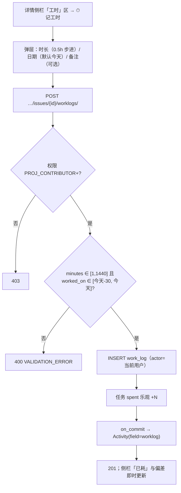
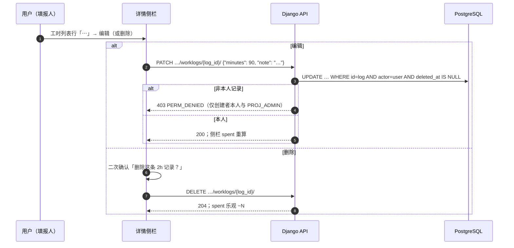
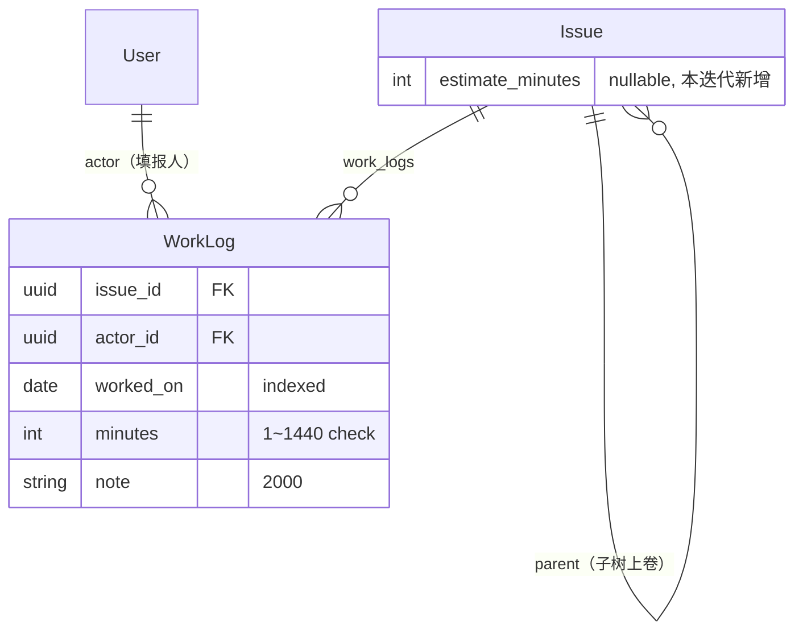

# 工时估算与工时填报

| 元信息项 | 内容 |
| --- | --- |
| 文档编号 | TASK-006 |
| 所属迭代 | Sprint 2 — 任务体系完善（第 4 周） |
| 优先级 | P2（标准版完整级） |
| 所属模块 | M4-TASK｜任务核心 |
| 文档状态 | 待评审（Draft） |
| 最后更新日期 | 2026-09-01 |
| 上游依赖 | `TASK-001`（Issue 模型与详情面板）、`TASK-004`（子树 CTE——工时上卷消费）、`INFRA-003`（`Issue` 表与迁移基线）、`PROJ-002`（成员口径） |
| 下游消费 | `TASK-013`（P3 团队工时统计与管控）、`RPT-002`（项目工时聚合）、`WF-004`（P3「工时必填校验」流转守卫）、`GANTT-002`（工期 vs 工时对照） |
| 上游依据 | `docs/需求文档.md` §3.4（任务估算工时、实际消耗工时记录）、§8.2 任务核心 P2 列（工时估算/填报）；§7.3 企业版边界（工时审批/台账归 P3） |
| 关联架构文档 | [`unified-issue-model.md`](../architecture/unified-issue-model.md)（§7.1 工时字段取舍：Plane estimate_point 对比）、[`api-conventions.md`](../architecture/api-conventions.md)（**§4.5 工时用整数分钟，禁止浮点**；§8 错误码）、[`rbac-permission-model.md`](../architecture/rbac-permission-model.md) |
| 对标基线 | Plane Estimate 系统（Fibonacci/T-Shirt/Linear 配置刻度，估算点数而非工时） · Ones 工时模块（Business+ 填报规范 / 审批 / 台账） |
| 工作量估算 | 后端 2.5 人日 / 前端 2.5 人日 / 联调与测试 1 人日，合计 **6 人日** |

---

## 1. 概述

### 1.1 功能定位

工时回答两个问题：**「这件事大概要多久」**（估算）与**「这件事实际花了多久」**（填报）。P2 交付最朴素可信的一对能力：

- **估算**：任务上的 `estimate_minutes`（整数分钟），可随时修正；
- **填报**：独立的 `WorkLog` 表——谁、哪天、花了多少分钟、做了什么。多条 WorkLog 累加即任务实际工时，天然支持多人协作同一任务（与 `TASK-007` 多执行人对齐）。

两个刻意的设计决策先说清楚：

1. **整数分钟，禁止浮点**（`api-conventions.md` §4.5）。`0.5h` 存 `30`；"1.25 人天" 这类换算在展示层完成。浮点工时在汇总时产生 `0.30000000000000004` 式的脏数字，且无法作为精确分组键。
2. **估算与实际分离，不互写**。完成任务的瞬间不会把估算改写成实际（也不反向），两者对照产生的偏差（`estimate_vs_actual`）是 P3 报表的核心指标，必须在源头保持各自独立。

### 1.2 交付内容

| # | 能力 | 说明 |
| --- | --- | --- |
| 1 | 估算字段 | `Issue.estimate_minutes`（int，可空）；详情侧栏与列表列可编辑 |
| 2 | 工时填报 | `WorkLog`（issue / actor / worked_on 日期 / minutes / note）；本人可改可删自己的记录 |
| 3 | 任务工时汇总 | `spent_minutes = SUM(WorkLog.minutes)`，随任务响应下发（annotate，非物化） |
| 4 | 子树上卷 | `subtree_spent_minutes` / `subtree_estimate_minutes`：父任务聚合整棵子树（CTE，详情侧栏展示） |
| 5 | 填报入口 | 详情侧栏快速填报 + 弹层补填历史日期；列表行内「⏱ xh」徽标 |
| 6 | 偏差展示 | 详情侧栏 `估算 8h / 已耗 5.5h`，超耗变红（纯展示，P2 无告警） |

### 1.3 关键约定：为什么是 `estimate_minutes` 而不是 Plane 的 Estimate Point

> ⚠️ Plane 的 `estimate_point` 是**配置化刻度的点数**（Fibonacci 1/2/3/5/8、T-Shirt S/M/L/XL、Linear 1x~10x），用户选「点」而不是时间。这是敏捷纯正派的用法，但有两个落地问题：

| 维度 | Plane Estimate Point | 本系统 `estimate_minutes`（P2） |
| --- | --- | --- |
| 语义 | 相对复杂度（点） | 绝对时长（分钟） |
| 换算成排期 | 需要「团队速率」校准（迭代复盘才能得出 1 点 ≈ x 小时） | 直接进甘特工期与负载统计（`RPT-002`/`GANTT-001` 无需换算层） |
| 汇总 | 点数求和无业务解释 | 分钟求和即人力成本口径 |
| 2 人团队现实 | 无历史速率数据可校准，点数退化为主观涂鸦 | 每个人天然会用「小时」沟通 |

架构文档 §7.1 已锁定取舍：**P2 用 `estimate_minutes` 直出；P3 若客户确实需要点数制（敏捷教练场景），升级为 Plane 式 `Estimate` 配置系统（加表 `EstimatePoint` + `Issue.estimate_point` 外键），两者可并存**（点数做规划、分钟做核算）。本迭代只建分钟列。

### 1.4 数据模型总览

**一次迁移，两个动作**：`issues` 表加一列 + 新建 `work_logs` 表。

> 为什么 `estimate_minutes` 不在 P0 建齐清单里（P0 原则「大表零后续 DDL」的例外说明）：`ADD COLUMN` 带可空无默认值在 PostgreSQL 11+ 是 O(1) 元数据操作（不重写表、不长时间锁表），且 P2 上线时 `issues` 行数在数万级（非百万级），秒级完成——风险与收益权衡后接受这一次受控 DDL。**规范动作**：迁移前后跑行数与锁监控，详见 §4.1.3。

### 1.5 范围边界

| 能力 | 本文档（P2） | 归属 |
| --- | --- | --- |
| 估算设置 / 修改 | ✅ | — |
| 个人填报 / 修改 / 删除（限本人） | ✅ | — |
| 任务与子树工时汇总 | ✅ | — |
| 偏差展示（超耗红显） | ✅ 纯展示 | — |
| 工时审批流 | ❌ | P3 `TASK-013` |
| 工时填报规范（必填备注 / 每日上限 / 补填窗口收紧） | ❌ 仅软约束（BR-06） | P3 `TASK-013` |
| 超额预警 / 提醒 | ❌ | P3 `TASK-013` |
| 团队工时统计 / 个人台账 / 导出 | ❌ | P3 `TASK-013` / P4 `RPT-005` |
| 计费 / 成本核算 | ❌ | P4 |
| 点数制估算（Fibonacci 等） | ❌ | P3 视需要（`Estimate` 配置系统） |

### 1.6 前置依赖

| 依赖 | 内容 | 阻塞原因 |
| --- | --- | --- |
| `TASK-001` | Issue 模型、详情 Drawer、PATCH 局部更新 | `estimate_minutes` 经既有 PATCH 写入 |
| `TASK-004` | `fetch_subtree` CTE 服务 | 子树上卷复用同一 CTE 目标集 |
| `INFRA-004` | 统一信封与错误码 | 端点契约 |
| `PROJ-002` | 项目成员判定 | 填报人必须是项目成员（BR-03） |

### 1.7 竞品参考

| 竞品 | 参考点 | 处置 |
| --- | --- | --- |
| Plane | Estimate 配置系统（点数刻度）+ `estimate_point` 外键；无工时填报（open 社区长期诉求） | 点数制 P3 视需要；**填报是本系统相对 Plane 开源版的补齐项** |
| Plane | 工时相关仅 `completed_at` 时间维度 | 不采纳「用时 = 完成 − 开始」的推定口径（忽略中断与多人，失真） |
| Ones | 工时模块：填报规范、审批、台账、超额预警（Business+） | P2 交付其「记录」内核；「管控」体系归 `TASK-013` |
| Jira | `originalEstimate` / `timeSpent` + worklog 独立实体 + `remainingEstimate` 三元组 | 采纳 worklog 独立实体；**不采纳 remaining 字段**（多一个手动维护字段，偏差口径混乱——剩余 = 估算 − 已耗 可派生） |

---

## 2. 业务逻辑

### 2.1 填报主流程



### 2.2 编辑 / 删除自己的工时记录



### 2.3 工时汇总口径（单一事实来源）

| 指标 | 口径 | 计算位置 |
| --- | --- | --- |
| `spent_minutes`（任务） | `SUM(minutes)` WHERE issue=me，排除软删 | 列表 annotate |
| `subtree_spent_minutes` | 任务 + 全部后代（`TASK-004` CTE 目标集）的 `spent` 总和 | `subtree/` 端点扩展 |
| `subtree_estimate_minutes` | 同上集合的 `estimate_minutes` 总和（NULL 不计） | 同上 |
| 偏差 | `spent − estimate`（估算为空时无偏差） | 展示层派生 |

> **为什么 `spent` 不物化为列**：每次填报 / 改 / 删都要维护任务行冗余字段，且多人并发填报同一任务时行锁竞争；`SUM` 走 `(issue_id)` 索引聚合在单任务 ≤50 条记录下 <1ms。P3 `TASK-013` 做团队日报表时再引入**每日快照表**（beat 定时物化），在线路径保持实时聚合。

### 2.3.1 工时口径决策：为什么是「分钟制 + 主动填报」

「实际花了多久」在业界有三种采集口径，本系统的取舍依据（结论与 [`unified-issue-model.md`](../architecture/unified-issue-model.md) §7.1 的 `estimate_point` 对比一致）：

| 维度 | ① 分钟制 + 主动填报（采纳） | ② 点数制（Plane Estimate） | ③ 时间戳推定（完成 − 开始） |
| --- | --- | --- | --- |
| 数据形态 | `WorkLog.minutes` 整数分钟 | `estimate_point` 点数（Fibonacci/T-Shirt） | 无独立数据，由 `completed_at − created_at` 推定 |
| 语义 | 绝对投入时长（人力成本口径） | 相对复杂度（规划口径） | 墙钟占用（含等待与中断） |
| 多人任务 | 天然按人分笔（`actor` 维度） | 点数挂任务，无法分人 | 完全无法分人，且被最早创建者污染 |
| 中断 / 挂起 | 由填报人主观剔除（真实） | 不涉及 | 全部计入（严重失真：等待评审 3 天 ≠ 干了 3 天） |
| 汇总可解释性 | 分钟求和 = 人时（可计费、可排期） | 求和需团队速率换算 | 求和无业务含义 |
| 换算层 | 无（`GANTT-001` 工期、`RPT-002` 负载直接消费） | 需速率校准（2 人团队无历史数据） | 无 |
| 数据可信度 | 依赖填报纪律（P3 `TASK-013` 用规范与审批补强） | 依赖估算纪律 | 客观但**错得客观**——度量了错误的量 |

**决策结论**：③ 一票否决（度量错量：墙钟 ≠ 投入）；② 的规划价值真实存在但缺校准数据，P3 以 `Estimate` 配置系统叠加（点数规划 + 分钟核算并存）；**P2 只做 ①**——它是唯一同时满足「多人可分、中断可剔、汇总可解释」三条件的口径，也是甘特与负载报表的直接输入。

### 2.4 业务规则汇总

| 编号 | 规则 | 判定位置 | 违反后果 |
| --- | --- | --- | --- |
| BR-01 | `estimate_minutes` 为正整数或 `null`；≤ 525600（一年分钟数上限，防误输） | Serializer | `400 TOO_LARGE` |
| BR-02 | `WorkLog.minutes` ∈ [1, 1440]（单条 ≤ 24h） | Serializer + DB Check | `400 TOO_SMALL/TOO_LARGE` |
| BR-03 | 填报人必须是当前项目 active 成员；`actor` 服务端注入，**不接受请求体传入** | Permission + Serializer | `403` / 忽略字段 |
| BR-04 | `worked_on` ∈ [今天 − 30 天, 今天]；不允许预填未来（防排班语义混入） | Serializer | `400 INVALID_DATE` |
| BR-05 | 修改 / 删除仅限**记录创建者本人**或 `PROJ_ADMIN`；他人记录不可见编辑入口、直连 403 | Permission | `403 PERM_DENIED` |
| BR-06 | 同一 (issue, actor, worked_on) 允许多条（上午 2h + 下午 3h 合法）；P2 软提示不硬拦 | — | — |
| BR-07 | `note` ≤ 2000 字符，可选 | Serializer | `400 TOO_LONG` |
| BR-08 | 任务软删 → 其 WorkLog 保留但随任务不可见（JOIN 过滤）；恢复则回来 | ORM | — |
| BR-09 | `spent` / `subtree_*` 恒为实时聚合，禁止任何物化冗余（P3 快照表另议） | 评审约束 | — |
| BR-10 | 每次填报 / 修改 / 删除产生 `IssueActivity(field='worklog')`（`TASK-010` 管道） | on_commit | — |
| BR-11 | 归档项目禁止填报（`403 PERM_PROJECT_ARCHIVED`） | Permission | — |
| BR-12 | 完成任务后仍可补填（`worked_on` ≤ 今天即可）——真实世界先干活后记账 | Service | — |

### 2.5 异常处理

| 场景 | HTTP | 错误码 | details 子码 | 前端表现 |
| --- | --- | --- | --- | --- |
| minutes=0 / 负数 / 非整数 | 400 | `VALIDATION_ERROR` | `TOO_SMALL` / `INVALID` | 「时长至少 1 分钟」 |
| 单条 > 1440 | 400 | `VALIDATION_ERROR` | `TOO_LARGE` | 「单条最多 24 小时，请拆分填报」 |
| 估算 > 1 年 | 400 | `VALIDATION_ERROR` | `TOO_LARGE` | 「估算超出上限」 |
| `worked_on` 超窗口 | 400 | `VALIDATION_ERROR` | `INVALID_DATE` | 「仅可补填最近 30 天」 |
| `worked_on` 未来日期 | 400 | `VALIDATION_ERROR` | `INVALID_DATE` | 「不能填报未来日期」 |
| 改他人记录 | 403 | `PERM_DENIED` | — | 「只能管理自己填报的工时」 |
| VIEWER 填报 | 403 | `PERM_ROLE_INSUFFICIENT` | — | 入口隐藏 |
| 归档项目 | 403 | `PERM_PROJECT_ARCHIVED` | — | 只读态 |
| 记录不存在/已删 | 404 | `RESOURCE_NOT_FOUND` | — | 列表静默刷新 |

### 2.6 边界条件

| 边界场景 | 限制值 | 超出处理 |
| --- | --- | --- |
| 单任务 WorkLog 条数 | 无硬限（软建议 <500） | 列表分页 20/页 |
| 单日个人填报总量 | P2 无硬限 | P3 `TASK-013` 引入每日上限 |
| 补填窗口 | 30 天 | 拒绝；提示联系管理员（ADMIN 可直连 API 修正，审计留痕） |
| 子树聚合深度 | 沿用 `MAX_ISSUE_DEPTH=5` | — |
| 弹层时长步进 | 0.5h（=30 分钟） | 手输精确到 1 分钟 |

---

## 3. UI/UX 设计

### 3.1 详情侧栏「工时」分区

```
┌──────────────────────────────────────────────────────────────────┐
│ TZXM-13  后端导出 API                          ⋯    ✕            │
│ …（标题 / 描述 / 属性区略）                                         │
│ ──────────────────────────────────────────────────────────────── │
│  工时        估算 [8h ▾]   已耗 5.5h / 子树 7h        [⏱ 记工时] │
│              ▓▓▓▓▓▓▓▓▓▓▓▓▓▓▓░░░░  69%                ⊕含子任务   │
│                                                                   │
│  ▾ 记录（3）                                                       │
│    2026-09-01  张三   2h   游标分页改造 + 联调        ⋯           │
│    2026-09-01  李四   2h   限流中间件                     ⋯       │
│    2026-08-31  张三   1.5h 表结构设计与迁移              ⋯        │
│    …（分页 20/页）                                                 │
└──────────────────────────────────────────────────────────────────┘
```

| 元素 | 规格 |
| --- | --- |
| 估算输入 | 下拉常用值（0.5h/1h/2h/4h/8h/16h/24h）+「自定义」（数字输入，分钟粒度）；`onBlur` 提交 PATCH |
| 已耗主数字 | `spent_minutes` 格式化（≥8h 显示 `1d 2.5h`，1d=8h 工作日制）；**子树口径**为次级行（`⊕含子任务` 开关切换，默认本任务口径） |
| 进度条 | `spent / estimate`；estimate 为空时进度条隐藏；>100% 时红色 + 显示 `128%` |
| 超耗红显 | `spent > estimate` 时「已耗」数字与进度条红（`text-red-600`） |
| 记录列表 | 日期（`yyyy-MM-dd`）/ 人（头像+名）/ 时长（0.5h 粒度展示，分钟精确）/ 备注（truncate，悬浮全文） |
| `⋯` 菜单 | 编辑 / 删除（本人或 PROJ_ADMIN 才显示；他人行无菜单） |

### 3.2 填报弹层

```
┌────────────────────────────────────────────────┐
│  记工时 · 后端导出 API                            │
│                                                  │
│  时长        ┌────────────────────────┐         │
│              │ 2h                   ▾ │         │
│              └────────────────────────┘         │
│              快捷：[30m] [1h] [2h] [4h] [8h]     │
│                                                  │
│  日期        ┌────────────────────────┐         │
│              │ 2026-09-01（今天）     ▾ │        │
│              └────────────────────────┘         │
│              可补填最近 30 天                     │
│                                                  │
│  备注（可选） ┌────────────────────────┐         │
│             │ 做了什么…                 │        │
│             └────────────────────────┘         │
│                          [取消]  [保存]         │
└────────────────────────────────────────────────┘
```

| 元素 | 规格 |
| --- | --- |
| 时长 | 下拉 0.5h 步进 + 自定义分钟输入；选中快捷 chip 即填入 |
| 日期 | 日期选择器，`max=today`、`min=today-30d`；默认今天 |
| 提交 | 乐观更新侧栏已耗（+N 分钟）；成功关闭；失败回滚 + Toast |
| 连续填报 | 保存后若按住 `⌘` 点击保存 = 保存并再开（清空时长保留日期） |
| 键盘 | `⌘/Ctrl+Enter` 提交 |

### 3.3 列表行徽标与列

| 位置 | 表现 |
| --- | --- |
| 列表「工时」列（可选开启） | `⏱ 5.5/8h`；超耗红；无估算仅显示 `⏱ 5.5h`；无记录灰显 `—` |
| 看板卡片 | 不展示（卡片信息密度已高；工时非流转语义） |
| 全屏树（`TASK-004`） | 节点悬浮 tooltip 增加工时行 |

### 3.4 空状态 / 加载 / 失败

| 场景 | 处置 |
| --- | --- |
| 无估算无记录 | 分区一行「工时 — [⏱ 记工时]」（估算输入内联 placeholder「设估算」） |
| 记录加载 | 3 行骨架 |
| 汇总与列表短暂不一致 | 侧栏数字以 `spent` annotate 为准，记录分页局部；SWR 30s 收敛 |

### 3.5 响应式与无障碍

| 断点 | 布局 |
| --- | --- |
| ≥ 1280px | 分区全量（估算 + 双口径 + 进度条 + 记录） |
| 768~1279px | 隐藏子树口径行；进度条保留 |
| < 768px | 记录折叠为「3 条记录 ▾」；弹层全屏底部抽屉 |

无障碍：进度条 `role="progressbar"` + `aria-valuenow`（分钟）；时长输入 `inputmode="numeric"`；「超耗」红色同时有 `aria-label="超出估算 28%"`；记录菜单键盘可达（`⋯` 为按钮，方向键菜单项）。

---

## 4. 技术架构

### 4.1 数据模型

#### 4.1.1 `Issue.estimate_minutes`（加列）

```python
# apps/api/plane/db/models/issue.py —— 本迭代新增
estimate_minutes = models.PositiveIntegerField(
    null=True, blank=True, verbose_name="估算工时（分钟）",
    help_text="P2 分钟制；P3 视需要叠加 Estimate 点数系统",
)
```

#### 4.1.2 `WorkLog`（新表）

```python
# apps/api/plane/db/models/worklog.py
from django.db import models

from plane.db.models.base import BaseModel
from plane.db.models.issue import Issue


class WorkLog(BaseModel):
    """工时填报 —— 一条记录 = 一人一天在一个任务上的一笔投入

    同一 (issue, actor, worked_on) 可多条（BR-06：上午/下午分笔真实存在）。
    actor 由服务端注入（BR-03），created_by 即填报人（BaseModel 审计同源）。
    """

    issue = models.ForeignKey(
        Issue, on_delete=models.CASCADE, related_name="work_logs", verbose_name="所属工作项"
    )
    actor = models.ForeignKey(
        "db.User", on_delete=models.CASCADE, related_name="work_logs", verbose_name="填报人"
    )
    worked_on = models.DateField(db_index=True, verbose_name="工作日期")
    minutes = models.PositiveIntegerField(verbose_name="时长（分钟）",
                                          help_text="1~1440，整数分钟")
    note = models.CharField(max_length=2000, blank=True, verbose_name="备注")

    class Meta(BaseModel.Meta):
        db_table = "work_logs"
        verbose_name = "工时记录"
        verbose_name_plural = "工时记录"
        ordering = ("-worked_on", "-created_at")
        constraints = [
            models.CheckConstraint(
                check=models.Q(minutes__gte=1) & models.Q(minutes__lte=1440),
                name="chk_worklog_minutes_range",
            ),
        ]
        indexes = [
            # 任务侧聚合：SUM(minutes) WHERE issue_id=?
            models.Index(fields=["issue"], name="idx_worklog_issue"),
            # 人员×日期台账（P3 TASK-013 直查）：我的某天填了什么
            models.Index(fields=["actor", "worked_on"], name="idx_worklog_actor_day"),
        ]
```



#### 4.1.3 迁移（受控 DDL 规范）

```python
# apps/api/plane/db/migrations/00XX_p2_worklog.py
from django.db import migrations, models


class Migration(migrations.Migration):
    dependencies = [("db", "00XX_p1_enable_issue_attributes")]

    operations = [
        # ① 加列：可空无默认 → O(1) 元数据操作，不重写表
        migrations.AddField(
            model_name="issue", name="estimate_minutes",
            field=models.PositiveIntegerField(null=True, blank=True),
        ),
        # ② 建表 + 约束 + 普通索引（新表无并发写，无需 CONCURRENTLY）
        migrations.CreateModel(...),  # WorkLog 完整定义（§4.1.2）
    ]
```

> **执行规范**：本迁移在发布窗口执行；`migrate` 前后各采集一次 `pg_locks` 与迁移耗时日志。这是 P0「零 DDL」原则的**受控例外**，已在此声明并留监控锚点（P3 若再遇大表加列，一律改走「新表 + 视图」或回到 P0 式预建列策略）。

### 4.2 API 定义

| # | 方法 | 路径 | 描述 | 权限 | 成功码 |
| --- | --- | --- | --- | --- | --- |
| 1 | `PATCH` | `…/issues/{issue_id}/` | 含 `estimate_minutes`（既有端点开放字段） | `PROJ_CONTRIBUTOR`(15)+ | `200` |
| 2 | `GET` | `…/issues/{issue_id}/worklogs/` | 工时记录列表（游标，倒序） | `PROJ_VIEWER`(5)+ | `200` |
| 3 | `POST` | `…/issues/{issue_id}/worklogs/` | 填报 | `PROJ_CONTRIBUTOR`(15)+ | `201` |
| 4 | `PATCH` | `…/issues/{issue_id}/worklogs/{log_id}/` | 修改（本人/ADMIN） | 本人 或 `PROJ_ADMIN`(20) | `200` |
| 5 | `DELETE` | `…/issues/{issue_id}/worklogs/{log_id}/` | 删除（软删，本人/ADMIN） | 本人 或 `PROJ_ADMIN`(20) | `204` |
| 6 | `GET` | `…/issues/{issue_id}/subtree/` | 扩展响应：`stats` 增 `subtree_spent_minutes` / `subtree_estimate_minutes`（`TASK-004` 契约加字段，向后兼容） | `PROJ_VIEWER`(5)+ | `200` |

#### 4.2.1 `POST …/worklogs/` — 填报

**请求**

```json
{ "minutes": 120, "worked_on": "2026-09-01", "note": "游标分页改造 + 联调" }
```

**成功响应 `201 Created`**

```json
{
  "status": "success",
  "data": {
    "id": "7c8d9e0f-1a2b-4c3d-8e9f-0a1b2c3d4e5f",
    "issue_id": "b2c3d4e5-f6a7-4b8c-9d0e-1f2a3b4c5d6e",
    "actor_id": "6c7d1a2b-3e4f-4a5b-9c8d-7e6f5a4b3c2d",
    "worked_on": "2026-09-01",
    "minutes": 120,
    "note": "游标分页改造 + 联调",
    "issue_spent_minutes": 330,
    "created_at": "2026-09-01T09:41:12.004Z"
  }
}
```

> `issue_spent_minutes` 为服务端填报后实时聚合回传——前端无需再发一次任务请求即可更新侧栏（省一跳）。

**失败响应 `400`（补填超窗口）**

```json
{
  "status": "error",
  "error": {
    "code": "VALIDATION_ERROR",
    "message": "请求参数校验失败",
    "details": [{ "field": "worked_on", "code": "INVALID_DATE",
                  "message": "仅可补填最近 30 天（最早 2026-08-02）" }],
    "request_id": "01JCB6V1P4ZS9P1R7X5Y8A0B3C"
  }
}
```

#### 4.2.2 `GET …/worklogs/` — 记录列表

```http
GET …/issues/b2c3…/worklogs/?per_page=20&fields=id,actor_id,worked_on,minutes,note HTTP/1.1
```

```json
{
  "status": "success",
  "data": [
    { "id": "7c8d…", "actor_id": "6c7d…", "worked_on": "2026-09-01",
      "minutes": 120, "note": "游标分页改造 + 联调" },
    { "id": "8d9e…", "actor_id": "2b3a…", "worked_on": "2026-09-01",
      "minutes": 120, "note": "限流中间件" }
  ],
  "meta": { "next_cursor": "20:1:0", "next_page_results": true, "count": 2,
            "total_count": 3, "total_pages": 1, "page": 1, "per_page": 20 }
}
```

**筛选参数**（`TASK-003` FilterSet 白名单同源语法；P3 `TASK-013` 台账与 P2 记录列表共用）：

| 参数 | 语法 | 语义 | 索引 |
| --- | --- | --- | --- |
| `?actor_id=<uuid>` | 单值 | 只看某人在本任务的记录 | `idx_worklog_issue` 复合过滤 |
| `?worked_on=2026-09-01,2026-09-07;between` | `;between` | 工作日期区间（含端点） | `idx_worklog_issue` + 过滤 |
| `?worked_on=2026-09-01;before` / `;after` | 修饰符 | 早于 / 晚于某日 | 同上 |
| `?mine=true` | 语法糖 | `actor_id=当前用户`（我的记录快速过滤） | 展开为 actor_id |
| `?per_page=` / `?cursor=` | 游标分页 | 默认 20，上限 100 | — |

**筛选示例**（「张三最近一周的记录」）：

```http
GET …/issues/b2c3…/worklogs/?actor_id=6c7d1a2b-…&worked_on=2026-08-26,2026-09-01;between&per_page=20 HTTP/1.1
```

```json
{
  "status": "success",
  "data": [
    { "id": "7c8d…", "actor_id": "6c7d1a2b-3e4f-4a5b-9c8d-7e6f5a4b3c2d",
      "worked_on": "2026-09-01", "minutes": 120, "note": "游标分页改造 + 联调" },
    { "id": "6b7c…", "actor_id": "6c7d1a2b-3e4f-4a5b-9c8d-7e6f5a4b3c2d",
      "worked_on": "2026-08-31", "minutes": 90, "note": "表结构设计与迁移" }
  ],
  "meta": { "next_cursor": "20:1:0", "next_page_results": false, "count": 2,
            "total_count": 2, "total_pages": 1, "page": 1, "per_page": 20,
            "sum_minutes": 210 }
}
```

> `meta.sum_minutes`：筛选命中记录的分钟总和（服务端聚合回传）——「张三本周在本任务投入 3.5h」一步可得，免前端累加与翻页全取。

#### 4.2.3 `PATCH …/issues/{id}/` — 设置估算

```json
// 请求 { "estimate_minutes": 480 }
// 200 响应 data 含 "estimate_minutes": 480, "spent_minutes": 330
```

**失败 `400`（超上限）**

```json
{
  "status": "error",
  "error": {
    "code": "VALIDATION_ERROR",
    "message": "请求参数校验失败",
    "details": [{ "field": "estimate_minutes", "code": "TOO_LARGE",
                  "message": "估算不能超过 525600 分钟" }],
    "request_id": "01JCB6V1P4ZS9P1R7X5Y8A0B3D"
  }
}
```

#### 4.2.4 `subtree/` 扩展（契约加字段）

`TASK-004` §4.2.2 的 `stats` 对象新增：

```json
"stats": { "total": 4, "completed": 1, "cancelled": 0, "max_depth": 2,
           "subtree_spent_minutes": 420, "subtree_estimate_minutes": 960 }
```

### 4.3 核心逻辑

#### 4.3.1 列表 annotate（任务工时随列表下发）

```python
# build_issue_queryset 扩展（TASK-003 既有管道）
from django.db.models import Sum

qs = qs.annotate(
    spent_minutes=Coalesce(Sum("work_logs__minutes",
                               filter=Q(work_logs__deleted_at__isnull=True)), 0),
)
```

- `Coalesce(..., 0)`：无记录任务返回 `0` 而非 `null`（前端少一个判空分支）；
- JOIN 聚合与 `assignees` 预取同存在时注意 `distinct` 场景——WorkLog 聚合用 `values("id").annotate(...)` 双层聚合规避笛卡尔放大（UT-09 锚定）。

#### 4.3.2 子树上卷（复用 `TASK-004` CTE 目标集）

```python
# apps/api/plane/db/services/worklog_summary.py
SUBTREE_WORKLOG_SQL = """
    WITH RECURSIVE target AS (
        SELECT id, estimate_minutes FROM issues
         WHERE id = %(root)s AND deleted_at IS NULL AND archived_at IS NULL
        UNION ALL
        SELECT i.id, i.estimate_minutes FROM issues i
          JOIN target t ON i.parent_id = t.id
         WHERE i.deleted_at IS NULL AND i.archived_at IS NULL
    )
    SELECT COALESCE(SUM(w.minutes), 0)      AS spent,
           COALESCE(SUM(t.estimate_minutes), 0) AS estimated
      FROM target t
      LEFT JOIN work_logs w ON w.issue_id = t.id AND w.deleted_at IS NULL
"""


def subtree_worklog_summary(root_id: uuid.UUID) -> dict[str, int]:
    """整树工时上卷：一次 CTE + 一次聚合，两条数字。"""
    with connection.cursor() as cursor:
        cursor.execute(SUBTREE_WORKLOG_SQL, {"root": root_id})
        spent, estimated = cursor.fetchone()
    return {"subtree_spent_minutes": spent, "subtree_estimate_minutes": estimated}
```

> `LEFT JOIN work_logs` 使无记录节点不丢行；`SUM(estimate_minutes)` 跳过 NULL（未估算节点不计入分母——「估了的部分达成率」语义）。

#### 4.3.3 填报服务（含活动投递）

```python
# apps/api/plane/db/services/worklog.py
@transaction.atomic
def log_work(*, issue_id: uuid.UUID, actor_id: uuid.UUID,
             minutes: int, worked_on: date, note: str = "") -> tuple[WorkLog, int]:
    issue = Issue.objects.get(id=issue_id, deleted_at__isnull=True,
                              project__status="active")          # BR-11 归档拦截
    today = timezone.localdate()
    if not (today - timedelta(days=30) <= worked_on <= today):    # BR-04
        raise ValidationError(
            {"worked_on": f"仅可补填最近 30 天（最早 {today - timedelta(days=30)}）"})
    log = WorkLog.objects.create(issue=issue, actor_id=actor_id,   # BR-03 服务端注入
                                 worked_on=worked_on, minutes=minutes, note=note[:2000])
    spent = WorkLog.objects.filter(issue=issue, deleted_at__isnull=True) \
                           .aggregate(s=Sum("minutes"))["s"]
    transaction.on_commit(lambda: record_worklog.delay(str(log.id), "created"))
    return log, spent
```

#### 4.3.4 Celery 任务

```python
# apps/api/plane/bgtasks/worklog.py
@shared_task(bind=True, max_retries=3, retry_backoff=True)
def record_worklog(self, log_id: str, verb: str) -> None:
    """工时 Activity：comment 形如「张三 填报了 2h（2026-09-01）」——幂等"""
    ...
```

#### 4.3.5 编辑 / 删除服务与成员资格校验（`log_work` 的姊妹路径）

```python
# apps/api/plane/db/services/worklog.py（续）
from django.core.exceptions import ValidationError as DjValidationError
from plane.db.models import ProjectMember

PROJECT_ROLES = ("PROJ_ADMIN", "PROJ_CONTRIBUTOR", "PROJ_COMMENTER", "PROJ_VIEWER")


def _assert_can_worklog(project_id: uuid.UUID, actor_id: uuid.UUID) -> None:
    """BR-03 前置校验：填报人必须是本项目角色 ≥ PROJ_CONTRIBUTOR 的 active 成员。

    VIEWER / COMMENTER 只读（填报是写操作）；非成员在 Permission 层已被 404/403
    拦截，此处为 Service 层双保险（Celery 补偿路径不经 ViewSet）。
    """
    is_eligible = ProjectMember.objects.filter(
        project_id=project_id, member_id=actor_id, is_active=True,
        role__in=("PROJ_ADMIN", "PROJ_CONTRIBUTOR"),
    ).exists()
    if not is_eligible:
        raise PermissionDenied("仅项目协作者及以上角色可填报工时")


def _get_owned_log(*, log_id: uuid.UUID, issue_id: uuid.UUID,
                   actor_id: uuid.UUID, is_admin: bool) -> WorkLog:
    """取记录并执行 BR-05 归属校验：仅创建者本人或 PROJ_ADMIN 可改/删。

    归属校验在 Service 层而非仅 Permission 层——两处判定的输入不同
    （Permission 有 request 对象，此服务也服务于管理端补偿路径）。
    """
    log = WorkLog.objects.select_for_update().filter(
        id=log_id, issue_id=issue_id, deleted_at__isnull=True).first()
    if log is None:
        raise NotFound()
    if log.actor_id != actor_id and not is_admin:
        raise PermissionDenied("只能管理自己填报的工时")
    return log


@transaction.atomic
def update_worklog(*, log_id: uuid.UUID, issue_id: uuid.UUID, actor_id: uuid.UUID,
                   is_admin: bool, minutes: int | None = None,
                   worked_on: date | None = None, note: str | None = None) -> WorkLog:
    """修改记录：字段级可选更新（None = 不改）；minutes/worked_on 变更时重新走 BR-02/04 校验。"""
    log = _get_owned_log(log_id=log_id, issue_id=issue_id,
                         actor_id=actor_id, is_admin=is_admin)
    today = timezone.localdate()
    if minutes is not None:
        if not (1 <= minutes <= 1440):                                # BR-02
            raise DjValidationError(
                {"minutes": "时长须为 1~1440 的整数分钟"})
        log.minutes = minutes
    if worked_on is not None:
        if not (today - timedelta(days=30) <= worked_on <= today):    # BR-04
            raise DjValidationError(
                {"worked_on": f"仅可补填最近 30 天（最早 {today - timedelta(days=30)}）"})
        log.worked_on = worked_on
    if note is not None:
        log.note = note[:2000]                                        # BR-07
    log.updated_by_id = actor_id
    log.save()
    transaction.on_commit(lambda: record_worklog.delay(str(log.id), "updated"))
    return log


@transaction.atomic
def delete_worklog(*, log_id: uuid.UUID, issue_id: uuid.UUID,
                   actor_id: uuid.UUID, is_admin: bool) -> None:
    """软删记录（保留审计链）；返回后由前端乐观扣减 spent。"""
    log = _get_owned_log(log_id=log_id, issue_id=issue_id,
                         actor_id=actor_id, is_admin=is_admin)
    log.deleted_at = timezone.now()
    log.updated_by_id = actor_id
    log.save(update_fields=["deleted_at", "updated_by", "updated_at"])
    transaction.on_commit(lambda: record_worklog.delay(str(log.id), "deleted"))
```

> 编辑路径**重新校验窗口**的原因：一条 29 天前补填的记录，今天编辑时若不重新校验 `worked_on`，就可能被改成更早的日期绕过 30 天窗口——校验必须作用于「本次写入的值」而非「记录的历史值」。

### 4.4 前端实现

#### 4.4.1 `WorkLogStore`（`packages/shared-state`，完整实现）

```typescript
// packages/shared-state/src/worklog.store.ts
import { makeAutoObservable, observable, action, computed } from "mobx";
import { nanoid } from "nanoid";
import type { WorkLog, WorkLogInput } from "@rp/types";

interface WorkLogService {
  list(issueId: string, cursor?: string): Promise<ApiPage<WorkLog>>;
  create(issueId: string, input: WorkLogInput): Promise<WorkLog & { issue_spent_minutes: number }>;
  update(issueId: string, logId: string, input: Partial<WorkLogInput>): Promise<WorkLog>;
  remove(issueId: string, logId: string): Promise<void>;
}

export class WorkLogStore {
  /** SWR key: `issue:{id}:worklogs:{cursor}`；分页结果按序缓存 */
  byIssue = observable.map<string, WorkLog[]>();
  /** 乐观更新回滚快照：tempId -> { spent 原值, 列表原状 } */
  private rollbackSnapshots = new Map<string, { spent: number; list: WorkLog[] }>();

  constructor(private readonly issueStore: IssueStore,
              private readonly services: WorkLogService) {
    makeAutoObservable(this, {}, { autoBind: true });
  }

  @computed spentOf(issueId: string): number {
    return this.issueStore.get(issueId)?.spent_minutes ?? 0;
  }

  @action async log(issueId: string, input: WorkLogInput): Promise<void> {
    const tempId = `temp-${nanoid(6)}`;
    const snapshot = { spent: this.spentOf(issueId),
                       list: [...(this.byIssue.get(issueId) ?? [])] };
    this.rollbackSnapshots.set(tempId, snapshot);
    // ① 乐观：临时行插入 + 侧栏已耗 +N（opacity-60 由 temp- 前缀驱动渲染）
    this.byIssue.set(issueId, [
      { id: tempId, ...input, actor_id: this.session.userId } as WorkLog,
      ...(this.byIssue.get(issueId) ?? []),
    ]);
    this.issueStore.patchSpent(issueId, snapshot.spent + input.minutes);
    try {
      // ② 提交；响应含服务端实时聚合，直接覆盖本地推算（消除并发漂移）
      const created = await this.services.create(issueId, input);
      this.replaceTemp(issueId, tempId, created);
      this.issueStore.patchSpent(issueId, created.issue_spent_minutes);
    } catch (err) {
      this.rollback(issueId, tempId);                              // ③ 回滚 + Toast
      throw err;
    }
  }

  @action async edit(issueId: string, logId: string,
                     input: Partial<WorkLogInput>): Promise<void> {
    const list = this.byIssue.get(issueId) ?? [];
    const prev = list.find((l) => l.id === logId);
    if (!prev) return;
    const delta = (input.minutes ?? prev.minutes) - prev.minutes;
    this.byIssue.set(issueId, list.map((l) => (l.id === logId ? { ...l, ...input } : l)));
    this.issueStore.patchSpent(issueId, this.spentOf(issueId) + delta);
    try {
      await this.services.update(issueId, logId, input);
    } catch (err) {
      this.byIssue.set(issueId, list);                             // 行级回滚
      this.issueStore.patchSpent(issueId, this.spentOf(issueId) - delta);
      throw err;
    }
  }

  @action async remove(issueId: string, logId: string): Promise<void> {
    const list = this.byIssue.get(issueId) ?? [];
    const prev = list.find((l) => l.id === logId);
    this.byIssue.set(issueId, list.filter((l) => l.id !== logId));
    this.issueStore.patchSpent(issueId, this.spentOf(issueId) - (prev?.minutes ?? 0));
    try { await this.services.remove(issueId, logId); }
    catch (err) {
      this.byIssue.set(issueId, list);
      this.issueStore.patchSpent(issueId, this.spentOf(issueId) + (prev?.minutes ?? 0));
      throw err;
    }
  }

  @action private rollback(issueId: string, tempId: string): void {
    const snap = this.rollbackSnapshots.get(tempId);
    if (!snap) return;
    this.byIssue.set(issueId, snap.list);
    this.issueStore.patchSpent(issueId, snap.spent);
    this.rollbackSnapshots.delete(tempId);
  }

  @action private replaceTemp(issueId: string, tempId: string, real: WorkLog): void {
    const list = this.byIssue.get(issueId) ?? [];
    this.byIssue.set(issueId, list.map((l) => (l.id === tempId ? real : l)));
    this.rollbackSnapshots.delete(tempId);
  }
}
```

**乐观更新与回滚的关键设计**：

| 设计点 | 说明 |
| --- | --- |
| 回滚快照按 tempId 隔离 | 连续填报多笔时（`⌘保存并再开`），每笔的回滚互不污染 |
| 服务端 `issue_spent_minutes` 覆盖 | 乐观值只用于过渡帧；响应到达即以服务端实时聚合覆盖——并发填报的漂移在一跳内收敛 |
| 编辑走「差量回滚」 | 只记录变更行与 spent 增量，避免整列表快照的内存放大 |
| temp- 前缀驱动灰显 | 渲染层凭 `id.startsWith("temp-")` 给 `opacity-60`，不引入额外状态位 |

#### 4.4.2 其余前端件

- 时长格式化工具 `formatMinutes(m)`：`<60 → "45m"`；`<480 → "5.5h"`；`≥480 → "1d 2.5h"`（1d=8h 工作日制，展示层约定，不做时区处理）。
- 弹层组件 `WorkLogDialog`（Headless UI `Dialog` + `DatePicker`），复用于「填报」「编辑」两态。
- 侧栏消费：`spentOf` 驱动进度条与偏差红显；记录列表直接渲染 `byIssue`（temp 行灰显）。

---

## 5. 测试用例

### 5.1 单元测试

| 用例 ID | 测试目标 | 输入 | 预期输出 | 覆盖类型 |
| --- | --- | --- | --- | --- |
| UT-01 | 分钟整数校验 | minutes=90.5 | 400 INVALID | 异常 |
| UT-02 | 区间下界 | minutes=0 | 400 TOO_SMALL | 边界 |
| UT-03 | 区间上界 | minutes=1441 | 400 TOO_LARGE | 边界 |
| UT-04 | 边界合法值 | minutes=1 与 1440 | 均 201 | 边界 |
| UT-05 | 补填窗口 | worked_on=今天−31 | 400 INVALID_DATE | 边界 |
| UT-06 | 未来日期 | worked_on=明天 | 400 | 异常 |
| UT-07 | actor 注入 | 请求体带 actor_id | 忽略，落库为当前用户 | 安全 |
| UT-08 | 本人编辑 | 修改自己的记录 | 200 | 正常 |
| UT-09 | 汇总无放大 | 任务 3 指派 × 各 5 记录 | `spent_minutes` = 精确总和（无笛卡尔重复） | 正常 |
| UT-10 | 子树上卷 | 3 层树各含记录 | `subtree_spent` = 全树和；未估算节点不入 estimate 和 | 正常 |
| UT-11 | 权限 | 改他人记录（非 ADMIN） | 403 | 安全 |
| UT-12 | 估算上限 | 525601 | 400 TOO_LARGE | 边界 |
| UT-13 | 完成后补填 | 已完成任务 + worked_on=昨天 | 201（BR-12） | 边界 |
| UT-14 | 软删联动 | 删除任务 | WorkLog 保留但不可见；恢复重现 | 正常 |
| UT-15 | 窗口边界值 | worked_on=今天−30（恰含端点）与 今天−31 | 前者 201；后者 400 INVALID_DATE | 边界 |
| UT-16 | 编辑重校验窗口 | 29 天前记录改 worked_on=31 天前 | 400（校验作用于新值，§4.3.5） | 异常 |
| UT-17 | 权限矩阵 | VIEWER/COMMENTER 填报 vs CONTRIBUTOR/ADMIN | 前者 403 PERM_ROLE_INSUFFICIENT；后者 201 | 安全 |

### 5.2 集成测试

| 用例 ID | 场景 | 前置条件 | 操作步骤 | 预期结果 |
| --- | --- | --- | --- | --- |
| IT-01 | 多人填报同一任务 | 2 成员 | 各填 2 笔 | `spent` = 4 笔总和；列表按日期倒序 |
| IT-02 | 同日多笔 | 同人同日 2 笔 | 均 201（BR-06） | — |
| IT-03 | 估算-实际独立 | 设估算 480，填 600 | estimate 仍 480；偏差展示 125% | 正常 |
| IT-04 | subtree 契约 | 有子树与填报 | `subtree/` stats 含两个新字段 | 契约符合 §4.2.4 |
| IT-05 | 列表 annotate 性能 | 1 万任务 × 均 5 记录 | 列表查询 | 常数查询数；P95 < 300ms（沿用 TASK-003 门禁） |
| IT-06 | 归档项目填报 | 项目归档 | POST worklog | 403 PERM_PROJECT_ARCHIVED |
| IT-07 | Activity 留痕 | 填报→修改→删除 | 查 IssueActivity | 3 条 field=worklog，epoch 各异 |
| IT-08 | 筛选与聚合回传 | 2 人各填数笔 | `?actor_id=&worked_on=…;between` | 结果仅含该人区间记录；`meta.sum_minutes` 等于手加（§4.2.2） |

### 5.3 E2E 测试

| 用例 ID | 用户场景 | 操作路径 | 验收标准 |
| --- | --- | --- | --- |
| E2E-01 | 快速填报 | 侧栏 ⏱ → 2h → 保存 | 已耗 +2h；进度条与百分比即时更新；记录列表出现新行 |
| E2E-02 | 估算与偏差 | 设估算 4h → 填 5h | 已耗红显，进度条红 125% |
| E2E-03 | 补填历史 | 弹层选 3 天前日期 | 成功；日期器禁选 31 天前与未来 |
| E2E-04 | 编辑自己的记录 | ⋯ → 改 2h 为 3h | 已耗 +1h；他人记录行无 ⋯ |
| E2E-05 | 子树口径切换 | 父任务 ⊕含子任务 开关 | 数字在本任务 5.5h 与子树 7h 间切换 |

---

## 6. 竞品深度对标

### 6.1 Plane 实现分析

- **估算**：`apps/api/plane/db/models/estimate.py` 的 Estimate（项目级刻度系统）+ `EstimatePoint`（点值）+ `Issue.estimate_point` 外键。刻度三预设（Fibonacci/T-Shirt/Linear）。点数与时间**刻意解耦**（敏捷正统），但开源版**完全没有工时填报**——`time tracking` 是其 GitHub 高票 issue 之一。

**Plane Estimate 模型字段表**（代码路径 `apps/api/plane/db/models/estimate.py`，供 P3 叠加点数制时直接对位）：

| Plane 字段 | 类型 | 语义 | 本系统 P3 对位 |
| --- | --- | --- | --- |
| `Estimate.project` | FK | 刻度系统为项目级 | 同（项目级一套刻度） |
| `Estimate.type` | enum | `fibonacci` / `tshirt` / `linear` 三预设 | 同 |
| `EstimatePoint.value` | float | 点值（1/2/3/5/8…） | 同 |
| `EstimatePoint.key` / `description` | str | 展示键（如 "S"）与说明 | 同 |
| `Issue.estimate_point` | FK nullable | 挂点；**无时间换算层** | P3 叠加时与 `estimate_minutes` 并存（点数规划、分钟核算） |

- **对我们的启示**：点数制在没有团队速率校准的 2 人团队里是伪精确；分钟制直连甘特与负载（`GANTT-001` 工期、`RPT-002` 成员负载都消费分钟）。P2 选分钟、P3 留点数叠加位，是对目标用户（中小团队直奔排期）的务实排序。叠加时 Plane 的 Estimate 表族可整体平移（上表逐字段对位），迁移成本已被本节的对照表提前摊薄。

### 6.2 Ones 实现分析

- 工时模块（Business+）：填报规范（必填备注/每日上限）、工时审批流、个人台账、团队产能报表、超额预警——**管控导向**，服务于组织对人力成本的可审计核算。
- 边界启示：Ones 把「记录」与「管控」绑在同一个付费墙后；本系统 P2 免费给出「记录」内核（可信数据先行），P3 `TASK-013` 再补「管控」——数据结构（`WorkLog` 独立表 + actor×day 索引）已在 P2 按 P3 查询模式预置，升级零迁移。

### 6.3 本系统设计决策

1. **分钟整数 + 记录/估算分离**：`api-conventions.md` §4.5 的全局约束在此落地为 CheckConstraint 与 Serializer 双保险；剩余量（remaining）刻意不存——派生可得的手动字段是偏差口径混乱之源（Jira 三元组的教训）。
2. **聚合实时、快照延后**：在线路径 SUM 聚合（<1ms），P3 报表需求（按日/按人/按项目）由 beat 快照表承接——不在 P2 提前为报表复杂度买单。
3. **填报人服务端注入**：工时是「人对时间的自我申报」，客户端可传 actor 等于把申报主体交给伪造——BR-03 是安全基线而非风格偏好。
4. **相对 Plane 的差异化**：开源版补齐 time tracking（Plane 社区高票诉求），且口径直接服务排期（分钟→甘特工期）而非停在点数——「估算即排期输入」是中小团队的真实路径。
5. **P3 升级零迁移**：点数系统（Estimate 表族）与管控（审批/预警/台账）的查询索引（`idx_worklog_actor_day`）均已预置。

---

## 7. 里程碑与验收

### 7.1 交付物清单

| 类型 | 交付物 |
| --- | --- |
| Model / Migration | `Issue.estimate_minutes` 加列；`work_logs` 表（约束 + 双索引）；受控 DDL 执行记录 |
| 后端 | `worklog.py` 服务（log_work / update_worklog / delete_worklog / `_assert_can_worklog` / `_get_owned_log`）、`worklog_summary.py`（子树上卷 CTE）、`worklogs/` 四端点（含筛选与 `sum_minutes` 聚合）、`estimate_minutes` 字段开放、列表 `spent_minutes` annotate、`subtree/` stats 扩展 |
| Celery | `record_worklog`（幂等） |
| 前端 | 侧栏工时分区（估算/双口径/进度条/记录列表）、填报弹层、列表工时列、`WorkLogStore`（乐观更新与回滚，§4.4.1）、`formatMinutes` |
| 测试 | UT-01~17、IT-01~08、E2E-01~05 |

### 7.2 可操作演示的验收标准

1. 给任务设估算 8h；两位成员各填报 2h 与 1.5h：侧栏已耗 3.5h、进度条 44% 实时更新；记录列表按日期倒序、仅本人的行有编辑菜单。
2. 继续填报至 10h：已耗与进度条红显 125%，估算值保持 8h 不被改写。
3. 弹层补填 3 天前的 2h 成功；日期器禁选 31 天前与明天；直连 API 填未来日期返回 400。
4. 父任务（含 3 后代子树）切换「⊕含子任务」：子树口径显示整树估算/已耗汇总，与逐任务手加一致。
5. `subtree/` 响应 `stats` 含 `subtree_spent_minutes` / `subtree_estimate_minutes`（`TASK-004` 契约向后兼容地新增）；1 万任务 ×5 记录数据集下列表 P95 < 300ms。
6. 删除任务后其工时记录在管理端 `all_objects` 可查；恢复任务后记录与汇总重现。
