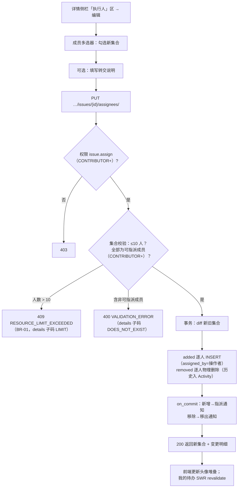
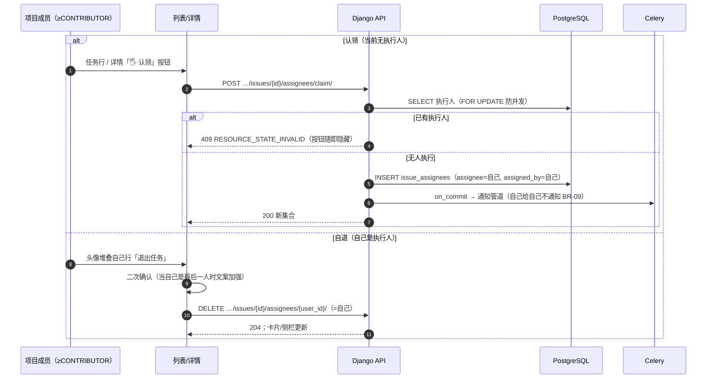
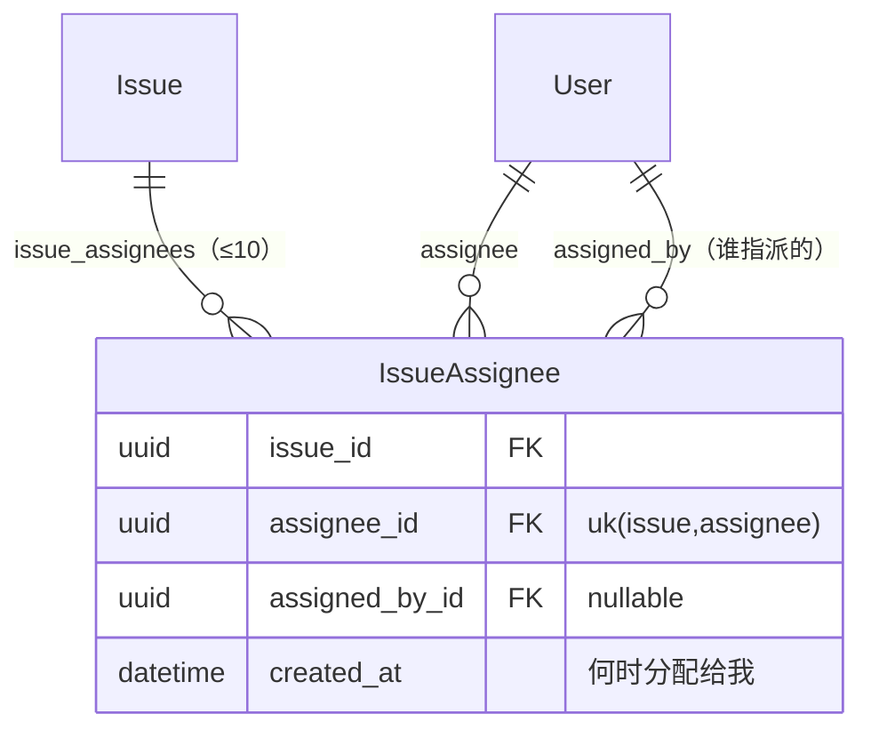

# 多执行人 / 任务转交 / 认领

| 元信息项 | 内容 |
| --- | --- |
| 文档编号 | TASK-007 |
| 所属迭代 | Sprint 2 — 任务体系完善（第 4 周） |
| 优先级 | P2（标准版完整级） |
| 所属模块 | M4-TASK｜任务核心 |
| 文档状态 | 待评审（Draft） |
| 最后更新日期 | 2026-09-02（R3 修复） |
| 上游依赖 | `TASK-001`（`IssueAssignee` 中间表与单人指派）、`PROJ-002`（项目成员候选集与角色）、`AUTH-005`（按钮级权限）、`INFRA-004`（信封与错误码） |
| 下游消费 | `RPT-001`（我的待办多人计数——BR-03 已预留）、`COLLAB-001`（指派/转交通知）、`TASK-010`（assignees M2M diff 日志）、`TASK-013`（P3 多人工时分摊） |
| 上游依据 | `docs/需求文档.md` §3.4（多执行人分配任务、任务转交、任务认领）、§8.2 任务核心 P2 列 |
| 关联架构文档 | [`unified-issue-model.md`](../architecture/unified-issue-model.md)（**§2.9 IssueAssignee 显式中间表 / `assigned_by` / `idx_assignee_issue`**）、[`api-conventions.md`](../architecture/api-conventions.md)（**§2.6 转交 = `PUT …/assignees/` 全量替换——全系统 PUT 白名单成员**；§3.2 PUT 限用论证；§8 错误码）、[`rbac-permission-model.md`](../architecture/rbac-permission-model.md)（`issue.assign` 权限码、四层 Permission） |
| 对标基线 | Plane `IssueAssignee` M2M + `assigned_by`（多人原生支持） · Ones 多执行人 + 转交留痕（企业协同） |
| 工作量估算 | 后端 2 人日 / 前端 2.5 人日 / 联调与测试 1 人日，合计 **5.5 人日** |

---

## 1. 概述

### 1.1 功能定位

P0/P1 的任务只有单负责人（UI 单选、数据结构已是 M2M）。真实协作中「一个任务多人干」（结对、前后端联调、多人评审）与「干不了要换人」（转交）是日常动作。本迭代做三件事：

1. **放开多人**：`IssueAssignee` M2M 从「最多 1 人」放开到「最多 10 人」，全量替换语义；
2. **转交**：把执行人集合替换为新集合（单人↔多人皆可），老执行人自动收到转交通知，`assigned_by` 记录「谁转的」；
3. **认领**：无执行人的任务，具备贡献权限的项目成员（≥CONTRIBUTOR）可一键「认领」为自己——把「指派真空」变成「举手补位」。

数据结构 P0 已建齐（`IssueAssignee` 含 `assigned_by`、`idx_assignee_issue` 索引、`uniq_issue_assignee` 约束），**本迭代零 DDL**，只做「放开限制 + 语义补全」。

### 1.2 关键约定：为什么 `PUT …/assignees/` 是全系统极少数合法 PUT

> ⚠️ 本端点是 [`api-conventions.md`](../architecture/api-conventions.md) §3.2「PUT 仅限集合型子资源全量替换」白名单的**原型成员**。

| 维度 | `PATCH …/issues/{id}/` 带 `assignee_ids` | `PUT …/issues/{id}/assignees/`（本迭代主入口） |
| --- | --- | --- |
| 语义 | 「本次还改了别的字段」 | 「我就是在替换执行人集合」 |
| 载荷 | 混在 Issue 大对象里 | 纯集合 `{"assignee_ids": [...]}` |
| 审计 | IssueActivity 的一条 field | 可携带 `comment`（转交说明）与通知联动 |
| 适用 | 表单里随手改 | 转交弹层 / 批量指派等**以人为目的**的操作 |

两条路径最终都收敛到同一个 `sync_assignees` 服务（§4.3.1），**不存在第二套写逻辑**——PUT 只是「意图更明确的外观」。

### 1.3 交付内容

| # | 能力 | 说明 |
| --- | --- | --- |
| 1 | 多执行人 | 上限 10 人；去重保序；全部必须是本项目 active 成员且角色 ≥CONTRIBUTOR（评论者/查看者不可被指派） |
| 2 | 转交 | `PUT …/assignees/` 全量替换；可附转交说明；新老执行人差异化通知 |
| 3 | 认领 | `POST …/assignees/claim/`：无执行人时把自己加入（幂等：已有执行人则 409） |
| 4 | 自退 | 执行人可自删自己（`DELETE …/assignees/{user_id}/`）；清空为合法中间态 |
| 5 | 展示升级 | 头像堆叠（`AvatarGroup +N`）：详情 / 卡片 / 列表行三处统一 |
| 6 | 通知联动 | 新增→「指派给你」、移除→「已将你移出」、转交→双方各一条（`COLLAB-001` 通道） |

### 1.4 范围边界

| 能力 | 本文档（P2） | 归属 |
| --- | --- | --- |
| 多人集合替换 / 转交 / 认领 / 自退 | ✅ | — |
| 指派通知（差异化文案） | ✅（复用 `COLLAB-001` 通道） | — |
| 多人工时（WorkLog 天然按人） | ✅ 隐式（`TASK-006` 已按 actor 记录） | — |
| 主负责人（Owner）标记 | ❌ 全员平权 | P3 视需要（`IssueAssignee.is_owner` 加列评估） |
| 负载均衡 / 自动指派建议 | ❌ | P3 `WF-003` 自动化 / P4 AI |
| 按执行人授权（只有执行人可改某字段） | ❌ | P3 `WF-004` 字段权限 |
| 排班 / 请假日历感知 | ❌ | P4 |
| 批量转交（多任务一次换人） | ❌ | `BOARD-004` 批量操作（Sprint 3） |

### 1.5 前置依赖

| 依赖 | 内容 | 阻塞原因 |
| --- | --- | --- |
| `TASK-001` | `IssueAssignee` 表 / `assigned_by` / 唯一约束 / `idx_assignee_issue`；P0「单人」限制逻辑 | 本迭代改写该限制并补全服务 |
| `PROJ-002` | 项目成员查询（active 候选集） | 成员合法性校验与选择器数据源 |
| `AUTH-005` | `<PermissionGate>` 与 `issue.assign` 权限码 | 转交/认领按钮的门控 |
| `COLLAB-001` | 通知通道与去重规则 | 指派/移除/转交通知复用 |

### 1.6 竞品参考

| 竞品 | 参考点 | 处置 |
| --- | --- | --- |
| Plane | `Issue.assignees` M2M 原生多人（P0 即多人，无上限）；assign 时记 `assigned_by` | 结构完全一致；**加 10 人上限**（无上限的多人指派会稀释责任——"everyone's issue is no one's issue"） |
| Plane | assign 端点为 PATCH Issue 附带 | 采纳 PUT 集合子资源（意图显式 + 可携带转交说明） |
| Ones | 多执行人 + 转交全程留痕（企业审计视角） | 留痕经 `TASK-010` M2M diff（逐人 added/removed Activity） |
| Jira | 单 assignee + 多 participant 双轨 | 不采纳双轨（两套身份语义教化成本高）；M2M 平权 + P3 视需要加 owner 标记 |

---

## 2. 业务逻辑

### 2.1 转交流程（全量替换）



### 2.2 认领与自退



### 2.2.1 认领的并发交错全景

「空集合才可认领」的判定与写入必须在同一临界区内完成（`claim` 服务对 Issue 行 `select_for_update`）。三种典型交错的结果：

| 交错场景 | 时序 | 结果 | 为什么正确 |
| --- | --- | --- | --- |
| 双人同时认领 | A 取行锁 → 判空 → INSERT → 提交；B 在 A 提交前到达 | A `200`；B 判空失败 `409 RESOURCE_STATE_INVALID` | B 的判空发生在 A 提交后（行锁串行化），看到的是「已有执行人」的真值 |
| 认领 vs 转交（PUT） | PUT 先获 Issue 行锁完成替换；claim 后到 | claim `409`（集合非空） | 两者竞争同一把 Issue 行锁——`sync_assignees` 与 `claim` 都以 `select_for_update(Issue)` 开事务，锁粒度统一 |
| 认领 vs 任务删除 | DELETE 先软删提交；claim 后到 | claim `404 RESOURCE_NOT_FOUND`（`deleted_at` 过滤） | 软删先行则认领目标不存在；反向则删除对含执行人任务照常级联（BR-11），互不阻塞 |

> 三条路径的正确性都锚定在「**同一把 Issue 行锁 + 软删过滤与归档拦截（§2.4）先于任何集合变更**」这一件事上——不存在为认领单独设计的锁或检查，并发语义因此可被一条规则说清（评审与排障成本最低）。

### 2.3 业务规则汇总

| 编号 | 规则 | 判定位置 | 违反后果 |
| --- | --- | --- | --- |
| BR-01 | 执行人集合 ≤ **10** 人（去重后） | Serializer | `409 RESOURCE_LIMIT_EXCEEDED` |
| BR-02 | 每个执行人必须是本项目 active `ProjectMember` 且角色 ≥ `PROJ_CONTRIBUTOR`（**PROJ_COMMENTER / PROJ_VIEWER 均不可被指派**——无任务写权限者不该背任务，对齐 rbac §8 `issue.assign` 矩阵：COMMENTER/VIEWER 为 ❌） | Serializer | `400 DOES_NOT_EXIST` |
| BR-03 | 集合去重**保序**：按请求顺序去重与落库（`dict.fromkeys`，§4.3.1）；读取排序以 `created_at` 为首键、`id` 升序为次级键——次级键仅保证同 `created_at` 碰撞时分页/排序结果**确定不抖动**（`TASK-003` BR-07 同款论证范式），id 为 uuid4 随机主键（unified-issue-model §2.2），同微秒碰撞时行序**不作「展示顺序=加入顺序」的语义保证** | Service | — |
| BR-04 | `assigned_by` 记录实际操作者；认领场景 assignee=assigned_by=自己 | Service | — |
| BR-05 | 认领仅当**当前集合为空**时允许；已有执行人返回 `409 RESOURCE_STATE_INVALID`（不静默合并——「认领」语义是补位不是加入） | Service | 409 |
| BR-06 | 允许清空全部执行人（`assignee_ids: []`）——任务无人负责是合法中间态（待分派池）；列表「未指派」筛选兜住 | Service | — |
| BR-07 | 自退仅能删自己；删他人 = 转交语义（走 PUT，需 `issue.assign` 权限） | Permission | `403 PERM_DENIED` |
| BR-08 | 转交说明 `comment` ≤ 500 字，随 Activity 落库（转交通知正文引用） | Serializer | `400 TOO_LONG` |
| BR-09 | 通知去重与抑制：操作者本人新增/认领自己不通知 | Service | — |
| BR-10 | 每次集合变更逐人写 `IssueActivity(field='assignees')`：added 每人一条（new_identifier=人）、removed 每人一条（old_identifier=人），共享同一 epoch | on_commit | — |
| BR-11 | 任务软删 → IssueAssignee 级联**物理删除**（中间表全程物理删除、不写 `deleted_at`，`TASK-001` §4.1.2 既有口径；`TASK-004` `delete_subtree` 承担级联动作）；恢复仅恢复 `Issue` 主表行（`all_objects`），指派集合不自动重现——历史经 `IssueActivity` 逐人可溯（BR-10） | 级联服务 | — |
| BR-12 | 移除成员出项目（`TEAM-002`/`PROJ-002`）→ 其在该项目的全部 IssueAssignee 同事务**物理删除**（§4.3.3），任务变为「未指派」 | 级联钩子 | — |
| BR-13 | 归档项目禁止一切集合变更 | Permission | `403 PERM_PROJECT_ARCHIVED` |
| BR-14 | `RPT-001` 多人计数口径：`IssueAssignee` 存在即计入该人待办（按人视角天然正确） | 既有 BR | — |

> **BR-12 上游待回改登记（与 PROJ-002「指派保留」口径的冲突处置）**：`PROJ-002`（已 PASS）现行 BR-07 为「移除项目成员**不触发任务改派**：其名下任务保留指派、以已移出成员灰头像展示」，配套 BE-13、FE-11 移除弹窗文案（「指派将保留」）与 §6.4 决策 4（`TEAM-002` §2.4 注释 / BE-15 / 移除弹窗为同口径）；其范围边界仅将「被移除成员任务的**转交**」推迟给本文，并未预告「保留指派」在 P2 延续。本文 BR-12 改定为**级联清空**——移除成员 → 其在该项目的全部 `IssueAssignee` 同事务物理删除，理由：① 与 `TASK-001` §4.1.2 中间表全程物理删除口径一致；② 指派是**准入凭证**而非单纯历史记录——BR-02 要求执行人必须是 active 成员且 ≥CONTRIBUTOR，保留行即长期维持「不可指派者仍在集合内」的违约状态；③ 与「移除即失权」的权限即时生效原则一致（`TEAM-002` AC-04 移除即隔离），历史贡献可溯性由 `IssueActivity` 逐人留痕（BR-10）承担、不依赖中间表行。**上游待回改项——`PROJ-002` BR-07 / BE-13 / FE-11（移除弹窗「指派将保留」文案）及 `TEAM-002` 同口径处需同步为级联清空表述，登记待回改**。与「任务转交」的边界分工不变：转交是**显式**换人操作（PUT，本文交付），移除是**隐式**级联清理（BR-12）——两者并行不悖。

### 2.4 异常处理

| 场景 | HTTP | 错误码 | details 子码 | 前端表现 |
| --- | --- | --- | --- | --- |
| 集合 > 10 人 | 409 | `RESOURCE_LIMIT_EXCEEDED` | `LIMIT` | 多选器内计数红显「最多 10 人」 |
| 含非项目成员 | 400 | `VALIDATION_ERROR` | `DOES_NOT_EXIST` | 选择器本就限成员；直连触发 |
| 含 COMMENTER/VIEWER 成员 | 400 | `VALIDATION_ERROR` | `DOES_NOT_EXIST` | 候选已过滤评论者/查看者，提示「评论者/查看者不能被指派」 |
| 认领时已有人 | 409 | `RESOURCE_STATE_INVALID` | `STATE` | 按钮隐藏 + Toast「已被认领」 |
| 删他人执行人（无权限） | 403 | `PERM_DENIED` | — | 头像菜单不出现删除项 |
| 转交说明超长 | 400 | `VALIDATION_ERROR` | `TOO_LONG` | 输入框计数红 |
| 目标任务不存在/不可见 | 404 | `RESOURCE_NOT_FOUND` | — | 通用 404 |
| 归档项目 | 403 | `PERM_PROJECT_ARCHIVED` | — | 只读态 |
| 已归档任务上的写操作（PUT / claim / 自退 / PATCH `assignee_ids`） | 409 | `RESOURCE_STATE_INVALID` | `STATE` | 「任务已归档，恢复后才能编辑」+ 恢复入口；PUT/claim/PATCH 由 `ProjectEntityPermission` 拦截（`TASK-009` §4.3.3 归档写保护同型——拦截器仅匹配 PATCH/PUT/POST、DELETE 放行）；自退（DELETE）不在拦截器覆盖内，由 `sync_assignees` 统一入口显式判定 `archived_at` 兜底（§4.3.1，对 PUT/claim 亦构成 Service 层双保险） |

> **字段级子码登记**：本表使用的 `LIMIT` 与 `STATE` 为 `details[].code` 字段级子码，不占用全局错误码注册表，由 [`api-conventions.md`](../architecture/api-conventions.md) §8.8「字段级子码」承载。§8.8 现表已含 `DOES_NOT_EXIST` / `TOO_LONG`（直接复用），但**未注册** `LIMIT`（集合/数量超上限，`message` 给出上限值与实际值）与 `STATE`（资源当前状态不允许该操作）——交付时需在 §8.8 补登这两条子码条目，**架构文档待回改登记**（与 `COLLAB-001` `EDIT_WINDOW_EXPIRED` 的补登模式一致）。

### 2.5 边界条件

| 边界场景 | 限制值 | 超出处理 |
| --- | --- | --- |
| 集合人数 | 10 | 409 |
| 同一人重复提交 | 去重 | 保首个位置 |
| 并发转交（两人同时 PUT 不同集合） | last-write-wins（PUT 幂等语义），Activity 各自完整 | 列表 SWR 收敛 |
| 并发认领 | 行锁 + 空集合判定 | 恰一人 200，另一人 409 |
| 头像堆叠展示 | 前 3 + `+N` | hover 展开全部 |
| 移出项目成员的级联 | 同事务物理删除其全部指派行 | 任务入「未指派」待分派视图 |

---

## 3. UI/UX 设计

### 3.1 详情侧栏「执行人」区升级

```
┌──────────────────────────────────────────────────────────────────┐
│ TZXM-18  前端联调                                                │
│ ──────────────────────────────────────────────────────────────── │
│  执行人      ┌──┐┌──┐┌──┐                                       │
│              │张││李││王│ +2                        [＋ 编辑]    │
│              └──┘└──┘└──┘                                       │
│              张三、李四、王五 +2 人                                │
└──────────────────────────────────────────────────────────────────┘
  悬浮头像堆叠 → 浮层列出全部（头像+名+在线点），自己的行带「退出任务」
```

| 元素 | 规格 |
| --- | --- |
| 头像堆叠 | `AvatarGroup`：24px 圆形、重叠 -8px、边框 2px 白；>3 显示 `+N`（neutral 底）；空集合显示 `👤 未指派` 虚线框 + 「🖐 认领」按钮 |
| 名称行 | `text-xs text-neutral-500 truncate`；hover 浮层列全量 |
| 「编辑」 | 成员多选弹层（搜索 + 勾选，实时计数 n/10）；底部可选「转交说明」输入 |
| 认领按钮 | 无执行人且自己 ≥CONTRIBUTOR 时显示；点击即 POST，无需确认 |
| 退出 | 浮层中自己行的次级动作；最后一人退出时二次确认文案加强 |

### 3.2 转交弹层（多选编辑态）

```
┌────────────────────────────────────────────────┐
│  修改执行人 · 前端联调                             │
│                                                  │
│  🔍 搜索成员…                                     │
│  ┌────────────────────────────────────────┐    │
│  │ ✓ 张三  ●在线          zhang@ac.me      │    │
│  │ ✓ 李四  ●忙碌          li@ac.me          │    │
│  │ ○ 王五  ●在线          wang@ac.me        │    │
│  │ ○ 赵六  （评论者，不可指派）              │    │
│  │ ○ 孙七  （查看者，不可指派）              │    │
│  └────────────────────────────────────────┘    │
│  已选 2/10：[张三 ×] [李四 ×]                     │
│                                                  │
│  转交说明（可选，将随通知发送）                     │
│  ┌────────────────────────────────────────┐    │
│  │ 联调窗口改到周四，请两位对接…             │    │
│  └────────────────────────────────────────┘    │
│                          [取消]  [保存修改]      │
└────────────────────────────────────────────────┘
```

| 元素 | 规格 |
| --- | --- |
| 成员列表 | active 项目成员，CONTRIBUTOR+ 可勾选；COMMENTER/VIEWER 灰显标注「不可指派」；自己带「（我）」 |
| 已选 chips | 顺序即提交顺序（BR-03 去重保序）；`×` 移除 |
| 计数 | `n/10`，达 10 后未选项禁用 |
| 保存 | PUT 全量集合 + comment；乐观更新头像堆叠；失败回滚 |
| 通知预览 | 输入后底部灰字「将通知：新增 1 人、移除 2 人」 |

### 3.3 列表 / 看板卡片

| 位置 | 表现 |
| --- | --- |
| 列表「负责人」列 | 头像堆叠（20px）；空显示「未指派」（neutral 徽标，可点开筛选） |
| 看板卡片 | 头像堆叠右上角；`未指派` 卡片左上虚线人形占位 |
| 快速指派 | 列表行悬浮头像区 → 单人快速选择浮层 |
| 「认领」入口 | 列表行悬浮（未指派时）「🖐」按钮 |

### 3.4 空状态 / 加载 / 失败

| 场景 | 处置 |
| --- | --- |
| 未指派任务 | 虚线人形 + 认领按钮；项目级「未指派」内置筛选一键收拢 |
| 成员列表加载 | 弹层 5 行骨架 |
| 转交失败 | 头像堆叠回滚 + Toast；409 LIMIT 时多选计数抖动提示 |

### 3.5 响应式与无障碍

| 断点 | 布局 |
| --- | --- |
| ≥ 1280px | 堆叠 + 名称行 + 编辑入口 |
| 768~1279px | 仅堆叠 + `+N` |
| < 768px | 单头像 + 计数徽标；弹层全屏 |

无障碍：头像堆叠容器 `role="group" aria-label="执行人 5 人：张三、李四…"`；`+N` 为按钮展开浮层（`aria-haspopup`）；认领按钮 `aria-label="认领该任务"`；多选列表为 checkbox 组（方向键 + 空格）；转交说明计数 `aria-live="polite"`。

---

## 4. 技术架构

### 4.1 数据模型

**零新增表、零 DDL**。消费 `INFRA-003` 已建（与架构文档 §2.9 一致）：

```python
# apps/api/plane/db/models/issue.py —— 既有定义，本迭代放开限制
class IssueAssignee(BaseModel):
    """负责人关联表 —— 显式中间表以记录「谁在何时指派了谁」"""

    issue = models.ForeignKey(Issue, on_delete=models.CASCADE, related_name="issue_assignees")
    assignee = models.ForeignKey("db.User", on_delete=models.CASCADE,
                                 related_name="issue_assignees")
    assigned_by = models.ForeignKey("db.User", on_delete=models.SET_NULL, null=True,
                                    related_name="assigned_issue_records",
                                    verbose_name="指派人")

    class Meta(BaseModel.Meta):
        db_table = "issue_assignees"
        constraints = [
            models.UniqueConstraint(fields=["issue", "assignee"], name="uniq_issue_assignee"),
        ]
        indexes = [
            models.Index(fields=["assignee", "issue"], name="idx_assignee_issue"),  # 我的待办
        ]
```



#### 4.1.1 索引设计说明

| 索引 | 服务的查询 | 本迭代 |
| --- | --- | --- |
| `idx_assignee_issue` | 「我的待办」`WHERE assignee_id=me`（多人后每人的列表天然正确，BR-14） | ✅ 核心 |
| `uniq_issue_assignee` | 去重兜底（并发加同一人） | ✅ |
| `idx_issue_proj_state_sort` | 列表主查询（集合经 prefetch 一次取出） | ✅ |

### 4.2 API 定义

| # | 方法 | 路径 | 描述 | 权限 | 成功码 |
| --- | --- | --- | --- | --- | --- |
| 1 | `PUT` | `…/issues/{issue_id}/assignees/` | **全量替换执行人集合**（PUT 白名单成员；可选 `comment`） | `issue.assign`（CONTRIBUTOR+） | `200` |
| 2 | `POST` | `…/issues/{issue_id}/assignees/claim/` | 认领（空集合时把自己加入） | `issue.assign`（CONTRIBUTOR+） | `200` |
| 3 | `DELETE` | `…/issues/{issue_id}/assignees/{user_id}/` | 自退（仅 user_id=自己） | 本人 | `204` |
| 4 | `PATCH` | `…/issues/{issue_id}/` | 兼容路径：`assignee_ids` 数组字段（多人开放） | `issue.update` | `200` |
| 5 | `GET` | `…/issues/?assignee_ids=<uuid>,…` | 多值筛选（`TASK-003` 白名单参数 `assignee_ids`，逗号 OR） | `PROJ_VIEWER`(5)+ | `200` |

#### 4.2.1 `PUT …/assignees/` — 转交 / 全量替换

**请求**

```json
{
  "assignee_ids": [
    "6c7d1a2b-3e4f-4a5b-9c8d-7e6f5a4b3c2d",
    "2b3a4c5d-6e7f-4a8b-9c0d-1e2f3a4b5c6d",
    "4d5e6f7a-8b9c-4d0e-9f1a-2b3c4d5e6f70"
  ],
  "comment": "联调窗口改到周四，请三位对接前端与后端两组接口"
}
```

**成功响应 `200`**

```json
{
  "status": "success",
  "data": {
    "issue_id": "c4d5e6f7-8a9b-4c0d-9e1f-2a3b4c5d6e7f",
    "assignee_ids": ["6c7d…", "2b3a…", "4d5e…"],
    "changes": {
      "added":   [{ "id": "4d5e6f7a-8b9c-4d0e-9f1a-2b3c4d5e6f70", "display_name": "王五" }],
      "removed": [{ "id": "9a1b2c3d-4e5f-4a71-8293-a4b5c6d7e8f9", "display_name": "赵六" }]
    }
  },
  "meta": { "assigned_by": "6c7d1a2b-3e4f-4a5b-9c8d-7e6f5a4b3c2d" }
}
```

> `changes` 回传让前端无需本地 diff 即可做通知预览与 Activity 展示；响应 `assignee_ids` 顺序 = 去重后请求顺序（BR-03——服务端回显去重结果，非按库内行序重排）；后续读取以 `created_at` 首键 + `id` 次级键稳定排序，同微秒碰撞时仅保证结果确定不抖动、不承诺等于加入顺序（见 §4.3.1）。

**失败响应 `400`（含不可指派成员）**

```json
{
  "status": "error",
  "error": {
    "code": "VALIDATION_ERROR",
    "message": "请求参数校验失败",
    "details": [{ "field": "assignee_ids",
                  "code": "DOES_NOT_EXIST",
                  "message": "赵六不是本项目成员或为评论者/查看者，不能被指派" }],
    "request_id": "01JCB7W2Q5AT0R2S8Y6Z9B1C4D"
  }
}
```

**失败响应 `409`（超上限）**

```json
{
  "status": "error",
  "error": {
    "code": "RESOURCE_LIMIT_EXCEEDED",
    "message": "执行人最多 10 人",
    "details": [{ "field": "assignee_ids", "code": "LIMIT", "message": "当前提交 11 人" }],
    "request_id": "01JCB7W2Q5AT0R2S8Y6Z9B1C4E"
  }
}
```

#### 4.2.2 `POST …/assignees/claim/` — 认领

**请求**：空体（或 `{}`）。

**成功响应 `200`**

```json
{
  "status": "success",
  "data": {
    "issue_id": "c4d5e6f7-…",
    "assignee_ids": ["6c7d1a2b-3e4f-4a5b-9c8d-7e6f5a4b3c2d"],
    "changes": { "added": [{ "id": "6c7d…", "display_name": "张三" }], "removed": [] }
  }
}
```

**失败响应 `409`（已被认领）**

```json
{
  "status": "error",
  "error": {
    "code": "RESOURCE_STATE_INVALID",
    "message": "该任务已有执行人，无需认领",
    "details": [{ "field": "assignee_ids",
                  "code": "STATE",
                  "message": "当前执行人集合非空（认领仅限未指派任务）" }],
    "request_id": "01JCB7W2Q5AT0R2S8Y6Z9B1C4F"
  }
}
```

#### 4.2.3 `DELETE …/assignees/{user_id}/` — 自退

**成功 `204`**（空体）。**失败 `403`**：`user_id` 非自己（`PERM_DENIED`——删他人属转交语义，走 PUT）。

#### 4.2.4 `PATCH …/issues/{id}/` — 兼容路径（表单随手改）

快速编辑表单、批量创建等场景不经转交弹层，走 Issue PATCH 携带 `assignee_ids`（多人开放后数组可为 0~10 个元素）：

**请求**

```json
{ "assignee_ids": ["2b3a4c5d-6e7f-4a8b-9c0d-1e2f3a4b5c6d"], "priority": "high" }
```

**成功响应 `200`**（`data` 为完整 Issue 对象，节选相关字段）：

```json
{
  "status": "success",
  "data": {
    "id": "c4d5e6f7-8a9b-4c0d-9e1f-2a3b4c5d6e7f",
    "assignee_ids": ["2b3a4c5d-6e7f-4a8b-9c0d-1e2f3a4b5c6d"],
    "priority": "high",
    "updated_at": "2026-09-01T08:50:17.332Z"
  }
}
```

> 与 PUT 的差异（对齐 §1.2 约定表）：PATCH 不接受 `comment`、响应回完整 Issue 而非 `changes` 明细、适合「顺手改一个字段」；两者收敛到同一 `sync_assignees`（IT-05 锚定落库一致）。通知与 Activity 行为完全相同（BR-09/BR-10）。

#### 4.2.5 `?assignee_ids=null` — 「未指派」筛选语义

`TASK-003` 筛选白名单参数 `assignee_ids` 追加 `null` 值语法糖，编译为 `assignees__id__isnull=true`。空值判定语法（`?field__isnull=true`）的出处是 [`api-conventions.md`](../architecture/api-conventions.md) §5.3——其示例恰为 `?assignee_ids__isnull=true`（未指派）；`TASK-001` §4.2.2 的 `?assignee=me` 只是「糖值」前例，并未定义 null 语义。**架构文档待回改**：api-conventions §5.3 示例（直写 `__isnull=true`）待回改为 `null` 糖值形态——本文按 `TASK-003` 白名单纪律，`assignee_ids` 仅支持 `null` 糖值，`__isnull` 直写不在白名单、按 `ignored_params` 通道丢弃并出 `meta.warning`（与下文 `me,null` 组合同一处置）。示例：

```http
GET …/issues/?assignee_ids=null&state_id=d2e3f4a5-1b2c-4d3e-9f0a-3b4c5d6e7f80,7a9d8e6f-5c4b-4a3d-9e2f-1a0b9c8d7e6f&order_by=target_date HTTP/1.1
```

| 语义细节 | 说明 |
| --- | --- |
| `null` 的判定 | 任务不存在任何 `IssueAssignee` 行（中间表物理删除——被移出即行消失，天然不参与判定，口径见 §4.3.1 说明） |
| 与 BR-06 呼应 | 清空集合的任务由此筛选兜住，构成「待分派池」 |
| `null` vs `TASK-003` 预留 `is_empty` 的取舍 | `TASK-003` §1.2 矩阵为 `assignee_ids` 预留的 P2 演进位是 `is_empty`（未指派）。本迭代将该演进位落地为 **URL 层 `null` 值语法糖**：逻辑算子名仍为 `is_empty`，两者编译为同一 `assignees__id__isnull=true`；`TASK-011` 组合筛选器 DSL 的条件叶节点用 `is_empty`，`null` 只是其 URL 序列化形态。不再同时支持 `?assignee_ids__isnull=true` 直写——两种 URL 写法并存会破坏「URL → 结果集」纯函数的可预测性 |
| 与 `me` 组合禁止 | `assignee_ids=me,null` 无意义：FilterSet 丢弃 `null`、按 `me` 等值语义执行，`meta.warning` 提示「null 已忽略」（沿用 `TASK-003` BR-06 的 warning 通道） |
| 组合参数约束 | 示例中 `state_id`（UUID 逗号 OR）与 `order_by` 均为 `TASK-003` 白名单参数；白名单**没有** `state_group`——按状态组筛选由前端展开为该组的 `state_id` 列表（P2 `TASK-011` DSL 再评估语义组快捷筛） |
| 消费方 | 列表「未指派」徽标点击、`RPT-001` 待办排除项、P3 自动化规则「指派真空提醒」触发源 |

### 4.3 核心逻辑

#### 4.3.1 `sync_assignees`（唯一写入口，diff + 保序 + 通知）

```python
# apps/api/plane/db/services/issue_assignee_sync.py   # 落点名对齐 TASK-001 覆盖表（§7）
import uuid

from django.db import transaction

from plane.db.models import Issue, IssueAssignee

MAX_ASSIGNEES = 10


@transaction.atomic
def sync_assignees(*, issue_id: uuid.UUID, new_ids: list[uuid.UUID],
                   actor_id: uuid.UUID, comment: str = "") -> dict:
    """执行人集合全量替换 —— 全系统唯一写入口（PUT / PATCH / claim / 自退全部收敛于此）。

    返回 changes 明细供响应回传与通知管道消费。
    """
    issue = (Issue.objects.select_for_update()
             .select_related("project")
             .get(id=issue_id, deleted_at__isnull=True))
    if issue.project.status != "active":                       # BR-13
        raise ProjectArchivedError()
    if issue.archived_at:                                      # 已归档任务 409（§2.4）：自退 DELETE 不在
        raise BusinessError(code="RESOURCE_STATE_INVALID",     # ProjectEntityPermission 覆盖内（TASK-009
                            http_status=409,                   # §4.3.3 仅匹配 PATCH/PUT/POST），统一入口
                            message="任务已归档，恢复后才能编辑")  # 判定兜底；PUT/claim 为 Service 层双保险

    new_ids = list(dict.fromkeys(new_ids))                     # BR-03 去重保序
    if len(new_ids) > MAX_ASSIGNEES:                           # BR-01
        raise LimitExceeded(limit=MAX_ASSIGNEES, got=len(new_ids))
    _assert_assignable(issue.project_id, new_ids)              # BR-02

    current = list(IssueAssignee.objects.filter(
        issue_id=issue_id
    ).select_related("assignee").order_by("created_at", "id"))
    # 中间表物理删除口径（TASK-001 §4.1.2）：任何路径不写 deleted_at → 全量即活跃集合
    # 保序读取（BR-03）：created_at 首键 + id 升序次级键——id 仅保证同 created_at（同微秒）
    # 碰撞时排序结果确定不抖动（TASK-003 BR-07 同款论证）；id 为 uuid4 随机主键
    # （unified-issue-model §2.2），碰撞行序不作「落库顺序」的语义保证

    added_ids = [i for i in new_ids if i not in {a.assignee_id for a in current}]
    removed = [a for a in current if a.assignee_id not in new_ids]

    if removed:                                                # 物理删除（历史经 Activity 逐人留痕，BR-10）
        IssueAssignee.objects.filter(
            issue_id=issue_id,
            assignee_id__in=[a.assignee_id for a in removed]).delete()
    IssueAssignee.objects.bulk_create([                        # 新增同批落库（保序读取：created_at
        IssueAssignee(issue_id=issue_id, assignee_id=uid, assigned_by_id=actor_id)  # 首键 + id 次级键；BR-03/BR-04
        for uid in added_ids
    ])

    changes = {
        "added":   [{"id": u, "display_name": _name(u)} for u in added_ids],
        "removed": [{"id": a.assignee_id, "display_name": a.assignee.display_name}
                    for a in removed],
    }
    transaction.on_commit(lambda: dispatch_assignment_events.delay(
        str(issue_id), str(actor_id), changes, comment))       # BR-09/BR-10
    return changes


def claim(*, issue_id: uuid.UUID, actor_id: uuid.UUID) -> dict:
    """认领：空集合判定 + 行锁防并发（BR-05）。"""
    with transaction.atomic():
        issue = Issue.objects.select_for_update().get(id=issue_id, deleted_at__isnull=True)
        has_any = IssueAssignee.objects.filter(issue_id=issue_id).exists()
        if has_any:                                            # 中间表无软删行：存在行即非空
            raise AlreadyClaimedError()
        return sync_assignees(issue_id=issue_id, new_ids=[actor_id],
                              actor_id=actor_id)               # 自己给自己：BR-09 不通知
```

> **为什么「移除」沿用物理 DELETE（`TASK-001` §4.1.2 既有口径）**：`IssueAssignee` 中间表**全程物理删除、任何路径不写 `deleted_at`**——`uniq_issue_assignee` 不带 `deleted_at` 偏条件正以此为前提；若保留 `(issue, assignee, deleted_at IS NOT NULL)` 软删行，「删后重加」与「恢复任务重建 M2M」都会撞上「同一 `(issue, assignee)` 活跃+软删两行」的历史脏数据。**指派历史的审计链不依赖中间表行**：「谁在何时把任务分给过谁」由 `assigned_by`（现行）+ `IssueActivity` 逐人留痕（BR-10，`TASK-010` 管道聚合）承载——转交溯源与 P3 工时复核查 Activity，而非查中间表。删后重加因此是全新 `INSERT`：`created_at` 刷新、`assigned_by` 记新操作者，不撞唯一约束（UT-09 锚定）。

#### 4.3.2 通知投递（Celery）

```python
# apps/api/plane/bgtasks/issue_assignee.py
@shared_task(bind=True, max_retries=3, retry_backoff=True)
def dispatch_assignment_events(self, issue_id: str, actor_id: str,
                               changes: dict, comment: str) -> None:
    """差异化通知（复用 COLLAB-001 通道与去重）：
    - added 中每人一条「xx 把任务指派给你」——事件键 issue.assigned（操作者本人跳过 BR-09）
    - removed 中每人一条「xx 将你移出任务」（含 comment 引用）——事件键
      issue.unassigned（与 issue.assigned 对偶，本文新增）
    - 逐人写 IssueActivity(field='assignees')，共享同一 epoch —— TASK-010 管道聚合
    """
    ...
```

> **事件源登记（上游待回改）**：`issue.unassigned` 为本文新增事件键——事件触发「指派集合**移除**成员」，接收域 = 被移除人 − 操作者（与 `issue.assigned` 同构的减法），title「{actor} 将你移出 {RBT-128}」，data 载荷 `{issue_id, project_id, workspace_slug, issue_key, actor}`（+ 转交场景附 `comment` 引用）。`COLLAB-001` §2.3 事件源表（P1 四类）现行口径为「`issue.assigned`：指派集合新增成员（含创建时首派；**移除不通知**）」，本文将「移除不通知」升级为「逐人移出通知」——**COLLAB-001 §2.3 事件源表待补登 `issue.unassigned`（其元信息下游依赖栏已预告「P2 TASK-007 多执行人事件源扩展」）——上游文档待回改登记**。成员移出项目的级联路径（§4.3.3）中被移除人的移出通知复用同一事件键（操作者为执行移除的管理员），负责人侧批量提醒归 P3 自动化规则。

#### 4.3.3 成员移出项目的级联钩子

```python
# 并入 PROJ-002/TEAM-002 的成员移除服务（BR-12，物理删除——与 TASK-001 §4.1.2 中间表口径一致）：
#   DELETE FROM issue_assignees
#    WHERE assignee_id = %(leaving_user)s
#      AND issue_id IN (SELECT issue_id FROM … WHERE project = %(project)s)
#   → 受影响任务进入「未指派」；on_commit：被移除人逐任务收 issue.unassigned 移出通知
#     （§4.3.2 事件键，操作者 = 执行移除的管理员；接收人非操作者，BR-09 不抑制）；
#     项目负责人的批量提醒归 P3 自动化规则接管
```

#### 4.3.4 成员资格校验与自退服务（`sync_assignees` 的支撑件）

```python
# apps/api/plane/db/services/issue_assignee_sync.py（续）
from django.core.exceptions import PermissionDenied as DjPermissionDenied
from plane.db.models import ProjectMember


def _assert_assignable(project_id: uuid.UUID, user_ids: list[uuid.UUID]) -> None:
    """BR-02：批量校验候选全部是本项目可被指派的 active 成员（≥CONTRIBUTOR；
    COMMENTER/VIEWER 同样被排除——无任务写权限者不该背任务）。

    一次 IN 查询取全部命中行，再比对差集——N 个候选恒为 1 条 SQL，
    不随人数放大（安全锚定 UT-05/06；单查询性能锚定 UT-17）。
    """
    eligible = set(ProjectMember.objects.filter(
        project_id=project_id, member_id__in=user_ids, is_active=True,
        role__in=("PROJ_ADMIN", "PROJ_CONTRIBUTOR"),
    ).values_list("member_id", flat=True))
    invalid = [u for u in dict.fromkeys(user_ids) if u not in eligible]
    if invalid:
        names = ", ".join(_name(u) for u in invalid)
        raise ValidationError(
            {"assignee_ids": f"{names} 不是本项目成员或为评论者/查看者，不能被指派"})


def _name(user_id: uuid.UUID) -> str:
    """候选显示名缓存（本请求内 memoize）——错误信息与 changes 明细共用。"""
    ...  # User.objects.values_list("display_name", flat=True).get(id=user_id)


@transaction.atomic
def remove_self(*, issue_id: uuid.UUID, user_id: uuid.UUID) -> None:
    """自退（§2.2 右支的服务端实现）：
    ① 仅允许 user_id == 操作者本人（删他人是转交语义，走 PUT，BR-07）；
    ② 行为等价于「保留其余成员、移除自己」的集合替换——直接收敛 sync_assignees，
       免去第三套 diff 逻辑；「最后一人退出」因此天然合法（BR-06 清空中间态）。
    """
    issue = Issue.objects.select_for_update().get(
        id=issue_id, deleted_at__isnull=True)
    remaining = list(IssueAssignee.objects.filter(
        issue_id=issue_id                       # 中间表物理删除口径：全量即活跃集合
    ).exclude(assignee_id=user_id).values_list("assignee_id", flat=True).order_by("created_at", "id"))
    sync_assignees(issue_id=issue_id, new_ids=remaining,
                   actor_id=user_id)                    # 操作者=退出者；无 comment
```

> `remove_self` 复用 `sync_assignees` 的收益：删除/新增语义、`changes` 通知、Activity 逐人留痕、归档拦截（BR-13）、已归档任务 409 判定（§2.4——DELETE 自退不经过 Permission 拦截器，正是靠这层复用兜住）五件事零重复实现——「唯一写入口」约定（§1.2）的价值在第三个调用方出现时开始兑现。

### 4.4 前端实现

#### 4.4.1 `AssigneePicker` 组件（多选弹层核心，节选）

```typescript
// apps/web/src/routes/projects.$projectId._index/-components/assignee-picker.tsx
import { useMemo, useState } from "react";
import { observer } from "mobx-react-lite";
import { useProjectMembers } from "@/hooks/use-project-members";

const MAX_ASSIGNEES = 10;

export const AssigneePicker = observer(function AssigneePicker({
  issueId, initialIds, onSubmitted,
}: {
  issueId: string;
  initialIds: string[];                 // 顺序即服务端回传顺序（BR-03 基线）
  onSubmitted?: (ids: string[]) => void;
}) {
  const { data: members } = useProjectMembers();   // ProjectMemberStore.activeContributors
  const [selected, setSelected] = useState<string[]>(initialIds);
  const [comment, setComment] = useState("");
  const [submitting, setSubmitting] = useState(false);

  /** 候选：过滤 COMMENTER/VIEWER（服务端 BR-02 的前端预判）；搜索按显示名/邮箱前缀 */
  const candidates = useMemo(() => members.filter((m) => m.selectable), [members]);
  const atLimit = selected.length >= MAX_ASSIGNEES;

  function toggle(id: string) {
    setSelected((prev) =>
      prev.includes(id)
        ? prev.filter((x) => x !== id)                    // chips 与列表双向同步，保序
        : atLimit ? prev : [...prev, id]);                // 达上限后不再加入（§3.2）
  }

  async function submit() {
    setSubmitting(true);
    try {
      // 走 PUT 主入口；changes 由服务端回传，本地零 diff
      const res = await api.put(`issues/${issueId}/assignees/`,
        { assignee_ids: selected, comment: comment.trim() || undefined });
      onSubmitted?.(res.data.assignee_ids);              // 用服务端结果整体替换 Store
    } finally {
      setSubmitting(false);
    }
  }

  const changes = useMemo(() => {                        // 通知预览（§3.2 底部灰字）
    const added = selected.filter((id) => !initialIds.includes(id));
    const removed = initialIds.filter((id) => !selected.includes(id));
    return { added, removed };
  }, [selected, initialIds]);

  return (
    <Dialog>
      <MemberList candidates={candidates} selected={selected}
                  atLimit={atLimit} onToggle={toggle} />
      <ChipRow ids={selected} onRemove={toggle}          // chips 顺序 = 提交顺序
               counter={`${selected.length}/${MAX_ASSIGNEES}`} />
      <CommentBox value={comment} onChange={setComment} maxLength={500} />
      <p className="text-xs text-neutral-400" aria-live="polite">
        {changes.added.length + changes.removed.length > 0
          ? `将通知：新增 ${changes.added.length} 人、移除 ${changes.removed.length} 人`
          : null}
      </p>
      <DialogActions onCancel={() => setSelected(initialIds)}
                     onSubmit={submit} disabled={submitting} />
    </Dialog>
  );
});
```

**实现要点**：候选过滤 COMMENTER/VIEWER 只是预判——服务端 `_assert_assignable`（§4.3.4）是权威；`selected` 数组即唯一事实（勾选与 chips 双向操作同一数组，顺序天然一致）；提交结果用服务端 `assignee_ids` 整体替换（并发下不漂移）。

#### 4.4.2 其余前端件

- `IssueStore.assigneesByIssue: Map<issueId, string[]>`（保序数组）；PUT 成功用响应 `assignee_ids` 整体替换（不本地 diff）。
- `AvatarGroup`（`packages/ui`）新组件：props `users[] / size / max=3`；空态插槽（`placeholder="unassigned"`）；`+N` 按钮展开 Popover。
- 认领按钮逻辑：`assignees.length === 0 && can("issue.assign")`；点击后乐观插入自己头像。
- 409 STATE（已被认领）处理：Toast + `mutate` 该任务。

---

## 5. 测试用例

### 5.1 单元测试

| 用例 ID | 测试目标 | 输入 | 预期输出 | 覆盖类型 |
| --- | --- | --- | --- | --- |
| UT-01 | 多人替换 | 3 人集合 | 3 行存活，changes 正确 | 正常 |
| UT-02 | 去重保序 | [B,A,B] | 落库 [B,A] | 边界 |
| UT-03 | 上限 | 11 人 | 409 LIMIT | 边界 |
| UT-04 | 边界值 | 恰 10 人 | 200 | 边界 |
| UT-05 | 非成员指派 | 他项目用户 | 400 DOES_NOT_EXIST | 安全 |
| UT-06 | COMMENTER/VIEWER 指派 | 项目 COMMENTER 与项目 VIEWER 各一 | 400 DOES_NOT_EXIST | 安全 |
| UT-07 | 认领空任务 | 集合空 | 200，assigned_by=自己 | 正常 |
| UT-08 | 认领非空 | 集合 1 人 | 409 STATE | 异常 |
| UT-09 | 重加同人 | 删后重加 | 旧行已物理删除，全新行 INSERT 不撞唯一约束；assigned_by/created_at 刷新为本次操作 | 边界 |
| UT-10 | 清空合法 | [] | 200，任务入未指派 | 边界 |
| UT-11 | 自退权限 | DELETE 他人 user_id | 403 | 安全 |
| UT-12 | assigned_by 记录 | A 操作 | 新行 assigned_by=A | 正常 |
| UT-13 | comment 上限 | 501 字 | 400 TOO_LONG | 边界 |
| UT-14 | 通知抑制 | 认领自己 | 无通知产生 | 正常 |
| UT-15 | 级联清理 | 成员移出项目 | 其该项目全部指派行物理删除 | 正常 |
| UT-16 | 自退收敛 | 3 人中 1 人自退 | 剩余 2 人集合不变（remove_self 经 sync）；最后一人自退 = 清空 | 正常 |
| UT-17 | 候选校验单查询 | 10 候选全合法；10 候选含 1 个非法 | 成功路径 `assertNumQueries(1)`（IN 批量，§4.3.4）；失败路径允许 +1（错误文案经 `_name` 查 `User.display_name`，非法候选首查未命中缓存） | 性能 |

### 5.2 集成测试

| 用例 ID | 场景 | 前置条件 | 操作步骤 | 预期结果 |
| --- | --- | --- | --- | --- |
| IT-01 | 转交通知差异化 | 原 2 人 | PUT 换成 3 人（1 老 2 新） | 老人收移出、新人收指派；操作者无通知 |
| IT-02 | 并发认领 | 空任务 | 两用户同时 claim | 一 200 一 409 |
| IT-03 | Activity 逐人留痕 | 加 2 删 1 | 查 IssueActivity | 3 条 field=assignees 同 epoch |
| IT-04 | 我的待办联动 | 指派 2 人 | 两人各自 /users/me/issues | 各自列表出现该任务（BR-14） |
| IT-05 | PUT/PATCH 收敛 | 同集合分别走两路径 | 落库一致 | — |
| IT-06 | 任务软删级联 | 有 3 执行人 | 删除任务 | 指派行物理删除（表内不复存在）；恢复后任务呈未指派态，历史经 Activity 可溯（BR-11） |
| IT-07 | 归档项目 | 项目归档 | PUT assignees | 403 PERM_PROJECT_ARCHIVED |
| IT-08 | 认领 vs 转交交错 | 空任务 | 并发 claim 与 PUT 不同集合 | 行锁串行：其一成功；最终集合恰为后提交者意图（§2.2.1） |
| IT-09 | 未指派筛选 | 清空 2 个任务集合 | `?assignee_ids=null` | 恰返回 2 条；被移除者行已物理删除、天然不参与判定（§4.2.5） |
| IT-10 | 已归档任务写保护 | 任务已归档（`archived_at` 非空）、集合非空 | 分别执行 PUT 全量替换 / `claim` / 自退 `DELETE` 三路径 | 全部 `409 RESOURCE_STATE_INVALID`（`STATE`）——PUT/claim 由 `ProjectEntityPermission` 拦截、自退经 `sync_assignees` 入口 `archived_at` 判定兜底（§2.4 末行、§4.3.1；范式对齐 `TASK-009` UT-13 归档写保护） |

### 5.3 E2E 测试

| 用例 ID | 用户场景 | 操作路径 | 验收标准 |
| --- | --- | --- | --- |
| E2E-01 | 多人指派 | 编辑选 3 人 + 转交说明保存 | 堆叠 3 头像；新人心铃响；动态出现逐人记录 |
| E2E-02 | 转交 | 移除自己改指派他人 | 自己待办消失该任务、对方出现；双方通知文案正确 |
| E2E-03 | 认领 | 未指派任务点 🖐 | 头像即时变自己；另一人后点收到「已被认领」 |
| E2E-04 | 自退 | 最后一人退出 | 二次确认后任务显示未指派；「未指派」筛选可见 |
| E2E-05 | 上限交互 | 选第 11 人 | 未选项禁用 + 计数红；直连 API 409 |

---

## 6. 竞品深度对标

### 6.1 Plane 实现分析

- `Issue.assignees` M2M via `IssueAssignee`（含 `assigned_by`——Plane 也有此字段，用于「谁指派的」语义），P0 起即多人、无上限、无认领语义（assign 端点即 PATCH Issue 附带 `assignees` 列表）。
- 细节差异：Plane 的 assign 更新在 View 内联处理，无独立 diff 服务；其 `IssueActivity` 对 assignees 有逐人记录的专项处理，这点本系统保留并制度化（BR-10 + 唯一入口）。本系统额外回传 `changes` 明细，是工程化加固。
- 无「认领」产品语义：本系统的 claim 把「未指派任务池 → 举手补位」做成一步操作，配合「未指派」筛选形成闭环——中小团队无专职项目经理分派时的关键体验。

### 6.2 Ones 实现分析

- 多执行人为企业协同标配，且转交全链路留痕（谁、何时、转给谁、说明）服务于审计。Ones 的执行人常与工时/绩效联动（一人多任务负载可见）。
- **负载联动细节**：Ones 的多执行人直接喂给其资源负载视图——按人聚合「进行中任务数 + 已排期工时 + 迭代归属」，管理者在排期时能看到候选人的负载水位再决定是否加人。本系统的对位路径：`IssueAssignee`（P2）+ `WorkLog.actor`（P2）→ `RPT-002` 成员任务量与工时聚合（P2 交付）→ P4 资源负载甘特图——**数据口径 P2 已闭环，展示深度分层递进**，不需要回头改指派模型。
- 本系统 P2 的留痕链（`assigned_by` + 逐人 Activity 留痕，中间表物理删除、历史不在行上）已等价覆盖审计诉求；负载视图归 `RPT-002`（成员任务量）。

### 6.2.1 Jira 双轨制对比（不采纳的展开论证）

Jira 的「单 Assignee + 多 Participant/watcher」双轨在 10 年实践中暴露的问题，是本系统选择 M2M 平权的直接论据：

| 维度 | Jira 双轨 | 后果 | 本系统 M2M 平权 |
| --- | --- | --- | --- |
| 责任语义 | Assignee 唯一担责，Participant 仅关注 | 「大家都看着 = 没人干」的经典困境 | 集合内全员等权担责（上限 10 引导精确指派） |
| 权限 | 只有 Assignee 能收到「我的」过滤器与部分流转权限 | Participant 的待办视图残缺 | 集合全员「我的待办」天然完整（BR-14） |
| 工时 | 只有 Assignee 能记 worklog（多人需 hack） | 多人协作任务工时失真 | `WorkLog.actor` 任意执行人可记（`TASK-006`） |
| 流转 | Assignee 变更走特殊事件 | 转交 = 改人 + 通知 + 权限迁移三处逻辑 | `sync_assignees` 唯一入口一处收口 |
| 教化成本 | 两套身份语义要向新成员解释 | 持续性培训负担 | 一种身份（执行人）+ P3 视需要加 owner 标记 |

### 6.3 本系统设计决策

1. **10 人上限是产品判断**：Plane 无上限在真实使用中催生「全员指派」的垃圾桶任务；上限 + 头像堆叠的空间约束共同引导精确指派。
2. **PUT 白名单的最小化使用**：全系统仅 `assignees/`（与 `labels/`）两处集合子资源用 PUT——「意图显式」的收益真实存在（转交弹层带 comment、批量指派专用），但绝不扩散到其他资源（PATCH 的并发安全论证见 api-conventions §3.2）。
3. **物理删除 + Activity 留痕（沿用 `TASK-001` §4.1.2 中间表口径）**：`uniq` 约束不带 `deleted_at` 偏条件的前提正是中间表全程物理删除；指派历史不依赖中间表软删行，由 `assigned_by` + 逐人 `IssueActivity`（BR-10）承载——比「带条件的部分唯一索引 + 软删双行」方案少一半心智负担，也杜绝「同一 `(issue, assignee)` 活跃+软删两行」的历史脏数据。
4. **认领是 409 不是静默合并**：「补位」与「加入」是两个动作，混用会让多人协作边界（谁在负责）重新模糊；要加入走编辑（PUT）。
5. **级联清理前置到成员移除**：BR-12 把「移出成员 → 清指派」做在同一个事务里，杜绝「离职成员仍挂在我任务上」的经典脏数据。**上游待回改**：`PROJ-002` BR-07/BE-13/FE-11（移除弹窗「指派将保留」文案）与 `TEAM-002` 同口径处现行「保留指派」表述需同步为级联清空（登记见 §2.3 BR-12 注）——PROJ-002 仅把「被移除成员任务的**转交**」推迟给本文（转交是显式操作，移除是隐式级联，边界不变），并未预告保留指派在 P2 延续；本文保留级联清空口径，与 `TASK-001` 中间表物理删除、「移除即失权」的权限即时生效原则一致。

---

## 7. 里程碑与验收

### 7.1 交付物清单

| 类型 | 交付物 |
| --- | --- |
| Model / Migration | 零 DDL |
| 后端 | `sync_assignees`（唯一写入口）/ `claim` / `remove_self` / `_assert_assignable` 服务；`PUT …/assignees/`、`POST …/assignees/claim/`、`DELETE …/assignees/{user_id}/` 三端点；PATCH `assignee_ids` 多人开放（§4.2.4）；`?assignee_ids=null` 筛选（§4.2.5）；成员移除级联钩子 |
| Celery | `dispatch_assignment_events`（差异化通知 + Activity，幂等） |
| 前端 | `AvatarGroup`（+N 堆叠/空态）、`AssigneePicker` 多选弹层（§4.4.1：候选过滤/计数/chips 保序/通知预览）、认领与自退交互、三处展示位升级 |
| 测试 | UT-01~17、IT-01~10、E2E-01~05 |

### 7.2 可操作演示的验收标准

1. 给任务指派 3 名成员并填转交说明：头像堆叠三处（详情/卡片/列表）一致；新增者收到指派通知、被移除者收到移出通知（含说明引用）；动态时间线逐人记录。
2. 两人同时认领同一未指派任务：先者成功、后者收到「已被认领」；认领后按钮消失。
3. 最后一名执行人自退：二次确认后任务进入未指派态，「未指派」筛选可捞回并重新指派。
4. 提交 11 人集合被 409 拦截且前端预拦截（第 11 人不可勾选）；COMMENTER/VIEWER 不出现在候选且直连被 400。
5. 被移出项目的成员其全部任务指派同事务清空，任务转为未指派；两人视角的「我的待办」各自正确（无串任务）。
6. 删除含 3 执行人的任务后恢复：任务恢复可访问，指派集合经 Activity 时间线逐人可溯（中间表行已物理删除，恢复后为未指派态，可重新指派——BR-11）。
