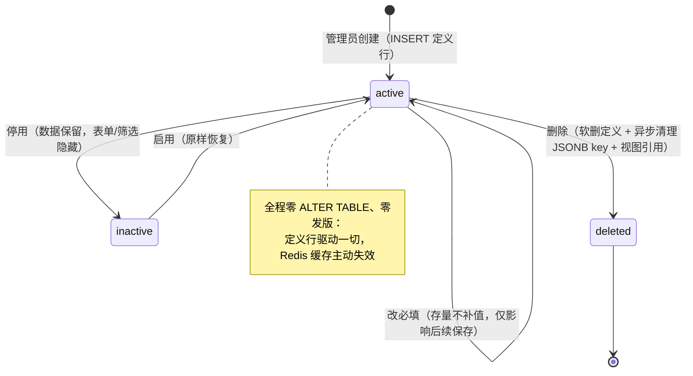
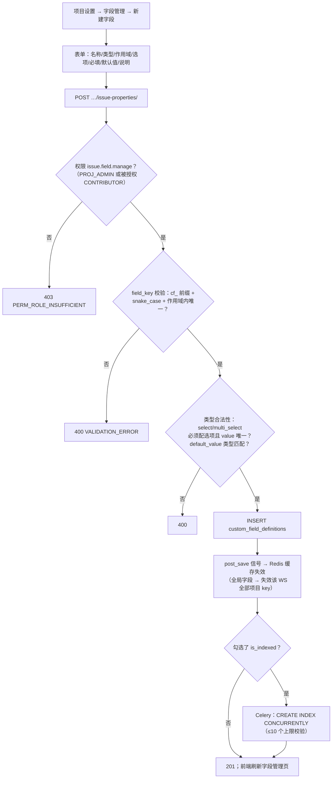
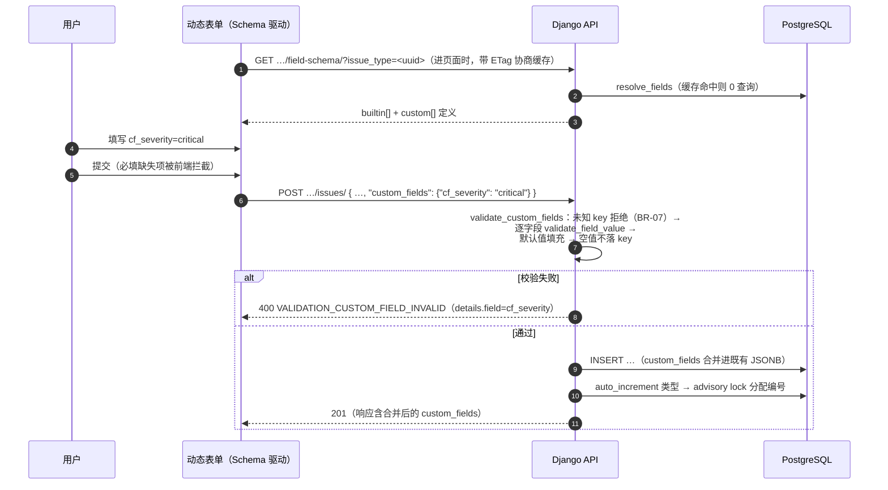
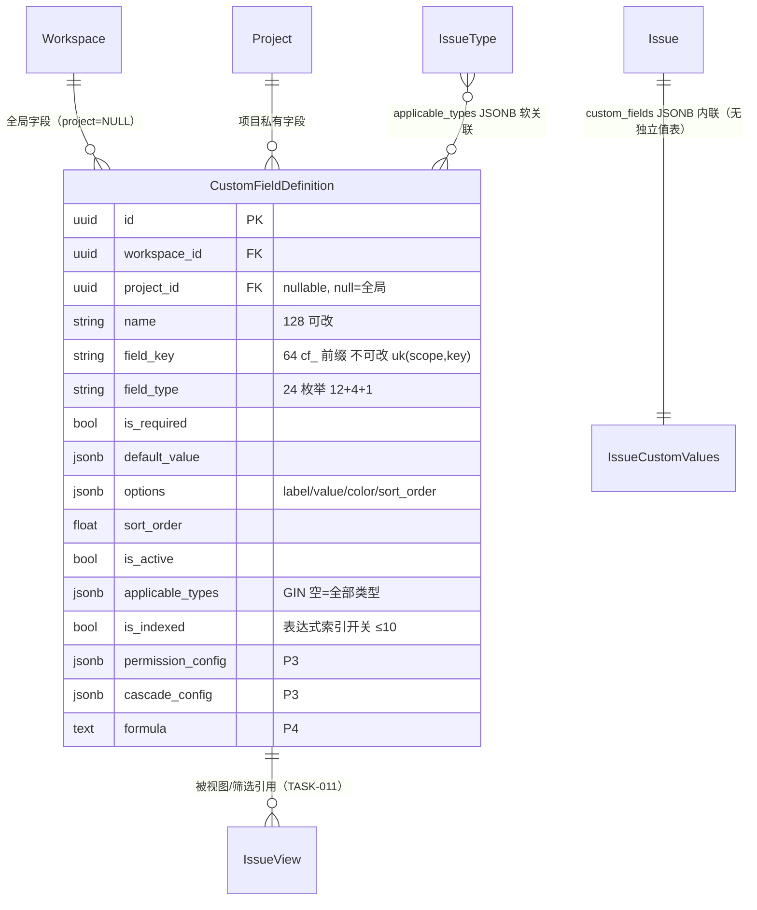

# 基础自定义字段动态增删

| 元信息项 | 内容 |
| --- | --- |
| 文档编号 | TASK-008 |
| 所属迭代 | Sprint 2 — 任务体系完善（第 4 周） |
| 优先级 | P2（标准版完整级 · **本迭代技术含量最高的功能**） |
| 所属模块 | M4-TASK｜任务核心 |
| 文档状态 | 待评审（Draft） |
| 最后更新日期 | 2026-09-01 |
| 上游依赖 | `INFRA-003`（`issues.custom_fields` JSONB 列 + GIN 索引 P0 已建）、`TASK-001/002`（Issue 写入路径与 Serializer）、`TASK-003`（列表列渲染与 `?property.` 筛选挂点）、`AUTH-005`（`issue.field.manage` 权限码门控） |
| 下游消费 | **`TASK-011`（全字段 AND/OR 组合筛选器——直接消费字段元数据与 Schema API）**、`BOARD-003`（看板按自定义字段分组）、`TASK-012`（P3 高级字段类型与字段权限）、`RPT-002`（按自定义字段聚合） |
| 上游依据 | `docs/需求文档.md` §3.4.2（动态自定义字段与全字段筛选体系）、§8.2 任务核心 P2 列（基础自定义字段）；§3.4.3 能力定论 |
| 关联架构文档 | **[`dynamic-fields-design.md`](../architecture/dynamic-fields-design.md)（全文——本文档是其 P2 切片的落地规格）**、[`unified-issue-model.md`](../architecture/unified-issue-model.md)（§2.8 `custom_fields` 列与 GIN）、[`api-conventions.md`](../architecture/api-conventions.md)（§2.5 `issue-properties/` 端点、§5.3 `?property.<id>=` 筛选、§8.4 `VALIDATION_CUSTOM_FIELD_INVALID`） |
| 对标基线 | Plane 开源版（**无自定义字段——本系统核心差异化**） · Ones Custom Issue Fields（12 种基础类型对标全集） |
| 工作量估算 | 后端 4 人日 / 前端 4 人日 / 联调与测试 2 人日，合计 **10 人日** |

---

## 1. 概述

### 1.1 功能定位

自定义字段是本系统相对 Plane 开源版的**头号差异化能力**：管理员在设置后台点几下，任务就多出「严重等级」「需求来源」「影响版本」这样的字段——不用改表、不用发版、立刻出现在新建弹窗、详情页、列表列与筛选器里。

P2 交付架构文档 [`dynamic-fields-design.md`](../architecture/dynamic-fields-design.md) 的**基础切片**，一句话概括技术本质：

> **字段的「定义」在 `custom_field_definitions` 配置表，字段的「值」在 `issues.custom_fields` JSONB 列（P0 已建 + GIN 已建），「表单 / 列表列 / 筛选控件」全部由前端读取 Schema API 后动态生成——任何一环都不含字段硬编码。**

| 目标（对齐架构文档 §1.1） | 验收标准 |
| --- | --- |
| G1 字段增删**零 DDL** | 增删改停用全程无 `ALTER TABLE`，`django migrate` 无新迁移 |
| G2 字段变更**零发版** | 后台保存 → 刷新页面即生效（Redis 缓存主动失效，§4.3.1） |
| G3 可视化配置 | 增删改停用 / 拖拽排序 / 选项颜色 / 作用域 / 必填 / 默认值 / 帮助说明 |
| G4 筛选联动 | 新字段自动出现在筛选器并按类型渲染控件（等值筛选本迭代；AND/OR 组合归 `TASK-011`） |
| G5 排序 / 分组联动 | 任意可排序字段作为 `order_by` 键；分组键从 `options` 生成（看板消费在 `BOARD-003`） |
| G7 性能 | 10 万 Issue / 单项目 1 万 / 20 字段 / 5 条混合筛选 P95 < 200ms |

### 1.2 P2 交付的 12 种基础类型

| field_type | 中文名 | 值的 JSONB 形态 | 表单控件 | 筛选控件（本迭代） |
| --- | --- | --- | --- | --- |
| `text` | 单行文本 | `string` | Input（≤512） | 文本包含 |
| `textarea` | 多行文本 | `string` | Textarea（≤20000） | 文本包含 |
| `number` | 数字 | `int/float`（不存字符串） | 数字输入 | 数字区间 |
| `select` | 单选下拉 | `string`（option 的 `value`） | 带色块下拉 | 多选等值（OR） |
| `multi_select` | 多选下拉 | `array<string>` | 带色块多选 | 包含任一/全部 |
| `date` | 日期 | `"YYYY-MM-DD"`（字典序=时间序） | DatePicker | 日期区间+快捷项 |
| `member` | 人员单选 | UUID `string` | 成员选择器 | 人员多选 |
| `member_multi` | 人员多选 | `array<UUID>` | 成员多选器 | 包含任一/全部 |
| `checkbox` | 复选框 | `boolean` | Switch | 三态（是/否/全部） |
| `url` | URL 链接 | `string`（http/https 校验） | Input + 跳转图标 | 文本包含 |
| `currency` | 金额 | `{"amount": number, "currency": "CNY"}` | 数字+币种 | 金额区间 |
| `auto_increment` | 自增编号 | `int`（服务端分配） | 只读展示 | 数字区间 |

**明确不在本迭代**（架构文档 §7 分层）：级联 `cascade`、关联 `relation`、日期区间 `date_range`、附件 `attachment`（P3 `TASK-012`）；公式 `formula`（P4）。这些类型的枚举值**已定义在 `FieldType` 中**（P2 建表即含），仅管理 UI 与校验器不开放——P3 激活零 DDL。

### 1.3 关键约定一：值的存储纪律

> ⚠️ 三条铁律，违反任何一条都会让 JSONB 方案腐化。

1. **key 带 `cf_` 前缀 + snake_case，创建后不可改**（`cf_severity`、`cf_business_value`）。改 key 等于丢数据；「字段名」（`name`）可随时改，改名不影响已存数据。
2. **值为空不写 key**（不是写 `null`）。`custom_fields ? 'cf_x'`（键存在）即「字段有值」；「字段为空」= `NOT (custom_fields ? 'cf_x')`。JSONB 体积与查询语义双收益。
3. **值用 JSON 原生类型**：数字存 number（保证 `->>` 转 numeric 可靠）、日期存 ISO 字符串（字典序即时间序）、选项存 `value` 不存 `label`（label 改名不迁移数据）。

### 1.4 关键约定二：作用域两級（对标 Ones 全局 + 项目覆盖）

| 作用域 | 判定 | 生效范围 |
| --- | --- | --- |
| Workspace 全局字段 | `project IS NULL` | 该工作空间**所有项目** |
| 项目私有字段 | `project = 具体项目` | 仅该项目 |

解析规则（架构文档 §3.3 `resolve_fields`）：项目私有字段**覆盖**同 `field_key` 的全局字段（同名时私有优先）；`applicable_types`（类型 UUID 列表，空=全部类型）再过滤「该类型可见哪些字段」——需求与缺陷字段集天然隔离。

### 1.5 范围边界

| 能力 | 本文档（P2） | 归属 |
| --- | --- | --- |
| 字段定义 CRUD + 停用 + 拖拽排序 | ✅ | — |
| 12 种基础类型的校验与存储 | ✅ | — |
| 作用域（全局/项目/类型）+ 必填 + 默认值 + 选项颜色 + 帮助说明 | ✅ | — |
| Schema API + Redis 缓存 + 变更主动失效 | ✅ | — |
| 动态表单（新建弹窗 / 详情侧栏）+ 动态列表列 | ✅ | — |
| 等值 / 包含 / 区间筛选（`?property.<id>=`） | ✅ | — |
| 字段删除的异步数据清理 + 视图引用清理 | ✅（任务就绪；视图清理随 `TASK-011` 视图上线激活） | — |
| `is_indexed` 表达式索引（CONCURRENTLY + 10 个上限） | ✅ | — |
| `auto_increment` 项目内连续编号 | ✅ | — |
| 自定义字段逐键 diff 入 Activity | ✅（`TASK-010` 管道消费） | — |
| AND/OR 嵌套组合筛选 DSL + Saved View | ❌ | `TASK-011`（Sprint 3） |
| 看板按自定义字段分组 | ❌（分组键生成函数本迭代交付，UI 归看板） | `BOARD-003` |
| 级联/关联/日期区间/附件类型 | ❌（枚举已占位） | P3 `TASK-012` |
| 字段级权限（只读/隐藏/必填按角色） | ❌（`permission_config` 列已建） | P3 `TASK-012` |
| 字段联动显隐 | ❌（`cascade_config` 列已建） | P3 |
| 公式字段 | ❌（`formula` 列已建） | P4 `TASK-014` |
| 全文搜索纳入（`is_searchable`） | ❌ | P2 末视性能评估 |

### 1.6 前置依赖

| 依赖 | 内容 | 阻塞原因 |
| --- | --- | --- |
| `INFRA-003` | `custom_fields jsonb NOT NULL DEFAULT '{}'` + `idx_issue_custom_fields`（GIN `jsonb_ops`）+ `pg_trgm` 扩展 | 存储与索引全就绪，本迭代零 `issues` 表 DDL |
| `TASK-001/002` | Issue 创建/更新路径、Serializer 白名单机制 | `custom_fields` 字段本迭代开放写入 |
| `TASK-003` | 列表列配置与 `?property.` 参数挂点 | 动态列与筛选消费 |
| `AUTH-005` | `issue.field.manage` 权限码 + `<PermissionGate>` | 管理入口门控 |
| `INFRA-004` | Celery + RabbitMQ 可用 | 异步清理与建索引任务 |

### 1.7 竞品参考

| 竞品 | 参考点 | 处置 |
| --- | --- | --- |
| Plane 开源版 | **完全没有**用户自定义字段（`Issue` 字段全部硬编码；社区高票诉求） | 本系统核心差异点：JSONB 方案 1/5 代码量覆盖 Ones 90% 场景（架构文档 §9.3） |
| Plane | `IssueView.filters` JSONB 但仅限内置字段枚举 | 我们的 filters DSL 直接携带 `cf_*` key（`TASK-011`） |
| Ones | Custom Issue Fields 全版本；作用域（类型/项目）；选项颜色；必填默认值 | **P2 对标全集**（12 类型逐一对齐） |
| Ones | Advanced Fields（级联/关联/公式/字段权限）Business+ | P3/P4 切片，列已预建 |

---

## 2. 业务逻辑

### 2.1 字段生命周期总览



### 2.2 创建字段（管理员视角）



### 2.3 用户填写字段值（任务表单路径）



### 2.4 业务规则汇总

| 编号 | 规则 | 判定位置 | 违反后果 |
| --- | --- | --- | --- |
| BR-01 | `field_key` 必须匹配 `cf_[a-z][a-z0-9_]{1,60}`；**创建后不可修改**（`save()` 比对原始值拒绝） | Model.clean | `400 VALIDATION_ERROR` |
| BR-02 | `field_key` 在作用域内唯一：全局字段 `(workspace, key WHERE project IS NULL)` / 私有字段 `(project, key)`（两条偏条件唯一约束） | DB 约束 + Service | `409 RESOURCE_ALREADY_EXISTS` |
| BR-03 | `select` / `multi_select` 必须配置 ≥1 个选项；每个选项 `label` 与 `value` 必填且 `value` 不重复 | Model.clean | `400` |
| BR-04 | 选项 `value` 创建后**不可修改**（数据存的是 value）；`label` / `color` / 排序可随时改 | Service | `400` |
| BR-05 | `default_value` 必须通过对应类型的值校验器 | Model.clean | `400` |
| BR-06 | **禁止修改 `field_type`**——类型变更等价于语义变更，无法安全转换存量数据；UI 不提供，Service 拒绝 | Service | `400` |
| BR-07 | 写入 `custom_fields` 的 key 必须在 `resolve_fields` 结果内（未知 key / 不适用当前类型的 key 一律拒绝）；空值不写 key | validate_custom_fields | `400 VALIDATION_CUSTOM_FIELD_INVALID` |
| BR-08 | 必填校验：`is_required` 字段缺值时保存任务被拒（**存量任务不追溯**——改必填仅影响后续保存，UI 提示「N 条历史数据缺该字段」） | validate_custom_fields | `400` + 缺失字段清单 |
| BR-09 | `auto_increment` 由服务端在任务创建时按 `(project, field_key)` advisory lock 分配（锁键混入 key 哈希，与 sequence_id 锁空间隔离）；客户端赋值被拒 | Service | `400` |
| BR-10 | 单 Workspace 最多 **50** 个启用字段；`is_indexed` 标记最多 **10** 个 | Service | `409 RESOURCE_LIMIT_EXCEEDED` |
| BR-11 | 删除字段 = 软删定义 + 异步分批清理 JSONB key（批 2000，GIN 加速扫描）+ 视图引用剔除（`TASK-011` 上线后激活） | Celery | — |
| BR-12 | 停用（`is_active=False`）：数据完整保留，表单/筛选器/列选择隐藏；重新启用原样恢复 | Service | — |
| BR-13 | 字段定义变更（增删改停用）→ `post_save/post_delete` 信号**主动失效** Redis 缓存；全局字段变更失效该 WS 全部项目 key | 信号 | — |
| BR-14 | `custom_fields` 逐键 diff 写 `IssueActivity(field='cf_<key>')`（old/new_value JSON 序列化） | `TASK-010` 管道 | — |
| BR-15 | 管理权限：`issue.field.manage`（默认 PROJ_ADMIN；可授权 CONTRIBUTOR）；全局字段额外要求 WS 级配置权 | Permission | `403` |

### 2.5 异常处理

| 场景 | HTTP | 错误码 | details 子码 | 前端表现 |
| --- | --- | --- | --- | --- |
| key 格式非法（无前缀/大写/短横线） | 400 | `VALIDATION_ERROR` | `INVALID` | 创建表单 key 输入行内红字（自动生成时不应出现） |
| key 作用域内重复 | 409 | `RESOURCE_ALREADY_EXISTS` | `UNIQUE` | 「已存在同名字段」 |
| select 无选项保存 | 400 | `VALIDATION_ERROR` | `REQUIRED` | 选项区红框 |
| 修改 field_type | 400 | `VALIDATION_ERROR` | `READ_ONLY` | 类型下拉创建后置灰 |
| 值类型不匹配（数字字段传文本） | 400 | `VALIDATION_CUSTOM_FIELD_INVALID` | `INVALID` | 表单字段下方红字 |
| 选项非法（值不在 options） | 400 | `VALIDATION_CUSTOM_FIELD_INVALID` | `NOT_A_CHOICE` | 列出可选值 |
| 必填缺失 | 400 | `VALIDATION_CUSTOM_FIELD_INVALID` | `REQUIRED` | 缺失字段标红聚焦 |
| 未知 key（绕过前端直写） | 400 | `VALIDATION_CUSTOM_FIELD_INVALID` | `INVALID` | —（安全兜底） |
| 日期格式非法 | 400 | `VALIDATION_CUSTOM_FIELD_INVALID` | `INVALID_DATE` | DatePicker 回弹 |
| URL 协议非法 | 400 | `VALIDATION_CUSTOM_FIELD_INVALID` | `INVALID_URL` | — |
| 超数量上限（50 字段 / 10 索引） | 409 | `RESOURCE_LIMIT_EXCEEDED` | `LIMIT` | 「请先停用其他字段」 |
| 成员字段指向非项目成员 | 400 | `VALIDATION_CUSTOM_FIELD_INVALID` | `DOES_NOT_EXIST` | 选择器本就限成员 |

### 2.6 边界条件

| 边界场景 | 限制值 | 超出处理 |
| --- | --- | --- |
| 单 Workspace 启用字段 | 50 | 409 |
| `is_indexed` 标记 | 10 | 409（提示先取消其他） |
| 文本长度 | text 512 / textarea 20000 / 选项 label 64 | 400 |
| 选项数 / 字段 | 100 | 400 |
| 单任务 custom_fields 体积 | 建议 < 2KB（TOAST 阈值监控，架构 §6.4） | 告警（textarea>4KB 拆表为 P3 预案） |
| 字段名长度 | 128 | 400 |
| 筛选嵌套（本迭代无 DSL） | — | `TASK-011` |

---

## 3. UI/UX 设计

### 3.1 字段管理页（项目设置 → 字段）

```
┌──────────────────────────────────────────────────────────────────────────────┐
│ 字段管理                                            [＋ 新建字段]  [排序 ▾]   │
├──────────────────────────────────────────────────────────────────────────────┤
│ ⠿ │ 严重等级              单选下拉   缺陷        已必填    ● 索引优化   [⋯]    │
│ ⠿ │ 影响版本              多选下拉   缺陷        —         —            [⋯]    │
│ ⠿ │ 需求来源              单选下拉   需求        有默认值  —            [⋯]    │
│ ⠿ │ 客户验收标准           多行文本   需求        —         —            [⋯]    │
│ ⠿ │ 合同金额              金额       需求        —         ● 索引优化   [⋯]    │
│ ─ │ 遗留-旧编号（已停用）   单行文本   全部类型    —    灰显 · 数据保留  [⋯]    │
└──────────────────────────────────────────────────────────────────────────────┘
  ⠿ = 拖拽把手（sort_order 浮点插值）   [⋯] = 编辑 / 停用·启用 / 删除
  顶部提示条： Workspace 全局字段 3 个 · 项目私有字段 5 个（折叠区切换查看）
```

| 元素 | 规格 |
| --- | --- |
| 列表 | 名称 / 类型中文 / 作用域（类型 chips）/ 必填·默认值标记 / 索引标记 / 操作 |
| 分区 | 「项目私有」默认展开；「继承自 Workspace」折叠区（只读 + 「在 Workspace 设置中管理」跳转，权限不足时） |
| 拖拽排序 | `pragmatic-drag-and-drop`；落位即 PATCH sort-order（浮点插值，复用 `BOARD-001` 算法） |
| 停用行 | `opacity-50` + 「数据保留」角标；启用一键恢复 |
| 删除确认 | 三段式（§3.3） |
| 上限提示 | 计数 `45/50`；≥45 变 amber |

### 3.2 新建 / 编辑字段弹层

```
┌──────────────────────────────────────────────────────────────┐
│ 新建字段                                                 ✕   │
│                                                                │
│ 字段名称   ┌────────────────────────────────────────┐         │
│           │ 严重等级                                 │        │
│           └────────────────────────────────────────┘         │
│ 字段标识   cf_severity  （系统按名称生成，创建后不可改）        │
│                                                                │
│ 字段类型   ┌──────────────┐  适用任务类型                       │
│           │ ●单选下拉  ▾ │  ☑ 全部  ☐需求  ☐缺陷  ☐任务 …    │
│           └──────────────┘  （12 类型宫格选择）                 │
│                                                                │
│ 选项（至少 1 项）                                               │
│ ┌──────────────────────────────────────────────┬─────┐       │
│ │ ● 致命     critical                            │ ⠿ ✕ │       │
│ │ ● 严重     major                               │ ⠿ ✕ │       │
│ │ ● 一般     minor                               │ ⠿ ✕ │       │
│ └──────────────────────────────────────────────┴─────┘       │
│ [＋ 添加选项]   ⓘ 存储值创建后不可改，显示名可改                 │
│                                                                │
│ ☐ 必填     默认值（可选）[— 无 —▾]   ☑ 建立索引优化              │
│ 帮助说明   ┌────────────────────────────────────────┐         │
│           │ critical 需 2 小时内响应                  │        │
│           └────────────────────────────────────────┘         │
│                                [取消]  [创建字段]              │
└──────────────────────────────────────────────────────────────┘
```

| 元素 | 规格 |
| --- | --- |
| 类型宫格 | 12 类型图标 + 名称；类型选定后表单下段按类型变形（选项区 / 日期格式 / 币种） |
| `field_key` | 按名称自动拼音转写生成，可改；失焦校验格式；**保存后置灰**（BR-01） |
| 选项行 | 色块（ColorPicker 12 预设，对比度 ≥4.5:1）+ 显示名 + 存储值（自动转写可改）+ 拖拽 + 删除 |
| 索引勾选 | 帮助气泡：「加速该字段的排序与范围查询；每个工作空间最多 10 个」 |
| 编辑态差异 | 名称/说明/选项颜色/排序/必填/默认值可改；**类型与 key 置灰**；删除选项 value 时提示「N 个任务仍在使用该值」 |

### 3.3 删除字段确认（三段式）

```
┌────────────────────────────────────────────────┐
│ ⚠ 删除字段「严重等级」？                           │
│                                                  │
│ 该字段当前：                                      │
│   · 被 1,284 个任务填写                          │
│   · 被 3 个视图引用（TASK-011 上线后）             │
│                                                  │
│ 删除后：                                          │
│   · 全部任务的该字段值将被异步清除（不可恢复）        │
│   · 引用它的视图将自动移除该条件                    │
│                                                  │
│ 请输入字段名确认：┌─────────────┐                 │
│                  │ 严重等级      │                 │
│                  └─────────────┘                 │
│                        [取消]  [确认删除]          │
└────────────────────────────────────────────────┘
```

| 元素 | 规格 |
| --- | --- |
| 影响统计 | 服务端回传：填写数（GIN `custom_fields ? key` 计数）+ 视图引用数 |
| 输入确认 | 输入 == 字段名才激活删除（高危规范） |
| 删除后 | 行消失；后台任务进度在「系统任务」查看（202 模式，`INFRA-004` §13.1） |

### 3.4 动态表单（新建弹窗 / 详情侧栏共用渲染器）

| 元素 | 规格 |
| --- | --- |
| 渲染顺序 | `sort_order`；超出首屏折叠为「更多属性 ▾」 |
| 必填标记 | 名称后 `*` 红；缺失时提交拦截并滚动聚焦第一个错误字段 |
| 帮助说明 | 名称旁 `?` 图标 hover tooltip（`description`） |
| 默认值 | 新建弹窗预填（member 类型默认 `@me` 可配置） |
| 选项色块 | select 值展示用 `options[].color` 左侧色条 |
| checkbox | Switch 控件 |
| auto_increment | 只读徽标「№ 128」，不可编辑 |
| 类型切换联动 | 新建弹窗切换 `issue_type` 时表单区即时重渲染（字段集不同） |

### 3.5 动态列表列

| 元素 | 规格 |
| --- | --- |
| 列选择器 | 「+ 添加列」列出全部字段（内置 + 自定义无差别） |
| 值渲染 | 按类型：select=色块文本 / member=头像 / date=yyyy-MM-dd / currency=¥1,234.00 / multi=chips 前2+N |
| 排序 | 列头点击 → `order_by=±cf_xxx`（§4.3.5 类型感知） |
| 筛选 | 列头筛选图标 → 按类型弹对应控件（§1.2 表）；`?property.<field_id>=` 参数化 |

### 3.6 空状态 / 加载 / 失败

| 场景 | 处置 |
| --- | --- |
| 无自定义字段 | 空态插画 + 「创建第一个字段」+ 3 个场景模板按钮（严重等级/需求来源/影响版本一键创建） |
| Schema 加载 | 表单区 3 行骨架（不阻塞内置字段渲染） |
| Schema 失败 | 显示内置字段 + 「自定义字段加载失败 · 重试」条 |
| 字段被停用但值存在 | 详情页该字段不渲染（数据在响应中，UI 过滤） |

### 3.7 响应式与无障碍

| 断点 | 布局 |
| --- | --- |
| ≥ 1280px | 管理页全列；表单单列侧栏 |
| 768~1279px | 管理页隐藏作用域列；表单字段两列网格 |
| < 768px | 管理页卡片化；表单单列 |

无障碍：动态控件 `aria-label` 用字段名；错误提示 `aria-describedby` 关联；色块不作为唯一信息（同显文本）；拖拽有键盘替代（行菜单「上移/下移」）。

---

## 4. 技术架构

### 4.1 数据模型

#### 4.1.1 `CustomFieldDefinition`（新表，完整落地架构文档 §3.1）

```python
# apps/api/plane/db/models/custom_field.py
import re

from django.contrib.postgres.indexes import GinIndex
from django.core.exceptions import ValidationError
from django.db import models

from plane.db.models.base import BaseModel


class CustomFieldDefinition(BaseModel):
    """字段定义元数据 —— 自定义字段的唯一真相来源

    作用域：project 为 NULL = Workspace 全局字段；否则项目私有字段。
    applicable_types 为空列表 = 对全部任务类型生效。
    P3/P4 扩展列（permission_config/cascade_config/formula）本迭代建列不启用。
    """

    class FieldType(models.TextChoices):
        TEXT = "text", "单行文本"
        TEXTAREA = "textarea", "多行文本"
        NUMBER = "number", "数字"
        SELECT = "select", "单选下拉"
        MULTI_SELECT = "multi_select", "多选下拉"
        DATE = "date", "日期"
        MEMBER = "member", "人员单选"
        MEMBER_MULTI = "member_multi", "人员多选"
        CHECKBOX = "checkbox", "复选框"
        URL = "url", "URL 链接"
        CURRENCY = "currency", "金额"
        AUTO_INCREMENT = "auto_increment", "自增编号"
        # ---- P3 企业版高级类型（建列即定义，管理 UI 不开放）----
        CASCADE = "cascade", "级联下拉"
        RELATION = "relation", "关联工作项"
        DATE_RANGE = "date_range", "日期区间"
        ATTACHMENT = "attachment", "附件"
        # ---- P4 ----
        FORMULA = "formula", "公式计算"

    MULTI_VALUE_TYPES = frozenset({FieldType.MULTI_SELECT, FieldType.MEMBER_MULTI,
                                   FieldType.ATTACHMENT})
    OPTION_REQUIRED_TYPES = frozenset({FieldType.SELECT, FieldType.MULTI_SELECT,
                                       FieldType.CASCADE})
    P2_ALLOWED_TYPES = frozenset(list(FieldType.values)[:12])   # 管理入口白名单

    workspace = models.ForeignKey("db.Workspace", on_delete=models.CASCADE,
                                  related_name="custom_field_definitions",
                                  verbose_name="所属工作空间")
    project = models.ForeignKey("db.Project", on_delete=models.CASCADE, null=True,
                                blank=True, related_name="custom_field_definitions",
                                verbose_name="所属项目",
                                help_text="为空表示 Workspace 全局字段")
    name = models.CharField(max_length=128, verbose_name="字段显示名")
    field_key = models.CharField(max_length=64, verbose_name="字段键名",
                                 help_text="cf_ 前缀 snake_case，创建后不可改")
    field_type = models.CharField(max_length=24, choices=FieldType.choices,
                                  verbose_name="字段类型")
    description = models.TextField(blank=True, verbose_name="帮助说明")
    is_required = models.BooleanField(default=False, verbose_name="是否必填")
    default_value = models.JSONField(null=True, blank=True, verbose_name="默认值")
    options = models.JSONField(default=list, blank=True, verbose_name="选项配置",
        help_text='[{"label":"高","value":"high","color":"#EF4444","sort_order":1}]')
    sort_order = models.FloatField(default=65535.0, verbose_name="显示排序")
    is_active = models.BooleanField(default=True, db_index=True, verbose_name="是否启用")
    applicable_types = models.JSONField(default=list, blank=True,
                                        verbose_name="适用任务类型（UUID 列表，空=全部）")
    is_indexed = models.BooleanField(default=False, verbose_name="建立表达式索引")
    is_searchable = models.BooleanField(default=False, verbose_name="纳入全文搜索")
    # ---- P3/P4 扩展列（建列不启用）----
    permission_config = models.JSONField(default=dict, blank=True)
    cascade_config = models.JSONField(default=dict, blank=True)
    formula = models.TextField(blank=True)

    class Meta(BaseModel.Meta):
        db_table = "custom_field_definitions"
        ordering = ("sort_order", "created_at")
        constraints = [
            models.UniqueConstraint(
                fields=["workspace", "field_key"],
                condition=models.Q(project__isnull=True, deleted_at__isnull=True),
                name="uniq_global_field_key_per_workspace"),
            models.UniqueConstraint(
                fields=["project", "field_key"],
                condition=models.Q(project__isnull=False, deleted_at__isnull=True),
                name="uniq_project_field_key"),
        ]
        indexes = [
            models.Index(fields=["workspace", "is_active", "sort_order"], name="idx_cfd_ws_active"),
            models.Index(fields=["project", "is_active", "sort_order"], name="idx_cfd_proj_active"),
            GinIndex(fields=["applicable_types"], name="idx_cfd_applicable_types"),
        ]

    def clean(self) -> None:
        if not re.fullmatch(r"cf_[a-z][a-z0-9_]{1,60}", self.field_key or ""):
            raise ValidationError({"field_key": "字段键名必须为 cf_ 前缀的 snake_case"})
        if self.field_type in self.OPTION_REQUIRED_TYPES and not self.options:
            raise ValidationError({"options": "该类型必须配置至少一个选项"})
        if self.options:
            values = [o.get("value") for o in self.options]
            if len(values) != len(set(values)) or any(
                    not v or not o.get("label") for v, o in zip(values, self.options)):
                raise ValidationError({"options": "选项 value 唯一且 label/value 必填"})
        if self.default_value is not None:
            validate_field_value(self, self.default_value)       # 复用值校验器

    def save(self, *args, **kwargs):
        if self.pk:  # field_key 与 field_type 不可变（BR-01/BR-06）
            orig = type(self).all_objects.values_list("field_key", "field_type") \
                             .get(pk=self.pk)
            if orig != (self.field_key, self.field_type):
                raise ValidationError("字段键名与类型创建后不可修改")
        self.full_clean()
        super().save(*args, **kwargs)
```



> **值表不存在**——值内联在 `issues.custom_fields`（P0 已建列 + GIN 已建），`options` 内联在定义行。这正是「零 DDL」的来源（架构文档 §3.2 图示说明原文）。

#### 4.1.2 迁移

```python
# apps/api/plane/db/migrations/00XX_p2_custom_fields.py
class Migration(migrations.Migration):
    dependencies = [("db", "00XX_p2_worklog")]
    operations = [
        migrations.CreateModel(...),   # §4.1.1 完整定义（新表，无并发风险）
        # 无任何对 issues 表的 DDL —— custom_fields 列与 GIN 索引 P0 已建
    ]
```

#### 4.1.3 消费的既有索引

| 对象 | 服务的查询 | 说明 |
| --- | --- | --- |
| `issues.custom_fields` GIN（`jsonb_ops`） | `@>` 等值/包含、`?` 键存在 | P0 已建；选 `jsonb_ops` 而非 `path_ops` 因需支持 `?`（架构 §2.3） |
| 表达式偏索引（按需 CONCURRENTLY 建） | 范围比较 / ORDER BY | §4.3.4 |

### 4.2 API 定义

| # | 方法 | 路径 | 描述 | 权限 | 成功码 |
| --- | --- | --- | --- | --- | --- |
| 1 | `GET` | `…/projects/{project_id}/field-schema/?issue_type=<uuid>` | **Schema API**：内置 + 自定义字段定义 | `PROJ_VIEWER`(5)+ | `200` |
| 2 | `GET` | `…/projects/{project_id}/issue-properties/` | 字段定义列表（管理页；`?scope=all\|global\|project`） | `issue.field.manage` | `200` |
| 3 | `POST` | `…/projects/{project_id}/issue-properties/` | 创建项目私有字段 | `issue.field.manage` | `201` |
| 4 | `PATCH` | `…/issue-properties/{property_id}/` | 编辑（名/说明/选项色/必填/默认/停用） | `issue.field.manage` | `200` |
| 5 | `DELETE` | `…/issue-properties/{property_id}/` | 删除（软删 + 异步清理） | `issue.field.manage` | `202` |
| 6 | `PATCH` | `…/issue-properties/{property_id}/sort-order/` | 拖拽排序（`prev_id`/`next_id` 插值） | `issue.field.manage` | `200` |
| 7 | `PATCH`/`GET` | `…/issues/{issue_id}/` | 开放 `custom_fields` 对象字段读写（值路径） | `issue.update` | `200` |
| 8 | `GET\|POST` | `/api/v1/workspaces/{slug}/issue-properties/` | 全局字段管理（额外要求 WS 级配置权） | WS Admin | `200`/`201` |
| 9 | `GET` | `…/issues/?property.<property_id>=<value>` | 等值/包含筛选（api-conventions §5.3 冻结语法） | `PROJ_VIEWER`(5)+ | `200` |

#### 4.2.1 `GET …/field-schema/` — Schema API（核心契约）

**请求**

```http
GET /api/v1/workspaces/acme/projects/7b3e9c1a-.../field-schema/?issue_type=9d8e4f2a-... HTTP/1.1
If-None-Match: W/"cfd-v3-1725177600"
```

**成功响应 `200`**（ETag 协商缓存：定义变更即失效，未变返回 `304`）

```json
{
  "status": "success",
  "data": {
    "builtin": [
      { "key": "name", "name": "标题", "type": "text",
        "filterable": true, "sortable": true, "groupable": false },
      { "key": "state", "name": "状态", "type": "select_ref",
        "filterable": true, "sortable": true, "groupable": true,
        "options": [{ "label": "待办", "value": "<state-uuid>", "color": "#9CA3AF",
                      "group": "unstarted" }] },
      { "key": "priority", "name": "优先级", "type": "select",
        "filterable": true, "sortable": true, "groupable": true,
        "options": [{ "label": "紧急", "value": "urgent", "color": "#EF4444" }] }
    ],
    "custom": [
      { "id": "4f8a9b2c-1d3e-4f5a-8b9c-0d1e2f3a4b5c",
        "key": "cf_severity", "name": "严重等级", "type": "select",
        "required": true, "description": "critical 需 2 小时内响应",
        "scope": "project", "sort_order": 1000,
        "options": [
          { "label": "致命", "value": "critical", "color": "#DC2626", "sort_order": 1 },
          { "label": "严重", "value": "major",    "color": "#F59E0B", "sort_order": 2 },
          { "label": "一般", "value": "minor",    "color": "#3B82F6", "sort_order": 3 }
        ],
        "filterable": true, "sortable": true, "groupable": true, "indexed": true },
      { "id": "5a9b0c3d-2e4f-4a6b-9c0d-1e2f3a4b5c6d",
        "key": "cf_affected_versions", "name": "影响版本", "type": "multi_select",
        "required": false, "scope": "project", "sort_order": 2000,
        "options": [{ "label": "v2.2.1", "value": "v2.2.1" },
                    { "label": "v2.2.2", "value": "v2.2.2" }],
        "filterable": true, "sortable": false, "groupable": true, "indexed": false }
    ]
  },
  "meta": { "etag": "W/\"cfd-v4-1725178234\"", "generated_at": "2026-09-01T07:30:34.000Z" }
}
```

**契约冻结条款**（`TASK-011` / `BOARD-003` / 动态表单三方依赖）：

1. `builtin[]` 与 `custom[]` 分列；`custom[].key` 恒有 `cf_` 前缀，`id` 恒下发（`?property.<id>` 筛选与 DSL 引用都用它）；
2. `filterable / sortable / groupable` 由后端按类型推导（多值类型不可排序、text 不可分组等），前端不得自行推断；
3. `options` 的 `value` 稳定、`label/color` 可变——前端缓存以 `etag` 为准。

#### 4.2.2 `POST …/issue-properties/` — 创建字段

**请求**

```json
{
  "name": "严重等级",
  "field_key": "cf_severity",
  "field_type": "select",
  "is_required": true,
  "default_value": null,
  "description": "critical 需 2 小时内响应",
  "applicable_types": ["9d8e4f2a-1b3c-4d5e-8f9a-0a1b2c3d4e5f"],
  "options": [
    { "label": "致命", "value": "critical", "color": "#DC2626", "sort_order": 1 },
    { "label": "严重", "value": "major",    "color": "#F59E0B", "sort_order": 2 },
    { "label": "一般", "value": "minor",    "color": "#3B82F6", "sort_order": 3 }
  ],
  "is_indexed": true
}
```

**成功响应 `201`**：完整定义对象（同 Schema API `custom[]` 项结构）。

**失败响应 `409`（key 重复）**

```json
{
  "status": "error",
  "error": {
    "code": "RESOURCE_ALREADY_EXISTS",
    "message": "已存在同名字段",
    "details": [{ "field": "field_key", "code": "UNIQUE",
                  "message": "cf_severity 已在本项目定义" }],
    "request_id": "01JCB8X3R6BU1S3T9Z7A0C2D5E"
  }
}
```

**失败响应 `400`（值校验——用户填值路径）**

```json
{
  "status": "error",
  "error": {
    "code": "VALIDATION_CUSTOM_FIELD_INVALID",
    "message": "自定义字段值不符合定义",
    "details": [{ "field": "cf_severity", "code": "NOT_A_CHOICE",
                  "message": "非法选项 blocker，可选值：critical / major / minor" }],
    "request_id": "01JCB8X3R6BU1S3T9Z7A0C2D5F"
  }
}
```

#### 4.2.3 `DELETE …/issue-properties/{id}/` — 删除（异步）

**成功响应 `202 Accepted`**

```json
{
  "status": "success",
  "data": {
    "task_id": "01JCB8X4T7CV2T4U0A8B1D3E6F",
    "state": "queued",
    "affected_issues": 1284,
    "status_url": "/api/v1/tasks/01JCB8X4T7CV2T4U0A8B1D3E6F/"
  }
}
```

> 删除立即生效于 Schema（缓存失效），数据清理异步执行（§4.3.3）——期间旧值残留在 JSONB 但无任何读取路径可见，最终一致。

#### 4.2.4 值读写（Issue PATCH 开放）

```json
// PATCH …/issues/8a1f…/
{ "custom_fields": { "cf_severity": "major", "cf_prd_link": "https://wiki.example.com/prd/42" } }
// 200 data 片段：
// "custom_fields": { "cf_severity": "major",
//                    "cf_prd_link": "https://wiki.example.com/prd/42",
//                    "cf_affected_versions": ["v2.2.1"] }   ← 未提交的既有 key 保留（合并语义）
```

> **PATCH 合并语义**：请求体中的 key 覆盖、未提及的 key 保留；显式清空传 `"cf_x": null`（校验器转删除该 key）。

#### 4.2.5 筛选（本迭代等值/包含层）

```http
GET …/issues/?property.4f8a9b2c-…=critical&state_id=…&order_by=-cf_severity&per_page=50
```

| 语法 | 语义 | 编译结果 |
| --- | --- | --- |
| `?property.<id>=v` | 等值 | `custom_fields @> '{"cf_x":"v"}'`（GIN） |
| `?property.<id>=v1,v2` | IN（OR） | 多个 `@>` OR |
| `?property.<id>=null` | 字段为空 | `NOT (custom_fields ? 'cf_x')`（须与其他条件 AND，§4.3.6） |
| `?order_by=±cf_x` | 排序 | 类型感知表达式（§4.3.5） |

> AND/OR 嵌套组合、Saved View、`@me`/`today` 占位符 = `TASK-011` 的 FilterCompiler 全量交付；本迭代的编译函数是其**同一模块的子集**（`filters/compiler.py` 同一入口），不另起炉灶。

### 4.3 核心逻辑

#### 4.3.1 作用域解析与缓存（「零发版即刻生效」的关键）

```python
# apps/api/plane/db/services/field_schema.py
FIELD_SCHEMA_CACHE_KEY = "field_schema:v1:{workspace_id}:{project_id}"


def resolve_fields(project: Project,
                   issue_type_id: uuid.UUID | None = None) -> list[CustomFieldDefinition]:
    """解析某项目（可选某类型）生效的字段：
    全局 ∪ 项目私有，同 key 私有覆盖全局（对标 Ones 两级治理）。"""
    definitions = CustomFieldDefinition.objects.filter(
        workspace_id=project.workspace_id, is_active=True,
    ).filter(models.Q(project__isnull=True) | models.Q(project_id=project.id))
    merged: dict[str, CustomFieldDefinition] = {}
    for d in sorted(definitions, key=lambda x: (x.sort_order, x.created_at)):
        existing = merged.get(d.field_key)
        if existing is None or d.project_id is not None:
            merged[d.field_key] = d
    result = list(merged.values())
    if issue_type_id is not None:                               # 类型作用域过滤
        t = str(issue_type_id)
        result = [d for d in result if not d.applicable_types or t in d.applicable_types]
    return sorted(result, key=lambda d: (d.sort_order, d.created_at))


def get_cached_schema(project: Project) -> list[dict]:
    key = FIELD_SCHEMA_CACHE_KEY.format(workspace_id=project.workspace_id,
                                        project_id=project.id)
    cached = cache.get(key)
    if cached is None:
        cached = CustomFieldDefinitionSerializer(resolve_fields(project), many=True).data
        cache.set(key, cached, timeout=3600)
    return cached


@receiver([post_save, post_delete], sender=CustomFieldDefinition)
def invalidate_field_schema_cache(instance, **kwargs):
    """BR-13：定义变更 → 主动失效。全局字段 → 该 WS 全部项目 key 一并失效。"""
    if instance.project_id:
        cache.delete(FIELD_SCHEMA_CACHE_KEY.format(
            workspace_id=instance.workspace_id, project_id=instance.project_id))
    else:
        pids = Project.objects.filter(workspace_id=instance.workspace_id) \
                              .values_list("id", flat=True)
        cache.delete_many([FIELD_SCHEMA_CACHE_KEY.format(
            workspace_id=instance.workspace_id, project_id=p) for p in pids])
```

#### 4.3.2 值校验器（12 类型全覆盖）

```python
# apps/api/plane/db/services/field_validation.py —— 完整实现架构文档 §3.4
def validate_field_value(definition: CustomFieldDefinition, value: Any) -> Any:
    """校验并规范化单值 → 可直接写入 JSONB 的对象；失败抛 ValidationError。
    关键分支：
    - None/""：required 则拒；否则返回 None（不落 key，BR-07）
    - text/textarea：str + 长度 512/20000
    - number：拒 bool、要 int/float
    - select：value ∈ options.values
    - multi_select：list ⊆ options.values，去重保序
    - date：date.fromisoformat 校验（YYYY-MM-DD）
    - member：is_project_member 校验
    - member_multi：逐个成员校验 + dict.fromkeys 去重
    - checkbox：严格 bool
    - url：URLValidator(schemes=["http","https"])
    - currency：{"amount": number, "currency": "CNY"}
    - auto_increment：拒客户端赋值（BR-09）
    """
    ...


def validate_custom_fields(project, issue_type_id, payload: dict) -> dict:
    """整体校验：未知 key 拒绝（BR-07）→ 逐字段校验 → 默认值填充 → 空值不落 key。"""
    definitions = {d.field_key: d for d in resolve_fields(project, issue_type_id)}
    unknown = set(payload) - set(definitions)
    if unknown:
        raise ValidationError(
            {"custom_fields": f"未定义或不适用于当前类型的字段：{sorted(unknown)}"})
    cleaned: dict[str, Any] = {}
    for key, d in definitions.items():
        if key in payload:
            value = validate_field_value(d, payload[key])
        elif d.default_value is not None:
            value = d.default_value
        elif d.is_required:
            raise ValidationError({key: f"「{d.name}」为必填字段"})   # BR-08
        else:
            continue
        if value is not None:
            cleaned[key] = value
    return cleaned
```

#### 4.3.3 删除的异步清理（分批 + GIN 加速）

```python
# apps/api/plane/bgtasks/field_cleanup.py
@shared_task(bind=True, max_retries=3)
def cleanup_deleted_field_values(self, definition_id: str, batch_size: int = 2000) -> int:
    """BR-11：删除字段后清理 JSONB 残留 key —— 分批 UPDATE，避免长事务与 WAL 洪峰。

    custom_fields ? 'cf_x' 走 GIN 索引 → 每批 SELECT 是索引扫描而非全表；
    用 jsonb 的 - 操作符移除 key，GIN 随之更新。
    """
    d = CustomFieldDefinition.all_objects.get(id=definition_id)
    scope_sql, params = _scope_clause(d)       # 全局→按 workspace；私有→按 project
    total = 0
    while True:
        with connection.cursor() as cursor:
            cursor.execute(f"""
                WITH target AS (
                    SELECT id FROM issues
                     WHERE {scope_sql} AND custom_fields ? %s
                       AND deleted_at IS NULL LIMIT %s)
                UPDATE issues i SET custom_fields = i.custom_fields - %s,
                       updated_at = now() FROM target t WHERE i.id = t.id""",
                [*params, d.field_key, batch_size, d.field_key])
            affected = cursor.rowcount
        total += affected
        if affected < batch_size:
            break
    return total


@shared_task
def prune_views_referencing_field(definition_id: str) -> int:
    """视图引用剔除（降级而非报错）：TASK-011 视图上线后激活；
    本迭代预置任务体（移除 filters/display_props 中的 key 引用并打提示标记）。"""
    ...
```

#### 4.3.4 表达式索引（CONCURRENTLY + 10 上限）

```python
# apps/api/plane/bgtasks/field_index.py
@shared_task(bind=True, max_retries=2)
def ensure_field_expression_index(self, definition_id: str) -> str:
    """为 is_indexed 字段创建表达式偏索引 —— 仅索引「有值的行」（架构 §6.2）。

    CONCURRENTLY 不能在事务内执行 → autocommit 连接；
    索引名 = field_key 的 md5 前 16 位（幂等且 ≤63 字符标识符上限）。
    """
    d = CustomFieldDefinition.objects.get(id=definition_id, is_indexed=True)
    if (CustomFieldDefinition.objects
            .filter(workspace_id=d.workspace_id, is_indexed=True,
                    deleted_at__isnull=True).count() > 10):     # BR-10
        raise LimitExceeded(limit=10)
    name = f"idx_issue_cf_{hashlib.md5(d.field_key.encode()).hexdigest()[:16]}"
    expr = _index_expression_for(d)   # number→::numeric；date→文本直排；currency→#>> 路径
    with connection.cursor() as cursor:
        cursor.execute("SET LOCAL statement_timeout = 0")
        cursor.execute(
            f"""CREATE INDEX CONCURRENTLY IF NOT EXISTS {name} ON issues ({expr})
                WHERE custom_fields ? %s AND deleted_at IS NULL""", [d.field_key])
    return name


@shared_task
def drop_field_expression_index(field_key: str) -> None:
    """取消勾选 / 删除字段时 CONCURRENTLY 删除索引。"""
    name = f"idx_issue_cf_{hashlib.md5(field_key.encode()).hexdigest()[:16]}"
    with connection.cursor() as cursor:
        cursor.execute(f"DROP INDEX CONCURRENTLY IF EXISTS {name}")
```

> 这是**索引 DDL 而非表结构 DDL**：不改变列定义、不需要 migration、CONCURRENTLY 不阻塞读写——不违反 G1「零 ALTER TABLE」，且是可选性能项，不是字段生效前提（架构文档 §6.2 论证原文）。

#### 4.3.5 类型感知排序编译

```python
# apps/api/plane/app/filters/compiler.py（本迭代交付子集；TASK-011 扩全量 DSL）
ORDER_EXPRESSIONS = {
    "number":         "(custom_fields->>%s)::numeric",
    "auto_increment": "(custom_fields->>%s)::bigint",
    "currency":       "(custom_fields#>>ARRAY[%s,'amount'])::numeric",
    "date":           "custom_fields->>%s",        # ISO 字符串字典序 = 时间序
    "select":         None,                        # 特例：按选项配置序
}


def order_by_custom(queryset, definition: CustomFieldDefinition, desc: bool):
    if definition.field_type == "select":
        values = [o["value"] for o in sorted(definition.options,
                                             key=lambda o: o.get("sort_order", 0))]
        expr = RawSQL("array_position(ARRAY[%s]::text[], custom_fields->>%s)",
                      [values, definition.field_key],
                      output_field=models.IntegerField())          # 选项配置序，非字典序
    else:
        expr = RawSQL(ORDER_EXPRESSIONS[definition.field_type] + (" DESC" if desc else ""),
                      [definition.field_key])
    return queryset.order_by(expr, "-created_at", "-id")          # NULLS 默认末位 + 游标稳定键
```

#### 4.3.6 查询编译与执行计划（等值层）

```python
def filter_by_property(queryset, definition: CustomFieldDefinition, raw: str) -> QuerySet:
    """?property.<id>= 语法 → GIN 友好查询（架构 §4.2/§4.3）。

    等值/IN 全部编译为 @>（GIN 单次 bitmap）；「为空」= NOT has_key，
    硬约束：必须与其他可索引条件 AND（调用方保证——FilterSet 先应用
    project_id 等，杜绝跨项目 NOT 键存在全表扫描）。
    """
    if raw == "null":
        return queryset.exclude(custom_fields__has_key=definition.field_key)
    values = raw.split(",")
    if definition.field_type in CustomFieldDefinition.MULTI_VALUE_TYPES:
        q = Q()
        for v in values:
            q |= Q(**{f"custom_fields__{definition.field_key}__contains": [v]})
        return queryset.filter(q)
    q = Q()
    for v in values:
        q |= Q(**{f"custom_fields__{definition.field_key}": _coerce(definition, v)})
    return queryset.filter(q)
```

期望执行计划（10 万行、填充率 30%，等值双条件经合并优化为单 `@>`）：

```
Bitmap Heap Scan on issues
  Recheck Cond: custom_fields @> '{"cf_severity":"critical","cf_found_env":"production"}'
  ->  Bitmap Index Scan on idx_issue_custom_fields      ← GIN bitmap AND
Filter: (project_id = … AND deleted_at IS NULL AND archived_at IS NULL)
```

#### 4.3.7 `auto_increment` 分配

```python
# 复用 advisory lock 范式（unified-issue-model §3）；锁键 = 双 32 位 (project, crc32(key))，
# 与 sequence_id 的锁空间天然隔离（架构文档 §4.4 原文实现）
def next_auto_increment(project_id: uuid.UUID, field_key: str) -> int:
    with connection.cursor() as cursor:
        cursor.execute("SELECT pg_advisory_xact_lock(%s, %s)",
                       [_int32(project_id.int), _int32(zlib.crc32(field_key.encode()))])
        cursor.execute("""
            SELECT COALESCE(MAX((custom_fields->>%s)::bigint), 0) + 1 FROM issues
             WHERE project_id = %s AND custom_fields ? %s""",
                       [field_key, str(project_id), field_key])
        return cursor.fetchone()[0]
```

### 4.4 前端实现

#### 4.4.1 `FieldSchemaStore`（`packages/shared-state`）

```typescript
// packages/shared-state/src/field-schema.store.ts
export class FieldSchemaStore {
  // SWR key: `project:{id}:field-schema`（ETag 协商；revalidateOnFocus 关闭——定义低频变）
  @observable schemaByProject = observable.map<string, FieldSchema>();

  /** 按 key 取定义（表单渲染器 / 列渲染器 / 筛选器统一入口） */
  definition(projectId: string, key: string): FieldDefinition | undefined {
    return this.schemaByProject.get(projectId)?.custom.find((f) => f.key === key);
  }

  /** 控件映射表 —— 「新增字段自动出现在表单与筛选器」的全部秘密（零字段硬编码） */
  controlFor(def: FieldDefinition) {
    return CONTROL_REGISTRY[def.type];   // text→Input, select→ColoredSelect, member→MemberPicker…
  }
}
```

- **缓存失效前端半边**：管理操作成功后 `mutate(projectKey)` 主动刷新 Schema——与后端 Redis 失效共同构成「零发版生效」。
- **动态表单渲染器** `DynamicFieldForm`：输入 `FieldDefinition[]`，按 `sort_order` 渲染 `CONTROL_REGISTRY` 控件；必填/默认值/帮助说明/错误映射（`details[].field` = key → 控件 error slot）。
- **动态列渲染器** `CustomColumnCell`：同 registry 的只读变体（select→色块、member→头像、multi→chips）。

#### 4.4.2 管理页交互细节

- 拖拽排序走 `PATCH …/sort-order/`（服务端浮点插值——与看板同算法同服务）。
- 类型宫格选中后表单变形动画；`auto_increment` 类型选项区隐藏、必填强制关。
- 删除弹层输入确认（§3.3）；`202` 后顶部黄条显示后台任务进度链接。

---

## 5. 测试用例

### 5.1 单元测试

| 用例 ID | 测试目标 | 输入 | 预期输出 | 覆盖类型 |
| --- | --- | --- | --- | --- |
| UT-01 | key 格式全分支 | 无前缀/大写/短横线/超 64 | 全部 400 | 边界 |
| UT-02 | key 创建后不可改 | PATCH 改 key | 拒绝（BR-01） | 异常 |
| UT-03 | 类型不可改 | PATCH 改 field_type | 拒绝（BR-06） | 异常 |
| UT-04 | 选项 value 唯一 | 两个 critical | 400 | 异常 |
| UT-05 | 12 类型值校验逐类 | 每类型 合法/非法/空 三组 | 36 断言全过 | 正常 |
| UT-06 | 未知 key 拒绝 | payload 含 cf_hack | 400（BR-07） | 安全 |
| UT-07 | 类型作用域 | 字段限 bug，需求任务提交 | 400 | 边界 |
| UT-08 | 默认值填充 | 新建未传、字段有默认 | 落库含默认值 | 正常 |
| UT-09 | 空值不落 key | 传 null | JSONB 无该 key | 边界 |
| UT-10 | 必填存量不追溯 | 改必填后旧任务保存他字段 | 通过（仅新保存拦缺失） | 边界 |
| UT-11 | 私有覆盖全局 | 同 key 双定义 | resolve 取私有 | 正常 |
| UT-12 | auto_increment 拒赋值 | 客户端传 999 | 400（BR-09） | 安全 |
| UT-13 | auto_increment 并发 | 并发创建 10 任务 | 编号 1~10 无重 | 并发 |
| UT-14 | 缓存失效 | 全局字段改名 | 该 WS 全部项目 schema 缓存被清（BR-13） | 正常 |
| UT-15 | 数量上限 | 第 51 个字段 / 第 11 个索引 | 409 | 边界 |
| UT-16 | 逐键 diff | 改 2 个自定义字段 | 2 条 Activity(field=cf_*) | 正常 |

### 5.2 集成测试

| 用例 ID | 场景 | 前置条件 | 操作步骤 | 预期结果 |
| --- | --- | --- | --- | --- |
| IT-01 | 零 DDL 全程 | 干净库 | 增→改→停→删字段 | `django migrate` 无新迁移文件（G1 断言） |
| IT-02 | 零发版生效 | 已打开列表页 | 另一会话建字段，原页面刷新 | 新列/新筛选控件出现（G2/G4） |
| IT-03 | GIN 等值筛选 | 10 万 Issue、20 字段、5 条混合条件 | `EXPLAIN ANALYZE` + 计时 | 走 `idx_issue_custom_fields`；P95 < 200ms（G7 门禁） |
| IT-04 | 为空筛选安全 | 仅 `property.x=null` 无其他条件 | 直连 | 400（强制组合其他条件，§4.3.6） |
| IT-05 | 删除清理 | 5 万条含该字段值 | DELETE + 轮询任务 | JSONB key 全清；每批 2000；无长事务 |
| IT-06 | 索引任务 | 标记 is_indexed | Celery 执行 | `CONCURRENTLY` 建成；重复执行幂等 |
| IT-07 | 排序正确性 | 数字字段值 9/10/100 | order_by | 9<10<100（::numeric，非字典序） |
| IT-08 | 选项配置序排序 | select 自定义顺序 B,A,C | order_by | 按配置序非字典序 |
| IT-09 | Schema ETag | 二次请求带 If-None-Match | 定义未变 / 变更 | 304 / 200 新 etag |
| IT-10 | 权限矩阵 | CONTRIBUTOR 无授权建字段 | POST | 403（BR-15） |

### 5.3 E2E 测试

| 用例 ID | 用户场景 | 操作路径 | 验收标准 |
| --- | --- | --- | --- |
| E2E-01 | 五分钟上线一个字段 | 管理页创建「严重等级」（select，3 选项，必填，索引） | 新建弹窗/详情/列表列/筛选器四处即现；必填拦截生效 |
| E2E-02 | 改名不迁数据 | 改 label「致命→致命(P0)」 | 存量值显示新 label，value 不变 |
| E2E-03 | 类型隔离 | 字段限缺陷类型 | 需求表单无该字段；直连提交 400 |
| E2E-04 | 停用与恢复 | 停用→查任务→启用 | 停用期 UI 隐藏但数据保留；启用即恢复显示 |
| E2E-05 | 删除全链路 | 删除有 1284 值的字段（输入确认） | 202→任务进度→完成后旧值清除、Schema 无此字段 |
| E2E-06 | 筛选联动 | `?property.<id>=critical,major` + 排序 | 结果精确；刷新还原（URL 同源） |

---

## 6. 竞品深度对标

### 6.1 Plane 实现分析

- **事实**（架构文档 §9.1 实证）：开源版 `Issue` 模型字段全部系统内置硬编码；`IssueView.filters`/`display_filters` 是 JSONB 但可选字段限于内置枚举；多处 JSONB（view_props、progress_snapshot、description）**没有一处用于业务字段扩展**；Issue Type 是 Pro 特性且无自定义字段。社区「custom fields」为高票长期诉求。
- **用户现状**：要「严重等级」只能滥用 Label（无必填/无排序/无类型语义）、写进描述（不可筛选）、或 fork 建列（每次改都 migration + 发版）。
- **本系统对位**：JSONB + 配置表方案用约 1/5 于 Ones 重型方案的代码量覆盖 90% 场景（架构 §9.3 判断），并且与 Plane 完全相同的技术栈让社区方案可平移——「对标 Plane 的完整开源能力 + 对标 Ones 的企业级自定义字段」是可直接对外宣传的差异点。

### 6.2 Ones 实现分析

- Custom Issue Fields（全版本）：12 种基础类型、作用域（类型/项目）、必填默认值、选项颜色——本迭代逐项对齐（§1.2 表）。
- 边界：Advanced Fields（级联/关联/公式/字段权限/联动/自定义布局）锁在 Business+。本系统把 P3/P4 的**列**在 P2 一并建好（`permission_config`/`cascade_config`/`formula`），升级零 DDL——这是「先建列后启用」原则在配置表上的复用。

### 6.3 本系统设计决策

1. **元数据驱动一以贯之**：定义在表、值在 JSONB、渲染在 Schema——`CONTROL_REGISTRY` 是前端唯一「知道」字段类型的地方，其余全部数据驱动。这保证 G4「筛选器全自动联动」不是靠维护映射文档，而是结构上不可能漏。
2. **缓存主动失效优于短 TTL**：字段定义读极多写极少，1h TTL + 写时失效的组合让「保存即生效」与「零查询开销」兼得（UT-14 锚定）。
3. **删除是三段式而非软删了事**：定义软删（可审计）+ JSONB 异步清理（分批 GIN 扫描）+ 视图引用剔除（降级不报错）——三件事各有各的一致性时序，全部异步且幂等。
4. **索引是可选项且有硬上限**：10 个 `is_indexed` 上限把写入放大锁死在 10-15%（架构 §6.5 实测量级），把「要不要索引」变成管理员的可理解决策而非默认负担。
5. **编译器同源分批交付**：本迭代的 `?property.` 编译与 `TASK-011` 的 FilterCompiler 是同一模块的子集与超集关系——避免「两套筛选逻辑」这个最常见的腐化路径。

---

## 7. 里程碑与验收

### 7.1 交付物清单

| 类型 | 交付物 |
| --- | --- |
| Model / Migration | `custom_field_definitions` 表（含 P3/P4 预建列、双作用域唯一约束、3 索引）；`issues` 表零 DDL |
| 后端 | `field_schema.py`（resolve/缓存/失效）、`field_validation.py`（12 类型校验器 + 整体校验）、`filters/compiler.py` 等值子集 + 类型感知排序、`field_index.py`（CONCURRENTLY 建/删 + 上限）、`field_cleanup.py`（值清理 + 视图剔除预置）、auto_increment 分配；Schema API（ETag）+ 管理 CRUD + sort-order 端点；Issue 路径开放 `custom_fields`（合并语义 + 逐键 diff 钩子） |
| Celery | `cleanup_deleted_field_values`、`ensure/drop_field_expression_index`、`prune_views_referencing_field`（全部幂等） |
| 前端 | 字段管理页（列表/宫格创建弹层/三段删除/拖拽排序/上限计数）、`FieldSchemaStore`（ETag 协商）、`DynamicFieldForm` + `CONTROL_REGISTRY`（12 控件）、动态列与列选择器、筛选控件挂载 |
| 测试 | UT-01~16、IT-01~10、E2E-01~06 |

### 7.2 可操作演示的验收标准

1. 管理员创建「严重等级」（select/3 选项/必填/索引优化）：**不重启服务、不发版**，刷新后新建弹窗、任务详情、列表列、筛选器四处同时出现该字段；必填拦截与帮助说明生效。
2. 建 20 个字段、灌 10 万 Issue 数据集：`property` 等值 5 条混合筛选 P95 < 200ms（`EXPLAIN` 显示 GIN bitmap AND）；数字字段排序为数值序（9<10<100），select 按配置序。
3. 改字段显示名与选项 label：存量任务显示即变，`custom_fields` 原始数据零迁移；停用→启用往返数据无损。
4. 删除有 1284 个值的字段（输入字段名确认）：返回 202 与任务进度；完成后任意接口不再出现该字段值；期间任务读写不受清理影响。
5. 需求与缺陷配置不同字段集：两类型表单互不可见对方字段；直连为不适用类型写值返回 400 `VALIDATION_CUSTOM_FIELD_INVALID`。
6. `django makemigrations` 在上述全部操作后无新迁移产生（G1 零 DDL 断言）；Schema 二次请求命中 ETag 304。
