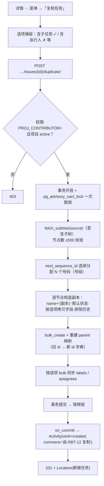
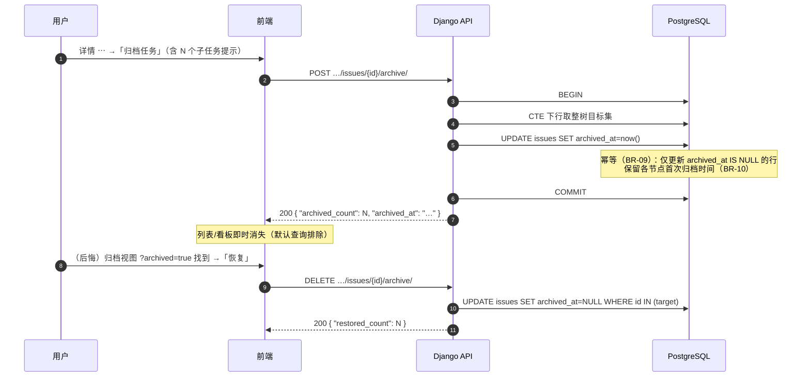
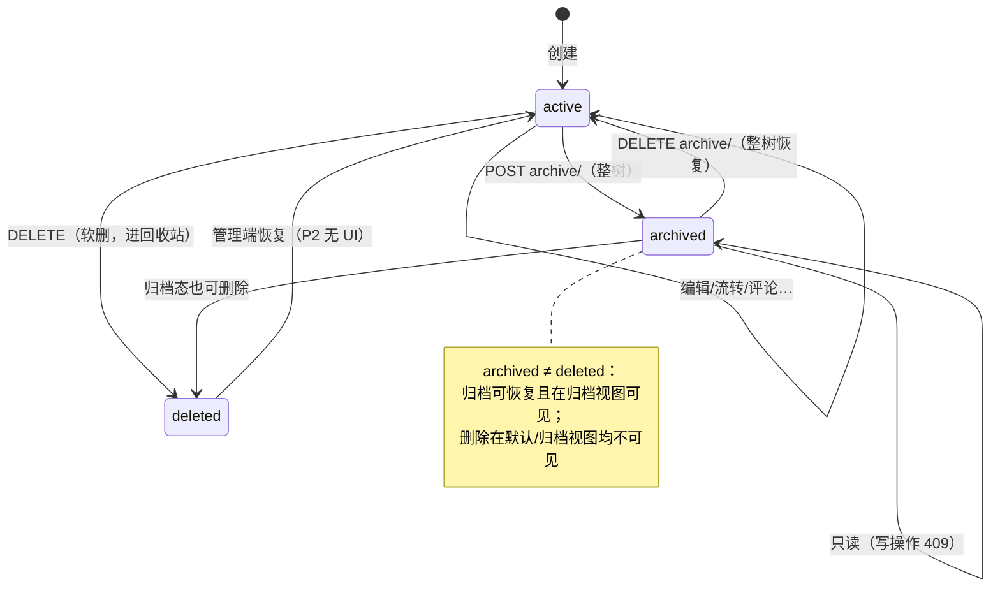
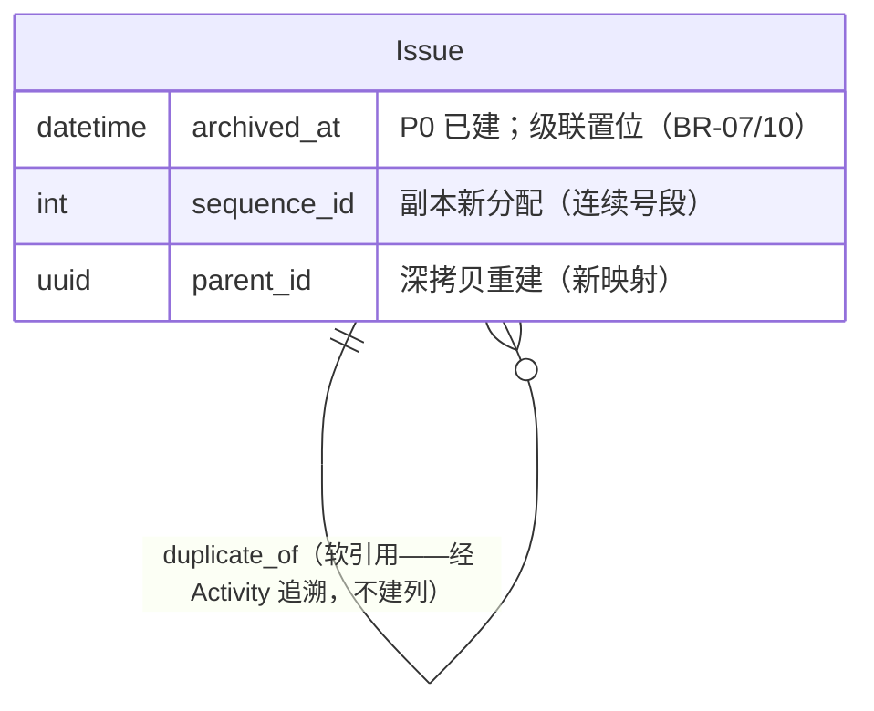

# 任务复制 / 归档 / 恢复

| 元信息项 | 内容 |
| --- | --- |
| 文档编号 | TASK-009 |
| 所属迭代 | Sprint 2 — 任务体系完善（第 4 周） |
| 优先级 | P2（标准版完整级） |
| 所属模块 | M4-TASK｜任务核心 |
| 文档状态 | 待评审（Draft） |
| 最后更新日期 | 2026-09-01 |
| 上游依赖 | `TASK-001`（Issue 创建服务与 advisory lock）、`TASK-002`（标签/类型/属性集合）、`TASK-004`（子树服务——深拷贝与整树归档消费）、`TASK-006`（估算字段）、`TASK-008`（custom_fields 复制） |
| 下游消费 | `PROJ-003`（项目归档时任务归档语义对齐）、`TASK-010`（复制/归档 Activity）、`RPT-001/002`（归档任务退出统计口径）、`BOARD-002`（看板归档折叠） |
| 上游依据 | `docs/需求文档.md` §3.4（任务创建、编辑、删除、复制、归档）、§8.2 任务核心 P2 列（任务复制/归档） |
| 关联架构文档 | [`unified-issue-model.md`](../architecture/unified-issue-model.md)（§2.8 `archived_at` 与偏索引、§3 序列号批量分配、§2.10 Activity）、[`api-conventions.md`](../architecture/api-conventions.md)（**§2.6 动作子资源：`duplicate/` POST 幂等、`archive/` POST/DELETE**、§8 错误码）、[`rbac-permission-model.md`](../architecture/rbac-permission-model.md) |
| 对标基线 | Plane `issues/{id}/duplicate/` 端点 + `archived_at` 软归档 · Ones 归档合规与数据留存 |
| 工作量估算 | 后端 2.5 人日 / 前端 1.5 人日 / 联调与测试 1 人日，合计 **5 人日** |

---

## 1. 概述

### 1.1 功能定位

两个收尾但高频的生命周期能力：

- **复制**：把一个任务（含可选的整棵子树）变成新任务——「上次那个需求再开一期」「这个缺陷在另一个模块也有」。核心工程问题是**深拷贝的事务一致性**：子树复制要在一次事务内完成编号分配（advisory lock 取一次锁分配连续号段）、字段选择拷贝、父子结构重建，任何一步失败整体回滚。
- **归档**：任务完成后退出活跃视图但**不删除**——`archived_at` 置位、整树级联、默认查询天然排除、归档视图可查、可恢复。与删除（进回收站）的分工：删除 = 「不该存在」，归档 = 「做完了/暂停了，留档」。

### 1.2 关键约定：复制什么、不复制什么

> ⚠️ 复制语义的核心是区分「**定义**」（可复制）与「**历史**」（不可复制）。

| 数据 | 复制？ | 理由 |
| --- | --- | --- |
| 标题（追加「(副本)」）/ 描述四格式 / 优先级 / 类型 / 标签 / `custom_fields` 值 / `estimate_minutes` / 起止日期 | ✅ 默认（标签/字段/描述恒含，执行人/日期可选） | 任务的定义性内容 |
| 子任务整棵子树（含多层结构与相对父子关系） | ✅ 可选（`include_subtrees`） | 拆解结构属于定义 |
| 执行人集合 | ✅ 可选（默认否） | 人是「当时的安排」，复制常用于改期重做 |
| `sequence_id` | ❌ 新分配 | 编号是项目级审计资产，绝不复用/复制 |
| 状态 | ❌ 落项目默认状态（待办） | 新任务不该继承「已完成」；`completed_at` 恒 NULL |
| 评论 / 附件 / 依赖关系 / 工时记录 / Activity | ❌ | 历史——复制历史等于伪造审计链 |
| `description_binary`（Yjs） | ❌ | 协同状态含 client 时钟，复制等于伪造协作因果 |
| `sort_order` | ❌ 列尾追加 | 新任务进默认列尾 |

### 1.3 交付内容

| # | 能力 | 说明 |
| --- | --- | --- |
| 1 | 单任务复制 | `POST …/issues/{id}/duplicate/`，字段选择拷贝 |
| 2 | 深拷贝子树 | `include_subtrees` 选项，事务内重建多层结构 |
| 3 | 复制选项 | `include_subtrees` / `include_assignees` / `include_labels` / `include_custom_fields` / `include_dates` |
| 4 | 归档 / 恢复 | `POST/DELETE …/issues/{id}/archive/`，幂等；整树级联 |
| 5 | 归档视图 | 列表 `?archived=true`；看板归档折叠入口（`BOARD-002` 联动） |
| 6 | 归档写保护 | 归档任务只读，恢复后放行 |

### 1.4 范围边界

| 能力 | 本文档（P2） | 归属 |
| --- | --- | --- |
| 复制（含子树）/ 归档 / 恢复 | ✅ | — |
| 跨项目复制 | ❌ 同项目限定 | P4（跨项目引用归 `PROJ-004` 评估） |
| 批量复制 / 批量归档 | ❌ | `BOARD-004`（Sprint 3 批量操作） |
| 归档留存策略 / 自动归档规则 | ❌ 手动归档 | P3 `WF-003` / P4 `FILE-006` |
| 回收站 UI（已删除浏览恢复） | ❌（管理端 `all_objects` 可操作） | P4 评估 |
| 复制为模板 / 任务模板库 | ❌ | P3+ |

### 1.5 前置依赖

| 依赖 | 内容 | 阻塞原因 |
| --- | --- | --- |
| `TASK-001` | `create_issue` 服务、advisory lock、批量号段分配范式 | 深拷贝 = 批量创建 + 结构重建 |
| `TASK-004` | `fetch_subtree` CTE 目标集范式；BR-09 归档级联语义 | 归档整树复用同一 CTE |
| `TASK-008` | `custom_fields` 值结构 | 复制原样拷贝 JSONB（同项目同定义，无需重校验） |
| `PROJ-002` | 项目状态（归档项目写保护前置） | 归档/复制在归档项目中被拦 |

### 1.6 竞品参考

| 竞品 | 参考点 | 处置 |
| --- | --- | --- |
| Plane | `POST issues/{id}/duplicate/`；子任务**不随复制** | 补齐 `include_subtrees` 深拷贝（社区长期诉求） |
| Plane | `archived_at` 软归档 | 采纳（datetime 精度，架构文档 §7.1 已注明） |
| Ones | 归档合规（留存策略）企业级 | P2 手动归档 + 可恢复；策略化归 P4 |
| Jira | Clone issue 全字段含描述，子任务不复制，assignee 保留 | 对齐「定义复制、历史不复制」；assignee 默认不复制是差异化选择 |

---

## 2. 业务逻辑

### 2.1 复制主流程（深拷贝）



**子树重建的关键**：编号按「广度优先」分配（同层连续）；`旧id→新id` 映射在内存构建后两次 `bulk_*` 落库——子节点 `parent_id` 引用同批新父，无需逐层往返数据库。N 上限 500（BR-05）。

### 2.2 归档 / 恢复



### 2.3 任务生命周期状态机（删除/归档全景）



### 2.4 业务规则汇总

| 编号 | 规则 | 判定位置 | 违反后果 |
| --- | --- | --- | --- |
| BR-01 | 副本标题 = 原标题 + `" (副本)"`；对同一源第 2 次复制 → `" (副本 2)"`（按现存同源副本数递增） | Service | — |
| BR-02 | 副本状态 = 项目 `is_default` 状态；`completed_at` 恒 NULL；`sort_order` = 默认列尾 +65535 步进 | Service | — |
| BR-03 | 复制仅限同项目（URL 推导，无跨项目参数） | Service | 防御性 400 |
| BR-04 | 复制内容按 §1.2 表：定义拷贝、历史不拷贝；`include_*` 五选项控制边界 | Service | — |
| BR-05 | 深拷贝节点数 ≤ 500（复用 `subtree/` 上限）；超限提示先拆分 | Service | `409 RESOURCE_LIMIT_EXCEEDED` |
| BR-06 | 深拷贝一次事务 + 一次取锁 + 连续号段；失败整体回滚（无半树） | Service | — |
| BR-07 | 归档整树级联：父归档 → 全部后代 `archived_at` 同事务置位；恢复对称 | Service CTE | — |
| BR-08 | 归档任务只读：任何写（PATCH/评论/工时/挂子任务/关联/复制源）返回 `409 RESOURCE_STATE_INVALID`；仅允许恢复与删除 | Permission + Service | 409 |
| BR-09 | `archive/` 幂等：重复 POST 返回 200（`archived_count=0`）；重复 DELETE 同理（api-conventions §2.6） | Service | — |
| BR-10 | 首次归档时间保留：级联 UPDATE 仅触及 `archived_at IS NULL` 的行 | Service | — |
| BR-11 | 归档任务退出统计：`RPT-001/002`、看板计数、我的待办全部以 `archived_at IS NULL` 过滤（既有偏索引支持） | ORM 全局 | — |
| BR-12 | 复制/归档/恢复各产生 Activity（复制=created+来源注释；归档=field=archived_at） | on_commit | — |
| BR-13 | 归档项目内禁止复制与归档操作 | Permission | `403 PERM_PROJECT_ARCHIVED` |
| BR-14 | 权限：CONTRIBUTOR+ 可复制（`issue.create`）；归档/恢复需 `issue.update`；VIEWER/COMMENTER 均不可 | Permission | `403` |

### 2.5 异常处理

| 场景 | HTTP | 错误码 | details 子码 | 前端表现 |
| --- | --- | --- | --- | --- |
| 子树超 500 节点 | 409 | `RESOURCE_LIMIT_EXCEEDED` | `LIMIT` | 「任务树过大（N 节点），请先拆分或关闭子任务选项」 |
| 归档任务上写操作 | 409 | `RESOURCE_STATE_INVALID` | `STATE` | 「任务已归档，恢复后才能编辑」+ 恢复入口 |
| 复制归档任务（源只读） | 409 | `RESOURCE_STATE_INVALID` | `STATE` | 同上 |
| 归档项目内操作 | 403 | `PERM_PROJECT_ARCHIVED` | — | 只读态 |
| 源不存在/不可见 | 404 | `RESOURCE_NOT_FOUND` | — | 通用 404 |
| 权限不足 | 403 | `PERM_ROLE_INSUFFICIENT` | — | 菜单项隐藏 |
| 深拷贝中途失败 | 500 | `SERVER_ERROR` | — | 整体回滚；Toast + request_id |
| 重复归档/恢复 | 200 | —（幂等） | — | count=0，UI 无感 |

### 2.6 边界条件

| 边界场景 | 限制值 | 超出处理 |
| --- | --- | --- |
| 深拷贝节点数 | 500 | 409 |
| 标题长度 | 512 − 后缀 | 截断原标题保留后缀 |
| 同源并发复制 | 两请求同时 | 各自成组（「副本」「副本 2」），号段不冲突 |
| 并发归档与编辑 | 竞态 | 行锁串行；后到的写 409 |
| 归档树含混合状态 | — | 整树无差别归档 |
| 恢复后状态 | — | 各节点保持归档前状态与字段 |

---

## 3. UI/UX 设计

### 3.1 复制选项弹层

```
┌────────────────────────────────────────────────┐
│  复制任务 · RBT-12 导出功能                      │
│                                                  │
│  ☑ 包含子任务（3 个，将一并复制结构）              │
│  ☐ 包含执行人（张三、李四）                       │
│  ☑ 包含标签（前端 / P0）                          │
│  ☑ 包含自定义字段值（严重等级 等 5 项）            │
│  ☐ 包含起止日期（2026-09-01 ~ 09-15）            │
│                                                  │
│  ⓘ 新任务将进入「待办」状态，编号重新分配；         │
│    评论、附件、依赖、工时不会被复制。               │
│                                                  │
│  副本预览：导出功能 (副本) + 3 个子任务            │
│                        [取消]  [创建副本]         │
└────────────────────────────────────────────────┘
```

| 元素 | 规格 |
| --- | --- |
| 选项区 | 五 checkbox；默认 子任务✓ 执行人✗ 标签✓ 字段✓ 日期✗ |
| 信息条 | 固定说明不可复制项（管理预期，降低「评论怎么没了」客诉） |
| 副本预览 | 标题 + 子任务计数实时更新 |
| 提交 | `201` 后 Toast「已创建 RBT-31 导出功能 (副本)」+「查看」跳转 |
| 入口 | 详情 ⋯ 菜单 + 列表行菜单 |

### 3.2 归档交互

| 交互 | 规格 |
| --- | --- |
| 入口 | 详情 ⋯ →「归档任务」；行菜单同款 |
| 确认 | 含子任务时提示「将同时归档 N 个子任务」 |
| 成功 | 详情关闭 + 列表移除 + Toast 带「撤销」按钮（10s 内一键恢复） |
| 归档视图 | 列表工具条「显示已归档」→ `?archived=true`；归档行 `opacity-60` + `archive` 图标 + 菜单仅「恢复/删除」 |
| 看板 | 归档任务不占列；列尾「已归档 (N)」折叠入口（`BOARD-002` 样式对齐） |
| 归档详情 | 只读横幅「已归档于 2026-09-01 · [恢复]」；编辑控件全部禁用 |

### 3.3 空状态 / 加载 / 失败

| 场景 | 处置 |
| --- | --- |
| 归档视图为空 | 「没有已归档的任务」插画 |
| 深拷贝大事务 | 按钮 loading +「正在复制 N 个任务…」（>1s 进度文案） |
| 复制失败 | Toast + request_id；无半成品残留（事务保证） |

### 3.4 响应式与无障碍

- 弹层 < 768px 全屏底部抽屉；checkbox 键盘可达。
- 归档行 `archive` 图标 + 文本 tooltip；只读横幅 `role="status"`；撤销按钮 `aria-label` + 10s 倒计时可见文本。

---

## 4. 技术架构

### 4.1 数据模型

**零新增表、零 DDL**。消费 `Issue.archived_at`（P0 已建，偏索引条件列）与既有字段。



> 复制源不建 `duplicated_from` 外键：溯源经 `IssueActivity.comment`（「由 RBT-12 复制」）满足 P2 审计；P3 需「副本族谱」再评估加列。

### 4.2 API 定义

| # | 方法 | 路径 | 描述 | 权限 | 成功码 |
| --- | --- | --- | --- | --- | --- |
| 1 | `POST` | `…/issues/{issue_id}/duplicate/` | 复制（含选项） | `issue.create`（CONTRIBUTOR+） | `201` |
| 2 | `POST` | `…/issues/{issue_id}/archive/` | 归档（整树，幂等） | `issue.update` | `200` |
| 3 | `DELETE` | `…/issues/{issue_id}/archive/` | 恢复（整树，幂等） | `issue.update` | `200` |
| 4 | `GET` | `…/issues/?archived=true` | 归档视图（`TASK-003` 白名单新增参数） | `PROJ_VIEWER`(5)+ | `200` |

#### 4.2.1 `POST …/duplicate/` — 复制

**请求**

```json
{
  "include_subtrees": true,
  "include_assignees": false,
  "include_labels": true,
  "include_custom_fields": true,
  "include_dates": false
}
```

**成功响应 `201 Created`**

```json
{
  "status": "success",
  "data": {
    "root": {
      "id": "f0a1b2c3-4d5e-4f6a-8b9c-0d1e2f3a4b5c",
      "issue_key": "RBT-31",
      "name": "导出功能 (副本)",
      "state_id": "e3f4a5b6-7c8d-4e9f-8a1b-2c3d4e5f6a7b",
      "parent_id": null,
      "source_issue_id": "8a1f9c2e-6b3d-4a7e-9f11-2c4d5e6f7a8b"
    },
    "copies": [
      { "source_id": "b2c3…", "id": "a1b2c3d4-e5f6-4a7b-8c9d-0e1f2a3b4c5d",
        "issue_key": "RBT-32", "parent_id": "f0a1…", "name": "后端导出 API" },
      { "source_id": "d4e5…", "id": "b2c3d4e5-f6a7-4b8c-9d0e-1f2a3b4c5d6e",
        "issue_key": "RBT-33", "parent_id": "a1b2…", "name": "分页游标改造" },
      { "source_id": "c3d4…", "id": "c3d4e5f6-a7b8-4c9d-0e1f-2a3b4c5d6e7f",
        "issue_key": "RBT-34", "parent_id": "f0a1…", "name": "前端导出按钮" }
    ],
    "total_created": 4
  }
}
```

**失败响应 `409`（子树超限）**

```json
{
  "status": "error",
  "error": {
    "code": "RESOURCE_LIMIT_EXCEEDED",
    "message": "任务树过大，无法整体复制",
    "details": [{ "field": "include_subtrees", "code": "LIMIT",
                  "message": "子树共 612 个节点，上限 500；可关闭子任务选项或先拆分" }],
    "request_id": "01JCB9Y4S7DV2U5V1B9C2E3F6A"
  }
}
```

#### 4.2.2 `POST/DELETE …/archive/` — 归档 / 恢复

**归档成功响应 `200`**

```json
{
  "status": "success",
  "data": { "archived_count": 4, "archived_at": "2026-09-01T10:22:31.114Z" }
}
```

**恢复成功响应 `200`**

```json
{ "status": "success", "data": { "restored_count": 4 } }
```

**失败响应 `409`（对已归档任务写操作——以 PATCH 为例）**

```json
{
  "status": "error",
  "error": {
    "code": "RESOURCE_STATE_INVALID",
    "message": "任务已归档，恢复后才能编辑",
    "details": [{ "field": "state_id", "code": "STATE",
                  "message": "RBT-12 已于 2026-09-01 归档" }],
    "request_id": "01JCB9Y4S7DV2U5V1B9C2E3F6B"
  }
}
```

### 4.3 核心逻辑

#### 4.3.1 深拷贝服务（一次锁、连续号段、映射重建）

```python
# apps/api/plane/db/services/issue_duplicate.py
COPY_EXCLUDED_FIELDS = {"id", "sequence_id", "sort_order", "state", "completed_at",
                        "created_at", "updated_at", "created_by", "updated_by",
                        "deleted_at", "archived_at", "parent", "description_binary"}


@transaction.atomic
def duplicate_issue(*, source_id: uuid.UUID, actor_id: uuid.UUID,
                    options: DuplicateOptions) -> dict:
    """深拷贝：BR-01~06 全景。"""
    source = Issue.objects.select_related("project").get(
        id=source_id, deleted_at__isnull=True, archived_at__isnull=True)   # 源须活跃
    project = source.project
    default_state = State.objects.get(project=project, is_default=True,
                                      issue_type__isnull=True)

    nodes = [source] if not options.include_subtrees else fetch_subtree(source_id)["all"]
    if len(nodes) > 500:                                                   # BR-05
        raise LimitExceeded(got=len(nodes), limit=500)

    acquire_project_lock(project.id)                                       # 一次取锁
    start_seq = next_sequence_id(project.id)                               # 连续号段
    suffix = _next_copy_suffix(source)                                     # BR-01

    id_map: dict[uuid.UUID, Issue] = {}
    rows = []
    for offset, node in enumerate(nodes):                                  # 广度优先序
        new = Issue(
            project=project,
            sequence_id=start_seq + offset,
            name=_apply_suffix(node.name, suffix) if node.id == source.id else node.name,
            state=default_state,                                           # BR-02
            sort_order=_column_tail(project.id, default_state) + 65535.0 * (offset + 1),
            created_by_id=actor_id,
            **{f: getattr(node, f) for f in _copy_field_set(options)
               if f not in COPY_EXCLUDED_FIELDS},
        )
        id_map[node.id] = new
        rows.append((new, node))
    Issue.objects.bulk_create([r[0] for r in rows], batch_size=100)

    updates = [new for new, old in rows if old.parent_id]                  # 重建父子映射
    for new, old in rows:
        new.parent = id_map[old.parent_id] if old.parent_id else None
    Issue.objects.bulk_update(updates, ["parent"], batch_size=100)

    if options.include_labels:
        _bulk_copy_labels(rows)                                            # bulk_create IssueLabel
    if options.include_assignees:
        _bulk_copy_assignees(rows, actor_id)                               # assigned_by=操作者

    transaction.on_commit(lambda: record_duplicate.delay(
        str(id_map[source_id].id), str(source_id), str(actor_id), len(rows)))
    return {"root": id_map[source_id], "copies": [r[0] for r in rows[1:]],
            "total": len(rows)}
```

> `description_binary` 在 `COPY_EXCLUDED_FIELDS`：Yjs 协同状态含 client 时钟与操作历史，复制等于伪造协作因果——副本描述以 `description_json/html` 重建（P2 恒 NULL；P3 协同上线后由 live 惰性迁移补）。

#### 4.3.2 归档 / 恢复服务（复用 CTE 目标集）

```python
ARCHIVE_TARGET_CTE = """
    WITH RECURSIVE target AS (
        SELECT id FROM issues
         WHERE id = %(root)s AND deleted_at IS NULL
        UNION ALL
        SELECT i.id FROM issues i JOIN target t ON i.parent_id = t.id
         WHERE i.deleted_at IS NULL
    )
"""


@transaction.atomic
def archive_subtree(*, issue_id: uuid.UUID, actor_id: uuid.UUID) -> dict:
    """整树归档（BR-07/09/10）：仅触及未归档行以保留各节点首次归档时间。"""
    now = timezone.now()
    with connection.cursor() as cursor:
        cursor.execute(
            ARCHIVE_TARGET_CTE +
            "UPDATE issues SET archived_at = %(now)s, updated_by_id = %(actor)s "
            " WHERE id IN (SELECT id FROM target) AND archived_at IS NULL",
            {"root": issue_id, "now": now, "actor": actor_id})
        count = cursor.rowcount
    transaction.on_commit(lambda: record_archive.delay(str(issue_id), str(actor_id), now))
    return {"archived_count": count, "archived_at": now}


@transaction.atomic
def restore_subtree(*, issue_id: uuid.UUID, actor_id: uuid.UUID) -> dict:
    """整树恢复：对称清空（恢复以根为准整树放行，含此前分别归档的后代）。"""
    with connection.cursor() as cursor:
        cursor.execute(
            ARCHIVE_TARGET_CTE +
            "UPDATE issues SET archived_at = NULL, updated_by_id = %(actor)s "
            " WHERE id IN (SELECT id FROM target) AND archived_at IS NOT NULL",
            {"root": issue_id, "actor": actor_id})
        count = cursor.rowcount
    transaction.on_commit(lambda: record_restore.delay(str(issue_id), str(actor_id)))
    return {"restored_count": count}
```

#### 4.3.3 归档写保护（Permission 层收口）

```python
# plane/app/permissions/issue.py —— ProjectEntityPermission 扩展
ARCHIVE_SAFE_ACTIONS = {"archive", "restore"}          # GET 天然安全，另加恢复

def has_object_permission(self, request, view, obj) -> bool:
    ...
    if request.method in ("PATCH", "PUT", "POST") and view.action not in ARCHIVE_SAFE_ACTIONS:
        if getattr(obj, "archived_at", None):
            raise BusinessError(                                            # BR-08
                code="RESOURCE_STATE_INVALID", http_status=409,
                message="任务已归档，恢复后才能编辑")
    return True
```

> 归档任务允许的动作仅：`GET`、`DELETE archive/`（恢复）、`DELETE`（删除）。`duplicate` 对已归档源在 Service 层再拦（§2.5）。

#### 4.3.4 Celery 任务

```python
@shared_task(bind=True, max_retries=3, retry_backoff=True)
def record_duplicate(self, new_root_id: str, source_id: str,
                     actor_id: str, total: int) -> None:
    """复制 Activity：新根 verb=created，comment='由 RBT-12 复制（共 4 个任务）'——幂等"""
    ...

@shared_task(bind=True, max_retries=3)
def record_archive(self, issue_id: str, actor_id: str, at) -> None:
    """归档 Activity：field='archived_at'，new_value=ISO 时间——幂等"""
    ...
```

### 4.4 前端实现

- `IssueStore` 扩展：`archiveSubtree/restoreSubtree`（乐观移除 + Toast 撤销）；`duplicate` 成功后 `mutate` 列表并滚动定位新根。
- 归档视图：`FilterStore` 增 `archived` 布尔参数（URL 同源 `?archived=true`）；行渲染 `opacity-60 + archive` 图标变体。
- 撤销交互：Toast 内 10s 倒计时按钮（`setTimeout` 清理）。
- 复制弹层 `DuplicateDialog`：选项受控；loading 文案随预估 `total_created` 更新。

---

## 5. 测试用例

### 5.1 单元测试

| 用例 ID | 测试目标 | 输入 | 预期输出 | 覆盖类型 |
| --- | --- | --- | --- | --- |
| UT-01 | 副本标题后缀 | 首次/二次复制 | `(副本)` / `(副本 2)` | 正常 |
| UT-02 | 标题超长截断 | 510 字标题 | 截断保留后缀 | 边界 |
| UT-03 | 状态落默认 | 源为已完成 | 副本=默认待办，completed_at NULL | 正常 |
| UT-04 | 号段连续 | 复制 4 节点 | 4 个连续 sequence_id | 正常 |
| UT-05 | 结构重建 | 3 层子树 | 副本同构（parent 映射正确） | 正常 |
| UT-06 | 历史不复制 | 源有评论/工时/关联 | 副本全无 | 正常 |
| UT-07 | 选项边界 | 全部选项关 | 纯净副本（无标签/执行人/字段/日期） | 边界 |
| UT-08 | 子树超限 | 612 节点 | 409 LIMIT | 边界 |
| UT-09 | 归档级联 | 3 层树归档根 | 整树 archived_at 置位 | 正常 |
| UT-10 | 首次时间保留 | 先归档子、再归档父 | 子保持更早时间戳 | 边界 |
| UT-11 | 归档幂等 | 连续两次 POST archive | 均 200，第二次 count=0 | 边界 |
| UT-12 | 恢复对称 | 归档→恢复 | 整树回归，状态字段不变 | 正常 |
| UT-13 | 归档写保护 | 归档后 PATCH/评论/挂子任务/复制 | 全部 409 | 异常 |
| UT-14 | 统计退出 | 归档后查 RPT-001 | 不计数（BR-11） | 正常 |
| UT-15 | 权限 | VIEWER 复制/归档 | 403 | 安全 |
| UT-16 | 并发复制同源 | 两请求同时 | 各自成组互不干扰 | 并发 |

### 5.2 集成测试

| 用例 ID | 场景 | 前置条件 | 操作步骤 | 预期结果 |
| --- | --- | --- | --- | --- |
| IT-01 | 深拷贝事务性 | 3 层子树 | 注入第 2 节点构造失败 | 整体回滚，零残留（BR-06） |
| IT-02 | 复制后独立性 | 复制后改副本标签/字段 | 源零变化 | — |
| IT-03 | 归档→看板联动 | 归档根任务 | 看板/列表即时消失；归档视图可见 | — |
| IT-04 | 撤销恢复 | Toast 撤销 | DELETE archive | 整树回归原位 |
| IT-05 | Activity 留痕 | 复制+归档+恢复 | 查日志 | 3 类 Activity 齐全（BR-12） |
| IT-06 | 归档视图查询 | 1 万任务半数归档 | `?archived=true` | 偏索引命中，P95 < 200ms |
| IT-07 | 归档项目前置 | 项目归档 | duplicate/archive | 403 PERM_PROJECT_ARCHIVED |

### 5.3 E2E 测试

| 用例 ID | 用户场景 | 操作路径 | 验收标准 |
| --- | --- | --- | --- |
| E2E-01 | 整树复制 | 详情复制（默认选项） | 新树 4 任务同构、待办态、连续编号；Toast 可跳转 |
| E2E-02 | 无子任务复制 | 关闭子任务选项 | 仅根副本 1 个 |
| E2E-03 | 归档与撤销 | 归档含子树任务 → 点撤销 | 移除后 10s 内一键回归 |
| E2E-04 | 归档视图浏览 | 切「显示已归档」 | 半透明行、只恢复/删除菜单；恢复后可再编辑 |
| E2E-05 | 只读保护 | 归档任务尝试拖看板/评论 | 409 提示与恢复入口 |

---

## 6. 竞品深度对标

### 6.1 Plane 实现分析

- `duplicate/` 端点存在于其端点清单（api-conventions §2.5 对标基线），实现为 View 内构造新 Issue 逐字段拷贝——**子任务不随复制**（社区 issue 长期诉求），无选项。本系统以 `include_subtrees` + 五选项补齐，且用「一次锁 + 连续号段 + 映射重建」保证深拷贝原子性与编号纪律。
- `archived_at` 软归档语义一致；Plane 归档任务在其「已归档」过滤器下可见，本系统对齐为 `?archived=true`。

### 6.2 Ones 实现分析

- 归档在其合规体系内（留存策略、归档规范、项目归档强制）——P4 `FILE-006`「合规留存周期」承接；P2 先交付可信的手动归档/恢复闭环。
- 复制在 Ones 常与「模板」体系相邻（复制为模板/从模板创建）——本系统模板归 P3+，P2 复制保持朴素语义。

### 6.3 本系统设计决策

1. **定义/历史二分法**：一句话说清复制边界（§1.2 表），并写进 UI 信息条——复制引发的「数据去哪了」客诉在竞品社区反复出现，根因是边界未被显式表达。
2. **深拷贝原子性靠号段而非逐个创建**：500 节点逐个 `create_issue` 将取锁 500 次；一次锁 + 内存映射 + 三次 `bulk_*` 把事务压到毫秒级（IT-01 回滚测试锚定）。
3. **归档与删除正交**：归档可恢复且可见，删除进回收站不可见——两个独立布尔维度（`archived_at`/`deleted_at`）+ 偏索引组合，语义与查询成本都最优。
4. **首次归档时间不可变**（BR-10）：级联 UPDATE 只碰 NULL 行——「什么时候归档的」是审计事实，恢复-再归档不覆写。
5. **写保护收口在 Permission 层**：归档只读判定不散落各 ViewSet，由 `ProjectEntityPermission` 统一拦截（三重防护的接口层一环）。

---

## 7. 里程碑与验收

### 7.1 交付物清单

| 类型 | 交付物 |
| --- | --- |
| Model / Migration | 零 DDL |
| 后端 | `issue_duplicate.py`（深拷贝/选项/号段/映射）、`archive_subtree`/`restore_subtree`（CTE 幂等）、归档写保护 Permission 扩展、`duplicate/` `archive/` 端点、`?archived=true` 参数 |
| Celery | `record_duplicate` / `record_archive` / `record_restore`（幂等） |
| 前端 | 复制选项弹层（预览/信息条）、归档确认与 Toast 撤销、归档视图（半透明行/受限菜单）、归档详情只读横幅 |
| 测试 | UT-01~16、IT-01~07、E2E-01~05 |

### 7.2 可操作演示的验收标准

1. 复制一个 3 层 4 节点任务树（默认选项）：得到同构新树，全部落「待办」、编号连续、标题带 `(副本)`；评论区/工时/依赖为空；修改副本任何字段源零变化。
2. 关闭「包含子任务」复制：仅产生根副本；开启「包含执行人」复制：执行人集合完整迁移。
3. 归档含子树任务：列表与看板即时消失、Toast 10 秒内可撤销；归档视图半透明可见且仅提供恢复/删除。
4. 对已归档任务拖看板、评论、挂子任务：全部收到 409 与恢复入口；恢复后一切写操作放行且状态字段与归档前一致。
5. 归档后个人统计（`RPT-001`）与看板计数即时扣减；612 节点的超大树复制被 409 拦截并给出拆分建议。
6. 复制中途人为制造失败：库中零半成品残留（事务回滚验证）。
