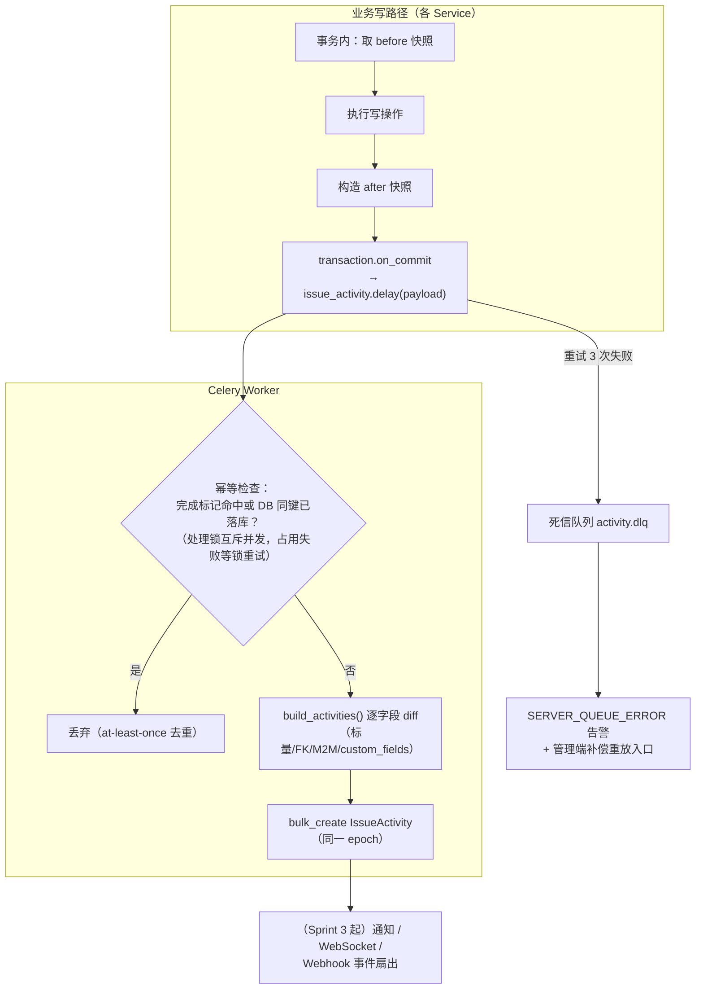
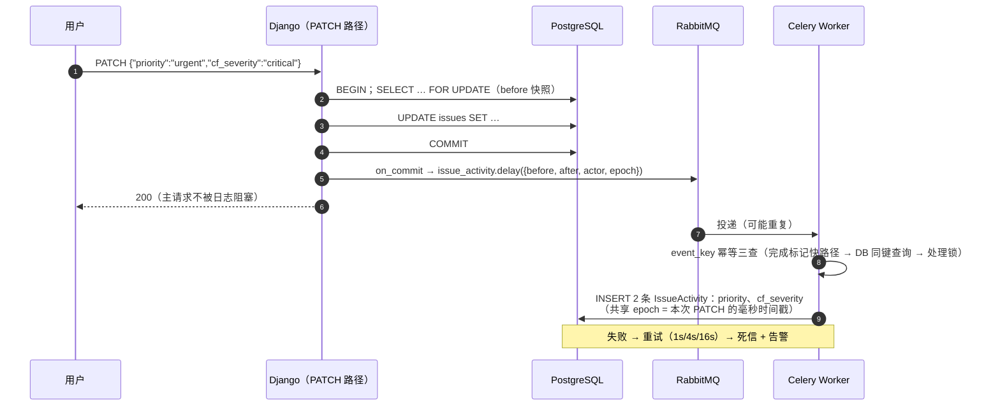
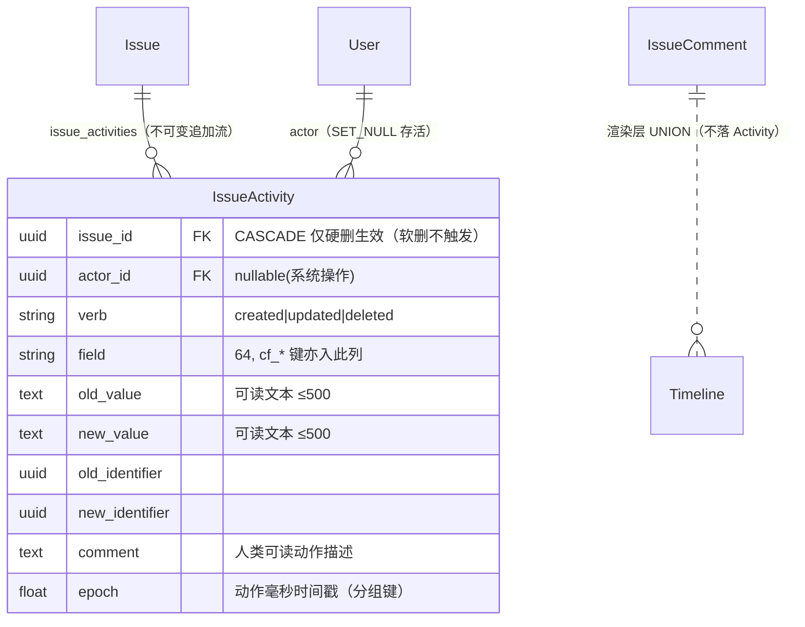

# 全操作留痕审计日志

| 元信息项 | 内容 |
| --- | --- |
| 文档编号 | TASK-010 |
| 所属迭代 | Sprint 2 — 任务体系完善（第 4 周） |
| 优先级 | P2（标准版完整级 · **全部写操作的审计基础设施**） |
| 所属模块 | M4-TASK｜任务核心 |
| 文档状态 | 待评审（Draft） |
| 最后更新日期 | 2026-09-02 |
| 上游依赖 | `INFRA-003`（`issue_activities` 表与三索引 P0 已建）、`TASK-001`（创建/更新路径的前后快照范式）、`TASK-002~009`（各写操作的事件源）、`INFRA-002`（RabbitMQ 唯一 Celery broker + worker/beat 运行时）、`INFRA-004`（统一信封 / §8 错误码 / 环境配置基线——**交付范围不含队列与死信配置**，`activity` 队列与 `activity.dlq` 为本文交付物） |
| 下游消费 | **`COLLAB-003`（项目动态流——消费本管道同源 `IssueActivity` 数据，响应结构按项目流粒度另行设计，见 §4.2.1 要点 5；任务级时间线 Tab 为本文交付）**、`AUTH-010`（P3 全站审计日志扩展）、`WF-006`（P3 审批留痕）、`INTG-002`（Webhook 事件源之一）、`RPT-*`（状态变更事件供报表回算） |
| 上游依据 | `docs/需求文档.md` §3.4（任务操作日志：所有修改留痕、可追溯）、§8.2 任务核心 P2 列（基础操作日志→全量留痕） |
| 关联架构文档 | [`unified-issue-model.md`](../architecture/unified-issue-model.md)（**§2.10 IssueActivity 模型 / 逐字段 diff 生成逻辑 / epoch 分组 / 表体积控制**——本文档其工程化落地）、[`api-conventions.md`](../architecture/api-conventions.md)（§10.5 事务与 on_commit 纪律、§8 错误码）、[`monorepo-structure.md`](../architecture/monorepo-structure.md)（Celery worker/beat） |
| 对标基线 | Plane IssueActivity（event sourcing lite + 逐字段 diff + 异步投递） · Ones 全量审计（合规导出、敏感操作告警） |
| 工作量估算 | 后端 3 人日 / 前端 2 人日 / 联调与测试 1.5 人日，合计 **6.5 人日** |

---

## 1. 概述

### 1.1 功能定位

审计日志回答「**这个任务经历过什么**」。P0/P1 已有零散的 Activity 记录（创建/状态/属性变更）；本迭代把它升级为**全字段的统一留痕管道**，三条主线：

1. **全事件覆盖**——系统内一切对任务的写操作（含 Sprint 2 新增的子任务、依赖、工时、执行人、复制、归档、自定义字段）都产生结构化 Activity；
2. **可靠投递**——Activity 生成走 Celery 异步（不阻塞主请求），带重试、幂等与死信兜底，**业务成功而日志丢失**成为可监控、可补偿的异常而非静默事故；
3. **消费就绪**——任务详情「动态」Tab 按 epoch 聚合渲染人类可读时间线；`COLLAB-003` 的项目动态流消费同一管道产出的 `IssueActivity` 数据（其响应结构按项目流粒度另行设计，不复用本端点结构，§4.2.1 要点 5）。

设计哲学与架构文档 §2.10 一致：**Event Sourcing lite**——不是用事件重建状态（那是完整 Event Sourcing 的重量），而是「状态表（`Issue`）+ 逐字段 diff 日志（`IssueActivity`）」双轨：读走状态表（快），审计与活动流走日志（全）。

### 1.2 事件覆盖矩阵（本迭代终点状态）

| 写操作 | verb | field | 事件源（Service） | 既有/新增 |
| --- | --- | --- | --- | --- |
| 创建任务 | `created` | `null` | `create_issue` | 既有，补全首版快照 |
| 更新标量字段（标题/描述/优先级/日期/估算） | `updated` | 字段名 | `IssueAttributeMixin` | 既有，补 `estimate_minutes` |
| 状态流转 | `updated` | `state` | 流转路径 | 既有（含 `TASK-005` 强制完成标记） |
| 类型 / 父项变更 | `updated` | `issue_type` / `parent` | `TASK-002/004` | Sprint 2 新增源接入 |
| 标签集合变更 | `updated` | `labels`（逐项 added/removed） | `TASK-002` | 既有，逐项化 |
| 执行人集合变更 | `updated` | `assignees`（逐人 added/removed） | `TASK-007` | Sprint 2 接入 |
| 自定义字段变更 | `updated` | `cf_<key>`（逐键） | `TASK-008` | Sprint 2 接入 |
| 依赖关系变更 | `updated` | `relations`（正反各一） | `TASK-005` | Sprint 2 接入 |
| 工时填报/修改/删除 | `updated` | `worklog` | `TASK-006` | Sprint 2 接入 |
| 复制产生 | `created` | `null`（comment 注明来源） | `TASK-009` | Sprint 2 接入 |
| 归档 / 恢复 | `updated` | `archived_at` | `TASK-009` | Sprint 2 接入 |
| 删除 | `deleted` | `null`（comment 含级联数） | `delete_subtree` | 既有，补级联数 |
| 评论（引用计数） | — | — | `COLLAB-001`（评论本体在 `IssueComment` 表，时间线合并渲染，不重复落 Activity） | 渲染层合并 |

> 评论不落 `IssueActivity`（避免双写不一致），时间线渲染时 UNION 两表按时间归并——这是「日志唯一真相」与「展示完整性」的折中（BR-05）。

### 1.3 关键约定：可靠投递三原则

> ⚠️ Activity 是审计资产，「业务成功但日志丢了」不可接受。

1. **on_commit 后投递**：Celery 任务只在事务提交后入队（`transaction.on_commit`）——回滚的业务操作绝不产生日志（杜绝「幽灵日志」，api-conventions §10.5 原则）。
2. **任务幂等**：投递载荷带确定性 `event_key`（`sha256(verb + issue_id + actor_id + epoch)`，与 `COLLAB-001` `dedup_key` 同范式），消费端按「完成标记快路径 → DB 同键查询 → 处理锁」三层去重（BR-07）——RabbitMQ at-least-once 语义下的重复投递无副作用，且**占位绝不先于落库**（落库失败的重试不会被占位静默丢弃）、**锁占用失败不丢弃**（worker 硬崩溃的锁残留窗口内，重投消费者等锁过期后重试而非 return 被 ack——§4.3.2）。
3. **死信可见**：重试 3 次仍失败的任务进入死信队列 + `SERVER_QUEUE_ERROR` 告警 + 管理端补偿入口（重放）——失败被监控而非被吞掉。

### 1.4 范围边界

| 能力 | 本文档（P2） | 归属 |
| --- | --- | --- |
| 全事件覆盖（§1.2 矩阵） | ✅ | — |
| 异步管道（重试/幂等/死信/补偿） | ✅ | — |
| 任务动态时间线 UI（详情「动态」Tab） | ✅ | — |
| 动态查询 API（游标 + 字段/操作人筛选） | ✅ | — |
| 项目级动态流 UI | ❌（管道就绪，聚合视图归） | `COLLAB-003`（Sprint 3） |
| 全站安全审计（登录/权限变更/导出行为） | ❌ | `AUTH-010`（P3） |
| 审计导出 / 合规留存 / 敏感操作告警 | ❌ | P4 `FILE-006` / `AUTH-012` |
| Activity 表按季度分区 | ❌（P2 监控体积增速） | P4（按 README §4 迭代归属执行；架构 §2.10 正文「P2 起按季度分区」与其自身 P4 路线图「`IssueActivity` 分区归档」两处自相矛盾——以 README §4 为准落 P4，**架构文档待回改**） |
| WebSocket 实时推送动态 | ❌ | `COLLAB-004`（Sprint 3） |

### 1.5 前置依赖

| 依赖 | 内容 | 阻塞原因 |
| --- | --- | --- |
| `INFRA-003` | `issue_activities` 表 + `idx_activity_issue_time` / `idx_activity_actor_time` / `idx_activity_field` | 零 DDL 消费 |
| `TASK-001` | `build_activities` 前后快照 diff 范式（架构文档 §2.10 原型） | 管道核心复用并扩展 |
| `TASK-002~009` | 各 Service 的 `on_commit` 钩子位 | 事件源接入点 |
| `INFRA-002` | RabbitMQ（Celery 唯一 broker）与 worker/beat 容器编排 | 异步运行时底座（`activity` 队列与 `activity.dlq` 死信路由为**本文交付物**，§4.3.2，不依赖任何既有 DLQ 配置） |
| `INFRA-004` | 统一信封 / 错误码表（`SERVER_QUEUE_ERROR`）/ `CELERY_BROKER_URL` 等环境配置基线 | 告警错误码与配置口径（INFRA-004 交付范围不含队列与死信配置） |

### 1.6 竞品参考

| 竞品 | 参考点 | 处置 |
| --- | --- | --- |
| Plane | `IssueActivity` 逐字段 diff + View 层收集快照后 `.delay()` 投递 + `epoch` 分组 | **完全采纳**（含字段命名），补齐重试幂等与死信（Plane 的 activity 丢失无告警） |
| Plane | 批量操作共享 epoch 聚合展示 | 采纳（`BOARD-004` 批量场景复用） |
| Ones | 全量审计 + 合规导出 + 敏感告警（企业级） | P2 交付「可信记录」；「合规体系」归 P3/P4 |
| Jira | issue history 按字段逐行 + 人物时间 | 展示形态对齐（时间线分组渲染） |

---

## 2. 业务逻辑

### 2.1 留痕管道全景



### 2.2 单次更新的 diff 时序



### 2.3 时间线聚合语义（epoch 分组）

同一次用户动作（一次 PATCH / 一次批量操作 / 一次深拷贝）产生多条 Activity **共享同一 `epoch`**（动作发生时刻的毫秒时间戳）。渲染层把同 epoch 的记录聚合为一组：

```
今天
  ├─ 14:32  张三 更新了 3 个字段            ← epoch 组：一条视觉记录
  │          优先级 高 → 紧急
  │          严重等级 major → critical
  │          截止时间 09-10 → 09-15
  ├─ 11:05  李四 ⏱ 填报了 2h 工时（联调收尾）
  └─ 09:41  系统 由 RBT-12 复制创建（共 4 个任务）
昨天
  ├─ 17:20  王五 将状态 待办 → 进行中
  └─ 16:58  张三 指派 李四、王五 执行（原：张三）
```

聚合规则：**`epoch` 相同即同组**——`epoch` 由 Service 在动作入口生成并贯穿该动作全部日志（BR-04），同 `epoch` 必然同 actor、同一次动作，无需再附加「actor 相同」「时间差 < 5s」等条件（旧稿的冗余条件与 BR-04 的 epoch 语义矛盾，已删除；与 §4.3.3 实现口径一致）；组内逐条列出 `字段：旧值 → 新值`；跨天按日期分区。

### 2.4 业务规则汇总

| 编号 | 规则 | 判定位置 | 违反后果 |
| --- | --- | --- | --- |
| BR-01 | 每次成功的 create/update/delete 及 §1.2 矩阵事件必产生 ≥1 条 Activity；**回滚的操作不产生**（on_commit 纪律） | Service + 评审 | 评审拒绝 |
| BR-02 | diff 粒度：标量逐字段、FK 记 old/new 对象名+ID、M2M 拆 added/removed 逐项、custom_fields 逐键 | `build_activities` | — |
| BR-03 | `old_value`/`new_value` 存**人类可读文本**（状态名、人名、选项 label），`old_identifier`/`new_identifier` 存对象 ID——展示与追溯分离 | `build_activities` | — |
| BR-04 | `epoch` = 动作发生时刻毫秒时间戳，由 Service 统一生成并贯穿该动作全部日志 | Service | — |
| BR-05 | 评论不落 Activity（`IssueComment` 是其真相表）；时间线渲染 UNION 两表按 `created_at` 归并 | 渲染层 | — |
| BR-06 | 描述字段 diff 不存全文（体积失控）：old/new 存「已修改」标记（`__modified__`），全文对比入口后续评估——与架构 §2.10 原型（`TRACKED_SCALAR_FIELDS` 含 `description_html` 全文 diff）的显式偏离，**架构文档待回改**（裁决注记见 §4.3.1） | `build_activities` | — |
| BR-07 | 幂等键 `event_key = sha256(verb + issue_id + actor_id + epoch)`（与 `COLLAB-001` `dedup_key` 同范式——事件四元组，Activity 无 receiver 维度；`TASK-004` `record_parent_change` 为**单字段（`parent`）特例**——其键固定 field=`parent` 并含 verb 维度，同一动作单一落库通道，epoch 同源不交叉投递；**已同步**：TASK-004 §4.3.6 现为 `sha256(verb+issue_id+actor_id+epoch)` 同格式——单字段特例：verb 固定 `updated`、field 固定 `parent`，与本文共用键空间，无需回改）。去重三层（按消费入口判定序）：① 24h 完成标记——**入口即读**（命中 = 24h 内重投/重放，零 DB 查询丢弃），落库成功后回写 ② DB 同键查询（终局事实源——Redis 清空/过期后仍准确）③ Redis 处理锁 `cache.add`（短 TTL 并发互斥，**失败即释放——占位绝不先于落库**；占用失败不丢弃消息，等锁过期后 `retry(countdown=310)` 重试，§4.3.2——worker 硬崩溃的锁残留窗口不静默丢失）；`issue_activities` 无唯一约束（架构 §2.10 / `INFRA-003`），**不使用 `ignore_conflicts`**（无约束时为无效兜底） | Worker | — |
| BR-08 | 投递失败重试 3 次（1s/4s/16s 退避——Celery `retry_backoff` 仅接受 bool/int，该序列以显式 `countdown=4 ** retries` 实现）后入死信 `activity.dlq`（**DLQ 非默认行为**：显式 `task_acks_on_failure_or_timeout=False` + 队列声明 `x-dead-letter-exchange=activity.dlx`，均为本文交付配置，§4.3.2——Celery 默认失败即 ack、消息不会路由 DLQ）；死信元数据（event_key/payload/error_summary/retries/first_failed_at）存 Redis hash `activity:dlq:{message_id}`、TTL 7 天（§4.1.2/§4.3.4）；触发 `SERVER_QUEUE_ERROR` 告警；管理端可重放（端点契约 §4.2.2——重放 = 从 hash 读原始 payload 后 re-dispatch 原任务） | Celery | — |
| BR-09 | Activity 不可修改不可删除（无 UPDATE/DELETE API；重放仅补插）；软删任务的 Activity 保留 | API 面 | — |
| BR-10 | 时间线查询游标分页（默认/上限 30 **组**/页——api-conventions §6.3 默认/上限 100 的**显式豁免**：分页单元是 epoch 组而非记录行，单组含 1..N 条字段明细；超额静默截断并在 `meta.degraded` 告知）；支持 `?field=` 与 `?actor_id=` 过滤 | ViewSet | — |
| BR-11 | 敏感值脱敏：字段名**或**值命中 `password/token/secret/webhook_url` 模式——任一命中值即整体 `***`（字段名侧如 `cf_webhook_url` 命中 `webhook_url` → 值整体脱敏，值本身无需含敏感词，§4.3.1 `_clip`） | `build_activities` | — |
| BR-12 | 批量操作（`BOARD-004` 前瞻）：同批全部条目共享 epoch，聚合为「批量更新了 N 个任务」 | Service 约定 | — |
| BR-13 | 时间线权限 = 任务读权限（不可见任务动态亦不可见） | Permission | 403/404 |
| BR-14 | 通知与 Activity 独立：通知是触达（可已读），Activity 是记录（不可变）——两管道不共享表不互相补偿 | 架构约束 | — |

### 2.5 异常处理

| 场景 | 触发条件 | 前端表现 | 后端处理 | 错误码 |
| --- | --- | --- | --- | --- |
| Worker 宕机期间事件积压 | RabbitMQ 队列堆积 | 时间线暂缺新动态（SWR 刷新后补齐） | 恢复后按序消费，epoch 保序 | — |
| 死信 | 重试耗尽 | 时间线缺该条 + 管理端告警 | `SERVER_QUEUE_ERROR` + 补偿重放 | 告警侧 |
| 幂等重复投递 | MQ at-least-once | 无感 | event_key 去重 | — |
| 落库失败重试窗口 | DB 瞬断 / Worker 重启 | 无感 | 处理锁失败即释放（占位不先于落库），重试可重入直至成功或入死信——不再出现「重试窗口日志被静默丢弃」 | — |
| Worker 硬崩溃（进程被杀） | 处理锁残留 ≤300s，`acks_late` 未 ack 消息立即重投 | 无感 | 重投消费者锁获取失败**不 return 被 ack 丢弃**：`self.retry(countdown=310)` 等锁过期后重试落库（Celery retry 另发新消息并 ack 本条，事件不丢，§4.3.2）；仅重试耗尽才入死信 + 告警 | — |
| 时间线查询越权 | 非项目成员 | 404 | Permission 收口 | `RESOURCE_NOT_FOUND` |
| 快照丢失（异常路径） | before 未捕获 | — | 该字段降级为「已修改」（无 old/new），ERROR 日志 | — |
| 动态 Tab 加载失败 | 网络/5xx | 行内重试 | — | — |

### 2.6 边界条件

| 边界场景 | 限制值 | 超出处理 |
| --- | --- | --- |
| 单动作产生日志条数 | 无硬限（一次 PATCH 改 20 字段=20 条） | epoch 聚合为一组展示 |
| 描述 diff | 不落全文（BR-06） | 标记化展示 |
| 时间线分页 | 30 组/页（组=epoch 聚合；§6.3 默认 100 的显式豁免） | 游标加载 |
| `old/new_value` 单值长度 | 500 字符截断 + `…` | — |
| 表体积 | P2 监控（增速 ≈ 写 QPS × 平均字段数） | 季度分区 P4（架构 §2.10 表述待回改，裁决注记见 §1.4） |
| 死信堆积 | 告警阈值 100 条 | 升级处理 |

---

## 3. UI/UX 设计

### 3.1 任务详情「动态」Tab（时间线）

```
┌──────────────────────────────────────────────────────────────────┐
│ TZXM-13  后端导出 API            [概览] [动态] [评论]              │
├──────────────────────────────────────────────────────────────────┤
│ 今天 · 2026-09-01                              [全部 ▾] [⋯ ▾]    │
│                                                                   │
│  14:32  👤张三                                                    │
│  │      更新了 3 个字段                                            │
│  │      ├ 优先级        高 → 紧急                                  │
│  │      ├ 严重等级      major → critical                           │
│  │      └ 截止时间      09-10 → 09-15                              │
│  │                                                                 │
│  11:05  👤李四                                                    │
│  │      ⏱ 填报了 2h 工时 · 联调收尾                                │
│  │                                                                 │
│  09:41  ⚙系统                                                     │
│         由 RBT-12 复制创建（共 4 个任务）                           │
│ ──────────────────────────────────────────────────────────────── │
│ 昨天 · 2026-08-31                                                 │
│  17:20  👤王五   状态  待办 → 进行中                               │
│  16:58  👤张三   指派 李四、王五 执行（原：张三）                    │
│ ──────────────────────────────────────────────────────────────── │
│                    [加载更早的动态]                                 │
└──────────────────────────────────────────────────────────────────┘
  [全部 ▾] = 字段过滤（状态/优先级/工时/关联…）   [⋯ ▾] = 按操作人过滤
```

| 元素 | 规格 |
| --- | --- |
| 日期分区 | 「今天 / 昨天 / M月d日」sticky 分区头（`text-xs text-neutral-400`） |
| epoch 组 | 头行（时间+头像+操作者+动作摘要）+ 缩进字段行（`字段 旧值 → 新值`）；旧值删除线、新值加粗 |
| 系统事件 | `⚙系统` 头像（复制/归档/自动化来源）；Sprint 3 起自动化规则名展示 |
| FK 值渲染 | 状态/类型/人员显示名 + 色点；ID 不展示（BR-03） |
| M2M 渲染 | added/removed 合并为人名列表「（原：…）」式对比 |
| 过滤器 | 字段与操作人两个下拉（多选）；过滤态 URL 同源 |
| 空态 | 「暂无动态——第一次修改将出现在这里」 |
| 加载 | 8 行时间线骨架；「加载更早」按钮式分页（审计场景翻阅为主，不做无限滚动） |

### 3.2 管理端死信补偿（admin 应用）

| 元素 | 规格 |
| --- | --- |
| 死信列表 | 队列 `activity.dlq`（数据源为 §4.1.2 Redis hash 元数据）：时间 / event_key / 错误摘要 / 重试次数 |
| 操作 | 单条重放 / 批量重放 / 丢弃（二次确认 + 留痕） |
| 端点契约 | `GET/POST/DELETE /api/v1/activity-dead-letters/…`（系统级资源，详见 §4.2.2） |
| 告警 | 堆积 > 100 条触发 `SERVER_QUEUE_ERROR`（错误码与日志通道沿用 `INFRA-004` 基线；堆积检测与触发逻辑为本文交付） |

### 3.3 响应式与无障碍

| 断点 | 布局 |
| --- | --- |
| ≥ 1280px | 双栏（左时间轴竖线 + 右内容） |
| < 768px | 单栏；字段 diff 行换行渲染 |

无障碍：时间线为语义 `<ol>`；每组 `aria-label` 摘要（「张三在 14:32 更新了 3 个字段」）；新旧值用文本（`→` 分隔）不依赖颜色；过滤器键盘可达。

---

## 4. 技术架构

### 4.1 数据模型

**零新增表、零 DDL**。消费 `INFRA-003` 已建（与架构文档 §2.10 一致）：

```python
# apps/api/plane/db/models/issue.py —— 既有定义（与 Issue 同文件，同 §6.1 / 架构 §2.10 / INFRA-003），本迭代全量点亮
class IssueActivity(BaseModel):
    """操作日志 —— Event Sourcing lite：状态表 + 逐字段 diff 日志"""

    class Verb(models.TextChoices):
        CREATED = "created", "创建"
        UPDATED = "updated", "更新"
        DELETED = "deleted", "删除"

    issue = models.ForeignKey(Issue, on_delete=models.CASCADE, null=True,
                              related_name="issue_activities")
    actor = models.ForeignKey("db.User", on_delete=models.SET_NULL, null=True,
                              related_name="issue_activities")
    verb = models.CharField(max_length=16, choices=Verb.choices, default=Verb.CREATED)
    field = models.CharField(max_length=64, null=True, blank=True)
    old_value = models.TextField(null=True, blank=True)      # 人类可读（BR-03）
    new_value = models.TextField(null=True, blank=True)
    old_identifier = models.UUIDField(null=True, blank=True) # 追溯 ID
    new_identifier = models.UUIDField(null=True, blank=True)
    comment = models.TextField(blank=True)
    epoch = models.FloatField(null=True)                      # 动作毫秒时间戳（BR-04）

    class Meta(BaseModel.Meta):
        db_table = "issue_activities"
        ordering = ("created_at",)
        indexes = [
            models.Index(fields=["issue", "created_at"], name="idx_activity_issue_time"),
            models.Index(fields=["actor", "created_at"], name="idx_activity_actor_time"),
            models.Index(fields=["field"], name="idx_activity_field"),
        ]
```



#### 4.1.1 索引设计说明

| 索引 | 服务的查询 | 使用频率 |
| --- | --- | --- |
| `idx_activity_issue_time` | 任务时间线 `WHERE issue_id=? ORDER BY created_at` | 极高（详情打开） |
| `idx_activity_actor_time` | 「某人的操作史」（P3 审计直查预置） | P3 起高 |
| `idx_activity_field` | 字段维度审计（如全部状态变更 → 报表回算） | 中 |

#### 4.1.2 死信元数据存储（Redis hash，零 DDL）

死信**元数据与原始 payload 不入 PostgreSQL**（零新增表纪律）：写入 Redis hash，`key = activity:dlq:{message_id}`（`message_id` = Celery `task_id`），字段 `event_key / payload / error_summary / retries / first_failed_at`（`retries` 由异常类型推导——`task_failure` 信号载荷不含该值，`MaxRetriesExceededError` = 耗尽 = `max_retries`，§4.3.4），**TTL 7 天**。写入方为 `task_failure` 信号接收器（§4.3.4——任务最终失败被 reject 入 `activity.dlq` 时同步落 hash），读取方为 §4.2.2 admin 死信列表端点；消息本体仍走 RabbitMQ `activity.dlq` 队列（§4.3.2 DLX 路由），重放从 hash 读 payload 后 re-dispatch（§4.3.4）。TTL 7 天覆盖「堆积告警阈值 100 条（§2.6）+ 人工介入」的运维窗口，超期元数据由 Redis 过期清理，队列侧消息本体经 drain 消费策略最终移除（§4.3.4——RabbitMQ 不支持按 message_id 定点删除）。

### 4.2 API 定义

| # | 方法 | 路径 | 描述 | 权限 | 成功码 |
| --- | --- | --- | --- | --- | --- |
| 1 | `GET` | `…/issues/{issue_id}/activities/` | 时间线（游标，epoch 预聚合） | `issue.read` | `200` |
| 2 | `GET` | `…/issues/{issue_id}/activities/?field=state&actor_id=<uuid>` | 字段/操作人过滤 | `issue.read` | `200` |
| 3 | `GET` | `/api/v1/activity-dead-letters/` | admin 死信列表（游标，系统级） | `system.audit.read` | `200` |
| 4 | `POST` | `/api/v1/activity-dead-letters/{message_id}/replay/` | admin 单条重放 | `system.audit.read` | `200` |
| 5 | `POST` | `/api/v1/activity-dead-letters/bulk/` | admin 批量重放（请求体携带 id 数组，api-conventions §2.6 批量范式） | `system.audit.read` | `200` |
| 6 | `DELETE` | `/api/v1/activity-dead-letters/{message_id}/` | admin 丢弃死信（留痕） | `system.audit.read` | `204` |

> 任务时间线（#1/#2）无 POST/PATCH/DELETE——Activity 只能由管道产生（BR-09）；#3~#6 为 admin 死信运维端点（§4.2.2），操作对象是**死信消息**而非 Activity 本体——重放仅补插日志，不破坏 BR-09 的不可变性。

#### 4.2.1 `GET …/activities/` — 时间线

**请求**

```http
GET /api/v1/workspaces/acme/projects/7b3e9c1a-…/issues/b2c3d4e5-…/activities/?per_page=30 HTTP/1.1
```

**成功响应 `200`**

```json
{
  "status": "success",
  "data": [
    {
      "id": "1a2b3c4d-5e6f-4a7b-8c9d-0e1f2a3b4c5d",
      "epoch": 1788244320000,
      "actor": { "id": "6c7d1a2b-3e4f-4a5b-9c8d-7e6f5a4b3c2d",
                 "display_name": "张三", "avatar_url": null },
      "verb": "updated", "comment": "更新了 3 个字段",
      "created_at": "2026-09-01T06:32:00.000Z",
      "items": [
        { "field": "priority", "field_label": "优先级",
          "old_value": "高", "new_value": "紧急",
          "old_identifier": null, "new_identifier": null },
        { "field": "cf_severity", "field_label": "严重等级",
          "old_value": "major", "new_value": "critical",
          "old_identifier": null, "new_identifier": null },
        { "field": "target_date", "field_label": "截止时间",
          "old_value": "2026-09-10", "new_value": "2026-09-15",
          "old_identifier": null, "new_identifier": null }
      ]
    },
    {
      "id": "9f8e7d6c-5b4a-4938-8271-6a5b4c3d2e1f",
      "epoch": 1788231900000,
      "actor": { "id": "2b3a4c5d-6e7f-4a8b-9c0d-1e2f3a4b5c6d",
                 "display_name": "李四", "avatar_url": null },
      "verb": "updated", "comment": "⏱ 填报了 2h 工时 · 联调收尾",
      "created_at": "2026-09-01T03:05:00.000Z",
      "items": [{ "field": "worklog", "field_label": "工时",
                  "old_value": null, "new_value": "120 分钟（2026-09-01）",
                  "old_identifier": null,
                  "new_identifier": "7c8d9e0f-1a2b-4c3d-8e9f-0a1b2c3d4e5f" }]
    }
  ],
  "meta": { "next_cursor": "MTc4ODIzMTkwMDAwMA==", "prev_cursor": null,
            "next_page_results": true, "prev_page_results": false,
            "count": 2, "total_count": 47, "total_pages": 2,
            "page": 1, "per_page": 30, "grouped_by": "epoch" }
}
```

**契约要点**：

1. **服务端预聚合**：同 epoch 的多条 Activity 已合并为一条「组记录」（`items[]` 展开字段）——前端零聚合逻辑；`count` / `total_count` / `total_pages` 相应取**组粒度**（本页组数 / 符合筛选的组总数 / 组总页数），`meta` 其余必含字段同 api-conventions §6.3；
2. `field_label` 由 `FIELD_LABELS` 常量 + Schema API（`cf_*` 用字段显示名）解析；
3. 游标锚定 epoch（组粒度），翻页不割裂同组；排序键 `-epoch, -created_at, -id` 全序确定（api-conventions §5.4 要求终键追加 `-id`，否则同 (epoch, created_at) 的记录会使游标翻页重复/丢行，见 §4.3.3）。**游标值语义偏离 §6.2 通用三段式（`per_page:offset:is_prev`）——本文为 epoch 锚定 keyset**（显式豁免登记，与要点 4 的 per_page=30 同款）：`cursor_encode` = 本页末组 epoch 毫秒值的 URL 安全 Base64（示例 `"MTc4ODIzMTkwMDAwMA=="` ⇔ `1788231900000`，见 §4.3.3），传输层仍循 §6.2 的 Base64 编码约定（解码失败 `400 VALIDATION_INVALID_CURSOR`）；首页 `prev_cursor=null`（按钮式「加载更早」无向前翻页需求）；
4. `per_page` 默认/上限 30，为 api-conventions §6.3（默认/上限 100）的**显式豁免**——本端点分页单元是 epoch 组而非记录行，单组含 1..N 条字段明细；其余分页语义不变（超限静默截断 + `meta.degraded` 告知）；
5. `COLLAB-003` 的项目动态流**不复用本响应结构**：跨任务场景「同 epoch」不再意味着同一视觉焦点，其采用「扁平行 + 同 epoch 跨 ≥2 任务折叠为批量汇总行 + `?epoch=` 明细抽屉」两层结构（COLLAB-003 BR-04/BR-05）；两者复用的是同源 `IssueActivity` 数据与同套游标/筛选/信封基线，任务级预聚合端点在 Sprint 3 保持不变，按消费场景分工。

**失败响应 `404`**（任务不可见，与详情一致）：

```json
{
  "status": "error",
  "error": {
    "code": "RESOURCE_NOT_FOUND",
    "message": "任务不存在或你没有访问权限",
    "request_id": "01JCBA0Z8XE3V6W2C0D4F5G8H1"
  }
}
```

#### 4.2.2 admin 死信补偿端点（系统级）

死信消息是系统级资源（跨工作空间），按 api-conventions §2.4「可独立存在的资源不嵌套」挂 `/api/v1/` 顶层；由 `apps/admin` 消费（rbac §3：admin 应用对应 `SYSTEM_ADMIN`）。重放/丢弃操作的是**死信消息**而非 Activity 本体——重放仅补插日志，BR-09 的不可变性不破。

**请求**

```http
GET /api/v1/activity-dead-letters/?per_page=30 HTTP/1.1
```

**成功响应 `200`**（死信列表）

```json
{
  "status": "success",
  "data": [
    { "id": "3f9a8c2e-6b3d-4a7e-9f11-2c4d5e6f7a8b",
      "event_key": "9d4f…", "queue": "activity.dlq",
      "error_summary": "OperationalError: connection reset by peer",
      "retries": 3, "first_failed_at": "2026-09-01T06:40:12.331Z" }
  ],
  "meta": { "next_cursor": "30:1:0", "prev_cursor": "30:0:1",
            "next_page_results": false, "prev_page_results": false,
            "count": 1, "total_count": 1, "total_pages": 1,
            "page": 1, "per_page": 30 }
}
```

**单条重放 `POST /api/v1/activity-dead-letters/{message_id}/replay/` → `200`**

```json
{
  "status": "success",
  "data": { "message_id": "3f9a8c2e-…", "replayed": true, "dedup_skipped": false }
}
```

**批量重放 `POST /api/v1/activity-dead-letters/bulk/` → `200`**：请求体 `{"message_ids": ["…", "…"]}`（§2.6 批量范式，单次 ≤ 100 条），`data` 返回 `{"replayed": n, "skipped": m}`。**丢弃 `DELETE /api/v1/activity-dead-letters/{message_id}/` → `204`**（响应体必须为空，api-conventions §4.3）。

**契约要点**：

1. 权限码 `system.audit.read`（rbac §8.3 系统级 AuditLog read/export 口径——死信补偿属审计链路修复，重放仅补插不改历史；rbac §4.2/§8 未设队列运维码位，**本文不新增权限码**，若后续拆分 `system.queue.manage` 须回改 rbac §4.2 单一数据源）；
2. 重放天然幂等（BR-07 三层去重使重复重放零副作用）；`POST` 支持可选 `Idempotency-Key` 请求头（api-conventions §3.4，防管理端双击重复触发）；
3. 丢弃需二次确认并留痕：P2 落结构化日志（沿用 `INFRA-004` 日志基线），P3 `AUTH-010` 全站 AuditLog 落表后迁移；
4. `message_id` 不存在 → `404` + `RESOURCE_NOT_FOUND`；`message_ids` 含非 UUID v4 → `400` + `VALIDATION_INVALID_PARAM`（`details[].field = "message_ids"`）；`message_ids` 超 100 条上限 → `400` + `VALIDATION_BULK_LIMIT_EXCEEDED`（api-conventions §8.4 已注册，`details.field = "message_ids"`）；信封结构同 §4.2.1 失败示例；
5. 列表数据源为 §4.1.2 的 Redis hash 元数据（`queue` 字段恒为 `activity.dlq`）；重放语义 = 从 hash 读原始 payload → 重放前经 BR-07 ①② 判定（已落库则不投递、`dedup_skipped=true`）→ re-dispatch `issue_activity` 原任务（§4.3.4）。重放/丢弃后**队列侧消息本体的清除为最终一致**：hash 先删（列表即刻不再显示），消息本体经 drain 消费策略异步移除（RabbitMQ 不支持按 message_id 定点删除，§4.3.4）。

### 4.3 核心逻辑

#### 4.3.1 逐字段 diff 生成（架构文档 §2.10 全量落地）

```python
# apps/api/plane/db/services/activity_builder.py
import json, re, time

TRACKED_SCALAR_FIELDS = ("name", "priority", "start_date", "target_date",
                         "estimate_minutes")
TRACKED_FK_FIELDS = ("state", "issue_type", "parent")
TRACKED_M2M_FIELDS = ("assignees", "labels")
DESCRIPTION_MARKER = "__modified__"                              # BR-06 不落全文
SENSITIVE_PATTERNS = re.compile(r"password|token|secret|webhook_url", re.I)
VALUE_MAX_LEN = 500


def build_activities(*, issue: Issue, before: dict, after: dict,
                     actor_id: uuid.UUID, epoch: float | None = None) -> list:
    """比对前后快照逐字段生成日志（BR-02/03/06/11）。

    before/after 由 Service 在事务内收集：标量/FK 为对象或值，
    M2M 为 ID 集合，custom_fields 为 dict。
    """
    epoch = epoch or time.time() * 1000                          # BR-04
    activities = []

    for field in TRACKED_SCALAR_FIELDS:
        if before.get(field) != after.get(field):
            activities.append(_scalar_row(issue, actor_id, epoch, field,
                                          before.get(field), after.get(field)))

    if before.get("description_html") != after.get("description_html"):
        activities.append(IssueActivity(                          # BR-06 描述标记化
            issue_id=issue.id, actor_id=actor_id, verb="updated",
            field="description",
            old_value=DESCRIPTION_MARKER, new_value=DESCRIPTION_MARKER,
            comment="更新了描述", epoch=epoch))

    for field in TRACKED_FK_FIELDS:
        old_o, new_o = before.get(field), after.get(field)
        if (getattr(old_o, "id", None) != getattr(new_o, "id", None)):
            activities.append(IssueActivity(
                issue_id=issue.id, actor_id=actor_id, verb="updated", field=field,
                old_value=getattr(old_o, "name", None),
                new_value=getattr(new_o, "name", None),
                old_identifier=getattr(old_o, "id", None),
                new_identifier=getattr(new_o, "id", None),
                comment=f"将 {FIELD_LABELS[field]} 从 "
                        f"{getattr(old_o, 'name', '空')} 改为 {getattr(new_o, 'name', '空')}",
                epoch=epoch))

    for field in TRACKED_M2M_FIELDS:                             # 拆 added/removed 逐项
        old_ids, new_ids = set(before.get(field) or ()), set(after.get(field) or ())
        for uid in sorted(new_ids - old_ids):
            activities.append(_m2m_row(issue, actor_id, epoch, field, uid, "added"))
        for uid in sorted(old_ids - new_ids):
            activities.append(_m2m_row(issue, actor_id, epoch, field, uid, "removed"))

    for key in set(before.get("custom_fields") or {}) | set(after.get("custom_fields") or {}):
        ov = (before.get("custom_fields") or {}).get(key)
        nv = (after.get("custom_fields") or {}).get(key)
        if ov != nv:
            activities.append(IssueActivity(
                issue_id=issue.id, actor_id=actor_id, verb="updated", field=key,
                old_value=_clip(key, _display(ov)), new_value=_clip(key, _display(nv)),
                comment=f"更新了 {key}", epoch=epoch))
    return activities


def _clip(field: str, text: str | None) -> str | None:
    """BR-11 敏感脱敏 + 500 字符截断：字段名 OR 值任一命中 SENSITIVE_PATTERNS
    即整体脱敏——cf_webhook_url 字段名命中 webhook_url → 值整体 ***（值本身
    无需含敏感词）；_scalar_row/_m2m_row 内部同此规则传入各自 field"""
    if text is None:
        return None
    if SENSITIVE_PATTERNS.search(field or "") or SENSITIVE_PATTERNS.search(text):
        return "***"
    return text[:VALUE_MAX_LEN] + ("…" if len(text) > VALUE_MAX_LEN else "")
```

> **与架构 §2.10 原型的显式偏离（架构文档待回改，共三处）**：① 架构 §2.10 原型 `TRACKED_SCALAR_FIELDS` 含 `description_html`（全文 diff 直接入 `old_value/new_value`），本文将其移出标量清单并以 `__modified__` 标记替代（BR-06）——理由见 §6.3 决策 5「体积纪律前置」：描述全文是单值增长最快的来源，逐条全文双写会使 `issue_activities` 体积失控。**待回改登记**（以 README §4 冲突裁决口径同步）：架构 §2.10 需 ① 删去 `TRACKED_SCALAR_FIELDS` 中的 `description_html` 并补标记化说明；② custom_fields 的 field 命名由 `custom_fields.{key}` 回改为 `cf_<key>`（本文 §1.2/§4.3.1 与 `TASK-008` BR-14 同口径——`field` 列直接存 `cf_<key>`，不带 `custom_fields.` 前缀）；③ `TRACKED_SCALAR_FIELDS` 增补 `estimate_minutes`（§1.2 矩阵「补 `estimate_minutes`」既有登记）。除上述待回改项外，本文为 §2.10 的全量落地。

#### 4.3.2 幂等消费 Worker（重试 + 死信）

```python
# apps/api/plane/bgtasks/issue_activity.py
@shared_task(bind=True, max_retries=3, acks_late=True,
             acks_on_failure_or_timeout=False)              # 失败不 ack：reject 交 DLX 路由 activity.dlq（BR-08）
def issue_activity(self, payload: dict) -> None:
    """Activity 落库 Worker —— at-least-once 下的幂等消费（BR-07/08）。

    payload = {issue_id, actor_id, verb, epoch, before, after, comment?}
    event_key 与 COLLAB-001 dedup_key 同范式（事件四元组，无 receiver 维度）。
    去重三层（入口判定序）：① 完成标记（24h 快路径）② DB 同键查询（终局）
    ③ 处理锁（占用失败 retry(310) 等锁过期，不 ack 丢弃）；落库成功后回写 ①。
    注意：Celery retry_backoff 仅接受 bool/int，1s/4s/16s 定制退避用显式 countdown。
    """
    event_key = build_event_key(payload)                    # sha256(verb+issue_id+actor_id+epoch)
    lock_key, done_key = f"activity-lock:{event_key}", f"activity-dedup:{event_key}"
    if cache.get(done_key):                                 # ① 完成标记（读）：24h 内重投/重放
        return                                              # 零 DB 查询丢弃；未命中走 ②③ 终局判定
    if IssueActivity.objects.filter(                        # ② DB 同键查询：终局事实源（Redis 过期/清空后仍准确）
            issue_id=payload["issue_id"], actor_id=payload["actor_id"],
            epoch=payload["epoch"], verb=payload["verb"]).exists():
        return                                              # 已落库：重复投递，安全丢弃
    if not cache.add(lock_key, 1, timeout=300):             # ③ 处理锁：同键并发互斥（短 TTL 防残留）
        # 锁被占用 ≠ 可丢弃：持有者可能已硬崩溃（锁残留 ≤300s），acks_late 重投的本次消费若直接
        # return 会被 ack——消息被消费却未落库（静默丢失，违反 §1.3 承诺）。改为等锁过期后重试：
        # retry 另发新消息并 ack 本条，事件不丢；锁为活跃持有时，其完成/释放后重试即命中 ①/②。
        raise self.retry(countdown=310)                     # 310s = 锁 TTL 300s + 余量，重试时锁必已过期
    try:
        issue = Issue.objects.get(id=payload["issue_id"])   # 只传 ID 重查（快照可能过期）
        rows = build_activities(issue=issue, actor_id=payload["actor_id"],
                                before=payload["before"], after=payload["after"],
                                epoch=payload["epoch"])
        if payload.get("comment") and rows:
            rows[0].comment = payload["comment"]
        IssueActivity.objects.bulk_create(rows, batch_size=100)
                                                            # 表无唯一约束（架构 §2.10）——不使用
                                                            # ignore_conflicts（无约束时为无效兜底）
        cache.set(done_key, 1, timeout=86400)               # ① 完成标记（写）：仅在落库成功后写入
        # Sprint 3 挂点：dispatch_events.delay(...) 通知/WebSocket/Webhook 扇出
    except OperationalError as exc:
        cache.delete(lock_key)                              # 失败释放锁：重试/重放可重入——
        raise self.retry(countdown=4 ** self.request.retries, exc=exc)   # 1s/4s/16s（占位绝不先于落库）
    except Exception:
        cache.delete(lock_key)                              # 不可恢复（如 issue 已硬删）：快速失败——
        raise                                               # reject 入 activity.dlq，死信元数据由
                                                            # task_failure 信号接收器落 Redis hash（§4.3.4）


def build_event_key(payload: dict) -> str:
    """COLLAB-001 build_dedup_key 同范式：sha256(verb|issue_id|actor_id|epoch)。"""
    raw = "|".join(str(payload[k]) for k in ("verb", "issue_id", "actor_id", "epoch"))
    return hashlib.sha256(raw.encode()).hexdigest()


# 队列与死信路由（本文交付的 Celery 配置——INFRA-002 提供 broker 运行时，INFRA-004 提供错误码/环境基线）
# DLQ 不会「默认」生效：Celery 默认 task_acks_on_failure_or_timeout=True，任务失败即被 ack、
# 消息直接丢弃而非路由死信——必须显式关闭，失败消息才以 basic.reject 交给 x-dead-letter-exchange。
from kombu import Exchange, Queue

task_acks_on_failure_or_timeout = False
task_routes = {"plane.bgtasks.issue_activity": {"queue": "activity"}}
task_queues = (
    Queue("activity", Exchange("activity", type="direct"), routing_key="activity",
          queue_arguments={                                  # 业务队列声明死信交换机
              "x-dead-letter-exchange": "activity.dlx",
              "x-dead-letter-routing-key": "activity.dlq"}),
    Queue("activity.dlq", Exchange("activity.dlx", type="direct"),
          routing_key="activity.dlq"),                       # 死信交换机绑定死信队列
)
# 重试耗尽 / 不可恢复异常 → reject → activity.dlx → activity.dlq + SERVER_QUEUE_ERROR 告警
# （死信元数据落 Redis hash，§4.1.2/§4.3.4）。注意 worker 硬崩溃**不在**此路径：acks_late 未 ack
# 的消息由 RabbitMQ 重投原队列，经 retry(countdown=310) 等锁窗口收敛（§2.5），不进死信。
```

#### 4.3.3 时间线服务端预聚合（组感知分页）

```python
# apps/api/plane/app/views/activity.py（节选）
GROUP_PAGE_SIZE = 30                                        # 30 组/页（§6.3 默认/上限 100 的显式豁免，BR-10）

def list(self, request, *args, **kwargs):
    base = (IssueActivity.objects
            .filter(issue_id=self.issue_id)
            .select_related("actor"))
    if field := request.query_params.get("field"):
        base = base.filter(field=field)
    if actor_id := request.query_params.get("actor_id"):
        base = base.filter(actor_id=actor_id)
    if cursor := request.query_params.get("cursor"):
        base = base.filter(epoch__lt=decode_cursor_epoch(cursor))
                                                            # keyset 按 epoch 边界推进：cursor = 本页
                                                            # 末组 epoch，且该组已整组取全（两步取数
                                                            # 保证），下一页严格小于之——组永不跨页

    # 两步取数（组感知）：paginate_queryset 按“行”分页——30 行 ≠ 30 组，且组被割裂后下一页
    # epoch < cursor 会把残余行整组排除而丢行，故不按行分页：先取组边界，再整组取全部明细行
    epochs = list(base.order_by("-epoch").values_list("epoch", flat=True)
                      .distinct("epoch")[:GROUP_PAGE_SIZE + 1])   # DISTINCT ON 取前 31 个 epoch
    has_next = len(epochs) > GROUP_PAGE_SIZE                # +1 探测下一页（next_page_results）
    epochs = epochs[:GROUP_PAGE_SIZE]
    rows = base.filter(epoch__in=epochs).order_by("-epoch", "-created_at", "-id")
                                                            # §5.4：终键 -id，同组明细行全序相邻

    groups, current = [], None
    for row in rows:                                        # epoch 相邻即同组（页内聚合）
        if current and current["epoch"] == row.epoch:
            current["items"].append(serialize_item(row))
        else:
            current = serialize_group(row)
            groups.append(current)
    return success_response(groups, meta=self.build_meta(    # count/total_count/total_pages 均按
        grouped_by="epoch", has_next=has_next,               # epoch 组粒度计算（distinct 计数），
        next_cursor=cursor_encode(epochs[-1]) if has_next and epochs else None))  # §4.2.1 要点 1
```

> **组感知分页的边界**：分页单元是 **epoch 组**而非记录行（BR-10/§4.2.1 要点 4）——第一步 `DISTINCT ON (epoch)` 按 `-epoch` 序取 30 个组边界（+1 探测下一页），第二步 `epoch IN (…)` 整组取回全部明细行，单页恰 ≤30 组且组内完整，不存在按行分页的「组被割裂、下一页 `epoch < cursor` 整组排除丢行」窗口。游标锚定本页末组 epoch，下一页从严格更小的 epoch 起步；同组明细行在 `-epoch, -created_at, -id` 全序下物理相邻（api-conventions §5.4——缺 `-id` 终键时同 (epoch, created_at) 记录会使游标翻页重复/丢行）。IT-08「同 epoch 跨页边界 → 组完整」按此断言。

#### 4.3.4 死信补偿（管理端）

```python
# apps/api/plane/bgtasks/activity_dlq.py
import json
from celery.exceptions import MaxRetriesExceededError
from celery.signals import task_failure

DLQ_META_TTL = 7 * 86400                                     # 死信元数据留存 7 天（§4.1.2）

@task_failure.connect          # 覆盖全部失败出口：重试耗尽 / 不可恢复异常（reject 入 dlq 的两类路径）
def record_dead_letter(sender=None, task_id=None, exception=None, args=None, **kwargs):
    """任务最终失败被 reject 入 activity.dlq（§4.3.2 显式 DLX 路由）时，同步把死信元数据写入
    Redis hash：key=activity:dlq:{message_id}（message_id=task_id），TTL 7 天——§4.2.2 列表端点
    的数据源（零新增表，与 §4.1 零 DDL 一致）；消息本体仍在 activity.dlq 队列，重放以 hash 中的
    payload 为准 re-dispatch。worker 硬崩溃不触发本接收器（其消息被重投原队列，§2.5）。

    retries 取值口径：task_failure 信号载荷不含 retries（Celery 信号约定，仅
    sender/task_id/exception/args/kwargs/einfo），kwargs.get("retries", 0) 恒为 0——
    改由异常类型推导：MaxRetriesExceededError = 重试轨道走完（§4.3.2 max_retries=3，
    与 §4.2.2 示例 retries=3 对应）；其余为不可恢复异常快速失败路径（当次尝试即抛、
    不在重试轨道上），记 0。"""
    (payload,) = args or (None,)
    if payload is None:
        return
    root = getattr(exception, "__cause__", None) or exception
                                                            # 重试耗尽时 MaxRetriesExceededError 的
                                                            # __cause__ 是 self.retry(exc=…) 携带的
                                                            # 根因（如 OperationalError）——摘要记根因
    r = get_redis_connection()                               # INFRA-002 Redis
    r.hset(f"activity:dlq:{task_id}", mapping={
        "event_key": build_event_key(payload),
        "payload": json.dumps(payload, ensure_ascii=False),  # 原始载荷，重放原样使用
        "error_summary": f"{type(root).__name__}: {root}",
        "retries": sender.max_retries                        # 推导而非信号载荷：耗尽=task.max_retries(3)，
        if isinstance(exception, MaxRetriesExceededError)    # 不可恢复异常（未进重试轨道）=0
        else 0,
        "first_failed_at": timezone.now().isoformat(),
    })
    r.expire(f"activity:dlq:{task_id}", DLQ_META_TTL)


DRAIN_PENDING = "activity:dlq:drain-pending"                 # 已重放/已丢弃的 event_key 目标集

@shared_task
def replay_dead_letters(message_ids: list[str] | None = None, limit: int = 100,
                        discard: bool = False) -> int:
    """由 §4.2.2 admin 端点触发的死信补偿（重放 discard=False / 丢弃 discard=True）：
    从 Redis hash 读原始 payload → 重放路径 re-dispatch 原任务
    issue_activity.apply_async(args=[payload])（新投递回 activity 队列）→ 删 hash 条目
    → 把 event_key 登记进 drain 目标集，由 drain_activity_dlq 最终移除队列侧消息本体
    （RabbitMQ 不支持按 message_id 定点删除——见下）。BR-07 三层去重保证重放不产生
    重复日志；丢弃路径同理：留痕（结构化日志，§4.2.2 要点 3）后登记目标集 + 删 hash。"""
    r = get_redis_connection()
    keys = ([f"activity:dlq:{mid}" for mid in (message_ids or [])]
            or list(r.scan_iter(match="activity:dlq:*"))[:limit])   # 批量路径缺省扫描全部死信
    replayed = 0
    for key in keys:
        meta = r.hgetall(key)
        if not meta:                                         # TTL 已过或已被重放/丢弃
            continue
        payload = json.loads(meta["payload"])
        if not discard and _already_persisted(payload):      # 重放前 BR-07 ①② 判定：已落库（如重试
            r.delete(key)                                    # 耗尽后 DB 已人工修复）→ 不投递，
            continue                                         # §4.2.2 响应据此计 dedup_skipped
        if not discard:
            issue_activity.apply_async(args=[payload])       # re-dispatch 原任务（重投回 activity 队列）
        r.sadd(DRAIN_PENDING, build_event_key(payload))      # 登记待清除目标集（drain 据此 ack）
        r.delete(key)
        replayed += 1
    if replayed:
        drain_activity_dlq.delay()                           # 触发队列本体清除（最终一致）
    return replayed


@shared_task
def drain_activity_dlq(limit: int = 1000) -> int:
    """死信消息本体的清除走 **drain 消费策略**（可实施口径——RabbitMQ 队列不支持按
    message_id 定点删除，amqp 无法「删除某一条」）：专用管理消费者对 activity.dlq
    basic_get 循环取消息（同步管理通道，不经业务 Worker 消费），解析消息体还原 payload
    计算 event_key，与 Redis 目标集 DRAIN_PENDING 匹配：命中 → basic_ack（ack 即出队，
    消息本体就此清除）并从目标集移除；未命中 → basic_reject(requeue=True) 归还队列
    （未处理/未过期的死信不受影响）。丢弃与重放共用本路径（都先登记目标集再 drain）。

    最终一致说明：hash 元数据与目标集登记先行生效（§4.2.2 列表即刻不再显示该条），
    队列侧消息本体随后由 drain 批处理收敛——窗口内队列深度短暂滞后于列表状态，不构成
    契约违约；目标集元素随 drain 消费移除，残留元素（对应消息已被 TTL 前清理等）由
    Redis 过期兜底（与 DLQ_META_TTL 同窗）。"""
    r, drained, channel = get_redis_connection(), 0, get_admin_channel()   # 管理通道（INFRA-002）
    for _ in range(limit):
        msg = channel.basic_get(queue="activity.dlq", no_ack=False)
        if msg is None:                                      # 队列已空：本轮 drain 结束
            break
        payload = extract_task_payload(msg)                  # 还原任务消息体中的 payload（args[0]）
        if r.srem(DRAIN_PENDING, build_event_key(payload)):  # 命中目标集（已重放/已丢弃）
            channel.basic_ack(msg.delivery_tag)              # ack = 消息本体出队清除
            drained += 1
        else:
            channel.basic_reject(msg.delivery_tag, requeue=True)
                                                            # 保留：未登记的死信原样归还队列
    return drained
```

### 4.4 前端实现

- `ActivityStore`（`packages/shared-state`）：`byIssue: Map<issueId, ActivityGroup[]>`（SWR key `issue:{id}:activities:{cursor}`）；过滤态换 key。
- `ActivityTimeline` 组件：日期分区（date-fns `isToday/isYesterday`）+ epoch 组渲染（§3.1 结构）；`field_label` 直接用服务端值（`cf_*` 显示名来自 Schema，不前端猜）。
- 评论合并渲染：`TimelineComposer` 在客户端 merge `activities` 与 `comments`（两 SWR 结果按 `created_at` 归并排序）——BR-05 的展示半边。
- 新动态刷新：P2 靠 SWR focus revalidate；`COLLAB-004` 上线后改为 WebSocket 触发 `mutate`。

---

## 5. 测试用例

### 5.1 单元测试

| 用例 ID | 测试目标 | 输入 | 预期输出 | 覆盖类型 |
| --- | --- | --- | --- | --- |
| UT-01 | 标量 diff | 改 priority | 1 条，old/new 文本 | 正常 |
| UT-02 | 多字段一次 PATCH | 改 3 字段 | 3 条同 epoch | 正常 |
| UT-03 | FK diff | 状态流转 | old/new 名+ID 四字段齐 | 正常 |
| UT-04 | M2M 拆分 | 加 2 删 1 执行人 | 3 条逐项 | 正常 |
| UT-05 | custom_fields 逐键 | 改 2 键 | 2 条 field=cf_* | 正常 |
| UT-06 | 描述标记化 | 改描述 | `__modified__` 不落全文 | 边界 |
| UT-07 | 敏感脱敏（值侧 / 字段名侧） | ① 值含 token 字样；② 字段名 `cf_webhook_url` 而值不含敏感词（如 `https://hooks.example/x`） | 两者值均为 `***`（字段名 OR 值任一命中即整体脱敏，§4.3.1 `_clip`） | 安全 |
| UT-08 | 值截断 | 600 字新值 | 500+`…` | 边界 |
| UT-09 | 回滚不留痕 | 事务内抛异常 | 0 条 Activity | 正常 |
| UT-10 | 幂等（Redis） | 同 payload 投递两次 | 1 组落库 | 并发 |
| UT-11 | 幂等（DB 兜底） | Redis 清空后重放 | 不重复 | 并发 |
| UT-12 | epoch 贯穿 | 深拷贝 4 节点 | 4 条 created 同 epoch | 正常 |
| UT-13 | 死信路由 | Worker 持续失败 | 3 次重试后入 dlq + 告警 | 异常 |
| UT-14 | 时间线过滤 | field=state | 仅状态记录 | 正常 |
| UT-15 | 越权 | 非成员查时间线 | 404 | 安全 |
| UT-16 | 软删保留 | 删除任务 | 其 Activity 管理端可查 | 正常 |
| UT-17 | 失败不占位 | 首次落库失败（模拟 DB 瞬断）后重试 | 锁已释放、完成标记未写；重试成功落库——重试窗口不丢日志 | 异常 |
| UT-18 | 锁崩溃窗口不丢失 | 消费者获锁后进程被杀（锁残留 300s），消息被 acks_late 重投 | 新消费者**不 return 被 ack 丢弃**：`retry(countdown=310)` 等锁过期后重试成功落库——硬崩溃窗口消息不静默丢失 | 异常 |

### 5.2 集成测试

| 用例 ID | 场景 | 前置条件 | 操作步骤 | 预期结果 |
| --- | --- | --- | --- | --- |
| IT-01 | 全矩阵覆盖 | — | 逐一执行 §1.2 全部操作 | 每操作 ≥1 条对应 Activity |
| IT-02 | 主请求零阻塞 | 慢 Worker | 计时 PATCH | 业务响应不含日志耗时 |
| IT-03 | Worker 宕机恢复 | 停 Worker 执行写 | 重启 | 积压按序消费，时间线完整 |
| IT-04 | 死信重放 | 制造死信 → §4.2.2 admin 端点重放 | 查时间线 | 补齐且无重复（信封/权限码/`Idempotency-Key` 符合契约） |
| IT-05 | 预聚合正确 | 同 epoch 3 条 | GET activities | 1 组 items=3 |
| IT-06 | 评论合并 | 2 评论 + 1 更新 | 前端时间线 | 三条按时间归并（BR-05） |
| IT-07 | 性能门禁 | 单任务 5000 条动态 | GET 首页 | P95 < 100ms（索引排序） |
| IT-08 | 分页不割裂 | 同 epoch 跨页边界 | 翻页 | 组完整（游标 epoch 锚定） |

### 5.3 E2E 测试

| 用例 ID | 用户场景 | 操作路径 | 验收标准 |
| --- | --- | --- | --- |
| E2E-01 | 时间线完整性 | 改 3 字段 + 流转 + 指派 | 分组渲染正确、值对比清晰、刷新保持 |
| E2E-02 | 工时与复制事件 | 填工时、复制任务 | 「⏱ 填报…」「由 RBT-12 复制…」正确呈现 |
| E2E-03 | 过滤 | 只看状态变更 | 仅状态组；URL 分享还原 |
| E2E-04 | 异步收敛 | Worker 延迟 3s | 200 立即返回；时间线稍后出现（无报错） |
| E2E-05 | 权限 | 移出成员后访问旧链接 | 404 |

---

## 6. 竞品深度对标

### 6.1 Plane 实现分析

- `apps/api/plane/db/models/issue.py` 的 `IssueActivity` 与本系统逐字段对齐（verb/field/old_value/new_value/identifier/comment/epoch）；其写入路径在 View 层收集前后快照后 `.delay()`——**无重试幂等与死信**，worker 异常时 activity 静默丢失（社区有「活动缺失」类反馈）。
- Plane 的 bulk 操作同样共享 epoch，前端 activity 流按 epoch 折叠——本系统 BR-04/BR-12 原样制度化。
- 本系统增强点：① `event_key` 幂等 + 死信 + 补偿重放（把「尽力而为」升级为「可运维承诺」）；② 服务端预聚合（Plane 把分组留给前端，跨端表现易漂移）；③ 敏感值脱敏与值长度纪律。

### 6.2 Ones 实现分析

- 全量审计体系（操作日志/合规导出/敏感告警/权限变更溯源）是企业版核心卖点，记录范围覆盖登录与导出行为。
- 本系统 P2 把「任务域审计」做扎实（结构化、幂等、可重放），`AUTH-010`（P3）再把记录面扩展到全站实体并接合规导出——**管道复用，记录面分阶段扩大**是成本最优路径。

### 6.3 本系统设计决策

1. **双轨而非 Event Sourcing**：状态表服务读性能，diff 日志服务审计——不背「事件重建状态」的实现重量（架构文档 §2.10 原判断）。
2. **幂等是管道的地基**：at-least-once 语义下「重复无害」让重试、重放、补偿全部安全——死信敢做一键重放正因如此。
3. **服务端预聚合**：epoch 分组在 API 层完成，前端只渲染——三端（web/admin/space）任务时间线表现一致；`COLLAB-003` 消费同源事件但按项目流粒度采用「扁平行 + 批量折叠 + 明细抽屉」两层结构（§4.2.1 要点 5），复用的是预聚合服务与游标/信封基线而非本响应结构。
4. **记录与触达分离**（BR-14）：Activity（不可变事实）与 Notification（可已读触达）两套管道——混用一张表是协作系统最常见的建模错误之一。
5. **体积纪律前置**：描述标记化 + 值截断 + 敏感脱敏在 P2 立规矩——`issue_activities` 是全库增长最快的表（架构 §2.10），纪律晚立一年，治理成本翻十倍。

---

## 7. 里程碑与验收

### 7.1 交付物清单

| 类型 | 交付物 |
| --- | --- |
| Model / Migration | 零 DDL |
| 后端 | `activity_builder.py`（全字段 diff）、`issue_activity` Worker（幂等三层/重试/锁等锁重试）、`activity` 队列与 `activity.dlq` DLX 死信路由配置（`task_acks_on_failure_or_timeout=False` + `x-dead-letter-exchange=activity.dlx`，**本文交付**，不依赖 INFRA-004）、时间线预聚合 ViewSet（组感知分页/过滤/游标）、admin 死信补偿端点 + 死信元数据 `task_failure` 接收器（Redis hash，§4.1.2）+ `replay_dead_letters` 与 `drain_activity_dlq`（重放/丢弃 + 队列本体最终一致清除，§4.2.2/§4.3.4）、`TASK-002~009` 全事件源接入（on_commit 钩子） |
| 前端 | 详情「动态」Tab（日期分区/epoch 组/值对比/过滤）、`ActivityStore`、评论合并渲染、admin 死信补偿页 |
| 测试 | UT-01~18、IT-01~08、E2E-01~05 |

### 7.2 可操作演示的验收标准

1. 对任务执行一组操作（改 3 字段、流转、指派 2 人、填工时、建依赖、复制、归档恢复）：动态 Tab 按时间倒序、epoch 分组完整呈现每一步，字段值对比与操作者无误。
2. 停掉 Worker 后执行写操作：业务请求正常成功；重启 Worker 后时间线自动补齐（积压按序消费）。
3. 人为制造 Worker 失败：3 次重试后进死信并触发告警；管理端一键重放后时间线补齐且无重复记录。
4. 同一 PATCH 重复投递（模拟 MQ 重发）：时间线仅一组；Redis 清空后再重放仍不重复。
5. 只看「状态」过滤：仅状态流转记录；按操作人过滤正确；过滤态 URL 可分享还原。
6. 5000 条动态的任务首屏 P95 < 100ms；修改含 `token` 字样的自定义字段，日志值为 `***`；修改自定义字段 `cf_webhook_url`（值不含任何敏感词），日志值同样整体 `***`（字段名命中即脱敏）。
