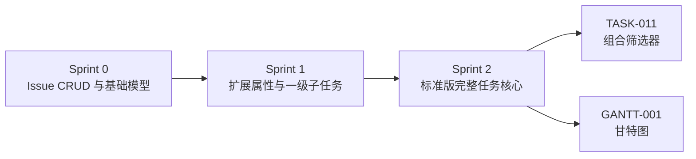
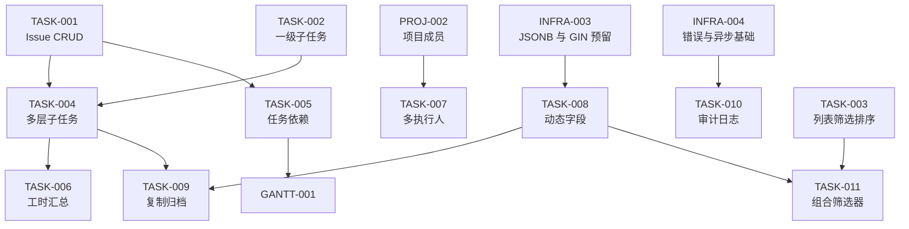

# Sprint 2 — 任务体系完善迭代概览

| 元信息项 | 内容 |
| --- | --- |
| 所属迭代 | Sprint 2 — 任务体系完善（第 4 周） |
| 优先级 | P2（标准版完整级） |
| 覆盖模块 | M4-TASK｜任务核心 |
| 文档状态 | 已确认（Approved） |
| 最后更新日期 | 2026-09-02 |
| 上游依赖 | Sprint 0 全量；Sprint 1 的 `TASK-002`（`TASK-004` 的层级挂载入口与 `parent` 校验）、`TASK-003`（`TASK-008` 的列表列渲染与 `?property.` 筛选挂点、`TASK-009` 的 `archived` 参数落点；另经组合筛选器 `TASK-011`·Sprint 3 延续消费）、`PROJ-002`（`TASK-006` / `TASK-007` 的成员口径与候选集）、`AUTH-005`（`TASK-007` / `TASK-008` 的权限码门控）、`INFRA-004`（`TASK-007` / `TASK-010` 的信封与错误码基线） |
| 下游消费 | `TASK-011` 组合筛选器、`GANTT-001` 甘特图、项目时间线与报表 |
| 迭代周期 | 5 个工作日，固定预留 20% 缓冲 |

---

## 1. 迭代目标

Sprint 2 在 Sprint 0-1 已建立的统一 `Issue`、一级子任务、任务属性和列表查询之上，补齐标准版完整任务体系：递归层级、依赖、工时、多执行人、动态字段、复制归档和全操作留痕。

核心结果：

1. `Issue` 可表达业务深度 ≤5 层的工作分解结构（`MAX_ISSUE_DEPTH=5`，写入层校验，`TASK-004` BR-02；查询层另设 `CTE_GUARD_DEPTH=100` 保险丝，仅作脏数据告警线而非业务限制，见 §5），并准确汇总进度与工时。
2. `IssueLink` 可表达有向依赖且无环，状态流转可被未完成前置任务拦截。
3. 自定义字段实现元数据驱动、零 `ALTER TABLE`、12 种类型和缓存主动失效。
4. 所有写操作产生可追溯的 `IssueActivity`，活动时间线不阻塞主请求。
5. 复制、归档、恢复、多执行人等操作具备事务一致性、权限隔离和统一 API 契约。

## 2. 范围与边界

| 范围 | 本迭代交付 | 明确不做 |
| --- | --- | --- |
| 子任务 | ≤5 层业务深度（`MAX_ISSUE_DEPTH=5`，写入层校验）、递归 CTE 防环、父级进度汇总 | 跨项目父子关系、层级基线、放开第 6 层及以下（P3 再评估） |
| 依赖 | `blocks` / `is_blocked_by` / `relates_to` / `duplicates` | 自定义 Link Type、关键路径 |
| 工时 | 估算分钟、个人 WorkLog、任务/子树汇总 | 审批、计费、团队产能报表 |
| 执行人 | 多人分配、替换集合、转交、认领 | 排班、负载均衡、自动指派规则 |
| 自定义字段 | 12 种基础类型、作用域、JSONB + GIN、可视化管理 | 公式、级联、字段级权限 |
| 生命周期 | 深拷贝、软归档、恢复 | 跨 Workspace 复制、自动留存策略 |
| 审计 | 全字段 diff、异步写入、任务活动时间线 | 全站安全审计导出、合规告警 |

> 上表「明确不做」列是本迭代的硬性范围基线：任何「顺手加一下」的提议（公式字段、关键路径、跨 Workspace 复制、审批计费等）均视为范围蔓延，直接拒绝并转入后续迭代排期，不占用本迭代 20% 缓冲。

## 3. 前置依赖

> **编号口径注记（基准文档冲突已按裁决消解）**：[`architecture/dependency-graph.md`](../architecture/dependency-graph.md) §1.3 M4-TASK 台账与 §4.5 依赖表仍为旧编号——其 `TASK-009`＝全字段组合筛选器、`TASK-010`＝任务复制 / 归档 / 全量操作日志、`TASK-011`＝任务类型字段模板与需求池，与 [`docs/README.md`](../README.md) §4.4 / §4.5 冲突。**本文的编号与依赖边一律以 README §4 为准**：`TASK-009`＝任务复制 / 归档 / 恢复、`TASK-010`＝全操作留痕审计日志（均 Sprint 2）、`TASK-011`＝全字段 AND/OR 组合筛选器与视图保存（Sprint 3，即上图下游节点）。dependency-graph §4.5 旧编号行按此映射解读：旧 `TASK-010` 行（上游 `TASK-004` + `TASK-008` + `INFRA-004`）拆分对应本文 `TASK-009` 与 `TASK-010` 两份；旧 `TASK-009` 行（上游 `TASK-003` + `TASK-008`）对应 Sprint 3 的 `TASK-011`。**架构文档待回改**。

进入 Sprint 2 前必须满足：

- Sprint 0-1 验收全部通过，`Issue` 完整字段已在 P0 建齐。
- `parent`、`custom_fields`、`archived_at`、`IssueAssignee`、`IssueActivity`、`IssueLink` 的迁移口径与架构文档一致。
- `ProjectScopedAPIView`、统一响应 envelope、错误码、Celery + RabbitMQ、Redis 可用。
- `TASK-002` 已开放一级子任务，`PROJ-002` 已提供 active 项目成员候选集。

## 4. P2 任务模块覆盖

| 文档 | 交付重点 | 关键数据结构 | 直接下游 |
| --- | --- | --- | --- |
| `TASK-004` | 递归子任务、进度联动、父子防环 | `Issue.parent_id`、递归 CTE | `TASK-006`、`TASK-009` |
| `TASK-005` | 四类关联、依赖防环、流转拦截 | `IssueLink` 成对记录 | `GANTT-001` |
| `TASK-006` | 估算与实际工时 | `Issue.estimate_minutes`、`WorkLog` | `TASK-013` |
| `TASK-007` | 多执行人、转交、认领 | `IssueAssignee` M2M | 个人待办、通知 |
| `TASK-008` | 12 种动态字段 | `CustomFieldDefinition`、`Issue.custom_fields` | `TASK-011` |
| `TASK-009` | 深拷贝、软归档与恢复 | `Issue.archived_at` | 项目生命周期 |
| `TASK-010` | 全字段审计时间线 | `IssueActivity`、Celery | 项目动态、合规审计 |

## 5. 统一工程约束

| 类别 | 约束 |
| --- | --- |
| API | URL 资源化、尾斜杠、`snake_case`；局部更新只用 `PATCH`；集合替换可用 `PUT` |
| 响应 | 除 `204` 外统一 `{status,data,meta}`；错误统一 `{status,error}` |
| 权限 | 所有查询先按 Workspace / Project 过滤；不可见资源返回 `404`；归档项目禁止写 |
| 时间 | 服务端 UTC，ISO 8601 毫秒 `Z`；工时使用整数分钟 |
| 并发 | 高冲突资源支持 `ETag` / `If-Match`；多资源写入使用 `transaction.atomic()` |
| 异步 | `transaction.on_commit()` 后投递；Celery 只传 ID；任务必须幂等 |
| 审计 | 业务写成功后必须可追溯；失败或回滚不得产生 Activity |
| 性能 | 列表禁止 N+1；子任务业务深度 ≤5（写入层校验，`TASK-004` BR-02）、单父直接子任务上限 100（沿用 `TASK-002`）；递归 CTE 保险丝 `CTE_GUARD_DEPTH=100` 仅为查询侧脏数据告警线，**不是业务深度限制**；批量上限 100；常用路径有索引 |

## 6. 验收标准

- [ ] 7 份功能规格均严格包含「概述、业务逻辑、UI/UX 设计、技术架构、测试用例、竞品深度对标、里程碑与验收」7 章。
- [ ] 每份规格均有 Mermaid 流程/结构图、业务规则与异常边界表。
- [ ] 每份规格均给出 UI 布局和关键交互、Django Model、API JSON、MobX Store 示例。
- [ ] 每份规格均覆盖单元、API、前端、并发/性能或异步一致性测试。
- [ ] `TASK-005` 明确稳定输出 `GANTT-001` 可复用的依赖数据结构。
- [ ] `TASK-008` 完整落实 `dynamic-fields-design.md`，并明确 `TASK-011` 消费字段元数据。
- [ ] 任何跨租户 ID 注入均不能读取或写入他人数据。
- [ ] 10 万 Issue / 单项目 1 万基准下，自定义字段 5 条混合筛选 P95 小于 200ms。
- [ ] 业务深度 ≤5 写入校验（含移动子树的高度校验）、依赖防环、父子防环、复制事务、归档恢复、Activity 异步重试均有自动化测试。
- [ ] UI 键盘可达、焦点可见、危险操作二次确认、错误可恢复。

## 7. 文档清单

| 序号 | 文件 | 一级标题 |
| --- | --- | --- |
| 1 | `TASK-004-subtask-hierarchy.md` | 多层级子任务与进度联动 |
| 2 | `TASK-005-task-dependency.md` | 任务前置 / 后置依赖关系 |
| 3 | `TASK-006-worklog.md` | 工时估算与工时填报 |
| 4 | `TASK-007-multi-assignee.md` | 多执行人 / 任务转交 / 认领 |
| 5 | `TASK-008-custom-fields-basic.md` | 基础自定义字段动态增删 |
| 6 | `TASK-009-task-copy-archive.md` | 任务复制 / 归档 / 恢复 |
| 7 | `TASK-010-full-audit-log.md` | 全操作留痕审计日志 |

## 8. 排期

| 工作日 | 主线 A | 主线 B | 当日验收 |
| --- | --- | --- | --- |
| Day 1 | `TASK-004` 递归层级 | `TASK-007` 多执行人 | CTE、防环、深度 ≤5 校验、M2M API 通过 |
| Day 2 | `TASK-005` 依赖关系 | `TASK-006` 工时 | 环检测、流转拦截、WorkLog 汇总通过 |
| Day 3 | `TASK-008` 元数据与校验 | `TASK-010` diff 管道 | 12 类型校验、缓存失效、审计投递通过 |
| Day 4 | `TASK-008` 管理 UI | `TASK-009` 复制归档 | 动态表单、深拷贝、恢复通过 |
| Day 5 | 联调、压测、无障碍 | 回归、文档评审、缓冲 | Sprint 验收清单全部通过 |

并行原则：同一数据结构仅一人主改；`TASK-004` 稳定后再接 `TASK-006` / `TASK-009`，`TASK-008` Schema API 稳定后再接 `TASK-011`。

## 9. 技术风险与应对

| # | 风险 | 影响 | 概率 | 应对措施 | 责任文档 |
| --- | --- | --- | --- | --- | --- |
| 1 | **业务深度与 CTE 保险丝口径混淆**：把 `CTE_GUARD_DEPTH=100` 当业务上限实现，或反过来在查询层依赖 5 层截断 | 高：深层合法数据被误截断，或脏数据触发慢查询拖垮数据库 | 中 | 业务深度 ≤5 只由写入层校验保证（`TASK-004` BR-02，创建与移动——含子树高度校验——超限 `409 RESOURCE_LIMIT_EXCEEDED`）；`CTE_GUARD_DEPTH=100` 仅为防环上行扫描的查询保险丝，链长触达即判脏数据、快速失败并 ERROR 告警（500）；两层机制不得互相替代 | `TASK-004` `TASK-005` |
| 2 | **依赖环检测的并发窗口**：READ COMMITTED 下环检测 CTE 看不到并发事务未提交的新边，两请求同时各补一条链的最后一环会双双通过、提交后成环 | 高：依赖图成环后流转拦截与甘特依赖连线全线错乱 | 中 | 「查重 → 环检测 → 成对写入」临界区以项目级 advisory lock 串行化（`unified-issue-model.md` §3 序列号同款锁）；关系创建为低频操作（单项目 <1 QPS），串行化无吞吐顾虑；并发环构造用例（两事务串行化、后提交者 409）必须通过；架构文档 §2.11 尚未记载该串行化要求——**架构文档待回改** | `TASK-005` |
| 3 | **深拷贝事务体积失控**：大树复制形成长事务持锁，行数与副本后缀计数超出预期 | 高：复制超时、副本命名冲突或错误地以 500 暴露超限 | 中 | `COPY_TARGET_SQL` 复制前一次性全量计数预检，超限直接 `409 RESOURCE_LIMIT_EXCEEDED`（非 500）；副本后缀按 `IssueLink(duplicates)` 关联计数生成；整树复制单事务完成，Activity 在 `on_commit` 后投递 | `TASK-009` |
| 4 | **Activity 异步链路可靠性**：RabbitMQ at-least-once 语义的重复投递、worker 硬崩溃后的处理锁残留，使「业务成功而日志丢失」成为静默事故 | 高：全操作留痕承诺（需求文档 §3.4）落空且不可见 | 中 | 确定性 `event_key = sha256(verb + issue_id + actor_id + epoch)` + 三层去重（24h 完成标记快路径 → DB 同键查询 → Redis 处理锁）；占位绝不先于落库、锁占用失败不丢弃消息（等锁过期重试）；重试耗尽入死信 `activity.dlq` 并告警 | `TASK-010` |
| 5 | **JSONB 混合筛选索引退化**：等值 + 范围 + 排序叠加使 GIN 索引失效，退化为全表扫描 | 高：§6 的 P95 < 200ms 性能门禁不过 | 中 | 以 20 字段 / 10 万 Issue 数据集 `EXPLAIN ANALYZE` 验证 `idx_issue_custom_fields` bitmap AND 命中；数字字段按数值序存储（9 < 10 < 100）；筛选 DSL 单一实现，禁止各视图自建查询逻辑（`dependency-graph.md` §6） | `TASK-008` |
| 6 | **`Issue` 表结构在 Sprint 2 后仍被改动**：M5 / M6 / M8 / M9 / M10 全部模块以本迭代产出为下游 | 高：看板 / 甘特 / 协作 / 报表迭代连锁返工延期 | 中 | 迭代末对 `Issue` 做结构冻结评审（`dependency-graph.md` §5.2）；此后新增属性一律进 `custom_fields` JSONB，不加物理列 | 本迭代全部文档 |
| 7 | **范围蔓延**：公式 / 级联字段、关键路径、审批计费等「顺手加一下」 | 高：5 天排期与 10 条验收项互相挤压 | 高 | §2「明确不做」列为硬性范围基线；新增能力一律转入后续迭代排期，不占用本迭代 20% 缓冲 | 本文档 |

## 10. 迭代退出条件

同时满足以下三项，Sprint 2 方可关闭并进入 Sprint 3：

1. **功能验收**：§6 的 10 条验收标准逐条通过，覆盖递归层级（业务深度 ≤5）、依赖防环与流转拦截、工时估算与汇总、多执行人转交认领、12 类自定义字段、深拷贝 / 归档 / 恢复、全操作 Activity 时间线。
2. **工程质量**：本迭代无未修复的 P0 / P1 级缺陷；深度校验（含移动子树高度校验）、环检测（含并发环构造）、复制事务、归档恢复、Activity 幂等重试与死信兜底等异常路径测试全部通过；20% 缓冲未被功能蔓延占用。
3. **文档同步**：本迭代 7 份功能文档状态全部标记为「已实现」，验收结果与本概览一致；实现过程中对架构决策的偏离已回写对应 `architecture/` 文档或登记 ADR。架构文档是唯一事实源，文档编号与索引以 [`docs/README.md`](../README.md) §4 为准；发现架构文档自身矛盾（如 §3 注记的 dependency-graph 旧编号）时标注「架构文档待回改」，不得以临时实现替代架构决策。

## 11. 相关文档

- 上级索引：[`docs/README.md`](../README.md) §4.4
- 术语定义：[`docs/glossary.md`](../glossary.md)
- 原始需求：[`docs/需求文档.md`](../需求文档.md)
- 关联架构文档：[`unified-issue-model.md`](../architecture/unified-issue-model.md)（§2.8 `parent` 自引用、§2.11 `IssueLink` 成对存储、§8.3 递归 CTE 与深度上限）、[`dynamic-fields-design.md`](../architecture/dynamic-fields-design.md)、[`dependency-graph.md`](../architecture/dependency-graph.md) §4.5（编号冲突的消解读法见本文 §3 注记）
- 上一迭代：`docs/sprint-1-mvp/`（Sprint 1 — MVP 能力补齐）
- 下一迭代：`docs/sprint-3-views-collab/`（含 `TASK-011` 组合筛选器）、`docs/sprint-4-gantt-file/`（含 `GANTT-001` 甘特图）