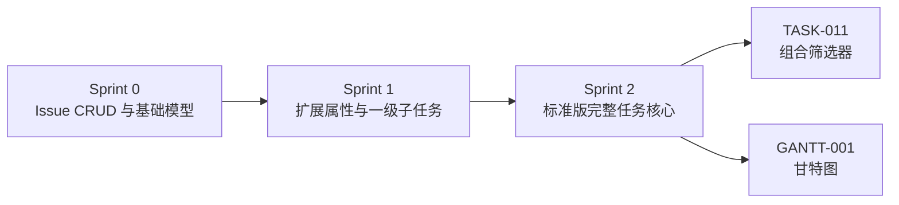
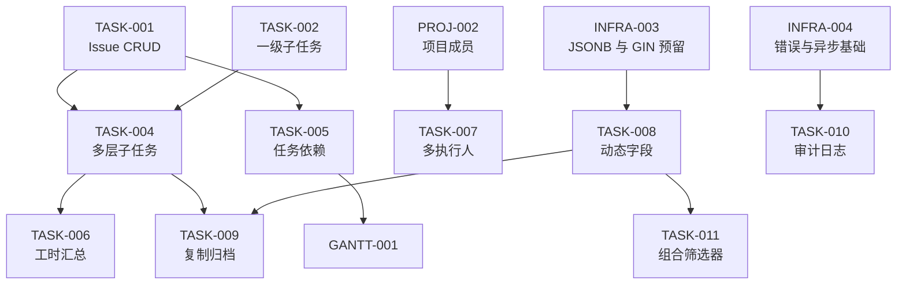

# Sprint 2 — 任务体系完善迭代概览

| 元信息项 | 内容 |
| --- | --- |
| 所属迭代 | Sprint 2 — 任务体系完善（第 4 周） |
| 优先级 | P2（标准版完整级） |
| 覆盖模块 | M4-TASK｜任务核心 |
| 文档状态 | 已确认（Approved） |
| 最后更新日期 | 2026-09-01 |
| 上游依赖 | Sprint 0 全量、Sprint 1 的 `TASK-002` / `TASK-003` / `PROJ-002` / `INFRA-004` |
| 下游消费 | `TASK-011` 组合筛选器、`GANTT-001` 甘特图、项目时间线与报表 |
| 迭代周期 | 5 个工作日，固定预留 20% 缓冲 |

---

## 1. 迭代目标

Sprint 2 在 Sprint 0-1 已建立的统一 `Issue`、一级子任务、任务属性和列表查询之上，补齐标准版完整任务体系：递归层级、依赖、工时、多执行人、动态字段、复制归档和全操作留痕。

核心结果：

1. `Issue` 可表达任意深度的工作分解结构，并准确汇总进度与工时。
2. `IssueLink` 可表达有向依赖且无环，状态流转可被未完成前置任务拦截。
3. 自定义字段实现元数据驱动、零 `ALTER TABLE`、12 种类型和缓存主动失效。
4. 所有写操作产生可追溯的 `IssueActivity`，活动时间线不阻塞主请求。
5. 复制、归档、恢复、多执行人等操作具备事务一致性、权限隔离和统一 API 契约。

## 2. 范围与边界

| 范围 | 本迭代交付 | 明确不做 |
| --- | --- | --- |
| 子任务 | 无限业务层级、递归 CTE 防环、父级进度汇总 | 跨项目父子关系、层级基线 |
| 依赖 | `blocks` / `is_blocked_by` / `relates_to` / `duplicates` | 自定义 Link Type、关键路径 |
| 工时 | 估算分钟、个人 WorkLog、任务/子树汇总 | 审批、计费、团队产能报表 |
| 执行人 | 多人分配、替换集合、转交、认领 | 排班、负载均衡、自动指派规则 |
| 自定义字段 | 12 种基础类型、作用域、JSONB + GIN、可视化管理 | 公式、级联、字段级权限 |
| 生命周期 | 深拷贝、软归档、恢复 | 跨 Workspace 复制、自动留存策略 |
| 审计 | 全字段 diff、异步写入、任务活动时间线 | 全站安全审计导出、合规告警 |

## 3. 前置依赖

进入 Sprint 2 前必须满足：

- Sprint 0-1 验收全部通过，`Issue` 完整字段已在 P0 建齐。
- `parent`、`custom_fields`、`archived_at`、`IssueAssignee`、`IssueActivity`、`IssueLink` 的迁移口径与架构文档一致。
- `ProjectScopedAPIView`、统一响应 envelope、错误码、Celery + RabbitMQ、Redis 可用。
- `TASK-002` 已开放一级子任务，`PROJ-002` 已提供 active 项目成员候选集。

## 4. P2 任务模块覆盖

| 文档 | 交付重点 | 关键数据结构 | 直接下游 |
| --- | --- | --- | --- |
| `TASK-004` | 递归子任务、进度联动、父子防环 | `Issue.parent_id`、递归 CTE | `TASK-006`、`TASK-009` |
| `TASK-005` | 四类关联、依赖防环、流转拦截 | `IssueLink` 成对记录 | `GANTT-001` |
| `TASK-006` | 估算与实际工时 | `Issue.estimate_minutes`、`WorkLog` | `TASK-013` |
| `TASK-007` | 多执行人、转交、认领 | `IssueAssignee` M2M | 个人待办、通知 |
| `TASK-008` | 12 种动态字段 | `CustomFieldDefinition`、`Issue.custom_fields` | `TASK-011` |
| `TASK-009` | 深拷贝、软归档与恢复 | `Issue.archived_at` | 项目生命周期 |
| `TASK-010` | 全字段审计时间线 | `IssueActivity`、Celery | 项目动态、合规审计 |

## 5. 统一工程约束

| 类别 | 约束 |
| --- | --- |
| API | URL 资源化、尾斜杠、`snake_case`；局部更新只用 `PATCH`；集合替换可用 `PUT` |
| 响应 | 除 `204` 外统一 `{status,data,meta}`；错误统一 `{status,error}` |
| 权限 | 所有查询先按 Workspace / Project 过滤；不可见资源返回 `404`；归档项目禁止写 |
| 时间 | 服务端 UTC，ISO 8601 毫秒 `Z`；工时使用整数分钟 |
| 并发 | 高冲突资源支持 `ETag` / `If-Match`；多资源写入使用 `transaction.atomic()` |
| 异步 | `transaction.on_commit()` 后投递；Celery 只传 ID；任务必须幂等 |
| 审计 | 业务写成功后必须可追溯；失败或回滚不得产生 Activity |
| 性能 | 列表禁止 N+1；递归深度限制 100；批量上限 100；常用路径有索引 |

## 6. 验收标准

- [ ] 7 份功能规格均严格包含「概述、业务逻辑、UI/UX、技术架构、测试用例、竞品对标、验收标准」7 章。
- [ ] 每份规格均有 Mermaid 流程/结构图、业务规则与异常边界表。
- [ ] 每份规格均给出 UI 布局和关键交互、Django Model、API JSON、MobX Store 示例。
- [ ] 每份规格均覆盖单元、API、前端、并发/性能或异步一致性测试。
- [ ] `TASK-005` 明确稳定输出 `GANTT-001` 可复用的依赖数据结构。
- [ ] `TASK-008` 完整落实 `dynamic-fields-design.md`，并明确 `TASK-011` 消费字段元数据。
- [ ] 任何跨租户 ID 注入均不能读取或写入他人数据。
- [ ] 10 万 Issue / 单项目 1 万基准下，自定义字段 5 条混合筛选 P95 小于 200ms。
- [ ] 依赖防环、父子防环、复制事务、归档恢复、Activity 异步重试均有自动化测试。
- [ ] UI 键盘可达、焦点可见、危险操作二次确认、错误可恢复。

## 7. 文档清单

| 序号 | 文件 | 一级标题 |
| --- | --- | --- |
| 1 | `TASK-004-subtask-hierarchy.md` | 多层级子任务与进度联动 |
| 2 | `TASK-005-task-dependency.md` | 任务前置 / 后置依赖关系 |
| 3 | `TASK-006-worklog.md` | 工时估算与工时填报 |
| 4 | `TASK-007-multi-assignee.md` | 多执行人 / 任务转交 / 认领 |
| 5 | `TASK-008-custom-fields-basic.md` | 基础自定义字段动态增删 |
| 6 | `TASK-009-task-copy-archive.md` | 任务复制 / 归档 |
| 7 | `TASK-010-full-audit-log.md` | 全操作留痕审计日志 |

## 8. 排期

| 工作日 | 主线 A | 主线 B | 当日验收 |
| --- | --- | --- | --- |
| Day 1 | `TASK-004` 递归层级 | `TASK-007` 多执行人 | CTE、防环、M2M API 通过 |
| Day 2 | `TASK-005` 依赖关系 | `TASK-006` 工时 | 环检测、流转拦截、WorkLog 汇总通过 |
| Day 3 | `TASK-008` 元数据与校验 | `TASK-010` diff 管道 | 12 类型校验、缓存失效、审计投递通过 |
| Day 4 | `TASK-008` 管理 UI | `TASK-009` 复制归档 | 动态表单、深拷贝、恢复通过 |
| Day 5 | 联调、压测、无障碍 | 回归、文档评审、缓冲 | Sprint 验收清单全部通过 |

并行原则：同一数据结构仅一人主改；`TASK-004` 稳定后再接 `TASK-006` / `TASK-009`，`TASK-008` Schema API 稳定后再接 `TASK-011`。