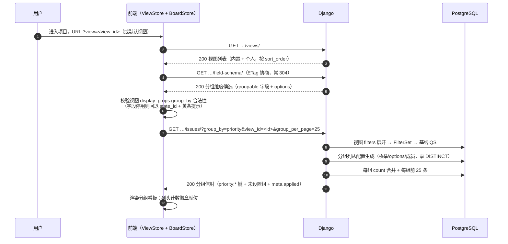
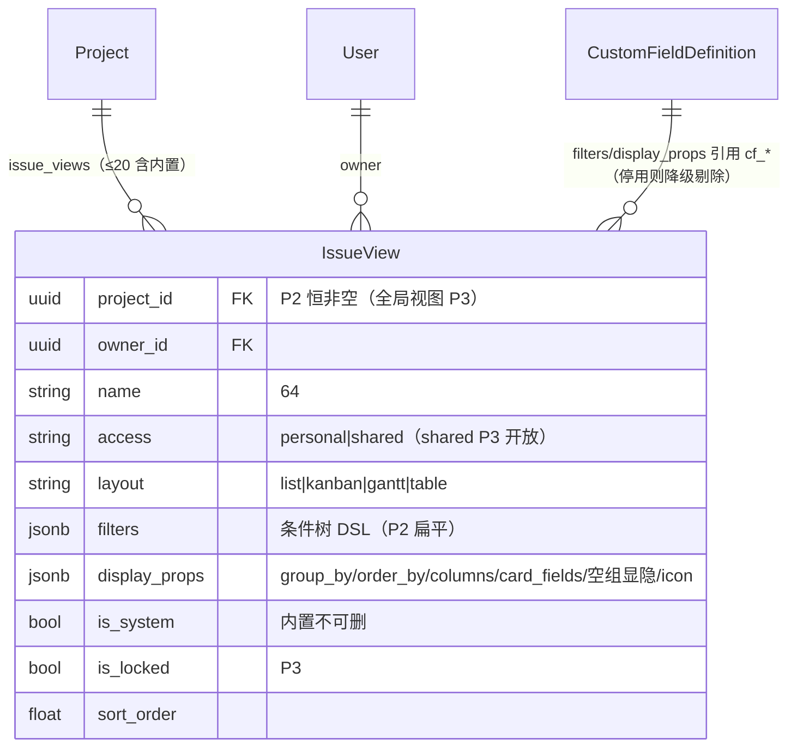

# 多个独立看板与视图配置

| 元信息项 | 内容 |
| --- | --- |
| 文档编号 | BOARD-003 |
| 所属迭代 | Sprint 3 — 高级视图 + 实时协作（第 5 周） |
| 优先级 | P2（标准版完整级 · **视图体系的地基文档**） |
| 所属模块 | M5-BOARD｜看板视图 |
| 文档状态 | 待评审（Draft） |
| 最后更新日期 | 2026-09-01 |
| 上游依赖 | `BOARD-001/002`（分组端点契约 `state:{id}` 键 / 空列恒在 / 组内 25 条 / `KanbanGroupView` / `BoardFilterState` URL 态）、`TASK-003`（`IssueFilterSet` 单点复用与 `meta.applied`）、`TASK-008`（**Schema API：`filterable/sortable/groupable` 推导与 `options` 元数据——分组维度的唯一合法来源**）、`PROJ-002`（成员列表——按负责人分组的列来源） |
| 下游消费 | **`TASK-011`（Saved View 的 filters 字段由其 DSL 编译器全量点亮——本文档先交付扁平条件）**、`GANTT-001`（甘特布局复用 `IssueView.layout` 与 `display_props`）、`BOARD-004`（批量操作作用于当前视图结果集）、`BOARD-005`（P3 视图共享 / 管理员锁定，`access`/`is_locked` 列本迭代建好不开放）、`RPT-002`（视图即统计切片） |
| 上游依据 | `docs/需求文档.md` §3.5（项目专属看板、多看板支持、看板筛选）、§8.2 看板 P2 列（多个独立看板、视图配置保存）；§8.2 看板 P3 列（视图团队共享、管理员视图锁定——边界依据） |
| 关联架构文档 | [`dynamic-fields-design.md`](../architecture/dynamic-fields-design.md)（**§5.6 IssueView 完整模型——本文档逐字段落地**；§6.4 `kanban_groups` 分组列生成原则；§5.2 DSL 结构）、[`unified-issue-model.md`](../architecture/unified-issue-model.md)（§5.4 内置视图种子 `BUILTIN_VIEWS`）、[`api-conventions.md`](../architecture/api-conventions.md)（§2.5 `views/` 端点、§5.3 Saved View 承载复杂条件、§8 错误码）、[`rbac-permission-model.md`](../architecture/rbac-permission-model.md)（`board.manage`/`board.read`/`board.update` 权限码） |
| 对标基线 | Plane `IssueView`（`apps/api/plane/db/models/view.py` + `views/` 端点族） · Ones 视图模板 / 按角色共享 / 管理员锁定（Business+） |
| 工作量估算 | 后端 3 人日 / 前端 3.5 人日 / 联调与测试 1.5 人日，合计 **8 人日** |

---

## 1. 概述

### 1.1 功能定位

P1 的看板只有一块：筛选态活在 URL query 里（`BOARD-002` BR-07），换台电脑、点个收藏、隔天再来——精心调好的「我的高优视图」就散了。P2 交付**视图持久化**：

1. **`IssueView` 表落地**：筛选 + 排序 + 分组 + 显示列的组合存库，一个项目可建多块独立看板（「按状态推进」「按优先级救火」「按负责人站会」三块并存）；
2. **分组维度放开**：从「仅状态」放开到 **优先级 / 负责人 / 标签 / 自定义字段（select 类）**——分组列从字段元数据（`options` / 枚举表 / 成员表）生成，**永不 `SELECT DISTINCT` 扫数据表**（架构文档 §6.4 原则）；
3. **显示配置**：卡片字段开关（标签 / 子任务 / 附件 / 工时）、空组显隐、列显示——`display_props` 一个 JSONB 承载，四布局共用；
4. **内置视图种子**：需求池 / 缺陷列表 / 我的待办 / 本周到期随迁移种入（`is_system=True` 不可删）——统一工作项模型 §5.4 设计的兑现。

一句话：**P1 的「URL 是视图雏形」升级为「视图是一等公民」**——`TASK-011` 的组合筛选器、`GANTT-001` 的甘特布局、P3 的共享与锁定，全部生长在这张表上。

### 1.2 关键约定：四布局共用一份视图配置

> ⚠️ **本文档最重要的架构约定，也是相对 Plane 的体验改进点。**

`IssueView` 的 `filters`（筛什么）与 `display_props`（怎么摆）**独立于 `layout`（摆成什么）**。用户在列表视图调好「缺陷 + 高优 + 本周」的筛选，切到看板布局——条件原样带过去，只是呈现形态变了：

| 字段 | 职责 | 布局相关？ |
| --- | --- | --- |
| `filters` | 条件树（DSL JSON，本迭代扁平、`TASK-011` 放开嵌套） | ❌ 布局无关 |
| `display_props.order_by` / `group_by` / `columns` | 排序键 / 分组维度 / 列显示 | 部分（`columns` 仅列表/表格消费；`group_by` 看板/甘特消费） |
| `display_props.card_fields` / `show_empty_groups` | 卡片字段开关 / 空组显隐 | 看板消费 |
| `layout` | `list` / `kanban` / `gantt` / `table` 四选一 | ✅ 本体 |

切布局 = 只改 `layout` 一个值（PATCH 单字段），`filters` 与 `display_props` 原样保留。**Plane 的 `display_filters` 与 `display_properties` 在部分布局间存在互斥重置**（切布局丢条件是其社区反馈的高频吐槽），本系统以「条件与呈现正交」规避。

### 1.3 能力 × 迭代矩阵

| 能力 | P1（BOARD-002） | **P2（本文档）** | P3（BOARD-005） |
| --- | --- | --- | --- |
| 筛选态载体 | URL query（会话级） | **`IssueView.filters` 持久化** | 同左 + 跨项目全局视图 |
| 视图数量 | 1（隐式） | **多块（上限 20/项目，含内置）** | 同左 |
| 分组维度 | 仅 `state_id` | **state / priority / assignee / label / cf_select** | 泳道式二维分组（`sub_group_by`） |
| 分组列来源 | State 表 | **枚举表 / 字段 options / 成员表（配置生成）** | 同左 |
| 显示配置 | 固定字段集 | **卡片字段开关 / 空组显隐 / 列显示** | 布局模板 |
| 布局 | 看板 | **list / kanban / gantt（占位）/ table 切换** | 同左 |
| 视图共享 | ❌ | ❌ 个人视图（`access` 列建好不开放） | ✅ shared + 角色可见性 |
| 视图锁定 | ❌ | ❌（`is_locked` 列建好不开放） | ✅ 管理员锁定 |
| 内置视图 | ❌ | ✅ 需求池 / 缺陷列表 / 我的待办 / 本周到期 | 组织级模板下发 |

### 1.4 范围边界

| 能力 | 本文档（P2） | 归属 |
| --- | --- | --- |
| `IssueView` 表 + CRUD + 迁移 + 内置种子 | ✅ | — |
| 多看板并存 + 视图切换器 + 另存为/重命名/删除 | ✅ | — |
| 五维分组（state/priority/assignee/label/cf_select）+ 空组恒在 | ✅ | — |
| 显示配置（卡片字段 / 空组显隐 / 列显示 / 排序键） | ✅ | — |
| 四布局切换（条件保持） | ✅（gantt 渲染归 `GANTT-001`，本迭代占位路由） | `GANTT-001` |
| 视图 filters 存扁平条件树（单层 AND） | ✅ | `TASK-011` 放开嵌套 OR/分组 + 占位符 |
| 视图团队共享 / 管理员锁定 / 组织模板 | ❌ 列已建 | P3 `BOARD-005` / `TEAM-003` |
| 泳道二维分组（`sub_group_by`） | ❌ 字段建好恒 null | P3 |
| 按任意自定义字段分组（非 select 类） | ❌ 仅 select（`groupable` 推导） | P3 视类型扩展 |
| 按迭代（Cycle）/ 模块分组 | ❌（模型 P2 后引入） | `GANTT-001` 之后评估 |
| 视图导出 / 分享链接权限 | ❌ URL 直达（个人权限内） | P3 |

### 1.5 前置依赖

| 依赖 | 内容 | 阻塞原因 |
| --- | --- | --- |
| `BOARD-002` | `KanbanGroupView` 分组契约（`state:{id}` 键结构 / 每 State 有键含空列 / 组内 25 条 + `total_results` / `meta.applied` / 组内游标筛选指纹）；`BoardFilterState` URL 同源机制 | 本迭代把分组端点**泛化**为多维度，键结构与契约逐条沿用 |
| `TASK-003` | `IssueFilterSet` 单点（看板参数域 = 全集减 `state_id`） | 视图 filters 展开后注入同一 FilterSet |
| `TASK-008` | `field-schema/`（`groupable` 推导、`options` 元数据、ETag 协商） | 分组维度白名单与分组列生成的唯一来源 |
| `PROJ-002` | 项目 active 成员列表 | 按负责人分组的列来源（配置生成，不查 Issue 表） |
| `INFRA-004` | 信封 / 错误码 / `VALIDATION_INVALID_PARAM` | 端点契约 |

### 1.6 竞品参考

| 竞品 | 参考点 | 处置 |
| --- | --- | --- |
| Plane | `IssueView`（`view.py`：`display_properties` / `filters` JSONB + `is_locked`；views 端点族 + 每用户视图偏好） | **表结构对齐**（字段命名族一致，便于社区方案平移）；补齐其「切布局丢条件」缺陷（§1.2） |
| Plane | 内置无「需求池」类系统视图（靠手动建） | 内置种子四视图（`unified-issue-model.md` §5.4） |
| Ones | 视图模板按角色共享、管理员锁定、组织统一下发 | 理念采纳、执行分阶段：P2 个人视图 → P3 共享/锁定（`BOARD-005`）——需求文档 §8.2 P3 列的明确边界 |
| Jira | Board 与 Filter 分离建模（filter 先建、board 引用） | 不采纳：两套对象两套权限，配置心智翻倍；`IssueView` 单对象承载 |

---

## 2. 业务逻辑

### 2.1 视图生命周期

```mermaid
stateDiagram-v2
    [*] --> urlState: P1 既有——URL query 筛选态
    urlState --> saved: 保存为视图（输入名称/图标/布局）
    saved --> saved: 更新（filters/display_props/layout 就地改）
    saved --> savedCopy: 另存为（复制为新视图，原名 + 副本）
    saved --> default: 设为默认视图（项目内唯一，进项目直达）
    saved --> deleted: 删除（软删；is_system 拒绝）
    deleted --> [*]
    note right of saved
        内置视图（is_system）：
        可改 display_props、不可删、
        不可改 filters 锁定口径（需求池=类型需求）
    end note
```

### 2.2 视图加载与分组解析



### 2.3 五维分组语义表

分组维度是本迭代放开的最大语义面。五类的**分组列来源、空组语义、组内排序**逐类冻结如下（`__none__` 为「未设置」组的统一哨兵值）：

| group_by | 分组列来源（配置生成） | 组键形态 | 「未设置」组 | 组内默认排序 | 拖拽语义 |
| --- | --- | --- | --- | --- | --- |
| `state_id` | 项目 `State` 表（`BOARD-002` 既有） | `state:{state_uuid}` | 无（状态必填，默认态兜底） | `sort_order`（拖拽序） | 跨列拖拽 = 改状态（P0 语义不变） |
| `priority` | `Priority` 枚举（五档色值固定表） | `priority:urgent` 等 5 键 | `priority:none` 归入 `none` 列 | `-priority`（语义权重） | 跨列拖拽 = 改优先级（**P2 新增**） |
| `assignee_id` | 项目 active 成员表（`PROJ-002`） | `assignee:{user_uuid}` | `assignee:__none__`（未指派池） | `sort_order` | 跨列拖拽 = 改执行人集合（单人语义替换；多人成员卡片恒留） |
| `label_id` | 项目 `Label` 表（`TASK-002`） | `label:{label_uuid}` | `label:__none__`（无标签） | `sort_order` | 跨列拖拽 = 替换标签集合为该标签（多标签卡片恒留原列并提示） |
| `cf_<key>` | 字段 `options`（`kanban_groups()`，仅 `groupable=true` 的 select 类） | `cf_<key>:<option_value>` | `cf_<key>:__none__`（未填值） | `sort_order` | 跨列拖拽 = 写该字段值（经 `validate_field_value`） |

三条全局分组铁律（自 `BOARD-002` 契约推广）：

1. **分组列由配置生成，不查数据**：`priority` 查枚举、`assignee` 查成员表、`label` 查标签表、`cf_*` 读 `options`——任何维度的空列（0 命中）都恒在响应中（架构文档 §6.4：杜绝 `SELECT DISTINCT custom_fields->>'k'` 式全表扫描）；
2. **组内序与拖拽序解耦的维度**只有 `priority`（组内按语义权重，拖拽仅改优先级不改组内序）；其余维度组内沿 `sort_order`——同列排序复用 `BOARD-001` 插值管道；
3. **`__none__` 组恒在且排最末**：「未指派」「无标签」「未填值」是管理者要看见的债务，不是要藏起来的噪声。

### 2.4 跨维度拖拽的写路径

分组维度放开后，「拖拽」不再只等于改状态——按维度分派写语义：

| 分组维度 | 拖入目标列 | 服务端动作 | 校验 |
| --- | --- | --- | --- |
| `state_id` | 状态 X | `PATCH {state_id, sort_order}`（P0 语义原样） | 流转拦截（`TASK-005` 前置依赖检查） |
| `priority` | 优先级 P | `PATCH {priority, sort_order}` | 枚举合法（列即合法值，天然通过） |
| `assignee_id` | 成员 M 列 | `PUT …/assignees/`（`TASK-007` 全量替换为 `[M]`）；拖入 `__none__` = 清空 | M 为 active 成员；`__none__` 拖拽被 BR-14 拦（不允许拖成「无人」，清空走详情/批量） |
| `label_id` | 标签 L 列 | `PUT …/labels/`（替换为 `[L]`）；拖入 `__none__` = 清空标签 | 同上，多标签卡片拖拽弹确认（见 BR-15） |
| `cf_<key>` | 选项 V 列 | `PATCH {custom_fields: {cf_x: V}}`；拖入 `__none__` = 删该键（传 null） | `validate_field_value`；字段停用则 409 |

> **设计原则：拖拽始终映射到「该维度的正规写端点」**——不新建旁路写路径，权限/校验/Activity 与表单编辑完全同源。这是「视图只读地换呈现、写语义永不旁路」的落地。

### 2.5 业务规则汇总

| 编号 | 规则 | 判定位置 | 违反后果 |
| --- | --- | --- | --- |
| BR-01 | 视图归属：`project` 非空（项目级个人视图，P2 唯一形态）；`owner` = 创建者；`access` 列仅允许 `personal`（`shared` 值 P2 拒绝——P3 `BOARD-005` 放开） | Serializer | `400 VALIDATION_ERROR` + `NOT_A_CHOICE` |
| BR-02 | 单项目视图数上限 **20**（含 4 内置）；超出拒绝 | Service | `409 RESOURCE_LIMIT_EXCEEDED` |
| BR-03 | 内置视图（`is_system`）：不可删除、`filters` 不可改（口径锁定：需求池=类型需求）、`display_props` 与 `sort_order` 可改 | Service | `400/403` |
| BR-04 | `layout` ∈ {`list`,`kanban`,`gantt`,`table`}；切布局仅改 `layout`，`filters`/`display_props` 服务端拒绝联动重置 | Serializer | `400` |
| BR-05 | `display_props.group_by` 必须在 Schema API `groupable` 白名单内（内置：`state_id`/`priority`/`assignee_id`/`label_id`；自定义：`groupable=true` 的 select 类 `cf_*`）；字段停用/删除后视图加载**回退 `state_id`** 并 `meta.degraded.group_by` 提示，不报错 | ViewService | 保存时 `400`；读取时降级 |
| BR-06 | 分组列从配置生成（枚举/State/Label/成员/`options`），**任何代码路径禁止 `SELECT DISTINCT` 扫 `issues` 生成分组**；`__none__` 组恒在最末 | 评审约束 + CI 检查 | 评审拒绝 |
| BR-07 | `filters` 本迭代为**扁平条件树**：`{"op":"AND","conditions":[{field,operator,value}…]}`，深度 1、节点 ≤ 20；嵌套 OR 与占位符归 `TASK-011`（同字段向后兼容升级） | Serializer + DSL 校验 | `400`（超限 / 嵌套 / 非法字段操作符） |
| BR-08 | `filters` 中引用的字段被停用/删除：读取时该条件剔除 + `meta.degraded.filters` 提示（降级不报错，与 `TASK-008` 视图引用剔除任务联动） | ViewService | — |
| BR-09 | `display_props.card_fields` 仅允许 Schema 中存在的字段开关集（labels/sub_issues/attachments/estimate/priority/timer 七项固定 + `cf_*` 布尔）；未知键剔除 | Serializer | 静默剔除 |
| BR-10 | 默认视图：项目内每用户至多一个（`is_default` 用户偏好维度存 profile，不在表上建约束）；进项目无 `?view=` 时取默认，再退首个内置 | Service | — |
| BR-11 | 视图管理权限：`board.manage`（PROJ_ADMIN+）可管理全部个人视图（审计场景）；普通成员仅 `owner == self` 可写；读（列表）= `board.read`（项目全员可见视图名与配置——为 P3 共享做认知预热，但应用视图仍各用各的） | Permission | `403 PERM_ROLE_INSUFFICIENT` / `404` |
| BR-12 | 视图删除 = 软删；他人 URL `?view=<已删>` 回退默认视图 + 黄条「视图已删除」；`is_system` 删除请求 403 | Service | — |
| BR-13 | `sort_order` 视图排序浮点插值（复用 `BOARD-001` 算法）；「设为默认」不改排序 | Service | — |
| BR-14 | `assignee:__none__` / `label:__none__` / `cf_*:__none__` 列**可拖出不可拖入**（拖入 = 制造「未设置」应走清空操作，入口在详情/批量）；`priority:none` 可自由拖入（none 是合法优先级） | 前端 canDrop + Service | `400` |
| BR-15 | 多标签 / 多执行人卡片在 `label_id` / `assignee_id` 分组下跨列拖拽：弹确认「将把标签集合替换为 [X]」——替换语义必须显式知情 | 前端确认层 | 取消则不动 |
| BR-16 | 分组端点响应契约沿用 `BOARD-002`：键 `{dimension}:{value}`、每组 `state`→`group` 元数据（id/name/group/color）、`results ≤ 25` + `total_results`、`meta.applied`、组内游标带筛选指纹 + 维度指纹 | `DimensionGroupView` | — |

### 2.6 异常处理

| 场景 | HTTP | 错误码 | details 子码 | 前端表现 |
| --- | --- | --- | --- | --- |
| `group_by` 非法（未知字段 / 非 groupable） | 400 | `VALIDATION_INVALID_PARAM` | `INVALID` | 「该字段不支持分组」；视图配置面板标红 |
| `layout` 非法值 | 400 | `VALIDATION_INVALID_PARAM` | `INVALID` | 切换器抖动 |
| filters 嵌套（本迭代扁平） | 400 | `VALIDATION_ERROR` | `INVALID` | 「组合条件将在后续版本开放」（TASK-011 前的兜底文案） |
| filters 节点 > 20 | 400 | `VALIDATION_ERROR` | `TOO_MANY` | 计数提示 |
| 视图数超 20 | 409 | `RESOURCE_LIMIT_EXCEEDED` | `LIMIT` | 「请先删除不需要的视图」 |
| 改内置视图 filters | 403 | `PERM_DENIED` | — | 「内置视图口径锁定」 |
| 删除内置视图 | 403 | `PERM_DENIED` | — | 删除按钮不渲染；直连 403 |
| 访问他人个人视图 | 404 | `RESOURCE_NOT_FOUND` | — | 通用 404（存在性隐藏，P2 无共享） |
| 分组字段停用后加载 | 200 | —（降级） | — | 回退状态分组 + 黄条「分组字段已停用」 |
| 拖入 `__none__` 列 | 400 | `VALIDATION_ERROR` | `INVALID` | 拖拽弹回 + toast 解释 |
| 拖 cf 列但字段值非法（理论不可达） | 400 | `VALIDATION_CUSTOM_FIELD_INVALID` | `NOT_A_CHOICE` | 弹回 + toast |

### 2.7 边界条件

| 边界场景 | 限制值 | 超出处理 |
| --- | --- | --- |
| 项目视图数（含内置） | 20 | 409 |
| filters 条件节点 | 20 | 400（TASK-011 后升 20 保持，深度放开 3） |
| 视图名长度 | 64 | 400 TOO_LONG |
| 分组列数上限 | 维度天然上限（枚举 5 / 标签 100 / 成员 50 / 选项 100） | 列区横向滚动 |
| 卡片字段开关数 | 固定 7 + `cf_*` | — |
| `__none__` 组卡片量 | 无上限（未指派池可能巨大） | 组内分页 25 + 「批量指派」引导入口（接 `BOARD-004`） |
| 视图列表加载 | 一次全量（≤20） | 无分页 |

---

## 3. UI/UX 设计

### 3.1 视图切换器（工具条升级）

```
┌──────────────────────────────────────────────────────────────────────────────────┐
│ [📐列表|▮看板|▦表格|⏱甘特] │ ●全部  ●需求池  ●缺陷列表  ●我的待办  ＋ ▾ │ ⚙ 显示 ▾ │
│                             ╰── 当前视图：救火看板 ●（默认 ★）──╯                │
├──────────────────────────────────────────────────────────────────────────────────┤
│ 🔍 搜索…  [👤 负责人 ▾] [⚑ 优先级 ▾] [🏷 标签 ▾]        ( me × ) ( 高/紧急 × )   │
│                                            视图已修改 · [保存] [另存为] [放弃]     │
└──────────────────────────────────────────────────────────────────────────────────┘
```

| 元素 | 规格 |
| --- | --- |
| 布局分段控件 | 工具条最左四段（list/kanban/table/gantt）；点击 = PATCH 视图 `layout` 单字段（BR-04）；gantt 在 `GANTT-001` 交付前禁用态 + tooltip「甘特视图即将上线」 |
| 视图 Tabs | 视图名横排（内置带 🔒 角标 = 口径锁定）；当前视图高亮下划线；超出 6 个折叠进「＋ ▾」下拉 |
| 默认星标 | 视图名右 `★` 切换默认（BR-10）；内置视图也可设默认 |
| 视图已修改条 | 筛选/分组/显示与视图存档不一致时出现（黄底）；[保存] 就地更新 / [另存为] 弹名称输入 / [放弃] 还原存档——**未保存离开弹确认** |
| ⚙ 显示 | 显示配置面板入口（§3.3） |
| 视图右键菜单 | 重命名 / 复制视图 / 设为默认 / 删除（内置无删除项） |

### 3.2 分组看板（按优先级示例）

```
┌─────────────────────────────────────────────────────────────────────────────────┐
│ 视图：救火看板 · 按优先级分组                                   分组：[⚑ 优先级 ▾] │
├───────────────┬───────────────┬───────────────┬───────────────┬───────────────┤
│ 🔴 紧急     2 │ 🟠 高       1 │ 🔵 中       2 │ 🟢 低       0 │ ⚪ 无       3 │
│ ───────────── │ ───────────── │ ───────────── │ ───────────── │ ───────────── │
│ ┃🐛登录页500  │ ┃⚙导出限流    │ ┃📦ORM 模型    │  （空列恒在）  │ ┃📝周报模板   │
│ ┃👤张三 8-30  │ ┃👤李四 9-05  │ ┃👤王五        │               │ ┃👤—          │
│ ┗━━━━━━━━━━━ │ ┗━━━━━━━━━━━ │ ┗━━━━━━━━━━━ │               │ ┃📝旧导出方案 │
│ ┃🐛支付回调    │               │ ┃⚙灰度配置    │               │ ┃👤赵六        │
│ ┃👤李四 9-02  │               │ ┃👤张三        │               │ ┗━━━━━━━━━━━ │
│ ┗━━━━━━━━━━━ │               │ ┗━━━━━━━━━━━ │               │               │
│ ＋ 添加任务    │ ＋ 添加任务    │ ＋ 添加任务    │ ＋ 添加任务    │ ＋ 添加任务   │
└───────────────┴───────────────┴───────────────┴───────────────┴───────────────┘
  拖「支付回调」到「高」列 = PATCH priority=high（写路径 §2.4）；组内仍按拖拽序
```

| 元素 | 规格 |
| --- | --- |
| 列头 | 维度色点（priority 五档固定色 / label 用 `Label.color` / cf 用 `options[].color` / assignee 用成员头像 24px）+ 列名 + 计数徽章 |
| `__none__` 列 | 名「未指派 / 无标签 / 未填值」+ 虚线列头样式；可拖出不可拖入（BR-14） |
| 空列 | 恒渲染（0 计数 + 空提示），`show_empty_groups=false` 时折叠为一枚列头胶囊 |
| 分组切换器 | 工具条右侧下拉：状态 / 优先级 / 负责人 / 标签 / 自定义 select 字段（groupable 候选）+「按状态」置顶 |
| 列宽 | 280px 固定；> 6 列横向滚动（`scroll-snap` 沿 `BOARD-001`） |

### 3.3 显示配置面板（Display Properties）

```
┌──────────────────────────────┐
│ 显示配置                 ✕   │
│ ──────────────────────────── │
│ 分组          [⚑ 优先级  ▾] │
│ 排序          [拖拽顺序  ▾] │
│ ──────────────────────────── │
│ 卡片显示                     │
│  ☑ 标签          ☑ 子任务   │
│  ☑ 附件数        ☐ 工时     │
│  ☑ 优先级        ☑ 截止时间 │
│  ☑ 自定义：严重等级          │
│ ──────────────────────────── │
│ ☑ 显示空分组                 │
│ 列（列表布局） [全选] 清空    │
│  ☑编号 ☑标题 ☑状态 ☑负责人   │
│  ☐优先级 ☐标签 ☑截止 ☐工时   │
│ ──────────────────────────── │
│              [重置] [保存到视图]│
└──────────────────────────────┘
```

| 元素 | 规格 |
| --- | --- |
| 面板形态 | 右侧 Drawer 320px / 弹层（触发锚定 ⚙ 按钮）；改动即预览（乐观应用） |
| 分组候选 | Schema `groupable` 字段（BR-05 白名单同源）；当前值停用则红字提示 |
| 卡片开关 | 固定 7 项 + `cf_*`（`card_fields` JSONB，BR-09） |
| 空组显隐 | 开关联动看板空列折叠（默认显示——债务可见原则） |
| 列配置 | 仅 list/table 布局显示该区（`columns` 数组，拖拽排序） |
| 保存到视图 | 写回当前视图 `display_props`（若当前为内置视图：允许——BR-03）；未保存关闭 = 仅本会话生效 + 已修改条提示 |

### 3.4 保存 / 另存为弹层

```
┌────────────────────────────────────────┐
│ 保存视图                                │
│ 名称   ┌──────────────────────┐        │
│        │ 救火看板 (副本)        │        │
│        └──────────────────────┘        │
│ 图标   ○📈 ○🔥 ●🚒 ○🧊 ○📦（8 选 1）   │
│ 布局   ○列表 ●看板 ○表格 ○甘特          │
│                                          │
│ ⓘ 将保存当前筛选、分组与显示配置。        │
│                    [取消]  [创建视图]    │
└────────────────────────────────────────┘
```

| 元素 | 规格 |
| --- | --- |
| 名称 | 默认「当前视图名 (副本)」；64 字上限；项目内重名允许（靠 id 区分）但同名时警告样式 |
| 图标 | 8 枚 emoji 预设（存 `display_props.icon`，Tabs 渲染用） |
| 布局 | 当前布局预选；创建后可切（BR-04） |
| 另存为 | 不改动原视图；新建后立即切换为该视图 |

### 3.5 交互细节表

| 交互动作 | 触发方式 | 反馈效果 | 加载态 / 空态 |
| --- | --- | --- | --- |
| 切换视图 | 点 Tabs / 下拉项 | URL 更新 `?view=<id>`；分组数据按视图 filters 重拉（SWR key 变化）；120ms 卡片渐隐重排 | 目标视图分组骨架 |
| 切换布局 | 分段控件 | 仅路由段变化 + PATCH layout；筛选/分组保持；列表↔看板动画切换 | 布局骨架 |
| 修改后未保存 | 任一筛选/显示改动 | 「视图已修改」黄条浮现 | — |
| 保存 | 黄条 [保存] | 黄条收起 + Toast「视图已更新」 | — |
| 设为默认 | 视图菜单 ★ | 星标点亮；进项目直达 | — |
| 分组切换 | 显示面板 / 分组下拉 | 列重建（配置生成，无请求）；数据重拉 | 骨架 |
| 跨维度拖拽 | 拖卡到优先级/标签列 | 乐观变色/移动 + 正规写端点；多值替换先弹确认（BR-15） | 失败回滚弹回 |
| 拖入 `__none__` | 拖向哨兵列 | 落点显示 🚫 光标 + toast 解释（BR-14） | — |
| 停用字段降级 | 加载视图 | 黄条「分组字段已停用，已回退状态分组」 | — |

### 3.6 空状态 / 加载 / 失败

| 场景 | 处置 |
| --- | --- |
| 项目首次进入（无自定义视图） | 默认应用「全部」内置视图（`filters={}`）；视图 Tabs 引导气泡「保存你的第一块看板」 |
| 视图结果为空 | 分组结构保留 + 中央空态（`BOARD-002` §3.6 同款「无匹配卡片 + 清空筛选」） |
| 视图列表加载 | Tabs 骨架条 |
| 视图已被删除（旧 URL） | 黄条「视图已删除，已切换默认视图」+ 自动跳默认 |
| gantt 布局点击 | 禁用态 + tooltip（`GANTT-001` 前置） |

### 3.7 响应式与无障碍

| 断点 | 布局 |
| --- | --- |
| ≥ 1280px | Tabs 全量 + 显示面板 Drawer 320px |
| 768~1279px | Tabs 折叠为下拉选择器；面板改底部抽屉 |
| < 768px | 布局分段控件收纳进「⋯」菜单；视图切换器单行下拉 |

无障碍：视图 Tabs 为 `role="tablist"/tab`（`aria-selected` 绑定当前）；分组列头 `aria-label` 含维度名与计数（「优先级 紧急，2 个任务」）；`__none__` 列 `aria-label` 用中文哨兵名（不用 `__none__` 字面量）；显示面板为 `role="dialog"` + 焦点陷阱；跨维度拖拽的键盘替代 = 卡片菜单「设置优先级 / 指派给 / 设置标签 / 设为…」（按当前分组维度动态生成）。

---

## 4. 技术架构

### 4.1 数据模型

#### 4.1.1 `IssueView`（新表，逐字段落地架构文档 §5.6）

```python
# apps/api/plane/db/models/view.py
from django.db import models

from plane.db.models.base import BaseModel


class IssueView(BaseModel):
    """保存的视图 —— 筛选 + 排序 + 分组 + 显示列 + 布局的组合

    四大布局（list/kanban/gantt/table）共用 filters 与 display_props：
    切换布局只改 layout，条件不丢（BOARD-003 §1.2 正交原则）。
    access=shared 与 is_locked 的 UI/权限面归 P3 BOARD-005，列本迭代建好。
    """

    class Access(models.TextChoices):
        PERSONAL = "personal", "个人视图"
        SHARED = "shared", "共享视图"          # P3 开放

    class Layout(models.TextChoices):
        LIST = "list", "列表"
        KANBAN = "kanban", "看板"
        GANTT = "gantt", "甘特图"
        TABLE = "table", "表格"

    workspace = models.ForeignKey("db.Workspace", on_delete=models.CASCADE,
                                  related_name="issue_views", verbose_name="所属工作空间")
    project = models.ForeignKey("db.Project", on_delete=models.CASCADE, null=True,
                                blank=True, related_name="issue_views",
                                verbose_name="所属项目",
                                help_text="为空表示跨项目全局视图（P3）")
    owner = models.ForeignKey("db.User", on_delete=models.CASCADE,
                              related_name="issue_views", verbose_name="创建者")
    name = models.CharField(max_length=64, verbose_name="视图名称")
    description = models.TextField(blank=True, verbose_name="视图说明")
    access = models.CharField(max_length=16, choices=Access.choices,
                              default=Access.PERSONAL, verbose_name="访问范围")
    layout = models.CharField(max_length=16, choices=Layout.choices,
                              default=Layout.KANBAN, verbose_name="布局")

    filters = models.JSONField(default=dict, verbose_name="筛选条件树（DSL）",
        help_text='扁平形态：{"op":"AND","conditions":[{"field":"priority","operator":"in","value":["urgent"]}]}')
    display_props = models.JSONField(default=dict, verbose_name="展示配置",
        help_text='{"icon":"🚒","group_by":"priority","order_by":"sort_order",'
                  '"columns":["issue_key","name","state_id","assignee_ids","target_date"],'
                  '"card_fields":{"labels":true,"sub_issues":true,"attachments":true,'
                  '"estimate":false,"priority":true,"timer":true,"cf_severity":true},'
                  '"show_empty_groups":true,"sub_group_by":null}')

    is_system = models.BooleanField(default=False, verbose_name="内置视图",
                                    help_text="需求池/缺陷列表等，不可删除、filters 锁定")
    is_locked = models.BooleanField(default=False, verbose_name="管理员锁定（P3）")
    sort_order = models.FloatField(default=65535.0, verbose_name="显示排序")

    class Meta(BaseModel.Meta):
        db_table = "issue_views"
        verbose_name = "任务视图"
        ordering = ("sort_order", "created_at")
        indexes = [
            models.Index(fields=["project", "access", "sort_order"], name="idx_view_proj_access"),
            models.Index(fields=["owner", "access"], name="idx_view_owner_access"),
        ]
```



> **值无独立表**：filters 与 display_props 均为 JSONB 内联（与自定义字段同哲学）。视图是「读时配置」不是数据，JSONB 的灵活性收益最大、一致性成本最小（字段引用失效走降级剔除，`TASK-008` 的 `prune_views_referencing_field` 任务已预置该钩子）。

#### 4.1.2 迁移与内置种子

```python
# apps/api/plane/db/migrations/00XX_p3_issue_views.py
class Migration(migrations.Migration):
    dependencies = [("db", "00XX_p2_custom_fields")]
    operations = [
        migrations.CreateModel(...),   # §4.1.1 完整定义（新表，无并发风险）
        # 内置视图种子（unified-issue-model.md §5.4 BUILTIN_VIEWS 的 P2 兑现）
        migrations.RunPython(seed_builtin_views, migrations.RunPython.noop),
    ]


# apps/api/plane/db/seed/views.py
BUILTIN_VIEWS = [
    {"name": "全部", "icon": "📋", "layout": "list",
     "filters": {"op": "AND", "conditions": []},                       # 无条件
     "display_props": {"group_by": None, "order_by": "-created_at"}, "sort_order": 1000},
    {"name": "需求池", "icon": "sparkles", "layout": "kanban",
     "filters": {"op": "AND", "conditions": [
         {"field": "issue_type.name", "operator": "eq", "value": "需求"}]},
     "display_props": {"group_by": "state_id", "order_by": "sort_order"}, "sort_order": 2000},
    {"name": "缺陷列表", "icon": "bug", "layout": "list",
     "filters": {"op": "AND", "conditions": [
         {"field": "issue_type.name", "operator": "eq", "value": "缺陷"}]},
     "display_props": {"group_by": "priority", "order_by": "-priority"}, "sort_order": 3000},
    {"name": "我的待办", "icon": "user", "layout": "list",
     "filters": {"op": "AND", "conditions": [
         {"field": "assignees", "operator": "in", "value": ["@me"]},
         {"field": "state.group", "operator": "in", "value": ["unstarted", "started"]}]},
     "display_props": {"group_by": None, "order_by": "target_date"}, "sort_order": 4000},
]


def seed_builtin_views(apps, schema_editor):
    """对既有项目补种内置视图（幂等 get_or_create；is_system=True）"""
    IssueView = apps.get_model("db", "IssueView")
    Project = apps.get_model("db", "Project")
    for project in Project.objects.filter(deleted_at__isnull=True):
        owner_id = project.created_by_id
        for spec in BUILTIN_VIEWS:
            IssueView.objects.get_or_create(
                project=project, name=spec["name"], is_system=True,
                defaults={**spec, "workspace_id": project.workspace_id,
                          "owner_id": owner_id, "access": "personal"})
```

> 「全部」视图的 `owner` 取项目创建者——内置视图对全员可见可应用（BR-11 读语义），归属只是审计记录。`本周到期`（`min_phase` P1 的第 5 项）并入「我的待办」的次级 Tab 需求，不单独种（避免视图数膨胀）。

#### 4.1.3 索引与消费说明

| 对象 | 服务的查询 | 说明 |
| --- | --- | --- |
| `idx_view_proj_access` | 视图 Tabs 列表 `WHERE project=? ORDER BY sort_order`（每次进项目） | 核心 |
| `idx_view_owner_access` | 「我的视图」跨项目聚合（P3 全局视图预热） | P3 起高频 |
| `issue_views` 行量 | 项目 ≤ 20 行 | 全量加载无分页，读成本恒定 |

### 4.2 API 定义

| # | 方法 | 路径 | 描述 | 权限 | 成功码 |
| --- | --- | --- | --- | --- | --- |
| 1 | `GET` | `…/projects/{project_id}/views/` | 视图列表（内置 + 本人，按 sort_order） | `board.read`（VIEWER+） | `200` |
| 2 | `POST` | `…/projects/{project_id}/views/` | 创建视图（含另存为——前端传完整配置） | `board.update`（CONTRIBUTOR+） | `201` |
| 3 | `GET` | `…/projects/{project_id}/views/{view_id}/` | 视图详情 | `board.read` | `200` |
| 4 | `PATCH` | `…/views/{view_id}/` | 更新（filters / display_props / layout / 名称 / sort_order） | `board.manage` 或 owner | `200` |
| 5 | `DELETE` | `…/views/{view_id}/` | 删除（软删；is_system 拒绝） | `board.manage` 或 owner | `204` |
| 6 | `GET` | `…/issues/?group_by={dimension}&view_id={view_id}&group_per_page=25` | **分组端点泛化**（BOARD-002 契约的多维扩展） | `PROJ_VIEWER`(5)+ | `200` |

> 端点挂载与命名对齐 [`api-conventions.md`](../architecture/api-conventions.md) §2.5「视图 / 迭代 / 模块 / 文档」段的 `GET|POST .../views/` 行。`view_id` 进 issues 列表的参数域：服务端展开视图 filters 与 URL 筛选参数**合并取 AND**（视图是底座、URL 是临时叠加——三层筛选层级中「视图层」的实现，架构文档 §5.5）。`view_id` 进 issues 列表的参数域：服务端展开视图 filters 与 URL 筛选参数**合并取 AND**（视图是底座、URL 是临时叠加——三层筛选层级中「视图层」的实现，架构文档 §5.5）。

#### 4.2.1 `POST …/views/` — 创建视图

**请求**

```json
{
  "name": "救火看板",
  "layout": "kanban",
  "filters": {
    "op": "AND",
    "conditions": [
      { "field": "priority", "operator": "in", "value": ["high", "urgent"] },
      { "field": "state.group", "operator": "in", "value": ["unstarted", "started"] }
    ]
  },
  "display_props": {
    "icon": "🚒",
    "group_by": "priority",
    "order_by": "sort_order",
    "card_fields": { "labels": true, "sub_issues": true, "attachments": true,
                     "priority": true, "timer": true, "estimate": false },
    "show_empty_groups": true
  }
}
```

**成功响应 `201 Created`**

```json
{
  "status": "success",
  "data": {
    "id": "3c4d5e6f-7a8b-4c9d-9e0f-1a2b3c4d5e6f",
    "project_id": "7b3e9c1a-4d5f-4a8b-9c2e-1f0a3b4c5d6e",
    "name": "救火看板",
    "layout": "kanban",
    "access": "personal",
    "owner_id": "6c7d1a2b-3e4f-4a5b-9c8d-7e6f5a4b3c2d",
    "is_system": false,
    "filters": { "op": "AND", "conditions": [ "…同请求体…" ] },
    "display_props": { "…同请求体…" : "…" },
    "sort_order": 327680.0,
    "created_at": "2026-09-02T02:11:45.330Z"
  }
}
```

**失败响应 `400`（嵌套条件——本迭代扁平）**

```json
{
  "status": "error",
  "error": {
    "code": "VALIDATION_ERROR",
    "message": "请求参数校验失败",
    "details": [{ "field": "filters", "code": "INVALID",
                  "message": "嵌套条件组将在组合筛选器版本开放，当前仅支持单层 AND" }],
    "request_id": "01JCBCC5B9EF4G7H3J5K6M7N8P"
  }
}
```

**失败响应 `409`（视图数上限）**

```json
{
  "status": "error",
  "error": {
    "code": "RESOURCE_LIMIT_EXCEEDED",
    "message": "视图数量已达上限",
    "details": [{ "field": "name", "code": "LIMIT", "message": "单项目最多 20 个视图（含内置）" }],
    "request_id": "01JCBCC5B9EF4G7H3J5K6M7N8Q"
  }
}
```

#### 4.2.2 `GET …/issues/?group_by=priority&view_id=…` — 多维分组信封

**请求**

```http
GET /api/v1/workspaces/acme/projects/7b3e9c1a-…/issues/?group_by=priority&view_id=3c4d5e6f-…&group_per_page=25 HTTP/1.1
```

**成功响应 `200`**（键结构自 `state:{id}` 推广为 `{dimension}:{value}`；每键含 `group` 元数据；契约四条不变——每列有键含空列 / 组内定序 / ≤25 条 + `total_results` / `meta.applied`）：

```json
{
  "status": "success",
  "data": {
    "priority:urgent": {
      "group": { "key": "urgent", "label": "紧急", "color": "#EF4444", "dimension": "priority" },
      "results": [
        { "id": "8a1f…", "issue_key": "RBT-4", "name": "修复登录页 500 错误",
          "priority": "urgent", "state_id": "a1b2…-0001", "assignee_ids": ["6c7d…"],
          "target_date": "2026-08-30", "sort_order": 65535.0 }
      ],
      "total_results": 1
    },
    "priority:high":   { "group": { "key": "high", "label": "高", "color": "#F59E0B", "dimension": "priority" },
                         "results": [], "total_results": 0 },
    "priority:medium": { "group": { "key": "medium", "label": "中", "color": "#3B82F6", "dimension": "priority" },
                         "results": [], "total_results": 0 },
    "priority:low":    { "group": { "key": "low", "label": "低", "color": "#10B981", "dimension": "priority" },
                         "results": [], "total_results": 0 },
    "priority:none":   { "group": { "key": "none", "label": "无", "color": "#9CA3AF", "dimension": "priority" },
                         "results": [], "total_results": 0 }
  },
  "meta": {
    "grouped_by": "priority",
    "sub_grouped_by": null,
    "total_count": 1,
    "applied": { "priority": ["high", "urgent"], "state.group": ["unstarted", "started"] },
    "view_id": "3c4d5e6f-7a8b-4c9d-9e0f-1a2b3c4d5e6f",
    "degraded": null
  }
}
```

**降级响应 `200`（分组字段已停用——`meta.degraded` 非空且自动回退）**：

```json
"meta": { "grouped_by": "state_id",
          "degraded": { "group_by": "cf_severity 已停用，已回退为按状态分组" }, "…": "…" }
```

**失败响应 `400`（非 groupable 维度）**

```json
{
  "status": "error",
  "error": {
    "code": "VALIDATION_INVALID_PARAM",
    "message": "查询参数非法",
    "details": [{ "field": "group_by", "code": "INVALID",
                  "message": "cf_root_cause 为多行文本，不支持分组" }],
    "request_id": "01JCBCC5B9EF4G7H3J5K6M7N8R"
  }
}
```

### 4.3 核心逻辑

#### 4.3.1 视图校验服务（保存防线 + 读取降级）

```python
# apps/api/plane/db/services/view_service.py
GROUPABLE_BUILTIN = {"state_id", "priority", "assignee_id", "label_id"}
MAX_VIEWS_PER_PROJECT = 20
FLAT_MAX_CONDITIONS = 20


def validate_view_payload(*, project, payload: dict, instance: IssueView | None) -> None:
    """保存防线：BR-01~09 全景（数量上限 / access 白名单 / layout 白名单 /
    filters 扁平结构 / group_by 在 groupable 域 / card_fields 键域）。"""
    if instance is None:
        count = IssueView.objects.filter(project=project, deleted_at__isnull=True).count()
        if count >= MAX_VIEWS_PER_PROJECT:                              # BR-02
            raise LimitExceeded(limit=MAX_VIEWS_PER_PROJECT)
    if payload.get("access", "personal") != "personal":                 # BR-01（P3 开 shared）
        raise ValidationError({"access": "共享视图将在团队版开放"})

    filters = payload.get("filters") or {}
    _validate_flat_filters(filters)                                     # BR-07
    _validate_group_by(project, (payload.get("display_props") or {})
                       .get("group_by"))                                # BR-05
    _sanitize_card_fields(payload.get("display_props") or {})           # BR-09


def resolve_view(view: IssueView, *, project, user) -> tuple[dict, dict | None]:
    """读取降级：filters / group_by 引用的字段停用时剔除并回退（BR-08 / §2.6）。

    返回 (生效 filters, degraded 提示)；@me 占位符在编译期由 TASK-011 的
    编译器解析（本迭代 assignees-in-@me 由扁平编译子集展开）。
    """
    schema = get_cached_schema(project)                                  # TASK-008 缓存
    degraded = None

    conditions = []
    for cond in (view.filters or {}).get("conditions", []):
        if cond["field"].startswith("cf_") and not _cf_active(schema, cond["field"]):
            degraded = degraded or {"filters": f"{cond['field']} 已停用，条件已剔除"}
            continue
        conditions.append(cond)

    group_by = (view.display_props or {}).get("group_by") or "state_id"
    if group_by != "state_id" and not _groupable(schema, group_by):     # BR-05 回退
        degraded = degraded or {}
        degraded["group_by"] = f"{group_by} 已停用，已回退为按状态分组"
        group_by = "state_id"
    return {"op": "AND", "conditions": conditions}, degraded
```

#### 4.3.2 分组端点泛化（`DimensionGroupView`）

```python
# apps/api/plane/app/views/issue/dimension_group.py —— KanbanGroupView 的多维推广
GROUP_COLUMN_SOURCES = {
    "state_id":  lambda project: [{"key": str(s.id), "label": s.name,
                                   "color": s.color} for s in
                                  State.objects.filter(project=project,
                                                        deleted_at__isnull=True)
                                  .order_by("sort_order")],
    "priority":  lambda project: [{"key": p, "label": label, "color": color} for p, label, color
                                  in PRIORITY_COLUMNS],                 # 枚举固定表
    "assignee_id": lambda project: [{"key": str(m.user_id), "label": m.display_name,
                                     "color": None} for m in
                                    active_project_members(project)] + [NONE_COLUMN],
    "label_id":  lambda project: [{"key": str(l.id), "label": l.name,
                                   "color": l.color} for l in
                                  Label.objects.filter(project=project,
                                                        deleted_at__isnull=True)
                                  .order_by("sort_order")] + [NONE_COLUMN],
    # cf_*：kanban_groups(definition)（TASK-008 交付的 options 生成器，BR-06 零 DISTINCT）
}
NONE_COLUMN = {"key": "__none__", "label": "未设置", "color": "#9CA3AF"}


class DimensionGroupView(KanbanGroupView):
    """BOARD-002 分组契约的多维泛化：列源配置化、键 {dimension}:{value}、
    其余（空列恒在 / 组内 25 / applied / 组内游标指纹）逐条继承。"""

    def get_group_columns(self, dimension: str) -> list[dict]:
        if dimension == "state_id":
            return GROUP_COLUMN_SOURCES["state_id"](self.project)      # 无 __none__（状态必填）
        if dimension.startswith("cf_"):
            definition = self._cf_definition(dimension)                 # groupable 校验 → 400
            return kanban_groups(definition)                            # options + 未设置组
        return GROUP_COLUMN_SOURCES[dimension](self.project)

    def group_filter(self, dimension: str, column_key: str) -> Q:
        if column_key == "__none__":
            return NONE_FILTERS[dimension]                              # isnull / has_key 取反
        if dimension == "state_id":   return Q(state_id=column_key)
        if dimension == "priority":   return Q(priority=column_key)
        if dimension == "assignee_id": return Q(issue_assignees__assignee_id=column_key,
                                                issue_assignees__deleted_at__isnull=True)
        if dimension == "label_id":   return Q(issue_labels__label_id=column_key,
                                               issue_labels__deleted_at__isnull=True)
        return Q(**{f"custom_fields__{dimension}": column_key})         # cf_*：@> 走 GIN
```

> **`KanbanGroupView` 的继承关系**：`state_id` 维度即 `BOARD-002` 原端点（键、契约、游标逐字节兼容）；其余维度走同一聚合骨架——分组循环内仅替换「列集合」与「组过滤器」两个函数，`_paginate_within_group` / 游标指纹 / `meta.applied` 全部复用。四组 count 合并优化（`values(dimension_expr).annotate(n=Count)`) 同步推广，SQL 预算维持 ≤ 10。

#### 4.3.3 跨维度拖拽写映射（前端统一入口）

```typescript
// apps/web/core/components/board/dimension-drop.ts（节选）
/** 拖拽落列 → 该维度的正规写端点（§2.4 表的前端半边；写语义永不旁路） */
export const dropToWrite = async (
  issue: IIssue, dimension: string, columnKey: string, position: { prev: number | null; next: number | null },
): Promise<void> => {
  const sort_order = calculateSortOrder(position.prev, position.next);
  switch (dimension) {
    case "state_id":
      return issueStore.patch(issue.id, { state_id: columnKey, sort_order });        // P0 语义
    case "priority":
      return issueStore.patch(issue.id, { priority: columnKey, sort_order });         // 枚举即列
    case "assignee_id":
      if (columnKey === "__none__") throw new DropRejected("未指派列不可拖入（BR-14）");
      await confirmIfMulti(issue.assignee_ids.length > 1,
        `将执行人替换为 ${memberName(columnKey)}？`);                                  // BR-15
      return issueStore.putAssignees(issue.id, [columnKey]);                          // TASK-007 端点
    case "label_id":
      if (columnKey === "__none__") throw new DropRejected("无标签列不可拖入（BR-14）");
      await confirmIfMulti(issue.label_ids.length > 1, `将标签替换为 ${labelName(columnKey)}？`);
      return issueStore.putLabels(issue.id, [columnKey]);                             // TASK-002 端点
    default: /* cf_* */
      if (columnKey === "__none__") return issueStore.patch(issue.id,
        { custom_fields: { [dimension]: null } });                                    // 删键
      return issueStore.patch(issue.id, { custom_fields: { [dimension]: columnKey } }); // 经校验器
  }
};
```

### 4.4 前端实现

- `ViewStore`（`packages/shared-state`）：`viewsByProject: Map<pid, IssueView[]>`（SWR key `project:{id}:views`）；`currentViewId` 与 URL `?view=` 双向绑定；`dirty` 派生（当前筛选/显示 vs 存档 diff——黄条依据）。
- `BoardStore.columns` 泛化：`groupDimension` 参数化（`getIssuesByDimension(dimension, key)` 派生替代 `getIssuesByState`）；`__none__` 组的 `canDrop=false`（BR-14）。
- 布局切换：路由段 `/board` ↔ `/issues` ↔ `/table`（`gantt` 占位禁用）；`?view=` 跨布局保留——切布局 PATCH 单字段 + 前端路由跳转合并为一次交互。
- 显示面板组件 `DisplayPropertiesPanel`：分组候选 = Schema `groupable` 字段（`FieldSchemaStore` 派生）；改动乐观应用到看板，[保存到视图] 才落库。

---

## 5. 测试用例

### 5.1 单元测试

| 用例 ID | 测试目标 | 输入 | 预期输出 | 覆盖类型 |
| --- | --- | --- | --- | --- |
| UT-01 | 视图数上限 | 第 21 个 | 409 LIMIT（BR-02） | 边界 |
| UT-02 | access=shared 拒绝 | P2 传 shared | 400（BR-01） | 边界 |
| UT-03 | filters 嵌套拒绝 | conditions 内含 op 节点 | 400（BR-07） | 异常 |
| UT-04 | filters 节点 21 个 | 超限 | 400 TOO_MANY | 边界 |
| UT-05 | group_by 非白名单 | cf_root_cause（textarea） | 400 INVALID | 异常 |
| UT-06 | group_by 未 groupable 的 cf | number 类型字段 | 400 | 异常 |
| UT-07 | 内置 filters 锁定 | PATCH 需求池 filters | 403（BR-03） | 安全 |
| UT-08 | 内置 display_props 可改 | PATCH 需求池 group_by | 200 | 正常 |
| UT-09 | 切布局条件保持 | kanban→list | filters/display_props 逐字节不变（BR-04） | 正常 |
| UT-10 | 读取降级-分组 | group_by 字段停用 | 回退 state_id + degraded（BR-05） | 异常 |
| UT-11 | 读取降级-条件 | filters 引用停用字段 | 条件剔除 + degraded（BR-08） | 异常 |
| UT-12 | card_fields 未知键 | {"hack": true} | 静默剔除（BR-09） | 边界 |
| UT-13 | 他人视图访问 | 非 owner 非 ADMIN | 404（BR-11/12） | 安全 |
| UT-14 | 分组列配置生成 | cf 3 选项 | 4 列（含 __none__），零 SQL 扫 issues（BR-06 断言查询数） | 正常 |
| UT-15 | 删除软删 + 回退 | 删视图后旧 URL | 进项目回默认 + 黄条（BR-12） | 正常 |
| UT-16 | 视图 + URL 筛选合并 | view 高优 + URL 标签 | AND 合并且 applied 双源回显 | 正常 |

### 5.2 集成测试

| 用例 ID | 场景 | 前置条件 | 操作步骤 | 预期结果 |
| --- | --- | --- | --- | --- |
| IT-01 | 五维分组逐维对拍 | 造 12 任务覆盖各维度取值 | 依次 group_by 五类 | 各维分组键/计数与手工对拍一致；空组（含 __none__）恒在 |
| IT-02 | 分组 SQL 预算 | 1 万任务 | group_by=priority 全组请求 | `assertNumQueries` ≤ 10；count 走合并聚合 |
| IT-03 | 组内游标跨维度 | assignee 分组某列 42 卡 | 翻页 | 游标含维度指纹；切维度后旧游标 400 自动回首页 |
| IT-04 | 跨维度拖拽-优先级 | priority 分组 | 拖卡到「紧急」 | PATCH priority=urgent + Activity；组内序不变 |
| IT-05 | 跨维度拖拽-标签确认 | 双标签卡片 | label 分组拖到 L2 | 确认后 labels=[L2]；取消则零变更 |
| IT-06 | 拖入 __none__ 拦截 | assignee 分组 | 拖卡到未指派列 | 前端 🚫 + 直连 400 |
| IT-07 | 视图全生命周期 | — | 建→改→切布局→另存为→设默认→删 | 状态机全路径；删除后 URL 回退 |
| IT-08 | 内置种子幂等 | 迁移重放 | RunPython 二次执行 | get_or_create 零重复 |
| IT-09 | 权限矩阵 | VIEWER 建视图 / 普通成员改他人视图 | POST/PATCH | 403 / 404（BR-11） |
| IT-10 | 性能门禁 | 1 万任务 × 20 视图 | 分组请求 50 次 | P95 < 200ms |

### 5.3 E2E 测试

| 用例 ID | 用户场景 | 操作路径 | 验收标准 |
| --- | --- | --- | --- |
| E2E-01 | 保存救火视图 | 调筛选（高/紧急+未完成）+ 分组（优先级）→ 保存 | 刷新/换浏览器登录同账号，视图与数据完全还原 |
| E2E-02 | 多看板并存 | 再建「按负责人站会」看板 | Tabs 两块自由切换，互不污染；URL ?view= 直达 |
| E2E-03 | 布局切换条件保持 | 救火看板 列表→看板→表格 | 筛选/分组原样带过去（仅形态变化） |
| E2E-04 | 优先级拖拽 | 按优先级分组，拖卡到「紧急」 | 卡片迁移 + 详情优先级=紧急 + Activity 留痕；刷新保持 |
| E2E-05 | 停用字段降级 | 停用分组所用 cf 字段后刷新视图 | 黄条提示 + 回退状态分组；数据仍按视图 filters 过滤 |
| E2E-06 | 内置视图 | 打开需求池 | 只见需求类型；改分组为优先级成功；无删除入口 |

---

## 6. 竞品深度对标

### 6.1 Plane 实现分析

- **模型对齐**：`apps/api/plane/db/models/view.py` 的 `IssueView`（`query`/`filters` JSONB + `display_properties` + `is_locked` + `owned_by`），端点族 `plane/app/views/`。本系统字段命名族与其同构（`filters`/`display_props`/`is_locked`），社区方案可平移。
- **Plane 的分组维度**更宽（state/priority/assignee/label/created_by/cycle/module + 子分组），但其分组列对部分维度走**数据扫描**（`SELECT DISTINCT` 式聚合），大项目首屏随任务数线性劣化——本系统以「配置生成列 + 合并 count」锁死常数（BR-06 + IT-02）。
- **Plane 的布局切换**存在 display_filters/display_properties 的互斥重置（切 Kanban↔List 丢部分条件，社区高票吐槽）；本系统「条件与呈现正交」（§1.2）是显式针对该缺陷的设计。
- **系统视图**：Plane 无内置视图种子（用户手动建），本系统四种入迁移（§4.1.2）。

### 6.2 Ones 实现分析

- Ones 的视图是「模板体系」：组织统一下发 + 按角色共享 + 管理员锁定 + 禁止成员私改核心规范（需求文档 §3.2/§8.2 P3 列）。配置治理是其企业卖点。
- 本系统 P2 先立「个人视图」地基（表结构与 `access`/`is_locked` 列全预建），P3 `BOARD-005` 放开共享与锁定——**同一张表分两次点亮**，治理能力上线零迁移。

### 6.3 本系统设计决策

1. **条件与呈现正交**：`filters`/`display_props` 与 `layout` 解耦，切布局零条件损失——修复 Plane 高频体验缺陷，且让 `GANTT-001` 免费继承视图体系。
2. **分组列配置生成是铁律**：枚举/成员/标签/options 四源 + `__none__` 恒在，CI 禁止 DISTINCT 扫表（BR-06）——空组是管理债务的可见性，不是渲染负担。
3. **拖拽映射正规写端点**：五维度拖拽全部收敛到 PATCH/PUT 既有端点（§4.3.3），权限、校验、Activity 与表单完全同源——「视图换呈现、写语义不旁路」。
4. **降级而非报错**：字段停用/删除后视图读取自动回退 + `meta.degraded` 提示（与 `TASK-008` 清理管道联动）——配置漂移不阻塞工作。
5. **P3 演进零迁移**：`access=shared`、`is_locked`、`sub_group_by`（泳道）三列已建，`BOARD-005` 只做权限面与 UI。

---

## 7. 里程碑与验收

### 7.1 交付物清单

| 类型 | 交付物 |
| --- | --- |
| Model / Migration | `issue_views` 表（双索引 + P3 预建列）+ 内置四视图种子迁移 |
| 后端 | `view_service.py`（保存防线/读取降级）、`DimensionGroupView`（五维分组泛化 + 合并 count + 维度游标指纹）、`views/` CRUD 五端点、`view_id` 参数并入 issues 参数域 |
| 前端 | 视图切换器（Tabs/星标/右键菜单）、布局分段控件（gantt 占位）、显示配置面板、保存/另存为弹层、`ViewStore`、`dropToWrite` 跨维度拖拽映射、`__none__` 列渲染与拦截 |
| 测试 | UT-01~16、IT-01~10、E2E-01~06 |

### 7.2 可操作演示的验收标准

1. 调出「高/紧急 + 未完成 + 按优先级分组」的看板并保存为「救火看板」：刷新、重登录、另一浏览器打开 `?view=` 均完整还原；再建「按负责人」视图，两块看板并存自由切换。
2. 救火看板在 列表 → 看板 → 表格 三个布局间切换：筛选与分组条件全程保持，仅呈现形态变化（PATCH 仅 layout 一字段）。
3. 按优先级分组下把卡片拖入「紧急」列：详情优先级即时变更、Activity 留痕、刷新保持；按标签分组拖双标签卡片弹出「替换标签集合」确认。
4. 停用某自定义 select 字段后刷新以其分组的视图：黄条提示并回退状态分组，数据仍按视图筛选过滤；重新启用后视图原样恢复。
5. 内置视图（需求池/缺陷列表/我的待办）随上线可用：「我的待办」对当前用户恰好是本人未完成任务（`@me` 语义）；内置视图可改显示配置、无删除入口、直连删除返回 403。
6. 1 万任务数据集下任意维度分组请求 P95 < 200ms、SQL ≤ 10 条；空分组（含未指派池）恒在响应中。
