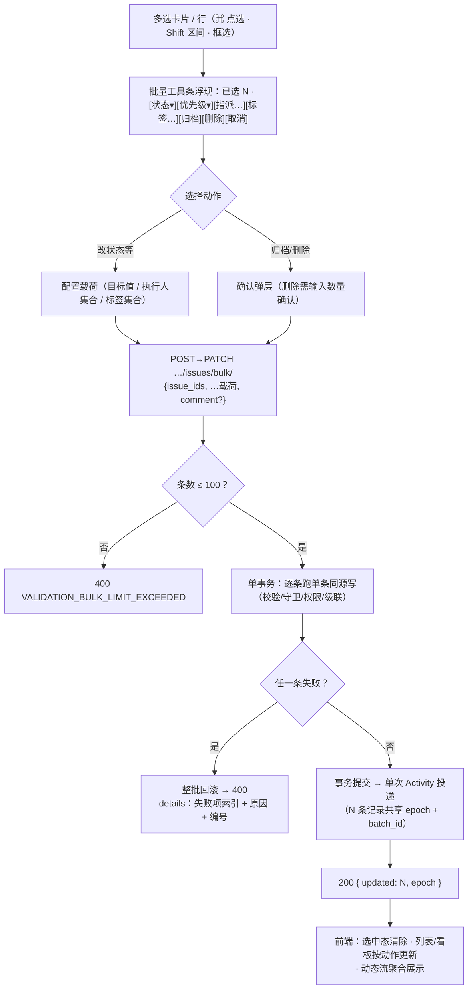
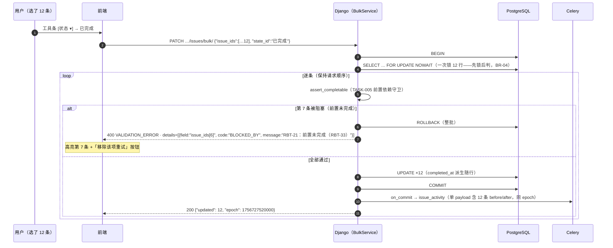
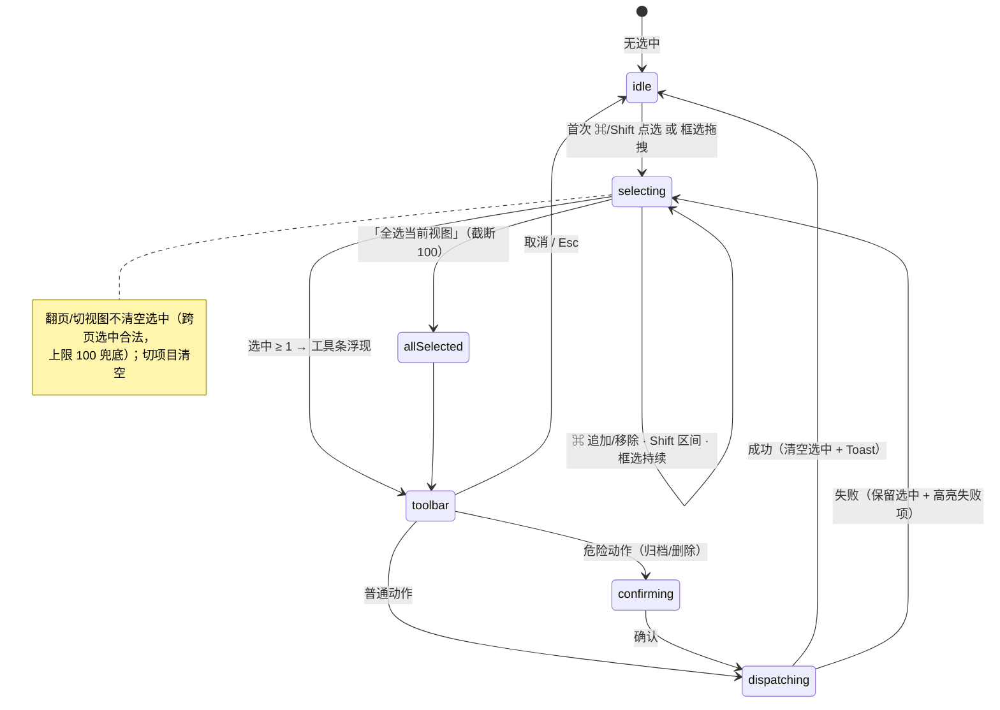
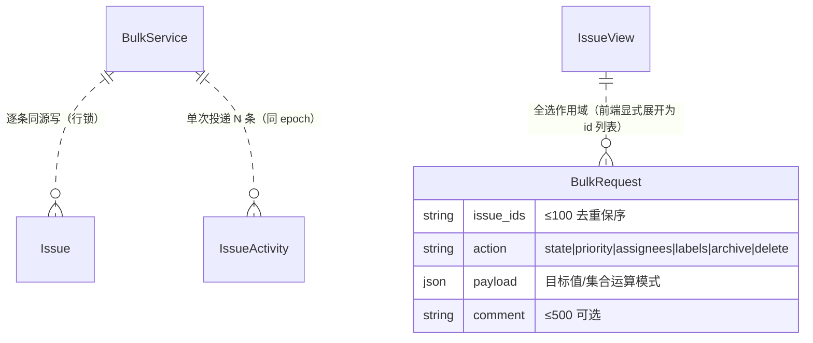

# 任务批量操作

| 元信息项 | 内容 |
| --- | --- |
| 文档编号 | BOARD-004 |
| 所属迭代 | Sprint 3 — 高级视图 + 实时协作（第 5 周） |
| 优先级 | P2（标准版完整级 · **运维型用户的核心效率功能**） |
| 所属模块 | M5-BOARD｜看板视图（作用于全部视图） |
| 文档状态 | 待评审（Draft） |
| 最后更新日期 | 2026-09-02 |
| 上游依赖 | `TASK-001`（PATCH 写路径与 Serializer 校验）、`TASK-005`（流转拦截——批量改状态的逐条守卫）、`TASK-007`（`PUT assignees/` 语义——批量指派收敛点）、`TASK-009`（**归档服务 `archive_subtree`**——批量归档复用）、`TASK-004`（**`delete_subtree` 唯一归属**——批量删除逐条引用，本文仅引用不认领）、`TASK-010`（**BR-12 批量 Activity 共享 epoch 约定**）、`BOARD-003`（视图结果集 = 批量的作用域来源）、`TASK-008`（自定义字段值校验器——**P3 预留**：批量改自定义字段不在本迭代范围（§1.3/§1.5），该依赖供 P3 扩展使用，非 Sprint 3 交付阻塞项） |
| 下游消费 | `WF-003`（P3 自动化规则的批量触发底座）、`COLLAB-003`（「批量更新了 N 个任务」动态聚合展示）、`COLLAB-004`（批量变更逐实体 WS 广播 + `batch_id` 聚合提示——`batch_id` 载荷扩展待其登记，§2.4 BR-15）、`PROJ-003`（项目级批量归档语义对齐） |
| 上游依据 | `docs/需求文档.md` §3.5（任务批量操作——看板 P2 列）、§8.2 看板 P2 列；P3 列「批量操作权限管控」为边界依据 |
| 关联架构文档 | [`api-conventions.md`](../architecture/api-conventions.md)（**§2.5 bulk 端点族；§10.5 批量事务纪律：全成败、上限 100、部分失败 400 + 失败项索引；§7.2 批量端点 throttle 10/min；§8.4 `VALIDATION_BULK_LIMIT_EXCEEDED`；§8.8 字段级子码（`BLOCKED_BY`/`PERM_DENIED`/`LIMIT` 登记状态见 §2.5 注）；§13.1 202 异步约定（`bulk/archive/` 同步 200 的豁免声明见 §4.2.2）**；§3.4 幂等键）、[`rbac-permission-model.md`](../architecture/rbac-permission-model.md)（`issue.update`/`issue.delete`/`issue.assign`/`issue.state.transition`/`issue.archive`）、[`unified-issue-model.md`](../architecture/unified-issue-model.md) §2.10（epoch 分组） |
| 对标基线 | Plane bulk 端点族（`issues/bulk/` PATCH/DELETE + bulk-sort） · Ones 批量权限管控（P3） |
| 工作量估算 | 后端 2.5 人日 / 前端 3 人日 / 联调与测试 1.5 人日，合计 **7 人日** |

---

## 1. 概述

### 1.1 功能定位

项目运转到中期，任务表里必然出现「把这 12 个缺陷都指派给李四」「季度结束，把这 40 个任务归档」——逐条点开的操作成本随规模线性上涨。批量操作把这类**同质大批量写**收敛为一次交互：

1. **多选交互**：框选（列表/表格）、⌘/Shift 点选（列表与看板卡片）、全选当前视图结果集（受上限约束）；
2. **批量端点**：批量写端点族（`PATCH/DELETE …/issues/bulk/` 与 `POST …/issues/bulk/archive/`）单事务全成败——要么 40 条全部归档，要么一条都不动（`api-conventions.md` §10.5 原文纪律）；
3. **批量留痕**：同批全部条目共享同一 `epoch` + `batch_id`，动态流聚合为「张三 批量更新了 40 个任务的执行人」（`TASK-010` BR-12 的兑现）；
4. **失败定位**：事务整体回滚时，`details` 给出失败项索引与原因（不满足前置依赖的任务在第几条）。

**一句话边界**：批量是「N 次正规单条写的事务化打包」，不是新的写语义——每一条的权限、校验、守卫（流转拦截、归档保护）与单条操作完全同源，批量层只做三件事：**打包事务、共享 epoch、聚合响应**。

### 1.2 关键约定：全成败（All-or-Nothing）

> ⚠️ 本文档最重要的语义约定，直接来自 `api-conventions.md` §10.5。

| 方案 | 语义 | 采纳？ |
| --- | --- | --- |
| **全成败（单事务）** | 任一条失败 → 整批回滚，`400` + 失败项索引清单 | ✅ **P2 采纳** |
| 部分成功 | 失败条跳过，返回成功/失败两清单 | ❌（P3 若自动化规则需要「尽力而为」语义，由 `WF-003` 自带重试体系承载，不进交互端点） |

采纳理由：交互场景下「一半成功」是最难收拾的状态——用户不知道哪些改了哪些没改，重试范围模糊；全成败让重试 = 原样重发（配合失败项定位修正后重试），心智最简。代价（一条阻塞全批）用**失败项精准定位**补偿（`details` 直接指出第几条为什么不满足）。

> **与 `TEAM-002` 批量邀请的范式差异（显式声明）**：与 `TEAM-002` 批量邀请的「整体 200、`data[]` 逐条分态」豁免范式**不同**——本文为 `api-conventions.md` §10.5 全成败：结构性错误（载荷缺失 / 超上限 / 枚举非法）400 整请求拒绝，业务失败（守卫 / 权限 / 不可见）**整批回滚 + 失败项索引**。两者面向不同对象（任务写的一致性 vs 邀请的友好性），范式差异显式声明（`TEAM-002` 侧已按其 R1 修复声明豁免，其豁免范围不涵盖本文）；本文不复用「整体 200 分态」。

### 1.3 批量动作清单（P2 六类）

| # | 动作 | 写语义收敛点（正规端点同源） | 逐条守卫 |
| --- | --- | --- | --- |
| 1 | 批量改状态 | `state_id` + 组内尾插 `sort_order`（`BOARD-001`） | **流转拦截逐条判定**（`TASK-005` 前置依赖；被拦项进入失败清单而非静默跳过） |
| 2 | 批量改优先级 | `priority`（枚举校验） | 枚举合法（单点校验） |
| 3 | 批量指派 / 转交 | `PUT assignees/` 语义收敛为 `sync_assignees`（`TASK-007` 唯一入口） | 成员合法、≤10 人、去重保序 |
| 4 | 批量替换标签 | `PUT labels/` 语义（`TASK-002`） | 标签属本项目 |
| 5 | 批量归档 | `archive_subtree` 语义整树级联（`TASK-009`） | 权限 `issue.archive`（CONTRIBUTOR+，`TASK-009` BR-14）；项目 active（已归档项目整批 `403 PERM_PROJECT_ARCHIVED`，其 BR-13）；已归档目标幂等跳过（其 BR-10） |
| 6 | 批量删除 | `delete_subtree` 语义（软删 + 中间表物理删除级联——**`TASK-004` 唯一归属，本文仅引用不认领**） | 权限逐条（CONTRIBUTOR 仅自己的 / ADMIN 任意）；**二次确认 + 输入数量确认** |

> 批量改自定义字段（`cf_*`）与批量复制 P2 不做：前者待 `TASK-008` 字段校验器稳定后评估（P3 预留，与头部上游依赖一致），后者交互收益低（复制是「选一个复制一个」的语义，批量复制产生编号洪峰难追溯）。

### 1.4 能力 × 迭代矩阵

| 能力 | P1 | **P2（本文档）** | P3 |
| --- | --- | --- | --- |
| 多选交互 | ❌ | ✅ 框选 / ⌘ / Shift / 全选（≤100） | 键盘全选导航 |
| 批量写 | ❌ | ✅ 六类动作、单事务全成败 | 批量改自定义字段 |
| 批量上限 | — | **100 条 / 次**；throttle 10/min | 企业版提额 |
| 批量留痕 | — | ✅ 共享 epoch + batch 聚合展示 | 审计导出 |
| 失败语义 | — | ✅ 整批回滚 + 失败项索引定位 | 尽力而为语义（仅自动化通道） |
| 批量权限管控 | — | 复用单条权限码（逐条判定） | 按角色限制可批量动作集（P3 列） |

### 1.5 范围边界

| 能力 | 本文档（P2） | 归属 |
| --- | --- | --- |
| 多选 + 批量工具条 + 六类动作 | ✅ | — |
| 全选「当前视图结果集」（截断到 100 + 提示） | ✅ | — |
| 批量创建（`POST …/issues/bulk/`，§2.5 已登记端点行） | ❌ **显式排除**：单条创建 + 复制已覆盖需求，批量创建产生编号洪峰难追溯，且无失败项定位可借鉴的「同质写」结构 | P4（导入通道立项时再评估；该前瞻登记行的交付归属需**架构文档待回改登记**，见 §4.2 注） |
| 批量移动到子任务下 / 批量建依赖 | ❌ | P4 评估（组合操作风险高） |
| 批量复制 | ❌ | P3 评估 |
| 批量改自定义字段 | ❌ | P3（`TASK-008` 后） |
| 跨项目批量移动 | ❌ | P4（与单条跨项目同步评估） |
| 撤销批量操作 | ❌（每类动作有各自的「反向批量」；通用 Undo 需 Command 历史，成本不成比例） | P4 评估 |
| 按角色限制批量动作集 | ❌ | P3（需求 §8.2 P3 列「批量操作权限管控」） |

### 1.6 前置依赖

| 依赖 | 内容 | 阻塞原因 |
| --- | --- | --- |
| `TASK-001/002` | PATCH 校验器（状态/优先级/标签值域） | 批量逐条复用同一校验 |
| `TASK-005` | `assert_completable` 流转守卫 | 批量改状态的逐条拦截与失败清单 |
| `TASK-007` | `sync_assignees` 唯一入口 | 批量指派收敛点（禁旁路） |
| `TASK-009` | `archive_subtree`（归档服务，含整树级联与幂等口径） | 批量归档复用 |
| `TASK-004` | `delete_subtree`（**唯一归属**——本文仅引用不认领；含中间表物理删除级联） | 批量删除逐条复用 |
| `TASK-010` | epoch 语义 + BR-12 批量约定 + `issue_activity` 幂等管道 | 批量留痕（单次投递 N 条） |
| `BOARD-003` | 视图结果集（`view_id` 参数域） | 「全选当前视图」的作用域 |
| `INFRA-004` | `VALIDATION_BULK_LIMIT_EXCEEDED` 注册、批量 throttle 配置 | 错误契约 |

### 1.7 竞品参考

| 竞品 | 参考点 | 处置 |
| --- | --- | --- |
| Plane | `PATCH/DELETE …/issues/bulk/` 端点族 + `bulk-sort/`（`BOARD-001` §4.4.2 已对齐后者） | 端点形态对齐；补齐其「失败项无索引定位」的缺口（Plane 的 bulk 失败响应不含位置信息） |
| Plane | bulk 逐条循环调单条逻辑（View 层 for 循环） | 采纳「逐条同源」原则但下沉 Service 层（事务边界显式、epoch 单点生成） |
| Ones | 批量权限管控（P3：按角色限制可批量动作） | 复用单条权限码逐条判定（P2）；动作集管控 P3 |
| Jira | Bulk Change 向导（三步流程） | 交互借鉴「预览差异 → 确认」两步，不做三步向导 |

---

## 2. 业务逻辑

### 2.1 批量操作主流程



### 2.2 批量改状态的守卫时序（逐条拦截示例）



### 2.3 多选交互状态机



### 2.4 业务规则汇总

| 编号 | 规则 | 判定位置 | 违反后果 |
| --- | --- | --- | --- |
| BR-01 | 批量上限 **100 条/次**（去重后计数）；超限整体拒绝（不静默截断——静默截断会让用户误以为全部生效） | Serializer | `400 VALIDATION_BULK_LIMIT_EXCEEDED` |
| BR-02 | 单事务全成败：任一条失败整批回滚；失败响应 `details` 逐项为 `{field, code, message}` 三键（`api-conventions.md` §8.9 `ApiFieldError`，不另立键名）——`field` 承载失败项位置（`issue_ids[<index>]`，请求内 0 基索引）、`code` 为守卫子码（登记状态见 §2.5 注）、`message` 内含 `issue_key` 与原因 | BulkService | — |
| BR-03 | 每条走**单条同源写**：校验器 / 权限（含 CONTRIBUTOR 只能删自己的）/ 流转守卫 / 归档保护 / 级联——批量层零旁路、零简化 | BulkService | 评审拒绝 |
| BR-04 | 同批**一次性** `select_for_update(nowait=True)` 锁定全部目标行（`FILE-001` `_check_task_limit`「先锁后判」求值先例同款——锁定先于逐条守卫判定，`api-conventions.md` §10.5 看板拖拽行锁同族）；任一行被并发事务持有 → 整批 `409 RESOURCE_CONFLICT` **快速失败不排队**（杜绝两批互等的长事务）；锁后重读状态再逐条判定（防「列表看到的」与「库里现在的」漂移） | BulkService | 409 |
| BR-05 | 同批全部条目共享同一 `epoch` 与 `batch_id`（= epoch 同值）；Activity 逐条落库（每任务各有时间线）但 `comment` 统一「批量动作摘要」（`TASK-010` BR-12）。**「单次投递 + 共享 epoch」兑现路径**：批量入口生成共享 epoch → 逐条调用单条服务（`delete_subtree` / `archive_subtree`）时以 epoch 参数传入并**抑制其内建 on_commit 投递**（**TASK-004/TASK-009 服务签名需补 epoch 参数——上游待回改登记**）→ 批量出口统一 `on_commit` 单次投递 batch 载荷——否则每条任务落两份 Activity 且 epoch 分裂（`TASK-010` BR-07 幂等键含 epoch，跨份无法去重），并破坏 `COLLAB-003` 同 epoch 折叠（实现见 §4.3.4） | on_commit 单次投递 | — |
| BR-06 | 批量端点 throttle：**10 次/分钟/用户**（`api-conventions.md` §7.2）；超出 `429 RATE_LIMIT_EXCEEDED` + `Retry-After` | Throttle | 429 |
| BR-07 | `issue_ids` 去重保序；非本项目 / 不可见 ID → 该项进入失败清单（`code=DOES_NOT_EXIST`），不 404 整批（批量语境下 404 是项级事实） | BulkService | 400 + 项级 detail |
| BR-08 | 跨「全选视图」与手动多选混合：全选写入「当前视图结果集 id 列表」（截断 100 + 黄条「已选前 100 / 共 N」），本质仍是显式 id 列表——**服务端不隐式展开视图**（展开会引入「提交时刻与所见时刻不一致」的幽灵批次） | 前端 + Serializer | — |
| BR-09 | 批量归档：逐条走 `archive_subtree`（含子树级联）；同批内父子同选时子树重复 UPDATE 幂等（仅 `archived_at IS NULL` 行被触及，`TASK-009` BR-10） | BulkService | — |
| BR-10 | 批量删除：二次确认须**输入选中数量**（如「40」）方可提交；CONTRIBUTOR 混选他人任务 → 该项失败（`PERM_DENIED`）进清单 | 前端 + Permission | 400 + 项级 |
| BR-11 | 批量改状态的目标态必属本项目；流转拦截（前置依赖）逐条判定，被拦项进失败清单并标注 `BLOCKED_BY`（含阻塞源） | `assert_completable` | 项级失败 |
| BR-12 | `comment` 可选 ≤ 500 字，随批量 Activity 落库并展示于动态摘要 | Serializer | 400 TOO_LONG |
| BR-13 | 批量操作进行中（请求未返回）：工具条锁定 + 选中冻结（防中途改选造成响应错配） | 前端 | — |
| BR-14 | `Idempotency-Key` 可选支持（`api-conventions.md` §3.4）：批量删除等危险动作前端默认携带（UUID/批），重放返回首次响应 | 中间件 | `Idempotency-Replayed: true` |
| BR-15 | WS 广播：批量操作产生的 N 次实体变更**逐条复用 `COLLAB-004` 既有事件类型**（`issue.updated` / `issue.state.changed`，每实体一条），由其 **BR-13 阈值聚合保护（单房间 >200 msg/s 触发）**收敛为一次网络批；载荷附加 `batch_id`（= epoch 同值）供对端聚合提示而非弹 40 个 Toast——`batch_id` 载荷扩展与聚合提示语义 **`COLLAB-004` 待登记**（其现表未定义 `batch` 事件类型与 `batch_id` 字段）；对端「单条聚合 Toast」沿用 `COLLAB-001` `notify_issue_event_batch` 同款归并范式（epoch 归并、每 issue 各一行、`merged_count` 携带归并上下文） | COLLAB-004 契约（待登记） | — |

### 2.5 异常处理

| 场景 | HTTP | 错误码 | details 形态 | 前端表现 |
| --- | --- | --- | --- | --- |
| 条数 > 100 | 400 | `VALIDATION_BULK_LIMIT_EXCEEDED` | `{field:"issue_ids", code:"LIMIT", message:"101 条超过上限 100"}` | Toast + 「仅保留前 100」按钮 |
| 含不可见/他项目 ID | 400 | `VALIDATION_ERROR` | 项级 `{field:"issue_ids[i]", code:"DOES_NOT_EXIST"}`，`message` 含编号 | 失败项红标 + 「移除后重试」 |
| 逐条守卫失败（流转被阻） | 400 | `VALIDATION_ERROR` | 项级 `{field:"issue_ids[i]", code:"BLOCKED_BY"}`，`message` 含阻塞源编号 | 高亮对应卡片 + 阻塞详情浮层 |
| 逐条权限失败（删他人任务） | 400 | `VALIDATION_ERROR` | 项级 `{field:"issue_ids[i]", code:"PERM_DENIED"}`，`message` 含编号 | 同上 |
| 值域非法（优先级枚举） | 400 | `VALIDATION_ERROR` | 载荷级 `{field:"priority", code:"NOT_A_CHOICE"}` | 动作下拉红框 |
| throttle 超限 | 429 | `RATE_LIMIT_EXCEEDED` | `RETRY_AFTER` | Toast 倒计时 |
| 并发行锁冲突（nowait 即刻失败，BR-04） | 409 | `RESOURCE_CONFLICT` | 载荷级 `{field:"issue_ids"}`，`message` 指明行被并发事务持有 | 「他人正在修改部分任务，请重试」 |
| 事务中途 5xx | 500 | `SERVER_ERROR` | request_id | 整批未生效；保留选中重试 |
| 视图全选超 100 | —（前端预拦截） | — | 黄条 | 「已选前 100 / 共 1,240」 |

> **字段级子码登记**：本表使用的 `BLOCKED_BY` / `PERM_DENIED` / `LIMIT` 为 `details[].code` 字段级子码（不占用全局错误码注册表，由 [`api-conventions.md`](../architecture/api-conventions.md) §8.8「字段级子码」承载，先例为 `COLLAB-001` `EDIT_WINDOW_EXPIRED` 的补登模式）。§8.8 现表已注册 `DOES_NOT_EXIST` / `NOT_A_CHOICE`（本文直接复用）；`BLOCKED_BY`（前置阻塞）与 `LIMIT`（数量超上限）已由 `TASK-005` §2.5 登记「交付时补登」——本文同语义复用、不重复登记；`PERM_DENIED` 系 §8.3 全局 403 码名在批量项级场景的复用，交付时需在 §8.8 补登子码条目——**架构文档待回改登记**。另：`sprint-overview.md` §6 验收清单现文「超限 409」与本表 `400 VALIDATION_BULK_LIMIT_EXCEEDED`（api-conventions §8.4 已注册）口径不一致——**overview 待同步**（以本文与 §8.4 为准）。

### 2.6 边界条件

| 边界场景 | 限制值 | 超出处理 |
| --- | --- | --- |
| 单批条数 | 100 | 400（预拦截 + 服务端双保险） |
| throttle | 10 次/min/用户 | 429 |
| 跨页选中累计 | 100（全局选中池上限） | 阻止追加 + 提示 |
| 同批父子任务（归档/删除） | 幂等级联 | 无重复副作用 |
| 批量 comment | 500 字 | 400 |
| 事务时长 | 100 条 × 批量行锁（nowait 不排队）≈ < 1s | 锁冲突即刻 409（BR-04）；长事务告警（IT-08） |

---

## 3. UI/UX 设计

### 3.1 批量工具条（选中态浮现）

```
┌──────────────────────────────────────────────────────────────────────────────────┐
│ ☑ 已选 12 项   [状态 ▾] [优先级 ▾] [指派… ] [标签… ]   [📦 归档] [🗑 删除]   [✕] │  ← 底部浮动工具条
├──────────────────────────────────────────────────────────────────────────────────┤
│ 看板（选中卡片蓝环高亮）：                                                          │
│  ┌───────────────┐  ┌───────────────┐  ┌───────────────┐                        │
│  │ ┌───────────┐ │  │                │  │ ┌───────────┐ │                        │
│  │ │☑ 邮箱注册  │ │  │  普通卡片      │  │☑ ORM 模型  │ │  ← 选中卡片：          │
│  │ └───────────┘ │  │                │  │ └───────────┘ │    ring-2 ring-primary │
│  └───────────────┘  └───────────────┘  └───────────────┘    + 左上 ⬜ 复选角标     │
└──────────────────────────────────────────────────────────────────────────────────┘
  框选：从空白处按下拖出虚线矩形，触及卡片即选中；⌘ 点选切换；Shift 点选同视图区间
```

列表 / 表格布局的多选态（同一工具条，另一呈现）：

```
┌────────────────────────────────────────────────────────────────────────────────┐
│ ☑ │ 编号    │ 标题                 │ 状态    │ 负责人  │ 截止      │ ⬚ 列头全选 │
├───┼─────────┼──────────────────────┼─────────┼─────────┼───────────┼───────────┤
│ ☑ │ RBT-4   │ 修复登录页 500 错误  │ ●待办   │ 👤张三  │ 🔴 8-30   │           │
│ ☑ │ RBT-15  │ 分页游标改造         │ ●待办   │ —       │ —         │           │
│ ☐ │ RBT-18  │ 前端联调             │ ●进行中 │ 👤张三  │ 9-12      │           │
│ ☑ │ RBT-21  │ 导出限流配置         │ ●进行中 │ 👤李四  │ 9-02      │           │
└───┴─────────┴──────────────────────┴─────────┴─────────┴───────────┴───────────┘
  行 hover 浮现 ⬜（点选）；已选行 bg-primary-50；Shift 点「RBT-4 → RBT-21」= 区间全选
```

| 元素 | 规格 |
| --- | --- |
| 工具条 | 底部居中浮动（`fixed bottom-4`），`rounded-xl shadow-lg border bg-white px-4 h-12`；滑入动画 160ms；`Esc`/`✕` 清空选中 |
| 计数 | 「已选 N 项」`tabular-nums`；跨页时附 tooltip 列出各页分布 |
| 动作组 | 状态/优先级为下拉即选即发；指派/标签弹选择浮层；归档直接确认；删除红色 + 数量输入确认 |
| 请求中 | 工具条整条 loading（`animate-pulse` + 禁点，BR-13）；完成后滑出 |
| 选中视觉 | 列表行 `bg-primary-50` + 行首 ⬜；看板卡片 `ring-2 ring-primary-400` + hover 角标复选框 |

### 3.2 批量动作浮层（指派示例）

```
┌────────────────────────────────────────────┐
│ 批量指派 · 将应用到 12 个任务                │
│                                              │
│ 模式   ◉ 替换为      ○ 添加到      ○ 从中移除 │
│         （集合替换）  （并集）      （差集）   │
│                                              │
│ 🔍 搜索成员…                                 │
│ ┌────────────────────────────────────────┐ │
│ │ ☑ 张三 ●在线                            │ │
│ │ ☐ 李四 ●忙碌                            │ │
│ └────────────────────────────────────────┘ │
│ 已选 1/10：[张三 ×]                          │
│                                              │
│ 备注（可选，将随动态记录）                     │
│ ┌────────────────────────────────────────┐ │
│ │ 联调阶段统一由张三对接…                   │ │
│ └────────────────────────────────────────┘ │
│                      [取消]  [应用到 12 项]  │
└────────────────────────────────────────────┘
```

| 元素 | 规格 |
| --- | --- |
| 模式三选 | 替换（PUT 语义）/ 添加（并集）/ 移除（差集）——三种集合运算覆盖全部批量指派场景；默认替换 |
| 应用数恒显 | 按钮「应用到 N 项」防误配范围 |
| 标签浮层同构 | 模式三选 + 标签多选 chips |

### 3.3 危险动作确认（删除）

```
┌────────────────────────────────────────────────┐
│ ⚠ 批量删除 40 个任务？                          │
│                                                  │
│ 其中 12 个含子任务（将级联删除 31 个子任务，       │
│ 合计影响 71 个任务）。                            │
│                                                  │
│ 删除后任务进入回收站（管理端可恢复），             │
│ 关联的评论、工时、依赖将被保留但随任务隐藏。       │
│                                                  │
│ 请输入数量确认：┌────┐                           │
│                │ 40  │                           │
│                └────┘                           │
│                      [取消]  [确认删除 40 项]     │
└────────────────────────────────────────────────┘
```

| 元素 | 规格 |
| --- | --- |
| 级联统计 | 服务端预检回传（含子树展开数、关联计数） |
| 输入确认 | 数字 == 选中数 才激活（BR-10） |
| 归档确认 | 同构但无需输入（归档可逆）；展示「含子树 N」 |

### 3.4 失败项定位交互

```
┌────────────────────────────────────────────────┐
│ ⚠ 12 项中 1 项未通过校验，本次未执行任何修改      │
│                                                  │
│ ✗ #7  RBT-21 导出限流配置                        │
│      前置任务未完成：RBT-33 灰度方案（待办）       │
│                                                  │
│        [移除该项并重试(11 项)]  [保留选中返回]     │
└────────────────────────────────────────────────┘
```

| 元素 | 规格 |
| --- | --- |
| 触发 | 400 响应到达；弹层列出全部失败项（滚动） |
| 定位 | 点击失败项跳转该任务详情（返回后弹层已关、选中保留） |
| 一键重试 | 前端剔除失败 id 重发（BR-08：仍是显式列表） |

### 3.5 交互细节表

| 交互动作 | 触发方式 | 反馈效果 | 加载态 / 空态 |
| --- | --- |---|--- |
| 框选 | 空白处按下拖动 | 虚线矩形跟随；触及项实时高亮入选 | — |
| ⌘/Shift 点选 | 修饰键 + 点击 | 追加 / 区间；再点移除 | — |
| 全选视图 | 工具条 ⬜ 或 `⌘A` | 视图结果集前 100 入选 + 黄条截断提示 | >100 时提示 |
| 动作即发 | 状态/优先级下拉选定 | 工具条 loading；成功 Toast「已更新 12 项」+ 选中清空 | 失败见 §3.4 |
| Esc | 键盘 | 清空选中 / 关浮层 | — |
| 翻页保选 | 切页/切视图 | 选中池保留（角标计数） | — |
| 动态聚合 | 完成后 | 时间线：「张三 批量更新了 12 个任务的状态 → 已完成（备注：…）」 | — |

### 3.6 空状态 / 失败兜底

| 场景 | 处置 |
| --- | --- |
| 选中 0 项 | 工具条隐藏（无空态） |
| 选中含已「被他人删除」项（响应期竞态） | 项级 `DOES_NOT_EXIST` 进失败弹层；「移除该项重试」 |
| 视图为空做全选 | 黄条「当前视图无任务」 |

### 3.7 响应式与无障碍

| 断点 | 布局 |
| --- | --- |
| ≥ 1280px | 工具条全动作横排 |
| 768~1279px | 动作折叠「更多 ▾」 |
| < 768px | 工具条两行（计数 + 动作网格 2×3）；框选禁用（触屏），保留长按多选 |

无障碍：选中卡片 `aria-selected="true"`（`role="option"` 容器 `role="listbox"`）；工具条 `role="toolbar"` + `aria-label="批量操作，已选 N 项"`；`⌘A` 全选有屏幕阅读器播报；删除确认输入框 `aria-describedby` 指向级联统计；失败弹层 `role="alertdialog"`。

---

## 4. 技术架构

### 4.1 数据模型

**零新增表、零 DDL**。批量是纯服务层能力：消费 `issues` 全部字段与既有级联服务——`archive_subtree`（`TASK-009`）/ `delete_subtree`（`TASK-004` 唯一归属，本文仅引用）——**两服务复用均需 epoch 参数化**：其现签名各自在入口生成 epoch 并内建单条 `on_commit` 投递，批量场景由批量入口传入共享 epoch 并抑制内建投递、批量出口单次投递 batch 载荷（**TASK-004/TASK-009 服务签名需补 epoch 参数——上游待回改登记**，兑现路径见 BR-05 / §4.3.4）；Activity 落 `issue_activities`（`batch_id` 不加列——复用 `epoch` 同值 + `comment` 前缀 `batch:` 即可聚合，与 `TASK-010` BR-05 评论合并渲染同哲学）。



### 4.2 API 定义

| # | 方法 | 路径 | 描述 | 权限 | 成功码 |
| --- | --- | --- | --- | --- | --- |
| 1 | `PATCH` | `…/projects/{project_id}/issues/bulk/` | 批量更新（状态 / 优先级 / 指派 / 标签） | 动作对应权限码（`issue.state.transition` / `issue.update` / `issue.assign`），逐条再判角色；批级键 `issue.bulk.update`（rbac §8.2 已注册；P2 以动作码逐条判定等效，本键登记为 AUTH-005 矩阵增量——四项 CI 清单见 AUTH-005 §4） | `200` |
| 2 | `POST` | `…/projects/{project_id}/issues/bulk/archive/` | 批量归档（整树级联） | `issue.archive`（`TASK-009` BR-14，CONTRIBUTOR+） | `200` |
| 3 | `DELETE` | `…/projects/{project_id}/issues/bulk/` | 批量删除（软删 + 级联） | `issue.delete(.own)` 逐条；批级键 `issue.bulk.update` 登记同 #1（AUTH-005 矩阵增量） | `200` |
| 4 | `POST` | `…/projects/{project_id}/issues/bulk/preview/` | 危险动作预检（级联统计，供确认弹层） | 读权限 | `200` |

> 挂载与 `api-conventions.md` §2.5 工作项层级端点清单的 `PATCH/DELETE …/issues/bulk/` 两行一致；§2.5 另登记的 `POST …/issues/bulk/`（**批量创建**）本文**显式排除**、P2 不交付（理由与归属见 §1.5——该前瞻登记行的交付归属需**架构文档待回改登记**）；`bulk/archive/` 为其 §2.6 动作子资源（`archive/`）的批量变体；`bulk/preview/` 为**本迭代新增动作子资源**——§2.5 端点清单未登记该路径，**架构文档待回改登记**。**PATCH/DELETE 复用路径**与 §10.5「批量端点：全成功或全失败；部分失败返回 400 并指出失败项索引」逐字对齐。

#### 4.2.1 `PATCH …/issues/bulk/` — 批量更新

**请求（批量改状态）**

```json
{
  "issue_ids": ["8a1f…", "b2c3…", "d4e5…", "…共 12 项"],
  "patch": { "state_id": "a1b2c3d4-0003-4000-8000-000000000003" },
  "comment": "迭代收尾，批量关闭"
}
```

**请求（批量指派-添加模式）**

```json
{
  "issue_ids": ["…12 项"],
  "assignees": { "mode": "add", "assignee_ids": ["6c7d1a2b-3e4f-4a5b-9c8d-7e6f5a4b3c2d"] },
  "comment": "联调阶段统一由张三对接"
}
```

**成功响应 `200`**

```json
{
  "status": "success",
  "data": { "updated": 12, "epoch": 1756727520000, "action": "state",
            "comment": "迭代收尾，批量关闭" },
  "meta": { "batch_size": 12 }
}
```

**失败响应 `400`（第 7 项被流转守卫拦截——整批回滚）**

```json
{
  "status": "error",
  "error": {
    "code": "VALIDATION_ERROR",
    "message": "12 项中 1 项未通过校验，未执行任何修改",
    "details": [
      { "field": "issue_ids[6]", "code": "BLOCKED_BY",
        "message": "RBT-21 导出限流配置：前置任务未完成（RBT-33 灰度方案 · 待办）" }
    ],
    "request_id": "01JCBDD6C0FG5H8I4K6L7N8O9P"
  }
}
```

**失败响应 `400`（超上限）**

```json
{
  "status": "error",
  "error": {
    "code": "VALIDATION_BULK_LIMIT_EXCEEDED",
    "message": "批量操作一次最多 100 条",
    "details": [{ "field": "issue_ids", "code": "LIMIT", "message": "提交 101 条" }],
    "request_id": "01JCBDD6C0FG5H8I4K6L7N8O9Q"
  }
}
```

#### 4.2.2 `POST …/issues/bulk/archive/` — 批量归档

> **批量归档端点对 `api-conventions.md` §13.1「耗时操作（含批量归档）走 `202` 异步」约定的豁免声明**：本端点采用**同步 `200`**，不走 202。原因：① 批量归档受 §10.5 上限 100 条约束，级联归档是幂等轻写（仅置 `archived_at`，`TASK-009` BR-10 仅触及 `archived_at IS NULL` 行），单事务批量行锁实测 P95 < 1s（§5.3 IT-05 性能门禁）——远低于需要 202 解耦的耗时阈值；② 全成败语义要求失败项定位（第几条、为何被拦）随响应同步返回，`202 + task_id` 轮询会把「整批被拦在哪一条」推迟一个轮询周期，直接损害 §3.4 的失败定位体验。§13.1 的 202 模式保留给 P4 数据导入/导出等真正的大规模异步通道。

**请求**

```json
{ "issue_ids": ["…5 项"], "comment": "季度收尾归档" }
```

**成功响应 `200`**（5 选含 1 父任务，子树级联 4 条，其中 2 条此前已归档）

```json
{
  "status": "success",
  "data": { "archived_count": 7, "affected_total": 9, "epoch": 1756727700000 },
  "meta": { "batch_size": 5, "cascade": 4 }
}
```

> **计数口径**：`archived_count` = 本批**实际新置 `archived_at` 的行数**（选中 + 级联子树中此前未归档的行，去重后——幂等重提交不重复计数，`TASK-009` BR-10「仅触及 NULL 行」同口径，恒 ≤ `affected_total`）；`affected_total` = 选中 + 级联子树总行数（含已归档行，与 `preview/` 统计一致）。失败语义同 §4.2.1 范式（如项级 `{field:"issue_ids[i]", code:"DOES_NOT_EXIST"}` → 整批 400 回滚）；已归档项目内提交整批 `403 PERM_PROJECT_ARCHIVED`（`TASK-009` BR-13）。

#### 4.2.3 `DELETE …/issues/bulk/` — 批量删除

**请求**（含预检回执展示后提交）

```json
{ "issue_ids": ["…40 项"], "confirm_count": 40 }
```

**成功响应 `200`**

```json
{
  "status": "success",
  "data": { "deleted": 40, "affected_total": 71, "epoch": 1756727890000 },
  "meta": { "batch_size": 40, "cascade": 31 }
}
```

> `affected_total` = 选中 + 级联子树（与 `preview/` 口径一致）；`confirm_count` 与 `issue_ids` 数不符即 400（防「确认后又改选择」的错配）。

#### 4.2.4 `POST …/issues/bulk/preview/` — 危险动作预检

**请求**

```json
{ "issue_ids": ["…40 项"], "action": "delete" }
```

**成功响应 `200`**

```json
{
  "status": "success",
  "data": {
    "selected": 40,
    "with_subtree": 12,
    "cascade_total": 31,
    "affected_total": 71,
    "links": 18, "worklogs": 55, "comments": 96,
    "denied": [{ "index": 3, "issue_key": "RBT-57", "reason": "仅创建者可删除" }]
  }
}
```

> 预检只读不锁行（统计近似值）；`denied` 提前暴露权限失败项，让用户在确认弹层阶段就能剔除——**把失败发现尽量前移**是全成败语义下最好的体验补偿。

### 4.3 核心逻辑

#### 4.3.1 `BulkService`（单事务 + 逐条同源 + 单次投递）

```python
# apps/api/plane/db/services/issue_bulk.py
import time, uuid

from django.db import transaction

BULK_LIMIT = 100


class BulkActionError(Exception):
    """携带项级失败清单（details）→ 400 VALIDATION_ERROR"""

    def __init__(self, failures: list[dict]):
        self.failures = failures          # [{field, code, message}]（BR-02：field=issue_ids[<index>]，message 含 issue_key）


@transaction.atomic
def bulk_update(*, project_id: uuid.UUID, actor, issue_ids: list[uuid.UUID],
                patch: dict | None = None, assignees: dict | None = None,
                labels: dict | None = None, comment: str = "") -> dict:
    """批量更新 —— BR-01~05 全景。每条走单条同源写；任一失败整批回滚。"""
    ids = list(dict.fromkeys(issue_ids))                                  # 去重保序
    if len(ids) > BULK_LIMIT:                                             # BR-01
        raise BulkLimitExceeded(got=len(ids), limit=BULK_LIMIT)

    epoch = time.time() * 1000                                            # BR-05：批次唯一 epoch（Service 入口生成，TASK-010 BR-04）
    failures, snapshots = [], []
    issues = {i.id: i for i in Issue.objects.select_for_update(nowait=True)   # BR-04：一次锁全批（先锁后判）
              .filter(id__in=ids, project_id=project_id, deleted_at__isnull=True)}
    # nowait：任一行被并发事务持有 → OperationalError → View 层统一 409 RESOURCE_CONFLICT（§2.5）

    for index, iid in enumerate(ids):
        issue = issues.get(iid)
        if issue is None or not actor.can_read(issue):                    # BR-07：项级不可见
            failures.append(_fail(index, iid, "DOES_NOT_EXIST", "任务不存在或不可见"))
            continue
        try:
            before = snapshot(issue)
            if patch:
                if "state_id" in patch:
                    assert_completable(issue=issue,                       # BR-11：流转守卫逐条
                                       to_state=_state(patch["state_id"]),
                                       force=False, actor=actor)
                _apply_patch(issue, patch)                                # 单条校验器同源（BR-03）
            if assignees:
                _apply_assignees_set_op(issue, assignees, actor)          # add/remove/replace → sync_assignees
            if labels:
                _apply_labels_set_op(issue, labels)
            snapshots.append((issue, before))
        except BusinessError as e:
            failures.append(_fail(index, iid, e.code,
                                 f"{issue.issue_key} {e.message}"))
    if failures:                                                          # BR-02：全成败
        raise BulkActionError(failures)

    _persist_all(snapshots)                                               # 组内尾插 sort_order 等
    transaction.on_commit(lambda: issue_activity.delay(                   # BR-05：单次投递
        {"batch": [(str(i.id), before_of(b)) for i, b in snapshots],
         "actor_id": str(actor.id), "epoch": epoch,
         "comment": f"batch: {comment or '批量更新'}"}))
    return {"updated": len(snapshots), "epoch": epoch}
```

> **为什么 Activity 单次投递一个 batch payload 而非 N 个任务各一个**：`TASK-010` 的幂等键 `event_key = sha256(verb + issue_id + actor_id + epoch)`（其 BR-07）——批内 N 条任务各持独立键，同 epoch 不冲突；单次投递让 Worker 一批落库、每任务时间线各有记录、comment 共享「批量动作摘要」，且动态流（`COLLAB-003`）按 epoch 聚合时天然得到「批量更新了 12 个任务」。

#### 4.3.2 集合运算（批量指派/标签的三模式）

```python
def _apply_assignees_set_op(issue: Issue, spec: dict, actor) -> None:
    """add / remove / replace 三模式收敛到 sync_assignees 唯一入口（BR-03）。"""
    mode, incoming = spec["mode"], spec["assignee_ids"]
    current = list(IssueAssignee.objects.filter(
        issue=issue, deleted_at__isnull=True).values_list("assignee_id", flat=True))
    match mode:
        case "replace":
            target = incoming                                   # PUT 语义
        case "add":                                             # 并集：保 current 序，新者按 incoming 序追加
            target = current + [u for u in incoming if u not in current]
        case "remove":                                          # 差集
            target = [u for u in current if u not in incoming]
    sync_assignees(issue_id=issue.id, new_ids=target,
                   actor_id=actor.id)                           # ≤10 / 成员校验在入口内
```

#### 4.3.3 Throttle 与幂等

```python
# ViewSet 声明（api-conventions §7.2 批量端点行）
throttle_classes = [BulkRateThrottle]        # 10/min/user（Redis 计数，独立 scope="bulk"）

# 前端对删除类动作默认带头（BR-14）：
#   Idempotency-Key: <uuid-of-batch>；重放命中返回首次响应 + Idempotency-Replayed: true
```

#### 4.3.4 预检与批量删除服务

```python
def bulk_preview(*, project_id: uuid.UUID, actor,
                 issue_ids: list[uuid.UUID], action: str) -> dict:
    """危险动作预检（只读、无锁、近似统计）——失败发现前移到确认阶段。"""
    ids = list(dict.fromkeys(issue_ids))[:BULK_LIMIT]
    issues = Issue.objects.filter(id__in=ids, project_id=project_id,
                                  deleted_at__isnull=True)
    subtree_ids = _subtree_ids_cte(issues)                    # TASK-004 目标集 CTE 复用
    denied = []
    for index, iid in enumerate(ids):
        issue = issues.filter(id=iid).first()
        if issue is None:
            denied.append(_fail(index, iid, "DOES_NOT_EXIST", "任务不存在或不可见"))
        elif action == "delete" and not actor.can_delete(issue):   # CONTRIBUTOR 仅自己的
            denied.append(_fail(index, iid, "PERM_DENIED", f"{issue.issue_key} 仅创建者可删除"))
    return {
        "selected": len(ids),
        "with_subtree": _count_with_children(issues),
        "cascade_total": len(subtree_ids) - len(ids),
        "affected_total": len(subtree_ids),
        "links": _count_relations(subtree_ids), "worklogs": _count_worklogs(subtree_ids),
        "comments": _count_comments(subtree_ids),
        "denied": denied,
    }


@transaction.atomic
def bulk_delete(*, project_id: uuid.UUID, actor, issue_ids: list[uuid.UUID],
                confirm_count: int) -> dict:
    """批量删除：逐条走 delete_subtree（级联软删）；同批父子幂等（BR-09）。

    epoch 兑现路径（BR-05）：批量入口生成共享 epoch → 逐条调用时以 epoch
    参数传入 delete_subtree 并抑制其内建投递 → 批量出口统一 on_commit
    单次投递 batch 载荷。"""
    ids = list(dict.fromkeys(issue_ids))
    _assert_bulk_limit(ids)
    if confirm_count != len(ids):                              # BR：确认数错配
        raise ValidationError({"confirm_count": "与提交数量不一致"})
    epoch = time.time() * 1000                                 # BR-05：批量入口生成共享 epoch（全批唯一）
    affected, deleted = set(), 0
    issues = {i.id: i for i in Issue.objects.select_for_update(nowait=True)  # BR-04 同口径：一次锁全批（先锁后判）
              .filter(id__in=ids, project_id=project_id, deleted_at__isnull=True)}
    for index, iid in enumerate(ids):
        issue = issues.get(iid)
        if issue is None or not actor.can_delete(issue):
            raise BulkActionError([_fail(index, iid,
                "DOES_NOT_EXIST" if issue is None else "PERM_DENIED", "…")])
        # TASK-004 唯一归属，本文仅引用——服务签名需补 epoch 参数（上游待回改登记）：
        # 现签名入口自生成 epoch 且内建 on_commit(record_delete)，照原样逐条调用会使
        # 每条任务落两份 Activity 且 epoch 分裂（TASK-010 BR-07 幂等键含 epoch、跨份
        # 无法去重），违反 BR-05 并破坏 COLLAB-003 同 epoch 折叠——批量复用必须由本
        # 入口传入共享 epoch 并抑制内建投递，改由下方批量出口单次投递 batch 载荷；
        # archive_subtree（TASK-009，§4.2.2 批量归档 / BR-09）内建 on_commit(record_archive)
        # 同理——两服务签名均需补 epoch 参数并支持抑制内建投递：上游待回改登记。
        result = delete_subtree(issue_id=iid, actor_id=actor.id,
                                epoch=epoch, suppress_activity=True)
        affected.update(result["descendant_ids"] or [])
        deleted += 1
    transaction.on_commit(lambda: issue_activity.delay(        # BR-05：批量出口单次投递 batch 载荷
        {"batch_delete": [str(i) for i in ids], "actor_id": str(actor.id),
         "epoch": epoch, "comment": f"batch: 批量删除 {deleted} 个任务"}))
    return {"deleted": deleted, "affected_total": len(affected | set(ids)),
            "epoch": epoch}
```

> **单条服务复用的 epoch 约束（BR-05 兑现路径）**：`delete_subtree`（`TASK-004`）现签名入口自生成 epoch 并内建 `on_commit(record_delete)`，`archive_subtree`（`TASK-009`）内建 `on_commit(record_archive)`——批量复用若照原样逐条调用，每条任务会落两份 Activity 且 epoch 分裂（`TASK-010` BR-07 幂等键 `sha256(verb+issue_id+actor_id+epoch)` 因 epoch 不同无法去重），并破坏 `COLLAB-003` 同 epoch 折叠。故统一走「批量入口生成共享 epoch → 逐条传入 epoch 参数并抑制服务内建投递 → 批量出口单次投递 batch 载荷」——**TASK-004/TASK-009 服务签名需补 epoch 参数：上游待回改登记**（批量归档 `bulk/archive/` 与本文 `bulk_delete` 同一兑现路径）。

### 4.4 前端实现

- `SelectionStore`（`packages/shared-state`）：`selectedIds: Set<string>`（全局池，上限 100，BR-08）；跨页/跨视图保留、切项目清空；`来源高亮` 由各视图组件从池派生。
- `BulkToolbar` 组件：动作分发到 `bulkService.patch / assign / label / archive / delete`；请求期冻结选中（BR-13）；失败弹层消费 `details[].field`（解析 `issue_ids[<index>]` 路径）映射回卡片。
- 框选：列表/表格容器上 `pointerdown` 起点记录 + `getBoundingClientRect` 相交判定（看板卡片同理）；与 pdnd 拖拽互斥（按下即拖拽的元素不进入框选）。
- `⌘A`：取当前视图 SWR 缓存结果集前 100（BR-08 前端显式展开，不做「服务端隐式全选」）。
- 乐观策略：批量动作**不做逐条乐观**（12 条局部动画复杂度不值）；统一 loading → 成功后按动作类型批量更新 Store（改状态：逐条 `state_id` 写入；删除：逐条移除）+ SWR revalidate。
- WS 联动（`COLLAB-004` 上线后）：批量变更逐实体复用其 `issue.updated` / `issue.state.changed` 事件（由其 BR-13 阈值聚合保护收敛为一次网络批：单房间 >200 msg/s 触发），他端按 `batch_id`（= epoch）聚合为一条 Toast（BR-15；`batch_id` 载荷扩展与聚合提示语义待 `COLLAB-004` 登记）。

```typescript
// packages/shared-state/src/selection.store.ts
import { action, computed, makeObservable, observable } from "mobx";

/** 批量选中池 —— 全局单例；跨页/跨视图保留，切项目清空（§2.3 状态机） */
export class SelectionStore {
  static readonly LIMIT = 100;

  @observable.ref selectedIds = new Set<string>();
  @observable projectId: string | null = null;
  @observable dispatching = false;                 // BR-13：请求期冻结

  constructor() { makeObservable(this); }

  @computed get count(): number { return this.selectedIds.size; }
  @computed get ready(): boolean { return this.count > 0 && !this.dispatching; }

  /** 进入项目时重置作用域（防止跨项目批量误伤） */
  @action bindProject(projectId: string) {
    if (this.projectId !== projectId) {
      this.projectId = projectId;
      this.selectedIds = new Set();
    }
  }

  @action toggle(id: string) {
    if (this.dispatching) return;                              // BR-13：选中冻结期间再点选无效（UT-16）
    const next = new Set(this.selectedIds);
    next.has(id) ? next.delete(id) : next.add(id);
    if (next.size > SelectionStore.LIMIT && !this.selectedIds.has(id)) return;  // 上限阻止追加
    this.selectedIds = next;
  }

  /** Shift 区间选择：ids 为当前视图可见顺序 */
  @action range(fromId: string, toId: string, visibleIds: string[]) {
    if (this.dispatching) return;                              // BR-13：冻结期间区间点选同样无效
    const a = visibleIds.indexOf(fromId), b = visibleIds.indexOf(toId);
    if (a === -1 || b === -1) return;
    const [lo, hi] = a < b ? [a, b] : [b, a];
    const next = new Set(this.selectedIds);
    for (const id of visibleIds.slice(lo, hi + 1)) {
      if (next.size >= SelectionStore.LIMIT) break;
      next.add(id);
    }
    this.selectedIds = next;
  }

  /** 全选视图结果集（前端显式展开，BR-08——服务端不隐式展开） */
  @action selectViewResults(viewIds: string[]) {
    this.selectedIds = new Set(viewIds.slice(0, SelectionStore.LIMIT));
    return { truncated: viewIds.length > SelectionStore.LIMIT, total: viewIds.length };
  }

  @action setDispatching(v: boolean) { this.dispatching = v; }
  @action clear() { this.selectedIds = new Set(); }
  @action removeMany(ids: string[]) {          // 「移除失败项重试」
    const drop = new Set(ids);
    this.selectedIds = new Set([...this.selectedIds].filter((i) => !drop.has(i)));
  }
}
```

---

## 5. 测试用例

### 5.1 单元测试

| 用例 ID | 测试目标 | 输入 | 预期输出 | 覆盖类型 |
| --- | --- | --- | --- | --- |
| UT-01 | 上限边界 | 恰 100 / 101 条 | 200 / 400 LIMIT | 边界 |
| UT-02 | 去重保序 | 重复 id | 计数去重后判定；执行序 = 首现序 | 边界 |
| UT-03 | 项级不可见 | 混入他项目 id | 该项 DOES_NOT_EXIST 进清单，整批 400 | 安全 |
| UT-04 | 流转守卫逐条 | 12 条中 1 条被阻塞 | 整批回滚；`details[0].field="issue_ids[6]"` + `code="BLOCKED_BY"`，message 含阻塞源与编号 | 异常 |
| UT-05 | 权限逐条 | CONTRIBUTOR 混删他人任务 | 该项 PERM_DENIED 进清单 | 安全 |
| UT-06 | 集合-并集 | add 模式 | current + 新者追加，去重 | 正常 |
| UT-07 | 集合-差集 | remove 模式 | 差集结果；≤10 上限仍校验 | 正常 |
| UT-08 | 集合-替换 | replace 模式 | 与单条 PUT 等价 | 正常 |
| UT-09 | 归档级联幂等 | 同批父子同选 | 子树无重复副作用（BR-09） | 边界 |
| UT-10 | epoch 共享 | 批 12 条 | 12 条 Activity 同 epoch；comment 批量摘要 | 正常 |
| UT-11 | 幂等键重放 | 同 Key 二发 | 首次响应回放 + 头标记 | 并发 |
| UT-12 | confirm_count 错配 | 40 选 39 确认 | 400 | 异常 |
| UT-13 | comment 上限 | 501 字 | 400 TOO_LONG | 边界 |
| UT-14 | throttle | 第 11 次/min | 429 + Retry-After | 边界 |
| UT-15 | 事务回滚完整性 | 第 80 条注入失败 | 前 79 条零残留 | 正常 |
| UT-16 | 选中冻结（BR-13） | dispatching 期间再点选 / Shift 区间点选 | `toggle` / `range` 无效，`selectedIds` 不变 | 边界 |

### 5.2 后端接口测试（BE-）

| 编号 | 场景 | 输入 / 前置 | 期望 |
| --- | --- | --- | --- |
| BE-1 | PATCH bulk 改状态 12 条 | 全部可流转 | 200 `updated=12`；12 条 `state_id` 与 `completed_at` 齐写 |
| BE-2 | 失败项索引准确性 | 第 7 条被阻塞 | `details[0].field="issue_ids[6]"`（0 基）+ `code="BLOCKED_BY"` + message 含 `issue_key` |
| BE-3 | 整批回滚零残留 | 上例后查库 | 12 条 `updated_at` 全部未变（回滚验证） |
| BE-4 | 指派 add/remove/replace | 三模式各一批 | 结果集合与 §4.3.2 语义一致；≤10 上限触发项级失败 |
| BE-5 | 标签三模式 | 同上 | 同构 |
| BE-6 | `bulk/archive/` | 含父子同批（子树含已归档行） | 级联幂等（子不重复 UPDATE）；`archived_count` 精确（仅计新归档行，§4.2.2 口径；重提交不重复计数） |
| BE-7 | `bulk/preview/` 统计 | 40 选含 12 父 31 级联 | `affected_total=71`；`denied` 含权限失败项 |
| BE-8 | `preview/` 只读性 | 调用后查库 | 零写入（无锁无副作用） |
| BE-9 | DELETE bulk 确认错配 | confirm_count=39 | 400 `VALIDATION_ERROR` |
| BE-10 | Activity 批量留痕 | 批后查 | N 条同 epoch；comment=`batch: …` 摘要；`COLLAB-003` 聚合渲染正确 |
| BE-11 | 幂等键重放 | 同 Key 二发 DELETE | 首次响应体回放 + `Idempotency-Replayed: true`；库中零二次删除 |
| BE-12 | throttle | 60s 内 11 次 | 第 11 次 429 + `Retry-After` 头 |
| BE-13 | 并发交叠 | 两用户同批 3 条 | 后者 `nowait` 即刻 409 `RESOURCE_CONFLICT`（不排队等待）；无部分写 |
| BE-14 | 权限矩阵 | VIEWER 发任何 bulk | 403 `PERM_ROLE_INSUFFICIENT` |
| BE-15 | 跨项目 id | 混入他项目任务 | 项级 `DOES_NOT_EXIST`；不 404 整批 |

### 5.3 集成测试

| 用例 ID | 场景 | 前置条件 | 操作步骤 | 预期结果 |
| --- | --- | --- | --- | --- |
| IT-01 | 批量改状态全链路 | 12 条（1 条被阻塞） | 提交 → 修正 → 重试 | 首次整批回滚 + 定位；剔除后 11 条生效、`completed_at` 齐写 |
| IT-02 | 动态聚合展示 | 批量改 12 条 | 查任务时间线与项目动态 | 各任务 1 条记录同 epoch；流聚合「批量更新了 12 个」 |
| IT-03 | 批量归档级联 | 含子树的 3 条 | bulk/archive | 级联统计与 `TASK-009` 单条口径一致；列表退出 |
| IT-04 | 批量删除预检→提交 | 40 条含 12 父 | preview → 确认输入 40 → delete | `affected_total=71` 与实际一致；`deleted_at` 全置 |
| IT-05 | 性能门禁 | 100 条批量改状态 | 计时 20 次 | P95 < 1s（单事务行锁批） |
| IT-06 | SQL 预算 | 100 条 | `assertNumQueries` | ≤ 210（1 次批量行锁（nowait，BR-04）+ 聚合更新 + 1 投递，常数级上限） |
| IT-07 | 并发互斥 | 两用户批量交叠同 3 条 | 提交 | 后者 409 快速失败（nowait，BR-04），无脏写 |
| IT-08 | 长事务监控 | 100 条慢注入 | 观测 | 锁等待 > 2s 告警日志 |

### 5.4 E2E 测试

| 用例 ID | 用户场景 | 操作路径 | 验收标准 |
| --- | --- | --- |---|
| E2E-01 | 框选批量指派 | 列表框选 8 条 → 指派-添加 张三 | 8 条执行人含张三；动态聚合一条；刷新保持 |
| E2E-02 | 守卫失败定位 | 12 条含被阻塞 1 条 → 工具条「状态 ▾」批量改为已完成 | 弹层定位 #7 与阻塞源；「移除重试」后 11 条生效 |
| E2E-03 | 全选截断 | 视图 1,240 条 → ⌘A | 选前 100 + 黄条；提交正常 |
| E2E-04 | 批量归档 | 选 5 条（含 1 父）→ 归档 | 确认显示级联数；列表退出；归档视图可恢复 |
| E2E-05 | 批量删除确认 | 选 40 → 删除 | 输入 40 才可提交；完成后 Toast 与回收站验证 |
| E2E-06 | 跨页保选 | 第 1 页选 3 → 翻页再选 2 | 计数 5；工具条动作作用于 5 |

---

## 6. 竞品深度对标

### 6.1 Plane 实现分析

- **端点形态对齐**：Plane 的 bulk 写在 View 层 for 循环逐条调单条逻辑（`issues/bulk/` 家族 + `bulk-delete/`）；`BOARD-001` §4.4.2 已对齐其 `bulk-sort/`。本系统把循环下沉到 `BulkService`（显式事务边界 + epoch 单点 + 行锁批读），端点面与其同构、工程面更严。
- **Plane 的缺口 1（失败无定位）**：其 bulk 失败响应不携带项级索引，用户只能整批盲试；本系统 `details[].field`（`issue_ids[<index>]` 路径承载索引）+ `code` + message 含 `issue_key`（§4.2.1）+ 前端「移除该项重试」一键闭环。
- **Plane 的缺口 2（无批量预检）**：删除类动作无级联统计预检；本系统 `preview/` 把失败发现前移到确认阶段。
- **Activity**：Plane 的 bulk 也共享 epoch 折叠展示（本系统 BR-05 与之一致），但其无单次投递优化（N 次 delay）。

### 6.2 Ones 实现分析

- 批量权限管控（P3 列）：按角色限制「可执行的批量动作集」（如 MEMBER 不可批量删除）——治理型能力。P2 用「单条权限码逐条判定」达到等效安全底线（混权批必然项级失败），动作集管控留给 P3。
- Ones 的批量常与其流程引擎联动（批量触发流转）——本系统 `WF-003` 自动化将以 `BulkService` 为触发底座（下游消费已预留）。

### 6.3 本系统设计决策

1. **全成败 + 失败前移**：交互批量的两个体验支柱——事务语义让重试 = 原样重发；`preview/` + 项级 details 让失败在确认前与失败后都能被精确定位。
2. **「N 次正规写的打包」而非新写语义**：逐条同源（BR-03）意味着所有守卫（流转拦截/归档保护/权限/级联）零新增测试面——批量测试只测「打包与回滚」本身。
3. **服务端不隐式展开视图**（BR-08）：全选是前端显式 id 列表——杜绝「提交时刻 ≠ 所见时刻」的幽灵批次，也让幂等键有确定的作用域。
4. **显式 id 列表 + 上限 100 + throttle 10/min 三重闸**：把批量对数据库与对协作伙伴（同屏 40 个 Toast 的灾难）的冲击都锁在常数级。
5. **单次 Activity 投递**：批的留痕是「一个动作」不是「N 个动作」——epoch 共享 + 单 payload，Worker、动态流、WS 广播三处同步受益。

### 6.4 三方能力矩阵

| 能力 | Plane | Ones | 本系统 P2 | 后续 |
| --- | --- | --- | --- | --- |
| 批量更新（状态/优先级/人/标签） | ✅ | ✅ | ✅ | — |
| 批量归档 / 删除（级联） | 部分 | ✅ | ✅ | — |
| 事务语义（全成败） | 部分（循环内无显式边界） | ✅ | ✅ **显式单事务** | — |
| 失败项索引定位 | ❌ | 部分 | ✅ **领先**（field 路径承载索引 + code + message 含编号） | — |
| 危险动作预检（级联统计） | ❌ | 部分 | ✅ **领先**（preview 端点） | — |
| 集合三模式（替换/添加/移除） | 部分 | ✅ | ✅ | — |
| 批量留痕聚合（epoch） | ✅ | ✅ | ✅ | P4 审计导出 |
| 幂等键 | ❌ | 未公开 | ✅ | — |
| 按角色限制批量动作集 | ❌ | ✅ | ❌（逐条权限码等效兜底） | P3 |
| 批量改自定义字段 / 批量复制 | ❌ | ✅ | ❌ | P3 评估 |

---

## 7. 里程碑与验收

### 7.1 交付物清单

| 类型 | 交付物 |
| --- | --- |
| Model / Migration | 零 DDL |
| 后端 | `issue_bulk.py`（BulkService：事务/行锁批/逐条同源/集合三模式/单次投递）、`bulk/` + `bulk/archive/` + `bulk/preview/` 端点、`BulkRateThrottle`、幂等键接入 |
| 权限矩阵 | `PERMISSION_MATRIX` 增量：`issue.bulk.update`（rbac §8.2 已注册）——按 AUTH-005 §4 矩阵扩展规则随本功能交付四项 CI：① 后端矩阵常量增量、② 前端常量再生成、③ 守护代码（Permission 类继承或 `@require_permission` 引用）、④ 参数化 403 测试 |
| 前端 | `SelectionStore`（跨页选中池）、`BulkToolbar`、框选与 ⌘/Shift 多选、指派/标签浮层（三模式）、危险确认（数量输入 + 级联统计）、失败定位弹层 |
| 测试 | UT-01~16、IT-01~08、E2E-01~06 |

### 7.2 可操作演示的验收标准

1. 列表框选 8 条任务批量「指派-添加」张三：8 条执行人即时更新、动态流聚合为一条批量记录、他端（另一浏览器）仅见一条聚合 Toast。
2. 选中 12 条经批量工具条「状态 ▾ → 已完成」提交（本迭代批量动作仅工具条入口，无批量拖拽——与 §3.1 交互设计一致），其中 1 条被前置依赖拦截：收到项级定位（第 7 项 + 阻塞源）；「移除该项重试」后其余 11 条全部完成、`completed_at` 齐写、首次提交零残留。
3. 在 1,240 条结果的视图按 ⌘A：选中前 100 条并黄条提示截断；批量改优先级全部生效。
4. 批量删除 40 条（含子树）：预检显示「影响 71 个任务」；输入 40 确认后响应回传 `deleted=40 / affected_total=71`，回收站可验证；`confirm_count` 不符的提交被 400 拒绝。
5. 同一分钟第 11 次批量请求收到 429 与 `Retry-After`；同 `Idempotency-Key` 重放返回首次结果且带 `Idempotency-Replayed: true`。
6. 100 条批量改状态 P95 < 1s 且 SQL 为常数级（IT-05/06 报告）；两个用户批量交叠同批任务无脏写。

### 7.3 非功能验收

| 指标 | 目标 | 测量方式 |
| --- | --- | --- |
| 100 条批量改状态（含守卫） | P95 < 1s | IT-05 计时 |
| 批量 SQL 查询数 | ≤ 210（常数级） | `assertNumQueries` |
| 批量 Activity 投递 | 1 次 delay（非 N 次） | 代码断言 + Worker 日志 |
| 工具条浮现 / 滑出 | 160ms / 120ms 动画，选中 ≥1 即现 | 手工 |
| 框选命中率 | 与视觉相交判定一致（边界容差 2px） | E2E 坐标断言 |
| WS 聚合提示 | 他端单条 Toast（batch_id 聚合，BR-15——batch_id 载荷扩展待 COLLAB-004 登记） | 双浏览器验证（COLLAB-004 上线后） |
| 无 console error | 0 条 | E2E `page.on("console")` |

### 7.4 Definition of Done

- [ ] §7.2 六条验收全部通过（E2E-02 守卫定位为核心，须自动化守护）
- [ ] §5 全部用例通过：UT-16 + BE-15 + IT-8 + E2E-6
- [ ] **上游确认（`TASK-005`）**：`assert_completable` 可在批量事务内逐条调用且异常携带阻塞源信息
- [ ] **上游确认（`TASK-007` / `TASK-009` / `TASK-004`）**：`sync_assignees`（TASK-007）/ `archive_subtree`（TASK-009）/ `delete_subtree`（**TASK-004 唯一归属，本文仅引用**）可被服务层复用（无 View 层耦合；**复用需 epoch 参数化（已登记上游回改）**——`archive_subtree` / `delete_subtree` 服务签名补 epoch 参数并支持抑制内建投递，批量入口传共享 epoch、出口单次投递，BR-05 / §4.3.4）
- [ ] **上游确认（`TASK-010`）**：`issue_activity` Worker 接受 batch payload；epoch 幂等键在批量场景无冲突
- [ ] **口径确认**：批量端点与 `BOARD-001` `bulk-sort/` 的语义分工（§4.2 端点表注）已写入 API 文档
- [ ] CI 全绿（`pnpm test` / `pytest` / `pnpm test:e2e`）
