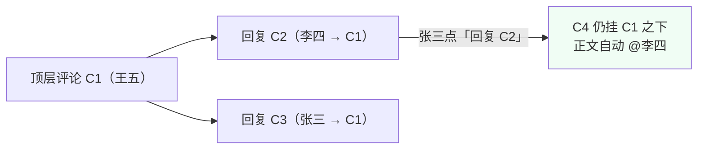
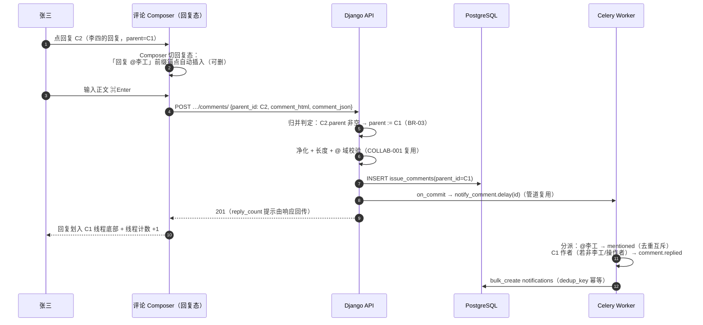
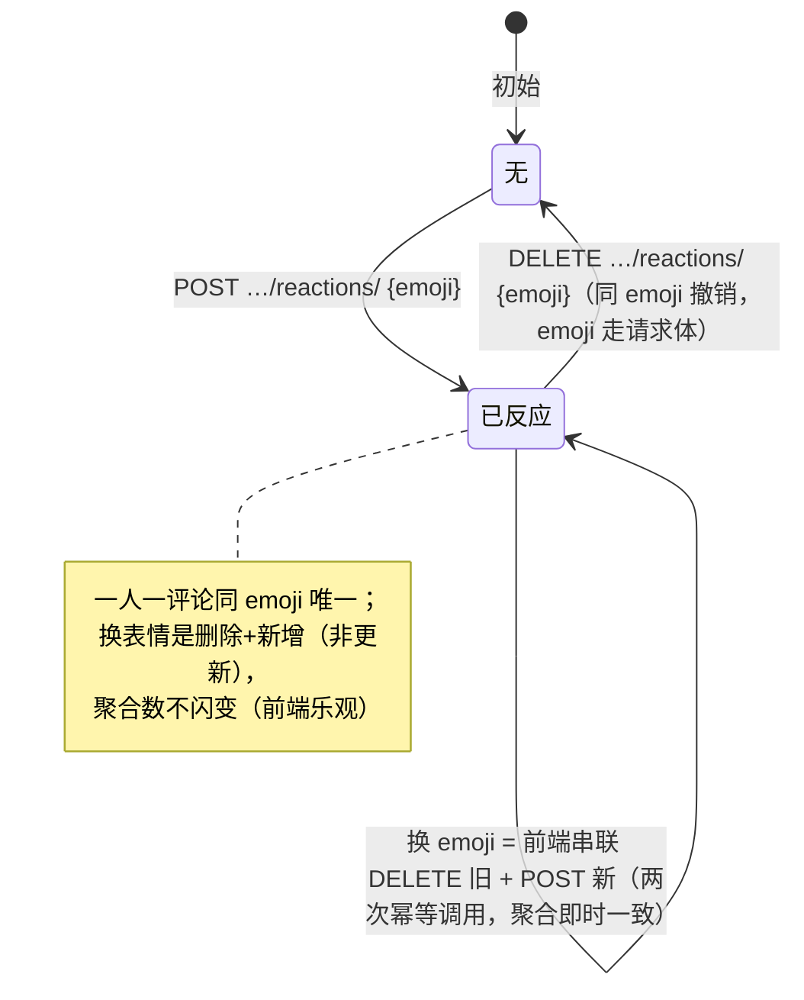
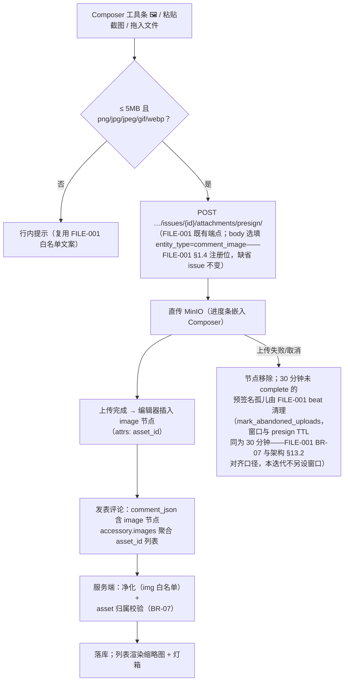
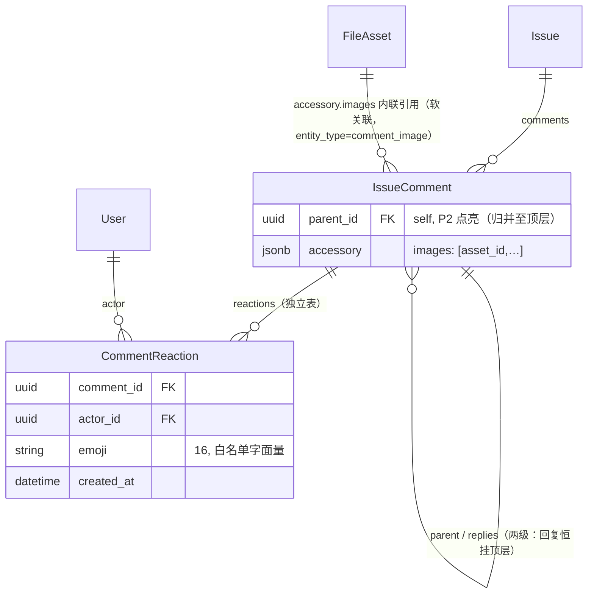

# 楼中楼回复 / 表情 / 图片评论

| 元信息项     | 内容                                                                                                                                                                                                                                                                                                                                                                                                                                                                                                                        |
| ------------ | --------------------------------------------------------------------------------------------------------------------------------------------------------------------------------------------------------------------------------------------------------------------------------------------------------------------------------------------------------------------------------------------------------------------------------------------------------------------------------------------------------------------------- |
| 文档编号     | COLLAB-002                                                                                                                                                                                                                                                                                                                                                                                                                                                                                                                  |
| 所属迭代     | Sprint 3：高级视图 + 实时协作（第 5 周）                                                                                                                                                                                                                                                                                                                                                                                                                                                                                    |
| 优先级       | P2（标准版完整级）                                                                                                                                                                                                                                                                                                                                                                                                                                                                                                          |
| 所属模块     | M8-COLLAB｜实时协作与通知                                                                                                                                                                                                                                                                                                                                                                                                                                                                                                   |
| 文档状态     | 待评审（Draft）                                                                                                                                                                                                                                                                                                                                                                                                                                                                                                             |
| 最后更新日期 | 2026-09-01                                                                                                                                                                                                                                                                                                                                                                                                                                                                                                                  |
| 上游依据     | `docs/需求文档.md` §3.8（评论回复楼中楼、评论@成员提醒、**表情、图片评论**）、§8.2 协作通知 P2 列                                                                                                                                                                                                                                                                                                                                                                                                                           |
| 前置依赖     | `COLLAB-001`（评论 CRUD / @ 解析 / 净化 / 通知管道 / `IssueComment` 全列基线——**parent 与 accessory 预留列本迭代点亮**）、`FILE-001`（附件预签名直传通道与 `FileAsset` 多态挂载）、`TASK-010`（Activity 管道约定——评论不落 Activity，时间线 UNION 合并渲染，见 §1.6）                                                                                                                                                                                                                                                       |
| 下游依赖     | `COLLAB-004`（WebSocket 评论实时推送——`comment.created` 事件源）、`INTG-003`（P4 Slack 回写评论）、`AI-001`（P4 评论摘要输入）                                                                                                                                                                                                                                                                                                                                                                                              |
| 架构基线     | [`unified-issue-model.md`](../architecture/unified-issue-model.md) §2.1 ER（IssueComment：`parent` 自引用楼中楼；`accessory` JSONB 为 `COLLAB-001` §4.1.1 建列的 Plane 同构预留——架构 ER 未含该列，**架构文档待回改**补录）；[`api-conventions.md`](../architecture/api-conventions.md) §2.3 路径命名、§2.4 嵌套约定、§4（信封/游标）、§8（错误码）；[`rbac-permission-model.md`](../architecture/rbac-permission-model.md) §6（第三层：数据库行级过滤）、§8.2（`comment.create` / `file.upload` / `file.read` 项目级矩阵） |
| 竞品参考     | Plane（IssueComment.parent 楼中楼 + accessory 承载评论 reactions；任务级另有 `IssueReaction` 独立表——本系统评论级表情命名为 `CommentReaction`，与迭代概览对齐） · Ones（表情回应 / 富媒体评论 / 消息管控 P3）                                                                                                                                                                                                                                                                                                               |
| 工作量估算   | 后端 2.5 人日 / 前端 3 人日 / 联调与测试 1 人日，合计 **6.5 人日**                                                                                                                                                                                                                                                                                                                                                                                                                                                          |

> **范围声明**：交付两级楼中楼（回复挂顶层评论之下，回复的回复折叠进同一线程）、表情 Reaction（独立表 + 聚合展示）、图片评论（复用 `FILE-001` 预签名直传，评论正文内联图片节点）。语音 / 视频评论、表情回应通知策略化、消息撤回重发、评论富媒体表格（P3 `COLLAB-002` 后续评估）不在范围。

---

## 1. 概述

### 1.1 功能定位

`COLLAB-001` 的扁平评论解决了「能不能说」；本迭代解决「**说得清、回得快**」：

1. **楼中楼**——针对某条评论的追问不再淹没会话流。回复挂接在顶层评论之下形成线程（thread），「回复的回复」折叠进同一线程并 @ 被回复人，两级封顶——既保留线程语境，又避免无限嵌套在 720px 侧栏里失去排版意义。
2. **表情 Reaction**——「+1」「看到了」「办完了」这类**零信息增量但高社交价值**的反馈，用一次点击替代一条评论。独立 `CommentReaction` 表承载（可聚合、每行含 actor/时间可追溯、可扩展自定义 emoji）。
3. **图片评论**——截图是研发沟通的第一介质（报错截图 / 设计稿标注 / 复现 GIF）。复用 `FILE-001` 的预签名直传通道，评论正文以图片节点内联引用，不重复建设上传设施。

工程关键词：**列结构 P1 已预留**（`parent` / `accessory` 列已建、通知管道已参数化）——本迭代以「点亮」为主，`issue_comments` 表零 DDL，仅新增 `comment_reactions` 一张表；例外是净化白名单**不含** `img`（COLLAB-001 BR-03 仅 p/br/strong/em/code/a/span 七标签），`img` 标签准入 + `src` 受控重写是本迭代的净化器扩展项（§4.3.3），并非既有升级位。

### 1.2 交付内容

| #   | 能力          | 说明                                                                                                                        |
| --- | ------------- | --------------------------------------------------------------------------------------------------------------------------- |
| 1   | 两级楼中楼    | `parent_id` 启用：回复只能挂**顶层**评论之下（回复的回复归并同线程 + 自动 @）；单评论回复数上限 100                         |
| 2   | 线程化列表    | 评论列表返回「顶层 + replies 数组（按时间正序）」两层结构；`reply_count` 聚合                                               |
| 3   | 回复通知      | 新事件 `comment.replied`：被回复人收一条（与 `issue.commented` 互斥去重）；回复自动插入 @ 被回复人锚点（可删）              |
| 4   | 表情 Reaction | `CommentReaction(comment, actor, emoji)`；toggle 端点；聚合展示「👍 3 · 🎉 1」+ 悬浮列人名；emoji 白名单 24 枚              |
| 5   | 图片评论      | 正文图片节点（`comment_json` image 节点 + `accessory.images` 引用 asset_id）；缩略图点击灯箱放大；直传走 `FILE-001` presign |
| 6   | 折叠交互      | 线程超 3 条回复折叠「查看 N 条回复」；表情栏常驻 8 枚 + More 展开全量                                                       |

### 1.3 关键约定一：两级封顶的归并语义

> ⚠️ 「回复的回复」不产生第三层——这是产品语义而非技术限制。



| 用户动作                    | 落库 parent_id | 通知对象                                         | 理由                                                                                    |
| --------------------------- | -------------- | ------------------------------------------------ | --------------------------------------------------------------------------------------- |
| 回复顶层评论 C1             | C1             | C1 作者（`comment.replied`）                     | 标准楼中楼                                                                              |
| 回复回复 C2（C2.parent=C1） | **C1（归并）** | **C2 作者**（正文 @ 锚点触发 `issue.mentioned`） | 线程语境完整在 C1 之下；被回复人经 @ 触达——两级 UI 放不下第三层缩进，但社交语义一个不少 |

**为什么不用「回复的回复挂 C2 形成真三层」**：720px 侧栏下第三层缩进后正文宽度 < 300px，移动端不可用；而 Plane / GitHub / Jira 的主流实践均为「两级展示 + @ 补偿语境」。归并语义让**存储结构（自引用树）与展示结构（两层）解耦**——P3 若需真多层，改前端渲染即可，数据零迁移。

### 1.4 关键约定二：Reaction 独立表 vs accessory 内联

`COLLAB-001` 的 `accessory` 帮助文本预留了 `{"reactions":[...]}` 内联形态（Plane 同构），本迭代**升级为独立表**并保留 accessory 承载图片引用：

| 维度         | accessory JSONB 内联                    | **CommentReaction 独立表（采纳）**                                                             |
| ------------ | --------------------------------------- | ---------------------------------------------------------------------------------------------- |
| toggle 写入  | 读整 JSON → 改数组 → 写回（读改写竞态） | 单行 INSERT/DELETE，天然并发安全                                                               |
| 聚合查询     | 每评论解析 JSON（无法索引）             | `GROUP BY emoji` 走索引                                                                        |
| 审计         | 无操作主体时间线                        | 每行含 actor/created_at（行级自审计；不写 `IssueActivity` 逐条留痕——BR-09，P3 管控配套时复议） |
| 「谁点过赞」 | 需全量数组扫描                          | `(comment, actor)` 点查                                                                        |
| Plane 现状   | accessory 内联 reactions（读改写）      | ——本系统的工程加固点                                                                           |

> accessory 不废弃：`accessory.images` 继续承载图片引用（图片与评论同生共死，无独立 toggle 语义，内联合适）。**「有独立生命周期的数据进表，纯展示附属进 JSONB」**是本系统的划线原则。

### 1.5 范围边界

| 能力                                       | 本文档（P2）                 | 归属                   |
| ------------------------------------------ | ---------------------------- | ---------------------- |
| 两级楼中楼 + 归并语义 + 折叠               | ✅                           | —                      |
| 表情 Reaction（24 白名单 / toggle / 聚合） | ✅                           | —                      |
| 图片评论（直传 / 内联 / 灯箱）             | ✅                           | —                      |
| `comment.replied` 通知事件                 | ✅                           | —                      |
| 回复编辑 / 删除（含父删子留）              | ✅（复用 15 分钟窗口与软删） | —                      |
| 自定义 emoji 上传                          | ❌ 白名单 24 枚              | P4（企业自定义表情包） |
| 语音 / 视频 / 文件评论                     | ❌（文件评论走 P3 评估）     | —                      |
| Reaction 通知                              | ❌（点表情不通知——降噪优先） | P3 静默策略配套后评估  |
| 评论级 Markdown 表格 / 代码高亮 diff       | ❌                           | P3 编辑器增强          |
| 消息撤回（发送后长期可删痕迹）             | ❌ 软删占位即终态            | —                      |
| Slack 回写评论                             | ❌                           | P4 `INTG-003`          |

### 1.6 前置依赖

| 依赖         | 内容                                                                                                                                                   | 阻塞原因                                                                                      |
| ------------ | ------------------------------------------------------------------------------------------------------------------------------------------------------ | --------------------------------------------------------------------------------------------- |
| `COLLAB-001` | `IssueComment` 全列（parent/accessory 已建）、净化器、`Notification` 管道与 `dedup_key` 幂等、15 分钟窗口、软删占位                                    | 本迭代全部在其上扩展；BR-14 的「parent 强制 NULL」锁解除                                      |
| `FILE-001`   | 预签名直传三步流、`FileAsset`（`entity_type` 多态挂载注册制）、类型/体积白名单、孤儿清理                                                               | 图片评论零新建上传设施                                                                        |
| `TASK-010`   | Activity 管道约定：评论（含回复）不落 `IssueActivity`（其 BR-05——评论本体在 `IssueComment`，时间线 UNION 合并渲染）；reaction 同样不留痕（本档 BR-09） | 审计口径一致（避免双写与「reaction 留痕」误导）                                               |
| `AUTH-005`   | `comment.create` 权限点（rbac §8.2，AUTH-005 归并命名）                                                                                                | 回复与表情的权限基线（表情与评论同级 COMMENTER+；低于图片上传 `file.upload` 的 CONTRIBUTOR+） |

### 1.7 竞品参考

| 竞品   | 参考点                                                            | 处置                                                        |
| ------ | ----------------------------------------------------------------- | ----------------------------------------------------------- |
| Plane  | `IssueComment.parent` 楼中楼；reactions 存 `accessory` JSONB 内联 | 楼中楼对齐；**reaction 升级独立表**（规避读改写竞态，§1.4） |
| Plane  | 评论图片经 attachment 通道，正文 image 节点引用                   | 对齐（复用 FILE-001 资产层）                                |
| GitHub | 回复归并进线程 + @ 被回复人                                       | **归并语义的原型**（两级展示 + @ 补偿）                     |
| Ones   | 表情回应 / 富媒体 / 消息管控（静默 / 策略）企业级                 | 富媒体 P2 对齐基础形态；管控归 P3                           |

---

## 2. 业务逻辑

### 2.1 发表回复全链路（含归并与通知互斥）



### 2.2 表情 Reaction 状态机（toggle 语义）



| 约束        | 说明                                                                                                                                                                                                                                                          |
| ----------- | ------------------------------------------------------------------------------------------------------------------------------------------------------------------------------------------------------------------------------------------------------------- |
| 唯一性      | `(comment, actor, emoji)` 唯一约束——一人可对同一评论持有**多个不同** emoji（👍 + 🎉 合法，语义是「赞且祝贺」）                                                                                                                                                |
| toggle 端点 | `POST …/reactions/`（body 带 emoji）幂等添加；`DELETE …/reactions/`（body 带 emoji）撤销——路径参数仅 UUID/slug（api-conventions §2.3），emoji 字面量不进路径；带体 DELETE 先例同其 §2.6 批量删除；「换」由前端串联两次幂等调用（§4.3.2，不设原子 `PUT` 端点） |
| 权限        | `comment.create`（COMMENTER+）——点表情是轻量发言                                                                                                                                                                                                              |
| 通知        | 不产生任何通知（BR-09 降噪）                                                                                                                                                                                                                                  |

### 2.3 图片评论上传时序



### 2.4 业务规则表

| 编号  | 规则                                                                                                                                                                                                                                                 | 判定位置                        | 违反后果                                                                                                |
| ----- | ---------------------------------------------------------------------------------------------------------------------------------------------------------------------------------------------------------------------------------------------------- | ------------------------------- | ------------------------------------------------------------------------------------------------------- |
| BR-01 | 回复权限 = 评论权限（`comment.create`，COMMENTER+）；归档项目只读（403 `PERM_PROJECT_ARCHIVED`）                                                                                                                                                     | Permission                      | 403                                                                                                     |
| BR-02 | `parent_id` 必须指向**同一任务**的存活评论；跨任务 / 已软删父 → 400 `DOES_NOT_EXIST`                                                                                                                                                                 | Serializer                      | 400                                                                                                     |
| BR-03 | **两级归并**：目标 parent 自身是回复（parent.parent 非空）时，落库 parent 归并为顶层根；「回复回复」的触达靠自动 @                                                                                                                                   | Service                         | —                                                                                                       |
| BR-04 | 自动 @ 插入：回复 Composer 预填被回复人锚点（可手动删除）；锚点删除则不触发 mentioned（用户显式选择）                                                                                                                                                | 前端 + 解析器                   | —                                                                                                       |
| BR-05 | 单顶层评论的回复数上限 **100**；超限 409 提示开新评论                                                                                                                                                                                                | Service                         | `RESOURCE_LIMIT_EXCEEDED`                                                                               |
| BR-06 | 回复继承 15 分钟编辑窗口与软删占位（COLLAB-001 语义不变）；**删除父评论：父转占位行、回复保留**（线程语境不塌）                                                                                                                                      | Service                         | —                                                                                                       |
| BR-07 | 图片 asset 必须属于当前任务**评论图域**——`FileAsset` 多态挂载无 `issue_id` 列，判定为 `entity_type='comment_image'` ∧ `entity_id=当前 issue_id` ∧ `status='uploaded'`（FILE-001 五态之一）∧ `uploaded_by=当前用户`——防跨任务 asset ID 盗链与旧值冒用 | Serializer                      | 400 `DOES_NOT_EXIST`                                                                                    |
| BR-08 | 单条评论图片数 ≤ **9**（发表期计数超限 409 `RESOURCE_LIMIT_EXCEEDED` + `LIMIT`）；每张 ≤ 5MB、格式 png/jpg/jpeg/gif/webp（gif 不做帧数限制）——体积与格式在 presign 期对 `entity_type=comment_image` 收紧校验（FILE-001 25MB / 全量白名单的子集）     | Composer + presign + Serializer | 400 `VALIDATION_FILE_SIZE_EXCEEDED` / `VALIDATION_FILE_TYPE_NOT_ALLOWED`；409 `RESOURCE_LIMIT_EXCEEDED` |
| BR-09 | Reaction：emoji ∈ 24 白名单；不产生通知、不产生 IssueActivity 逐条留痕（聚合变化不审计——降噪与表体积双重考量，P3 复议）                                                                                                                              | Serializer                      | 400 `NOT_A_CHOICE`                                                                                      |
| BR-10 | Reaction 幂等：重复 POST 同 emoji 200 无变化；幂等语义靠唯一约束 + `get_or_create`（§4.3.2 口径，软删行复活或新建）                                                                                                                                                             | DB + Service                    | —                                                                                                       |
| BR-11 | 通知互斥（扩展 COLLAB-001 BR-06）：同一线程动作对同一人至多一条——优先级 `mentioned` > `comment.replied` > `issue.commented`                                                                                                                          | Worker 分派                     | —                                                                                                       |
| BR-12 | `comment.replied` 仅发**顶层评论作者**（回复的回复场景被回复人走 mentioned）；操作者本人 / 域外成员剔除                                                                                                                                              | Worker                          | —                                                                                                       |
| BR-13 | 评论列表两层结构：顶层正序 + `replies[]` 正序；`replies` 默认全量返回（≤100），前端折叠纯展示行为                                                                                                                                                    | ViewSet                         | —                                                                                                       |
| BR-14 | 解除 COLLAB-001 的「parent 强制 NULL」锁：本迭代起带 `parent_id` 的请求合法（契约翻转测试 UT-19 落 §5.1 清单——COLLAB-001 UT-13 同场景由 400 翻转为 201）                                                                                             | Serializer                      | —                                                                                                       |
| BR-15 | 图片节点净化：`img` 标签进入白名单但**仅允许 `src="/api/v1/files/{asset_id}/…"` 服务端代理形态与 `alt`**——外链图片（`http://` src）剥离为链接文本（防盗链与隐私引用）                                                                                | 净化器                          | 静默降级                                                                                                |

### 2.5 异常处理表

| 异常场景         | 触发条件                       | HTTP / 错误码                                                                                                                                                            | 前端表现                                             | 后端处理              |
| ---------------- | ------------------------------ | ------------------------------------------------------------------------------------------------------------------------------------------------------------------------ | ---------------------------------------------------- | --------------------- |
| 回复跨任务父     | parent 属他任务                | 400 `VALIDATION_ERROR` + `DOES_NOT_EXIST`                                                                                                                                | 「回复目标无效」                                     | Serializer 域校验     |
| 回复已删父       | parent 软删                    | 400 同上                                                                                                                                                                 | 占位行无回复按钮                                     | —                     |
| 回复数超限       | 第 101 条                      | 409 `RESOURCE_LIMIT_EXCEEDED`                                                                                                                                            | 「该评论回复已达上限，请直接发表新评论」             | —                     |
| 非法 emoji       | 自定义串 / 超白名单            | 400 `VALIDATION_ERROR` + `NOT_A_CHOICE`                                                                                                                                  | 表情栏只出白名单；直连触发                           | —                     |
| 撤销未点过的表情 | DELETE 不存在行                | 200（幂等，`changed=false`）                                                                                                                                             | 无感                                                 | —                     |
| 图片超规格       | >5MB / 非图片白名单 / 第 10 张 | 400 `VALIDATION_FILE_SIZE_EXCEEDED` / 400 `VALIDATION_FILE_TYPE_NOT_ALLOWED`（presign 期对 `comment_image` 收紧）/ 409 `RESOURCE_LIMIT_EXCEEDED` + `LIMIT`（发表期计数） | Composer 行内提示 + 节点不插入；第 10 张不入上传队列 | —                     |
| 外链图片注入     | ``      | 200（净化为文本链接）                                                                                                                                                    | 显示为链接                                           | BR-15 白名单          |
| asset 盗链       | 引用他任务 asset_id            | 400 `DOES_NOT_EXIST`                                                                                                                                                     | 图片位显示「图片不可用」占位                         | BR-07 归属校验        |
| 上传中断         | 直传半途取消                   | —                                                                                                                                                                        | 进度条消失 + 节点移除                                | FILE-001 孤儿清理兜底 |
| 归档项目         | 项目已归档                     | 403 `PERM_PROJECT_ARCHIVED`                                                                                                                                              | 只读态                                               | —                     |

### 2.6 边界条件表

| 边界场景            | 限制值                      | 超出处理方式                                                                |
| ------------------- | --------------------------- | --------------------------------------------------------------------------- |
| 单评论回复数        | 100                         | 409 + 引导新评论                                                            |
| 单条评论图片数      | 9                           | 拒绝第 10 张（409 `RESOURCE_LIMIT_EXCEEDED`）                               |
| 单图体积            | 5MB                         | 拒绝（presign 期对 `comment_image` 收紧——FILE-001 25MB 通道上限内取更严值） |
| emoji 白名单        | 24 枚（常驻 8 + 展开 16）   | 400                                                                         |
| 一人一评论 emoji 数 | 无上限（不同 emoji 各一行） | 聚合栏横向滚动                                                              |
| 折叠阈值            | 线程 > 3 条回复折叠         | 「查看 N 条回复」                                                           |
| 灯箱加载            | 原图懒加载（列表用缩略图）  | 失败占位                                                                    |
| 回复深度            | 2（归并保证）               | —                                                                           |

---

## 3. UI/UX 设计

### 3.1 评论 Tab 线程化（升级 `COLLAB-001` §3.1）

```
┌──────────────────────────────────────────────────────────────────┐
│ 💬 评论 3 · 回复 5                                                 │
├──────────────────────────────────────────────────────────────────┤
│ ┌──┐ 王五 · 10:02                                        ✏️  🗑    │
│ │头像│ 这个接口偶发 504，复现步骤如下…                              │
│ └──┘                                                              │
│ │   😂 2   👍 5   ➕                                              │ ← 反应栏
│ │ ┌──────────────────────────────────────────────────────────┐   │
│ │ │ ┌─┐ 李四 · 10:05  ·  回复                                │   │
│ │ │ │头│ <span data-mention-id="@王五">@王五</span> 网关超时配置   │   │
│ │ │ └─┘ 看下 upstream 的 read_timeout？        😂 1           │   │
│ │ │      ↩ 回复                                                │   │
│ │ ├──────────────────────────────────────────────────────────┤   │
│ │ │ ┌─┐ 张三 · 10:11  ·  回复 @李工（已归并至本线程）            │   │
│ │ │ │头│ 是 60s，我改成 15s 试试                                │   │
│ │ │ └─┘                                          👍 1        │   │
│ │ │      ↩ 回复                                                │   │
│ │ └──────────────────────────────────────────────────────────┘   │
│ │   ⊕ 查看另外 2 条回复…                                           │
│ ├──────────────────────────────────────────────────────────────┤ │
│ │ ┌──┐ [🖼 截图 2026-09-01.png ▓▓▓▓▓░ 67%]  （上传中）           │ │
│ │ │头像│ 附件就是这张图：                                         │ │
│ │ └──┘ ┌────────┐┌────────┐                                    │ │
│ │      │ 缩略图1 ││ 缩略图2 │  ← 点击灯箱放大（←→ 翻页）           │ │
│ │      └────────┘└────────┘                                    │ │
│ ├──────────────────────────────────────────────────────────────┤ │
│ ┌──┐ 张三 · 昨天                                                   │
│ │头像│ 该评论已删除（回复 2 条保留 ↓）                              │
│ └──┘ ┌──────────────────────────────────────────────────────┐   │
│      │ ┌─┐ 李四：结论是 X（父删子留）                            │   │
│      │ └─┘                                                    │   │
│      └──────────────────────────────────────────────────────┘   │
├──────────────────────────────────────────────────────────────────┤
│ 回复态 Composer：                                                 │
│ ┌──────────────────────────────────────────────────────────────┐ │
│ │ ↩ 回复 @李工 ▾（切换目标/清除）                                  │ │
│ │ @ B I  🖼  😊  🔗                                              │ │
│ │ 输入回复…                                                      │ │
│ │                          （⌘Enter 发表回复）        0/5000     │ │
│ └──────────────────────────────────────────────────────────────┘ │
└──────────────────────────────────────────────────────────────────┘
```

| 元素           | 规格                                                                                                            |
| -------------- | --------------------------------------------------------------------------------------------------------------- |
| 线程容器       | 顶层评论全宽；`replies` 区左缩进 32px + 左侧 2px `neutral-200` 引导线；圆角浅底 `bg-neutral-50`                 |
| 回复行         | 24px 小头像（顶层 32px）；「回复」徽标区分；正文 `text-sm`                                                      |
| 「回复 @xx ▾」 | 回复态 Composer 顶部条：点 ▾ 可切换线程内目标或清除转顶层；归并对用户透明（提示「将回复到该线程」）             |
| 反应栏         | emoji + 计数 chips；本人已点的 chip 高亮蓝底；点 chip = toggle；`➕` 展开选择器（§3.2）；悬浮 chip 弹点名人列表 |
| 折叠条         | `⊕ 查看另外 N 条回复`；展开后 `⊖ 收起`；折叠状态会话内记忆                                                      |
| 图片缩略图     | 96px 方形裁切 `object-cover`；多图 2 列网格（≤2）/ 3 列（≥3）；GIF 静帧 + ▶ 角标，hover 播放                    |
| 灯箱           | 全屏遮罩；`←→` 切换同评论图片；`Esc` 关闭；底部原图尺寸与大小                                                   |
| 父删子留       | 父占位行下 replies 区保留渲染（引导线延续）                                                                     |

### 3.2 表情选择器

```
        │  ➕ 点击展开 ▼
        │ ┌────────────────────────────────┐
        │ │ 👍 👎 ❤️ 😂 🎉 🚀 👀 ✅  │ ← 常驻 8
        │ │ ────────────────────────────── │
        │ │ 😕 😡 🤔 👏 🔥 💯 😢 🙏   │ ← 展开 8
        │ │ ⛔ ⏰ 🍀 📌 🔁 ❓ 💤 🎯   │ ← 展开 8（共 24）
        │ └────────────────────────────────┘
        │  悬浮 chip 名单浮层：
        │ ┌──────────────────────┐
        │ │ 😂：李四、张三          │
        │ │ （其余 1 人…展开）      │
        │ └──────────────────────┘
```

| 元素        | 规格                                                                                                                            |
| ----------- | ------------------------------------------------------------------------------------------------------------------------------- |
| 选择器      | Popover 两行常驻 + 展开三行；`role="menu"`；键盘方向键 + Enter                                                                  |
| toggle 反馈 | 计数乐观 ±1；取消时 chip 淡出动画 200ms                                                                                         |
| 名单浮层    | 前 5 人 + 「等 N 人」；自己标记「（你）」                                                                                       |
| 服务端聚合  | chips 数据随评论响应下发（`reactions: [{emoji, count, reacted_by_me, user_ids?}]`，`user_ids` 仅在 `?expand=reactions` 时给出） |

### 3.3 交互细节表

| 交互动作   | 触发方式             | 反馈效果                                   | 加载态 / 空态 / 失败态   |
| ---------- | -------------------- | ------------------------------------------ | ------------------------ |
| 回复       | 行尾 ↩ / 悬浮        | Composer 切回复态 + 焦点 + 自动 @ 预填     | —                        |
| 归并提示   | 回复一条「回复」时   | 目标条下方淡字「将回复到该线程」           | —                        |
| 发表回复   | ⌘Enter               | 乐观插入线程底部 + 计数 +1 + Composer 复位 | 失败回滚 + 草稿保留      |
| 点表情     | chip 点击 / 选择器   | 计数 ±1、chip 高亮切换                     | 失败静默回滚（重试一次） |
| 换表情     | 已点状态点新 emoji   | 原子替换（旧淡出新淡入）                   | —                        |
| 贴图       | 粘贴 / 拖入 / 🖼 选择 | Composer 内嵌进度条；完成变缩略图          | 失败行内重试按钮         |
| 灯箱       | 点缩略图             | 全屏 + `←→` 翻页                           | 原图加载 spinner         |
| 折叠/展开  | 折叠条点击           | 高度动画 200ms；记忆会话内状态             | —                        |
| 删除父评论 | 🗑 + 确认             | 父转占位（「回复 N 条保留」）；线程不塌    | —                        |

### 3.4 空状态 / 加载 / 失败

| 场景         | 处置                                 |
| ------------ | ------------------------------------ |
| 无评论       | 沿用 COLLAB-001 空态；Composer 常驻  |
| 线程加载     | 顶层骨架 3 行 + replies 区合并骨架块 |
| 表情聚合缺失 | 反应栏隐藏（历史数据）               |
| 图片全部失效 | 「图片不可用」占位格                 |

### 3.5 响应式与无障碍

| 断点       | 布局                                                |
| ---------- | --------------------------------------------------- |
| ≥ 1280px   | 线程缩进 32px；反应栏全量 chips                     |
| 768~1279px | 缩进 24px；chips 超 4 个横向滚动                    |
| < 768px    | 缩进 16px；多图单列；灯箱手势左右滑；选择器底部抽屉 |

无障碍：反应 chip `aria-pressed` 表达已点态 + `aria-label="😂，2 人，含你"`；选择器 `role="menu"` 键盘可达；缩略图 `alt` 取上传文件名；灯箱 `role="dialog"` + 焦点陷阱；「查看 N 条回复」`aria-expanded`；归并提示为 `sr-only` 文本（视觉弱化但读屏可闻）。

---

## 4. 技术架构

### 4.1 数据模型

#### 4.1.1 `CommentReaction`（新表——命名与迭代概览对齐：评论级表情，区别于 Plane 任务级 `IssueReaction`）

```python
# apps/api/plane/db/models/comment.py —— 新增
from django.db import models

from plane.db.models.base import BaseModel


class CommentReaction(BaseModel):
    """评论表情反应 —— 独立表（§1.4 论证：有独立生命周期的数据进表）

    一人对同一评论可持有多个不同 emoji（多行并存）；
    同 (comment, actor, emoji) 唯一——toggle 的幂等基座。
    """

    comment = models.ForeignKey(
        "db.IssueComment", on_delete=models.CASCADE,
        related_name="reactions", verbose_name="所属评论",
    )
    actor = models.ForeignKey(
        "db.User", on_delete=models.CASCADE,
        related_name="comment_reactions", verbose_name="反应人",
    )
    emoji = models.CharField(max_length=16, verbose_name="emoji 字面量",
                             help_text="白名单 24 枚（§4.3.1），存字面量不存编码")

    class Meta(BaseModel.Meta):
        db_table = "comment_reactions"
        verbose_name = "评论表情"
        verbose_name_plural = "评论表情"
        ordering = ("created_at",)
        constraints = [
            models.UniqueConstraint(
                fields=["comment", "actor", "emoji"],
                condition=models.Q(deleted_at__isnull=True),
                name="uniq_reaction_comment_actor_emoji",
            ),
        ]
        indexes = [
            # 聚合主查询：WHERE comment_id IN (页面评论集) GROUP BY emoji
            models.Index(fields=["comment", "emoji"], name="idx_reaction_comment_emoji"),
        ]
```

#### 4.1.2 `IssueComment` 点亮项（零 DDL）

```python
# 既有列（COLLAB-001 §4.1.1 建齐），本迭代语义点亮：
parent = models.ForeignKey("self", ...)      # BR-14 解锁：P2 起可写非空
accessory = models.JSONField(...)            # 启用 images 键：{"images": [asset_id, …]}
# reactions 不入 accessory —— 独立表（§1.4）
```

#### 4.1.3 迁移

```python
# apps/api/plane/db/migrations/00XX_p2_comment_reactions.py
class Migration(migrations.Migration):
    dependencies = [("db", "00XX_p2_issue_views")]  # 同迭代 BOARD-003 迁移（依赖链保持 p2_ 同族）
    operations = [
        migrations.CreateModel(...),   # CommentReaction（新表 + 唯一约束 + 索引）
        # issue_comments 零 DDL —— parent / accessory P1 已建（COLLAB-001 §4.1.1）
    ]
```

#### 4.1.4 ER 图与索引说明



| 索引 / 约束                                   | 服务的查询                                                                | 说明                                                                |
| --------------------------------------------- | ------------------------------------------------------------------------- | ------------------------------------------------------------------- |
| `idx_comment_issue_time`（既有）              | 顶层 + 回复一次取数（`WHERE issue_id=? ORDER BY created_at`，内存分两层） | 单任务评论量 < 数千，两层装配 O(n)                                  |
| `uniq_reaction_comment_actor_emoji`           | toggle 幂等 + 去重                                                        | 软删偏条件（复活语义同 `IssueAssignee`：重按复活软删行或新建——与 §4.3.2 `get_or_create`「复活或新建」同口径） |
| `idx_reaction_comment_emoji`                  | 页面评论集的聚合 `GROUP BY`                                               | `comment_id IN (30)` + `COUNT(*) GROUP BY emoji, comment_id` 单查询 |
| `(parent)` 复用 `idx_comment_issue_time` 首列 | `reply_count` annotate：`Count("replies")`                                | 无需新索引                                                          |

### 4.2 API 定义

| #   | 方法     | 路径                                                   | 描述                                                                          | 权限             | 成功码 |
| --- | -------- | ------------------------------------------------------ | ----------------------------------------------------------------------------- | ---------------- | ------ |
| 1   | `POST`   | `…/issues/{issue_id}/comments/`                        | 发表评论 / **回复**（body 含 `parent_id`，归并生效）                          | `comment.create` | `201`  |
| 2   | `GET`    | `…/issues/{issue_id}/comments/`                        | 两层结构列表（顶层 + `replies[]` + `reply_count` + `reactions` 聚合）         | `project.read`   | `200`  |
| 3   | `POST`   | `…/issues/{issue_id}/comments/{comment_id}/reactions/` | 添加表情（幂等）                                                              | `comment.create` | `200`  |
| 4   | `DELETE` | `…/issues/{issue_id}/comments/{comment_id}/reactions/` | 撤销表情（幂等；body 带 `emoji`——路径参数仅 UUID/slug，api-conventions §2.3） | `comment.create` | `200`  |
| 5   | `GET`    | `…/issues/{issue_id}/comments/?expand=reactions`       | 聚合含 `user_ids`（名单浮层数据）                                             | `project.read`   | `200`  |

> 编辑 / 删除端点复用 `COLLAB-001`（窗口与软删语义不变，回复同权适用）；图片上传复用 `FILE-001` presign 三步流——请求体选填 `entity_type=comment_image`（FILE-001 §1.4 已注册的 P2 挂载点，`entity_id` 落当前 issue，缺省 `issue` 语义不变；不占单任务 20 附件配额、不入附件区列表）。**上游待回改项**——presign 契约（架构 `api-conventions` §13.2，请求体字段仅 `file_name`/`file_size`/`content_type`，FILE-001 请求体据此对齐）需补 `entity_type` 选填参数（本迭代评论图域消费，P2 扩展登记）。
>
> 路径深度锚定：上表第 3/4 行 `…/comments/{comment_id}/reactions/` 为第 5 层资源——api-conventions §2.4 放行示例止于第 4 层（`…/comments/{comment_id}/`），文义为项目层以下不设嵌套限制（`reactions` 系叶子资源评论的直接子资源），本端点第 5 层合规。

#### 4.2.1 `POST …/comments/` — 发表回复（含图片）

**请求**

```json
{
  "parent_id": "cm0a1b2c-3d4e-4f5a-8b6c-7d8e9f0a1b2c",
  "comment_html": "<p><span data-mention-id=\"2b3a4c5d-6e7f-4a8b-9c0d-1e2f3a4b5c6d\">@李工</span> 是 60s，我改成 15s 试试</p>",
  "comment_json": {
    "type": "doc",
    "content": [
      {
        "type": "paragraph",
        "content": [
          { "type": "mention", "attrs": { "id": "2b3a…", "label": "@李工" } },
          { "type": "text", "text": " 是 60s，我改成 15s 试试" }
        ]
      }
    ]
  }
}
```

**图片评论请求（节选）**

```json
{
  "comment_html": "<p>附件就是这两张：</p>",
  "comment_json": {
    "type": "doc",
    "content": [
      { "type": "paragraph", "content": [{ "type": "text", "text": "附件就是这两张：" }] },
      { "type": "image", "attrs": { "asset_id": "fa1b2c3d-…", "alt": "504 截图.png" } },
      { "type": "image", "attrs": { "asset_id": "fa2b3c4d-…", "alt": "网关日志.png" } }
    ]
  }
}
```

> `img src` 由服务端在净化时**重写**为受控代理路径（BR-15：外链剥离、内联仅留服务端形态）；`accessory.images` 由服务端从 `comment_json` 的 image 节点聚合生成（客户端不直传 accessory——单一真相）。

**成功响应 `201`（回复）**

```json
{
  "status": "success",
  "data": {
    "id": "cm2c3d4e-5f6a-4b7c-8d9e-0f1a2b3c4d5e",
    "parent_id": "cm0a1b2c-3d4e-4f5a-8b6c-7d8e9f0a1b2c",
    "root_id": "cm0a1b2c-3d4e-4f5a-8b6c-7d8e9f0a1b2c",
    "actor": { "id": "4d5e…", "display_name": "张三", "avatar_url": null },
    "comment_html": "<p><span data-mention-id=\"2b3a…\">@李工</span> 是 60s，我改成 15s 试试</p>",
    "mention_ids": ["2b3a4c5d-6e7f-4a8b-9c0d-1e2f3a4b5c6d"],
    "reply_to_actor": { "id": "2b3a…", "display_name": "李四" },
    "images": [],
    "reactions": [],
    "is_edited": false,
    "created_at": "2026-09-05T08:11:00.000Z"
  }
}
```

> `root_id` 为归并后的顶层 ID（与 `parent_id` 恒等——两级封顶的实现投影）；`reply_to_actor` 回传被回复人（前端渲染「回复 @李工」徽标）——**展示语境靠 @ 锚点，挂载关系靠归并**，两者解耦。

**失败响应 `400`（回复已删父）**

```json
{
  "status": "error",
  "error": {
    "code": "VALIDATION_ERROR",
    "message": "请求参数校验失败",
    "details": [
      { "field": "parent_id", "code": "DOES_NOT_EXIST", "message": "回复目标不存在或已删除" }
    ],
    "request_id": "01JCC2B5T9DV3X7Y1D0E2F4G5H"
  }
}
```

#### 4.2.2 `GET …/comments/` — 两层结构列表

**成功响应 `200`（节选：一条顶层带线程与聚合）**

```json
{
  "status": "success",
  "data": [
    {
      "id": "cm0a1b2c-…",
      "actor": { "id": "a2b3…", "display_name": "王五", "avatar_url": null },
      "comment_html": "<p>这个接口偶发 504，复现步骤如下…</p>",
      "is_edited": false,
      "is_deleted": false,
      "reply_count": 2,
      "reactions": [
        { "emoji": "😂", "count": 2, "reacted_by_me": false },
        { "emoji": "👍", "count": 5, "reacted_by_me": true }
      ],
      "images": [],
      "replies": [
        {
          "id": "cm1b2c3d-…",
          "parent_id": "cm0a1b2c-…",
          "actor": { "id": "2b3a…", "display_name": "李四", "avatar_url": null },
          "comment_html": "<p><span data-mention-id=\"a2b3…\">@王五</span> 网关超时配置看下 upstream 的 read_timeout？</p>",
          "reply_to_actor": { "id": "a2b3…", "display_name": "王五" },
          "reactions": [{ "emoji": "😂", "count": 1, "reacted_by_me": false }],
          "images": [],
          "is_edited": false,
          "is_deleted": false,
          "created_at": "2026-09-05T08:05:00.000Z"
        },
        {
          "id": "cm2c3d4e-…",
          "parent_id": "cm0a1b2c-…",
          "actor": { "id": "4d5e…", "display_name": "张三", "avatar_url": null },
          "comment_html": "<p><span data-mention-id=\"2b3a…\">@李工</span> 是 60s，我改成 15s 试试</p>",
          "reply_to_actor": { "id": "2b3a…", "display_name": "李四" },
          "reactions": [{ "emoji": "👍", "count": 1, "reacted_by_me": true }],
          "images": [],
          "is_edited": false,
          "is_deleted": false,
          "created_at": "2026-09-05T08:11:00.000Z"
        }
      ],
      "created_at": "2026-09-05T08:02:00.000Z"
    }
  ],
  "meta": {
    "next_cursor": "30:1:0",
    "next_page_results": false,
    "count": 1,
    "total_count": 3,
    "total_pages": 1,
    "page": 1,
    "per_page": 30
  }
}
```

**契约要点**：

1. 游标按**顶层**分页（30 顶层/页）；`replies` 随顶层全量内联（≤100）——两层一次取齐，无二次请求；
2. `reactions` 默认聚合（emoji/count/reacted_by_me）；`?expand=reactions` 追加 `user_ids`（名单浮层）；
3. `reply_count` 与 `replies.length` 恒等（全量内联时）；父删子留场景父行 `is_deleted: true` 而 `replies` 保留。

#### 4.2.3 `POST/DELETE …/reactions/` — 表情 toggle

**请求（添加）**

```json
{ "emoji": "🎉" }
```

**请求（撤销：DELETE 同路径，emoji 走请求体而非路径——api-conventions §2.3 路径参数仅 UUID/slug；带体 DELETE 先例见其 §2.6 批量删除）**

```json
{ "emoji": "🎉" }
```

**成功响应 `200`（幂等：重复添加同值）**

```json
{
  "status": "success",
  "data": {
    "emoji": "🎉",
    "count": 4,
    "reacted_by_me": true,
    "changed": true
  }
}
```

**成功响应 `200`（撤销；`changed` 标识是否实际变更）**

```json
{
  "status": "success",
  "data": { "emoji": "🎉", "count": 3, "reacted_by_me": false, "changed": true }
}
```

**失败响应 `400`（白名单外 emoji）**

```json
{
  "status": "error",
  "error": {
    "code": "VALIDATION_ERROR",
    "message": "请求参数校验失败",
    "details": [
      { "field": "emoji", "code": "NOT_A_CHOICE", "message": "不支持的表情，请从选择器中选择" }
    ],
    "request_id": "01JCC2B6U0EW4Y8Z2E1F3G5H6I"
  }
}
```

### 4.3 核心逻辑

#### 4.3.1 回复归并服务（扩展 `CommentService.create`）

```python
# apps/api/plane/app/comments/services.py —— 本迭代扩展
MAX_REPLIES_PER_COMMENT = 100
EMOJI_WHITELIST = frozenset(
    "👍 👎 ❤️ 😂 🎉 🚀 👀 ✅ 😕 😡 🤔 👏 🔥 💯 😢 🙏 ⛔ ⏰ 🍀 📌 🔁 ❓ 💤 🎯".split()
)


def create(self, *, issue, actor, payload: dict) -> tuple[IssueComment, dict]:
    parent_id = payload.get("parent_id")
    parent = None
    if parent_id:
        parent = IssueComment.objects.filter(
            id=parent_id, issue_id=issue.id, deleted_at__isnull=True,   # BR-02 同任务存活
        ).first()
        if parent is None:
            raise AppException("VALIDATION_ERROR", details=[
                {"field": "parent_id", "code": "DOES_NOT_EXIST",
                 "message": "回复目标不存在或已删除"}])
        if parent.parent_id:                                            # BR-03 两级归并
            parent = IssueComment.objects.get(id=parent.parent_id)
        if (IssueComment.objects
                .filter(parent_id=parent.id, deleted_at__isnull=True).count()
                >= MAX_REPLIES_PER_COMMENT):                           # BR-05
            raise AppException("RESOURCE_LIMIT_EXCEEDED", details=[
                {"field": "parent_id", "code": "LIMIT",
                 "message": "该评论回复已达上限，请直接发表新评论"}])

    # 评论图域 asset 集（BR-07）：entity_type=comment_image ∧ entity_id=issue_id
    # ∧ status=uploaded ∧ uploaded_by=actor —— 多态挂载无 issue_id 列
    allowed = _comment_image_asset_ids(issue, actor)
    html, images = sanitize_comment(payload["comment_html"],
                                    allowed_asset_ids=allowed)          # §4.3.3 扩展净化
    ...  # 复用 COLLAB-001 长度 / @ 校验
    comment = IssueComment.objects.create(
        issue=issue, actor=actor, parent=parent,
        comment_html=html, comment_json=payload.get("comment_json", {}),
        accessory={"images": images} if images else {},
    )
    transaction.on_commit(lambda: notify_comment.delay(str(comment.id)))
    return comment, {"root_id": parent.id if parent else None,
                     "reply_to_actor": _reply_target(payload, parent)}
```

#### 4.3.2 表情 toggle 服务

```python
# apps/api/plane/app/comments/reaction_service.py
from django.db import transaction

class ReactionService:
    def toggle_on(self, *, comment: IssueComment, actor, emoji: str) -> dict:
        if emoji not in EMOJI_WHITELIST:                                # BR-09
            raise AppException("VALIDATION_ERROR", details=[
                {"field": "emoji", "code": "NOT_A_CHOICE",
                 "message": "不支持的表情，请从选择器中选择"}])
        row = (CommentReaction.objects
               .filter(comment=comment, actor=actor, emoji=emoji,
                       deleted_at__isnull=True).first())
        changed = row is None
        if row is None:                                                 # 复活或新建（BR-10）
            CommentReaction.objects.get_or_create(                        # 唯一约束兜底并发
                comment=comment, actor=actor, emoji=emoji,
                defaults={"deleted_at": None})
        return self._aggregate(comment, actor, emoji, changed=changed)

    def toggle_off(self, *, comment: IssueComment, actor, emoji: str) -> dict:
        updated = (CommentReaction.objects
                   .filter(comment=comment, actor=actor, emoji=emoji,
                           deleted_at__isnull=True)
                   .update(deleted_at=timezone.now()))
        return self._aggregate(comment, actor, emoji, changed=bool(updated))

    def _aggregate(self, comment, actor, emoji, *, changed: bool) -> dict:
        row = (comment.reactions.filter(emoji=emoji, deleted_at__isnull=True)
               .aggregate(n=Count("id"), mine=Count(
                   "id", filter=Q(actor=actor))))
        return {"emoji": emoji, "count": row["n"],
                "reacted_by_me": row["mine"] > 0, "changed": changed}
```

> 「换表情」由前端串联 toggle_off + toggle_on（两次调用）；两次独立幂等，无中间态可见性风险（聚合即时一致）。

#### 4.3.3 净化器扩展（img 白名单 + src 重写）

```python
# apps/api/plane/app/comments/sanitize.py —— 在 COLLAB-001 基础上扩展
ALLOWED_TAGS = ["p", "br", "strong", "em", "code", "a", "span", "img"]
ALLOWED_ATTRS = {
    "a": ["href"],
    "span": ["data-mention-id", "class"],
    "img": ["src", "alt"],          # 仅服务端代理形态存活（下方重写）
}
ASSET_SRC_RE = re.compile(r"^/api/v1/files/([0-9a-fA-F-]{36})/(thumb|raw)/$")


def sanitize_comment(html: str, *, allowed_asset_ids: set[str]) -> tuple[str, list[str]]:
    """返回 (净化 HTML, 存活 asset_id 列表)。

    - 外链图片（http/https src）剥离为链接文本（BR-15：防盗链与隐私引用）
    - 内联代理路径 img 仅当 asset_id ∈ allowed_asset_ids（本任务评论图域，BR-07：
      entity_type='comment_image' ∧ entity_id=issue_id ∧ status='uploaded'
      ∧ uploaded_by=当前用户——FileAsset 多态挂载无 issue_id 列）
      时保留；否则替换为「图片不可用」占位 span
    - comment_json 的 image 节点同理校验（attrs.asset_id 域检查），
      accessory.images 由存活列表聚合（客户端不直传）
    """
    ...
```

#### 4.3.4 通知分派扩展（`notify_comment` 增量）

```python
# apps/api/plane/bgtasks/notifications.py —— 分派规则扩展（BR-11/12 互斥优先级）
# 回复场景接收人代数：
#   mentioned（@ 锚点者）        > comment.replied（顶层评论作者） > issue.commented（其余 fanout）
# 互斥实现：三集合做差后再分派，与 COLLAB-001 BR-06 同构：
fanout = (assignees ∪ creator ∪ {root_comment.actor}) − {操作者} − 域外
for uid in mentioned:                     → event = issue.mentioned（data 含 comment_id + root_id）
for uid in ({root.author} − mentioned):   → event = comment.replied（title：
                                             「{actor} 回复了你在 {RBT-128} 的评论」）
for uid in (fanout − mentioned − {root.author}): → event = issue.commented（沿用）
```

#### 4.3.5 Celery 任务

```python
@shared_task(bind=True, max_retries=3, autoretry_for=(Exception,), retry_backoff=True)
def notify_comment(self, comment_id: str) -> int:
    """COLLAB-001 同名任务的分派规则按 §4.3.4 扩展；dedup_key 结构不变（幂等基座不动）"""
    ...
```

### 4.4 前端实现

- `CommentStore` 升级：`byIssue` 值结构变为 `TopLevelComment[]`（含 `replies[]`）；回复乐观插入 `target.replies.push(temp)`；`reply_count` 联动。
- `ReplyContext`（Composer 状态机）：`null | {rootId, replyToUserId, replyToName}`；点行尾 ↩ 进入、`Esc`/清除退出；预填 @ 锚点随 `replyToUserId` 生成（可删，BR-04）。
- `ReactionBar` 组件（`packages/ui` 无业务版 + web 组装）：chips 由聚合数据渲染；本地乐观 `count ± 1` + `reacted_by_me` 翻转，失败回滚重试一次。
- `CommentImageNode`（Tiptap Image 扩展定制）：粘贴/拖入走 `usePresignUpload`（FILE-001 hook，presign 请求体带 `entity_type=comment_image`）；进度环内嵌节点；上传完成 `updateAttributes({asset_id, src: thumbUrl})`。
- `Lightbox`：`packages/ui` 通用灯箱（图片数组 + 索引受控；键盘 ←→/Esc；懒加载原图）。
- 折叠逻辑纯展示组件态（`ThreadCollapser`，阈值 3），不落库不入 URL。

---

## 5. 测试用例

### 5.1 单元测试

| 用例 ID | 测试目标        | 输入                                               | 预期输出                                              | 覆盖类型 |
| ------- | --------------- | -------------------------------------------------- | ----------------------------------------------------- | -------- |
| UT-01   | 归并挂载        | 回复目标自身是回复                                 | parent_id = 顶层根                                    | 正常     |
| UT-02   | 跨任务父        | parent 属他任务                                    | 400 DOES_NOT_EXIST                                    | 安全     |
| UT-03   | 已删父          | parent 软删                                        | 400                                                   | 异常     |
| UT-04   | 回复上限        | 第 101 条                                          | 409 `RESOURCE_LIMIT_EXCEEDED` + `LIMIT`               | 边界     |
| UT-05   | 上界合法        | 第 100 条                                          | 201                                                   | 边界     |
| UT-06   | 两层结构装配    | 3 顶层 + 各若干回复                                | 顶层 3、replies 挂对、reply_count 正确                | 正常     |
| UT-07   | 父删子留        | 删除带 2 回复的父                                  | 父占位、replies 保留渲染                              | 正常     |
| UT-08   | 白名单 emoji    | 自定义串                                           | 400 NOT_A_CHOICE                                      | 异常     |
| UT-09   | toggle 幂等     | 重复 POST 同 emoji                                 | 第二次 changed=false，count 不变                      | 并发     |
| UT-10   | 并发同点        | 两人同时点 👍                                      | count=2（唯一约束兜底）                               | 并发     |
| UT-11   | 撤销不存在      | DELETE 未点过的                                    | 200 changed=false                                     | 边界     |
| UT-12   | 一人多 emoji    | 👍 + 🎉                                            | 两行并存，聚合两组                                    | 正常     |
| UT-13   | 图片域校验      | 引用他任务 asset_id                                | 该 img 替换占位；不 500                               | 安全     |
| UT-14   | 外链图片剥离    | ``                    | 净化为链接文本                                        | 安全     |
| UT-15   | 图片数量上限    | 第 10 张                                           | 409 `RESOURCE_LIMIT_EXCEEDED` + `LIMIT`（发表期计数） | 边界     |
| UT-16   | 通知互斥        | 回复且 @ 了顶层作者                                | 该作者仅收 mentioned 一条                             | 正常     |
| UT-17   | replied 目标    | 回复（未 @ 顶层作者）                              | 顶层作者收 comment.replied                            | 正常     |
| UT-18   | accessory 聚合  | 评论含 2 image 节点                                | accessory.images=[2 id]；客户端直传 accessory 被忽略  | 契约     |
| UT-19   | parent 契约翻转 | 带非空 `parent_id` 提交（COLLAB-001 UT-13 同场景） | 201 且 parent 生效——P1 的 400 拒绝翻转为合法（BR-14） | 契约     |

### 5.2 集成测试

| 用例 ID | 场景          | 前置条件                           | 操作步骤                                       | 预期结果                                       |
| ------- | ------------- | ---------------------------------- | ---------------------------------------------- | ---------------------------------------------- |
| IT-01   | 线程全链路    | 顶层评论存在                       | 回复 → 再回复该回复                            | 三条两层级；第三条 parent=顶层且含 @           |
| IT-02   | 列表一次取齐  | 30 顶层 × 各 5 回复                | GET comments                                   | 单页 30 顶层全内联；`assertNumQueries` 常数级  |
| IT-03   | reaction 聚合 | 4 人各点表情                       | GET 列表                                       | chips 计数与 reacted_by_me 正确                |
| IT-04   | expand 名单   | ?expand=reactions                  | GET                                            | user_ids 下发；权限外成员不在列表              |
| IT-05   | 图片直传闭环  | Composer 贴图                      | presign（entity_type=comment_image）→直传→发表 | 缩略图渲染；灯箱可开；asset 落当前任务评论图域 |
| IT-06   | 通知三互斥    | 回复 + @ 顶层作者 + 第三人是指派人 | 查通知                                         | 作者=mentioned、第三人=commented、无重复       |
| IT-07   | 幂等重投      | notify_comment 重投                | 查通知                                         | 零重复（dedup_key）                            |
| IT-08   | 归档只读      | 项目归档                           | 回复/点表情                                    | 403 PERM_PROJECT_ARCHIVED                      |

### 5.3 E2E 测试

| 用例 ID | 用户场景   | 操作路径                     | 验收标准                                     |
| ------- | ---------- | ---------------------------- | -------------------------------------------- |
| E2E-01  | 线程追问   | 在回复上再点回复             | 归并进同线程；@ 预填可删；通知到达正确对象   |
| E2E-02  | 表情互动   | 点 👍 → 撤销 → 换 🎉         | 计数与高亮实时正确；名单浮层准确             |
| E2E-03  | 截图评论   | 粘贴 3MB 截图并发送          | 进度条→缩略图→灯箱放大可翻页                 |
| E2E-04  | 折叠体验   | 线程 5 回复                  | 默认显示 3 + 「查看另外 2 条」；展开收起流畅 |
| E2E-05  | 越权与降级 | VIEWER 点表情 / 归档项目回复 | 403 提示正确；外链图片不渲染                 |
| E2E-06  | 删除父评论 | 删除带回复的顶层             | 占位行 + 「回复 N 条保留」；线程不塌         |

---

## 6. 竞品深度对标

### 6.1 Plane 实现分析

- **楼中楼**：`IssueComment.parent` 自引用无限层级，前端展示两级——与我们的归并差异在于 Plane 允许数据层任意深（API 直改可造深树，渲染未知行为），本系统在 Service 层把「深」在写入点就归并为两级 + @ 补偿，**数据形状与展示形状强制一致**。
- **Reactions**：存于 `accessory` JSONB 内联（读改写整列）。其 toggle 端点在并发下存在丢失更新窗口（两个用户同时反应，后者覆盖前者的数组）。本系统独立表 + 唯一约束从结构上消除该竞态（UT-10）——「抄结构时把它没做对的并发语义修掉」，与 `COLLAB-001` 修通知异步化是同一策略。
- **图片评论**：评论图片与附件同通道（asset 层），本系统一致复用 `FILE-001`——不为一处 UI 重复建设上传设施。

### 6.2 Ones 实现分析

- 表情回应与富媒体评论在其消息体系内，且深度绑定消息管控（静默时段、通知粒度、操作留痕到人）。本系统 P2 只取「轻反馈」内核，管控策略后置 P3——届时 `CommentReaction` 已含 actor/时间，审计扩展零迁移。
- Ones 的楼中楼在需求评论区做得更深（评审意见分类：通过/疑问/反对）——这属于评审工作流（P3 `WF-002` 审批评论联动），不属协作评论。

### 6.3 本系统设计决策

1. **存储解耦展示**：自引用树 + 写入点归并，两级展示是「形状约束」而非「能力上限」；P3 要多层改渲染不改数据（§1.3）。
2. **独立生命周期的数据进表**（§1.4 划线原则）：reaction 有 toggle/聚合/审计三个独立诉求 → 独立表；images 与评论同生死 → accessory 内联。一条原则决定两种存储，避免「全都 JSONB」或「全都建表」的一刀切。
3. **@ 补偿归并的语境损失**：回复的回复不落第三层，但 @ 锚点保证被回复人收到 `mentioned`——**层级压缩了，触达没丢**，这是该方案能对齐 GitHub 实践的产品底气。
4. **服务端净化扩展为内容治理器**：img 白名单 + src 重写 + asset 域校验三连（§4.3.3），让「图片评论」不引入新的 XSS/盗链面——富媒体扩展的安全边际先于功能落地。
5. **通知管道只扩分派不改基座**：dedup_key/异步/幂等全部沿用 `COLLAB-001`，本迭代仅新增 `comment.replied` 事件与互斥优先级——管道的第三类扩展（前两类：`TASK-007` 指派、`COLLAB-001` 四事件）验证了「分派可插拔」的设计承诺。

---

## 7. 里程碑与验收

### 7.1 交付物清单

| 类型              | 交付物                                                                                                                                                            |
| ----------------- | ----------------------------------------------------------------------------------------------------------------------------------------------------------------- |
| Model / Migration | `comment_reactions` 新表（唯一约束 + 聚合索引）；`issue_comments` 零 DDL（parent/accessory 点亮）                                                                 |
| 后端              | `CommentService.create` 归并与上限扩展、`ReactionService`（toggle/聚合）、净化器 img 扩展（src 重写/域校验）、`notify_comment` 分派扩展（comment.replied + 互斥） |
| API               | `POST …/comments/`（parent_id）、两层结构列表（含 replies/reply_count/reactions 聚合/expand）、`reactions/` toggle 两端点                                         |
| 前端              | 线程化评论 Tab（缩进/引导线/折叠/回复态 Composer）、`ReactionBar` + 选择器 + 名单浮层、`CommentImageNode` 直传 + `Lightbox`、`CommentStore` 两层结构              |
| 测试              | UT-01~~19、IT-01~~08、E2E-01~06（UT-19 为 parent 契约翻转——COLLAB-001 UT-13 同步翻转）                                                                            |

### 7.2 可操作演示的验收标准

1. 在一条评论下追问两轮：三条内容呈两级线程；第二轮回复自动带出 @ 被回复人（可删）；被回复人铃铛收到对应提醒，无重复通知。
2. 对评论点 👍、撤销、换 🎉：计数与高亮实时正确；悬浮可见点名人；两浏览器并发点同一表情计数不丢（无覆盖）。
3. 粘贴一张 3MB 截图发送：进度条 → 缩略图 → 灯箱放大翻页；外链图片与跨任务 asset 引用被拒绝或降级占位。
4. 删除带 2 条回复的顶层评论：父转占位「回复 2 条保留」，线程结构与通知历史不受影响。
5. 单评论回复到 100 条时第 101 条被 409 拦截并引导开新评论；列表单页 30 顶层 × 各 5 回复一次取齐且查询数为常数级。
6. 归档项目中回复与点表情均只读（403）；`COLLAB-001` 的扁平评论行为（15 分钟窗口、软删、@ 补全）完全不受影响（回归通过）。
