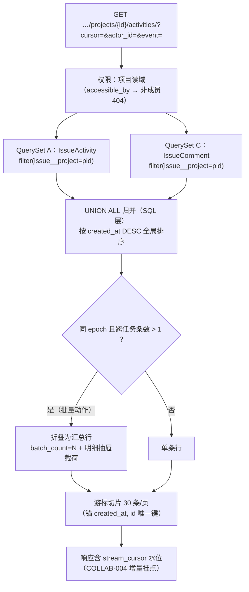
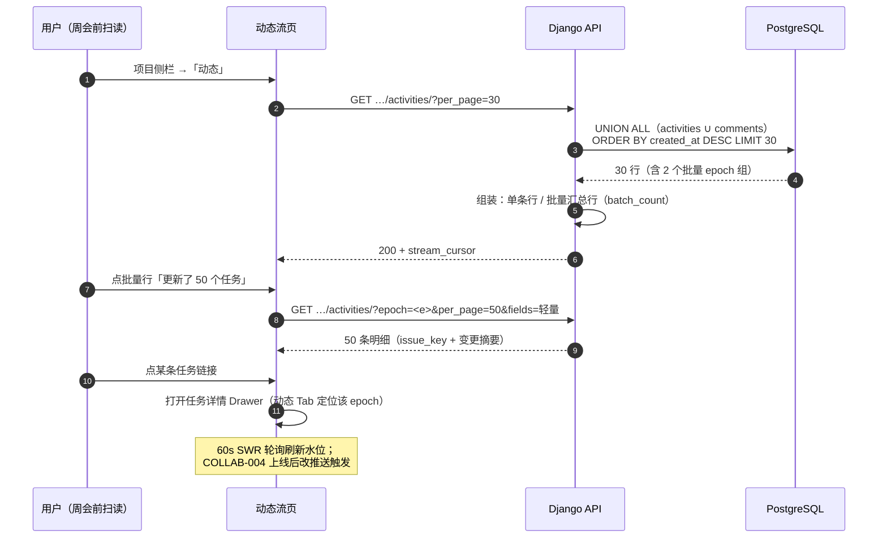
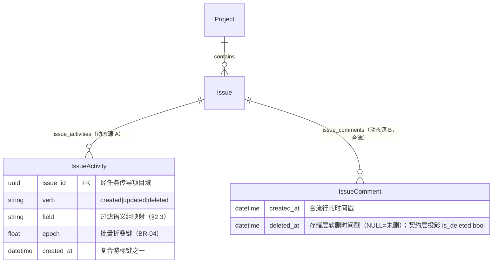

# 项目动态流 / 任务动态时间线

| 元信息项 | 内容 |
| --- | --- |
| 文档编号 | COLLAB-003 |
| 所属迭代 | Sprint 3：高级视图 + 实时协作（第 5 周） |
| 优先级 | P2（标准版完整级） |
| 所属模块 | M8-COLLAB｜实时协作与通知 |
| 文档状态 | 待评审（Draft） |
| 最后更新日期 | 2026-09-01 |
| 上游依据 | `docs/需求文档.md` §3.8（项目动态流、任务动态时间线）、§8.2 协作通知 P2 列 |
| 前置依赖 | **`TASK-010`（全操作留痕管道——本视图是其首个跨任务消费方）**、`TASK-002~009`（各事件源已埋点）、`COLLAB-001`（IssueComment 表与评论时间线合并渲染）、`PROJ-002`（项目成员域 = 动态可见域） |
| 下游依赖 | `COLLAB-004`（WebSocket `activity.appended` 实时增量——事件名与其 §2.3 事件协议统一：推送仅携带新 `stream_cursor` 水位，增量数据仍经本端点拉取）、`RPT-002`（P2 末项目统计消费同源事件）、`INTG-002`（P2 末 Webhook 事件源）、`AUTH-010`（P3 全站审计视图复用聚合端点模式） |
| 架构基线 | [`unified-issue-model.md`](../architecture/unified-issue-model.md) §2.10（IssueActivity / epoch 分组 / 表体积控制）；[`api-conventions.md`](../architecture/api-conventions.md) §4（信封/游标）、§5.3（筛选）、§8（错误码）；[`rbac-permission-model.md`](../architecture/rbac-permission-model.md) §6（第三层：DB 行级过滤） |
| 竞品参考 | Plane（workspace/project 级 activity 端点 + 前端 recent activities 流） · Ones（项目时间线 + 全局动态企业视图） |
| 工作量估算 | 后端 1.5 人日 / 前端 3 人日 / 联调与测试 1 人日，合计 **5.5 人日** |

> **范围声明**：交付**项目级动态流页**（单一信息流：全部成员对项目内任务的一切变更）与既有任务详情「动态」Tab 的数据分工固化；跨项目 Workspace 全局动态流（P3 `AUTH-010` 审计体系联动）、动态的导出与合规留存（P4）、消息管控（P3）不在范围。

---

## 1. 概述

### 1.1 功能定位

任务详情的动态 Tab 回答「**这个任务**经历过什么」；项目动态流回答「**这个项目**正在发生什么」——周会前的五分钟扫读、新成员入职的第一屏认知、管理者的异常嗅觉（「为什么凌晨两点有人在改线上配置任务？」）都消费这个视图。

工程定位同样重要：本视图是 `TASK-010` 留痕管道的**第一个跨任务消费方**。单任务时间线按 `issue_id` 点查即可；跨任务流则必须解决**项目维度的取数与分页**——`issue_activities` 表没有 `project_id` 列（经 `issue` JOIN 传导），本迭代的聚合端点设计与索引评估（§4.1）直接决定 P3 全站审计视图的成本。**取数模式一次定型，后续视图全部复用。**

### 1.2 双视图数据分工（固化为契约）

| 视图 | 端点 | 数据形态 | 消费场景 |
| --- | --- | --- | --- |
| 任务动态 Tab（`TASK-010` 已交付） | `GET …/issues/{id}/activities/` | **epoch 预聚合组**（一次动作 = 一组） | 溯源单任务 |
| **项目动态流（本文档）** | `GET …/projects/{id}/activities/` | **逐条流水 + 轻量相邻合并** | 扫读全局 |

> 为什么项目流不做 epoch 全聚合：跨任务场景下「同 epoch」不再意味着「同一视觉焦点」（50 个任务的批量更新在单任务里是一组，在项目流里应该是一条汇总 + 可展开明细）——两层结构（汇总行 + 明细抽屉）比单层组更适合扫读。任务级预聚合端点保持不变，两形态**按消费场景分工而非相互替代**。

### 1.3 交付内容

| # | 能力 | 说明 |
| --- | --- | --- |
| 1 | 项目动态聚合端点 | 跨任务、时间倒序、游标分页（30 条/页）；`?actor_id=` / `?event=`（verb+field 语义化过滤） |
| 2 | 批量动作汇总行 | 同 epoch 跨任务的多条记录聚合为「张三 批量更新了 50 个任务」+ 明细抽屉 |
| 3 | 评论合流 | 评论（`IssueComment`）与 Activity 归并渲染（`TASK-010` BR-05 分工的服务端实现——评论不落 Activity，时间线 UNION 两表按 `created_at` 归并） |
| 4 | 动态流页 UI | 项目侧栏「动态」入口 → 单列信息流：人 + 动作 + 任务链接 + 时间；过滤条；空态/骨架 |
| 5 | 实时增量挂点 | 响应含 `stream_cursor`（最新事件水位），`COLLAB-004` WebSocket `activity.appended` 到达后增量拉取（本迭代仍 60s SWR 轮询） |
| 6 | 索引与性能基线 | 项目维度取数的执行计划验证（10 万任务 / 百万 Activity 数据集 P95 < 150ms） |

### 1.4 关键约定：可见域 = 项目读权限

动态是**派生数据**：项目对谁可读，其动态就对谁可见。判定不新建模型——聚合端点入口以 `Project.objects.accessible_by(user)` 收口项目读域（`PROJ_VIEWER`+ 可读全部项目动态；被移出项目的成员动态亦不可见，404），流内再按项目域**整圈**取任务 ID（含软删/归档任务——BR-06/07 的审计保留语义，与默认 Manager 软删过滤的调和见 §4.3.1）。这继承 `rbac-permission-model.md` §6 第三层 DB 行级过滤（`accessible_by`），杜绝「项目看不见但动态能看见」的越权缝隙。

### 1.5 范围边界

| 能力 | 本文档（P2） | 归属 |
| --- | --- | --- |
| 项目动态流页 + 聚合端点 + 过滤 | ✅ | — |
| 批量动作汇总 + 明细抽屉 | ✅ | — |
| 评论合流渲染 | ✅（服务端 UNION 归并） | — |
| 任务详情动态 Tab | `TASK-010` 已交付（本迭代零改动，仅分工固化） | — |
| Workspace 全局动态流 | ❌ | P3 `AUTH-010`（全站审计联动） |
| 动态搜索 / 导出 / 合规留存 | ❌ | P4 `FILE-006` |
| 消息管控（静默 / 强制通知策略） | ❌ | P3 |
| 个性化动态订阅（按人/按标签关注流） | ❌ | P3+（`WF-003` 自动化联动评估） |

### 1.6 前置依赖

| 依赖 | 内容 | 阻塞原因 |
| --- | --- | --- |
| `TASK-010` | 全事件矩阵 + epoch 分组 + 预聚合端点 + 管道幂等 | 无事件源则无流 |
| `COLLAB-001/002` | `IssueComment` 表 + 两层评论结构 | 评论合流的第二数据源 |
| `PROJ-002` / `rbac §6` | `accessible_by` 项目域过滤 | 可见域判定 |
| `TASK-003` | 游标分页与筛选白名单机制 | 端点契约复用 |

### 1.7 竞品参考

| 竞品 | 参考点 | 处置 |
| --- | --- | --- |
| Plane | `…/workspaces/{slug}/activities/` 与项目级 recent activities 端点；前端首页信息流 | 端点形态对齐；**补齐其缺失的批量汇总行**（Plane 批量操作逐条刷屏） |
| Plane | activity 与 comment 分离的两 Tab | 采纳「任务级分离 / 项目级合流」的折中（§1.2） |
| Ones | 项目时间线 + 组织级动态视图（管理层驾驶舱） | P3 `AUTH-010` 复用聚合模式扩展全局视图 |

---

## 2. 业务逻辑

### 2.1 动态流取数与合流全景



### 2.2 单条动态的渲染时序（打开动态流页）



### 2.3 事件语义化过滤表（`?event=` 取值）

| event 过滤值 | 匹配（verb, field） | 场景 |
| --- | --- | --- |
| `created` | verb=created | 新增了什么 |
| `state` | updated, state | 流转追踪（周会高频） |
| `assignees` | updated, assignees | 人员变动 |
| `priority` / `dates` / `estimate` | updated, 对应标量族 | 计划变更 |
| `custom_fields` | updated, field LIKE `cf_%` | 字段维度审计 |
| `relations` / `parent` | updated, 对应字段 | 结构变更 |
| `worklog` | updated, worklog | 工时动态 |
| `archived` | updated, archived_at | 归档/恢复 |
| `deleted` | verb=deleted | 删除审计 |
| `comment` | 合流源=comment | 只看讨论 |

> 过滤值为**语义组**而非裸字段名——把 `cf_*` 前缀族、标量族收拢为人类可理解的类别，前后端同表维护（写入 `packages/types` 与 FilterSet 白名单，CI 一致性校验同 `AUTH-005` 模式）。

### 2.4 业务规则表

| 编号 | 规则 | 判定位置 | 违反后果 |
| --- | --- | --- | --- |
| BR-01 | 可见域 = 项目读权限（`accessible_by`）；非成员/不可见项目 404（存在性隐藏） | Permission + QuerySet | 404 `RESOURCE_NOT_FOUND` |
| BR-02 | 动态只读：无任何写端点；派生数据不可编辑（继承 `TASK-010` BR-09） | API 面 | 405 |
| BR-03 | 合流规则：Activity 与 Comment 在 SQL 层 `UNION ALL` 归并、全局时间排序——**不在应用层二次排序**（数据量下内存排序不可控） | ViewSet | — |
| BR-04 | 批量折叠：同 `epoch` 且**跨 ≥2 个任务**的多条 Activity 折叠为汇总行（`batch_count`）；同任务同 epoch 不折叠（那是任务级一组，单条行直出） | ViewSet | — |
| BR-05 | 明细抽屉按 `?epoch=` 拉取（复用本端点 + epoch 参数），仅返回摘要字段（issue_key/name/变更行），不重复全字段 | ViewSet | — |
| BR-06 | 软删任务的动态**保留在流中**（行内任务链接置灰「已删除」；点击不跳转）——审计完整性优先于导航体验；与 BR-01 可见域的调和（项目入口收口 + 整圈取数）见 §4.3.1 | ViewSet + 前端 | — |
| BR-07 | 归档任务的动态保留（链接可跳转，详情只读态呈现） | 前端 | — |
| BR-08 | 过滤白名单：`event` 取值限于 §2.3 表；未知值 400 `VALIDATION_INVALID_PARAM`（不静默忽略——过滤语义错误必须暴露） | FilterSet | 400 |
| BR-09 | `actor_id` 过滤仅限项目成员域内用户；域外 ID 返回空集（不 404——过滤是缩小不是寻址） | FilterSet | — |
| BR-10 | 游标锚 `(created_at, id)` 唯一键序列（两源 UNION 后必须显式复合键，防同秒记录漂移/重复）；锚编码进 `value:offset:is_prev` 三段式的规范见 §4.2.1 要点 5 | 分页器 | — |
| BR-11 | 每页 30 条（`per_page` 上限 50）；明细抽屉单次 ≤100 | 分页器 | 静默截断 + `meta.degraded` |
| BR-12 | `stream_cursor` = 首页最新一条的 `(created_at, id)` 水位；仅首页响应携带（增量拉取的起点契约，`COLLAB-004` 消费） | ViewSet | — |
| BR-13 | 系统事件（复制/归档/自动化）以 `⚙系统` 或规则名展示，actor 为空时归入系统行 | 前端 | — |
| BR-14 | 性能门禁：10 万任务 / 100 万 Activity 数据集，默认首页与过滤查询 P95 < 150ms（执行计划必须索引驱动，§4.1.2） | CI 基准 | 不达标阻塞发布 |

### 2.5 异常处理表

| 异常场景 | 触发条件 | HTTP / 错误码 | 前端表现 | 后端处理 |
| --- | --- | --- | --- | --- |
| 项目不可见 | 非成员访问 | 404 `RESOURCE_NOT_FOUND` | 通用 404 页 | 存在性隐藏（BR-01） |
| 非法 event 值 | 白名单外 | 400 `VALIDATION_INVALID_PARAM` | 过滤条红字提示 | FilterSet |
| 非法游标 | 解码失败 | 400 `VALIDATION_INVALID_CURSOR` | 回到首页 | 分页器 |
| 软删任务链接 | 流中点击已删任务 | — | 行置灰、点击 Toast「该任务已删除」 | 前端 |
| 明细抽屉空 | epoch 参数无效/已被清理 | 200 空集 | 抽屉「明细已不可用」 | — |
| 流暂时为空 | 新项目 | — | 空态插画「项目还没有动静」 | — |
| 大批量折叠 | batch_count > 100 | — | 汇总行显示「更新了 100+ 个任务」 | 截断计数 |

### 2.6 边界条件表

| 边界场景 | 限制值 | 超出处理方式 |
| --- | --- | --- |
| 单页条数 | 30（上限 50） | 静默截断 + degraded |
| 明细抽屉 | 100 | 「仅显示前 100 条」 |
| 批量折叠计数展示 | 100+ 封顶文案 | — |
| actor 过滤 + event 过滤组合 | AND 语义 | — |
| 同秒并发动态 | 复合游标键 | 无重复无漂移（BR-10） |
| 历史深度 | 无限翻页（游标） | 「加载更早」按钮式 |
| 评论合流的软删评论 | 存储层 `deleted_at` 非空（契约层投影 `is_deleted=true`） | 合流为「删除了一条评论」行（不显内容） |

---

## 3. UI/UX 设计

### 3.1 动态流页（项目侧栏入口 → 独立路由）

```
┌──────────────────────────────────────────────────────────────────────────┐
│ 动态 · RabbitProjects 标准版                    [所有人 ▾] [全部类型 ▾] ⏱  │
├──────────────────────────────────────────────────────────────────────────┤
│ 今天 · 09-05                                                            │
│                                                                           │
│ 14:32  👤张三  批量更新了 50 个任务 · 状态 → 已完成        ▸ 展开明细      │
│                                                                           │
│ 11:05  👤李四  ⏱ 在 RBT-131 填报 2h · 联调收尾              RBT-131 ↗     │
│                                                                           │
│ 10:58  💬王五  评论了 RBT-132：「@李工 网关配置看下…」        RBT-132 ↗    │
│                                                                           │
│ 09:41  ⚙系统  由 RBT-12 复制创建 RBT-141（含 3 个子任务）     RBT-141 ↗   │
│                                                                           │
│ 09:12  👤李四  RBT-130 状态 待办 → 进行中                    RBT-130 ↗    │
│ ─────────────────────────────────────────────────────────────────────── │
│ 昨天 · 09-04                                                              │
│ 17:20  👤张三  RBT-128 优先级 高 → 紧急                      RBT-128 ↗   │
│ 16:58  👤张三  将 RBT-128 指派给 李四、王五                   RBT-128 ↗   │
│ 14:02  💬李四  回复了 RBT-127 的评论：「结论是 X」             RBT-127 ↗   │
│ 10:30  👤王五  删除了 RBT-125（含 2 个子任务）                RBT-125 ✕   │
│                                                                           │
│                            [加载更早的动态]                                │
└──────────────────────────────────────────────────────────────────────────┘
  行结构：时间 · 操作者（头像+名）· 动作文案 · 任务链接（issue_key ↗）
  ✕ = 软删任务（置灰不可点）   ▸ = 批量汇总行（点开抽屉）
```

| 元素 | 规格 |
| --- | --- |
| 路由 | `/:workspaceSlug/projects/:projectId/activity`；项目侧栏「动态」固定入口（图标 `activity`） |
| 行布局 | 56px 头像列 + 内容列（动作文案 + 任务 chip）；任务 chip `font-mono text-xs` + `↗` |
| 日期分区 | 今天/昨天/M月d日 sticky 分区头（与任务动态 Tab 同组件复用） |
| 批量汇总行 | 背景浅蓝 `bg-primary-50/40`；`batch_count` 加粗；`▸ 展开明细` 打开抽屉 |
| 系统行 | `⚙系统` 灰头像；复制/归档/（P3 起自动化规则名） |
| 过滤条 | 「所有人」（成员下拉，含头像）×「全部类型」（§2.3 语义组下拉）；组合 AND；过滤态 URL 同源 |
| 时间显示 | 相对时间（5 分钟前/昨天 14:02）；hover 绝对时间 tooltip |
| 自动刷新 | 60s SWR revalidate（页面可见时）；新条到达顶部轻推动画；`COLLAB-004` 后改推送 |

### 3.2 批量明细抽屉

```
┌────────────────────────────────────────────────┐
│ 张三 · 批量更新了 50 个任务 · 今天 14:32      ✕ │
├────────────────────────────────────────────────┤
│ 变更摘要：状态 待办 → 已完成                     │
│                                                  │
│ RBT-201  修复登录页样式            ↗            │
│ RBT-202  补充导出权限测试          ↗            │
│ RBT-203  更新部署文档              ↗            │
│ …（100 条上限，剩余截断提示）                     │
└────────────────────────────────────────────────┘
  行点击 → 打开任务详情 Drawer（动态 Tab 定位该 epoch）
```

| 元素 | 规格 |
| --- | --- |
| 头部 | 操作者 + 汇总文案 + 绝对时间 |
| 变更摘要 | 同 epoch 各条 field/old/new 的交集描述（全部相同时直出；不同则「多种变更」） |
| 明细行 | issue_key + 标题 + 跳转；100 上限截断提示 |
| 数据源 | `?epoch=<e>&fields=id,issue_id,field,old_value,new_value` 轻量拉取 |

### 3.3 交互细节表

| 交互动作 | 触发方式 | 反馈效果 | 加载态 / 空态 / 失败态 |
| --- | --- | --- |---|
| 打开页面 | 侧栏点击 | 首屏 30 条 + 骨架 | 空态插画「项目还没有动静」 |
| 任务链接 | 点行/chip | 打开任务详情 Drawer（不离开流页；返回水位保留） | 软删行置灰不可点 |
| 批量展开 | 点汇总行 | 抽屉滑入 + 明细加载 | 明细失败抽屉内重试 |
| 过滤 | 下拉选择 | 流体重新拉取 + URL 同步 | 无结果「该过滤条件下暂无动态」 |
| 加载更早 | 底部按钮 | 追加 30 条（按钮式，非无限滚动） | 到底提示「没有更早了」 |
| 新动态到达 | 60s 轮询命中 | 顶部行划入（≤5 条时）；>5 条显示「N 条新动态 ↑」浮条点击刷新 | 页面不可见时暂停轮询 |
| 相对时间刷新 | 每分钟 | 文案更新（无请求） | — |

### 3.4 响应式与无障碍

| 断点 | 布局 |
| --- | --- |
| ≥ 1280px | 头像列 + 内容列 + 右侧任务 chip |
| 768~1279px | 头像缩小 40px；chip 折到文案行下 |
| < 768px | 单列；过滤条收进「⚙ 过滤」抽屉；抽屉全屏 |

无障碍：流为 `<ol>` 语义列表；每行 `aria-label` 完整朗读（「李四，今天 11 点 05 分，在 RBT-131 填报 2 小时工时」）；批量行 `aria-haspopup="dialog"`；任务 chip 为真实链接（键盘焦点可见）；日期分区头 `role="heading" aria-level=3`；新动态浮条 `aria-live="polite"`。

---

## 4. 技术架构

### 4.1 数据模型

**零新增表、零 DDL**。消费 `issue_activities`（`TASK-010` 全量点亮）与 `issue_comments`（`COLLAB-001/002`）。

**软删双层口径（全篇统一）**：存储层一律 `deleted_at datetime`（`SoftDeleteModel`，NULL=未删）；契约层（响应 JSON）一律投影为 `is_deleted bool`。下文 SQL/ORM 过滤条件写 `deleted_at IS [NOT] NULL`，序列化输出 `is_deleted`——两层各司其职，不混写。

核心工作是**项目维度取数的索引论证**：

#### 4.1.1 项目维度取数路径

`issue_activities` 无 `project_id`（经 `issue_id` JOIN 传导）。两种取数路径对比：

| 路径 | 形态 | 评估 |
| --- | --- | --- |
| A：JOIN 传导 | `activities JOIN issues ON issue_id=id WHERE issues.project_id=P ORDER BY activities.created_at DESC` | 每行过 JOIN；`ORDER BY` 在驱动表侧无法直接用 `idx_activity_issue_time`（键是 issue 前缀）——大表上有序性靠 Sort 节点，P95 不可控 |
| **B：嵌套索引下推（采纳）** | 先取项目任务 ID 集（`idx_issue_active_by_project` 覆盖），再 `WHERE issue_id = ANY(%s) ORDER BY created_at DESC LIMIT 30` | 任务集 ≤ 数千；ANY 数组扫描对 `idx_activity_issue_time` 的 issue 前缀友好；但**全局时间序仍需归并** → 配合 UNION 与游标在 SQL 层 `ORDER BY … LIMIT` 收口 |

#### 4.1.2 索引评估与决策

| 候选 | 判断 |
| --- | --- |
| 新增 `(issue_id, created_at DESC)` | **已存在**（`idx_activity_issue_time`）——路径 B 直接复用，零 DDL |
| 新增冗余列 `issue_activities.project_id` + `(project_id, created_at)` 索引 | **否决（P2）**：冗余列需双写维护（issue 不可移项目，故实为静态冗余——但 100 万行级加列+回填+索引的迁移成本，P2 的 5.5 人日预算内不成立）；P3 全站审计视图（`AUTH-010`）若基准不达标再启用该迁移，届时与表分区（P4）统筹 |
| comments 侧 | `idx_comment_issue_time`（既有）同路径 B 消费 |

**基准锚点（BR-14）**：CI 数据集 10 万任务 / 100 万 Activity / 20 万 Comment，默认首页与三类过滤查询 P95 < 150ms；执行计划断言无 Sort 节点溢出到磁盘（`EXPLAIN (ANALYZE, BUFFERS)` 门禁）。

#### 4.1.3 ER 关系（消费视角）



### 4.2 API 定义

| # | 方法 | 路径 | 描述 | 权限 | 成功码 |
| --- | --- | --- | --- | --- | --- |
| 1 | `GET` | `…/projects/{project_id}/activities/` | 项目动态流（合流 + 折叠 + 游标） | `project.read`（VIEWER+） | `200` |
| 2 | `GET` | `…/projects/{project_id}/activities/?epoch=<f>&per_page=100` | 批量明细（轻量字段） | `project.read` | `200` |

查询参数（白名单）：`?actor_id=<uuid>`、`?event=<语义组>`（§2.3 表）、`?cursor=`、`?per_page=`（≤50，明细 ≤100）、`?fields=`。

#### 4.2.1 `GET …/projects/{id}/activities/` — 动态流首页

**请求**

```http
GET /api/v1/workspaces/acme/projects/7b3e9c1a-…/activities/?per_page=30 HTTP/1.1
```

**成功响应 `200`**

```json
{
  "status": "success",
  "data": [
    {
      "kind": "batch",
      "epoch": 1788589920000,
      "actor": { "id": "6c7d…", "display_name": "张三", "avatar_url": null },
      "summary": "批量更新了 50 个任务",
      "change_brief": "状态 待办 → 已完成",
      "batch_count": 50,
      "created_at": "2026-09-05T06:32:00.000Z"
    },
    {
      "kind": "activity",
      "id": "9f8e7d6c-…",
      "epoch": 1788577500000,
      "actor": { "id": "2b3a…", "display_name": "李四", "avatar_url": null },
      "verb": "updated", "field": "worklog",
      "text": "⏱ 填报 2h · 联调收尾",
      "issue": { "id": "b2c3…", "issue_key": "RBT-131", "name": "导出限流配置",
                 "is_deleted": false, "is_archived": false },
      "created_at": "2026-09-05T03:05:00.000Z"
    },
    {
      "kind": "comment",
      "id": "cm1b2c3d-…",
      "actor": { "id": "a2b3…", "display_name": "王五", "avatar_url": null },
      "text": "评论：@李工 网关超时配置看下 upstream…",
      "reply_to": "cm0a1b2c-…",
      "issue": { "id": "8a1f…", "issue_key": "RBT-132", "name": "报表页 504 修复",
                 "is_deleted": false, "is_archived": false },
      "created_at": "2026-09-05T02:58:00.000Z"
    },
    {
      "kind": "activity",
      "id": "1a2b3c4d-…",
      "epoch": 1788572460000,
      "actor": null,
      "verb": "created", "field": null,
      "text": "由 RBT-12 复制创建（含 3 个子任务）",
      "is_system": true,
      "issue": { "id": "f0a1…", "issue_key": "RBT-141", "name": "导出功能 (副本)",
                 "is_deleted": false, "is_archived": false },
      "created_at": "2026-09-05T01:41:00.000Z"
    }
  ],
  "meta": {
    "next_cursor": "eyJhIjoiMjAyNi0wOS0wNVQwMTo0MTowMC4wMDBaIiwiaSI6IjFhMmIzYzRk…J9:1:0",
    "prev_cursor": null,
    "next_page_results": true, "prev_page_results": false,
    "count": 4, "total_count": 1284, "total_pages": 43, "page": 1, "per_page": 30,
    "stream_cursor": "2026-09-05T06:32:00.000Z:e5f60713-…"
  }
}
```

**契约要点**：

1. `kind ∈ {activity, comment, batch}` 三态行；`batch` 行无 `issue`（跨任务）；
2. `stream_cursor` 仅首页携带（BR-12）——`(created_at, id)` 水位串，`COLLAB-004` 增量拉取起点；首页首行为 batch 行时，水位取其底层**最新一条** Activity 的锚（汇总行本身无 id）；
3. `issue` 内联 `is_deleted/is_archived`（存储层 `deleted_at/archived_at` 的契约层投影，§4.1 双层口径）供前端链接态渲染（BR-06/07）；软删任务的动态**保留**在流中；
4. `total_count` > 50,000 时降级估算 + `total_count_estimated: true`（`api-conventions` §6.4）；
5. **游标三段式语义与 keyset 锚编码（BR-10 的编码落地）**：沿用 [`api-conventions.md`](../architecture/api-conventions.md) §6.2 `value:offset:is_prev` 外壳——`value` 段为**作用域限定变体**（同 `BOARD-002` §4.3.2 组内游标先例，多绑定锚与过滤指纹）：`cursor = base64url(锚载荷) : offset : is_prev`，锚载荷 `{"a":"<本页末行 created_at>","i":"<末行 id>","f":"<过滤指纹>"}`（`f` = 归一化 `actor_id/event` 参数的 sha1 前 8 位，过滤变更后旧游标即失效）；`offset` 段为页序号（§6.2 示例流程口径，供 `meta.page`/`total_pages` 计算）；`is_prev` 恒 `0`——按钮式「加载更早」仅向后翻页，`prev_cursor=null` + `prev_page_results=false` 为 `TASK-010` 同款显式豁免，`meta` 必含 9 字段仍齐备（§6.3）。服务端解码/校验失败（Base64 损坏、锚字段缺失、`offset` 与锚偏移不一致、`f` 与当前过滤不符）一律 `400 VALIDATION_INVALID_CURSOR`（`BOARD-002` 统一口径——不作静默重解释，前端回首页重拉）。

**失败响应 `400`（非法 event 值）**

```json
{
  "status": "error",
  "error": {
    "code": "VALIDATION_INVALID_PARAM",
    "message": "查询参数非法",
    "details": [{ "field": "event", "code": "NOT_A_CHOICE",
                  "message": "可用值：created / state / assignees / …" }],
    "request_id": "01JCC3C7V1FX5Z9A3E2G4H5I6J"
  }
}
```

**失败响应 `404`（项目不可见）**：与项目详情同构（`RESOURCE_NOT_FOUND`，四态一致）。

#### 4.2.2 批量明细（`?epoch=`）

**成功响应 `200`（节选）**

```json
{
  "status": "success",
  "data": [
    { "issue_id": "d1e2…", "issue_key": "RBT-201", "name": "修复登录页样式",
      "field": "state", "old_value": "待办", "new_value": "已完成" },
    { "issue_id": "d2e3…", "issue_key": "RBT-202", "name": "补充导出权限测试",
      "field": "state", "old_value": "待办", "new_value": "已完成" }
  ],
  "meta": { "count": 2, "total_count": 50, "truncated": false, "limit": 100 }
}
```

### 4.3 核心逻辑

#### 4.3.1 合流取数（SQL 层 UNION ALL，零应用层排序）

```python
# apps/api/plane/db/services/activity_stream.py
STREAM_SQL = """
    SELECT * FROM (
        SELECT a.id, 'activity' AS kind, a.actor_id, a.verb, a.field,
               a.old_value, a.new_value, a.comment AS text, a.epoch,
               a.issue_id, a.created_at
          FROM issue_activities a
         WHERE a.issue_id = ANY(%(issue_ids)s)
           AND a.deleted_at IS NULL
           {activity_filters}
        UNION ALL
        SELECT c.id, 'comment' AS kind, c.actor_id,
               NULL, NULL, NULL, NULL, NULL,
               CASE WHEN c.deleted_at IS NOT NULL
                    THEN '删除了一条评论' ELSE left(c.comment_stripped, 80) END,
               NULL, c.issue_id, c.created_at
          FROM issue_comments c
         WHERE c.issue_id = ANY(%(issue_ids)s)
           {comment_filters}
    ) stream
     ORDER BY stream.created_at DESC, stream.id DESC
     LIMIT %(limit)s
"""
# activity_filters：按 event 语义组拼（verb/field/LIKE 'cf_%' 族）
# comment_filters：actor_id 过滤（event=comment 时启用）
# 游标翻页：外包一层 WHERE (created_at, id) < (%(c_at)s, %(c_id)s) 复合键比较
# 锚编解码见 §4.2.1 要点 5（value 段 = base64url 锚载荷；损坏/指纹不符 → 400 VALIDATION_INVALID_CURSOR）


def project_activity_stream(*, project, user, filters: dict, cursor=None) -> dict:
    # BR-01 可见域：项目读权限在入口一次收口（rbac §6 第三层——非成员/不可见项目 404）
    project = get_object_or_404(Project.objects.accessible_by(user), pk=project.id)
    issue_ids = list(             # 项目域整圈取任务 ID：含软删（BR-06）与归档（BR-07）
        Issue.all_objects          # 全量 Manager（不滤软删，TASK-009 回收站同源）
        .filter(project_id=project.id)
        .values_list("id", flat=True))
    rows = _execute_stream_sql(issue_ids, filters, cursor, limit=filters["per_page"])
    return assemble_stream(rows)                # §4.3.2 折叠装配
```

> `issue_ids` 数组上限保护：单项目任务 > 5000 时改分片取数（chunk 2000 多轮归并——CI 基准数据集已覆盖该分支，BR-14 的一部分）。

> **软删调和（BR-01 × BR-06）**：`Issue.objects` 默认 Manager 滤软删是**任务 CRUD 列表语义**（rbac §6.2 `get_queryset()`）；本流是**审计语义**（软删动态保留展示）——故可见域判定上移到项目入口（`Project.objects.accessible_by(user)` → 404），流内改用 `Issue.all_objects` 按项目域整圈取 ID。软删仅置 `deleted_at`、`project_id` 归属不变（`TASK-009`），不存在「项目不可见但经软删任务动态泄漏」的缝隙；归档（BR-07）同理。

#### 4.3.2 批量折叠装配（页内后处理）

```python
def assemble_stream(rows: list) -> list[dict]:
    """BR-04：同 epoch 且跨 ≥2 任务的连续 Activity 折叠为 batch 行。

    - 相邻性：rows 已按时间倒序——同 epoch 记录物理相邻（epoch 单调于时间）
    - 同任务同 epoch 不折叠（任务级一组语义，直出为带 issue 的单行）
    - batch 行聚合 change_brief：全部相同→直出；不同→「多种变更」
    """
    out, i = [], 0
    while i < len(rows):
        run = [rows[i]]
        while (i + 1 < len(rows)
               and rows[i + 1]["kind"] == "activity"
               and run[0]["kind"] == "activity"
               and rows[i + 1]["epoch"] == run[0]["epoch"]):
            i += 1
            run.append(rows[i])
        if len(run) > 1 and len({r["issue_id"] for r in run}) > 1:
            out.append(_batch_row(run))          # 折叠
        else:
            out.extend(_plain_row(r) for r in run)
        i += 1
    return out
```

#### 4.3.3 明细抽屉查询

```python
def batch_detail(*, project, epoch: float, limit=100) -> dict:
    """?epoch= 明细：轻量字段直查（不与 comments 合流）"""
    rows = (IssueActivity.objects
            .filter(issue__project_id=project.id, epoch=epoch,
                    deleted_at__isnull=True)
            .select_related("issue")
            .order_by("issue__sequence_id")
            .values("issue_id", "issue__sequence_id", "issue__name",
                    "field", "old_value", "new_value")[:limit])
    ...
```

#### 4.3.4 Celery / beat

无新增任务——流为纯读派生（管道投递属 `TASK-010`）。唯一定时项：`stream_cursor` 水位无需持久化（响应即时计算）。`COLLAB-004` 的事件扇出挂点在 `TASK-010` Worker 尾部（本迭代预留不启用）。

### 4.4 前端实现

- `ActivityStreamStore`（`packages/shared-state`）：`entries: StreamRow[]`（SWR key `project:{id}:stream:{cursor}`）；`streamCursor` 水位；过滤态换 key（URL 同源）。
- 60s `refreshInterval` + 页面可见性门控（`document.visibilityState`）；新条数 > 5 时聚合浮条（点击才真正刷新，避免阅读位置跳动）。
- `StreamRow` 三态渲染组件（activity/comment/batch）；任务 chip 复用 `IssueLinkChip`（软删/归档态内联）。
- `BatchDetailDrawer`：SWR key `project:{id}:stream:epoch:{e}`；行点击 `openIssueDrawer(id, {tab: 'activity', epoch})`。
- 路由返回水位保留：流页组件不卸载（Drawer 覆盖式），返回时滚动位置与游标原生保持。

---

## 5. 测试用例

### 5.1 单元测试

| 用例 ID | 测试目标 | 输入 | 预期输出 | 覆盖类型 |
| --- | --- | --- | --- | --- |
| UT-01 | 合流排序 | 混合造 Activity/Comment 同分钟 | 全局时间倒序无乱序 | 正常 |
| UT-02 | 复合游标键 | 同秒 3 条不同 id | 翻页无重复无丢失 | 边界 |
| UT-03 | 批量折叠 | 同 epoch 跨 50 任务 | 1 条 batch 行 count=50 | 正常 |
| UT-04 | 同任务不折叠 | 同 epoch 同任务 3 字段 | 3 条带 issue 单行 | 边界 |
| UT-05 | change_brief | 批量内变更不一致 | 「多种变更」 | 边界 |
| UT-06 | 软删任务保留 | 删除任务后查流 | 行在，issue.is_deleted=true | 正常 |
| UT-07 | 软删评论行 | 删除评论 | kind=comment 行文本「删除了一条评论」 | 正常 |
| UT-08 | event 白名单 | event=foo | 400 `VALIDATION_INVALID_PARAM` | 异常 |
| UT-09 | cf 族过滤 | event=custom_fields | 命中 cf_* 全部 field | 正常 |
| UT-10 | actor 域外 | 域外用户 ID 过滤 | 空集（不 404） | 安全 |
| UT-11 | 可见域 | 非成员请求 | 404（存在性隐藏） | 安全 |
| UT-12 | 明细上限 | epoch 内 150 条 | 100 + truncated | 边界 |
| UT-13 | stream_cursor | 首页/翻页响应 | 仅首页携带 | 契约 |
| UT-14 | 归档任务动态 | 归档后查流 | 保留且 is_archived=true | 正常 |
| UT-15 | 非法游标 | 乱码 cursor / 篡改锚字段 / 变更过滤后复用旧游标（指纹不符） | 400 `VALIDATION_INVALID_CURSOR`（§4.2.1 要点 5 四类失败路径逐一断言） | 异常 |

### 5.2 集成测试

| 用例 ID | 场景 | 前置条件 | 操作步骤 | 预期结果 |
| --- | --- | --- | --- | --- |
| IT-01 | 全事件上流 | 执行 §TASK-010 §1.2 全矩阵操作 | 查流 | 每操作一行（评论合流行含文本摘要） |
| IT-02 | 基准门禁 | 10 万任务/100 万 Activity/20 万 Comment | 首页 + 3 类过滤各 50 次 | P95 < 150ms；执行计划无磁盘 Sort（BR-14） |
| IT-03 | 大项目分片 | 单项目 6000 任务 | 首页 | chunk 归并结果正确且达标 |
| IT-04 | 移出成员 | 移出后访问旧链接 | GET | 404；动态不可见 |
| IT-05 | 明细抽屉闭环 | 展开批量行 | 点击明细任务 | Drawer 打开且动态 Tab 定位该 epoch |
| IT-06 | 过滤组合 | actor × event AND | 查流 | 交集结果；URL 还原 |
| IT-07 | 软删链路 | 流中点击软删任务 | — | 置灰 + Toast，无路由跳转 |
| IT-08 | 轮询增量 | 页面可见时产生新动态 | 60s 内 | 顶部划入或浮条提示 |
| IT-09 | 非法游标端到端 | 构造损坏 cursor（乱码 / 过滤变更后的旧游标） | GET `…/activities/?cursor=<损坏>` | 400 `VALIDATION_INVALID_CURSOR`（信封 request_id 可查）；前端回首页重拉 |

### 5.3 E2E 测试

| 用例 ID | 用户场景 | 操作路径 | 验收标准 |
| --- | --- | --- | --- |
| E2E-01 | 周会扫读 | 打开动态流翻两页 | 时间倒序、日期分区、相对时间正确 |
| E2E-02 | 批量追溯 | 展开批量行 → 进某任务动态 Tab | 抽屉 100 上限；定位 epoch 高亮 |
| E2E-03 | 只看状态 | 过滤 event=state | 仅流转行；URL 分享还原 |
| E2E-04 | 只看某人 | 过滤 actor=李四 | 仅其操作；头像过滤条回显 |
| E2E-05 | 权限 | 移出成员后回访 | 404 页；侧栏入口消失 |

---

## 6. 竞品深度对标

### 6.1 Plane 实现分析

- Plane 提供 workspace / 项目两级 activities 端点，前端首页有 recent activities 流——形态对齐。**两个差距本系统补齐**：① 批量操作在 Plane 流中逐条刷屏（50 次拖拽 = 50 行），本系统 epoch 折叠为汇总行 + 抽屉（BR-04，源自 `TASK-010` 的 epoch 纪律红利）；② Plane 的流与评论割裂（两个入口），本系统项目级合流 + 任务级分离的分工（§1.2）在扫读场景更完整。
- 取数上 Plane 直接 JOIN——与我们的路径 A 同构；本系统按基准数据集实测选择嵌套下推（§4.1.1），并把「冗余 project_id 列」留作 P3 有数据支撑的期权而非 P2 的预付费。

### 6.2 Ones 实现分析

- 项目时间线之上还有组织级动态与管理层驾驶舱（跨项目聚合、按部门切片）。本系统 P2 把「项目维度取数模式」一次定型（合流 SQL + 折叠 + 复合游标），P3 `AUTH-010` 扩全局视图是同模式的域放大——聚合端点的形状（kind 三态行 + stream_cursor 水位）已按可复用设计。

### 6.3 本系统设计决策

1. **派生数据只读且同权**：动态无独立权限模型，完全继承项目读域（BR-01，§1.4——任务动态可见性随项目权限传导）——少一套权限就少一类越权缝隙，审计视图的可信度来自数据源单一。
2. **排序下推 SQL、折叠留在应用**：UNION ALL + ORDER BY/LIMIT 收口数据库（内存排序不可控）；epoch 折叠是页内 O(n) 后处理（相邻性由排序保证）——两类计算各在其最擅长的层。
3. **软删/归档任务的动态保留**：审计流的价值恰在「发生过什么」，删任务抹动态等于篡改历史；导航体验用置灰降级而非数据清除（BR-06/07）。
4. **水位契约先行**：`stream_cursor` 在轮询时代就进入响应（BR-12），`COLLAB-004` 的增量推送直接消费——传输层升级不动数据契约，与 `COLLAB-001` 通知通道演进同一策略。
5. **索引决策用数据说话**：冗余列迁移（P3 期权）vs 嵌套下推（P2 采纳）由 CI 基准门禁裁定（BR-14）——把「感觉会慢」变成「测过不慢/测过要迁移」。

---

## 7. 里程碑与验收

### 7.1 交付物清单

| 类型 | 交付物 |
| --- | --- |
| Model / Migration | 零 DDL（复用 `idx_activity_issue_time` / `idx_comment_issue_time`；冗余列迁移留 P3 期权） |
| 后端 | `activity_stream.py`（合流 SQL / 折叠装配 / 明细查询 / 分片保护）、聚合端点 + `?epoch=` 明细、event 语义组白名单（前后端双源 CI 校验） |
| 前端 | 动态流页（三态行 / 日期分区 / 过滤条 / 浮条刷新）、批量明细抽屉、`ActivityStreamStore`（60s 轮询 + 水位） |
| 测试 | UT-01~15、IT-01~09、E2E-01~05、CI 基准门禁（BR-14） |

### 7.2 可操作演示的验收标准

1. 打开项目动态流：今天/昨天分区、时间倒序；评论与操作变更合流呈现；相对时间与绝对时间 hover 正确。
2. 批量拖拽 50 个任务状态后刷新：流中出现一条「批量更新了 50 个任务」汇总行（非 50 行）；展开抽屉可见明细且点击任一条直达该任务动态 Tab 对应位置。
3. 「只看状态变更」与「只看李四」组合过滤生效；过滤态 URL 分享还原；非法 event 值得到 400 与可用值提示，非法游标得到 400 `VALIDATION_INVALID_CURSOR` 并回首页。
4. 删除与归档任务后其历史动态保留在流中（链接分别置灰/可跳只读态）；软删评论显示「删除了一条评论」。
5. 被移出项目的成员访问动态流返回 404；10 万任务/100 万 Activity 基准下首页与三类过滤 P95 < 150ms（CI 报告）。
6. 页面停留期间新动态到达：≤5 条顶部划入、>5 条浮条提示；`stream_cursor` 水位在响应中可见（COLLAB-004 联调锚点）。
